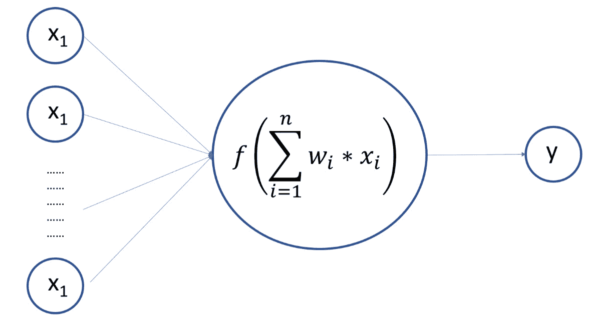
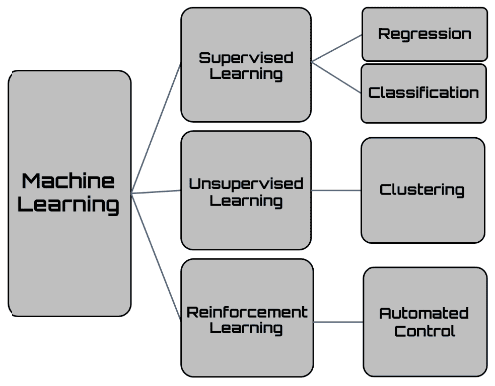

# 十一、下一步是什么？

在本章中，我们将总结本书到目前为止所涵盖的内容，以及从这一点开始接下来的步骤。您将学习如何将所获得的所有技能应用到其他项目中，以及如何在构建和部署仿真模型以及数据科学家使用的其他常见技术方面应对现实生活中的挑战。在本章结束时，您将更好地了解与构建和部署仿真模型相关的问题，以及您可以学习的其他资源和技术，以提高您的机器学习技能。

在本章中，我们将介绍以下主要主题：

*   仿真建模概念综述
*   将仿真模型应用于现实生活
*   仿真建模的下一步

# 总结仿真建模概念

在无法开发出能够有效地表示现象的数学模型的情况下，仿真模型非常有用，它仿真真实过程随时间执行的操作。仿真过程包括生成待分析系统的人工历史；随后，通过对这段人工历史的观察，可以追踪有关系统自身运行特性的信息，并据此做出决策。

使用仿真模型作为辅助决策过程的工具由来已久，并在各个领域得到广泛应用。仿真模型用于研究系统随时间的行为，并基于对系统行为的一组假设（使用数学逻辑符号关系表示）构建。这些关系是构成系统的各种实体之间的关系。模型的目的是仿真系统中的变化，并预测这些变化对真实系统的影响。例如，它们可以在模型实际构建之前的设计阶段使用。

重要提示

使用数学方法解析简单模型。解决方案由一个或多个参数组成，称为**行为****度量**。复杂模型在计算机上进行数值仿真，其中数据被视为来自真实系统。

让我们总结一下我们可以用来开发仿真模型的工具。

## 生成随机数

在仿真模型中，最终应用程序的质量严格取决于生成高质量随机数的可能性。在一些算法中，决策是基于随机选择的值做出的。随机数的定义包括通过指定其特征的连接的随机过程的定义。一个随机数的出现是因为我们不知道它是如何产生的，但一旦定义了它产生的规律，我们就可以随时复制它。

确定性算法不允许我们生成随机数序列，而只是使伪随机序列生成成为可能。伪随机序列与随机序列在严格意义上的区别在于它们是可重复的，因此是可预测的。

有多种算法可用于生成伪随机数。在[*第 2 章*](02.html#_idTextAnchor040)*理解随机性和随机数*中，我们详细分析了以下内容：

*   **线性同余生成器**（**LCG**）：该使用分段不连续线性方程生成伪随机数序列。
*   **滞后斐波那契发生器**（**LFG**）：这是基于斐波那契序列的推广。

更具体的方法被添加到这些方法中，以生成随机数的均匀分布。下图显示了 1000 个随机数在 1-10 范围内的均匀分布：

图 11.1–随机数分布图

我们分析了以下两种方法，这两种方法都可以用于从随机数的均匀分布出发推导一般分布：

*   **逆变换抽样方法：**该方法采用逆累积分布生成随机数。
*   **接受-拒绝方法：**该方法使用其密度函数图下区域内的样本。

伪随机序列返回在每个间隔中均匀分布的整数，重复周期很长，序列的一个元素与下一个元素之间的相关性很低。

为了自我评估生成随机数时获得的技能，我们可以尝试为宾果卡生成器编写一些 Python 代码。在这里，我们只是将数字限制在 1 到 90 之间，并且确保数字不能重复，并且可能性相同。[*第二章*](02.html#_idTextAnchor040)

## 应用蒙特卡罗方法

蒙特卡罗仿真是一种基于概率程序的数值方法。Vine 在统计学中被广泛用于解决存在分析困难的问题，而这些问题在其他方面并不难克服。该方法基于使用随机数对指定的概率分布进行抽样的可能性。它根据指定的概率生成分布的事件序列。实际上，不是使用随机抽取的数字样本，而是使用通过定义良好的迭代过程获得的数字序列。这些数字被称为伪随机数，因为尽管它们不是随机数，但它们的统计特性与真正的随机数相似。许多仿真方法可归因于蒙特卡罗方法，其目的是确定复杂随机现象的典型参数。

下图描述了从一组随机数分布到蒙特卡罗仿真的过程：

图 11.2–蒙特卡罗仿真程序，从一系列随机数分布到一

蒙特卡罗方法本质上是一种计算随机变量期望值的数值方法；即，无法通过直接计算轻松获得的期望值。为了获得这一结果，蒙特卡罗方法基于统计学的两个基本定理：

*   **大数定律**：许多随机因素的同时作用导致实质上的确定性效应。
*   **中心极限定理**：具有相同分布特征的多个独立随机变量之和，无论初始分布如何，都近似为正态。

蒙特卡罗仿真用于研究模型对随机生成输入的响应。

## 解决马尔可夫决策过程

马尔可夫过程是离散的随机过程，其中到下一状态的转换完全取决于当前状态。因此，它们可以称为无记忆的随机过程。马尔可夫过程的典型要素是系统发现自己的状态，以及决策者可以在该状态下执行的可用操作。这些元素确定了两组：可以在其中找到系统的状态集，以及可用于每个特定状态的操作集。决策者选择的行动决定了系统的随机响应，从而使系统进入新状态。此转换返回一个奖励，决策者可以使用该奖励来评估他们的选择，如下图所示：

图 11.3–从过渡状态返回的奖励

奖励的概念对系统未来的选择至关重要，它代表了环境对所采取行动的反应。这种反应与行动在实现目标中所决定的权重成正比：如果它导致正确的行为，它将是积极的，而如果错误的行动，它将是消极的。

马尔可夫过程中的另一个基本概念是策略：策略决定系统在决策过程中的行为。它映射了环境的状态和在这些状态下要选择的动作，代表了一组对刺激做出反应的规则或关联。在马尔可夫决策模型中，策略提供了一种解决方案，将推荐的操作与代理可以实现的每个状态相关联。如果策略在可能的操作中提供了最高的预期效用，则称为最优策略。这样，系统就不必将以前的选择保存在内存中。要做出决策，它只需要执行与当前状态关联的策略。

现在，让我们考虑一个实际应用的过程，可以根据马尔可夫模型进行处理。在小型工业中，操作机器连续工作。但是，有时由于备件的磨损，产品质量不再允许，因此必须中断活动并进行复杂的维护。据观察，劣化发生在平均 40 天的指数运行时间*Tm*之后，而维护需要平均 1 天的指数随机时间。如何用马尔可夫模型来描述该系统，以计算在稳定状态下找到工作机器的概率？

该公司无法承受机器的停机时间，因此它保留了第二台机器，以便在第一台机器需要维护时立即使用。然而，第二台机器的质量较低，因此它在平均 5 天的指数随机工作时间后会发生故障，并且需要平均 1 天的指数时间才能重新启动。一旦主机重新启动，辅助机器的使用即停止。如果二次回路在主回路重新启动前发生故障，则维修团队坚持只使用主回路，只有在主回路重新启动后，才对二次回路进行维护。如何用马尔可夫模型来描述系统，计算两台机器停止时的稳态概率？

想一想你如何利用从本书中获得的知识回答这些问题。

## 分析重采样方法

在重采样方法中，从原始数据集中随机或根据系统程序提取数据子集。其目的是通过减少系统资源的使用来近似样本分布的特征。

重采样方法是重复多次简单操作的方法，生成要分配给随机变量或随机样本的随机数。在这些操作中，随着重复操作数量的增加，它们需要更多的计算时间。它们是非常简单的实现方法，一旦实现，它们将是自动的。

这些方法从初始数据生成虚拟数据集，并从其在所有虚拟数据集上的可变性评估统计特性的可变性。这些方法在生成虚拟数据集的方式上彼此不同。在下图中，您可以看到一些由初始随机分布生成的数据集：

图 11.4–初始随机分布生成的数据集示例

不同的重采样方法可用。在本书中，我们分析了以下方法：

*   **Jackknife 技术**：Jackknife 基于计算各种子样本的感兴趣统计数据，一次只留下一个样本观察。刀切估计对于各种样本统计是一致的，例如均值、方差、相关系数、最大似然估计等。
*   **bootstrap**：bootstrap 方法的逻辑是构建未观察到的样本，但在统计上与观察到的样本相似。这是通过提取过程对观测序列重新采样实现的，我们在提取过程中重新插入观测值。
*   **置换试验**：置换试验是随机试验的一种特殊情况，使用从统计推断得出的一系列随机数。现代计算机的计算能力使其广泛应用成为可能。这些方法不需要满足关于数据分布的假设。
*   **交叉验证技术**：交叉验证是一种基于预测准确性原则的模型选择程序中使用的方法。样本分为两个子集，第一个子集（训练集）用于构建和估计，第二个子集（验证集）用于验证估计模型预测的准确性。

如果并非所有人口要素都可用，则使用抽样。例如，对过去的调查只能根据现有的历史数据进行，而这些数据往往是不完整的。

## 探索数值优化技术

许多被广泛用于解决实际问题的应用程序使用优化方法来大幅减少资源的使用。使选择的成本最小化或利润最大化是允许我们管理众多决策过程的技术。数学优化模型是优化方法的一个例子，在这个例子中，简单的方程和不等式允许我们表达评估，并避免作为替代方法特征的约束。

任何仿真算法的目标都是减少模型预测值与数据返回的实际值之间的差异。这是因为实际值和期望值之间的误差较小，表明该算法的仿真效果良好。减少这种差异仅仅意味着最小化正在构建的模型所基于的目标函数。

在本书中，我们介绍了以下优化方法：

*   **梯度下降**：该方法是针对无约束极小化提出的第一批方法之一，其基础是使用与梯度方向相反的搜索方向或反梯度。与梯度相反的方向的有趣之处在于，如果梯度是连续的，则它构成下降方向，当且仅当到达的点是一个静止点时，下降方向被取消。
*   **牛顿-拉斐逊**：此方法用于求解数值优化问题。在这种情况下，方法采用牛顿法求函数零点的形式，但适用于函数的导数。这是因为确定函数的最小点相当于确定一阶导数的根。
*   **随机梯度下降**：该方法通过引入梯度函数的近似值来解决目标函数的评估问题。在每一步中，梯度的计算仅在数据集的随机子集中使用，而不是与数据集中包含的数据相对应地计算梯度的总和。

## 采用人工神经网络进行仿真

**人工神经网络**（**ANN**）是为再现人脑的一些简单神经活动而开发的数值模型，如物体识别和语音识别。神经网络的结构由节点组成，这些节点与人脑中的神经元类似，通过加权连接相互连接，从而复制神经元之间的突触。系统输出将更新，直到通过连接权重迭代收敛。从实验活动中获得的信息被用作输入数据，结果由网络处理并作为输出返回。输入节点表示我们需要的预测变量，以便处理表示输出神经元的因变量。下图显示了人工神经元的功能：

图 11.5–人工神经元的功能

ANN 的目标是计算所有神经元输出的结果。这意味着 ANN 是一组数学函数近似值。这种类型的模型可以仿真真实系统的行为，例如在模式识别中。这是将模式/信号分配给类的过程。神经网络通过训练课程识别模式，在训练课程中，一组训练模式被反复呈现给网络，并且它们所属的每个类别都被指定。当呈现一个以前从未见过但属于其已学习模式类别的模式时，网络将能够根据从训练数据中提取的信息对其进行分类。每个模式代表多维决策空间中的一个点。该空间被划分为多个区域，每个区域都与一个类相关联。这些区域的边界由网络通过训练过程确定。

现在，我们已经回顾了本书中学习到的所有概念，让我们看看如何将它们应用于现实世界中的挑战。

# 将仿真模型应用于现实生活

我们在本书中详细分析的算法代表了仿真真实系统的有效工具。这就是为什么它们在现实生活中被广泛用于研究一种现象的可能演变，并遵循对其作出的可能选择。

让我们看一些具体的例子。

## 医疗建模

在医疗保健领域，仿真模型具有重要的权重，被广泛用于仿真系统的行为以提取知识。例如，在进行经济分析之前，有必要证明所考虑的健康干预措施的临床疗效。最佳可用来源是随机对照试验。然而，试验往往被设计为忽略经济方面，因此经济评估的关键参数通常是不存在的。因此，需要一种方法来评估疾病进展的影响，以限制成本-效果分析中的偏差。这意味着建立一个数学模型，描述疾病的自然史、干预措施对疾病自然史的影响以及成本和目标方面的结果。

最常用的技术是外推、决策分析、马尔可夫模型和蒙特卡罗仿真：

*   在外推法中，短随访期的试验结果在试验结束后被外推，并考虑各种可能的情景，一些更乐观的情况，其中假定与干预相关的益处随着时间的推移是恒定的。
*   马尔可夫模型经常用于药物经济学评价，尤其是在政府组织提出了许多成本效益评价要求之后。
*   计算治疗方案的成本和收益的另一种方法是蒙特卡罗仿真。与马尔可夫模型一样，即使在蒙特卡罗仿真中，也定义了精确的健康状态和转移概率。然而，在这种情况下，基于转移概率和随机数生成器的结果，为每个患者构建一条路径，直到患者自身达到模型设想的最终健康状态。这一过程通常在非常大的群体（甚至 10000 例）中对每个患者重复，从而提供生存时间和相关成本的分布。使用该模型获得的成本和收益的平均值与我们应用马尔可夫模型计算的值非常相似。
*   然而，蒙特卡罗仿真还提供了频率分布和方差估计，这允许您评估模型本身结果的不确定性水平。事实上，蒙特卡罗仿真通常用于对应用马尔可夫模型得出的结果进行敏感性分析。

## 金融应用中的建模

蒙特卡罗仿真通常用于预测各种金融工具的未来价值。然而，正如前面强调的，最好强调这种预测方法仅作为一种估计，因此不能提供准确的结果值。该方法的主要金融应用涉及定价期权（或一般衍生品）和评估证券投资组合和金融项目。从这一点上，很明显，他们提出了一个类比的元素。

事实上，期权、投资组合和金融项目的价值受到许多不确定性来源的影响。所讨论的仿真不适用于任何金融工具的评估。股票和债券等证券通常不采用这种方法进行估值，正是因为它们的价值从属于数量较少的不确定性来源。

另一方面，期权是衍生证券，其价值受基础功能（可能具有最多不同的内容）和众多其他因素（利率、汇率等）的影响。蒙特卡罗仿真允许您为每个变量生成伪随机值，并为所需选项指定一个值。然而，应注意的是，蒙特卡罗方法只是期权定价可用的方法之一。

继续金融工具类别，投资组合是不同证券的集合，通常具有不同的性质。投资组合面临各种风险源。现代金融中介机构的运营需求导致了旨在监控其投资组合整体风险敞口的计算方法的出现。在这种情况下，主要的方法是**风险值（VaR）**，通常使用蒙特卡罗仿真进行计算。

最终，当一家公司必须评估一个项目的盈利能力时，它必须将该项目的成本与产生的收入进行比较。初始成本通常（但不一定）是确定的。然而，产生的现金流几乎是先验的。蒙特卡罗方法允许我们通过将伪随机值归因于各种现金流来评估项目的盈利能力。

## 物理现象建模

物理模型的仿真允许您通过更改其参数对模型进行测试，从而对模型进行试验。因此，模型的仿真允许您试验模型的各种可能性，以及模型如何作为我们想法的试验和组织框架的限制。当模型工作时，可以移除脚手架。在这种情况下，也许它站起来了，或者发现了新的东西。在构建模型时，参考概念和知识，通过这些概念和知识，可以正式表示现象的真实性。

正如没有单一的方式来面对和解决问题，也没有单一的方式来构建描述给定现象行为的模型。对现实的数学描述努力保持对代表物理现象的无限、复杂和相关方面的考虑。如果对于一个物理现象来说困难已经很大，那么对于一个生物现象来说，困难就更大了。

在相关变量和非相关变量之间进行选择的需要导致这些变量之间的区别。做出这个选择要感谢想法、知识和研究模型的人所来自的学校。

随机现象渗透到日常生活中，并成为包括数学和物理在内的各个科学领域的特征。从上世纪中叶开始，随着蒙特卡罗方法的形成，对这些现象的解释经历了一次复兴。这一里程碑的实现得益于对连锁反应中神经元行为的研究与第一台计算机在电子领域取得的成果的交叉。如今，基于随机数生成的仿真方法在物理学中得到了广泛的应用。

量子力学的关键之一是确定系统的能谱。这个问题，尽管有一些复杂的情况，可以在非常简单的系统中解析地解决。然而，在大多数情况下，不存在解析解。因此，需要开发和实施能够解决描述量子系统的微分方程的数值方法。近几十年来，由于技术的发展和计算能力的巨大增长，我们能够以难以置信的高精度描述各种现象。

## 公共交通建模

近年来，对车辆交通相关问题的分析在努力发展城市内部和道路上的良好交通方面发挥着越来越重要的作用。今天的运输系统需要一个优化过程，该过程与为需求提供具体解决方案的开发相协调。通过更好的交通规划，在城市中生产更少的汽车和更多的停车机会的过程应该会减少拥堵。

事实上，严重减速和拥堵的城市交通不仅会因平均出行量的增加而给驾车者带来不便，还会降低道路交通的安全性，增加大气和噪声污染。

导致交通量增加的原因有很多，但最重要的当然是整体交通需求的强劲增长；这一增长是由于不同性质的因素造成的，如汽车的大量扩散、工业和城市地区的分散化以及公共交通服务的经常缺乏。

为了试图解决城市交通问题，我们需要谨慎的基础设施管理和交通网络规划方案。一个重要的规划工具可以是交通系统模型，它基本上允许我们评估交通网络干预对交通系统的影响，同时也允许我们比较不同的设计方案。通过使用仿真工具，我们可以快速、经济地评估一些决策或行为问题，而这些问题不可能在真实系统上进行实验。这些仿真模型为交通部门的技术人员和决策者提供了一个有效的工具，用于评估替代设计选择的影响。这些模型允许详细分析在地方一级规划的解决方案。

有可用的仿真工具，使我们能够准确、具体地描述交通及其瞬间演变，同时考虑基础设施的几何方面和驾驶员的真实行为，这两者都与车辆和驾驶员的特征有关。仿真模型允许以较小的规模表示，因此成本相对较低，以及与新项目开发相关的影响和后果。由于不再考虑单个车辆的运动特征（流量、密度和速度），微观仿真提供了该现象的动态视觉。

## 仿真人类行为

在火灾或一般紧急情况下，对人类行为的研究存在着难以克服的困难，因为许多需要了解其数据的情况无法在实验室环境中仿真。此外，从没有意外或焦虑效应（如压力）的练习中得出的数据的可靠性，以及真实情况下可能发生的恐慌的可能性，可以认为是相对的。最重要的是，人类行为的复杂性使得很难预测对消防安全有用的数据。

科学家进行的研究表明，人们在危险和紧急情况下的行为是非常不同的。事实上，研究表明，在疏散过程中，人们通常会做与逃离火灾无关的事情，而这些事情可能占个人离开大楼所需时间的三分之二。人们通常想在撤离前知道发生了什么，因为警报不一定能传达很多有关情况的信息。

拥有一个能够再现危险情况的仿真模型对于分析人们在这种情况下的反应非常有用。一般来说，仿真疏散的模型以三种不同的方式解决这个问题：优化、仿真和风险评估。

每种方法的基本原理都会影响每种模型的特性。许多模型假设居住者尽可能高效地疏散建筑物，忽略次要活动和与疏散无关的活动。疏散期间选择的逃生路线以及人流和出口的特征被认为是最佳的。考虑大量人的模型，并将居住者作为一个同质整体，因此不考虑个体的具体行为，趋向于这些方面。

# 仿真建模的下一步

在人类历史的大部分时间里，人们有理由认为，当你死后，世界将不会与你出生时有显著的不同。在过去 300 年中，这一假设越来越过时。这是因为技术进步在不断加快。技术进步转化为比前一代更好的下一代产品。因此，该产品是开发下一阶段进化过程的更高效和有效的方法。这是一个正反馈电路。换句话说，我们正在使用更强大、更快的工具来设计和构建更强大、更快的工具。因此，进化过程的进展速度随着时间呈指数级增长，而速度、经济性和总体实力等好处也随着时间呈指数级增长。随着进化过程变得更加有效和/或高效，更多的资源被用来鼓励这一过程的进展。这转化为第二级指数增长；也就是说，指数增长率本身呈指数增长。

这一技术进步也影响到数值仿真领域，必须与用户对更高性能和更简单模型的需求进行比较。仿真模型的开发需要模型构建、实验和分析方面的重要技能。如果我们想取得进展，我们需要对模型构建过程进行重大改进，以满足决策环境的需求。

## 提高计算能力

数值仿真由计算机执行，因此更高的计算能力使仿真过程更有效。计算能力的演变受**摩尔定律**的制约，该定律以英特尔创始人的名字命名，该创始人预测了计算能力演变的最重要定律之一：每 18 个月，芯片产生的计算能力就会翻倍，而价格则会减半。

说到数值仿真，计算能力就是一切。今天的硬件架构与几年前没有太大的不同。唯一真正改变的是处理信息的能力。在数值仿真中，信息是经过处理的：情况越复杂，涉及的变量越多。

根据摩尔定律，**中央处理器**（**CPU**）的进化始终满足了软件执行所需的不断增长的处理能力和输入数据量的增加。然而，最近，CPU 计算能力的增长已经放缓，编程平台的发展提出了新的性能要求，这些性能要求与这些 CPU 的霸主地位形成了强烈的不连续性，新的硬件体系结构在服务器和设备端的强扩散。此外，智能应用程序的分布日益扩大，需要为各种计算平台开发特定的体系结构和硬件组件。

创建了**图形处理单元**（**GPU**）以执行繁重而复杂的计算。它们由数千个小型高效内核组成的并行体系结构组成，设计用于同时管理多个操作。**现场编程网关阵列**（**FPGA**）架构为集成电路，设计为在生产后根据客户具体要求进行配置。FPGA 包含一系列可编程逻辑块和可重新配置互连的层次结构，允许这些块“连接在一起”

硬件的进步不仅影响计算能力，还影响存储容量。我们无法在没有物理位置容纳信息的情况下以 1 GBps 的速度发送信息。如果不存储几 TB 大小的数据集，我们就无法训练仿真体系结构。创新意味着通过利用不断提高效率的组件，发现以前没有的机会。创新意味着看看通过将三个加速器的更高性能版本结合起来可以做些什么。

## 基于机器学习的模型

机器学习是计算机科学的一个领域，它允许计算机学习执行任务，而不必为执行任务明确编程。机器学习是从人工智能领域的模式识别和理论计算学习研究发展而来的，它探索了算法的研究和构造，使计算机能够从可用数据中学习信息，并根据所学知识预测新信息。通过建立一个模型，自动学习从观察中预测新数据，这些算法克服了严格静态指令的经典范例。机器学习主要用于设计和实现特别算法不可行或不方便的计算问题。

机器学习与数值仿真领域有着深刻的联系，它提供了方法、理论和应用领域。事实上，许多机器学习问题都是关于最小化特定示例集（训练集）的损失函数的问题。此函数表示训练期间模型预测的值与每个示例的预期值之间的差异。最终目标是开发一个能够在一组前所未有的实例中正确预测预期值的模型，从而最小化损失函数。这就导致了预测技能的更广泛应用。

不同的机器学习任务通常分为三大类，其特征是学习系统基于的反馈类型：

*   **监督学习**：将样本输入和期望输出呈现给计算机，目的是学习能够将输入映射到输出的一般规则。
*   **无监督学习**：计算机只提供输入数据，没有任何预期的输出，目的是学习输入数据中的某些结构。无监督学习可以表示一个目标或目的，即推断出对执行另一个机器学习任务有用的数据的显著特征。
*   **强化学习**：计算机与动态环境交互，在动态环境中必须达到一定的目标。当计算机探索问题的领域时，它会得到奖励或惩罚方面的反馈，以便引导它找到最佳解决方案。

下图显示了不同类型的机器学习算法：

图 11.6–不同类型的机器学习算法

## 仿真模型的自动生成

**自动机器学习**（**自动 ML**定义了可以自动化应用机器学习的端到端过程的应用程序。通常，技术专家在将数据提交给机器学习算法之前，必须通过一系列初步程序对数据进行处理。通过这些算法对数据进行正确分析所需的步骤需要特定的技能，而不是每个人都具备这些技能。虽然使用不同的库很容易创建基于深度神经网络的模型，但需要了解这些算法的动力学知识。在某些情况下，这些技能超出了分析师的能力，他们必须寻求行业专家的支持才能解决问题。

开发 AutoML 的目的是创建一个自动化整个机器学习过程的应用程序，以便用户能够利用这些服务。通常，机器学习专家应执行以下活动：

*   准备数据
*   选择特征
*   选择合适的模型类
*   模型参数的选择与优化
*   后处理机器学习模型
*   分析得出的结果

AutoML 自动执行所有这些操作。它提供的优点是生成更简单、更快的解决方案，这些解决方案通常优于手工设计的模型。有几种可用的 AutoML 框架，每一种框架都具有表明其优先使用的特征。

# 总结

在本章中，我们总结了我们在本书中介绍的技术。我们已经了解了如何生成随机数，并列出了生成伪随机数最常用的算法。然后，我们了解了如何基于两个基本定律：大数定律和中心极限定理的假设，应用蒙特卡罗方法进行数值仿真。然后，我们总结了马尔可夫模型所基于的概念，并分析了各种可用的重采样方法。之后，我们探索了最常用的数值优化技术，并学习了如何使用人工神经网络进行数值仿真。

随后，我们提到了数值仿真广泛应用的一系列领域，并研究了下一步将允许仿真模型发展的步骤。

在本书中，我们使用 Python 研究了各种计算统计仿真。我们从基础开始，以了解各种方法和技巧，加深对复杂主题的了解。在这一点上，使用仿真模型的开发人员将能够将他们的知识应用到工作中，对所需的实现和相关的方法采用实用的方法，以便他们在任何时候都可以操作和生产。我希望通过使用实例和自我评估问题，探索数值仿真算法，并提供相关应用的概述，详细解释一些基本概念，以帮助您根据需要制作最佳模型。