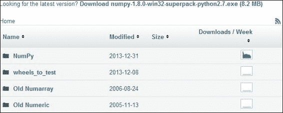
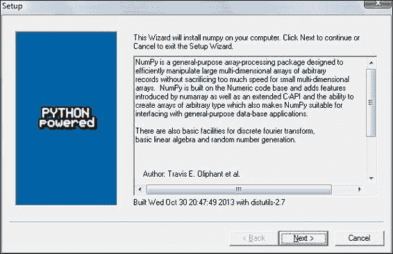
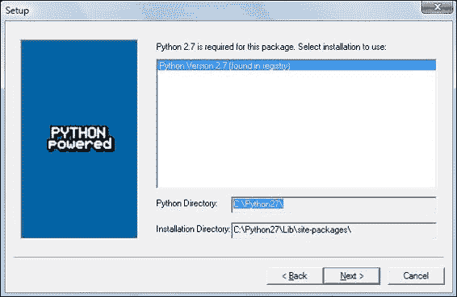
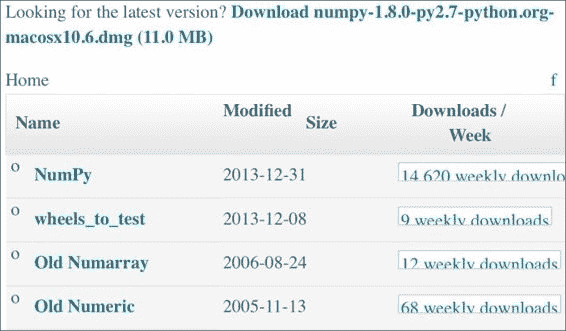
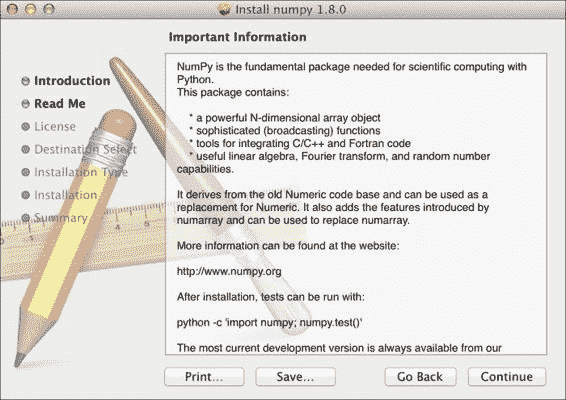

# 一、NumPy 入门

让我们开始吧。 我们将在不同的操作系统上安装 NumPy 和相关软件，并查看一些使用 NumPy 的简单代码。 正如“序言”所述，SciPy 与 NumPy 密切相关，因此您会在本章中看到 SciPy 这个名字。 在本章的最后，您将找到有关如何在线获取更多信息的指南，如果您陷入困境或不确定解决问题的最佳方法。

在本章中，我们将学习以下技能：

*   在 Windows，Linux 和 Macintosh 上安装 Python，SciPy，Matplotlib，IPython 和 NumPy
*   编写简单的 NumPy 代码
*   添加数组
*   利用在线资源和帮助

# Python

NumPy 基于 Python，因此需要安装 Python。 在某些操作系统上，已经安装了 Python 。 但是，您需要检查 Python 版本是否与要安装的 NumPy 版本兼容。 Python 有许多实现，包括商业实现和发行版。 在本书中，我们将重点介绍标准的 CPython 实现，该实现可保证与 NumPy 兼容。

NumPy 具有适用于 Windows，各种 Linux 发行版和 Mac OS X 的二进制安装程序。如果您愿意，还可以提供源代码发行版。 您需要在系统上安装 Python 2.4.x 或更高版本。 Python 2.7.6 是目前拥有的最好的 Python 版本，因为大多数科学的 Python 库都支持它。

# 在 Windows 上安装 NumPy，Matplotlib，SciPy 和 IPython

在 Windows 上安装 NumPy 是必需的，但幸运的是，我们将详细介绍简单的任务。 您只需要下载安装程序，向导就会指导您完成安装步骤。 建议安装 Matplotlib，SciPy 和 IPython。 但是，这不是享受本书所必需的。 我们将采取的行动如下：



*   选择适当的版本。 在此示例中，我们选择了`numpy-1.8.0-win32-superpack-python2.7.exe`。*   Open the EXE installer by double-clicking on it.

    

    *   现在，我们可以看到 NumPy 及其功能的描述，如上一个屏幕截图所示。 单击**下一步**按钮。*   If you have Python installed, it should automatically be detected. If it is not detected, maybe your path settings are wrong. At the end of this chapter, resources are listed in case you have problems installing NumPy.

    

    *   在此示例中，找到了 Python 2.7。 如果找到 Python，请单击**下一步**按钮，否则，单击**取消**按钮并安装 Python（如果没有，则无法安装 NumPy 蟒蛇）。 单击**下一步**按钮上的。 这是无可挽回的意义。 很好，但是最好确保要安装到正确的目录，依此类推。 现在开始真正的安装。 可能还要等一下。
    *   Install SciPy and Matplotlib with the Enthought distribution at [http://www.enthought.com/products/epd.php](http://www.enthought.com/products/epd.php).

    ### 注意

    安装人员周围的情况正在迅速发展。 [在成熟的各个阶段都存在其他替代方法](http://www.scipy.org/install.html)。 可能需要将`msvcp71.dll`文件放在您的`C:\Windows\system32`目录中。 您可以在[这个页面](http://www.dll-files.com/dllindex/dll-files.shtml?msvcp71)上获得它。 IPython 网站上提供了 [Windows IPython 安装程序](http://ipython.scipy.org/Wiki/IpythonOnWindows)。

# 在 Linux 上安装 NumPy，Matplotlib，SciPy 和 IPython

在 Linux 上安装 NumPy 和相关的推荐软件取决于您所拥有的发行版。 我们将讨论如何从命令行安装 NumPy，尽管您可能会使用图形化安装程序。 这取决于您的发行版（发行版）。 安装 Matplotlib，SciPy，和 IPython 的命令是相同的-仅软件包名称不同。 建议安装 Matplotlib，SciPy 和 IPython，但这是可选的。

大多数 Linux 发行版都有 NumPy 软件包。 我们将为一些受欢迎的 Linux 发行版进行必要的步骤：

*   从命令行运行以下指示信息以在 Red Hat 上安装 NumPy：

    ```py
    yum install python-numpy

    ```

*   要在 Mandriva 上安装 NumPy，请运行以下命令行指令：

    ```py
    urpmi python-numpy

    ```

*   要在 Gentoo 上安装 NumPy，请运行以下命令行指令：

    ```py
    sudo emerge numpy

    ```

*   要在 Debian 或 Ubuntu 上安装 NumPy，我们需要输入以下内容：

    ```py
    sudo apt-get install python-numpy

    ```

下表概述了 Linux 发行版以及 NumPy，SciPy，Matplotlib 和 IPython 的相应软件包名称：

| Linux 发行版 | NumPy | SciPy | Matplotlib | IPython |
| --- | --- | --- | --- | --- |
| Arch Linux | `python-numpy` | `python-scipy` | `python-matplotlib` | `ipython` |
| Debian | `python-numpy` | `python-scipy` | `python-matplotlib` | `ipython` |
| Fedora | `numpy` | `python-scipy` | `python-matplotlib` | `ipython` |
| Gentoo | `dev-python/numpy` | `scipy` | `matplotlib` | `ipython` |
| OpenSUSE | `python-numpy, python-numpy-devel` | `python-scipy` | `python-matplotlib` | `ipython` |
| Slackware | `numpy` | `scipy` | `matplotlib` | `ipython` |

# 在 Mac OS X 上安装 NumPy，Matplotlib 和 SciPy

您可以根据需要，在 Mac 上使用图形安装程序来安装 NumPy， Matplotlib 和 SciPy，也可以在命令行中使用端口管理器（例如 MacPorts 或 Fink）来安装 NumPy， Matplotlib 和 SciPy。

### 注意

我们可以从 [SourceForge 网站](http://sourceforge.net/projects/numpy/files/)上获取 NumPy 安装程序。 Matplotlib 和 SciPy 也存在类似的文件。 只需将前一个 URL 中的`numpy`更改为`scipy`或`matplotlib`即可。 在撰写本文时，IPython 还没有 GUI 安装程序。 下载适当的 DMG 文件，如以下屏幕截图所示； 通常最新的是最好的。 另一种选择是 [SciPy Superpack](https://github.com/fonnesbeck/ScipySuperpack)。 无论选择哪个选项，确保不影响 Apple 提供的 Python 库都不会影响到系统 Python 库的更新不会对已经安装的软件产生负面影响，这一点很重要。



我们将通过以下步骤使用 GUI 安装程序安装 NumPy ：


*   双击，即打开的框的图标，即下标以`.mpkg`结尾的下标。 我们将看到安装程序的欢迎屏幕。
*   Click on the **Continue** button to go to the **Read Me** screen, where we will be presented with a short description of NumPy, as shown in the following screenshot:

    

    *   单击**继续**按钮转到**许可证**屏幕。
    *   阅读许可证，在提示您接受许可证时，单击**继续**按钮，然后单击**接受**按钮。 继续浏览下一个屏幕，最后单击**完成**按钮。

另外，我们可以通过 MacPorts 路由或使用 Fink 安装 NumPy，SciPy，Matplotlib，和 IPython。 以下安装步骤将安装所有这些软件包。 本书中的教程仅需要 NumPy，因此请省略您不感兴趣的软件包。

*   要使用 MacPorts 进行安装，请键入以下命令：

    ```py
    sudo port install py-numpy py-scipy py-matplotlib py-ipython

    ```

*   Fink 还具有用于 NumPy 的软件包：`scipy-core-py24`，`scipy-core-py25`和`scipy-core-py26`。 SciPy 软件包为：`scipy-py24`，`scipy-py25`和`scipy-py26`。 我们可以使用以下命令安装 NumPy 和本书将在 Python 2.6 中使用的其他推荐软件包：

    ```py
    fink install scipy-core-py26 scipy-py26 matplotlib-py26

    ```

# 从源代码构建

作为最后的方法，或者如果我们想获得最新的代码，则可以从源代码构建。 在实践中，这并不难，但是根据您的操作系统，您可能会遇到问题。 随着操作系统和相关软件的迅速发展，您最好的办法就是在线搜索或寻求帮助。 在本章中，我们为寻求帮助的好地方提供了指导。

从源代码安装 NumPy 的步骤很简单，并在此处给出。 我们可以使用`.git`检索 NumPy 的源代码，如下所示：

```py
git clone git://github.com/numpy/numpy.git numpy

```

使用以下命令在`/usr/local`上安装：

```py
python setup.py build
sudo python setup.py install --prefix=/usr/local

```

要构建，我们需要一个 C 编译器，例如 GCC 和`python-dev`或`python-devel`包中的 Python 头文件。

# NumPy 数组

在完成 NumPy 的安装之后，该看看 NumPy 数组了。 在进行数值运算时，NumPy 数组比 Python 列表更有效。 NumPy 数组实际上是经过广泛优化的专用对象。 与等效的 Python 代码相比，NumPy 代码需要更少的显式循环。 这是基于矢量化的。

如果我们回到高中数学，那么我们应该记住标量和向量的概念。 例如，数字 2 是标量。 当我们加 2 和 2 时，我们正在执行标量加法。 我们可以从一组标量中形成一个向量。 用 Python 编程术语，我们将得到一维数组。 这个概念当然可以扩展到更高的维度。 对两个阵列执行加法之类的运算可以简化为一组标量运算。 在直接的 Python 中，我们将通过遍历第一个数组中的每个元素并将其添加到第二个数组中的相应元素的循环来实现。 但是，这比数学中的方法更为冗长。 在数学中，我们将两个向量的加法视为单个运算。 NumPy 数组也是这样做的方式，并且使用低级 C 例程进行了某些优化，这使这些基本操作更加有效。 在下一章中，我们将更详细地介绍 NumPy 数组。

## 添加数组

想象一下我们要添加两个向量`a`和`b`。 这里在数学上使用向量，即一维数组。 我们将在第 4 章，“在 NumPy 中进行简单的预测分析”，了解代表矩阵的专用 NumPy 数组。 例如，向量`a`保持整数`0`至`n`的平方。 如果`n`等于`3`，则`a`包含`0`，`1`或`4`。 向量`b`包含整数`0`至`n`的立方，因此，如果`n`等于`3`，则向量`b`等于`0`，`1`或`8`。 您将如何使用普通 Python 做到这一点？ 在提出解决方案之后，我们将其与等效的 NumPy 进行比较。

以下函数使用不带 NumPy 的纯 Python 解决了矢量加法问题：

```py
def pythonsum(n):
   a = range(n)
   b = range(n)
   c = []

   for i in range(len(a)):
       a[i] = i ** 2
       b[i] = i ** 3
       c.append(a[i] + b[i])

   return c
```

以下是使用 NumPy 实现的功能：

```py
def numpysum(n):
  a = numpy.arange(n) ** 2
  b = numpy.arange(n) ** 3
  c = a + b
  return c
```

请注意，`numpysum()`不需要`for`循环。 另外，我们使用了 NumPy 的`arange`函数，该函数为我们创建了一个整数`0`至`n`的 NumPy 数组。 `arange`功能已导入； 这就是为什么它以`numpy`为前缀的原因。

有趣的来了。 请记住，在“序言”中提到，关于数组操作，NumPy 更快。 但是，Numpy 快了多少？ 以下程序将通过测量`numpysum`和`pythonsum`功能的经过时间（以微秒为单位）向我们展示。 它还打印矢量和的最后两个元素。 让我们检查一下在使用 Python 和 NumPy 时我们得到的答案是否相同：

```py
#!/usr/bin/env/python

import sys
from datetime import datetime
import numpy as np

"""
 This program demonstrates vector addition the Python way.
 Run from the command line as follows

  python vectorsum.py n

 where n is an integer that specifies the size of the vectors.

 The first vector to be added contains the squares of 0 up to n.
 The second vector contains the cubes of 0 up to n.
 The program prints the last 2 elements of the sum and the elapsed time.
"""

def numpysum(n):
   a = np.arange(n) ** 2
   b = np.arange(n) ** 3
   c = a + b

   return c

def pythonsum(n):
   a = range(n)
   b = range(n)
   c = []

   for i in range(len(a)):
       a[i] = i ** 2
       b[i] = i ** 3
       c.append(a[i] + b[i])

   return c

size = int(sys.argv[1])

start = datetime.now()
c = pythonsum(size)
delta = datetime.now() - start
print "The last 2 elements of the sum", c[-2:]
print "PythonSum elapsed time in microseconds", delta.microseconds

start = datetime.now()
c = numpysum(size)
delta = datetime.now() - start
print "The last 2 elements of the sum", c[-2:]
print "NumPySum elapsed time in microseconds", delta.microseconds
```

`1000`，`2000`和`3000`矢量元素的程序输出如下：

```py
$ python vectorsum.py 1000
The last 2 elements of the sum [995007996, 998001000]
PythonSum elapsed time in microseconds 707
The last 2 elements of the sum [995007996 998001000]
NumPySum elapsed time in microseconds 171
$ python vectorsum.py 2000
The last 2 elements of the sum [7980015996, 7992002000]
PythonSum elapsed time in microseconds 1420
The last 2 elements of the sum [7980015996 7992002000]
NumPySum elapsed time in microseconds 168
$ python vectorsum.py 4000
The last 2 elements of the sum [63920031996, 63968004000]
PythonSum elapsed time in microseconds 2829
The last 2 elements of the sum [63920031996 63968004000]
NumPySum elapsed time in microseconds 274

```

显然，NumPy 比等效的普通 Python 代码快得多。 可以肯定的是，无论是否使用 NumPy，我们都会得到相同的结果。 但是，打印结果在表示形式上有所不同。 请注意，`numpysum`函数的结果没有任何逗号。 怎么会？ 显然，我们不是在处理 Python 列表，而是在处理 NumPy 数组。 在“序言”中提到，NumPy 数组是用于数值数据的专用数据结构。 我们将在第 2 章， “NumPy 基础知识”中了解有关 NumPy 数组的更多信息。

# 在线资源和帮助

NumPy 和 SciPy 的主要文档网站位于[这里](http://docs.scipy.org/doc/)。 在此网页上，我们可以在[这个页面](http://docs.scipy.org/doc/numpy/reference/)和用户指南以及一些教程中浏览 NumPy 参考。

NumPy 在[这个页面](http://docs.scipy.org/numpy/Front%20Page/)上有一个包含大量文档的 Wiki。

NumPy 和 SciPy 论坛可以在[这个页面](http://ask.scipy.org/en)上找到。

流行的 Stack Overflow 软件开发论坛上有数百个标记为`numpy`的问题。 要查看它们，请转到[这里](http://stackoverflow.com/questions/tagged/numpy)。

如果您确实遇到问题，或者想随时了解 NumPy 的发展，可以订阅 NumPy 讨论邮件列表。 电子邮件地址为`<numpy-discussion@scipy.org>`。 每天的电子邮件数量不是很高，而且几乎没有垃圾邮件可言。 最重要的是，积极参与 NumPy 的开发人员还会回答讨论组提出的问题。 完整列表可以在[这个页面](http://www.scipy.org/Mailing_Lists)中找到。

对于 IRC 用户，在 [irc：//irc.freenode.net](http://irc://irc.freenode.net) 上有一个 IRC 通道。 通道名为，称为`#scipy`，但是您也可以问 NumPy 问题，因为 SciPy 基于 NumPy，因此 SciPy 用户也了解 NumPy。 任何时候，SciPy 频道上至少有 50 名成员。

# 摘要

在本章中，我们安装了 NumPy 和其他推荐软件，这些软件将在某些教程中使用。 我们启动了向量加法程序，并确信 NumPy 具有出色的性能。 此外，我们还探索了可用的 NumPy 文档和在线资源。

在下一章中，我们将深入研究并探索一些基本概念，包括数组和数据类型。