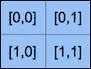
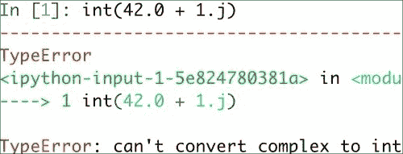
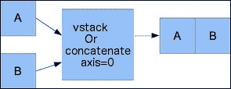
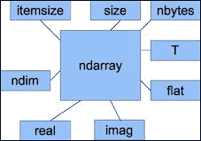
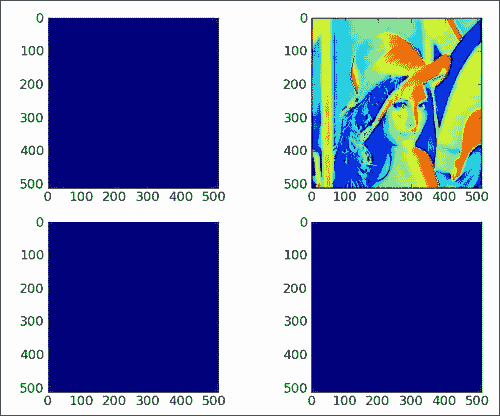
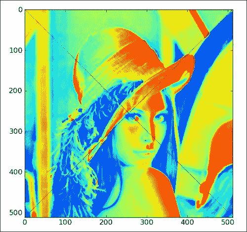
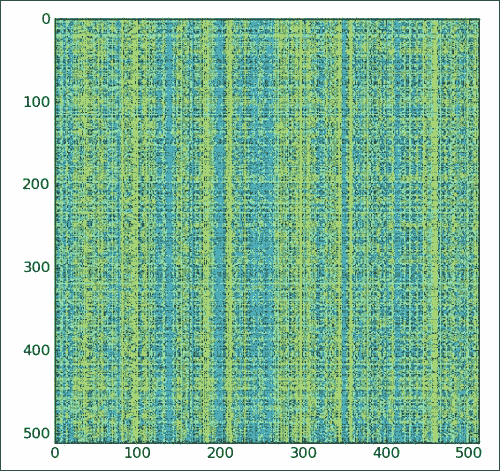
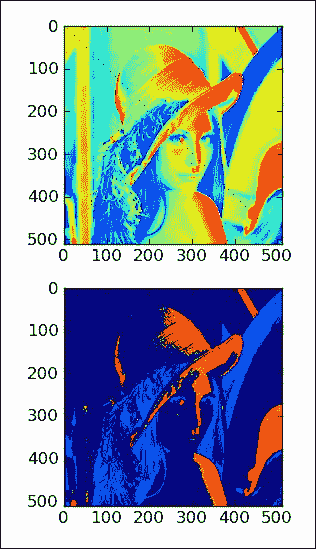

# 二、NumPy 基础

安装 NumPy 并使一些代码正常工作之后，该介绍 NumPy 的基础知识了。 本章向您介绍 NumPy 和数组的基础。 在本章的最后，您将对 NumPy 数组及其关联函数有基本的了解。

我们将在本章中介绍的主题如下：

*   资料类型
*   数组类型
*   类型转换
*   创建数组
*   索引编制
*   花式索引
*   切片
*   操纵形状

# NumPy 数组对象

NumPy 具有一个称为 `ndarray`的多维数组对象。 它由两部分组成，如下所示：

*   实际数据
*   一些描述数据的元数据

大多数阵列操作均保持原始数据不变。 更改的唯一方面是元数据。

在上一章中，我们已经学习了如何使用`arange()`函数创建数组。 实际上，我们创建了一个包含一组数字的一维数组。 `ndarray`对象可以具有多个维度。

## 使用 NumPy 数组的优点

NumPy 数组是通用的同类数组-数组中的项必须为相同类型（存在异类的特殊数组类型）。 好处是，如果我们知道数组中的项目属于同一类型，则很容易确定数组所需的存储大小。 NumPy 数组可以对整个数组执行矢量化操作。 将此与 Python 列表进行对比，通常情况下，您必须遍历该列表并一次对每个元素执行操作。 而且，NumPy 使用优化的 C API 进行这些操作，使其特别快。

NumPy 数组的索引就像在 Python 中一样，从 0 开始。数据类型由特殊对象表示。 这些对象将在本章中进一步详细讨论。

我们将再次使用`arange()`函数创建一个数组（请参见本书代码捆绑`Chapter02`文件夹中的`arrayattributes.py`文件）。 在本章中，您将看到已经导入 NumPy 的 IPython 会话中的代码片段。 以下代码段向我们展示了如何获取数组的数据类型：

```py
In: a = arange(5)
In: a.dtype
Out: dtype('int64')
```

数组`a`的数据类型为`int64`（至少在我的机器上），但是如果使用 32 位 Python，则可能会得到`int32`作为输出。 在这两种情况下，我们都处理整数（64 位或 32 位）。 除了数组的数据类型外，了解其形状也很重要。 第 1 章， “NumPy 入门”中的示例演示了如何创建向量（实际上是一维 NumPy 数组）。 向量通常用于数学中，但是大多数时候我们需要高维的对象。 让我们确定在本节前面创建的矢量的形状：

```py
In: a
Out: array([0, 1, 2, 3, 4])
In: a.shape
Out: (5,)
```

如您所见，向量具有五个元素，其值范围从`0`到`4`。 数组的`shape`属性是一个元组； 在这种情况下，是一个元素的元组，其中包含每个维度的长度。

# 创建多维数组

既然我们知道如何创建向量，就可以创建多维 NumPy 数组了。 创建矩阵之后，我们将再次想要显示其形状（请参见本书代码捆绑`Chapter02`文件夹中的`arrayattributes.py`文件），如以下代码段所示：

*   要创建多维数组，请参见以下代码：

    ```py
    In: m = array([arange(2), arange(2)])
    In: m
    Out:
    array([[0, 1],[0, 1]])
    ```

*   要显示数组形状，请参见以下代码行：

    ```py
    In: m.shape
    Out: (2, 2)
    ```

我们使用`arange()`函数创建了一个 2 x 2 的数组。 没有任何警告，`array()`功能出现在舞台上。

`array()`函数从提供给它的对象创建一个数组。 该对象必须是类似数组的，例如 Python 列表。 在前面的示例中，我们传入了一个数组列表。 该对象是`array()`函数的唯一必需参数。 NumPy 函数倾向于具有许多带有预定义默认值的可选参数。

# 选择数组元素

从时间到时间，我们将要选择数组的特定元素。 我们将看一下如何执行此操作，但首先，让我们再次创建一个 2 x 2 矩阵（请参见本书代码包`Chapter02`文件夹中的`elementselection.py`文件）：

```py
In: a = array([[1,2],[3,4]])
In: a
Out:
array([[1, 2],       [3, 4]])
```

这次是通过将列表列表传递给`array()`函数来创建矩阵的。 现在，我们将一次选择矩阵的每个项目，如以下代码片段所示。 请记住，索引从 0 开始编号。

```py
In: a[0,0]
Out: 1
In: a[0,1]
Out: 2
In: a[1,0]
Out: 3
In: a[1,1]
Out: 4
```

如您所见，选择数组的元素非常简单。 对于数组`a`，我们只使用符号`a[m,n]`，其中`m`和`n`是数组中该项的索引。



# NumPy 数值类型

Python 具有整数类型，浮点类型和复杂类型。 但是，这对于科学计算而言还不够。 实际上，我们需要更多具有不同精度的数据类型，因此，该类型的内存大小也有所不同。 因此，NumPy 具有更多的数据类型。 NumPy 数值类型的大多数以数字结尾。 该数字指示与类型关联的位数。 下表（根据 NumPy 用户指南改编）概述了 NumPy 数值类型：

| 类型 | 描述 |
| --- | --- |
| `bool` | 布尔（`True`或`False`）存储为一个位 |
| `inti` | 平台整数（通常为`int32`或`int64`） |
| `int8` | 整数，范围为 -128 至 127 |
| `int16` | 整数，范围为 -32768 至 32767 |
| `int32` | 整数，范围为`-2 ** 31`至`2 ** 31 -1` |
| `int64` | 整数，范围为`-2 ** 63`至`2 ** 63 -1` |
| `uint8` | 无符号整数，范围为 0 到 255 |
| `uint16` | 无符号整数，范围为 0 到 65535 |
| `uint32` | 无符号整数，范围为 0 到`2 ** 32-1` |
| `uint64` | 无符号整数，范围为 0 到`2 ** 64-1` |
| `float16` | 半精度浮点数，具有符号位，5 位指数和 10 位尾数 |
| `float32` | 单精度浮点数，具有符号位，8 位指数和 23 位尾数 |
| `float64`或`float` | 双精度浮点数，具有符号位，11 位指数和 52 位尾数 |
| `complex64` | 复数，由两个 32 位浮点数（实部和虚部）表示 |
| `complex128`或`complex` | 复数，由两个 64 位浮点数（实部和虚部）表示 |

对于每种数据类型，都有一个对应的转换函数（请参见本书代码包的`Chapter02`文件夹中的`numericaltypes.py`文件），如以下代码片段所示：

```py
In: float64(42)
Out: 42.0
In: int8(42.0)
Out: 42
In: bool(42)
Out: True
In: bool(0)
Out: False
In: bool(42.0)
Out: True
In: float(True)
Out: 1.0
      In: float(False)
     Out: 0.0
```

许多函数都有一个数据类型参数，该参数通常是可选的：

```py
In: arange(7, dtype=uint16)
Out: array([0, 1, 2, 3, 4, 5, 6], dtype=uint16)
```

重要的是要知道您不允许将复数转换为整数类型的数字。 尝试执行此操作会触发`TypeError`，如以下屏幕截图所示：



将复数转换为浮点类型数也是如此。 顺便提及， `j`部分是复数的虚数系数。 但是，您可以将浮点数转换为复数，例如`complex(1.0)`。 复数的实部和虚部可以分别通过`real()`和`imag()`函数提取。

## 数据类型对象

**数据类型对象**是`numpy.dtype`类的实例。 数组再次具有数据类型。 确切地说，NumPy 数组中的每个元素都具有相同的数据类型。 数据类型对象可以告诉您数据的大小（以字节为单位）。 字节的大小由`dtype`类的`itemsize`属性给出（请参见本书代码束的`Chapter02`文件夹中的`dtypeattributes.py`文件），如以下代码行所示：

```py
In: a.dtype.itemsize
Out: 8
```

## 字符代码

**NumPy 包含字符代码**，以便与 Numeric 向后兼容。 Numeric 是 NumPy 的前身。 不建议使用它们，但是此处提供了代码，因为它们会在多个位置弹出。 您应该改用`dtype`对象。 下表显示了不同的数据类型和与其关联的字符代码：

| 类型 | 字符码 |
| --- | --- |
| 整数 | `i` |
| 无符号整数 | `u` |
| 单精度浮点 | `f` |
| 双精度浮点 | `d` |
| 布尔 | `b` |
| 复数 | `D` |
| 字符串 | `S` |
| Unicode | `U` |
| 无 | `V` |

查看下面的代码以创建一个单精度浮点数数组（请参见本书代码包的`Chapter02`文件夹中的`charcodes.py`文件）：

```py
In: arange(7, dtype='f')
Out: array([ 0.,  1.,  2.,  3.,  4.,  5.,  6.], dtype=float32)
Likewise this creates an array of complex numbers
In: arange(7, dtype='D')
Out: array([ 0.+0.j,  1.+0.j,  2.+0.j,  3.+0.j,  4.+0.j,  5.+0.j,  6.+0.j])
```

## dtype 构造函数

我们有多种创建数据类型的方式。 以浮点数据为例（请参见本书代码束的`Chapter02`文件夹中的`dtypeconstructors.py`文件），如下所示：

*   我们可以使用通用的 Python 浮点数，如以下代码行所示：

    ```py
    In: dtype(float)
    Out: dtype('float64')
    ```

*   我们可以使用字符代码指定一个单精度浮点数，如以下代码行所示：

    ```py
    In: dtype('f')
    Out: dtype('float32')
    ```

*   我们可以使用双精度浮点字符代码，如以下代码行所示：

    ```py
    In: dtype('d')
    Out: dtype('float64')
    ```

*   我们可以给数据类型构造函数一个两个字符的代码。 第一个字符表示类型，第二个字符是一个数字，用于指定数据类型中的字节数（数字 2、4 和 8 分别对应于 16 位，32 位和 64 位浮点数），在以下代码行中显示：

    ```py
    In: dtype('f8')
    Out: dtype('float64')
    ```

可以通过调用`sctypeDict.keys()`找到所有数据类型名称的列表：

```py
In: sctypeDict.keys()
Out: [0, …'i2','int0']
```

## dtype 属性

`dtype`类具有许多有用的属性。 例如，我们可以通过`dtype`的属性获取有关数据类型的字符代码的信息（请参见本书代码捆绑`Chapter02`文件夹中的`dtypeattributes2.py`文件），如以下代码片段所示：

```py
In: t = dtype('Float64')
In: t.char
Out: 'd'
```

`type`属性对应于数组元素的对象类型：

```py
In: t.type
Out: <type 'numpy.float64'>
```

`dtype`的`str`属性给出了数据类型的字符串表示形式。 它从代表字节序的字符开始（如果适用），然后是字符代码，后跟与每个数组项所需的字节数相对应的数字。 这里的字节顺序表示字节在 32 位或 64 位字中的排序方式。 按照大端顺序，最高有效字节先存储，由“ >”指示。 按照小端顺序，最低有效字节首先存储，由`<`指示，如以下代码行所示：

```py
In: t.str
Out: '<f8'
```

# 创建记录数据类型

记录数据类型是一种异构数据类型-认为它表示电子表格或数据库中的一行。 以记录数据类型为例，我们将为商店库存创建一条记录。 该记录包含以 40 个字符的字符串表示的商品名称，商店中以 32 位整数表示的商品数量，最后以 32 位浮点数表示的商品价格。 以下步骤显示了如何创建记录数据类型（请参见本书代码包的`Chapter02`文件夹中的`record.py`文件）：

1.  要创建记录，请检查以下代码片段：

    ```py
    In: t = dtype([('name', str_, 40), ('numitems', int32), ('price', float32)])
    In: t
    Out: dtype([('name', '|S40'), ('numitems', '<i4'), ('price', '<f4')])
    ```

2.  要查看字段的类型，请检查以下代码段：

    ```py
    In: t['name']
    Out: dtype('|S40')
    ```

如果不为`array()`函数提供数据类型，则将假定它正在处理浮点数。 现在要创建一个数组，我们实际上必须指定数据类型，如以下代码行所示； 否则，我们将获得`TypeError`：

```py
In: itemz = array([('Meaning of life DVD', 42, 3.14), ('Butter', 13, 2.72)], dtype=t)
In: itemz[1]
Out: ('Butter', 13, 2.7200000286102295)
```

我们创建了一个记录数据类型，它是一个异构数据类型。 记录包含一个名称（作为字符串），一个数字（一个整数）和一个以浮点值表示的价格。

# 一维切片和索引

一维 NumPy 数组的切片与 Python 列表的切片一样。 我们可以从`3`到`7`的索引中选择一个数组的，以提取`3`到`6`的元素（请参见本书代码包`Chapter02`文件夹中的`slicing1d.py`文件） ），如以下代码段所示：

```py
In: a = arange(9)
In: a[3:7]
Out: array([3, 4, 5, 6])
```

我们可以以两个为步长从索引`0`到`7`中选择元素，如以下代码行所示：

```py
In: a[:7:2]
Out: array([0, 2, 4, 6])
```

就像在 Python 中一样，我们可以使用负索引并反转数组，如以下代码行所示：

```py
In: a[::-1]
Out: array([8, 7, 6, 5, 4, 3, 2, 1, 0])
```

# 操纵数组形状

另一个重复执行的任务是将数组展平。 在这种情况下，展平意味着将多维数组转换为一维数组。 在此示例中，我们将展示许多方法从展平开始操作数组形状：

*   `ravel()`：我们可以使用`ravel()`函数完成的拼合（请参见本书代码捆绑`Chapter02`文件夹中的`shapemanipulation.py`文件），如以下代码所示：

    ```py
    In: b
    Out:
    array([[[ 0,  1,  2,  3],[ 4,  5,  6,  7],[ 8,  9, 10, 11]],[[12, 13, 14, 15],[16, 17, 18, 19],[20, 21, 22, 23]]])
    In: b.ravel()
    Out:
    array([ 0,  1,  2,  3,  4,  5,  6,  7,  8,  9, 10, 11, 12, 13, 14, 15, 16, 17, 18, 19, 20, 21, 22, 23])
    ```

*   `flatten()`：适当命名的功能`flatten()`与`ravel()`相同，但是`flatten()`总是分配新的内存，而`ravel()`可能返回数组的视图。 这意味着我们可以按以下方式直接操作数组：

    ```py
    In: b.flatten()
    Out:
    array([ 0,  1,  2,  3,  4,  5,  6,  7,  8,  9, 10, 11, 12, 13, 14, 15, 16, 17, 18, 19, 20, 21, 22, 23])
    ```

*   `shape`：除了`reshape()`函数，我们还可以直接使用元组来设置形状，如下所示：

    ```py
    In: b.shape = (6,4)
    In: b
    Out:
    array([[ 0,  1,  2,  3],[ 4,  5,  6,  7],[ 8,  9, 10, 11],[12, 13, 14, 15],[16, 17, 18, 19],[20, 21, 22, 23]])
    ```

    如您所见，这将直接更改数组。 现在我们有一个 6 x 4 的阵列。

*   `transpose()`：在线性代数中，通常转置矩阵。 我们也可以使用`transpose()`函数来做到这一点，如以下代码所示：

    ```py
    In: b.transpose()
    Out:
    array([[ 0,  4,  8, 12, 16, 20],[ 1,  5,  9, 13, 17, 21],[ 2,  6, 10, 14, 18, 22],[ 3,  7, 11, 15, 19, 23]])
    ```

*   `resize()`：`resize()`方法的工作方式与`reshape()`方法相同，但是修改了它操作的数组：

    ```py
    In: b.resize((2,12))
    In: b
    Out:
    array([[ 0,  1,  2,  3,  4,  5,  6,  7,  8,  9, 10, 11],[12, 13, 14, 15, 16, 17, 18, 19, 20, 21, 22, 23]])
    ```

## 堆叠数组

阵列可以水平，深度或垂直堆叠。 为此，我们可以使用`vstack()`，`dstack()`，`hstack()`，`column_stack()`，`row_stack()`和`concatenate()`功能。 首先，让我们设置一些数组（请参见本书代码包的`Chapter02`文件夹中的`stacking.py`文件），如以下代码所示：

```py
In: a = arange(9).reshape(3,3)
In: a
Out:
array([[0, 1, 2],[3, 4, 5],[6, 7, 8]])
In: b = 2 * a
In: b
Out:
array([[ 0,  2,  4],[ 6,  8, 10],[12, 14, 16]])
```

以下是不同类型的堆叠：

*   **水平堆叠**：从水平堆叠开始，我们将形成一个`ndarray`元组并将其提供给`hstack()`函数。 显示如下：

    ```py
    In: hstack((a, b))
    Out:
    array([[ 0,  1,  2,  0,  2,  4],[ 3,  4,  5,  6,  8, 10],[ 6,  7,  8, 12, 14, 16]])
    ```

    我们可以使用`concatenate()`函数实现相同的功能，如下所示：

    ```py
    In: concatenate((a, b), axis=1)
    Out:
    array([[ 0,  1,  2,  0,  2,  4],[ 3,  4,  5,  6,  8, 10],[ 6,  7,  8, 12, 14, 16]])
    ```

    下图显示了水平堆叠：

    

*   **垂直堆叠**：通过垂直堆叠，再次形成元组。 这次，它被提供给`vstack()`函数。 可以看到如下：

    ```py
    In: vstack((a, b))
    Out:
    array([[ 0,  1,  2],[ 3,  4,  5],[ 6,  7,  8],[ 0,  2,  4],[ 6,  8, 10],[12, 14, 16]])
    ```

    `concatenate()`函数在将轴参数设置为`0`的情况下产生相同的结果。 这是`axis`参数的默认值，如以下代码所示：

    ```py
    In: concatenate((a, b), axis=0)
    Out:
    array([[ 0,  1,  2],[ 3,  4,  5],[ 6,  7,  8],[ 0,  2,  4],[ 6,  8, 10],[12, 14, 16]])
    ```

    请参阅下图进行垂直堆叠：

    

*   **深度堆叠**：当然还有使用`dstack()`和元组的深度堆叠。 这意味着沿第三轴（深度）堆叠数组列表。 例如，我们可以彼此堆叠图像数据的二维数组：

    ```py
    In: dstack((a, b))
    Out:
    array([[[ 0,  0],[ 1,  2],[ 2,  4]],[[ 3,  6],[ 4,  8],[ 5, 10]],[[ 6, 12],[ 7, 14],[ 8, 16]]])
    ```

*   **列堆叠**：`column_stack()`函数按列堆叠一维数组。 显示如下：

    ```py
    In: oned = arange(2)
    In: oned
    Out: array([0, 1])
    In: twice_oned = 2 * oned
    In: twice_oned
    Out: array([0, 2])
    In: column_stack((oned, twice_oned))
    Out:
    array([[0, 0],[1, 2]])
    ```

    二维数组以`hstack()`的方式堆叠，如以下代码所示：

    ```py
    In: column_stack((a, b))
    Out:
    array([[ 0,  1,  2,  0,  2,  4],[ 3,  4,  5,  6,  8, 10],[ 6,  7,  8, 12, 14, 16]])
    In: column_stack((a, b)) == hstack((a, b))
    Out:
    array([[ True,  True,  True,  True,  True,  True],[ True,  True,  True,  True,  True,  True],[ True,  True,  True,  True,  True,  True]], dtype=bool)
    ```

    是的，您猜对了！ 我们用`==`运算符比较了两个数组。 这不漂亮吗？

*   **行堆叠**：NumPy 当然也具有执行行堆叠的函数。 它被称为`row_stack()`，对于一维数组，它只是将数组按行堆叠为二维数组：

    ```py
    In: row_stack((oned, twice_oned))
    Out:
    array([[0, 1],[0, 2]])
    ```

    二维数组的`row_stack()`函数结果等于`vstack()`函数结果，如下所示：

    ```py
    In: row_stack((a, b))
    Out:
    array([[ 0,  1,  2],[ 3,  4,  5],[ 6,  7,  8],[ 0,  2,  4],[ 6,  8, 10],[12, 14, 16]])
    In: row_stack((a,b)) == vstack((a, b))
    Out:
    array([[ True,  True,  True],[ True,  True,  True],[ True,  True,  True],[ True,  True,  True],[ True,  True,  True],[ True,  True,  True]], dtype=bool)
    ```

## 拆分数组

可以在垂直，水平或深度方向拆分阵列。 涉及的功能是`hsplit()`，`vsplit()`，`dsplit()`和`split()`。 我们既可以将数组拆分为相同形状的数组，也可以指示拆分之后应该发生的位置。

*   **水平分割**：随后的代码将一个数组沿其水平轴分割为三个大小和形状相同的片段（请参见本书代码包`Chapter02`文件夹中的`splitting.py`文件）：

    ```py
    In: a
    Out:
    array([[0, 1, 2],[3, 4, 5],[6, 7, 8]])
    In: hsplit(a, 3)
    Out:
    [array([[0],[3],[6]]),array([[1],[4],[7]]),array([[2],[5],[8]])]
    ```

    将其与 `split()`函数的调用以及附加参数`axis=1`进行比较：

    ```py
    In: split(a, 3, axis=1)
    Out:
    [array([[0],[3],[6]]),array([[1],[4],[7]]),array([[2],[5],[8]])]
    ```

*   **垂直分割**：`vsplit()`函数沿垂直轴分割数组：

    ```py
    In: vsplit(a, 3)
    Out: [array([[0, 1, 2]]), array([[3, 4, 5]]), array([[6, 7, 8]])]
    ```

    `split()`函数与`axis=0`一起也沿垂直轴拆分了一个数组：

    ```py
    In: split(a, 3, axis=0)
    Out: [array([[0, 1, 2]]), array([[3, 4, 5]]), array([[6, 7, 8]])]
    ```

*   **深度分割**： `dsplit()`功能毫不奇怪，深度拆分数组。 我们将需要一个排名第三的数组：

    ```py
    In: c = arange(27).reshape(3, 3, 3)
    In: c
    Out:
    array([[[ 0,  1,  2],[ 3,  4,  5],[ 6,  7,  8]],[[ 9, 10, 11],[12, 13, 14],[15, 16, 17]],[[18, 19, 20],[21, 22, 23],[24, 25, 26]]])
    In: dsplit(c, 3)
    Out:
    [array([[[ 0],[ 3],[ 6]],[[ 9],[12],[15]],[[18],[21],[24]]]),array([[[ 1],[ 4],[ 7]],[[10],[13],[16]],[[19],[22],[25]]]),array([[[ 2],[ 5],[ 8]],[[11],[14],[17]],[[20],[23],[26]]])]
    ```

## 数组属性

除了，`shape`和`dtype`属性外，`ndarray`还有许多其他属性，如下表所示：

*   `ndim`：此属性为提供数组维数（请参见本书代码捆绑包`Chapter02`文件夹中的`arrayattributes2.py`文件）：

    ```py
    In: b
    Out:
    array([[ 0,  1,  2,  3,  4,  5,  6,  7,  8,  9, 10, 11],[12, 13, 14, 15, 16, 17, 18, 19, 20, 21, 22, 23]])
    In: b.ndim
    Out: 2
    ```

*   `size`：此属性显示元素数。 如下所示：

    ```py
    In: b.size
    Out: 24
    ```

*   `itemsize`：此属性给出数组中每个元素的字节数：

    ```py
    In: b.itemsize
    Out: 8
    ```

*   `nbytes`：此属性为提供数组所需的字节总数。 它只是`itemsize`和`size`属性的乘积：

    ```py
    In: b.nbytes
    Out: 192
    In: b.size * b.itemsize
    Out: 192
    ```

*   `T`：该属性与`transpose()`函数具有相同的作用，如下所示：

    ```py
    In: b.resize(6,4)
    In: b
    Out:
    array([[ 0,  1,  2,  3],[ 4,  5,  6,  7],[ 8,  9, 10, 11],[12, 13, 14, 15],[16, 17, 18, 19],[20, 21, 22, 23]])
    In: b.T
    Out:
    array([[ 0,  4,  8, 12, 16, 20],[ 1,  5,  9, 13, 17, 21],[ 2,  6, 10, 14, 18, 22],[ 3,  7, 11, 15, 19, 23]])
    ```

    如果数组的排名低于 2，我们将只获得数组的视图：

    ```py
    In: b.ndim
    Out: 1
    In: b.T
    Out: array([0, 1, 2, 3, 4])
    ```

    NumPy 中的复数由`j`表示。 例如，我们可以创建一个包含复数的数组：

    ```py
    In: b = array([1.j + 1, 2.j + 3])
    In: b
    Out: array([ 1.+1.j,  3.+2.j])
    ```

*   `real`：此属性为我们提供了数组的实部；如果数组本身仅包含实数，则为数组本身：

    ```py
    In: b.real
    Out: array([ 1.,  3.])
    ```

*   `imag`：此属性包含数组的虚部：

    ```py
    In: b.imag
    Out: array([ 1.,  2.])
    ```

    如果数组包含复数，则数据类型也将自动变为复数：

    ```py
    In: b.dtype
    Out: dtype('complex128')
    In: b.dtype.str
    Out: '<c16'
    ```

*   `flat`: 这个属性返回一个`numpy.flatiter`对象。 这是获取`flatiter`的唯一方法 -- 我们无权访问`flatiter`构造函数。 展开迭代器使我们能够像遍历展开数组一样遍历数组，如以下代码所示：

    ```py
    In: b = arange(4).reshape(2,2)
    In: b
    Out:
    array([[0, 1],[2, 3]])
    In: f = b.flat
    In: f
    Out: <numpy.flatiter object at 0x103013e00>
    In: for item in f: print item
       .....:
    0
    1
    2
    3
    ```

    可以使用`flatiter`对象直接获取元素，如下所示：

    ```py
    In: b.flat[2]
    Out: 2
    ```

    也可以按如下方式获取多个元素：

    ```py
    In: b.flat[[1,3]]
    Out: array([1, 3])
    ```

    `flat`属性是可设置的。 设置`flat`属性的值会导致覆盖整个数组的值，如下所示：

    ```py
    In: b.flat = 7
    In: b
    Out:
    array([[7, 7],[7, 7]])
    ```

    您甚至可以按以下方式获取选定的元素：

    ```py
    In: b.flat[[1,3]] = 1
    In: b
    Out:
    array([[7, 1],[7, 1]])
    ```

下图显示了 ndarray 的不同属性：



## 转换数组

我们可以通过`tolist()`函数将[NumPy]数组转换为 Python 列表（请参见本书代码捆绑`Chapter02`文件夹中的`arrayconversion.py`文件），如下所示：

*   要将数组转换为列表，请检查以下代码片段：

    ```py
    In: b
    Out: array([ 1.+1.j,  3.+2.j])
    In: b.tolist()
    Out: [(1+1j), (3+2j)]
    ```

*   `astype()`函数将数组转换为指定类型的数组，如以下代码所示：

    ```py
    In: b
    Out: array([ 1.+1.j,  3.+2.j])
    In: b.astype(int)
    /usr/local/bin/ipython:1: ComplexWarning: Casting complex values to real discards the imaginary part
      #!/usr/bin/python
    Out: array([1, 3])
    ```

### 注意

从复杂类型转换为`int`时，我们将丢失虚部。

`astype()`函数还接受类型名称作为字符串，如以下代码片段所示：

```py
In: b.astype('complex')
Out: array([ 1.+1.j,  3.+2.j])
```

这次不会显示任何警告，因为我们使用了正确的数据类型。

# 创建视图和副本

在关于`ravel()`功能的示例中，提到了视图。 视图不应与数据库视图的概念混淆。 NumPy 世界中的视图不是只读的，并且您无法保护基础数据。 了解何时使用共享数组视图以及何时拥有数组数据副本非常重要。 例如，切片将创建一个视图。 这意味着，如果您将切片分配给变量，然后更改基础数组，则此变量的值将更改。 我们将根据著名的 Lena 图像创建一个数组，复制该数组，创建一个视图，最后修改视图。 Lena 图像阵列来自 SciPy 函数。

1.  要创建 Lena 数组的副本，请使用以下代码行：

    ```py
    acopy = lena.copy()
    ```

2.  现在，要创建数组的视图，请使用以下代码行：

    ```py
    aview = lena.view()
    ```

3.  使用平面迭代器将视图的所有值设置为`0`，如下所示：

    ```py
    aview.flat = 0
    ```

最终结果是只有一张图像显示了花花公子模型。 其他人被完全审查，如下图所示。



请参阅本部分的以下代码（不带注释以节省空间；有关完整的代码，请参见本书代码捆绑`Chapter02`文件夹中的`copy_view.py`文件），该信息显示了数组视图的行为。 并复制：

```py
import scipy.misc
import matplotlib.pyplot as plt

lena = scipy.misc.lena()
acopy = lena.copy()
aview = lena.view()
plt.subplot(221)
plt.imshow(lena)
plt.subplot(222)
plt.imshow(acopy)
plt.subplot(223)
plt.imshow(aview)
aview.flat = 0
plt.subplot(224)
plt.imshow(aview)
plt.show()
```

如您所见，通过在程序末尾更改视图，我们更改了原始的 Lena 数组。 此产生了三个蓝色（如果您正在观看黑白图像，则为黑色）图像。 复制的数组不受影响。 重要的是要记住，视图不是只读的。

# 花式索引

花式索引是不包含整数或切片的索引，这是常规索引。 在本节中，我们将应用花式索引将 Lena 图像的对角线值设置为`0`。 这将沿着对角线绘制黑线，穿过它，这不是因为图像有问题，而是作为一种练习。 执行以下步骤进行花式索引编制：

1.  将第一个对角线的值设置为`0`。 要将对角线值设置为`0`，我们需要为`x`和`y`值定义两个不同的范围，如下所示：

    ```py
    lena[range(xmax), range(ymax)] = 0
    ```

2.  现在，将另一个对角线的值设置为`0`。 要设置另一个对角线的值，我们需要使用一组不同的范围，但是原理保持不变，如下所示：

    ```py
    lena[range(xmax-1,-1,-1), range(ymax)] = 0
    ```

最后，我们得到以下对角线被划掉的图像：



此部分的以下代码不带注释。 本书的代码包`Chapter02`文件夹中的`fancy.py`文件中包含完整代码。

```py
import scipy.misc
import matplotlib.pyplot as plt

lena = scipy.misc.lena()
xmax = lena.shape[0]
ymax = lena.shape[1]
lena[range(xmax), range(ymax)] = 0
lena[range(xmax-1,-1,-1), range(ymax)] = 0
plt.imshow(lena)
plt.show()
```

我们为`x`和`y`值定义了单独的范围。 这些范围用于索引 Lena 数组。 花式索引是基于内部 NumPy 迭代器对象执行的。 这可以通过执行以下三个步骤来实现：

1.  创建迭代器对象。
2.  迭代器对象绑定到数组。
3.  数组元素通过迭代器访问。

# 索引位置列表

让我们使用`ix_()`功能来随机播放 Lena 图像。 此功能从多个序列创建一个网格。 作为参数，我们给出一维序列，并且该函数返回 NumPy 数组的元组。 例如，检查以下代码片段：

```py
In : ix_([0,1], [2,3])
Out:
(array([[0], [1]]), array([[2, 3]]))
```

要使用位置列表为数组建立索引，请执行以下步骤：

1.  随机排列数组索引。 使用`numpy.random`模块的`shuffle()`函数创建一个随机索引数组，如以下代码行所示。 该函数顺便更改了数组`inplace`。

    ```py
    def shuffle_indices(size):
       arr = np.arange(size)
       np.random.shuffle(arr)

       return arr
    ```

2.  现在，按如下所示绘制改组后的索引：

    ```py
    plt.imshow(lena[np.ix_(xindices, yindices)])
    ```

我们得到的是一个完全混乱的 Lena，如下图所示：



此部分的以下代码不带注释。 完整的代码可以在本书代码捆绑包的`Chapter02`文件夹中的`ix.py`文件中找到。

```py
import scipy.misc
import matplotlib.pyplot
import numpy as np

lena = scipy.misc.lena()
xmax = lena.shape[0]
ymax = lena.shape[1]

def shuffle_indices(size):
   arr = np.arange(size)
   np.random.shuffle(arr)

   return arr

xindices = shuffle_indices(xmax)
np.testing.assert_equal(len(xindices), xmax)
yindices = shuffle_indices(ymax)
np.testing.assert_equal(len(yindices), ymax)
plt.imshow(lena[np.ix_(xindices, yindices)])
plt.show()
```

# 使用布尔值索引数组

布尔索引是基于布尔数组的索引，属于奇特索引的类别。 由于布尔索引是幻想索引的一种形式，因此它的工作方式基本相同。 表示在特殊的迭代器对象的帮助下进行索引。 执行以下步骤为数组建立索引：

1.  首先，我们创建一个在对角线上带有点的图像。 这在某种程度上类似于“花式索引”部分。 这次，我们在图像的对角线上选择取四点为模，如以下代码片段所示：

    ```py
    def get_indices(size):
       arr = np.arange(size)
       return arr % 4 == 0
    ```

2.  然后，我们只需应用此选择并绘制点，如以下代码片段所示：

    ```py
    lena1 = lena.copy() 
    xindices = get_indices(lena.shape[0])
    yindices = get_indices(lena.shape[1])
    lena1[xindices, yindices] = 0
    plt.subplot(211)
    plt.imshow(lena1)
    ```

3.  在最大值的四分之一到四分之三之间选择数组值，并将它们设置为`0`，如下面的代码行所示：

    ```py
    lena2[(lena > lena.max()/4) & (lena < 3 * lena.max()/4)] = 0
    ```

带有两个新图像的图如下所示：



以下是该部分的代码（请参见本书代码捆绑`Chapter02`文件夹中的`boolean_indexing.py`文件）：

```py
import scipy.misc
import matplotlib.pyplot as plt
import numpy as np

lena = scipy.misc.lena()

def get_indices(size):
   arr = np.arange(size)
   return arr % 4 == 0

lena1 = lena.copy() 
xindices = get_indices(lena.shape[0])
yindices = get_indices(lena.shape[1])
lena1[xindices, yindices] = 0
plt.subplot(211)
plt.imshow(lena1)
lena2 = lena.copy() 
lena2[(lena > lena.max()/4) & (lena < 3 * lena.max()/4)] = 0
plt.subplot(212)
plt.imshow(lena2)
plt.show()
```

# 数独大步技巧

我们甚至可以使用 NumPy 做更华丽的事情。 `ndarray`类具有一个字段`strides`，该字段是一个元组，指示通过数组时每个维度要步进的字节数。 数独是起源于日本的流行拼图。 尽管在其他国家/地区以前也以类似的形式知道它。 如果您不了解 Sudoku，那可能会更好，因为它极易上瘾。 让我们对将数独谜题拆分为 3 x 3 正方形的问题应用一些大的技巧：

1.  首先定义 Sudoku 拼图数组，如以下代码片段所示。 这是一个实际已解决的数独难题的内容（为简洁起见，省略了部分数组）。

    ```py
    sudoku = np.array([[2, 8, 7, 1, 6, 5, 9, 4, 3],[9, 5, 4, 7, 3, 2, 1, 6, 8],…[7, 3, 6, 2, 8, 4, 5, 1, 9]])
    ```

2.  现在计算步幅。 `ndarray`的`itemsize`字段为我们提供了数组中的字节数。 `itemsize`计算步幅如下：

    ```py
    strides = sudoku.itemsize * np.array([27, 3, 9, 1])
    ```

3.  现在，我们可以使用`np.lib.stride_tricks`模块的`as_strided()`函数将拼图分解为正方形，如以下代码行所示：

    ```py
    squares = np.lib.stride_tricks.as_strided(sudoku, shape=shape, strides=strides)
    print(squares)
    ```

这将打印单独的数独方块（为了节省空间，一些方块被省略了），如下所示：

```py
[[[[2 8 7][9 5 4][6 1 3]]…[[[8 7 9][4 2 1][3 6 5]]…[[[1 9 8][5 4 2][7 3 6]]…[[4 2 6][3 8 7][5 1 9]]]]

```

以下是此示例的完整源代码（请参见本书代码包`Chapter02`文件夹中的`strides.py`文件）：

```py
import numpy as np

sudoku = np.array([[2, 8, 7, 1, 6, 5, 9, 4, 3],[9, 5, 4, 7, 3, 2, 1, 6, 8],[6, 1, 3, 8, 4, 9, 7, 5, 2],[8, 7, 9, 6, 5, 1, 2, 3, 4],[4, 2, 1, 3, 9, 8, 6, 7, 5],[3, 6, 5, 4, 2, 7, 8, 9, 1],[1, 9, 8, 5, 7, 3, 4, 2, 6],[5, 4, 2, 9, 1, 6, 3, 8, 7],[7, 3, 6, 2, 8, 4, 5, 1, 9]])

shape = (3, 3, 3, 3)
strides = sudoku.itemsize * np.array([27, 3, 9, 1])
squares = np.lib.stride_tricks.as_strided(sudoku, shape=shape, strides=strides)
print(squares)
```

我们应用了大步技巧，将数独谜题分解为 3 x 3 的正方形。 步幅告诉我们通过 Sudoku 数组时，每个步骤需要跳过多少字节。

# 广播阵列

简而言之，即使操作数的形状不同，NumPy 也会尝试执行操作。 在本节中，我们将一个数组和一个标量相乘。 标量扩展为数组操作数的形状，然后执行乘法。 我们将下载音频文件并制作一个更安静的新版本：

1.  首先，读取 WAV 文件。 我们将使用标准的 Python 代码下载 Austin Powers 的音频文件，叫做“Smashing，baby”。 SciPy 具有`wavfile`模块，可让您加载声音数据或生成 WAV 文件。 如果已安装 SciPy，则我们应该已经有此模块。 `read()`函数返回数据数组和采样率。 在这个例子中，我们只关心数据。

    ```py
    sample_rate, data = scipy.io.wavfile.read(WAV_FILE)
    ```

2.  使用 Matplotlib 绘制原始 WAV 数据。 为子图命名为`Original`，如以下代码行所示：

    ```py
    plt.subplot(2, 1, 1)
    plt.title("Original")
    plt.plot(data)
    ```

3.  现在创建一个新数组。 我们将使用 NumPy 制作更安静的音频样本。 只是通过乘以常量来创建具有较小值的新数组。 这就是广播魔术发生的地方。 最后，由于 WAV 格式，我们需要确保与原始数组具有相同的数据类型。

    ```py
    newdata = data * 0.2
    newdata = newdata.astype(np.uint8)
    ```

4.  现在，可以将这个新数组写入新的 WAV 文件，如下所示：

    ```py
    scipy.io.wavfile.write("quiet.wav",
        sample_rate, newdata)
    ```

5.  使用 Matplotlib 绘制新数据数组，如下所示：

    ```py
    matplotlib.pyplot.subplot(2, 1, 2)
    matplotlib.pyplot.title("Quiet")
    matplotlib.pyplot.plot(newdata)
    matplotlib.pyplot.show()
    ```

结果是原始 WAV 文件数据和具有较小值的新数组的图，如下图所示：


以下是本节的完整代码（请参见本书代码捆绑`Chapter02`文件夹中的 broadcast.py 文件）：

```py
import scipy.io.wavfile
import matplotlib.pyplot
import urllib2
import numpy as np

response = urllib2.urlopen('http://www.thesoundarchive.com/austinpowers/smashingbaby.wav')
print response.info()
WAV_FILE = 'smashingbaby.wav'
filehandle = open(WAV_FILE, 'w')
filehandle.write(response.read())
filehandle.close()
sample_rate, data = scipy.io.wavfile.read(WAV_FILE)
print "Data type", data.dtype, "Shape", data.shape
plt.subplot(2, 1, 1)
plt.title("Original")
plt.plot(data)
newdata = data * 0.2
newdata = newdata.astype(np.uint8)
print "Data type", newdata.dtype, "Shape", newdata.shape
scipy.io.wavfile.write("quiet.wav",
    sample_rate, newdata)
plt.subplot(2, 1, 2)
plt.title("Quiet")
plt.plot(newdata)
plt.show()
```

# 摘要

在本章中，我们从 NumPy 基础知识中学到了很多东西：数据类型和数组。 数组有几个描述它们的属性。 我们了解到，这些属性之一是数据类型，在 NumPy 中，该数据类型由完整的对象表示。

就像 Python 列表一样，可以有效地对 NumPy 数组进行切片和索引。 NumPy 数组具有处理多个维度的附加功能。

数组的形状可以通过多种方式进行操作，例如堆叠，调整大小，重新塑形和拆分。 本章演示了许多用于形状处理的便捷功能。

了解了基础知识之后，是时候继续使用第 3 章，“使用 NumPy 进行基本数据分析”的常用功能进行数据分析了。 这包括基本统计和数学功能的使用。