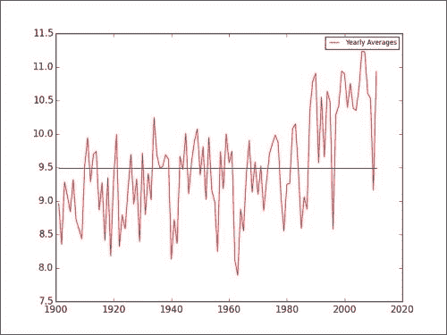
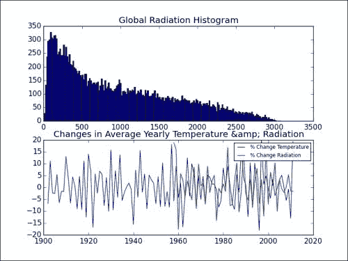
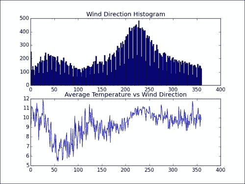
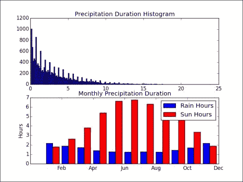
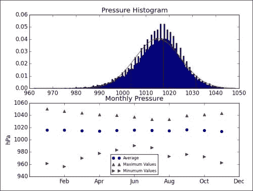
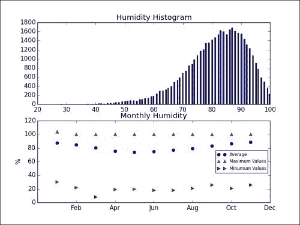

# 第 3 章。使用 NumPy 进行基本数据分析

在本章中，我们将通过历史天气数据示例学习基本数据分析。 我们将学习函数，这些函数使使用 NumPy 更加容易。

在本章中，我们将涵盖以下主题：

*   数组上的函数
*   从包含天气数据的文件中加载数组
*   简单的数学和统计功能

# 引入数据集

首先，我们将了解 NumPy 的文件 I / O。 数据通常存储在文件中。 如果您无法读取和写入文件，您将走不远。

**荷兰皇家气象学院**（**KNMI**）在线提供[每日天气数据](http://www.knmi.nl/climatology/daily_data/download.html)。 KNMI 是荷兰气象局，总部位于德比尔特（De Bilt）。 让我们从 De Bilt 气象站下载其中一个 KNMI 文件。 该文件大约为 10 MB。 它有一些文字，用荷兰语和英语解释了这些数据。 在此之下是逗号分隔值格式的数据。 我将元数据和实际数据分离到单独的文件中。 不需要分隔，因为从 NumPy 加载时可以跳过行。 我用 NumPy 编写了一个简单的脚本，以确定在分离过程中创建的 CSV 文件中数据集的最高和最低温度。

温度以十分之一摄氏度为单位给出。 三列包含温度：

*   24 小时的平均温度
*   每日最低温度
*   每日最高温度

现在我们将忽略平均温度。 另请注意，缺少值，因此我们将它们转换为**非数字**（**NaN**）值。 NaN 是 Python 中浮点数的特殊值。 最后，我们可以提出以下简单脚本（请参见本书代码捆绑包的`Chapter03`文件夹中的`intro.py`文件）：

```py
import numpy as np
import sys

to_float = lambda x: float(x.strip() or np.nan)

# Measurements are in tenths of degrees
min_temp, max_temp = np.loadtxt(sys.argv[1], delimiter=',',usecols=(12, 14), unpack=True, converters={12: to_float, 14: to_float}) * .1
print "# Records", len(min_temp), len(max_temp)
print "Minimum", np.nanmin(min_temp)
print "Maximum", np.nanmax(max_temp)
```

此脚本打印记录数以及最低和最高温度：

```py
# Records 40996 40996
Minimum -24.8
Maximum 36.8

```

### 注意

我们使用`loadtxt`功能读取文件。 默认情况下，`loadtxt`尝试将所有数据转换为浮点数。 为此，`loadtxt`功能具有特殊的参数。 该参数称为`converters`，它是将列与所谓的转换器函数链接在一起的字典。 我们还指定逗号作为要使用的字段和列的分隔符。 有关更多详细信息，请参考[这里](http://docs.scipy.org/doc/numpy/reference/generated/numpy.loadtxt.html)。 KNMI 引用温度值的十分之一摄氏度，因此需要一个简单的乘法。 `nanmin`和`nanmax`功能与 NumPy `max`和`min`功能相同，但它们也忽略了 NaN。

# 确定每日温度范围

在气象学中，每日温度范围或昼夜温度变化在地球上并不重要。 在地球上或通常在不同星球上的沙漠地区，变化更大。 我们将在上一个示例中下载的数据看一下在每日温度范围内的情况：

1.  要分析温度范围，我们将需要导入 NumPy 包和 NumPy 蒙版数组：

    ```py
    import numpy as np
    import sys
    import numpy.ma as ma
    from datetime import datetime as dt
    ```

2.  我们将加载比上一部分中加载的数据更多的数据：YYYYMMDD 格式的测量日期和每日平均温度。 日期需要特殊转换。 首先将日期字符串转换为日期，然后转换为数字，如下所示：

    ```py
    to_float = lambda x: float(x.strip() or np.nan)
    to_date = lambda x: dt.strptime(x, "%Y%m%d").toordinal()

    dates, avg_temp, min_temp, max_temp = np.loadtxt(sys.argv[1], delimiter=',', usecols=(1, 11, 12, 14), unpack=True, converters={1: to_date, 12: to_float, 14: to_float})
    ```

3.  Let's calculate the percentage of days that minimum and maximum temperatures are below zero degrees Celsius (freezing point):

    ```py
    print "% days min < 0", 100 * len(min_temp[min_temp < 0])/float(len(min_temp))
    print "% days max < 0", 100 * len(max_temp[max_temp < 0])/float(len(max_temp))
    ```

    每日最高温度低于零的可能性似乎为 3％。 每年大约 10 天。 最低每日温度更可能低于零，可能性为 18％。 大约一年两个月。 显然不是连续几个月。

    ```py
    % days min below 0 18.1944579959 
    % days max below 0 2.81978729632

    ```

    不幸的是，我们仍然存在缺失值的问题。 解决此问题的一种方法是使用掩码数组。 掩码数组是 NumPy 数组的一种特殊类型，通常包含缺失，无效或可疑值。

4.  Now, to solve the missing values problem, just give a masked array a mask created with the `isnan` function. We will calculate averages and standard deviations for temperatures and minimum and maximum for daily temperature ranges:

    ```py
    ranges = max_temp - min_temp
    print "Minimum daily range", np.nanmin(ranges)
    print "Maximum daily range", np.nanmax(ranges)

    masked_ranges = ma.array(ranges, mask = np.isnan(ranges))
    print "Average daily range", masked_ranges.mean()
    print "Standard deviation", masked_ranges.std()

    masked_mins = ma.array(min_temp, mask = np.isnan(min_temp))
    print "Average minimum temperature", masked_mins.mean(), "Standard deviation", masked_mins.std()

    masked_maxs = ma.array(max_temp, mask = np.isnan(max_temp))
    print "Average maximum temperature", masked_maxs.mean(), "Standard deviation", masked_maxs.std()
    ```

    显然，平均每日范围是 8 度，而平均最小值在 5 度左右，而最大值在 13 度左右。 在编写代码时打印了以下值； 自然，如果您使用更新的数据来运行程序，结果可能会有所不同：

    ```py
    Minimum daily range 0.6 
    Maximum daily range 22.2 
    Average daily range 8.20358580315 
    Standard deviation 3.72983839106 
    Average minimum temperature 5.39096231248 
    Standard deviation 5.85061308004 
    Average maximum temperature 13.5945481156 
    Standard deviation 7.40767291657

    ```

您可以在本书代码包`Chapter03`文件夹中的`daily_temperature_range.py`文件中找到此示例的代码。

# 寻找全球变暖的证据

根据全球变暖理论，自 19 世纪末以来，地球上的温度平均在上升。 在上个世纪直到现在，据称温度已经升高了约 0.8 度。 显然，这种变暖的大部分发生在最近的两三个十年中。 将来，我们可以预期温度会进一步升高，从而导致干旱，热浪和其他不愉快的现象。 显然，某些地区将受到比其他地区更大的打击。 已经提出了几种解决方案，包括减少温室气体排放和通过在大气中扩散特殊气体以反射更多的阳光来进行地球工程。

我们从荷兰气象研究所（KNMI）下载的数据不足以证明全球变暖是否真实，但我们当然可以进一步进行研究。 例如，我们可以检查数据集上半部分 De Delt（收集数据的地方）中的温度是否低于下半部分。 我们可以做的另一件事是绘制年度平均温度。 据我所知，De Bilt 是荷兰中部的一个没有重工业的小镇。 稍后我们需要导入 NumPy 和 Matplotlib 来创建图。 执行以下步骤来计算年平均温度：

1.  We will load the average daily temperatures and the corresponding dates. Actually, we will convert the dates to years immediately to be able to calculate yearly average temperatures:

    ```py
    to_year = lambda x: dt.strptime(x, "%Y%m%d").year

    years, avg_temp = np.loadtxt(sys.argv[1], delimiter=',', usecols=(1, 11), unpack=True, converters={1: to_year})

    # Measurements are in .1 degrees Celsius
    avg_temp = .1 * avg_temp

    N = len(avg_temp)
    print "First Year", years[0], "Last Year", years[-1]
    assert N == len(years)
    assert years[:N/2].mean() < years[N/2:].mean()
    ```

    如您所见，在代码段的末尾会进行一些检查，这会打印以下输出：

    ```py
    First Year 1901.0 Last Year 2013.0

    ```

2.  After dividing the average daily temperature values in two halves, we can calculate and compare the arithmetic means of both halves. Here, we are using the NumPy ndarray methods to compare the standard deviation as well:

    ```py
    print "First half average", avg_temp[:N/2].mean(), "Std Dev", avg_temp[:N/2].std()
    print "Second half average", avg_temp[N/2:].mean(), "Std Dev", avg_temp[N/2:].std()
    ```

    这为我们提供了以下输出：

    ```py
    First half average 9.19078446678 Std Dev 6.42457006016 
    Second half average 9.78066152795 Std Dev 6.34152195332

    ```

    数据集的后半部分似乎平均温度略高。

3.  Computing yearly average temperatures is simple. For each year, find the array indices using the `where` function corresponding to that year. With the indices, we then calculate the mean for each year and store it:

    ```py
    avgs = []
    year_range = range(int(years[0]), int(years[-1]) - 1)

    for year in year_range:
       indices = np.where(years == year)
       avgs.append(avg_temp[indices].mean())

    plt.plot(year_range, avgs, 'r-', label="Yearly Averages")
    plt.plot(year_range, np.ones(len(avgs)) * np.mean(avgs))
    plt.legend(prop={'size':'x-small'})
    plt.show()
    ```

    结果得到以下图。 为了进行比较，还通过图的中间绘制了所有平均温度的平均值。 请注意，自 1980 年以来，年平均气温似乎在上升（请参阅本书代码捆绑`Chapter03`文件夹中的`global_warming.py`文件）。

    

# 比较太阳辐射与温度

当涉及温度时，太阳当然是的一个非常重要的因素。 不幸的是，KNMI 的 De Bilt 数据集缺少许多有关太阳辐射的数据。 数据以焦耳每平方厘米为单位。 文件中还有其他变量，这些变量是从太阳辐射得出的，例如以小时为单位的日照时间。

我们将对辐射数据进行一些分析，绘制直方图，并将其与每日平均温度进行比较。 为了进行比较，我们将计算辐射与温度之间的相关系数，并绘制平均温度和辐射的年度相对变化图。 最初，有一个散点图似乎是一个好主意，但是对于成千上万的数据点来说看起来并不正确，因此，决定压缩数据。 后来，作者意识到从 1960 年左右开始存在辐射，因此绘制每年的相关系数可能会更好。 这留给读者练习。

我们需要导入 NumPy，NumPy 掩码数组模块和 Matplotlib。 比较太阳辐射与温度的步骤如下：

1.  我们将加载日期并将其转换为年份，然后加载平均温度和辐射。 后者会遗漏很多值，因此我们将遗漏的值转换为 NaN，然后​​从辐射数据中创建一个蒙版数组：

    ```py
    to_float = lambda x: float(x.strip() or np.nan)
    to_year = lambda x: dt.strptime(x, "%Y%m%d").year

    years, avg_temp, Q = np.loadtxt(sys.argv[1], delimiter=',', usecols=(1, 11, 20), unpack=True, converters={1: to_year, 20: to_float})
    ma
    # Measurements are in .1 degrees Celsius
    avg_temp = .1 * avg_temp

    Q = ma.masked_invalid(Q)
    ```

2.  We will have a look at the minimum, maximum, mean, and standard deviation of radiation. Additionally, we will print the correlation coefficient of temperature and radiation with the `corrcoef` function. To compute the coefficient, we need to match the data properly by avoiding the NaN values. Also, we have to get one of the off-diagonal values of the correlation matrix that NumPy returns. The `compressed` method of masked arrays returns all the nonmasked data as a one-dimensional array:

    ```py
    print "# temperature values", len(avg_temp), "# radiation values", len(Q.compressed())
    print "Radiation Min", Q.min(), "Radiation Max", Q.max()
    print "Radiation Average", Q.compressed().mean(), "Std Dev", Q.std()

    match_temp =  avg_temp[np.logical_not(np.isnan(Q))]
    print "Correlation Coefficient", np.corrcoef(match_temp, Q.compressed())[0][1]
    ```

    该脚本将输出以下输出：

    ```py
    # temperature values 40996 # radiation values 20361 
    Radiation Min 7.0 Radiation Max 3081.0 
    Radiation Average 957.156082707 Std Dev 740.68047373 
    Correlation Coefficient 0.62767320286

    ```

    如您所见，相关性并不强。

3.  我们已经进行了年度平均。 现在，我们将辐射量平均化。 我们要做的另一项是用百分比来计算我们感兴趣的变量的相对变化。 `diff`函数默认为我们提供相邻数组值之间的一阶差：

    ```py
    avg_temps = []
    avg_qs = []
    year_range = range(int(years[0]), int(years[-1]) - 1)

    for year in year_range:
       indices = np.where(years == year)
       avg_temps.append(avg_temp[indices].mean())
       avg_qs.append(Q[indices].mean())

    def percents(a):
       return 100 * np.diff(a)/a[:-1]
    ```

4.  We will plot the radiation histogram and relative changes in yearly average temperature and radiation with Matplotlib. Matplotlib is an open source Python plotting library considered by many as part of the basic stack. For more information, please refer to *Matplotlib for Python Developers*, *Packt Publishing*. The second edition of this book was coauthored by the author of this book and should be published in 2014.

    ```py
    plt.subplot(211)
    plt.title("Global Radiation Histogram")
    plt.hist(Q.compressed(), 200)

    plt.subplot(212)
    plt.title("Changes in Average Yearly Temperature & Radiation")
    plt.plot(year_range[1:], percents(avg_temps), label='% Change Temperature')
    plt.plot(year_range[1:], percents(avg_qs), label='% Change Radiation')
    plt.legend(prop={'size':'x-small'})
    plt.show()
    ```

    Matplotlib `subplot`函数从多个图创建表格或网格。 在此示例中，我们使用 211 表示将有两个图，并且我们希望将此特定图放置在第一列的第一行中。 类似地，212 表示将图放在第一列的第二行上。 请参考以下图表以及本书代码包的`Chapter03`文件夹中的`solar_radiation.py`文件：

    

# 分析风向

风是由于大气压力的不同而使空气的运动。 KNMI De Bilt 数据文件具有一列以度为单位的矢量平均风向（360 =北方，90 =东方，180 =南方，270 =西方，0 =平静/可变）。 我们将绘制该数据的直方图，并计算每个风向的相应平均温度。 预期风的产生方向会影响温度似乎是合理的。 换句话说，某些位置趋向于变暖或变冷，因此从那里散发出的空气将分别变暖或变冷。 您可能知道，荷兰没有任何山脉，因此我们不必考虑到这一点。 我们必须提醒自己北海的临近。 荷兰的海洋气候温和，西南风。 我们可以按照以下过程来研究风向信息：

1.  我们将风向和平均温度加载到 NumPy 阵列中。 风向缺少值，因此需要进行一些转换。 我们将根据风向值创建一个蒙版数组：

    ```py
    to_float = lambda x: float(x.strip() or np.nan)
    wind_direction, avg_temp = np.loadtxt(sys.argv[1], delimiter=',', usecols=(2, 11), unpack=True, converters={2: to_float})
    wind_direction = ma.masked_invalid(wind_direction)
    ```

2.  通过遍历每个可能的风向，找到相应的温度值，然后将它们平均，可以按照计算年均值的方式对风向求平均：

    ```py
    avgs = []

    for direction in xrange(360):
       indices = np.where(direction == wind_direction)
       avgs.append(avg_temp[indices].mean())
    ```

3.  Now, we will plot the wind direction histogram and average temperatures per wind direction as follows:

    ```py
    plt.subplot(211)
    plt.title("Wind Direction Histogram")
    plt.hist(wind_direction.compressed(), 200)

    plt.subplot(212)
    plt.title("Average Temperature vs Wind Direction")
    plt.plot(np.arange(360), avgs)
    plt.show()
    ```

    结果得到以下图。 注意直方图中与西南风向相对应的峰值。 平均温度似乎在 50 度左右触底。

    

# 分析风速

风速是非常重要的值。 KNMI De Bilt 数据文件还具有以米/秒表示的每日平均风速数据。

我们将将风向，风速和平均温度加载到 NumPy 阵列中。 风向和风速缺少值，因此需要进行一些转换。 我们将根据风向和风速值创建一个蒙版数组：

```py
to_float = lambda x: float(x.strip() or np.nan)
wind_direction, wind_speed, avg_temp = np.loadtxt(sys.argv[1], delimiter=',', usecols=(2, 4, 11), unpack=True, converters={2: to_float, 4: to_float})
wind_direction = ma.masked_invalid(wind_direction)
wind_speed = ma.masked_invalid(wind_speed)
print "# Wind Speed values", len(wind_speed.compressed())
print "Min speed", wind_speed.min(), "Max speed", wind_speed.max()
print "Average", wind_speed.mean(), "Std. Dev", wind_speed.std()

print "Correlation of wind speed and temperature", np.corrcoef(avg_temp[~wind_speed.mask], wind_speed.compressed())[0][1]
```

### 提示

我们将查看风速的常规统计信息-最小值，最大值，平均值，标准差以及与平均温度的相关性。 注意，为了进行相关计算，我们需要将平均温度值与有效风速值进行匹配。 我们通过否定风速数组的掩码来做到这一点，为我们提供有效值的索引。

在输出中，我们看到风速和温度之间的弱负相关性如下：

```py
# Wind Speed values 39871 
Min speed 0.0 
Max speed 16.5 
Average 4.2211381706 
Std. Dev 1.93906822268 
Correlation of wind speed and temperature -0.126166541437

```

# 分析降水和日照时间

KNMI De Bilt 数据文件的列包含 0.1 小时内的降雨持续时间值。 日照时间（也以 0.1 小时给出）是根据全球辐射值得出的。 注意单词“全球”，而不是“太阳”。 因此，这里考虑了其他辐射源，但是目前细节并不十分重要。 我们将绘制降水持续时间值的直方图。 但是，我们将忽略没有降雨的日子，因为干旱的日子太多了，它会使整体情况发生变化。 我们还将显示每月平均降水量和日照时间。 以下步骤描述了降雨和日照长度的研究：

1.  我们将转换为月份，日照和降水持续时间的日期加载到 NumPy 数组中。 同样，我们将缺失值转换为 NaN。 代码如下：

    ```py
    to_float = lambda x: float(x.strip() or np.nan)
    to_month = lambda x: dt.strptime(x, "%Y%m%d").month
    months, sun_hours, rain_hours = np.loadtxt(sys.argv[1], delimiter=',', usecols=(1, 18, 21), unpack=True, converters={1: to_month, 18: to_float, 21: to_float})
    ```

2.  Before calculating the basic statistics for the precipitation duration, we will create masked arrays for the sunshine and rain duration. There is a minor detail to take care of. Low values of sunshine duration are written down as -1 for some reason. I decided to convert those values to 0\. It might have been better to completely ignore them. The code is as follows:

    ```py
    # Measurements are in .1 hours 
    rain_hours = .1 * ma.masked_invalid(rain_hours)

    #Get rid of -1 values
    print "# -1 values Before", len(sun_hours[sun_hours == -1])
    sun_hours[sun_hours == -1] = 0
    print "# -1 values After", len(sun_hours[sun_hours == -1])
    sun_hours = .1 * ma.masked_invalid(sun_hours)

    print "# Rain hours values", len(rain_hours.compressed())
    print "Min Rain hours ", rain_hours.min(), "Max Rain hours", rain_hours.max()
    print "Average", rain_hours.mean(), "Std. Dev", rain_hours.std()
    ```

    这将输出以下输出：

    ```py
    # -1 values Before 832 
    # -1 values After 0 # Rain hours values 30373 
    Min Rain hours 0.0 
    Max Rain hours 24.0 
    Average 1.65149639482 
    Std. Dev 2.78643269679

    ```

    如预期的那样，降雨时间可以在 0 到 24 小时之间（或整天）。

3.  我们可以轻松地对数月内的日照和降水持续时间值进行平均。 首先，我们创建一个数月的数值范围。 其次，我们找到对应于每个月的数组索引。 然后，我们使用索引来选择持续时间值。 代码如下：

    ```py
    monthly_rain = []
    monthly_sun = []
    month_range = np.arange(int(months.min()), int(months.max()))

    for month in month_range:
       indices = np.where(month == months)
       monthly_rain.append(rain_hours[indices].mean())
       monthly_sun.append(sun_hours[indices].mean())
    ```

4.  The number of dry days is quite high, so we will leave them out in the precipitation duration histogram. We will plot bar charts of the average monthly rain and sunshine durations. The `cal` module is used here to display abbreviated month names in the plot. The code is as follows:

    ```py
    plt.subplot(211)
    plt.title("Precipitation Duration Histogram")
    plt.hist(rain_hours[rain_hours > 0].compressed(), 200)

    width = 0.42
    ax = plt.subplot(212)
    plt.title("Monthly Precipitation Duration")
    plt.bar(month_range, monthly_rain, width, label='Rain Hours')
    plt.bar(month_range + width, monthly_sun, width, color='red', label='Sun Hours')
    plt.legend()
    ax.set_xticklabels(cal.month_abbr[::2])
    ax.set_ylabel('Hours')
    plt.show()
    ```

    这为我们提供了以下令人兴奋的情节：

    

似乎日照与降水持续时间成反比。 因此，根据该系列中的先前证据，必须与温度成反比。 我们将其作为练习留给读者检查。 显然，降雨时间限制在 0 到 24 小时之间，较低的值更有可能出现。 我们可以清楚地看到，在夏季的几个月中，太阳的照射时间更长，而雨量则更少（持续时间较长）。 对于其他季节也可以得出类似的结论。

# 分析德比尔特的每月降水

让我们以来查看距 KNMI 0.1 毫米的 De Bilt 降水数据。 他们再次使用表示低值的-1 约定。 我们将再次将这些值设置为 0：

1.  我们将将转换为月份，降雨数量和降雨持续时间（以小时为单位）的日期加载到 NumPy 数组中。 同样，缺少的值需要转换为 NaN。 然后，我们为缺少值的 NumPy 数组创建掩码数组。 代码如下：

    ```py
    to_float = lambda x: float(x.strip() or np.nan)
    to_month = lambda x: dt.strptime(x, "%Y%m%d").month
    months, duration, rain = np.loadtxt(sys.argv[1], delimiter=',', usecols=(1, 21, 22), unpack=True, converters={1: to_month, 21: to_float, 22: to_float})

    # Remove -1 values
    rain[rain == -1] = 0

    # Measurements are in .1 mm 
    rain = .1 * ma.masked_invalid(rain)

    # Measurements are in .1 hours 
    duration = .1 * ma.masked_invalid(duration)
    ```

2.  We can calculate some simple statistics, such as minimum, maximum, mean, standard deviation, and correlation with precipitation duration. The last part is a bit tricky, because we need to match valid values. The values for a certain date of both precipitation and precipitation duration have to be valid. Luckily, this is pretty easy if we define a Boolean condition for masks of the arrays. The code is as follows:

    ```py
    print "# Rain values", len(rain.compressed())
    print "Min Rain mm ", rain.min(), "Max Rain mm", rain.max()
    print "Average", rain.mean(), "Std. Dev", rain.std()

    mask = ~duration.mask & ~rain.mask
    print "Correlation with duration", np.corrcoef(duration[mask], rain[mask])[0][1]
    ```

    前面的代码段显示以下值：

    ```py
    # Rain values 39139 
    Min Rain mm 0.0 
    Max Rain mm 62.3 
    Average 2.17747770766 
    Std. Dev 4.33715191714 
    Correlation with duration 0.779006349536

    ```

降水量与降雨持续时间的相关性不是很强，但仍然是迄今为止我们在该系列中看到的最强的相关性。 作者相信，这两个变量是独立测量的，与阳光持续时间不同，后者是从全球辐射得出的。

# 分析 De Bilt 中的大气压力

大气压是大气中空气施加的压力。 定义为力除以面积。 KNMI De Bilt 数据文件具有 0.1 hPa 的测量值，用于平均，最小和最大日压力。 我们将绘制平均压力和每月最小值，最大值和平均值的直方图：

1.  我们将转换为月，平均，最小和最大压力的日期加载到 NumPy 数组中。 同样，缺少的值需要转换为 NaN。 代码如下：

    ```py
    to_float = lambda x: 0.1 * float(x.strip() or np.nan)
    to_month = lambda x: dt.strptime(x, "%Y%m%d").month
    months, avg_p, max_p, min_p = np.loadtxt(sys.argv[1], delimiter=',', usecols=(1, 25, 26, 28), unpack=True, converters={1: to_month, 25: to_float, 26: to_float, 28: to_float})
    ```

2.  Values are missing from the pressure value columns, so we have to create masked arrays out of NumPy arrays. The following code snippet prints some simple statistics:

    ```py
    max_p = ma.masked_invalid(max_p)
    print "Maximum Pressure", max_p.max()

    avg_p = ma.masked_invalid(avg_p)
    print "Average Pressure", avg_p.mean(), "Std Dev", avg_p.std()

    min_p = ma.masked_invalid(min_p)
    print "Minimum Pressure", min_p.max()
    ```

    此代码段输出以下值：

    ```py
    Maximum Pressure 1050.4 
    Average Pressure 1015.14058231 Std Dev 9.85889134337 
    Minimum Pressure 1045.1

    ```

3.  您可以使用以下代码计算每月的平均值，最小值和最大值：

    ```py
    monthly_pressure = []
    maxes = []
    mins = []
    month_range = np.arange(int(months.min()), int(months.max()))

    for month in month_range:
       indices = np.where(month == months)
       monthly_pressure.append(avg_p[indices].mean())
       maxes.append(max_p[indices].max())
       mins.append(min_p[indices].min())
    ```

4.  We will draw a histogram of the average daily pressures and the associated Gaussian curve. In addition, we will plot monthly aggregate values as prepared in the previous step. The code is as follows:

    ```py
    plt.subplot(211)
    plt.title("Pressure Histogram")
    a, bins, b = plt.hist(avg_p.compressed(), 200, normed=True)
    stdev = avg_p.std()
    avg = avg_p.mean()
    plt.plot(bins, 1/(stdev * np.sqrt(2 * np.pi)) * np.exp(- (bins - avg)**2/(2 * stdev**2)), 'r-')

    ax = plt.subplot(212)
    plt.title("Monthly Pressure")
    plt.plot(month_range, monthly_pressure, 'bo', label="Average")
    plt.plot(month_range, maxes, 'r^', label="Maximum Values")
    plt.plot(month_range, mins, 'g>', label="Minimum Values")
    ax.set_xticklabels(cal.month_abbr[::2])
    plt.legend(prop={'size':'x-small'}, loc='best')
    ax.set_ylabel('hPa')
    plt.show()
    ```

    产生以下图：

    

如您所见，钟形曲线几乎完美地拟合了平均每日压力的分布。 的月平均压力似乎是恒定的。

# 分析 De Bilt 中的大气湿度

相对大气湿度是大气中相同温度下最大水蒸气分压的百分比。 在夏季，高湿度可能会导致出汗而消除多余的热量。 湿度还与降雨，露水和雾有关。 KNMI De Bilt 数据文件提供有关百分比的每日相对平均，最小和最大湿度的数据。 我们将绘制每日相对平均湿度和每月图表的直方图：

1.  我们将转换为月的日期，每日相对平均湿度以及最小和最大湿度加载到 NumPy 数组中。 同样，缺少的值需要转换为 NaN：

    ```py
    to_float = lambda x: float(x.strip() or np.nan)
    to_month = lambda x: dt.strptime(x, "%Y%m%d").month
    months, avg_h, max_h, min_h = np.loadtxt(sys.argv[1], delimiter=',', usecols=(1, 35, 36, 38), unpack=True, converters={1: to_month, 35: to_float, 36: to_float, 38: to_float})
    ```

2.  Values are missing from the relative humidity value columns, so we have to create masked arrays out of NumPy arrays. The following code snippet prints some simple statistics:

    ```py
    max_h = ma.masked_invalid(max_h)
    print "Maximum Humidity", max_h.max()

    avg_h = ma.masked_invalid(avg_h)
    print "Average Humidity", avg_h.mean(), "Std Dev", avg_h.std()

    min_h = ma.masked_invalid(min_h)
    print "Minimum Humidity", min_h.min()
    ```

    打印的统计数据如下：

    ```py
    Maximum Humidity 111.0 
    Average Humidity 81.6147091109 Std Dev 10.3747295063 
    Minimum Humidity 8.0

    ```

    最大相对湿度在 100 以上，这很奇怪。 我们将绘制相对平均每日湿度的直方图。 此外，我们将绘制每月的汇总值（请参考本书代码束`Chapter03`文件夹中的`atmospheric_humidity.py`文件）。 结果将得到以下图：

    

最大值正在发生奇怪的事情。 他们似乎高于 100％。 也许作者误解了相对湿度的定义。 但是，相对平均湿度值似乎在 0-100％之间。

# 摘要

本章介绍了大量常见的 NumPy 函数。 我们探索了 KNMI 气象站的数据。 探索不是详尽无遗的，因此我鼓励您自己使用数据。 您应该已经意识到，使用 NumPy 和相关的 Python 库进行基本数据分析是多么容易。

在下一章中，我们将更进一步，并尝试使用相同的数据预测温度。