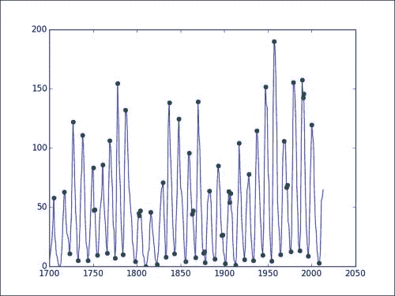
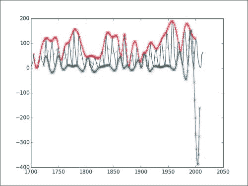
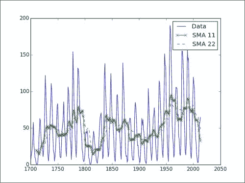
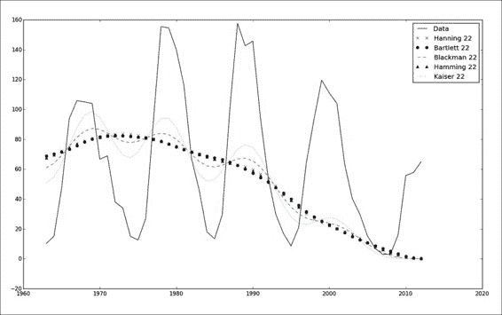
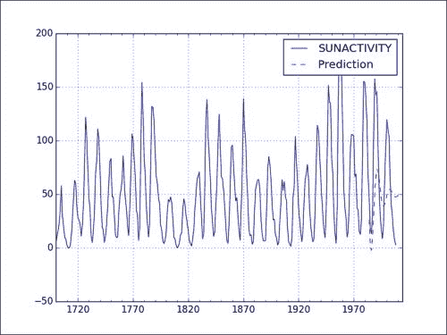
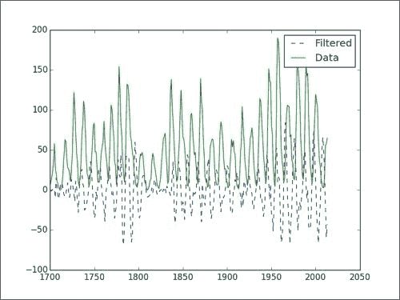

# 第 5 章。信号处理技术

我们将在本章中学习一些信号处理技术，并使用这些技术来分析时序数据。 作为示例数据，我们将使用比利时科学研究所提供的黑子数据。 我们可以从 Internet 上的多个位置下载此数据，并且`statsmodels`库也将其作为示例数据提供。 我们可以对数据做很多事情，例如：

*   试图确定数据中的周期性周期。 可以做到，但这有点高级，所以我们将帮助您入门。
*   平滑数据以滤除噪声。
*   预测。

# 太阳黑子数据简介

太阳黑子是在太阳表面可见的黑点。 天文学家已经对这种现象进行了数百年的研究。 已经发现周期性黑子周期的证据。 我们可以从 [http://www.quandl.com/SIDC/SUNSPOTS_A-Sunspot-Numbers-Annual](http://www.quandl.com/SIDC/SUNSPOTS_A-Sunspot-Numbers-Annual) 下载最新的年度黑子数据。 这是由比利时太阳能影响数据分析中心提供的。 数据可追溯到 1700 年，其中包含超过 300 个年平均值。 为了确定太阳黑子的周期，科学家成功地使用了 *Hilbert-Huang* 变换（请参阅 [http://en.wikipedia.org/wiki/Hilbert%E2%80 ％93Huang_transform](http://en.wikipedia.org/wiki/Hilbert%E2%80%93Huang_transform) ）。 该变换的主要部分是所谓的**经验模式分解**（**EMD**）方法。 整个算法包含许多迭代步骤，在这里我们将仅介绍其中的一些步骤。 EMD 将数据缩减为一组**本征模式函数**（**IMF**）。 您可以将其与快速傅立叶变换将*正弦*和*余弦*项叠加的信号分解方式进行比较。

通过筛选过程完成的提取 IMF。 信号的筛选与一次分离一个信号的成分有关。 此过程的第一步是确定局部极值。 我们将执行第一步，并使用发现的极值绘制数据。 让我们以 CSV 格式下载数据。 在第 3 章，“使用 NumPy 进行基本数据分析”中，我们学习了如何将 CSV 文件加载到 NumPy 数组中，因此，如有必要，请返回阅读。 在那。 我们还需要反转数组以使其按正确的时间顺序排列（有关详细信息，请参阅第 2 章， “NumPy 基础知识”）。 以下代码段分别查找局部最小值和最大值的索引：

```py
mins = signal.argrelmin(data)[0]
maxs = signal.argrelmax(data)[0]
```

现在我们需要连接这些数组，并使用索引选择相应的值。 以下代码完成了该任务并绘制了数据：

```py
import numpy as np
import sys
import matplotlib.pyplot as plt
from scipy import signal

data = np.loadtxt(sys.argv[1], delimiter=',', usecols=(1,), unpack=True, skiprows=1) 
#reverse order
data = data[::-1]

mins = signal.argrelmin(data)[0]
maxs = signal.argrelmax(data)[0]
extrema = np.concatenate((mins, maxs))

year_range = np.arange(1700, 1700 + len(data))

plt.plot(1700 + extrema, data[extrema], 'go')
plt.plot(year_range, data)
plt.show()
```

我们将看到以下图表：



在该图中，您可以看到极点用点表示。

## 继续筛选

筛选过程中的后续步骤要求我们对最小值和最大值的三次样条进行插值。 这将创建一个上信封和一个下信封，它们应包围数据。 EMD 处理的下一次迭代需要包络线的平均值。 我们可以使用以下代码片段对最小值进行插值：

```py
spl_min = interpolate.interp1d(mins, data[mins], kind='cubic')
min_rng = np.arange(mins.min(), mins.max())
l_env = spl_min(min_rng)
```

可以使用类似的代码对最大值进行插值。 我们需要注意，插值结果仅在我们插值的范围内有效。 该范围由最小值/最大值的首次出现定义，并在最小值/最大值的最后出现时结束。 不幸的是，我们以这种方式定义的最大值和最小值的插值范围并不完全匹配。 因此，出于绘制目的，我们需要提取一个位于最大和最小插值范围内的较短范围。 看下面的代码：

```py
import numpy as np
import sys
import matplotlib.pyplot as plt
from scipy import signal
from scipy import interpolate

data = np.loadtxt(sys.argv[1], delimiter=',', usecols=(1,), unpack=True, skiprows=1) 
#reverse order
data = data[::-1]

mins = signal.argrelmin(data)[0]
maxs = signal.argrelmax(data)[0]
extrema = np.concatenate((mins, maxs))

year_range = np.arange(1700, 1700 + len(data))
spl_min = interpolate.interp1d(mins, data[mins], kind='cubic')
min_rng = np.arange(mins.min(), mins.max())
l_env = spl_min(min_rng)

spl_max = interpolate.interp1d(maxs, data[maxs], kind='cubic')
max_rng = np.arange(maxs.min(), maxs.max())
u_env = spl_max(max_rng)

inclusive_rng = np.arange(max(min_rng[0], max_rng[0]), min(min_rng[-1], max_rng[-1]))
mid = (spl_max(inclusive_rng) + spl_min(inclusive_rng))/2

plt.plot(year_range, data)
plt.plot(1700 + min_rng, l_env, '-x')
plt.plot(1700 + max_rng, u_env, '-x')
plt.plot(1700 + inclusive_rng, mid, '--')
plt.show()
```

该代码产生以下图表：



您将看到观察到的数据，其中包括计算出的包络线和中线。 显然，在这种情况下，负值没有任何意义。 但是，对于该算法，我们只需要关心上下包络的中线即可。 在前两个部分中，我们基本上执行了 EMD 过程的第一次迭代。 该算法涉及更多，因此无论您是否要自己继续进行此分析，我们都将由您决定。

# 移动平均线

移动平均值是常用的分析时间序列数据的工具。 移动平均线定义了一个以前查看过的数据的窗口，该窗口在每次向前滑动一个周期时将其平均。 不同类型的移动平均线在平均权重方面本质上有所不同。 例如，指数移动平均值的权重随时间呈指数下降。 这意味着较旧的值比较新的值具有较小的影响，这有时是理想的。

我们可以在 NumPy 代码中为简单移动平均线表示等权重策略：

```py
weights = np.exp(np.linspace(-1., 0., N))
weights /= weights.sum()
```

一个简单的移动平均线使用相等的权重，该权重在代码中如下所示：

```py
def sma(arr, n):
   weights = np.ones(n) / n

   return np.convolve(weights, arr)[n-1:-n+1]
```

以下代码绘制了 11 年和 22 年黑子周期的简单移动平均值：

```py
import numpy as np
import sys
import matplotlib.pyplot as plt

data = np.loadtxt(sys.argv[1], delimiter=',', usecols=(1,),        
unpack=True, skiprows=1) 
#reverse order
data = data[::-1]

year_range = np.arange(1700, 1700 + len(data))

def sma(arr, n):
   weights = np.ones(n) / n

   return np.convolve(weights, arr)[n-1:-n+1]

sma11 = sma(data, 11)
sma22 = sma(data, 22)

plt.plot(year_range, data, label='Data')
plt.plot(year_range[10:], sma11, '-x', label='SMA 11')
plt.plot(year_range[21:], sma22, '--', label='SMA 22')
plt.legend()
plt.show()
```

在下图中，我们看到了 11 年和 22 年期的原始数据和简单移动平均线。 如您所见，移动平均线不适用于此数据。 对于正弦数据通常是这种情况。



# 平滑功能

平滑可以帮助我们消除原始数据中的噪声和离群值。 例如，这使得更容易发现数据趋势。 NumPy 提供了许多平滑功能。

### 注意

这些函数可以像前面的示例一样在滑动窗口中计算权重（有关更多背景信息，请访问 [http://en.wikipedia.org/wiki/Window_function](http://en.wikipedia.org/wiki/Window_function) ）。

除`kaiser`功能外，这些函数仅需要一个参数-窗口大小，对于黑子数据的中间周期，我们将其设置为 22。 `kaiser`功能还需要一个`beta`参数。 使用此参数，`kaiser`功能可以模仿其他功能。

NumPy 文档建议`beta`参数的起始值为 14，这也是我们将要使用的值。 代码简单明了，给出如下（此处的数据仅限于最近 50 年，以方便在图中进行比较）：

```py
import numpy as np
import sys
import matplotlib.pyplot as plt

def smooth(weights, arr):
   return np.convolve(weights/weights.sum(), arr)

data = np.loadtxt(sys.argv[1], delimiter=',', usecols=(1,), unpack=True, skiprows=1) 
#reverse order
data = data[::-1]

#Select last 50 years
data = data[-50:]
year_range = np.arange(1963, 2013)
print len(data), len(year_range)

plt.plot(year_range, data, label="Data")
plt.plot(year_range, smooth(np.hanning(22), data)[21:], 'x', label='Hanning 22')
plt.plot(year_range, smooth(np.bartlett(22), data)[21:], 'o', label='Bartlett 22')
plt.plot(year_range, smooth(np.blackman(22), data)[21:], '--', label='Blackman 22')
plt.plot(year_range, smooth(np.hamming(22), data)[21:], '^', label='Hamming 22')
plt.plot(year_range, smooth(np.kaiser(22, 14), data)[21:], ':', label='Kaiser 22')
plt.legend()
plt.show()
```

在下图中，我们可以看到窗口函数的结果相差不大：



# 使用 ARMA 模型进行预测

在上一章，第 4 章，“NumPy 的简单预测分析”中，我们学习了自回归模型。 ARMA 是这些模型的概括，它为添加了额外的组成部分-移动平均值。 ARMA 模型通常用于预测时间序列的值。 这些模型结合了自回归模型和移动平均模型。 自回归模型通过假设线性组合是由先前遇到的值组成来预测值的。 例如，我们可以考虑**线性组合**，它是由时间序列中的先前值和之前的值组成的。 由于我们使用的是滞后两个周期的组件，因此也称为 AR（2）模型。 在我们的案例中，我们将查看预测期之前一年和两年之前的黑子数。 在 ARMA 模型中，我们尝试对无法从上一时期的数据（也称为意外成分）无法解释的残渣进行建模。 在此，再次假定为线性组合。 因此，我们将在这里尝试使用的 ARMA（ARMA（2，1））模型是 AR（2）模型与一阶残基的线性组合的总和（请参见 [http：//en.wikipedia。 org / wiki / Autoregressive％E2％80％93moving-average_model](http://en.wikipedia.org/wiki/Autoregressive%E2%80%93moving-average_model) ）。 幸运的是，我们可以使用`statsmodels`函数进行此分析。

我们还将使用作为`statsmodels`分布一部分的样本黑子数据。 根据您上次安装`statsmodels`的时间，此数据集可能不是最新的。 无论如何，您都可以始终仅使用本章第一节中提到的数据集。 可以通过以下步骤进行预测：

1.  将数据加载到`DataFrame`Pandas 中。 我们还必须指定可用的年份范围，并使用以下代码摆脱`Year`列：

    ```py
    df = sm.datasets.sunspots.load_pandas().data

    df.index = pandas.Index(sm.tsa.datetools.dates_from_range('1700', '2008'))
    del df["YEAR"]
    ```

2.  使用以下代码将数据拟合为 ARMA（2,1）模型：

    ```py
    model = sm.tsa.ARMA(df, (2,1)).fit()
    ```

3.  使用以下代码进行预测：

    ```py
    prediction = model.predict('1984', str(year_today), dynamic=True)
    ```

以下代码是带有绘图的完整代码清单：

```py
import numpy as np
from scipy import stats
import pandas

import matplotlib.pyplot as plt
import statsmodels.api as sm
import datetime

df = sm.datasets.sunspots.load_pandas().data

df.index = pandas.Index(sm.tsa.datetools.dates_from_range('1700', '2008'))
del df["YEAR"]

model = sm.tsa.ARMA(df, (2,1)).fit()

year_today = datetime.date.today().year

#Big Brother is watching you!
prediction = model.predict('1984', str(year_today), dynamic=True)

df.plot()
prediction.plot(style='--', label='Prediction');
plt.legend();
plt.show()
```

请参考以下预测和实际数据图表：



# 过滤信号

另一种常见的信号处理技术是滤波。 这是一个很大的话题，我们可以创建各种过滤器。 我们只会在这里创建一个非常基本的过滤器。 同样，我们将使用黑子数据作为输入。

顾名思义，`iirdesign`函数使我们能够构造几种类型的模拟和数字滤波器。

## 设计滤波器

使用`scipy.signal`模块的`iirdesign`功能设计滤波器。

### 注意

**IIR** 代表**无限冲激响应**； 有关更多信息，请访问 [http://en.wikipedia.org/wiki/Infinite_impulse_response](http://en.wikipedia.org/wiki/Infinite_impulse_response) 。

我们将不涉及`iirdesign`功能的所有细节。 如果需要，请在 [http://docs.scipy.org/doc/scipy/reference/generation/scipy.signal.iirdesign.html](http://docs.scipy.org/doc/scipy/reference/generated/scipy.signal.iirdesign.html) 上查看文档。 简而言之，以下是我们将设置的参数：

*   频率从 0 标准化为 1。
*   最大损失。
*   最小衰减。
*   过滤器类型。

可以使用以下代码来设计过滤器：

```py
b,a = scipy.signal.iirdesign(wp=0.2, ws=0.1, gstop=60, gpass=1, ftype='but ter')
```

### 注意

该滤波器的配置与 Butterworth 带通滤波器（ [http://en.wikipedia.org/wiki/Butterworth_filter](http://en.wikipedia.org/wiki/Butterworth_filter) ）相对应。

我们可以通过`scipy.signal.lfilter`功能应用过滤器。 它接受上一步的值作为参数，当然也接受数据数组作为过滤参数，如以下代码所示：

```py
filtered = scipy.signal.lfilter(b, a, data)
```

如果我们绘制原始数据和过滤后的数据，则会得到以下图表：



# 演示协整

协整与相关性相似，但许多人认为它是定义两个时间序列的相关性的较好度量。 解释协整和相关之间差异的通常方法是以一个醉酒的人和他的狗为例。 相关性告诉您有关它们前进方向的一些信息。 协整与它们随时间的距离有关，在这种情况下，其受狗的牵引力约束。 我们将使用计算机生成的时间序列和真实数据演示协整。 可以从 Quandl 以 CSV 格式下载数据。

**增强迪基·富勒（ADF）**测试可用于测量时间序列的协整； 继续执行以下步骤来演示协整：

1.  定义以下函数以计算 ADF 统计信息。

    ```py
    def calc_adf(x, y):
        result = stat.OLS(x, y).fit()    
        return ts.adfuller(result.resid)
    ```

2.  Generate a `sine` value and calculate the cointegration of the value with itself:

    ```py
    N = 501
    t = np.linspace(-2 * np.pi, 2 * np.pi, N)
    sine = np.sin(np.sin(t))
    print "Self ADF", calc_adf(sine, sine)
    ```

    这应该打印以下内容：

    ```py
    Self ADF (2.9830728873654705e-17, 0.95853208606005602, 0, 500, {'5%': -2.8673378563200003, '1%': -3.4434963794639999, '10%': -2.5698580359999998}, -35895.784416878145)

    ```

    您看到的第一个值是 ADF 指标本身。 第二个数字是 p 值。 如您所见，p 值很高。 然后跟踪滞后和样本量。 字典给出了此特定样本大小的 t 分布值。

3.  Now add noise to the sine:

    ```py
    noise = np.random.normal(0, .01, N)
    print "ADF sine with noise", calc_adf(sine, sine + noise)
    ```

    添加噪声可获得以下结果：

    ```py
    ADF sine with noise (-23.84029624339999, 0.0, 0, 500, {'5%': -2.8673378563200003, '1%': -3.4434963794639999, '10%': -2.5698580359999998}, -3147.9631889288148)

    ```

    在这里看来，我们可以根据找到的 p 值来拒绝协整。

4.  Let's generate a `cosine` value of a larger magnitude and offset. Again let's add the noise to it:

    ```py
    cosine = 100 * np.cos(t) + 10
    print "ADF sine vs cosine with noise", calc_adf(sine, cosine + noise)
    ```

    给出以下值：

    ```py
    ADF sine vs cosine with noise (-4.7019725364090377, 8.3437700445205561e-05, 18, 482, {'5%': -2.8675550551408353, '1%': -3.4439899743408136, '10%': -2.5699737921179042}, -18152.922572321968)

    ```

    同样，在这里我们看到对协整的强烈反对。

5.  现在介绍可以从以下代码片段中提供的 URL 下载的真实数据：

    ```py
    #http://www.quandl.com/BUNDESBANK/BBK01_WT5511-Gold-Price-USD
    gold = np.loadtxt(sys.argv[1] + '/BBK01_WT5511.csv', delimiter=',', usecols=(1,), unpack=True, skiprows=1) 

    #http://www.quandl.com/YAHOO/INDEX_GSPC-S-P-500-Index
    sp500 = np.loadtxt(sys.argv[1] + '/INDEX_GSPC.csv', delimiter=',', usecols=(6,), unpack=True, skiprows=1)
    ```

6.  Here, we have to make sure that the two time-series are aligned and in the proper order:

    ```py
    sp500 = sp500[-len(gold):]
    gold = gold[::-1]
    sp500 = sp500[::-1]
    print "Gold v S & P 500", calc_adf(gold, sp500)
    ```

    结果表明似乎有一些协整的证据：

    ```py
    Gold v S & P 500 (-1.8835008669539355, 0.3398621844965054, 31, 11545, {'5%': -2.861790382593266, '1%': -3.4309165443532876, '10%': -2.566903273565075}, 83668.547346270294)

    ```

请参考以下代码：

```py
import numpy as np
import statsmodels.api as stat
import statsmodels.tsa.stattools as ts
import sys

def calc_adf(x, y):
    result = stat.OLS(x, y).fit()    
    return ts.adfuller(result.resid)

N = 501
t = np.linspace(-2 * np.pi, 2 * np.pi, N)
sine = np.sin(np.sin(t))
print "Self ADF", calc_adf(sine, sine)

noise = np.random.normal(0, .01, N)
print "ADF sine with noise", calc_adf(sine, sine + noise)

cosine = 100 * np.cos(t) + 10
print "ADF sine vs cosine with noise", calc_adf(sine, cosine + noise)

#http://www.quandl.com/BUNDESBANK/BBK01_WT5511-Gold-Price-USD
gold = np.loadtxt(sys.argv[1] + '/BBK01_WT5511.csv', delimiter=',', usecols=(1,), unpack=True, skiprows=1) 

#http://www.quandl.com/YAHOO/INDEX_GSPC-S-P-500-Index
sp500 = np.loadtxt(sys.argv[1] + '/INDEX_GSPC.csv', delimiter=',', usecols=(6,), unpack=True, skiprows=1) 
sp500 = sp500[-len(gold):]
gold = gold[::-1]
sp500 = sp500[::-1]
print "Gold v S & P 500", calc_adf(gold, sp500)
```

# 摘要

在本章中，我们学习了许多复杂的信号处理技术。 其中大多数被应用于黑子数据集。 我们研究了使用窗口函数和移动平均值进行的平滑。 我们还谈到了科学家用于得出黑子周期的筛选过程。 最后但并非最不重要的是，给出了协整的演示。

在下一章中，我们将专注于调试，概要分析和测试，包括断言函数和各种工具。