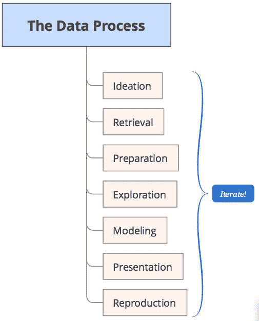

# Pandas 与数据分析

欢迎来到《Pandas 学习手册》！ 在本书中，我们将进行一次探索我们学习 Pandas 的旅程，这是一种用于 Python 编程语言的开源数据分析库。 pandas 库提供了使用 Python 构建的高性能且易于使用的数据结构和分析工具。 pandas 从统计编程语言 R 中带给 Python 许多好处，特别是**数据帧**对象和 R 包（例如`plyr`和`reshape2`），并将它们放置在一个可在内部使用的库中 蟒蛇。

在第一章中，我们将花一些时间来了解 Pandas 及其如何适应大数据分析的需要。 这将使对 Pandas 感兴趣的读者感受到它在更大范围的数据分析中的地位，而不必完全关注使用 Pandas 的细节。 目的是在学习 Pandas 的同时，您还将了解为什么存在这些功能以支持执行数据分析任务。

因此，让我们进入。在本章中，我们将介绍：

*   Pandas 是什么，为什么被创造出来，它给您带来什么
*   Pandas 与数据分析和数据科学之间的关系
*   数据分析涉及的过程以及 Pandas 如何支持
*   数据和分析的一般概念
*   数据分析和统计分析的基本概念
*   数据类型及其对 Pandas 的适用性
*   您可能会与 pandas 一起使用的 Python 生态系统中的其他库

# Pandas 介绍

pandas 是一个 Python 库，其中包含高级数据结构和工具，这些数据结构和工具已创建来帮助 Python 程序员执行强大的数据分析。 Pandas 的最终目的是帮助您快速发现数据中的**信息**，并将信息定义为基本含义。

Wes McKinney 于 2008 年开始开发 Pandas。 它于 2009 年开源。Pandas 目前受到各种组织和贡献者的支持和积极开发。

最初设计 Pandas 时要考虑到财务问题，特别是它具有围绕时间序列数据操纵和处理历史股票信息的能力。 财务信息的处理面临许多挑战，以下是一些挑战：

*   表示随着时间变化的安全数据，例如股票价格
*   在相同时间匹配多个数据流的测量
*   确定两个或多个数据流的关系（相关）
*   将时间和日期表示为一流实体
*   向上或向下转换数据采样周期

要进行此处理，需要使用一种工具，使我们能够对单维和多维数据进行检索，索引，清理和整齐，整形，合并，切片并执行各种分析，包括沿着数据自动对齐的异类数据。 一组公共索引标签。 这是 Pandas 诞生的地方，它具有许多有用而强大的功能，例如：

*   快速高效的`Series`和`DataFrame`对象，通过集成索引进行数据处理
*   使用索引和标签进行智能数据对齐
*   整合处理遗失数据
*   将杂乱数据转换为有序数据（整理）的工具
*   内置工具，用于在内存数据结构与文件，数据库和 Web 服务之间读写数据
*   处理以许多常见格式（例如 CSV，Excel，HDF5 和 JSON）存储的数据的能力
*   灵活地重塑和透视数据集
*   基于智能标签的切片，花式索引和大型数据集的子集
*   可以从数据结构中插入和删除列，以实现大小可变性
*   使用强大的数据分组工具聚合或转换数据，以对数据集执行拆分应用合并
*   数据集的高性能合并和连接
*   分层索引有助于在低维数据结构中使用高维数据
*   时间序列数据的广泛功能，包括日期范围生成和频率转换，移动窗口统计信息，移动窗口线性回归，日期平移和滞后
*   通过 **Cython** 或 C 编写的关键代码路径对性能进行了高度优化

强大的功能集，以及与 Python 和 Python 生态系统内其他工具的无缝集成，已使 Pandas 在许多领域得到广泛采用。 它被广泛用于学术和商业领域，包括金融，神经科学，经济学，统计学，广告和网络分析。 它已成为数据科学家表示数据进行操作和分析的最优选工具之一。

长期以来，Python 在数据处理和准备方面一直是例外，但在数据分析和建模方面则例外。 pandas 帮助填补了这一空白，使您能够在 Python 中执行整个数据分析工作流，而不必切换到更特定于领域的语言（例如 R）。这非常重要，因为熟悉 Python 的人比 R（更多的统计数据包），获得了 R 的许多数据表示和操作功能，同时完全保留在一个极其丰富的 Python 生态系统中。

与 IPython，Jupyter 笔记本和众多其他库相结合，与许多其他工具相比，用于在 Python 中执行数据分析的环境在性能，生产力和协作能力方面表现出色。 这导致许多行业的许多用户广泛采用 Pandas。

# 数据处理，分析，科学和 Pandas

我们生活在一个每天都会产生和存储大量数据的世界中。 这些数据来自大量的信息系统，设备和传感器。 您所做的几乎所有操作以及用于执行此操作的项目都会生成可以捕获或捕获的数据。

连接到网络的服务无处不在的性质以及数据存储设施的大量增加极大地支持了这一点。 这与不断降低的存储成本相结合，使捕获和存储甚至最琐碎的数据都变得有效。

这导致堆积了大量数据并准备好进行访问。 但是，该数据分布在整个网络空间中，实际上不能称为**信息**。 它往往是事件记录的集合，无论是财务记录，您与社交网络的互动，还是全天跟踪您的心跳的个人健康监控器。 这些数据以各种格式存储，位于分散的位置，并且其原始性质的确能提供很多洞察力。

从逻辑上讲，整个过程可以分为三个主要学科领域：

*   数据处理
*   数据分析
*   数据科学

这三个学科可以而且确实有很多重叠之处。 各方结束而其他各方开始的地方可以解释。 为了本书的目的，我们将在以下各节中对其进行定义。

# 数据处理

数据分布在整个地球上。 它以不同的格式存储。 它的质量水平差异很大。 因此，需要用于将数据收集在一起并转化为可用于决策的形式的工具和过程。 这需要操作数据以进行分析准备的工具需要执行许多不同的任务和功能。 该工具需要的功能包括：

*   重用和共享的可编程性
*   从外部来源访问数据
*   本地存储数据
*   索引数据以高效检索
*   根据属性对齐不同集合中的数据
*   合并不同集中的数据
*   将数据转换为其他表示形式
*   清除残留物的数据
*   有效处理不良数据
*   将数据分组到通用篮子
*   聚合具有相似特征的数据
*   应用功能计算含义或执行转换
*   查询和切片以探索整体
*   重组为其他形式
*   为不同类型的数据建模，例如类别，连续，离散和时间序列
*   将数据重新采样到不同的频率

存在许多数据处理工具。 每个人对此列表中的项目的支持，部署方式以及用户如何使用都各不相同。 这些工具包括关系数据库（SQL Server，Oracle），电子表格（Excel），事件处理系统（例如 Spark）以及更通用的工具（例如 R 和 Pandas）。

# 数据分析

数据分析是从数据创建含义的过程。 具有量化含义的数据通常称为**信息**。 数据分析是通过创建数据模型和数学模型来从数据中创建信息的过程。 它经常与数据操作重叠，并且两者之间的区别并不总是很清楚。 许多数据处理工具还包含分析功能，并且数据分析工具通常提供数据处理功能。

# 数据科学

数据科学是使用统计和数据分析过程来了解数据中**现象**的过程。 数据科学通常从信息开始，然后对信息进行更复杂的基于领域的分析。 这些领域涵盖许多领域，例如数学，统计学，信息科学，计算机科学，机器学习，分类，聚类分析，数据挖掘，数据库和可视化。 数据科学是多学科的。 它的域分析方法通常非常不同，并且特定于特定域。

# Pandas 适合哪里？

Pandas 首先在数据处理方面表现出色。 本书将使用 Pandas 满足前面列出的所有需求。 这是 Pandas 的核心，也是本书重点关注的内容。

值得注意的是，Pandas 有一个特定的设计目标：强调数据

但是 Pandas 确实提供了执行数据分析的多种功能。 这些功能通常围绕描述性统计和财务所需的功能（例如相关性）。

因此，Pandas 本身不是数据科学工具包。 它更多是具有某些分析功能的操纵工具。 Pandas 明确地将复杂的统计，财务和其他类型的分析留给了其他 Python 库，例如 SciPy，NumPy，scikit-learn，并依赖于图形库，例如 **matplotlib** 和 **ggvis** 用于数据可视化。

这种关注点实际上是 Pandas 相对于 R 等其他语言的强项，因为 Pandas 应用程序能够利用 Python 社区在其他地方已经构建和测试的强大的 Python 框架的广泛网络。

# 数据分析过程

本书的主要目的是彻底地教您如何使用 Pandas 来操纵数据。 但是，还有一个次要的，也许同样重要的目标，是显示 Pandas 如何适应数据分析师/科学家在日常生活中执行的过程。

Pandas 网站上对数据分析过程中涉及的步骤进行了描述：

*   清除和清洁数据
*   分析/建模
*   组织成适合交流的形式

这个小的清单是一个很好的初始定义，但是它无法涵盖过程的整体范围以及创建 Pandas 中实现的许多功能的原因。 以下内容将对此过程进行扩展，并为整个旅程中的过程设置框架。

# 过程

所建议的过程将被称为**数据流程**，并在下图中表示：

该过程建立了一个框架，用于定义处理数据时要采取的逻辑步骤。 现在，让我们快速看一下该过程中的每个步骤，以及作为使用 Pandas 的数据分析员将执行的一些任务。

重要的是要了解这不是纯粹的线性过程。 最好以高度交互和敏捷/迭代的方式完成。

# 构想

任何数据问题的第一步都是确定要解决的问题。 这就是**构想**，它提出了我们想要做和证明的事情的构想。 构想通常涉及对可用于做出明智决策的数据模式进行假设。

这些决策通常是在企业范围内，但在其他学科（例如科学和研究）中也是如此。 目前正在流行的事情是了解企业的​​运营，因为在理解数据时通常会赚很多钱。

但是，我们通常希望做出什么样的决定？ 以下是几个常见问题的答案：

*   为什么会发生什么事？
*   我们可以使用历史数据预测未来吗？
*   将来如何优化操作？

这份清单绝非详尽无遗，但确实涵盖了任何人进行这些努力的原因的相当大的百分比。 要获得这些问题的答案，必须参与收集和理解与该问题有关的数据。 这涉及定义要研究的数据，研究的收益，如何获得数据，成功的标准是什么以及最终如何传递信息。

Pandas 本身不提供辅助构想的工具。 但是一旦您掌握了使用 Pandas 的知识和技巧，您就会自然地意识到 Pandas 将如何帮助您提出构想。 这是因为您将拥有一个强大的工具，可以用来构建许多复杂的假设。

# 恢复

一旦有了想法，就必须找到数据来尝试并支持您的假设。 这些数据可以来自组织内部或外部数据提供者。 该数据通常以存档数据的形式提供，也可以实时提供（尽管以实时数据处理工具而闻名的 Pandas）。

即使从您创建的数据源或从组织内部获取数据，数据也通常是非常原始的。 原始数据意味着数据可能是杂乱无章的，可能是各种格式，而且是错误的； 相对于支持您的分析，它可能是不完整的，需要手动进行扩充。

世界上有很多免费数据。 许多数据不是免费的，实际上要花费大量金钱。 其中一些可通过公共 API 免费获得，其他一些则通过订阅获得。 您所支付的数据通常更干净，但这并非总是如此。

在这两种情况下，Pandas 都提供了一套强大且易于使用的工具，用于从各种来源检索数据，并且这些数据可能采用多种格式。 pandas 还使我们不仅能够检索数据，还可以通过 pandas 数据结构提供数据的初始结构，而无需手动创建其他工具或编程语言可能需要的复杂编码。

# 准备

在准备过程中，已准备好原始数据以供探索。 准备工作通常是一个非常有趣的过程。 通常情况下，来自数据的数据会涉及与质量相关的各种问题。 您可能会花费大量时间来处理这些质量问题，而这通常是非常短的时间。

为什么？ 嗯，原因有很多：

*   数据根本不正确
*   缺少部分数据集
*   无法使用适合您分析的度量来表示数据
*   数据格式不便于您分析
*   数据的详细程度不适合您的分析
*   并非所有需要的字段都可以从一个来源获得
*   数据的表示因提供者而异

准备过程着重解决这些问题。 Pandas 为准备数据（通常称为**整理**数据）提供了许多便利的工具。 这些功能包括处理丢失数据，转换数据类型，使用格式转换，更改测量频率，将来自多组数据的数据连接，将符号映射/转换为共享表示以及将数据分组的智能方法。 我们将深入探讨所有这些内容。

# 探索

探索涉及能够交互式地对数据进行切片和切块，以尝试快速发现。 探索可以包括各种任务，例如：

*   检查变量之间的相互关系
*   确定数据的分发方式
*   查找和排除异常值
*   创建快速的可视化
*   快速创建新的数据表示形式或模型以馈入更永久和详细的建模过程

探索是 Pandas 的一大优势。 虽然可以使用大多数编程语言进行探索，但是每种语言都有其自己的**仪式**级别 -- 在实际发现之前，必须执行多少非探索性工作。

当与 IPython 和/或 Jupyter 笔记本的**读取-求值-打印-循环**（**REPL**）性质一起使用时，Pandas 会创建一个几乎没有仪式的探索性环境。 pandas 语法的表现力使您可以简洁地描述复杂的数据操作结构，并且对数据执行的每个操作的结果都将立即呈现出来供您检查。 这使您可以快速确定刚刚执行的操作的有效性，而不必重新编译并完全重新运行程序。

# 造型

在建模阶段，您将探索过程中发现的发现正式化为对达到数据中包含的所需含义所需的步骤和数据结构的明确解释。 这是**模型**，是两种数据结构以及从原始数据到您的信息和结论的代码步骤的组合。

建模过程是迭代的，在此过程中，您可以通过浏览数据来选择支持分析所需的变量，组织变量以供输入分析过程，执行模型并确定模型对原始假设的支持程度。 它可以包括数据结构的形式化建模，但也可以结合来自各种分析领域的技术，例如（但不限于）统计，机器学习和运筹学。

为此，Pandas 提供了广泛的数据建模工具。 在此步骤中，您将需要更多的工作，从探索数据到在`DataFrame`对象中形式化数据模型，并确保创建这些模型的过程简洁。 此外，通过基于 Python，您可以充分利用其强大的功能来创建程序，以使流程从头到尾实现自动化。 您创建的模型是可执行的。

从分析的角度来看，pandas 提供了多种功能，其中最引人注目的是对描述性统计信息的集成支持，这些功能可以使您解决许多类型的问题。 而且由于 Pandas 是基于 Python 的，因此如果您需要更高级的分析功能，可以很容易地将其与广泛的 Python 科学环境的其他部分集成。

# 介绍

该过程的倒数第二个步骤是通常以报告或演示文稿的形式向他人展示您的发现。 您将需要为您的解决方案创建一个有说服力的详尽说明。 通常可以使用 Python 中的各种绘图工具并手动创建演示文稿来完成此操作。

**Jupyter 笔记本**是一种强大的工具，可为您的 Pandas 分析创建演示文稿。 这些笔记本提供了一种执行代码的方法，并提供了丰富的降价功能来注释和描述应用程序中多个点的执行。 这些可用于创建非常有效的可执行演示文稿，这些演示文稿在视觉上富含代码段，样式化文本和图形。

我们将在第 2 章，“运行 Pandas”中简要介绍 Jupyter 笔记本。

# 复现

研究的一项重要内容是共享并使研究可重现。 人们常说，如果其他研究人员无法复制您的实验和结果，那么您就不会证明任何事情。

幸运的是，对于您来说，通过使用 Pandas 和 Python，您将可以轻松地使分析具有可重复性。 这可以通过共享驱动 Pandas 代码的 Python 代码以及数据来完成。

Jupyter 笔记本还提供了一种方便的方式来打包代码和应用程​​序，并且可以通过安装 Jupyter 笔记本与其他任何人轻松共享。 互联网上有许多免费且安全的共享站点，可让您创建或部署 Jupyter 笔记本进行共享。

# 关于迭代和敏捷的说明

关于数据操纵，分析和科学的非常重要的一点是，它是一个迭代过程。 尽管在前面讨论的阶段中存在自然的前进流程，但是您最终将在此过程中前进和后退。 例如，在探索阶段，您可以识别与准备阶段中与数据纯度问题相关的数据异常，并且需要返回并纠正这些问题。

这是过程乐趣的一部分。 您正在冒险解决最初的问题，同时获得有关正在使用的数据的渐进洞察力。 这些见解可能会导致您提出新问题，更确切的问题，或者意识到您的最初问题不是需要提出的实际问题。 这个过程确实是一个旅程，不一定是目的地。

# 将书与过程相关

下面提供了该过程中各个步骤的快速映射，您可以在本书中学习这些步骤。 如果该过程前面的步骤在后面的章节中，请不要担心。 该书将按照逻辑顺序逐步引导您学习 Pandas，并可以从各章中回顾到过程中的相关阶段。

| **流程中的步骤** | **位置** |
| 构想 | 构想是数据科学中的创新过程。 您需要有个主意。 您正在阅读本文的事实符合您的资格，因为您必须要分析某些数据，并希望在将来进行分析。 |
| 检索 | 数据的检索主要在第 9 章“访问数据”中介绍。 |
| 准备 | 数据准备主要在第 10 章“整理数据”中进行介绍，但这也是贯穿本章大部分内容的常见主题。 |
| 探索 | 探索跨越这本书的第 3 章“用序列表示单变量数据”，直到第 15 章“历史股价分析”。 但是，最需要探讨的章节是第 14 章“可视化”和第 15 章“历史股价分析”， 开始看到数据分析的结果。 |
| 建模 | 建模的重点是第 3 章和“使用 Pandas 序列表示单变量数据”，第 4 章“用数据帧表示表格和多元数据”，第 11 章“组合，关联和重塑数据”，第 13 章“时间序列建模”，以及专门针对金融的第 15 章“历史股价分析”。 |
| 演示 | 演示是第 14 章“可视化”的主要目的。 |
| 复现 | 复现的内容贯穿全书，例如 Jupyter 笔记本提供的示例。 通过在笔记本上工作，默认情况下，您将使用复现工具，并且能够以各种方式共享笔记本。 |

# Pandas 之旅中的数据和分析概念

在学习 Pandas 和数据分析时，您会遇到许多关于数据，建模和分析的概念。 让我们研究其中的一些概念以及它们与 Pandas 的关系。

# 数据类型

在野外使用数据时，您会遇到几大类数据，这些数据需要被强制转换为 Pandas 数据结构。 了解它们非常重要，因为每种类型所需的工具会有所不同。

pandas 本质上用于处理结构化数据，但提供了多种工具来促进将非结构化数据转换为我们可以操纵的手段。

# 结构化

结构化数据是在记录或文件中组织为固定字段的任何类型的数据，例如关系数据库和电子表格中的数据。 结构化数据取决于数据模型，数据模型是数据的定义组织和含义以及通常应如何处理数据。 这包括指定数据的类型（整数，浮点数，字符串等），以及对数据的任何限制，例如字符数，最大值和最小值或对一组特定值的限制。

结构化数据是 Pandas 设计要利用的数据类型。 正如我们将首先使用`Series`然后使用`DataFrame`所看到的那样，pandas 将结构化数据组织为一个或多个数据列，每个列都是一个特定的数据类型，然后是一系列零个或多个数据行 。

# 非结构化

非结构化数据是没有任何已定义组织的数据，并且这些数据不会特别分解为特定类型的严格定义的列。 这可以包含许多类型的信息，例如照片和图形图像，视频，流式传感器数据，网页，PDF 文件，PowerPoint 演示文稿，电子邮件，博客条目，Wiki 和文字处理文档。

Pandas 不能直接处理非结构化数据，但它提供了许多从非结构化源中提取结构化数据的功能。 作为我们将研究的特定示例，pandas 具有检索网页并将特定内容提取到`DataFrame`中的工具。

# 半结构化

半结构化数据适合非结构化数据。 可以将其视为一种结构化数据，但是缺乏严格的数据模型结构。 JSON 是半结构化数据的一种形式。 好的 JSON 具有已定义的格式，但是没有始终严格执行的特定数据架构。 在大多数情况下，数据将处于可重复模式，可以轻松转换为结构化数据类型，例如 pandas `DataFrame`，但是过程可能需要您提供一些指导以指定或强制数据类型。

# 变量

在对 Pandas 进行数据建模时，我们将对一个或多个变量进行建模，并寻找值之间或多个变量之间的统计意义。 变量的定义不是编程语言中的变量，而是统计变量之一。

变量是可以测量或计数的任何特征，数量或数量。 变量之所以如此命名，是因为值在总体中的数据单元之间可能会有所不同，并且值可能会随时间变化。 股票价值，年龄，性别，营业收入和支出，出生国家，资本支出，班级等级，眼睛颜色和车辆类型是变量的示例。

使用 Pandas 时，我们会遇到几种广泛的统计变量类型：

*   类别
*   连续
*   离散类别

# 类别

**类别**变量是可以采用有限数量（通常是固定数量）的可能值之一的变量。 每个可能的值通常称为**水平**。 Pandas 中的类别变量用`Categoricals`表示，这是一种 Pandas 数据类型，与统计中的类别变量相对应。 类别变量的示例是性别，社会阶层，血型，国家/地区，观察时间或等级（例如李克特量表）。

# 连续

**连续**变量是一个可以接受无限多个（不可数数量）值的变量。 观察值可以取某个实数集之间的任何值。 连续变量的示例包括高度，时间和温度。 Pandas 中的连续变量用浮点或整数类型（Python 原生）表示，通常在表示特定变量多次采样的集合中表示。

# 离散

**离散**变量是一个变量，其中的值基于一组不同的整体值的计数。 离散变量不能是任何两个变量之间的分数。 离散变量的示例包括注册汽车的数量，营业地点的数量和一个家庭中的孩子数量，所有这些都测量整个单位（例如 1、2 或 3 个孩子）。 离散变量通常在 Pandas 中用整数表示（或偶尔用浮点数表示），通常也用两个或多个变量采样集合表示。

# 时间序列数据

时间序列数据是 Pandas 中的一等实体。 时间为 Pandas 内的变量样本增加了重要的额外维度。 通常，变量与采样时间无关。 也就是说，采样时间并不重要。 但是在很多情况下都是这样。 时间序列在特定的时间间隔形成离散变量的样本，其中观测值具有自然的时间顺序。

时间序列的随机模型通常会反映这样一个事实，即时间上接近的观察比远处的观察更紧密相关。 时间序列模型通常会利用时间的自然单向排序，以便将给定时间段的值表示为以某种方式从过去的值而不是从将来的值中得出。

Pandas 的常见情况是财务数据，其中变量代表股票的价值，因为它在一天中的固定时间间隔内发生变化。 我们通常希望确定特定时间间隔内价格变化率的变化。 我们可能还需要关联特定时间间隔内多只股票的价格。

这是 Pandas 的一项重要而强大的功能，因此我们将花费整整一章来研究这一概念。

# 分析和统计的一般概念

在本文中，我们将仅探讨统计学的外围和数据分析的技术过程。 但是值得注意的是一些分析概念，其中一些是在 Pandas 内部直接创建的实现。 其他人则需要依赖其他库，例如 SciPy，但是在与 Pandas 一起工作时您可能也会遇到它们，因此大声疾呼非常有价值。

# 定量与定性数据/分析

定性分析是对可以观察但无法测量的数据的科学研究。 它着重于对数据质量进行分类。 定性数据的示例可以是：

*   皮肤柔软
*   某人的跑步优雅

定量分析是研究数据中的实际值，并以数据形式对项目进行实际测量。 通常，这些值为：

*   数量
*   价钱
*   高度

Pandas 主要处理定量数据，为您提供表示变量观测值的广泛工具。 Pandas 不提供定性分析，但可以让您代表定性信息。

# 单变量和多变量分析

从某种角度看，统计是研究变量的实践，尤其是对那些变量的观察。 许多统计信息都是基于对单个变量的分析得出的，这称为**单变量**分析。 单变量分析是分析数据的最简单形式。 它不处理原因或关系，通常用于描述或聚合数据以及在其中查找模式。

**多元**分析是一种建模技术，其中存在两个或多个影响实验结果的输出变量。 多变量分析通常与诸如相关性和回归之类的概念相关，这有助于我们理解多个变量之间的关系以及这些关系如何影响结果。

Pandas 主要提供基本的单变量分析功能。 这些功能通常是描述性统计数据，尽管对诸如关联的概念有内在的支持（因为它们在金融和其他领域非常普遍）。

可以使用 StatsModels 执行其他更复杂的统计信息。 同样，这本身并不是 Pandas 的弱点，而是一个特殊的设计决定，让这些概念由其他专用的 Python 库处理。

# 描述性统计

描述性统计信息是聚合给定数据集的函数，通常该数据集表示单个变量（单变量数据）的总体或样本。 他们描述了集中趋势的数据集和形式度量，以及变异性和分散性的度量。

例如，以下是描述性统计信息：

*   分布（例如，正态，泊松）
*   集中趋势（例如，均值，中位数和众数）
*   离散度（例如，方差，标准差）

正如我们将看到的，Pandas`Series`和`DataFrame`对象集成了对大量描述性统计信息的支持。

# 推断统计

推断统计与描述性统计的不同之处在于，推断统计试图从数据推断得出结论，而不是简单地对其进行概括。 推断统计的示例包括：

*   T 检验
*   卡方
*   方差分析
*   自举

这些推理技术通常从 Pandas 推迟到其他工具，例如 SciPy 和 StatsModels。

# 随机模型

随机模型是一种统计建模的形式，包括一个或多个随机变量，通常包括使用时间序列数据。 随机模型的目的是估计结果在特定预测范围内的机会，以预测不同情况的条件。

随机建模的一个例子是蒙特卡洛模拟。 蒙特卡罗模拟通常用于金融投资组合评估，它是基于对市场中投资组合的重复模拟来模拟投资组合的绩效，该模拟受各种因素和成分股收益的内在概率分布的影响。

Pandas 为我们提供了`DataFrame`中随机模型的基本数据结构，通常使用时间序列数据来建立和运行随机模型。 尽管可以使用 pandas 和 Python 编写自己的随机模型和分析代码，但在许多情况下，存在特定领域的库（例如 PyMC）可以简化此类建模。

# 概率与贝叶斯统计

贝叶斯统计是一种从贝叶斯定理（一种基于简单概率公理构建的数学方程式）派生出来的统计推断方法。 它使分析师可以计算任何感兴趣的条件概率。 条件概率就是事件 B 发生时事件 A 的概率。

因此，就概率而言，数据事件已经发生并已被收集（因为我们知道概率）。 通过使用贝叶斯定理，我们便可以计算已观察到的数据给定或以其为条件的各种感兴趣的事物的概率。

贝叶斯建模超出了本书的范围，但是再次使用 Pandas 很好地处理了基础数据模型，然后使用诸如 PyMC 之类的库进行了实际分析。

# 相关性

相关性是最常见的统计数据之一，直接建立在 Pandas`DataFrame`中。 相关性是一个单一数字，描述两个变量之间的关系程度，尤其是描述这些变量的两个观测序列之间的关系程度。

使用相关性的一个常见示例是确定随着时间的推移，两只股票的价格彼此密切相关的程度。 如果变化密切，则两个股票之间的相关性很高，如果没有可辨别的格局，则它们之间是不相关的。 这是有价值的信息，可以在许多投资策略中使用。

两只股票的相关程度也可能随整个数据集的时间范围以及间隔而略有变化。 幸运的是，Pandas 具有强大的功能，可让我们轻松更改这些参数并重新运行关联。 本书稍后将在几个地方介绍相关性。

# 回归

回归是一种统计量度，用于估计因变量和一系列其他变量之间的关系强度。 它可以用来了解变量之间的关系。 财务方面的一个例子是理解商品价格与从事这些商品交易的企业股票之间的关系。

最初有一个直接建立在 Pandas 中的回归模型，但是已经移到 StatsModels 库中。 这显示了 Pandas 常见的模式。 Pandas 通常会内置一些概念，但是随着它们的成熟，它们被认为最有效地适合其他 Python 库。 这是好是坏。 最初直接在 pandas 中使用它是很棒的，但是当您升级到新版本的 pandas 时，它可能会破坏您的代码！

# 其他带有 pandas 的 Python 价值库

Pandas 是 Python 内数据分析和数据科学生态系统的一个很小但重要的组成部分。 作为参考，这里还有一些其他值得注意的重要 Python 库。 该列表并不详尽，但概述了您可能会遇到的几个问题。

# 数值和科学计算 -- NumPy 和 SciPy

[**NumPy**](http://www.numpy.org/) 是使用 Python 进行科学计算的基础工具箱，并且包含在大多数现代 Python 发行版中 。 实际上，它是构建 Pandas 的基础工具箱，使用 Pandas 时，您几乎肯定会经常使用它。 NumPy 提供了对多维数组的支持，这些数组具有基本的运算和有用的线性代数函数。

NumPy 的数组功能的使用与 Pandas 特别是 Pandas`Series`对象紧密相关。 我们的大多数示例都将引用 NumPy，但是 pandas `Series`功能是 NumPy 数组的紧密超集，因此除少数简要情况外，我们将不深入研究 NumPy 的细节。

[**SciPy**](https://www.scipy.org/) 提供了数值算法和特定领域工具箱的集合，包括信号处理，优化，统计， 以及更多。

# 统计分析 -- StatsModels

[**StatsModels**](http://statsmodels.sourceforge.net/) 是一个 Python 模块，允许用户浏览数据，估计统计模型和执行统计测试 。 描述性统计信息，统计检验，绘图函数和结果统计信息的广泛列表适用于不同类型的数据和每个估计量。 跨领域的研究人员可能会发现 Stats 模型完全满足了他们在 Python 中进行统计计算和数据分析的需求。

功能包括：

*   线性回归模型
*   广义线性模型
*   离散选择模型
*   稳健的线性模型
*   时间序列分析的许多模型和功能
*   非参数估计量
*   数据集的集合作为示例
*   广泛的统计检验
*   输入输出工具，用于生成多种格式的表格（文本，LaTex，HTML）以及将 Stata 文件读入 NumPy 和 Pandas
*   绘图功能
*   广泛的单元测试，以确保结果的正确性

# 机器学习 -- scikit-learn

[**scikit-learn**](http://scikit-learn.org/) 是一种由 NumPy，SciPy 和 matplotlib 构建的机器学习库。 它为数据分析中的常见任务提供了简单有效的工具，例如分类，回归，聚类，降维，模型选择和预处理。

# PyMC -- 随机贝叶斯建模

[**PyMC**](https://github.com/pymc-devs/pymc) 是一个 Python 模块，实现了贝叶斯统计模型和拟合算法，包括马尔可夫链 蒙特卡洛。 它的灵活性和可扩展性使其适用于许多问题。 除核心采样功能外，PyMC 还包括用于聚合输出，绘图，拟合优度和收敛性诊断的方法。

# 数据可视化 -- Matplotlib 和 Seaborn

Python 有一套丰富的数据可视化框架。 最受欢迎的两个是 **matplotlib** 和更新的 **seaborn** 。

# Matplotlib

Matplotlib 是一个 Python 2D 绘图库，它以各种硬拷贝格式和跨平台的交互式环境生成出版物质量的图形。 Matplotlib 可以在 Python 脚本，Python 和 IPython shell，Jupyter Notebook，Web 应用程序服务器以及四个图形用户界面工具包中使用。

pandas 包含与 matplotlib 的紧密集成，包括作为`Series`和`DataFrame`对象的一部分的功能，这些功能会自动调用 matplotlib。 这并不意味着 Pandas 只限于 matplotlib。 正如我们将看到的，可以很容易地将其更改为 ggplot2 和 seaborn 等其他名称。

# Seaborn

[**Seaborn**](http://seaborn.pydata.org/introduction.html) 是一个用于在 Python 中制作引人入胜且内容丰富的统计图形的库。 它基于 matplotlib 构建，并与 PyData 堆栈紧密集成，包括对 NumPy 和 pandas 数据结构的支持以及 SciPy 和 StatsModels 的统计例程。 它提供了超越 matplotlib 的其他功能，并且默认情况下还展示了比 matplotlib 更丰富，更现代的视觉样式。

# 摘要

在本章中，我们浏览了 Pandas 的工作方式和原因，数据处理/分析和科学。 首先概述了 Pandas 的存在，Pandas 所包含的功能以及它与数据处理，分析和数据科学的概念之间的关系。

然后，我们介绍了数据分析过程，以建立一个框架，说明为什么 Pandas 中存在某些功能。 其中包括检索数据，组织和清理数据，进行探索，然后建立正式模型，展示您的发现以及能够共享和重现分析。

接下来，我们介绍了数据和统计建模中涉及的几个概念。 其中包括涵盖许多常见的分析技术和概念，以便向您介绍这些技术和概念，并在后续各章中对其进行更详细的探讨时使您更加熟悉。

Pandas 还是较大的 Python 库生态系统的一部分，可用于数据分析和科学。 虽然本书仅着眼于 Pandas，但您会遇到其他图书馆，并且已经介绍了它们，因此在它们长大时会很熟悉它们。

我们准备开始使用 Pandas 了。 在下一章中，我们将开始学习 Pandas，从获取 Python 和 Pandas 环境开始，对 Jupyter 笔记本进行概述，然后在深入研究 Pandas`Series`和`DataFrame`对象之前对其进行快速介绍。 Pandas 后续元素的深度更大。