# 整理数据

我们现在在数据处理管道中，需要查看我们检索到的数据并解决在分析过程中可能出现的异常现象。 这些异常可能由于多种原因而存在。 有时，某些数据部分未记录或丢失。 也许有些单位与您系统的单位不匹配。 很多时候，某些数据点可以重复。

这种处理异常数据的过程通常称为**，用于整理**您的数据，您会发现该术语在数据分析中使用了很多次。 这是管道中非常重要的一步，在进行简单分析之前，它可能会花费大量时间。

整理数据可能是一个单调乏味的问题，尤其是在使用不是为特定数据清理任务而设计的编程工具时。 对我们来说幸运的是，Pandas 拥有许多可用于解决这些问题的工具，同时也可以帮助我们提高效率。

在本章中，我们将介绍整理数据涉及的许多任务。 具体来说，您将学习：

*   整洁数据的概念
*   如何处理缺失的数据
*   如何在数据中查找`NaN`值
*   如何过滤（删除）丢失的数据
*   Pandas 如何处理计算中的缺失值
*   如何查找，过滤和修复未知值
*   执行缺失值的插值
*   如何识别和删除重复数据
*   如何使用替换，映射和应用来转换值

# 配置 Pandas

本章中的示例使用以下 pandas 和 Jupyter 配置：

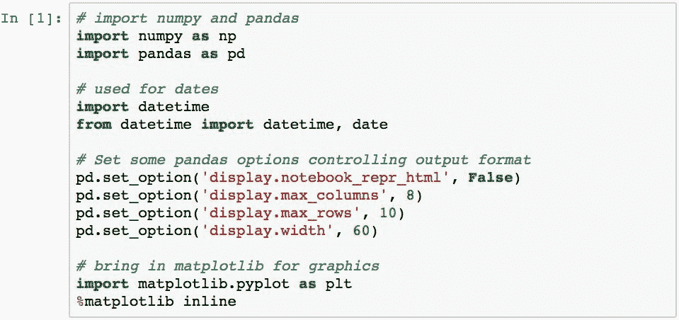

# 什么是整理您的数据？

**Tidy** data 是 Hadley Wickham 在名为“ Tidy Data”的论文中创造的术语。 我强烈建议您阅读本文。 可以从 [http://vita.had.co.nz/papers/tidy-data.p df](http://vita.had.co.nz/papers/tidy-data.pdf) 下载。

本文涵盖了创建整洁数据的过程的许多细节，最终结果是您拥有的数据毫无意外，可以进行分析。

我们将研究 Pandas 中用于整理数据的许多工具。 存在这些是因为我们需要处理以下情况：

*   变量的名称与您所需要的不同
*   *缺少*数据
*   值不在您要求的单位中
*   记录采样期不是您所需要的
*   变量是分类的，您需要定量的值
*   数据中存在*噪声*
*   信息类型不正确
*   数据围绕错误的轴组织
*   数据处于错误的规范化级别
*   数据重复

这是一个完整的列表，我向您保证它不完整。 但这都是我个人遇到的所有问题（而且我敢肯定，您也会遇到）。 当使用未明确构建的工具和语言来处理这些问题时（例如 Pandas），它们很难解决。 在本章中，我们将研究用 Pandas 解决这些问题有多么容易。

# 如何处理缺失的数据

当数据的`NaN`值（也称为`np.nan`-来自 NumPy 的形式）时，Pandas 中的**缺少**。 该`NaN`值意味着在特定的`Series`中没有为特定的索引标签指定值。

数据如何丢失？ 值可以为`NaN`的原因有很多：

*   两组数据的联接没有匹配的值
*   您从外部来源检索的数据不完整
*   在给定的时间点`NaN`值未知，稍后会填充
*   检索值时发生数据收集错误，但该事件仍必须记录在索引中
*   重新索引数据导致索引没有值
*   数据的形状已更改，现在有其他行或列，在重塑时无法确定
*   可能还有更多原因，但是总的来说，这些情况的确会发生，作为 Pandas 用户，您将需要解决这些情况才能进行有效的数据分析

让我们开始研究如何通过创建具有一些缺失数据点的 DataFrame 来处理缺失数据：

**这里没有**缺少任何数据，所以我们添加一些：

该`DataFrame`现在缺少显示以下特征的数据：

*   一行仅由`NaN`值组成
*   一列仅由`NaN`值组成
*   由数值和`NaN`值组成的几行和几列
*   现在，让我们研究各种技术来处理丢失的数据。

# 确定 Pandas 对象中的 NaN 值

可以使用`.isnull()`方法识别`DataFrame`对象中的`NaN`值。 任何`True`值表示该位置处的项目是`NaN`值：

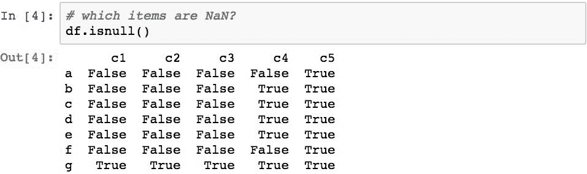

我们可以使用`.sum()`方法将`True`视为 1 并将`False`视为 0 的事实来确定`DataFrame`对象中`NaN`值的数量：

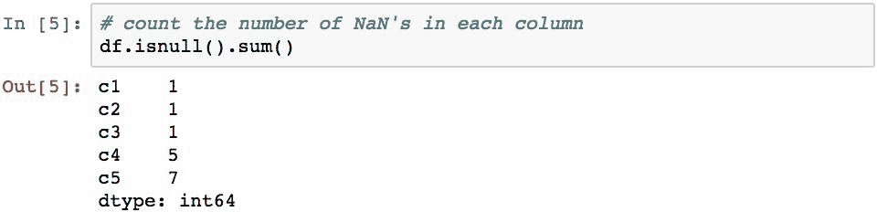

将`.sum()`应用于结果序列，可得出原始`DataFrame`对象中`NaN`值的总数：

这很棒，因为它可以很容易地识别出流程早期是否丢失了数据。 如果您希望数据是完整的，并且此简单检查将得出一个非 0 的值，那么您就需要更深入地了解。

另一种确定方法是使用`Series`对象和`DataFrame`的`.count()`方法。 对于`Series`方法，此方法将返回非`NaN`值的数量。 对于`DataFrame`对象，它将在
每列中计算非`NaN`值的数量：

然后需要将其翻转以求和`NaN`值的数量，该值可以如下计算：

我们还可以使用`.notnull()`方法确定某项是否不是`NaN`，如果该值不是`NaN`值，则该方法返回`True`。 否则，返回`False`：

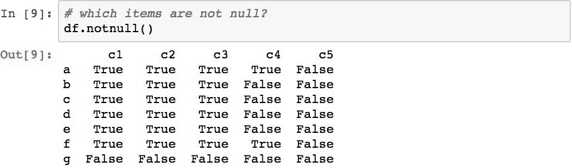

# 选择或删除丢失的数据

处理缺失数据的一种技术是简单地将其从数据集中删除。 这种情况的一种情况是，以固定的时间间隔对数据进行采样，但是设备处于脱机状态，因此不会记录读数。

Pandas 库使用多种技术使之成为可能。 一种是通过使用`.isnull()`或`.notnull()`的结果进行布尔选择来从`Series`对象中检索`NaN`或非`NaN`的值。 以下示例演示了从`DataFrame`的`c4`列中选择所有非`NaN`值的方法：

Pandas 还提供了一个便捷功能`.dropna()`，该功能将这些项放置在`Series`中，其值为`NaN`：

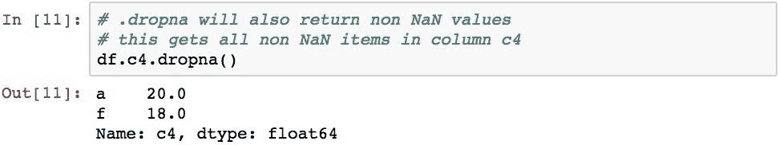

请注意，`.dropna()`实际上返回了`DataFrame`的副本，但没有行。 原始的`DataFrame`不变：

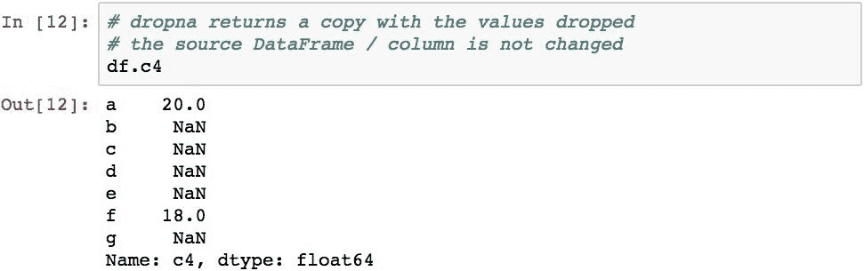

将`.dropna()`应用于`DataFrame`对象时，它将删除`DataFrame`对象中具有至少一个`NaN`值的所有行。 下面的代码演示了此操作，并且由于每一行至少具有一个`NaN`值，因此结果中有零行：

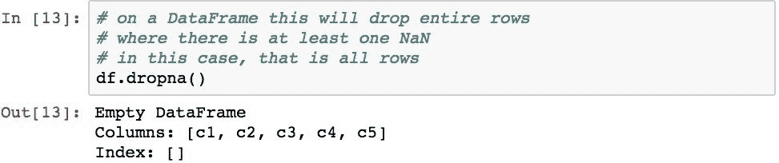

如果只想删除所有值均为`NaN`的行，则可以使用`how='all'`参数。 以下示例仅删除`g`行，因为它具有所有`NaN`值：

通过将 axis 参数更改为`axis=1`，这也可以应用于列而不是行。 以下内容删除了`c5`列，因为它是唯一具有所有`NaN`值的列：

现在，我们使用稍微不同的`DataFrame`对象检查该过程，该对象的列`c1`和`c3`的所有值都不为`NaN`。 在这种情况下，将删除`c1`和`c3`以外的所有列：

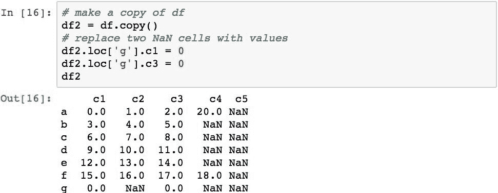

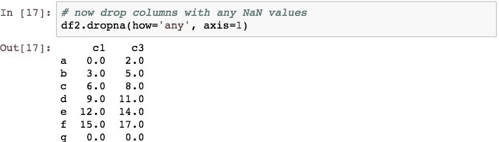

`.dropna()`方法还具有参数`thresh`，该参数在给定整数值时，指定执行删除之前必须存在的`NaN`值的最小数量。 以下代码删除所有具有至少五个`NaN`值的列（在这种情况下，这是`c4`和`c5`列）：

再次注意，`.dropna()`方法（和布尔选择）返回`DataFrame`对象的副本，并且数据从该副本中删除。 如果要将数据放入实际的`DataFrame`中，请使用`inplace=True`参数。

# 在数学运算中处理 NaN 值

`NaN`值在 Pandas 中的处理方式与在 NumPy 中的处理方式不同。 我们已经在较早的章节中看到了这一点，但是在这里值得重新讨论。 使用以下示例对此进行演示：

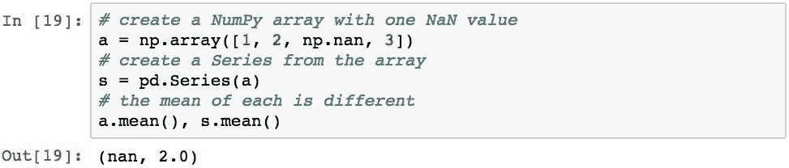

当 NumPy 函数遇到`NaN`值时，它返回`NaN`。 Pandas 函数通常会忽略`NaN`值，并继续处理该函数，就好像`NaN`值不属于`Series`对象的一部分一样。

请注意，先前系列的平均值计算为（1 + 2 + 3）/ 3 = 2，而不是（1 + 2 + 3）/ 4 或（1 + 2 + 0 + 4）/ 4。 这验证了`NaN`被完全忽略，甚至没有被计为`Series`中的项目。

更具体地说，Pandas 处理`NaN`值的方式如下：

*   数据求和将`NaN`视为 0
*   如果所有值均为`NaN`，则结果为`NaN`
*   像`.cumsum()`和`.cumprod()`这样的方法会忽略`NaN`值，但会将它们保留在结果数组中

下面演示了所有这些概念：

 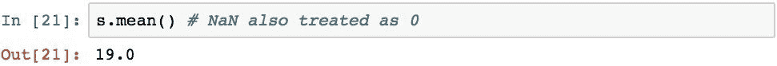 

但是，当使用传统的数学运算符时，`NaN`将传播到结果：

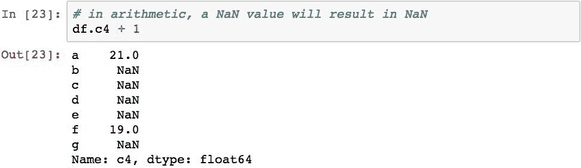

# 填写缺失的数据

`.fillna()`方法可用于将`NaN`值替换为特定值，而不是传播或忽略它们。 下面通过用`0`填充`NaN`值来说明这一点：

请注意，这会导致结果值有所不同。 例如，以下代码显示了将`.mean()`方法应用于具有`NaN`值的`DataFrame`对象的结果，与`DataFrame`对象的`NaN`值填充有`0`的结果相比 ：

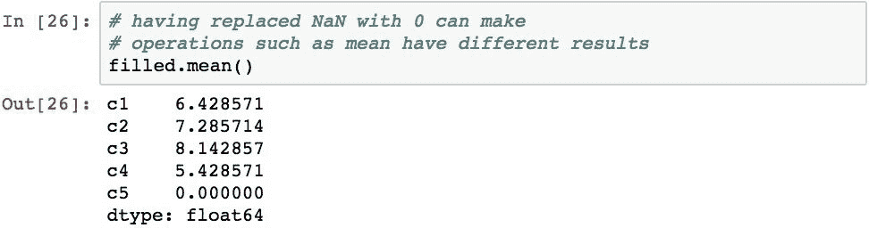

# 向前和向后填充缺失值

可以通过沿`Series`向前或向后传播非`NaN`值来填充数据中的间隙。 为了演示，以下示例将*向前填充*到`DataFrame`的`c4`列：

使用时间序列数据时，这种填充技术通常称为“最新已知值”。 我们将在有关时间序列数据的章节中对此进行重新讨论。

可以使用`method='bfill'`反转填充方向：

为了省去打字的麻烦，Pandas 还具有全局级别的功能`pd.ffill()`和`pd.bfill()`，它们等效于`.fillna(method="ffill")`和`.fillna(method="bfill")`。

# 使用索引标签填充

可以使用`Series`的标签或 Python 字典的键填充数据。 这使您可以根据索引标签的值为不同的元素指定不同的填充值：

 

仅填充`NaN`的值。 请注意，标签为`a`的值不会更改。

另一种常见情况是用列的平均值填充一列中的所有`NaN`值：

这很方便，因为以这种方式替换的缺失值会使统计平均值偏离（如果插入 0 的话）较小。 在某些统计分析中，当使用 0 值的较大偏差会导致错误故障时，这可能是可以接受的。

# 执行缺失值的插值

`DataFrame`和`Series`都具有`.interpolate()`方法，默认情况下，该方法执行缺失值的线性插值：

插值的值是通过在`NaN`值的任何序列之前和之后取第一个值，然后从头开始逐渐增加该值并替换为`NaN`值来计算的。 在这种情况下，周围的值为 2.0 和 1.0，导致（2.0-1.0）/（5-1）= 0.25，然后将其通过所有`NaN`值递增地添加。

这个很重要。 想象一下，如果您的数据代表一组增加的值，例如白天的温度升高。 如果传感器在几个采样周期内停止响应，则可以通过内插法以较高的确定性推断出丢失的数据。 绝对比将值设置为 0 更好。

插值方法还可以指定特定的插值方法。 常用方法之一是使用基于时间的插值。 请考虑以下`Series`日期和值：

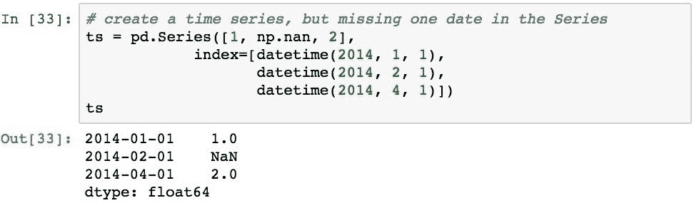

插值的先前形式导致以下结果：

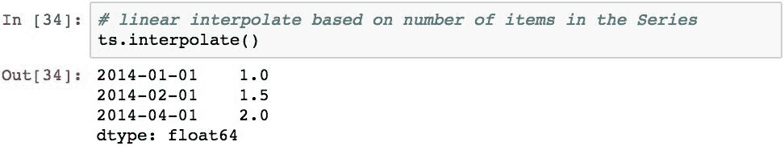

由于在值`2.0`和`1.0`之间存在一个`NaN`值，因此`2014-02-01`的值计算为 1.0 +（2.0-1.0）/ 2 = 1.5。

需要注意的重要一点是，该系列缺少 2014-03-01 的条目。 如果我们希望对每日值进行插值，则应该计算两个值，一个用于 2014-02-01，另一个用于 2014-03-01，从而在插值分子中产生另一个值。

这可以通过将插值方法指定为`time`来纠正：

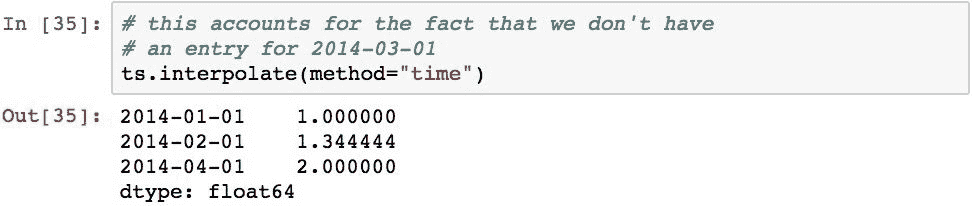

这是基于日期的`2014-02-01`的正确插值。 另请注意，`2014-03-01`的索引标签和值未添加到`Series`； 它只是考虑在内插中。

当使用数字索引标签时，也可以指定插值来计算相对于索引值的值。 为了说明这一点，我们将使用以下`Series`：

如果执行线性插值，则将获得标签`1`的以下值，该值对于线性插值是正确的：

但是，如果我们想插值相对于索引值怎么办？ 为此，我们可以使用`method="values"`：

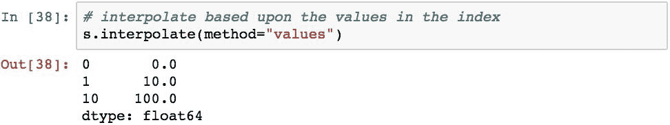

现在，基于索引中的标签，使用相对定位来插值`NaN`的计算值。 `NaN`值的标签为`1`，是
的
的十分之一，因此插值将为 0 +（100-0）/ 10 或[ `10`。

# 处理重复数据

样本中的数据通常可以包含重复的行。 这只是处理自动收集的数据的现实，甚至是手动收集数据时创建的情况。 在这些情况下，通常认为最好是在具有重复项而不是丢失数据的方面出错，特别是如果可以认为数据是等幂的。 但是，重复数据会增加数据集的大小，并且如果不是幂等的，则不适合处理重复数据。

Pandas 提供了`.duplicates()`方法，以方便查找重复数据。 此方法返回布尔值`Series`，其中每个条目表示该行是否重复。 `True`值表示特定行已早出现在`DataFrame`对象中，所有列值均相同。

下面通过创建具有
个重复行的`DataFrame`对象来演示此操作：

现在让我们检查重复项：

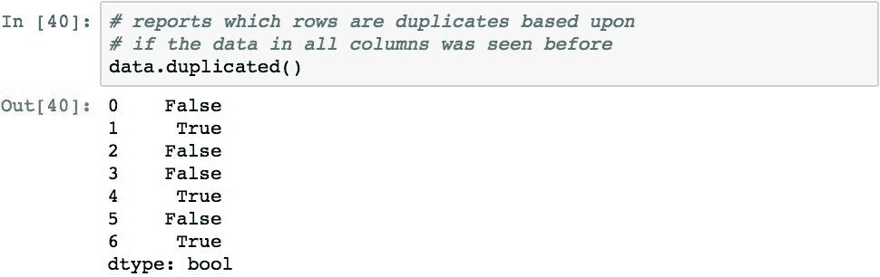

可以使用`.drop_duplicates()`方法从`DataFrame`中删除重复的行。 此方法返回`DataFrame`的副本，其中删除了重复的行：

也可以使用`inplace=True`参数删除行而不进行复制。

请注意，删除重复项时会保留索引。 重复记录可能具有不同的索引标签（在计算重复项时不考虑标签）。 因此，保留的行会影响结果`DataFrame`对象中的标签集。

默认操作是保留重复项的第一行。 如果要
保留重复项的最后一行，请使用`keep='last'`参数。
下面演示了使用此参数的结果如何不同：

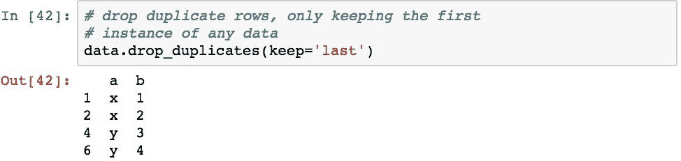

如果要基于较小的列集检查重复项，则可以指定列名列表：

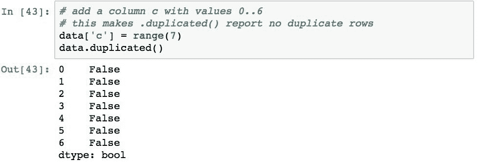 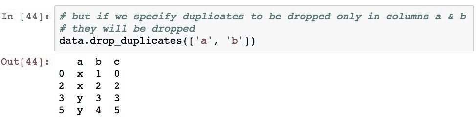

# 转换数据

整理数据的另一部分涉及将现有数据转换为另一个表示形式。 由于以下原因，可能需要这样做：

*   值的单位不正确
*   值是定性的，需要转换为适当的数值
*   多余的数据要么浪费内存和处理时间，要么仅被包括在内就可能影响结果

为了解决这些情况，我们可以采取以下一项或多项措施：

*   使用表查找过程将值映射到其他值
*   用其他值（甚至另一种类型的数据）明确替换某些值
*   应用方法以基于算法转换值
*   只需删除多余的列和行

我们已经了解了如何使用几种技术删除行和列，因此在此不再赘述。 现在，我们将介绍 Pandas 提供的用于根据其内容映射，替换和应用功能来转换数据的功能。

# 将数据映射到不同的值

数据转换的基本任务之一是将一组值映射到另一组。 Pandas 提供了使用`.map()`方法使用查找表（通过 Python 字典或 Pandas`Series`）映射值的通用功能。

该方法通过首先将外部`Series`的值与内部`Series`的索引标签进行匹配来执行映射。 然后，它返回一个新的`Series`，带有外部`Series`的索引标签，但具有内部`Series`的索引标签。

下面的示例显示如何将`x`索引中的标签映射到`y`的值：

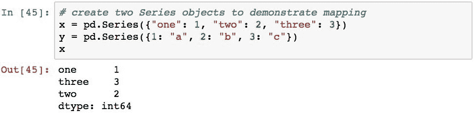
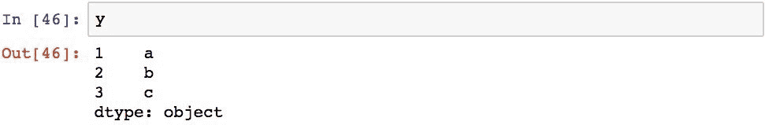 

与其他对齐操作一样，如果 Pandas 未在外部`Series`的值和内部`Series`的索引标签之间找到映射，则它将`NaN`填充该值。 为了演示，以下操作从外部`Series`删除了`3`键，这导致该记录的对齐失败，并导致引入了`NaN`值：

# 替换值

前面我们已经看到了如何使用`.fillna()`方法用您自己决定的值替换`NaN`值。 实际上，可以将`.fillna()`方法视为将单个值`NaN`映射到特定值的`.map()`方法的实现。

甚至更笼统地说，`.fillna()`方法本身可以被认为是`.replace()`方法提供的更通用替代品的专业化。 通过能够用另一个值替换任何值（不仅是`NaN`），此方法提供了更大的灵活性。

`.replace()`方法的最基本用途是将另一个值
替换为另一个值：

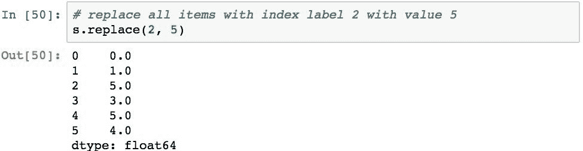

还可以指定多个要替换的项目，还可以通过传递两个列表（第一个要替换的值，第二个要替换的值）来指定它们的替换值：

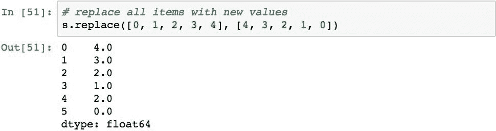

还可以通过指定用于查找的字典（上一部分中映射过程的变体）来执行替换：

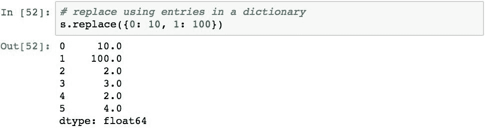

如果在`DataFrame`上使用`.replace()`，则可以为每列指定不同的替换值。 这是通过将 Python 字典传递给`.replace()`方法来执行的。 在此字典中，键表示要进行替换的列的名称，而字典的值指定要进行替换的位置。 方法的第二个参数是用于替换匹配项的值。

以下代码通过创建`DataFrame`对象，然后将每个列中的特定值替换为 100 来说明这一点：

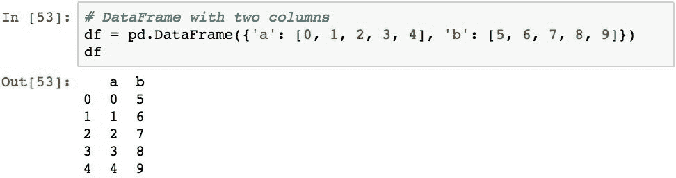 

替换每列中的特定值非常方便，因为它为否则需要编码遍历所有列的循环提供了快捷方式。

也可以替换特定索引位置的项目，就像它们缺少值一样。 以下代码通过将索引位置`0`处的值向前填充到位置`1`，`2`和`3`中来演示此操作：

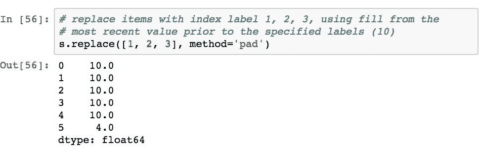

也可以通过使用`ffill`和`bfill`作为指定方法来向前和向后填充，但是这些都是练习，您可以自己尝试。

# 应用函数转换数据

在直接映射或替换无法满足要求的情况下，可以将函数应用于数据以对数据执行算法。 Pandas 提供了将功能应用于单个项目，整个列或整个行的功能，从而为转换提供了难以置信的灵活性。

可以使用方便命名的`.apply()`方法来应用功能。 当给定 Python 函数时，此方法在从`Series`传递每个值的同时迭代调用该函数。 如果将 Pandas 应用于`DataFrame`，Pandas 将以`Series`的形式通过每一列，或者如果沿着`axis=1`进行 Pandas，则将以代表每一行的`Series`形式通过。

下面通过对`Series`的每个项目应用 lambda 函数来说明这一点：

将函数应用于`Series`中的项目时，仅每个`Series`项目的值将传递给函数，而不是索引标签和值。

将功能应用于`DataFrame`时，默认值为将方法应用于每一列。 Pandas 遍历所有列，并将每个列作为`Series`传递给您的函数。 结果是一个`Series`对象，其索引标签与列名称匹配，并且该函数的结果应用于该列：

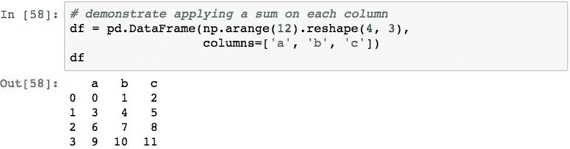

通过指定`axis=1`，可以将功能的应用切换为每一行的值：

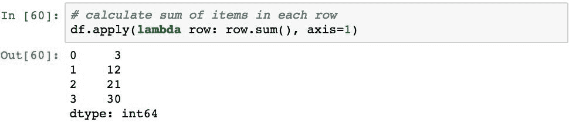

常见的做法是获取应用操作的结果并将其添加为`DataFrame`的新列。 这很方便，因为您可以将一个或多个连续计算的结果添加到`DataFrame`上，从而为自己提供过程每一步结果的渐进表示。

以下代码演示了此过程。 第一步将列`a`与列`b`相乘，并创建一个名为`interim`的新列。 第二步，将这些值和列`c`相加，并使用这些值创建`result`列：

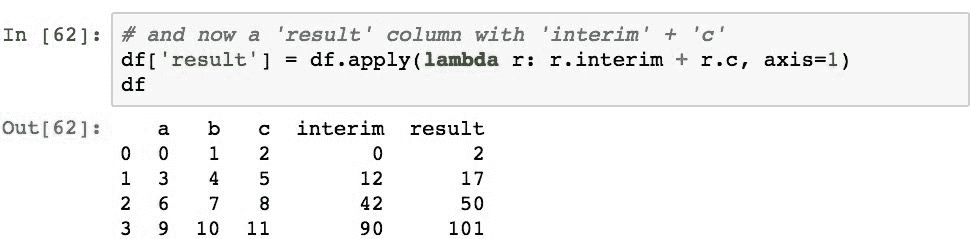

如果您想更改现有列中的值，只需将结果分配给现有列即可。 下面将`a`列的值更改为该行中值的总和：

实际上，用全新的值替换列并不是最好的处理方式，并且经常导致临时（甚至可能是永久性的）精神错乱，试图调试由丢失数据引起的问题。 因此，在 Pandas 中，最好只添加新的行或列（或全新的对象），并且如果以后内存或性能成为问题，请根据需要进行优化。

要注意的另一点是，Pandas`DataFrame`不是电子表格，在电子表格中为单元分配了公式，并且当公式引用的单元发生更改时可以重新计算。 如果您希望这种情况发生，那么只要相关数据发生变化，就需要执行公式。 从另一方面来说，这比电子表格更有效，因为每个小的更改都不会引起一系列操作。

`.apply()`方法始终将提供的功能应用于`Series`，列或行中的所有项目。 如果要将功能应用于这些功能的子集，请首先执行布尔选择以过滤不希望处理的项目。

下面通过创建值的`DataFrame`并将一个`NaN`值插入第二行来说明这一点。 然后，它仅将函数应用于所有值都不都是`NaN`的那些行：

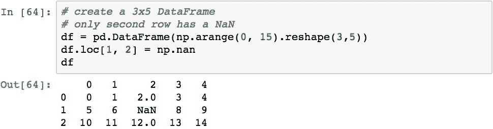

我们将在本章中介绍的最后一种方法是使用`DataFrame`的`.applymap()`方法应用功能。 尽管`.apply()`方法始终传递整个行或列，但`.applymap()`函数将函数应用于每个值。

下面演示了通过使用`.applymap()`方法将`DateFrame`中的每个值格式化为指定的小数位数的实际用法：

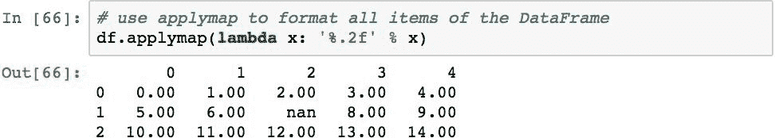

# 摘要

在本章中，我们研究了整理数据的各种技术。 我们介绍了如何识别丢失的数据，将其替换为其他值，或者将其从整个数据集中删除。 然后，我们介绍了如何将值转换为更适合进一步分析的其他值。

现在，我们已经在 DataFrame 或系列中整理了数据，我们希望从专注于数据的整洁度转向更精细的修改数据结构的形式，例如串联，合并，联接和数据透视。 这将是下一章的重点。