# 合并，关联和重塑数据

数据通常被建模为一组实体，相关值的逻辑结构由名称（属性/变量）引用，并具有按行组织的多个样本或实例。 实体往往代表现实世界中的事物，例如一个人，或者在物联网中，是一个传感器。 然后，使用单个 DataFrame 对每个特定实体及其度量进行建模。

通常需要在模型中的实体上和实体之间执行各种任务。 可能需要将来自多个位置的多个客户实体的数据组合到单个 Pandas 对象中。 客户和订单实体通常与查找订单的送货地址有关。 仅仅因为不同的源对相同类型的实体进行不同的建模，可能还需要将存储在一个模型中的数据重塑为另一个模型。

在本章中，我们将研究这些操作，这些操作使我们可以在模型中合并，关联和重塑数据。 具体而言，在本章中，我们将研究以下概念：

*   串联多个 Pandas 对象中的数据
*   合并多个 Pandas 对象中的数据
*   如何控制合并中使用的联接类型
*   在值和索引之间往返数据
*   堆叠和堆叠数据
*   在宽和长格式之间来回融合数据

# 配置 Pandas

我们使用以下导入和配置语句开始本章中的示例：

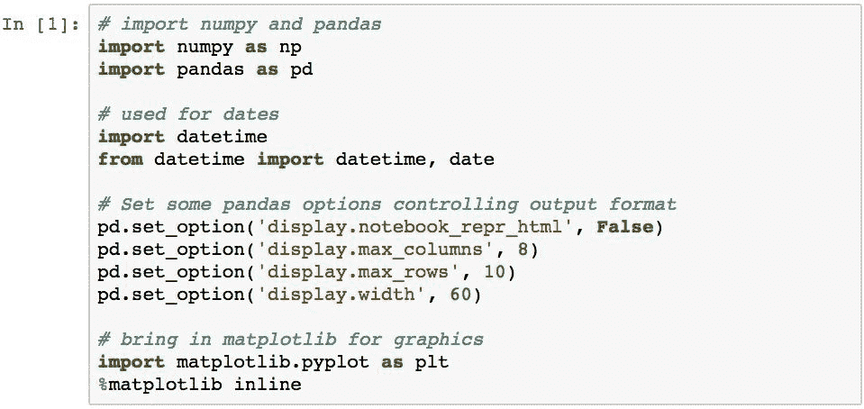

# 串联多个对象中的数据

**串联**是将来自两个或多个 Pandas 对象的数据组合到一个新对象中的过程。 `Series`对象的连接只会产生一个新的`Series`，并按顺序复制值。

连接`DataFrame`对象的过程更加复杂。 串联可以应用于指定对象的任一轴，并且 Pandas 沿着该轴对索引标签执行关系联接逻辑。 然后，Pandas 沿着相反的轴对标签进行对齐并填充缺失值。

由于有许多因素需要考虑，因此我们将分解示例分为以下主题：

*   了解串联的默认语义
*   切换对齐轴
*   指定联接类型
*   附加数据而不是串联
*   忽略索引标签

# 了解串联的默认语义

使用 Pandas 函数`pd.concat()`进行串联。 连接数据的一般语法是传递要连接的对象列表。 下面演示了两个`Series`对象`s1`和`s2`的简单连接：

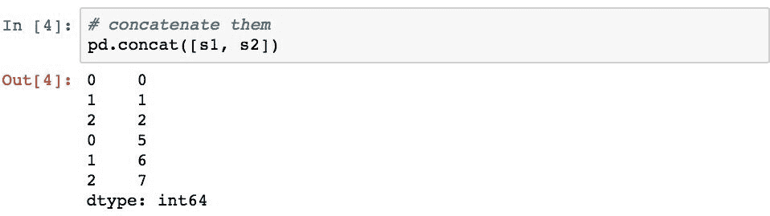

这将`s2`的索引标签和值连接到`s1`的索引标签和值的末尾。 由于在此过程中未执行对齐，因此导致索引标签重复。

两个`DataFrame`对象也可以以类似的方式串联：

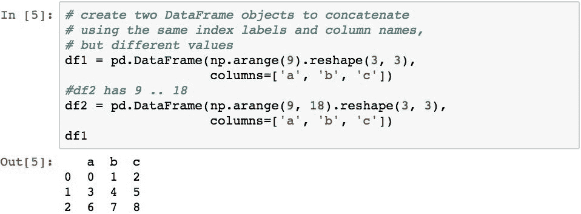

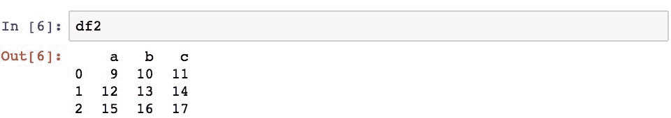

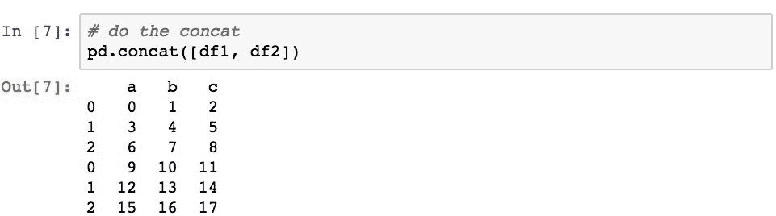

默认功能导致按顺序附加行，并且可能导致沿行索引出现重复的索引标签。

列标签的结果集由指定`DataFrame`对象中的索引标签的并集定义。 这是应用于所有源对象的对齐方式（可以有两个以上）。 如果结果中的列在当前正在处理的`DataFrame`对象中不存在，则 Pandas 将插入`NaN`值。

以下内容演示了在串联过程中两个`DataFrame`对象的对齐方式，其中有共同的列（`a`和`c`）和不同的列（`df1`中的`b`和`df2`中的`d`） ：

`df1`不包含列`d`，因此结果那部分中的值为`NaN`。 `df2`和列`b`也会发生相同的情况。

可以使用`keys`参数为结果中的每组数据赋予其自己的名称。 这将在`DataFrame`对象上创建层次结构索引，该索引使您可以通过`DataFrame`对象的`.loc`属性独立地引用每组数据。 如果以后需要确定结果`DataFrame`对象中的数据的来源，这将很方便。

下面通过为每个原始`DataFrame`对象分配名称，然后检索源自`df2`对象（现在已标记为`'df2'`标签）的行来演示此概念：

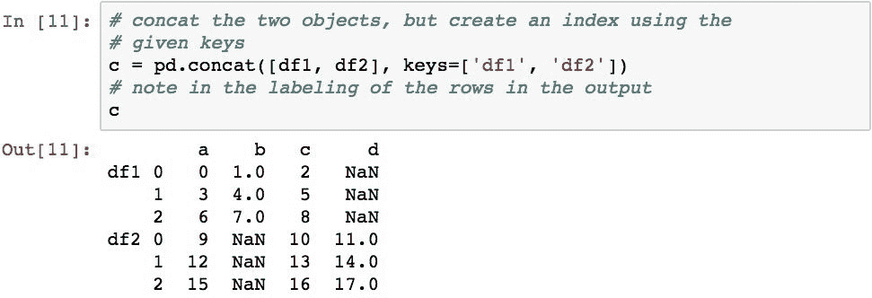

然后，这些键可用于子选择特定的数据集：

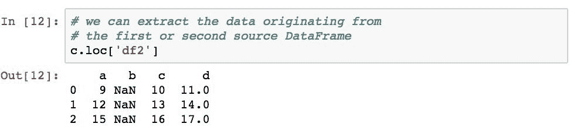

# 对齐轴切换

`pd.concat()`功能允许您指定级联期间在其上应用对齐的轴。 以下内容将两个`DataFrame`对象沿列轴连接在一起，将对齐方式更改为沿行索引：

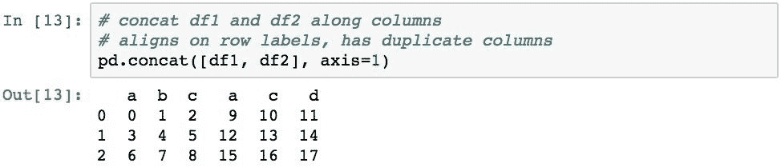

现在，此结果包含重复的列。 这是因为串联首先按每个`DataFrame`对象的行索引标签对齐，然后从第一个`DataFrame`对象然后是第二个对象填充列，而不考虑行索引标签。

以下内容演示了沿着列轴与两个`DataFrame`对象（具有多个共同的行索引标签）（`2`和`3`）以及不相交的行（`df1`和[[ `df3`中的`4`）。 另外，`df3`中的几列与 df1（`a`）重叠并且不相交（`d`）：

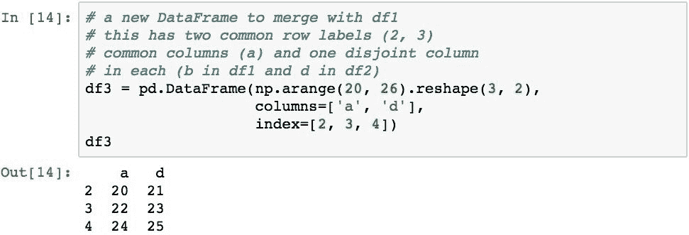

由于对齐是沿着行标签进行的，因此列最终会重复。 然后，行具有`NaN`值，其中源对象中不存在列。

# 指定联接类型

默认串联实际上沿着与串联相反的轴（行索引）上的索引标签执行**外连接**操作。 这使得标签的结果集类似于执行那些标签的并集。

通过将`join='inner'`指定为参数，可以将联接的类型更改为**内部联接**。 然后，内部联接在逻辑上执行标签的交集而不是并集。 下面的示例对此进行了演示并得出了单行的结果，因为`2`是唯一的共同行索引标签：

当沿`axis=1`应用串联时，还可以使用`keys`参数沿列标记数据组：

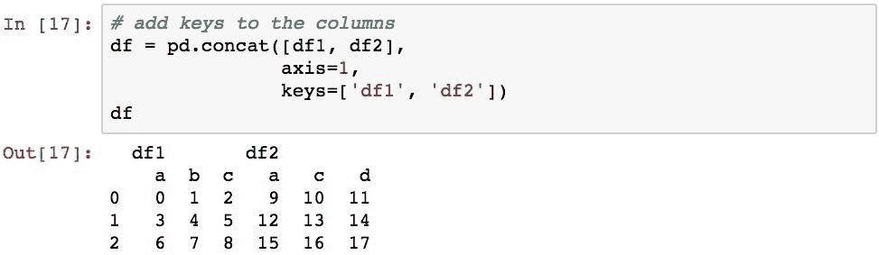

可以使用`.loc`属性和切片来访问不同的组：

# 追加与串联

`DataFrame`（和`Series`）对象还包含`.append()`方法，该方法将两个指定的`DataFrame`对象沿着行索引标签连接起来：

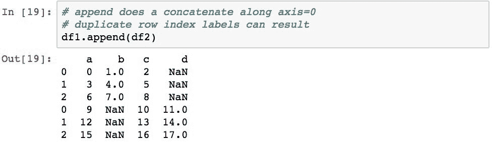

与在`axis=1`上进行串联连接一样，在不考虑创建重复项的情况下复制行中的索引标签，并且以确保在结果中不包含重复的列名的方式连接列标签。

# 忽略索引标签

如果要确保结果索引没有重复项并保留所有行，则可以使用`ignore_index=True`参数。 除了新的`Int64Index`之外，这基本上返回相同的结果：

此操作也可以在串联上使用。

# 合并和合并数据

Pandas 允许使用`pd.merge()`函数和`DataFrame`对象的`.merge()`方法，将 pandas 对象与类似数据库的联接操作合并。 合并通过在一个或多个列或行索引中查找匹配值来合并两个 Pandas 对象的数据。 然后，基于应用于这些值的类似关系数据库的联接语义，它返回一个新对象，该对象代表来自两者的数据的组合。

合并非常有用，因为它们允许我们为每种类型的数据（拥有整洁数据的规则之一）建模单个`DataFrame`，但能够使用两组数据中都存在的值来关联不同`DataFrame`对象中的数据 数据。

# 合并来自多个 Pandas 对象的数据

合并的一个实际示例是从订单中查找客户名称。 为了在 Pandas 中证明这一点，我们将使用以下两个`DataFrame`对象。 一个代表客户详细信息列表，另一个代表客户所下的订单以及订单的生成日期。 它们将通过各自的`CustomerID`列相互关联。

现在假设我们想将订单运送给客户。 我们需要将`orders`数据与`customers`详细数据合并，以确定每个订单的地址。 可以使用以下语句轻松执行此操作：

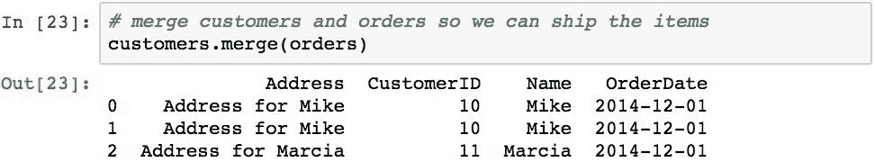

Pandas 能够通过如此简单的代码来完成这项工作，从而为我们做了神奇的事情。 已经意识到，我们的`customers`和`orders`对象都有一个名为`CustomerID`的列，并且已经了解了这一点。 它使用在两个`DataFrame`对象的该列中找到的公共值来关联两个数据，并基于内部联接语义形成合并的数据。

为了更详细地说明发生的情况，以下是 Pandas 的具体工作：

1.  它确定`customers`和`orders`中带有公共标签的列。 这些列被视为执行联接的键。
2.  它创建一个新的`DataFrame`，其列是在步骤 1 中标识的键的标签，然后是两个对象中的所有非键标签。
3.  它与两个`DataFrame`对象的键列中的值匹配。
4.  然后，它为每组匹配的标签在结果​​中创建一行。
5.  然后，它将来自每个源对象的那些匹配行中的数据复制到结果的相应行和列中。
6.  它将新的`Int64Index`分配给结果。

合并中的联接可以使用多个列中的值。 为了演示，下面创建两个`DataFrame`对象，并使用两个对象的`key1`和`key2`列中的值执行合并：

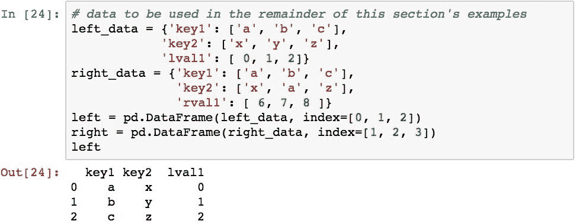

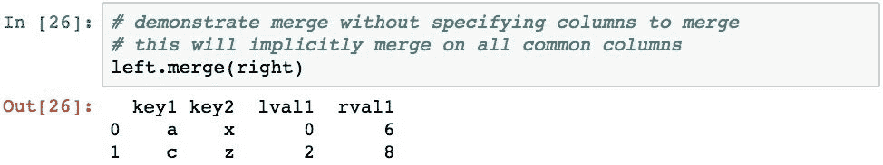

此合并标识`key1`和`key2`列在两个`DataFrame`对象中是公用的。 这些列的两个`DataFrame`对象中值的匹配元组分别为[`a`，`x`和（`c`，`z`），因此，这将导致两行值。

要显式指定用于关联对象的列，可以使用`on`参数。 下面通过仅使用两个`DataFrame`对象的`key1`列中的值执行合并来演示此操作：

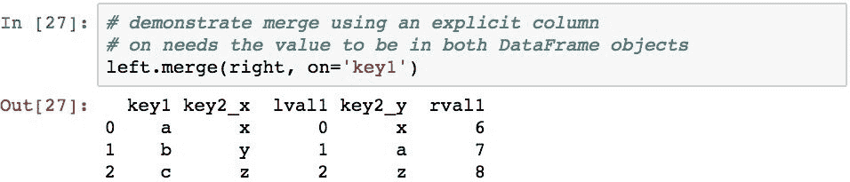

将该结果与前面的示例进行比较，该结果现在具有三个
行，因为在两个对象的该单个列中都有匹配的`a`，`b`和`c`值。

还可以为`on`参数提供列名列表。 以下内容恢复为同时使用`key1`和`key2`列，其结果与前面的示例相同，在前一个示例中，这两列被 Pandas 隐式标识：

在两个`DataFrame`对象中都必须存在用`on`指定的列。 如果要基于每个对象中具有不同名称的列进行合并，则可以使用`left_on`和`right_on`参数，将列的名称传递给每个参数。

要与两个`DataFrame`对象的行索引的标签执行合并，可以使用`left_index=True`和`right_index=True`参数（均需要指定）：

这已确定共同的索引标签为`1`和`2`，因此生成的`DataFrame`具有两行，其中包含这些值和索引中的标签。 然后，Pandas 在结果中为两个对象中的每一列创建一列，然后复制值。

由于两个`DataFrame`对象都有一个具有相同名称`key`的列，结果中的这些列将附加`_x`和`_y`后缀以标识它们源自的`DataFrame`对象。 `_x`用于左侧，`_y`用于右侧。 您可以使用`suffixes`参数并传递两个项目的序列来指定这些后缀。

# 指定合并操作的联接语义

`pd.merge()`执行的默认联接类型是**内部联接**。 要使用另一种联接方法，请使用`pd.merge()`函数的 how 参数（或`.merge()`方法）指定联接类型。 有效选项是：

*   `inner`：这是两个`DataFrame`对象的键的交集
*   `outer`：这是来自两个`DataFrame`对象的键的并集
*   `left`：仅使用左侧的`DataFrame`键
*   `right`：仅使用右侧`DataFrame`中的键

如我们所见，内部联接是默认的，它仅在值匹配的情况下才从两个`DataFrame`对象返回数据合并。

相比之下，外部联接从左侧和右侧`DataFrame`对象返回匹配的行的合并和不匹配的值，但是在不匹配的部分填充`NaN`。 以下代码演示了外部联接：

左联接将返回满足指定列中值联接的行的合并，并且仅返回`left`中不匹配的行：

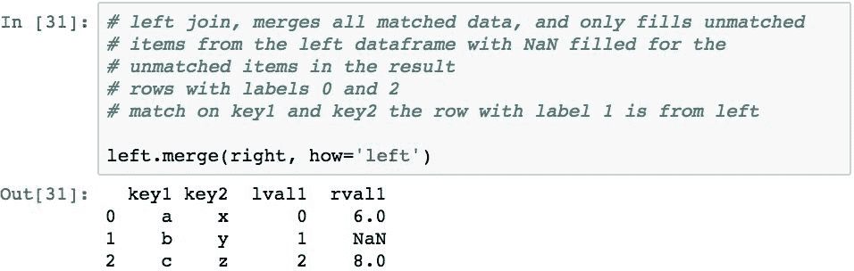

右联接将返回满足指定列中值联接的行的合并，并且仅返回`right`中不匹配的行：

pandas 库还提供了`.join()`方法，该方法可用于使用两个`DataFrame`对象的索引标签（而不是列中的值）执行联接。 请注意，如果两个`DataFrame`对象中的列没有唯一的列名，则必须使用`lsuffix`和`rsuffix`参数指定后缀（与合并一样，不执行自动后缀）。 以下代码演示了后缀的联接和规范：

执行的默认联接类型是外部联接。 请注意，这与`.merge()`方法的默认值不同，该方法的默认值为 inner。 要更改为内部联接，请指定`how='inner'`，如以下示例所示：

请注意，这与`Out [29]`的早期结果大致相同，除了结果的列名称稍有不同。

也可以执行左右连接，但是它们导致的结果与前面的示例相似，因此为简洁起见，将省略它们。

# 数据往返于值和索引之间

数据通常以堆积格式存储，也称为记录格式。 这在数据库，`.csv`文件和 Excel 电子表格中很常见。 在堆叠格式中，数据通常不规范化，并且在许多列中具有重复的值，或者在逻辑上应存在于其他表中的值（违反了整洁数据的另一个概念）。

取得以下数据，这些数据代表来自加速度计上的数据流。

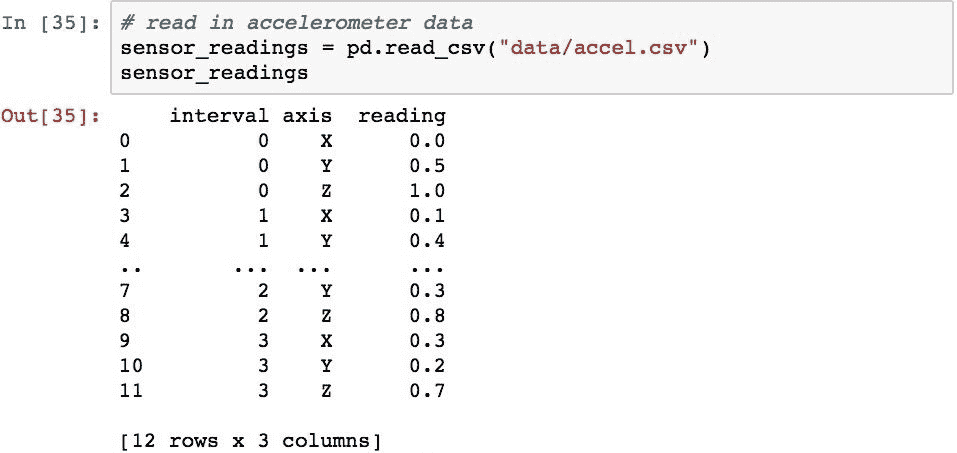

这种数据的组织问题是：如何确定特定轴的读数？ 这可以通过布尔选择天真地完成：

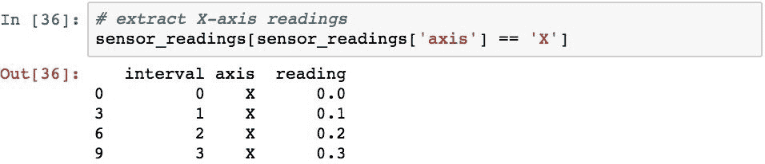

这里的问题是，如果您想知道给定时间所有轴的值而不仅仅是`x`轴，该怎么办。 为此，您可以为轴的每个值执行选择，但这是重复的代码，并且在不更改代码的情况下无法处理将新的轴值插入`DataFrame`的情况。

更好的表示方式是，列代表唯一的变量值。 要转换为这种形式，请使用`DataFrame`对象的`.pivot()`函数：

这已从 axis 列获取了所有不同的值，并将它们旋转到新`DataFrame`上的列中，同时为原始`DataFrame`的适当行和列中的新列填充了值。 这个新的`DataFrame`证明了现在很容易在每个时间间隔识别`X`，`Y`和`Z`传感器读数。

# 堆放

与枢轴功能相似的是`.stack()`和`.unstack()`方法。 堆叠过程将列标签的级别旋转到行索引。 取消堆叠执行相反的操作，即将行索引的某个级别旋转到列索引中。

堆叠/拆栈与执行枢轴之间的区别之一是，与枢轴不同，堆叠和拆栈功能能够枢转层次结构索引的特定级别。 同样，在枢轴在索引上保留相同数量的级别的情况下，堆叠和非堆叠总是会增加其中一个轴（用于堆叠的列和用于堆叠的行）的索引上的级别，而会降低另一轴上的级别。

# 使用非分层索引进行堆栈

为了演示堆栈，我们将看几个使用带有非分层索引的`DataFrame`对象的示例。 我们将使用以下`DataFrame`开始示例：

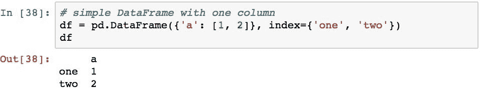

堆叠会将列索引的一级移到行索引的新级。 由于我们的`DataFrame`只有一个级别，因此这会将`DataFrame`对象折叠为具有分层行索引的`Series`对象：

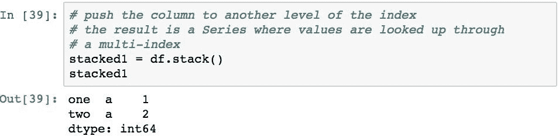

要访问值，我们现在需要将一个元组传递给`Series`对象的索引器，该对象仅使用索引进行查找：

如果`DataFrame`对象包含多个列，则所有列都将移至新`Series`对象的相同附加级别：

现在可以使用带有索引的元组语法访问以前属于不同列的值：

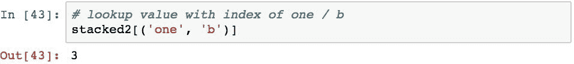

通过将行索引的高度移动到列轴的高度，拆栈将在相反的方向上执行类似的操作。 在下一部分中，我们将检查此过程，因为通常情况下，堆栈假设假定要进行索引的索引是分层的。

# 使用层次结构索引进行堆叠

为了演示分层索引的拆栈，我们将重新访问本章前面看到的传感器数据。 但是，我们将在测量数据中增加一列，以表示多个用户的读数，并复制两个用户的数据。 以下设置了此数据：

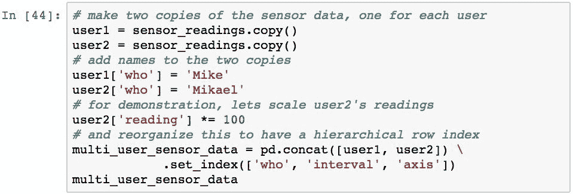

利用数据中的这种组织，我们可以执行以下操作：仅使用索引检查特定人员的所有读数：

我们还可以使用`.xs()`间隔`1`获取所有轴和所有用户的所有读数：

取消堆叠会将行索引的最后一级移动到列索引的新级别，从而导致列具有`MultiIndex`。 以下内容演示了此堆栈的最后一层（索引的`axis`层）：

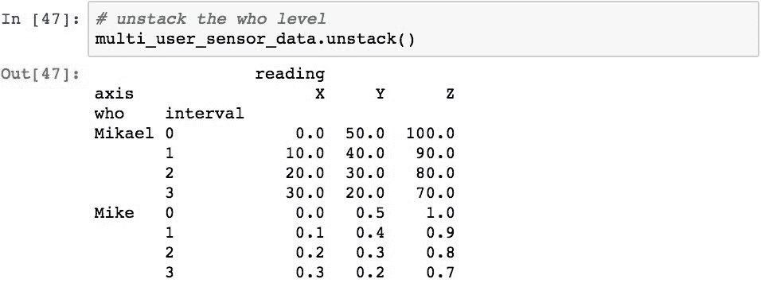

要取消堆叠其他级别，请使用`level`参数。 以下代码将第一层（`level=0`）拆栈：

通过将级别列表传递到`.unstack()`可以同时取消堆叠多个级别。 此外，如果已命名级别，则可以通过名称而不是位置来指定它们。 以下按名称拆解`who`和`axis`级别：

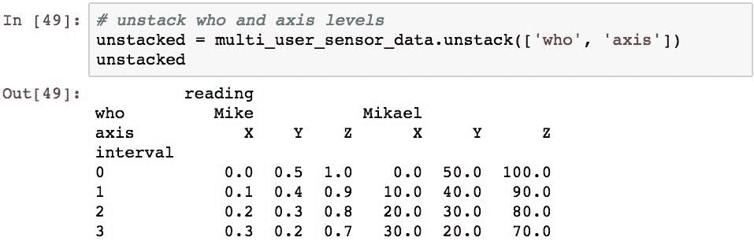

确切地说，我们可以重新堆叠这些数据。 下面的代码会将列的`who`级别堆叠回到行索引中：

关于此结果，有两点值得指出。 首先，堆栈和堆栈总是将级别移动到另一个索引的最后级别。 请注意，`who`级别现在是行索引的最后一个级别，但它较早开始作为第一个级别。 这将对通过该索引访问元素的代码产生影响，因为它已更改为另一个级别。 如果您想将一个级别放回另一个位置，则需要使用堆栈和堆栈以外的其他方法来重新组织索引。

其次，随着所有这些数据移动，堆栈和堆栈（以及数据透视）不会丢失任何信息。 他们只是改变组织和访问它的方式。

# 在长格式和宽格式之间进行数据融合

熔化是一种不可旋转的类型，通常称为将`DataFrame`对象从**宽格式**更改为**长格式**。 这种格式在各种统计分析中很常见，并且您读取的数据可能已经以融合形式提供。 或者，您可能需要将这种格式的数据传递给期望该组织的其他代码。

从技术上讲，熔化是将`DataFrame`对象整形为
格式的过程，其中通过不旋转`variable`列中的列标签来创建两个或更多列，分别称为`variable`和`value` ，然后将数据从这些列移到`value`列中的适当位置。 然后将所有其他列制作为有助于描述数据的标识符列。

通常使用一个简单的例子可以最好地理解熔化的概念。 在此示例中，我们从一个`DataFrame`对象开始，该对象表示两个变量的测量值，每个变量用其自己的列`Height`和`Weight`表示，还有一个附加列表示人并由`Name`列指定：

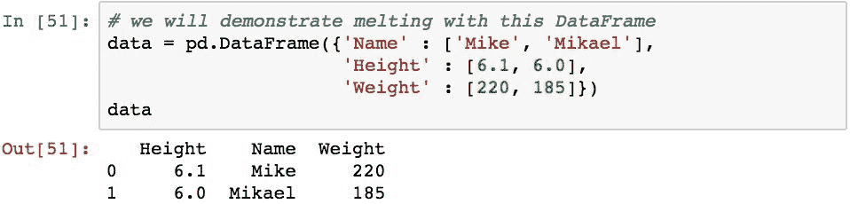

下面使用`Name`列作为标识符列，并使用`Height`和`Weight`列作为测量变量来融化`DataFrame`。 `Name`列保留，而`Height`和`Weight`列未旋转到`variable`列中。 然后，将这两列中的值重新排列到`value`列中，并确保与原始数据中已经存在的`Name`和`variable`的适当组合值对齐：

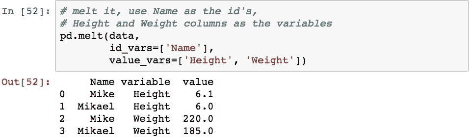

现在对数据进行了重组，因此很容易提取`variable`和`Name`的任何组合的值。 此外，采用这种格式更容易添加新的变量和度量，因为可以简单地将数据添加为新行，而不需要通过添加新列来更改`DataFrame`的结构。

# 堆叠数据的性能优势

最后，我们将研究为什么要堆叠数据。 可以证明，堆叠数据比通过单个级别索引进行查询然后再进行列查询，甚至与按位置指定行和列的`.iloc`查找相比，效率更高。 以下内容说明了这一点：

如果需要从`DataFrame`中重复访问大量标量值，则这对应用程序性能可能具有极大的好处。

# 摘要

在本章中，我们研究了在一个或多个`DataFrame`对象中合并和重塑数据的几种技术。 我们通过检查如何组合来自多个 Pandas 对象的数据来开始本章。 然后，我们研究了如何沿行轴和列轴连接多个`DataFrame`对象。 由此，我们随后研究了如何基于多个`DataFrame`对象中的值，使用 Pandas 执行类似于数据库的连接和数据合并。

然后，我们研究了如何使用枢轴，堆叠和融合来重塑`DataFrame`中的数据。 通过这一过程，我们看到了每个过程如何通过改变索引的形状以及将数据移入和移出索引来提供如何移动数据的多种变体。 这向我们展示了如何以有效地从其他形式查找数据的格式组织数据，这可能会给数据提供者带来更多便利。

在下一章中，我们将学习有关分组和对这些组中的数据进行汇总分析的知识，这将使我们能够基于数据中的相似值来得出结果。