# 资料汇总

数据聚合是根据信息的某些有意义的类别对数据进行分组的过程。 然后对每个组进行分析，以报告每个组的一个或多个摘要统计信息。 在这种意义上，这种概括是一个通用术语，其中*概括*可以从字面上是求和（例如，售出的产品总数）或统计计算（例如，均值或标准差）。

本章将研究 Pandas 执行数据聚合的功能。 这包括强大的拆分应用组合模式，用于分组，执行组级别的转换和分析，以及报告汇总 Pandas 对象中每个组的结果。 在此框架内，我们将研究几种对数据进行分组，在组级别上应用功能以及能够过滤数据进出分析的技术。

具体而言，在本章中，我们将介绍：

*   数据分析的拆分，应用和合并模式概述
*   按单个列的值分组
*   访问 Pandas 分组的结果
*   使用多列中的值进行分组
*   使用索引级别分组
*   将聚合功能应用于分组数据
*   数据转换概述
*   转换的实际示例：填充均值和 z 分数
*   使用过滤来有选择地删除数据组
*   离散化和分级

# 配置 Pandas

本章中的示例使用以下导入和配置语句：

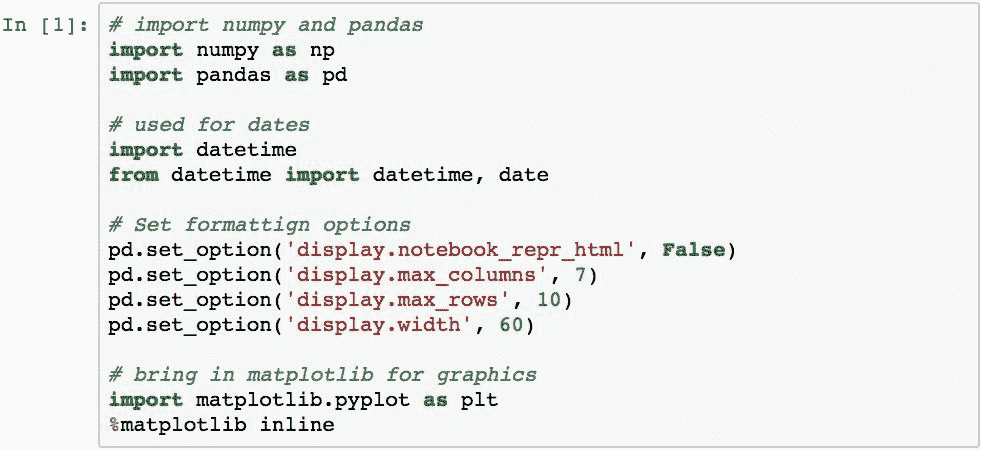

# 分割，应用和合并（SAC）模式

许多数据分析问题利用称为**拆分应用合并**的数据处理模式。 在这种模式下，采取了三个步骤来分析数据：

*   根据特定条件将数据集分成较小的部分
*   这些部件中的每一个都是独立操作的
*   然后将所有结果合并回一个单元

下图演示了一个简单的拆分应用组合过程，该过程用于计算由基于字符的键（a 或 b）分组的值的平均值：

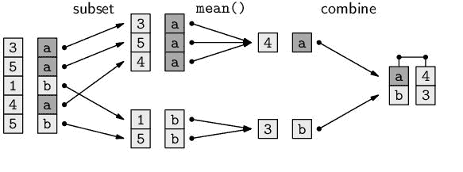

然后，数据由索引标签分为两组（a 和 b 一组）。 计算每组中值的平均值。 然后，将来自该组的结果值组合到一个 Pandas 对象中，该对象将通过代表每个组的标签进行索引。

使用`Series`或`DataFrame`的`.groupby()`方法执行 Pandas 拆分。 给此方法一个或多个索引标签和/或列名； 他们将根据关联的值对数据进行分组。

拆分数据后，可以对每个组执行以下一种或多种操作类别：

*   **汇总**：计算汇总统计信息，例如组均值或每个组中项目的计数
*   **转换**：执行特定于组或项目的计算
*   **过滤**：根据组级计算删除整个数据组

最后一个阶段，合并，由 Pandas 自动执行，Pandas 收集应用阶段的结果并构建单个合并结果。

有关拆分应用合并的更多信息，《统计软件杂志》上有一篇论文，标题为“ *数据分析拆分应用联合策略”* 。 本文将详细介绍该模式，尽管在示例中使用了 R，但对于学习 Pandas 的人来说仍然是有价值的读物。 您可以在 [http://www.jstatsoft.org/v40/i01/paper](http://www.jstatsoft.org/v40/i01/paper) 上获得此论文。

# 示例数据

本章中的示例将利用代表几个设备传感器测量值的数据集。 数据由加速度计和方向传感器的 **X** ， **Y** 和 **Z** 轴上的读数组成：

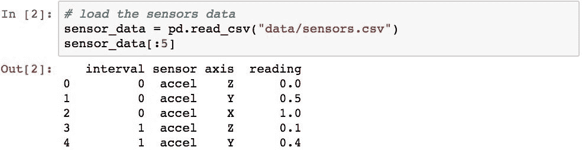

# 分割数据

我们对在 Pandas 对象内拆分数据的检查将分为几个步骤。 首先，我们将基于列创建分组，然后检查所创建分组的属性。 然后，我们将检查访问各种属性和分组的结果，以了解所创建组的多个属性。 然后，我们将使用索引标签而不是列中的内容来检查分组。

# 按单个列的值分组

传感器数据由三个类别变量（`sensor`，`interval`和`axis`）和一个连续变量（`reading`）组成。 通过将其名称传递给`.groupby()`，可以对任何单个类别变量进行分组。 以下代码按传感器列中的值对传感器数据进行分组：


`DataFrame`上的`.groupby()`的结果是`GroupBy`对象的子类，其中`DataFrame`的`DataFrameGroupBy`或`Series`的`SeriesGroupBy`。 该对象表示最终将要执行的分组的临时描述。 该对象帮助 Pandas 在执行之前首先验证相对于数据的分组。 这可以帮助优化和识别错误，并为您提供了一个点，您可以在此之前检查某些属性，而这可能是昂贵的计算过程。

此临时对象具有许多有用的属性。 `.ngroups`属性将检索结果中将形成的组数：


`.groups`属性将返回一个 Python 字典，该字典的键代表每个组的名称（如果指定了多列，则为元组）。 字典中的值是每个相应组中包含的索引标签的数组：

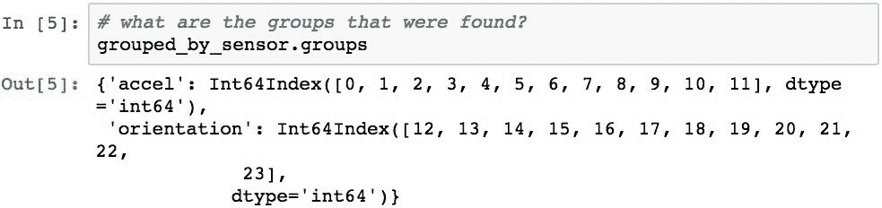

# 访问分组结果

可以将`grouped`变量视为已命名组的集合，并且可用于检查组的内容。 让我们使用以下函数检查这些分组：


此函数将遍历每个组并打印其名称和前五行：

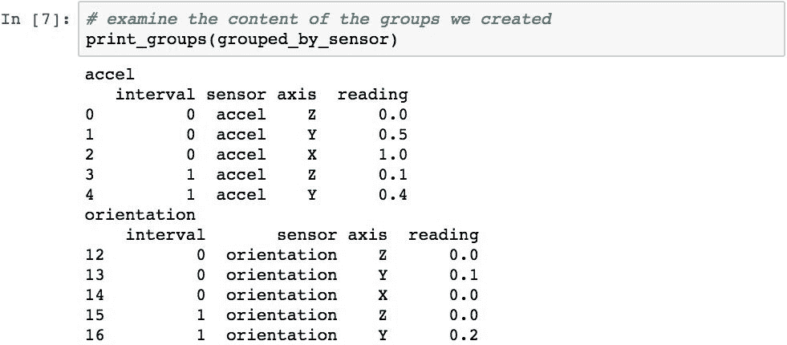

对这些结果的检查为我们提供了有关 Pandas 如何进行分裂的一些见解。 已为`sensors`列中的每个不同值创建了一个组，并以该值命名。 然后，每个组都包含一个`DataFrame`对象，该对象由传感器值与该组名称匹配的行组成。

`.size()`方法返回所有组大小的摘要：


`.count()`方法返回每个组的每一列中的项目数：


可以使用`.get_group()`方法检索任何特定的组。 以下代码检索`accel`组：

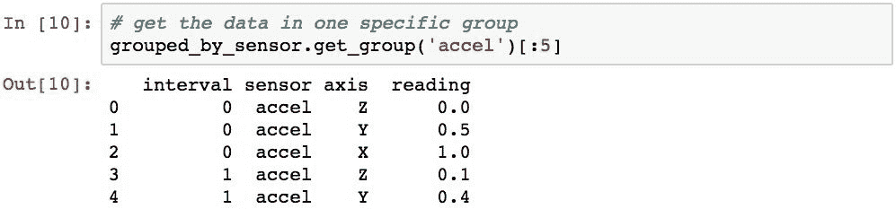

`.head()`和`.tail()`方法可用于返回每个组中指定数量的项目。 此代码检索每个组中的前三行：

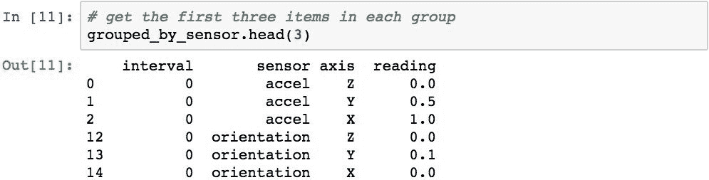

`.nth()`方法将返回每个组中的*第 n 个*项目。 以下代码演示了如何使用它来检索每个组的第二行：


`.describe()`方法可用于返回每个组的描述性统计信息：


组按其组名升序排序。 如果要防止在分组过程中进行排序，请使用`sort=False`选项。

# 使用多列分组

也可以通过传递列名列表对多个列进行分组。 以下代码按`sensor`和`axis`列对数据进行分组：

 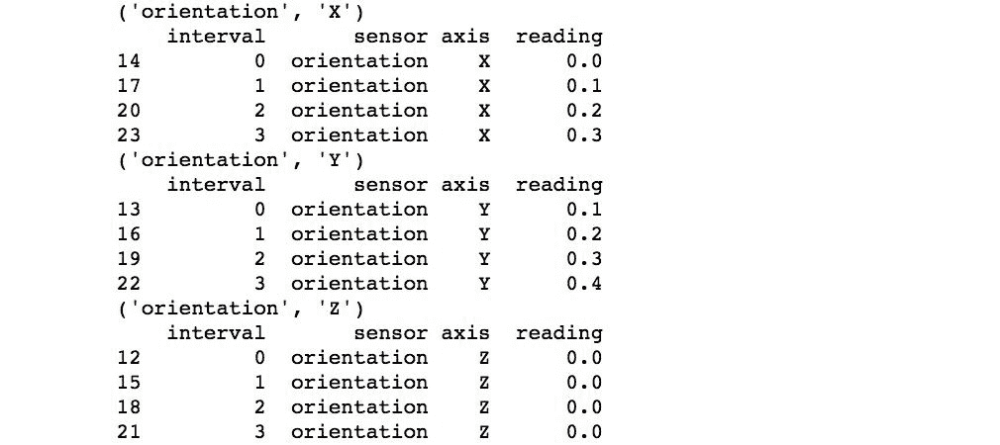

由于指定了多列，因此每个组的名称现在是一个元组，代表`sensor`和`axis`中值的每种不同组合。

# 使用索引级别分组

可以使用索引中的值而不是列进行分组。 传感器数据非常适合用于层次结构索引，可用于演示此概念。 让我们使用由`sensor`和`axis`列组成的层次结构索引来设置此数据的形式：

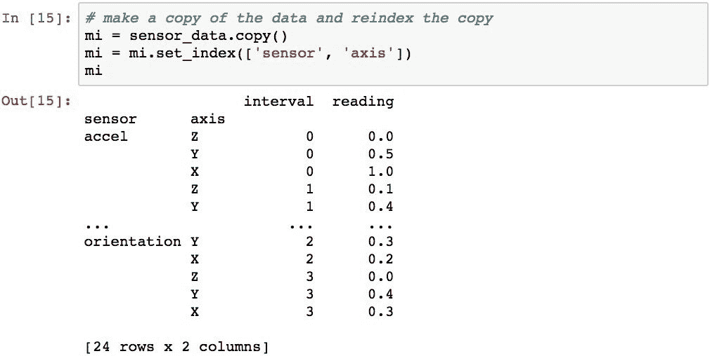

现在可以使用分层索引的各个级别执行分组。 该代码将按索引级别 0（传感器名称）分组：

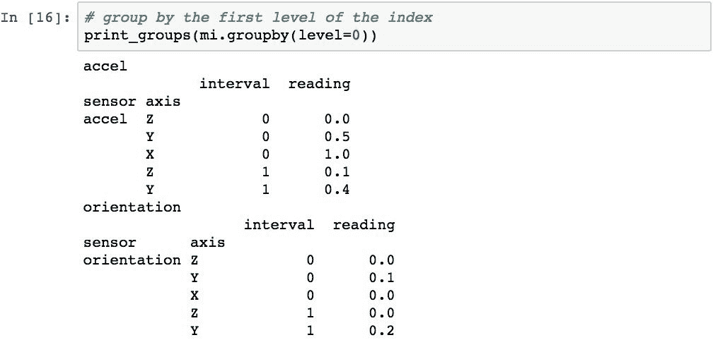

可以通过在列表中传递级别来执行按多个级别分组。 并且，如果`MultiIndex`具有为级别指定的名称，则可以使用这些名称代替整数。 以下代码演示了按`sensor`和`axis`进行分组：

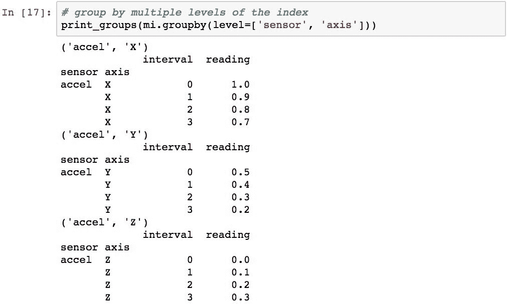 

# 应用聚合函数，变换和过滤器

Apply 步骤允许对每组数据进行三个不同的操作：

*   应用聚合函数
*   执行转换
*   从结果中过滤整个组

让我们检查所有这些操作。

# 将聚合功能应用于组

可以使用`GroupBy`对象的`.aggregate()`（或简称为`.agg()`）方法将聚合函数应用于每个组。 `.agg()`的参数是对将应用于每个组的功能的引用。 对于`DataFrame`，此功能将应用于组中的每一列数据。

下面的示例演示计算每个`sensor`和`axis`的平均值：

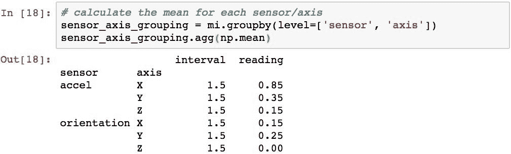

由于`.agg()`将把该方法应用于每组中的每一列，因此 pandas 也会计算间隔值的平均值（可能不太实用）。

聚合的结果将具有与原始数据相同的结构化索引。 `as_index=False`可用于创建数字索引并将原始索引的级别移入列：


许多聚合函数直接内置在`GroupBy`对象中，以节省您的键入时间。 具体来说，这些功能是（前缀为`gb`）：

```py
gb.agg        gb.boxplot    gb.cummin     gb.describe   gb.filter    gb.get_group  gb.height     gb.last       gb.median     gb.ngroups    gb.plot       gb.rank       gb.std        gb.transform
gb.aggregate  gb.count      gb.cumprod    gb.dtype      gb.first      gb.groups     gb.hist       gb.max        gb.min        gb.nth        gb.prod       gb.resample   gb.sum        gb.var
gb.apply      gb.cummax     gb.cumsum     gb.fillna     gb.gender     gb.head       gb.indices    gb.mean       gb.name       gb.ohlc       gb.quantile   gb.size       gb.tail       gb.weight

```

作为演示，以下代码还计算每个`sensor`和`axis`组合的平均值：

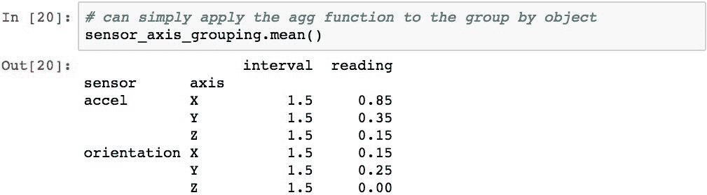

通过在列表中传递函数，也可以在同一语句中应用多个聚合函数。


通过将 Python 字典传递给`.agg()`，可以将不同的函数应用于每列。 词典的键表示要应用该功能的列名，每个词典条目的值就是该功能。 以下代码通过计算`reading`列的平均值并返回该组的长度代替`interval`值来演示此技术：

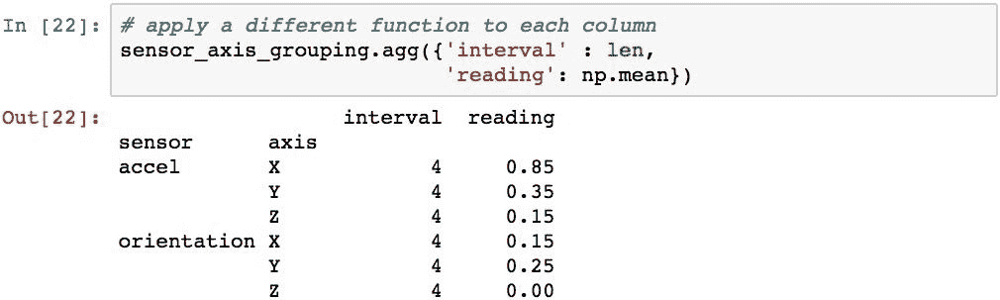

也可以使用`GroupBy`对象上的`[]`运算符在特定列上执行聚合。 此代码仅计算`reading`列的平均值：


# 转换数据组

`GroupBy`对象提供了`.transform()`方法，该方法将功能应用于每个组中`DataFrame`中的所有值。 我们将研究一般的转换过程，然后看两个真实的例子。

# 转型的一般过程

`GroupBy`对象的`.transform()`方法将一个函数应用于 DataFrame 中的每个值，并返回另一个具有以下特征的`DataFrame`：

*   它的索引与所有组中索引的串联相同
*   行数等于所有组中的行数之和
*   它由未分组的列组成，Pandas 已成功将给定功能应用于该列（可以删除某些列）

为了演示实际的转换，让我们从以下 DataFrame 开始：


让我们按`Label`列分组：

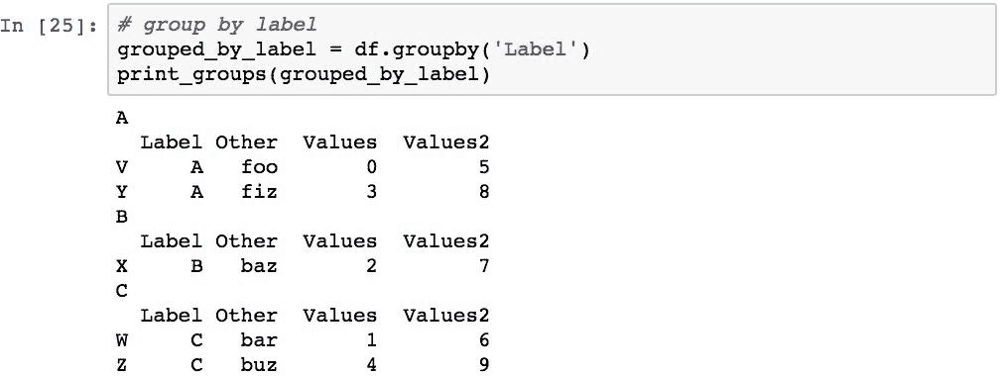

以下代码执行一个转换，该转换应用一个函数将每个值加 10：

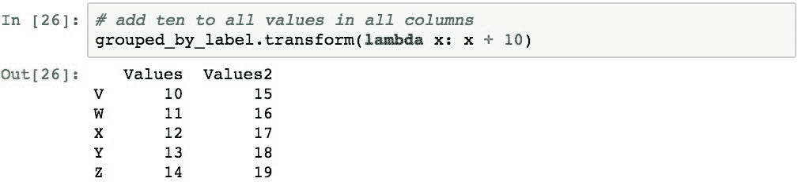

pandas 尝试将函数应用于所有列，但是由于`Label`和`Other`列具有字符串值，因此转换函数将失败（它将引发异常）。 由于该失败，结果中将省略这两列。

结果也未分组，因为从转换结果中删除了分组结构。 生成的对象将具有与原始`DateFrame`对象的索引匹配的索引，在这种情况下为`V`，`W`，`X`，`Y`和`Z`。

# 用组的平均值填充缺失值

使用分组数据进行统计分析的常见转换是用组中非`NaN`值的平均值替换每个组中的缺失数据。 为了说明这一点，下面的代码创建一个`DataFrame`，其中`Label`列带有两个值（`A`和`B`），以及一个`Values`列，其中包含一系列整数，但其中一个值替换为`NaN` ]。 然后，将数据按`Label`列分组：

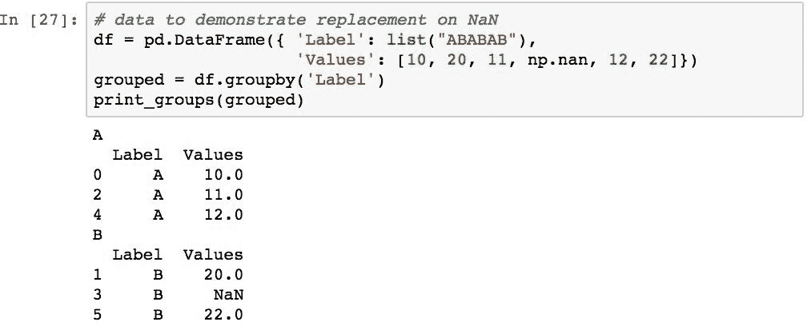

每组的平均值可以使用`.mean()`计算：

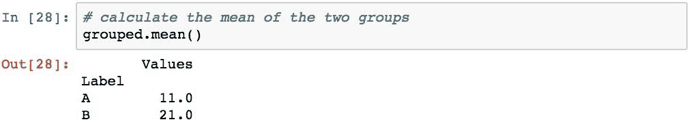

现在假设我们需要`B`组填写所有`NaN`值，因为其他使用此数据代码的人可能难以处理`NaN`值。 可以使用以下方法简洁地执行此操作：

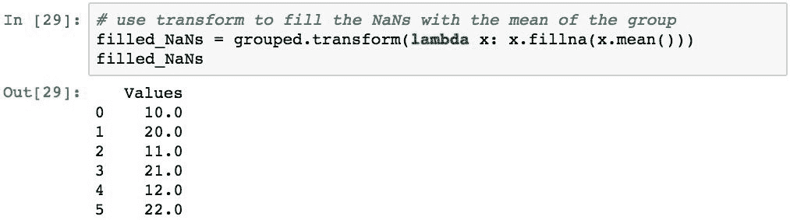

# 通过转换计算归一化的 z 得分

转换的另一个常见示例是在数据组上创建归一化的 z 分数。 为了证明这一点，我们将使用均值为 0.5 且标准差为 2 的正态分布来随机生成一系列值。按天为数据编制索引，并在 100 天的时间范围内计算滚动平均值以生成样本 均值：

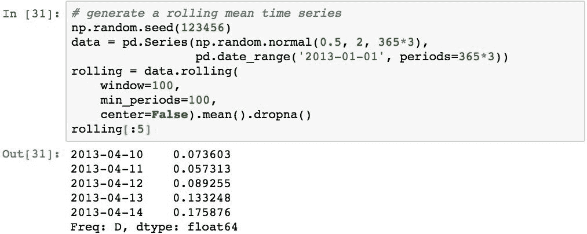

滚动装置具有以下外观：


在这一点上，我们希望标准化每个日历年的滚动方式。 以下代码按年份对数据进行分组，并报告每组的现有平均值和标准偏差：

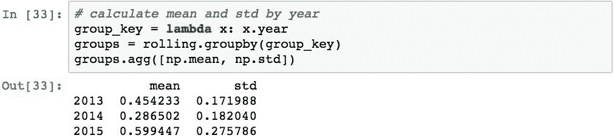

为了执行标准化，此代码定义了 z 得分函数，将其作为变换应用于每个组，并报告新的均值和标准差：


我们还可以比较原始数据和转换后的数据：

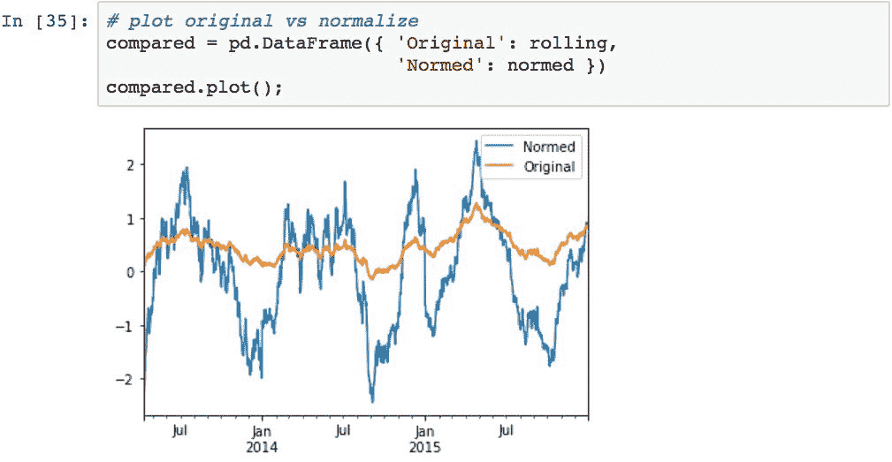

# 从聚合中过滤组

可以从使用`.filter()`的处理中选择性地删除数据组。 此方法提供了一个功能，该功能可用于在合并后对结果中是否包括整个组做出组级决策。 如果要在结果中包含该组，则该函数应返回`True`，并排除该组。

我们将使用以下数据检查几种方案：

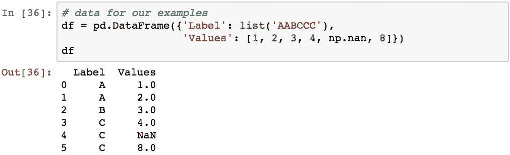

第一个演示将删除没有最少项目数的组。 具体来说，如果它们只有一项或更少，它们将被丢弃：

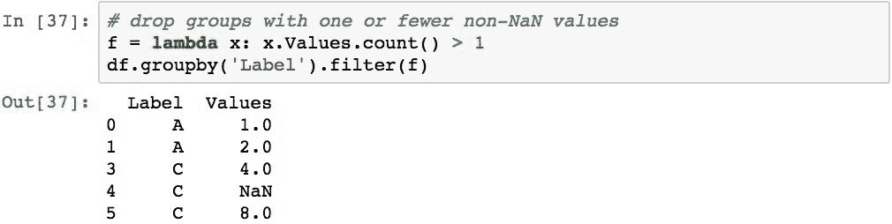

下面的示例将忽略具有任何`NaN`值的组：


下一个示例将仅选择均值大于整个数据集均值的 2.0 的组（基本上，这将选择与整体相比具有异常行为的数据组）：


# 摘要

在本章中，我们研究了使用 Pandas 对数据组进行分组和分析的各种技术。 介绍了拆分应用组合模式，并概述了如何在 Pandas 中实现这种模式。 然后，我们学习了如何基于列和索引级别中的数据将数据分为几组。 然后，我们研究了如何使用聚合函数和转换来处理每个组中的数据。 我们快速检查了如何根据数据组的内容过滤数据组。

在下一章中，我们将深入研究 Pandas 最强大，最强大的功能之一-时间序列数据建模。