# 时间序列建模

**时间序列**是一个时间段内和特定时间间隔内一个或多个变量的度量。 捕获时间序列后，通常会进行分析以识别时间序列中的模式，实质上是确定随着时间的流逝发生了什么。 分析时间序列数据的能力在现代世界中至关重要，这是为了分析财务信息或监视可穿戴设备上的运动并使您的运动与目标和饮食相匹配。

Pandas 提供了广泛的时间序列数据建模能力。 在本章中，我们将研究许多这些功能，包括：

*   创建具有特定频率的时间序列
*   日期，时间和间隔的表示
*   用时间戳表示时间点
*   使用 Timedelta 表示时间间隔
*   使用 DatetimeIndex 建立索引
*   创建具有特定频率的时间序列
*   用日期偏移量表示数据间隔
*   将时段固定到一周，一月，一季度或一年中的特定日期
*   用周期建模时间间隔
*   使用 PeriodIndex 建立索引
*   用日历处理假期
*   使用时区标准化时间戳
*   移动和滞后时间序列
*   在时间序列上执行频率转换
*   向上和向下重新采样时间序列
*   在时间序列上执行滚动窗口操作

# 设置 IPython 笔记本

要利用本章中的示例，我们将需要包括以下导入和设置：

# 日期，时间和间隔的表示

为了开始理解时间序列数据，我们需要首先检查 Pandas 如何表示日期，时间和时间间隔。 pandas 提供了广泛的内置工具来表示这些概念，因为这些概念的表示没有足够强大地由 Python 或 NumPy 实现，无法处理处理时序数据所需的许多概念。

一些附加功能包括能够跨不同频率转换数据并应用不同的日历以在财务计算中考虑诸如工作日和假日之类的事情。

# 日期时间，日期和时间对象

`datetime`对象是`datetime`库的一部分，而不是 Pandas 的一部分。 此类可用于构造表示几种常见模式的对象，例如使用日期和时间的固定时间点，或者简单地是没有时间部分的一天，或者没有日期部分的时间。

`datetime`对象的准确性不高，涉及时间序列数据的大量计算所涉及的许多数学。 但是，它们通常用于初始化 pandas 对象，pandas 将它们转换为幕后的 pandas 时间戳对象。 因此，在这里仍然值得一提，因为它们在初始化期间会经常使用。

可以使用至少三个参数分别表示年，月和日来初始化`datetime`对象：

结果已将小时和分钟值默认为`0`。 还可以使用构造函数的另外两个值来指定小时和分钟成分。 下面创建一个`datetime`对象，该对象还指定下午 5:30：

可以使用`datetime.now()`函数来确定当前日期和时间，该函数检索本地日期和时间：

`datetime.date`对象代表特定的日期（没有时间成分）。 可以通过将`datetime`对象传递给`datetime`的构造函数来创建它：

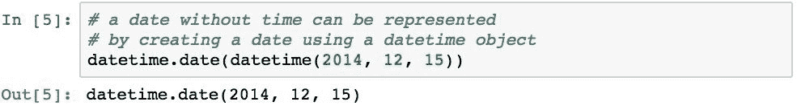

您可以使用以下方法检索当前的本地数据：

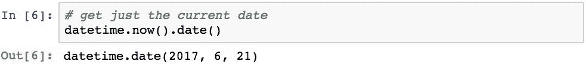

可以使用`datetime.time`对象并将`datetime`对象传递给其构造函数来创建不带日期成分的`time`：

当前本地时间可以使用以下方法检索：

# 用时间戳表示时间点

使用`pandas.tslib.Timestamp`类执行日期和时间的 Pandas 表示。 Pandas`Timestamp`基于`datetime64` dtype，并具有比 Python `datetime`对象更高的精度。 在 Pandas 中，`Timestamp`对象通常可以与`datetime`对象互换，因此通常可以在使用日期时间对象的任何地方使用它们。

您可以使用`pd.Timestamp`（`pandas.tslib.Timestamp`的快捷方式）并通过传递表示日期，时间或日期和时间的字符串来创建`Timestamp`对象：

也可以指定时间元素：

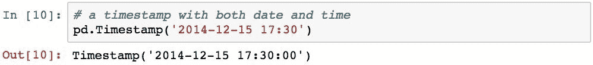

也可以仅使用一个时间来创建`Timestamp`，默认情况下还将指定当前的本地日期：

下面演示了如何使用`Timestamp`检索当前日期和时间：

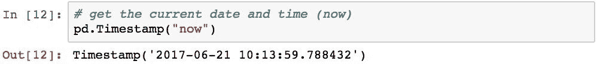

作为 Pander 用户，通常不会直接创建`Timestamp`对象。 使用日期和时间的许多 Pandas 函数都允许您传递`datetime`对象或日期/时间的文本表示，并且这些函数将在内部执行转换。

# 使用 Timedelta 表示时间间隔

为了表示时间上的差异，我们将使用 Pandas`Timedelta`对象。 这些通常是确定两个日期之间的持续时间或从另一个日期和/或时间开始的特定时间间隔内计算日期的结果。

为了演示`Timedelta`，下面使用`timedelta`对象计算从指定日期开始的时间增加一天：

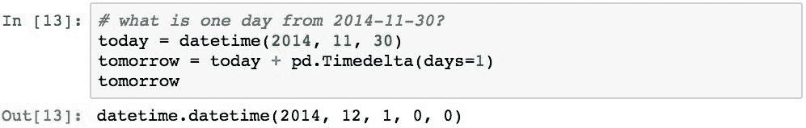

下面演示了如何计算两个日期之间有多少天：

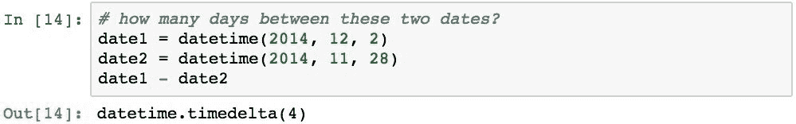

# 介绍时间序列数据

Pandas 擅长处理时序数据。 这很可能是由于其起源于处理财务信息。 这些功能在其所有版本中都得到了不断完善，以逐步提高其时间序列操纵的能力。

# 使用 DatetimeIndex 建立索引

Pandas 中时间序列功能的核心围绕着使用专用索引来表示，该索引表示一个或多个时间戳下的数据度量。 Pandas 中的这些索引称为`DatetimeIndex`对象。 这些是功能强大的对象，它们使我们能够根据日期和时间自动对齐数据。

有几种方法可以在 Pandas 中创建`DatetimeIndex`对象。 下面通过将`datetime`对象的列表传递到`Series`来创建`DateTimeindex`：

该`Series`已获取`datetime`对象，并根据日期值构造了一个`DatetimeIndex`。 该索引的每个值都是一个`Timestamp`对象。

以下内容验证索引的类型以及索引中的标签的类型：

 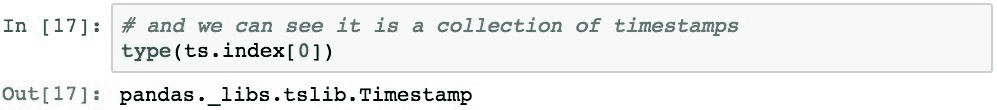

不需要在列表中传递`datetime`对象来创建时间序列。 `Series`对象足够聪明，可以识别出代表`datetime`的字符串并为您进行转换。 以下等效于先前的示例：

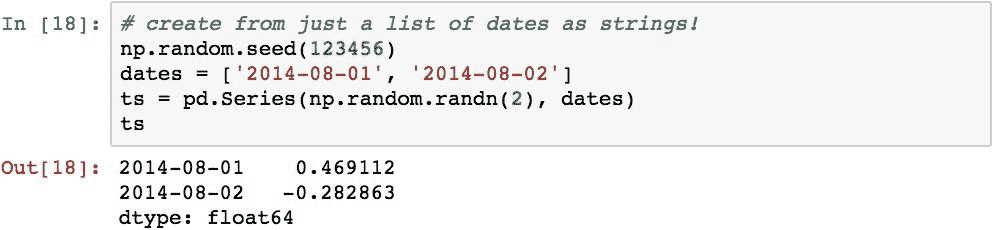

pandas 在`pd.to_datetime()`中提供了一个实用程序功能，该函数接受一系列相似或混合类型的对象，pandas 尝试将这些对象转换为`Timestamp`对象，然后将其转换为`DatetimeIndex`。 如果序列中的某个对象无法转换，则 Pandas 将创建一个`NaT`值，这表示不能一次：

请注意，如果`pd.to_datetime()`函数无法将值转换为`Timestamp`，则会引发异常：

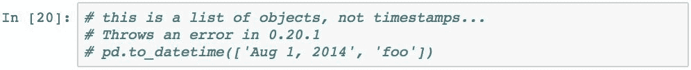

要强制函数将其转换为日期而不是引发异常，可以使用`errors="coerce"`参数。 然后，无法转换的值将在结果索引中分配 NaT：

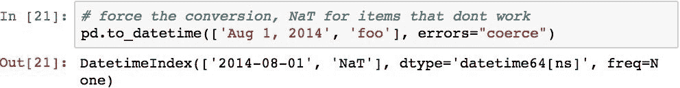

使用`pd.date_range()`功能可以轻松创建具有特定频率的一系列时间戳。 下面根据连续`10`天的`DatetimeIndex`创建一个`Series`对象：

`DatetimeIndex`可用于各种索引操作，例如数据对齐，选择和切片。 下面演示了按位置进行切片：

为了演示对齐方式，我们将使用下面创建的`Series`和刚刚创建的子集的索引：

当我们添加`s2`和`date_series`时，将执行对齐，并在项目未对齐的地方返回 NaN。 每个索引标签上的值将是在相同标签上找到的值的总和：

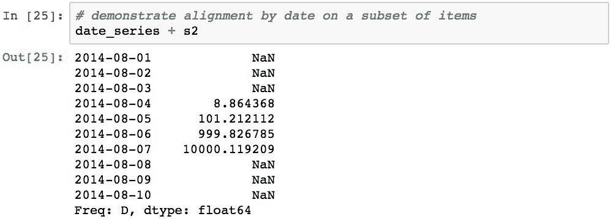

可以使用表示日期的字符串检索带有`DatetimeIndex`的`Series`中的项目，而不必指定`datetime`对象：

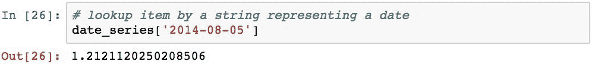

`DatetimeIndex`也可以使用表示日期的字符串进行切片：

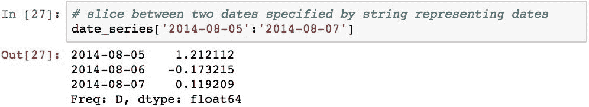

Pandas 的另一个便利功能是可以使用部分日期规范来切片`DatetimeIndex`。 例如，以下代码创建一个`Series`对象，其日期跨越两年，然后仅选择 2013 年的那些项目：

也可以选择特定年份和月份中的项目。 以下选择 2014 年 8 月的项目：

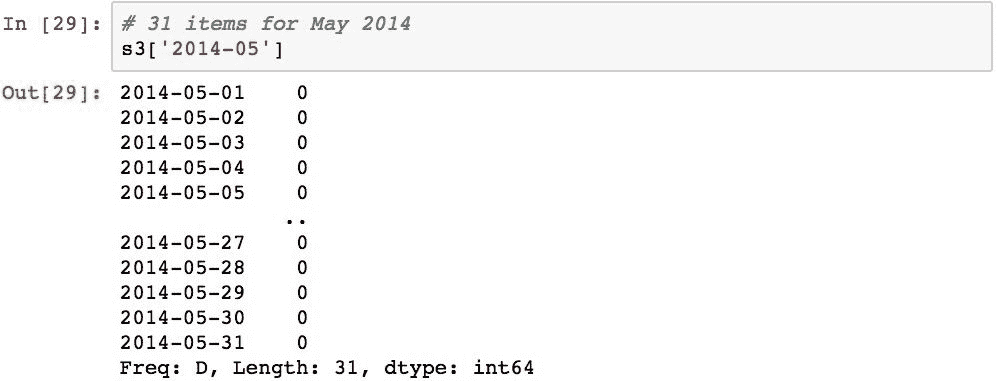

这也适用于切片。 以下是 2014 年 8 月和 9 月返回的项目：

# 创建具有特定频率的时间序列

可以按除每日频率以外的时间间隔创建时间序列数据。 通过使用`freq`参数，可以使用`pd.date_range()`生成不同的频率。 该参数默认为代表每日频率的值“ D”。

为了演示替代频率，下面通过指定`freq='T'`以 1 分钟的间隔创建`DatetimeIndex`：

这个时间序列使我们能够以更高的分辨率进行切片。 在分钟级别上的以下切片：

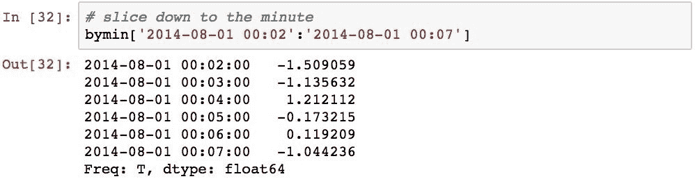

下表列出了可能的频率值：

| 别名 | 描述 |
| 乙 | 工作日频率 |
| C | 自定义工作日频率 |
| d | 日历日频率（默认） |
| 在 | 每周频率 |
| 中号 | 月末频率 |
| BM | 营业月结束频率 |
| 煤层气 | 自定义营业月结束频率 |
| 多发性硬化症 | 月开始频率 |
| BMS | 营业月份开始频率 |
| 中央管理系统 | 自定义营业月开始频率 |
| 问 | 四分之一结束频率 |
| BQ | 业务季度频率 |
| 质量体系 | 季度开始频率 |
| BQS | 业务季度开始频率 |
| 一个 | 年末频率 |
| BA | 营业年末频率 |
| 如 | 年开始频率 |
| 低 | 营业年度开始频率 |
| H | 每小时频率 |
| Ť | 分钟频率 |
| 小号 | 每秒频率 |
| 大号 | 毫秒 |
| ü | 微秒 |

您可以使用`'B'`频率来创建仅使用工作日的时间序列：

我们可以看到跳过了两天，就像周末一样。

可以使用`periods`参数在特定的日期和时间，特定的频率和特定的周期数范围内创建范围。 下面创建了一个 5 项`DatetimeIndex`，从 2014-08-01 12:10:01 开始，间隔为 1 秒：

# 使用偏移量计算新日期

Pandas 的频率使用日期偏移量表示。 在讨论`Timedelta`对象时，我们已在本章开头谈到了这一概念。 Pandas 使用`DateOffset`对象的概念扩展了它们的功能。 它们是代表如何相对于`DatetimeIndex`对象整合时间偏移量和频率的知识的对象。

# 用日期偏移量表示数据间隔

通过使用传递的频率字符串，例如`'M'`，`'W'`和`'BM'`和`pd.date_range()`的`freq`参数，以各种频率创建`DatetimeIndex`对象。 在引擎盖下，这些频率字符串被转换为 Pandas`DateOffset`对象的实例。

`DateOffset`代表规则的频率增量。 在具有`DateOffset`各种子类的 Pandas 中，可以表示特定的日期偏移逻辑，例如“月”，“工作日”或“小时”。 `DateOffset`为 Pandas 提供了智能，使其能够确定如何从参考日期和时间开始计算特定的时间间隔。 与仅使用固定的数字间隔相比，这为 Pandas 用户提供了更大的灵活性，可以表示日期/时间偏移

一个有用且实用的示例是计算第二天的营业时间。 这不是简单地通过在`datetime`中增加一天来确定的。 如果日期表示星期五，则美国金融市场的下一个工作日不是星期六，而是星期一。 在某些情况下，如果星期一是假日，那么从星期五开始的一个工作日实际上可能是星期二。 Pandas 为我们提供了处理这类棘手情况所需的所有工具。

让我们通过使用`'B'`作为频率生成日期范围来研究一下这一点：

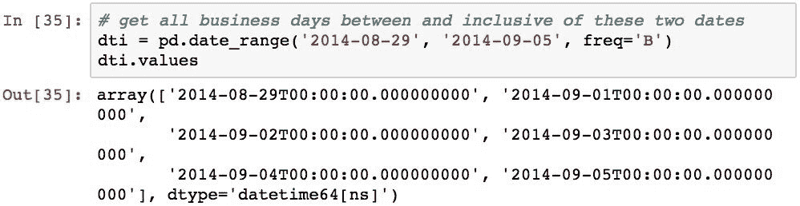

该时间序列已省略`2014-08-30`和`2014-08-30`，因为它们是星期六和星期日，而不被视为工作日。

`DatetimeIndex`具有`.freq`属性，该属性表示索引中时间戳的频率：

注意，Pandas 创建了`BusinessDay`类的实例来表示此索引的`DateOffset`单位。 如前所述，Pandas 用`DateOffset`类的子类表示不同的日期偏移量。 以下是 Pandas 提供的各种内置的日期偏移量类：

| 类 | Description |
| `DateOffset` | 通用偏移量默认为一个日历日 |
| `BDay` | 营业日 |
| `CDay` | 自定义营业日 |
| `Week` | 一周，可以选择固定在一周中的某一天 |
| `WeekOfMonth` | 每月第 y 周的第 x 天 |
| `LastWeekOfMonth` | 每月最后一周的第 x 天 |
| `MonthEnd` | 日历月底 |
| `MonthBegin` | 日历月份开始 |
| `BMonthEnd` | Business month end |
| `BMonthBegin` | Business month start |
| `CBMonthEnd` | Custom business month end |
| `CBMonthBegin` | 自定义营业月开始 |
| `QuarterEnd` | 季度末 |
| `QuarterBegin` | 季度开始 |
| `BQuarterEnd` | 业务季度末 |
| `BQuarterBegin` | 业务季度开始 |
| `FYS253Quarter` | 零售（52-53 周）季度 |
| `YearEnd` | 日历年末 |
| `YearBegin` | 日历年开始 |
| `BYearEnd` | Business quarter end |
| `BYearBegin` | Business quarter start |
| `FYS253` | 零售（52-53 周）年 |
| `Hour` | 一小时 |
| `Minute` | 等一下 |
| `Second` | 一秒 |
| `Milli` | 一毫秒 |
| `Micro` | 一微秒 |

Pandas 使用这种使用`DateOffset`及其专业知识的策略来编纂逻辑来计算第二天。 这使得使用这些对象既灵活又强大。 `DateOffset`对象可以在各种情况下使用：

*   可以将它们相加或相减以获得转换后的日期
*   可以将它们乘以整数（正数或负数），以便多次应用增量
*   它们具有`rollforward`和`rollback`方法，可以将日期向前或向后移动到下一个或上一个“偏移日期”

可以通过向`datetime`对象传递代表固定时间段的`datetime`对象或使用多个关键字参数来创建`DateOffset`对象。 关键字参数分为两大类。 第一类是代表绝对日期的关键字：年，月，日，小时，分钟，秒和微秒。 第二类代表相对持续时间，可以是负值：年，月，周，日，小时，分钟，秒和微秒。

下面的代码创建 1 天的偏移量并将其添加到`datetime`中：

以下内容将从给定日期计算下一个工作日：

特定`DateOffset`的多个单位可以通过乘法表示：

下面的示例演示如何使用`BMonthEnd`对象从给定日期（在本例中为`2014-09-02`）计算一个月的最后一个工作日：

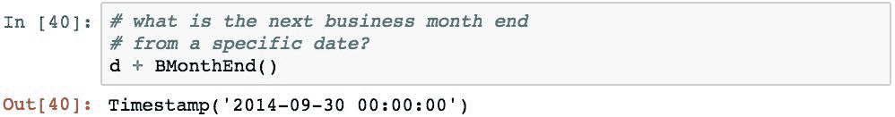

以下使用`BMonthEnd`对象`.rollforward()`方法计算下个月结束：

可以对多个偏移量类别进行参数设置，以提供对偏移量行为的更好控制。 例如，以下内容将计算`2014-08-31`之前一周中的星期二（`weekday = 1`）的日期：

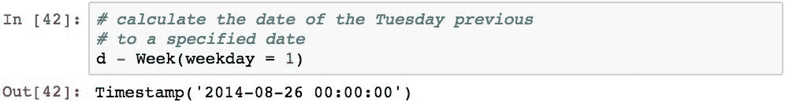

# 锚定的偏移

锚定偏移是代表给定频率并从特定点开始的频率，例如周，月或年的特定日期。 锚定的偏移量使用特定的速记术语。 例如，以下字符串指定一周中的特定日期：

| Alias | Description |
| `W-SUN` | 每周星期天（与“ W”相同） |
| `W-MON` | 每周一 |
| `W-TUE` | 每周二 |
| `W-WED` | 每周三 |
| `W-THU` | 每周四 |
| `W-FRI` | 星期五每周 |
| `W-SAT` | 每周六 |

例如，下面的代码生成一个索引，该索引由两个指定日期之间的所有星期三的日期组成：

也可以使用年度和季度频率来创建锚定偏移。 这些频率锚的格式为`[B][A|Q][S]-[MON]`，其中`B`（工作日）和`S`（周期开始而不是结束）是可选的，`A`代表年度，`Q`代表季度，`MON`是月份的三位数缩写（JAN，FEB 等）。

为了说明这一点，以下代码生成了 2014 年季度末的业务日期，而当年锚定在 6 月底：

# 使用期间表示持续时间

对时序数据进行许多有用的分析操作都需要分析特定时间间隔内的事件。 一个简单的例子是确定在特定时期内发生了多少笔金融交易。

可以使用`Timestamp`和`DateOffset`进行这些类型的分析，在其中计算范围，然后根据这些范围过滤项目。 但是，当您需要处理必须分为多个时间段的事件时，这变得很麻烦，因为您开始需要管理`Timestamp`和`DateOffset`对象集。

为了促进这些类型的数据组织和计算，Pandas 使用`Period`类将时间间隔作为正式构造。 Pandas 还使用`PeriodIndex`对`Period`对象系列进行形式化，该功能提供了根据与周期对象相关联的索引对齐数据项的功能。

# 用周期建模时间间隔

Pandas 使用`Period`对象将时间间隔的概念形式化。 `Period`允许您根据频率（例如每天，每周，每月，每年，每季度等）指定持续时间，它将提供一个特定的开始和结束`Timestamp`，代表特定的时间间隔。

使用时间戳和频率创建`Period`，其中时间戳表示用作参考点的锚点，频率是持续时间。 为了说明这一点，下面创建了一个代表一个月的期间，该期间固定在 2014 年 8 月：

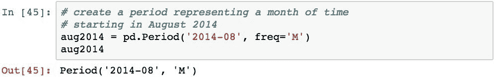

`Period`具有`start_time`和`end_time`属性，可告知我们派生的开始时间和结束时间：

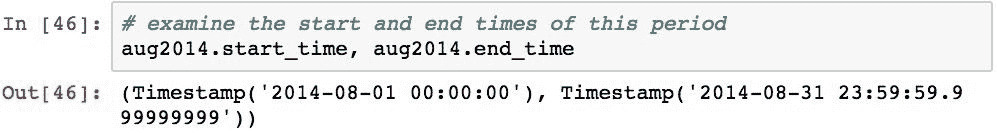

当我们指定 2014 年 8 月为周期时，Pandas 会确定锚点（`start_time`），然后根据指定的频率计算`end_time`。 在这种情况下，它将根据`start_time`计算一个月，并返回该值之前的最后一个时间单位。

`Period`上的数学运算过载，根据给定值计算另一个`Period`。 下面基于变量`aug2014`创建一个新的`Period`对象，该变量以其表示频率（一个月）的`1`单位移位：

转变的概念非常重要和强大。 向此`Period`对象添加`1`会通知它在时间上以一个正单位移动该对象表示的任何频率。 在这种情况下，它将期限从 1 个月移至 2014 年 9 月。

如果我们检查`sep2014`变量中表示的开始时间和结束时间，我们会发现 Pandas 已经努力确定代表 2014 年 9 月整个时间的正确日期：

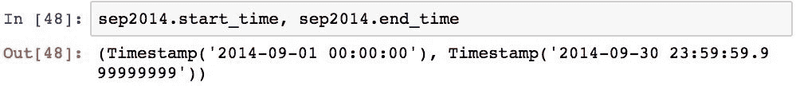

请注意，`Period`具有知道 9 月是 30 天而不是 31 天的智能。这是`Period`对象背后的智能的一部分，它节省了很多编码，帮助我们解决了许多困难的日期管理问题。

# 使用 PeriodIndex 建立索引

一系列`Period`对象可以组合成一种特殊形式的 Pandas 索引，称为`PeriodIndex`。 `PeriodIndex`索引可用于将数据与特定时间间隔相关联，并且能够对每个间隔中的事件进行切片和执行分析。

下面创建了一个`PeriodIndex`，其中包含 2013 年的 1 个月时间间隔：

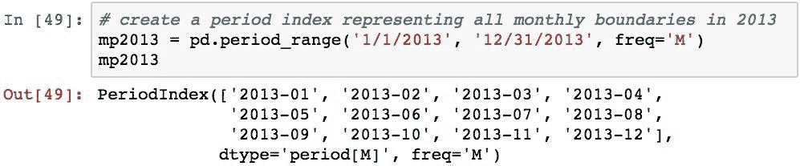

`PeriodIndex`与`DatetimeIndex`的不同之处在于索引标签是`Period`对象。 以下显示索引中所有`Period`对象的开始和结束时间：

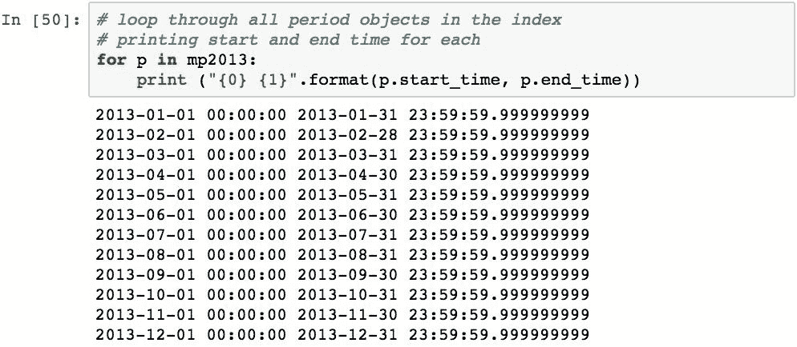

Pandas 已确定每个月的开始和结束，同时考虑了每个特定月份的实际天数。

使用`PeriodIndex`，我们可以将其用作索引来构造`Series`对象，并将值与索引中的每个`Period`相关联：

现在，我们有了一个时间序列，其中特定索引标签上的值表示跨一段时间的度量。 像这样的系列的一个例子是给定月份而不是特定时间的证券的平均值。 当我们将时间序列重新采样到另一个频率时，这变得非常有用。

像`DatetimeIndex`一样，`PeriodIndex`可用于使用`Period`来索引值，该字符串表示一个周期或部分周期规范。 为了演示，我们将创建另一个类似于上一个系列的系列，但跨度为 2013 年和 2014 年：

可以使用`Period`对象或代表句点的字符串使用特定的索引标签来选择各个值。 下面演示了如何使用字符串表示形式：

也可以使用部分规格，例如以下内容，它仅检索 2014 年期间的所有值：

`PeriodIndex`也可以切片。 以下内容检索 2014 年 3 月至 2014 年 6 月之间（含）的所有值：

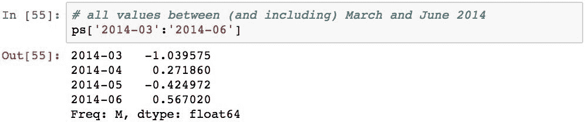

# 使用日历处理假期

早前，当我们计算 2014 年 8 月 29 日的下一个工作日时，Pandas 告诉我们该日期是 2014 年 9 月 1 日。在美国，这实际上是不正确的：2014 年 9 月 1 日是美国联邦假日，银行 并在这一天关闭交易。 原因是 Pandas 计算下一个工作日时使用特定的默认日历，并且此默认 Pandas 日历不包括 2014 年 9 月 1 日作为假日。

解决此问题的方法是创建一个自定义日历（我们将不对其进行详细介绍），或仅针对这种情况使用 Pandas 提供的一个自定义日历`USFederalHolidayCalendar`。 然后，可以将此自定义日历传递给`CustomBusinessDay`对象，而不是`BusinessDay`对象。 然后，使用此`CustomBusinessDay`对象进行的计算将使用新日历并考虑美国联邦假日。

以下内容演示了`USFederalCalendar`对象的创建以及如何使用它报告其认为假期的日子：

然后，可以使用此日历来计算自 2014 年 8 月 29 日起的下一个工作日：

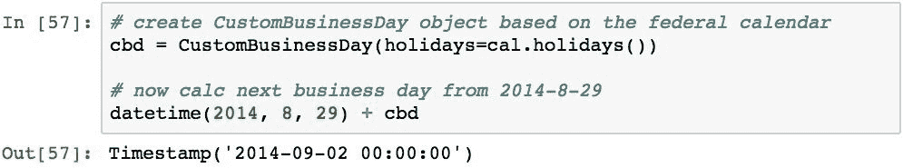

现在，所得的计算结果将劳动节（不是工作日）考虑在内，并返回了正确的`2014-09-02`日期。

# 使用时区标准化时间戳

在使用时序数据时，时区管理可能是最复杂的问题之一。 数据通常是使用当地时间在全球范围内的不同系统中收集的，有时，它需要与在其他时区收集的数据进行协调。

幸运的是，Pandas 为使用不同时区的时间戳提供了丰富的支持。 在后台，Pandas 利用`pytz`和`dateutil`库来管理时区操作。 `dateutil`支持是 Pandas 0.14.1 版本的新增功能，目前仅支持固定偏移量和`tzfile`区域。 Pandas 使用的默认库是`pytz`，并提供了对`dateutil`的支持以与其他应用程序兼容。

时区感知的 Pandas 对象支持`.tz`属性。 默认情况下，出于时效考虑，支持时区的 Pandas 对象不使用`timezone`对象。 下面的代码获取当前时间，并演示默认情况下没有时区信息：

这表明 Pandas 默认情况下将 Timestamp（“ now”）视为 UTC，但没有时区数据。 这是一个很好的默认值，但请注意这一点。 总的来说，我发现如果您要根据存储的时间来收集数据以供以后访问，或者从多个数据源收集数据，则最好始终定位到 UTC。

同样，默认情况下，`DatetimeIndex`及其`Timestamp`对象将不具有关联的时区信息：

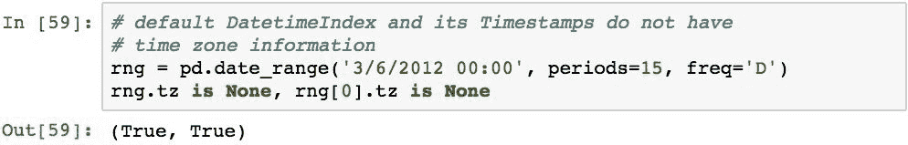

可以检索常见时区名称的列表，如以下示例所示。 如果您经常处理时区数据，这些将变得非常熟悉：

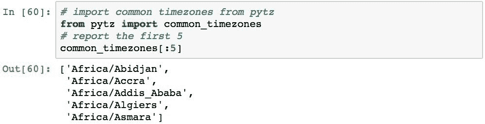

本地 UTC 时间可以使用使用的以下内容找到。 `Timestamp`的`tz_localize()`方法并传递`UTC`值：

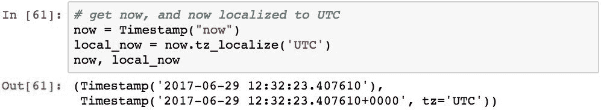

通过将时区名称传递给`.tz_localize()`，可以将任何`Timestamp`本地化到特定时区：

可以使用`pd.date_range()`方法的`tz`参数在特定的时区创建`DatetimeIndex`：

也可以显式构造其他时区。 该模型可以让您更好地控制`.tz_localize()`中使用哪个时区。 下面的代码创建两个不同的`timezone`对象，并将`Timestamp`定位到每个对象：

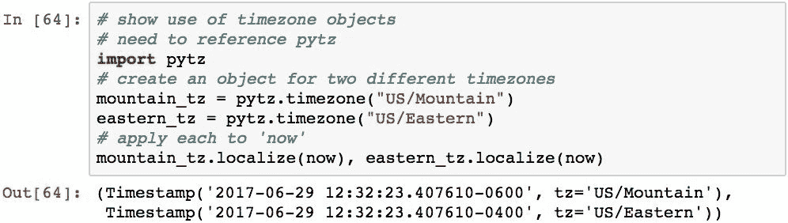

考虑到时区信息，对多个时间序列对象的操作将在其索引中按`Timestamp`对齐。 为了证明这一点，我们将使用以下代码，使用两个`DatetimeIndex`对象创建两个`Series`对象，每个对象的开始，周期和频率相同，但使用不同的时区：

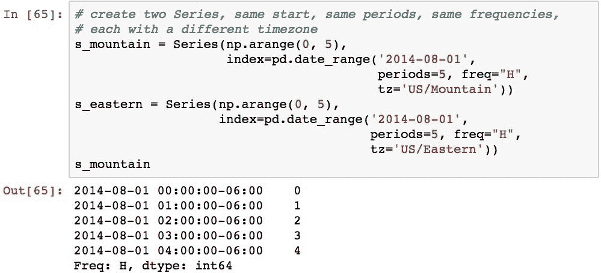 

下面通过将两个`Series`对象加在一起展示了它们按时区的对齐方式：

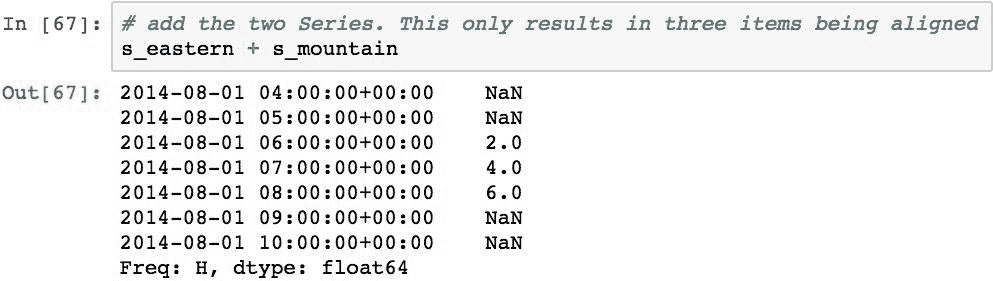

将时区分配给对象后，可以使用`.tz.convert()`方法将该对象转换为另一个时区：

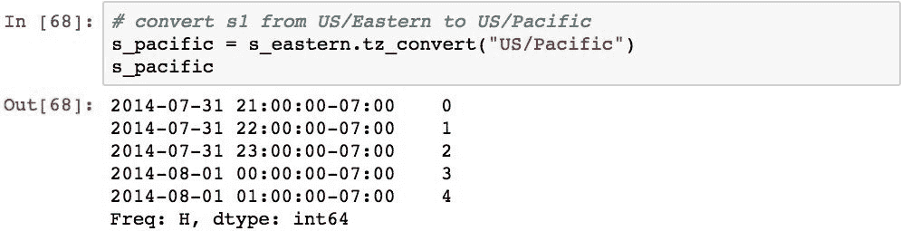

现在，如果将`s_pacific`添加到`s_mountain`，则对齐将强制执行相同的结果：

# 处理时间序列数据

现在，我们将研究对时间序列数据执行的几种常见操作。 这些操作需要重新排列数据，更改样本频率及其值，以及在连续移动的数据子集上计算合计结果，以确定随时间变化的数据值的行为。

# 转移和滞后

时间序列数据的常见操作是将值在时间上前后移动。 Pandas 方法是`.shift()`，它将`Series`或`DataFrame`中的值移动索引中指定频率单位的数量。

为了演示移位，我们将使用以下`Series`。 `Series`具有五个值，并按日期从`2014-08-01`开始索引，并使用每日频率：

以下将值向前移动 1 天：

Pandas 将这些值向前移动了指数频率的一个单位，即一天。 索引本身保持不变。 没有`2014-08-01`的替代数据，因此已用`NaN`填充。

滞后是向负方向的偏移。 以下时间比`Series`落后`2`天：

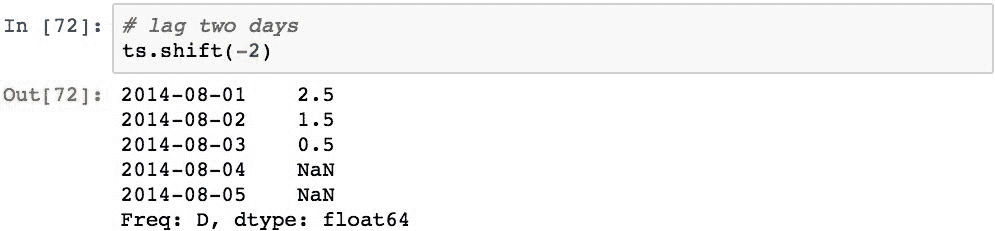

索引标签`2014-08-04`和`2014-08-03`现在具有`NaN`值，因为没有要替换的项目。

使用班次执行的常见计算是计算值的每日变化百分比。 这可以通过将`Series`对象除以其值偏移 1 来执行：

可以在不同于索引的频率上执行移位。 执行此操作后，索引将被修改并且值保持不变。 例如，以下将`Series`向前移动一个工作日：

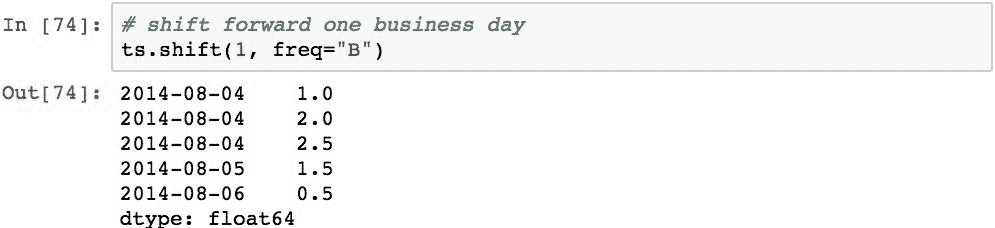

再举一个例子，以下向前移动`5`小时：

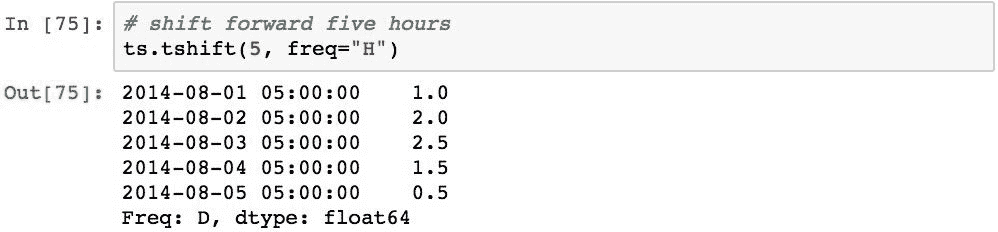

时间序列也可以使用`DateOffset`进行移位。 以下代码将时间序列向前移动`0.5`分钟：

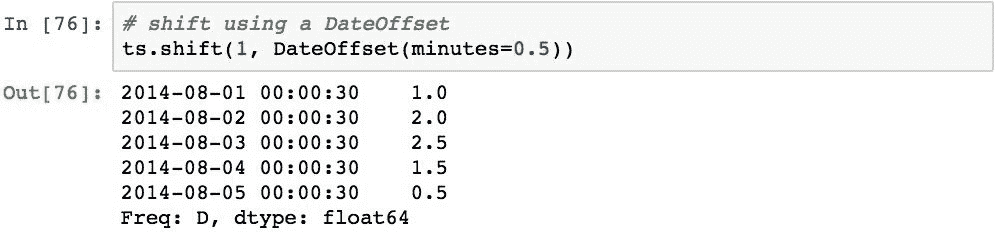

`.tshift()`方法提供了另一种形式的移位。 此方法以指定单位和`freq`参数指定的频率（要求）移动索引标签。 以下代码通过按`-1`小时调整索引来演示此方法：

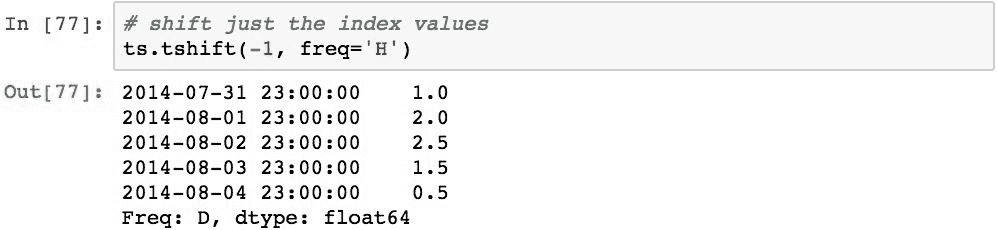

# 在时间序列上执行频率转换

可以使用时序对象的`.asfreq()`方法将频率数据转换为 Pandas。 转换频率时，将创建一个新的`Series`对象和一个新的`DatatimeIndex`对象。 新`Series`对象的`DatetimeIndex`从原始文件的第一个`Timestamp`开始，并以给定的频率运行，直到原始文件的最后`Timestamp`。 然后将值与新的`Series`对齐。

为了演示，我们将使用以下时间序列的连续增量整数映射到 2014 年 8 月的每一天的每一小时：

以下代码使用`.asfreq('D')`将此时间序列转换为每日频率：

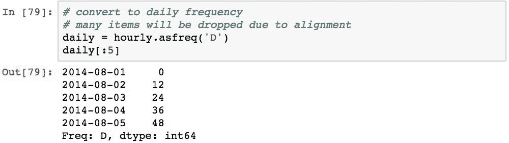

由于数据与每小时时间序列中的新的每日时间序列一致，因此仅复制与确切日期匹配的值。

如果将结果转换回每小时一次，我们将看到许多值是`NaN`：

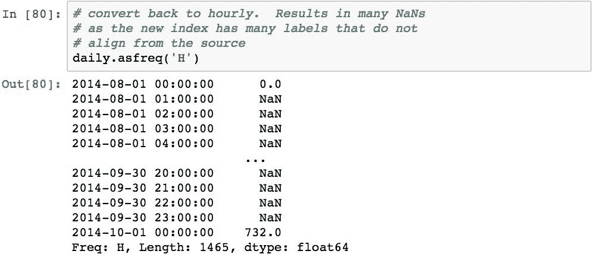

新索引按小时间隔具有`Timestamp`对象，因此仅确切日期的时间戳记与每日时间序列一致，从而得到 670 `NaN`值。

可以使用`.asfreq()`方法的`method`参数更改此默认行为。 该值可用于正向填充，反向填充或填充`NaN`值。

`ffill`方法将向前填充最后一个已知值（pad 也这样做）：

`bfill`方法将从下一个已知值回填值：

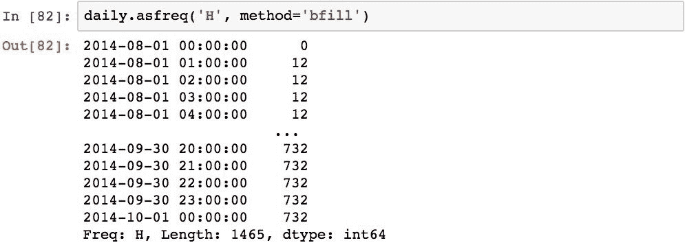

# 向上和向下重新采样时间序列

频率转换提供了一种将时间序列中的索引转换为另一个频率的基本方法。 新时间序列中的数据与旧数据一致，并可能导致许多`NaN`值。 使用填充方法可以部分解决此问题，但是其填充适当信息的能力受到限制。

重采样的不同之处在于，它不会执行纯对齐。 新系列中放置的值可以使用相同的正向和反向填充选项，但是也可以使用其他 Pandas 提供的算法或您自己的函数来指定它们。

为了演示重采样，我们将使用以下时间序列，该时间序列表示 5 天周期内值的随机游动：

使用`.resample()`方法并为其传递新的频率可以完成对 Pandas 的重新采样。 为了证明这一点，下面将每秒数据重新采样为分钟。 这是下采样，因为结果的频率较低，并且值较小：

请注意，第一个值为-8.718220，而原始数据的值为 0.469112。 进行频率转换后，该值应保持在-8.718220。 这是因为重采样不会通过对齐复制数据。 重新采样实际上将根据新的周期将数据拆分为数据桶，然后对每个桶中的数据执行特定操作，在这种情况下，将计算桶的平均值。 可以使用以下方法对此进行验证，该方法将从步行中提取第一分钟的数据并计算其平均值：

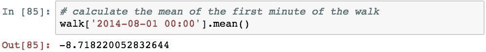

在下采样中，由于现有数据是根据新的间隔放入存储桶中的，因此通常可能会问到存储桶两端的值是多少。 例如，上一次重采样的第一个间隔是从`2014-08-01 00:00:00`到`2014-08-01 23:59:59`，还是应该在`2014-08-04 00:00:00`处结束但在`2014-08-03 23:59:59`处开始？

默认值是前者，它称为左关闭。 排除左值并包括右值的另一种情况是右关闭，可以使用`close='right'`参数来执行。 以下内容对此进行了说明，并注意到所得到的间隔和值之间的细微差别：

关于使用左右关闭的决定实际上取决于您和您的数据建模，但是 pandas 为您提供了选择。

计算每个存储桶的平均值只是一个选择。 下面演示了在每个存储桶中获取第一个值：

为了演示上采样，我们将对步行进行重新采样至几分钟，然后又恢复为几秒钟：

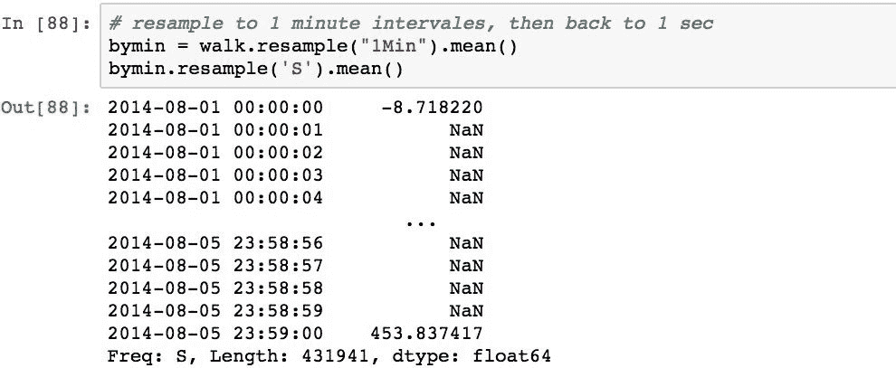

上采样为秒数据创建了索引值，但默认情况下插入了`NaN`值。 可以使用`fill_method`参数修改此默认行为。 我们在使用向前和向后填充选项更改频率时看到了这一点。 这些也可以重新采样。 下面演示了如何使用正向填充：

还可以使用`.interpolate()`方法对结果内插缺失值。 这将为重采样期间创建的所有`NaN`值计算结果中存在的值之间的线性插值：

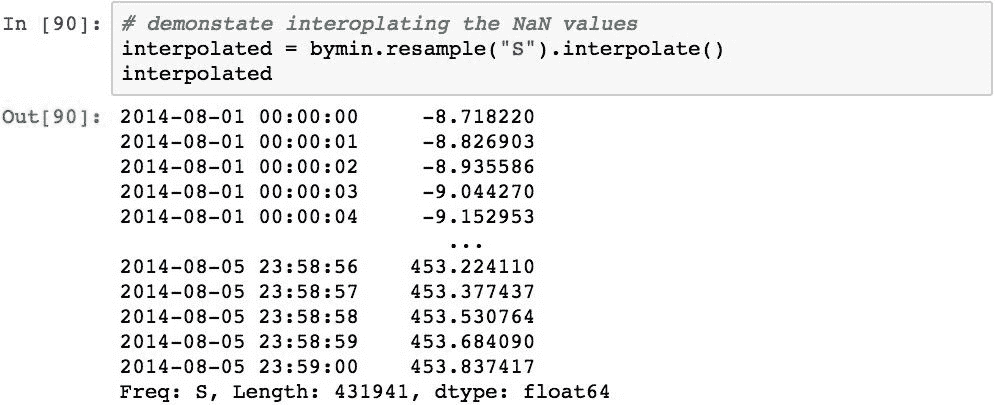

Pandas 还使用`.ohlc()`方法提供了一种非常方便的重采样方法，称为开，高，低和关闭。 以下示例获取了我们的秒数据并计算了小时`ohlc`值：

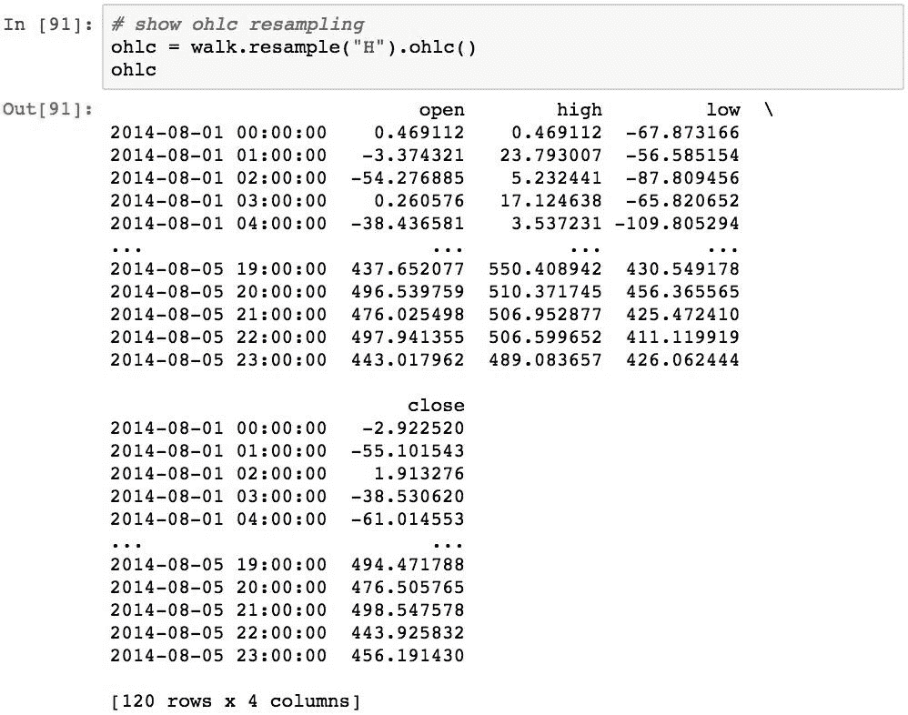

# 时间序列移动窗口操作

Pandas 提供了许多功能来计算移动（也称为滚动）统计信息。 在滚动窗口中，pandas 在特定时间段表示的数据窗口上计算统计信息。 然后，该窗口将沿某个间隔滚动，只要该窗口适合时间序列的日期，就将在每个窗口上连续计算统计信息。

通过在 Series 和 DataFrame 对象上提供`.rolling()`方法，pandas 为滚动窗口提供了直接支持。 然后，来自`.rolling()`的结果值可以具有许多调用的不同方法之一，这些方法可以在每个窗口上执行计算。 下表显示了许多这些方法：

| 功能 | Description |
| `.rolling().mean()` | 窗口中的平均值 |
| `.rolling().std()` | 窗口中值的标准差 |
| `.rolling().var()` | 值的方差 |
| `.rolling().min()` | 窗口中的最小值 |
| `.rolling().max()` | 窗口中的最大值 |
| `.rolling().cov()` | 值的协方差 |
| `.rolling().quantile()` | 以百分比/样本分位数移动窗口分数 |
| `.rolling().corr()` | 窗口中值的相关性 |
| `.rolling().median()` | 窗口中值的中位数 |
| `.rolling().sum()` | 窗口中的值总和 |
| `.rolling().apply()` | 用户功能在窗口中的值的应用 |
| `.rolling().count()` | 窗口中非 NaN 值的数量 |
| `.rolling().skew()` | 窗口中值的偏度 |
| `.rolling().kurt()` | 窗口中值的峰度 |

作为一个实际示例，滚动平均值通常用于消除短期波动并突出显示数据的长期趋势，并且在财务时间序列分析中非常常用。 为了演示，在本章前面创建的随机游走的第一分钟，我们将使用窗口 5 计算滚动平均值。

图表的生成将在第 14 章“可视化”中详细介绍

可以看出`.rolling().mean()`如何提供对基础数据的更平滑表示。 较大的窗口将产生较小的方差，较小的窗口将产生更多的方差（直到窗口大小为 1 为止，这将与原始序列相同）。

下面的示例展示了滚动平均值，其中窗口 2、5 和 10 与原始序列相对应：

请注意，窗口越大，曲线开始处丢失的数据越多。 大小为 n 的窗口在计算度量之前需要 n 个数据点，因此在图的开始处存在间隙。

可以使用`.rolling().apply()`方法通过滚动窗口来应用任何用户定义的功能。 提供的函数将在窗口中传递值数组，并且应返回一个值。 然后，Pandas 会将每个窗口的结果组合成一个时间序列。

为了说明这一点，以下代码计算了平均平均偏差，使您可以感觉到样本中所有值与总体平均值之间的距离：

可以使用 pd.rolling_mean 函数的使用的微小变化来计算扩展的窗口平均值，该函数通过始终从时间序列中的第一个值开始重复计算平均值，并且每次迭代都将窗口大小增加一个。 与滚动窗口相比，扩展窗口平均值将更稳定（响应性更差），因为随着窗口大小的增加，下一个值的影响将减小：

# 摘要

在本章中，我们研究了多种方法来表示在特定时间点发生的事件，以及如何对这些值随时间变化进行建模。 这涉及学习 Pandas 的许多功能，包括日期和时间对象，表示时间间隔和周期的时间变化，以及对时间序列数据执行多种类型的操作，例如频率转换，重采样和计算滚动窗口。

在本书的其余两章中，我们将抛弃 Pandas 的机制，而将更多的精力放在数据的可视化以及将 Pandas 应用于财务数据分析上。