# 可视化

数据分析的最重要部分之一是创建出色的可视化效果，以立即传达数据中的潜在含义。 数据可视化是有效的，因为我们人类是视觉生物，并且已经发展成为能够识别信息布局的含义的方式，当视网膜的冲动击中大脑时，我们的大脑几乎可以立即解释。

多年来，已经进行了大量研究，结果产生了许多有效的可视化技术来传达数据中的特定模式。 这些模式已在可视化库中实现，Pandas 被设计为利用这些模式并使它们的使用非常简单。

本章将介绍其中的几种技术，主要侧重于 matplotlib 和许多常见的可视化。 我们将分三个步骤进行操作。 第一部分介绍了用 Pandas 编程可视化的一般概念，着重介绍了创建时序图的过程。 在此期间，我们将深入研究标记轴的技术以及创建图例，颜色，线条样式和标记的技术。

第二步将集中在 Pandas 和数据分析中常用的多种数据可视化类型，包括：

*   用条形图显示相对差异
*   用直方图描绘数据的分布
*   用箱形图和晶须图描述类别数据的分布
*   用面积图显示累计总数
*   具有散点图的两个变量之间的关系
*   用核密度图估算分布
*   散点图矩阵与多个变量之间的相关性
*   具有热图的多个变量之间的关系强度

最后一步将检查如何通过将绘图划分为多个子部分来创建合成绘图，以便能够在单个图形画布中渲染多个绘图。 这将帮助可视化的查看者一目了然地关联不同的数据集。

# 配置 Pandas

本章中的所有示例均基于以下导入和默认设置。 本章的一个小区别是在整个示例中共享的`seedval`变量的声明：

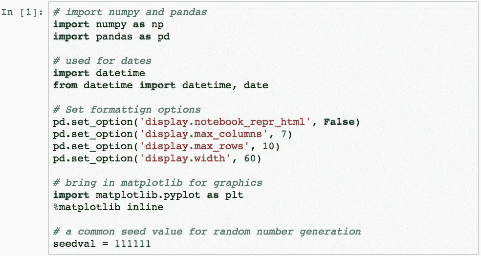

# 用 Pandas 绘制基础知识

Pandas 库本身执行不执行数据可视化。 为了做到这一点，Pandas 与 Python 生态系统中的其他强大的可视化库紧密集成。 这些集成中最常见的是与`matplotlib`集成。 因此，本章将把示例重点放在`matplotlib`上，但我们还将为您指出其他可能的库，以供您自己尝试。 其中两个值得一提。

Seaborn 是另一个基于`matplotlib`的 Python 可视化库。 它提供了一个高级界面来呈现引人注目的统计图形。 它具有对 NumPy 和 pandas 数据结构的本地支持。 Seaborn 的目标是创建在本质上看起来不太科学的`matplotlib`图。 要了解有关 Seaborn 的信息，请访问 [http://seaborn.pydata.org/index.html](http://seaborn.pydata.org/index.html) 上的站点。

尽管 Seaborn 和`matplotlib`在渲染数据方面都很出色，但它们都缺乏用户交互性。 尽管可以通过 Jupyter 之类的工具将两者的渲染显示在浏览器中，但是渲染本身并不使用 DOM 创建，也不使用浏览器的任何功能。

为了促进在浏览器中的呈现并提供丰富的交互性，已创建了几个库来将 Python 和 Pandas 与`D3.js`集成在一起。 `D3.js`是一个 JavaScript 库，用于处理文档并创建丰富的交互式数据可视化。 其中最流行的一种是 mpld3。 不幸的是，在编写本书时，它不适用于 Python 3.6，因此无法覆盖。 但是请仍然在 [https://d3js.org](https://d3js.org) 和[mpls3]在 [http://mpld3.github.io/ 上查看`D3.js`。](http://mpld3.github.io/) 。

# 创建时间序列图

时间序列数据是最常见的数据可视化之一。 在 Pandas 中可视化时间序列就像在对时间序列建模的`DataFrame`或`Series`对象上调用`.plot()`一样简单。

下面的示例演示如何创建一个时间序列，该时间序列表示一段时间内价值的随机波动，类似于股票价格的波动：

Pandas 对象的`.plot()`方法是`matplotlib`库的`plot()`函数的包装函数。 它使 Pandas 数据图非常易于创建，因为其实现被编码为知道如何基于基础数据呈现许多可视化。 它处理许多细节，例如选择系列，标记和轴生成。

在前面的示例中，`.plot()`确定`Series`包含其索引的日期，因此 *x* 轴应设置为日期格式。 它还为数据选择默认颜色。

绘制一系列数据所产生的结果与使用单列呈现`DataFrame`相似。 下面的代码通过产生相同的图但略有不同来说明这一点：它为图添加了图例。 从`DataFrame`生成的图表默认情况下将包含图例。

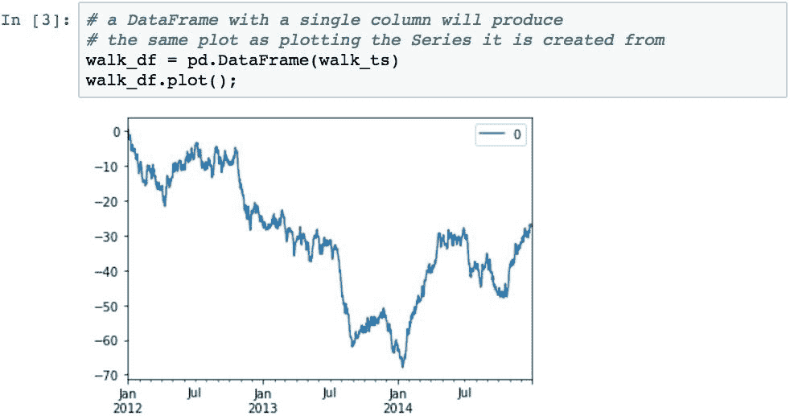

如果`DataFrame`包含多列，则`.plot()`将在图例中添加多个项目，并为每行选择不同的颜色：

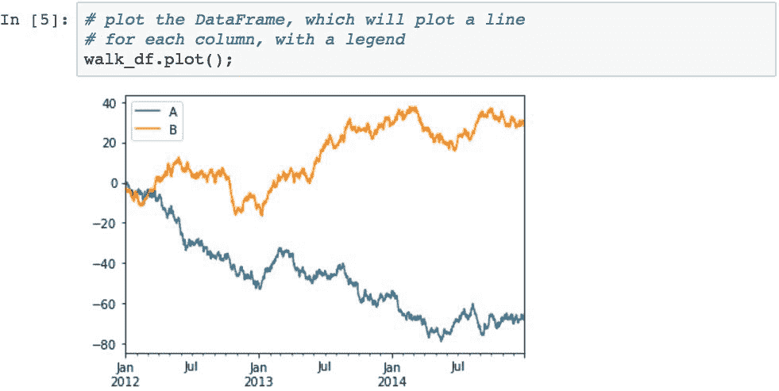

如果要使用`DataFrame`中的数据列作为图的 x 轴上的标签（而不是索引标签），请使用`x`参数指定表示标签的列的名称。 然后，使用`y`参数指定将哪些列用作数据：

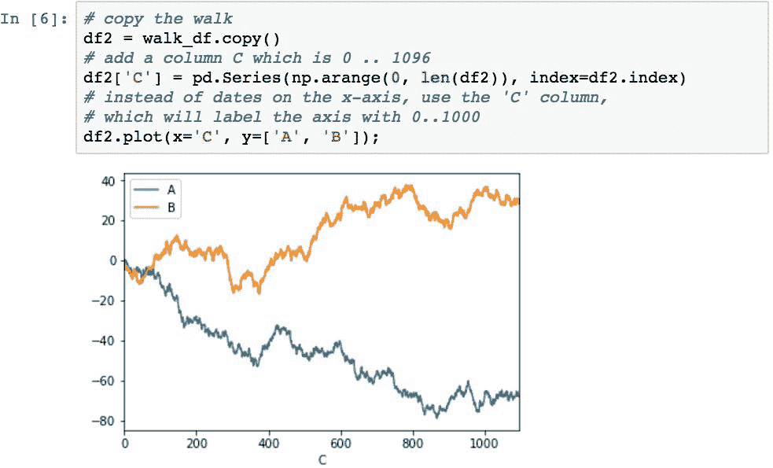

# 装饰和设计时间序列图

内置的`.plot()`方法具有许多选项，可用于更改图形中的内容。 让我们介绍许多绘图中使用的几种常用选项。

# 添加标题和更改轴标签

可以使用`title`参数设置图表标题。 调用`.plot()`之后，不使用`.plot()`设置轴标签，而是直接使用`plt.ylabel()`和`plt.xlabel()`功能设置：

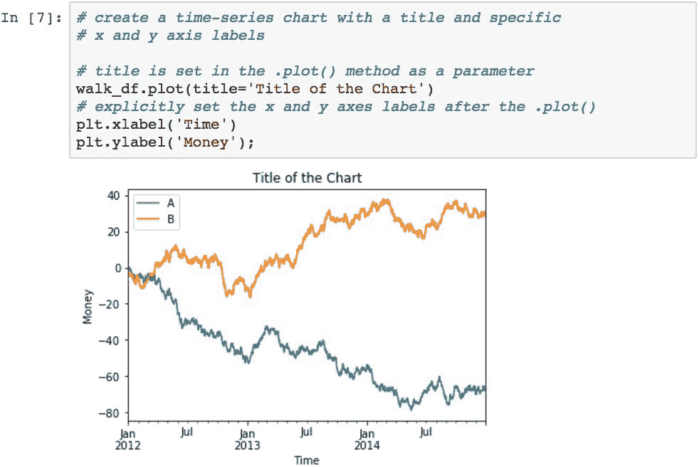

# 指定图例的内容和位置

要更改图例中用于每个数据系列的文本（默认为`DataFrame`中的列名），请捕获从`.plot()`方法返回的`ax`对象，并使用其`.legend()`方法。 该对象是`AxesSubplot`对象，可用于在生成图形之前更改其各个方面：

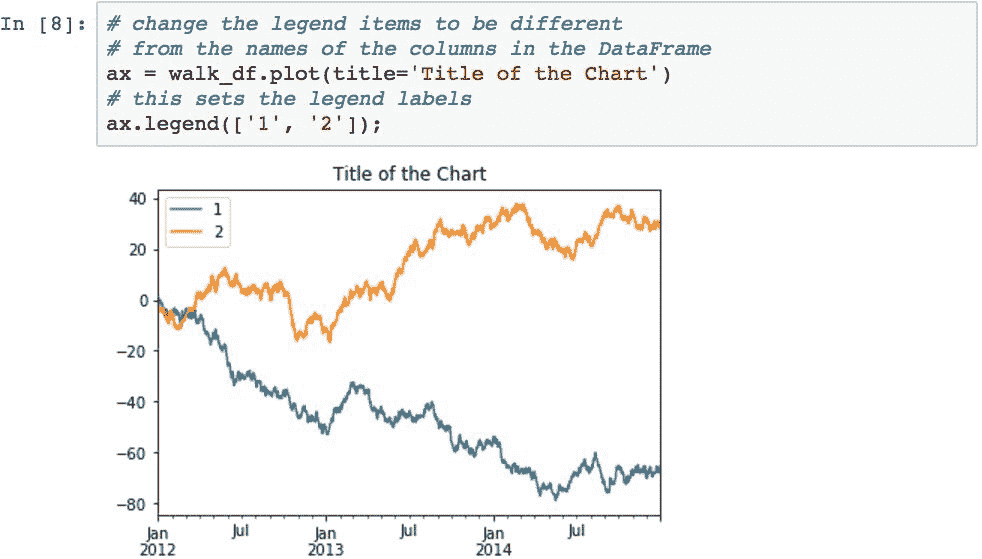

可以使用`.legend()`的`loc`参数设置图例的位置。 默认情况下，pandas 将该位置设置为`'best'`，这告诉`matplotlib`检查数据并确定认为放置图例的最佳位置。 但是，您也可以指定以下任意一项来更具体地放置图例（可以使用字符串或数字代码）：

| **文字** | **代码** |
| '最好' | **0** |
| '右上方' | **1** |
| '左上' | **2** |
| “左下” | **3** |
| '右下' | **4** |
| '对' | **5** |
| “居中左” | **6** |
| “右中” | **7** |
| “较低的中心” | **8** |
| “上部中心” | **9** |
| '中央' | **10** |

下面的示例演示了将图例放置在图形的上部中央部分：

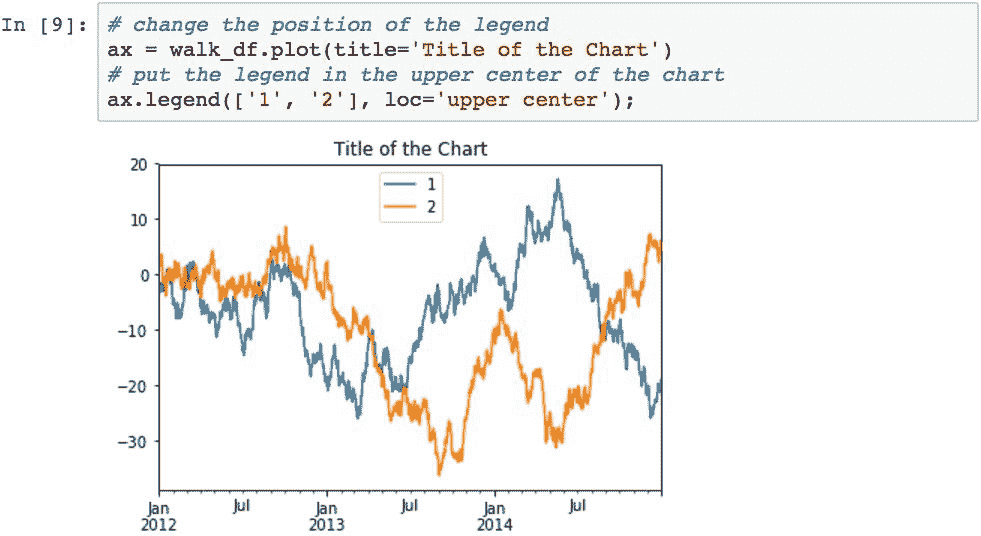

可以使用`legend=False`关闭图例：

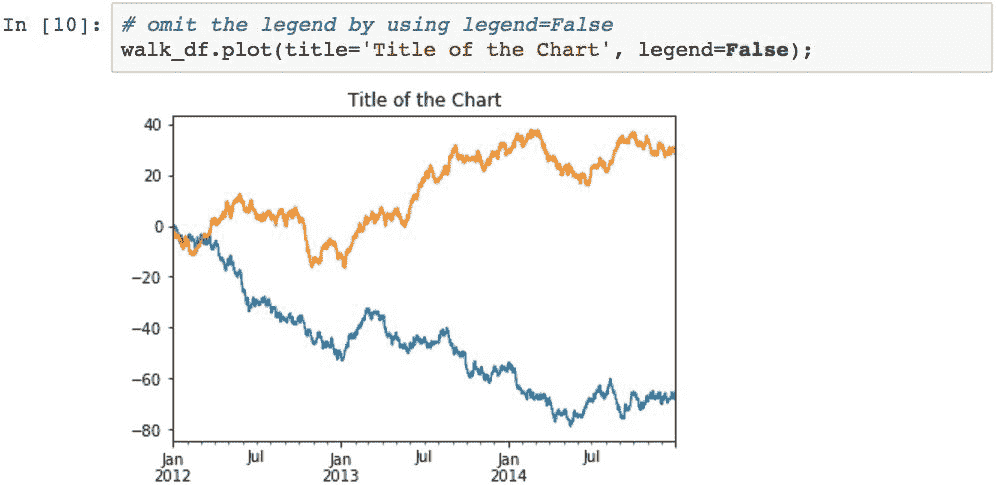

# 指定线条颜色，样式，粗细和标记

Pandas 会在任何图表上自动设置每个系列的颜色。 要指定自己的颜色，请向绘图功能的`style`参数提供样式代码。 pandas 具有许多内置的颜色单字符代码，此处列出了其中的一些：

*   b：蓝色
*   g：绿色
*   r：红色
*   c：青色
*   m：洋红色
*   y：黄色
*   k：黑色
*   w：白色

也可以使用 **#RRGGBB** 格式的十六进制 RGB 代码指定颜色。 下面的示例通过使用一位数字代码将第一个系列的颜色设置为绿色，以及使用 RGB 十六进制代码将第二个系列的颜色设置为红色来演示这两个示例：

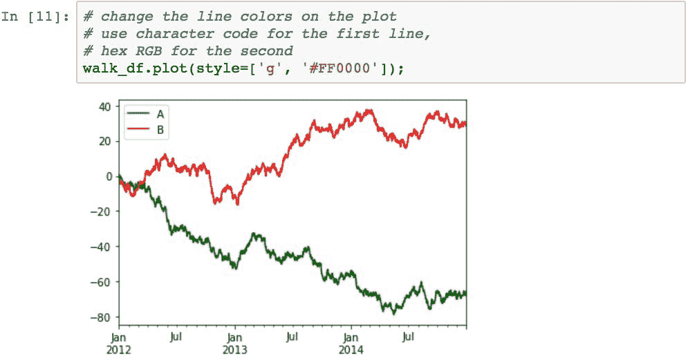

可以使用线型代码指定线型。 通过紧跟在颜色代码之后，可以将它们与颜色样式代码结合使用。 以下是一些有用的线型代码的示例：

*   '-'=固体
*   '-'=破折号
*   '：'=点缀
*   '-' =点划线
*   '。 =点

下图通过绘制五个数据系列来演示这五种线型，每个数据系列都具有以下一种线型：

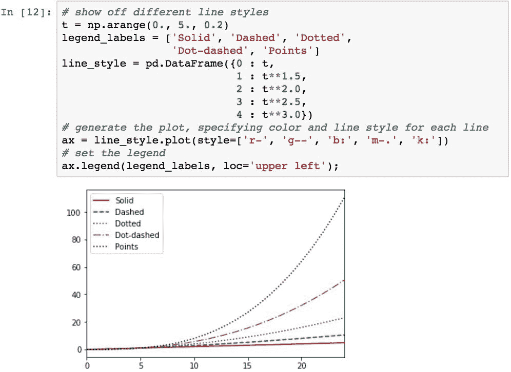

可以使用`lw`参数`.`指定线的粗细。可以通过传递宽度列表或应用于所有线的单个宽度来传递多条线的厚度。 下面的代码以 3 的线宽重绘该图形，使这些线更明显：

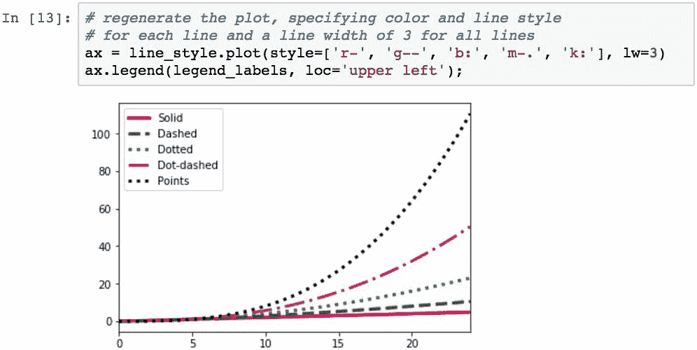

可以通过使用样式代码中的缩写来指定行上的标记。 提供了很多标记类型，您可以在 [http://matplotlib.org/api/markers_api.html](http://matplotlib.org/api/markers_api.html) 中查看所有标记类型。 在下一个图表中，我们将通过使每个系列使用与以下不同的标记来检查其中的五个：圆形，星形，三角形，菱形和点：

# 指定刻度线位置和刻度线标签

刻度线的位置和渲染可以使用各种功能进行自定义。 以下代码引导您完成几个控制其值和渲染的示例。

Pandas 决定在标签位置使用的值可以使用`plt.xticks()`功能找到。 此函数返回两个值：每个刻度的值和代表实际标签的对象：

此报价数组包含沿 *x* 轴以实际数据为单位的报价位置。 在这种情况下，Pandas 认为 0 到 4（最小和最大）的范围和 0.5 的间隔是合适的。

如果要使用其他位置，请通过将列表传递到`plt.xticks()`来提供它们。 以下代码使用从`-1`到`5`的偶数整数对此进行了演示。 这组值将更改轴的范围并删除非整数标签：

可以通过将每个刻度位置的标签作为第二个参数来指定它们。 在以下示例中，通过将 *y* 轴刻度和标签更改为整数值和连续的字母字符，可以显示出这一点：

# 使用格式化程序格式化轴的刻度日期标签

使用**定位器**和**格式化程序**完成其基础数据类型为`datetime`的轴标签的格式化。 定位器控制刻度线的位置，格式器控制标签的格式。

`matplotlib`在`maptplotlib.dates`中提供了几个类来帮助简化该过程：

*   `MinuteLocator`，`HourLocator`，`DayLocator`，`WeekdayLocator`，`MonthLocator`和`YearLocator`
*   这些是专门定位的编码器，用于确定每种类型的日期字段的刻度将在轴上找到
*   DateFormatter
*   此类可用于将日期对象格式化为轴上的标签

默认的定位器和格式化程序为`AutoDateLocator`和`AutoDateFormatter`。 这些可以通过提供不同的对象实现来更改。

为了演示，让我们从前面的示例中的以下随机游走数据子集开始； 它仅代表 2014 年 1 月至 2014 年 2 月的数据。绘制此图可得到以下输出：

该图的 *x* 轴上的标签有两个系列，**次要**和**主要**。 此图中的次要标签包含当月的日期，而主要标签则包含年和月（仅第一个月的年份）。 我们可以为每个次要和主要级别设置定位器和格式化程序，以更改值。

这将通过将次要标签更改为从每周的星期一开始并包含日期和星期几来演示（现在，图表使用每周，并且仅使用星期五的日期，没有日期名称）。 主要标签将使用每月位置，并且始终包含月份名称和年份：

这几乎是我们想要的。 但是，请注意，该年份报告为`0045`。 要使用基于自定义日期的标签创建图，需要避开 Pandas`.plot()`并直接使用`matplotlib`。 幸运的是，这并不难。 此代码片段会略微更改代码，并以所需的格式呈现我们需要的内容：

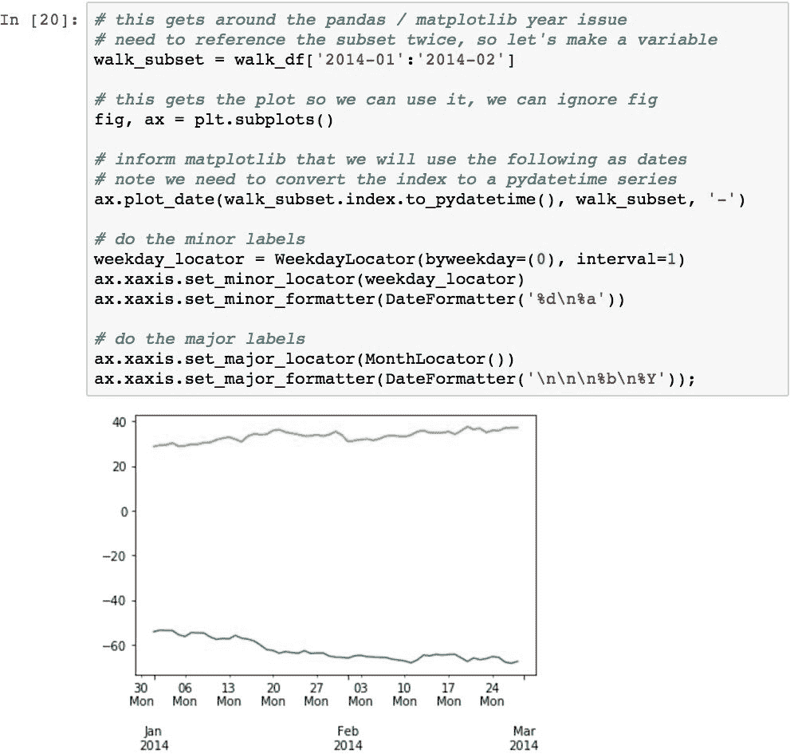

我们可以使用 *x* -轴对象的`.grid()`方法为短轴和长轴刻度线添加网格线。 第一个参数是 True（用于渲染线）或 False（用于隐藏线）。 第二个指定滴答集。 以下代码在不绘制主线的情况下重新绘制此图形，同时渲染了次线：

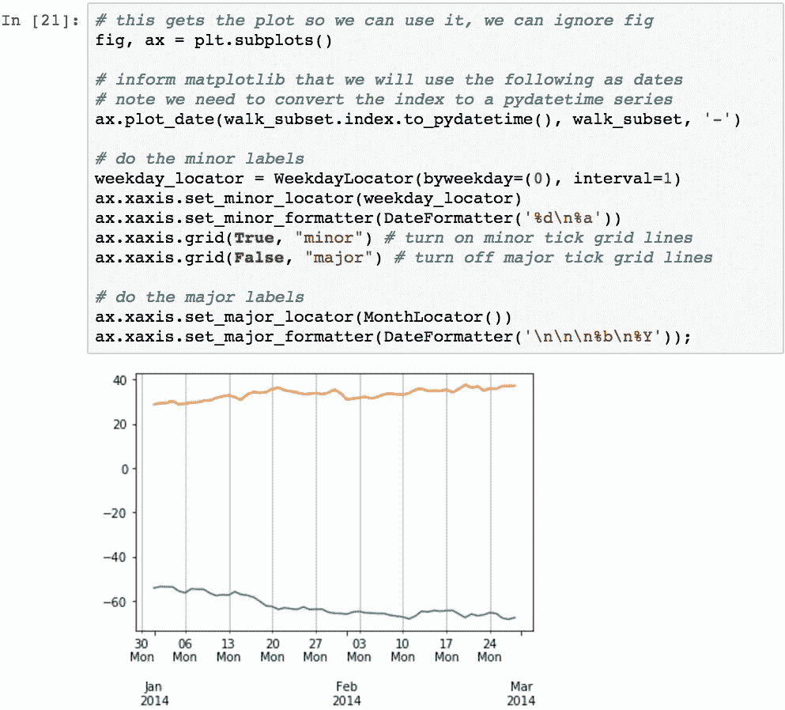

格式化的最终演示将仅使用主要标签，但每周使用`YYYY-MM-DD`格式。 但是，由于这些会重叠，因此我们将指定它们应该旋转以防止重叠。 此旋转通过`fig.autofmt_xdate()`功能指定：

# 统计分析中常用的图

在学习了如何创建，布置和注释时间序列图之后，我们现在将着眼于创建对表示统计信息有用的变量。

# 用条形图显示相对差异

条形图可用于可视化非时间序列数据值的相对差异。 可以使用`.plot()`的`kind='bar'`参数创建条形图：

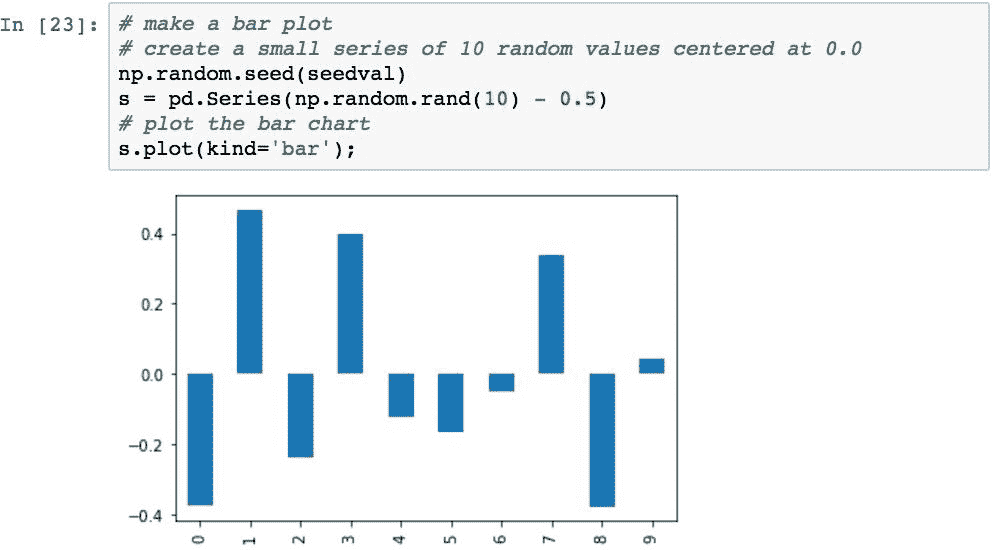

将创建一个多系列条形图，以比较每个 x 轴标签上的多个值：

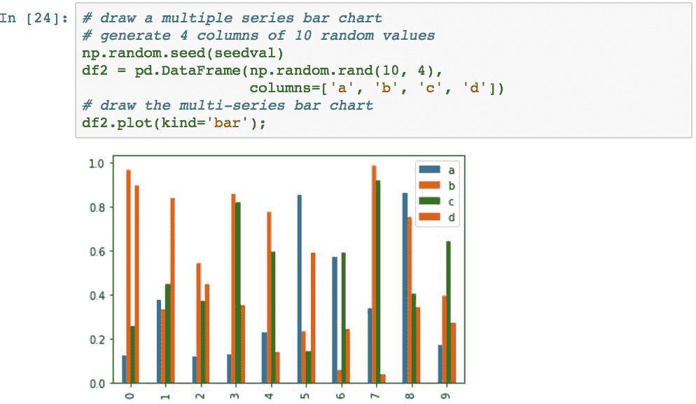

`stacked=True`参数可用于堆叠条形，而不必并排：

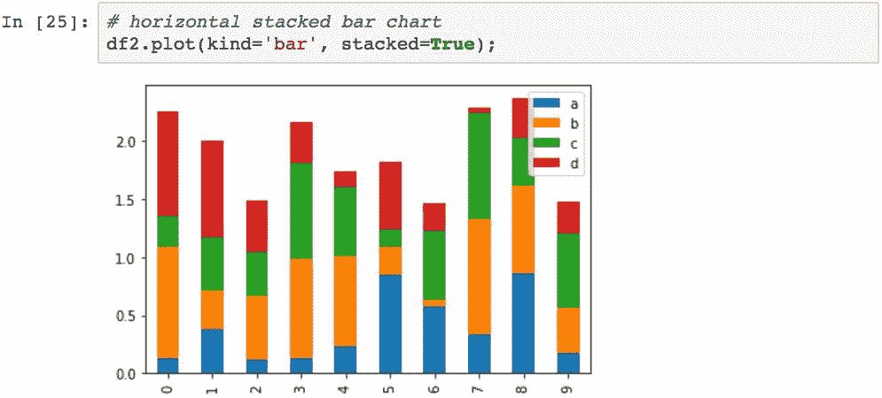

可以使用`kind='barh'`将方向变为水平：

# 用直方图描绘数据的分布

直方图对于可视化数据分布很有用。 以下代码基于正态分布中的`1000`随机值生成直方图：

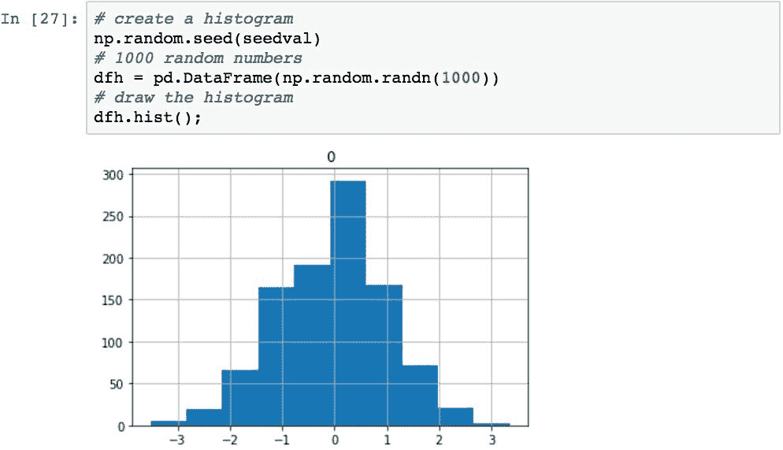

直方图的分辨率可以通过指定要分配给图的仓数来控制。 默认值为 10，增加箱的数量可为直方图提供更详细的信息。 此代码将容器数增加到`100`：

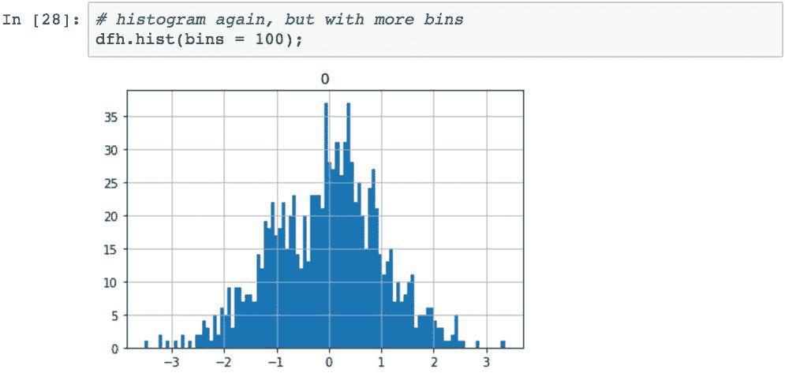

如果数据有多个序列，则直方图功能将自动生成多个直方图，每个序列一个：

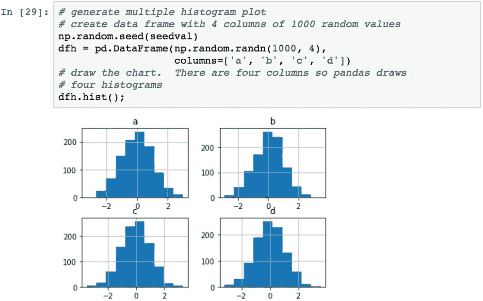

要将多个直方图叠加在同一张图上（以便快速看到分布的差异），请在`.show()`之前多次调用`pyplot.hist()`函数：

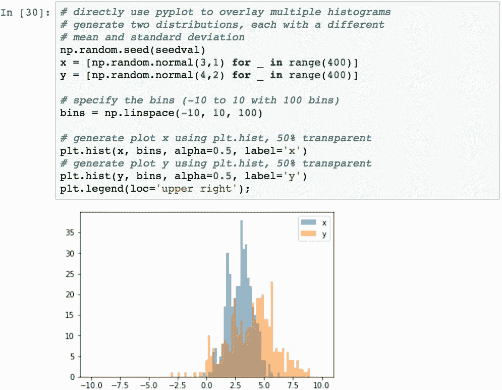

# 用箱形图和晶须图描述类别数据的分布

箱形图来自描述性统计数据，是使用四分位数描述分类数据分布的有用方式。 每个框代表数据的第一和第三四分位数之间的值，并且在中位数处跨框有一条线。 每个晶须伸出手来展示在第一和第三四分位数上下的五个四分位数范围的程度：

# 用面积图显示累计总数

面积图用于表示一段时间内的累计总数，并演示相关属性之间的时间趋势变化。 也可以将它们“堆叠”以显示所有变量的代表性总计。

通过指定`kind='area'`生成面积图。 堆积面积图是默认设置：

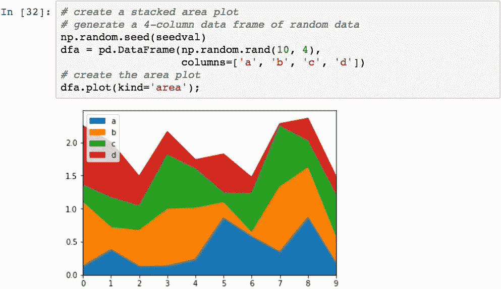

使用`stacked=False`会生成未堆积的面积图：

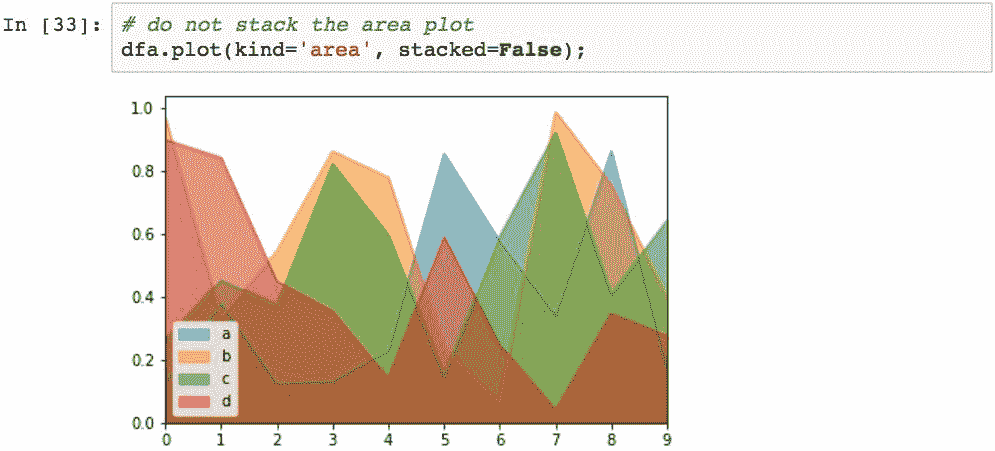

默认情况下，未堆叠的图的 alpha 值为 0.5，因此可以查看多个数据系列如何重叠。

# 具有散点图的两个变量之间的关系

散点图显示一对变量之间的相关性。 通过使用`.plot()`并指定`kind='scatter'`以及`DataFrame`源中的 x 和 y 列，可以从`DataFrame`创建散点图：

可以通过拖放到`matplotlib`中来创建更精细的散点图。 以下代码演示了 2016 年 Google 股票数据的使用，计算每日收盘价中的增量，然后将收盘量与交易量渲染为从交易量得出的大小不同的气泡：

请注意 x 和 y 轴标签的命名法，这得益于 matplotlib 的内部 LaTeX 解析器和布局引擎，为标签创建了不错的数学风格。

# 用核密度图估算分布

核密度估计图，而不是通过估计数据的真实分布来将数据平滑化为连续图，而不是数据的纯粹经验表示。 可以使用`.plot()`方法并设置`kind='kde'`来创建内核密度估计图。 以下代码生成一组正态分布的数字，将其显示为直方图，并覆盖`kde`图：

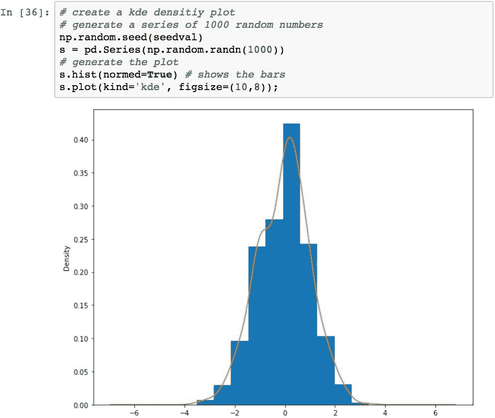

# 散点图矩阵与多个变量之间的相关性

散点图矩阵是确定多个变量之间是否存在线性相关性的一种流行方法。 此代码创建具有随机值的散点图矩阵，并为每个变量组合以及每个对角线每个变量的 kde 图绘制散点图：

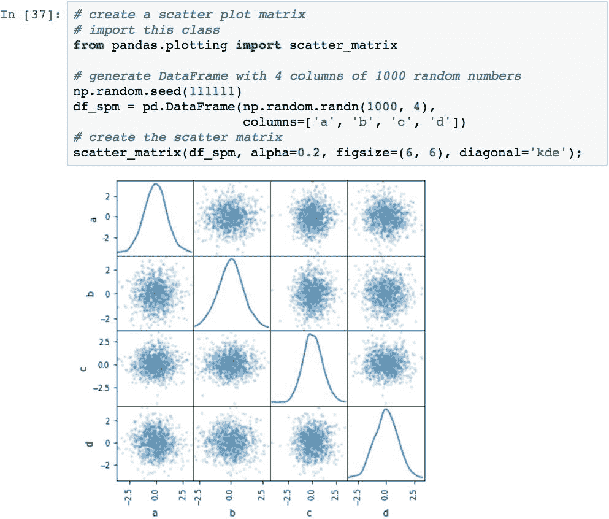

当将其应用于金融时，当计算各种股票的相关性时，我们将再次看到该图。

# 具有热图的多个变量之间的关系强度

热图是数据的图形表示，其中矩阵内的值由颜色表示。 这是显示在两个变量的交点处测得的值之间关系的有效方法。

常见的情况是将矩阵中的值归一化为 0.0 到 1.0，并使行和列之间的交点表示两个变量之间的相关性。 相关性较小（0.0）的值为最暗，相关性最高（1.0）的值为白色。

使用`.imshow()`功能，可以通过 Pandas 和`matplotlib`轻松创建热图：

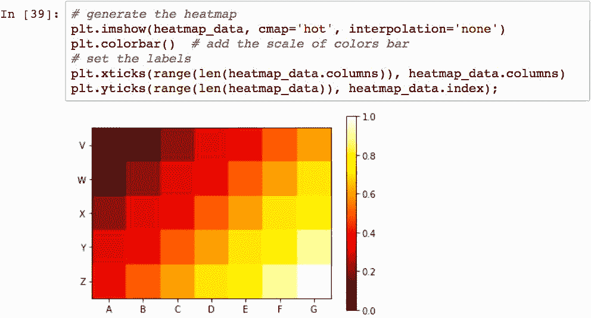

下一章还将重新讨论热图，以证明相关性。

# 在单个图表中手动绘制多个图

通过将多个图彼此相邻显示来对比数据通常很有用。 我们已经看到，pandas 对几种类型的图自动执行此操作。 也可以在同一画布上手动渲染多个图。

要使用`matplotlib`在画布上渲染多个子图，请多次调用`plt.subplot2grid()`。 每次经过网格的大小时，子图都将位于`(shape=(height, width)`上，子图的左上角位置（`loc=(row, column)`）将位于网格上。 尺寸以总列数为单位，而不是以像素为单位。

每次调用`plt.subplot2grid()`的返回值都是一个不同的`AxesSubplot`对象，可用于指定子图渲染的位置。

以下代码通过基于两行一列（`shape=(2,1)`）创建一个绘图来演示这一点。 由`ax1`引用的第一个子图位于第一行（`loc=(0,0)`），由`ax2`引用的第二个子图位于第二行（`loc=(1,0)`）：

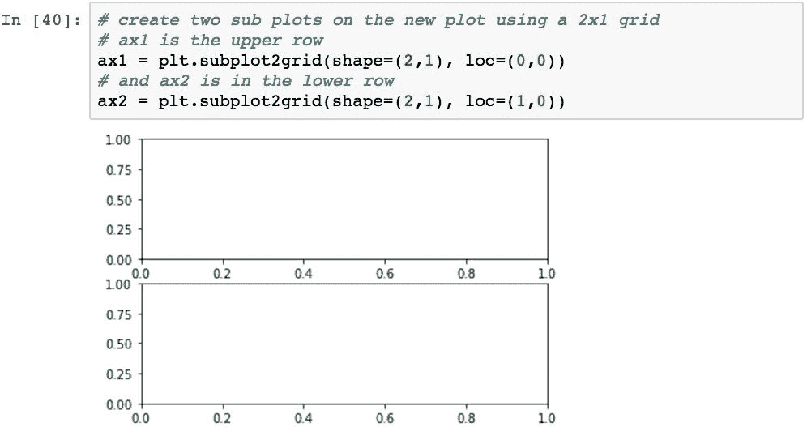

子图已创建，但我们都尚未参与。

可以在每次调用`plt.subplot2grid()`的过程中使用`rowspan`和`colspan`参数指定任何子图的大小。 这种指定跨度的方式与 HTML 表格中的 Speng 跨度非常相似。 这段代码演示了如何使用跨度为每个图指定不同的行，列和跨度来创建五个图的更复杂的布局：

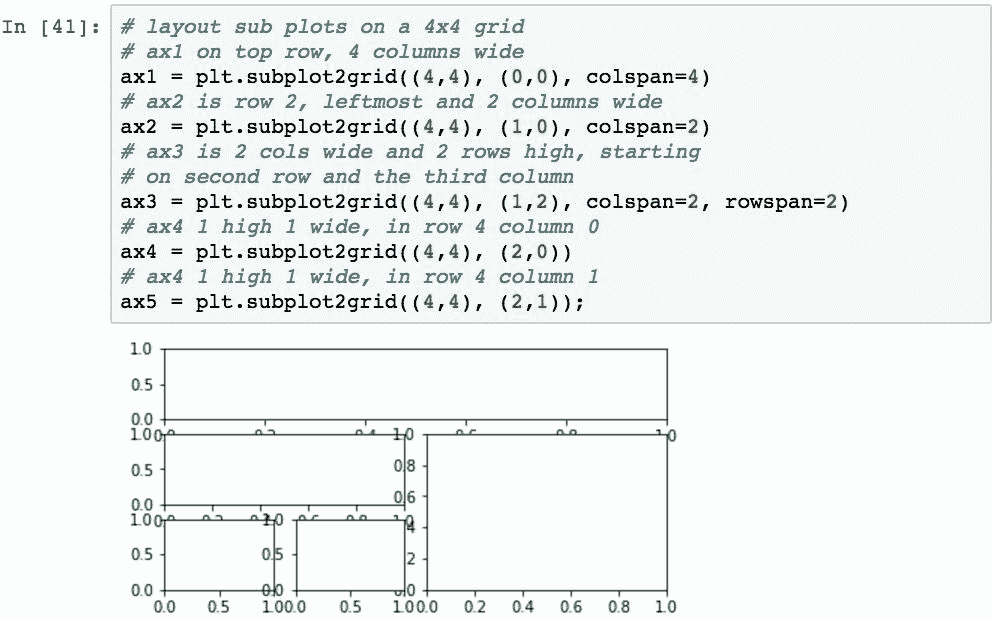

要渲染为特定的子图，请使用`ax`参数将目标轴对象传递到`.plot()`。 下面的代码通过从本章开头创建的随机游走中提取每个序列，然后在不同的子图中渲染每个序列，来演示这一点：

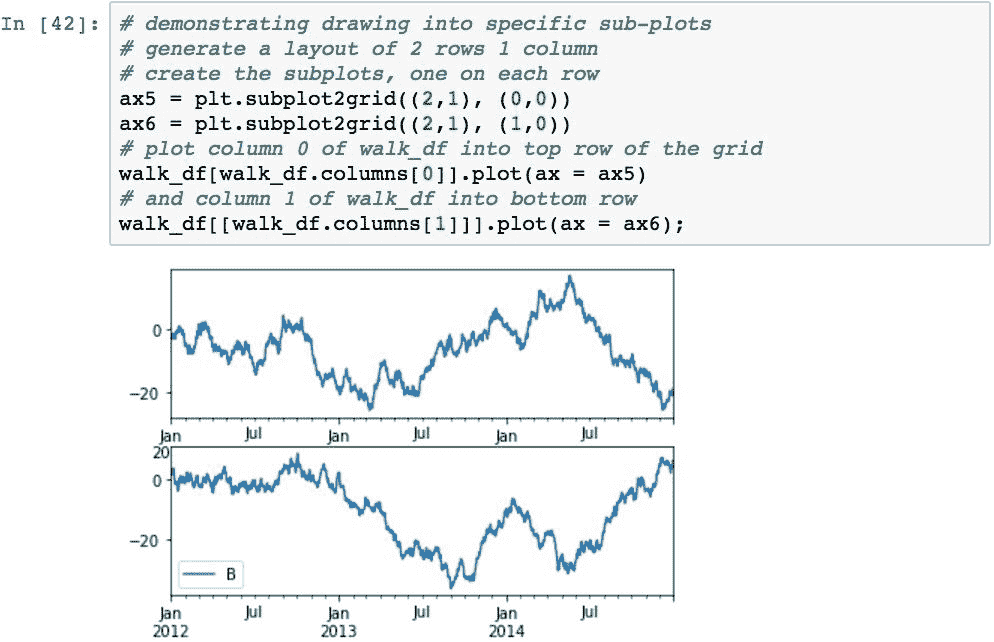

使用这种技术，我们可以执行不同系列数据的组合，例如股票收盘价与交易量图。 给定我们在上一个 Google 示例中读取的数据，此代码将绘制成交量与收盘价的关系：

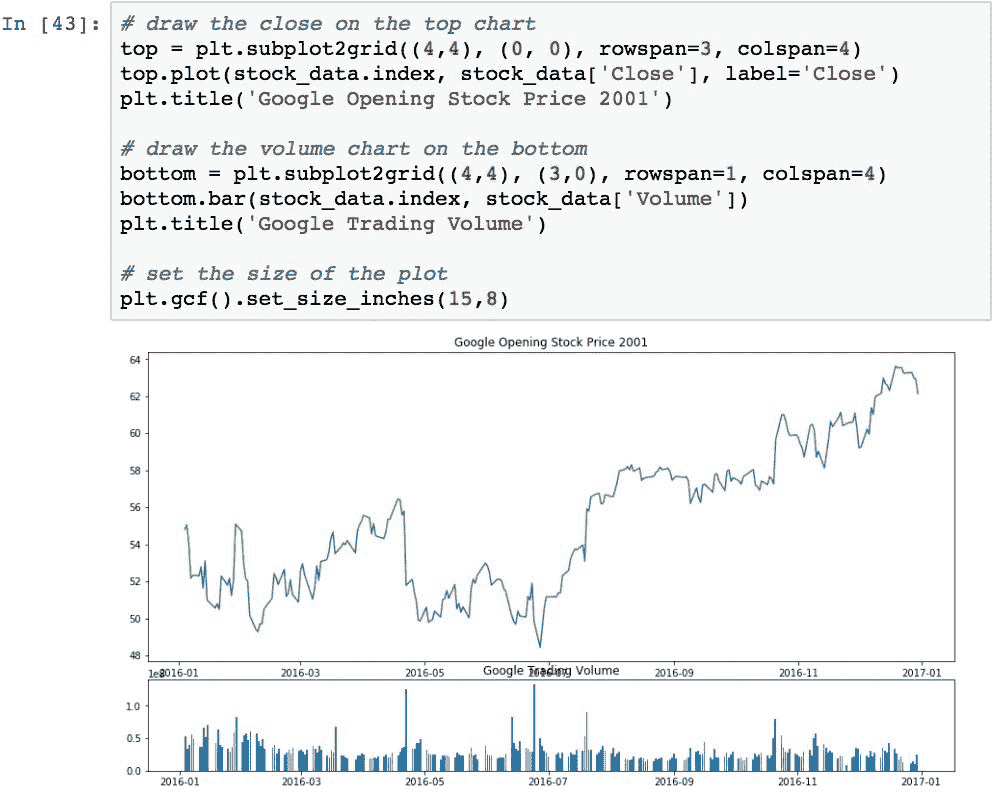

# 摘要

在本章中，我们研究了许多最常见的可视化 Pandas 数据的方法。 数据的可视化是快速了解数据中正在讲述的故事的最佳方法之一。 Python，pandas 和`matplotlib`（甚至其他一些库）提供了一种非常快速的方法，只需几行代码即可获取基础消息并以精美的方式显示它。

在本书的下一章和最后一章中，我们将研究 Pandas 在金融中的应用，尤其是股票价格分析。