# 十五、历史股价分析

在最后一章中，我们将使用 Pandas 对从 Google 财经获取的股票数据进行各种财务分析。 这还将涵盖财务分析中的多个主题。 重点将放在使用 Pandas 得出实用的时序股票数据上，而不是在金融理论的细节上。 但是，我们将涵盖许多有用的主题，并学习将 Pandas 应用于此领域和其他领域有多么容易。

具体而言，在本章中，我们将完成以下任务：

*   从 Google 财经中获取和整理股票数据
*   绘制时间序列价格
*   绘制交易量系列数据
*   计算简单的每日百分比变化
*   计算简单的每日累计收益
*   从每日到每月的收益重新采样数据
*   分析收益分配
*   执行滚动平均计算
*   比较股票的平均每日收益
*   根据收盘价的每日百分比变化来关联股票
*   计算股票波动率
*   可视化相对于预期收益的风险

## 配置 IPython 笔记本

本章中的所有示例均基于以下导入和默认设置：

## 从 Google 获取和整理股票数据

我们的首要任务是编写几个函数，以帮助我们从 Google 财经中检索股票数据。 我们已经看到可以使用 pandas `DataReader`对象读取此数据，但是我们将需要与 Google 财经提供的数据组织方式稍有不同，因为我们稍后将对这些信息进行各种处理 。

以下功能将获取两个指定日期之间特定股票的所有 Google 财经数据，并将该股票的代码添加到列中（稍后需要进行数据透视）。

数据将包含一个固定的 3 年窗口，范围从 2012 年到 2014 年。以下内容是`MSFT`代码的 3 年期数据：

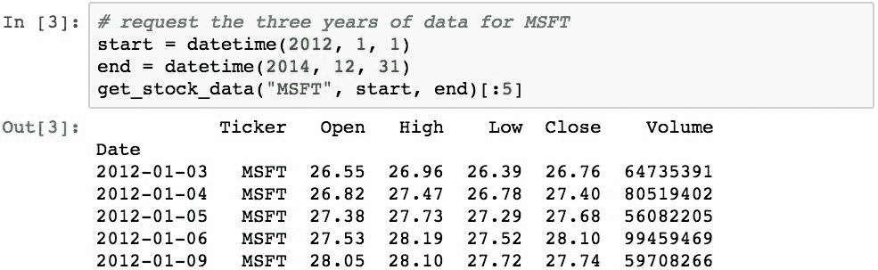

既然我们有了一个可以获取单个报价器数据的函数，那么拥有一个可以读取多个报价器的数据并将它们全部返回到单个数据结构中的函数将很方便。 以下代码执行此任务：

本章中的示例将使用**苹果**（`AAPL`）， **微软**（`MSFT`），**通用电气**（`GE`）， **IBM**（`IBM`），**美国航空**（`AA`）， **达美航空**（`DAL`），美联航**航空公司**（`UAL`），**百事可乐**（`PEP`）， 和**可口可乐**（`KO`）。

选择这些股票是为了在三个不同部门（技术，航空和软饮料）中的每个样本中都有多个股票的样本。 这样做的目的是演示如何在相似行业的选定股票之间的选定时间段内，得出各种股票价格测量值之间的相关性，并演示不同行业之间的股票差异。

我们可以阅读以下内容：

注意：在测试期间，已经确定根据您的位置，这可能会由于 URL 可访问性而导致一些错误。

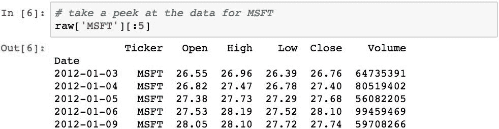

我们将对`Close`列中的收盘价特别感兴趣。 但是，如果我们有一个`DataFrame`对象按日期索引，并且其中每一列都是特定股票的价格，而行是该股票在该日期的收盘价，那么对我们来说更方便。 可以通过旋转数据来完成此操作，这是在读取数据时添加“股票行情指示器”列的原因。 以下功能将为我们做到这一点：

以下使用该功能将数据转移到新组织：

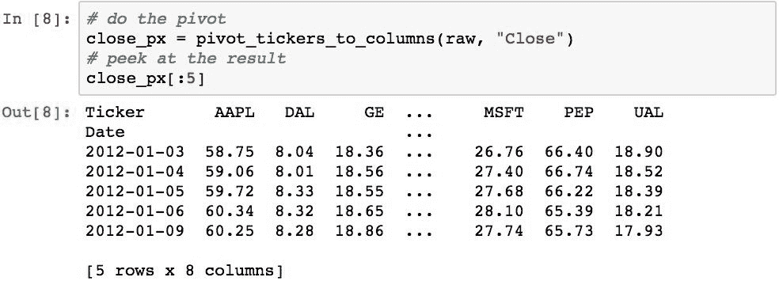

现在，所有股票的收盘价都是每一列中一列的值。 通过这种格式，可以轻松比较每只股票的收盘价和其他股票的收盘价。

## 绘制价格时间序列

现在，让我们对`AAPL`和`MSFT`的收盘价进行图形比较。 下图显示了`AAPL`的调整后收盘价：

下面显示了`MSFT`：

两组收盘价都可以轻松地显示在单个图表上，以进行并排比较（或彼此比较）：

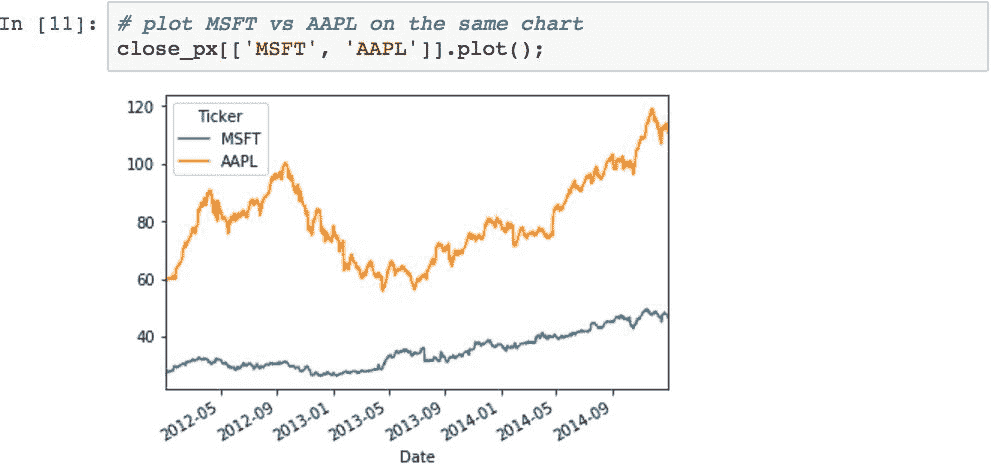

## 绘制交易量序列数据

可以使用条形图绘制交易量数据。 我们首先需要获取交易量数据，这可以使用之前创建的`pivot_tickers_to_columns()`函数来完成：

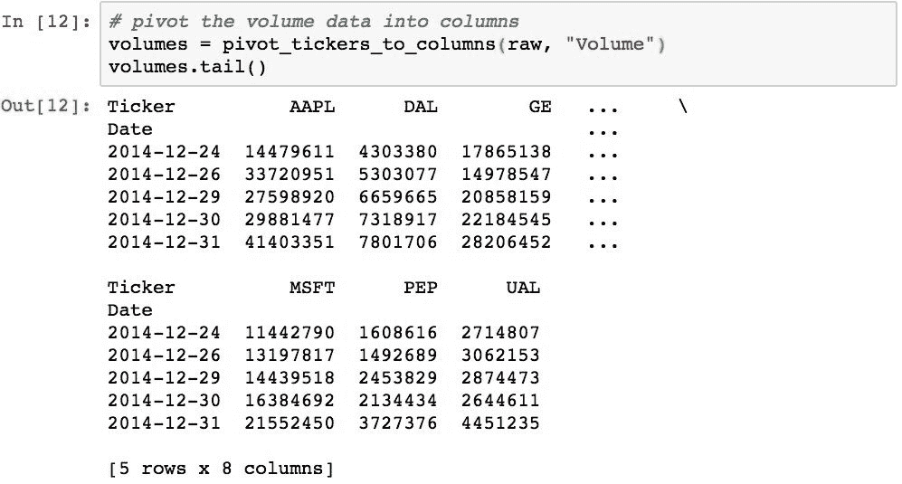

现在，我们可以使用此数据绘制条形图。 下图显示了`MSFT`的交易量：

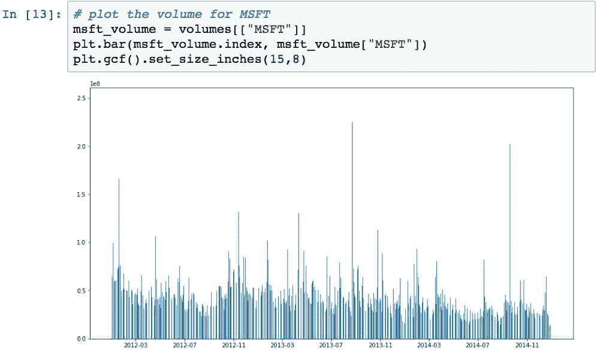

普通类型的财务图会绘制相对于其收盘价的股票量。 以下示例创建了这种类型的可视化：

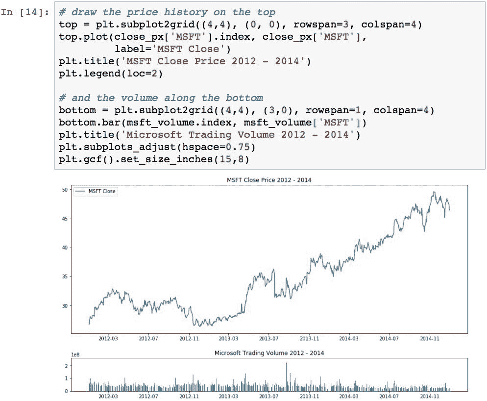

## 计算收盘价的简单每日百分比变化

收盘价的每日简单百分比变化（不包括股息和其他因素）是指股票在一天的交易中价值的百分比变化。 它由以下公式定义：

可以使用`.shift()`在 Pandas 中轻松计算出：

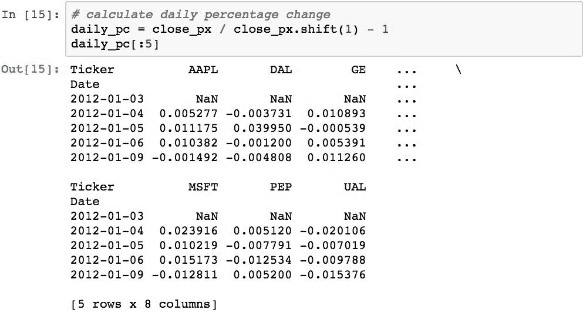

快速检查确认`AAPL`在`2011-09-08`上的收益是正确的：

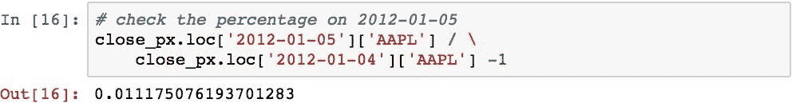

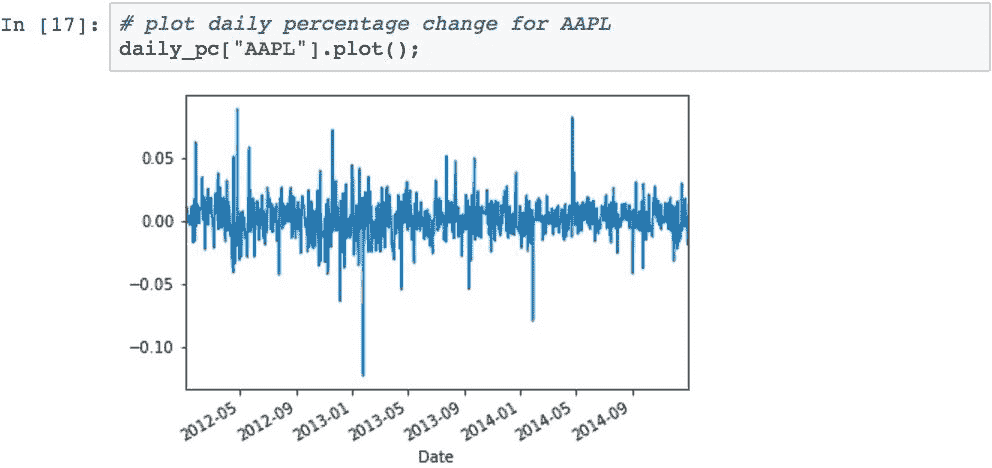

如上图所示，每日百分比变化图通常看起来像噪声。 但是，当我们使用这些值的累积乘积（称为每日累积收益）时，便可以查看股票值随时间的变化。 那是我们的下一个任务。

## 计算股票的简单每日累计收益

简单的累积每日收益是通过计算每日百分比变化的累积乘积来计算的。 此计算由以下公式表示：

使用`.cumprod()`方法简洁地计算出：

现在可以绘制累积收益，以查看各种股票的价值随时间变化的情况：

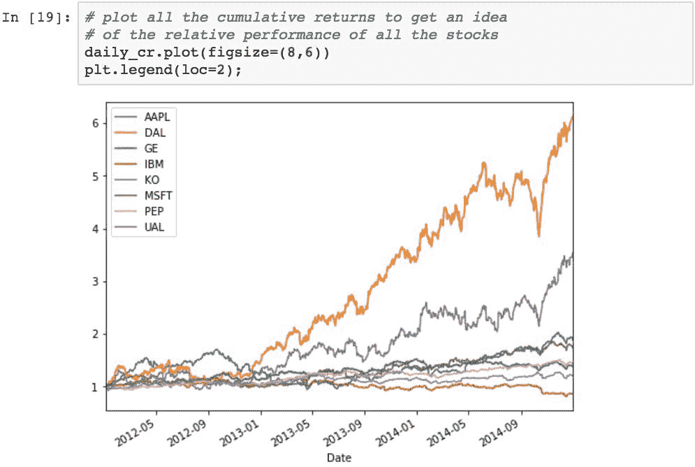

## 将数据从每日重新采样为每月的收益

要计算每月的回报率，我们可以使用一些 Pandas 魔术，然后对原始的每日回报进行重新采样。 在此过程中，我们还需要舍弃不属于月底的日期，并预先填写所有缺少的值。 可以使用`.ffill()`完成重采样的结果：

请注意条目的日期，并且它们现在都是月末日期。 值未更改，因为重新采样仅选择了月底的日期，或者如果源中不存在该日期之前的值，则使用该日期之前的值进行填充。

现在我们可以使用它来计算每月百分比变化：

现在，可以计算每月累积回报：

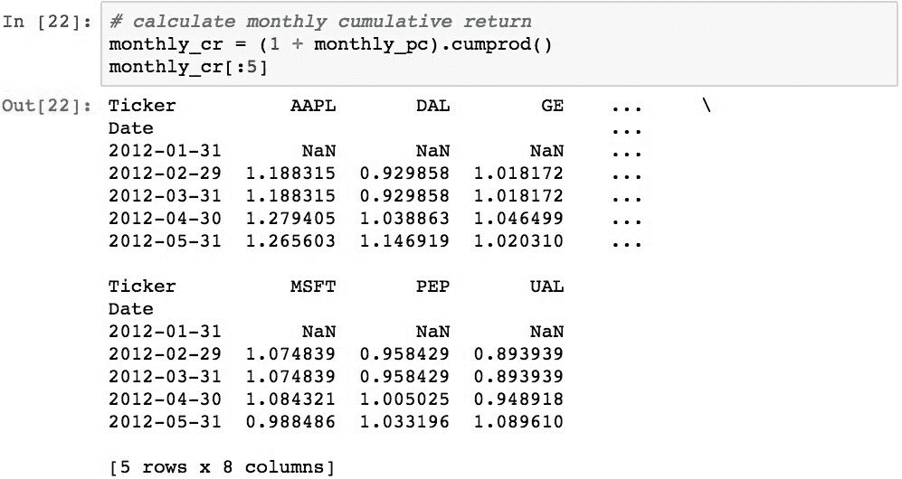

月度收益具有以下可视化效果：

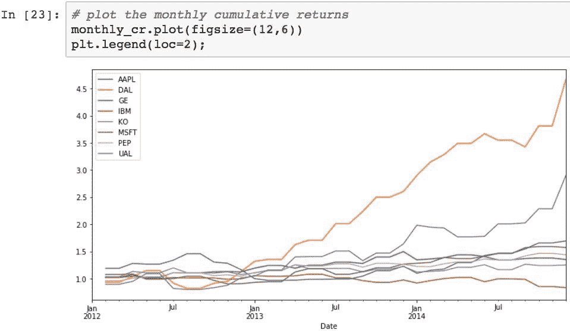

这看起来像每日收益，但总的来说，它并不那么顺利。 这是因为它使用了大约 30% 的数据，并且绑定到月底。

## 分析收益分布

通过将数据绘制在直方图中，可以感觉到特定股票每日百分比变化的分布差异。 生成数据（例如每日收益）的直方图的一个技巧是选择要聚合值的箱数。 该示例将使用 50 个桶，这使您可以很好地感觉到三年数据中每日变化的分布。

以下显示了`AAPL`的每日百分比变化的分布：

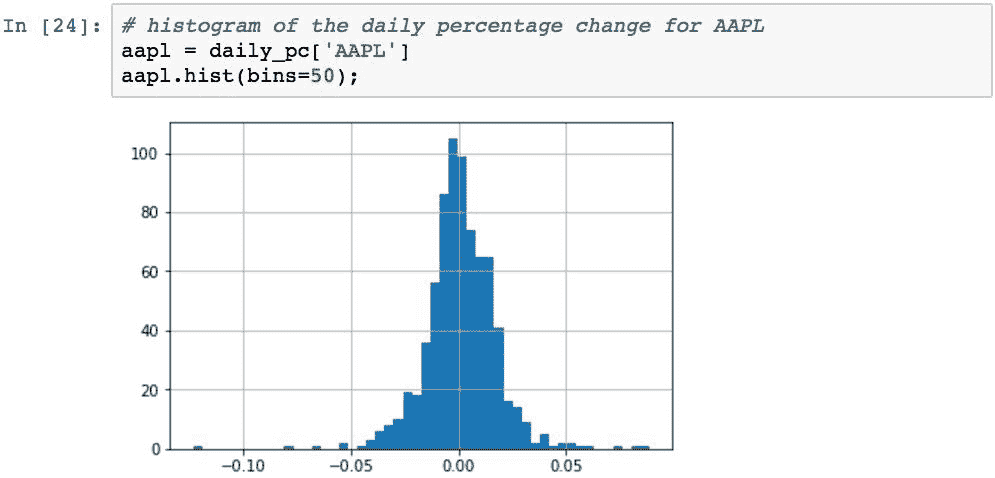

该可视化告诉我们几件事。 首先，大多数日常运动以 0.0 为中心。 其次，左侧有少量偏斜，但是数据显得相对对称。

我们可以在一个直方图矩阵图中绘制所有股票每日百分比变化的直方图。 这为我们提供了一种快速确定这三年内股票行为差异的方法：

轴上的标签有点挤在一起，但是直方图的形状很重要。

从该图表可以看出这九只股票的表现差异，尤其是偏度（均值一侧有更多例外值）。 我们还可以看到总体分布宽度的差异，从而可以快速查看波动性较大的股票。

## 执行滚动平均计算

可以使用`.rolling().mean()`计算股票的滚动平均线。 通过消除股票表现中的“噪音”，滚动平均线将使您对股票在给定时间内的表现有所了解。 滚动窗口越大，图形将越平滑且随机性越小，但是会牺牲准确性。

以下示例使用每日收盘价计算 30 天和 90 天期间`MSFT`的滚动平均值。 可以从视觉上轻松确定降噪的差异：

## 股票间的平均每日回报的比较

散点图是一种非常有效的方法，可以直观地确定两个股票之间的股价变化率之间的关系。 下图显示了`MSFT`和`AAPL`之间的收盘价每日百分比变化的关系：

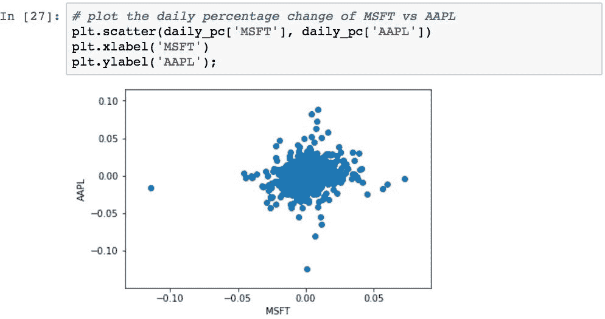

这使我们可以快速查看两种股票之间的每日收益的整体相关性。 每个点代表两只股票的一天。 每个点沿着`AAPL`的百分比变化沿垂直方向绘制，而对于`MSFT`沿水平线绘制。

如果对于`AAPL`值更改的每个金额，`MSFT`当天也更改了相同比例的金额，则所有点将从左下部分到右上部分沿理想的垂直对角线落下。 在这种情况下，两个变量将与 1.0 的相关值完全相关。 如果两个变量完全不相关，则相关性以及线的斜率将为 0，即完全水平。

为了演示完美的相关关系，我们可以绘制`MSFT`与`MSFT`的关系图。 与自己相关的任何此类序列将始终为 1.0：

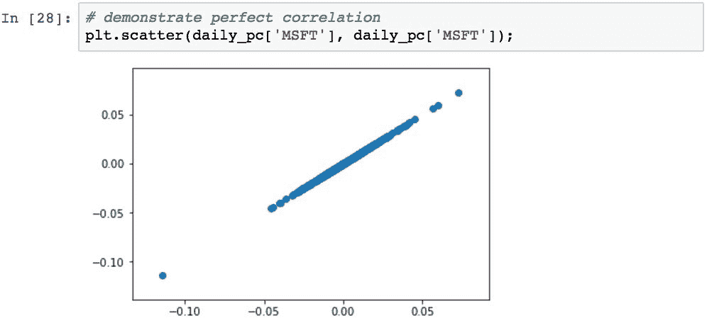

回到`AAPL`与`MSFT`的图，不包括几个离群值，由于所有值似乎都集中在中心附近，因此该群集似乎仅显示出两只股票之间的适度相关性。

实际的相关性计算（将在下一节中进行研究）显示相关性为 0.1827（这是回归线的斜率）。 该回归线将比对角线更水平。 这意味着，从统计学上来说，对于`AAPL`价格的任何特定变化，将无法根据 AAPL 的价格变化预测给定日期`MSFT`价格的变化。

为了促进对多个相关性的整体视觉分析，我们可以使用散点图矩阵图：

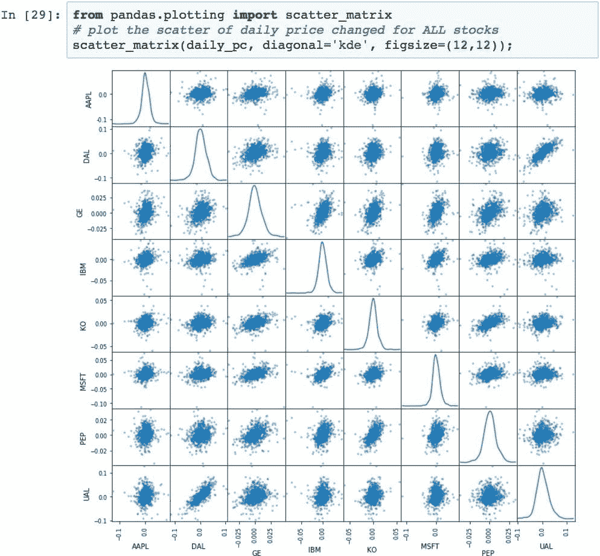

该图中的对角线是核密度估计图。 较窄的曲线与较宽的曲线相比波动性较小，偏斜表示较大的收益或亏损趋势。 结合散点图，可以快速总结具有两种不同视觉指标的任意两种股票的比较。

## 基于收盘价的每日百分比变化的股票相关性

相关性是两个变量之间关联强度的度量。 相关系数为 1.0 意味着，一组数据中的每个值更改在另一组数据中都有相应的值更改。 0.0 相关性意味着数据集没有关系。 相关性越高，基于一个或另一个预测每个变化的能力就越大。

散点图矩阵使我们快速直观地了解了两种股票之间的相关性，但它不是一个确切的数字。 可以使用`.corr()`方法计算`DataFrame`中数据列之间的确切相关性。 这将生成代表列的变量之间所有可能相关性的矩阵。

下面的示例计算样本三年中所有这些股票的收盘价每日百分比变化的相关性：

对角线始终为 1.0，因为股票始终与自身完全相关。 可以使用热图可视化此相关矩阵：

该图的想法是，您可以通过查找垂直和水平变量的交点，通过颜色查看相关程度。 颜色越深，相关性越小； 颜色越浅，相关性越大。

## 计算股票的波动性

股票的波动率是对特定时间段内股票价格方差变化量的度量。 通常，将一只股票的波动率与另一只股票的波动率进行比较，以获得可能风险较小的感觉，或者将一个市场指数与股票的波动率与整个市场进行比较，这是很常见的。 通常，波动性越高，对该股票进行投资的风险就越大。

波动率是通过对股票变化百分比取滚动窗口标准差（并相对于窗口大小缩放比例）来计算的。 窗口的大小会影响整体结果。 窗口越大，代表的测量值就越不代表。 随着窗口变窄，结果接近标准差。 因此，根据数据采样频率选择适当的窗口大小是一项技巧。 幸运的是，Pandas 使得交互修改非常容易。

作为示例，给定 75 个周期的窗口，以下内容将计算样本中股票的波动率：

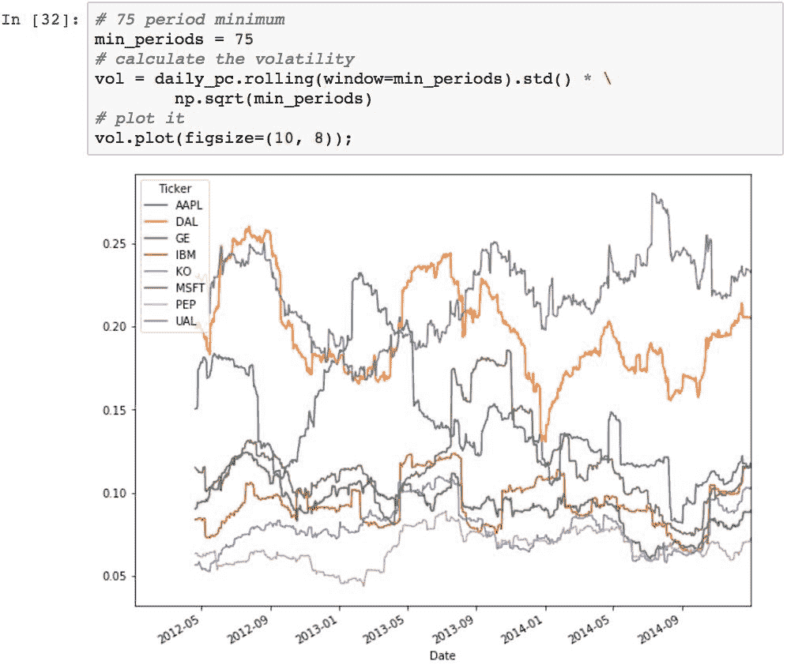

图表上较高的线表示总体较高的波动率，并且波动率随时间的变化显示为每条线中的运动。

## 确定相对于预期收益的风险

有用的分析是将股票每日百分比变化的波动率与其预期收益相关联。 这给人一种股票投资的风险/收益率的感觉。 这可以通过将每日百分比变化的平均值相对于相同值的标准差进行映射来计算。

创建一个散点图，将散点图与我们的一组样本股票的风险和回报相关联，并用气泡和箭头标记点：

这样的结果立即从可视化中跳出来，但是仅通过查看数字表就很难看到：

*   航空股票（`AA`，`DAL`和`UAL`）具有最高的风险，但也具有最高的回报率（这不是一般的投资规则吗？）。
*   科技股具有中等风险，但回报也中等。
*   在科技股中，`IBM`和`GE`是四家中最保守的。
*   可乐股票的风险最低，但总体回报率也最低。 对于大宗商品，这是有意义的。

## 总结

在学习 Pandas 及其为数据处理和分析提供的功能方面，我们已经走到了旅程的尽头。 在本章之前，我们花费了大部分时间来学习 Pandas 的功能，并且在许多情况下，使用的是设计用来演示概念的数据，而不是使用实际数据。

在本章中，我们将利用到目前为止所学到的所有知识，来说明使用 Pandas 分析现实世界的数据（尤其是股票数据）并从数据中得出结果是多么容易。 通常，这使我们能够通过可视化来快速得出结论，这些可视化旨在使数据中的模式显而易见。

本章还介绍了一些财务概念，例如每日百分比变化，计算收益和时间序列数据的相关性。 重点不是金融理论，而是证明使用 Pandas 来管理和从数字列表中获取含义是多么容易。

最后，值得注意的是，尽管 Pandas 是由金融分析师创建的（因此它具有在金融领域提供简单解决方案的能力），但 Pandas 绝不仅限于金融。 它是用于数据分析的非常强大的工具，可以同样有效地应用于许多其他领域。 其中有几个新兴市场代表着巨大的机遇，例如社交网络分析或可穿戴计算的应用。 无论您将 Pandas 用于哪个领域，我都希望您能像我一样发现使用 Pandas 很有趣。