# 三、用序列表示单变量数据

`Series`是 Pandas 的主要构建基块。 它表示单个数据类型的一维类似于数组的值集。 它通常用于为单个变量的零个或多个测量建模。 尽管它看起来像数组，但`Series`具有关联的索引，该索引可用于基于标签执行非常有效的值检索。

`Series`还会自动执行自身与其他 Pandas 对象之间的数据对齐。 对齐是 Pandas 的一项核心功能，其中数据是在执行任何操作之前按标签值匹配的多个 Pandas 对象。 这允许简单地应用操作，而无需显式地编码连接。

在本章中，我们将研究如何使用`Series`为变量的测量建模，包括使用索引来检索样本。 这项检查将概述与索引标签，切片和查询数据，对齐和重新索引数据有关的几种模式。

具体而言，在本章中，我们将涵盖以下主题：

*   使用 Python 列表，字典，NumPy 函数和标量值创建系列
*   访问`Series`的索引和值属性
*   确定`Series`对象的大小和形状
*   在创建`Series`时指定索引
*   使用头，尾和带访问值
*   通过索引标签和位置查找值
*   切片和常用切片模式
*   通过索引标签对齐
*   执行布尔选择
*   重新索引`Series`
*   就地修改值

# 配置 Pandas

我们使用以下导入和配置语句开始本章中的示例：

# 创建序列

可以使用多种技术创建`Series`。 我们将研究以下三个：

*   使用 Python 列表或字典
*   从 NumPy 数组
*   使用标量值

# 使用 Python 列表和字典创建序列

可以从 Python 列表中创建`Series`：

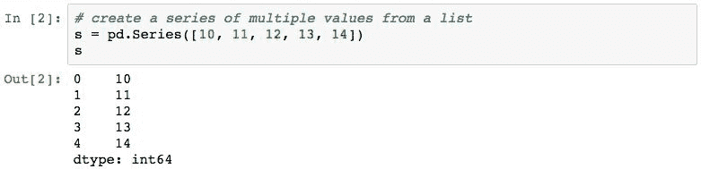

数字的第一列表示`Series`索引中的标签。 第二列包含值。 `dtype: int64`表示`Series`中值的数据类型为`int64`。

默认情况下，Pandas 会创建一个索引，该索引由`0`开始的连续整数组成。 这使该系列看起来像许多其他编程语言中的数组。 例如，我们可以在`label 3`处查找值：

该查找是通过标签值而不是从 0 开始的位置进行的。 我们将在本章后面详细研究。

可以使用非整数的数据类型。 以下创建一系列字符串值：

要创建由`n`个相同值`v`的序列组成的系列，请使用 Python 速记表创建`[v]*n`。 以下创建`2`的五个值：

下面是一种类似的速记类型，它使用 Python 速记来将每个字符用作列表项：

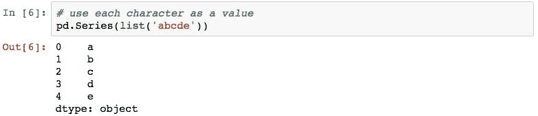

可以从 Python 字典直接初始化`Series`。 使用字典时，字典的键用作索引标签：

# 使用 NumPy 函数创建

初始化`Series`对象的各种 NumPy 函数是一种常见的做法。 例如，以下示例使用 NumPy `np.arange`函数在`4`和`8`之间创建一个整数值序列：

`np.linspace()`方法的功能类似，但是允许我们指定要在两个指定值之间（包括两个值）创建的值的数量，并具有指定的步骤数：

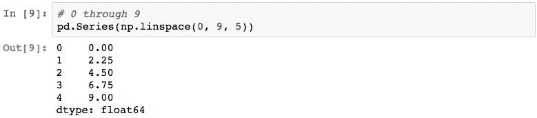

使用`np.random.normal()`生成一组随机数也是很常见的。 以下从正态分布生成五个随机数：

# 使用标量值创建

也可以使用标量值创建`Series`：

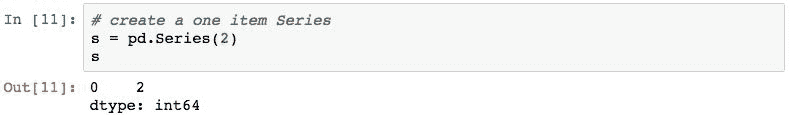

`Series`仅具有单个值，这似乎是简并的情况。 但是，在某些情况下，这很重要，例如，将序列乘以标量值时，如下所示：

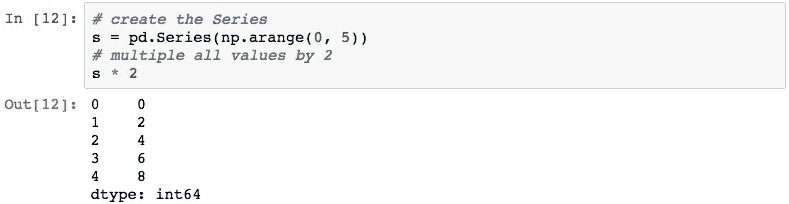

在封面下，Pandas 取值`2`并从该标量值创建一个`Series`，其索引与`s`中的索引匹配，然后通过对齐两个`Series`进行乘法。 在本章的后面，我们将再次更详细地查看此示例。

# `.index`和`.values`属性

每个`Series`对象均由一系列值和一个索引组成。 可以通过`.values`属性访问这些值：

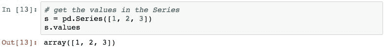

结果是一个 NumPy 数组对象，如下所示：

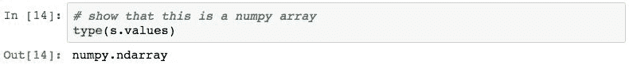

出于信息目的将其称为。 我们不会在本书中研究 NumPy 数组。 从历史上看，Pandas 的确在幕后使用 NumPy 数组，因此 NumPy 数组在过去更为重要，但这种依赖在最近的版本中已被删除。 但为方便起见，即使基础表示形式不是 NumPy 数组，`.values`也会返回 NumPy 数组。

另外，可以使用`.index`检索该系列的索引：

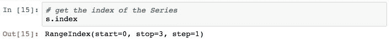

Pandas 创建的索引类型为`RangeIndex`。 当不存在这种类型的索引时，这是与本书先前版本相比的 Pandas 更改。 `RangeIndex`对象代表具有指定`step`的从`start`到`stop`值的值范围。 与以前使用的`Int64Index`相比，这对 Pandas 是有效的。

`RangeIndex`只是我们将要探索的一种索引类型（第 6 章“索引数据”中的大部分细节）。

# 序列的大小和形状

`Series`对象中的项目数可以通过多种技术来确定，其中第一种是使用 Python `len()`函数：

通过使用`.size`属性可以获得相同的结果：

获取`Series`大小的另一种形式是使用`.shape`属性。 这将返回一个二值元组，但仅指定第一个值并表示大小：

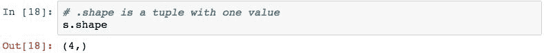

# 在创建时指定索引

可以使用构造函数的`index`参数在创建`Series`时指定索引中的标签。 下面创建一个`Series`并将字符串分配给索引的每个标签：

检查`.index`属性，我们发现创建了以下索引：

使用这个索引，我们可以问一个类似`who is the Dad?`的问题：

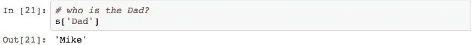

# `.head()`，`.tail()`和`.take()`

Pandas 提供了`.head()`和`.tail()`方法来检查`Series`中前（头）或后（尾）行。 默认情况下，它们返回前五行或后五行，但是可以使用`n`参数进行更改。

让我们检查以下`Series`的用法：

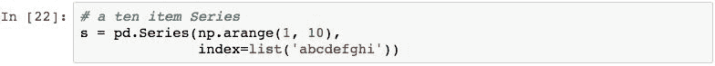

以下内容检索前五行：

可以使用`n`参数（或仅通过指定数字）来更改项目数：

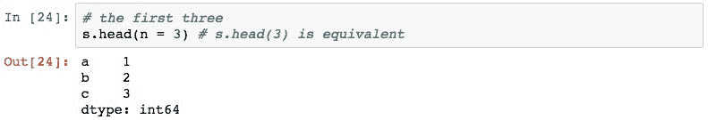

`.tail()`返回最后五行：

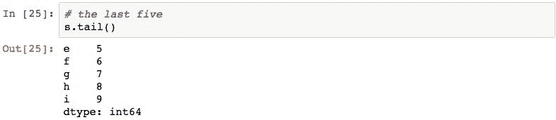

指定`5`以外的数字时，其工作原理类似：

`.take()`方法返回一系列在指定整数位置的行：

# 通过标签或位置检索序列中的值

`Series`中的值可以通过两种常规方法检索：通过索引标签或从 0 开始的位置。 Pandas 为您提供了多种方法来执行这两种查找。 让我们研究一些常见的技术。

# 使用`[]`运算符和`.ix[]`属性按标签查找

使用`[]`运算符执行隐式标签查找。 该运算符通常根据给定的索引标签查找值。

让我们从使用以下`Series`开始：

仅使用所需项目的索引标签即可查找单个值：

使用索引标签列表可以一次检索多个项目：

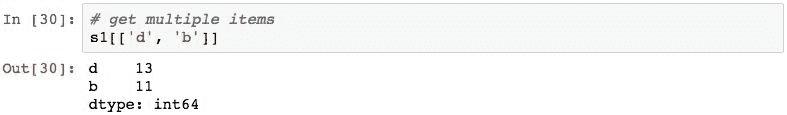

我们还可以使用代表位置的整数来查找值：

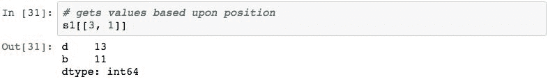

这纯粹是因为索引未使用整数标签。 如果将整数传递给`[]`，并且索引具有整数值，则通过将传入的值与整数标签的值进行匹配来执行查找。

这可以使用以下`Series`进行演示：

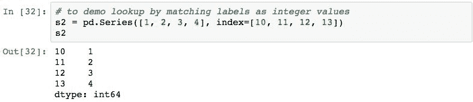

以下内容在标签`13`和`10`而非位置`13`和`10`处查找值：

使用`[]`运算符进行的查找与使用`.ix[]`属性相同。 但是，自 Pandas 0.20.1 版以来，`.ix[]`已被弃用。 弃用的原因是由于整数传递给运算符而造成的混乱，以及取决于索引中标签类型的运算差异。

其后果是`[]`或`.ix[]`均不可用于查找。 而是使用`.loc[]`和`.iloc[]`属性，它们仅按标签或位置明确查找。

# 使用`.iloc[]`按位置显式查找

可以使用`.iloc[]`来按位置查找值。 下面演示使用整数作为参数：

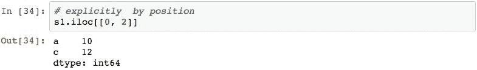

即使索引具有整数标签，也会按位置查找以下内容：

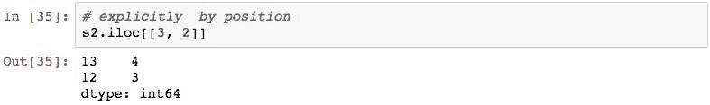

请注意，如果您指定一个不存在的位置（小于零或大于项目数-一个），则将引发异常。

# 通过`.loc[]`通过标签进行显式查找

也可以通过使用`.loc[]`属性来实现按标签查找：

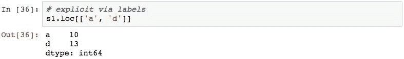

使用整数标签没有问题：

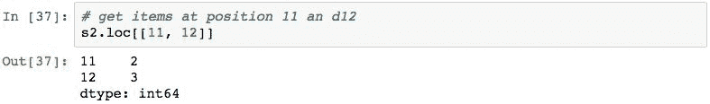

请注意，当传递不在索引中的索引标签时，`.loc[]`与`.iloc[]`具有不同的行为。 在这种情况下，Pandas 将返回`NaN`值，而不是引发异常：

什么是 NaN？ 我们将在本章的后面部分更详细地介绍这一点，但是 pandas 使用它来表示无法通过索引查找找到的丢失数据或数字。 它还对各种统计方法产生了影响，我们还将在本章后面进行研究。

# 将序列切成子集

Pandas `Series`支持称为**切片**的功能。 切片是从 Pandas 对象中检索数据子集的强大方法。 通过切片，我们可以根据位置或索引标签选择数据，并更好地控制产生的项目（正向或反向）和间隔（每一项，彼此）的顺序。

切片会使普通数组`[]`运算符（以及`.loc[]`，`.iloc[]`和`.ix[]`）过载，以接受**切片对象**。 切片对象是使用`start:end:step`语法创建的，表示第一项，最后一项的组件以及要作为`step`的各项之间的增量。

切片的每个组件都是可选的，并且通过省略切片说明符的组件，提供了一种方便的方法来选择整个行。

要开始演示切片，我们将使用以下`Series`：

我们可以使用`start:end`作为切片选择连续的项目。 以下选择`Series`中位置`1`至`5`的五个项目。 由于我们未指定`step`组件，因此默认为`1`。 另请注意，结果中不包含`end`标签：

此结果大致等于以下内容：

大致等效，因为对`.iloc[]`的使用返回源中数据的副本。 切片是对源中数据的引用。 修改所得切片的内容将影响源`Series`。 我们将在后面的部分中就位修改`Series`数据，以进一步研究此过程。

通过指定`2`步骤，切片可以返回所有其他项：

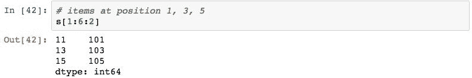

如前所述，切片的每个组件都是可选的。 如果省略`start`组件，则结果将从第一项开始。 例如，以下是`.head()`的简写：

通过指定`start`组件并省略`end`，可以选择特定位置及其后的所有项目。 以下选择从`4th`开始的所有项目：

`step`也可以在之前的两种情况下使用，以跳过项目：

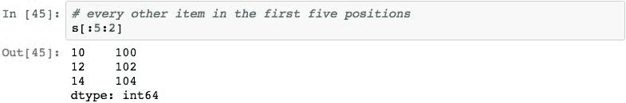

使用`step`负值将反转结果。 以下演示了如何反转`Series`：

值`-2`将从开始位置返回所有其他项目，并以相反的顺序向`Series`的开始工作。 下面的示例返回所有其他项目，包括位置`4`处的行：

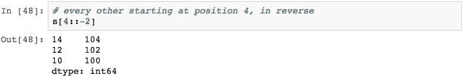

切片的`start`和`end`的负值具有特殊含义。 `-n`的`start`负值表示最后`n`行：

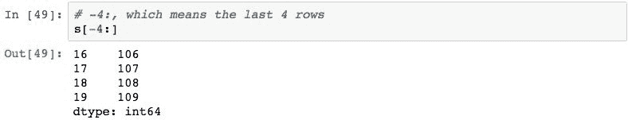

`-n`的`end`负值将返回除最后`n`行之外的所有行：

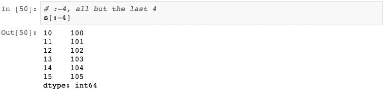

负`start`和`end`分量可以组合使用。 以下内容首先检索最后四行，然后从中检索除最后一行（即前三行）之外的所有行：

也可以对具有非整数索引的序列进行切片。 为了演示，让我们使用以下`Series`：

使用此`Series`，对整数值进行切片将根据位置提取项目（如前所述）：

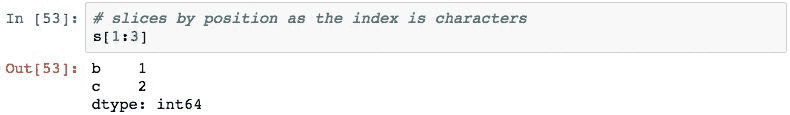

但是，当使用非整数值作为切片的组件时，Pandas 将尝试理解数据类型并从系列中选择适当的项目。 例如，从`'b'`到`'d'`的以下片段：

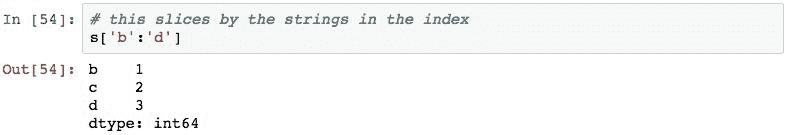

# 通过索引标签对齐

通过索引标签对`Series`数据进行对齐是 Pandas 的基本概念，也是其最强大的概念之一。 对齐基于索引标签提供多个序列对象中相关值的自动关联。 使用标准的过程技术，可以在多个集合中节省很多容易出错的工作量匹配数据。

为了演示对齐，让我们举一个在两个`Series`对象中添加值的示例。 让我们从以下两个`Series`对象开始，它们代表一组变量（`a`和`b`）的两个不同样本：

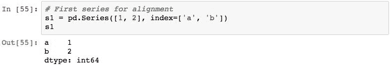

现在假设我们想对每个变量的值求和。 我们可以简单地表示为`s1 + s2`：

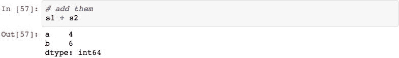

Pandas 已经对每个系列中每个变量的测量值进行了匹配，将这些值相加，然后在一个简洁的语句中将每个变量的总和返回给我们。

也可以将标量值应用于`Series`。 结果将是使用指定的操作将标量应用于`Series`中的每个值：

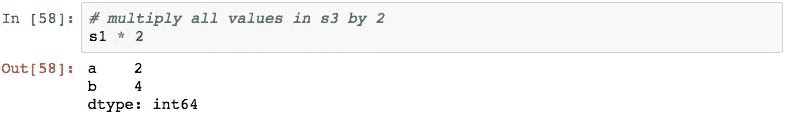

还记得前面提到的，我们将返回创建具有标量值的`Series`吗？ 在执行此类操作时，Pandas 实际上会执行以下操作：

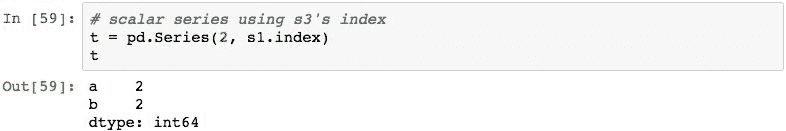

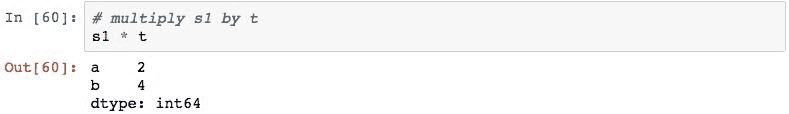

第一步是从标量值创建一个`Series`，但带有目标`Series`的索引。 然后将乘法应用于两个`Series`对象的对齐值，由于索引相同，它们完美对齐。

索引中的标签不需要对齐。 如果未对齐，则 Pandas 将返回`NaN`作为结果：

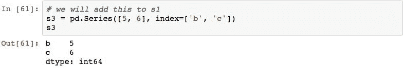

默认情况下，`NaN`值是任何 Pandas 对齐的结果，其中索引标签与另一个`Series`不对齐。 与 NumPy 相比，这是 Pandas 的重要特征。 如果标签未对齐，则不应引发异常。 当某些数据丢失但可以接受时，这会有所帮助。 处理仍在继续，但是 Pandas 通过返回`NaN`可以让您知道存在问题（但不一定是问题）。

Pandas 索引中的标签不必唯一。 对齐操作实际上在两个`Series`中形成标签的笛卡尔积。 如果`1`系列中有`n`个标签，而`2`系列中有`m`个标签，则结果总计为`n * m`结果中的行。

为了演示这一点，让我们使用以下两个`Series`对象：

这将产生 6 个`'a'`索引标签，以及`'b'`和`'c'`的`NaN`：

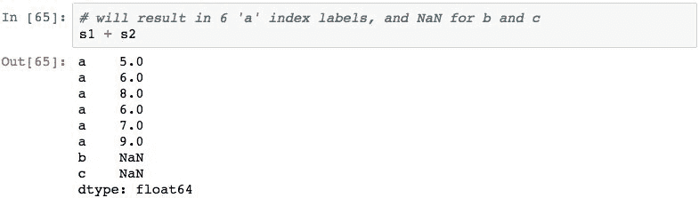

# 执行布尔选择

索引为我们提供了一种基于其标签在`Series`中查找值的非常有效的手段。 但是，如果您想基于这些值在`Series`中查找条目，该怎么办？

为了处理这种情况，Pandas 为我们提供了布尔选择。 布尔选择将逻辑表达式应用于`Series`的值，并在每个值上返回一系列新的布尔值，这些布尔值表示该表达式的结果。 然后，该结果可用于仅提取结果为`True`的值。

为了演示布尔选择，让我们从下面的`Series`开始并应用大于大于运算符来确定大于或等于`3`的值：

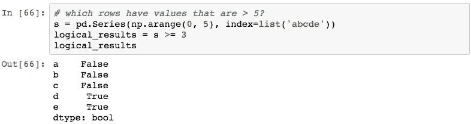

这将导致`Series`具有匹配的索引标签，并且表达式的结果将应用于每个标签的值。 值的`dtype`为`bool`。

然后可以使用该系列从原始系列中选择值。 通过将布尔结果传递到源的`[]`运算符来执行此选择。

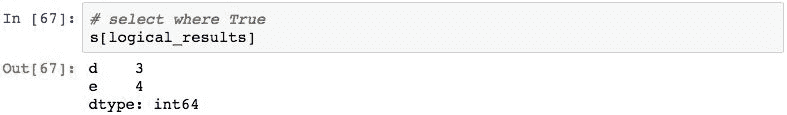

可以通过在`[]`运算符中执行逻辑运算来简化语法：

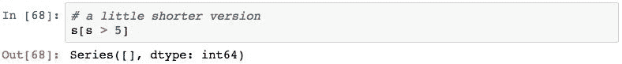

不幸的是，普通的 Python 语法不能使用多个逻辑运算符。 例如，以下导致引发异常：

导致上述代码无法正常工作的原因有技术原因。 解决方案是用不同的方式表达方程式，在每个逻辑条件前后加上括号，并为和/或（`|`和`&`）使用不同的运算符：

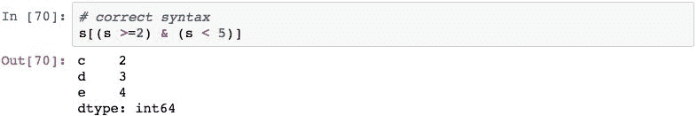

使用`.all()`方法可以确定`Series`中的所有值是否与给定表达式匹配。 下面的内容询问该系列中的所有元素是否都大于或等于`0`：

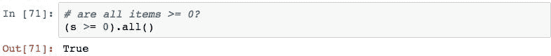

如果任何值满足表达式，则`.any()`方法将返回`True`。 下面的内容询问是否有任何元素小于`2`：

您可以对结果选择使用`.sum()`方法来确定有多少项目满足表达式。 这是因为当给定一系列布尔值时，该系列的`.sum()`方法会将`True`视为`1`和`False`视为`0`：

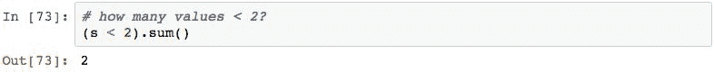

# 重新索引序列

在 Pandas 中重新索引是使`Series`中的数据符合一组标签的过程。 Pandas 使用它来执行大部分对齐过程，因此是一项基本操作。

重新索引实现了以下几项功能：

*   重新排序现有数据以匹配一组标签
*   在没有标签数据的地方插入`NaN`标记
*   可能使用某种类型的逻辑填充标签的缺失数据（默认为添加`NaN`值）

重新索引可以很简单，只需为`Series`的`.index`属性分配一个新索引即可。 下面演示了以这种方式更改`Series`的索引：

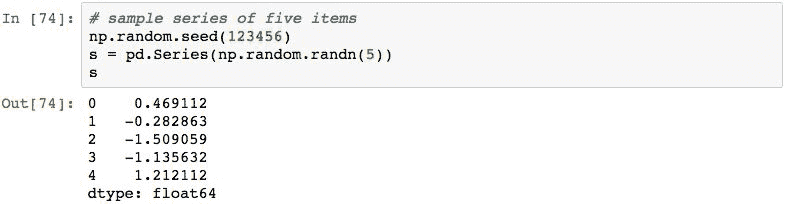 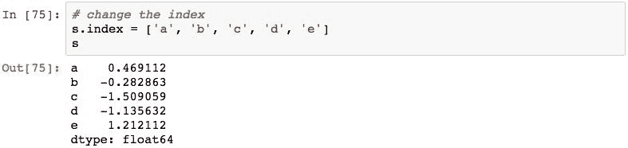

分配给`.index`属性的列表中的元素数必须与行数匹配，否则将引发异常。 重新索引还就地修改了`Series`。

通过使用`.reindex()`方法，可以灵活地创建新索引。 一种情况是分配一个新索引，其中标签数与值数不匹配：

以下代码使用一组具有新值，丢失值和重叠值的标签为`Series`重新编制索引：

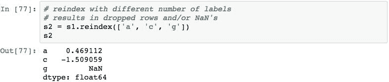

关于`.reindex()`，有几点需要指出。 首先是`.reindex()`方法的结果是新的`Series`，而不是就地修改。 新的`Series`具有带有标签的索引，如传递给函数时所指定。 将为原始`Series`中存在的每个标签复制数据。 如果在原始`Series`中找不到标签，则将`NaN`分配为该值。 最后，将删除`Series`中带有不在新索引中的标签的行。

当您要对齐两个`Series`以对两个`Series`中的值执行操作但`Series`对象没有由于某种原因对齐的标签时，重新索引也很有用。 一种常见的情况是，一个`Series`具有整数类型的标签，另一个是字符串，但是值的基本含义是相同的（从远程源获取数据时，这很常见）。 以以下`Series`对象为例：

尽管两个`Series`中标签的含义相同，但是由于它们的数据类型不同，它们将对齐。 一旦发现问题，即可轻松解决：

`.reindex()`方法具有默认操作，即在源`Series`中找不到标签时，将`NaN`作为缺少的值插入。 可以使用`fill_value`参数更改此值。 下面的示例演示使用`0`代替`NaN`：

当对有序数据（例如时间序列）执行重新索引时，可以执行插值或值填充。 在第 10 章“时间序列数据”中，将对插值和填充进行更详细的讨论，但是以下示例介绍了这一概念。 让我们从以下`Series`开始：

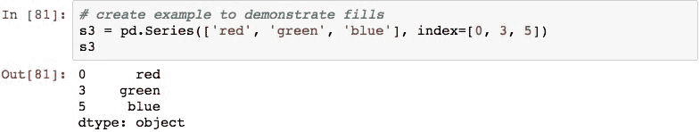

以下示例演示了前向填充的概念，通常称为**最近已知值**。 重新索引`Series`以创建连续的整数索引，并通过使用`method='ffill'`参数，为任何新的索引标签分配先前已知的**非 NaN** 值：

索引标签`1`和`2`与标签`0`的红色，`4`和`5`从标签`3`的`green`以及红色`6`到`5`的`blue`匹配。

以下示例使用`method='bfill'`向后填充：

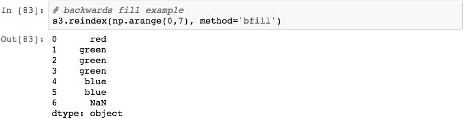

标签`6`没有先前的值，因此将其设置为`NaN`； `4`设置为`5`（`blue`）的值； `2`和`1`设置为标签`3`（`green`）的值。

# 原地修改序列

`Series`的就地修改是一个有争议的话题。 如果可能，最好执行返回带有新`Series`中表示的修改的新`Series`的操作。 但是，如果需要，可以更改值并就地添加/删除行。

通过为尚不存在的`index`标签分配值，可以在系列中添加一行。 以下代码创建一个`Series`对象，并向该系列添加一个附加项：

可以通过分配在特定索引标签上的值来更改它：

可以通过将`index`标签传递给`del()`函数从`Series`中删除行。 下面演示了如何删除带有索引标签`'a'`的行：

要添加和删除不适当的项目，请使用`pd.concat()`使用布尔选择来添加和删除。

使用切片时要牢记的重要一点是，切片的结果是原始`Series`的视图。 通过切片操作结果修改值将修改原始的`Series`。

考虑以下示例，该示例选择`Series`中的前两个元素并将其存储在新变量中：

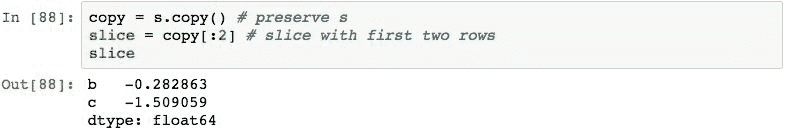

将值分配给切片元素的以下操作将更改原始`Series`中的值：

# 总结

在本章中，您学习了 Pandas `Series`对象以及如何将其用于表示变量测量值的索引表示。 我们从如何创建和初始化`Series`及其关联索引开始，然后研究了如何在一个或多个`Series`对象中操纵数据。 我们研究了如何通过索引标签对齐`Series`对象以及如何在对齐的值上应用数学运算。 然后，我们检查了如何按索引查找数据，以及如何根据数据（布尔表达式）执行查询。 然后，我们结束了对如何使用重新索引来更改索引和对齐数据的研究。

在下一章中，您将学习如何使用`DataFrame`以统一的表格结构表示多个`Series`数据。