# 用 DataFrame 表示表格和多元数据

Pandas`DataFrame`对象将`Series`对象的功能扩展为二维。 代替单个值系列，数据帧的每一行可以具有多个值，每个值都表示为一列。 然后，数据框的每一行都可以对观察对象的多个相关属性进行建模，并且每一列都可以表示不同类型的数据。

数据框的每一列都是 Pandas`Series`，并且数据框可以视为一种数据形式，例如电子表格或数据库表。 但是这些比较并不符合`DataFrame`的要求，因为数据框具有 Pandas 特有的非常不同的质量，例如代表列的`Series`对象的自动数据对齐。

这种自动对齐方式使数据框比电子表格或数据库更有能力进行探索性数据分析。 结合在行和列上同时切片数据的功能，这种与数据框中的数据进行交互和浏览的功能对于查找所需信息非常有效。

在本章中，我们将深入研究 Pandas`DataFrame`。 `Series`会熟悉许多概念，但是会添加一些数据和工具来支持其操作。 具体而言，在本章中，我们将涵盖以下主题：

*   根据 Python 对象，NumPy 函数，Python 词典，Pandas`Series`对象和 CSV 文件创建`DataFrame`
*   确定数据框尺寸的大小
*   指定和操作数据框中的列名
*   创建数据框期间的行对齐
*   选择数据框的特定列和行
*   将切片应用于数据框
*   通过位置和标签选择数据框的行和列
*   标量值查找
*   应用于数据框的布尔选择

# 配置 Pandas

我们使用以下导入和配置语句开始本章中的示例：

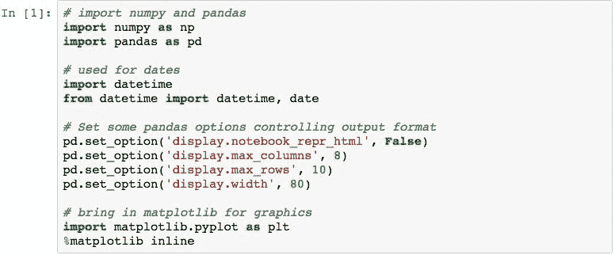

# 创建 DataFrame 对象

有多种创建数据框的方法。 可以从一个或一组多维数据集创建一个数据框。 我们将研究的技术如下：

*   使用 NumPy 函数的结果
*   使用来自包含列表或 Pandas`Series`对象的 Python 词典中的数据
*   使用 CSV 文件中的数据

在检查所有这些内容时，我们还将检查如何指定列名，演示初始化期间如何执行对齐以及查看如何确定数据框的尺寸。

# 使用 NumPy 函数结果创建一个 DataFrame

数据帧可以由一维 NumPy 整数数组（范围从 1 到 5）创建：

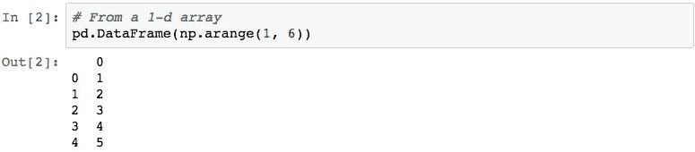

输出的第一列显示已创建索引的标签。 由于在创建时未指定索引，因此 Pandas 创建了一个基于`RangeIndex`的标签，标签的开头为 0。

数据在第二列中，由值`1`至`5`组成。 数据列上方的`0`是该列的名称。 在创建数据框时未指定列名称时，pandas 使用从 0 开始的增量整数来命名列。

也可以使用多维 NumPy 数组，并创建多个列：

可以使用`.columns`属性访问`DataFrame`的列：

这表明，当未指定列名时，Pandas 将创建一个`RangeIndex`来表示列。

可以使用`columns`参数指定列名。 下面创建了一个两列`DataFrame`，代表两个城市的两个温度样本：

可以使用`len()`函数找到`DataFrame`中的行数：

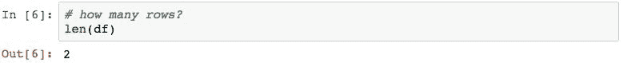

可以使用`.shape`属性找到`DataFrame`的尺寸：

# 使用 Python 字典和 pandas Series 对象创建 DataFrame

Python 字典可用于初始化`DataFrame`。 使用 Python 字典时，pandas 将把键用作列名，并将每个键的值用作列中的数据：

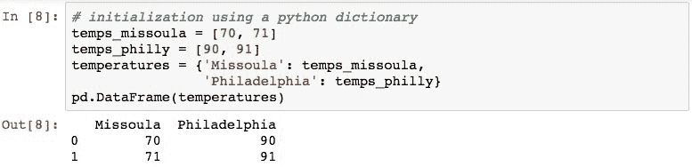

创建`DataFrame`的常用技术是使用将用作行的 Pandas`Series`对象的列表：

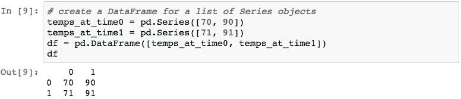

在这种情况下，每个`Series`代表每个城市在特定测量间隔处的单个测量。

要命名列，我们可以尝试使用`columns`参数：

此结果与我们可能期望的结果不同，因为这些值已用`NaN`填充。 这可以通过两种方式纠正。 第一种是将列名称分配给`.columns`属性：

另一种技术是使用 Python 词典，其中键是列名，每个键的值是`Series`，代表该特定列中的度量：

请注意，在构建`DataFrame`时，将对齐提供的`Series`。 下面通过添加索引值不同的第三个城市来说明这一点：

# 从 CSV 文件创建 DataFrame

可以通过使用`pd.read_csv()`功能从 CSV 文件读取数据来创建数据帧。

`pd.read_csv()`将在第 9 章“访问数据”中进行更广泛的研究。

为了演示该过程，我们将从一个包含 S&P 500 快照的文件中加载数据。该文件名为`sp500.csv`，位于代码包的`data`目录中。

文件的第一行包含每个变量/列的名称，其余 500 行代表 500 种不同股票的值。

以下代码加载数据，同时指定文件中的哪一列用于索引，并且我们只需要四个特定的列（0、2、3 和 7）：

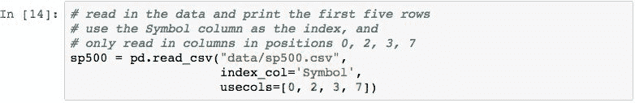

使用`.head()`检查前五行，向我们显示以下结构和所得数据帧的内容：

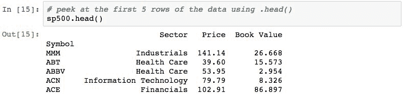

让我们检查一下该数据框的一些属性。 它应该具有 500 行数据。 可以通过检查数据帧的长度来检查：

我们希望它具有 500 行和三列的形状：

可以使用`.size`属性找到数据帧的大小。 此属性返回数据帧中数据值的数量。 我们预计 500 * 3 = 1,500：

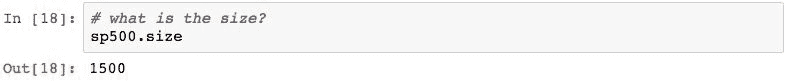

数据框的索引由 500 种股票的符号组成：

这些列由以下三个名称组成：

请注意，尽管我们在加载时指定了四列，但结果仅包含三列，因为源文件中四列之一用于索引。

# 访问数据框内的数据

数据框由行和列组成，并具有从特定行和列中选择数据的结构。 这些选择使用与`Series`相同的运算符，包括`[]`，`.loc[]`和`.iloc[]`。

由于存在多个维度，因此应用这些维度的过程略有不同。 我们将通过首先学习选择列，然后选择行，在单个语句中选择行和列的组合以及使用布尔选择来检查这些内容。

此外，pandas 提供了一种构造，用于在我们将要研究的特定行和列上选择单个标量值。 该技术很重要，并且存在，因为它是访问这些值的一种非常高性能的方法。

# 选择数据框的列

使用`[]`运算符选择`DataFrame`特定列中的数据。 这与`Series`不同，在`Series`中，`[]`指定了行。 可以将`[]`操作符传递给单个对象或代表要检索的列的对象列表。

以下内容检索名称为`'Sector'`的列：

当从`DataFrame`中检索单个列时，结果为`Series`：

通过指定列名列表可以检索多个列：

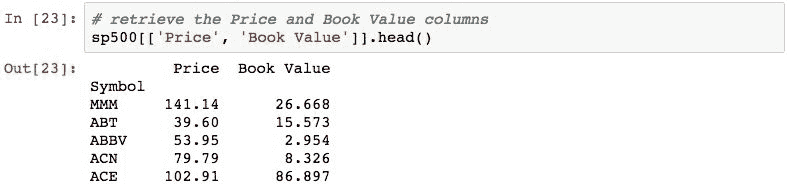

由于它具有多个列，因此结果是`DataFrame`而不是`Series`：

列也可以通过属性访问来检索。 只要名称不包含空格，`DataFrame`将添加代表每列名称的属性。 下面以这种方式检索`Price`列：

请注意，此名称不适用于`Book Value`列，因为名称带有空格。

# 选择数据框的行

可以使用`.loc[]`通过索引标签值检索行：

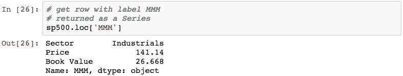

此外，可以使用标签列表检索多行：

可以使用`.iloc[]`按位置检索行：

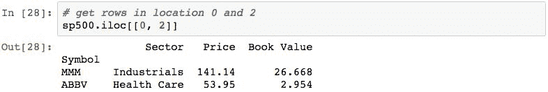

可以在特定标签值的索引中查找位置，然后使用该值按位置检索行：

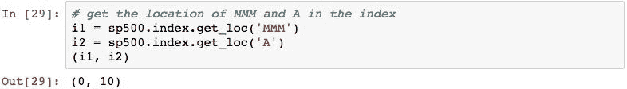

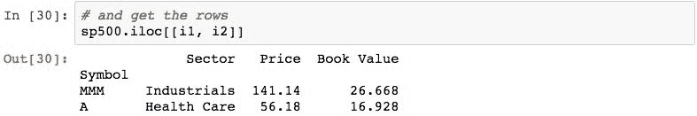

作为本节的最后注解，也可以使用`.ix[]`进行这些操作。 但是，此方法已被弃用。 有关更多详细信息，请参见 [http://pandas.pydata.org/pandas-docs/stable/indexing.html#different-choices-for-indexing](http://pandas.pydata.org/pandas-docs/stable/indexing.html#different-choices-for-indexing) 。

# 使用.at []和.iat []按标签或位置进行标量查找

可以使用`.at[]`通过标签查找各个标量值，并同时向其传递行标签和列名称：

也可以使用`.iat[]`按位置查找标量值，同时传递行位置和列位置。 这是访问单个值的首选方法，并且可以提供最高的性能：

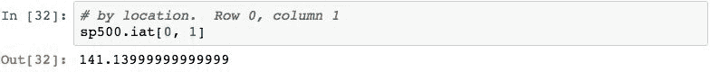

# 使用[]运算符进行切片

在其索引上切片`DataFrame`在语法上与使用`Series`执行相同操作相同。 因此，我们将在本节中不介绍切片的各种排列的细节，而仅查看应用于`DataFrame`的几个代表性示例。

使用`[]`运算符进行切片时，将在索引而非列上执行切片。 以下内容检索前五行：

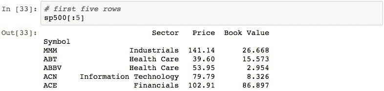

并且以下返回从`ABT`标签到`ACN`标签开始的行：

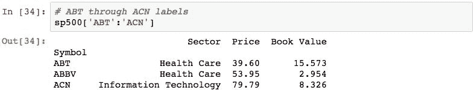

切片`DataFrame`也适用于`.iloc[]`和`.loc[]`属性。 使用这些属性被认为是最佳实践。

# 使用布尔选择来选择行

可以使用布尔选择来选择行。 当应用于数据框时，布尔选择可以利用多列中的数据。 考虑以下查询，该查询标识价格低于`100`的所有股票：

然后可以使用`[]`运算符将此结果应用于`DataFrame`，以仅返回结果为`True`的行：

可以使用括号将多个条件放在一起。 以下内容检索价格在`6`和`10`之间的所有股票的代码和价格：

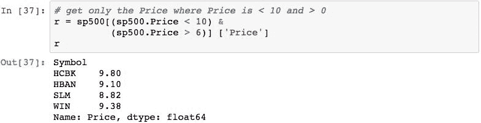

通常使用多个变量执行选择。 下面通过查找`Sector`为`Health Care`且`Price`大于或等于`100.00`的所有行来证明这一点：

# 在行和列中进行选择

通常的做法是选择由一组行和列组成的数据子集。 下面通过首先选择一部分行然后选择所需的列来说明这一点：

# 摘要

在本章中，您学习了如何创建 Pandas`DataFrame`对象以及基于各种列中的索引和值选择数据的各种方法。 这些示例与`Series`的示例相似，但是证明，由于`DataFrame`具有列和关联的列索引，因此语法与`Series`有所不同。

在下一章中，我们将进一步使用`DataFrame`深入研究数据操作，并着重于对`DataFrame`结构和内容进行修改。