# 五、数据帧的结构操作

Pandas 提供了一个强大的操纵引擎，供您用来浏览数据。 这种探索通常涉及对`DataFrame`对象的结构进行修改，以删除不必要的数据，更改现有数据的格式或从其他行或列中的数据创建派生数据。 这些章节将演示如何执行这些强大而重要的操作。

具体而言，在本章中，我们将介绍：

*   重命名列
*   使用`[]`和`.insert()`添加新列
*   通过放大添加列
*   使用连接添加列
*   重新排序栏
*   替换列的内容
*   删除列
*   添加新行
*   连接行
*   通过扩大添加和替换行
*   使用`.drop()`删除行
*   使用布尔选择删除行
*   使用切片删除行

# 配置 Pandas

以下代码将为以下示例配置 Pandas 环境。 这还将加载 S&P 500 数据集，以便可以在示例中使用它：

# 重命名列

可以使用适当命名的`.rename()`方法重命名列。 可以向此方法传递一个字典对象，其中的键表示要重命名的列的标签，并且每个键的值是新名称。

下面的操作会将`'Book Value'`列的名称更改为`'BookValue'`，删除空格并允许使用属性符号访问该列的数据。

以这种方式使用`.rename()`将返回一个新的数据帧，其中的列已重命名，并且数据是从原始数据中复制的。 以下内容验证了原始文件没有被修改。

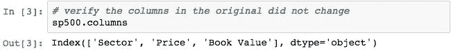

要在不进行复制的情况下就地修改数据帧，可以使用`inplace=True`参数。

现在可以使用`.BookValue`属性访问数据。

# 使用`[]`和`.insert()`添加新列

可以使用`[]`运算符将新列添加到数据帧。 让我们添加一个名为`RoundedPrice`的新列，该列将表示`Price`列中值的舍入。

Pandas 执行此操作的方式是，首先从`sp500`中选择`Price`列的数据，然后将`Series`中的所有值四舍五入。 然后，pandas 将新的`Series`与副本`DataFrame`对齐，并将其添加为名为`RoundedPrice`的新列。 新列将添加到列索引的末尾。

`.insert()`方法可用于在特定位置添加新列。 下面在`Sector`和`Price`之间插入`RoundedPrice`列：

# 通过扩展来添加列

可以使用`.loc[]`属性和切片添加列。 下面通过向名为`PER`的`sp500`的子集添加新列，并将所有值初始化为`0`来演示这一点。

具有现有数据的`Series`也可以通过这种方式添加。 下面将`PER`列与一系列随机数据相加。 由于这使用对齐方式，因此有必要使用与目标数据帧相同的索引。

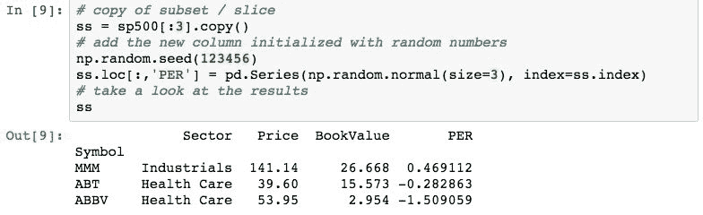

# 使用连接来添加列

`[]`运算符和`.insert()`方法都就地修改目标数据帧。 如果需要一个带有附加列的新数据帧（保持原来的不变），则可以使用`pd.concat()`函数。 此函数创建一个新的数据帧，其中所有指定的`DataFrame`对象均按规范顺序连接在一起。

下面的代码创建了一个新的`DataFrame`，其中的一列包含了四舍五入的价格。 然后，它使用`pd.concat()`和`axis=1`来表示给定的`DataFrame`对象应沿着列轴连接（与使用`axis=0`的行相比）。

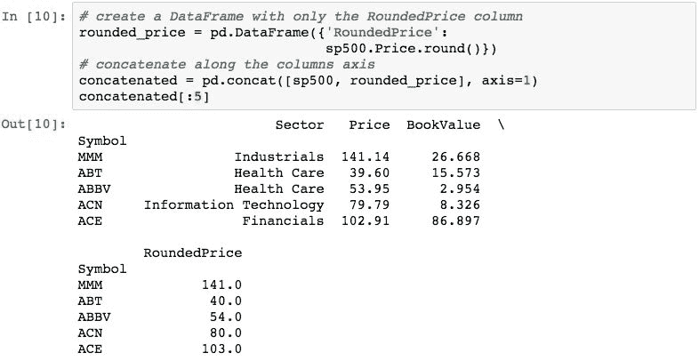

在第 11 章（合并，关联和重塑数据）中将更详细地介绍连接。

连接可能会导致重复的列名。 为了演示这种情况，让我们重新创建`rounded_price`，但将其命名为`Price`列。

现在，连接将导致重复的列。

有趣的是，您可以使用`.Price`属性检索这两列。

如果要在场景中获取特定的`Price`列，则需要按位置而不是名称进行检索。

# 对列重新排序

通过按所需顺序选择列，可以重新排列列的顺序。 下面通过反转列进行演示。

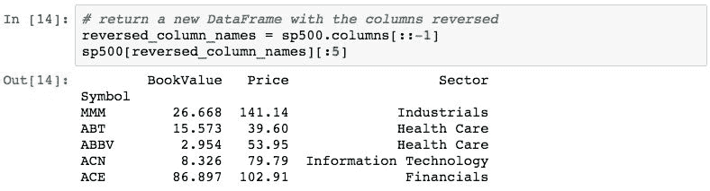

实际上，没有一种方法可以就地更改列的顺序。 参见[这里](http://stackoverflow.com/questions/25878198/change-pandas-dataframe-column-order-in-place)。

# 替换列的内容

通过使用`[]`运算符将新的`Series`分配给现有列，可以替换`DataFrame`的内容。 以下演示了用`rounded_price`中的`Price`列替换`Price`列。

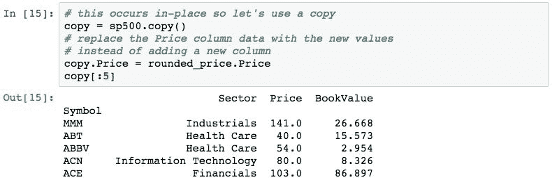

列的数据也可以使用切片替换（就地）。

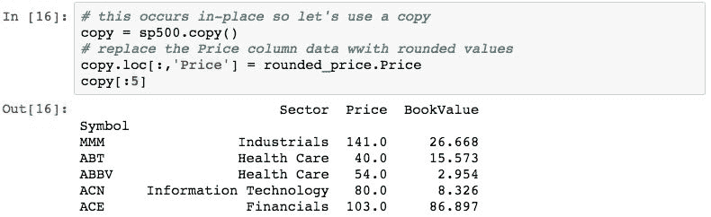

# 删除列

可以使用数据帧的`del`关键字或`.pop()`或`.drop()`方法从`DataFrame`中删除列。 这些行为的差异略有不同：

*   `del`将从`DataFrame`中删除`Series`（就地）
*   `pop()`将同时删除`Series`并返回`Series`（也就位）
*   `drop(labels, axis=1)`将返回一个已删除列的新数据帧（原始`DataFrame`对象未修改）

下面演示了如何使用`del`从`sp500`数据的副本中删除`BookValue`列：

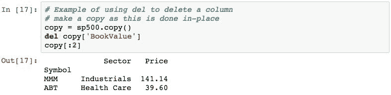

以下使用`.pop()`方法删除`Sector`列：

`.pop()`方法的优势在于它为我们提供了弹出的列。

`.drop()`方法可用于删除行和列。 要使用它删除列，请指定`axis=1`：

# 追加新行

使用`DataFrame`的`.append()`方法执行行的追加。 附加过程将返回一个新的`DataFrame`，并首先添加来自原始`DataFrame`的数据，然后再添加第二行的数据。 追加不会执行对齐，并且可能导致索引标签重复。

以下代码演示了附加两个从`sp500`数据中提取的`DataFrame`对象。 第一个`DataFrame`由行（按位置）`0`，`1`和`2`组成，第二个`DataFrame`由行（按位置）`10`，`11`和`2`组成。 两者中都包含位置`2`处的行（带有标签`ABBV`），以演示重复索引标签的创建。

追加中使用的`DataFrame`对象的列集不必相同。 结果数据帧将由两个列的并集组成，缺少的列数据填充有`NaN`。 以下内容通过使用与`df1`相同的索引创建第三个数据帧，但只有一个列的名称不在`df1`中来说明这一点。

现在，我们附加`df3`和`df1`。

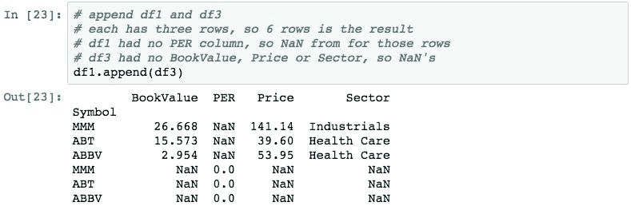

`ignore_index=True`参数可用于附加，而无需强制从`DataFrame`保留索引。 当索引值的意义不大并且您只希望将具有顺序递增的整数的级联数据用作索引时，这很有用：

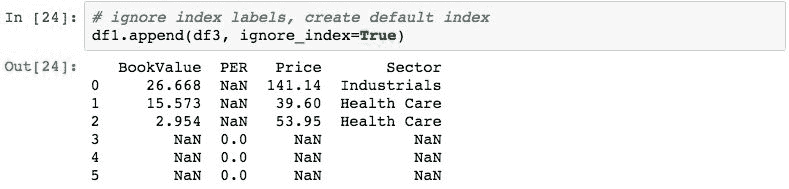

请注意，结果`DataFrame`具有默认的`RangeIndex`，并且索引（`Symbol)`）中的数据已从结果中完全排除。

# 连接行

可以使用`pd.concat()`函数并通过指定`axis=0`将来自多个`DataFrame`对象的行彼此连接。 沿行轴在两个`DataFrame`对象上进行`pd.concat()`的默认操作的方式与`.append()`方法相同。

通过重建前面的附加示例中的两个数据集并将其连接起来，可以证明这一点。

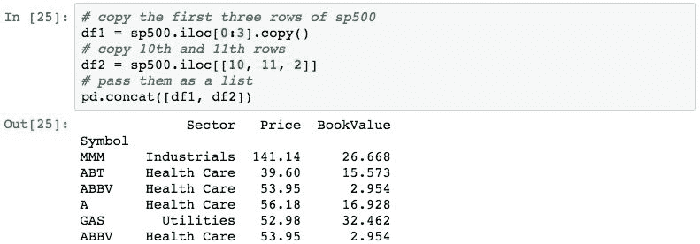

如果所有`DataFrame`对象中的列集都不相同，则 Pandas 将用`NaN`填充这些值。

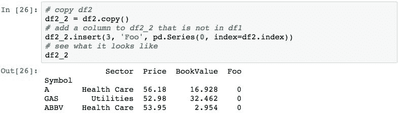

从源对象中逐行复制行会导致重复的索引标签。 `keys`参数可用于帮助区分一组行源自哪个数据帧。 下面通过使用`keys`向表示源对象的索引添加一个级别进行演示：

我们将在第 6 章“处理索引”中更详细地研究层次结构索引。

# 通过扩展来添加和替换行

也可以使用`.loc`属性将行添加到`DataFrame`。 `.loc`的参数指定要放置行的索引标签。 如果标签不存在，则使用给定的索引标签将值附加到数据帧。 如果标签确实存在，则将替换指定行中的值。

以下示例获取`sp500`的子集，并添加带有标签`FOO`的行：

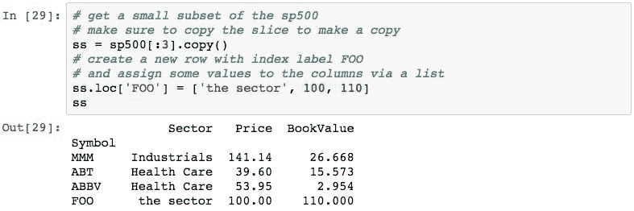

请注意，无论是添加还是替换行，都会进行此更改。

# 使用`.drop()`删除行

`DataFrame`的`.drop()`方法可用于删除行。 `.drop()`方法获取要删除的索引标签列表，并返回`DataFrame`的副本，其中删除了指定的行。

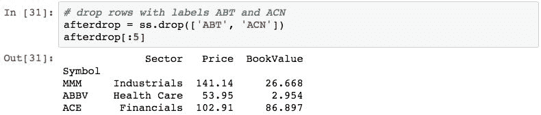

# 使用布尔选择删除行

布尔选择也可以用于从`DataFrame`中删除行。 布尔选择的结果将返回表达式为 True 的行的副本。 要删除行，只需构造一个表达式，为要删除的行返回`False`，然后将该表达式应用于数据帧。

下面的示例演示删除`Price`大于`300`的行。 首先，构造表达式。

根据此结果，我们现在知道有 10 行的价格大于 300。要获得删除了这些行的数据帧，请选择选择的补码。

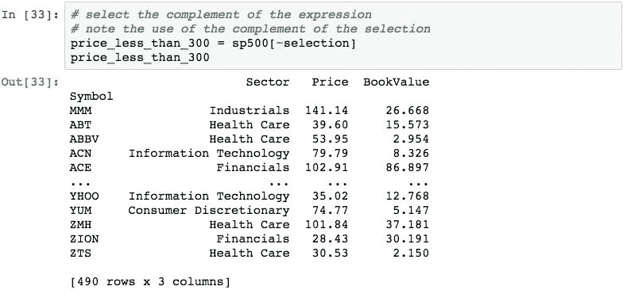

# 使用切片删除行

切片可用于从数据帧中删除记录。 这是一个与布尔选择类似的过程，在该过程中，我们选择了除要删除的行以外的所有行。

假设我们要从`sp500`中除去除前三个记录以外的所有记录。 执行此任务的片是`[:3]`，它返回前三行。

请记住，由于这是切片，因此结果是原始数据帧的视图。 这些行尚未从`sp500`数据中删除，对这三行的更改将更改`sp500`中的数据。 防止这种情况的正确措施是制作切片的副本，这会导致复制指定行的数据的新数据帧。

# 总结

在本章中，您学习了如何使用 Pandas `DataFrame`对象执行几种常见的数据操作，特别是通过添加或删除行和列来更改`DataFrame`结构的操作。 此外，我们看到了如何替换特定行和列中的数据。

在下一章中，我们将更详细地研究索引的使用，以便能够有效地从 pandas 对象内检索数据。