# 索引数据

索引是用于优化查询序列或 DataFrame 中的值的工具。 它们很像关系数据库中的键，但是功能更强大。 它们为多组数据提供了对齐方式，还带有如何处理数据的各种任务（如重采样到不同频率）的语义。

您将对熊猫执行的许多建模工作很大程度上取决于您如何设置索引。 正确实施的索引将优化性能，并成为推动分析的宝贵工具。

我们之前曾简要地使用过索引，在本章中，我们将进行更深入的探讨。 在这次深入学习中，我们将详细了解：

*   指标的重要性
*   大熊猫索引的类型，包括`RangeIndex`，`Int64Index`，`CategoricalIndex`，`Float64Index`，`Datetimeindex`和`PeriodIndex`
*   设置和重置索引
*   创建层次结构索引
*   使用分层索引选择数据

# 配置熊猫

我们从熊猫的标准配置开始，但是我们也加载了 S & P 500 数据，以供几个示例使用。

# 指标的重要性

熊猫索引允许有效地查找值。 如果不存在索引，则将需要对我们所有数据进行线性搜索。 索引使用直接查找而不是搜索过程为特定数据项创建优化的快捷方式。

为了开始检查索引的值，我们将使用以下`10000`随机数的`DataFrame`：

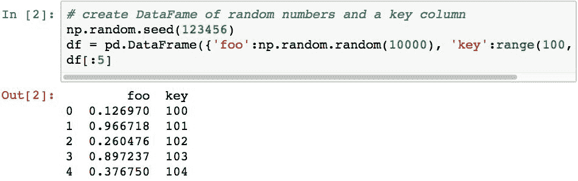

假设我们要查找`key==10099`处的随机数的值（我明确选择了此值，因为它是`DataFrame`中的最后一行）。 我们可以使用布尔选择来做到这一点。

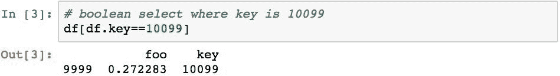

从概念上讲，这很简单。 但是，如果我们想重复执行此操作怎么办？ 可以使用`%timeit`语句在 Python 中进行模拟。 以下代码重复执行查找并报告性能。

该结果表明，有 3 次执行 *1,000* 次，并且这三个循环中最快的一次平均每个循环执行了 *0.00535* 秒（总计 *5.35* 秒 一组 *1,000* 循环）。

现在让我们尝试使用索引来帮助我们查找值。 以下代码设置此`DataFrame`的索引以匹配`keys`列的值。

现在可以使用`.loc[]`查找该值。

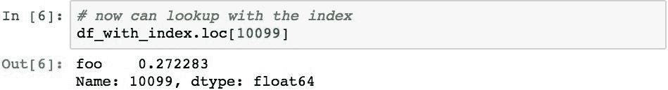

那只是一个查询。 让我们用`%timeit`计时。

使用索引的查找大约快五倍。 由于具有更高的性能，因此通常最好的方法是在可能的情况下按索引执行查找。 使用索引的不利之处在于构造索引可能会花费一些时间，并且还会消耗更多的内存。

很多时候，您会天生就知道索引应该是什么，您可以直接创建索引并开始探索。 其他时间，首先需要进行一些探索才能确定最佳指数。 通常，您可能没有足够的数据或适当的字段来创建适当的索引。 在这些情况下，您可能需要使用返回多个半歧义结果的部分索引，并且仍然对该集合执行布尔选择以获得所需的结果。

在执行探索性数据分析以首先加载数据并使用查询/布尔选择进行探索时，这是最佳实践。 如果您的数据自然支持一个索引，或者您确实需要提高速度，则创建索引。

# 大熊猫索引类型

大熊猫提供许多内置索引。 每种索引类型都根据特定的数据类型或数据模式设计用于优化查找。 让我们看看其中几种常用的。

# 基本类型-索引

这种类型的索引是最通用的，表示一组有序和可切片的值。 它包含的值必须是可哈希的 Python 对象。 这是因为索引将使用此哈希来形成与该对象的值相关联的值的有效查找。 尽管哈希查找比线性查找更受青睐，但还有其他类型的索引可以进一步优化。

列索引通常是这种通用类型。 以下代码演示了如何将这种索引类型用作`DataFrame`的列。

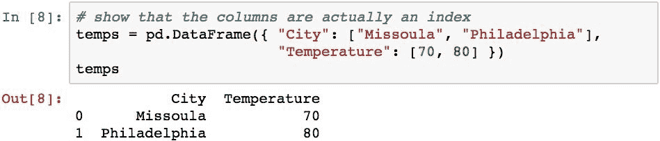

虽然这种类型的索引通常对于字母数字列名非常有效，但是如果需要，可以使用其他类型的索引作为列索引。

# 使用 Int64Index 和 RangeIndex 的整数索引标签

`Int64Index`表示映射到值的不可变的 64 位整数数组。 直到更新版本的 pandas 为止，这是未指定索引或使用整数的默认索引类型，如以下代码片段所示：

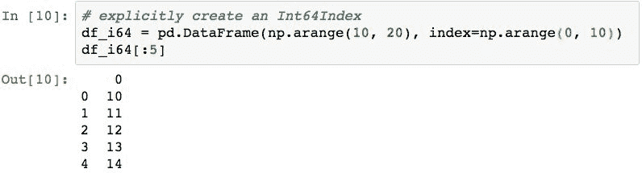

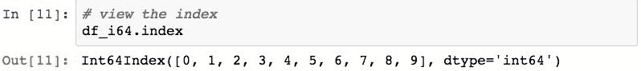

使用此索引，`DataFrame`中的行查找非常高效，因为它们是使用连续的内存中数组执行的。

熊猫的最新版本添加了`RangeIndex`作为`Int64Index`的优化。 它具有表示基于整数的索引的能力，该索引从特定的整数值开始，具有结束的整数值，并且还可以指定步骤。

使用开始，停止和步进是一种常见的模式，因此需要向熊猫添加自己的子类。 通过使用这三个值，可以节省内存，并且执行时间与`Int64Index`中的顺序相同。

`RangeIndex`已成为熊猫对象的默认索引。 以下内容对此进行了演示，该示例创建了一系列默认为`RangeIndex`的整数值。

# 使用 Float64Index 的浮点标签

通过使用`Float64Index`，浮点数可用作索引标签。

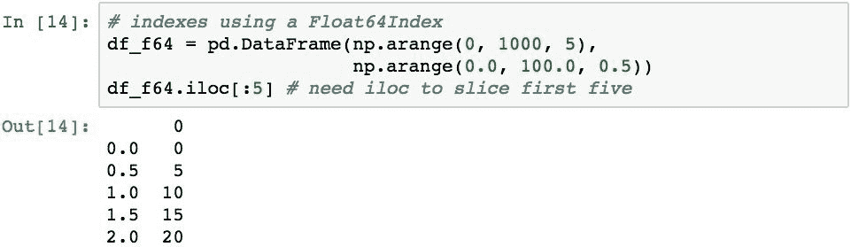

请注意，此片返回了 11 行，而不是前 5 行。 这是因为`Float64Index`，并且熊猫从一开始就将我们的意思表示为 5.0 之前的所有值。

# 使用 IntervalIndex 表示离散间隔

可以使用`IntervalIndex`表示不同的标签桶。 该间隔在一端（左端或右端）关闭，这意味着该间隔的该端值包含在该间隔中。 以下代码显示了使用间隔作为索引创建`DataFrame`的过程。

# 分类值作为索引-CategoricalIndex

`CategoricalIndex`用于表示基础分类的稀疏填充索引。 下面创建一个`DataFrame`，其中一列为“分类”。

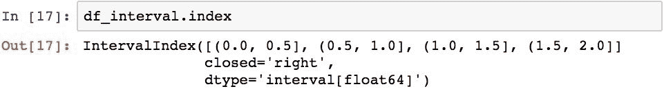

将类别列（`B`）移到`DataFrame`的索引中可以看到现在有`CategoricalIndex`。

然后可以使用基础分类中的现有值执行查找。

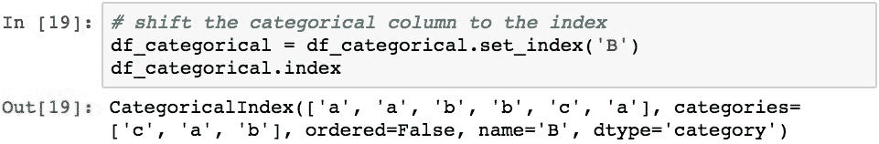

分类将在 [第 7 章](../Text/7.html#4F1KC0-6d660dfc3dae48d08d794ed23c5cd536) ， *分类数据* 中进行详细检查。

# 使用 DatetimeIndex 按日期和时间编制索引

`DatetimeIndex`用于表示一组日期和时间。 这些在时间序列数据中得到了广泛使用，在这些时间序列数据中，以特定的时间间隔采样。 为了简要说明这一点，下面的代码创建了`5`-每小时时间段的范围，并将它们用作该系列的索引。

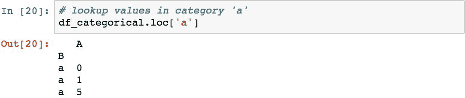

索引的类型可以看作是`DatetimeIndex`。

日期/时间的基本表示形式是 64 位整数，这使得按日期和时间进行查找非常有效。

# 使用 PeriodIndex 索引时间段

能够表示诸如日，月或年之类的时间段也很重要。 这很像一个间隔，但要持续一段时间。 可以通过使用`PeriodIndex`并为索引中的时间段指定特定频率来对这些场景进行建模。

下面通过对从`2017-01`开始的三个 1 个月周期进行建模进行演示。

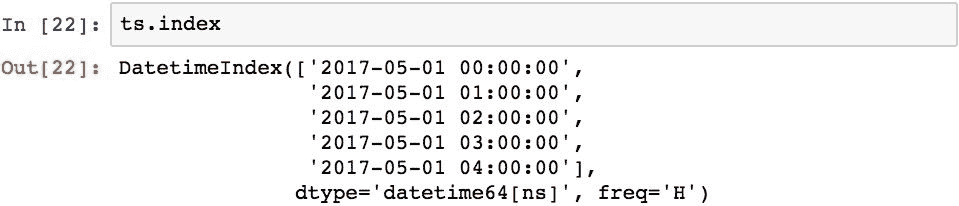

然后可以在`Series`或`DataFrame`中使用该索引。

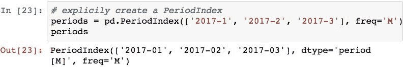

# 使用索引

在介绍了创建各种类型的熊猫索引之后，现在让我们检查一下这些索引的几种常见使用模式。 具体来说，我们将检查：

*   使用 Series 或 DataFrame 创建和使用索引
*   用索引选择值的方法
*   在索引之间移动数据
*   重新索引熊猫对象

# 使用 Series 或 DataFrame 创建和使用索引

索引可以显式创建，也可以让熊猫隐式创建。 当您使用构造函数的`index`参数分配索引时，会显式创建。

以下代码通过首先独立创建`DatetimeIndex`进行演示。

您可以单独使用此索引，也可以将其与`Series`或`DataFrame`关联。 此代码利用索引创建一个`DataFrame`。

通过设置`.index`属性，也可以将索引直接分配给现有的`DataFrame`或系列。

# 使用索引选择值

可以使用`[]`运算符使用索引或使用`Series`或`DataFrame`的以下属性索引器来查找值：

| `.loc[]` | 通过标签而不是位置查找。 但小心点; 如果标签是整数，则整数将被视为标签！ |
| `.at[]` | 类似于`.loc[]`，但这只能检索单个值。 |
| `.iloc[]` | 查找基于基于`0`的位置，而不是基于索引标签。 |
| `.ix[]` | 混合（Hybrid），当给出整数时将尝试基于`0`的查找； 其他类型是基于标签的。 将不建议使用此属性，因此请保留其他三个属性。 |

可以使用`[]`运算符在`Series`中查找值，如以下`DataFrame`所示，该运算符已检索到`b`值。

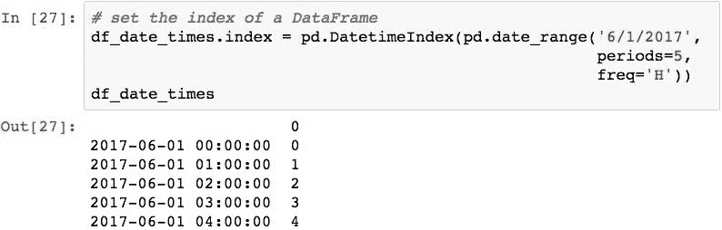

在`Series`上使用`[]`进行查找等同于使用`.loc[]`属性。

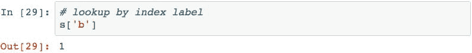

`[]`运算符应用于`DataFrame`时，检索列而不是行。

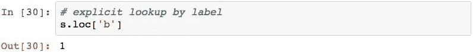

若要使用`DataFrame`通过行索引进行查找，必须使用属性索引器之一。

属性索引器表单也可以使用切片。

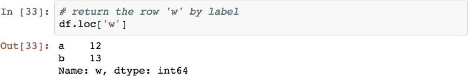

并且还可以传递值列表。

# 在索引之间移动数据

通过使用`.reset_index()`可以重置`DataFrame`对象的索引。 通常将其用于将`DataFrame`对象的索引的内容移到一个或多个列中。

以下代码将`sp500`索引中的符号移到一列中，并将索引替换为默认的整数索引。

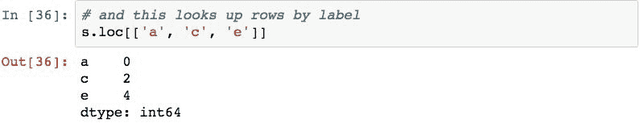

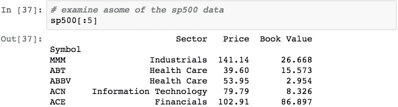

可以使用`.set_index()`方法并通过指定要移动的列将数据列移动到`DataFrame`对象的索引。 以下代码将`Sector`列移至索引。

可以将多个列移至索引，从而形成一个层次/多索引。 层次结构索引将在本章后面介绍。

# 重新索引熊猫对象

可以使用`.reindex()`方法重新索引`DataFrame`。 重新索引使`DataFrame`符合新索引，将旧索引中的数据与新索引对齐，并在对齐失败的地方填充`NaN`。

此代码演示将`sp500`重新索引到三个指定的索引标签。

此过程将创建具有指定行的新`DataFrame`。 如果未找到特定值的行，则将插入`NaN`值，如`'FOO'`标签所示。 这种方法实际上是一种基于索引标签过滤出数据的好技术。

重新索引也可以在列上完成，如下面的代码所示，用于指定的三个列名称：

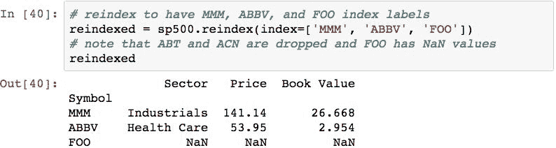

由于`NewCol`的值未包含在原始数据中，因此将为其插入`NaN`值。

# 分层索引

分层索引是熊猫的一项功能，它允许每行结合使用两个或多个索引。 层次结构索引中的每个索引都称为一个级别。 索引中多个级别的规范允许使用每个级别的值的不同组合来有效选择数据的不同子集。 从技术上讲，具有多个层次结构的熊猫索引称为`MultiIndex`。

以下代码演示了使用`sp500`数据通过`MultiIndex`创建和访问数据。 假设我们要通过`Sector`和`Symbol`的值来组织此数据，以便我们可以基于来自两个变量的值的组合来有效地查找数据。 我们可以使用以下代码将`Sector`和`Symbol`的值移动到`MultiIndex`中，以完成此操作：

`.index`属性现在显示索引为`MultiIndex`对象：

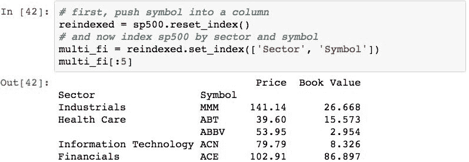

如上所述，`MultiIndex`对象包含两个或多个级别，在这种情况下为两个：

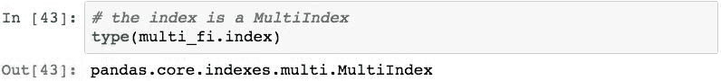

每个级别都是一个不同的`Index`对象：

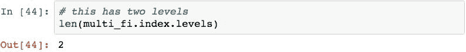

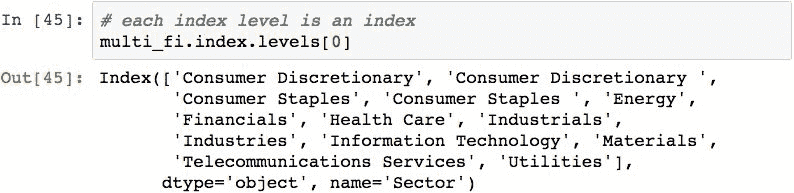

可以通过`.get_level_values()`方法检索每行特定级别的索引本身的值：

使用`.xs()`方法通过层次索引访问`DataFrame`对象中的值。 此方法的工作方式类似于`.ix`属性，但是提供了用于指定索引多维性的参数。

以下代码选择索引标签为`Industrials`的所有项目：`0`（`Sector`）：

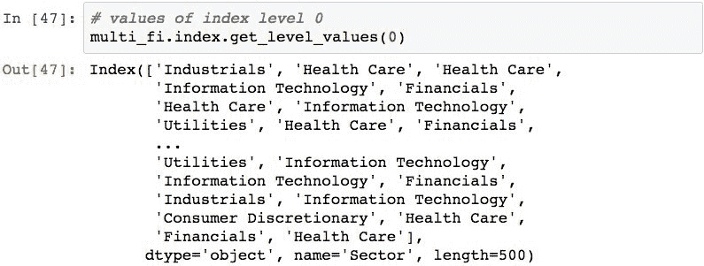

结果`DataFrame`的索引由未指定的级别组成，在这种情况下为`Symbol`。 从结果索引中删除为其指定值的级别。

`level`参数可用于选择在指定级别具有特定索引值的行。 以下代码选择索引的`Symbol`分量为`ALLE`的行。

为了防止电平下降（如果您未指定每个级别），可以使用`drop_levels=False`选项。

要从索引层次结构中进行选择，可以将具有不同级别的`.xs()`调用链接在一起。 下面选择级别为`0`的`Industrials`和级别为`1`的`UPS`的行。

另一种语法是将层次结构索引的每个级别的值作为元组传递。

请注意，`.xs()`仅可用于获取，而不能用于设置值。

# 摘要

在本章中，我们更深入地研究了在熊猫中使用索引来组织和检索数据。 我们研究了许多有用的索引类型，以及它们如何与不同类型的数据一起使用以有效访问值而无需查询行中的数据。 最后，我们对使用分层索引的研究进行了总结，该分层索引能够有效地检索与多个索引中的标签匹配的数据，从而为我们提供了选择数据子集的有力手段。

至此，我们已经涵盖了熊猫的许多基本建模部分。 在下一章中，我们将研究用大熊猫表示分类变量。