# 七、类别数据

类别变量是统计信息中的一种变量，代表一组有限的且通常是固定的值。 这与连续变量相反，连续变量可以表示无限数量的值。 类别变量的常见类型包括性别（其中有两个值，分别是男性和女性）或血液类型（可以是一小批血液类型之一，例如 A，B 和 O）。

pandas 可以使用一种称为`Categorical`的 pandas 对象来表示类别变量。 这些 Pandas 对象旨在有效地表示分组为一组存储桶的数据，每个存储桶由代表其中一个类别的整数代码表示。 这些基础代码的使用使 Pandas 能够有效地表示类别集，并可以跨多个类别变量执行数据的排序和比较。

在本章中，我们将学习有关类别法的以下内容：

*   创建类别
*   重命名类别
*   追加新类别
*   删除类别
*   删除未使用的类别
*   设置类别
*   描述性统计
*   值的计数
*   最小，最大和众数
*   如何使用类别根据学生的数字等级为学生分配字母等级

## 配置 Pandas

我们使用以下导入和配置语句开始本章中的示例：

## 创建类别

Pandas 类别用于表示类别变量。 类别变量由一组有限的值组成，通常用于将值映射到一组类别中，并跟踪每个类别中存在多少个值。 另一个目的是将连续值的各个部分映射到一组离散的命名标签中，其一个示例是将数字等级映射到字母等级。 在本章的最后，我们将研究如何执行这种映射。

有几种创建类别 Pandas 的方法。 以下屏幕截图演示了如何直接从列表创建类别：

此类别是从包含五个字符串和三个不同值的列表创建的：低，中和高。 创建类别时，Pandas 会确定列表中的每个唯一值并将其用作类别。

可以使用`.categories`属性检查以下类别：

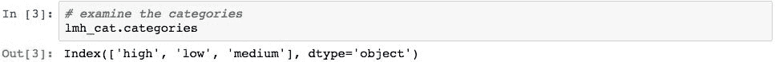

类别创建了一个索引，该索引由提供的列表中的三个不同值组成。

类别的值可以使用`.get_values()`检索：

类别的每个类别都分配有一个整数值。 此值称为**代码**。 可以使用`.codes`属性访问这些分配的代码。

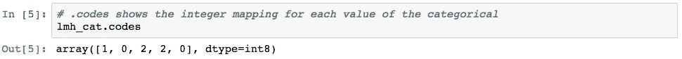

这些代码有效地表示每个值在类别索引中的位置。 在这种情况下，映射是`low=1`，`high=0`和`mid=2`。 此排序可能没有逻辑意义，由 Pandas 通过串行处理`lmh_values`数组中的字符串来确定。

通过使用`categories`参数指定类别，可以更好地控制此排序。

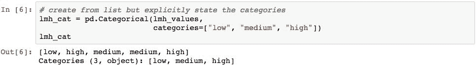

请注意在构造器中指定的类别的新顺序。 由于此顺序，代码现在为：

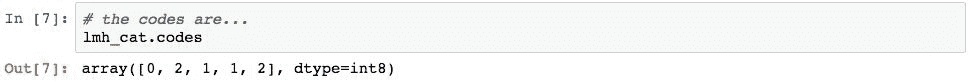

现在，它表示`low=0`，`mid=1`和`high=2`的映射。这更加有用，因为它可用于按与每个类别的含义及其与其他类别的关系相匹配的顺序对值进行排序。 在类别类别时，将使用代码而不是实际值进行类别。 以下演示`lmh_cat`的排序：

类别变量也可以表示为一个序列，其`dtype`被指定为`"category"`。 以下屏幕快照演示了如何获取类别列表并创建具有`dtype`类别的`Series`：

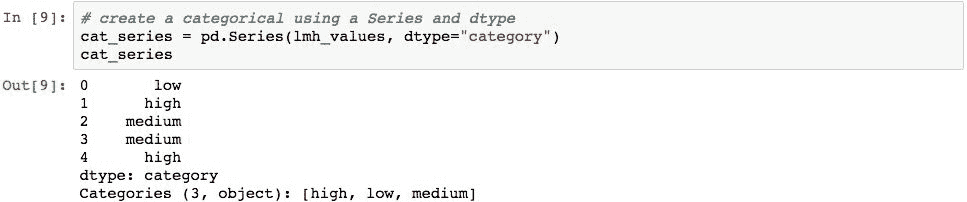

使用类别创建`Series`的另一种方法是先创建`Series`，然后使用`.astype('category')`方法将一列转换为类别。 下面的屏幕截图通过创建一个数据帧并将其值转换为`category`的第二列来说明这一点，该数据帧的一列然后是第二列。

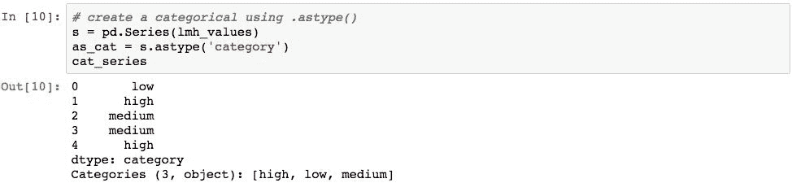

创建为类别的序列包含`.cat`属性，该属性允许访问`Series`使用的类别：

该变量是`CategoricalAccessor`对象，它允许访问基础类别的各种属性。 例如，以下代码获取类别：

几个 Pandas 函数还返回类别。 一种是`pd.cut()`，它会在特定值范围内创建对象箱。 以下屏幕截图演示了将代表`0`和`100`之间的`5`随机数的值的序列切入 10 个类别箱，每个箱子宽 10 个整数：

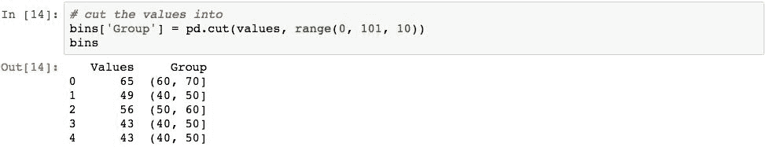

`Group`列表示由`cut`函数创建的类别变量，每个索引级别的值表示该值已与之关联的特定类别。

可以使用`ordered = True`指定类别的显式顺序。 此信息意味着类别的顺序很重要，并且可以比较多个类别的类别变量中的值。 为了说明这一点，下面的代码创建了一个有序的类别，代表三种金属（以及这三个类别的四个值）：

创建的类别具有`bronze`的严格排序，其重要性低于`silver`，而`silver`的重要性低于`gold`。

此排序可用于将一个类别类别或与另一个类别进行比较。 为了说明这一点，让我们创建以下类别，将其取反：

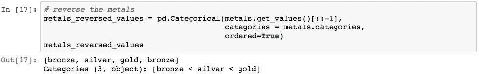

这两个类别变量可以相互比较。 以下代码显示了每种金属是否比另一种类别中相同索引标签上的相应金属价值低：

Pandas 通过对每个值匹配基础代码来执行此比较。 金属变量具有以下代码：

并且`metals_reveresed_values`具有以下代码。

逻辑运算符的应用导致前面显示的结果。

作为创建类别的最后一个示例，以下屏幕截图演示了如何创建一个类别，该类别指定的值（`copper`）不是指定类别之一。 在这种情况下，Pandas 将用`NaN`代替该值。

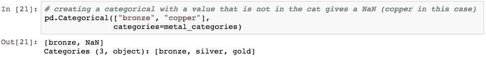

此技术可用于在创建时筛选出不适合类别的值。

## 重命名类别

通过为`.categories`属性分配新值或使用`.rename_categories()`方法，类别人员可以重命名值。

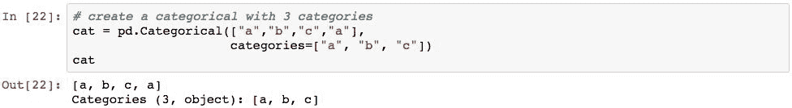

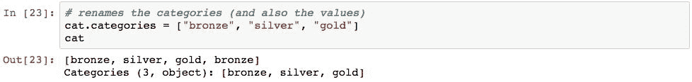

请注意，这是就地修改。 为了防止就地修改，我们可以使用`.rename_categories()`方法。

我们可以验证这不是就地完成的。

## 追加新类别

可以使用`.add_categories()`方法附加类别。 以下代码将`copper`类别添加到我们的金属中。 除非明确告知 Pandas 这样做，否则不会就地进行：

## 删除类别

可以使用`.remove_categories()`方法删除类别。 删除的值将替换为`np.NaN`。 以下屏幕截图通过删除`bronze`类别来演示此操作：

## 删除未使用的类别

可以使用`.remove_unused_categories()`删除未使用的类别，如下所示：

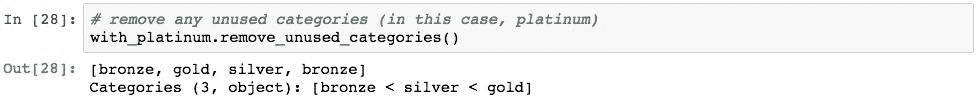

## 设定类别

也可以使用`.set_categories()`方法在一个步骤中添加和删除类别。 鉴于以下`Series`：

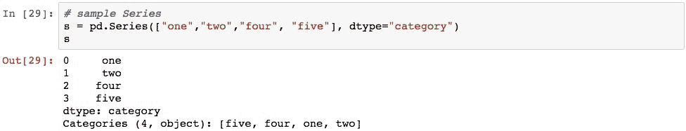

以下代码将类别设置为`"one"`和`"four"`：

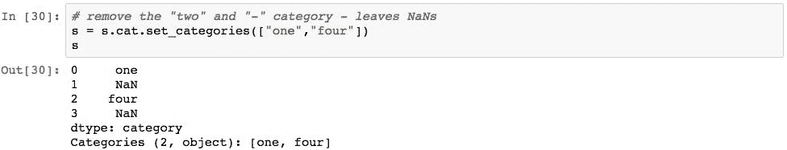

结果将`NaN`替换为现在不存在的类别。

## 类别的描述性信息

类别上的`.describe()`方法将以类似于`Series`或`DataFrame`的方式产生描述性统计信息。

结果为我们提供了每个类别的实例数量以及每个类别的频率分布。

可以使用`.value_counts()`获得每个类别的值计数。

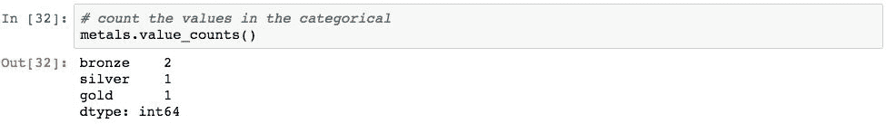

最小值，最大值和众数可以使用相应的方法找到。

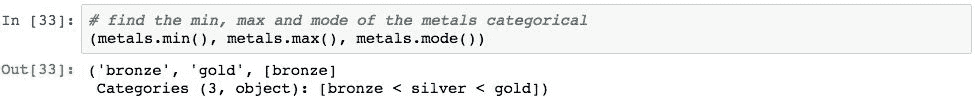

## 处理学校成绩

现在让我们看一下应用类别法来帮助我们根据类别而不是数字来组织信息。 我们将要研究的问题是根据学生的数字等级为其分配字母等级。

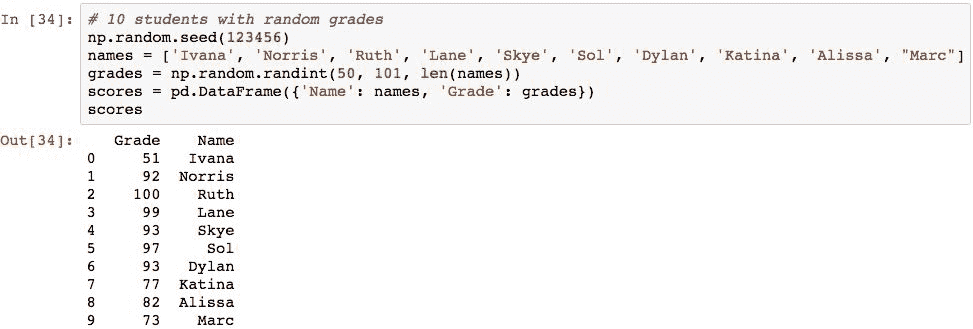

该数据帧代表每个学生的原始分数。 接下来，我们将数字等级分解为字母代码。 以下代码定义每个等级的箱以及每个箱的关联字母等级：

使用这些值，我们可以执行分配字母等级的剪切。

检查基础类别，将显示以下代码的创建方式以及字母等级与值的关系：

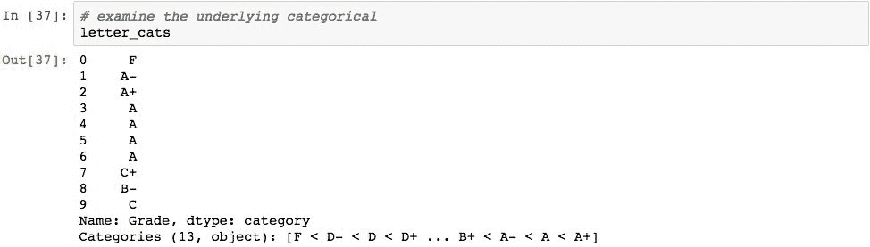

要确定每个年级有多少学生，我们可以使用`.cat.value_counts()`：

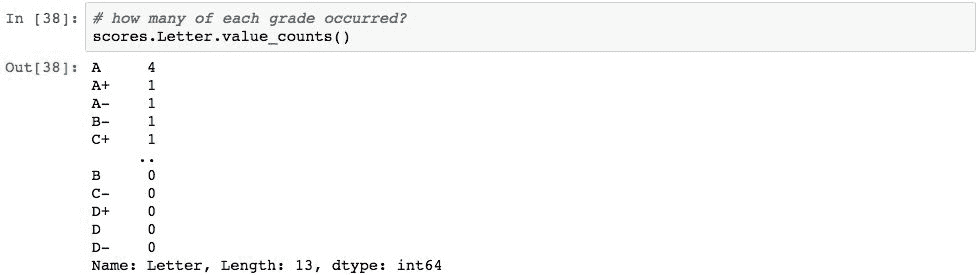

由于字母等级的类别具有字母等级的逻辑顺序，因此通过使用它在类别列上进行排序，我们可以从最高到最低字母等级对学生进行排序。

## 总结

在本章中，我们研究了如何使用 pandas 类别对类别变量建模。 我们首先回顾了创建类别的方法，并查看了几个如何使用基础整数代码对每个类别进行类别的示例。 然后，我们研究了创建类别后修改类别的几种方法。 本章以使用类别将数据分解为一组命名容器的示例作为结尾。

在下一章中，我们将对 Pandas 数据进行数值和统计分析。