# 八、数值统计方法

pandas 在建模和处理数据方面非常强大，但它也提供了许多用于数值和统计分析的强大工具。 这些功能与 Pandas 数据结构紧密集成在一起，因此一旦对数据建模就可以使复杂的计算变得非常简单。

本章将研究许多这些功能。 它从常见的数值方法开始，例如跨多个对象对齐的算术，以及查找特定的值（例如最小值和最大值）。 然后，我们将研究 Pandas 的许多统计能力，例如使用分位数，值排名，方差，相关性以及许多其他功能。

最后但并非最不重要的一点，我们将研究 Pandas 提供的一种非常强大的功能，称为滚动窗口。 滚动窗口提供了一种应用各种方法的方法，例如对规则数据子集进行均值计算。 这些类型的操作对于各种分析都是至关重要的，例如确定随着时间变化的股票数据的几个特征。 该概念将在本章中介绍，我们将在后面的章节中更详细地介绍它。

本章涉及很多内容，包括：

*   对 Pandas 对象执行算术运算
*   获取价值计数
*   确定唯一值（及其计数）
*   查找最小值和最大值
*   找到 n 个最小和 n 个最大的值
*   计算累计值
*   检索摘要描述性统计
*   衡量集中趋势（均值，中位数和众数）
*   计算方差，标准差，协方差和相关性
*   执行离散化和数据量化
*   计算值的等级
*   计算系列中每个样本的百分比变化
*   执行滚动窗口操作
*   执行数据随机抽样

## 配置 Pandas

我们将使用标准的 Pandas 导入和配置，从以下环境配置开始。 除了正常导入和格式化外，我们还将导入 S&P 500 数据和每月股票数据：

## 在 Pandas 对象上执行数值方法

Pandas 提供了丰富的功能和操作集，这些功能和操作有助于执行算术运算和计算数据的各种数值特征。 在本节中，我们将研究其中的许多内容，包括：

*   在数据帧或序列上执行算术
*   获取价值计数
*   确定唯一值（及其计数）
*   查找最大值和最小值
*   找到 n 个最小和 n 个最大的值
*   计算累计值

## 在数据帧或序列上执行算术

可以使用`+`，`-`，`/`和`*`运算符在数据帧（和系列）上执行算术运算。 尽管它们在本质上看似微不足道，但 Pandas 通过对等式左侧和右侧的值进行对齐来增加强大的效果。 因此，索引在算术中起着很大的作用，Pandas 用户必须了解索引如何影响结果。

此外，Pandas 不仅提供了算术的标准运算符，而且还提供了几种方法`.add()`，`.sub()`，`.mul()`和`.div()`，它们在指定应用坐标轴时提供了更高的性能和更大的灵活性。 功能。

使用标量值的算术运算将应用于`DataFrame`的每个元素。 为了说明这一点，我们从以下四列随机数的数据帧开始：

默认情况下，所有算术运算都将应用于数据帧的所有行和列。 这将导致包含结果的新`DataFrame`对象（使`original`保持不变）：

当在`DataFrame`和`Series`之间执行操作时，Pandas 将`Series`索引沿`DataFrame`列对齐，执行所谓的逐行广播。 这可能有点违反直觉，但是在逐行的基础上在每列中应用不同的值时，它是非常强大的。

为了说明这一点，下面的示例检索`DataFrame`的第一行，然后从每一行中减去该行，从根本上导致每一行的值与第一行之差：

当通过从`Series`对象中减去`DataFrame`来反转顺序时，此过程也适用，因为 Pandas 足够聪明，可以找出正确的应用程序：

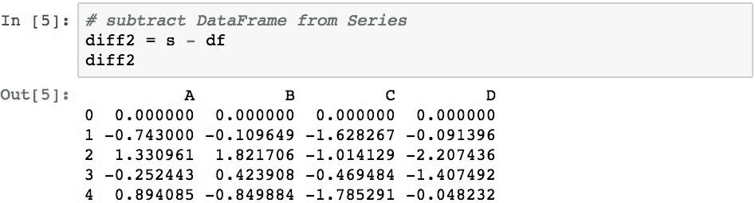

由算术运算得到的一组列将是序列索引和`DataFrame`对象的列索引中的标签的并集（根据对齐规则）。 如果在`Series`或`DataFrame`对象中均未找到表示结果列的标签，则这些值将用`NaN`填充。 以下代码通过创建一个`Series`来演示此操作，该索引的索引表示`DataFrame`中列的子集，但带有一个附加标签：

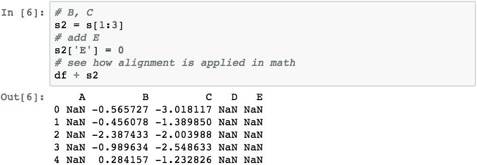

pandas 将`df`的索引标签与`s2`的索引标签对齐。 由于`s2`在列中没有`A`或`D`标签，因此结果在这些列中包含`NaN`。 并且由于`df`没有`E`标签，因此它也充满了`NaN`（即使`Series`中存在`E`）。

两个`DataFrame`对象之间的算术运算将同时按列标签和索引标签对齐。 以下代码提取了`df`的一小部分，并将其从完整的数据帧中减去。 结果表明，对齐的值减去 0，而其他值设置为`NaN`：

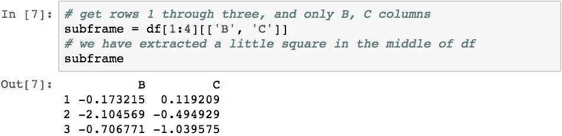

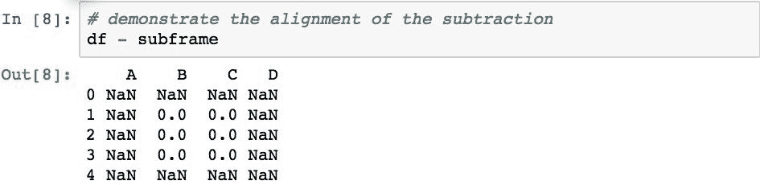

使用`DataFrame`对象提供的算术方法可以获得对算术运算的附加控制。 这些方法提供了特定轴的规范。 下面的代码演示了从每列中减去`A`列值：

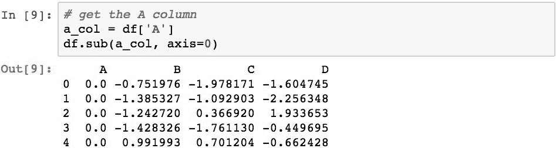

## 获取值的计数

`.count()`方法为我们提供`Series`中非`NaN`项目的计数。

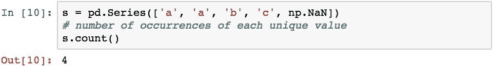

## 确定唯一值（及其计数）

可以使用`.unique()`获得系列中唯一值的列表：

可以使用`.nunique()`获得唯一值的数目（`NaN`除外）：

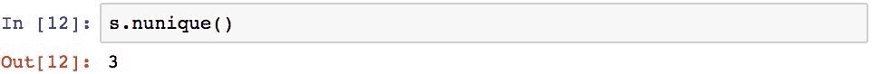

要在结果中包含`NaN`，请使用`dropna=False`作为参数。

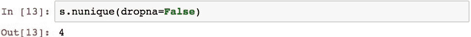

可以使用`.value_counts()`（此过程也称为**直方图**）确定每个唯一值的计数：

## 查找最大值和最小值

可以使用`.min()`和`.max()`确定最小值和最大值。

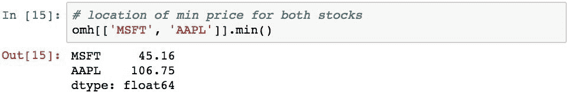

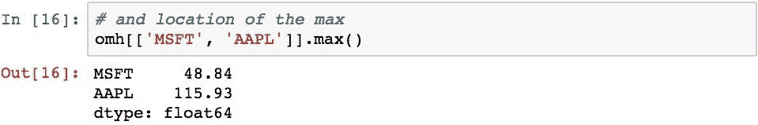

一些 Pandas 统计方法被称为间接统计，因为它们不返回实际值，而是间接的相关值。 例如，`.idxmin()`和`.idxmax()`返回存在最小值和最大值的索引位置。

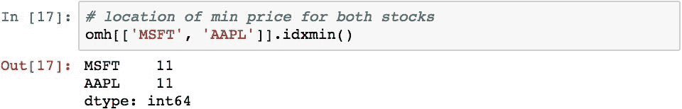 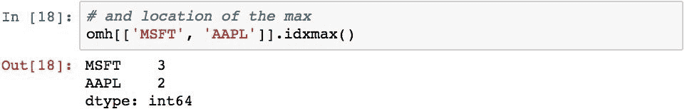

## 找到 n 个最小和 n 个最大值

有时我们需要知道数据集中的 n 个最小值和 n 个最大值。 这些可以使用`.nsmallest()`和`.nlargest()`找到。 下面的代码通过返回`MSFT`的 4 个最小值来说明这一点。

同样，最大的 4 个值。

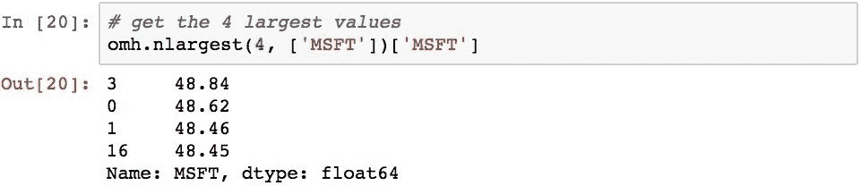

系列的形式略有不同，因为没有要指定的列。

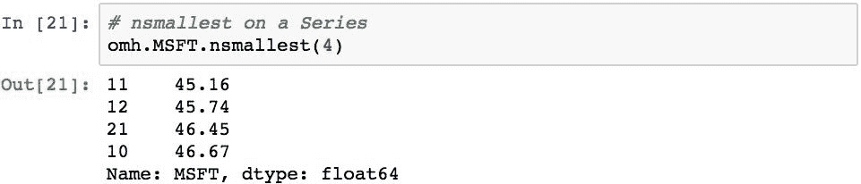

## 计算累计值

累加是通过将`Series`中的下一个值连续应用于运行结果来确定值的统计方法。 很好的例子是一个系列的累积乘积和累积和。 以下代码演示了累积积的计算。

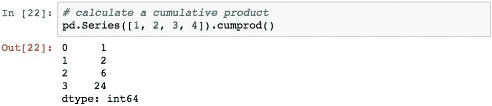

结果是另一个`Series`，代表每个位置的累加值。 这是相同`Series`的累加总和的计算。

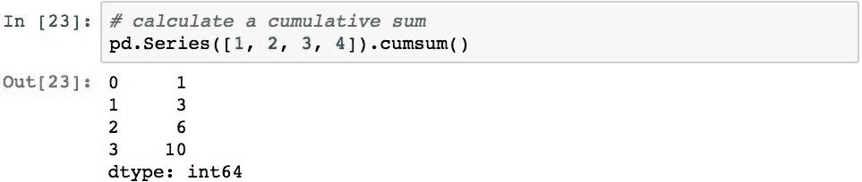

## 对 Pandas 对象执行统计过程

描述性统计数据使我们能够理解描述基础数据特定特征的大量数据度量。 内置于 Pandas 中的是这些描述性统计操作的几类，它们可以应用于序列或数据帧。

让我们研究一下 Pandas 提供的统计分析/技术的几个方面：

*   摘要描述性统计
*   衡量集中趋势：均值，中位数和众数
*   方差和标准差

## 检索摘要描述性统计

pandas 对象提供`.describe()`方法，该方法返回一组对象数据的摘要统计信息。 当应用于`DataFrame`时，`.describe()`将计算每列的摘要统计信息。 以下代码为`omh`中的两只股票计算这些统计数据。

通过一次快速的方法调用，我们计算了两个系列股票数据的计数，均值，标准差，最小值和最大值，甚至 25% ，50% 和 75%。

`.describe()`也可以应用于系列。 以下代码仅计算`MSFT`的摘要统计信息。

并且只有平均值可以如下获得。

非数字数据将导致一组稍微不同的摘要统计信息，返回项目总数（`count`），唯一值的计数（`unique`），最频繁出现的值（`top`）和出现的次数（`freq`）：

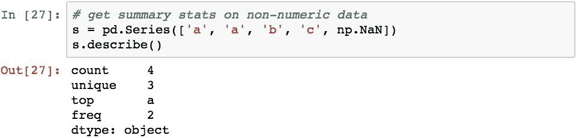

## 衡量集中趋势：均值，中位数和众数

平均值和中位数为我们提供了几种有用的数据度量方式，可帮助我们开始理解值的分布以及该分布的形状。 这三个值的关系为我们提供了形状的快速聚合概念，如下图所示：

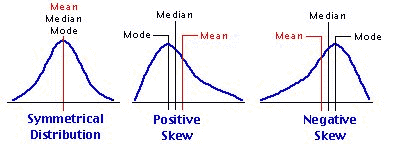

现在，让我们研究一下如何使用 Pandas 查找这些值。

## 计算平均值

该平均值通常称为平均值，它使我们可以测量数据的**中心趋势**。 通过将所有测量值相加然后除以测量值数来确定。

可以使用`.mean()`计算平均值。 以下代码计算`AAPL`和`MSFT`的平均价格：

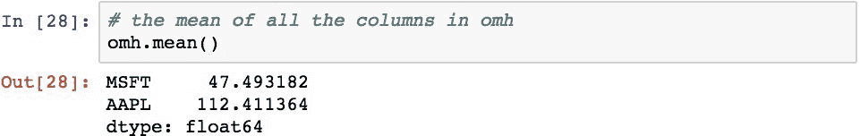

Pandas 选择了每一列，并独立计算了每一列的平均值。 它以列名索引的序列中的值形式返回结果。 默认设置是将方法应用于`axis=0`，将函数应用于每一列。 此代码切换轴并返回每天所有股票的平均价格：

## 求中位数

中位数使我们在一系列值中处于中心位置。 根据定义，中位数是数据中存在相同数量的其他值均小于或大于该值的值。 中位数很重要，因为它不受外部值和非对称数据的影响，而不是均值。

值的中位数使用`.median()`确定：

## 确定众数

该众数是序列的最常见值，可通过`.mode()`找到。 以下代码确定给定序列的众数：

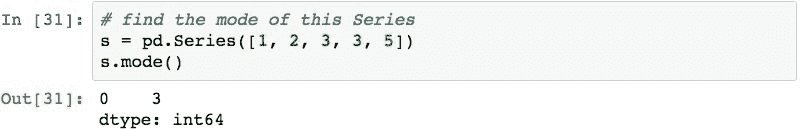

注意，这没有返回表示众数的标量值，而是返回了一个序列。 这是因为序列的众数可以有多个值。 下面的示例对此进行了演示：

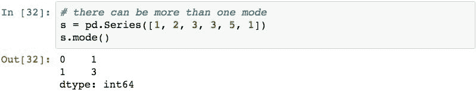

## 计算方差和标准差

在概率论和统计学中，标准差和方差使我们感觉到一些数字与平均值之间的距离有多远。 让我们简要地检查一下。

## 计算方差

方差使我们感觉到平均值的均值散布量。 定义如下：

本质上，这说明对于每次测量，我们都会计算出值与平均值之间的差值。 这可以是正值或负值，因此我们对结果求平方以确保负值对结果有累积影响。 然后将这些值相加并除以测量值减 1，得出差值平均值的近似值。

在 Pandas 中，使用来计算方差。 `var()`方法。 以下代码计算两种股票的价格差异：

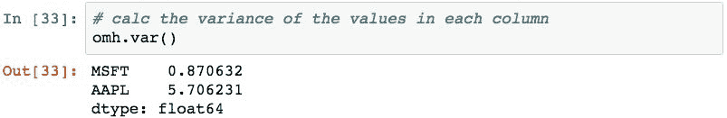

## 求标准差

标准差与方差相似。 它是通过计算方差的平方根确定的，定义如下：

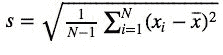

请记住，方差是所有测量值与均值之差的平方。 因此，方差不在相同的单位和实际值之间。 通过使用方差的平方根，标准差的单位与原始数据集中的值相同。

使用`.std()`方法计算标准差，如下所示：

## 确定协方差和相关性

协方差和相关性描述了两个变量之间的关系。 此关系可以是以下之一：

*   如果变量沿相同方向移动，则它们呈正相关。
*   如果变量沿相反方向移动，则它们成反比。

协方差和相关性都表明变量是正相关还是逆相关。 相关性还告诉您变量趋于一起移动的程度。

## 计算协方差

协方差指示两个变量之间的关系。 正协方差意味着变量是正相关的，而负协方差意味着它们是负相关的：

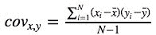

可以使用`.cov()`方法计算协方差。 以下代码计算`MSFT`和`AAPL`之间的协方差：

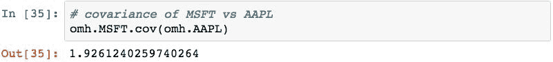

## 确定相关性

协方差可以帮助确定值是否相关，但是并不能给变量一起移动的程度提供感觉。 为了衡量变量一起移动的程度，我们需要计算相关性。 通过将协方差除以两组数据的标准差的乘积来计算相关性：

相关性标准化了两个变量之间相互依存的度量，因此可以告诉您两个变量的移动程度。 相关度量称为相关系数，将始终取 *1* 和 *-1* 之间的值，该值的解释如下：

*   如果相关系数为 *1.0* ，则变量具有完全正相关。 这意味着，如果一个变量移动给定的数量，则第二个变量按相同方向成比例地移动。 小于 *1.0* 但大于 0.0 的正相关系数表示小于理想的正相关，并且相关强度随着数字接近 *1.0* 而增长。
*   如果相关系数为 *0.0* ，则变量之间不存在关系。 如果一个变量移动，则无法对另一个变量的移动做出任何预测。
*   如果相关系数为 *-1.0* ，则变量将完全负相关（或成反相关），并且彼此相对移动。 如果一个变量增加，则另一个变量按比例减少。 大于 *-1.0* 但小于 0.0 的负相关系数表示不理想的负相关，并且相关强度随着数字接近 -1 而增加。

使用`.corr()`方法计算 Pandas 中的相关性。 以下代码计算`MSFT`与`AAPL`的相关性。

这表明在此期间`MSFT`和`APPL`的价格显示出很高的相关性。 这并不意味着它们是因果关系，一个因素会影响另一个因素，而是对价值有共同的影响，例如在相似的市场中。

## 执行数据离散化和量化

离散化是将连续数据切成一组桶的一种方法。 然后，每个值都与一个代表性的容器关联。 然后可以使用每个仓中值计数的结果分布来了解跨不同仓的数据的相对分布。

使用`pd.cut()`和`pd.qcut()`函数在 Pandas 中离散化。 为了演示，让我们从使用普通随机数生成器创建的以下`10000`随机数集开始：

这段代码向我们展示了该数据集的平均值和标准差，随着数据集样本量的增加（因为这是正常的），我们期望它们接近 0 和 1：

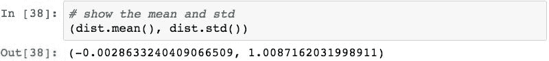

我们可以使用`pd.cut()`将数字分成相等大小的桶。 以下代码创建五个大小均等的容器，并确定值的映射：

生成的`bins`对象是 pandas 类别变量。 它由一组标签和一个描述数据拆分方式的索引组成。 的。 `categories`属性将返回索引，并指定 Pandas 确定的间隔（给定值的范围和指定的仓数）：

`.codes`属性是一个数组，用于指定已为每个项目分配哪些仓位（间隔）：

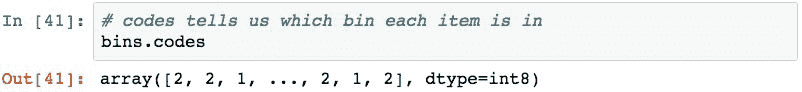

间隔的符号遵循标准的数学间隔，其中的括号表示末尾是开放的，而方括号表示封闭的。 封闭端包含该确切数字的值。 默认情况下，pandas 关闭间隔的右侧。 可以使用`pd.cut()`的`right=False`参数将封闭端移到间隔的左侧：

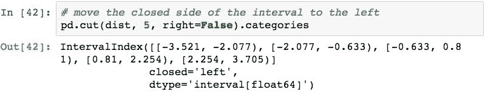

您可以传递一个代表桶的范围的值数组，而不是传递整数个 bin 以将数据切入其中。 一个常见的示例涉及将年龄映射到年龄段存储桶中。 为了证明这一点，以下代码生成了 *6* 和 *45* 之间的 *50* 年龄：

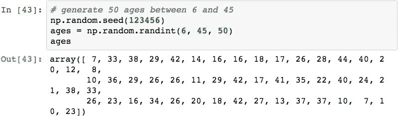

我们可以通过将桶传递到数组中来指定桶的范围，其中相邻值代表每个桶的范围。 此代码将数据切入指定的桶中，并报告在每个桶中找到的年龄的分布。

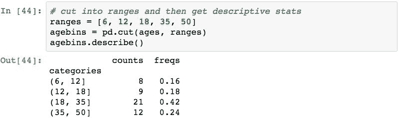

要为每个桶指定一个不同于标准数学符号的名称，请使用`labels`参数：

标签的这种分配不仅方便文本输出，而且在绘制垃圾箱时都非常方便，因为 Pandas 会传递垃圾箱名称以在图表上进行绘制。

也可以使用`pd.qcut()`根据指定的分位数对数据进行切片。 此功能会将值切成垃圾箱，以便每个垃圾箱具有相同数量的项目。 根据此结果，我们可以确定值计数均匀分布的桶的范围。

以下代码将随机值从之前拆分为`5`分位数箱：

代替指定整数的箱数，还可以指定分位数范围。 以下代码根据正负 *3* ， *2* 和 *1* 个标准差分配桶。 由于这是正态分布的数据，因此我们期望值的百分之 0.1，2.1，13.6 和 34.1 位于均值的每一边。

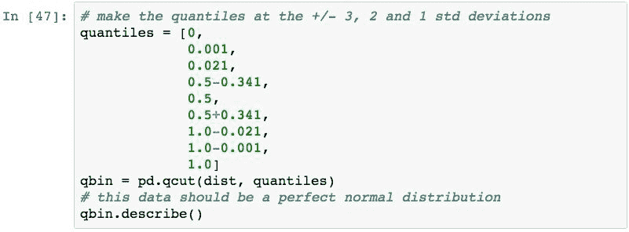

这些正是我们期望从该分布中获得的结果。

## 计算值的排名

排名有助于我们确定以下两项中的一项是*排名较高*还是*排名较低*。 排名将度量减少为一系列序数，这些序数可用于评估复杂标准，并基于结果顺序。

为了演示排名，我们将使用以下数据系列：

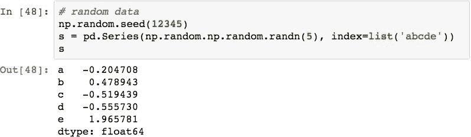

然后可以使用`.rank()`对这些值进行排名，默认情况下，该值告诉我们标签从最低值到最高值的顺序：

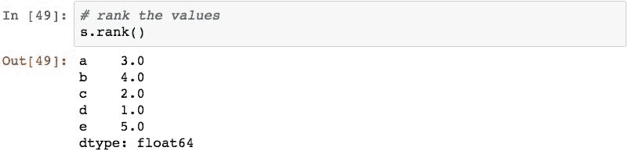

结果代表数值从最小到最大的顺序（本质上是一种排序）。 最低的是`1.0`处的`d`（其最低值是 -0.555730），并且在`5.0`处的排名上升到`e`（值 1.965781）。

您可以使用许多选项来更改此默认行为，例如，指定自定义排名功能以及在出现平局时如何确定排名。

## 计算序列中每个样本的百分比变化

可以使用`.pct_change()`方法来计算给定时间段内的百分比变化。 百分比变化的示例用法是计算股票价格的变化率。 以下代码显示了`MSFT`的代码：

## 执行滚动窗口操作

Pandas 提供了许多功能来计算移动（也称为滚动）统计信息。 滚动窗口根据指定的数据间隔计算指定的统计信息。 然后将窗口沿数据移动特定的时间间隔并重新计算。 该过程一直持续到窗口在整个数据集上滚动为止。

为了证明这一点，我们将从一系列`1000`随机数开始，这些随机数被累加起来形成一个随机游动：

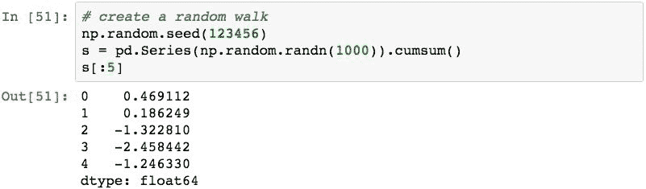

放大前 *100* 个值，我们可以看到以下图所示的数据移动：

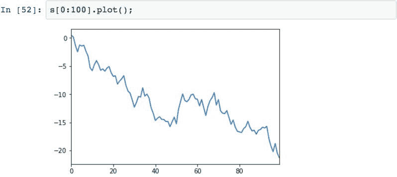

要开始创建滚动窗口，我们使用带有指定窗口的`.rolling()`方法创建一个`Rolling`对象。 在这种情况下，我们要创建`3`的滚动窗口：

此`rolling`对象指定我们希望窗口的宽度，但尚未执行实际的计算。 为此，我们可以选择表示统计操作的`rolling`对象的多种方法之一（下图显示了其中的几种）：

该代码演示了如何计算数据的滚动平均值：

因为我们的窗口大小是`N = 3`，所以结果的第一个均值在索引标签 *2* 处。 我们可以验证该值是前三个数字的平均值：

然后，窗口沿数据滚动一个间隔。 计算的下一个值在标签 3 处，代表标签 *1* ， *2* 和 *3* 的平均值：

将滚动平均值的结果绘制在第一个 *100* 值上可以得出以下结果：

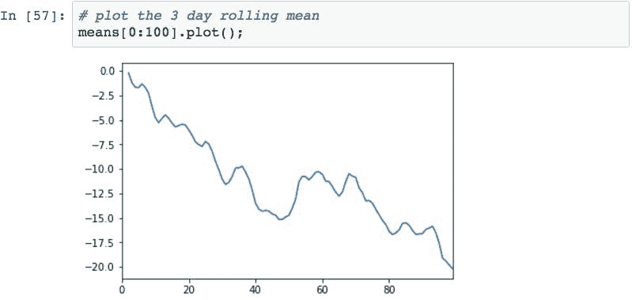

通过将该图与上一个图进行比较可以看出，滚动平均值可以使区间中的数据变得平滑。

## 执行数据随机抽样

随机采样是从随机位置的数据样本中选择值的过程。 从 pandas *0.19.2* 开始，此功能已添加到 pandas `Series`和`DataFrame`对象，而在以前的版本中，您必须自己编写此过程。

为了演示随机采样，让我们​​从下面的`DataFrame`开始，它代表 *50* 行随机数的四列：

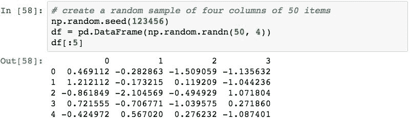

在指定要检索的样本数量的同时，我们可以使用`.sample()`方法获取数据样本。 以下代码对三个随机行进行采样：

另一种形式是指定要随机选择的数据百分比。 此代码选择 *10%* 的行。

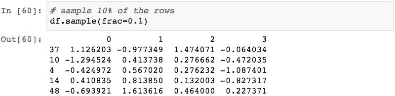

可以在有或没有替换的情况下对 Pandas 采样，默认情况下不替换。 要指定我们要使用替换，我们只需使用`replace=True`参数：

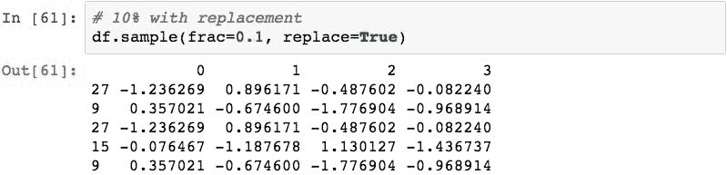

## 总结

在本章中，您学习了如何对 Pandas 对象执行数值和统计分析。 这包括检查许多常用方法，这些方法将用于计算值和执行各种分析。 我们从基本的算术运算以及数据对齐如何影响运算和结果开始。 然后，我们介绍了 Pandas 提供的许多统计操作，从描述性统计到离散化再到滚动窗口和随机抽样。 这些课程将为您进行许多实际数据分析做好准备。

在下一章中，我们将进行调整，并研究如何从各种数据源（例如本地文件，数据库和远程 Web 服务）中加载数据。