# 存取数据

在几乎所有实际数据分析中，您都需要从程序外部加载数据。 由于 pandas 是基于 Python 构建的，因此您可以使用 Python 中可用的任何方式来检索数据。 这样就可以从几乎无限的资源集中访问数据，包括但不限于文件，Excel 电子表格，网站和服务，数据库以及云服务。

但是，使用标准 Python 函数加载数据时，需要将 Python 对象转换为 Pandas`Series`或`DataFrame`对象。 这增加了代码的复杂性。 为了帮助管理这种复杂性，pandas 提供了许多功能，可以将各种来源的数据直接加载到 pandas 对象中。 我们将在本章中研究其中的许多内容。

具体而言，在本章中，我们将介绍：

*   将 CSV 文件读入 DataFrame
*   读取 CSV 文件时指定索引列
*   数据类型推断和规范
*   指定列名
*   指定要加载的特定列
*   将数据保存到 CSV 文件
*   使用一般的字段分隔数据
*   处理字段分隔数据中格式的变体
*   以 Excel 格式读写数据
*   读写 JSON 文件
*   从网络读取 HTML 数据
*   读写 HDF5 格式文件
*   从 SQL 数据库读写
*   从 Yahoo!中读取库存数据！ 和 Google 财经
*   从 Google 财经中读取期权数据
*   从圣路易斯 FRED 读取经济数据
*   访问肯尼斯·法文的数据
*   访问世界银行数据

# 配置 Pandas

我们从 Pandas 的标准进口和选择入手，以方便举例说明。

# 处理 CSV 和文本/表格格式数据

CSV 格式的数据可能是您可能在 Pandas 中使用的最常见的数据形式之一。 许多基于 Web 的服务以 CSV 格式提供数据，以及企业内的许多信息系统。 它是一种易于使用的格式，通常用作电子表格应用程序（例如 Excel）的导出格式。

CSV 是由多行基于文本的数据组成的文件，其值用逗号分隔。 可以将其视为类似于电子表格程序中单个工作表的数据表。 数据的每一行都在文件中自己的一行中，每一行的每一列都以文本格式存储，并用逗号分隔每一列中的数据。

有关 CSV 文件的详细信息，请随时访问[这里](http://en.wikipedia.org/wiki/Comma-separated_values)。

由于 CSV 非常普遍且易于理解，因此我们将花费大部分时间来描述如何以这种格式读取和写入 Pandas 数据。 从 CSV 方法学到的经验教训也将适用于其他格式，并且在涵盖这些其他格式时可以更加方便。

# 检查样本 CSV 数据集

我们将从读取一个简单的 CSV 文件`data/msft.csv`（在本书的源代码`data`文件夹中）开始。 该文件是`MSFT`股票代码的库存值的快照。 可以使用`!head`命令检查此文件的前几行（在 Windows 系统上，使用`type`命令）：

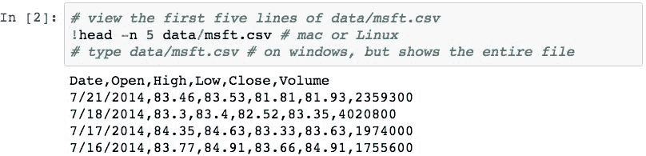

文件的第一行包含数据中表示的所有列的名称，每个列均以逗号分隔。 然后，每一行代表特定日期的值的样本。

# 将 CSV 文件读入 DataFrame

`data/MSFT.CSV`中的数据非常适合读入`DataFrame`。 它的所有数据都是完整的，并且在第一行中具有列名。 将数据读入`DataFrame`所需要做的就是使用 Pandas`pd.read_csv()`函数：

哇，那很容易！ Pandas 已经意识到，文件的第一行包含列名和从数据中批量读取到 DataFrame 的名称。

# 读取 CSV 文件时指定索引列

在前面的示例中，索引是数字的，从`0`开始，而不是按日期。 这是因为 pandas 并不假定文件中的任何特定列都应用作索引。 为了解决这种情况，您可以使用`index_col`参数，通过为它指定要用作索引的列的从零开始的位置，来指定在`read_csv()`调用中哪些列应该是索引。

以下内容读取数据，并告诉 Pandas 使用文件中`0`位置的列作为索引（`Date`列）：

# 数据类型推断和规范

检查每一列的类型表明，pandas 试图从其内容中推断出列的类型：

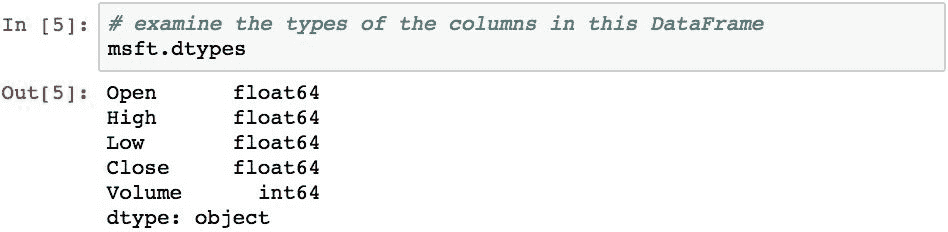

要强制使用列的类型，请使用`pd.read_csv()`的`dtypes`参数。 以下命令将`Volume`列也设置为`float64`：

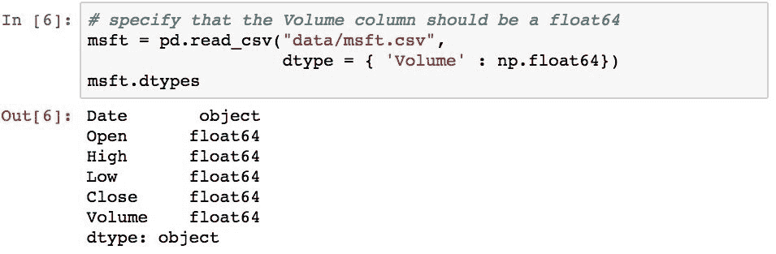

# 指定列名

也可以使用`names`参数在读取数据时指定列名称：

由于我们指定了列名，因此我们需要跳过文件中的“列名”行，该行是使用`header=0`执行的。 如果不这样做，Pandas 将假定第一行是数据的一部分，这将在以后的处理中引起一些问题。

# 指定要加载的特定列

还可以指定读取文件时要加载的列。 如果文件中有很多列，而您对分析不感兴趣，并且您希望节省读取和存储它们所需的时间和内存，这将很有用。 使用`usecols`参数指定要读取的列，可以将其传递给列名称或列偏移量列表。

为了演示，以下仅读取`Date`和`Close`列，并使用`Date`作为索引：

# 将 DataFrame 保存到 CSV 文件

可以使用`.to_csv()`方法从`DataFrame`保存 CSV 文件。 为了演示如何将数据保存到 CSV 文件，我们将带有修改后的列名的`df2`对象保存到名为`data/msft_modified.csv`的新文件中：

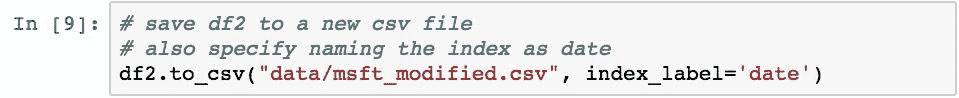

有必要告诉方法使用`index_label='date'`将索引标签保存为`date`的列名。 否则，索引不会在文件的第一行中添加名称，这将导致难以正确读取。

为了检查它是否正常工作，我们可以使用`!head`命令浏览新文件以查看其某些内容（如果在 Windows 系统上，请使用`!type`命令）：

# 使用一般的字段分隔数据

CSV 实际上是所谓的字段分隔数据的特定实现。 在以字段分隔的数据中，每行中的项目由特定符号分隔。 就 CSV 而言，它恰好是逗号。 但是，其他符号也很常见，例如| |。 （管道）符号。 使用|时 字符，该数据通常称为管道分隔数据。

Pandas 提供`pd.read_table()`功能，以方便读取字段分隔的数据。 下面的示例使用此函数通过将逗号指定为`sep`参数的值来读取`data/MSFT.CSV`文件：

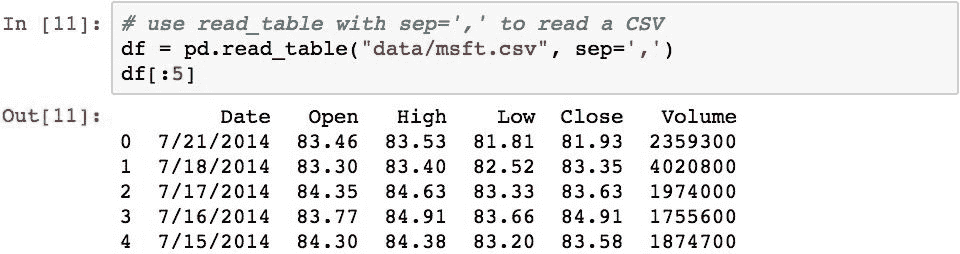

Pandas 没有提供`.to_table()`方法作为`.to_csv()`的类似写入方法。 但是，可以使用`.to_csv()`方法使用与逗号不同的分隔符来写入字段分隔的数据。 例如，以下内容将写入数据的管道分隔版本：

# 处理字段分隔数据中格式的变体

字段分隔文件中的数据可能包含无关的页眉和页脚。 示例包括顶部的公司信息，例如发票编号，地址和摘要页脚。 在某些情况下，数据每隔一行存储一次。 这些情况在加载数据时会导致错误。 为了处理这些情况，Pandas`pd.read_csv()`和`pd.read_table()`方法具有一些有用的参数来帮助我们。

为了演示，对`MSFT`库存数据进行以下变体，该数据具有多余的行，这些行可以称为噪声信息：

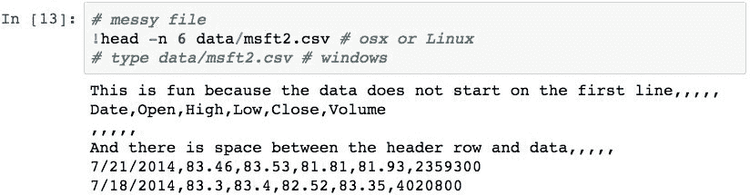

可以使用`skiprows`参数来处理这种情况，该参数通知 Pandas 跳过`0`，`2`和`3`行：

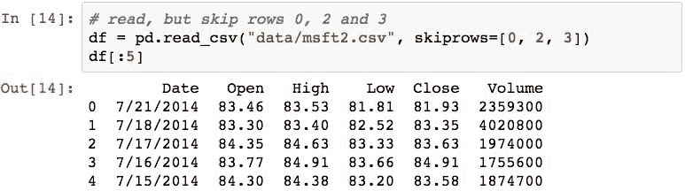

另一个常见情况是文件的内容位于文件末尾，应将其忽略以防止出错。 以以下数据为例：

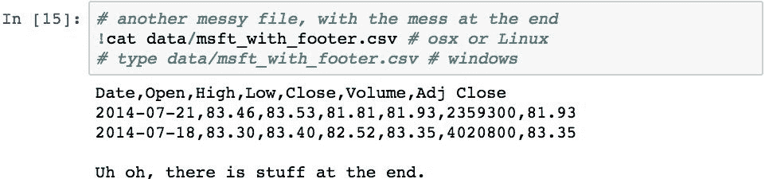

该文件将在读取过程中导致异常，但是可以使用`skip_footer`参数来处理，该参数指定要忽略文件末尾的多少行：

注意，我们必须指定`engine = 'python'`。 至少对于 Anaconda，如果没有此选项，则会给出警告，因为默认的底层 C 实现未实现此选项。 这迫使它使用 Python 实现。

假设文件很大，您只想读取前几行，因为您只希望数据位于文件的开头，而不希望将其全部读取到内存中。 可以使用`nrows`参数来处理：

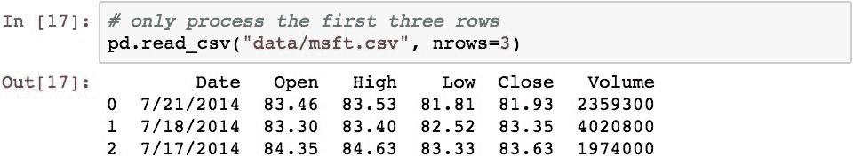

您也可以在文件的开头跳过特定数量的行，然后读取到末尾，或者一旦到达文件中的该点，您就只能读取几行。 为此，请使用`skiprows`参数。 以下示例跳过`100`行，然后读取下一个`5`：

前面的示例还跳过了标题行的读取，因此有必要通知该过程不要查找标题并使用指定的名称。

# 以 Excel 格式读写数据

Pandas 支持使用`pd.read_excel()`函数或通过`ExcelFile`类读取 Excel 2003 及更高版本的数据。 在内部，这两种技术都使用`XLRD`或`OpenPyXL`软件包，因此您需要确保其中之一已安装在 Python 环境中。

为了演示，示例数据提供了一个`data/stocks.xlsx`文件。 如果在 Excel 中打开它，您将看到与以下屏幕截图类似的内容：

该工作簿包含两张纸， msft 和 aapl ，它们分别保存了每种库存的库存数据。

然后，以下代码将`data/stocks.xlsx`文件读入`DataFrame`：

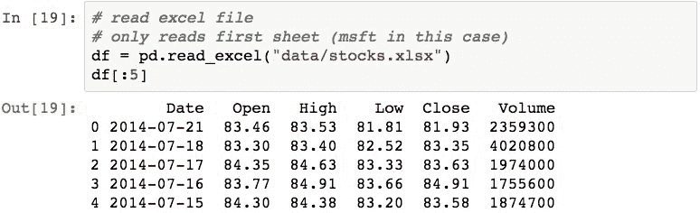

该文件仅读取 Excel 文件（ msft 工作表）中第一工作表的内容，并将第一行的内容用作列名。 要阅读其他工作表，可以使用`sheetname`参数传递工作表的名称：

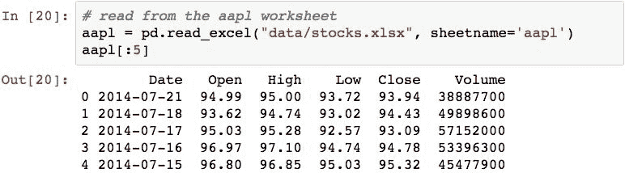

与`pd.read_csv()`一样，对列名，数据类型和索引也有许多假设。 我们为`pd.read_csv()`涵盖的所有用于指定此信息的选项，也适用于`pd.read_excel()`功能。

可以使用`DataFrame`的`.to_excel()`方法编写 Excel 文件。 写入 XLS 格式要求包含`XLWT`软件包，因此在尝试之前，请确保已将其加载到 Python 环境中。

以下将我们刚刚获取的数据写入`stocks2.xls`。 默认值是将`DataFrame`存储在`Sheet1`工作表中：

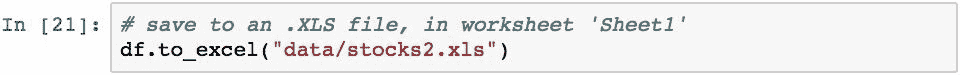

在 Excel 中打开它会显示以下内容：

您可以使用`sheet_name`参数指定工作表的名称：

在 Excel 中，我们可以看到该工作表已命名为 MSFT ：

要使用单独工作表上的每个`DataFrame`对象将多个`DataFrame`写入单个 Excel 文件，请使用`ExcelWriter`对象以及`with`关键字。 `ExcelWriter`是 Pandas 的一部分，但您需要确保将其导入，因为它不在 Pandas 的顶级命名空间中。 下面的代码将两个`DataFrame`对象写入一个 Excel 文件中的两个不同的工作表：

我们可以看到 Excel 文件中有两个工作表：

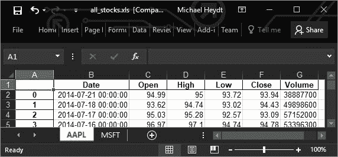

写入 XLSX 文件使用相同的功能，但将`.XLSX`指定为文件扩展名：

# 读写 JSON 文件

Pandas 可以读写以 **JavaScript 对象表示法**（**JSON**）格式存储的数据。 这是我的最爱之一，因为它具有跨平台和多种编程语言使用的能力。

为了演示如何保存为 JSON，我们将首先将刚刚读取的 Excel 数据保存到 JSON 文件中，然后检查其内容：

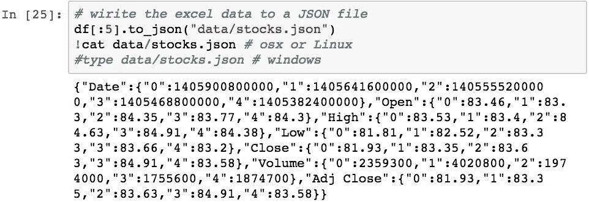

可以使用`pd.read_json()`函数读取基于 JSON 的数据：

请注意此处的两个细微差异，这是由于从 JSON 读取/写入数据引起的。 首先，这些列已按字母顺序重新排序。 其次，`DataFrame`的索引尽管包含内容，但仍按字符串排序。 这些问题很容易解决，但为简洁起见，此处不再赘述。

# 从网络读取 HTML 数据

Pandas 支持从 HTML 文件（或 URL 的 HTML）读取数据。 在封面的下方，Pandas 使用`LXML`，`Html5Lib`和`BeautifulSoup4`软件包。 这些软件包提供了一些令人印象深刻的读取和写入 HTML 表的功能。

您的 Anaconda 默认安装可能不包括这些软件包。 如果使用此功能遇到错误，请使用 Anaconda Navigator 根据错误安装适当的库：

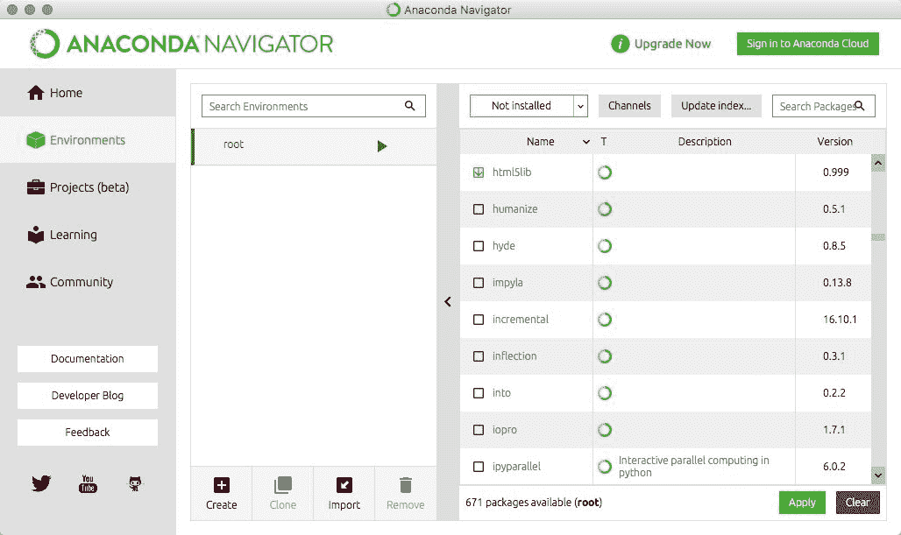

另外，您可以使用`pip`：

`pd.read_html()`函数将从文件（或 URL）读取 HTML，并将内容中找到的所有 HTML 表解析为一个或多个 Pandas`DataFrame`对象。 该函数始终返回`DataFrame`对象的列表（实际上，为零或更多，取决于在 HTML 中找到的表的数量）。

为了演示，我们将从 [FDIC 失败银行列表](https://www.fdic.gov/bank/individual/failed/banklist.html)中读取表数据。 查看页面，您会看到有很多失败银行的列表。

实际上，使用 Pandas 及其`pd.read_html()`函数可以很容易地读取这些数据：

 

再次，那几乎太容易了！

可以使用`.to_html()`方法将`DataFrame`写入 HTML 文件。 此方法创建一个仅包含数据的`<table>`标签（而不是整个 HTML 文档）的文件。 以下内容将我们之前阅读的库存数据写入 HTML 文件：

在浏览器中查看此结果类似于以下屏幕快照所示：

这很有用，因为您可以使用 Pandas 编写要包含在网站中的 HTML 片段，并在需要时对其进行更新，从而使新数据静态地可供网站使用，而不必通过更复杂的数据查询或服务调用。

# 读写 HDF5 格式文件

HDF5 是用于存储和管理数据的数据模型，库和文件格式。 它通常用于科学计算环境。 它支持无限多种数据类型，专为灵活高效的 I / O 以及大容量和复杂数据而设计。

HDF5 具有可移植性和可扩展性，从而允许应用程序在使用 HDF5 时不断发展。 HDF5 技术套件包括用于管理，操纵，查看和分析 HDF5 格式数据的工具和应用程序。 HDF5 是：

*   通用的数据模型，可以表示非常复杂的数据对象和各种元数据
*   完全可移植的文件格式，对集合中数据对象的数量或大小没有限制
*   一个软件库，可在从笔记本到大规模并行系统的各种计算平台上运行，并使用 C，C ++，Fortran 90 和 Java 接口实现高级 API
*   丰富的集成性能功能集，可优化访问时间和存储空间
*   用于管理，操纵，查看和分析集合中数据的工具和应用程序

`HDFStore`是类似于字典的分层对象，可将 Pandas 对象读取和写入 HDF5 格式。 在幕后，`HDFStore`使用`PyTables`库，因此，如果要使用此格式，请确保已安装该库。

以下演示将`DataFrame`写入 HDF5 格式。 输出显示 HDF5 存储有一个名为`df`的根级对象，该对象是`DataFrame`，其形状是八行三列：

以下内容读取 HDF5 存储并检索`DataFrame`：

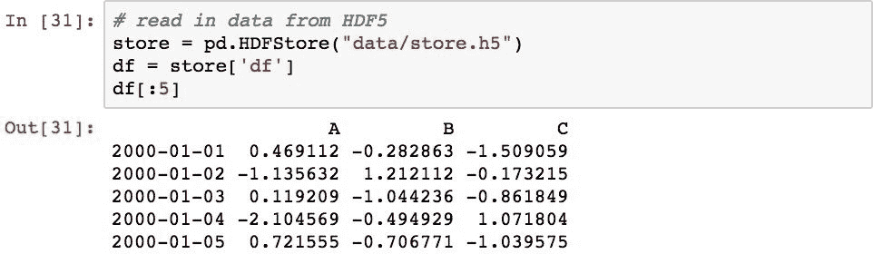

`DataFrame`在分配给存储对象的点写入 HDF5 文件。 此后对`DataFrame`所做的更改将不会保留，至少要等到该对象再次分配给数据存储对象后才能保留。 下面通过更改`DataFrame`，然后将其重新分配给 HDF5 存储，从而更新数据存储来演示此操作：

# 在网络上访问 CSV 数据

从网络和互联网读取数据非常普遍。 Pandas 使从网络读取数据变得容易。 还可以为我们检查的所有 Pandas 函数提供一个 HTTP URL，FTP 地址或 S3 地址，而不是本地文件路径，并且它们的全部功能与处理本地文件的方式相同。

以下内容演示了使用现有的`pd.read_csv()`函数直接发出 HTTP 请求是多么容易。 以下内容通过其 HTTP 查询字符串模型直接从 Google 财经网络服务检索 Microsoft 在 2017 年 4 月的每日股票数据：

# 从 SQL 数据库读写

Pandas 可以从任何支持遵守 Python DB-API 的 Python 数据适配器的 SQL 数据库读取数据。 使用`pandas.io.sql.read_sql()`函数执行读取，并使用`DataFrame`的`.to_sql()`方法完成对 SQL 数据库的写入。

为了演示，以下内容从`msft.csv`和`aapl.csv`中读取库存数据。 然后，它与 SQLite3 数据库文件建立连接。 如果该文件不存在，则会动态创建。 然后将`MSFT`数据写入名为`STOCK_DATA`的表中。 如果该表不存在，那么也会创建它。 如果确实存在，则将所有数据替换为`MSFT`数据。 最后，然后将`AAPL`库存数据附加到该表：

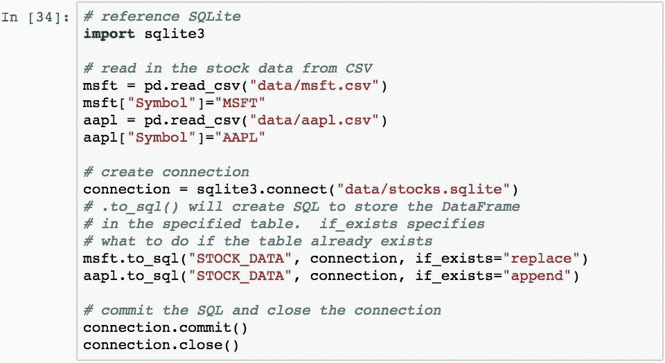

为了证明已创建此数据，可以使用诸如 [SQLite 数据浏览器](https://github.com/sqlitebrowser/sqlitebrowser)之类的工具打开数据库文件。 以下屏幕截图显示了数据库文件中的几行数据：

可以使用 SQL 使用`pd.io.sql.read_sql()`函数从数据库中读取数据。 以下内容演示了如何使用 SQL 查询`stocks.sqlite`中的数据并将其报告给用户：

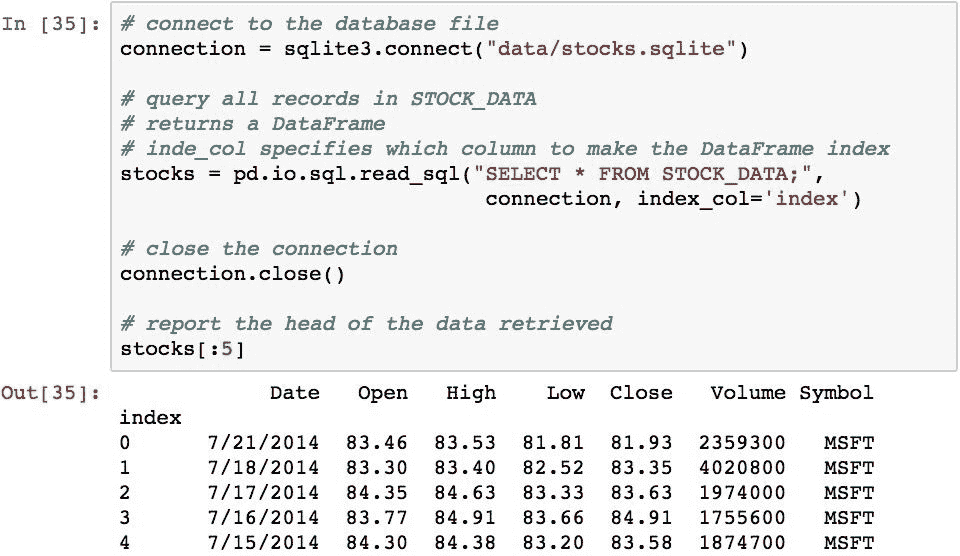

也可以在 SQL 中使用`WHERE`子句以及选择列。 为了演示，以下选择 MSFT 的容量大于`29200100`的记录：

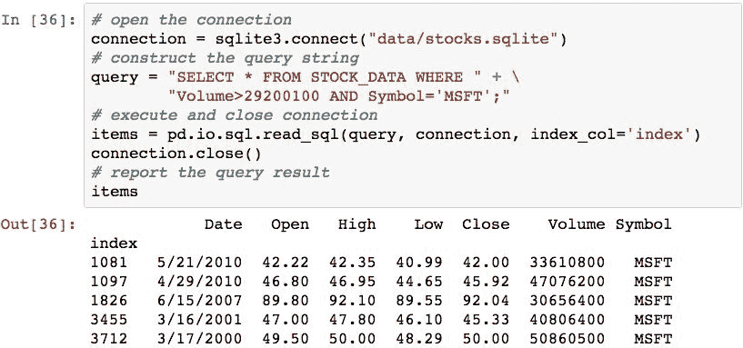

最后一点是，这些示例中的大多数代码是 SQLite3 代码。 这些示例中唯一的 Pandas 部分是`.to_sql()`和`.read_sql()`方法的使用，因为这些函数采用一个连接对象，该对象可以是任何与 Python DB-API 兼容的数据适配器，您可以或多或少地使用任何 只需创建适当的连接对象即可支持数据库数据。 对于任何受支持的数据库，Pandas 级别的代码应保持相同。

# 从远程数据服务读取数据

0.19.0 之前的 Pandas 在`pandas.io.data`名称空间中直接支持各种基于 Web 的数据源类。 这已经发生了变化，因为功能已从 Pandas 中重构出来并放入`pandas-datareader`包中。

该软件包提供对许多有用数据源的访问，包括：

*   Yahoo!的每日历史股价 或 Google 财经
*   雅虎！ 和 Google 选项
*   Enigma，结构化数据的提供者
*   美联储经济数据库
*   肯尼斯·法文的数据库
*   世界银行
*   经合组织
*   欧盟统计局
*   EDGAR 指数
*   TSP 基金数据
*   奥安达货币历史汇率
*   纳斯达克交易者代码定义

请注意，由于这些数据来自外部数据源，并且实际值会随时间变化，因此，当您运行代码时，可能会获得与本书中不同的值。

# 从 Yahoo!中读取库存数据！ 和 Google 财经

首先，我要说的很遗憾，雅虎！ 已更改了他们的 API，目前这破坏了`pandas-datareader`中的实现。 不知道这是否会解决。 因此，这些示例将仅使用 Google 财经。

要使用`pandas-datereader`包，我们使用以下导入：

然后，可以使用`DataReader`函数来反对来自 G​​oogle 财经的股票数据，方法是向其传递股票代码，数据源（在本例中为`'google'`）以及开始日期和结束日期：

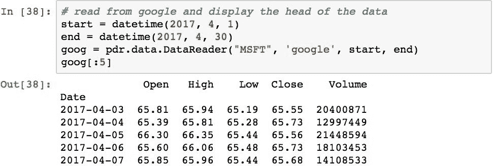

# 从 Google 财经中检索期权数据

Pandas 提供实验支持，可通过`Options`类检索 Google 财经期权数据。 在以下示例中，`.get_all_data()`方法用于从 Google 下载`AAPL`的选项数据：

使用此结果，可以通过使用`.expiry_dates`属性来确定到期日期：

使用`.get_options_data()`读取实际数据：

生成的`DataFrame`对象包含一个层次结构索引，可用于轻松提取数据的特定子集。 为了演示，让我们研究几个使用索引对值进行切片的示例。

以下将以`Strike`价格为$ 30 返回所有`put`选项。 使用`slice(None)`作为用于按索引选择的元组中的值之一，将包含所有`Expiry`日期：

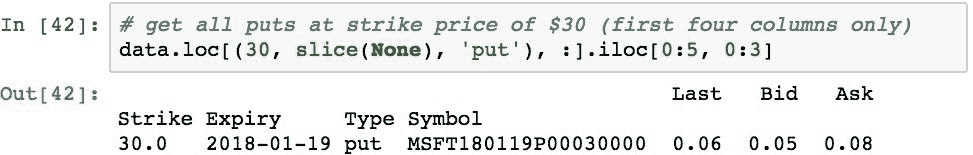

我们可以通过指定日期切片而不是`slice(None)`来缩小日期范围。 以下将结果缩小到`Expiry`日期在`2015-01-17`和`2015-04-17`之间的日期：

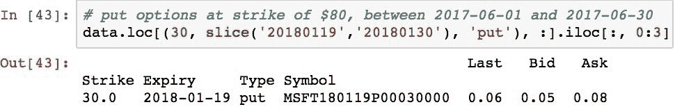

# 从圣路易斯联邦储备银行读取经济数据

圣路易斯的[**美联储经济数据**（**FRED**）](http://research.stlouisfed.org/fred2/)可从超过 76 个数据源中下载超过 240,000 个美国和国际时间序列，并且它还在不断增长。

可以通过使用`FredReader`类并通过将特定系列标签作为`name`参数来指定 FRED 数据。 例如，以下内容检索两个指定日期之间的 GDP 信息：

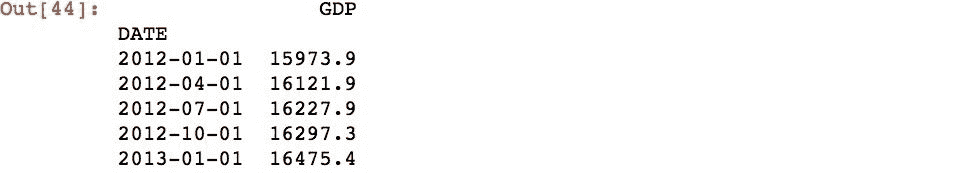

要选择另一个系列，只需在第一个参数中指定系列标识符。 可以方便地在网站上浏览系列和直接在网站上可视化的数据。 例如，以下屏幕截图显示了“雇员补偿”序列：工资和薪金：

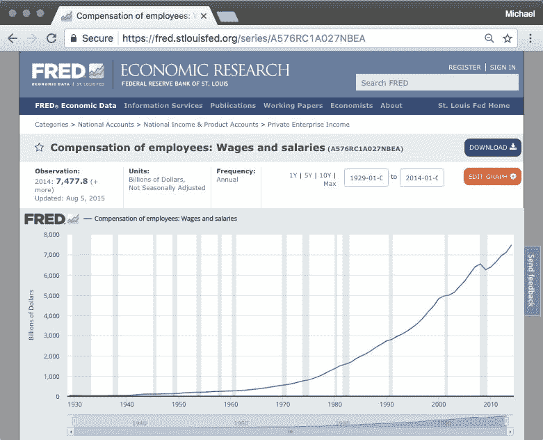

该数据系列由`A576RC1A027NBEA` ID 表示，我们可以使用以下代码下载它：

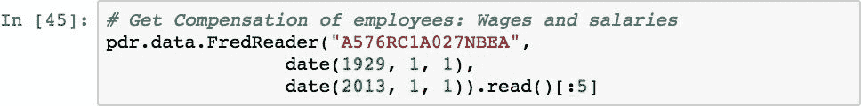 

# 访问肯尼斯·法文的数据

Kenneth R. French 是达特茅斯大学塔克商学院金融学教授。 他创建了一个广泛的经济数据库，可通过 Web 下载。 [其数据的网站](http://mba.tuck.dartmouth.edu/pages/faculty/ken.french/data_library.html)包含数据集。

该站点上可用的数据可通过 ZIP 文件下载，并且可以通过指定数据集的文件名（不带`.zip`）并使用`FameFrenchReader`函数直接读取到 DataFrame 中。 例如，以下内容读取全局因子数据：

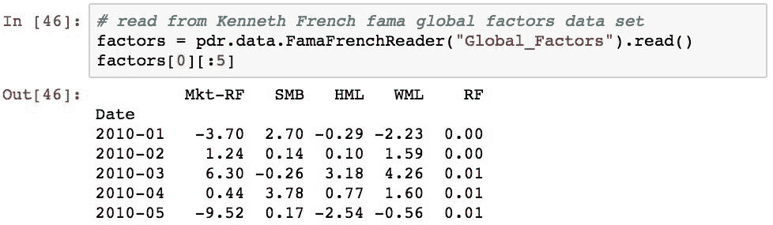

# 从世界银行读

世界银行有成千上万的数据提要，可以直接将其读入 Pandas`DataFrame`对象中。 可以在 [`http://www.worldbank.org/`](http://www.worldbank.org/) 浏览世界银行数据目录。

世界银行的数据集使用指示符进行标识，指示符是代表每个数据集的文本代码。 可以使用`pandas.io.wb.get_indicators()`功能检索指标的完整列表。 在撰写本文时，共有 16,167 个指标。 以下内容检索指标并显示前五个指标：

可以使用世界银行的网站对这些指标进行调查，但是，如果您想了解要采样的指标，则只需进行搜索即可。 例如，以下使用`wb.search()`功能来搜索具有与预期寿命相关的数据的指标：

每个指标均分为不同的国家。 可以使用`wb.get_countries()`功能检索国家/地区数据的完整列表：

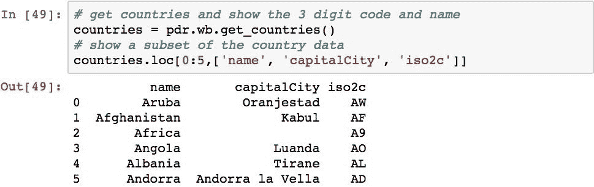

可以使用`wb.download()`功能并使用`indicator`参数指定数据集来下载指标数据。 以下是从`1980`到`2014`下载国家的预期寿命数据：

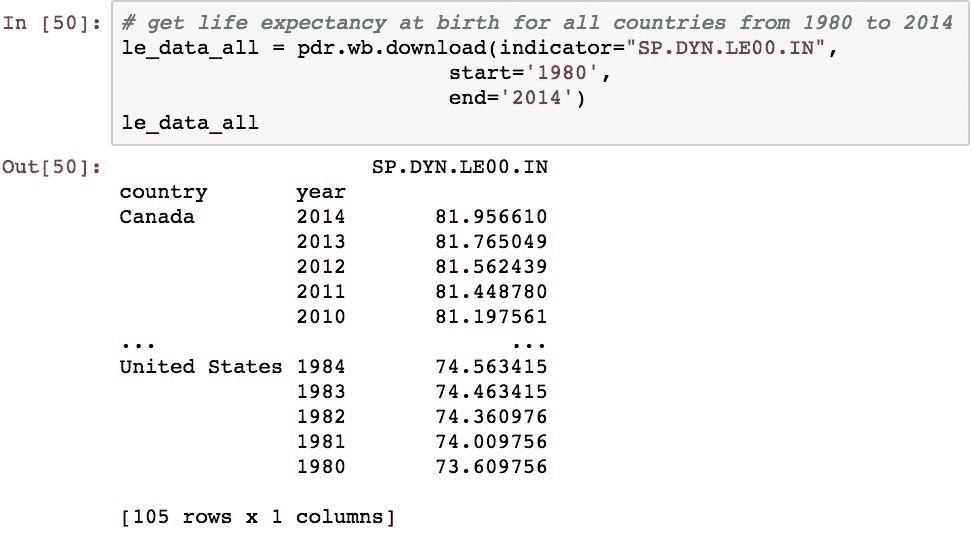

默认情况下，仅返回美国，加拿大和墨西哥的数据。 通过检查上一个查询的结果索引可以看出这一点：

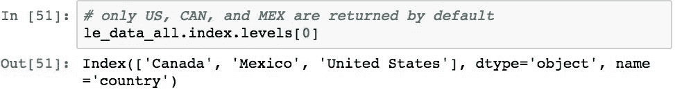

要获取更多国家的数据，请使用 country 参数明确指定它们。 以下获取所有已知国家/地区的数据：

 

我们可以用这些数据做一些有趣的事情。 我们将看的示例确定哪个国家的预期寿命最低。 为此，我们首先需要对数据进行透视处理，以使索引为国家名称，而年份为列。 我们将在后面的章节中更详细地介绍数据透视，但是目前，仅知道以下内容将数据沿索引和跨列的年份重新组织到了国家/地区中。 同样，每个值都是每个国家在特定年份的预期寿命：

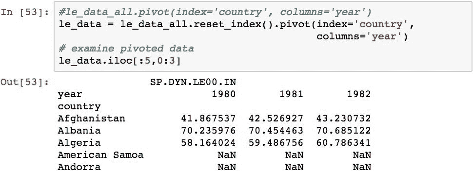

使用这种格式的数据，我们可以使用`.idxmin(axis=0)`确定哪个国家的预期寿命最低：

每年的实际最小值可以使用`.min(axis=0)`检索：

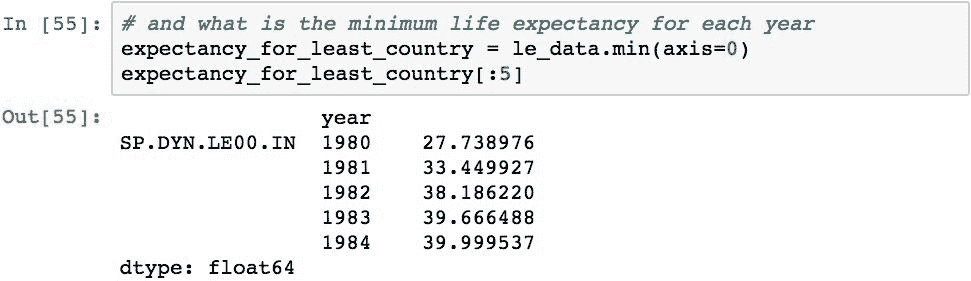

然后，可以将这两个结果合并为一个新的`DataFrame`，该值告诉我们哪个国家/地区的预期寿命最短，其值是多少：

# 摘要

在本章中，我们研究了 Pandas 如何使访问各种位置和格式的数据变得简单，如何将这些格式的数据自动映射到 DataFrame 对象。 我们从学习如何从 CSV，HTML，JSON，HDF5 和 Excel 格式的本地文件中读取和写入数据开始，直接读取和写入 DataFrame 对象，而不必担心将包含的数据映射到这些各种数据中的细节。 格式。

然后，我们研究了如何从远程源访问数据。 首先，我们看到与本地文件配合使用的功能和方法也可以从 Web 和云数据源中读取。 然后，我们研究了 Pandas 对访问各种形式的基于 Web 和基于 Web 服务的数据的支持，例如 Yahoo!。 金融和世界银行。

既然我们已经能够加载数据，那么使用它的下一步就是执行数据的清理，因为通常情况下，检索到的数据存在诸如信息丢失和内容格式错误的问题。 下一章将集中在整理数据的过程中，这些问题通常称为**。**