# 和熊猫一起跑步

在本章中，我们将介绍如何安装熊猫并开始使用其基本功能。 本书的内容以 IPython 和 Jupyter 笔记本的形式提供，因此，我们还将快速使用这两种工具。

本书将利用 Continuum 的 Anaconda 科学 Python 发行版。 Anaconda 是流行的 Python 发行版，其中包含免费和付费组件。 Anaconda 提供了跨平台支持，包括 Windows，Mac 和 Linux。 Anaconda 的基本发行版安装了熊猫，IPython 和 Jupyter Notebook，因此入门非常简单。

本章将涵盖以下主题：

*   安装 Anaconda，Pandas 和 IPython / Jupyter Notebook
*   使用 IPython 和 Jupyter Notebook
*   Jupyter 及其笔记本
*   设置您的熊猫环境
*   熊猫`Series`和`DataFrame`快速入门
*   从 CSV 文件加载数据
*   生成可视化的熊猫数据

# Anaconda 的安装

本书将使用 Anaconda Python 版本 3，特别是 3.6.1。 在撰写本文时，熊猫的版本为 0.20.2。 默认情况下，Anaconda 安装程序将安装 Python，IPython，Jupyter Notebook 和 pandas。

可以从 Continuum Analytics 网站上的 [http://continuum.io/downloads](http://continuum.io/downloads) 下载 Anaconda Python。 Web 服务器将识别您的浏览器的操作系统，并为您提供该平台的相应软件下载文件。

在浏览器中打开此 URL 时，将看到一个类似于以下内容的页面：


单击适合您平台的安装程序的链接。 这将为您提供类似于以下内容的下载页面：


下载 3.x 安装程序。 本书将使用的当前版本的 Anaconda 是 4.3.1，带有 Python 3.6.1：


这种情况经常发生变化，到您阅读本文时，它可能已经发生变化。

执行适合您平台的安装程序，完成后，打开命令行或终端并执行`python`命令。 您应该看到类似于以下内容（在 Mac 上是这样）：

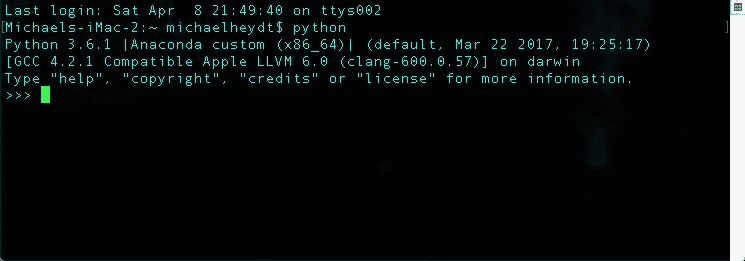

您可以通过发出`exit()`语句退出 Python 解释器：

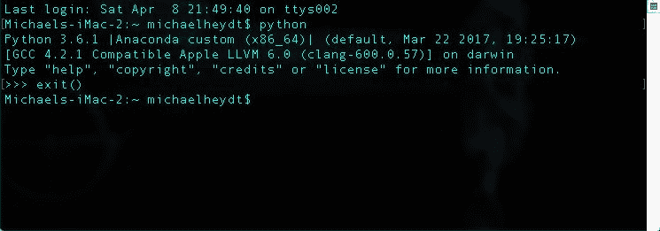

在终端或命令行中，您可以使用`pip show pandas`命令验证熊猫的安装版本：

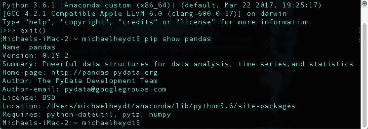

已安装的当前版本被验证为 0.20.2。 请确保您使用的是 0.20.2 或更高版本，因为将使用此版本特定于熊猫的更改。

现在，我们已经安装了所需的一切，让我们继续使用 IPython 和 Jupyter Notebook。

# IPython 和 Jupyter 笔记本

到目前为止，我们已经从命令行或终端执行了 Python。 这是 Python 随附的默认 **Read-Eval-Print-Loop** （ **REPL** ）。 这可以用来运行本书中的所有示例，但是本书将使用 IPython 编写文本和代码包 Jupyter Notebook 中的语句。 让我们简要地看一下两者。

# IPython 的

IPython 是用于与 Python 交互工作的备用 Shell。 它对 Python 提供的默认 REPL 进行了一些增强。

如果您想更详细地了解 IPython，请查看 [https://ipython.org/ipython-doc/3/interactive/tutorial.html](https://ipython.org/ipython-doc/3/interactive/tutorial.html) 中的文档

要启动 IPython，只需从命令行/终端执行`ipython`命令。 启动时，您将看到类似以下内容：

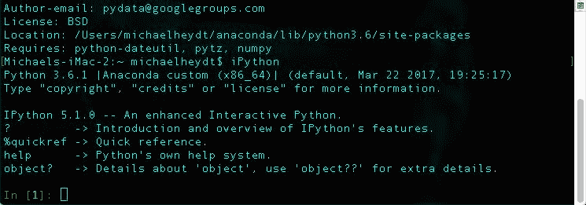

输入提示显示`In [1]:`。 每次在 IPython REPL 中输入一条语句时，提示中的数字都会增加。

同样，您输入的任何特定条目的输出都将以`Out [x]:`开头，其中`x`与相应的`In [x]:`的编号匹配。 以下屏幕截图演示了这一点：


in 和 out 语句的编号对于示例很重要，因为所有示例都将以`In [x]:`和`Out [x]:`开头，以便您可以继续学习。

请注意，这些数字纯粹是连续的。 如果您遵循文本中的代码，并且输入中发生错误，或者输入其他语句，则编号可能会不正确（可以通过退出并重新启动 IPython 来重新设置编号）。 请纯粹将它们用作参考。

# Jupyter 笔记本

Jupyter Notebook 是 IPython Notebook 的演变。 它是一个开源 Web 应用程序，使您可以创建和共享包含实时代码，方程式，可视化和减价的文档。

最初的 IPython Notebook 仅限于 Python。 Jupyter Notebook 已发展为允许使用多种编程语言，包括 Python，R，Julia，Scala 和 F＃。

如果您想更深入地了解 Jupyter Notebook，请访问 [http://jupyter.org/](http://jupyter.org/) ，在该页面上将显示类似于以下内容的页面：

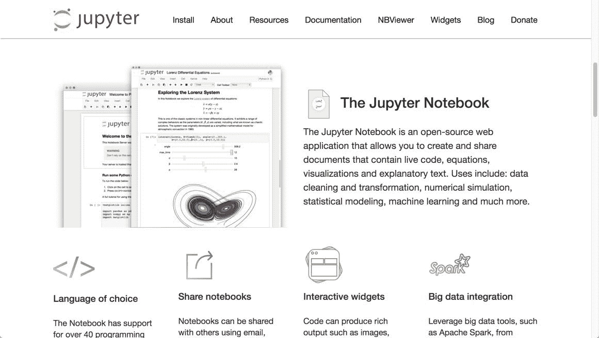

Jupyter Notebook 可以独立于 Python 下载和使用。 Anaconda 默认安装。 要启动 Jupyter Notebook，请在命令行或终端上发出以下命令：

```py
$ jupyter notebook

```

为了演示，让我们看一下如何运行文本附带的示例代码。 从 Packt 网站下载代码，然后将文件解压缩到您选择的目录中。 在目录中，您将看到类似于以下内容的以下内容：

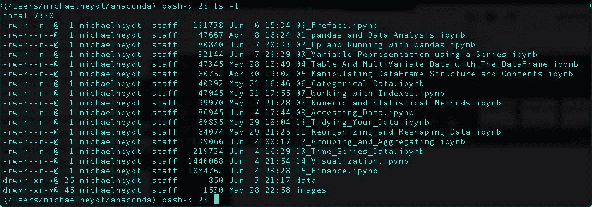

现在发出`jupyter notebook`命令。 您应该看到类似于以下内容：

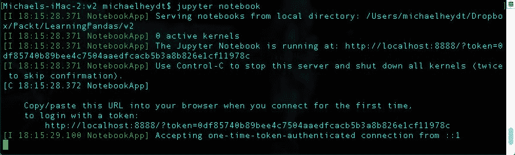

将打开一个浏览器页面，显示 Jupyter Notebook 主页，即`http://localhost:8888/tree`。 这将打开一个显示该页面的 Web 浏览器窗口，该窗口将是类似于以下内容的目录列表：


单击`.ipynb`链接可打开笔记本页面。 如果打开本章的笔记本，您将看到类似于以下内容：


显示的笔记本是 Jupyter 和 IPython 生成的 HTML。 它由许多单元格组成，可以是四种类型之一：代码，降价，原始 nbconvert 或标题。 本书中的所有示例均使用代码或减价单元。

Jupyter 为每个笔记本运行一个 IPython 内核。 包含 Python 代码的单元在该内核中执行，结果作为 HTML 添加到笔记本中。

双击任何单元格将使该单元格可编辑。 编辑完单元格的内容后，按 *Shift + Enter* ，此时 Jupyter / IPython 将评估内容并显示结果。

如果您想进一步了解构成页面基础的笔记本格式，请参阅 [https://ipython.org/ipython-doc/3/notebook/nbformat.html](https://ipython.org/ipython-doc/3/notebook/nbformat.html) 。

笔记本顶部的工具栏为您提供了许多操作笔记本的功能。 其中包括在笔记本中上下移动，增加和删除单元格。 还提供用于运行单元，重新运行单元以及重新启动基础 IPython 内核的命令。

要创建一个新笔记本，请转到 新笔记本 Python 3 ：

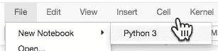

将在新的浏览器选项卡中创建一个新的笔记本页面。 其名称将为无标题：


笔记本包含一个准备好输入 Python 的代码单元。 在单元格中输入 1 + 1 并按 *Shift* + *输入*执行。

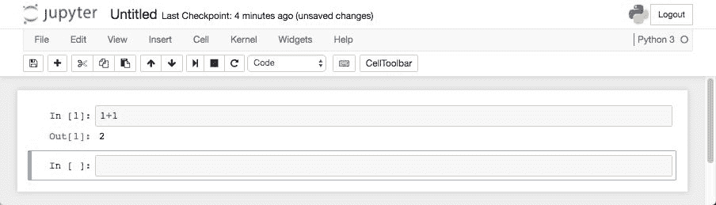

该单元已执行，结果显示为`Out [1]:`。 Jupyter 还打开了一个新单元，供您输入更多代码或减价。

Jupyter Notebook 会每分钟自动保存您的更改，但是偶尔一次手动保存仍然是一件好事。

# 熊猫系列和 DataFrame 简介

让我们开始使用一些熊猫，并简要介绍一下熊猫的两个主要数据结构`Series`和`DataFrame`。 我们将检查以下内容：

*   将熊猫导入您的应用程序
*   创建和操纵大熊猫`Series`
*   创建和操纵大熊猫`DataFrame`
*   将数据从文件加载到`DataFrame`

# 进口大熊猫

我们将使用的每个笔记本都首先导入熊猫和其他几个有用的 Python 库。 它还将设置几个选项来控制熊猫如何在 Jupyter Notebook 中渲染输出。 该代码包含以下内容：


第一条语句导入 NumPy 并将库中的项目引用为`np.`。 在本书中，我们不会对 NumPy 进行详细介绍，但有时需要使用。

第二次导入使熊猫可用于笔记本。 我们将使用`pd.`前缀引用库中的项目。 `from pandas import Series, DataFrame`语句将`Series`和`DataFrame`对象显式导入到全局名称空间中。 这使我们可以在没有`pd`的情况下引用`Series`和`DataFrame`。 字首。 这很方便，因为我们会经常使用它们，这样可以节省很多键入时间。

`import datetime`语句引入了`datetime`库，该库通常在熊猫中用于时间序列数据。 它将包括在每个笔记本的进口中。

`pd.set_option()`函数调用设置选项，这些选项通知笔记本如何显示熊猫的输出。 第一个告诉状态将`Series`和`DataFrame`输出呈现为文本而不是 HTML。 接下来的两行指定要输出的最大列数和行数。 final 选项设置每行中输出的最大字符数。

您可以在以下 URL 中检查更多选项： [http://pandas.pydata.org/pandas-docs/stable/options.html](http://pandas.pydata.org/pandas-docs/stable/options.html) 。

敏锐的眼睛可能会注意到此单元格没有`Out [x]:`。 并非所有单元（或 IPython 语句）都会生成输出。

如果您希望使用 IPython 代替 Jupyter Notebook 进行后续操作，则还可以在 IPython Shell 中执行此代码。 例如，您可以简单地从笔记本单元中剪切并粘贴代码。 这样做可能如下所示：


IPython shell 足够聪明，可以知道您要插入多行并且会适当缩进。 并且请注意，在 IPython shell 中也没有`Out [x]:`。 `pd.set_option`不返回任何内容，因此没有注释。

# 熊猫系列

熊猫`Series`是熊猫的基本数据结构。 系列与 NumPy 数组相似，但是它的不同之处在于具有索引，该索引允许对项目进行更丰富的查找，而不仅仅是从零开始的数组索引值。

以下从 Python 列表创建一个系列。：


输出包括两列信息。 第一个是索引，第二个是`Series`中的数据。 输出的每一行代表索引**标签**（在第一列中），然后代表与该标签关联的值。

由于创建此`Series`时未指定索引（接下来将要执行的操作），因此 pandas 自动创建一个整数索引，该索引的标签从 0 开始，对于每个数据项加 1。

然后，可以使用`[]`运算符访问`Series`对象的值，并传递所需值的标签。 以下内容获取标签`1`的值：

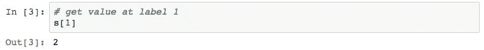

这看起来很像许多编程语言中的常规数组访问。 但是，正如我们将看到的那样，索引不必从 0 开始，也不必递增 1，并且可以是许多数据类型，而不仅仅是整数。 以这种方式关联灵活索引的能力是熊猫的巨大超级能力之一。

通过在 Python 列表中指定它们的标签，可以检索多个项目。 以下内容检索标签`1`和`3`上的值：

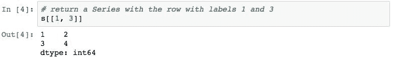

通过使用`index`参数并指定索引标签，可以使用用户定义的索引创建`Series`对象。 下面的代码创建一个`Series`，其值相同，但索引由字符串值组成：


现在，那些字母数字索引标签可以访问`Series`对象中的数据。 以下内容检索索引标签`'a'`和`'d'`上的值：

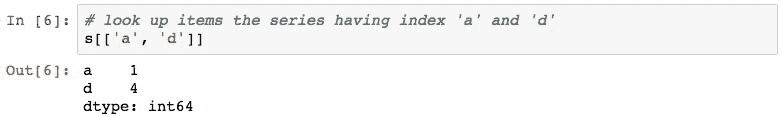

仍然可以通过基于[0]的数字位置引用此`Series`对象的元素。 ：


我们可以使用`.index`属性检查`Series`的索引：


索引实际上是一个熊猫对象，此输出向我们显示了索引的值和用于索引的数据类型。 在这种情况下，请注意索引中的数据类型（称为`dtype`）是对象而不是字符串。 我们将在本书的后面部分研究如何更改此设置。

`Series`在熊猫中的常见用法是表示将日期/时间索引标签与值相关联的时间序列。 下面通过使用`pd.date_range()` pandas 函数创建日期范围来说明这一点：

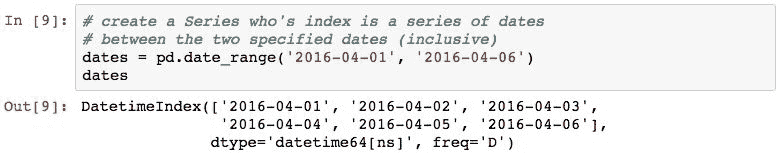

这在熊猫中创建了一个称为`DatetimeIndex`的特殊索引，这是一种特殊的熊猫索引，经过优化可对带有日期和时间的数据进行索引。

现在，让我们使用该索引创建一个`Series`。 数据值表示特定日期的高温：

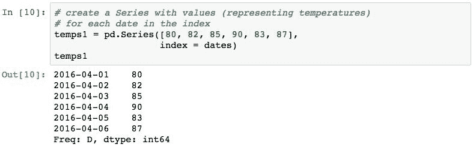

这种带有`DateTimeIndex`的系列称为时间序列。

我们可以使用日期作为字符串来查询特定数据的温度：

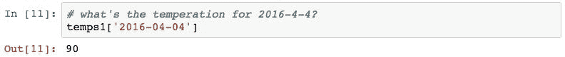

两个`Series`对象可以通过算术运算相互应用。 以下代码创建第二个`Series`并计算两者之间的温度差：


对两个非标量值的`Series`对象进行算术运算（+，-，/，*，...）的结果将返回另一个`Series`对象。

由于索引不是整数，因此我们还可以通过从 0 开始的值来查找值：


最后，熊猫提供了许多描述性的统计方法。 例如，以下内容返回温度差的平均值：

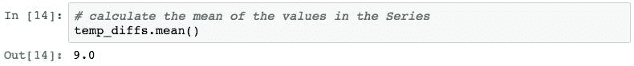

# 熊猫 DataFrame

熊猫`Series`只能与每个索引标签关联一个值。 要使每个索引标签具有多个值，我们可以使用一个数据框。 一个数据帧代表一个或多个按索引标签对齐的`Series`对象。 每个系列将是数据框中的一列，并且每个列都可以具有关联的名称。

从某种意义上讲，数据帧类似于关系数据库表，因为它包含一个或多个异构类型的数据列（但对于每个相应列中的所有项目而言都是单一类型）。

以下创建带有两列的`DataFrame`对象，并使用温度`Series`对象：


产生的数据帧有两列，分别为`Missoula`和`Philadelphia`。 这些列是数据帧中包含的新`Series`对象，具有从原始`Series`对象复制的值。

可以使用带有列名或列名列表的数组索引器`[]`访问`DataFrame`对象中的列。 以下代码检索`Missoula`列：

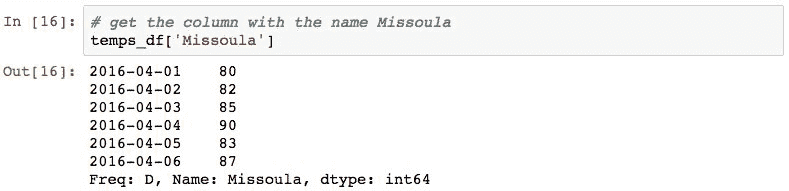

下面的代码检索`Philadelphia`列：


列名称的 Python 列表也可以用于返回多个列：


与`Series`对象相比，`DataFrame`对象存在细微的差异。 将列表传递给`DataFrame`的`[]`运算符将检索指定的列，而`Series`将返回行。

如果列名没有空格，则可以使用属性样式进行访问：

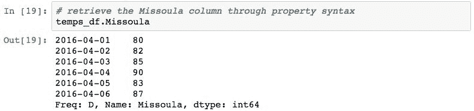

数据帧中各列之间的算术运算与多个`Series`上的算术运算相同。 为了演示，以下代码使用属性表示法计算温度之间的差异：


只需通过使用数组索引器`[]`表示法将另一`Series`分配给一列即可将新列添加到`DataFrame`。 以下内容在`DataFrame`中添加了带有温度差的新列：


可通过`.columns`属性访问`DataFrame`中的列名：

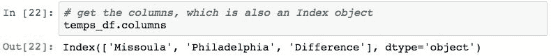

可以切片`DataFrame`和`Series`对象以检索特定的行。 以下是第二到第四行温度差值的切片：

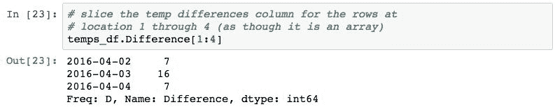

可以使用`.loc`和`.iloc`属性检索数据框的整个行。 `.loc`确保按索引标签查找，其中`.iloc`使用从 0 开始的位置。 --

以下内容检索数据帧的第二行：

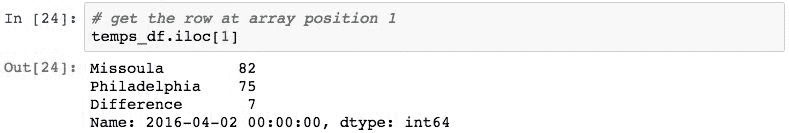

请注意，此结果已将行转换为`Series`，数据帧的列名称已透视到结果`Series`的索引标签中。 下面显示了结果的结果索引：


可以使用`.loc`属性通过索引标签显式访问行。 以下代码通过索引标签检索一行：


可以使用整数位置列表选择`DataFrame`对象中的特定行。 以下从`Difference`列的整数位置`1`，`3`和`5`的行中选择值：

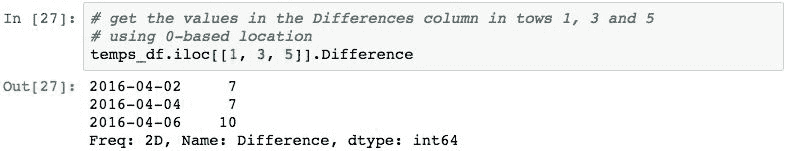

可以基于应用于每行中数据的逻辑表达式来选择数据帧的行。 以下显示`Missoula`列中大于`82`度的值：

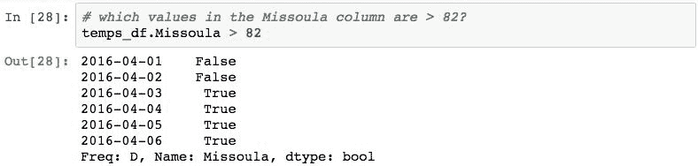

然后可以将表达式的结果应用于数据框（和系列）的`[]`运算符，这仅导致返回评估为`True`的表达式的行：

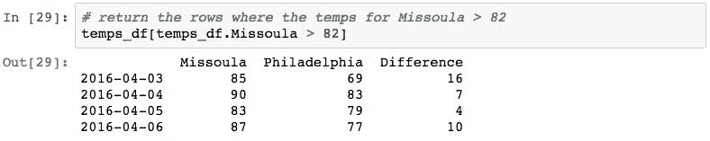

该技术在 pandas 术语中称为**布尔选择**，它将构成基于特定列中的值选择行的基础（例如在 SQL 中使用`WHERE`子句的查询-但我们将看到它 更强大）。

# 将文件中的数据加载到 DataFrame 中

熊猫库提供了方便地从各种数据源中检索数据作为熊猫对象的工具。 作为一个简单的例子，让我们研究一下熊猫以 CSV 格式加载数据的能力。

本示例将使用随本书的代码`data/goog.csv`提供的文件，该文件的内容表示 Google 股票的时间序列财务信息。

以下语句使用操作系统（从 Jupyter Notebook 或 IPython 内部）显示此文件的内容。 您将需要使用哪个命令取决于您的操作系统：

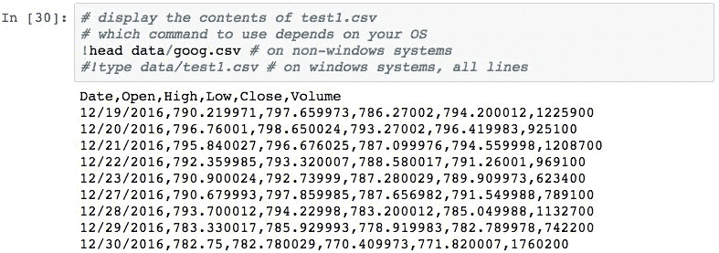

可以使用`pd.read_csv()`功能将这些信息轻松导入`DataFrame`：


pandas 不知道文件中的第一列是日期，并且已将 date 字段的内容视为字符串。 可以使用以下 pandas 语句对此进行验证，该语句以字符串形式显示`Date`列的类型：

  

`the pd.read_csv()`功能的`parse_dates`参数可指导熊猫如何将数据直接转换为熊猫日期对象。 以下通知熊猫将`Date`列的内容转换为实际的`TimeStamp`对象：


如果我们检查它是否有效，我们会看到日期为`Timestamp`：


不幸的是，这没有使用日期字段作为数据框的索引。 而是使用默认的从零开始的整数索引标签：


请注意，这现在是`RangeIndex`，在以前的熊猫版本中，它应该是整数索引。 我们将在本书的后面部分探讨这种差异。

可以使用`pd.read_csv()`函数的`index_col`参数将其固定，以指定应将文件中的哪一列用作索引：


现在索引是`DateTimeIndex`，它使我们可以使用日期查找行。


# 可视化

我们将在第 14 章*可视化* 中深入研究可视化，但是在此之前，我们偶尔会对熊猫中的数据进行快速可视化。 使用熊猫创建数据可视化非常简单。 所有需要做的就是调用`.plot()`方法。 下面通过绘制股票数据的“关闭”值进行演示：


# 摘要

在本章中，我们安装了 Python 的 Anaconda Scientific 版本。 这还将安装 pandas 和 Jupyter Notebook，为您设置执行数据处理和分析的环境，并创建用于可视化，呈现和共享分析的笔记本。

我们还对熊猫`Series`和`DataFrame`对象进行了介绍，展示了一些基本功能。 该博览会向您展示了如何执行一些基本操作，以便在深入学习所有细节之前可以用来启动和运行熊猫。

在接下来的几章中，我们将深入研究`Series`和`DataFrame`的操作，下一章将重点介绍`Series`。