# 数据选择

在本章中，我们将学习使用熊猫进行数据选择的高级技术，如何选择数据子集，如何从数据集中选择多个行和列，如何对熊猫 DataFrame 或一系列数据进行排序，如何 过滤熊猫数据框的角色，还学习如何将多个过滤器应用于熊猫数据框。 我们还将研究如何在熊猫中使用`axis`参数以及在熊猫中使用字符串方法。 最后，我们将学习如何更改熊猫系列的数据类型。

首先，我们将学习如何从 pandas DataFrame 中选择数据子集并创建系列对象。 我们将从导入真实数据集开始。 我们将介绍一些熊猫数据选择方法，并将这些方法应用于实际数据集，以演示数据子集的选择。

在本章中，我们将讨论以下主题：

*   从数据集中选择数据
*   排序数据集
*   使用 pandas DataFrame 过滤行
*   使用多个条件（例如 AND，OR 和 ISIN）过滤数据
*   在熊猫中使用`axis`参数
*   一系列更改熊猫的数据类型

# 数据集简介

我们将使用 [zillow.com](https://www.zillow.com/) 的真实数据集，这是一个在线房地产市场，其发布房价数据集是他们研究工作的一部分。 这些数据集可在公共领域获得，并在归属于 [zillow.com](https://www.zillow.com/) 后可免费使用。 我们将使用 [https://www.zillow.com/research/data/](https://www.zillow.com/research/data/) 上有关美国地区平均房价的最新数据。 它是 CSV 数据集，或带有 CSV 的文本文件。 让我们首先将 pandas 模块导入到 Jupyter Notebook 中，如下所示：

```py
import pandas as pd 
```

然后，我们将读取数据集。 由于它是 CSV 文件，因此我们正在使用熊猫的`read_csv`方法。 我们将文件名（以逗号作为分隔符）传递给`read_csv`方法，并从此数据中创建一个 DataFrame，我们将其命名为`data`。

我们收到的数据集是 CSV 文件的形式； 因此，我们将使用普通熊猫`read_csv`方法。 我们需要传递文件名和逗号作为分隔符。 以下代码块将创建一个名称为`data`的 DataFrame：

```py
data = pd.read_csv('data-zillow.csv', sep=',')
```

创建了 DataFrame 之后，现在我们将从数据集中读取一些记录。 这可以通过在 DataFrame 上调用 head 方法（`data.head()`）来完成。 这将为输出提供列，例如`Date`和一些位置字段，例如`RegionName`，`State`，`Metro`和`County`。 最后一列标题`Zhvi`是 Zillow 术语，是该特定区域的平均房价，如以下屏幕截图所示：

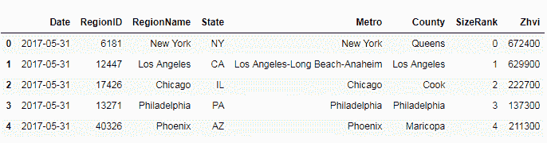

# 从数据集中选择数据

我们将从 DataFrame 中选择作为 pandas 系列的列，这可以通过两种方式完成。 第一种方法是对此选择使用方括号表示法，如以下代码块所示：

```py
regions = data['RegionName'] 
```

通过传递`RegionName`列，我们将获得一个`series`对象。 此`series`对象将仅包含来自此特定列的值。 我们如何确定这是`series`对象？ 我们可以通过传递为`type`函数创建的`series`对象进行检查，如下所示：

```py
type(regions) 
```

现在，让我们看一下刚刚创建的`series`对象中的数据：

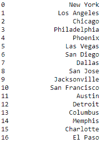

让我们找出 pandas DataFrame 和 pandas 系列之间的区别。 pandas DataFrame 是带有标签行和列的多维表格数据结构。 系列是包含单列值的数据结构。 熊猫的 DataFrame 可以视为一个或多个系列对象的容器。

# 多列选择

要从一个 DataFrame 中选择多个列，我们需要将这些列作为列表传递给 DataFrame，如下所示：

```py
region_n_state = data[['RegionName', 'State']] 
region_n_state.head() 
```

现在，让我们使用`type`函数确认生成的对象是序列对象还是 DataFrame，如下所示：

```py
type(region_n_state)
```

以下是输出：

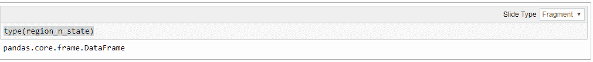

从前面的屏幕快照中可以看出，选择多个列将创建另一个 DataFrame，而仅选择一个列将创建`series`对象。

# 点表示法

还有另一种方法可以根据从 DataFrame 中选择的数据子集来创建新系列。 此方法称为点表示法。 在此方法中，列名将像传递属性时一样传递给 DataFrame，而不是作为参数传递：

```py
data.State
```

以下是输出：

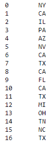

我们可以选择多个系列，然后从中创建新系列。 我们将使用三列`County`，`Metro`和`State`创建一个新系列。 然后我们将这些系列连接起来，并在 DataFrame 中创建一列称为`Address`。 让我们看一下刚刚创建的新创建的列或系列：

```py
data['Address'] = data.County + ', ' + data.Metro + ', ' + data.State
```

The following is the output:

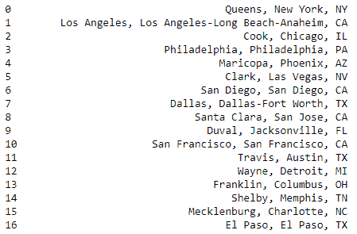

# 从 pandas DataFrame 中选择多个行和列

在本节中，我们将学习更多有关从读取到熊猫的数据集中选择多个行和列的方法的信息。 我们还将介绍一些熊猫数据选择方法，并将这些方法应用于实际数据集，以演示数据子集的选择。

首先，我们导入熊猫并以与上一节相同的方式从 zillow.com 读取数据。 这样做如下：

```py
import pandas as pd 
zillow = pd.read_table('data-zillow.csv', sep=',') 
zillow.head() 
```

The following is the output:

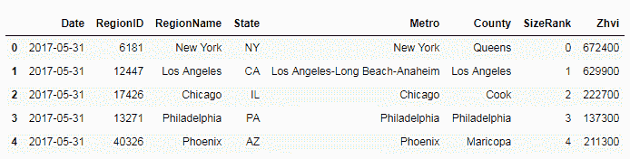

接下来，让我们看一些使用此数据集选择行和列的技术。 熊猫有一种选择行和列的方法，称为`loc`。 我们将使用`loc`方法从之前创建的数据集中调用 DataFrame。 `loc`要求两个参数之间用逗号分隔，其中第一个参数是要选择的行，第二个参数是要选择的列，如以下代码块所示：

```py
zillow.loc[7, 'Metro'] 
```

如前面的命令所示，我们将`7`作为要选择的行的索引，并且将名称为`Metro`的列作为要选择的列。 这为我们提供了索引为`7`的行和列为`Metro`的值。

我们还可以通过按索引而不是列名来引用列来实现此选择。 为此，我们将使用`iloc`方法。 在`iloc`方法中，我们需要将行和列都作为索引号传递。 如以下屏幕截图所示，两种方法的结果相同：

```py
zillow.iloc[7,4]
```

以下是前一个代码块的输出：

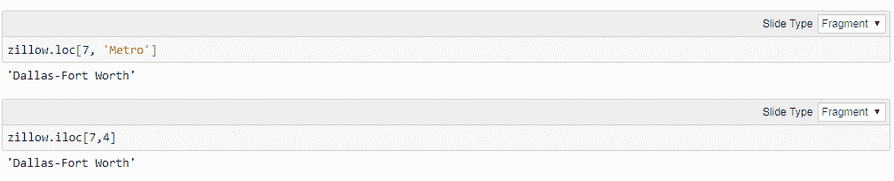

# 选择单行和多列

在本节中，我们将查看单行和多列的记录，其中我们将多列作为列表传递：

```py
zillow.loc[7, ['Metro', 'County']] 
```

我们从具有索引`7`以及`Metro`和`County`列的行中获取值。 如果我们选择一行，则这些值将垂直显示，而不是水平显示。 我们可以使用`iloc`方法而不是`loc`将此调用转换为使用列索引而不是列名，如下所示：

```py
zillow.iloc[7, [4,5]]
```

The following is the output:

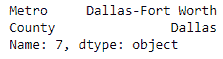

现在，我们将学习如何选择一个单行，但要选择所有列中的值。 对于参数的列部分，我们使用冒号（`:`）。 这告诉`loc`方法选择所有列：

```py
zillow.loc[11, :]
```

The following is the output:

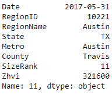

接下来，我们将学习如何从多行和单列中选择值。 在这里，我们需要将行作为一系列行传递。 我们将索引号从`101`到`105`（包括两端）的行传递。 我们将列名作为参数列表的第二部分传递，如下所示：

```py
zillow.loc[101:105, 'Metro'] 
```

在这里，我们具有来自多行和一列的值。 接下来，我们从多个行和多个连续的列中选择数据； 就像行索引范围一样，我们将列名作为范围传递，如下所示：

```py
zillow.loc[201:204, "State":"County"] 
```

如果要传递列索引而不是列名，我们还可以使用`iloc`方法来实现此目的，如下所示：

```py
zillow.iloc[201:205, 3:6] 
```

我们得到的结果与以前相同。 现在，我们将研究选择多个不连续的值，我们只需要将列名作为列表传递，如下面的代码所示：

```py
zillow.loc[201:205, ['RegionName', 'State']]
```

The following is the output:

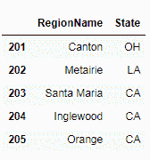

# 从行和所有列的范围中选择值

在这里，我们将使用`loc`方法查看一系列行和列中的值。 为此，`loc`方法的第一个参数是要选择的行的范围索引。 由于我们需要所有列中的值，因此我们将冒号（`:`）作为第二个参数，如下所示：

```py
zillow.loc[201:205, :] 
```

在以下屏幕截图中可以看到输出：

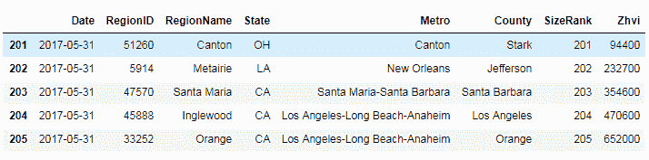

选择不连续的行也可以类似的方式工作。 在非连续行方法中，我们将行索引作为列表传递给`loc`方法，如以下代码所示：

```py
zillow.loc[[0,5,10], :]  
```

输出结果如下：

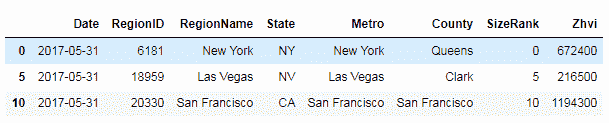

假设我们要基于某个列的值选择行和列。 以下代码行显示我们正在选择`County`列的值为`Queens`的行：

```py
zillow.loc[zillow.County=="Queens"] 
```

现在，让我们根据不同列的值选择特定列的所有行。 在以下代码块中，我们从`County`列中为`Metro`为`New York`的行选择值：

```py
zillow.loc[zillow.Metro=="New York", "County"] 
```

在以下屏幕截图中，我们可以从数据集中查看`New York`的所有县：

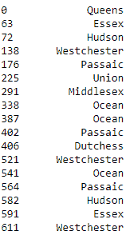

# 对熊猫 DataFrame 排序

在本节中，我们将学习熊猫`sort_values`方法。 我们还将使用各种方法对熊猫 DataFrame 进行排序，并学习如何对熊猫`series`对象进行排序。

我们将首先导入 pandas 模块，然后从 zillow.com 将房价数据集读取到 Jupyter Notebook 中。 首先，让我们从简单的排序类型开始。 我们将使用熊猫的`sort_values`方法。 例如，假设我们要按`Metro`列对数据进行排序。 我们需要将`Metro`作为参数传递给`sort_values`方法，并在 DataFrame 上调用该方法，如下所示：

```py
zillow.sort_values('Metro') 
```

这表明数据已按`Metro`列排序，如以下屏幕截图所示：

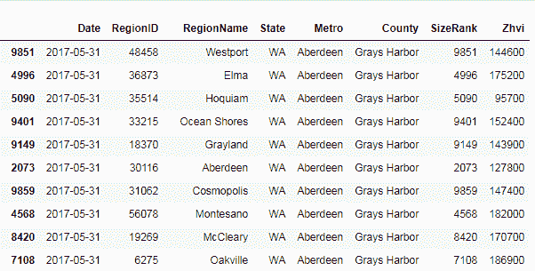

如果您发现默认情况下，`Date`列按升序排序。 我们可以更改排序顺序，为`ascending`参数赋予`False`的值，如以下代码块所示：

```py
sorted = zillow.sort_values('Metro', ascending=False) 
```

`ascending`参数是可选的，当不传递时，默认情况下将其设置为`True`。 现在，我们将研究如何按不止一列对数据进行排序。 为此，我们需要将要对数据进行排序的列列表传递给`sort_values`方法的参数列，如下所示：

```py
sorted = zillow.sort_values(by=['Metro','County']) 
```

现在已按`Metro`首先对数据进行排序，然后按`County`列进行排序； 也就是说，按照我们将它们传递给`sort_values`方法的顺序。 我们可以进一步对多列进行排序，并引入混合的升序。 例如，我们可以按三列排序：`Metro`，`County`和`Price`列，如下所示：

```py
sorted = zillow.sort_values(by=['Metro','County', 'Zhvi'], ascending=[True, True, False]) 
sorted.head() 
```

您必须已经注意到，我们在递增参数中传递了三个布尔值的列表。 这将对`Metro`和`County`的排序顺序设置为升序，对于最后一列`Zhvi`的降序设置为：

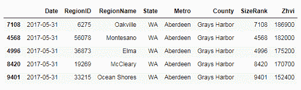

接下来，我们了解如何对`series`对象进行排序。 首先，让我们创建一个系列。 让我们从数据集中选择`RegionID`列，然后创建一个序列，如下所示：

```py
regions = zillow.RegionID 
type(regions) 
```

在对它进行排序之前，让我们使用`regions.head()`查看原始系列。 输出如下：

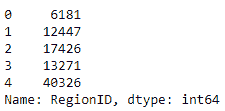

现在，让我们通过调用`sort_values`方法对其进行排序。 由于数据集仅包含一列，因此我们无需传递任何列名。 因此，用于对数据进行排序的代码将为`regions.sort_values().head()`，并且输出将如下所示：

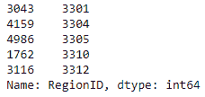

# 过滤熊猫 DataFrame 的行

在本节中，我们将学习从 pandas DataFrame 过滤行和列的方法，并将介绍几种方法来实现此目的。 我们还将学习熊猫的`filter`方法以及如何在实际数据集中使用它，以及基于将根据数据创建的布尔序列保护数据的方法。 我们还将学习如何将条件直接传递给 DataFrame 进行数据过滤。

我们将首先导入 pandas 模块，然后从 [zillow.com](https://www.zillow.com/) 中将房价数据集读取到 Jupyter Notebook 中。 首先，我们探索熊猫的`filter`方法来过滤数据。 我们可以使用`filter`方法过滤列。 为此，我们需要将列作为列表传递给`filter`方法的 items 参数，如下所示：

```py
filtered_data = data.filter(items=['State', 'Metro']) 
filtered_data.head() 
```

The following is the output:

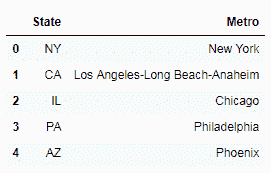

如您在前面的屏幕快照中所见，我们按`State`和`Metro`过滤了列，并使用过滤器列中的值创建了一个新的 DataFrame。 然后我们使用`head`方法显示过滤器数据。 接下来，我们使用`filter`方法使用正则表达式过滤列名称。 通过将正则表达式传递给`regex`参数来完成此操作，如下所示：

```py
filtered_data = data.filter(regex='Region', axis=1) 
filtered_data.head() 
```

当我们打印出过滤数据时，我们可以看到它选择了名称为`Region`的两列，如以下屏幕截图所示：


`filter`方法不是过滤数据的唯一方法。 为了过滤行，我们可以使用一些有趣的技术-首先，我们创建一系列布尔值。 布尔值系列基于我们数据集中的价格值列。 我们选择选择值大于`500000`的行，如下所示：

```py
price_filter_series = data['Zhvi'] > 500000 
price_filter_series.head() 
```

我们通过从顶部打印一些值来确认创建了系列，如以下屏幕截图所示：

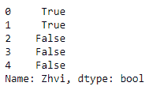

如前面的屏幕快照所示，`True`值是与我们的条件匹配的值，即，它们表示价格高于`500000`的行。 接下来，我们使用该布尔系列来过滤完整数据集中的行，并仅获取价格高于`500000`的值。 为此，我们将方括号将布尔系列传递给数据集 DataFrame，如下所示：

```py
data[price_filter_series].head() 
```

在不显式创建布尔序列的情况下筛选数据集的另一种方法是将所需值的条件直接传递给 DataFrame。 例如，假设我们只想过滤并选择房价高于或等于`1000000`的行。 我们将条件传递给 DataFrame 如下：

```py
data[data.Zhvi >= 1000000].head() 
```

以下屏幕快照显示了值大于`1000000`的记录：

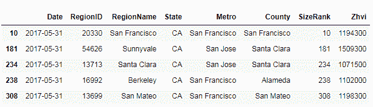

# 将多个过滤条件应用于熊猫 DataFrame

在本节中，我们将学习将多个过滤条件应用于熊猫 DataFrame 的方法。 我们将使用逻辑 AND / OR 条件运算符从真实数据集中选择记录。 我们还将看到如何使用`isin()`方法来过滤记录。 我们将在真实数据集上演示`isin`方法用于单列和多列过滤。

我们将首先导入 pandas 模块并从 [zillow.com](https://www.zillow.com/) 中将房价数据集读取到 Jupyter Notebook 中，如下所示：

```py
data = pd.read_table('data-zillow.csv', sep=',')
data.head()
```

The following is the output:

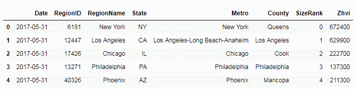

# 根据多种条件进行过滤– AND

现在，让我们看一些使用多个条件或条件过滤数据的技术。 首先，我们选择价格高于 1,000,000 且`State`参数为 New York（`NY`）的行，如下所示：

```py
data[(data['Zhvi'] > 1000000) & (data['State'] == 'NY')].head()
```

将前面的多条件传递给数据库的 DataFrame。 在下面的屏幕快照中，此技术仅选择价格值大于 1,000,000 且`State`为`New York`的行，并过滤掉了所有其他记录：

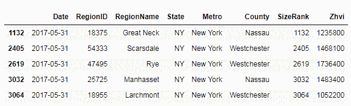

# 根据多种条件进行过滤–或

当我们使用逻辑运算符 OR 传递这些条件时，我们使用相同的技术来过滤数据。 在这里，我们从`New York`或`California`中选择那些记录。 为此，我们使用逻辑运算符 OR 合并条件，并将此组合条件传递给数据集。 结果子数据集仅来自这两个状态，如下所示：

```py
data[((data['State'] == 'CA') | (data['State'] == 'NY'))].head() 
```

The following is the output:

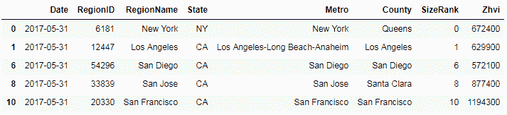

# 使用 isin 方法进行过滤

筛选数据的另一种方法是使用`isin`方法。 我们可以使用`isin`方法通过一个或多个特定列的值列表来过滤数据集。 在这里，我们仅从`Metro`列中选择值`New York`或`San Francisco`的那些记录。

我们在`Metro`列上调用`isin`方法，并将其传递给包含我们要选择的城市的列表。 这将创建一个布尔序列。 然后，我们将布尔序列传递给数据集 DataFrame 进行必要的过滤和选择，如下所示：

```py
filter = data['Metro'].isin(['New York', 'San Francisco']) 
data[filter].head() 
```

以下屏幕截图显示了仅来自`New York`和`San Francisco`这两个城市的记录的过滤数据：

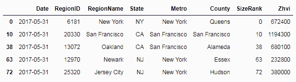

# 在多个条件下使用 isin 方法

我们还可以使用`isin`方法根据来自多列的值过滤行。 为了执行此操作，我们传递了一个字典对象，其中的键是列名，而值是我们要从中选择记录的那些列的值的列表。

举个例子，让我们选择`State`参数为`California`和`Metro`参数为`San Francisco`的值。 我们使用包含要选择的值的这两列创建一个字典对象，然后将该字典项传递给`isin`方法，并在数据集上调用`isin`方法。 然后，将过滤器传递给 DataFrame 并选择我们的记录，如下所示：

```py
filter = data.isin({'State': ['CA'], 'Metro': ['San Francisco']}) 
data[filter].head() 
```

这将显示`NaN`，或者对于那些不符合我们先前指定的多个条件的记录不可用：

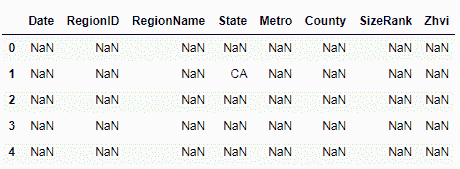

# 在熊猫中使用 axis 参数

在本节中，我们将学习在熊猫中进行数据分析时何时何地使用`axis`参数或关键字。 我们将介绍`axis`参数，并逐步介绍可以将`axis`关键字设置为的各种值。 我们将演示如何将`axis`设置为行或列来改变方法的行为。 我们还将展示一些使用`axis`关键字的代码示例。

我们将首先导入 pandas 模块，然后从 [zillow.com](https://www.zillow.com/) 中将房价数据集读取到 Jupyter 笔记本中：

```py
data = pd.read_table('data-zillow.csv', sep=',')
data.head()
```

The following is the output:

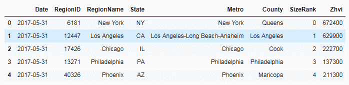

# 轴参数的用法

`axis`参数告诉您一个特定的方法，以及应该执行该方法的 DataFrame 的哪个轴。 以下代码描述了`axis`参数的输入数据类型：

```py
data.head() 
```

可以沿行或列垂直或水平指定轴，换句话说，沿行或列指定轴：对行使用`axis0`，对列使用`axis1`，如以下屏幕截图所示：

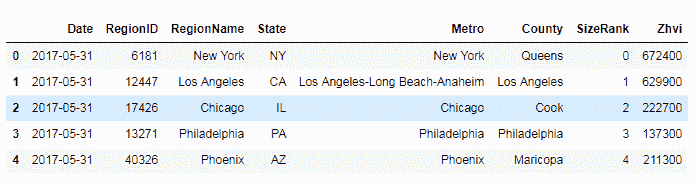

以下是命令：

```py
data.axes
```

以下是上述命令的输出：

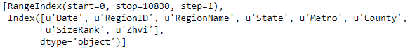

# 轴用法示例

在`axis`用法示例中，我们计算数据集中值的平均值。 我们已将`axis`传递为`0`。 这意味着将沿着行`axis`计算平均值，如下所示：

```py
data.mean(axis=0) 
```

The following is the output:

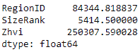

接下来，我们将`axis`设置为`1`。 我们在同一数据集上使用完全相同的方法； 但是，我们正在将`axis`从`0`更改为`1`。 由于我们将`axis`设置为`1`，因此`mean`的计算如下：

```py
data.mean(axis=1).head() 
```

The following is the output:

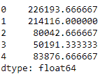

有时很难记住`0`或`1`是用于行还是用于列。 因此，您可以将`axis`设置为`rows`而不是使用`axis0`：

```py
data.mean(axis='rows') 
```

输出为以下内容：


对于列，您可以将`axis`设置为`columns`。 与使用`0`或`1`具有相同的效果：

```py
data.mean(axis='columns').head() 
```

The following is the output:

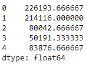

# axis 关键字的更多示例

在这里，我们使用`drop`方法删除行或记录。 我们通过将关键字`axis`传递为`0`来告诉`drop`方法将记录删除到`0`的索引处：

```py
data.drop(0, axis=0).head() 
```

The following is the output:

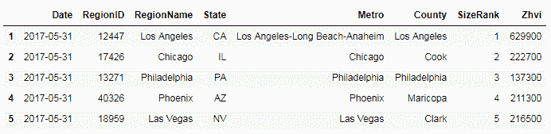

在以下示例中，我们将`axis`设置为`1`，这告诉`drop`方法删除带有`Date`标签的列：

```py
data.drop('Date', axis=1).head 
```

The following is the output:

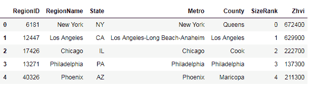

# 轴关键字

我们也可以在过滤方法中使用`axis`关键字。 在这里，我们通过`regex Region`进行过滤，并将`axis`设置为列：

```py
data.filter(regex='Region', axis=1).head() 
```

The following is the output:

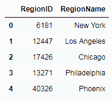

# 在熊猫中使用字符串方法

在本节中，我们将学习在熊猫系列中使用各种字符串方法。 我们将把真实的数据集读入大熊猫。 我们将探索一些字符串方法，并将使用这些字符串方法从数据集中选择和更改值。

我们将首先导入 pandas 模块并从 [zillow.com](https://www.zillow.com/) 中读取房价数据集到 Jupyter 笔记本中：

```py
data = pd.read_table('data-zillow.csv', sep=',')
data.head()
```

The following is the output:

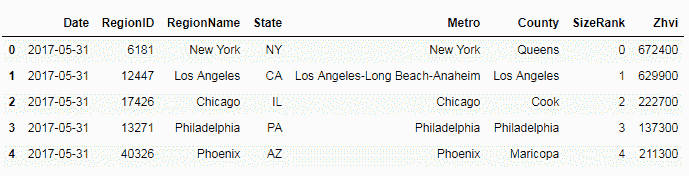

# 检查子串

为了学习如何使用字符串方法检查熊猫系列的子字符串，我们使用`str`包中的`contains`方法。

在这里，我们从数据集中调用`RegionName`系列上的`str.contains`方法。 我们正在寻找包含`New` 子字符串的记录。 它打印出一个布尔系列，打印`True`找到一个子字符串，而`False`找到一个子字符串：

```py
data.RegionName.str.contains('New').head() 
```

The following is the output:

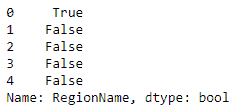

# 将系列或列的值更改为大写

有一种非常常见的字符串方法可以将 Python 字符串转换为大写。 我们可以使用它来将列中的所有值转换为大写。 我们通过在系列中调用`str.upper`来实现。 在这里，我们将其称为`RegionName`列：

```py
data.RegionName.str.upper().head() 
```

The following is the output:

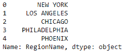

# 将值更改为小写

为此，我们使用`lower` 字符串方法：

```py
data.County.str.lower().head() 
```

The following is the output:

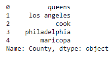

# 查找列中每个值的长度

为此，我们在其中一列上调用`str.len`方法：

```py
data.County.str.len().head() 
```

The following is the output:

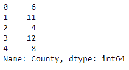

# 删除空格

我们还可以使用字符串方法进行一些数据清理。 例如，在这里，我们使用`lstrip`方法从列的值中删除所有前导空格：

```py
data.RegionName.str.lstrip().head() 
```

The following is the output:

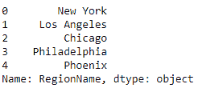

# 替换列值的一部分

我们还可以使用字符串方法更改数据。 在这里，我们使用`replace`方法将数据集中`RegionName` 列中的空格替换为无空格：

```py
data.RegionName.str.replace(' ', '').head()
```

The following is the output:

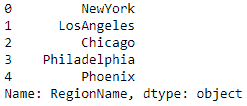

# 更改熊猫系列的数据类型

在本节中，我们将学习如何更改熊猫系列的数据类型。 我们将看到读取其中的数据后如何更改数据类型。 我们还将学习在读取熊猫数据时如何更改数据类型。 我们将通过一个示例将 int 列更改为 float。 我们还将看到如何将字符串值列转换为`datetime`数据类型。

We will start by importing the pandas module and reading the dataset of house prices from [zillow.com](https://www.zillow.com/) into the Jupyter Notebook:

```py
data = pd.read_table('data-zillow.csv', sep=',')
data.head()
```

The following is the output:

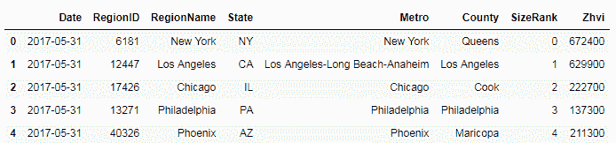

# 将 int 数据类型列更改为 float

为此，我们首先检查真实数据集中的列的数据类型：

```py
data.dtypes 
```

The following is the output:

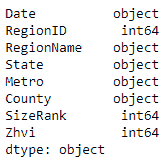

然后我们使用`astype`方法更改数据类型。 我们将`float`传递给`astype`方法，并在要更改其数据类型的列上调用此方法。

我们将更改分配回原始列，如下所示：

```py
data['Zhvi'] = data.Zhvi.astype(float) 
data.dtypes 
```

在下面的屏幕截图中，我们可以看到已经进行了更改-我们列的数据类型已从`int64`更改为`float64`：

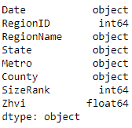

# 读取数据时更改数据类型

在将数据读入 pandas 之后，我们只是更改了列的数据类型。 另外，我们可以在读取数据时更改数据类型。 为此，我们将列名和数据类型传递到要更改为`read`数据方法的列中。 我们想要的 float 列已导入为`float64`：

```py
data2 = pd.read_csv('data-zillow.csv', sep=',', dtype={'Zhvi':float}) 
data2.dtypes 
```

The following is the output:

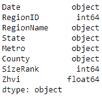

# 将字符串转换为日期时间

这里最主要的是我们的数据集有一个 date 列，但它显示为对象或字符串数​​据类型。 我们将其转换为适当的`datetime`列。

我们将为此使用 pandas 的`to_datetime`方法，该方法可以解析几种不同的`datetime`格式：

```py
pd.to_datetime(data2.Date,infer_datetime_format=True).head()
```

我们可以看到`Date`字段已从对象更改为 `datetime64` ，如以下屏幕截图所示：


# 摘要

在本章中，我们学习了从熊猫 DataFrame 中选择数据子集的方法。 我们还了解了如何将这些方法应用于真实数据集。 我们还了解了从已读入熊猫的数据集中选择多个行和列的方法，并将这些方法应用于实际数据集以演示选择数据子集的方法。 我们了解了熊猫`sort_values`方法。 我们看到了使用`sort_values`方法对熊猫 DataFrame 中的数据进行排序的各种方法。 我们还学习了如何对熊猫系列对象进行排序。 我们了解了用于从熊猫 DataFrame 过滤行和列的方法。 我们介绍了几种方法来实现此目的。 我们了解了熊猫的`filter`方法以及如何在实际数据集中使用它。 我们还学习了根据从数据创建的布尔序列过滤数据的方法，并且学习了如何将过滤数据的条件直接传递给 DataFrame。 我们学习了熊猫数据选择的各种技术，以及如何选择数据子集。 我们还学习了如何从数据集中选择多个角色和列。 我们学习了如何对 pandas DataFrame 或系列进行排序。 我们逐步介绍了如何过滤熊猫 DataFrame 的行，如何对此类 DataFrame 应用多个过滤器以及如何在熊猫中使用`axis`参数。 我们还研究了字符串方法在熊猫中的使用，最后，我们学习了如何更改熊猫系列的数据类型。

在下一章中，我们将学习处理，转换和重塑数据的技术。