# 三、处理，转换和重塑数据

在本章中，我们将学习以下主题：

*   使用`inplace`参数修改 Pandas 数据帧
*   使用`groupby`方法的模式
*   如何处理 Pandas 中的缺失值
*   探索 Pandas 数据帧中的索引
*   重命名和删除 Pandas 数据帧中的列
*   处理和转换日期和时间数据
*   处理`SettingWithCopyWarning`
*   将函数应用于 Pandas 序列或数据帧
*   将多个数据帧合并并连接成一个

# 使用 inplace 参数修改 Pandas 数据帧

在本节中，我们将学习如何使用`inplace`参数修改数据帧。 我们首先将一个真实的数据集读入 Pandas。 然后我们将介绍 pandas 的`inplace`参数，并查看它如何影响方法的执行最终结果。 我们还将执行带有和不带有`inplace`参数的方法，以演示`inplace`的效果。

我们首先将`pandas`模块导入 Jupyter 笔记本中，如下所示：

```py
import pandas as pd
```

然后我们将读取我们的数据集：

```py
top_movies = pd.read_table('data-movies-top-grossing.csv', sep=',')
```

由于它是 CSV 文件，因此我们正在使用 Pandas 的`read_csv`函数。 现在我们已经将数据集读入了数据帧中，让我们看一些记录：

```py
top_movies
```


我们正在使用的数据来自维基百科； 这是迄今为止全球顶级电影的交叉附件数据。 大多数 Pandas 数据帧方法都返回一个新的数据帧。 但是，您可能想使用一种方法来修改原始数据帧本身。 这是`inplace`参数有用的地方。 让我们在不带`inplace`参数的数据帧上调用方法以查看其在代码中的工作方式：

```py
top_movies.set_index('Rank').head()
```


在这里，我们将其中一列设置为数据帧的索引。 我们可以看到索引已在内存中设置。 现在，让我们检查一下它是否已修改原始数据帧：

```py
top_movies.head()
```

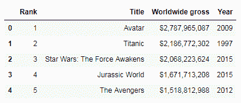

我们可以看到在原始数据帧中没有任何变化。`set_index`方法仅在内存中全新的数据帧中创建了更改，我们可以将其保存在新的数据帧中。 现在让我们看看如果传递`inplace`参数，它将如何工作：

```py
top_movies.set_index('Rank', inplace=True)
```

我们将`inplace=True`传递给该方法。 现在让我们检查原始的数据帧：

```py
top_movies.head()
```


我们可以看到传递`inplace=True`确实修改了原始数据帧。 并非所有方法都需要使用`inplace`参数来修改原始数据帧。 例如，`rename(columns)`方法修改原始的数据帧，而不需要`inplace`参数：

```py
top_movies.rename(columns = {'Year': 'Release Year'}).head()
```

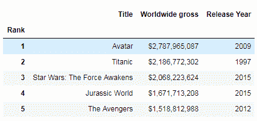

熟悉哪些方法需要`inplace`，哪些不需要`inplace`，这是一个好主意。 在本节中，我们学习了如何使用`inplace`参数修改数据帧。 我们介绍了 Pandas `inplace`参数，以及它如何影响方法的执行最终结果。 我们探讨了带有`inplace`参数和不带有`inplace`参数的方法的执行情况，以证明结果的差异。 在下一节中，我们将学习如何使用`groupby`方法。

# 使用`groupby`方法

在本节中，我们将学习如何使用`groupby`方法将数据拆分和聚合为组。 我们将通过分成几部分来探讨`groupby`方法的工作方式。 我们将用统计方法和其他方法演示`groupby`。 我们还将学习`groupby`方法迭代组数据的能力如何做有趣的事情。

我们将像上一节中一样将`pandas`模块导入 Jupyter 笔记本中：

```py
import pandas as pd
```

然后，我们将读取 CSV 数据集：

```py
data = pd.read_table('data-zillow.csv', sep=',')
data.head()
```

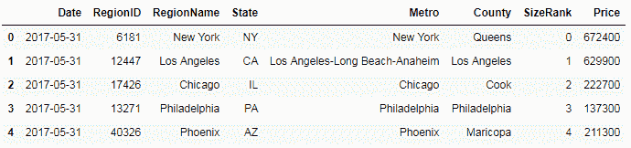

让我们先问一个问题，看看 Pandas 的`groupby`方法是否可以帮助我们获得答案。 我们想要获取每个`State`的平均值`Price`值：

```py
grouped_data = data[['State', 'Price']].groupby('State').mean()
grouped_data.head()
```

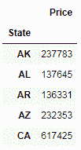

在这里，我们使用`groupby`方法按状态汇总数据，并获得每个`State`的平均值`Price`。 在后台，`groupby`方法将数据分成几组，然后我们然后将函数应用于拆分后的数据，然后将结果放在一起并显示出来。

让我们将这段代码分成几部分，看看它是如何发生的。 首先，按以下步骤进行分组：

```py
grouped_data = data[['State', 'Price']].groupby('State')
```

我们选择了仅具有`State`和`Price`列的数据子集。 然后，我们对该数据调用`groupby`方法，并将其传递到`State`列中，因为这是我们希望对数据进行分组的列。 然后，我们将数据存储在一个对象中。 让我们使用`list`方法打印出这些数据：

```py
list(grouped_data)
```

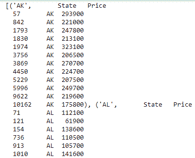

现在，我们有了基于日期的数据组。 接下来，我们对显示的数据应用一个函数，并显示合并的结果：

```py
grouped_data.mean().head()
```

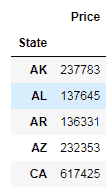

我们正在使用`mean`方法来获取价格的平均值。 将数据分为几组后，我们可以使用 Pandas 方法来获取有关这些组的一些有趣信息。 例如，在这里，我们分别获得有关每个州的描述性统计信息：

```py
grouped_data.describe()
```

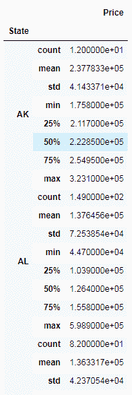

我们也可以在多列上使用`groupby`。 例如，在这里，我们按`State`和`RegionName`列进行分组，如下所示：

```py
grouped_data = data[['State',
                     'RegionName', 
                     'Price']].groupby(['State', 'RegionName']).mean()
```

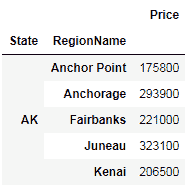

我们还可以通过`groupby`和`size`方法获取每个`State`的记录数，如下所示：

```py
grouped_data = data.groupby(['State']).size()
```

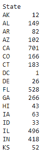

到目前为止，在本节中我们演示的所有代码中，我们都是按行分组的。 但是，我们也可以按列分组。 在下面的示例中，我们通过将`axis`参数集传递给`1`来实现此目的：

```py
grouped_data = data.groupby(data.dtypes, axis=1)
list(grouped_data)
```

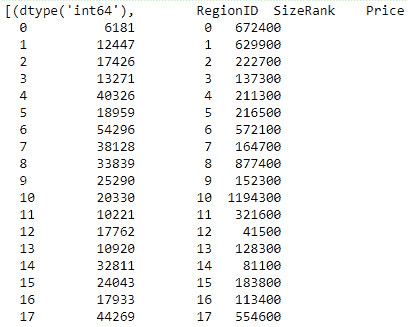

我们还可以遍历拆分组，并对其进行有趣的操作，如下所示：

```py
for state, grouped_data in data.groupby('State'):
    print(state, '\n', grouped_data)
```

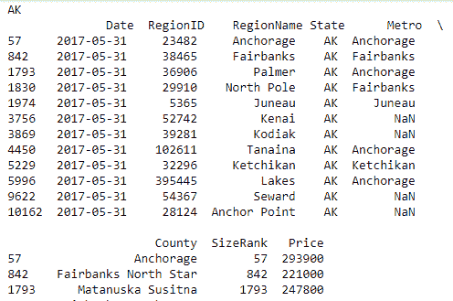

在这里，我们通过`State`迭代组数据，并以`State`作为标题发布结果，然后是该`State`的所有记录的表。

在本节中，我们学习了如何使用`groupby`方法将数据拆分和聚合为组。 我们将`groupby`方法分解为多个部分，以探讨其工作方式。 我们用统计方法和其他方法演示了`groupby`，并且还通过遍历组数据学习了如何通过`groupby`做有趣的事情。 在下一节中，我们将学习如何使用 Pandas 处理数据中的缺失值。

# 处理 Pandas 中的缺失值

在本节中，我们将探索如何使用各种 Pandas 技术来处理数据集中的缺失数据。 我们将学习如何找出缺少的数据以及从哪些列中找出数据。 我们将看到如何删除所有或大量记录丢失数据的行或列。 我们还将学习如何（而不是删除数据）如何用零或剩余值的平均值填充丢失的记录。

首先，将`pandas`模块导入 Jupyter 笔记本：

```py
import pandas as pd
```

我们将读取我们的 CSV 数据集：

```py
data = pd.read_csv('data-titanic.csv')
data.head()
```

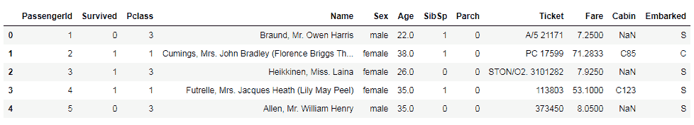

该数据集是泰坦尼克号的乘客生存数据集，可从 [Kaggle](https://www.kaggle.com/c/titanic/data) 下载。

让我们看看首先丢失了多少条记录。 为此，我们首先需要找出数据集中的总记录数。 我们通过在数据帧上调用`shape`属性来做到这一点：

```py
data.shape
```

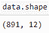

我们可以看到记录总数为`891`，总列数为`12`。

然后，我们找出每一列中的记录数。 我们可以通过在数据帧上调用`count`方法来做到这一点：

```py
data.count()
```

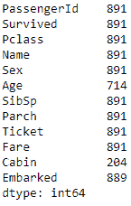

总记录与每列计数之间的差表示该列中缺少的记录数。 在`12`列中，我们有 3 列缺少值。 例如，`Age`的`891`行总数中只有`714`值；`Cabin`仅具有`204`记录的值；`Embarked`具有`889`记录的值。 我们可以使用不同的方法来处理这些缺失的值。 一种方法是删除缺少值的任何行，即使是单列也是如此，如下所示：

```py
data_missing_dropped = data.dropna()
data_missing_dropped.shape
```

当运行此放置行方法时，我们将结果分配回新的数据帧中。 在`891.`总数中，仅剩下`183`记录，但是，这可能会导致丢失大量数据，并且可能无法接受。

另一种方法是只删除那些缺少所有值的行。 这是一个例子：

```py
data_all_missing_dropped = data.dropna(how="all")
data_all_missing_dropped.shape
```

为此，我们将`dropna`方法的`how`参数设置为`all`。

代替删除行，另一种方法是用一些数据填充缺少的值。 例如，我们可以使用`0`填写缺失值，如以下屏幕截图所示：

```py
data_filled_zeros = data.fillna(0)
data_filled_zeros.count()
```

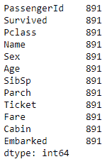

在这里，我们使用 pandas 的`fillna`方法，并将`0`的数值传递到应填充数据的列。您可以看到，现在我们已经用`0`填充了所有缺少的值，并且因此，所有列的计数已增加到数据集中记录总数。

另外，除了用`0`填充缺失值外，我们还可以用剩余的现有值的平均值填充它们。 为此，我们在要填充值的列上调用`fillna`方法，然后将列的平均值作为参数传递：

```py
data_filled_in_mean = data.copy()
data_filled_in_mean.Age.fillna(data.Age.mean(), inplace=True) data_filled_in_mean.count()
```

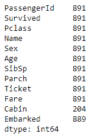

例如，在这里，我们用现有值的平均值填充`Age`的缺失值。

在本节中，我们探讨了如何使用各种 Pandas 技术来处理数据集中的缺失数据。 我们学习了如何找出丢失的数据量以及从哪几列中查找。 我们看到了如何删除所有或很多记录丢失数据的行或列。 我们还看到了如何代替删除，也可以用`0`或剩余值的平均值来填写缺失的记录。 在下一节中，我们将学习如何在 Pandas 数据帧中进行数据集索引。

# 在 Pandas 数据帧中建立索引

在本节中，我们将探讨如何设置索引并将其用于 Pandas 中的数据分析。 我们将学习如何在读取数据后以及读取数据时在`DataFrame`上设置索引。 我们还将看到如何使用该索引进行数据选择。

与往常一样，我们首先将`pandas`模块导入 Jupyter 笔记本：

```py
import pandas as pd
```

然后，我们读取数据集：

```py
data = pd.read_csv('data-titanic.csv')
```

以下是我们的默认索引现在的样子，它是一个从`0`开始的数字索引：

```py
data.head()
```


让我们将其设置为我们选择的列。 在这里，我们使用`set_index`方法根据我们的数据将索引设置为乘客的姓名：

```py
data.set_index('Name')
```

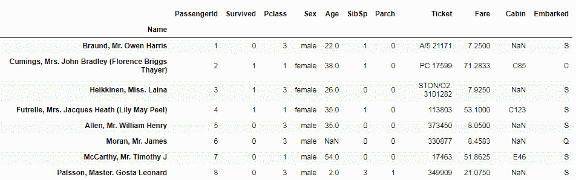

如您所见，索引已从`0`的简单数值更改为数据集中乘客的姓名。

接下来，我们将看到在读取数据时如何设置索引。 为此，我们将一个额外的参数`index_col`传递给`read`方法：

```py
data = pd.read_table('data-titanic.csv', sep=',', index_col=3)
```

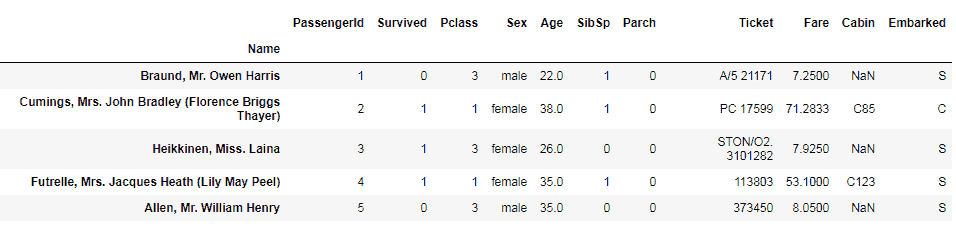

`index_col`参数采用单个数字值或值的序列。 在这里，我们传递`Name`列的索引。

接下来，让我们看看如何使用索引进行数据选择。 在以下屏幕截图中，我们在数据帧上调用`loc`方法，并传入我们要选择的记录的索引级别：

```py
dta.loc['Braund, Mr.Owen Harris',:]
```


在这种情况下，它是数据集中一位乘客的名字。 之所以可以这样做，是因为我们先前将名称设置为数据集的索引。

最后，我们可以将索引重置为更改之前的值。 我们为此使用`reset_index`方法：

```py
data.reset_index(inplace=True)
```

我们正在传递`inplace=True`，因为我们想在原始数据帧本身中将其重置。

在本节中，我们探讨了如何设置索引并将其用于 Pandas 中的数据分析。 我们还学习了在读取数据后如何在数据帧上设置索引。 我们还看到了如何在从 CSV 文件读取数据时设置索引。 最后，我们看到了一些使我们可以使用索引进行数据选择的方法。 在下一节中，我们将学习如何重命名 Pandas 数据帧中的列。

# 重命名 Pandas 数据帧中的列

在本节中，我们将学习在 Pandas 中重命名列标签的各种方法。 我们将学习如何在读取数据后和读取数据时重命名列，并且还将看到如何重命名所有列或特定列。 首先，将`pandas`模块导入 Jupyter 笔记本：

```py
import pandas as pd
```

我们可以通过几种方法来重命名 Pandas 数据帧中的列。 一种方法是在从数据集中读取数据时重命名列。 为此，我们需要将列名作为列表传递给`read_csv`方法的`names`参数：

```py
list_columns= ['Date', 'Region ID', Region Name', 'State', 'City', 'County', 'Size Rank', 'Price']
data = pd.read_csv('data-zillow.csv', names = list_columns)
data.head()
```

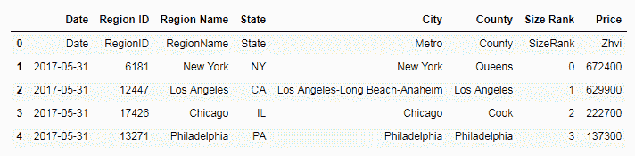

在前面的示例中，我们首先创建了所需列名称的列表； 此数字应与实际数据集中的列数相同。 然后，将列表传递给`read_csv`方法中的`names`参数。 然后，我们看到我们拥有所需的列名，因此`read_csv`方法已将列名从默认情况下的文本文件更改为我们提供的名称。

读取数据后，我们还可以重命名列名称。 让我们再次从 CSV 文件中读取数据集，但是这次不提供任何列名。 我们可以使用`rename`方法重命名列。 让我们首先看一下数据集中的列：

```py
data.columns
```

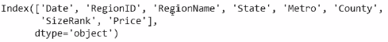

现在，我们在数据帧上调用`rename`方法，并将列名（旧值和新值）传递给`columns`参数：

```py
data.rename(columns={'RegionName':'Region', 'Metro':'City'}, inplace=True)
```

在前面的代码块中，我们仅更改了一些列名，而不是全部。 让我们再次调用`columns`属性，以查看是否确实更改了列名 ， ：

```py
data.columns
```

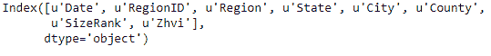

现在，我们在数据集中有了新的列名。

读取数据后，我们还可以重命名所有列，如下所示：

```py
data.columns = ['Date', 'Region ID', 'Region Name', 'State', 'City', 'County', 'Size Rank','Price']
```

我们已经将`columns`属性设置为一个名称列表，我们希望将所有列都重命名为该名称。

在本节中，我们了解了重命名 Pandas 中列级别的各种方法。 我们学习了在读取数据后如何重命名列，并学习了在从 CSV 文件读取数据时如何重命名列。 我们还看到了如何重命名所有列或特定列。

# 从 Pandas 数据帧中删除列

在本节中，我们将研究如何从 Pandas 的数据集中删除列或行。 我们将详细了解`drop()`方法及其参数的功能。

首先，我们首先将`pandas`模块导入 Jupyter 笔记本：

```py
import pandas as pd
```

之后，我们使用以下代码读取 CSV 数据集：

```py
data = pd.read_csv('data-titanic.csv', index_col=3)
data.head()
```

数据集应类似于以下内容：


要从我们的数据集中删除单个列，请使用 pandas `drop()`方法。`drop()`方法由两个参数组成。 第一个参数是需要删除的列的名称； 第二个参数是`axis`。 此参数告诉`drop`方法是否应该删除行或列，并将`inplace`设置为`True`，这告诉该方法将其从原始数据帧本身删除。

在此示例中，我们考虑删除`Ticket`或列。 的代码如下：

```py
data.drop('Ticket', axis=1, inplace=True)
```

执行此操作后，我们的数据集应类似于以下内容：

```py
data.head()
```

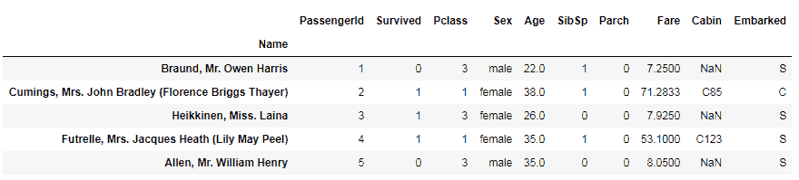

如果我们仔细观察，很明显`Ticket`列已从我们的数据集中删除或删除。

要删除多个列，我们将需要删除的列作为列表传递给`drop()`方法。`drop()`方法的所有其他参数将保持不变。

让我们看一个如何使用`drop()`方法消除行的示例。

在此示例中，我们将删除多行。 因此，与其传递列名，不如传递一个列表形式的行索引标签。 以下代码将用于执行此操作：

```py
data.drop(['Parch', 'Fare'], axis=1, inplace=True)
data.head()
```


结果，传递给`drop()`方法的对应于乘客姓名的两行将从数据集中删除。

现在，我们将继续仔细研究如何处理日期和时间数据。

# 处理日期和时间序列数据

在本节中，我们将仔细研究如何处理 Pandas 中的日期和时间序列数据。 我们还将看到如何：

*   将字符串转换为`datetime`类型，以进行高级`datetime`序列操作
*   选择并过滤`datetime`序列数据
*   探索序列数据的属性

我们首先将`pandas`模块导入到我们的 Jupyter 笔记本中：

```py
import pandas as pd
```

对于此示例，让我们创建自己的数据帧数据集。 我们可以使用以下代码来做到这一点：

```py
dataset = pd.DataFrame({'DOB': ['1976-06-01', '1980-09-23', '1984-03-30', '1991-12-31', '1994-10-2', '1973-11-11'], 
                        'Sex': ['F', 'M', 'F', 'M', 'M', 'F'], 
                        'State': ['CA', 'NY', 'OH', 'OR', 'TX', 'CA'], 
                        'Name': ['Jane', 'John', 'Cathy', 'Jo', 'Sam', 'Tai']}))
```

该数据集包含对应于五个虚构人物的四列和五行。 我们的数据集中存在的行之一是`DOB`，其中包含五个人的出生日期。

必须检查，，，，`DOB`，， 列中的数据是否正确。 为此，我们使用以下代码：

```py
dataset.dtypes
```

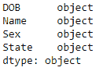

从输出中可以看出，在创建过程中`DOB`列可能设置为`object`或`string`数据类型。 要将其更改为`datetime`数据类型，我们使用`to_datetime()`方法并将`DOB`列传递给它，如下所示：

```py
dataset.DOB = pd.to_datetime(dataset.DOB)
```

再次，我们可以使用以下代码来验证是否已将`DOB`设置为`datetime`数据类型：

```py
dataset.dtypes
```

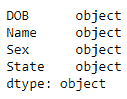

在继续选择和过滤`datetime`序列之前，我们需要确保为`DOB`列设置了索引。 为此，我们使用以下代码：

```py
dataset.set_index('DOB', inplace=True)
```

之后，我们的`DOB`列已准备好进行探索。 如果要查看数据集，可以使用代码字`dataset`如下所示：

```py
dataset
```

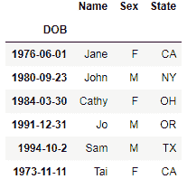

在开始过滤之前，我们需要了解有四种可能的方法可以过滤`DOB`列中的数据。 它们如下：

*   **一年的记录**：要显示一年的记录，我们使用以下代码：

```py
dataset['1980']
```


此代码表示将显示当年`1980`存在的所有记录。 Pandas 不需要我们提及整个日期，因为即使是日期的一部分也会帮助我们产生结果。

*   **特定年份和之后的记录**：要显示特定年份和之后的所有记录，我们使用以下代码：

```py
dataset['1980':]
```

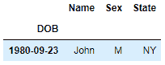

*   **直到特定年份的记录**：要显示直到特定年份（包括该年份）的所有记录，我们需要使用以下代码：

```py
dataset[':1980']
```

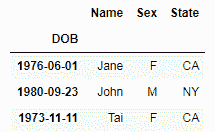

*   **几年范围内的记录**：要显示给定年份范围内的记录，我们可以使用以下代码：

```py
dataset['1980':'1984']
```

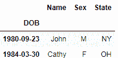

我们还可以使用时间序列属性来最有效地利用`datetime`序列数据。 使用此功能的缺点是`datetime`字段必须是列，而不是行。

这可以通过将`DOB`重置为索引来完成。 这样做如下：

```py
dataset.reset_index(inplace=True)
```

我们还需要为`datetime`列中的每个值获取一年中的相应日期。 可以通过调用`dayofyear`属性来完成此操作，如下所示：

```py
dataset.DOB.dt.dayofyear
```

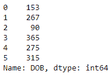

我们还可以通过调用`weekday_name`属性来显示星期几，如下所示：

```py
dataset.DOB.dt.weekday_name
```


这些是`datetime`序列数据的方法和属性的一些示例。 在 Pandas 的参考文档中可以找到更多内容，网址为。

# 处理`SettingWithCopyWarning`

在本节中，我们将学习`SettingWithCopyWarning`警告以及解决方法。

我们还将看一下可能遇到`SettingWithCopyWarning`的一些情况，以便我们了解如何摆脱它。

Pandas 的狂热用户肯定会遇到`SettingWithCopyWarning`。 各种网站，例如 Stack Overflow 和其他论坛，都充斥着有关处理此警告的查询。 它看起来像以下内容：

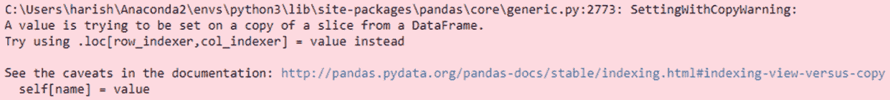

要了解如何摆脱它，我们需要了解`SettingWithCopyWarning`实际代表什么。

我们都知道，Pandas 中的不同数据操作会返回数据视图或副本。 修改数据时，这可能会引起问题。`SettingWithCopyWarning`的目的是警告我们，当我们想修改副本时，我们可能正在尝试修改原始数据，反之亦然。 这种情况通常在链接分配期间发生。

解决方案是使用`block`方法将患者链合并为一个手术。 这可以帮助 Pandas 知道必须修改哪个数据帧。

为了更好地理解这一点，让我们看下面的示例。

与往常一样，我们首先将`pandas`模块导入到 Jupyter 笔记本中，如下所示：

```py
import pandas as pd
```

然后，我们读取 CSV 数据集：

```py
data = pd.read_csv('data-titanic.csv')
data.head()
```

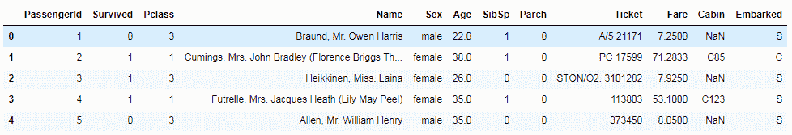

此后，我们继续创建一个可能遇到`SettingWithCopyWarning`的场景。 对于此示例，我们选择`Age`列为空的记录，并将它们设置为等于`Age`列中值的平均值。 以下是生成的错误：

```py
data[data.Age.isnull()].Age = data.Age.mean()
```


为了确认我们的代码不起作用，我们需要检查是否还有`Age`为空的记录。 这是通过使用以下代码完成的：

```py
data[data.Age.isnull()].Age.head()
```

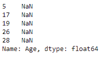

很明显，存在这样的记录。 为了处理这种情况，我们使用`loc`方法，如下所示：

```py
data.loc[data.Age.isnull(), 'Age'] = data.Age.mean
```

此时，我们需要返回以确认该方法是否已解决`SettingWithCopyWarning`，我们通过使用以下代码行来完成此操作：

```py
data[data.Age.isnull()]
```


我们可以看到，问题尚未解决，因此处理警告的另一种方法是将其关闭。 我们需要记住，我们能够并且应该将其关闭的唯一原因是因为它是警告，而不是错误。 为此，我们将`mode.chained_assignment`选项设置为`None`：

```py
pd.set_option('mode.chained_assignment', None)
```

不建议使用此解决方案，因为这可能会影响我们的运营结果。 解决此警告的另一种方法是使用`is_copy`方法。 在这里，我们创建数据帧的新副本并将`is_copy`设置为`None`，如下所示：

```py
data1 = data.loc[data.Age.isnull()]
data1.is_copy = None
```

现在让我们看一下如何将函数应用于 Pandas 序列或数据帧。

# 将函数应用于 Pandas 序列或数据帧

在本节中，我们将学习如何将 Python 的预构建函数和自构建函数应用于 pandas 数据对象。 我们还将学习有关将函数应用于 Pandas 序列和 Pandas 数据帧的知识。

首先，将`pandas`模块导入 Jupyter 笔记本：

```py
import pandas as pd 
import numpy as np
```

我们将读取我们的 CSV 数据集：

```py
data = pd.read_csv('data-titanic.csv')
data.head()
```

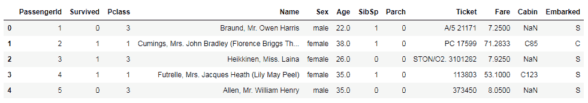

让我们继续使用 Pandas 的`apply`方法来应用函数。 在此示例中，我们将使用`lambda`创建一个函数，如下所示：

```py
func_lower = lambda x: x.lower()
```

在这里，我们传递一个值`x`并将其转换为小写。 然后，我们使用`apply()`方法将此函数应用于数据集中的`Name`字段，如下所示：

```py
data.Name.apply(func_lower)
```

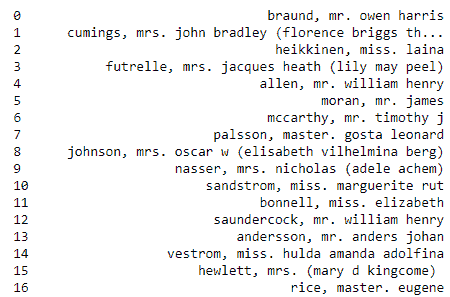

如果仔细观察，`Name`字段中的值已转换为小写。 接下来，我们了解如何将函数应用于多个列或整个数据帧中的值。 我们可以使用`applymap()`方法。 它以类似于`apply()`方法的方式工作，但是在多列或整个数据帧上。 以下代码描述了如何将`applymap()`方法应用于`Age`和`Pclass`列：

```py
data[['Age', 'Pclass']].applymap(np.square)
```

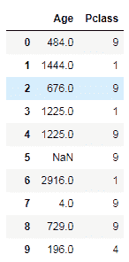

我们还将 Numpy 的`secure`方法应用于这两个列。

前面的步骤用于预定义函数。 现在，让我们继续创建自己的函数，然后将其应用于值，如下所示：

```py
def my_func(i):
        return i + 20
```

创建的函数是一个简单的函数，它带有一个值，将`20`添加到其中，然后返回结果。 我们使用`applymap()`将此函数应用于`Age`和`Pclass`列中的每个值，如下所示：

```py
data[['Age', 'Pclass']].applymap(my_func)
```

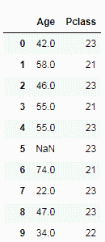

让我们继续学习有关将多个数据帧合并和连接在一起的知识。

# 将多个数据帧合并并连接成一个

本节重点介绍如何使用 Pandas `merge()`和`concat()`方法组合两个或多个数据帧。 我们还将探讨`merge()`方法以各种方式加入数据帧的用法。

我们将从导入`pandas`模块开始。 让我们创建两个数据帧，其中两个都包含具有相同数据但具有不同记录的相同参数：

```py
dataset1 = pd.DataFrame({'Age': ['32', '26', '29'],
                         'Sex': ['F', 'M', 'F'],
                         'State': ['CA', 'NY', 'OH']},
                         index=['Jane', 'John', 'Cathy'])
dataset2 = pd.DataFrame({'Age': ['34', '23', '24', '21'],
                         'Sex': ['M', 'F', 'F', 'F'],
                         State': ['AZ', 'OR', 'CA', 'WA']}, 
                         index=['Dave', 'Kris', 'Xi', 'Jo'])
dataset1
dataset2
```

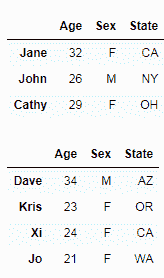

在此示例中，让我们将这两个数据帧垂直放置在一起。 使用 pandas `concat()`方法通过传递两个数据帧作为其参数来执行此操作：

```py
pd.concat([dataset1, dataset2])
```

我们可以看到`dataset2`已垂直附加到`dataset1`。

连接数据集的另一种方法是使用`append()`方法。 使用此方法获得的结果将与以前的方法相同：

```py
dataset1.append(dataset2)
```

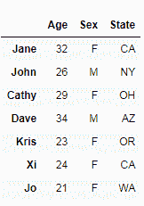

到目前为止，我们已经连接了数据集中的行，但是也可以连接列。 对于此示例，让我们创建两个新的数据集，它们具有相同的行级别但具有不同的列，如下所示：

```py
dataset1 = pd.DataFrame({'Age': ['32', '26', '29'],
                         'Sex': ['F', 'M', 'F'],
                         'State': ['CA', 'NY', 'OH']},
                         index=['Jane', 'John', 'Cathy'])
dataset2 = pd.DataFrame({'City': ['SF', 'NY', 'Columbus'],
                         'Work Status': ['No', 'Yes', 'Yes']},
                         index=['Jane', 'John', 'Cathy'])
```

在这种情况下，我们将水平连接。 要按列连接，我们需要将`axis`参数传递为`1`：

```py
pd.concat([dataset1, dataset2], axis=1)
```

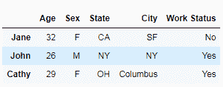

数据集连接的第三个变体是连接具有不同行和列的数据集。 我们首先创建两个具有不同参数的数据集，如下所示：

```py
dataset1 = pd.DataFrame({'Age': ['32', '26', '29'],
                         'Sex': ['F', 'M', 'F'],
                         'State': ['CA', 'NY', 'OH']},
                         index=['Jane', 'John', 'Cathy'])
dataset2 = pd.DataFrame({'City': ['SF', 'NY', 'Columbus'],
                         'Work Status': ['No', 'Yes', 'Yes']},
                         index=['Jane', 'John', 'Cathy'])
```

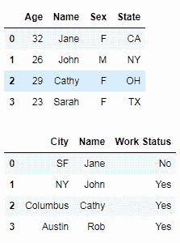

为了对这些数据集执行内部合并，我们将数据帧传递给`merge()`方法。 我们还指定必须在其上进行合并的列，同时确保我们指定它是内部合并。 您的数据集应类似于下表：

```py
pd.merge(dataset1, dataset2, on='Name', how='inner')
```

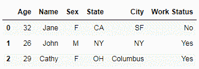

现在，这意味着我们将两个数据集中的数据放在一起。 它仅包含在两个数据帧中具有通用标签的那些行。 接下来，我们进行外部合并。 这是通过将`how`参数作为`left`传递给`merge()`方法来完成的：

```py
pd.merge(dataset1, dataset2, on='Name', how='left')
```

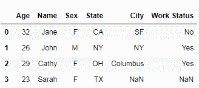

此操作的结果是将保留两个数据集中的行以及仅在第一个数据集中存在的行。 第二个数据集中仅存在的行将被丢弃。 为了进行右合并，我们将`how`参数设置为`right`：

```py
pd.merge(dataset1, dataset2, on='name', how='right')
```

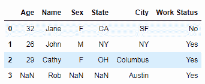

为了保留所有内容，我们进行了完整的外部合并。 通过将`how`参数传递为`outer`来完成完整的外部合并：

现在，即使对于没有值并标记为`NaN`的列，它也包含所有行，而不管它们是否存在于一个或另一个数据集中，或存在于两个数据集中。

# 总结

在本章中，我们学习了各种 Pandas 技术来操纵和重塑数据。 我们学习了如何使用`inplace`参数修改 Pandas 数据帧。 我们还学习了可以使用`groupby`方法的方案。 我们看到了如何处理 Pandas 中缺失的值。 我们探索了 Pandas 数据帧中的索引，以及重命名和删除 Pandas 数据帧中的列。 我们学习了如何处理和转换日期和时间数据。 我们学习了如何处理`SettingWithCopyWarning`，还了解了如何将函数应用于 Pandas 序列或数据帧。 最后，我们学习了如何合并和连接多个数据帧。

在下一章中，我们将学习使用`seaborn` Python 库将数据可视化的技术，像一个专家一样。