# 像专业人士一样可视化数据

在本章中，我们将学习使用 seaborn 数据可视化库的数据可视化的高级技术。

特别是，我们将涵盖以下主题：

*   如何开始 Seaborn
*   海生的特征
*   绘制不同类型的地块
*   用 seaborn 绘制分类图
*   使用数据感知网格进行绘图

# 控制情节美学

在本节中，我们将学习如何使用 seaborn 绘图库来控制绘图美学。 我们将学习如何安装 seaborn 并开始使用 seaborn，以及我们需要导入的模型。 我们将探索一些海洋绘图方法来绘制几种不同类型的绘图。 我们还将看到如何使用各种 seaborn 方法和属性来控制和更改地块美观性。

在开始用 seaborn 创建地块之前，我们需要先安装它。 在本书中，我们一直在使用 Anaconda 来安装各种 Python 库，因此我们将继续进行下去。 要安装 seaborn，请执行以下命令：

```py
conda install seaborn
```

执行命令之前，请确保在管理员模式下运行命令行程序。 现在，我们需要导入本节所需的 Python 模块，如下所示：

```py
import pandas as pd
from matplotlib import pyplot as plt
%matplotlib inline
import seaborn as sns
```

我们需要导入 Pandas 的 Matplotlib 和 seaborn 模块。 我们正在使用 Matplotlib 的 inline magic 命令来确保我们的绘图连同代码一起正确显示在 Jupyter Notebook 中。

接下来，我们使用 pandas 和以下命令读取数据集：

```py
df = pd.read_csv('data-alcohol.csv')
df.head()
```

我们的数据集是 CSV 文件。 它由各个国家的酒精消费数据组成。 [该数据可通过这里获得](https://github.com/fivethirtyeight/data/tree/master/alcohol-consumption)。

# 我们与 seaborn 的第一个情节

在本节中，我们将仅使用一个变量来创建分布图，如下所示：

```py
sns.distplot(df.beer_servings)
```

在这里，`sns`指的是 seaborn，我们之前将其导入为`sns`。 现在我们需要将 seaborn 方法称为`distplot`，并从我们之前阅读的数据中传入列名。 如下面的屏幕快照所示，这应该可以使我们通过一行代码就能得到一个不错的分布图：

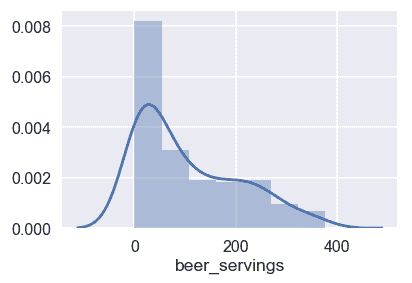

此单行显示了 seaborn 库的强大功能和简单性。

# 使用 set_style 更改绘图样式

现在是时候让 Seaborn 改变情节美学了。 在此过程中，我们还将探索许多不同的地块类型，可以使用 seaborn 进行绘制。

# 将绘图背景设置为白色网格

默认的打印样式是蓝色网格。 我们可以使用以下命令将其更改为`whitegrid`：

```py
sns.set()
sns.set_style("whitegrid")
sns.lmplot(x='beer_servings', y='wine_servings', data=df);
```

Seaborn 提供了一种称为`set_style`的方法，我们将其称为`whitegrid`作为参数。 然后，我们调用绘图方法来绘制散点图。 我们正在使用 seaborn 的`lmplot`方法。 然后，我们从数据集中传递两个列名称为`x`和`y`，并将 data 参数设置为我们的 pandas DataFrame。 现在，我们应该有一个带有白色网格背景的散点图，如以下屏幕截图所示：

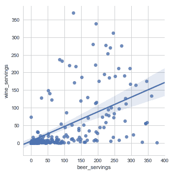

# 将情节背景设置为黑暗

现在我们将研究如何将绘图背景设置为`dark`并且没有网格。 为此，我们使用以下命令将样式设置为`dark`：

```py
sns.set()
sns.set_style("dark")
sns.lmplot(x='beer_servings', y='wine_servings', data=df, fit_reg=False);
```

您可能已经注意到，我们在开始时还有另一行代码`sns.set()`。 通过调用此命令，我们在进行任何更改之前将情节美感重置为默认值。 我们这样做是为了确保我们之前所做的更改不会影响我们的总体规划，如下所示：

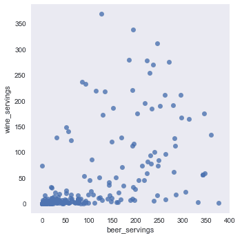

# 将背景设置为白色

我们还可以使用以下代码将图的背景设置为实心`white`且没有网格。

```py
sns.set()
sns.set_style("white")
sns.swarmplot(x='country', y='wine_servings', data=df);
```

输出如下：

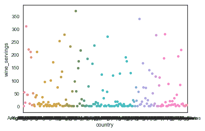

# 添加刻度

我们可以通过将`style`设置为`ticks`来添加刻度线，如以下代码所示：

```py
sns.set()
sns.set_style("ticks")
sns.boxplot(data=df);
```

前面的代码应为我们提供以下输出：

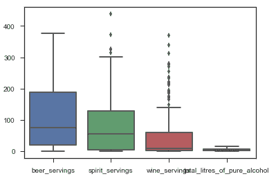

在这里，我们还演示了如何通过从 seaborn 调用`boxplot`方法来创建箱形图。

# 定制风格

在 seaborn 中，我们可以自定义预设样式，甚至比以前讨论的更多。 让我们向您展示我们可以做什么！

# 样式参数

首先让我们看一下这些样式组成的所有参数。 我们可以通过在 seaborn 上调用`axes_style`方法来获取参数，如下所示：

```py
sns.axes_style()
```

前面代码的输出如下：

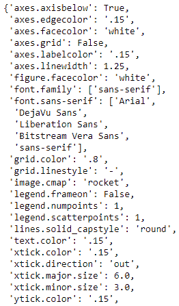

可以进一步自定义上述每个参数。 让我们尝试自定义其中之一，如以下代码片段所示：

```py
sns.set()
sns.set_style("ticks", {"axes.facecolor": ".1"})
sns.boxplot(data=df);
```

在前面的代码中，我们将`style`设置为`ticks`，背景为纯白色，但是我们可以通过分别设置`facecolor`来进一步自定义。 对于前面的代码，我们将获得以下输出：

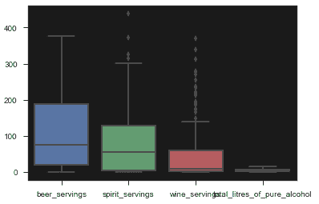

请注意，我们可以向此字典添加更多参数，然后继续自定义绘图。

# 绘制上下文预设

Seaborn 还提供了一些预设样式上下文。 例如，到目前为止，我们一直在使用的默认样式上下文称为`notebook`。 但是，还有更多，包括一个叫做`paper`的。 使用称为`set_context`的方法设置此上下文，我们将`paper`作为参数传递，如下所示：

```py
sns.set()
sns.set_context("paper")
sns.lmplot(x='beer_servings', y='wine_servings', data=df);
```

先前代码的输出如下：

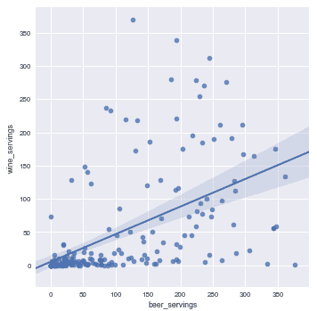

还有更多可用的上下文。 例如，称为`talk`的一个。 我们可以使用`talk`设置该上下文，如下所示：

```py
sns.set()
sns.set_context("talk")
plt.figure(figsize=(8, 6))
sns.lmplot(x='beer_servings', y='wine_servings', data=df);
```

前面代码的输出如下：

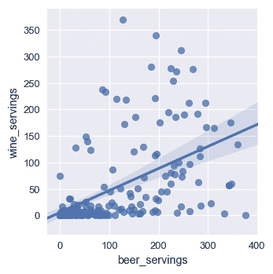

我们可以使用的另一个上下文称为`poster`，它使用以下代码设置：

```py
sns.set()
sns.set_context("poster")
plt.figure(figsize=(8, 6))
sns.lmplot(x='beer_servings', y='wine_servings', data=df);
```

输出如下：

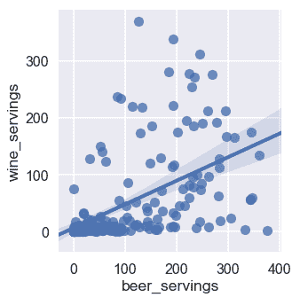

# 选择地块的颜色

在本节中，我们将学习使用调色板自定义 seaborn 中的地块颜色。 我们将探索 seaborn 和 Matplotlib 提供的一些调色板。 我们将学习如何通过设置不同的调色板来更改绘图的颜色，并且还将学习如何使用自定义颜色创建自己的调色板。

首先，使用以下代码导入 Jupyter Notebook 中所需的模块：

```py
import pandas as pd
from matplotlib import pyplot as plt
%matplotlib inline
import seaborn as sns
```

我们需要导入 Pandas，Matplotlib 和 seaborn。 然后，我们需要读取 CSV 数据集； 我们使用`read_csv`方法执行此操作，如下所示：

```py
df = pd.read_csv('data-alcohol.csv')
df.head()

```

前面代码的输出如下：

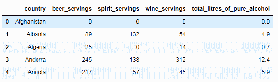

现在我们需要使用 seaborn 来调用`color_palette`方法来获取当前的调色板，该调色板是默认设置的。 然后我们使用`palplot`方法显示这些颜色，如下所示：

```py
sns.palplot(sns.color_palette())
```

前面代码的输出如下：

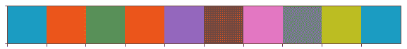

现在让我们看一下该调色板在绘图中的外观：

```py
sns.set()
sns.boxplot(data=df);
```

前面代码的输出应类似于以下屏幕截图：

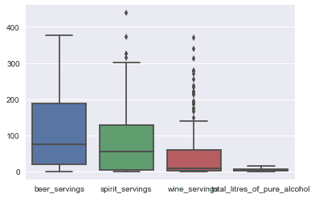

在这里，我们在数据集上绘制了箱形图。 您可能会注意到，配色方案看上去与我们在打印默认调色板时看到的相似。

# 更改调色板

让我们继续并更改调色板，以了解它如何影响绘图的颜色。 以下代码将调色板设置为`bright`（seaborn 的预定义调色板之一）：

```py
sns.set_palette("bright")
```

让我们看看如何使用以下命令来改变绘图的颜色：

```py
sns.boxplot(data=df);
```

现在，输出应类似于以下屏幕截图：

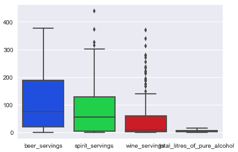

如您所见，由于我们设置了新的调色板，我们图的配色方案已经完全改变。`bright`不是 seaborn 中唯一的预定义调色板； 还有其他一些，包括`deep`，`muted`，`pastel`，`bright`，`dark`和`colorblind`，如下所示：

```py
sns.palplot(sns.color_palette("deep", 7))
sns.palplot(sns.color_palette("muted", 7))
sns.palplot(sns.color_palette("pastel", 7))
sns.palplot(sns.color_palette("bright", 7))
sns.palplot(sns.color_palette("dark", 7))
sns.palplot(sns.color_palette("colorblind", 7))
```

每个调色板的输出如下：

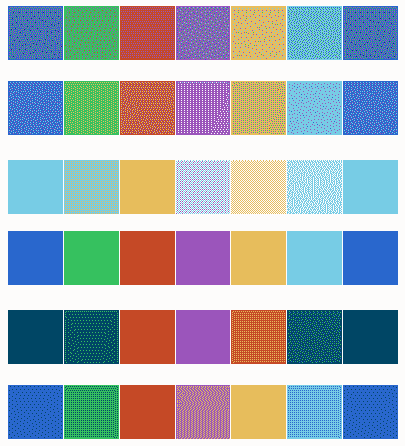

Seaborn 还可以将 Matplotlib 的颜色图设置为调色板。 例如：

```py
sns.palplot(sns.color_palette("RdBu", 7))
sns.palplot(sns.color_palette("Blues_d", 7))
```

上一条命令的输出如下：

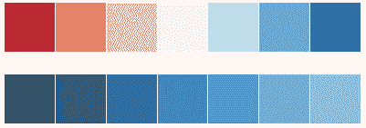

现在让我们使用 Matplotlib 颜色图之一作为调色板。 我们使用以下命令执行此操作：

```py

sns.set_palette("Blues_d")
```

在这里，我们将调色板设置为`Blues_d`，这是 Matplotlib 颜色图。 现在，让我们使用以下代码重绘图以查看其影响：

```py
sns.boxplot(data=df);
```

前面命令的输出应类似于以下屏幕截图：

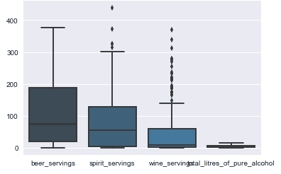

如您所见，我们的绘图现在具有来自蓝色色图的调色板。

# 建立自定义调色板

要构建自定义调色板，我们首先需要创建一个列表并为其分配所需的颜色，如下所示：

```py
my_palette = ['#4B0082', '#0000FF', '#00FF00', '#FFFF00', '#FF7F00', 
  '#FF0000']
sns.set_palette(my_palette)
sns.palplot(sns.color_palette())
```

输出如下：


在前面的屏幕截图中，我们创建了一个名为`my_palette`的新调色板，具有七种颜色。 然后，我们将调色板设置为新创建的调色板，该调色板向我们展示颜色的外观。

让我们使用以下命令，通过新的自定义调色板查看绘图的外观：

```py
sns.boxplot(data=df);
```

前面命令的输出应类似于以下屏幕截图：

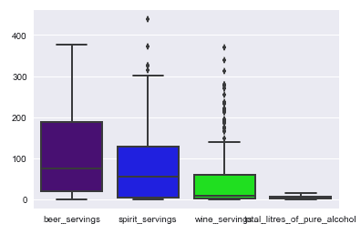

# 绘制分类数据

在本节中，我们将了解 seaborn 支持的各种分类图以及如何绘制它们。 我们将演示如何绘制包括散点图，实线图，箱形图，条形图等的图。 我们还将学习如何绘制宽形的分类图。

让我们开始使用以下代码在 Jupyter Notebook 中导入我们的 pandas 模块：

```py
import pandas as pd
from matplotlib import pyplot as plt
%matplotlib inline
import seaborn as sns
```

除了 Pandas，我们还需要导入 Matplotlib 和 Seaborn Python 库。 然后，我们读取 CSV 数据集，如下所示：

```py
df = pd.read_csv('data_simpsons_episodes.csv')
df.head()
```

本节中的数据集用于著名的动画电视连续剧《辛普森一家》：

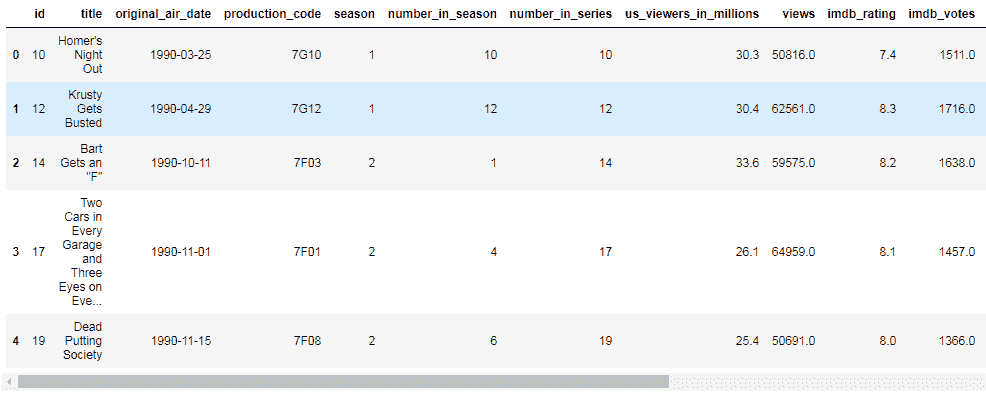

前面的数据集包含每个《辛普森一家》情节的发行日期，收视率数字，评分以及一系列其他观察结果。

# 散点图

让我们从绘制散点图开始； 我们使用以下命令执行此操作：

```py
sns.stripplot(x="season", y="us_viewers_in_millions", data=df);
```

输出应如下所示：

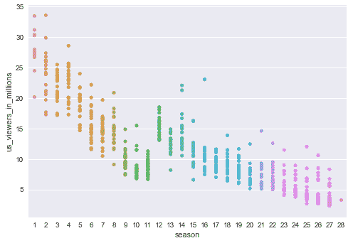

在这里，我们使用了 Seaborn 的`stripplot`方法。 我们在 *x* 轴上绘制了季节编号，并在 *y* 轴上绘制了以百万计的美国观众。 我们还指定了使用的 DataFrame 的名称。

# 群图

现在让我们绘制`swarmplot`。 为此，我们使用 seaborn 的`swarmplot`方法：

```py
sns.swarmplot(x="season", y="us_viewers_in_millions", data=df);
```

输出如下：

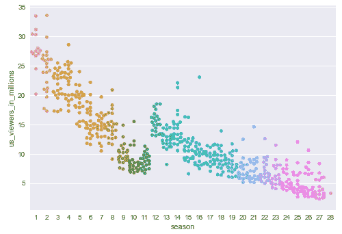

在这里，我们还通过了 *x* 轴上的季节编号，并在 *y* 轴上使用了数百万的观众。

# 箱形图

现在，我们使用相同的数据并使用`boxplot`方法创建箱形图，如下所示：

```py
sns.boxplot(x="season", y="us_viewers_in_millions", data=df);
```

上一条命令的输出如下：

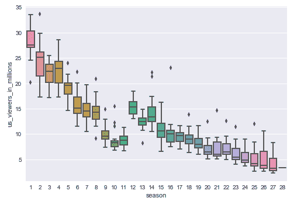

# 小提琴情节

使用`violinplot()`方法创建小提琴图，如下所示：

```py

sns.violinplot(x="season", y="us_viewers_in_millions", data=df);
```

前面代码的输出如下：

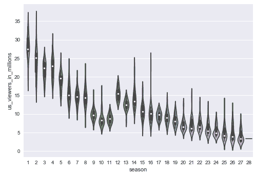

# 条形图

要绘制条形图，我们使用以下`barplot`方法：

```py
sns.barplot(x="season", y="us_viewers_in_millions", data=df);
```

输出如下：

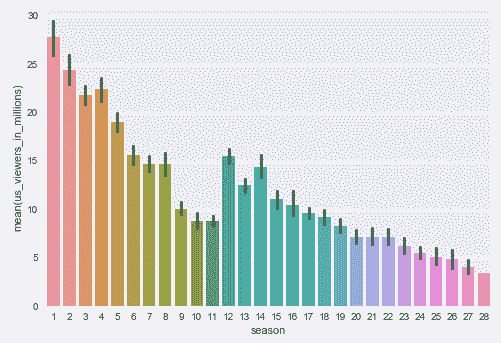

请注意，还有另一种条形图可用，这些条形图是使用`countplot`方法绘制的，如下所示：

```py
sns.countplot(x="season", data=df);
```

前面代码的输出如下：

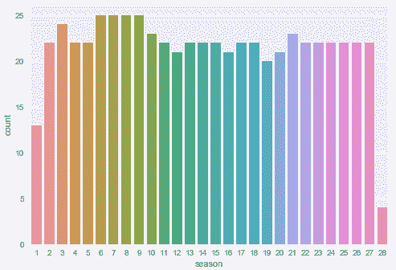

当您要显示每个类别中的观察次数而不是计算第二个变量的状态时，可以使用这种样式的图。

# 宽形图

Seaborn 还支持宽格式的数据图。 让我们阅读以下数据集来演示一个：

```py
df = pd.read_csv('data-alcohol.csv')
df.head()
```

输出如下：


我们可以使用以下命令创建宽形箱形图：

```py
sns.boxplot(data=df, orient="h");
```

前面代码的输出如下：


在这里，我们通过传入数据集并将方向作为`h`来创建宽幅箱形图。

# 使用数据感知网格进行绘图

在本节中，我们将学习在数据集的不同子集上绘制同一图的多个实例。 我们将学习使用 seaborn 的`FacetGrid`方法进行网格绘图。 我们还将探索 seaborn 的`PairGrid`和`PairPlot`方法进行网格绘图。

让我们从下面的代码在 Jupyter Notebook 中导入 Python 模块开始：

```py
import pandas as pd
from matplotlib import pyplot as plt
%matplotlib inline
import seaborn as sns
```

现在，我们需要使用以下代码读取第一个 CSV 数据集：

```py
df = pd.read_csv('data-titanic.csv')
df.head()
```

The output from the preceding command is as follows:

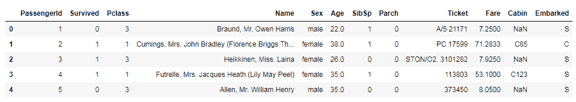

# 使用`FacetGrid()`方法进行绘图

让我们开始研究如何使用`FacetGrid`方法绘制多维图，如以下代码所示：

```py
g = sns.FacetGrid(df, col="Sex", hue='Survived')
g.map(plt.hist, "Age");
g.add_legend();
```

前面代码的输出应类似于以下屏幕截图：

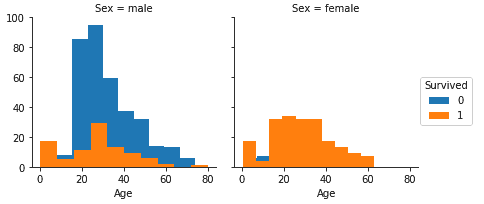

在这里，我们已经使用`FacetGrid`方法绘制了男性和女性乘客的两个并排直方图。 这种并排显示有助于我们比较按年龄划分的男女乘客的存活率。 为了进行绘制，我们首先使用`FacetGrid`方法创建了一个网格。 然后，我们将数据集的 DataFrame 列传递为`Sex`，将`hue`传递为`Survived`。 **色相**代表情节的深度。 然后，这创建了带有两个分别用于男性和女性乘客的地块的网格。 然后我们在网格上调用`map`方法并传递了`plt.hist`和`Age`参数，它们绘制了我们的两个直方图。 最后，我们使用`add_legend`方法添加了图例。

# 使用`PairGrid()`方法进行绘图

现在让我们看看如何使用`PairGrid`方法绘制可识别网格的图。 我们正在为此使用 MLB 播放器数据集，如以下代码所示：

```py
mlb = pd.read_csv('data-mlb-players.csv')
mlb.head()
```

输出如下：

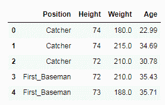

(Source: http://wiki.stat.ucla.edu/socr/index.php/SOCR_Data_MLB_HeightsWeights)

让我们用以下代码创建一个图：

```py
g = sns.PairGrid(mlb, vars=["Height", "Weight"], hue="Position")
g.map(plt.scatter);
g.add_legend();
```

在这里，我们已经传递了 MLB 球员的数据集，并将`vars`设置为包含球员的`Height`和`Weight`的列表。 然后我们将`hue`设置为`Position`。 然后我们在此网格上使用`scatterplot`方法调用`map`。 最后，我们添加了图例，该图例提供了一个 2 x 2 网格，其中包括身高和体重曲线的所有组合，如以下屏幕截图所示：

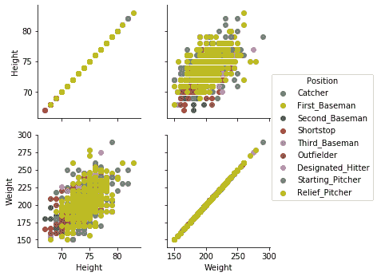

这些位置的深度由玩家位置列提供。

# 使用`PairPlot()`方法进行绘图

通过传递数据集可以直接调用`PairPlot`，如下所示。 深度由`hue`和`size`参数组成：

```py
sns.pairplot(mlb, hue="Position", size=2.5);
```

前面的命令为我们提供了 3 x 3 网格中的多图。 这是因为我们对每个位置都有三个观察值或列，如以下屏幕截图所示：

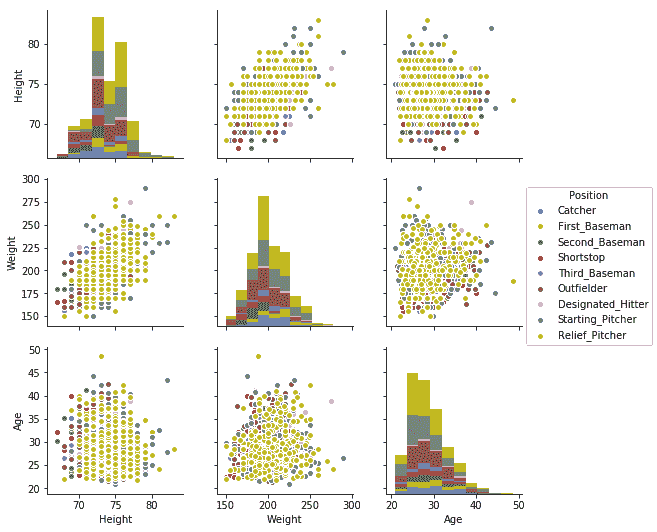

当前观察到的是`Height`，`Weight`和`Age`。

# 摘要

在本章中，我们了解了使用 Seaborn 的数据可视化库进行数据可视化的高级技术。 我们学习了如何开始 seaborn，然后探索了其中的一些功能，包括如何控制情节的美感，如何选择情节的颜色等等。 我们学习了如何绘制几种不同类型的图，以及如何使用 seaborn 绘制分类数据。 最后，我们学习了如何使用数据感知网格来创建图。