# 三、使用 NumPy 统计功能对波士顿住房数据进行探索性数据分析

**探索性数据分析**（**EDA**）是数据科学项目的重要组成部分（如图 *数据科学过程* 所示） ）。 尽管在将任何统计模型或机器学习算法应用于数据之前这是非常重要的一步，但许多从业人员经常忽略或低估了它：


Data Science Process (https://en.wikipedia.org/wiki/Data_analysis)

John Wilder Tukey 于 1977 年通过他的著作*探索性数据分析*促进了探索性数据分析。 在他的书中，他指导统计学家通过使用几种不同的视觉手段对统计数据集进行统计分析，这将帮助他们制定假设。 此外，在确定关键数据特征并了解有关数据的哪些问题后，EDA 还可以用于为高级建模准备分析。 在较高的层次上，EDA 是对您的数据的无假设探索，它利用了定量方法，使您可以可视化结果，从而可以识别模式，异常和数据特征。 在本章中，您将使用 NumPy 的内置统计方法执行探索性数据分析。

本章将涵盖以下主题：

*   加载和保存文件
*   探索数据集
*   看基本统计
*   计算平均值和方差
*   计算相关
*   计算直方图

## 加载和保存文件

在本节中，您将学习如何加载/导入数据并保存。 加载数据的方式有很多，正确的方式取决于您的文件类型。 您可以加载/导入文本文件，SAS / Stata 文件，HDF5 文件以及许多其他文件。 **HDF**（**分层数据格式**）是一种流行的数据格式，用于存储和组织大量数据，并且在处理多维同构数组时非常有用。 例如，Pandas 库有一个非常方便的类，名为`HDFStore`，您可以在其中轻松使用 HDF5 文件。 在从事数据科学项目时，您很可能会看到许多这类文件，但是在本书中，我们将介绍最受欢迎的文件，例如 **NumPy 二进制文件，** **文本文件**（`.txt`）和**逗号分隔值**（[`.csv`）文件。

如果内存和磁盘上有大量数据要管理，则可以使用`bcolz`库。 它提供了列式和压缩数据容器。 bcolz 对象称为`chunks`，您在其中将整个数据压缩为位，然后在查询时部分解压缩。 压缩数据后，它会非常高效地使用存储。 `bcolz` 对象也提高了数据获取性能。 如果您对该库的性能感兴趣。 您可以在其官方 GitHub 存储库 [https://github.com/Blosc/bcolz/wiki/Query-Speed-and-Compression](https://github.com/Blosc/bcolz/wiki/Query-Speed-and-Compression) 上检查查询和速度比较。

使用数组时，通常在完成使用后将它们另存为 NumPy 二进制文件。 原因是您还需要存储数组形状和数据类型。 重新加载阵列时，您希望 NumPy 记住它，并且您可以从上次中断的地方继续工作。 此外，即使您在具有不同体系结构的另一台计算机上打开文件， NumPy 二进制文件也可以存储有关阵列的信息。 在 NumPy 中，`load()`，`save()`，`savez()`和`savez_compressed()`方法可帮助您加载和保存 NumPy 二进制文件，如下所示：

```py
In [1]: import numpy as np
In [2]: example_array = np.arange(12).reshape(3,4)
In [3]: example_array
Out[3]: array([[ 0, 1, 2, 3],
               [ 4, 5, 6, 7],
               [ 8, 9, 10, 11]])
In [4]: np.save('example.npy',example_array)
In [5]: d = np.load('example.npy')
In [6]: np.shape(d)
Out[6]: (3, 4)
In [7]: d
Out[7]: array([[ 0, 1, 2, 3],
               [ 4, 5, 6, 7],
               [ 8, 9, 10, 11]])
```

在前面的代码中，我们执行以下步骤来练习将数组保存为二进制文件，以及如何在不影响其形状的情况下将其加载回：

1.  创建形状为*（3,4）*的数组
2.  将数组另存为二进制文件
3.  装回阵列
4.  检查形状是否仍然相同

同样，您可以使用 `savez()` 功能将多个阵列保存到单个文件中。 如果要将文件另存为压缩的 NumPy 二进制文件，则可以按以下方式使用 `savez_compressed()` ：

```py
In [8]: x = np.arange(10)
        y = np.arange(12)
        np.savez('second_example.npz',x, y)
        npzfile = np.load('second_example.npz')
        npzfile.files
Out[8]: ['arr_0', 'arr_1']
In [9]: npzfile['arr_0']
Out[9]: array([0, 1, 2, 3, 4, 5, 6, 7, 8, 9])
In [10]: npzfile['arr_1']
Out[10]: array([ 0, 1, 2, 3, 4, 5, 6, 7, 8, 9, 10, 11])
In [11]: np.savez_compressed('compressed_example.npz', first_array = x , second_array = y)
         npzfile = np.load('compressed_example.npz')
         npzfile.files
Out[11]: ['first_array', 'second_array']
In [12]: npzfile['first_array']
Out[12]: array([0, 1, 2, 3, 4, 5, 6, 7, 8, 9])
In [13]: npzfile['second_array']
Out[13]: array([ 0, 1, 2, 3, 4, 5, 6, 7, 8, 9, 10, 11])
```

当您将多个数组保存在单个文件中时，如果您提供关键字参数如`first_array=x`，则将使用该名称保存数组。 否则，默认情况下，您的第一个数组将被赋予一个变量名，例如`arr_0`。 NumPy 具有称为`loadtxt()`的内置功能，用于从文本文件加载数据。 让我们加载一个`.txt`文件，该文件由一些整数和一个标头组成，该标头是文件顶部的字符串：


在前面的代码中，由于无法将字符串转换为浮点数，因此会出现错误，这实际上意味着您正在读取非数字值。 这样做的原因是该文件在顶部包含作为标题的字符串以及数值。 如果知道标题有多少行，则可以使用`skiprows`参数跳过这些行，如下所示：

```py
In [15]: a = np.loadtxt("My_file.txt", delimiter='\t', skiprows=4)
         a
Out[15]: array([ 0., 1., 2., 3., 4., 5., 6., 7., 8.,
                 9., 10., 11., 12., 13., 14., 15., 16., 17.,
                 18., 19., 20., 21., 22., 23., 24., 25., 26.,
                 27., 28., 29., 30., 31., 32., 33., 34., 35.,
                 36., 37., 38., 39., 40., 41., 42., 43., 44.,
                 45., 46., 47., 48., 49., 50., 51., 52., 53.,
                 54., 55., 56., 57., 58., 59., 60., 61., 62.,
                 63., 64., 65., 66., 67., 68., 69., 70., 71.,
                 72., 73., 74., 75., 76., 77., 78., 79., 80.,
                 81., 82., 83., 84., 85., 86., 87., 88., 89.,
                 90., 91., 92., 93., 94., 95., 96., 97., 98.,
                 99., 100., 101., 102., 103., 104., 105., 106., 107.,
                 108., 109., 110., 111., 112., 113., 114., 115., 116.,
                 117., 118., 119., 120., 121., 122., 123., 124., 125.,
                 126., 127., 128., 129., 130., 131., 132., 133., 134.,
                 135., 136., 137., 138., 139., 140., 141., 142., 143.,
                 144., 145., 146., 147., 148., 149., 150., 151., 152.,
                 153., 154., 155., 156., 157., 158., 159., 160., 161.,
                 162., 163., 164., 165., 166., 167., 168., 169., 170.,
                 171., 172., 173., 174., 175., 176., 177., 178., 179.,
                 180., 181., 182., 183., 184., 185., 186., 187., 188.,
                 189., 190., 191., 192., 193., 194., 195., 196., 197.,
                 198., 199., 200., 201., 202., 203., 204., 205., 206.,
                 207., 208., 209., 210., 211., 212., 213., 214., 215.,
                 216., 217., 218., 219., 220., 221., 222., 223., 224.,
                 225., 226., 227., 228., 229., 230., 231., 232., 233.,
                 234., 235., 236., 237., 238., 239., 240., 241., 242.,
                 243., 244., 245., 246., 247., 248., 249.])
```

另外，您可以使用`genfromtxt()`并将标头的转换默认设置为`nan`。 然后，您可以检测到标题占用了多少行，并使用`skip_header`参数跳过它们，如下所示：

```py
In [16]: b = np.genfromtxt("My_file.txt", delimiter='\t')
         b
Out[16]: array([ nan, nan, nan, nan, 0., 1., 2., 3., 4.,
                 5., 6., 7., 8., 9., 10., 11., 12., 13.,
                 14., 15., 16., 17., 18., 19., 20., 21., 22.,
                 23., 24., 25., 26., 27., 28., 29., 30., 31.,
                 32., 33., 34., 35., 36., 37., 38., 39., 40.,
                 41., 42., 43., 44., 45., 46., 47., 48., 49.,
                 50., 51., 52., 53., 54., 55., 56., 57., 58.,
                 59., 60., 61., 62., 63., 64., 65., 66., 67.,
                 68., 69., 70., 71., 72., 73., 74., 75., 76.,
                 77., 78., 79., 80., 81., 82., 83., 84., 85.,
                 86., 87., 88., 89., 90., 91., 92., 93., 94.,
                 95., 96., 97., 98., 99., 100., 101., 102., 103.,
                 104., 105., 106., 107., 108., 109., 110., 111., 112.,
                 113., 114., 115., 116., 117., 118., 119., 120., 121.,
                 122., 123., 124., 125., 126., 127., 128., 129., 130.,
                 131., 132., 133., 134., 135., 136., 137., 138., 139.,
                 140., 141., 142., 143., 144., 145., 146., 147., 148.,
                 149., 150., 151., 152., 153., 154., 155., 156., 157.,
                 158., 159., 160., 161., 162., 163., 164., 165., 166.,
                 167., 168., 169., 170., 171., 172., 173., 174., 175.,
                 176., 177., 178., 179., 180., 181., 182., 183., 184.,
                 185., 186., 187., 188., 189., 190., 191., 192., 193.,
                 194., 195., 196., 197., 198., 199., 200., 201., 202.,
                 203., 204., 205., 206., 207., 208., 209., 210., 211.,
                 212., 213., 214., 215., 216., 217., 218., 219., 220.,
                 221., 222., 223., 224., 225., 226., 227., 228., 229.,
                 230., 231., 232., 233., 234., 235., 236., 237., 238.,
                 239., 240., 241., 242., 243., 244., 245., 246., 247.,
                 248., 249.])
```

同样，您可以使用`loadtxt()`，`genfromtxt()`和`savetxt()`函数加载和保存`.csv`文件。 您唯一需要记住的是使用逗号作为定界符，如下所示：

```py
In [17]: data_csv = np.loadtxt("MyData.csv", delimiter=',')
In [18]: data_csv[1:3]
Out[18]: array([[ 0.21982, 0.31271, 0.66934, 0.06072, 0.77785, 0.59984,
                  0.82998, 0.77428, 0.73216, 0.29968],
                [ 0.78866, 0.61444, 0.0107 , 0.37351, 0.77391, 0.76958,
                  0.46845, 0.76387, 0.70592, 0.0851 ]])
In [19]: np.shape(data_csv)
Out[19]: (15, 10)
In [20]: np.savetxt('MyData1.csv',data_csv, delimiter = ',')
In [21]: data_csv1 = np.genfromtxt("MyData1.csv", delimiter = ',')
In [22]: data_csv1[1:3]
Out[22]: array([[ 0.21982, 0.31271, 0.66934, 0.06072, 0.77785, 0.59984,
                  0.82998, 0.77428, 0.73216, 0.29968],
                [ 0.78866, 0.61444, 0.0107 , 0.37351, 0.77391, 0.76958,
                  0.46845, 0.76387, 0.70592, 0.0851 ]])
In [23]: np.shape(data_csv1)
Out[23]: (15, 10)
```

加载`.txt`文件时，它们会默认返回带有值的`numpy`数组，如 代码后面的 中所示：

```py
In [24]: print (type(a))
         print (type(b))
         <class 'numpy.ndarray'>
         <class 'numpy.ndarray'>
```

您可以使用`tolist()`方法将数据从数组更改为列表，然后使用`savetxt()`使用不同的分隔符将其保存为新文件，如下所示：

```py
In [25]: c = a.tolist()
         c
Out[25]: [0.0,
         1.0,
         2.0,
         3.0,
         4.0,
         5.0,
         6.0,
         7.0,
         8.0,
         9.0,
         10.0,
         11.0,
         12.0,
         13.0,
         14.0,
         15.0,
         16.0,
         17.0,
         18.0,
         ...
In [26]: np.savetxt('My_List.txt',c, delimiter=';')
In [27]: myList = np.loadtxt("My_List.txt", delimiter=';')
         type(myList)
Out[27]: numpy.ndarray
```

将列表保存到`My_List.txt`后，可以使用`loadtxt()`加载此文件，它将再次作为`numpy`数组返回。 如果要返回数组的字符串表示形式，可以使用`array_str()`，`array_repr()`或`array2string()`方法，如下所示：

```py
In [28]: d = np.array_str(a,precision=1)
         d
Out[28]: '[ 0\. 1\. 2\. 3\. 4\. 5\. 6\. 7\. 8\. 9\. 10\. 11.\n 12\. 13\. 14\. 15\. 16\. 17\. 18\. 19\. 20\. 21\. 22\. 23.
          24\. 25\. 26\. ... ]' 
```

即使`array_str()`和`array_repr()`看起来一样，`array_str()`返回数组内部数据的字符串表示形式，而`array_repr()`实际上返回数组的字符串表示形式。 因此，`array_repr()`返回有关数组类型及其数据类型的信息。 这两个函数在内部都使用`array2string()`，这实际上是字符串格式化函数最灵活的版本，因为它具有更多可选参数。 以下代码块使用`load_boston()`方法加载波士顿房屋数据集：

```py
In [29]: from sklearn.datasets import load_boston
         dataset = load_boston()
         dataset
```

在本章中，您将对`sklearn.datasets`包中的示例数据集进行探索性数据分析。 该数据集是关于波士顿房价的。 在前面的代码中，`load_boston()`函数是从`sklearn.datasets`包中导入的，如您所见，它返回具有属性`DESCR`，`data`，`feature_names`和`target`的类似字典的对象 ]。 这些属性的详细信息如下：

| **属性** | **解释** |
| `DESCR` | 数据集的完整描述 |
| `data` | 功能栏 |
| `feature_names` | 功能名称 |
| `target` | 标签数据 |


在本节中，您学习了如何使用`numpy`功能加载和保存文件。 在下一部分中，您将探索波士顿住房数据集。

## 探索我们的数据集

在本节中，您将探索数据集并对其进行质量检查。 您将检查数据形状是什么，以及它的数据类型，所有丢失/ NaN 值，拥有多少个特征列以及每个列代表什么。 让我们开始加载数据并进行探索：

```py
In [30]: from sklearn.datasets import load_boston
         dataset = load_boston()
         samples,label, feature_names = dataset.data , dataset.target , dataset.feature_names
In [31]: samples.shape
Out[31]: (506, 13)
In [32]: label.shape
Out[32]: (506,)
In [33]: feature_names
Out[33]: array(['CRIM', 'ZN', 'INDUS', 'CHAS', 'NOX', 'RM', 'AGE', 'DIS', 'RAD',
                'TAX', 'PTRATIO', 'B', 'LSTAT'],
                dtype='<U7')
```

在前面的代码中，您加载了数据集并解析了数据集的属性。 这表明我们拥有具有`13`功能的`506`样本，并且具有`506`标签（回归目标）。 如果要阅读数据集的描述，可以使用`print(dataset.DESCR)`。 由于此代码的输出太长，无法放置在此处，因此您可以在以下屏幕截图中查看各种功能及其描述：


如第一章所示，您可以使用`dtype`检查阵列的数据类型。 如下面的代码所示，示例的每一列中都有一个数字`float64`数据类型和一个标签。 检查数据类型是非常重要的一步，您可能会意识到类型和列描述之间存在一些不一致，或者，如果您认为仍然可以实现，则可以通过更改其数据类型来减少数组的内存大小 您的目标值不太精确：

```py
In [35]: print(samples.dtype)
         print(label.dtype)
         float64
         float64
```

缺失值处理在 Python 软件包中略有不同。 `numpy`库没有丢失的值。 如果您的数据集中缺少值，则导入后它们将转换为`NaN`。 NumPy 中非常常见的方法是使用掩码数组以忽略`NaN`值，这在第一章中已向您展示：

```py
In [36]: np.isnan(samples)
Out[36]: array([[False, False, False, ..., False, False, False],
                [False, False, False, ..., False, False, False],
                [False, False, False, ..., False, False, False],
                ...,
                [False, False, False, ..., False, False, False],
                [False, False, False, ..., False, False, False],
                [False, False, False, ..., False, False, False]], dtype=bool)
In [37]: np.isnan(np.sum(samples))
Out[37]: False
In [38]: np.isnan(np.sum(label))
Out[38]: False
```

要针对数据中的`NaN`值逐元素进行测试，可以使用`isnan()`方法。 此方法将返回一个布尔数组。 对于大型数组而言，检测它是否返回 true 可能很麻烦。 在这种情况下，您可以将数组的`np.sum()`用作`isnan()`的参数，这样它将为结果返回单个布尔值。

在本节中，您将深入研究数据并进行常规质量检查。 在下一节中，我们将继续进行基本统计。

## 看基本统计

在本节中，您将从统计分析的第一步开始，计算数据集的基本统计信息。 即使 NumPy 的内置统计功能有限，我们也可以将其与 SciPy 结合使用。 在开始之前，让我们描述一下我们的分析将如何进行。 所有功能列和标签列都是数字，但您可能已经注意到 **Charles River 虚拟变量**（**CHAS**）列具有二进制值 *（0,1）*，这意味着它实际上是根据分类数据编码的。 分析数据集时，可以将列分为`Categorical`和`Numerical`。 为了一起分析它们，应将一种类型转换为另一种类型。 如果您具有分类值，并且想要将其转换为数字值，则可以通过将每个类别转换为数字值来实现。 该过程称为**编码**。 另一方面，可以通过将数值转换为类别对应物来执行装箱，类别对应物是通过将数据分成间隔来创建的。

我们将通过逐一探讨其功能来开始分析。 在统计中，此方法称为单变量分析。 单变量分析的目的主要围绕描述。 我们将计算最小值，最大值，范围，百分位数，均值和方差，然后绘制一些直方图并分析每个特征的分布。 我们将介绍偏度和峰度的概念，然后看一下修剪的重要性。 完成单变量分析后，我们将继续进行双变量分析，这意味着同时分析两个特征。 为此，我们将探索两组功能之间的关系：

```py
In [39]: np.set_printoptions(suppress=True, linewidth=125)
         minimums = np.round(np.amin(samples, axis=0), decimals=1)
         maximums = np.round(np.amax(samples, axis=0), decimals=1)
         range_column = np.round(np.ptp(samples, axis=0), decimals=1)
         mean = np.round(np.mean(samples, axis=0), decimals=1)
         median = np.round(np.median(samples, axis=0), decimals=1)
         variance = np.round(np.var(samples, axis=0), decimals=1)
         tenth_percentile = np.round(np.percentile(samples, 10, axis=0), decimals = 1)
         ninety_percentile = np.round(np.percentile(samples, 90 ,axis=0), decimals = 1)
In [40]: range_column
Out[40]: array([ 89\. , 100\. ,  27.3,   1\. ,   0.5,   5.2,  97.1,  11\. ,  23\. , 524\. ,   9.4, 396.6,                                                                           36.2])
```


在前面的代码中，我们首先使用`set_printoptions()`方法设置打印选项，以便查看四舍五入的小数位数，并且其线宽足以容纳所有列。 要计算基本统计信息，我们使用`numpy`函数，例如`amin()`，`amax()`，`mean()`，`median()`，`var()`，`percentile()`和`ptp()`。 所有计算都是按列进行的，因为每一列都代表一个要素。 最终的数组看起来有点草率且无用，因为您看不到哪行显示了哪些统计信息：

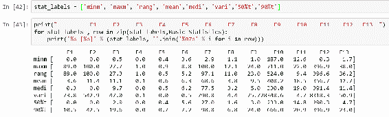

为了打印对齐的 numpy 数组，可以使用`zip()`函数添加行标签并在数组之前打印列标签。 在 SciPy 中，您可以使用更多统计功能来计算基本统计信息。 SciPy 提供`describe()`函数，该函数返回给定数组的一些描述性统计信息。 您可以使用一个函数来计算点，最小值，最大值，均值，方差，偏度和峰度，然后分别解析它们，如下所示：

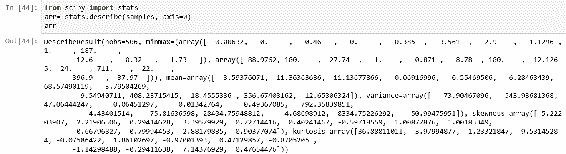

以下代码块分别计算基本统计信息并将其堆叠到最终数组中：

```py
In [45]: minimum = arr.minmax[0]
         maximum = arr.minmax[1]
         mean = arr.mean
         median = np.round(np.median(samples,axis = 0), decimals = 1)
         variance = arr.variance
         tenth_percentile = stats.scoreatpercentile(samples, per = 10, axis = 0)
         ninety_percentile = stats.scoreatpercentile(samples, per =90, axis = 0)
         rng = stats.iqr(samples, rng = (20,80), axis = 0)
         np.set_printoptions(suppress = True, linewidth = 125)
         Basic_Statistics1 = np.round(np.vstack((minimum,maximum,rng,                                                     mean,median,variance,tenth_percentile,ninety_percentile)), Basic_Statistics1.shape
Out[45]: (8, 13)
In [46]: stat_labels1 = ['minm', 'maxm', 'rang', 'mean', 'medi', 'vari', '50%t', '90%t']
```

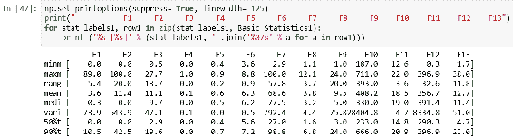

与 NumPy 相比，我们可以使用`iqr()`函数来计算范围。 此函数计算沿指定轴的数据的四分位数范围和**范围**（`rng`参数）。 默认情况下， *rng =（25，75），*，这意味着该函数将计算数据的第 75 和第 25 个百分位数之间的差。 为了返回与`numpy.ptp()`函数相同的输出，可以使用 rng =（0，100）*和*，因为这将计算所有给定数据的范围。 W e 使用 `stat.scoreatpercentile()`作为与 `numpy.percentile()` 方法 等效的 n 特征的第 90 个百分点值。 如果您看一眼结果，您会发现几乎每个功能的差异都很大。 您可以看到，由于我们通过将参数传递为`(20,80)`来限制范围计算，因此范围值显着减小。 此 和 也向您展示了我们在分布式要素的两侧都有许多极值。 从我们的结果可以得出结论，对于大多数特征，平均值均高于中位数，这表明我们这些特征的分布偏向右侧。 在下一节中，当我们绘制直方图然后深入分析这些特征的偏度和峰度时，您将清楚地看到这一点。

## 计算直方图

直方图是数字数据分布的直观表示。 一百多年前，卡尔·皮尔森（Karl Pearson）首次提出了这一概念。 直方图是一种用于连续数据的条形图，而条形图直观地表示类别变量。 第一步，您需要将整个值范围划分为一系列间隔（仓位）。 每个垃圾箱必须相邻，并且它们不能重叠。 通常，垃圾箱大小相等，要包含的垃圾箱数量的经验法则是 5–20。 这意味着，如果您有 20 个以上的容器，则图形将很难阅读。 相反，如果您的箱数少于 5 个，则您的图形将很少了解数据的分布：

```py
In [48]: %matplotlib notebook
         %matplotlib notebook
         import matplotlib.pyplot as plt
         NOX = samples[:,5:6]
         plt.hist(NOX,bins ='auto')
         plt.title("Distribution nitric oxides concentration (parts per 10 million)")
         plt.show()
```

在前面的代码中，我们绘制了特征`NOX`的直方图。 箱柜计算自动完成，如下所示：

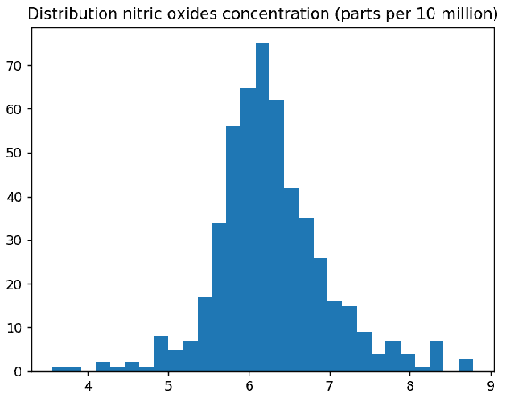

您可以通过将切片数组作为第一个参数，使用`pyplot.hist()`绘制直方图。 *y* 轴显示数据集中每个间隔（bin）中有多少值的计数， *x* 轴表示其值。 通过设置`normed=True`，您可以看到箱柜的百分比，如下所示：

```py
In [49]: plt.hist(NOX,bins ='auto', normed = True)
         plt.title("Distribution nitric oxides concentration (parts per 10 million)")
         plt.show()
```

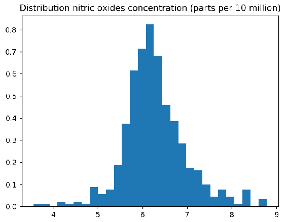

当您查看直方图时，可能很难计算每个 bin 及其边缘的大小。 当`pyplot.hist()`返回包含此信息的元组时，您可以轻松地获得这些值，如下所示：

```py
In [50]: import matplotlib.pyplot as plt
         NOX = samples[:,5:6]
         n, bins, patches = plt.hist(NOX, bins='auto')
         print('Bin Sizes')
         print(n)
         print('Bin Edges')
         print(bins)
```

在前面的代码中，我们打印出每个 bin 中包含多少个数字，以及 bin 的边是什么，如下所示：

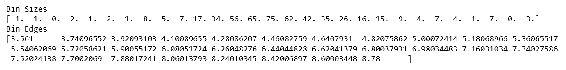

让我们解释一下前面的输出。 第一个 bin 的大小为`1`，这意味着此 bin 中仅存在一个值下降。 第一仓的间隔在`3.561`和`3.74096552`之间。 为了使它们更整洁，可以使用以下代码块，该代码块有意义地堆叠了这两个数组（`bin_interval`，`bin_size`）：

```py
In [51]: bins_string = bins.astype(np.str)
         n_string = n.astype(np.str)
         lists = []
         for i in range(0, len(bins_string)-1):
             c = bins_string[i]+ "-" + bins_string[i+1]
             lists.append(c)
        new_bins = np.asarray(lists)
        Stacked_Bins = np.vstack((new_bins, n_string)).T
        Stacked_Bins
```

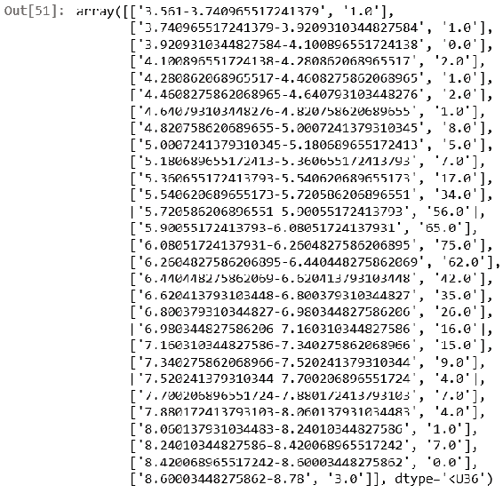

确定垃圾箱的数量及其宽度非常重要。 一些理论家对此进行试验以确定最佳拟合。 下表显示了最受欢迎的估算器。 您可以将估算器设置为`numpy.histogram()`中的`bins`参数，以相应地更改 bin 计算。 这些方法由`pyplot.hist()`函数隐式支持，因为其参数传递给`numpy.histogram()`：

| **估算器** | **公式** |
| 弗里德曼执事估算 | 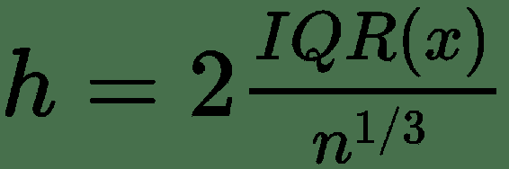 |
| 多恩的公式 | 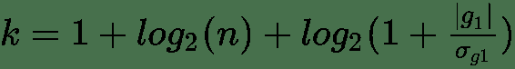 |
| 赖斯法则 | 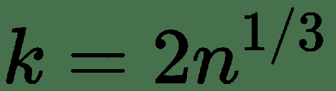 |
| 斯科特的正常参考规则 | 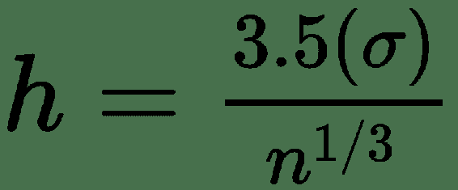 |
| 斯特吉斯公式 | 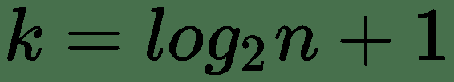 |
| 平方根选择 | 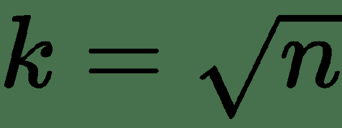 |

*IQR =四分位间距*

*g <sub class="calibre26">1</sub> =分布*的估计第三阶偏度

所有这些方法都有不同的优势。 例如，Strurges 公式对于高斯数据是最佳的。 Rice 的规则是 Sturges 公式的简化版本，并假定近似正态分布，因此，如果数据不是正态分布，则可能效果不佳。 Doane 的公式是 Sturges 公式的改进版本，尤其是在具有非正态分布的情况下。 Freedman–Diaconis 估计器是 Scott 规则的修改版本，他用 2 *IQR* 代替了 3.5 个标准差，这使公式对异常值的敏感性降低。 平方根选择是一种非常常见的方法，许多工具都以其快速简便的方式使用它。 在`numpy.histogram()`中，还有一个名为`'auto'`的选项，它为我们提供了最大的 Sturges 和 Freedman–Diaconis 估计器方法。 让我们看看这些方法将如何影响直方图：

```py
In [52]: fig, ((ax1, ax2, ax3),(ax4,ax5,ax6)) = plt.subplots(2,3,sharex=True)
         axs = [ax1,ax2,ax3,ax4,ax5,ax6]
         list_methods = ['fd','doane', 'scott', 'rice', 'sturges','sqrt']
         plt.tight_layout(pad=1.1, w_pad=0.8, h_pad=1.0)
         for n in range(0, len(axs)):
             axs[n].hist(NOX,bins = list_methods[n])
             axs[n].set_title('{}'.format(list_methods[n]))
```

在前面的代码中，我们编译了六个直方图，它们全部共享相同的 *x* 轴，如下所示：

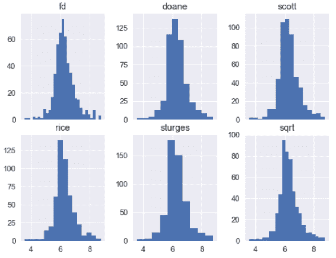

所有直方图都表示相同的特征，但具有不同的合并方法。 例如，`fd`方法显示数据看起来接近其正态分布，而另一方面，`doane`方法看起来更像学生的 *t* -分布。 另外，`sturges`方法会创建两个小容器，因此很难分析数据。 当我们查看基本统计数据时，我们指出大多数功能的均值均高于其中位数，因此他们将数据向右倾斜。 但是，如果您查看`sturges`，`rice`和`sqrt`方法，则很难这么说。 但是，当我们使用自动箱绘制直方图时，这是显而易见的：

```py
In [53]: import numpy as np
         samples_new = np.delete(samples, 3 , axis=1)
         samples_new.shape
Out[53]: (506, 12)
In [54]: %matplotlib notebook
         %matplotlib notebook
         import matplotlib.pyplot as plt
         fig,((ax1, ax2 , ax3),(ax4, ax5, ax6), (ax7, ax8, ax9), (ax10, ax11, ax12)) = plt.subplots(4,3,                                 figsize = (10,15))                   
         axs =[ax1, ax2 , ax3, ax4, ax5, ax6, ax7, ax8, ax9, ax10, ax11, ax12]
         feature_names_new = np.delete(feature_names,3)
         for n in range(0, len(axs)):
             axs[n].hist(samples_new[:,n:n+1], bins ='auto', normed = True)
             axs[n].set_title('{}'.format(feature_names[n]))
```

在前面的代码中，我们在单个布局中编译所有特征直方图。 这将帮助我们轻松比较它们。 前面代码的输出如下：

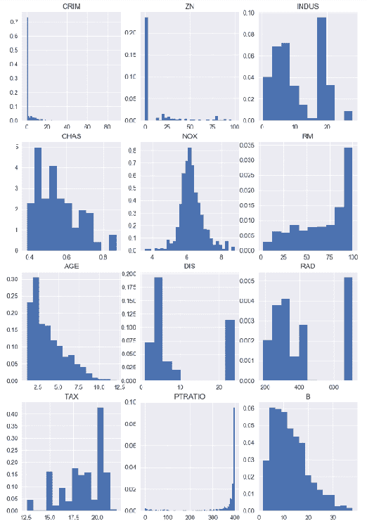

在前面的代码中，我们删除了 **CHAS** ，因为它包含二进制值，这意味着直方图将无助于我们进一步了解此功能。 我们还从功能列表中取出了功能名称，以便正确绘制其余功能。

从这些图表我们可以得出结论，在大多数城镇中，人均犯罪率非常低，但是在某些城镇中，这一比例非常高。 通常，住宅用地面积低于 25,000 英尺。在许多情况下，非零售业务用地所占土地不到整个城镇的 10％。 另一方面，我们可以看到许多城镇的非零售业务用地约为 20％。 一氧化氮的浓度非常偏斜，尽管此处存在一些离平均值很远的异常值。 每个住宅的平均房间数在 5 至 7 间之间。 在 1940 年之前建造的建筑物中，超过 50％的建筑物被其所有者占用。 他们中的大多数人离波士顿的就业中心都不远。 超过 10％的人无法轻松到达径向公路。 对于相当多的人来说，财产税很高。 通常，教室规模为 15 至 20 个孩子。 大多数城镇中居住的黑人比例非常相似。 大多数城镇居民的经济地位较低。 通过查看这些直方图，您可以得出许多其他结论。 如您所见，直方图在描述数据的分布方式时非常有用，并且可以看到平均值，方差和离群值。 在下一节中，我们将重点介绍偏度和峰度。

## 解释偏度和峰度

在统计分析中，力矩是一种定量度量，用于描述距参考点的预期距离。 如果期望参考点，则将其称为中心矩。 在统计中，中心矩是与均值相关的矩。 第一个和第二个矩分别是平均值和方差。 平均值是您的数据点的平均值。 方差是每个数据点与平均值的总偏差。 换句话说，方差表明您的数据如何与均值分散。 第三个中心矩是偏度，它测量均值分布的不对称性。 在标准正态分布中，偏度是对称的，因此等于零。 另一方面，如果均值

```py
In [55]: %matplotlib notebook
         %matplotlib notebook
         from scipy.stats import skewnorm
         fig, (ax1, ax2, ax3) = plt.subplots(1,3 ,figsize=(10,2.5))
         x1 = np.linspace(skewnorm.ppf(0.01,-3), skewnorm.ppf(0.99,-3),100)
         x2 = np.linspace(skewnorm.ppf(0.01,0), skewnorm.ppf(0.99,0),100)
         x3 = np.linspace(skewnorm.ppf(0.01,3), skewnorm.ppf(0.99,3),100)
         ax1.plot(skewnorm(-3).pdf(x1),'k-', lw=4)
         ax2.plot(skewnorm(0).pdf(x2),'k-', lw=4)
         ax3.plot(skewnorm(3).pdf(x3),'k-', lw=4)
         ax1.set_title('Left Skew')
         ax2.set_title('Normal Dist')
         ax3.set_title('Right Skew')
```

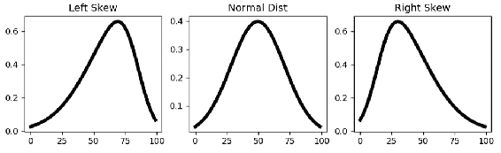

您可以使用`skewnorm()`函数轻松创建具有偏斜度的正态分布。 如您在前面的代码中看到的，我们生成一个具有 100 个值的百分点函数（与累积分布函数百分位数相反），然后创建具有不同偏斜度的线。 您不能直接得出结论，左偏斜比右偏斜好，反之亦然。 当分析数据的偏斜度时，您需要考虑这些尾巴会导致什么。 例如，如果您正在分析股票收益的时间序列，并将其绘制后看到一个正确的偏斜，则不必担心获得比预期更高的收益，因为这些离群值不会给您的股票带来任何风险。 交易策略。 当您分析服务器的响应时间时，可能会出现类似的示例。 当您绘制响应时间的概率密度函数时，您对左尾巴并不真正感兴趣，因为它们代表了快速的响应时间。

关于均值的第四个中心矩是峰度。 峰度描述了与分布曲线的平坦程度或变薄程度有关的尾部（离群值）。 在正态分布中，峰度等于 3。峰度主要有三种类型：`Leptokurtic`（薄），`Mesokurtic`和`Platykurtic`（平坦）：

```py
In [56]: %matplotlib notebook
         %matplotlib notebook
         import scipy
         from scipy import stats
         import matplotlib.pyplot as plt
         fig, (ax1, ax2, ax3) = plt.subplots(1, 3 , figsize=(10,2))
         axs= [ax1, ax2, ax3]
         Titles = ['Mesokurtic', 'Lebtokurtic', 'Platykurtic']
         #Mesokurtic Distribution - Normal Distribution
         dist = scipy.stats.norm(loc=100, scale=5)
         sample_norm = dist.rvs(size = 10000)
         #leptokurtic Distribution
         dist2 = scipy.stats.laplace(loc= 100, scale= 5)
         sample_laplace = dist2.rvs(size= 10000)
         #platykurtic Distribution
         dist3 = scipy.stats.cosine(loc= 100, scale= 5)
         sample_cosine = dist3.rvs(size= 10000)
         samples = [sample_norm, sample_laplace, sample_cosine]

         for n in range(0, len(axs)):
             axs[n].hist(samples[n],bins= 'auto', normed= True)
             axs[n].set_title('{}'.format(Titles[n]))
             print ("kurtosis of" + Titles[n])
             print(scipy .stats.describe(samples[n])[5])
```

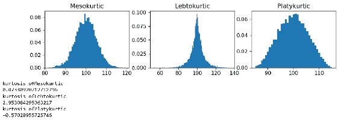

在前面的代码中，您可以更清楚地看到分布形状的差异。 所有峰度值均使用`stats.describe()`方法进行归一化，因此正态分布的实际峰度值约为 3，而归一化版本为 0.02。 让我们快速检查一下我们功能的偏度和峰度值是什么：

```py
In [57]: samples,label, feature_names = dataset.data , dataset.target , dataset.feature_names
         for n in range(0, len(feature_names_new)):
             kurt = scipy.stats.describe(samples[n])[5]
             skew = scipy.stats.describe(samples[n])[4]
             print (feature_names_new[n] + "-Kurtosis: {} Skewness: {}" .format(kurt, skew))

         CRIM-Kurtosis: 2.102090573040533 Skewness: 1.9534138515494224
         ZN-Kurtosis: 2.8706349006925134 Skewness: 2.0753333576721893
         INDUS-Kurtosis: 2.9386308786131767 Skewness: 2.1061627843164086
         NOX-Kurtosis: 3.47131446484547 Skewness: 2.2172838215060517
         RM-Kurtosis: 3.461596258869246 Skewness: 2.2086627738768234
         AGE-Kurtosis: 3.395079726813977 Skewness: 2.1917520072643533
         DIS-Kurtosis: 1.9313625761956317 Skewness: 1.924572804475305
         RAD-Kurtosis: 1.7633603556547106 Skewness: 1.8601991629604233
         TAX-Kurtosis: 1.637076772210217 Skewness: 1.8266096199819994
         PTRATIO-Kurtosis: 1.7459544645159752 Skewness: 1.8679592455694167
         B-Kurtosis: 1.7375702020429316 Skewness: 1.8566444885400044
         LSTAT-Kurtosis: 1.8522036606250456 Skewness: 1.892802610207445
```

从结果中可以看出，所有特征都具有正偏度，这表明它们向右偏斜。 就峰度而言，它们都具有正值，尤其是 NOX 和 RM，它们具有非常高的色氨酸。 我们可以得出结论，它们全都是瘦腿型的，这表明数据更加集中在均值上。 在下一节中，我们将着重于数据修整并使用修整后的数据计算统计数据。

## 整理统计

正如您在上一节中已经注意到的那样，我们功能的分布非常分散。 处理模型中的异常值是分析中非常重要的部分。 当您查看描述性统计数据时，它也非常重要。 由于这些极端值，您很容易混淆并曲解分布。 SciPy 具有非常广泛的统计功能，可以计算有关修剪数据的描述性统计数据。 使用调整后的统计数据的主要思想是删除异常值（尾部），以减少其对统计计算的影响。 让我们看看如何使用这些功能，以及它们如何影响我们的功能分布：

```py
In [58]: np.set_printoptions(suppress= True, linewidth= 125)
         samples = dataset.data
         CRIM = samples[:,0:1]
         minimum = np.round(np.amin(CRIM), decimals=1)
         maximum = np.round(np.amax(CRIM), decimals=1)
         variance = np.round(np.var(CRIM), decimals=1)
         mean = np.round(np.mean(CRIM), decimals=1)
         Before_Trim = np.vstack((minimum, maximum, variance, mean))
         minimum_trim = stats.tmin(CRIM, 1)
         maximum_trim = stats.tmax(CRIM, 40)
         variance_trim = stats.tvar(CRIM, (1,40))
         mean_trim = stats.tmean(CRIM, (1,40))
         After_Trim = np.round(np.vstack((minimum_trim,maximum_trim,variance_trim,mean_trim)), decimals=1) 
         stat_labels1 = ['minm', 'maxm', 'vari', 'mean']
         Basic_Statistics1 = np.hstack((Before_Trim, After_Trim))
         print ("     Before     After")
         for stat_labels1, row1 in zip(stat_labels1, Basic_Statistics1):
             print ('%s [%s]' % (stat_labels1, ''.join('%07s' % a for a in row1)))

               Before   After
        minm [ 0.0       1.0]
        maxm [ 89.0     38.4]
        vari [ 73.8     48.1]
        mean [ 3.6       8.3]
```

要计算调整后的统计信息，我们使用了`tmin()`，`tmax()`，`tvar()`和`tmean()`，如前面的代码所示。 所有这些功能都将极限值作为第二个参数。 在`CRIM`功能中，我们可以在右侧看到很多尾巴，因此我们将数据限制为`(1, 40)`，然后计算统计信息。 在修整值之前和之后，您可以通过比较计算的统计信息来观察差异。 作为`tmean()`的替代方法，如果要从两侧按比例分割数据，可以使用`trim_mean()`功能。 您可以看到我们的均值和方差在修剪数据后如何显着变化。 当我们删除了 40 至 89 之间的许多极端离群值时，方差显着减小。相同的修整对均值有不同的影响，此后均值增加了一倍以上。 原因是先前的分布中有很多零，并且通过将计算限制在 1 和 40 的值之间，我们删除了所有这些零，这导致了更高的平均值。 请注意，上述所有函数只是在计算这些值时即时修剪数据，因此`CRIM`数组不会被修剪。 如果要从两侧修剪数据，则可以在一侧使用`trimboth()`和`trim1()`。 在这两种方法中，应该使用比例作为参数，而不是使用极限值。 例如，如果您传递`proportiontocut =0.2`，它将把您最左边和最右边的值切成 20％：

```py
In [59]: %matplotlib notebook
         %matplotlib notebook
         import matplotlib.pyplot as plt
         CRIM_TRIMMED = stats.trimboth(CRIM, 0.2)
         fig, (ax1, ax2) = plt.subplots(1,2 , figsize =(10,2))
         axs = [ax1, ax2]
         df = [CRIM, CRIM_TRIMMED]
         list_methods = ['Before Trim', 'After Trim']
         for n in range(0, len(axs)):
             axs[n].hist(df[n], bins = 'auto')
             axs[n].set_title('{}'.format(list_methods[n]))
```

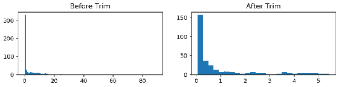

从两侧修剪掉 20％的值后，我们可以更好地解释分布，实际上可以看到大多数值在 0 到 1.5 之间。 仅查看左方的直方图就很难获得这种见解，因为极值主导了直方图，并且我们只能看到 0 周围的一条线。因此，`trimmed`函数在探索性数据分析中非常有用。 在下一部分中，我们将重点讨论箱形图，它们对于数据的描述性分析和异常值检测非常有用且非常流行。

## 箱形图

探索性数据分析中的另一个重要视觉效果是箱形图，也称为箱须图。 它基于五位数摘要建立，该摘要是最小值，第一四分位数，中位数，第三四分位数和最大值。 在标准箱形图中，这些值表示如下：

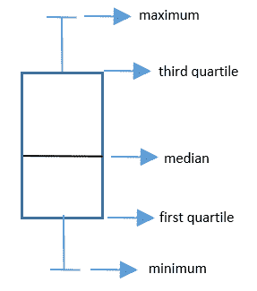

这是比较几种分布的一种非常方便的方法。 通常，情节的晶须通常延伸到极限点。 或者，您可以将其切入 1.5 个四分位范围。 让我们检查一下`CRIM`和`RM`功能：

```py
In [60]: %matplotlib notebook
         %matplotlib notebook
         import matplotlib.pyplot as plt
         from scipy import stats
         samples = dataset.data
         fig, (ax1,ax2) = plt.subplots(1,2, figsize =(8,3))
         axs = [ax1, ax2]
         list_features = ['CRIM', 'RM']
         ax1.boxplot(stats.trimboth(samples[:,0:1],0.2))
         ax1.set_title('{}'.format(list_features[0]))
         ax2.boxplot(stats.trimboth(samples[:,5:6],0.2))
         ax2.set_title('{}'.format(list_features[1]))
```

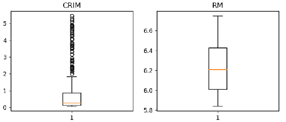

正如您在前面的代码中看到的那样，RM 值一直沿[最小值]和最大值沿连续 分散，以便晶须看起来像一条线。 您可以轻松地检测到中位数几乎位于第一和第三四分位数之间的中间位置。 在 `CRIM` 中，极值不会沿着最小值继续； 它们更像是单个外围数据点，因此表示就像一个圆圈。 您可以看到这些离群值大多位于第三个四分位数之后，并且中位数非常接近第一个四分位数。 由此，您还可以得出结论，分布是右偏的。 因此，箱形图是直方图的非常有用的替代方法，因为您可以轻松分析分布并一次比较多个分布。 在下一节中，我们将继续进行双变量分析，并研究标签数据与要素的相关性。

## 计算相关

本节专门用于双变量分析，您可以在其中分析两列。 在这种情况下，我们通常研究这两个变量之间的关联，这称为**相关性**。 相关性显示两个变量之间的关系，并回答一些问题，例如，如果变量 B 增加 10％，变量 A 将会发生什么？ 在本节中，我们将说明如何计算数据的相关性并以二维散点图表示它。

通常，相关是指任何统计依赖性。 相关系数是计算相关度量的定量值。 您可以将相关性和相关系数之间的关系视为湿度计和湿度之间的相似关系。 相关系数最流行的类型之一是皮尔逊积矩相关系数。 相关系数的值在+1 和-1 之间，其中-1 表示两个变量之间的强负线性关系，而+1 表示两个变量之间的强正线性关系。 在 NumPy 中，我们可以使用`corrcoef()`方法来计算系数相关矩阵，如下所示：

```py
In [61]: np.set_printoptions(suppress= True, linewidth = 125)
         CorrelationCoef_Matrix = np.round(np.corrcoef(samples, rowvar= False), decimals= 1)
         CorrelationCoef_Matrix
```

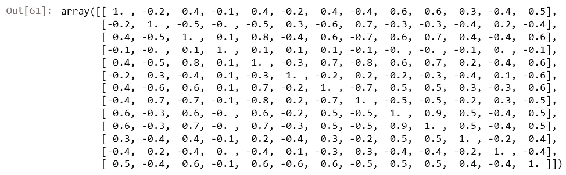

Seaborn 是一个基于 matplotlib 的统计数据可视化库，您可以使用它创建非常吸引人的美观统计图形。 它是一个非常受欢迎的库，具有精美的可视化效果，并且与流行的软件包（尤其是熊猫）具有完美的兼容性。 您可以使用 `seaborn` 程序包中的热图来形象化相关系数矩阵。 当您具有数百种功能时，它对于检测高相关系数非常有用：

```py
In [62]: CorrelationCoef_Matrix1 = np.round(np.corrcoef(samples, rowvar= False), decimals= 1)
         CorrelationCoef_Matrix1
         import seaborn as sns; sns.set()
         ax = sns.heatmap(CorrelationCoef_Matrix1, cmap= "YlGnBu")
```

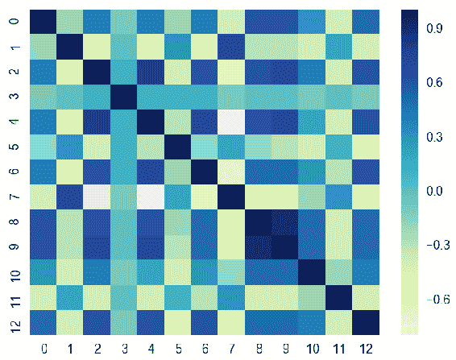

在这里，我们具有标签列特征的相关系数。 您可以在`corrcoef()`函数中添加其他变量集作为第二个参数，就像我们对 label 列所做的那样，如下面的屏幕快照所示。 只要形状相同，该函数将在最后堆叠此列并计算相关系数矩阵：

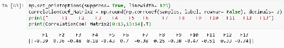

如您所见，除了`F13`之外，大多数特征都具有弱或中等的负线性关系。 另一方面，`F6`具有很强的正线性关系。 让我们绘制此功能并用散点图查看这种关系。 以下代码块借助`matplotlib`显示了三个不同的特征散点图（“ RM”，“ DIS”和“ LSTAT”）和一个标签列：

```py
In [64]: %matplotlib notebook
         %matplotlib notebook
         import matplotlib.pyplot as plt
         from scipy import stats
         fig, (ax1, ax2, ax3) = plt.subplots(1,3 ,figsize= (10,4))
         axs =[ax1,ax2,ax3]
         feature_list = [samples[:,5:6], samples[:,7:8], samples[:,12:13]]
         feature_names = ["RM", "DIS", "LSTAT"]
         for n in range(0, len(feature_list)):
             axs[n].scatter(label, feature_list[n], edgecolors=(0, 0, 0))
             axs[n].set_ylabel(feature_names[n])
             axs[n].set_xlabel('label')
```

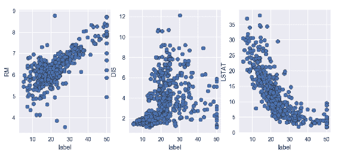

在前面的代码中，RM 和标签值分散为一条正线性线，这与相关系数值为 0.7 一致，如前面的屏幕快照所示。 散点图表明样品的 RM 值越高，标签的值越高。 在中间的散点图中，您可以看到系数相关性等于 0.25 的位置。 这显示出非常弱的正线性相关性，这在散点图中也可以看到。 我们可以得出结论，由于价值分散在各处，因此没有明确的关系。 第三个散点图显示了强大的线性关系，相关系数为-0.7。 随着`LSTAT`下降，标签值开始增加。 所有这些相关矩阵和散点图均使用未修剪的数据对此进行了计算。 让我们看看如何针对每个要素和标签从两侧修剪数据 10％来改变数据集的线性关系结果：

```py
In [65]: %matplotlib notebook
         %matplotlib notebook
         import matplotlib.pyplot as plt
         from scipy import stats
         fig, (ax1, ax2, ax3) = plt.subplots(1,3 ,figsize= (9,4))
         axs = [ax1, ax2, ax3]
         RM_tr = stats.trimboth(samples[:,5:6],0.1)
         label_tr = stats.trimboth(label, 0.1)
         LSTAT_tr = stats.trimboth(samples[:,12:13],0.1)
         DIS_tr = stats.trimboth(samples[:,7:8],0.1)
         feature_names = ["RM", "DIS", "LSTAT"]
         feature_list = [RM_tr, DIS_tr, LSTAT_tr]
         for n in range(0, len(feature_list)):
             axs[n].scatter(label_tr,feature_list[n], edgecolors=(0, 0, 0))
             axs[n].set_ylabel(feature_names[n])
             axs[n].set_xlabel('label')
```

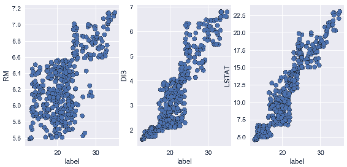

修剪数据后，您可以看到所有特征都与标签具有很强的正线性相关性，尤其是`DIS`和`LSTAT`的相关性，其中标签发生了巨大变化。 这显示了修剪的力量。 如果您不知道如何处理异常值，则很容易误解您的数据。 离群值可以更改分布的形状以及其他变量之间的相关性，最终它们可以影响模型的性能。

## 摘要

在本章中，我们介绍了使用 NumPy，SciPy，matplotlib 和 Seaborn 软件包进行探索性数据分析的过程。 首先，我们学习了如何加载和保存文件以及探索数据集。 然后，我们解释并计算了重要的统计中心矩，例如均值，方差，偏度和峰度。 四个重要的可视化分别用于单变量和变量分析的图形表示; 这些是直方图，箱形图，散点图和热图。 还通过示例强调了数据修整的重要性。

在下一章中，我们将更进一步，并开始使用线性回归预测房价。


