# 四、使用线性回归预测房价

在本章中，我们将通过实现线性回归来介绍监督学习和预测建模。 在上一章中，您了解了探索性分析的知识，但尚未研究建模。 在本章中，我们将创建一个线性回归模型来预测房地产市场价格。 广义上讲，我们将借助目标变量与其他变量的关系来预测目标变量。 线性回归被广泛使用，并且是监督机器学习算法的简单模型。 本质上是关于为观察到的数据拟合一条线。 我们将从解释监督学习和线性回归开始我们的旅程。 然后，我们将分析线性回归的关键概念，例如自变量和因变量，超参数，损失和误差函数以及随机梯度下降。 对于建模，我们将使用与上一章相同的数据集。

本章将介绍以下主题：

*   监督学习和线性回归
*   自变量和因变量
*   超参数
*   损失和误差函数
*   为单个变量实现我们的算法
*   计算随机梯度下降
*   使用线性回归建模房价

## 监督学习和线性回归

机器学习使计算机系统无需显式编程即可学习。 监督学习是最常见的机器学习类型之一。 监督学习由一组不同的算法组成，这些算法提出学习问题并通过使用历史数据映射输入和输出来解决它们。 该算法分析输入和相应的输出，然后将它们链接在一起以找到关系（学习）。 最后，对于新的给定数据集，它将使用此学习来预测输出。

为了区分监督学习和非监督学习，我们可以考虑基于输入/输出的建模。 在监督学习中，将对计算机系统的每组输入数据使用标签进行监督。 在无监督学习中，计算机系统将仅使用没有任何标签的输入数据。

例如，假设我们有 100 万张猫和狗的照片。 在监督学习中，我们标记输入数据并声明给定的照片是猫还是狗。 假设每张照片（输入数据）有 20 个特征。 标有照片的计算机系统将知道照片是猫还是狗（输出数据）。 当我们向计算机系统显示一张新照片时，它将通过分析新照片的 20 个特征来确定它是猫还是狗，并根据其先前的学习进行预测。 在无监督学习中，我们将只拥有 100 万张猫和狗的照片，而没有任何标签说明是猫还是狗的照片，因此该算法将在没有我们监督的情况下通过分析其特征来对数据进行聚类。 聚类完成后，会将新照片输入到无监督学习算法中，系统会告诉我们该照片属于哪个聚类。

在这两种情况下，系统都将具有简单或复杂的决策算法。 唯一的区别是是否有任何初始监督。 监督学习方法的概述方案如下：

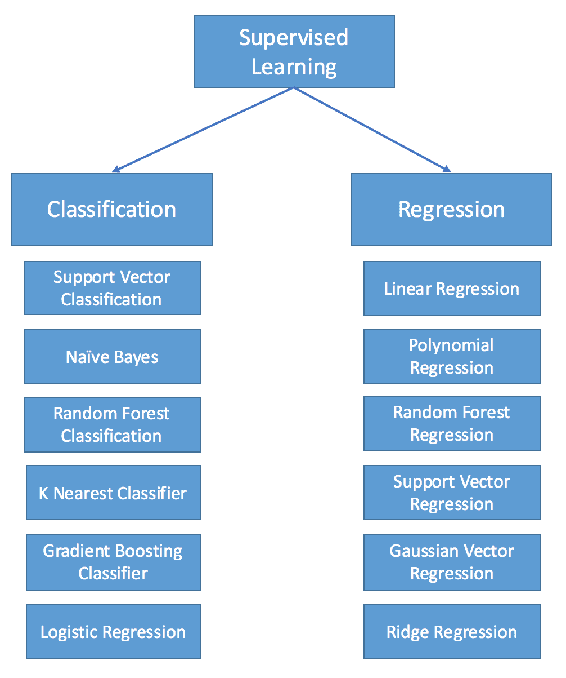

监督学习可以分为分类和回归两种类型，如上图所示。 分类模型预测标签。 例如，可以将前面的示例视为监督分类问题。 为了执行分类，我们需要训练分类算法，例如**支持向量分类器**（**SVC**），随机森林， **K 近邻**（**KNN**），依此类推。 基本上，分类器是指用于对数据进行分类（分类）的算法。

当我们的目标变量是分类变量时使用分类方法，而当我们的目标变量是连续变量时，则应用回归模型，因为目标是预测数值而不是类别。

考虑一下我们在上一章中使用的数据集：波士顿房屋价格数据集。 在该数据集中，我们的目的是对特征值进行统计分析，因为我们需要了解特征值的分布方式，其基本统计量以及之间的相互关系。 最后，我们想知道每个特征如何导致房价上涨。 它对正面，负面还是根本没有影响？ 如果*特征 x* 与*房屋价格 A* 之间存在潜在的影响（关系），则该关系的强弱是多少？

我们试图通过建立模型来预测具有给定特征的房价来回答这些问题。 结果，在为模型提供新特征后，我们期望模型将输出变量生成为连续值（150k，120，154 美元等）。 让我们看一个非常基本的工作流程：

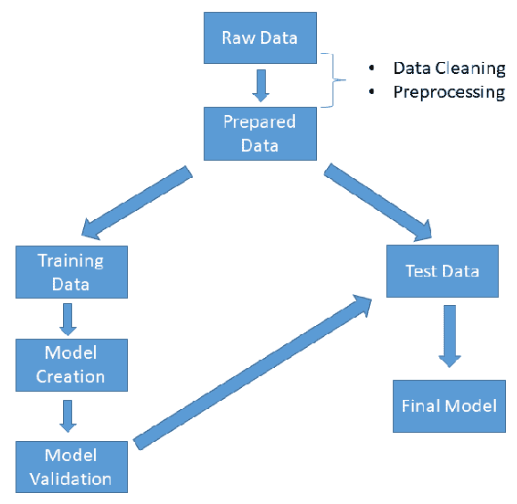

如上图所示，分析从为模型准备数据开始。 在此阶段，我们应该清理数据，处理缺失的值，并提取将要使用的特征。 数据干净后，我们应该将其分为训练数据和测试数据两部分，以测试模型的性能。

模型验证中的重要部分是**过拟合**的概念。 用外行的术语来说，过度拟合意味着从训练数据集中学到太多，因此我们的模型过度拟合并为训练数据集产生近乎完美的结果。 但是，对于从未见过的数据，它的灵活性不足以产生良好的结果，因此**无法很好地泛化**。

可以将数据集分为训练，验证（强烈推荐）和测试数据集来解决此问题。 训练数据是算法最初学习算法参数（权重）并在其中将误差最小化的地方建立模型的地方。 当您有几种算法并且需要调整超参数时，或者当算法中有许多参数并且需要调整参数时，平移数据集非常有用。 测试数据集用于性能评估。

简而言之，您可以使用训练数据来训练算法，然后在验证数据集中微调算法的参数或权重，最后一步，在测试数据集中测试调整后的算法的性能。

与过度拟合相反的情况是欠拟合，这意味着该算法从数据中学习得更少，并且我们的算法与我们的观察结果不太吻合。 让我们以图形方式查看过度拟合，欠拟合和最佳拟合的样子：

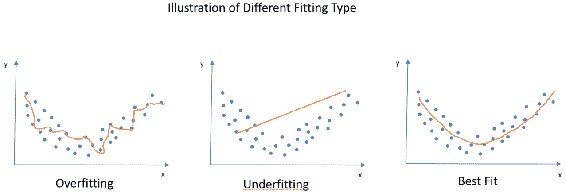

您可能已经注意到，在上图中，即使过度拟合看起来非常合适，它也会生成一个回归线，该回归线对于该数据集非常独特，并且无法正确捕获特征。 第二个图，即欠拟合图，实际上无法捕获数据的形状。 当我们的数据是非线性的时，它没有从中学习并产生了线性回归线。 第三个图是我们的最佳拟合图，拟合得很好，掌握了分布特征并产生了一条曲线。 我们可以预期，对于此数据集的延续，它不会有令人失望的性能指标。

在本章中，我们将使用线性回归作为有监督的学习方法。 我们将首先解释非常重要的概念，例如自变量和因变量，超参数以及损失和误差函数。 我们还将介绍线性回归的实际示例。 在下一章中，我们将介绍线性回归模型的最重要组成部分：独立变量和因变量。

## 自变量和因变量

正如我们在前面的小节中提到的，线性回归用于基于其他变量来预测变量的值。 我们正在研究输入变量`X`与输出变量`Y`之间的关系。

在线性回归中，**因变量**是我们要预测的变量。 之所以称其为因变量，是因为线性回归背后的假设。 该模型假设这些变量取决于方程另一侧的变量，这些变量称为**独立变量**。

在简单回归模型中，模型将解释因变量如何基于自变量而变化。

例如，假设我们要分析基于给定产品的价格变化如何影响销售值。 如果您仔细阅读此句子，则可以轻松检测出我们的因变量和自变量。 在我们的示例中，我们假设销售值受价格变化的影响，换句话说，销售值取决于产品的价格。 结果，销售值是从属值，价格是独立的值。 这不一定意味着给定产品的价格不依赖于任何东西。 当然，它取决于许多因素（变量），但是在我们的模型中，我们假设价格是给定的，并且给定的价格会改变销售值。 线性回归线的公式如下：

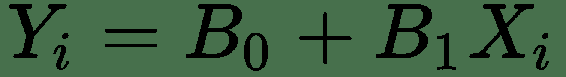

哪里：

`Yi = `估计值或因变量

`B0 = `截距

`B1 = `斜率

`Xi = `自变量或探索变量：

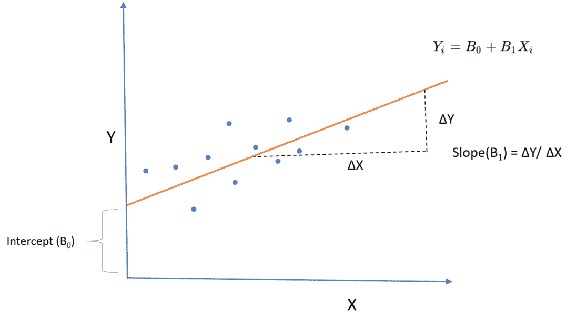

线性回归线的斜率（`B1`）实际上显示了这两个变量之间的关系。 假设我们将斜率计算为 0.8。 这意味着自变量增加 1 个单位可能会使估计值增加 0.8 个单位。 前面的线性回归线仅生成估计，这意味着它们仅是给定`X`的`Y`的预测。 如下图所示，每个观测值和线性线之间有一段距离。 该距离称为**误差**，这是预期的，在回归线拟合和模型评估中也非常重要：

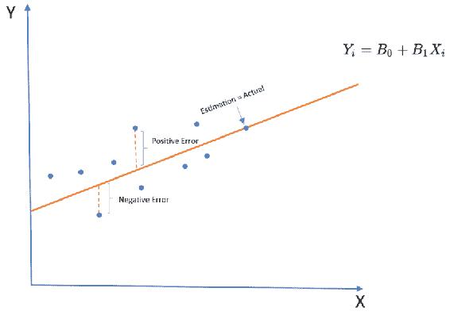

拟合线性回归线的最常见方法是使用**最小二乘**方法。 该方法通过最小化这些误差的平方和来拟合回归线。 计算公式如下：

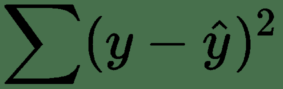

这些误差均方根的原因是我们不希望负误差和正误差彼此抵消。 在模型评估中，使用 R 平方，F 检验和**均方根误差**（**RMSE**）。 他们都使用**平方和**（**SST**）和**平方和误差**（**SSE**）作为基本度量。 如您所见，在 SSE 中，我们再次计算预测值和实际值之间的差，取平方并求和，以评估回归线对数​​据的拟合程度。

如前所述，最小二乘方法旨在最小化平方误差（残差），并找到最适合数据点的斜率和截距值。 由于这是一种封闭形式的解决方案，因此您可以轻松地手动计算它，以便在后台查看此方法的作用。 让我们使用一个包含少量数据集的示例：

| **牛奶消耗量（每周升）** | **身高** |
| --- | --- |
| 14 | 175 |
| 20 | 182 |
| 10 | 170 |
| 15 | 185 |
| 12 | 164 |
| 15 | 173 |
| 22 | 181 |
| 25 | 193 |
| 12 | 160 |
| 13 | 165 |

假设我们有 10 个观察值，如上表所示，用于每周食用牛奶和食用牛奶的人的身高值。 如果我们绘制这些数据，我们可以看到每日牛奶消耗量与身高之间存在正相关：

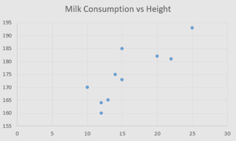

现在，我们要使用最小二乘法拟合线性回归线，该方法通过对斜率和截距使用以下公式来完成：

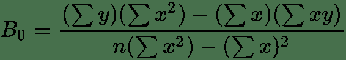

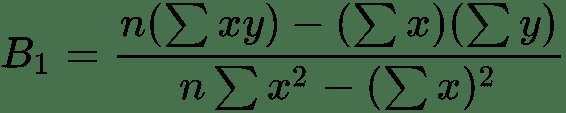

然后，我们需要创建一个表格来帮助我们进行计算，例如`x`，`y`，`xy`，`x^2`和`y^2`的总和：

|  | **`x`（牛奶消耗量）** | **`y`（高度）** | **`xy`** | **`x^2`** | **`y^2`** |
| --- | --- | --- | --- | --- | --- |
| 1 | 14 | 175 | 2,450 | 196 | 30,625 |
| 2 | 20 | 182 | 3,640 | 400 | 33,124 |
| 3 | 10 | 170 | 1,700 | 100 | 28,900 |
| 4 | 15 | 185 | 2,775 | 225 | 34,225 |
| 5 | 12 | 164 | 1,968 | 144 | 26,896 |
| 6 | 15 | 173 | 2,595 | 225 | 29,929 |
| 7 | 22 | 181 | 3,982 | 484 | 32,761 |
| 8 | 25 | 193 | 4,800 | 625 | 37,249 |
| 9 | 12 | 160 | 1,920 | 144 | 25,600 |
| 10 | 13 | 165 | 2,145 | 169 | 27,225 |
| ∑ | 158 | 1,748 | 27,975 | 2,712 | 306,534 |

```py
B0 = (1748*2712) - (158*27975) / (10*2712) - (158)^2 = 320526/2156 = 148.66

B1 = (10*27975) - (158*1748) / (10*2712) - (158)^2 = 1.65
```

然后，我们可以将回归线公式如下：


在本小节中，我们提到了自变量和因变量，并介绍了线性回归线和拟合方法。 在下一节中，我们将介绍超参数，这些参数在回归模型调整中非常有用。

## 超参数

在开始之前，也许最好解释一下为什么我们称它们为超参数而不是参数。 在机器学习中，可以从数据中学习模型参数，这意味着在训练模型时，您可以拟合模型的参数。 另一方面，我们通常在开始训练模型之前先设置超参数。 为了举例说明，您可以将回归模型中的系数视为模型参数。 以超参数为例，我们可以说许多不同模型中的学习率或 K 均值聚类中的聚类数（k）。

另一个重要的事情是模型参数和超参数之间的关系，以及它们如何塑造我们的机器学习模型，换句话说，就是我们模型的假设。 在机器学习中，参数用于配置模型，此配置将为我们的数据集专门定制算法。 我们需要处理的是如何优化超参数。 另外，如上所述，可以在验证期间执行该优化。 在许多情况下，优化超参数将带来性能提升。

您还可以将超参数视为模型参数之上的高级参数。 想象一下您使用无监督学习的 K 均值聚类的情况。 如果您使用误差的群集号（K）作为超参数，则可以确保您的数据不适合。

现在，您应该问的是，如果在训练模型之前手动设置超参数，我们该如何调整它们。 有几种方法可以调整超参数。 此优化的底线是使用一组不同的超参数测试算法，并在选择性能更好的超参数集之前针对每种情况计算误差函数或损失函数。

在本节中，我们简要介绍了参数，超参数及其差异。 在下一节中，我们将介绍损失和误差函数，这对于超参数优化非常重要。

## 损失和误差函数

在前面的小节中，我们解释了有监督和无监督的学习。 无论使用哪种机器学习算法，我们的主要挑战都是关于优化的问题。 在优化函数中，我们实际上是在尝试使损失函数最小化。 设想一下您试图优化每月储蓄的情况。 在关闭状态下，您要做的就是最小化支出，换句话说，将损失函数最小化。

建立损失函数的一种非常常见的方法是从预测值与实际值之差开始。 通常，我们尝试估计模型的参数，然后进行预测。 我们可以用来评估我们的预测水平的主要度量包括计算实际值之间的差：

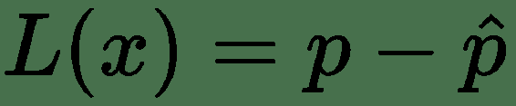

在不同的模型中，使用了不同的损失函数。 例如，您可以在回归模型中使用均方误差，但是将其用作分类模型的损失函数可能不是一个好主意。 例如，您可以按以下方式计算均方误差：

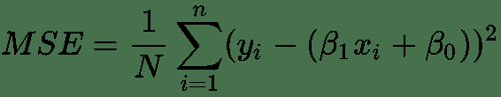

其中回归模型如下：

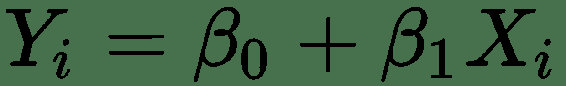

有许多不同的损失函数可用于不同的机器学习模型。 以下是一些重要的说明，并简要说明了它们的用法：

| **损失函数** | **解释** |
| --- | --- |
| 交叉熵 | 这用于分类模型，其中模型的输出为 0-1 之间的概率。 这是对数损失函数，也称为对数损失。 当理想的模型的概率接近 1.0 时， 交叉熵损失降低。 |
| MAE（L1） | 计算误差绝对值的均值。 由于它仅使用绝对值，因此不会将较大误差的权重放大。 当较大误差与较小误差相比可以容忍时，这很有用。 |
| MSE（L2） | 计算误差的平方根的均值。 放大较大误差的权重。 当不希望出现较大误差时，这很明智。 |
| Hinge | 这是用于线性分类器模型（例如支持向量机）的损失函数。 |
| Huber | 这是回归模型的损失函数。 它与 MSE 非常相似，但对异常值不敏感。 |
| Kullback-Leibler | Kullback-Leibler 散度衡量两个概率分布之间的差异 。 KL 损失函数在 T 分布随机邻居嵌入算法中大量使用。 |

在机器学习算法中，损失函数在更新变量权重时至关重要。 假设您使用反向传播训练神经网络。 在每次迭代中，都会计算出总误差。 然后，权重被更新以便最小化总误差。 因此，使用正确的损失函数会直接影响您的机器学习算法的性能，因为它直接影响模型参数。 在下一章中，我们将从住房数据中的单个变量开始简单的线性回归。

## 使用梯度下降的单变量线性回归

在本小节中，我们将为波士顿住房数据集实现单变量线性回归，该数据已在上一章中用于探索性数据分析。 在拟合回归线之前，让我们导入必要的库并按以下方式加载数据集：

```py
In [1]: import numpy as np
        import pandas as pd
        from sklearn.cross_validation import train_test_split
        from sklearn.linear_model import LinearRegression
        import matplotlib.pyplot as plt
        %matplotlib inline
In [2]: from sklearn.datasets import load_boston
        dataset = load_boston()
        samples , label, feature_names = dataset.data, dataset.target, dataset.feature_names
In [3]: bostondf = pd.DataFrame(dataset.data)
        bostondf.columns = dataset.feature_names
        bostondf['Target Price'] = dataset.target
        bostondf.head()
Out[3]:   CRIM    ZN    INDUS CHAS  NOX   RM    AGE   DIS    RAD  TAX  PTRATIO  B      LSTAT  Target Price
 0 0.00632  18.0  2.31  0.0  0.538  6.575 65.2  4.0900 1.0  296.0  15.3  396.90   4.98       24.0
 1 0.02731  0.0   7.07  0.0  0.469  6.421 78.9  4.9671 2.0  242.0  17.8  396.90   9.14       21.6
 2 0.02729  0.0   7.07  0.0  0.469  7.185 61.1  4.9671 2.0  242.0  17.8  392.83   4.03       34.7
 3 0.03237  0.0   2.18  0.0  0.458  6.998 45.8  6.0622 3.0  222.0  18.7  394.63   2.94       33.4
 4 0.06905  0.0   2.18  0.0  0.458  7.147 54.2  6.0622 3.0  222.0  18.7  396.90   5.33       36.2
```

与上一章相比，我们使用 Pandas 数据帧代替了 numpy 数组，以便向您展示数据帧的用法，因为它也是一个非常方便的数据结构。 从技术上讲，在大多数情况下，如果仅将数值存储在 numpy 数组或 Pandas 数据帧中，则没有任何区别。 让我们将目标值添加到数据框中，并使用散点图查看`RM`函数与目标值之间的关系：

```py
In [4]: import matplotlib.pyplot as plt
        bostondf.plot(x='RM', y='Target Price', style= 'o')
        plt.title('RM vs Target Price')
        plt.ylabel('Target Price')
        plt.show()
```

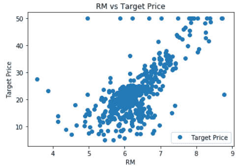

从该图可以看出，每个住宅的平均房间数（`RM`）与房价之间存在正相关，正如预期的那样。 现在，我们将看到这种关系的强度，并尝试使用这种关系来预测房价。

想象一下，您对线性回归的了解非常有限。 假设您只是熟悉方程式，但不知道误差函数是什么，为什么我们需要迭代，什么是梯度下降，以及为什么要在线性回归模型中使用它。 在这种情况下，您要做的就是简单地开始传递系数的一些初始值，并在计算预测值之前截取方程。

在计算了几个预测值之后，您可以将它们与实际值进行比较，看看您与实际情况有多远。 下一步将是更改系数或截距，或者同时进行这两项操作，以查看是否可以使结果更接近实际值。 如果您对此过程感到满意，这就是我们的算法将以更智能的方式进行的操作。

为了更好地理解线性回归模型步骤，我们将代码分成几个块。 首先，让我们创建一个函数，该函数作为回归线的结果返回预测值：

```py
In [5]: def prediction(X, coefficient, intercept):
        return X*coefficient + intercept
```

前面的函数计算线性回归模型如下：


然后，我们需要一个成本函数，该函数将在每次迭代中进行计算。 作为`cost_function`，我们将使用均方误差，它是预测值与实际值之间总平方差的平均值：

```py
In [6]: def cost_function(X, Y, coefficient, intercept):
        MSE = 0.0
        for i in range(len(X)):
            MSE += (Y[i] - (coefficient*X[i] + intercept))**2
        return MSE / len(X)
```

我们的最后一个代码块将用于更新权重。 当我们讨论权重时，不仅涉及自变量的系数，还涉及截距。 拦截也称为偏差。 为了逻辑上更新权重，我们需要一种迭代优化算法，该算法可以找到给定函数的最小值。 在此示例中，我们将使用梯度下降方法来最小化每次迭代中的损失函数。 让我们一步一步地发现梯度下降的作用。

首先，我们应该初始化权重（截距和系数）并计算均方误差。 然后，我们需要计算梯度，这意味着查看当改变权重时均方误差如何变化。

为了以更智能的方式更改权重，我们需要了解我们必须更改系数和截距的方向。 这意味着我们在更改权重时应计算误差函数的梯度。 我们可以通过对系数和截距采用损失函数的偏导数来计算梯度。

在单变量线性回归中，我们只有一个系数。 在计算偏导数之后，该算法将调整权重并重新计算均方误差。 此过程将重复进行，直到更新的权重不再减小均方误差为止：

```py
In [7]: def update_weights(X, Y, coefficient, intercept, learning_rate):
            coefficient_derivative = 0
            intercept_derivative = 0

            for i in range(len(X)):
                coefficient_derivative += -2*X[i] * (Y[i] - (coefficient*X[i] + intercept))
                intercept_derivative += -2*(Y[i] - (coefficient*X[i] + intercept))

            coefficient -= (coefficient_derivative / len(X)) * learning_rate
            intercept -= (intercept_derivative / len(X)) * learning_rate

            return coefficient, intercept
```

前面的代码块定义了更新权重的函数，然后返回更新的系数并进行拦截。 此函数中的另一个重要参数是`learning_rate`。 学习速度将决定变化的幅度：

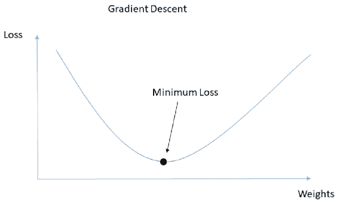

在上图中，您可以看到我们的损失函数为`x = y^2`的形状，因为它是平方误差的总和。 通过梯度下降，我们试图找到最小损耗，如图所示，其中偏导数非常接近零。 如前所述，我们通过初始化权重来开始算法，这意味着我们从远离最小值的点开始。 在每次迭代中，我们将更新权重，从而减少损失。 这意味着给定足够的迭代次数，我们将收敛到全局最小值。 学习速度将决定这种融合发生的速度。

换句话说，当我们更新权重时，高学习率看起来就像是从一个点到另一个点的巨大跳跃。 低学习率将慢慢接近全局最小值（所需的最小损失点）。 由于学习率是一个超参数，因此我们需要在运行它之前进行设置：

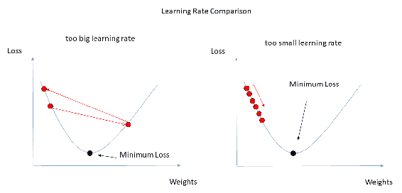

那么，我们需要设定学习率的大还是小？ 答案是我们应该找到最佳速率。 如果我们设定较高的学习率，我们的算法将超出最小值。 我们很容易错过最小值，因为这些跳跃永远不会让我们的算法收敛到全局最小值。 另一方面，如果我们将学习率设置得太小，则可能需要进行大量迭代才能收敛。

具有先前的代码块，是时候编写主函数了。 主函数应遵循我们前面讨论的流程：

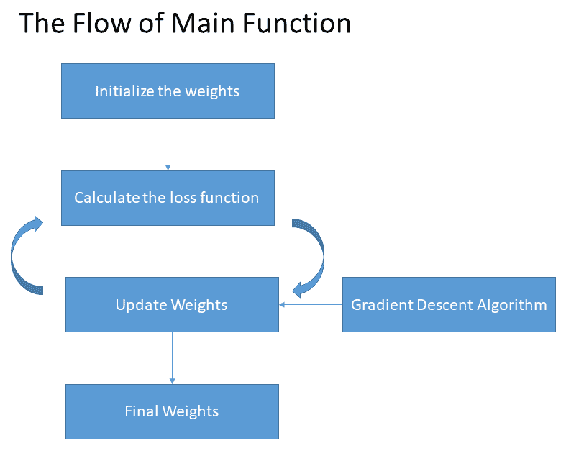

然后，主函数的代码块应如下所示：

```py
In [8]: def train(X, Y, coefficient, intercept, LearningRate, iteration):
            cost_hist = []
            for i in range(iteration):
                coefficient, intercept = update_weights(X, Y, coefficient, intercept, learning_cost =                     cost_function(X, Y, coefficient, intercept)
                cost_hist.append(cost)
            return coefficient, intercept, cost_hist
```

现在，我们已经定义了所有代码块，并且可以运行单变量模型了。 在运行`train()`函数之前，我们需要设置系数和截距的超参数和初始值。 您可以创建变量，设置值，然后将这些变量作为函数的参数，如下所示：

```py
In [9]: learning_rate = 0.01
        iteration = 10001
        coefficient = 0.3
        intercept = 2
```

```py
      X = bostondf.iloc[:, 5:6].values
        Y = bostondf.iloc[:, 13:14].values

        coefficient, intercept, cost_history = train(X, Y, coefficient, intercept, learning_rate, iteration)
```

或者，可以在调用函数时将这些值作为关键字参数传递：

```py
coefficient, intercept, cost_history = train(X, Y, coefficient, intercept = 2, learning_rate = 0.01, iteration = 10001)
```

我们的主函数将返回两个数组，这将为我们提供拦截和系数的最终值。 此外，主函数将返回损失值列表，这是每次迭代的结果。 这些是每次迭代中均方误差的结果。 拥有此列表以跟踪每次迭代中损耗的变化非常有用：

```py
In [10]: coefficient
Out[10]: array([8.57526661])
In [11]: intercept
Out[11]: array([-31.31931428])
In [12]: cost_history
         array([54.18545801]),
        array([54.18036786]),
        array([54.17528017]),
        array([54.17019493]),
        array([54.16511212]),
        array([54.16003177]),
        array([54.15495385]),
        array([54.14987838]),
        array([54.14480535]),
        array([54.13973476]),
        array([54.13466661]),
        array([54.12960089]),
        array([54.12453761]),
        array([54.11947677]),
        array([54.11441836]),
        array([54.10936238]),
        array([54.10430883]),
        ...]
```

从系数值中可以看出，`RM`的每增加 1 单位，住房价格就会升至 8,575 美元左右。 现在，让我们通过将计算出的截距和系数注入回归公式中来计算预测值。 然后，我们可以绘制线性回归线并查看其如何拟合我们的数据：

```py
In [13]: y_hat = X*coefficient + intercept
         plt.plot(X, Y, 'bo')
         plt.plot(X, y_hat)
         plt.show()
```


在本节中，我们通过选择一个变量来应用单变量模型。 在以下小节中，我们将通过在模型中添加更多自变量来执行多元线性回归模型，这意味着我们将有多个系数可进行优化以实现最佳拟合。

## 使用线性回归建模房价

在本节中，我们将对同一数据集执行多元线性回归。 与上一节相反，我们将使用 sklearn 库向您展示执行线性回归模型的几种方法。 在开始线性回归模型之前，我们将使用`trimboth()`方法从两侧按比例修剪数据集。 通过这样做，我们将消除异常值：

```py
In [14]: import numpy as np
         import pandas as pd
         from scipy import stats
         from sklearn.cross_validation import train_test_split
         from sklearn.linear_model import LinearRegression
In [15]: from sklearn.datasets import load_boston
         dataset = load_boston()
In [16]: samples , label, feature_names = dataset.data, dataset.target, dataset.feature_names
In [17]: samples_trim = stats.trimboth(samples, 0.1)
         label_trim = stats.trimboth(label, 0.1)
In [18]: print(samples.shape)
         print(label.shape)
         (506, 13)
         (506,)
In [19]: print(samples_trim.shape)
         print(label_trim.shape)
         (406, 13)
         (406,)
```

正如您在前面的代码块中看到的那样，由于我们将左右数据修剪了 10% ，每个属性和标签列的样本量从 506 减少到 406：

```py
In [20]: from sklearn.model_selection import train_test_split
         samples_train, samples_test, label_train, label_test = train_test_split(samples_trim, In [21]:          In [21]: print(samples_train.shape)
         print(samples_test.shape)
         print(label_train.shape)
         print(label_test.shape)
         (324, 13)
         (82, 13)
         (324,)
         (82,)
In [22]: regressor = LinearRegression()
         regressor.fit(samples_train, label_train)
Out[22]: LinearRegression(copy_X=True, fit_intercept=True, n_jobs=1, normalize=False)
In [23]: regressor.coef_
Out[23]: array([ 2.12924665e-01, 9.16706914e-02, 1.04316071e-01, -3.18634008e-14,
                 5.34177385e+00, -7.81823481e-02, 1.91366342e-02, 2.81852916e-01,
                 3.19533878e-04, -4.24007416e-03, 1.94206366e-01, 3.96802252e-02,
                 3.81858253e-01])
In [24]: regressor.intercept_
Out[24]: -6.899291747292615
```

然后，我们使用`train_test_split()`方法将数据集拆分为训练和测试。 这种方法在机器学习算法中非常普遍。 您将数据分为两组，然后让模型训练（学习），然后再使用数据的另一部分测试模型。 使用这种方法的原因是为了减少验证模型时的偏差。 每个系数代表当我们将这些样本增加一个单位时，预期目标值将改变多少：

```py
In [25]: label_pred = regressor.predict(samples_test)
In [26]: plt.scatter(label_test, label_pred)
         plt.xlabel("Prices")
         plt.ylabel("Predicted Prices")
         plt.title("Prices vs Predicted Prices")
         plt.axis("equal")
Out[26]: (11.770143369175626, 34.22985663082437, 10.865962968036989, 34.20549738482051)
```

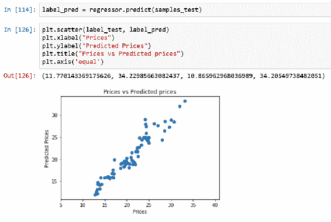

让我们在前面的代码块中测试我们的模型。 为了在数据集上运行我们的模型，我们可以使用`predict()`方法。 此方法将在模型上运行给定的数据集并返回结果。 理想情况下，我们期望该点以`x = y`线形分布，换言之，例如具有 45 度角的直线。 这是一个完美的一对一匹配预测。 我们不能说我们的预测是完美的，但是仅通过查看散点图，我们可以得出结论，该预测不是一个坏的预测。 我们可以查看有关模型性能的两个重要指标，如下所示：

```py
In [27]: from sklearn.metrics import mean_squared_error
         from sklearn.metrics import r2_score
         mse = mean_squared_error(label_test, label_pred)
         r2 = r2_score(label_test, label_pred)
         print(mse)
         print(r2)
         2.032691267250478
         0.9154474686142619
```

第一个是均方误差。 您可能已经注意到，当我们在模型中添加更多自变量时，它会大大降低。 第二个是 R 方，它是确定系数，或者换句话说，是回归得分。 确定系数可以解释您的自变量解释了因变量有多少方差。 在我们的模型中，结果为 0.91，这说明我们的 13 个特征可以解释 91% 的房价差异。 如您所见，sklearn 具有许多有用的线性回归内置函数，这些函数可以加快模型构建过程。 另一方面，您也可以仅使用 numpy 轻松构建线性回归模型，这可以为您提供更大的灵活性，因为您可以控制算法的每个部分。

## 总结

线性回归是对连续变量之间的关系进行建模的最常用技术之一。 这种方法的应用在工业上非常广泛。 我们开始对本书的一部分进行线性回归建模，这不仅是因为它非常流行，还因为它是一种相对简单的技术，并且包含了几乎每种机器学习算法都具有的大多数要素。

在本章中，我们了解了监督学习和无监督学习，并使用波士顿房屋数据集建立了线性回归模型。 我们谈到了不同的重要概念，例如超参数，损失函数和梯度下降。 本章的主要目的是为您提供足够的知识，以便您可以建立和调整线性回归模型并逐步了解它的作用。 我们研究了两个使用单变量和多元线性回归的实际案例。 您还体验了 numpy 和 sklearn 在线性回归中的用法。 我们强烈建议您对不同的数据集进行进一步练习，并检查更改超参数时结果如何变化。

在下一章中，我们将学习聚类方法，并通过批发分销商数据集上的示例进行实践。


