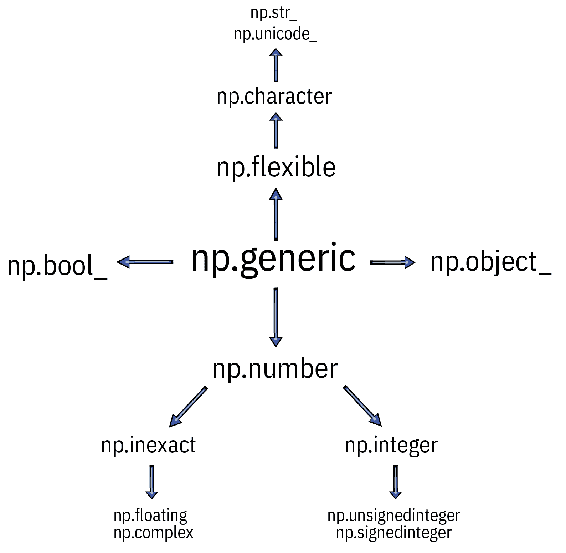
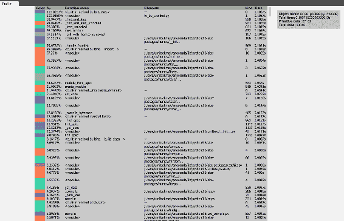
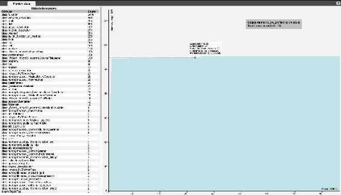
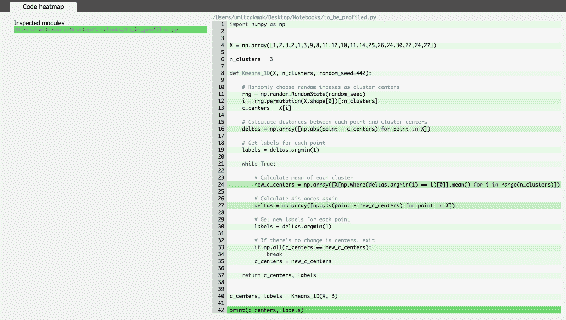
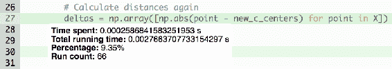

# 七、高级 NumPy

许多库都具有易于使用的 API。 您需要做的就是调用提供的 API 函数，库将为您处理其余的函数。 幕后发生的事情与您无关，您只对输出感兴趣。 在大多数情况下，这很好，但是，至少要了解所使用库的基本内部结构很重要。 了解内部结构将帮助您掌握代码的最新动态以及开发应用程序时应避免的危险信号。

在本章中，将回顾 NumPy 的内部结构，例如 NumPy 的类型层次结构和内存使用情况。 在本章的最后，您将了解用于逐行检查程序的代码配置文件。

## NumPy 内部

如您在前几章中所见，NumPy 数组使数值计算变得高效，其 API 直观且易于使用。 NumPy 数组也是其他科学图书馆的核心，因为其中许多库都是基于 NumPy 数组构建的。

为了编写更好，更高效的代码，您需要了解数据处理的内部。 NumPy 数组及其元数据位于数据缓冲区中，该缓冲区是带有某些数据项的专用内存块。

## NumPy 如何管理内存？

初始化 NumPy 数组后，其元数据和数据将存储在**随机存取存储器**（**RAM**）中分配的存储位置上。

```py
import numpy as np
array_x = np.array([100.12, 120.23, 130.91])
```

首先，Python 是一种动态类型化的语言； 不需要显式声明变量类型，例如`int`或`double`。 可以推断变量类型，在这种情况下，您希望`array_x`的数据类型为`np.float64`：

```py
print(array_x.dtype)
float64
```

使用`numpy`库而不是 Python 的优势在于`numpy`支持许多不同的数值数据类型，例如`bool_`，`int_`，`intc`，`intp`，`int8`，`int16`，`int32`，`int64`，`uint8`，`uint16`，`uint32`，`uint64`，`float_`，`float16`，`float32`，`float64`，`complex_`，`complex64`和`complex128`。

您可以通过检查`sctypes`查看这些类型：

```py
np.sctypes
{'complex': [numpy.complex64, numpy.complex128, numpy.complex256],
'float': [numpy.float16, numpy.float32, numpy.float64, numpy.float128],
'int': [numpy.int8, numpy.int16, numpy.int32, numpy.int64],
'others': [bool, object, bytes, str, numpy.void],
'uint': [numpy.uint8, numpy.uint16, numpy.uint32, numpy.uint64]}
```

下图显示了数据类型树：



您可以通过调用`mro`方法来检查诸如`np.float64`之类的数据类型的父类：

```py
np.float64.mro()
[numpy.float64,
numpy.floating,
numpy.inexact,
numpy.number,
numpy.generic,
float,
object]
```

和`np.int64`的父类：

```py
np.int64.mro()
[numpy.int64,
numpy.signedinteger,
numpy.integer,
numpy.number,
numpy.generic,
object]
```

`mro`方法代表“方法解析顺序”。 为了更好地理解继承，应该首先了解继承的概念。 在可以使用面向对象范例的编程语言中，可以将对象的属性和方法基于之前创建的另一个对象，这就是**继承**。 在前面的示例中，`np.int64`保留了`np.signedinteger`及其之后的属性和行为。

让我们看一个简单的例子：

```py
class First:
    def firstmethod(self):
        print("Call from First Class, first method.")

class Second:
    def secondmethod(self):
        print("Call from Second Class, second method.")

class Third(First, Second):
    def thirdmethod(self):
        print("Call from Third Class, third method.")
```

这里，有 3 个类别，而`First`和`Second`类别是独立的，`Third`类别是从`First`和`Second`继承的。 您可以创建`Third`类的实例，并使用`dir`方法检查其内容：

```py
myclass = Third()
dir(myclass)
[...
 '__repr__',
 '__setattr__',
 '__sizeof__',
 '__str__',
 '__subclasshook__',
 '__weakref__',
 'firstmethod',
 'secondmethod',
 'thirdmethod']
```

`dir`表示`myclass`的方法中有`firstmethod`，`secondmethod`和`thirdmethod`。

您可以调用这些方法，如下所示：

```py
myclass.firstmethod()
myclass.secondmethod()
myclass.thirdmethod()
## Call from First Class, first method.
## Call from Second Class, second method.
## Call from Third Class, third method.
```

现在，让我们向`Second`类添加`firstmethod`，看看会发生什么：

```py
class First:
    def firstmethod(self):
        print("Call from First Class, first method.")

class Second:
    def firstmethod(self):
        print("Call from Second Class, first method.")
    def secondmethod(self):
        print("Call from Second Class, second method.")

class Third(First, Second):
    def thirdmethod(self):
        print("Call from Third Class, third method.")
```

像以前一样检查方法输出：

```py
myclass = Third()
myclass.firstmethod()
myclass.secondmethod()
myclass.thirdmethod()
## Call from First Class, first method.
## Call from Second Class, second method.
## Call from Third Class, third method.
```

如您所见，已添加到`Second`类的方法无效，因为`Third`类的实例从`First`类继承了该实例。

您可以按以下方式检查类的`mro`：

```py
Third.__mro__
```

这将为您提供以下输出：

```py
(__main__.Third, __main__.First, __main__.Second, object)
```

这是使用继承机制时解析属性和方法的方式，并且现在您应该或多或少地了解`mro`的工作方式。 现在，您可以再次查看我们之前拥有的 numpy 数据类型的`mro`示例。

您可以使用`nbytes`来查看存储数据类型所需的内存。

首先，让我们看看单个`float64`的大小：

```py
np.float64(100.12).nbytes
8
np.str_('n').nbytes
4
np.str_('numpy').nbytes
20
```

`array_x`具有 3 个`float64`，其大小将是元素数乘以商品大小，即`24`，如以下代码段所示：

```py
np.float64(array_x).nbytes
24
```

例如，如果您需要较低的计算精度，则可以使用`np.float32`，它将占用`float64`占用的一半内存：

```py
array_x2 = array_x.astype(np.float32)
array_x2
array([100.12, 120.23, 130.91], dtype=float32)
np.float32(array_x2).nbytes
12
```

简单来说，8 个字节的内存将保存 1 `float64`或 2 `float32`。

Python 的动态性质引入了一种处理数据类型的新方法，因为 Python 应该包含有关其存储的数据的更多信息。 虽然典型的 C 变量将具有有关内存位置的信息，但 Python 变量应具有存储为 C 结构的信息，该结构包含引用计数，对象的类型，对象的大小以及变量本身。

这是提供灵活的环境来处理不同数据类型所必需的。 如果诸如列表之类的数据结构可以容纳不同类型的对象，这是由于该信息对于列表中的每个元素的存储。

但是，由于 NumPy 数组中的数据类型是固定的，由于使用了连续的内存块，因此内存使用效率可能更高。

您可以通过检查 NumPy 数组的`__array_interface__`属性来查看地址和其他相关信息。

编写此接口是为了允许开发人员共享阵列内存和信息：

```py
array_x.__array_interface__
{'data': (140378873611440, False),
'descr': [('', '<f8')],
'shape': (3,),
'strides': None,
'typestr': '<f8',
'version': 3}
```

`__array_interface__`是具有 6 个键的 python 字典：

*   `shape`的工作方式类似于 NumPy 数组或`pandas`数据帧的常规`shape`属性。 它显示每个大小的大小。 由于`array_x`具有`1`大小和`3`元素，因此它是具有`3`大小的元组。
*   `typestr`具有`3`值，第一个显示字节顺序，第二个显示字符代码，其余字符显示字节数。 在此示例中，其值为`'<f8'`，这表示字节顺序为低位字节序，字符代码为浮点，并且使用的字节数为 8。
*   `descr`可能会提供有关内存布局的更多详细信息。 默认值为`[('', typestr)]`。
*   `data`显示数据的存储位置。 这是一个元组，其中第一个元素显示 NumPy 数组的存储块地址，第二个元素是指示其是否为只读的标志。 在此示例中，内存块地址为`140378873611440`，它不是只读的。
*   `strides`指示给定的数组是否为 C 样式的连续内存缓冲区。 在此示例中，None 表示这是 C 样式的连续数组。 否则，它将包含跨步元组，以了解跳转到给定维度中的下一个数组元素所要跳转的位置。 步幅是重要的属性，因为当您使用不同的切片（例如`X[::4]`）时，步幅将引导数组视图。
*   `version`表示在此示例中为 3 的版本号。

以下片段显示了一个简单的示例：

```py
import numpy as np

X = np.array([1,2,3,2,1,3,9,8,11,12,10,11,14,25,26,24,30,22,24,27])

X[::4]
## array([ 1, 1, 11, 14, 30])
```

这一点很重要，因为当您使用基于现有`ndarrays`的切片创建新的`ndarrays`时，可能会降低性能。 让我们看一个简单的例子； 以下代码段创建了 3D `ndarray`：

```py
nd_1 = np.random.randn(4, 6, 8)

nd_1
## array([[[ 0.64900179, -0.00494884, -0.97565618, -0.78851039],
[ 0.05165607, 0.068948 , 1.54542042, 1.68553396],
[-0.80311258, 0.95298682, -0.85879725, 0.67537715]],
[[ 0.24014811, -0.41894241, -0.00855571, 0.43483418],
[ 0.43001636, -0.75432657, 1.16955535, -0.42471807],
[ 0.6781286 , -1.87876591, 1.02969921, 0.43215107]]])
```

您可以对其进行切片并创建另一个数组：

```py
nd_2 = nd_1[::, ::2, ::2]
```

将会选择：

1.  首先，第一个维度的所有项目
2.  然后，第二维的第二个项目
3.  然后，第三个维度的第二个项目

它将具有以下数组：

```py
print(nd_2)
[[[ 0.64900179 -0.97565618]
[-0.80311258 -0.85879725]]
[[ 0.24014811 -0.00855571]
[ 0.6781286 1.02969921]]]
```

您可以看到`nd_1`和`nd_2`的内存地址相同：

```py
nd_1.__array_interface__
{'data': (140547049888960, False),
'descr': [('', '<f8')],
'shape': (2, 3, 4),
'strides': None,
'typestr': '<f8',
'version': 3}

nd_2.__array_interface__ 
{'data': (140547049888960, False),
'descr': [('', '<f8')],
'shape': (2, 2, 2),
'strides': (96, 64, 16),
'typestr': '<f8',
'version': 3}
```

`nd_2`大步前进，了解如何沿`nd_1`数组的不同维度移动。

为了强调这些跨步在数值计算中的作用，下面的示例将为数组维和切片使用更大的大小：

```py
nd_1 = np.random.randn(400, 600)
nd_2 = np.random.randn(400, 600*20)[::, ::20]
```

`nd_1`和`nd_2`具有相同的大小：

```py
print(nd_1.shape, nd_2.shape)
(400, 600) (400, 600)
```

您可以测量用于计算`nd_1`和`nd_2`的数组元素的累积乘积的时间：

```py
%%timeit
np.cumprod(nd_1)
## 802 µs ± 20.2 µs per loop (mean ± std. dev. of 7 runs, 1000 loops each)
```

```py
%%timeit
np.cumprod(nd_2)
## 12 ms ± 71.7 µs per loop (mean ± std. dev. of 7 runs, 100 loops each)
```

两次操作之间存在明显的时间差； 这是为什么？ 如您所料，`nd_2`中的步幅过大会导致此问题：

```py
nd_1.__array_interface__ 
{'data': (4569473024, False),
'descr': [('', '<f8')],
'shape': (400, 600),
'strides': None,
'typestr': '<f8',
'version': 3}

nd_2.__array_interface__ 
{'data': (4603252736, False),
'descr': [('', '<f8')],
'shape': (400, 600),
'strides': (96000, 160),
'typestr': '<f8',
'version': 3}
```

从存储器向 CPU 读取数据时，`nd_2`中存在跨步会导致跳转到不同的存储器位置。 如果将数组元素顺序存储为连续的内存块，那么从时间测量来看，此操作会更快。 步伐越小越好，可以更好地利用 CPU 缓存来提高性能。

有一些变通办法可以缓解与 CPU 缓存相关的问题。 您可以使用的一种库是[`numexpr`库](https://github.com/pydata/numexpr)，它是 NumPy 的快速数值表达式评估器。 库使内存使用效率更高，并且还可以使多线程编程受益，以充分利用可用的内核。 您也可以将其与 Intel 的 VML 结合使用以进行进一步的改进。

在下面的示例中，让我们看看它是否对`nd_2`有帮助：

```py
import numexpr as ne

%%timeit
2 * nd_2 + 48
## 4 ms ± 10.9 µs per loop (mean ± std. dev. of 7 runs, 1000 loops each)

%%timeit
ne.evaluate("2 * nd_2 + 48")
## 843 µs ± 8.1 µs per loop (mean ± std. dev. of 7 runs, 1000 loops each)
```

您应该使用其他示例进行尝试，以查看性能提升。

如果从头开始索引数组到某个元素，您将看到它具有相同的内存地址：

```py
array_x[:2].__array_interface__['data'][0]
## 140378873611440
array_x[:2].__array_interface__['data'][0] == array_x.__array_interface__['data'][0]
## True
```

但是，如果您在`0`以外的位置开始索引，则将为您提供不同的内存地址：

```py
array_x[1:].__array_interface__['data'][0]
## 140378873611448
array_x[1:].__array_interface__['data'][0] == array_x.__array_interface__['data'][0]
## False
```

`ndarray`的另一个属性称为标志，它提供有关给定 NumPy 数组的内存布局的信息：

```py
array_f = np.array([[100.12, 120.23, 130.91], [90.45, 110.32, 120.32]])
print(array_f)
## [[100.12 120.23 130.91]
## [ 90.45 110.32 120.32]]

array_f.flags
## C_CONTIGUOUS : True
## F_CONTIGUOUS : False
## OWNDATA : True
## WRITEABLE : True
## ALIGNED : True
## WRITEBACKIFCOPY : False
## UPDATEIFCOPY : False
```

您可以使用类似于字典的符号或小写的属性名称来获得单个标志：

```py
array_f.flags['C_CONTIGUOUS']
## True

array_f.flags.c_contiguous
## True
```

让我们看一下每个属性：

*   `C_CONTIGUOUS`：C 样式的连续内存的单个块
*   `F_CONTIGUOUS`：连续内存的单个块，Fortran 风格

您的数据可以使用不同的布局存储在内存中。 这里有 2 种不同的内存布局要考虑：对应于`C_CONTIGUOUS`的行主要顺序和对应于`F_CONTIGUOUS`的列主要顺序。

在该示例中，`array_f`是二维的，`array_f`的行项目存储在相邻的存储位置中。 类似地，在`F_CONTIGUOUS`情况下，每列的值存储在相邻的存储位置中。

某些`numpy`函数将使用参数`order`将此顺序指示为`'C'`或`'F'`。 以下示例显示了具有不同顺序的重塑功能：

```py
np.reshape(array_f, (3, 2), order='C')
## array([[100.12, 120.23],
## [130.91, 90.45],
## [110.32, 120.32]])

np.reshape(array_f, (3, 2), order='F')
## array([[100.12, 110.32],
## [ 90.45, 130.91],
## [120.23, 120.32]])
```

其余的：

*   `OWNDATA`：阵列是否与另一个对象共享其内存块或拥有所有权
*   `WRITEABLE`：`False`表示它是只读的； 否则可以将该区域写入。
*   `ALIGNED`：数据是否针对硬件对齐
*   `WRITEBACKIFCOPY`：该阵列是否是另一个阵列的副本
*   `UPDATEIFCOPY`：（不建议使用`WRITEBACKIFCOPY`）

了解内存管理很重要，因为它会影响性能。 根据您执行计算的方式，计算速度会有所不同。 您可能没有意识到某些计算涉及现有数组的隐式副本，这会减慢计算速度。

以下代码块显示了两个示例，其中第一个不需要复制，而第二个具有隐式复制操作：

```py
shape = (400,400,400)

array_x = np.random.random_sample(shape)

import cProfile
import re

cProfile.run('array_x *= 2')

## 3 function calls in 0.065 seconds
## Ordered by: standard name
## ncalls tottime percall cumtime percall filename:lineno(function)
##      1   0.065   0.065   0.065   0.065 <string>:1(<module>)
##      1   0.000   0.000   0.065   0.065 {built-in method builtins.exec}
##      1   0.000   0.000   0.000   0.000 {method 'disable' of '_lsprof.Profiler' objects}

import cProfile
import re
cProfile.run('array_y = array_x * 2')

## 3 function calls in 0.318 seconds
## Ordered by: standard name
## ncalls  tottime  percall  cumtime  percall filename:lineno(function)
##      1    0.318    0.318    0.318    0.318 <string>:1(<module>)
##      1    0.000    0.000    0.318    0.318 {built-in method builtins.exec}
##      1    0.000    0.000    0.000    0.000 {method 'disable' of '_lsprof.Profiler' objects}
```

首次运行比第二次慢 5 倍。 您需要了解隐式复制操作，并熟悉它在哪种情况下发生。 重塑数组不需要隐式复制，除非它是矩阵转置。

许多数组操作会返回一个新数组以获取结果。 此行为是预期的，但会破坏迭代任务的性能，在迭代任务中，您可能会有数百万或数十亿次迭代。 某些`numpy`函数具有`out`参数，该参数创建输出数组，并使用其写入迭代结果。 通过这种方式，您的程序可以更好地管理内存，并且需要更少的时间：

```py
shape_x = (8000,3000)

array_x = np.random.random_sample(shape_x)

%%timeit
np.cumprod(array_x)
## 176 ms ± 2.32 ms per loop (mean ± std. dev. of 7 runs, 10 loops each)
```

`output_array`的类型和大小应与操作的预期输出相同：

```py
output_array = np.zeros(array_x.shape[0] * array_x.shape[1])

%%timeit
np.cumprod(array_x, out=output_array)
## 86.4 ms ± 1.21 ms per loop (mean ± std. dev. of 7 runs, 10 loops each)
```

## 对 NumPy 代码进行性能分析以了解性能

有几个有用的库可以监视给定 python 脚本的性能指标。 您已经看到`cProfile`库的用法。 本节将介绍`vprof`，它是可视分析器库。

它将为您提供给定 python 程序的运行时统计信息和内存利用率。

第 5 章“使用 NumPy 聚类批发分销商的客户”的一维特征将在此处使用，以下代码段应保存到名为`to_be_profiled.py`的文件中：

```py
import numpy as np

X = np.array([1,2,3,2,1,3,9,8,11,12,10,11,14,25,26,24,30,22,24,27])

n_clusters = 3

def Kmeans_1D(X, n_clusters, random_seed=442):

  # Randomly choose random indexes as cluster centers
  rng = np.random.RandomState(random_seed)
  i = rng.permutation(X.shape[0])[:n_clusters]
  c_centers = X[i]

  # Calculate distances between each point and cluster centers
  deltas = np.array([np.abs(point - c_centers) for point in X])

  # Get labels for each point
  labels = deltas.argmin(1)

  while True:

    # Calculate mean of each cluster
    new_c_centers = np.array([X[np.where(deltas.argmin(1) == i)[0]].mean() for i in range(n_clusters)])

    # Calculate distances again
    deltas = np.array([np.abs(point - new_c_centers) for point in X])

    # Get new labels for each point
    labels = deltas.argmin(1)

    # If there's no change in centers, exit
    if np.all(c_centers == new_c_centers):
      break
    c_centers = new_c_centers

  return c_centers, labels

c_centers, labels = Kmeans_1D(X, 3)

print(c_centers, labels)
```

保存此文件后，您可以使用命令行开始对其进行性能分析。

可以通过 4 种不同的方式配置`vprof`来获取：

*   CPU 火焰图（`vprof -c c to_be_profiled.py`）
*   内置的探查器统计信息（`vprof -c p to_be_profiled.py`）
*   运行程序中的行后，Cpython 垃圾收集器跟踪的对象和进程内存的内存图（`vprof -c m to_be_profiled.py`）
*   用`runtime`编码`heatmap`并为每条执行的行计数（`vprof -c h to_be_profiled.py`）

这 4 种配置可用于单个源文件或包。 让我们看一下`p`，`m`和`h`配置的输出：

探查器的配置：

```py
$ vprof -c p to_be_profiled.py
Running Profiler...
[10.71428571 25.42857143 2\. ] [2 2 2 2 2 2 0 0 0 0 0 0 0 1 1 1 1 1 1 1]
Starting HTTP server...
```

一个新的选项卡将在您的浏览器中打开，并显示以下输出：



Time spent for each call

您可以看到文件名，函数名，行号和每次调用所花费的时间。

内存使用情况统计信息的配置：

```py
$ vprof -c m to_be_profiled.py
Running MemoryProfiler...
[10.71428571 25.42857143 2\. ] [2 2 2 2 2 2 0 0 0 0 0 0 0 1 1 1 1 1 1 1]
Starting HTTP server...
```

新标签页将在您的浏览器中打开，并显示以下输出：



Memory usage

在左侧，您可以看到内存中的对象，并且图表显示了随着执行的行数增加，内存使用量（以兆字节为单位）。 如果将鼠标悬停在图表上，则每个点将具有以下信息：

*   执行行
*   电话号码
*   功能名称
*   文档名称
*   内存使用情况

例如，`to_be_profiled.py`文件中的第 27 行是计算`deltas`的下一行：

```py
deltas = np.array([np.abs(point - new_c_centers) for point in X])
```

它执行了很多次，因为如果您检查图表，这是列表理解。

代码`heatmap`的配置：

```py
$ vprof -c h to_be_profiled.py
Running CodeHeatmapProfiler...
[10.71428571 25.42857143 2\. ] [2 2 2 2 2 2 0 0 0 0 0 0 0 1 1 1 1 1 1 1]
Starting HTTP server...
```

“新”标签将在您的浏览器中打开，并显示以下输出：



Heatmap for the lines executed

在左侧，有一个已检查模块的列表，在这种情况下，只有一个文件要检查。

右边是程序中每行的热图。 如果将鼠标悬停在行上，它将为您提供以下信息：

*   **花费的时间**
*   **总运行时间**
*   **百分比**
*   **运行计数**

如果将鼠标悬停在`27`行上，它将为您提供以下统计信息：



## 总结

在进行科学操作时，了解 NumPy 的内部结构至关重要。 效率是关键，因为许多科学计算都是计算和内存密集型的。 因此，如果您的代码编写效率不高，则计算所需的时间将远远超过所需的时间，这将损害您的研发时间。

在本章中，您已经了解了 NumPy 库的一些内部和性能方面，还了解了`vprof`库，该库可帮助您检查 python 程序的性能。

代码概要分析将极大地帮助您逐行检查程序，并且如您先前所见，查看相同数据的方式也有所不同。 确定了程序中最苛刻的部分后，便可以开始搜索更有效的方法或实现以提高性能并节省更多时间。

在下一章中，我们将概述高性能，低级的数值计算库。 NumPy 可以使用这些实现来获得可观的性能提升。


