# 九、性能基准

在本章中，您将研究上一章介绍的不同配置的性能统计信息。 当然，当前设置无法为您提供最准确的环境，因为您无法控制 EC2 实例，但是它将使您了解自己环境中所需的设置。

我们将涵盖以下主题：

*   基准的重要性
*   BLAS，LAPACK，OpenBLAS，ATLAS 和 Intel MKL 的性能
*   最终结果

## 为什么我们需要基准？

随着编程技巧的提高，您将开始实施更高效的程序。 您将搜索数十个代码存储库，以了解其他人如何解决类似的问题，并且您会发现那些令您赞叹不已的稀有宝石。

在编写更好的软件和实施系统的整个过程中，您将需要测量和跟踪改进速度的方法。 通常，您将以起点为基准，并查看所做的改进将如何累加性能指标。

设置基准后，您将对几种不同的实现进行基准测试，并将有机会根据您选择的性能指标进行比较。 您可以选择各种指标，并且需要事先决定。

这些基准的性能指标将保持相当简单，并且仅使用所花费的时间指标。 您将使用不同的配置多次执行相同的操作，并首先计算平均花费的时间。 计算平均值的公式为：

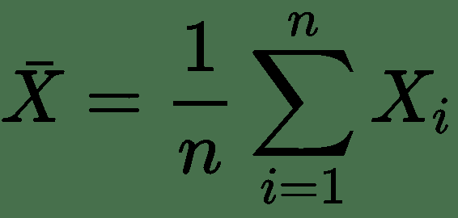

这是一个计算均值的好公式； 在我们的示例中，公式解释如下：

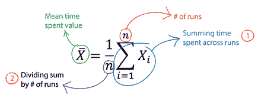

基线将基于此公式创建。 第一组计算如下：

的加法和乘法：

*   向量向量
*   向量矩阵
*   矩阵矩阵

通常，您将运行这些计算给定次数并计算平均值。

以下代码段向您展示了一个自定义函数，而不是 Python 中可用的通用计时器。 使用自定义函数的原因是，您以后可以将其与其他统计函数一起扩展，并通过适当的日志记录更好地查看详细信息。 函数将在计算开始之前输出有用的信息，并在迭代完成之后输出结果。

```py
import inspect
import time
from datetime import datetime

def timer(*args, operation, n):
 """
 Returns average time spent 
 for given operation and arguments.

 Parameters
 ----------
 *args: list (of numpy.ndarray, numpy.matrixlib.defmatrix.matrix or both)
 one or more numpy vectors or matrices
 operation: function
 numpy or scipy operation to be applied to given arguments
 n: int 
 number of iterations to apply given operation
 Returns
 -------
 avg_time_spent: double
 Average time spent to apply given operation
 std_time_spent: double
 Standard deviation of time spent to apply given operation

 Examples
 --------

 >>> import numpy as np
 >>> vec1 = np.array(np.random.rand(1000))
 >>> vec2 = np.array(np.random.rand(1000))
 >>> args = (vec1, vec2)

 >>> timer(*args, operation=np.dot, n=1000000)
 8.942582607269287e-07
 """

 # Following list will hold the
 # time spent value for each iteration
 time_spent = []

 # Configuration info
 print("""
 -------------------------------------------

 ### {} Operation ###

 Arguments Info
 --------------
 args[0] Dimension: {},
 args[0] Shape: {},
 args[0] Length: {}
 """.format(operation.__name__,
 args[0].ndim,
 args[0].shape,
 len(args[0])))

 # If *args length is greater than 1, 
 # print out the info for second argument
 args_len = 0
 for i, arg in enumerate(args):
     args_len += 1

 if args_len > 1:
     print("""
     args[1] Dimension: {},
     args[1] Shape: {},
     args[1] Length: {}
     """.format(args[1].ndim,
         args[1].shape,
         len(args[1])))

 print("""
 Operation Info
 --------------
 Name: {},
 Docstring: {}

 Iterations Info
 ---------------
 # of iterations: {}""".format(
 operation.__name__,
 operation.__doc__[:100] + 
 "... For more info type 'operation?'",
 n))

 print("""
 -> Starting {} of iterations at: {}""".format(n, datetime.now()))

 if args_len > 1:
     for i in range(n):
         start = time.time()
         operation(args[0], args[1])
         time_spent.append(time.time()-start)
 else:
     for i in range(n):
         start = time.time()
         operation(args[0])
         time_spent.append(time.time()-start)

 avg_time_spent = np.sum(time_spent) / n
 print("""
 -> Average time spent: {} seconds,
 -------------------------------------------
 """.format(avg_time_spent))

 return avg_time_spent
```

当此函数中包含`Docstring`时，可以显示它以查看函数参数，返回的内容以及用法示例：

```py
print(timer.__doc__)
```

这将生成以下输出：

```py
    Returns average time spent 
    for given operation and arguments.

    Parameters
    ----------
        *args: list (of numpy.ndarray, numpy.matrixlib.defmatrix.matrix or both)
            one or more numpy vectors or matrices
        operation: function
            numpy or scipy operation to be applied to given arguments
        n: int 
            number of iterations to apply given operation

    Returns
    -------
        avg_time_spent: double
            Average time spent to apply given operation

    Examples
    --------
    >>> import numpy as np

    >>> vec1 = np.array(np.random.rand(1000))
    >>> vec2 = np.array(np.random.rand(1000))

    >>> args = [vec1, vec2]

    >>> timer(*args, operation=np.dot, n=1000000)
    8.942582607269287e-07
```

让我们开始测量两个向量的点积所花费的平均时间。 以下代码块定义向量，并创建要输入到计时器函数中的参数：

```py
import numpy as np
vec1 = np.array(np.random.rand(1000))
vec2 = np.array(np.random.rand(1000))
args = [vec1, vec2]
```

您现在可以按以下方式调用计时器函数：

```py
timer(*args, operation=np.dot, n=1000000)
    -------------------------------------------
    ### dot Operation ###
    Arguments Info
    --------------
    args[0] Dimension: 1,
    args[0] Shape: (1000,),
    args[0] Length: 1000
    args[1] Dimension: 1,
    args[1] Shape: (1000,),
    args[1] Length: 1000
    Operation Info
    --------------
    Name: dot,
    Docstring: dot(a, b, out=None)
    Dot product of two arrays. Specifically,
    - If both `a` and `b` are 1-D... For more info type 'operation?'
    Iterations Info
    ---------------
    # of iterations: 1000000
    -> Starting 1000000 of iterations at: 2018-06-09 21:02:51.711211 
    -> Average time spent: 1.0054986476898194e-06 seconds,
    -------------------------------------------
1.0054986476898194e-06
```

我们的向量乘积平均需要 1 微秒。 让我们看看如何通过添加其他指标来改进此计算。 您可以轻松添加的另一个指标是标准差，如下公式所示：

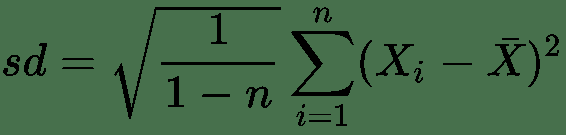

您熟悉上图中的公式术语。 标准差只是告诉您所报告指标的可变性，这是在我们的示例中花费的平均时间。

通过计算`std_time_spent`，打印其值并返回以下内容来扩展计时器函数：

```py
avg_time_spent = np.sum(time_spent) / n
std_time_spent = np.std(time_spent)
print("""
-> Average time spent: {} seconds,
-> Std. deviation time spent: {} seconds
""".format(avg_time_spent, std_time_spent))
return avg_time_spent, std_time_spent
```

您还可以如下更新`Docstring`：

```py
Returns
-------
avg_time_spent: double
Average time spent to apply given operation
std_time_spent: double
Standard deviation of time spent to apply given operation.
```

您可以重新定义时间函数，然后再次运行先前的计算，如下所示：

```py
timer(*args, operation=np.dot, n=1000000)
```

您将获得以下输出（为简洁起见，仅显示最后一部分）以及其他信息：

```py
-> Starting {} of iterations at: {}".format(n, datetime.now())
-> Average time spent: 1.0006928443908692e-06 seconds,
-> Std. deviation time spent: 1.2182541822530471e-06 seconds
(1.0006928443908692e-06, 1.2182541822530471e-06)
```

大！ 您还添加了哪些其他指标？ 如何添加置信区间？ 该部分将留给您锻炼，但是对您来说应该很容易！

让我们继续向量矩阵乘积：

```py
mat1 = np.random.rand(1000,1000)
args = [vec1, mat1]
timer(*args, operation=np.dot, n=1000000)
```

这将为您提供以下输出：

```py
    Arguments Info
    --------------
    args[0] Dimension: 1,
    args[0] Shape: (1000,),
    args[0] Length: 1000
    args[1] Dimension: 2,
    args[1] Shape: (1000, 1000),
    args[1] Length: 1000
    Operation Info
    --------------
    Name: dot,
    Docstring: dot(a, b, out=None)
    Dot product of two arrays. Specifically,
    - If both `a` and `b` are 1-D... For more info type 'operation?'
    Iterations Info
    ---------------
    # of iterations: 1000000
    -> Starting 1000000 of iterations at: 2018-06-09 19:13:07.013949
    -> Average time spent: 0.00020063393139839174 seconds,
    -> Std. deviation time spent: 9.579314466482879e-05 seconds
 (0.00020063393139839174, 9.579314466482879e-05)
```

最后，矩阵矩阵乘法如下：

```py
mat1 = np.random.rand(100,100)
mat2 = np.random.rand(100,100)
args = [mat1, mat2]
timer(*args, operation=np.dot, n=1000000)
```

这将为您提供类似于先前输出的输出。

现在，我们或多或少有了一个想法，即如何挑战如何在计算机上执行这些任务。 基准函数列表已完成，在上一章中您看到了将点积添加到矩阵分解中的信息。

您将要做的是创建一个包含这些计算和统计信息的 Python 脚本文件。 然后，您将使用在 AWS 上设置的不同配置运行此文件。

让我们看一下`linalg_benchmark.py`，您可以在[这个页面](https://github.com/umitmertcakmak/Mastering_Numerical_Computing_with_NumPy/blob/master/Ch09/linalg_benchmark.py) 中找到它。

以下代码块向您展示了`linalg_benchmark.py`脚本的重要部分，该脚本将用于测试您先前在 AWS 上设置的不同配置：

```py
## Seed for reproducibility
np.random.seed(8053)
dim = 100
n = 10000
v1, v2 = np.array(rand(dim)), np.array(rand(dim))
m1, m2 = rand(dim, dim), rand(dim, dim)
## Vector - Vector Product
args = [v1, v2]
timer(*args, operation=np.dot, n=n)
## Vector - Matrix Product
args = [v1, m1]
timer(*args, operation=np.dot, n=n)
## Matrix - Matrix Product
args = [m1, m2]
timer(*args, operation=np.dot, n=n)
## Singular-value Decomposition
args = [m1]
timer(*args, operation=np.linalg.svd, n=n)
## LU Decomposition
args = [m1]
timer(*args, operation=lu, n=n)
## QR Decomposition
args = [m1]
timer(*args, operation=qr, n=n)
## Cholesky Decomposition
M = np.array([[1, 3, 4],
[2, 13, 15],
[5, 31, 33]])
args = [M]
timer(*args, operation=cholesky, n=n)
## Eigenvalue Decomposition
args = [m1]
timer(*args, operation=eig, n=n)
print("""
NumPy Configuration:
--------------------
""")
np.__config__.show()
```

将有两个单独的运行：

*   1 <sup class="calibre32">st</sup> 与`dim = 100`一起运行
*   2 <sup class="calibre32">和</sup>与`dim = 500`一起运行

让我们看一下结果。

## 准备性能基准

对于每个实例和配置，导航到您的`Home`目录并创建一个名为`py_scripts`的文件夹：

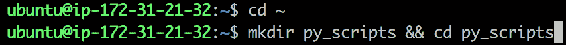

使用以下命令创建名为`linalg_benchmark.py`的文件并粘贴内容：


粘贴内容后，键入`:`，然后键入`wq!`和`Enter`保存并退出：

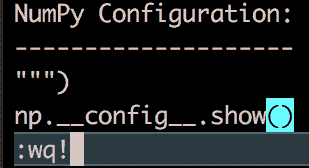

现在，您可以使用以下命令运行该文件：


对于 Anaconda 分发，您将使用以下命令运行脚本：

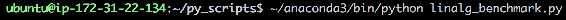

## BLAS 和 LAPACK 的性能

在这里，您将使用 BLAS 和 LAPACK 运行`linalg_benchmark.py`脚本。 连接到具有此配置的`t2.micro`实例，然后如上一节中所示运行脚本。

以下是`dim = 100`的运行结果：

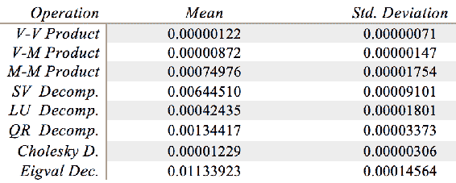

以下是`dim = 500`的运行结果：

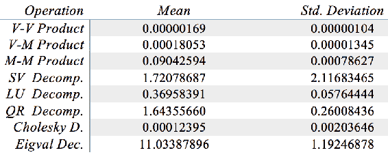

## OpenBLAS 的性能

在这里，您将使用 OpenBLAS 运行`linalg_benchmark.py`脚本。 连接到具有此配置的`t2.micro`实例，然后运行上一节中显示的脚本。

以下是`dim = 100`的运行结果：

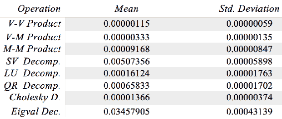

以下是`dim = 500`的运行结果：

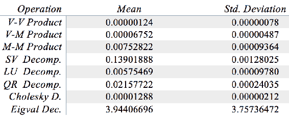

## ATLAS 的性能

在这里，您将使用 ATLAS 运行`linalg_benchmark.py`脚本。 连接到具有此配置的`t2.micro`实例，如上一节中所示运行脚本。

以下是`dim = 100`的运行结果：

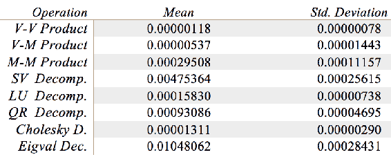

以下是`dim = 500`的运行结果：

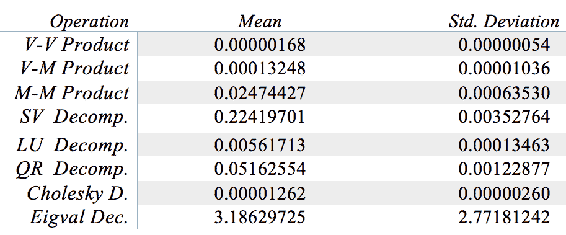

## 英特尔 MKL 的性能

在这里，您将使用英特尔 MKL 运行`linalg_benchmark.py`脚本。 连接到具有此配置的`t2.micro`实例，然后运行上一节中显示的脚本。

以下是`dim = 100`的运行结果：

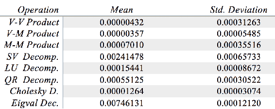

以下是`dim = 500`的运行结果：

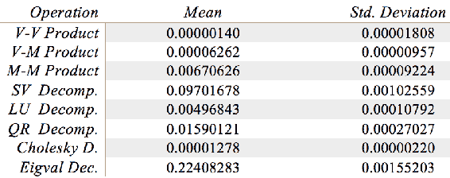

## 结果

当然，`t2.micro`实例相当薄弱，您应该更多地了解 Amazon 如何为 EC2 实例提供这种计算能力。 您可以在[这个页面](https://aws.amazon.com/ec2/instance-types/) 上阅读有关它们的更多信息。

如果您使用功能更强大的计算机并具有更多的内核，则不同配置之间的性能差异将更加明显。

说到结果，毫不奇怪，默认安装的 BLAS 和 LAPACK 为我们提供了基准性能，而经过优化的版本（如 OpenBLAS，ATLAS 和 Intel MKL）提供了更好的性能。

正如您已经指出的那样，您没有在 Python 脚本中更改任何代码行，而仅通过将 NumPy 库与不同的加速器链接起来，便获得了巨大的性能提升。

如果您将更深入地研究这些低级库以了解提供了哪些特定的例程和函数，则将更好地了解程序的哪些部分将从这些实现中受益。

当然，起初您可能还不了解许多其他细节。 可能是您使用的函数未使用低级库或未并行化操作的情况。 在某些情况下，多线程会或不会有所帮助。 知识和经验最终取决于您的实验，并且您将从自己的经验中学到东西，因此您将更加精通各种应用。

许多研究人员发表了实验的设计和结果。 Google 的快速搜索将为您提供大量资源，以阅读和了解这些库在不同硬件和软件配置下的性能。

## 总结

在本章中，您探讨了执行计算密集型线性代数运算时不同配置的性能。

基准测试是一项严肃的工作，您至少现在已经具备运行基准测试的基本技能。 您在本章中学习的材料远未完成，但是它为您提供了从哪里开始的想法，并且您肯定可以在许多方面进行改进。

您可以看到的一件事是，逐渐增加向量和矩阵的大小时性能指标的行为。 理想情况下，您将需要功能更强大的硬件，但是`t2.micro`实例在大多数情况下是免费的，或者提供的价格非常便宜。

由于您将需要处理更多的计算密集型工作负载，因此重要的是要了解您的选择以及哪种选择将为您带来最佳性能。 您可以运行这些简单的实验，至少对性能有所了解，这将为您带来很多帮助，并节省时间和金钱。

如果您走了这么远，恭喜！ 我们认为，遍历所有章节并学习相关材料可以提高您在 Python 科学堆栈方面的技能。

我们希望您喜欢阅读这本书，并感谢您的宝贵时间。


