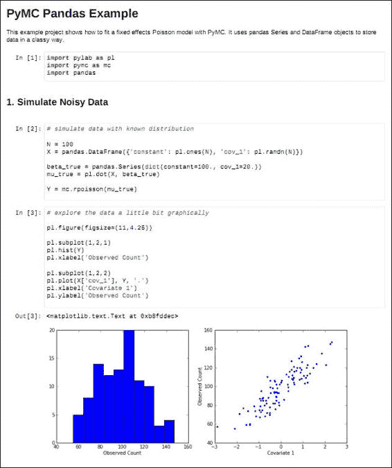

# 二、Pandas 安装和支持软件

在我们开始对 Pandas 进行数据分析之前，我们需要确保已安装该软件并且环境处于正确的工作状态。 本节介绍了 Python（如有必要），pandas 库以及 Windows，MacOSX 和 Linux 平台的所有必需依赖项的安装。 我们讨论的主题包括：

*   选择 Python 版本
*   安装 Python
*   安装 Pandas（0.16.0）
*   安装 IPython 和 Virtualenv

以下部分概述的步骤在大多数情况下应该有效，但是您的里程可能会因设置而异。 在不同的操作系统版本上，脚本可能无法始终完美运行，并且系统中已经存在的第三方软件包有时可能与提供的说明冲突。

# 选择要使用的 Python 版本

在继续安装和下载 Python 和 Pandas 之前，我们需要考虑将要使用的 Python 版本。 当前，当前使用的 Python 有两种版本，分别是 Python 2.7.x 和 Python3。如果读者是 Python 和 Pandas 的新手，那么问题就变成了他/她应该采用哪种语言。

从表面上看，Python 3.x 似乎是更好的选择，因为 Python 2.7.x 被认为是传统，而 Python 3.x 被认为是该语言的未来。

### 注意

作为参考，您可以浏览[标题为“Python2 或 Python3”的文档](https://wiki.python.org/moin/Python2orPython3)。

Python 2.x 和 3 之间的主要区别包括 Python3 中更好的 Unicode 支持，将`print`和`exec`更改为函数以及整数除法。 有关更多详细信息，请参见 [*Python 3.0 的新增功能*](http://docs.python.org/3/whatsnew/3.0.html)。

但是，出于科学，数值或数据分析的目的，建议使用 Python 2.7 而不是 Python3，原因如下：Python 2.7 是大多数当前发行版的首选版本，并且对某些库的 Python 3.x 支持不那么强， 尽管这已不再是一个问题。

作为参考，请查看标题为[*科学家们将迁移到 Python3 吗？*](http://bit.ly/1DOgNuX)的文档。 因此，本书将使用 Python 2.7。 它并不排除使用 Python3，使用 Python3 的开发人员可以通过参考以下文档轻松地对示例进行必要的代码更改：[*将 Python2 代码移植到 Python3*](http://docs.python.org/2/howto/pyporting.html)。

# Python 安装

在这里，我们详细介绍了在多个平台上安装 Python 的情况 -- Linux，Windows 和 MacOSX。

## Linux

如果您使用的是 Linux，则很可能预装了 Python。 如果不确定，请在命令提示符下键入以下内容：

```py
 which python

```

根据您的发行版和特定的安装情况，很可能在 Linux 的以下文件夹之一中找到 Python：

*   `/usr/bin/python`
*   `/bin/python`
*   `/usr/local/bin/python`
*   `/opt/local/bin/python`

您可以通过在命令提示符下键入以下命令来确定安装了哪个特定版本的 Python：

```py
python --version

```

如果尚未安装 Python，这种情况极少发生，您需要确定所使用的 Linux 版本，然后下载并安装它。 这是安装命令以及各种 Linux Python 发行版的链接：

1.  Debian/Ubuntu (14.04)

    ```py
     sudo apt-get install Python 2.7
     sudo apt-get install Python 2.7-devel

    ```

    Debian Python 页面位于[这里](https://wiki.debian.org/Python)。

2.  Redhat Fedora/Centos/RHEL

    ```py
     sudo yum install python
     sudo yum install python-devel

    ```

    Fedora 软件安装在[这个页面](http://bit.ly/1B2RpCj)上。

3.  Open Suse

    ```py
     sudo zypper install python
     sudo zypper install python-devel

    ```

    有关安装软件的更多信息，请参见[这里](http://en.opensuse.org/YaST_Software_Management)。

4.  `Slackware`：对于此 Linux 发行版，最好下载压缩的 tarball 并从源代码中安装它，如以下部分所述。

### 从压缩 tarball 安装 Python

如果上述方法都不适合您，您还可以下载压缩的 tarball（XZ 或 Gzip）并安装。 以下是有关这些步骤的简要概述：

```py
#Install dependencies
sudo apt-get install build-essential
sudo apt-get install libreadline-gplv2-dev libncursesw5-dev libssl-dev libsqlite3-dev tk-dev libgdbm-dev libc6-dev libbz2-dev
#Download the tarball
mkdir /tmp/downloads
cd /tmp/downloads
wget http://python.org/ftp/python/2.7.5/Python-2.7.5.tgz
tar xvfz Python-2.7.5.tgz
cd Python-2.7.5
# Configure, build and install
./configure --prefix=/opt/Python 2.7 --enable-shared
make
make test
sudo make install
echo "/opt/Python 2.7/lib" >> /etc/ld.so.conf.d/opt-Python 2.7.conf
ldconfig
cd ..
rm -rf /tmp/downloads

```

有关此信息，请参见 [Python 下载页面](http://www.python.org/download/)。

## Windows

与 Linux 和 Mac 发行版不同，Python 未预先安装在 Windows 上。

### 核心 Python 安装

标准方法是使用来自 CPython 团队的 Windows 安装程序，它们是 MSI 软件包。 可从[此处](http://www.python.org/download/releases/2.7.6/)下载 MSI 软件包。

根据您的 Windows 版本是 32 位还是 64 位，选择适当的 Windows 软件包。 默认情况下，Python 被安装到包含版本号的文件夹中，因此在这种情况下，它将被安装到以下位置：`C:\Python27`。

这使您可以运行多个版本的 Python 而不会出现问题。 安装后，应将以下文件夹添加到`PATH`环境变量：`C:\Python27\`和`C:\Python27\Tools\Scripts`。

### 第三方 Python 软件安装

为了使其他软件包（例如 pandas）的安装更加容易，需要安装一些 Python 工具。 安装 **Setuptools** 和 **PIP**。 Setuptools 对于安装其他 Python 软件包（例如 pandas）非常有用。 它增加了标准 Python 发行版中`distutils`工具提供的打包和安装功能。

要安装 Setuptools，请从[这个链接](https://bitbucket.org/pypa/setuptools/raw/bootstrap)下载`ez_setup.py`脚本。

然后，将其保存到`C:\Python27\Tools\Scripts`。

然后，运行`ez_setup.py`：`C:\Python27\Tools\Scripts\ez_setup.py`。

关联的命令`pip`为开发人员提供了易于使用的命令，该命令可以快速轻松地安装 Python 模块。 从[这个链接](http://www.pip-installer.org/en/latest/)下载`get-pip`脚本。

然后，从以下位置运行它：`C:\Python27\Tools\Scripts\get-pip.py`。

作为参考，您还可以浏览标题为[*在 Windows 上安装 Python*](http://docs.python-guide.org/en/latest/starting/install/win/) 的文档。

Windows 上还有第三方 Python 提供商，这些任务使安装任务变得更加容易。 它们列出如下：

*   **Enthought**：<https://enthought.com/>
*   **Continuum**：<http://www.continuum.io/>
*   **Active Python**：<http://www.activestate.com/activepython>

## MacOSX

MacOSX 的当前和最新发行版（过去 5 年）中已预安装了 Python 2.7。可以在 Mac 上的以下文件夹中找到由 Apple 提供的预安装版本：

*   `/System/Library/Frameworks/Python.framework`
*   `/usr/bin/python`

但是，您可以从[这个链接](http://www.python.org/download/)安装自己的版本。 一个需要注意的是，您现在将拥有两个 Python 安装，并且必须小心确保路径和环境完全分开。

### 使用包管理器进行安装

也可以使用 Mac 上的软件包管理器（例如 Macports 或 Homebrew）安装 Python。 我将在这里讨论使用 Homebrew 进行的安装，因为这似乎是最方便用户的操作。 作为参考，您可以浏览标题为[*在 MacOSX 上安装 Python*](http://docs.python-guide.org/en/latest/starting/install/osx/)的文档。 步骤如下：

1.  安装 Homebrew 并运行：

    ```py
    ruby -e "$(curl -fsSL https://raw.github.com/mxcl/homebrew/go)"

    ```

    然后，您需要在`PATH`环境变量的顶部添加 Homebrew 文件夹。

2.  在 Unix 提示符下安装 Python 2.7：

    ```py
    brew install python

    ```

3.  安装第三方软件：分发并点子。 安装 Homebrew 会自动安装这些软件包。 分发和 PIP 使一个人可以轻松下载和安装/卸载 Python 软件包。

# 从第三方供应商安装 Python 和 Pandas

安装 Python，Pandas 及其相关依赖性的最直接方法是使用第三方供应商（如 Enthought 或 Continuum Analytics）安装打包的发行版。

我以前更喜欢 Continuum Analytics Anaconda 而不是 Enthought，因为 Anaconda 是免费赠送的，而 Enthought 过去是为完全访问其所有数字模块收取订阅费用。 但是，在最新版的 Enthought Canopy 中，几乎没有办法将这两个发行版分开。 不过，我个人比较喜欢 Anaconda，因此将介绍其安装版本。

作为参考，请参见 [*Anaconda Python 发行版*](http://bit.ly/1aBhmgH)。 现在，我将简要介绍 Anaconda 软件包及其安装方法。

# Continuum Analytics Anaconda

Anaconda 是免费的 Python 发行版，专注于大规模数据处理，分析和数值计算。 以下是 Anaconda 的主要功能：

*   它包括最受欢迎的 Python 软件包，用于科学，工程，数值和数据分析。
*   它是完全免费的，并且可在 Linux，Windows 和 MacOSX 平台上使用。
*   安装不需要 root 或本地 admin 特权，并且整个软件包都安装在一个文件夹中。
*   多个安装可以共存，并且该安装不会影响系统上预先存在的 Python 安装。
*   它包括诸如 Cython，NumPy，SciPy，pandas，IPython，matplotlib 之类的模块，以及自产的 Continuum 软件包，如 Numba，Blaze 和 Bokeh。

### 注

有关此的更多信息，请参考[这个链接](https://store.continuum.io/cshop/anaconda)。

## 安装 Anaconda

以下说明详细说明了如何在所有三个平台上安装 Anaconda。 下载位置是[这里](http://continuum.io/downloads)。 Python 的版本默认为 Anaconda 中的 Python 2.7。

### Linux

执行以下步骤进行安装：

1.  从下载位置下载 Linux 安装程序（32/64 位）。
2.  在终端中，运行以下命令：

    ```py
    bash <Linux installer file>

    ```

    例如，`bash Anaconda-1.8.0-Linux-x86_64.sh`。

3.  接受许可条款。
4.  指定安装位置。 我倾向于在本地第三方软件安装中使用`$HOME/local`。

### MacOSX

执行以下步骤进行安装：

1.  从下载位置下载 Mac 安装程序（`.pkg file - 64-bit`）。
2.  双击`.pkg`文件进行安装，然后按照弹出窗口中的说明进行操作。 例如，包文件名：`Anaconda-1.8.0-MacOSX-x86_64.pkg`。

### Windows

在 Windows 环境中执行以下步骤：

1.  从下载位置下载 Windows 安装程序（`.exe file - 32/64-bit`）。
2.  双击`.pkg`文件进行安装，然后按照弹出窗口中的说明进行操作。 例如，包文件名：`Anaconda-1.8.0-MacOSX-x86_64.pkg`。

### 所有平台的最后一步

作为快捷方式，您可以将`ANACONDA_HOME`定义为安装 Anaconda 的文件夹。 例如，在我的 Linux 和 MacOSX 安装中，我具有以下环境变量设置：

```py
ANACONDA_HOME=$HOME/local/anaconda

```

在 Windows 上，如下所示：

```py
set ANACONDA_HOME=C:\Anaconda

```

将 Anaconda `bin`文件夹添加到`PATH`环境变量。 如果您希望默认使用 Python Anaconda，可以通过确保`$ANACONDA_HOME/bin`在包含 System Python 的文件夹之前的`PATH`变量的开头来实现。 如果您不想默认使用 Anaconda Python，则有以下两种选择：

1.  每次根据需要激活 Anaconda 环境。 可以执行以下操作：

    ```py
    source $HOME/local/anaconda/bin/activate $ANACONDA_HOME

    ```

2.  为 Anaconda 创建一个单独的环境。 [这可以通过使用内置的`conda`命令来完成](https://github.com/pydata/conda)。

### 注

有关更多信息，请阅读 [Conda 文档](http://docs.continuum.io/conda/index.html)。 可以从 [Anaconda 安装页面](http://docs.continuum.io/anaconda/install.html)获得更详细的安装 Anaconda 的说明。

# 下载并安装 Pandas

pandas 库是 Python 语言的一部分，因此我们现在可以继续安装 pandas。 在撰写本书时，可用的 Pandas 的最新稳定版本是 0.12 版。 各种依赖性以及相关的下载位置如下：

| 包 | 是否必需 | 描述 | 下载位置 |
| --- | --- | --- | --- |
| `NumPy : 1.6.1 or higher` | 必需 | 用于数值运算的 NumPy 库 | <http://www.numpy.org/> |
| `python-dateutil 1.5` | 必需 | 日期操作和实用程序库 | <http://labix.org/> |
| `Pytz` | 必需 | 时区支持 | <http://sourceforge.net/> |
| `numexpr` | 可选，推荐 | 加快数值运算 | <https://code.google.com/> |
| `bottleneck` | 可选，推荐 | 绩效相关 | <http://berkeleyanalytics.com/> |
| `Cython` | 可选，推荐 | 用于优化的 Python C 扩展 | <http://cython.org/> |
| `SciPy` | 可选，推荐 | 适用于 Python 的科学工具集 | <http://scipy.org/> |
| `PyTables` | 可选 | 基于 HDF5 的存储库 | <http://pytables.github.io/> |
| `matplotlib` | 可选，推荐 | 类似于 Matlab 的 Python 绘图库 | <http://sourceforge.net/> |
| `statsmodels` | 可选 | Python 的统计模块 | <http://sourceforge.net/> |
| `openpyxl` | 可选 | 读取/写入 Excel 文件的库 | <https://www.python.org/> |
| `xlrd/xlwt` | 可选 | 读取/写入 Excel 文件的库 | <http://python-excel.org/> |
| `boto` | 可选 | 用于访问 Amazon S3 的库 | <https://www.python.org/> |
| `BeautifulSoup`和`html5lib`，`lxml`中的一个 | 可选 | `read_html()`函数运行所需的库 | <http://www.crummy.com> |
| `html5lib` | 可选 | 用于解析 HTML 的库 | <https://pypi.python.org/pypi/html5lib> |
| `lmxl` | 可选 | 用于处理 XML 和 HTML 的 Python 库 | <http://lxml.de/> |

## Linux

对于流行的 Linux 版本，安装 pandas 非常简单。 首先，请确保已安装 Python `.dev`文件。 如果不是，则按照下一节中的说明安装它们。

### Ubuntu/Debian

对于 Ubantu/Debian 环境，运行以下命令：

```py
sudo apt-get install python-dev

```

### RedHat

对于 RedHat 环境，运行以下命令：

```py
yum install python-dev

```

现在，我将向您展示如何安装 Pandas。

### Ubuntu/Debian

要在 Ubuntu/Debian 环境中安装 Pandas，请运行以下命令：

```py
sudo apt-get install python-pandas

```

### Fedora

对于 Fedora，运行以下命令：

```py
sudo yum install python-pandas

```

### OpenSuse

通过 YaST 软件管理安装`python-pandas`或使用以下命令：

```py
sudo zypper install python-pandas

```

有时，先前的安装可能需要附加的依赖关系，尤其是在 Fedora 的情况下。 在这种情况下，您可以尝试安装其他依赖项：

```py
sudo yum install gcc-gfortran gcc44-gfortran libgfortran lapack blas python-devel
sudo python-pip install numpy

```

## MacOSX

在 MacOSX 上有多种安装 Pandas 的方法。以下各节中将对它们进行说明。

### 源码安装

Pandas 有一些依赖性使其正常工作，一些是必需的，而另一些则是可选的，尽管某些理想的功能需要正常工作。 这将安装所有必需的依赖项：

1.  安装`easy_install`程序：

    ```py
    wget http://python-distribute.org/distribute_setup.pysudo python distribute_setup.py

    ```

2.  安装 Cython

    ```py
    sudo easy_install -U Cython

    ```

3.  然后，您可以从源代码进行安装，如下所示：

    ```py
          git clone git://github.com/pydata/pandas.git
          cd pandas
          sudo python setup.py install
    ```

### 二进制安装

如果已按照 *Python 安装*部分中的说明安装了 PIP，则安装 pandas 的过程如下所示：

```py
pip install pandas

```

## Windows

以下方法描述了 Windows 环境中的安装。

### 二进制安装

确保首先安装`numpy`，`python-dateutil`和`pytz`。 每个模块都需要运行以下命令：

*   对于`python-dateutil`：

    ```py
    C:\Python27\Scripts\pip install python-dateutil

    ```

*   对于`pytz`：

    ```py
    C:\Python27\Scripts\pip install pytz 

    ```

从二进制文件下载进行安装，然后从[这里](https://pypi.python.org/pypi/pandas)运行适用于 Windows 版本的二进制文件。 例如，如果您的处理器是 AMD64，则可以使用以下命令下载并安装 Pandas：

1.  下载以下文件：（适用于 Pandas 0.16）

    ```py
    pandas-0.16.1-cp26-none-win_amd64.whl (md5)
    ```

2.  通过`pip`安装下载的文件：

    ```py
    pip install  
    pandas-0.16.1-cp26-none-win_amd64.whl
    ```

要测试安装，请运行 Python 并在命令提示符下键入以下内容：

```py
import pandas

```

如果返回没有错误，则说明安装成功。

### 源码安装

此处的步骤完全解释了安装：

1.  按照标题为[*附录：在 Windows 上安装`MinGW`编译器*](http://docs.cython.org/src/tutorial/appendix.html)的文档中的说明。
2.  确保将`MingW`二进制位置添加到附加了`C:\MingW\bin`的`PATH`变量中。
3.  安装`Cython`和`Numpy`。

    可以从[这里](http://www.lfd.uci.edu/~gohlke/pythonlibs/#numpy)下载并安装`Numpy`。

    可以从[这里](http://www.lfd.uci.edu/~gohlke/pythonlibs/#cython)下载和安装`Cython`

安装`Cython`的步骤如下：

*   通过 Pip 安装：

    ```py
    C:\Python27\Scripts\pip install Cython
    ```

*   直接下载：
    1.  [从 GitHub 下载并安装 pandas 源代码](http://github.com/pydata/pandas)。
    2.  您只需下载 zip 文件并将其解压缩到合适的文件夹中即可。
    3.  转到包含 Pandas 下载`to C:\python27\python`的文件夹，然后运行`setup.py install`。
    4.  有时，在运行`setup.py`时可能会出现以下错误：

        ```py
        distutils.errors.DistutilsError: Setup script exited with error:
        Unable to find vcvarsall.bat

        ```

这可能与未正确指定`mingw`作为编译器有关。 检查您是否再次按照所有步骤进行操作。

### 注

从源头在 Windows 上安装 Pandas 容易出现许多错误和错误，因此不建议这样做。

### IPython

**交互式 Python**（**IPython**）是一个非常有用的工具，可用于使用 Python 进行数据分析，并在此处提供安装步骤的简要说明。 IPython 提供了一个比标准 Python 提示有用得多的交互式环境。 其功能包括：

*   制表符补全可帮助用户进行数据浏览。
*   全面的帮助功能，使用`object_name?`打印有关对象的详细信息。
*   魔术函数使用户能够使用`%run`魔术命令在 IPython 中运行操作系统命令，并运行 Python 脚本并将其数据加载到 IPython 环境中。
*   通过`_`，`__`和`__`变量，`%history`和其他魔术功能以及上下箭头键的历史功能。

### 注

有关更多信息，请参见[文档](http://bit.ly/1Is4zIW)。

### IPython 笔记本

IPython Notebook 是启用 Web 的 IPython 版本。 它使用户可以将代码，数值计算以及显示图形和富媒体组合在一个文档中，即笔记本。 笔记本可以与同事共享，并转换为 HTML/PDF 格式。 有关更多信息，请参考标题为 [*IPython 笔记本*](http://ipython.org/notebook.html)的文档。 这是一个例子：



**PYMC Pandas 示例**的先前图片来自[这里](http://healthyalgorithms.files.wordpress.com/2012/01/pymc-pandas-example.png)。

# IPython 安装

推荐的安装 IPython 的方法是使用第三方软件包，例如 Continuum 的 Anaconda 或 Enthought Canopy。

## Linux

假设已按照说明安装了 Pandas 和其他用于科学计算的工具，则以下单行命令就足够了：

对于 Ubuntu/Debian，请使用

```py
sudo apt-get install ipython-notebook

```

对于 Fedora，请使用

```py
sudo yum install python-ipython-notebook

```

如果已安装`pip`和`setuptools`，也可以通过以下命令将其安装在 Linux/Mac 平台上：

```py
sudo pip install ipython

```

## Windows

IPython 在 Windows 上需要`setuptools`和`PyReadline`库。 `PyReadline`是 GNU `readline`库的 Python 实现。 要在 Windows 上安装 IPython，请执行以下步骤：

1.  如上一节中所述安装`setuptools`。
2.  通过从 [PyPI Readline 软件包页面](https://pypi.python.org/pypi/pyreadline)下载 MS Windows 安装程序来安装`pyreadline`。
3.  从 [GitHub IPython 下载位置](https://github.com/ipython/ipython/downloads)下载并运行 IPython 安装程序。

有关更多信息，请参见 [IPython 安装页面](http://bit.ly/1MkCZhC)。

## MacOSX

可以使用`pip`或`setuptools`将 IPython 安装在 MacOSX 上。 它还需要`readline`和`zeromq`库，最好使用 Homebrew 进行安装。 步骤如下：

```py
brew install readline
brew install zeromq
pip install ipython pyzmq tornado pygments

```

`pyzmq`，`tornado`和`pygments`模块是获得 IPython Notebook 的完整图形功能所必需的。 有关更多信息，请参见标题为[*为 OSX 设置 IPython 笔记本和 Pandas*](http://bit.ly/1JG0wKA) 的文档。

## 通过 Anaconda 安装（对于 Linux/MacOSX）

假设已经安装了 Anaconda，只需运行以下命令即可将 IPython 更新到最新版本：

```py
conda update conda
conda update ipython

```

## Continuum Analytics 的 Wakari

如果用户还没有准备好安装 IPython，则可以选择在云中使用 IPython。 输入 **Wakari**，这是一个基于云的分析解决方案，为 Continuum 服务器上托管的 IPython 笔记本电脑提供全面支持。 它允许用户在云上的浏览器中全部创建，编辑，保存和共享 IPython 笔记本。 可以在[这个链接](http://continuum.io/wakari)中找到更多详细信息。

## Virtualenv

**Virtualenv** 是用于创建隔离的 Python 环境的工具。 如果您希望在不影响标准 Python 构建的环境中测试最新版本的 Pandas，这将很有用。

### Virtualenv 的安装和使用

我只建议您在决定不安装和使用`Anaconda`软件包的情况下安装 Virtualenv，因为它已经提供了 Virtualenv 功能。 简要步骤如下：

1.  通过`pip`安装：

    ```py
    pip install virtualenv

    ```

2.  使用 Virtualenv
    *   使用以下命令创建虚拟环境：

        ```py
         virtualenv newEnv

        ```

    *   使用以下命令激活虚拟环境：

        ```py
         source newEnv/bin/activate

        ```

    *   使用以下命令停用虚拟环境并返回到标准 Python 环境：

        ```py
         deactivate

        ```

有关此的更多信息，可以浏览标题为[*虚拟环境*](http://docs.python-guide.org/en/latest/dev/virtualenvs/)的文档。

### 提示

**下载示例代码**

您可以从 [GitHub 存储库](https://github.com/femibyte/mastering_pandas)下载代码。

# 其他以数字或分析为重点的 Python 发行版

以下是各种与第三方数据分析相关的 Python 发行版的摘要。 以下所有发行版均包含 Pandas：

*   **Continuum Analytics Anaconda**：免费的企业级 Python 发行版，专注于大规模数据处理，分析和数值计算。 有关详细信息，请参阅[这里](https://store.continuum.io/cshop/anaconda/)。
*   **PythonXY**：免费的面向科学和工程的 Python 发行版，用于数值计算，数据分析和可视化。 它基于 Qt GUI 软件包和 Spyder 交互式科学开发环境。 有关更多信息，请参阅[这里](https://code.google.com/p/pythonxy/)。
*   **WinPython**：针对 Windows 平台的免费开源 Python 发行版，专注于科学计算。 有关更多信息，请参考[这里](http://winpython.sourceforge.net/)。

有关 Python 发行版的更多信息，请访问[这里](http://bit.ly/1yOzB7o)。

# 总结

有两个主要的 Python 版本：Python 2.7.x 和 Python 3.x。 目前，Python 2.7.x 更成熟，因此更适合进行数据分析和数值计算。 为了正确设置，pandas 库需要一些依赖项– NumPy，SciPy 和 matplotlib 仅举几例。 有很多安装 Pandas 的方法–建议的方法是安装包括 Pandas 在内的第三方发行版之一。 发行版包括 Continuum 发行的 Anaconda，Enthough Canopy，WinPython 和 PythonXY。 强烈建议安装 IPython 软件包，因为它为数据分析提供了一个丰富，高度交互的环境。

因此，设置我们的学习 Pandas 的环境包括安装合适版本的 Python，安装 Pandas 及其相关模块，以及设置一些有用的工具，例如 IPython。 再强调一遍，我强烈建议读者通过安装 Anaconda 或 Enthought 等第三方发行版来帮自己一个忙，并使他们的工作更轻松，从而使他们的环境在尽可能短的时间内运行并无故障运行。 。 在下一章中，我们将直接研究 Pandas 的主要特征。