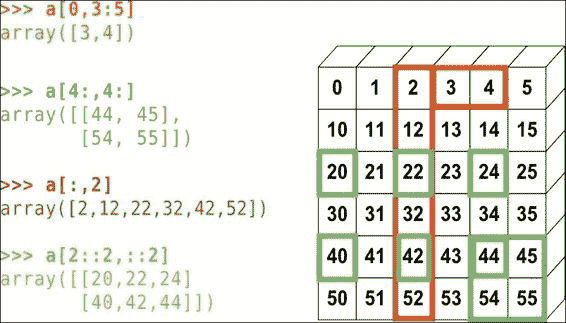

# 三、Pandas 数据结构

本章是本书中最重要的部分。 现在，我们将开始研究 Pandas 的肉和骨头。 我们首先浏览 NumPy `ndarrays`，这是一种不在 Pandas 中而是 NumPy 的数据结构。 NumPy `ndarrays`的知识很有用，因为它构成了 Pandas 数据结构的基础。 NumPy 数组的另一个主要优点是它们执行称为*向量化*的操作，这些操作需要在 Python 数组上遍历/循环的操作要快得多。

我们将在本章中介绍的主题包括：

*   浏览`numpy.ndarray`数据结构。
*   `pandas.Series`：**一维**（**1D**）Pandas 数据结构
*   `pandas.DatcaFrame`：**二维**（**2D**）Pandas 表格数据结构
*   `pandas.Panel`：**3 维**（**3D**）Pandas 数据结构

在本章中，我将通过使用 IPython（一个基于浏览器的界面，使用户可以交互地向 Python 解释器键入命令）的众多示例来介绍这些资料。 上一章提供了安装 IPython 的说明。

# NumPy `ndarray`

NumPy 库是一个非常重要的软件包，用于使用 Python 进行数值计算。 其主要功能包括：

*   `numpy.ndarray`类型，同构多维数组
*   访问大量数学函数–线性代数，统计信息等
*   能够集成 C，C++ 和 Fortran 代码

有关 NumPy 的更多信息，请参见[这里](http://www.numpy.org)。

NumPy 中的主要数据结构是数组类`ndarray`。 它是元素的齐次多维（n 维）表，它们像常规数组一样由整数索引。 但是，`numpy.ndarray`（也称为`numpy.array`）与标准 Python `array.array`类不同，后者提供的功能要少得多。 [这里](http://scipy-lectures.github.io/intro/numpy/array_object.html)提供了有关各种操作的更多信息。

## NumPy 数组创建

可以通过调用各种 NumPy 方法以多种方式创建 NumPy 数组。

### `numpy.array`和 NumPy 数组

NumPy 数组可以直接通过`numpy.array`构造函数创建：

```py
In [1]: import numpy as np
In [2]: ar1=np.array([0,1,2,3])# 1 dimensional array
In [3]: ar2=np.array ([[0,3,5],[2,8,7]]) # 2D array
In [4]: ar1
Out[4]: array([0, 1, 2, 3])
In [5]: ar2
Out[5]: array([[0, 3, 5],
 [2, 8, 7]])

```

数组的形状通过`ndarray.shape`给出：

```py
In [5]: ar2.shape
Out[5]: (2, 3)

```

尺寸数量使用`ndarray.ndim`获得：

```py
In [7]: ar2.ndim
Out[7]: 2

```

### `numpy.arange`和 NumPy 数组

`ndarray.arange`是 Python 的`range`函数的 NumPy 版本：`In [10]:`产生从 0 到 11 的整数，不包括 12。

```py
In [10]: ar3=np.arange(12); ar3
Out[10]: array([ 0,  1,  2,  3,  4,  5,  6,  7,  8,  9, 10, 11])
In [11]: # start, end (exclusive), step size
 ar4=np.arange(3,10,3); ar4
Out[11]: array([3, 6, 9])

```

### `numpy.linspace`和 NumPy 数组

`ndarray.linspace`在起点和终点之间生成线性均匀间隔的元素：

```py
In [13]:# args - start element,end element, number of elements
 ar5=np.linspace(0,2.0/3,4); ar5
Out[13]:array([ 0.,  0.22222222,  0.44444444,  0.66666667])

```

### 各种其他函数和 NumPy 数组

这些功能包括`numpy.zeros`，`numpy.ones`，`numpy.eye`，`nrandom.rand`，`numpy.random.randn`和`numpy.empty`。

在每种情况下，该参数都必须是一个元组。 对于一维数组，您只需指定元素数，而无需元组。

#### `numpy.ones`

以下命令行说明了该函数：

```py
In [14]:# Produces 2x3x2 array of 1's.
 ar7=np.ones((2,3,2)); ar7
Out[14]: array([[[ 1.,  1.],
 [ 1.,  1.],
 [ 1.,  1.]],
 [[ 1.,  1.],
 [ 1.,  1.],
 [ 1.,  1.]]])

```

#### `numpy.zeros`

以下命令行说明了该函数：

```py
In [15]:# Produce 4x2 array of zeros.
 ar8=np.zeros((4,2));ar8
Out[15]: array([[ 0.,  0.],
 [ 0.,  0.], 
 [ 0.,  0.],
 [ 0.,  0.]])

```

#### `numpy.eye`

以下命令行说明了该函数：

```py
In [17]:# Produces identity matrix
 ar9 = np.eye(3);ar9
Out[17]: array([[ 1.,  0.,  0.],
 [ 0.,  1.,  0.],
 [ 0.,  0.,  1.]])

```

#### `numpy.diag`

以下命令行说明了该函数：

```py
In [18]: # Create diagonal array
 ar10=np.diag((2,1,4,6));ar10
Out[18]: array([[2, 0, 0, 0],
 [0, 1, 0, 0],
 [0, 0, 4, 0],
 [0, 0, 0, 6]])

```

#### `numpy.random.rand`

以下命令行说明了该函数：

```py
In [19]: # Using the rand, randn functions
 # rand(m) produces uniformly distributed random numbers with range 0 to m
 np.random.seed(100)   # Set seed
 ar11=np.random.rand(3); ar11
Out[19]: array([ 0.54340494,  0.27836939,  0.42451759])
In [20]: # randn(m) produces m normally distributed (Gaussian) random numbers
 ar12=np.random.rand(5); ar12
Out[20]: array([ 0.35467445, -0.78606433, -0.2318722 ,    0.20797568,  0.93580797])

```

#### `numpy.empty`

使用`np.empty`创建未初始化的数组比分配`np.ones`或`np.zeros`（`malloc`与`cmalloc`）是一种更便宜，更快捷的分配数组的方法。 但是，只有在确定所有元素稍后都会初始化时，才应使用它：

```py
In [21]: ar13=np.empty((3,2)); ar13
Out[21]: array([[ -2.68156159e+154,   1.28822983e-231],
 [  4.22764845e-307,   2.78310358e-309],
 [  2.68156175e+154,   4.17201483e-309]])

```

#### `np.tile`

`np.tile`函数允许通过根据参数重复几次来从较小的数组构造一个数组：

```py
In [334]: np.array([[1,2],[6,7]])
Out[334]: array([[1, 2],
 [6, 7]])
In [335]: np.tile(np.array([[1,2],[6,7]]),3)
Out[335]: array([[1, 2, 1, 2, 1, 2],
 [6, 7, 6, 7, 6, 7]])
In [336]: np.tile(np.array([[1,2],[6,7]]),(2,2))
Out[336]: array([[1, 2, 1, 2],
 [6, 7, 6, 7],
 [1, 2, 1, 2],
 [6, 7, 6, 7]])

```

## NumPy 数据类型

我们可以使用`dtype`参数指定数字数组的内容类型：

```py
In [50]: ar=np.array([2,-1,6,3],dtype='float'); ar
Out[50]: array([ 2., -1.,  6.,  3.])
In [51]: ar.dtype
Out[51]: dtype('float64')
In [52]: ar=np.array([2,4,6,8]); ar.dtype
Out[52]: dtype('int64')
In [53]: ar=np.array([2.,4,6,8]); ar.dtype
Out[53]: dtype('float64')

```

NumPy 中的默认`dtype`为`float`。 对于字符串，`dtype`是数组中最长字符串的长度：

```py
In [56]: sar=np.array(['Goodbye','Welcome','Tata','Goodnight']); sar.dtype
Out[56]: dtype('S9')

```

您不能在 NumPy 中创建长度可变的字符串，因为 NumPy 需要知道为该字符串分配多少空间。 `dtypes`也可以是布尔值，复数等等：

```py
In [57]: bar=np.array([True, False, True]); bar.dtype
Out[57]: dtype('bool')

```

`ndarray`的数据类型可以用与其他语言（例如 Java 或 C/C++）相同的方式进行更改。 例如，`float`至`int`等。 执行此操作的机制是使用`numpy.ndarray.astype()`函数。 这是一个例子：

```py
In [3]: f_ar = np.array([3,-2,8.18])
 f_ar
Out[3]: array([ 3\.  , -2\.  ,  8.18])
In [4]: f_ar.astype(int)
Out[4]: array([ 3, -2,  8])

```

有关转换的更多信息，请参见[官方文档](http://docs.scipy.org/doc/numpy/reference/generated/numpy.ndarray.astype.html)。

## NumPy 索引和切片

NumPy 中的数组索引以`0`开头，例如 Python，Java 和 C++ 之类的语言，而 Fortran，Matlab 和 Octave 的数组索引以`1`开头。 数组可以以标准方式建立索引，就像我们将索引到任何其他 Python 序列中一样：

```py
# print entire array, element 0, element 1, last element.
In [36]: ar = np.arange(5); print ar; ar[0], ar[1], ar[-1]
[0 1 2 3 4]
Out[36]: (0, 1, 4)
# 2nd, last and 1st elements
In [65]: ar=np.arange(5); ar[1], ar[-1], ar[0]
Out[65]: (1, 4, 0)

```

可以使用`::-1`惯用法反转数组，如下所示：

```py
In [24]: ar=np.arange(5); ar[::-1]
Out[24]: array([4, 3, 2, 1, 0])

```

多维数组使用整数元组建立索引：

```py
In [71]: ar = np.array([[2,3,4],[9,8,7],[11,12,13]]); ar
Out[71]: array([[ 2,  3,  4],
 [ 9,  8,  7],
 [11, 12, 13]])
In [72]: ar[1,1]
Out[72]: 8

```

在这里，我们将`row1`和`column1`的条目设置为`5`：

```py
In [75]: ar[1,1]=5; ar
Out[75]: array([[ 2,  3,  4],
 [ 9,  5,  7],
 [11, 12, 13]])

```

检索第 2 行：

```py
In [76]:  ar[2]
Out[76]: array([11, 12, 13])
In [77]: ar[2,:]
Out[77]: array([11, 12, 13])

```

检索列 1：

```py
In [78]: ar[:,1]
Out[78]: array([ 3,  5, 12])

```

如果指定的索引超出数组范围，则将引发`IndexError`：

```py
In [6]: ar = np.array([0,1,2])
In [7]: ar[5]
 ---------------------------------------------------------------------------
 IndexError                  Traceback (most recent call last)
 <ipython-input-7-8ef7e0800b7a> in <module>()
 ----> 1 ar[5]
 IndexError: index 5 is out of bounds for axis 0 with size 3

```

因此，对于 2D 数组，第一维表示行，第二维表示列。 冒号（`:`）表示对维度所有元素的选择。

### 数组切片

可以使用以下语法对数组进行切片：`ar[startIndex: endIndex: stepValue]`。

```py
In [82]: ar=2*np.arange(6); ar
Out[82]: array([ 0,  2,  4,  6,  8, 10])
In [85]: ar[1:5:2]
Out[85]: array([2, 6])

```

请注意，如果我们希望包含`endIndex`值，则需要超过它，如下所示：

```py
In [86]: ar[1:6:2]
Out[86]: array([ 2,  6, 10])

```

使用`ar[:n]`获得前 n 个元素：

```py
In [91]: ar[:4]
Out[91]: array([0, 2, 4, 6])

```

这里的隐含假设是`startIndex=0, step=1`。

从元素 4 开始直到结束：

```py
In [92]: ar[4:]
Out[92]: array([ 8, 10])

```

带`stepValue=3`的切片数组：

```py
In [94]: ar[::3]
Out[94]: array([0, 6])

```

为了说明 NumPy 中索引的范围，让我们参考此图，该图取自 SciPy 2013 上的 NumPy 演讲，可在[这个链接](http://bit.ly/1GxCDpC)中找到：



现在让我们检查上图中的表达式的含义：

*   表达式`a[0,3:5]`表示从第 0 行和第 3-5 列开始，其中不包括第 5 列。
*   在表达式`a[4:,4:]`中，前 4 个表示第 4 行的起点，并将给出所有列，即数组`[[40, 41, 42, 43, 44, 45], [50, 51, 52, 53, 54, 55]]`。 第二个 4 显示了在第 4 列开始处的截止，以产生数组`[[44, 45], [54, 55]]`。
*   表达式`a[:,2]`给出了列 2 中的所有行。
*   现在，在最后一个表达式`a[2::2,::2]`中，`2::2`指示起点在第 2 行，此处的步长值也为 2。这将为我们提供数组`[[20, 21, 22, 23, 24, 25], [40, 41, 42, 43, 44, 45]`。 此外，`::2`指定我们以 2 的步骤检索列，从而产生最终结果数组（`[[20, 22, 24], [40, 42, 44]]`）。

可以将分配和切片结合在一起，如以下代码片段所示：

```py
In [96]: ar
Out[96]: array([ 0,  2,  4,  6,  8, 10])
In [100]: ar[:3]=1; ar
Out[100]: array([ 1,  1,  1,  6,  8, 10])
In [110]: ar[2:]=np.ones(4);ar
Out[110]: array([1, 1, 1, 1, 1, 1])

```

### 数组遮罩

在这里，NumPy 数组可用作遮罩，以选择或滤除原始数组的元素。 例如，请参见以下代码段：

```py
In [146]: np.random.seed(10)
 ar=np.random.random_integers(0,25,10); ar
Out[146]: array([ 9,  4, 15,  0, 17, 25, 16, 17,  8,  9])
In [147]: evenMask=(ar % 2==0); evenMask
Out[147]: array([False,  True, False,  True, False, False,  True, False,  True, False], dtype=bool)
In [148]: evenNums=ar[evenMask]; evenNums
Out[148]: array([ 4,  0, 16,  8])

```

在下面的示例中，我们随机生成一个 0 到 25 之间的 10 个整数的数组。然后，我们创建一个布尔掩码数组，该数组用于仅滤除偶数。 例如，如果我们希望通过将默认值替换为缺失值来消除缺失值，则此掩码功能可能非常有用。 在这里，缺失值`''`被替换为`'USA'`作为默认国家/地区。 请注意，`''`也是一个空字符串：

```py
In [149]: ar=np.array(['Hungary','Nigeria', 
 'Guatemala','','Poland',
 '','Japan']); ar
Out[149]: array(['Hungary', 'Nigeria', 'Guatemala', 
 '', 'Poland', '', 'Japan'], 
 dtype='|S9')
In [150]: ar[ar=='']='USA'; ar
Out[150]: array(['Hungary', 'Nigeria', 'Guatemala', 
 'USA', 'Poland', 'USA', 'Japan'], dtype='|S9')

```

整数数组也可以用于索引一个数组以生成另一个数组。 请注意，这会产生多个值。 因此，输出必须是`ndarray`类型的数组。 以下代码段对此进行了说明：

```py
In [173]: ar=11*np.arange(0,10); ar
Out[173]: array([ 0, 11, 22, 33, 44, 55, 66, 77, 88, 99])
In [174]: ar[[1,3,4,2,7]]
Out[174]: array([11, 33, 44, 22, 77])

```

在前面的代码中，选择对象是一个列表，并且选择了索引 1、3、4、2 和 7 的元素。 现在，假设我们将其更改为以下内容：

```py
In [175]: ar[1,3,4,2,7]

```

由于数组是一维的，因此我们收到`IndexError`错误，并且指定的索引太多，无法访问它。

```py
IndexError          Traceback (most recent call last)
<ipython-input-175-adbcbe3b3cdc> in <module>()
----> 1 ar[1,3,4,2,7]

IndexError: too many indices

```

数组索引也可以进行此分配，如下所示：

```py
In [176]: ar[[1,3]]=50; ar
Out[176]: array([ 0, 50, 22, 50, 44, 55, 66, 77, 88, 99])

```

通过使用数组索引列表从另一个数组创建新数组时，新数组具有相同的形状。

### 复杂索引

在这里，我们说明了如何使用复杂的索引将值从较小的数组分配到较大的数组：

```py
In [188]: ar=np.arange(15); ar
Out[188]: array([ 0,  1,  2,  3,  4,  5,  6,  7,  8,  9, 10, 11, 12, 13, 14])

In [193]: ar2=np.arange(0,-10,-1)[::-1]; ar2
Out[193]: array([-9, -8, -7, -6, -5, -4, -3, -2, -1,  0])

```

切出`ar`的前 10 个元素，并用`ar2`中的元素替换它们，如下所示：

```py
In [194]: ar[:10]=ar2; ar
Out[194]: array([-9, -8, -7, -6, -5, -4, -3, -2, -1,  0, 10, 11, 12, 13, 14])

```

## 副本和视图

NumPy 数组上的视图只是描绘其包含的数据的一种特殊方式。 创建视图不会导致数组的新副本，而是可以按特定顺序排列其中包含的数据，或者仅显示某些数据行。 因此，如果将数据替换为基础数组的数据，则无论何时通过索引访问数据，这都会反映在视图中。

切片时不会将初始数组复制到内存中，因此效率更高。 `np.may_share_memory`方法可用于查看两个数组是否共享同一存储块。 但是，应谨慎使用，因为它可能会产生误报。 修改视图会修改原始数组：

```py
In [118]:ar1=np.arange(12); ar1
Out[118]:array([ 0,  1,  2,  3,  4,  5,  6,  7,  8,  9, 10, 11])

In [119]:ar2=ar1[::2]; ar2
Out[119]: array([ 0,  2,  4,  6,  8, 10])

In [120]: ar2[1]=-1; ar1
Out[120]: array([ 0,  1, -1,  3,  4,  5,  6,  7,  8,  9, 10, 11])

```

为了强制 NumPy 复制数组，我们使用`np.copy`函数。 正如我们在以下数组中看到的，修改复制的数组时，原始数组不受影响：

```py
In [124]: ar=np.arange(8);ar
Out[124]: array([0, 1, 2, 3, 4, 5, 6, 7])

In [126]: arc=ar[:3].copy(); arc
Out[126]: array([0, 1, 2])

In [127]: arc[0]=-1; arc
Out[127]: array([-1,  1,  2])

In [128]: ar
Out[128]: array([0, 1, 2, 3, 4, 5, 6, 7])

```

## 操作

在这里，我们介绍 NumPy 中的各种操作。

### 基本操作

基本算术运算使用标量操作数逐个元素地工作。 它们是`- +`，`-`，`*`，`/`和`**`。

```py
In [196]: ar=np.arange(0,7)*5; ar
Out[196]: array([ 0,  5, 10, 15, 20, 25, 30])

In [198]: ar=np.arange(5) ** 4 ; ar
Out[198]: array([  0,   1,  16,  81, 256])

In [199]: ar ** 0.5
Out[199]: array([  0.,   1.,   4.,   9.,  16.])

```

当另一个数组是第二个操作数时，操作也按元素方式工作，如下所示：

```py
In [209]: ar=3+np.arange(0, 30,3); ar
Out[209]: array([ 3,  6,  9, 12, 15, 18, 21, 24, 27, 30])

In [210]: ar2=np.arange(1,11); ar2
Out[210]: array([ 1,  2,  3,  4,  5,  6,  7,  8,  9, 10])

```

在下面的代码段中，我们看到了逐元素的减法，除法和乘法：

```py
In [211]: ar-ar2
Out[211]: array([ 2,  4,  6,  8, 10, 12, 14, 16, 18, 20])

In [212]: ar/ar2
Out[212]: array([3, 3, 3, 3, 3, 3, 3, 3, 3, 3])

In [213]: ar*ar2
Out[213]: array([  3,  12,  27,  48,  75, 108, 147, 192, 243, 300])

```

使用 NumPy 进行此操作比使用纯 Python 更快。 IPython 中的`%timeit`函数被称为魔术函数，它使用 Python `timeit`模块来定时执行 Python 语句或表达式，其解释如下：

```py
In [214]: ar=np.arange(1000)
 %timeit ar**3
 100000 loops, best of 3: 5.4 µs per loop

In [215]:ar=range(1000)
 %timeit [ar[i]**3 for i in ar]
 1000 loops, best of 3: 199 µs per loop

```

数组乘法与矩阵乘法不同； 它是元素方式的，意味着相应的元素被相乘在一起。 对于矩阵乘法，请使用点运算符。 有关更多信息，请参考[这里](http://docs.scipy.org/doc/numpy/reference/generated/numpy.dot.html)。

```py
In [228]: ar=np.array([[1,1],[1,1]]); ar
Out[228]: array([[1, 1],
 [1, 1]])

In [230]: ar2=np.array([[2,2],[2,2]]); ar2
Out[230]: array([[2, 2],
 [2, 2]])

In [232]: ar.dot(ar2)
Out[232]: array([[4, 4],

 [4, 4]])

```

比较和逻辑运算也是基于元素的：

```py
In [235]: ar=np.arange(1,5); ar
Out[235]: array([1, 2, 3, 4])

In [238]: ar2=np.arange(5,1,-1);ar2
Out[238]: array([5, 4, 3, 2])

In [241]: ar < ar2
Out[241]: array([ True,  True, False, False], dtype=bool)

In [242]: l1 = np.array([True,False,True,False])
 l2 = np.array([False,False,True, False])
 np.logical_and(l1,l2)
Out[242]: array([False, False,  True, False], dtype=bool)

```

其他 NumPy 运算（例如`log`，`sin`，`cos`和`exp`）也是按元素排列的：

```py
In [244]: ar=np.array([np.pi, np.pi/2]); np.sin(ar)
Out[244]: array([  1.22464680e-16,   1.00000000e+00])

```

请注意，对于在两个 NumPy 数组上的按元素进行操作，两个数组*必须为*具有相同的形状，否则将导致错误，因为该操作的参数必须是两个数组中的对应元素：

```py
In [245]: ar=np.arange(0,6); ar
Out[245]: array([0, 1, 2, 3, 4, 5])

In [246]: ar2=np.arange(0,8); ar2
Out[246]: array([0, 1, 2, 3, 4, 5, 6, 7])

In [247]: ar*ar2
 ---------------------------------------------------------------------------
 ValueError                                Traceback (most recent call last)
 <ipython-input-247-2c3240f67b63> in <module>()
 ----> 1 ar*ar2
 ValueError: operands could not be broadcast together with shapes (6) (8)

```

此外，NumPy 数组可以如下进行转置：

```py
In [249]: ar=np.array([[1,2,3],[4,5,6]]); ar
Out[249]: array([[1, 2, 3],
 [4, 5, 6]])

In [250]:ar.T
Out[250]:array([[1, 4],
 [2, 5],
 [3, 6]])

In [251]: np.transpose(ar)
Out[251]: array([[1, 4],
 [2, 5],
 [3, 6]])

```

假设我们希望不按元素比较而是按数组比较数组。 我们可以通过使用`np.array_equal`运算符实现以下目标：

```py
In [254]: ar=np.arange(0,6)
 ar2=np.array([0,1,2,3,4,5])
 np.array_equal(ar, ar2)
Out[254]: True

```

在这里，我们看到返回的是布尔值而不是布尔数组。 仅当两个数组中的*全部*对应元素匹配时，该值才为`True`。 前面的表达式等效于以下内容：

```py
In [24]: np.all(ar==ar2)
Out[24]: True

```

### 归约操作

诸如`np.sum`和`np.prod`之类的运算符对数组执行归约运算。 也就是说，它们将多个元素组合为一个值：

```py
In [257]: ar=np.arange(1,5)
 ar.prod()
Out[257]: 24

```

在多维数组的情况下，我们可以使用`axis`参数指定是要按行还是按列应用约简运算符：

```py
In [259]: ar=np.array([np.arange(1,6),np.arange(1,6)]);ar
Out[259]: array([[1, 2, 3, 4, 5],
 [1, 2, 3, 4, 5]])
# Columns
In [261]: np.prod(ar,axis=0)
Out[261]: array([ 1,  4,  9, 16, 25])
# Rows
In [262]: np.prod(ar,axis=1)
Out[262]: array([120, 120])

```

对于多维数组，不指定轴会导致将操作应用于数组的所有元素，如以下示例中所述：

```py
In [268]: ar=np.array([[2,3,4],[5,6,7],[8,9,10]]); ar.sum()
Out[268]: 54

In [269]: ar.mean()
Out[269]: 6.0
In [271]: np.median(ar)
Out[271]: 6.0

```

### 统计运算符

这些运算符用于将标准统计运算应用于 NumPy 数组。 名称是不言自明的：`np.std()`，`np.mean()`，`np.median()`和`np.cumsum()`。

```py
In [309]: np.random.seed(10)
 ar=np.random.randint(0,10, size=(4,5));ar
Out[309]: array([[9, 4, 0, 1, 9],
 [0, 1, 8, 9, 0],
 [8, 6, 4, 3, 0],
 [4, 6, 8, 1, 8]])
In [310]: ar.mean()
Out[310]: 4.4500000000000002

In [311]: ar.std()
Out[311]: 3.4274626183227732

In [312]: ar.var(axis=0)  # across rows
Out[312]: array([ 12.6875,   4.1875,  11\.    ,  10.75  ,  18.1875])

In [313]: ar.cumsum()
Out[313]: array([ 9, 13, 13, 14, 23, 23, 24, 32, 41, 41, 49, 55, 
 59, 62, 62, 66, 72, 80, 81, 89])

```

### 逻辑运算符

逻辑运算符可用于数组比较/检查。 它们如下：

*   `np.all()`：用于逐个元素和所有元素
*   `np.any()`：用于逐个元素或所有元素

生成`ints`的`4×4`随机数组，并检查是否有任何元素可以被 7 整除，并且所有元素都小于 11：

```py
In [320]: np.random.seed(100)
 ar=np.random.randint(1,10, size=(4,4));ar
Out[320]: array([[9, 9, 4, 8],
 [8, 1, 5, 3],
 [6, 3, 3, 3],
 [2, 1, 9, 5]])

In [318]: np.any((ar%7)==0)
Out[318]: False

In [319]: np.all(ar<11)
Out[319]: True

```

## 广播

在广播中，我们利用 NumPy 组合形状不完全相同的数组的功能。 这是一个例子：

```py
In [357]: ar=np.ones([3,2]); ar
Out[357]: array([[ 1.,  1.],
 [ 1.,  1.],
 [ 1.,  1.]])

In [358]: ar2=np.array([2,3]); ar2
Out[358]: array([2, 3])

In [359]: ar+ar2
Out[359]: array([[ 3.,  4.],
 [ 3.,  4.],
 [ 3.,  4.]])

```

因此，我们可以看到，通过将`ar2`添加到`ar`的每一行中，从而产生广播。 这是另一个示例，显示广播在各个维度上均有效：

```py
In [369]: ar=np.array([[23,24,25]]); ar
Out[369]: array([[23, 24, 25]])
In [368]: ar.T
Out[368]: array([[23],
 [24],
 [25]])
In [370]: ar.T+ar
Out[370]: array([[46, 47, 48],
 [47, 48, 49],
 [48, 49, 50]])

```

在这里，广播了行和列数组，最后得到了`3×3`数组。

## 数组形状处理

数组的形状处理有许多步骤。

### 展平多维数组

`np.ravel()`函数允许您按以下方式展平多维数组：

```py
In [385]: ar=np.array([np.arange(1,6), np.arange(10,15)]); ar
Out[385]: array([[ 1,  2,  3,  4,  5],
 [10, 11, 12, 13, 14]])

In [386]: ar.ravel()
Out[386]: array([ 1,  2,  3,  4,  5, 10, 11, 12, 13, 14])

In [387]: ar.T.ravel()
Out[387]: array([ 1, 10,  2, 11,  3, 12,  4, 13,  5, 14])

```

您还可以使用`np.flatten`进行相同的操作，除了它在`np.ravel`返回视图的同时返回副本。

### 重塑

整形函数可用于更改数组的形状或使其不展平：

```py
In [389]: ar=np.arange(1,16);ar
Out[389]: array([ 1,  2,  3,  4,  5,  6,  7,  8,  9, 10, 11, 12, 13, 14, 15])
In [390]: ar.reshape(3,5)
Out[390]: array([[ 1,  2,  3,  4,  5],
 [ 6,  7,  8,  9, 10],
 [11, 12, 13, 14, 15]])

```

`np.reshape`函数返回数据视图，表示基础数组保持不变。 但是，在特殊情况下，如果不复制数据，则无法更改形状。 有关此的更多详细信息，请参见[文档](http://docs.scipy.org/doc/numpy/reference/generated/numpy.reshape.html)。

### 调整大小

有两个大小调整操作符，`numpy.ndarray.resize`是用于调整大小的`ndarray`操作符，`numpy.resize`是用于返回具有指定形状的新数组的`numpy.resize`。 在这里，我们说明`numpy.ndarray.resize`函数：

```py
In [408]: ar=np.arange(5); ar.resize((8,));ar
Out[408]: array([0, 1, 2, 3, 4, 0, 0, 0])

```

请注意，只有在没有其他引用此数组的情况下，此函数才起作用。 否则，`ValueError`结果：

```py
In [34]: ar=np.arange(5); 
 ar
Out[34]: array([0, 1, 2, 3, 4])
In [35]: ar2=ar
In [36]: ar.resize((8,));
---------------------------------------------------------------------------
ValueError                                Traceback (most recent call last)
<ipython-input-36-394f7795e2d1> in <module>()
----> 1 ar.resize((8,));

ValueError: cannot resize an array that references or is referenced by another array in this way.  Use the resize function 

```

解决此问题的方法是改用`numpy.resize`函数：

```py
In [38]: np.resize(ar,(8,))
Out[38]: array([0, 1, 2, 3, 4, 0, 1, 2])

```

### 添加大小

`np.newaxis`函数为数组添加了额外的维度：

```py
In [377]: ar=np.array([14,15,16]); ar.shape
Out[377]: (3,)
In [378]: ar
Out[378]: array([14, 15, 16])
In [379]: ar=ar[:, np.newaxis]; ar.shape
Out[379]: (3, 1)
In [380]: ar
Out[380]: array([[14],
 [15],
 [16]])

```

## 数组排序

数组可以以多种方式排序。

1.  沿轴对数组排序； 首先，让我们沿 y 轴进行讨论：

    ```py
    In [43]: ar=np.array([[3,2],[10,-1]])
     ar
    Out[43]: array([[ 3,  2],
     [10, -1]])
    In [44]: ar.sort(axis=1)
     ar
    Out[44]: array([[ 2,  3],
     [-1, 10]])

    ```

2.  在这里，我们将解释沿 x 轴的排序：

    ```py
    In [45]: ar=np.array([[3,2],[10,-1]])
     ar
    Out[45]: array([[ 3,  2],
     [10, -1]])
    In [46]: ar.sort(axis=0)
     ar
    Out[46]: array([[ 3, -1],
     [10,  2]])

    ```

3.  按就地（`np.array.sort`）和就地（`np.sort`）函数排序。
4.  可用于数组排序的其他操作包括：
    *   `np.min()`：返回数组中的最小元素
    *   `np.max()`：返回数组中的最大元素
    *   `np.std()`：返回数组中元素的标准差
    *   `np.var()`：它返回数组中元素的方差
    *   `np.argmin()`：最小索引
    *   `np.argmax()`：最大索引
    *   `np.all()`：按元素和所有元素返回
    *   `np.any()`：按元素或所有元素返回

# Pandas 中的数据结构

Pandas 由 Wed McKinney 于 2008 年创建，原因是他在 R 中处理时间序列数据时遇到挫折。它是在 NumPy 之上构建的，并提供了其中不可用的功能。 它提供了快速，易于理解的数据结构，并有助于填补 Python 与 R 之类的语言之间的空白。

我在此处演示的各种操作的关键参考是[官方的 Pandas 数据结构文档](http://pandas.pydata.org/pandas-docs/dev/dsintro.html)。

Pandas 有三种主要的数据结构：

*   序列
*   数据帧
*   面板

## 序列

序列实际上是引擎盖下的一维 NumPy 数组。 它由一个 NumPy 数组和一个标签数组组成。

### 序列创建

创建序列数据结构的一般构造如下：

```py
import pandas as pd 
ser=pd.Series(data, index=idx)

```

数据可以是以下之一：

*   ndarray
*   Python 字典
*   标量值

#### 使用`numpy.ndarray`

在这种情况下，索引必须与数据长度相同。 如果未指定索引，则将创建以下默认索引`[0,... n-1]`，其中`n`是数据的长度。 下面的示例创建一个由 0 至 1 之间的七个随机数组成的序列结构； 未指定索引：

```py
In [466]: import numpy as np
 np.random.seed(100)
 ser=pd.Series(np.random.rand(7)); ser
Out[466]:0    0.543405
 1    0.278369
 2    0.424518
 3    0.844776
 4    0.004719
 5    0.121569
 6    0.670749
 dtype: float64

```

以下示例使用指定的月份名称索引创建一年中前 5 个月的序列结构：

```py
In [481]: import calendar as cal
 monthNames=[cal.month_name[i] for i in np.arange(1,6)]
 months=pd.Series(np.arrange(1,6),index=monthNames);months

Out[481]: January     1
 February    2
 March       3
 April       4
 May         5
 dtype: int64

In [482]: months.index
Out[482]: Index([u'January', u'February', u'March', u'April', u'May'], dtype=object)

```

#### 使用 Python 字典

如果数据是字典并提供了索引，则将从中构造标签； 否则，字典的键将用作标签。 字典的值用于填充序列结构。

```py
In [486]: currDict={'US' : 'dollar', 'UK' : 'pound', 
 'Germany': 'euro', 'Mexico':'peso',
 'Nigeria':'naira',
 'China':'yuan', 'Japan':'yen'}
 currSeries=pd.Series(currDict); currSeries
Out[486]: China        yuan
 Germany      euro
 Japan         yen
 Mexico       peso
 Nigeria     naira
 UK          pound
 US         dollar
 dtype: object

```

Pandas 序列结构的索引类型为`pandas.core.index.Index`，可以将其视为有序多集。

在以下情况下，我们指定一个索引，但是该索引包含一个条目，该条目不是相应的`dict`中的键。 结果是将密钥的值分配为`NaN`，表明它丢失了。 我们将在后面的部分中处理缺失值。

```py
In [488]: stockPrices = {'GOOG':1180.97,'FB':62.57, 
 'TWTR': 64.50, 'AMZN':358.69,
 'AAPL':500.6}
 stockPriceSeries=pd.Series(stockPrices,
 index=['GOOG','FB','YHOO', 
 'TWTR','AMZN','AAPL'],
 name='stockPrices')
 stockPriceSeries
Out[488]: GOOG    1180.97
 FB        62.57
 YHOO        NaN
 TWTR      64.50
 AMZN     358.69
 AAPL     500.60
 Name: stockPrices, dtype: float64

```

请注意，序列还具有可以如前面的片段中所示设置的`name`属性。 `name`属性在将序列对象组合到数据帧结构等任务中很有用。

#### 使用标量值

对于标量数据，必须提供索引。 将为尽可能多的索引值重复该值。 此方法的一种可能用途是提供一种快速而肮脏的初始化方法，并在以后填充序列结构。 让我们看看如何使用标量值创建序列：

```py
In [491]: dogSeries=pd.Series('chihuahua', 
                   index=['breed','countryOfOrigin',
 'name', 'gender'])
 dogSeries
Out[491]: breed              chihuahua
 countryOfOrigin    chihuahua
 name               chihuahua
 gender             chihuahua
 dtype: object

```

无法提供索引只会导致返回标量值，如下所示：

```py
In [494]: dogSeries=pd.Series('pekingese'); dogSeries
Out[494]: 'pekingese'

In [495]: type(dogSeries)
Out[495]: str

```

### 序列操作

序列的行为与上一节中讨论的`numpy`数组的行为非常相似，其中一个警告是切片等操作也会对索引进行切片。

#### 赋值

可以使用类似于字典的方式使用索引标签设置和访问值：

```py
In [503]: currDict['China']
Out[503]: 'yuan'

In [505]: stockPriceSeries['GOOG']=1200.0
 stockPriceSeries
Out[505]: GOOG    1200.00
 FB        62.57
 YHOO        NaN
 TWTR      64.50
 AMZN     358.69
 AAPL     500.60
 dtype: float64

```

与`dict`一样，如果尝试检索丢失的标签，则会引发`KeyError`：

```py
In [506]: stockPriceSeries['MSFT']
KeyError: 'MSFT'

```

通过显式使用`get`可以避免此错误，如下所示：

```py
In [507]: stockPriceSeries.get('MSFT',np.NaN)
Out[507]: nan

```

在这种情况下，将默认值`np.NaN`指定为序列结构中不存在该键时要返回的值。

#### 切片

切片操作的行为与 NumPy 数组相同：

```py
In [498]: stockPriceSeries[:4]
Out[498]: GOOG    1180.97
 FB        62.57
 YHOO        NaN
 TWTR      64.50
 dtype: float64

```

逻辑切片也如下工作：

```py
In [500]: stockPriceSeries[stockPriceSeries > 100]
Out[500]: GOOG    1180.97
 AMZN     358.69
 AAPL     500.60
 dtype: float64

```

#### 其他操作

可以应用算术和统计运算，就像使用 NumPy 数组一样：

```py
In [501]: np.mean(stockPriceSeries)
Out[501]: 433.46600000000001
In [502]: np.std(stockPriceSeries)
Out[502]: 410.50223047384287

```

按元素操作也可以按顺序执行：

```py
In [506]: ser
Out[506]: 0    0.543405
 1    0.278369
 2    0.424518
 3    0.844776
 4    0.004719
 5    0.121569
 6    0.670749
 dtype: float64
In [508]: ser*ser
Out[508]: 0    0.295289
 1    0.077490
 2    0.180215
 3    0.713647
 4    0.000022
 5    0.014779
 6    0.449904
 dtype: float64
In [510]: np.sqrt(ser)
Out[510]: 0    0.737160
 1    0.527607
 2    0.651550
 3    0.919117
 4    0.068694
 5    0.348668
 6    0.818993
 dtype: float64

```

序列的一个重要功能是根据标签自动对齐数据：

```py
In [514]: ser[1:]
Out[514]: 1    0.278369
 2    0.424518
 3    0.844776
 4    0.004719
 5    0.121569
 6    0.670749
 dtype: float64
In [516]:ser[1:] + ser[:-2]
Out[516]: 0         NaN
 1    0.556739
 2    0.849035
 3    1.689552
 4    0.009438
 5         NaN
 6         NaN
 dtype: float64

```

因此，我们可以看到，对于不匹配的标签，插入了`NaN`。 默认行为是为未对齐的序列结构生成索引的并集。 这是可取的，因为信息可以保留而不是丢失。 在本书的下一章中，我们将处理 Pandas 中缺失的值。

## 数据帧

数据帧是一个二维标签数组。 它的列类型可以是异构的：即具有不同的类型。 它类似于 NumPy 中的结构化数组，并添加了可变性。 它具有以下属性：

*   从概念上讲类似于数据表或电子表格。
*   类似于 NumPy `ndarray`，但不是`np.ndarray`的子类。
*   列可以是异构类型：`float64`，`int`，`bool`等。
*   数据帧的列是序列结构。
*   可以将其视为序列结构的字典，在该结构中，对列和行均进行索引，对于行，则表示为“索引”，对于列，则表示为“列”。
*   它的大小可变：可以插入和删除列。

序列/数据帧中的每个轴都有索引，无论是否默认。 需要索引才能快速查找以及正确对齐和连接 Pandas 中的数据。 轴也可以命名，例如以月的形式表示列的数组 Jan Feb Mar ...Dec。这是索引数据帧的表示形式，其命名列的两端以及字符 V，W， X，Y，Z：

```py
 columns nums strs bools decs 
 index 
 V            11       cat   True   1.4
 W            -6      hat   False  6.9 
 X             25     bat   False  -0.6
 Y               8     mat  True   3.7
 Z             -17    sat    False  18.

```

### 数据帧创建

数据帧是 Pandas 中最常用的数据结构。 构造函数接受许多不同类型的参数：

*   一维`ndarray`，列表，字典或序列结构的字典
*   2D NumPy 数组
*   结构化或记录`ndarray`
*   序列结构
*   另一个数据帧结构

行标签索引和列标签可以与数据一起指定。 如果未指定，则将以直观的方式从输入数据生成它们，例如，从`dict.`的键（对于列标签）或通过在行标签的情况下使用`np.range(n)`生成， 其中`n`对应于行数。

#### 使用序列字典

在这里，我们通过使用序列对象的字典来创建数据帧结构。

```py
In [97]:stockSummaries={
'AMZN': pd.Series([346.15,0.59,459,0.52,589.8,158.88], 
 index=['Closing price','EPS',
 'Shares Outstanding(M)',
 'Beta', 'P/E','Market Cap(B)']),
'GOOG': pd.Series([1133.43,36.05,335.83,0.87,31.44,380.64],
 index=['Closing price','EPS','Shares Outstanding(M)',
 'Beta','P/E','Market Cap(B)']),
'FB': pd.Series([61.48,0.59,2450,104.93,150.92], 
 index=['Closing price','EPS','Shares Outstanding(M)',
 'P/E', 'Market Cap(B)']),
'YHOO': pd.Series([34.90,1.27,1010,27.48,0.66,35.36],
 index=['Closing price','EPS','Shares Outstanding(M)',
 'P/E','Beta', 'Market Cap(B)']),
'TWTR':pd.Series([65.25,-0.3,555.2,36.23],
 index=['Closing price','EPS','Shares Outstanding(M)',
 'Market Cap(B)']), 
'AAPL':pd.Series([501.53,40.32,892.45,12.44,447.59,0.84],
 index=['Closing price','EPS','Shares Outstanding(M)','P/E',
 'Market Cap(B)','Beta'])}

In [99]: stockDF=pd.DataFrame(stockSummaries); stockDF
Out[99]:

```

|   | AAPL | AMZN | FB | GOOG | TWTR | YHOO |
| --- | --- | --- | --- | --- | --- | --- |
| Beta | 0.84 | 0.52 | NaN | 0.87 | NaN | 0.66 |
| Closing Price | 501.53 | 346.15 | 61.48 | 1133.43 | 65.25 | 34.9 |
| EPS | 40.32 | 0.59 | 0.59 | 36.05 | -0.3 | 1.27 |
| Market Cap(B) | 447.59 | 158.88 | 150.92 | 380.64 | 36.23 | 35.36 |
| P/E | 12.44 | 589.8 | 104.93 | 31.44 | NaN | 27.48 |
| Shares Outstanding(M) | 892.45 | 459 | 2450 | 335.83 | 555.2 | 1010 |

```py
In [100]:stockDF=pd.DataFrame(stockSummaries,
 index=['Closing price','EPS',
 'Shares Outstanding(M)',
 'P/E', 'Market Cap(B)','Beta']);stockDF
Out [100]:

```

|   | AAPL | AMZN | FB | GOOG | TWTR | YHOO |
| --- | --- | --- | --- | --- | --- | --- |
| Closing price | 501.53 | 346.15 | 61.48 | 1133.43 | 65.25 | 34.9 |
| EPS | 40.32 | 0.59 | 0.59 | 36.05 | -0.3 | 1.27 |
| Shares Outstanding(M) | 892.45 | 459 | 2450 | NaN | 555.2 | 1010 |
| P/E | 12.44 | 589.8 | 104.93 | 31.44 | NaN | 27.48 |
| Market Cap(B) | 447.59 | 158.88 | 150.92 | 380.64 | 36.23 | 35.36 |
| Beta | 0.84 | 0.52 | NaN | 0.87 | NaN | 0.66 |

```py
In [102]:stockDF=pd.DataFrame(stockSummaries,
 index=['Closing price','EPS','Shares Outstanding(M)',
 'P/E', 'Market Cap(B)','Beta'],
 columns=['FB','TWTR','SCNW'])
 stockDF
Out [102]:

```

|  | FB | TWTR | SCNW |
| --- | --- | --- | --- |
| Closing price | 61.48 | 65.25 | NaN |
| EPS | 0.59 | -0.3 | NaN |
| Shares Outstanding(M) | 2450 | 555.2 | NaN |
| P/E | 104.93 | NaN | NaN |
| Market Cap(B) | 150.92 | 36.23 | NaN |
| Beta | NaN | NaN | NaN |

可以通过`index`和`columns`属性访问行索引标签和列标签：

```py
In [527]: stockDF.index
Out[527]: Index([u'Closing price', u'EPS',
 u'Shares      Outstanding(M)', 
 u'P/E', u'Market Cap(B)', u'Beta'], dtype=object)
In [528]: stockDF.columns
Out[528]: Index([u'AAPL', u'AMZN', u'FB', u'GOOG', u'TWTR',
 u'YHOO'], dtype=object)

```

上述数据的来源是 [Google 财经](http://finance.google.com)，2014 年 2 月 3 日访问。

#### 使用`ndarrays`/列表字典

在这里，我们从列表的字典中创建一个数据帧结构。 键将成为数据帧结构中的列标签，列表中的数据将成为列值。 注意如何使用`np.range(n)`生成行标签索引。

```py
In [529]:algos={'search':['DFS','BFS','Binary Search',
 'Linear','ShortestPath (Djikstra)'],
 'sorting': ['Quicksort','Mergesort', 'Heapsort',
 'Bubble Sort', 'Insertion Sort'],
 'machine learning':['RandomForest',
 'K Nearest Neighbor',
 'Logistic Regression',
 'K-Means Clustering',
 'Linear Regression']}
algoDF=pd.DataFrame(algos); algoDF
Out[529]: 
 machine learning  search   sorting
0   RandomForest   DFS   Quicksort
1   K Nearest Neighbor   BFS   Mergesort
2   Logistic Regression   Binary   Search   Heapsort
3   K-Means Clustering	 Linear   Bubble Sort
4   Linear Regression   ShortestPath (Djikstra)   Insertion Sort

In [530]: pd.DataFrame(algos,index=['algo_1','algo_2','algo_3','algo_4',
'algo_5'])
Out[530]: 
 machine learning  search     sorting
algo_1   RandomForest        DFS     Quicksort
algo_2   K Nearest Neighbor  BFS     Mergesort
algo_3   Logistic Regression  Binary Search Heapsort
algo_4   K-Means Clustering  Linear     Bubble Sort
algo_5   Linear Regression  ShortestPath (Djikstra) Insertion Sort

```

#### 使用结构化数组

在这种情况下，我们使用结构化数组，即记录或`structs`的数组。 有关结构化数组的更多信息，请参考[这个内容](http://docs.scipy.org/doc/numpy/user/basics.rec.html)。

```py
In [533]: memberData = np.zeros((4,), 
 dtype=[('Name','a15'),
 ('Age','i4'),
 ('Weight','f4')])
 memberData[:] = [('Sanjeev',37,162.4),
 ('Yingluck',45,137.8),
 ('Emeka',28,153.2),
 ('Amy',67,101.3)]
 memberDF=pd.DataFrame(memberData);memberDF
Out[533]:         Name       Age    Weight
 0   Sanjeev    37  162.4
 1   Yingluck   45  137.8
 2   Emeka        28  153.2
 3   Amy        67  101.3
In [534]: pd.DataFrame(memberData, index=['a','b','c','d'])
Out[534]:    Name       Age    Weight
 a   Sanjeev    37  162.4
 b   Yingluck   45  137.8
 c   Emeka        28  153.2
 d   Amy        67  101.3

```

#### 使用序列结构

在这里，我们展示如何从序列结构构造一个数据帧结构：

```py
In [ 540]: currSeries.name='currency'
 pd.DataFrame(currSeries)
Out[540]:        currency
 China   yuan
 Germany euro
 Japan   yen
 Mexico   peso
 Nigeria naira
 UK   pound
 US   dollar

```

还有一些数据帧的替代构造函数。 它们可以总结如下：

*   `DataFrame.from_dict`：它使用字典或序列的字典并返回数据帧。
*   `DataFrame.from_records`：需要一个元组或结构化`ndarray`的列表。
*   `DataFrame.from_items`：需要一些（键，值）对。 键是列或索引名，值是列或行值。 如果希望键为行索引名，则必须指定`orient ='index'`作为参数并指定列名。
*   `pandas.io.parsers.read_csv`：这是一个辅助功能，可将 CSV 文件读取到 Pandas 数据帧结构中。
*   `pandas.io.parsers.read_table`：这是一个辅助函数，它将定界文件读入 Pandas 数据帧结构。
*   `pandas.io.parsers.read_fwf`：这是一个辅助函数，它将固定宽度的线表读入 Pandas 数据帧结构。

### 操作

在这里，我将简要描述各种数据帧操作。

#### 选取

特定的列可以作为序列结构获得：

```py
In [543]: memberDF['Name']
Out[543]: 0    Sanjeev
 1    Yingluck
 2    Emeka
 3    Amy
 Name: Name, dtype: object

```

#### 赋值

可以通过分配添加新列，如下所示：

```py
In [545]:   memberDF['Height']=60;memberDF
Out[545]:          Name        Age  Weight  Height
 0                Sanjeev     37   162.4   60
 1                Yingluck    45   137.8   60
 2                Emeka       28   153.2   60
 3                Amy         67   101.3   60

```

#### 删除

可以删除列，就像使用`dict`一样：

```py
In [546]: del memberDF['Height']; memberDF
Out[546]:         Name       Age  Weight
 0               Sanjeev    37   162.4
 1               Yingluck   45   137.8
 2               Emeka      28   153.2
 3

Amy        67   101.3

```

也可以像字典一样弹出它：

```py
In [547]: memberDF['BloodType']='O'
 bloodType=memberDF.pop('BloodType'); bloodType
Out[547]: 0    O
 1    O
 2    O
 3    O
 Name: BloodType, dtype: object

```

基本上，可以将数据帧结构看作是序列对象的字典。 列在末尾插入； 要在特定位置插入列，可以使用`insert`函数：

```py
In [552]: memberDF.insert(2,'isSenior',memberDF['Age']>60);
 memberDF
Out[552]:      Name      Age  isSenior  Weight
 0            Sanjeev   37   False      162.4
 1            Yingluck  45   False     137.8
 2            Emeka     28   False     153.2
 3            Amy       67   True      101.3

```

#### 对齐

数据帧对象以与序列对象相似的方式对齐，只不过它们在列和索引标签上都对齐。 结果对象是列标签和行标签的并集：

```py
In [559]: ore1DF=pd.DataFrame(np.array([[20,35,25,20],
 [11,28,32,29]]),
 columns=['iron','magnesium',
 'copper','silver'])
 ore2DF=pd.DataFrame(np.array([[14,34,26,26],
 [33,19,25,23]]),
 columns=['iron','magnesium',
 'gold','silver'])
 ore1DF+ore2DF
Out[559]:     copper  gold  iron  magnesium  silver
 0           NaN     NaN   34    69         46
 1           NaN     NaN   44    47         52

```

在没有共同的行标签或列标签的情况下，该值用`NaN`填充，例如，铜和金。 如果将数据帧对象和序列对象组合在一起，则默认行为是在各行之间广播序列对象：

```py
In [562]: ore1DF + pd.Series([25,25,25,25],
 index=['iron','magnesium',
 'copper','silver'])
Out[562]:    iron  magnesium   copper   silver
 0          45    60          50       45
 1          36    53          57       54

```

#### 其他数学运算

可以将数学运算符明智地应用于数据帧结构：

```py
In [565]: np.sqrt(ore1DF)
Out[565]:        iron       magnesium   copper         silver
 0              4.472136   5.916080    5.000000       4.472136
 1              3.316625   5.291503    5.656854       5.385165

```

## 面板

面板是 3D 数组。 它不如序列或数据帧广泛使用。 由于其 3D 性质，它不像其他两个屏幕那样容易在屏幕上显示或可视化。面板数据结构是 Pandas 中数据结构拼图的最后一部分。 它使用较少，用于 3D 数据。 三个轴名称如下：

*   **`item`**：这是轴 0。每个项目均对应一个数据帧结构。
*   **`major_axis`**：这是轴 1。每个项目对应于数据帧结构的行。
*   **`minor_axis`**：这是轴 2。每个项目对应于每个数据帧结构的列。

至于序列和数据帧，有创建面板对象的不同方法。 它们将在后面的章节中进行解释。

### 将 3D NumPy 数组与轴标签一起使用

在这里，我们展示了如何从 3D NumPy 数组构造面板对象。

```py
In 586[]: stockData=np.array([[[63.03,61.48,75],
 [62.05,62.75,46],
 [62.74,62.19,53]],
 [[411.90, 404.38, 2.9],
 [405.45, 405.91, 2.6],
 [403.15, 404.42, 2.4]]])
 stockData
Out[586]: array([[[  63.03,   61.48,   75\.  ],
 [  62.05,   62.75,   46\.  ],
 [  62.74,   62.19,   53\.  ]],
 [[ 411.9 ,  404.38,    2.9 ],
 [ 405.45,  405.91,    2.6 ],
 [ 403.15,  404.42,    2.4 ]]])
In [587]: stockHistoricalPrices = pd.Panel(stockData, 
 items=['FB', 'NFLX'],
 major_axis=pd.date_range('2/3/2014', periods=3),
minor_axis=['open price', 'closing price', 'volume'])
 stockHistoricalPrices
Out[587]: <class 'pandas.core.panel.Panel'>
 Dimensions: 2 (items) x 3 (major_axis) x 3 (minor_axis)
 Items axis: FB to NFLX
 Major_axis axis: 2014-02-03 00:00:00 to 2014-02-05 00:00:00
 Minor_axis axis: open price to volume

```

### 使用数据帧对象的 Python 字典

我们通过使用数据帧结构的 Python 字典来构造面板结构。

```py
In [591]: USData=pd.DataFrame(np.array([[249.62  , 8900],
 [ 282.16,12680],
 [309.35,14940]]),
 columns=['Population(M)','GDP($B)'], 
 index=[1990,2000,2010])
 USData
Out[591]:       Population(M)   GDP($B)
 1990    249.62          8900
 2000    282.16          12680
 2010    309.35          14940
In [590]: ChinaData=pd.DataFrame(np.array([[1133.68, 390.28],
 [ 1266.83,1198.48],
 [1339.72, 6988.47]]),

 columns=['Population(M)','GDP($B)'],
 index=[1990,2000,2010])
 ChinaData
Out[590]:          Population(M)   GDP($B)
 1990    1133.68         390.28
 2000    1266.83         1198.48
 2010    1339.72         6988.47
In [592]:US_ChinaData={'US' : USData,
 'China': ChinaData}
 pd.Panel(US_ChinaData)
Out[592]: <class 'pandas.core.panel.Panel'>
 Dimensions: 2 (items) x 3 (major_axis) x 2 (minor_axis)
 Items axis: China to US
 Major_axis axis: 1990 to 2010

```

### 使用`DataFrame.to_panel`方法

此方法将具有多重索引的数据帧结构转换为面板结构：

```py
In [617]: mIdx = pd.MultiIndex(levels=[['US', 'China'], 
 [1990,2000, 2010]],
 labels=[[1,1,1,0,0,0],[0,1,2,0,1,2]])
mIdx
Out[617]: MultiIndex
 [(u'China', 1990), (u'China', 2000), (u'China', 2010), 
 (u'US', 1990), (u'US', 2000), (u'US', 2010)]

ChinaUSDF = pd.DataFrame({'Population(M)' : [1133.68, 1266.83, 
 1339.72, 249.62, 
 282.16,309.35], 
 'GDB($B)': [390.28, 1198.48, 6988.47, 
 8900,12680, 14940]}, index=mIdx)
ChinaUSDF
In [618]: ChinaUSDF = pd.DataFrame({'Population(M)' : [1133.68, 
 1266.83, 
 1339.72, 
 249.62, 
 282.16,
 309.35], 
 'GDB($B)': [390.28, 1198.48, 
 6988.47, 8900,
 12680,14940]}, 
 index=mIdx)
 ChinaUSDF

Out[618]:                       GDB($B)       Population(M)
 China       1990     390.28        1133.68
 2000     1198.48       1266.83
 2010     6988.47       1339.72
 US          1990     8900.00        249.62
 2000     12680.00       282.16
 2010     14940.00       309.35
In [622]: ChinaUSDF.to_panel()
Out[622]: <class 'pandas.core.panel.Panel'>
 Dimensions: 2 (items) x 2 (major_axis) x 3 (minor_axis)
 Items axis: GDB($B) to Population(M)
 Major_axis axis: US to China
 Minor_axis axis: 1990 to 2010

```

美国/中国经济数据的来源是以下站点：

*   <http://www.multpl.com/us-gdp-inflation-adjusted/table>
*   <http://www.multpl.com/united-states-population/table>
*   <http://en.wikipedia.org/wiki/Demographics_of_China>
*   <http://www.theguardian.com/news/datablog/2012/mar/23/china-gdp-since-1980>

### 其他操作

插入，删除和逐项操作的行为与数据帧相同。 面板结构可以通过转置重新排列。面板的操作功能集相对欠发达，不如序列和数据帧丰富。

# 总结

总结本章，`numpy.ndarray`是 Pandas 数据结构所基于的基岩数据结构。 Pandas 的数据结构由 NumPy `ndarray`数据和一个或多个标签数组组成。

Pandas 中有三种主要的数据结构：序列，数据帧架和面板。 与 Numpy `ndarrays`相比，pandas 数据结构更易于使用且更加用户友好，因为在数据帧和面板的情况下，它们提供行索引和列索引。数据帧对象是 Pandas 中最流行和使用最广泛的对象。 在下一章中，我们将讨论 Pandas 索引的主题。