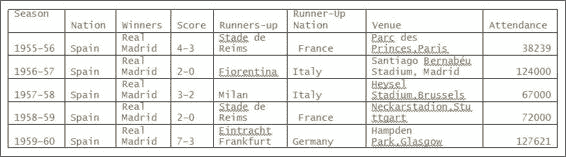
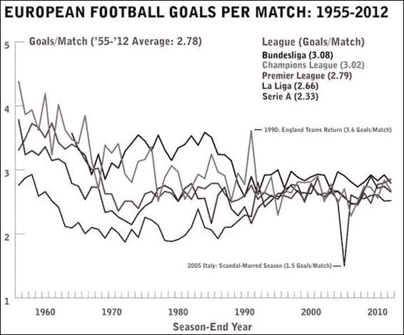

# 第 5 章 Pandas 的操作，第二部分-数据的分组，合并和整形

在本章中，我们解决了在数据结构中重新排列数据的问题。 我们研究了各种功能，这些功能使我们能够通过在实际数据集上利用它们来重新排列数据。 这样的功能包括`groupby`，`concat`，`aggregate`和`append`等。 我们将讨论的主题如下：

*   数据汇总/分组
*   合并和串联数据
*   重塑数据

# 数据分组

我们经常详细介绍希望基于分组变量进行汇总或合并的粒度数据。 在以下各节中，我们将说明实现此目的的一些方法。

## 分组操作

`groupby`操作可以被认为是包含以下三个步骤的过程的一部分：

*   分割数据集
*   分析数据
*   汇总或合并数据

`groupby`子句是对数据帧的操作。 系列是一维对象，因此对其执行`groupby`操作不是很有用。 但是，它可用于获取系列的不同行。 `groupby`操作的结果不是数据帧，而是数据帧对象的`dict`。 让我们从涉及世界上最受欢迎的运动-足球的数据集开始。

该数据集来自维基百科，其中包含自 1955 年成立以来欧洲俱乐部冠军杯决赛的数据。有关参考，您可以访问[这里](http://en.wikipedia.org/wiki/UEFA_Champions_League)。

使用以下命令将`.csv`文件转换为数据帧：
```py
In [27]: uefaDF=pd.read_csv('./euro_winners.csv')
In [28]: uefaDF.head()
Out[28]:

```



因此，输出显示了赛季，获胜和亚军俱乐部所属的国家，得分，场地和出勤人数。 假设我们要按获得的欧洲俱乐部冠军的数量来对各国进行排名。 我们可以使用`groupby`来做到这一点。 首先，我们将`groupby`应用于数据帧并查看结果的类型是什么：

```py
In [84]: nationsGrp =uefaDF.groupby('Nation');
 type(nationsGrp)
Out[84]: pandas.core.groupby.DataFrameGroupBy

```

因此，我们看到`nationsGrp`是`pandas.core.groupby.DataFrameGroupBy`类型。 我们在其中使用`groupby`的列称为键。 我们可以通过在生成的`DataFrameGroupBy`对象上使用`groups`属性来查看组的外观：

```py
In [97]: nationsGrp.groups
Out[97]: {'England': [12, 21, 22, 23, 24, 25, 26, 28, 43, 49, 52,
 56],
 'France': [37],
 'Germany': [18, 19, 20, 27, 41, 45, 57],
 'Italy': [7, 8, 9, 13, 29, 33, 34, 38, 40, 47, 51, 54],
 'Netherlands': [14, 15, 16, 17, 32, 39],
 'Portugal': [5, 6, 31, 48],
 'Romania': [30],
 'Scotland': [11],
 'Spain': [0, 1, 2, 3, 4, 10, 36, 42, 44, 46, 50, 53, 55],
 'Yugoslavia': [35]}

```

这基本上是一个字典，仅显示唯一的组和与每个组相对应的轴标签（在本例中为行号）。 组的数量通过使用`len()`函数获得：

```py
In [109]: len(nationsGrp.groups)
Out[109]: 10

```

现在，我们可以通过将`size()`函数应用于该组，然后应用`sort()`函数（按位置排序），以降序显示每个国家的获胜次数：

```py
In [99]: nationWins=nationsGrp.size() 
In [100] nationWins.sort(ascending=False)
 nationWins
Out[100]: Nation
 Spain          13
 Italy          12
 England        12
 Germany         7
 Netherlands     6
 Portugal        4
 Yugoslavia      1
 Scotland        1
 Romania         1
 France          1
 dtype: int64

```

`size()`函数返回一个序列，该序列以组名称作为索引，每个组的大小。 `size()`函数也是聚合功能。 我们将在本章后面检查聚合函数。

为了进一步按国家和俱乐部划分胜利，我们在应用`size()`和`sort()`之前应用多列`groupby`函数：

```py
In [106]: winnersGrp =uefaDF.groupby(['Nation','Winners'])
 clubWins=winnersGrp.size()
 clubWins.sort(ascending=False)
 clubWins
Out[106]: Nation       Winners 
 Spain        Real Madrid          9
 Italy        Milan                7
 Germany      Bayern Munich        5
 England      Liverpool            5
 Spain        Barcelona            4
 Netherlands  Ajax                 4
 England      Manchester United    3
 Italy        Internazionale       3
 Juventus             2
 Portugal     Porto                2
 Benfica              2
 England      Nottingham Forest    2
 Chelsea              1
 France       Marseille            1
 Yugoslavia   Red Star Belgrade    1
 Germany      Borussia Dortmund    1
 Hamburg              1
 Netherlands  Feyenoord            1
 PSV Eindhoven        1
 Romania      Steaua Bucuresti     1
 Scotland     Celtic               1
 England      Aston Villa          1
 dtype: int64

```

多列`groupby`通过将键列指定为列表来指定多个列用作键。 因此，我们可以看到，这场比赛中最成功的俱乐部是西班牙的皇家马德里。 现在，我们检查了更丰富的数据集，这将使我们能够说明`groupby`的更多功能。 此数据集还与足球相关，并提供了 2012-2013 赛季欧洲四大联赛的统计数据：

*   英超联赛或 EPL
*   西班牙总理队或西甲
*   意大利甲级联赛
*   德国超级联赛或德甲联赛

此信息的来源位于[这里](http://soccerstats.com)。

现在让我们像往常一样将目标统计数据读入数据帧中。 在这种情况下，我们使用月份在数据帧上创建一个行索引：

```py
In [68]: goalStatsDF=pd.read_csv('./goal_stats_euro_leagues_2012-13.csv')
 goalStatsDF=goalStatsDF.set_index('Month')

```

我们看一下数据集前端和后端的快照：

```py
In [115]: goalStatsDF.head(3)
Out[115]:         Stat          EPL  La Liga Serie A  Bundesliga
 Month
 08/01/2012  MatchesPlayed  20     20      10       10
 09/01/2012  MatchesPlayed  38     39      50       44
 10/01/2012  MatchesPlayed  31     31      39       27

In [116]: goalStatsDF.tail(3)
Out[116]:         Stat         EPL  La Liga Serie A  Bundesliga
 Month
 04/01/2013  GoalsScored  105   127     102      104
 05/01/2013  GoalsScored   96   109     102      92
 06/01/2013  GoalsScored NaN   80     NaN      NaN

```

在此数据帧中有两种度量-`MatchesPlayed`和`GoalsScored`-数据首先由`Stat`排序，然后由`Month`排序。 请注意，`tail()`输出的最后一行除`La Liga`以外的所有列均具有`NaN`值，但我们将在后面详细讨论。 我们可以使用`groupby`显示统计信息，但这将按年份分组。 这是如何完成的：

```py
In [117]: goalStatsGroupedByYear = goalStatsDF.groupby(
lambda Month: Month.split('/')[2])

```

然后，我们可以遍历生成的`groupby`对象并显示组。 在以下命令中，我们看到按年份分组的两组统计信息。 请注意，使用 lambda 函数从月份的第一天开始获取年份组。 有关 lambda 函数的更多信息，请转到[这里](http://bit.ly/1apJNwS)：

```py
In [118]: for name, group in goalStatsGroupedByYear:
 print name
 print group
 2012
 Stat  EPL  La Liga  Serie A  Bundesliga
 Month
 08/01/2012  MatchesPlayed   20       20       10          10
 09/01/2012  MatchesPlayed   38       39       50          44
 10/01/2012  MatchesPlayed   31       31       39          27
 11/01/2012  MatchesPlayed   50       41       42          46
 12/01/2012  MatchesPlayed   59       39       39          26
 08/01/2012    GoalsScored   57       60       21          23
 09/01/2012    GoalsScored  111      112      133         135
 10/01/2012    GoalsScored   95       88       97          77
 11/01/2012    GoalsScored  121      116      120         137
 12/01/2012    GoalsScored  183      109      125          72
 2013
 Stat  EPL  La Liga  Serie A  Bundesliga
 Month
 01/01/2013  MatchesPlayed   42       40       40          18
 02/01/2013  MatchesPlayed   30       40       40          36
 03/01/2013  MatchesPlayed   35       38       39          36
 04/01/2013  MatchesPlayed   42       42       41          36
 05/01/2013  MatchesPlayed   33       40       40          27
 06/02/2013  MatchesPlayed  NaN       10      NaN         NaN
 01/01/2013    GoalsScored  117      121      104          51
 02/01/2013    GoalsScored   87      110      100         101
 03/01/2013    GoalsScored   91      101       99         106
 04/01/2013    GoalsScored  105      127      102         104
 05/01/2013    GoalsScored   96      109      102          92
 06/01/2013    GoalsScored  NaN       80      NaN         NaN

```

如果我们希望按单个月份分组，则需要将`groupby`与级别参数一起应用，如下所示：

```py
In [77]: goalStatsGroupedByMonth = goalStatsDF.groupby(level=0)

In [81]: for name, group in goalStatsGroupedByMonth:
 print name
 print group
 print "\n"

01/01/2013
 Stat  EPL  La Liga  Serie A  Bundesliga
Month
01/01/2013  MatchesPlayed   42       40       40          18
01/01/2013    GoalsScored  117      121      104          51

02/01/2013
 Stat  EPL  La Liga  Serie A  Bundesliga
Month 
02/01/2013  MatchesPlayed   30       40       40          36
02/01/2013    GoalsScored   87      110      100         101

03/01/2013
 Stat  EPL  La Liga  Serie A  Bundesliga
Month
03/01/2013  MatchesPlayed   35       38       39          36
03/01/2013    GoalsScored   91      101       99         106

04/01/2013
 Stat  EPL  La Liga  Serie A  Bundesliga
Month
04/01/2013  MatchesPlayed   42       42       41          36
04/01/2013    GoalsScored  105      127      102         104

05/01/2013
 Stat  EPL  La Liga  Serie A  Bundesliga
Month
05/01/2013  MatchesPlayed   33       40       40          27
05/01/2013    GoalsScored   96      109      102          92

06/01/2013
 Stat  EPL  La Liga  Serie A  Bundesliga
Month
06/01/2013  GoalsScored  NaN       80      NaN         NaN

06/02/2013
 Stat  EPL  La Liga  Serie A  Bundesliga
Month
06/02/2013  MatchesPlayed  NaN       10      NaN         NaN

08/01/2012
 Stat  EPL  La Liga  Serie A  Bundesliga
Month
08/01/2012  MatchesPlayed   20       20       10          10
08/01/2012    GoalsScored   57       60       21          23

09/01/2012
 Stat  EPL  La Liga  Serie A  Bundesliga
Month
09/01/2012  MatchesPlayed   38       39       50          44
09/01/2012    GoalsScored  111      112      133         135

10/01/2012
 Stat  EPL  La Liga  Serie A  Bundesliga
Month
10/01/2012  MatchesPlayed   31       31       39          27
10/01/2012    GoalsScored   95       88       97          77

11/01/2012
 Stat  EPL  La Liga  Serie A  Bundesliga
Month
11/01/2012  MatchesPlayed   50       41       42          46
11/01/2012    GoalsScored  121      116      120         137

12/01/2012
 Stat  EPL  La Liga  Serie A  Bundesliga
Month
12/01/2012  MatchesPlayed   59       39       39          26
12/01/2012    GoalsScored  183      109      125          72

```

注意，由于在前面的命令中我们将索引分组，因此需要指定级别参数，而不是仅使用列名。 当我们按多个键分组时，得到的分组名称是一个元组，如后面的命令所示。 首先，我们重置索引以获得原始数据帧并定义一个多重索引以便能够按多个键进行分组。 如果不这样做，将导致`ValueError`：

```py
In [246]: goalStatsDF=goalStatsDF.reset_index()
 goalStatsDF=goalStatsDF.set_index(['Month','Stat'])

In [247]: monthStatGroup=goalStatsDF.groupby(level=['Month','Stat'])

In [248]: for name, group in monthStatGroup:
 print name
 print group

('01/01/2013', 'GoalsScored')
 EPL  La Liga  Serie A  Bundesliga
Month      Stat
01/01/2013 GoalsScored    117      121   104      51
('01/01/2013', 'MatchesPlayed')
 EPL  La Liga  Serie A  Bundesliga
Month      Stat
01/01/2013 MatchesPlayed   42       40    40       18
('02/01/2013', 'GoalsScored')
 EPL  La Liga  Serie A  Bundesliga
Month      Stat
02/01/2013 GoalsScored   87      110   100      101

```

### 将分组与多重索引一起使用

如果我们的数据帧具有多重索引，则可以使用`groupby`按层次结构的不同级别分组并计算一些有趣的统计数据。 这是使用由`Month`和`Stat`组成的多重索引的目标统计数据：

```py
In [134]:goalStatsDF2=pd.read_csv('./goal_stats_euro_leagues_2012-13.csv')
 goalStatsDF2=goalStatsDF2.set_index(['Month','Stat'])
In [141]: print goalStatsDF2.head(3)
 print goalStatsDF2.tail(3)
 EPL  La Liga  Serie A  Bundesliga
Month      Stat
08/01/2012 MatchesPlayed   20       20       10          10
09/01/2012 MatchesPlayed   38       39       50          44
10/01/2012 MatchesPlayed   31       31       39          27
 EPL  La Liga  Serie A  Bundesliga
Month      Stat
04/01/2013 GoalsScored  105      127      102         104
05/01/2013 GoalsScored   96      109      102          92
06/01/2013 GoalsScored  NaN       80      NaN         NaN

```

假设我们希望计算每个联赛的进球总数和整个赛季的总比赛数，我们可以这样做：

```py
In [137]: grouped2=goalStatsDF2.groupby(level='Stat')
In [139]: grouped2.sum()
Out[139]:         EPL   La Liga  Serie A  Bundesliga   Stat
 GoalsScored   1063  1133     1003  898
 MatchesPlayed 380    380      380  306

```

顺便说一句，通过直接使用`sum`并将级别作为参数传递，可以获得与前一个结果相同的结果：

```py
In [142]: goalStatsDF2.sum(level='Stat')
Out[142]:            EPL   La Liga  Serie A  Bundesliga   Stat
 GoalsScored    1063  1133     1003  898
 MatchesPlayed   380  380      380  306

```

现在，让我们获取一个关键统计数据，以确定每个联赛中本赛季的*兴奋程度* - 每场比赛的进球数比：

```py
In [174]: totalsDF=grouped2.sum()

In [175]: totalsDF.ix['GoalsScored']/totalsDF.ix['MatchesPlayed']
Out[175]: EPL           2.797368
 La Liga       2.981579
 Serie A       2.639474
 Bundesliga    2.934641
 dtype: float64

```

如上一条命令所示，它作为系列返回。 现在，我们可以显示每场比赛的进球数，进球数和比赛数，以概述联盟的兴奋程度，如下所示：

1.  获得每个游戏数据的目标作为数据帧。 请注意，由于`gpg`作为系列返回，因此我们必须对其进行转置：

    ```py
    In [234]: gpg=totalsDF.ix['GoalsScored']/totalsDF.ix['MatchesPlayed']
     goalsPerGameDF=pd.DataFrame(gpg).T

    In [235]: goalsPerGameDF
    Out[235]:     EPL   La Liga   Serie A   Bundesliga
     0   2.797368   2.981579  2.639474  2.934641

    ```

2.  重新索引`goalsPerGameDF`数据帧，以便将`0`索引替换为`GoalsPerGame`：

    ```py
    In [207]: goalsPerGameDF=goalsPerGameDF.rename(index={0:'GoalsPerGame'}) 

    In [208]: goalsPerGameDF
    Out[208]:          EPL      La Liga   Serie A   Bundesliga
     GoalsPerGame  2.797368  2.981579  2.639474  2.934641

    ```

3.  将`goalsPerGameDF`数据帧追加到原始数据帧：

    ```py
    In [211]: pd.options.display.float_format='{:.2f}'.format
     totalsDF.append(goalsPerGameDF)
    Out[211]:      EPL    La Liga     Serie A   Bundesliga
     GoalsScored    1063.00  1133.00  1003.00   898.00
     MatchesPlayed  380.00    380.00   380.00   306.00
     GoalsPerGame      2.80    2.98     2.64   2.93

    ```

下图显示了我们讨论过的 1955-2012 年欧洲联赛每场比赛的进球数。 可以在[这个链接](http://mattstil.es/images/europe-football.png)中找到其来源。



### 使用汇总方法

生成摘要统计信息的另一种方法是显式使用聚合方法：

```py
In [254]: pd.options.display.float_format=None
In [256]: grouped2.aggregate(np.sum)
Out[256]:       EPL  La Liga  Serie A  Bundesliga   Stat
 GoalsScored     1063  1133  1003   898
 MatchesPlayed  380    380   380   306

```

这将生成一个分组的数据帧对象，该对象在前面的命令中显示。 我们还将浮点格式重置为`None`，因此由于上一节中的格式设置，整数值数据将不会显示为浮点。

### 应用多种功能

对于分组的数据帧对象，我们可以指定要应用于每列的函数列表：

```py
In [274]: grouped2.agg([np.sum, np.mean,np.size])
Out[274]:      EPL          La Liga      Serie A        Bundesliga
 sum mean size  sum mean size  sum mean size sum mean size Stat
 GoalsScored  1063 106.3 11 1133 103.0 11 1003 100.3 11 898 89.8  11
 MatchesPlayed 380 38.0 11  380 34.6  11  380 38.0 11  306 30.6  11

```

请注意，上述显示 NA 值的输出已从聚合计算中排除。 `agg`是聚合的缩写形式。 因此，英超联赛，意甲联赛和德甲联赛的均值的计算是基于 10 个月而不是 11 个月的。这是因为在 6 月的最后一个月，这三个联赛中没有进行过比赛，这与西甲相反， 六月有比赛。

对于成组的系列赛，我们返回到`nationsGrp`示例，并计算锦标赛获胜者所在国家/地区的出勤率统计数据：

```py
In [297]: nationsGrp['Attendance'].agg({'Total':np.sum, 'Average':np.mean, 'Deviation':np.std})
Out[297]:       Deviation   Average     Total
 Nation
 England    17091.31    66534.25   798411
 France     NaN         64400      64400
 Germany    13783.83    67583.29   473083
 Italy       17443.52    65761.25   789135
 Netherlands 16048.58   67489.0    404934
 Portugal    15632.86   49635.5    198542
 Romania     NaN      70000       70000
 Scotland    NaN      45000        45000
 Spain        27457.53   73477.15   955203
 Yugoslavia  NaN      56000      56000

```

对于分组的系列，我们可以传递函数列表或`dict`。 在前面的情况下，指定了`dict`，并且将键值用作结果数据帧中列的名称。 请注意，在单个样本大小的组的情况下，标准差未定义，结果为`NaN`，例如，罗马尼亚。

### `transform()`方法

`groupby-transform`函数用于对`groupby`对象执行转换操作。 例如，我们可以使用`fillna`方法替换`groupby`对象中的`NaN`值。 使用转换后得到的对象具有与原始`groupby`对象相同的大小。 让我们考虑一个数据帧架，该数据帧架显示四个足球联赛中每个月的得分目标：

```py
In[344]: goalStatsDF3=pd.read_csv('./goal_stats_euro_leagues_2012-13.csv')
goalStatsDF3=goalStatsDF3.set_index(['Month'])
goalsScoredDF=goalStatsDF3.ix[goalStatsDF3['Stat']=='GoalsScored']

goalsScoredDF.iloc[:,1:]
Out[344]:        EPL  La Liga  Serie A  Bundesliga
Month
08/01/2012   57   60    21         23
09/01/2012   111   112    133        135
10/01/2012   95   88    97         77
11/01/2012   121   116    120        137
12/01/2012   183   109    125         72
01/01/2013   117   121    104         51
02/01/2013   87   110    100        101
03/01/2013   91   101    99        106
04/01/2013   105   127    102        104
05/01/2013   96   109    102         92
06/01/2013   NaN   80    NaN        NaN

```

我们可以看到，在 2013 年 6 月，参加比赛的唯一联赛是`La Liga`，得出了其他三个联赛的`NaN`值。 让我们按年份对数据进行分组：

```py
In [336]: goalsScoredPerYearGrp=goalsScoredDF.groupby(lambda Month: Month.split('/')[2])
 goalsScoredPerYearGrp.mean()
Out[336]:           EPL    La Liga   Serie A  Bundesliga
 2012       113.4   97        99.2     88.8
 2013       99.2    108       101.4    90.8

```

前面的函数利用 lambda 函数通过分割`/`字符上的`Month`变量并采用结果列表的第三个元素来获取年份。

如果我们计算各个联赛中每年举行比赛的月份数，那么我们有：

```py
In [331]: goalsScoredPerYearGrp.count()
Out[331]:         EPL  La Liga  Serie A  Bundesliga
 2012     5     5       5         5
 2013     5     6       5         5

```

通常不希望显示具有缺失值的数据，而解决这种情况的一种常用方法是将缺失值替换为组均值。 这可以使用`transform, groupby`函数来实现。 首先，我们必须使用 lambda 函数定义转换，然后使用`transform`方法应用此转换：

```py
In [338]: fill_fcn = lambda x: x.fillna(x.mean())
 trans = goalsScoredPerYearGrp.transform(fill_fcn)
 tGroupedStats = trans.groupby(lambda Month:   Month.split('/')[2])
 tGroupedStats.mean() 
Out[338]:           EPL     La Liga   Serie A  Bundesliga
 2012       113.4   97        99.2     88.8
 2013       99.2    108       101.4    90.8

```

从前面的结果中要注意的一件事是，将`NaN`值替换为原始组中的组均值，会使该组均值在转换后的数据中保持不变。

但是，当我们对转换后的组进行计数时，我们发现 EPL，意甲和德甲的比赛数从 5 变为 6：

```py
In [339]: tGroupedStats.count()
Out[339]:        EPL    La Liga   Serie A  Bundesliga
 2012     5     5         5          5
 2013     6     6         6          6

```

### 筛选

`filter`方法使我们能够对`groupby`对象应用过滤，该过滤会产生初始对象的子集。 在这里，我们说明了如何显示本赛季的月份，四个联赛中每个赛季都进球超过 100 个进球：

```py
In [391]:  goalsScoredDF.groupby(level='Month').filter(lambda x: 
 np.all([x[col] > 100 
 for col in goalsScoredDF.columns]))
Out[391]:            EPL  La Liga  Serie A  Bundesliga
 Month
 09/01/2012   111   112       133     135
 11/01/2012   121   116       120     137
 04/01/2013   105   127       102     104

```

请注意，使用`np.all`运算符可确保对所有列强制实施约束。

# 合并和加入

有多种功能可用于合并和连接 Pandas 的数据结构，其中包括以下功能：

*   `concat`
*   `append`

## `concat`函数

`concat`函数用于沿指定的轴连接多个 Pandas 的数据结构，并可能沿其他轴执行合并或相交操作。 以下命令说明`concat`函数：

```py
concat(objs, axis=0, , join='outer', join_axes=None, ignore_index=False,
 keys=None, levels=None, names=None, verify_integrity=False)

```

`concat`函数的元素概述如下：

*   `objs`函数：要串联的序列，数据帧或面板对象的列表或字典。
*   `axis`函数：应当执行级联的轴。 默认值为`0`。
*   `join`函数：处理其他轴上的索引时要执行的联接类型。 默认为`'outer'`函数。
*   `join_axes`函数：该函数用于为其余索引指定确切的索引，而不是进行外部/内部联接。
*   `keys`函数：这指定了用于构造多重索引的键的列表。

有关其余选项的说明，请参阅[文档](http://pandas.pydata.org/pandas-docs/stable/merging.html)。

这是使用前面章节中的股价示例来说明`concat`的工作原理：

```py
In [53]: stockDataDF=pd.read_csv('./tech_stockprices.csv').set_index(['Symbol']);stockDataDF
Out[53]:
 Closing price  EPS  Shares Outstanding(M) P/E Market Cap(B) Beta
Symbol
 AAPL   501.53    40.32  892.45         12.44   447.59    0.84
 AMZN   346.15    0.59   459.00         589.80  158.88    0.52
 FB     61.48     0.59   2450.00        104.93  150.92    NaN
 GOOG   1133.43   36.05  335.83         31.44   380.64    0.87
 TWTR   65.25    -0.30   555.20         NaN     36.23     NaN
 YHOO   34.90     1.27   1010.00        27.48   35.36     0.66

```

现在，我们获取各种数据片段：

```py
In [83]: A=stockDataDF.ix[:4, ['Closing price', 'EPS']]; A
Out[83]:  Closing price  EPS
 Symbol
 AAPL     501.53      40.32
 AMZN     346.15     0.59
 FB      61.48     0.59
 GOOG    1133.43    36.05

In [84]: B=stockDataDF.ix[2:-2, ['P/E']];B
Out[84]:         P/E
 Symbol
 FB     104.93
 GOOG   31.44

In [85]: C=stockDataDF.ix[1:5, ['Market Cap(B)']];C
Out[85]:         Market Cap(B)
 Symbol
 AMZN   158.88
 FB     150.92
 GOOG   380.64
 TWTR   36.23

```

在这里，我们通过指定外部联接来执行串联，该外部联接对所有三个数据帧进行联接并执行并集，并通过为此类列插入`NaN`来包括所有列均不具有值的条目：

```py
In [86]: pd.concat([A,B,C],axis=1) # outer join
Out[86]:  Closing price  EPS    P/E   Market Cap(B)
 AAPL   501.53     40.32  NaN   NaN
 AMZN   346.15     0.59   NaN   158.88
 FB     61.48      0.59   104.93 150.92
 GOOG   1133.43    36.05  31.44 380.64
 TWTR   NaN        NaN    NaN    36.23 

```

我们还可以指定一个内部联接来进行连接，但是通过丢弃缺少列的行来只包含包含最终数据帧中所有列值的行，也就是说，它需要交集：

```py
In [87]: pd.concat([A,B,C],axis=1, join='inner') # Inner join
Out[87]:        Closing price  EPS  P/E   Market Cap(B)
 Symbol
 FB      61.48    0.59 104.93  150.92
 GOOG    1133.43   36.05   31.44   380.64

```

第三种情况使我们能够使用原始数据帧中的特定索引进行联接：

```py
In [102]: pd.concat([A,B,C], axis=1, join_axes=[stockDataDF.index])
Out[102]:       Closing price  EPS    P/E   Market Cap(B)
 Symbol
 AAPL   501.53     40.32  NaN   NaN
 AMZN   346.15     0.59   NaN   158.88
 FB     61.48      0.59  104.93 150.92
 GOOG   1133.43    36.05  31.44 380.64
 TWTR   NaN        NaN    NaN    36.23
 YHOO   NaN        NaN    NaN    NaN

```

在这最后一种情况下，我们看到`YHOO`的行已包括在内，即使它不包含在任何串联的切片中。 但是，在这种情况下，所有列的值为`NaN`。 这是`concat`的另一种说明，但是这次是随机统计分布。 请注意，在没有轴参数的情况下，默认的串联轴为`0`：

```py
In[135]: np.random.seed(100)
 normDF=pd.DataFrame(np.random.randn(3,4));normDF
Out[135]:    0    1      2    3
 0  -1.749765  0.342680  1.153036  -0.252436
 1   0.981321  0.514219  0.221180  -1.070043
 2  -0.189496  0.255001 -0.458027   0.435163

In [136]: binomDF=pd.DataFrame(np.random.binomial(100,0.5,(3,4)));binomDF
Out[136]:    0  1  2  3
 0  57  50  57     50
 1  48  56  49     43
 2  40  47  49     55

In [137]: poissonDF=pd.DataFrame(np.random.poisson(100,(3,4)));poissonDF
Out[137]:  0  1  2  3
 0  93  96  96  89
 1  76  96  104  103
 2  96  93  107   84

In [138]: rand_distribs=[normDF,binomDF,poissonDF]
In [140]: rand_distribsDF=pd.concat(rand_distribs,keys=['Normal', 'Binomial', 'Poisson']);rand_distribsDF
Out[140]:         0        1       2          3
 Normal     0  -1.749765   0.342680  1.153036  -0.252436
 1   0.981321   0.514219  0.221180  -1.070043
 2  -0.189496   0.255001 -0.458027   0.435163
 Binomial 0   57.00       50.00     57.00      50.00
 1   48.00       56.00     49.00      43.00
 2   40.00       47.00     49.00      55.00
 Poisson  0   93.00       96.00     96.00      89.00
 1   76.00       96.00    104.00     103.00
 2   96.00       93.00    107.00      84.00

```

## 使用附加

`append`函数是`concat`的简单版本，沿着`axis=0`串联在一起。 这是其用法的说明，其中我们将`stockData`数据帧的前两行和前三列切成薄片：

```py
In [145]: stockDataA=stockDataDF.ix[:2,:3]
 stockDataA
Out[145]:  Closing price  EPS   Shares Outstanding(M)
 Symbol
 AAPL     501.53   40.32   892.45
 AMZN     346.15   0.59   459.00

```

其余的行：

```py
In [147]: stockDataB=stockDataDF[2:]
 stockDataB
Out[147]:
 Closing price EPS Shares Outstanding(M)  P/E  Market Cap(B) Beta
Symbol
FB   61.48         0.59  2450.00          104.93 150.92   NaN
GOOG   1133.43    36.05   335.83          31.44  380.64   0.87
TWTR     65.25    -0.30   555.20           NaN     36.23   NaN
YHOO     34.90  1.27  1010.00       27.48  35.36   0.66

```

现在，我们使用`append`合并来自前面命令的两个数据帧：

```py
In [161]:stockDataA.append(stockDataB)
Out[161]:
 Beta Closing price EPS MarketCap(B) P/E    Shares Outstanding(M)
 Symbol
 AMZN  NaN    346.15    0.59  NaN   NaN    459.00
 GOOG  NaN    1133.43   36.05  NaN   NaN    335.83
 FB    NaN    61.48     0.59  150.92 104.93 2450.00
 YHOO  27.48  34.90     1.27  35.36   0.66   1010.00
 TWTR  NaN    65.25    -0.30  36.23   NaN    555.20
 AAPL  12.44  501.53    40.32  0.84   447.59 892.45

```

为了保持类似于原始数据帧的列顺序，我们可以应用`reindex_axis`函数：

```py
In [151]: stockDataA.append(stockDataB).reindex_axis(stockDataDF.columns, axis=1)
Out[151]:
 Closing price EPS Shares Outstanding(M)  P/E Market Cap(B) Beta
 Symbol
 AAPL   501.53  40.32  892.45         NaN  NaN      NaN
 AMZN   346.15   0.59  459.00         NaN  NaN      NaN
 FB     61.48     0.59  2450.00       104.93  150.92      NaN
 GOOG   1133.43  36.05  335.83        31.44  380.64     0.87
 TWTR   65.25  -0.30  555.20         NaN   36.23      NaN
 YHOO   34.90     1.27  1010.00       27.48  35.36     0.66

```

请注意，对于前两行，后两列的值为`NaN`，因为第一个数据帧仅包含前三列。 `append`函数无法在某些地方工作，但是会返回一个新的数据帧，并将第二个数据帧附加到第一个数据帧上。

## 将一行附加到数据帧

我们可以通过将一系列或字典传递给`append`方法来将单个行附加到数据帧：
```py
In [152]: 
algos={'search':['DFS','BFS','Binary Search','Linear'],
 'sorting': ['Quicksort','Mergesort','Heapsort','Bubble Sort'],
 'machine learning':['RandomForest','K Nearest Neighbor','Logistic Regression','K-Means Clustering']}
algoDF=pd.DataFrame(algos);algoDF
Out[152]: machine learning    search      sorting
 0    RandomForest        DFS      Quicksort
 1    K Nearest Neighbor   BFS      Mergesort
 2    Logistic Regression  Binary Search Heapsort
 3    K-Means Clustering   Linear       Bubble Sort

In [154]: 
moreAlgos={'search': 'ShortestPath'  , 'sorting': 'Insertion Sort',
 'machine learning': 'Linear Regression'}
 algoDF.append(moreAlgos,ignore_index=True)
Out[154]: machine learning    search      sorting
 0    RandomForest        DFS      Quicksort
 1    K Nearest Neighbor    BFS      Mergesort
 2    Logistic Regression Binary Search Heapsort
 3    K-Means Clustering  Linear       Bubble Sort
 4    Linear Regression   ShortestPath  Insertion Sort

```

为了使它起作用，必须传递`ignore_index=True`参数，以便忽略`algoDF`中的`index [0,1,2,3]`。

## 类似于 SQL 的数据帧对象的合并/联接

`merge`函数用于获取两个数据帧对象的联接，类似于 SQL 数据库查询中使用的那些联接。数据帧对象类似于 SQL 表。 以下命令对此进行了说明：

```py
merge(left, right, how='inner', on=None, left_on=None,
 right_on=None, left_index=False, right_index=False, 
 sort=True, suffixes=('_x', '_y'), copy=True)

```

以下是`merge`函数的摘要：

*   `left`参数：这是第一个数据帧对象
*   `right`参数：这是第二个数据帧对象
*   `how`参数：这是联接的类型，可以是内部，外部，左侧或右侧。 默认值为内部。
*   `on`参数：这显示要作为连接键进行连接的列的名称。
*   `left_on`和`right_on`参数：这显示了要连接的左右`DataFrame`列名称。
*   `left_index`和`right_index`参数：这具有布尔值。 如果这是`True`，请使用左或右`DataFrame`索引/行标签进行联接。
*   `sort`参数：这是一个布尔值。 默认的`True`设置将按字典顺序进行排序。 将默认值设置为`False`可能会提高性能。
*   `suffixes`参数：应用于重叠列的字符串后缀的元组。 默认值为`'_x'`和`'_y'`。
*   `copy`参数：默认`True`值导致从传递的`DataFrame`对象中复制数据。

可以在[这个链接](http://pandas.pydata.org/pandas-docs/stable/merging.html)中找到上述信息的来源。

让我们开始通过将美国股票指数数据读取到`DataFrame`中来研究合并的使用：

```py
In [254]: USIndexDataDF=pd.read_csv('./us_index_data.csv')
 USIndexDataDF
Out[254]:    TradingDate  Nasdaq   S&P 500  Russell 2000  DJIA
 0   2014/01/30   4123.13  1794.19       1139.36  15848.61
 1   2014/01/31   4103.88  1782.59   1130.88  15698.85
 2   2014/02/03   3996.96  1741.89   1094.58  15372.80
 3   2014/02/04   4031.52  1755.20   1102.84  15445.24
 4   2014/02/05   4011.55  1751.64   1093.59  15440.23
 5   2014/02/06   4057.12  1773.43   1103.93  15628.53

```

可在[这个链接](http://finance.yahoo.com)中找到此信息的来源。

我们可以使用以下命令获取第 0 行和第 1 行以及`Nasdaq`和`S&P 500`列的数据`slice1`：

```py
In [255]: slice1=USIndexDataDF.ix[:1,:3]
 slice1
Out[255]:   TradingDate  Nasdaq         S&P 500
 0       2014/01/30  4123.13   1794.19
 1       2014/01/31  4103.88   1782.59

```

我们可以使用以下命令获取第 0 行和第 1 行以及`Russell 2000`和`DJIA`列的数据`slice2`：

```py
In [256]: slice2=USIndexDataDF.ix[:1,[0,3,4]]
 slice2
Out[256]:   TradingDate  Russell 2000    DJIA
 0       2014/01/30  1139.36     15848.61
 1       2014/01/31  1130.88     15698.85

```

我们可以使用以下命令获取第 1 行和第 2 行以及`Nasdaq`和`S&P 500`列的数据`slice3`：

```py
In [248]: slice3=USIndexDataDF.ix[[1,2],:3]
 slice3
Out[248]:   TradingDate      Nasdaq    S&P 500
 1  2014/01/31       4103.88   1782.59
 2  2014/02/03       3996.96   1741.89

```

现在，我们可以如下合并`slice1`和`slice2`：

```py
In [257]: pd.merge(slice1,slice2)
Out[257]:   TradingDate  Nasdaq	S&P 500  Russell 2000  DJIA
 0  2014/01/30   4123.13  1794.19   1139.36     15848.61
 1  2014/01/31     4103.88  1782.59   1130.88     15698.85

```

如您所见，这将导致`slice1`和`slice2`中的列的组合。 由于未指定`on`自变量，因此使用`slice1`和`slice2`中的列相交，即`TradingDate`作为连接列，而`slice1`和`slice2`中的其余列用于产生输出。

注意，在这种情况下，传递`how`的值对结果没有影响，因为`slice1`和`slice2`的`TradingDate`连接键值匹配。

现在，我们合并`slice3`和`slice2`，将`inner`指定为`how`参数的值：

```py
In [258]: pd.merge(slice3,slice2,how='inner')
Out[258]:   TradingDate  Nasdaq	     S&P 500  Russell 2000   DJIA
 0  2014/01/31   4103.88   1782.59    1130.88      15698.85

```

`slice3`参数的`TradingDate`值为`2014/01/31`和`2014/02/03`唯一值，`slice2`的`TradingDate`值为`2014/01/30`和`2014/01/31`唯一值。

`merge`函数使用这些值的交集，即`2014/01/31`。 这将导致单行结果。 在这里，我们将`outer`指定为`how`参数的值：

```py
In [269]: pd.merge(slice3,slice2,how='outer')
Out[269]:   TradingDate  Nasdaq     S&P 500  Russell 2000  DJIA
 0  2014/01/31  4103.88   1782.59   1130.88    15698.85
 1  2014/02/03  3996.96   1741.89   NaN          NaN
 2  2014/01/30      NaN   NaN   1139.36    15848.61

```

指定`outer`会使用两个数据帧中的所有键（联合），这将提供在先前输出中指定的三行。 由于并非所有列都存在于两个数据帧中，因此对于不属于交集的数据帧中的每一行，来自另一个数据帧的列均为`NaN`。

现在，我们指定`how='left'`，如以下命令所示：

```py
In [271]: pd.merge(slice3,slice2,how='left')
Out[271]:  TradingDate  Nasdaq   S&P 500  Russell 2000   DJIA
 0  2014/01/31   4103.88  1782.59  1130.88         15698.85
 1  2014/02/03  3996.96   1741.89  NaN         NaN

```

在这里，我们看到左侧数据帧`slice3`的键用于输出。 对于`slice3`中不可用的列，即`Russell 2000`和`DJIA, NaN`用于`TradingDate`为`2014/02/03`的行。 这等效于 SQL 左外部联接。

我们在以下命令中指定`how='right'`：

```py
In [270]: pd.merge(slice3,slice2,how='right')
Out[270]:   TradingDate  Nasdaq   S&P 500  Russell 2000  DJIA
 0  2014/01/31  4103.88   1782.59  1130.88  15698.85
 1  2014/01/30  NaN      NaN  1139.36  15848.61

```

这是所使用的右侧数据帧`slice2`中`how='left'`键的推论。 因此，结果为`TradingDate`为`2014/01/31`和`2014/01/30`的行。 对于不在`slice2`-`Nasdaq`和`S&P 500`-`NaN`中的列。

这等效于 SQL 右外部联接。 有关 SQL 连接如何工作的简单说明，请参考[这里](http://bit.ly/1yqR9vw)。

### 联接功能

`DataFrame.join`函数用于合并两个具有不同列且没有共同点的数据帧。 本质上，这是两个数据帧的纵向联接。 这是一个例子：

```py
In [274]: slice_NASD_SP=USIndexDataDF.ix[:3,:3]
 slice_NASD_SP
Out[274]:   TradingDate  Nasdaq  S&P 500
 0  2014/01/30    4123.13  1794.19
 1  2014/01/31    4103.88  1782.59
 2  2014/02/03    3996.96  1741.89
 3  2014/02/04    4031.52  1755.20

In [275]: slice_Russ_DJIA=USIndexDataDF.ix[:3,3:]
 slice_Russ_DJIA
Out[275]:   Russell 2000   DJIA
 0    1139.36       15848.61
 1    1130.88       15698.85
 2    1094.58       15372.80
 3    1102.84       15445.24

```

在这里，我们将`join`运算符称为：

```py
In [276]: slice_NASD_SP.join(slice_Russ_DJIA)
Out[276]: TradingDate  Nasdaq  S&P 500  Russell 2000   DJIA
 0  2014/01/30  4123.13  1794.19   1139.36    15848.61
 1  2014/01/31  4103.88  1782.59   1130.88    15698.85
 2  2014/02/03  3996.96  1741.89   1094.58    15372.80
 3  2014/02/04  4031.52  1755.20   1102.84    15445.24

```

在这种情况下，我们看到结果是来自两个数据帧的列的组合。 让我们看看当尝试将`join`两个具有共同列的数据帧一起使用时会发生什么：

```py
In [272]: slice1.join(slice2)
------------------------------------------------------------
Exception                  Traceback (most recent call last)
...

Exception: columns overlap: Index([u'TradingDate'], dtype=object)

```

由于列重叠而导致异常。 您可以在[官方文档页面](http://pandas.pydata.org/pandas-docs/stable/merging.html)中找到有关使用`merge`，`concat`和`join`操作的更多信息。

# 数据透视和重塑

本节介绍如何重塑数据。 有时，数据以*堆叠的*格式存储。 这是使用`PlantGrowth`数据集的堆叠数据的示例：

```py
In [344]: plantGrowthRawDF=pd.read_csv('./PlantGrowth.csv')
 plantGrowthRawDF
Out[344]:     observation   weight  group
 0    1             4.17    ctrl
 1    2             5.58    ctrl
 2    3             5.18    ctrl
 ...
 10   1             4.81    trt1
 11   2             4.17    trt1
 12   3             4.41    trt1
 ... 
 20   1             6.31    trt2
 21   2             5.12    trt2
 22   3             5.54    trt2

```

此数据包含比较在**对照**（`ctrl`）和两种不同处理条件（`trt1`，`trt2`）下获得的植物的干重产量的实验结果。 假设我们想按组值对该数据进行一些分析。 一种方法是在数据帧上使用逻辑过滤器：

```py
In [346]: plantGrowthRawDF[plantGrowthRawDF['group']=='ctrl']
Out[346]:   observation   weight  group
 0     1      4.17   ctrl
 1   2      5.58   ctrl
 2   3      5.18   ctrl
 3   4      6.11   ctrl
 ...

```

这可能是乏味的，所以我们改为希望对数据进行透视/堆叠并以更有利于分析的形式显示。 我们可以使用`DataFrame.pivot`函数执行以下操作：

```py
In [345]: plantGrowthRawDF.pivot(index='observation',columns='group',values='weight')
Out[345]: weight 
 group   ctrl   trt1   trt2
 observation
 1       4.17   4.81   6.31
 2       5.58   4.17   5.12
 3       5.18   4.41   5.54
 4       6.11   3.59   5.50
 5       4.50   5.87   5.37
 6       4.61   3.83   5.29
 7       5.17   6.03   4.92
 8       4.53   4.89   6.15
 9       5.33   4.32   5.80
 10      5.14   4.69   5.26

```

在这里，使用与组的不同值相对应的列创建数据帧架，或者用统计学的话来说，就是因子水平。 通过 Pandas `pivot_table`函数可以达到相同的结果，如下所示：

```py
In [427]: pd.pivot_table(plantGrowthRawDF,values='weight', 
 rows='observation', cols=['group'])

Out[427]:   group  ctrl   trt1   trt2
 observation
 1       4.17   4.81   6.31
 2       5.58   4.17   5.12
 3       5.18   4.41   5.54
 4       6.11   3.59   5.50
 5       4.50   5.87   5.37
 6       4.61   3.83   5.29
 7       5.17   6.03   4.92
 8       4.53   4.89   6.15
 9       5.33   4.32   5.80

10      5.14   4.69   5.26

```

`pivot`和`pivot_table`函数之间的主要区别在于`pivot_table`允许用户指定一个聚合功能，可以在该功能上聚合值。 因此，例如，如果我们希望获得 10 个观测值中每个组的平均值，我们将执行以下操作，这将得出一个系列：

```py
In [430]: pd.pivot_table(plantGrowthRawDF,values='weight',cols=['group'],aggfunc=np.mean)
Out[430]: group
 ctrl     5.032
 trt1     4.661
 trt2     5.526
 Name: weight, dtype: float64

```

`pivot_table`的完整提要可从[这里](http://bit.ly/1QomJ5A)获得。 您可以在[这里](http://bit.ly/1BYGsNn)和[这里](https://www.youtube.com/watch?v=mCLuwCql5t4)找到有关其用法的更多信息和示例。

## 堆放

除支点功能外，`stack`和`unstack`函数在序列和数据帧上也可用，它们可用于包含多重索引的对象。

### `stack()`函数

首先，我们将组和观察列的值分别设置为行索引的组成部分，从而得到多重索引：

```py
In [349]: plantGrowthRawDF.set_index(['group','observation'])
Out[349]:                    weight
 group  observation
 ctrl     1         4.17
 2         5.58
 3         5.18
 ...
 trt1     1         4.81
 2         4.17
 3         4.41
 ...
 trt2     1        6.31
 2        5.12
 3        5.54
 ...

```

在这里，我们看到行索引由组上的多重索引和以 weight 列作为数据值的观察组成。 现在，让我们看看如果将`unstack`应用于`group`级别会发生什么：

```py
In [351]: plantGrowthStackedDF.unstack(level='group')
Out[351]:                weight
 group   ctrl trt1   trt2
 observation
 1     4.17 4.81   6.31
 2     5.58 4.17   5.12
 3     5.18 4.41   5.54
 4     6.11 3.59   5.50
 5     4.50 5.87   5.37
 6     4.61 3.83   5.29
 7     5.17 6.03   4.92
 8     4.53 4.89   6.15
 9    5.33   4.32  5.80
 10    5.14   4.69  5.26

```

以下调用等效于前面的调用：`plantGrowthStackedDF.unstack(level=0)`。

在这里，我们可以看到数据帧已旋转，并且该组现在已从行索引（标题）更改为列索引（标题），从而使数据帧看起来更加紧凑。 为了更详细地了解正在发生的事情，我们首先将多重索引作为行索引放在组的观察上：

```py
In [356]: plantGrowthStackedDF.index
Out[356]: MultiIndex
 [(u'ctrl', 1), (u'ctrl', 2), (u'ctrl', 3), (u'ctrl', 4), (u'ctrl', 5), 
 (u'ctrl', 6), (u'ctrl', 7), (u'ctrl', 8), (u'ctrl', 9), (u'ctrl', 10), 
 (u'trt1', 1), (u'trt1', 2), (u'trt1', 3), (u'trt1', 4), (u'trt1', 5), 
 (u'trt1', 6), (u'trt1', 7), (u'trt1', 8), (u'trt1', 9), (u'trt1', 10), 
 (u'trt2', 1), (u'trt2', 2), (u'trt2', 3), (u'trt2', 4), (u'trt2', 5), 
 (u'trt2', 6), (u'trt2', 7), (u'trt2', 8), (u'trt2', 9), (u'trt2', 10)]

In [355]: plantGrowthStackedDF.columns
Out[355]: Index([u'weight'], dtype=object)

```

取消堆叠操作从行索引中删除组，将其更改为单级索引：

```py
In [357]: plantGrowthStackedDF.unstack(level='group').index
Out[357]: Int64Index([1, 2, 3, 4, 5, 6, 7, 8, 9, 10], dtype=int64)

```

现在，多重索引在列上：

```py
In [352]: plantGrowthStackedDF.unstack(level='group').columns
Out[352]: MultiIndex
 [(u'weight', u'ctrl'), (u'weight', u'trt1'), (u'weight', u'trt2')]

```

让我们看看调用反向操作`stack`时会发生什么：

```py
In [366]: plantGrowthStackedDF.unstack(level=0).stack('group')
Out[366]:              weight
 observation  group
 1  ctrl   4.17
 trt1   4.81
 trt2   6.31
 2  ctrl   5.58
 trt1   4.17
 trt2   5.12
 3  ctrl   5.18
 trt1   4.41
 trt2   5.54
 4  ctrl   6.11
 trt1   3.59
 trt2   5.50
 ...
 10  ctrl   5.14
 trt1   4.69
 trt2   5.26

```

在这里，我们看到我们得到的不是原始的堆栈数据帧，因为堆栈级别-即`'group'—`成为列多重索引中新的最低级别。 在原始堆叠的数据帧中，`group`是最高级别。 这是对`stack`和`unstack`的完全可逆的调用序列。 默认情况下，`unstack()`函数会取消堆叠最后一个级别，即`observation`，如下所示：

```py
In [370]: plantGrowthStackedDF.unstack()
Out[370]:                                weight
 observation     1   2   3    4   5    6    7    8     9    10
 group
 ctrl        4.17 5.58 5.18 6.11 4.50 4.61 5.17 4.53 5.33 5.14
 trt1        4.81 4.17 4.41 3.59 5.87  3.83 6.03 4.89 4.32 4.69
 trt2        6.31 5.12 5.54 5.50 5.37  5.29 4.92 6.15 5.80 5.26

```

默认情况下，`stack()`函数将堆栈级别设置为结果行中的多重索引中的最低级别：

```py
In [369]: plantGrowthStackedDF.unstack().stack()
Out[369]:              weight
 group  observation
 ctrl    1   4.17
 2   5.58
 3   5.18
 ...
 10  5.14
 trt1    1   4.81
 2   4.17
 3   4.41
 ...
 10  4.69
 trt2    1   6.31
 2   5.12
 3   5.54
 ...
 10  5.26

```

## 重塑数据帧的其他方法

还有许多其他与重塑数据帧有关的方法。 我们将在这里讨论。

### 使用融化功能

`melt`函数使我们能够通过将数据帧的某些列指定为 ID 列来转换它。 这样可以确保在进行任何重要的转换后，它们始终保持为列。 其余的非 ID 列可被视为变量，并可进行透视设置并成为名称-值两列方案的一部分。 ID 列唯一标识数据帧中的一行。

可以通过提供`var_name`和`value_name`参数来自定义那些非 ID 列的名称。 举个例子，也许可以最好地说明`melt`的使用：

```py
In [385]: from pandas.core.reshape import melt

In [401]: USIndexDataDF[:2]
Out[401]:    TradingDate   Nasdaq    S&P 500   Russell 2000  DJIA
 0   2014/01/30    4123.13   1794.19   1139.36       15848.61
 1   2014/01/31    4103.88   1782.59   1130.88       15698.85

In [402]: melt(USIndexDataDF[:2], id_vars=['TradingDate'], var_name='Index Name', value_name='Index Value')
Out[402]:
 TradingDate   Index Name    Index value
 0  2014/01/30    Nasdaq        4123.13
 1  2014/01/31    Nasdaq        4103.88
 2  2014/01/30    S&P 500       1794.19
 3  2014/01/31    S&P 500       1782.59
 4  2014/01/30    Russell 2000  1139.36
 5  2014/01/31    Russell 2000  1130.88
 6  2014/01/30    DJIA          15848.61
 7  2014/01/31    DJIA          15698.85

```

#### `pandas.get_dummies()`函数

此函数用于将分类变量转换为指标数据帧，该指标本质上是分类变量可能值的真值表。 下面的命令是一个示例：

```py
In [408]: melted=melt(USIndexDataDF[:2], id_vars=['TradingDate'], var_name='Index Name', value_name='Index Value')
 melted
Out[408]:      TradingDate   Index Name    Index Value
 0     2014/01/30    Nasdaq        4123.13
 1     2014/01/31    Nasdaq        4103.88
 2     2014/01/30    S&P 500       1794.19
 3     2014/01/31    S&P 500       1782.59
 4     2014/01/30    Russell 2000  1139.36
5     2014/01/31   Russell 2000   1130.88
6     2014/01/30   DJIA        15848.61
7     2014/01/31   DJIA        15698.85

In [413]: pd.get_dummies(melted['Index Name'])
Out[413]:    DJIA  Nasdaq  Russell 2000  S&P 500
 0   0     1        0            0
 1   0     1        0            0
 2   0     0        0            1
 3   0     0        0            1
 4   0     0        1            0
 5   0     0        1            0
 6   1     0        0            0
 7   1     0        0            0

```

可以在[这个链接](http://vincentarelbundock.github.io/Rdatasets/csv/datasets/PlantGrowth.csv)中找到上述数据的来源。

# 摘要

在本章中，我们看到了各种方法来重新排列 Pandas 中的数据。 我们可以使用`pandas.groupby`运算符和`groupby`对象上的关联方法对数据进行分组。 我们可以使用`concat`，`append`，`merge`和`join`函数合并和合并`Series`和`DataFrame`对象。 最后，我们可以使用`stack`/`unstack`和`pivot`/`pivot_table`函数重塑和创建`pivot`表。 这对于显示数据以进行可视化或准备数据以输入其他程序或算法非常有用。

在下一章中，我们将研究一些数据分析中有用的任务，可以应用 Pandas，例如处理时间序列数据以及如何处理数据中的缺失值。

要获得有关这些主题的更多信息，请访问[官方文档](http://pandas.pydata.org/pandas-docs/stable/)。