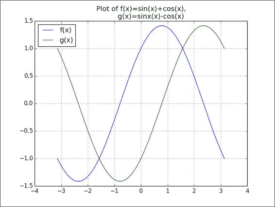
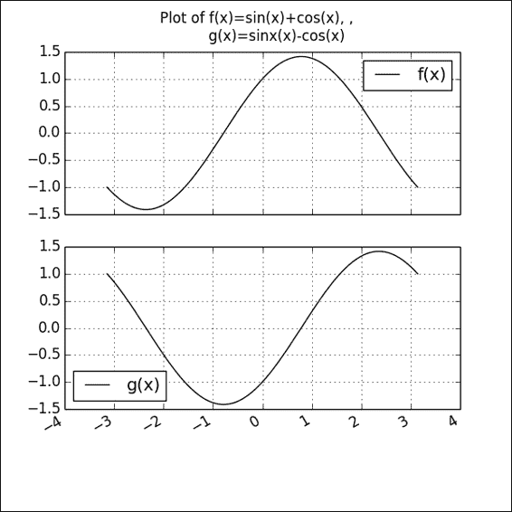

# 第 6 章。使用 Matplotlib 缺少数据，时间序列和绘图

在本章中，我们将介绍一些必要的主题，这些主题对于培养使用 Pandas 的专业知识必不可少。 这些主题的知识对于准备数据作为处理数据以进行分析，预测或可视化的程序或代码的输入非常有用。 我们将讨论的主题如下：

*   处理丢失的数据
*   处理时间序列和日期
*   使用`matplotlib`绘制

到本章结束时，用户应该精通这些关键领域。

# 处理丢失的数据

数据丢失是指由于某种原因在我们的数据集中显示为 NULL 或 N / A 的数据点； 例如，我们可能有一个时间序列，横跨一个月的所有日历日，显示每天股票的收盘价，而非营业日的收盘价则显示为缺失。 一个损坏的数据示例是财务数据集，该数据集以错误的格式显示了交易的活动日期。 例如，由于数据提供者发生错误，因此使用 YYYY-MM-DD 而不是 YYYYMMDD。

对于 Pandas，缺失值通常由 **NaN** 值表示。

除了本机出现在源数据集中之外，还可以通过诸如重新索引或在时间序列的情况下更改频率之类的操作将缺失值添加到数据集中：

```py
In [84]: import numpy as np
 import pandas as pd
 import matplotlib.pyplot as plt
 %matplotlib inline
In [85]: date_stngs = ['2014-05-01','2014-05-02',
 '2014-05-05','2014-05-06','2014-05-07']
 tradeDates = pd.to_datetime(pd.Series(date_stngs))
In [86]: closingPrices=[531.35,527.93,527.81,515.14,509.96]
In [87]: googClosingPrices=pd.DataFrame(data=closingPrices,
 columns=['closingPrice'],
 index=tradeDates)
 googClosingPrices
Out[87]:                closingPrice
 tradeDates 
 2014-05-01       531.35
 2014-05-02       527.93
 2014-05-05       527.81
 2014-05-06       515.14
 2014-05-07       509.96
 5 rows 1 columns

```

可以在 [http://yhoo.it/1dmJqW6](http://yhoo.it/1dmJqW6) 找到上述数据的来源。

Pandas 还提供了一个 API，可以从各种数据提供商（例如 Yahoo）读取股票数据：

```py
In [29]: import pandas.io.data as web
In [32]: import datetime
 googPrices = web.get_data_yahoo("GOOG",
 start=datetime.datetime(2014, 5, 1),
 end=datetime.datetime(2014, 5, 7))
In [38]: googFinalPrices=pd.DataFrame(googPrices['Close'],
 index=tradeDates)
In [39]: googFinalPrices
Out[39]:           Close
 2014-05-01  531.34998
 2014-05-02  527.92999
 2014-05-05  527.81000
 2014-05-06  515.14001
 2014-05-07  509.95999

```

有关更多详细信息，请参见 [http://pandas.pydata.org/pandas-docs/stable/remote_data.html](http://pandas.pydata.org/pandas-docs/stable/remote_data.html) 。

现在，我们有了一个时间序列，描述了 Google 股票自 2014 年 5 月 1 日至 2014 年 5 月 7 日的收盘价，由于交易只在工作日发生，因此日期范围存在缺口。 如果要更改日期范围以使其显示日历日（即周末），则可以将时间序列索引的频率从工作日更改为日历日，如下所示：

```py
In [90]: googClosingPricesCDays=googClosingPrices.asfreq('D')
 googClosingPricesCDays
Out[90]:    closingPrice
 2014-05-01  531.35
 2014-05-02  527.93
 2014-05-03  NaN
 2014-05-04  NaN
 2014-05-05  527.81
 2014-05-06  515.14
 2014-05-07  509.96
 7 rows 1 columns

```

请注意，我们现在为 2014 年 5 月 3 日和 2014 年 5 月 4 日的周末日期引入了`closingPrice`的`NaN`值。

我们可以通过使用`isnull`和`notnull`函数来检查缺少的值，如下所示：

```py
In [17]: googClosingPricesCDays.isnull()
Out[17]: closingPrice
 2014-05-01   False
 2014-05-02   False
 2014-05-03   True
 2014-05-04   True
 2014-05-05   False
 2014-05-06   False
 2014-05-07   False
 7 rows 1 columns

In [18]: googClosingPricesCDays.notnull()
Out[18]: closingPrice
 2014-05-01   True
 2014-05-02   True
 2014-05-03   False
 2014-05-04   False
 2014-05-05   True
 2014-05-06   True
 2014-05-07   True
 7 rows 1 columns

```

在每种情况下都会返回一个布尔型 DataFrame。 在`datetime`和 Pandas 时间戳记中，缺失值由`NaT`值表示。 对于基于时间的类型，这相当于 Pandas 中的`NaN`。

```py
In [27]: tDates=tradeDates.copy()
 tDates[1]=np.NaN
 tDates[4]=np.NaN

In [28]: tDates
Out[28]: 0   2014-05-01
 1          NaT
 2   2014-05-05
 3   2014-05-06
 4          NaT
 Name: tradeDates, dtype: datetime64[ns]

In [4]: FBVolume=[82.34,54.11,45.99,55.86,78.5]
 TWTRVolume=[15.74,12.71,10.39,134.62,68.84]

In [5]: socialTradingVolume=pd.concat([pd.Series(FBVolume),
 pd.Series(TWTRVolume),
 tradeDates], axis=1,
 keys=['FB','TWTR','TradeDate'])
 socialTradingVolume
Out[5]:      FB       TWTR    TradeDate
 0   82.34    15.74   2014-05-01
 1   54.11    12.71   2014-05-02
 2   45.99    10.39   2014-05-05
 3   55.86    134.62  2014-05-06
 4   78.50    68.84   2014-05-07
 5 rows × 3 columns

In [6]: socialTradingVolTS=socialTradingVolume.set_index('TradeDate')
socialTradingVolTS
Out[6]:
 TradeDate    FB      TWTR
 2014-05-01   82.34   15.74
 2014-05-02   54.11   12.71
 2014-05-05   45.99   10.39
 2014-05-06   55.86   134.62
 2014-05-07   78.50   68.84
 5 rows × 2 columns

In [7]: socialTradingVolTSCal=socialTradingVolTS.asfreq('D')
 socialTradingVolTSCal
Out[7]:
 FB      TWTR
 2014-05-01  82.34   15.74
 2014-05-02  54.11   12.71
 2014-05-03  NaN     NaN
 2014-05-04  NaN     NaN
 2014-05-05  45.99   10.39
 2014-05-06  55.86   134.62
 2014-05-07  78.50   68.84
 7 rows × 2 columns

```

我们可以对包含缺失值的数据执行算术运算。 例如，我们可以计算 Facebook 和 Twitter 的两只股票的总交易量（百万股），如下所示：

```py
In [8]: socialTradingVolTSCal['FB']+socialTradingVolTSCal['TWTR']
Out[8]: 2014-05-01     98.08
 2014-05-02     66.82
 2014-05-03       NaN
 2014-05-04       NaN
 2014-05-05     56.38
 2014-05-06    190.48
 2014-05-07    147.34
 Freq: D, dtype: float64

```

默认情况下，对包含缺失值的对象执行的任何操作都会在该位置返回缺失值，如以下命令所示：

```py
In [12]: pd.Series([1.0,np.NaN,5.9,6])+pd.Series([3,5,2,5.6])
Out[12]: 0     4.0
 1     NaN
 2     7.9
 3    11.6
 dtype: float64
In [13]: pd.Series([1.0,25.0,5.5,6])/pd.Series([3,np.NaN,2,5.6])
Out[13]: 0    0.333333
 1         NaN
 2    2.750000
 3    1.071429
 dtype: float64

```

但是，NumPy 处理聚合计算的方式与 Pandas 的处理方式有所不同。

在 Pandas 中，默认值是将缺失值视为`0`并进行汇总计算，而对于 NumPy，如果缺少任何值，则返回`NaN`。 这是一个例子：

```py
In [15]: np.mean([1.0,np.NaN,5.9,6])
Out[15]: nan

In [16]: np.sum([1.0,np.NaN,5.9,6])
Out[16]: nan

```

但是，如果此数据在 pandas 系列中，则将获得以下输出：

```py
In [17]: pd.Series([1.0,np.NaN,5.9,6]).sum()
Out[17]: 12.9
In [18]: pd.Series([1.0,np.NaN,5.9,6]).mean()
Out[18]: 4.2999999999999998

```

重要的是要意识到 Pandas 和 NumPy 在行为上的差异。 但是，如果我们希望 NumPy 的行为与 Pandas 相同，则可以使用`np.nanmean`和`np.nansum`函数，如下所示：

```py
In [41]: np.nanmean([1.0,np.NaN,5.9,6])
Out[41]: 4.2999999999999998

In [43]: np.nansum([1.0,np.NaN,5.9,6])
Out[43]: 12.9

```

有关 NumPy np.nan *聚合函数的更多信息，请参考 [http://docs.scipy.org/doc/numpy-dev/reference/routines.statistics.html](http://docs.scipy.org/doc/numpy-dev/reference/routines.statistics.html) 。

## 处理缺失值

有多种处理缺失值的方法，如下所示：

1.  By using the `fillna()` function to fill in the NA values. This is an example:

    ```py
    In [19]: socialTradingVolTSCal
    Out[19]:    FB   TWTR
     2014-05-01  82.34   15.74
     2014-05-02  54.11   12.71
     2014-05-03  NaN     NaN
     2014-05-04  NaN     NaN
     2014-05-05  45.99   10.39
     2014-05-06  55.86   134.62
     2014-05-07  78.50   68.84
     7 rows × 2 columns

    In [20]: socialTradingVolTSCal.fillna(100)
    Out[20]:            FB      TWTR
     2014-05-01   82.34   15.74
     2014-05-02   54.11   12.71
     2014-05-03   100.00  100.00
     2014-05-04   100.00  100.00
     2014-05-05   45.99   10.39
     2014-05-06   55.86   134.62
     2014-05-07   78.50   68.84
     7 rows × 2 columns

    ```

    我们还可以使用`ffill`或`bfill`参数填充前向或后向值：

    ```py
    In [23]: socialTradingVolTSCal.fillna(method='ffill')
    Out[23]:            FB      TWTR
     2014-05-01   82.34   15.74
     2014-05-02   54.11   12.71
     2014-05-03   54.11   12.71
     2014-05-04   54.11   12.71
     2014-05-05   45.99   10.39
     2014-05-06   55.86   134.62
     2014-05-07   78.50   68.84
     7 rows × 2 columns

    In [24]: socialTradingVolTSCal.fillna(method='bfill')
    Out[24]:            FB      TWTR
     2014-05-01   82.34   15.74
     2014-05-02   54.11   12.71
     2014-05-03   45.99   10.39
     2014-05-04   45.99   10.39
     2014-05-05   45.99   10.39
     2014-05-06   55.86   134.62
     2014-05-07   78.50   68.84
     7 rows × 2 columns

    ```

    `pad`方法是`ffill`的替代名称。 有关更多详细信息，您可以转到 [http://bit.ly/1f4jvDq](http://bit.ly/1f4jvDq) 。

2.  通过使用`dropna()`函数删除/删除缺少值的行和列。 以下是一个示例：

    ```py
    In [21]: socialTradingVolTSCal.dropna()
    Out[21]:      FB      TWTR
     2014-05-01  82.34   15.74
     2014-05-02  54.11   12.71
     2014-05-05  45.99   10.39
     2014-05-06  55.86   134.62
     2014-05-07  78.50   68.84
     5 rows × 2 columns

    ```

3.  We can also interpolate and fill in the missing values by using the `interpolate()` function, as explained in the following commands:

    ```py
    In [27]: pd.set_option('display.precision',4)
     socialTradingVolTSCal.interpolate()
    Out[27]:       FB       TWTR
     2014-05-01   82.340   15.740
     2014-05-02   54.110   12.710
     2014-05-03   51.403   11.937
     2014-05-04   48.697   11.163
     2014-05-05   45.990   10.390
     2014-05-06   55.860   134.620
     2014-05-07   78.500   68.840
     7 rows × 2 columns

    ```

    `interpolate()`函数还采用一个参数-表示该方法的*方法*。 这些方法包括线性，二次，三次样条等等。 您可以从 [http://pandas.pydata.org/pandas-docs/stable/missing_data.html#interpolation](http://pandas.pydata.org/pandas-docs/stable/missing_data.html#interpolation) 的官方文档中获取更多信息。

# 处理时间序列

在本节中，我们向您展示如何处理时间序列数据。 我们将首先展示如何使用从`csv`文件中读取的数据创建时间序列数据。

## 读取时间序列数据

在这里，我们演示了读取时间序列数据的各种方法：

```py
In [7]: ibmData=pd.read_csv('ibm-common-stock-closing-prices-1959_1960.csv')
 ibmData.head()
Out[7]:    TradeDate     closingPrice
 0   1959-06-29   445
 1   1959-06-30   448
 2   1959-07-01   450
 3   1959-07-02   447
 4   1959-07-06   451
 5 rows 2 columns

```

可以在 [http://datamarket.com](http://datamarket.com) 上找到此信息的来源。

我们希望`TradeDate`列是一系列`datetime`值，以便我们可以为其编制索引并创建时间序列。 让我们首先检查`TradeDate`系列中值的类型：

```py
In [16]: type(ibmData['TradeDate'])
Out[16]: pandas.core.series.Series
In [12]: type(ibmData['TradeDate'][0])
Out[12]: str

```

接下来，我们将其转换为`Timestamp`类型：

```py
In [17]: ibmData['TradeDate']=pd.to_datetime(ibmData['TradeDate'])
 type(ibmData['TradeDate'][0])
Out[17]: pandas.tslib.Timestamp

```

现在，我们可以将`TradeDate`列用作索引：

```py
In [113]: #Convert DataFrame to TimeSeries
 #Resampling creates NaN rows for weekend dates, hence use dropna
 ibmTS=ibmData.set_index('TradeDate').resample('D')['closingPrice'].dropna()
 ibmTS
Out[113]: TradeDate
 1959-06-29    445
 1959-06-30    448
 1959-07-01    450
 1959-07-02    447
 1959-07-06    451
 ...
 Name: closingPrice, Length: 255

```

### DateOffset 和 TimeDelta 对象

`DateOffset`对象表示时间的变化或偏移。 `DateOffset`对象的关键特征如下：

*   可以将其添加到`datetime`对象或从中减去，以获得转换后的日期
*   可以乘以一个整数（正数或负数），以便可以多次应用该增量
*   它具有前滚和后滚方法，可将日期向前移动到下一个偏移日期或向后移动到上一个偏移日期

我们说明了如何使用 DateOffset 对象，如下所示：

```py
In [371]: xmasDay=pd.datetime(2014,12,25)
 xmasDay
Out[371]: datetime.datetime(2014, 12, 25, 0, 0)

In [373]: boxingDay=xmasDay+pd.DateOffset(days=1)
 boxingDay
Out[373]: Timestamp('2014-12-26 00:00:00', tz=None)

In [390}: today=pd.datetime.now()
 today
Out[390]: datetime.datetime(2014, 5, 31, 13, 7, 36, 440060)

```

注意，`datetime.datetime`与`pd.Timestamp`不同。 前者是 Python 类，效率低下，而后者基于`numpy.datetime64`数据类型。 `pd.DateOffset`对象与`pd.Timestamp`一起使用，并将其添加到`datetime.datetime`函数中可将该对象转换为`pd.Timestamp`对象。

下面说明了从今天开始一周的命令：

```py
In [392]: today+pd.DateOffset(weeks=1)
Out[392]: Timestamp('2014-06-07 13:07:36.440060', tz=None)

```

下图说明了从现在起五年内的命令：

```py
In [394]: today+2*pd.DateOffset(years=2, months=6)
Out[394]: Timestamp('2019-05-30 13:07:36.440060', tz=None)

```

这是使用`rollforward`功能的示例。 `QuarterBegin`是一个`DateOffset`对象，用于将给定的`datetime`对象增加到下一个日历季度的开始：

```py
In [18]: lastDay=pd.datetime(2013,12,31)
In [24]: from pandas.tseries.offsets import QuarterBegin
 dtoffset=QuarterBegin()
 lastDay+dtoffset
Out[24]: Timestamp('2014-03-01 00:00:00', tz=None)

In [25]: dtoffset.rollforward(lastDay)
Out[25]: Timestamp('2014-03-01 00:00:00', tz=None)

```

因此，我们可以看到，2013 年 12 月 31 日之后的下一个季度从 2014 年 3 月 1 日开始。`Timedeltas`与`DateOffsets`相似，但可用于`datetime.datetime`对象。 以下命令解释了它们的使用：

```py
In [40]: weekDelta=datetime.timedelta(weeks=1)
 weekDelta
Out[40]: datetime.timedelta(7)

In [39]: today=pd.datetime.now()
 today
Out[39]: datetime.datetime (2014, 6, 2, 3, 56, 0, 600309)

In [41]: today+weekDelta
Out[41]: datetime.datetime (2014, 6, 9, 3, 56,0, 600309)

```

## 与时间序列相关的实例方法

在本节中，我们探索用于时间序列对象的各种方法，例如移位，频率转换和重采样。

### 转移/滞后

有时，我们可能希望将时间序列中的值在时间上向后或向前移动。 一种可能的情况是，数据集包含公司中去年新雇员的开始日期列表，并且公司的人力资源计划希望将这些日期提前一年，以便可以激活雇员的福利。 我们可以通过使用`shift()`函数来做到这一点，如下所示：

```py
In [117]: ibmTS.shift(3)
Out[117]: TradeDate
 1959-06-29    NaN
 1959-06-30    NaN
 1959-07-01    NaN
 1959-07-02    445
 1959-07-06    448
 1959-07-07    450
 1959-07-08    447
 ...

```

这将转换所有日历日。 但是，如果我们只希望转移工作日，则必须使用以下命令：

```py
In [119]: ibmTS.shift(3, freq=pd.datetools.bday)
Out[119]: TradeDate
 1959-07-02    445
 1959-07-03    448
 1959-07-06    450
 1959-07-07    447
 1959-07-09    451

```

在前面的代码片段中，我们指定了`freq`参数进行平移； 这告诉功能仅更改工作日。 `shift`函数具有`freq`参数，其值可以是`DateOffset`类，类似于`timedelta`的对象或偏移别名。 因此，使用`ibmTS.shift(3, freq='B')`也将产生相同的结果。

### 变频

我们可以使用`asfreq`功能来更改频率，如下所述：

```py
In [131]: # Frequency conversion using asfreq
 ibmTS.asfreq('BM')
Out[131]: 1959-06-30    448
 1959-07-31    428
 1959-08-31    425
 1959-09-30    411
 1959-10-30    411
 1959-11-30    428
 1959-12-31    439
 1960-01-29    418
 1960-02-29    419
 1960-03-31    445
 1960-04-29    453
 1960-05-31    504
 1960-06-30    522
 Freq: BM, Name: closingPrice, dtype: float64

```

在这种情况下，我们仅从`ibmTS`时间序列中获取与该月的最后一天相对应的值。 在此，`bm`代表营业月结束频率。 有关所有可能的频率别名的列表，请访问 [http://bit.ly/1cMI3iA](http://bit.ly/1cMI3iA) 。

如果我们指定的频率小于数据的粒度，则间隙将用`NaN`值填充：

```py
In [132]: ibmTS.asfreq('H')
Out[132]: 1959-06-29 00:00:00    445
 1959-06-29 01:00:00    NaN
 1959-06-29 02:00:00    NaN
 1959-06-29 03:00:00    NaN
 ...
 1960-06-29 23:00:00    NaN
 1960-06-30 00:00:00    522
 Freq: H, Name: closingPrice, Length: 8809

```

我们也可以将`asfreq`方法应用于`Period`和`PeriodIndex`对象，类似于我们对`datetime`和`Timestamp`对象所做的操作。 `Period`和`PeriodIndex`稍后介绍，用于表示时间间隔。

`asfreq`方法接受一个方法参数，该参数允许您向前填充（`ffill`）或向后填充空白，类似于`fillna`：

```py
In [140]: ibmTS.asfreq('H', method='ffill')
Out[140]: 1959-06-29 00:00:00    445
 1959-06-29 01:00:00    445
 1959-06-29 02:00:00    445
 1959-06-29 03:00:00    445
 ...
 1960-06-29 23:00:00    522
 1960-06-30 00:00:00    522
 Freq: H, Name: closingPrice, Length: 8809

```

### 数据重采样

`TimeSeries.resample`函数使我们能够基于采样间隔和采样函数来汇总/汇总更多粒度数据。

**下采样**是源自数字信号处理的术语，是指降低信号的采样率的过程。 对于数据，我们使用它来减少我们希望处理的数据量。

相反的过程是**上采样**，该过程用于增加要处理的数据量，并且需要进行插值以获得中间数据点。 有关下采样和上采样的更多信息，请参考[上的*上采样和下采样*的实际应用 http://bit.ly/1JC95HD](http://bit.ly/1JC95HD) 和*用于视觉表示的下采样时间序列* ]在 [http://bit.ly/1zrExVP](http://bit.ly/1zrExVP) 处。

在这里，我们检查了一些滴答数据以用于重采样。 在检查数据之前，我们需要进行准备。 通过这样做，我们将学习一些有关时间序列数据的有用技术，如下所示：

*   时代时间戳记
*   时区处理

这是一个使用滴答数据作为 2014 年 5 月 27 日星期二的 Google 股票价格的示例：

```py
In [150]: googTickData=pd.read_csv('./GOOG_tickdata_20140527.csv')
In [151]: googTickData.head()
Out[151]:     Timestamp   close    high    low   open   volume
 0    1401197402  555.008 556.41  554.35 556.38   81100
 1    1401197460  556.250 556.30  555.25 555.25   18500
 2    1401197526  556.730 556.75  556.05 556.39   9900
 3    1401197582  557.480 557.67  556.73 556.73   14700
 4    1401197642  558.155 558.66  557.48 557.59   15700
 5 rows 6 columns

```

可以在 [http://bit.ly/1MKBwlB](http://bit.ly/1MKBwlB) 中找到先前数据的源。

从上一节中可以看到，我们有一个“时间戳”列，以及收盘价，最高价，最低价和开盘价以及 Google 股票交易量的列。

那么，为什么“时间戳记”列看起来有点奇怪？ 好吧，滴答数据时间戳通常以纪元时间表示（有关更多信息，请参考 [http://en.wikipedia.org/wiki/Unix_epoch](http://en.wikipedia.org/wiki/Unix_epoch) ），作为一种更紧凑的存储方式。 我们需要将其转换为更易于理解的时间，我们可以按照以下步骤进行操作：

```py
In [201]: googTickData['tstamp']=pd.to_datetime(googTickData['Timestamp'],unit='s',utc=True)

In [209]: googTickData.head()
Out[209]:
 Timestamp   close   high   low    open   volume tstamp
 0  14011974020 555.008 556.41 554.35 556.38 81100 2014-05-27 13:30:02
 1  1401197460  556.250 556.30 555.25 555.25 18500 2014-05-27 13:31:00
 2  1401197526  556.730 556.75 556.05 556.39 9900  2014-05-27 13:32:06
 3  1401197582  557.480 557.67 556.73 556.73 14700 2014-05-27 13:33:02
 4  1401197642  558.155 558.66 557.48 557.59 15700 2014-05-27 13:34:02
 5 rows 7 columns

```

现在，我们想将`tstamp`列作为索引，并消除纪元 Timestamp 列：

```py
In [210]: googTickTS=googTickData.set_index('tstamp')
 googTickTS=googTickTS.drop('Timestamp',axis=1)
 googTickTS.head()
Out[210]: 
 tstamp                 close    high    low     open     volume
 2014-05-27 13:30:02    555.008  556.41  554.35  556.38   811000
 2014-05-27 13:31:00    556.250  556.30  555.25  555.25   18500
 2014-05-27 13:32:06    556.730  556.75  556.05  556.39   9900
 2014-05-27 13:33:02    557.480  557.67  556.73  556.73   14700
 2014-05-27 13:34:02    558.155  558.66  557.48  557.59   15700
 5 rows 5 columns

```

请注意，tstamp 索引列的时间以 UTC 为单位，我们可以使用`tz_localize`和`tz_convert`这两个运算符将其转换为美国/东部时间：

```py
In [211]: googTickTS.index=googTickTS.index.tz_localize('UTC').tz_convert('US/Eastern')

In [212]: googTickTS.head()
Out[212]: 
 tstamp                     close    high    low     open   volume 
 2014-05-27 09:30:02-04:00  555.008  556.41  554.35  556.38  81100
 2014-05-27 09:31:00-04:00  556.250  556.30  555.25  555.25  18500
 2014-05-27 09:32:06-04:00  556.730  556.75  556.05  556.39   9900
 2014-05-27 09:33:02-04:00  557.480  557.67  556.73  556.73  14700
 2014-05-27 09:34:02-04:00  558.155  558.66  557.48  557.59  15700
 5 rows 5 columns

In [213]: googTickTS.tail()
Out[213]:
 tstamp                       close     high   low    open    volume
 2014-05-27 15:56:00-04:00    565.4300  565.48 565.30 565.385  14300
 2014-05-27 15:57:00-04:00    565.3050  565.46 565.20 565.400  14700
 2014-05-27 15:58:00-04:00    565.1101  565.31 565.10 565.310  23200
 2014-05-27 15:59:00-04:00    565.9400  566.00 565.08 565.230  55600
 2014-05-27 16:00:00-04:00    565.9500  565.95 565.95 565.950 126000
 5 rows 5 columns

In [214]: len(googTickTS)
Out[214]: 390

```

从前面的输出中，我们可以看到交易日中每分钟的滴答声-从股市开盘的上午 9:30 到闭市的下午 4:00。 由于在上午 9:30 和下午 4:00 之间有 390 分钟的时间，因此该数据集中有 390 行。

假设我们要每 5 分钟而不是每分钟获取一次快照？ 我们可以通过如下使用降采样来实现：

```py
In [216]: googTickTS.resample('5Min').head(6)
Out[216]:           close      high   low    open       volume    tstamp
2014-05-27 09:30:00-04:00 556.72460 557.15800 555.97200 556.46800 27980
2014-05-27 09:35:00-04:00 556.93648 557.64800 556.85100 557.34200  24620
2014-05-27 09:40:00-04:00 556.48600 556.79994 556.27700 556.60678   8620
2014-05-27 09:45:00-04:00 557.05300 557.27600 556.73800 556.96600   9720
2014-05-27 09:50:00-04:00  556.66200  556.93596  556.46400  556.80326  14560
2014-05-27 09:55:00-04:00  555.96580  556.35400  555.85800  556.23600  12400
6 rows 5 columns

```

用于重采样的默认函数是平均值。 但是，我们还可以指定其他函数，例如最小值，并且可以通过`how`参数进行重新采样：

```py
In [245]: googTickTS.resample('10Min', how=np.min).head(4)
Out[245]:         close   high      low  open  volume
tstamp
2014-05-27 09:30:00-04:00   555.008  556.3000  554.35  555.25   9900
2014-05-27 09:40:00-04:00   556.190  556.5600  556.13  556.35   3500
2014-05-27 09:50:00-04:00   554.770  555.5500  554.77  555.55   3400
2014-05-27 10:00:00-04:00   554.580  554.9847  554.45  554.58   1800

```

可以将各种函数名称传递给`how`参数，例如`sum`，`ohlc`，`max`，`min`，`std`，`mean`，`median`，`first`和`last`。

`ohlc`函数根据时间序列数据返回*开-高-低-闭*值； 第一个，最大，最小和最后一个值。 要指定关闭左间隔还是右间隔，我们可以按以下方式传递`closed`参数：

```py
In [254]: pd.set_option('display.precision',5)
 googTickTS.resample('5Min', closed='right').tail(3)
Out[254]:                   close     high  low     open       volume
tstamp
2014-05-27 15:45:00-04:00   564.3167  564.3733   564.1075  564.1700  12816.6667
2014-05-27 15:50:00-04:00   565.1128  565.1725   565.0090  565.0650  13325.0000
2014-05-27 15:55:00-04:00   565.5158  565.6033   565.3083  565.4158  40933.3333
3 rows 5 columns

```

因此，在前面的命令中，我们可以看到最后一行在 15:55 而不是 16:00 处显示了滴答声。

对于上采样，我们需要指定一种填充方法，以确定如何通过`fill_method`参数填充间隙：

```py
In [263]: googTickTS[:3].resample('30s', fill_method='ffill')
Out[263]:     close    high     low    open  volume    tstamp
 2014-05-27 09:30:00-04:00   555.008  556.41  554.35  556.38   81100
 2014-05-27 09:30:30-04:00   555.008  556.41  554.35  556.38   81100
 2014-05-27 09:31:00-04:00   556.250  556.30  555.25  555.25   18500
 2014-05-27 09:31:30-04:00   556.250  556.30  555.25  555.25   18500
 2014-05-27 09:32:00-04:00   556.730  556.75  556.05  556.39   9900
 5 rows 5 columns

In [264]: googTickTS[:3].resample('30s', fill_method='bfill')
Out[264]:
 close     high    low  open  volume     tstamp
 2014-05-27 09:30:00-04:00  555.008   556.41  554.35  556.38   81100
 2014-05-27 09:30:30-04:00  556.250   556.30  555.25  555.25   18500
 2014-05-27 09:31:00-04:00  556.250   556.30  555.25  555.25   18500
 2014-05-27 09:31:30-04:00  556.730   556.75  556.05  556.39   9900
 2014-05-27 09:32:00-04:00  556.730   556.75  556.05  556.39   9900
 5 rows 5 columns

```

不幸的是，`fill_method`参数当前仅支持两种方法-前向填充和后向填充。 插值方法将很有价值。

### 时间序列频率的别名

要指定偏移量，可以使用许多别名。 一些最常用的方法如下：

*   **B，BM** ：代表工作日，工作月。 这些是一个月的工作日，即不是假日或周末的任何一天。
*   **D，W，M，Q，A** ：代表日历日，周，月，季度，年末。
*   **H，T，S，L，U** ：代表小时，分钟，秒，毫秒和微秒。

这些别名也可以组合。 在以下情况下，我们每 7 分钟 30 秒重新采样一次：

```py
In [267]: googTickTS.resample('7T30S').head(5)
Out[267]:
 close     high   low   open    volume 
tstamp
2014-05-27 09:30:00-04:00 556.8266 557.4362 556.3144 556.8800 28075.0
2014-05-27 09:37:30-04:00 556.5889 556.9342 556.4264 556.7206 11642.9
2014-05-27 09:45:00-04:00 556.9921 557.2185 556.7171 556.9871  9800.0
2014-05-27 09:52:30-04:00 556.1824 556.5375 556.0350 556.3896 14350.0
2014-05-27 10:00:00-04:00 555.2111 555.4368 554.8288 554.9675 12512.5
5 rows x 5 columns

```

可以将后缀应用于频率别名，以指定在频率周期中何时开始。 这些称为锚定偏移量：

*   W-SUN，MON，...，例如，W-TUE 表示从星期二开始的每周频率。
*   以 Q-JAN，FEB，... DEC 为例，Q-MAY 表示每年 5 月底的季度频率。
*   例如，A-JAN，FEB，... DEC，A-MAY 表示每年的频率，到 5 月结束。

这些偏移量可用作`date_range`和`bdate_range`函数的参数，以及用作`PeriodIndex`和`DatetimeIndex`等索引类型的构造函数。 可以在 [http://pandas.pydata.org/pandas-docs/stable/timeseries.html#](http://pandas.pydata.org/pandas-docs/stable/timeseries.html#) 的 pandas 文档中找到对此的全面讨论。

## 时间序列的概念和数据类型

处理时间序列时，必须考虑两个主要概念：时间点和范围或时间跨度。 在 Pandas 中，前者由 Timestamp 数据类型表示，该数据类型等效于 Python 的`datatime.datetime`（`datetime`）数据类型，并且可以互换。 后者（时间跨度）由 Period 数据类型表示，该数据类型特定于 Pandas。

这些数据类型均具有与之关联的索引数据类型：`Timestamp` / `Datetime`的`DatetimeIndex`和`Period`的`PeriodIndex`。 这些索引数据类型基本上是`numpy.ndarray`的子类型，包含对应的 Timestamp 和 Period 数据类型，并且可用作 Series 和 DataFrame 对象的索引。

### 期间和期间索引

`Period`数据类型用于表示时间范围或时间跨度。 这里有一些例子：

```py
# Period representing May 2014
In [287]: pd.Period('2014', freq='A-MAY')
Out[287]: Period('2014', 'A-MAY')

# Period representing specific day – June 11, 2014
In [292]: pd.Period('06/11/2014')
Out[292]: Period('2014-06-11', 'D')

# Period representing 11AM, Nov 11, 1918 
In [298]: pd.Period('11/11/1918 11:00',freq='H')
Out[298]: Period('1918-11-11 11:00', 'H')

```

我们可以向`Periods`添加整数，以使周期提前所需的频率单位数：

```py
In [299]: pd.Period('06/30/2014')+4
Out[299]: Period('2014-07-04', 'D')

In [303]: pd.Period('11/11/1918 11:00',freq='H') - 48
Out[303]: Period('1918-11-09 11:00', 'H')

```

我们还可以计算两个`Periods`之间的差，并返回它们之间的频率单位数：

```py
In [304]: pd.Period('2014-04', freq='M')-pd.Period('2013-02', freq='M')
Out[304]: 14

```

#### 期间索引

可以通过两种方式创建`PeriodIndex`对象，该对象是`Period`对象的`index`类型。

1.  From a series of `Period` objects using the `period_range` function an analogue of `date_range`:

    ```py
    In [305]: perRng=pd.period_range('02/01/2014','02/06/2014',freq='D')
     perRng
    Out[305]: <class 'pandas.tseries.period.PeriodIndex'>
     freq: D
     [2014-02-01, ..., 2014-02-06]
     length: 6

    In [306]: type(perRng[:2])
    Out[306]: pandas.tseries.period.PeriodIndex

    In [307]: perRng[:2]
    Out[307]: <class 'pandas.tseries.period.PeriodIndex'>
     freq: D
     [2014-02-01, 2014-02-02]

    ```

    正如我们从前面的命令可以确认的那样，当您拉开盖子时，`PeriodIndex`函数实际上就是下面的`Period`对象的`ndarray`。

2.  也可以通过直接调用`Period`构造函数来完成：

    ```py
    In [312]: JulyPeriod=pd.PeriodIndex(['07/01/2014','07/31/2014'], freq='D')
     JulyPeriod
    Out[312]: <class 'pandas.tseries.period.PeriodIndex'>
     freq: D
     [2014-07-01, 2014-07-31]

    ```

从前面的输出中可以看出，这两种方法之间的差异是`period_range`填充了结果 ndarray，但是`Period`构造函数没有填充，您必须指定索引中应该包含的所有值。

### 时间序列数据类型之间的转换

我们可以通过`to_period`和`to_timestamp`函数将`Period`和`PeriodIndex`数据类型转换为`Datetime` / `Timestamp`和`DatetimeIndex`数据类型，如下所示：

```py
In [339]: worldCupFinal=pd.to_datetime('07/13/2014', 
 errors='raise')
 worldCupFinal
 Out[339]: Timestamp('2014-07-13 00:00:00')

In [340]: worldCupFinal.to_period('D')
 Out[340]: Period('2014-07-13', 'D')

In [342]: worldCupKickoff=pd.Period('06/12/2014','D')
 worldCupKickoff
Out[342]: Period('2014-06-12', 'D')
In [345]: worldCupKickoff.to_timestamp()
Out[345]: Timestamp('2014-06-12 00:00:00', tz=None)

In [346]: worldCupDays=pd.date_range('06/12/2014',periods=32, 
 freq='D')
 worldCupDays
Out[346]: <class 'pandas.tseries.index.DatetimeIndex'>
 [2014-06-12, ..., 2014-07-13]
 Length: 32, Freq: D, Timezone: None

In [347]: worldCupDays.to_period()
Out[347]: <class 'pandas.tseries.period.PeriodIndex'>
 freq: D
 [2014-06-12, ..., 2014-07-13]
 length: 32

```

# 与时间序列相关的对象的摘要

下表总结了与时间序列有关的对象：

<colgroup class="calibre20"><col class="calibre21"> <col class="calibre21"></colgroup> 
| 

目的

 | 

摘要

 |
| --- | --- |
| `datetime.datetime` | 这是一个标准的 Python `datetime`类 |
| `Timestamp` | 这是源自`datetime.datetime`的 Pandas 类 |
| `DatetimeIndex` | 这是一个 Pandas 类，实现为`Timestamp` / `datetime`对象的不可变`numpy.ndarray` |
| `Period` | 这是代表某个时间段的 Pandas 课程 |
| `PeriodIndex` | 这是一个 Pandas 类，实现为`Period`对象的不可变`numpy.ndarray` |
| `timedelta` | 这是一个 Python 类，表示两个`datetime.datetime`实例之间的差异。 实施为`datetime.timedelta` |
| `relativedelta` | 实现为`dateutil.relativedelta`。 dateutil 是标准 Python datetime 模块的扩展。 它提供了额外的功能，例如以大于 1 天的单位表示的时间增量。 |
| `DateOffset` | 这是一个表示常规频率增量的 Pandas 类。 它具有与`dateutil.relativedelta`相似的功能。 |

## 使用 matplotlib 绘图

本节简要介绍了如何使用`matplotlib`在 Pandas 中进行绘图。 `matplotlib api`使用标准约定导入，如以下命令所示：

```py
In [1]: import matplotlib.pyplot as plt

```

Series 和 DataFrame 有一个 plot 方法，它只是`plt.plot`的包装。 在这里，我们将研究如何绘制正弦和余弦函数的简单图。 假设我们希望在 pi 到 pi 间隔上绘制以下函数：

*   *f（x）= cos（x）+ sin（x）*
*   *g（x）= cos（x）-sin（x）*

这给出了以下间隔：

```py
In [51]: import numpy as np
In [52]: X = np.linspace(-np.pi, np.pi, 256,endpoint=True)

In [54]: f,g = np.cos(X)+np.sin(X), np.sin(X)-np.cos(X)
In [61]: f_ser=pd.Series(f)
 g_ser=pd.Series(g)

In [31]: plotDF=pd.concat([f_ser,g_ser],axis=1)
 plotDF.index=X
 plotDF.columns=['sin(x)+cos(x)','sin(x)-cos(x)']
 plotDF.head()
Out[31]:  sin(x)+cos(x)  sin(x)-cos(x)
-3.141593  -1.000000   1.000000
-3.116953  -1.024334   0.975059
-3.092313  -1.048046   0.949526
-3.067673  -1.071122   0.923417
-3.043033  -1.093547   0.896747
5 rows × 2 columns

```

现在，我们可以使用`plot()`命令和`plt.show()`命令绘制 DataFrame 来显示它：

```py
In [94]: plotDF.plot()
 plt.show()

We can apply a title to the plot as follows:
In [95]: plotDF.columns=['f(x)','g(x)']
 plotDF.plot(title='Plot of f(x)=sin(x)+cos(x), \n g(x)=sinx(x)-cos(x)')
 plt.show()

```

以下是上述命令的输出：



我们还可以使用以下命令在不同的子图中分别绘制两个系列（函数）：

```py
In [96]: plotDF.plot(subplots=True, figsize=(6,6))
 plt.show()

```

The following is the output of the preceding command:



在 Pandas 中使用`matplotlib`的绘图功能还有很多。 有关更多信息，请参阅 [http://pandas.pydata.org/pandas-docs/dev/visualization.html](http://pandas.pydata.org/pandas-docs/dev/visualization.html) 上的文档。

# 摘要

总而言之，我们讨论了如何处理缺失的数据值以及如何处理 Pandas 中的日期和时间序列。 我们还走了一段简短的弯路，以研究`matplotlib`在 Pandas 中的绘图功能。 在准备用于分析和预测的干净数据时，处理丢失的数据起着非常重要的作用，而绘制和可视化数据的能力是每个好的数据分析人员工具箱中必不可少的部分。

在下一章中，我们将对真实数据集进行一些基本数据分析，在其中我们将分析并回答有关数据的基本问题。 有关 Pandas 中这些主题的更多参考，请查看[的官方文档，网址为 http://pandas.pydata.org/pandas-docs/stable/index.html](http://pandas.pydata.org/pandas-docs/stable/index.html) 。