# 第 7 章统计之旅-经典方法

在本章中，我们简要介绍了经典统计数据（也称为常客方法），并展示了如何将熊猫与`scipy.stats`和`statsmodels`等`stats`包一起使用来进行统计分析。 本章及其后的内容并不打算作为统计学的入门书，而只是作为与`stats`软件包一起使用熊猫的例证。 在下一章中，我们将研究经典观点的另一种方法-*贝叶斯统计*。 本章讨论的各种主题如下：

*   描述统计和推论统计
*   集中趋势和变异性的度量
*   统计假设检验
*   Z 检验
*   T 检验
*   方差分析
*   置信区间
*   相关和线性回归

# 描述性统计与推断性统计

在描述性统计或摘要统计中，我们尝试以定量的方式描述数据集合的特征。 这与推论统计或归纳统计不同，因为其目的是对样本进行汇总，而不是使用数据来推断或得出有关样本来源人群的结论。

# 集中趋势和变异性的度量

描述统计中使用的一些度量包括集中趋势度量和变异性度量。

集中趋势的度量是单个值，它通过指定数据内的中心位置来尝试描述数据集。 集中趋势的三个最常见度量是**平均值**，**中位数**和**模式**。

可变性的度量用于描述数据集中的可变性。 可变性的度量包括方差和标准偏差。

## 集中趋势的度量

让我们看一下集中趋势的度量，并在以下各节中进行说明。

### 均值

均值或样本是最流行的集中趋势度量。 它等于数据集中所有值的总和除以数据集中值的数量。 因此，在 *n* 个值的数据集中，均值计算如下：

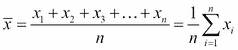

如果数据值来自样本，则使用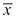，如果数据值来自总体，则使用μ。

样本平均值和总体平均值不同。 样本均值是所谓的真实总体均值的无偏估计量。 通过对总体进行重复随机抽样以计算样本均值，我们可以获得样本均值的均值。 然后，我们可以调用大数定律和**中心极限定理**（ **CLT** ），并将样本均值的平均值表示为真实总体均值的估计值。

人口平均值也称为人口的期望值。

作为计算值的平均值通常不是数据集中观察到的值之一。 使用均值的主要缺点是，极易受到离群值的影响，或者数据集非常偏斜。 有关其他信息，请参阅以下 [http://en.wikipedia.org/wiki/Sample_mean_and_sample_covariance](http://en.wikipedia.org/wiki/Sample_mean_and_sample_covariance) ， [http://en.wikipedia.org/wiki/Law_of_large_numbers](http://en.wikipedia.org/wiki/Law_of_large_numbers) 上的链接。 和 [http://bit.ly/1bv7l4s](http://bit.ly/1bv7l4s) 。

### 中位数

中位数是将已排序数据值的集合分为两半的数据值。 它的人口正好在其左侧，而另一半则在其右侧。 在数据集中的值数为偶数的情况下，中位数是两个中间值的平均值。 它受异常值和偏斜数据的影响较小。

### 模式

模式是数据集中最频繁出现的值。 它通常用于分类数据，以便知道最常见的类别。 使用该模式的一个缺点是它不是唯一的。 具有两种模式的分布称为双峰分布，而具有多种模式的分布称为多峰分布。 这是一个双峰分布的示意图，其中模式分别为两个和七个，因为它们在数据集中都出现了四次：

```py
In [4]: import matplotlib.pyplot as plt
 %matplotlib inline 
In [5]: plt.hist([7,0,1,2,3,7,1,2,3,4,2,7,6,5,2,1,6,8,9,7])
 plt.xlabel('x')
 plt.ylabel('Count')
 plt.title('Bimodal distribution')
 plt.show()

```

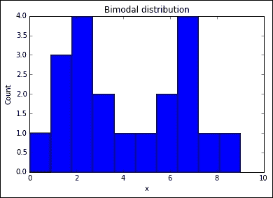

### 用 Python 计算数据集中趋势的度量

为了说明这一点，让我们考虑以下数据集，该数据集由 15 个学生在 20 分中得到的分数获得：

```py
In [18]: grades = [10, 10, 14, 18, 18, 5, 10, 8, 1, 12, 14, 12, 13, 1, 18]

```

均值，中位数和众数可以如下获得：

```py
In [29]: %precision 3  # Set output precision to 3 decimal places
Out[29]:u'%.3f'

In [30]: import numpy as np
 np.mean(grades)
Out[30]: 10.933

In [35]: %precision
 np.median(grades)
Out[35]: 12.0

In [24]: from scipy import stats
 stats.mode(grades)
Out[24]: (array([ 10.]), array([ 3.]))
In [39]: import matplotlib.pyplot as plt
In [40]: plt.hist(grades)
 plt.title('Histogram of grades')
 plt.xlabel('Grade')
 plt.ylabel('Frequency')
 plt.show()

```

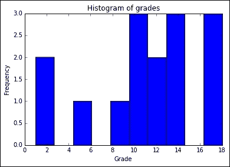

为了说明数据的偏斜度或离群值会如何严重影响均值作为衡量集中趋势的效用，请考虑以下数据集，该数据集显示了工厂员工的工资（以千美元计）：

```py
In [45]: %precision 2
 salaries = [17, 23, 14, 16, 19, 22, 15, 18, 18, 93, 95]

In [46]: np.mean(salaries)
Out[46]: 31.82

```

基于平均值，我们可以假设数据以`31.82`的平均值为中心。 但是，我们会错的。 为了看到这一点，让我们使用条形图显示数据的经验分布：

```py
In [59]: fig = plt.figure()
 ax = fig.add_subplot(111)
 ind = np.arange(len(salaries))
 width = 0.2
 plt.hist(salaries, bins=xrange(min(salaries),
 max(salaries)).__len__())
 ax.set_xlabel('Salary')
 ax.set_ylabel('# of employees')
 ax.set_title('Bar chart of salaries')
 plt.show()

```

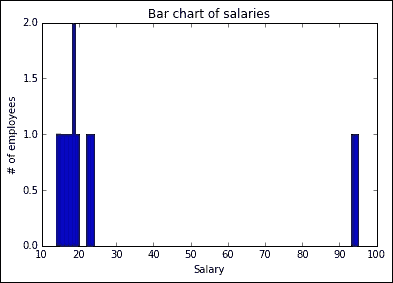

从前面的条形图中，我们可以看到大多数薪水远低于 30K，并且没有人接近 32K 的平均值。 现在，如果我们看一下中位数，我们会发现在这种情况下，它是衡量集中趋势的更好方法：

```py
In [47]: np.median(salaries)
Out[47]: 18.00

```

我们还可以看一下数据的直方图：

```py
In [56]: plt.hist(salaries, bins=len(salaries))
 plt.title('Histogram of salaries')
 plt.xlabel('Salary')
 plt.ylabel('Frequency')
 plt.show()

```

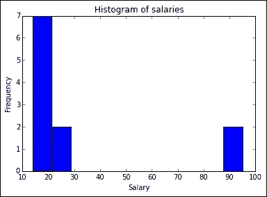

### 注意

直方图实际上是数据的更好表示，因为条形图通常用于表示分类数据，而直方图是定量数据的首选，而薪金数据就是这种情况。

有关何时使用直方图和条形图的更多信息，请参见 [http://onforb.es/1Dru2gv](http://onforb.es/1Dru2gv) 。

如果分布是对称的且是单峰的（即只有一种模式），则三个度量（均值，中位数和众数）将相等。 如果分配偏斜则不是这种情况。 在这种情况下，均值和中位数会彼此不同。 对于负偏斜分布，对于正偏斜分布，均值将低于中位数，反之亦然：

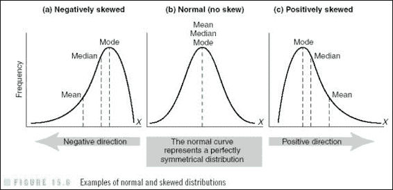

上图来自 [http://www.southalabama.edu/coe/bset/johnson/lectures/lec15_files/image014.jpg](http://www.southalabama.edu/coe/bset/johnson/lectures/lec15_files/image014.jpg) 。

## 度量变异性，分散性或价差

我们在描述性统计中测量的分布的另一个特征是可变性。

可变性指定数据点彼此不同或分散多少。 可变性度量很重要，因为它们可以提供对集中趋势度量无法提供的数据性质的洞察。

例如，假设我们进行了一项研究，以检验学前教育计划在提高经济弱势儿童的考试成绩方面的效果。 我们不仅可以通过整个样本的测试分数的平均值来衡量有效性，而且可以通过分数的分散性来衡量有效性。 它对某些学生有用，而对其他学生却没有那么多？ 数据的可变性可以帮助我们确定要采取的一些步骤，以提高程序的实用性。

### 范围

色散的最简单度量是范围。 范围是数据集中最低和最高得分之间的差。 这是传播最简单的方法。

> 范围=最大值-最小值

### 四分位数

四分位数和相关的四分位数范围是分散的更重要度量。 它也代表*季度百分位数*，这意味着它是度量标准上的值，低于该值时已排序数据集中的分数的 25％，50％，75％和 100％下降。 四分位数是将数据集分为四组的三个点，每个组包含四分之一的数据。 为了说明这一点，假设我们有一个包含 20 个测试成绩的数据集，其中对它们的排名如下：

```py
In [27]: import random
 random.seed(100)
 testScores = [random.randint(0,100) for p in 
 xrange(0,20)]
 testScores
Out[27]: [14, 45, 77, 71, 73, 43, 80, 53, 8, 46, 4, 94, 95, 33, 31, 77, 20, 18, 19, 35]

In [28]: #data needs to be sorted for quartilessortedScores = np.sort(testScores) 
In [30]: rankedScores = {i+1: sortedScores[i] for i in 
 xrange(len(sortedScores))}

In [31]: rankedScores
Out[31]:
{1: 4,
 2: 8,
 3: 14,
 4: 18,
 5: 19,
 6: 20,
 7: 31,
8: 33,
 9: 35,
 10: 43,
 11: 45,
 12: 46,
 13: 53,
 14: 71,
 15: 73,
 16: 77,
 17: 77,
 18: 80,
 19: 94,
 20: 95}

```

第一个四分位数（Q1）在第五和第六个分数之间，第二个四分位数（Q2）在第十和第十一个分数之间，第三个四分位数在第十五和第十六个分数之间。 因此，我们有了（通过使用线性插值并计算中点）：

```py
Q1 = (19+20)/2 = 19.5
Q2 = (43 + 45)/2 = 44
Q3 = (73 + 77)/2 = 75

```

要在 IPython 中看到这一点，我们可以使用`scipy.stats`或`numpy.percentile`包：

```py
In [38]: from scipy.stats.mstats import mquantiles
 mquantiles(sortedScores)
Out[38]: array([ 19.45,  44\.  ,  75.2 ])

In [40]: [np.percentile(sortedScores, perc) for perc in [25,50,75]]
Out[40]: [19.75, 44.0, 74.0]

```

值与我们先前的计算不完全匹配的原因是由于插值方法不同。 可在 [http://en.wikipedia.org/wiki/Quartile](http://en.wikipedia.org/wiki/Quartile) 中找到有关获取四分位数值的各种方法的更多信息。 四分位数范围是从第三四分位数（ **Q3-Q1** ）中减去的第一四分位数，它表示数据集中的中位数 50。

有关更多信息，请参见 [http://bit.ly/1cMMycN](http://bit.ly/1cMMycN) 。

有关`scipy.stats`和`numpy.percentile`功能的更多详细信息，请参见[上的文档，网址为 http://docs.scipy.org/doc/scipy/reference/generated/scipy.stats.mstats.mquantiles.html](http://docs.scipy.org/doc/scipy/reference/generated/scipy.stats.mstats.mquantiles.html) 和 [http://docs.scipy.org/doc/numpy-dev/reference/genic/numpy.percentile.html](http://docs.scipy.org/doc/numpy-dev/reference/generated/numpy.percentile.html) 。

### 偏差和方差

讨论可变性的基本思想是偏差的概念。 简而言之，偏差测度告诉我们给定值与分布平均值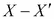的距离有多远。

为了找到一组值的偏差，我们将方差定义为偏差平方的总和，然后将其除以数据集的大小对其进行归一化。 这称为方差。 由于负偏差和正偏差彼此抵消，因此我们需要使用偏差的平方和作为围绕均值结果的偏差之和。 偏差的平方和定义如下：

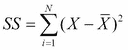

可以证明前面的表达式等效于：

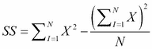

正式地，方差定义如下：

*   For sample variance, use the following formula:

    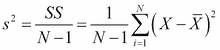

*   For population variance, use the following formula:

    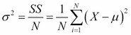

对于样本方差而不是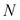，分母为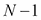的原因是，对于样本方差，我们希望使用无偏估计量。 有关更多信息，请查看 [http://en.wikipedia.org/wiki/Bias_of_an_estimator](http://en.wikipedia.org/wiki/Bias_of_an_estimator) 。

此度量的值以平方单位表示。 这强调了一个事实，我们计算出的方差是平方偏差。 因此，要获得与数据集原始点相同单位的偏差，我们必须取平方根，这就是我们所说的标准偏差。 因此，使用以下公式可以得出样品的标准偏差：

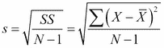

但是，对于总体，标准偏差由以下公式给出：

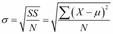

# 假设检验–原假设和替代假设

在上一节中，我们简要介绍了所谓的描述性统计。 在本节中，我们将讨论所谓的推论统计，由此我们尝试使用样本数据集的特征来得出有关更广泛总体的结论。

推论统计中最重要的方法之一就是假设检验。 在假设检验中，我们尝试确定某个假设或研究问题在一定程度上是否正确。 一种假设的例子是：吃菠菜可以改善长期记忆。

为了通过假设检验调查此问题，我们可以选择一组人作为我们的研究对象，并将其分为两组或样本。 第一组是实验组，它将在预定的时间内吃菠菜。 不接受菠菜的第二组为对照组。 在选定的时间段内，将对两组中的个人记忆进行测量和统计。

我们在实验结束时的目标是能够做出这样的陈述，例如“吃菠菜可以改善长期记忆，而这并非偶然”。 这也称为重要性。

在前面的场景中，研究中的主题集合称为样本，而我们希望得出结论的一般人群是人口。

我们研究的最终目标是确定我们在样本中观察到的任何影响是否可以推广到整个人群。 为了进行假设检验，我们将需要提出零假设和替代假设。

## 零假设和替代假设

通过参考前面的菠菜示例，原假设为：吃菠菜对长期记忆性能没有影响。

零假设就是，它使我们试图通过运行实验来证明*证明*的意图无效。 它通过断言某个统计指标（稍后将进行解释）为零来做到这一点。

替代假设是我们希望支持的假设。 这与原假设相反，我们假设它是正确的，直到数据提供了足够的证据表明相反。 因此，在这种情况下，我们的另一种假设是：吃菠菜可改善长期记忆。

象征性地，原假设称为 *H0* ，替代假设称为 *H1* 。 您可能希望将先前的零假设和替代假设重新陈述为对我们的研究更为具体和可衡量的内容。 例如，我们可以按以下方式重铸 *H0* ：

每天吃 40 克菠菜 90 天的 1,000 名受试者的平均记忆评分与同期未食用菠菜的 1,000 名受试者的对照组没有什么不同。

在进行实验/研究时，我们专注于试图证明或否定原假设。 这是因为我们可以计算结果归因于偶然性的概率。 但是，没有一种简单的方法来计算替代假设的可能性，因为长期记忆的任何改善都可能是由于吃菠菜以外的其他因素引起的。

我们通过假设原假设为真来检验原假设，并单独计算偶然获得的结果的概率。 我们设置一个阈值水平-α*α*-对于该阈值水平，如果计算的概率较小，则可以拒绝零假设，如果阈值级别较大，则可以接受。 拒绝原假设等于接受替代假设，反之亦然。

### alpha 和 p 值

为了进行实验以决定是否支持我们的零假设，我们需要提出一种方法，使我们能够以具体且可衡量的方式做出决定。 要进行此显着性检验，我们必须考虑两个数字-检验统计量的 p 值和显着性阈值水平，也称为 **alpha** 。

如果我们通过假设无效假设为真或仅凭偶然发生而观察到的结果，则 p 值为概率。

假设无效假设为真，则 p 值也可以认为是获得测试统计量的概率与实际获得的测试统计量一样极端或更高。

alpha 值是我们与 p 值进行比较的阈值。 这为我们接受或拒绝原假设提供了一个切入点。 它是衡量我们观察到的结果必须多么极端才能拒绝实验的原假设的一种度量。 alpha 的最常用值为 0.05 或 0.01。

通常，规则如下：

如果 p 值小于或等于 alpha（p < .05），则我们拒绝原假设，并声明结果具有统计学意义。

如果 p 值大于 alpha（p > .05），则我们无法拒绝原假设，并且我们说结果在统计上不显着。

在使用中看似随意的 alpha 值是常识性方法的缺点之一，与此方法有关的问题很多。 *Nature* 杂志上的以下文章重点介绍了一些问题： [http://www.nature.com/news/scientific-method-statistical-errors-1.14700](http://www.nature.com/news/scientific-method-statistical-errors-1.14700) 。

有关此主题的更多详细信息，请参阅：

*   [http://statistics.about.com/od/Inferential-Statistics/a/What-Is-The-Difference-Between-Alpha-And-P-Values.htm](http://statistics.about.com/od/Inferential-Statistics/a/What-Is-The-Difference-Between-Alpha-And-P-Values.htm)
*   [http://bit.ly/1GzYX1P](http://bit.ly/1GzYX1P)
*   [http://en.wikipedia.org/wiki/P-value](http://en.wikipedia.org/wiki/P-value)

### I 型和 II 型错误

错误有两种，如下所述：

*   **类型 I 错误**：在这种类型的错误中，当 *H0* 实际上为真时，我们拒绝 *H0* 。 陪审团的一个例子就是陪审团裁定无辜者犯有该人没有犯下的罪行。
*   **类型 II 错误**：在这种类型的错误中，当 *H1* 实际上为真时，我们无法拒绝 *H0* 。 这相当于有罪的人逃脱定罪。

## 统计假设检验

统计假设检验是一种使用统计研究或实验中的数据做出决策的方法。 在统计中，基于预定的阈值概率或显着性水平，如果不可能仅偶然发生的结果称为统计显着。 统计测试分为两类：1 尾检验和 2 尾检验。

在 2 尾检验中，我们分配一半的 alpha 值来检验一个方向上的统计显着性，而另一半则分配给另一方向上的统计显着性。

在 1 尾测试中，测试仅在一个方向上执行。

有关此主题的更多详细信息，请参考 [http://www.ats.ucla.edu/stat/mult_pkg/faq/general/tail_tests.htm](http://www.ats.ucla.edu/stat/mult_pkg/faq/general/tail_tests.htm) 。

### 背景

要应用统计推断，重要的是要了解所谓的抽样分布的概念。 假设我们从零假设成立的总体中随机抽样，则抽样分布是统计量所有可能值及其概率的集合。

更为简单的定义是：抽样分布是统计数据可以假设（分布）的一组值，如果我们要从总体中重复抽取样本及其相关概率。

统计量的值是来自统计量抽样分布的随机样本。 通过获取许多不同大小的样本并取其平均值来计算平均值的采样分布。 它的平均值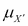等于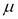，标准偏差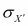 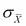等于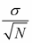 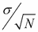。

CLT 指出，如果原始或原始评分总体呈正态分布，或者样本量足够大，则抽样分布呈正态分布。 传统上，统计人员将足够大的样本数量表示为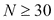，即样本数量为 30 或更大。 但是，这仍然是一个争论的话题。

有关此主题的更多详细信息，请参阅 [http://stattrek.com/sampling/sampling-distribution.aspx](http://stattrek.com/sampling/sampling-distribution.aspx) 和 [http://en.wikipedia.org/wiki/Central_limit_theorem](http://en.wikipedia.org/wiki/Central_limit_theorem) 。

采样分布的标准偏差通常称为平均值的标准误差或仅称为标准误差。

### Z 检验

z 测试适用于以下情况：

*   该研究仅涉及一个样本均值，并且零假设人口的参数和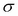是已知的
*   均值的采样分布为正态分布
*   样本大小为

当总体平均值为*已知*时，我们使用 z 检验。 在 z 检验中，我们问一个问题：总体平均值是否不同于假设值。 z 检验的原假设如下：

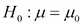

其中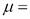人口平均值

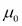 =假设值

替代假设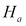可以是以下之一：

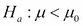

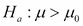

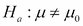

前两个是 1 尾测试，最后一个是 2 尾测试。 具体来说，为了测试，我们计算了测试统计量：

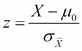

在此，是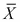的采样分布的真实标准偏差。 如果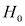为 true，则 z 检验统计量将具有标准正态分布。

在这里，我们给出 z 检验的快速说明。

假设我们有一家虚构的公司 Intelligenza，该公司声称他们提出了一种根本的新方法来改善内存保留和学习。 他们声称他们的技术可以提高成绩，而不是传统的学习技术。 假设使用传统的学习技术，成绩提高 40％，标准差提高 10％。

使用 Intelligenza 方法对 100 名学生进行了随机测试，结果平均提高了 44％。 Intelligenza 的主张是否成立？

本研究的零假设指出，与传统的学习技术相比，使用 Intelligenza 的方法在成绩上没有任何改善。 另一种假设是，使用 Intelligenza 的方法比传统的研究技术有所改进。

零假设由以下给出：


备用假设由以下给出：


标准错误= 10 / sqrt（100）= 1

z =（43.75-40）/（10/10）= 3.75 标准错误

回想一下，如果零假设为真，则检验统计量 z 将具有如下所示的标准正态分布：

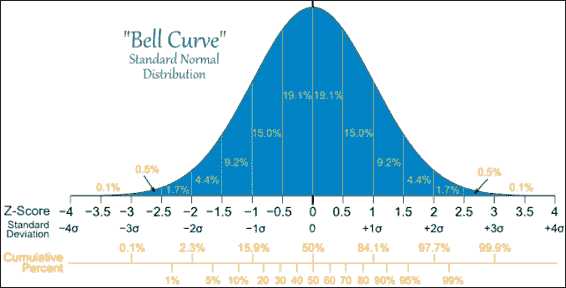

作为参考，请访问 [http://mathisfun.com/data/images/normal-distrubution-large.gif](http://mathisfun.com/data/images/normal-distrubution-large.gif) 。

*z* 的值是来自标准正态分布的随机样本，如果零假设为真，则为 z 的分布。

z = 43.75 的观测值对应于标准正态分布曲线上的极端离群 p 值，远小于 0.1％。

p 值是曲线下的面积，在前一条正态分布曲线上的 3.75 值的右侧。

这表明，如果我们从标准正态分布中进行抽样，那么我们极不可能获得检验统计量的观察值。

我们可以使用`scipy.stats`包，使用 Python 查找实际的 p 值，如下所示：

```py
In [104]: 1 - stats.norm.cdf(3.75)
Out[104]: 8.841728520081471e-05

```

因此，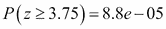，即，如果检验统计量呈正态分布，则获得观测值的概率为 8.8e-05，接近零。 因此，如果原假设是真实的，几乎不可能获得我们观察到的值。

用更正式的术语来说，我们通常将定义一个阈值或 alpha 值，如果 p 值≤α则拒绝原假设，否则将拒绝。

α的典型值为 0.05 或 0.01。 以下列表说明了 alpha 的不同值：

*   **p 值< 0.01** ：非常有力的证据反对 *H0*
*   **0.01 < p 值< 0.05** ：有力证据反对 *H0*
*   **0.05 < p 值< 0.1** ：对 *H0* 的证据不充分
*   **p 值> 0.1** ：几乎没有证据反对 *H0*

因此，在这种情况下，我们将拒绝原假设，并相信 Intelligenza 的主张，并声明其主张具有重大意义。 在这种情况下，反对原假设的证据很重要。 我们使用两种方法来确定是否拒绝原假设：

*   P 值法
*   拒绝区域法

我们在前面的示例中使用的方法是后者。

p 值越小，原假设为真的可能性就越小。 在拒绝区域方法中，我们具有以下规则：

如果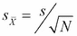，则拒绝原假设，否则保留原假设。

### T 检验

当总体的标准偏差已知时，z 检验最有用。 但是，在大多数实际情况下，这是一个未知数。 对于这些情况，我们转向显着性的 t 检验。

对于 t 检验，假设总体的标准偏差未知，我们将其替换为样本的标准偏差 *s* 。 平均值的标准误差现在变为：


样本 s 的标准偏差计算如下：

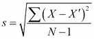

分母是 *N-1* 而不是 *N* 。 该值称为自由度数。 我现在将不加说明地指出，通过 CLT，随着 *N* 的出现，t 分布近似于正态，瓜斯或 z 分布，因此 *N-1* 增大，即随着 **自由度**（ **df** ）。 当 df =∞时，t 分布与正态分布或 z 分布相同。 这是直观的，因为随着 df 的增加，样本量也会增加，并且 s 接近，即总体的真实标准偏差。 存在无限数量的 t 分布，每个 t 分布对应于不同的 df 值。

如下图所示：

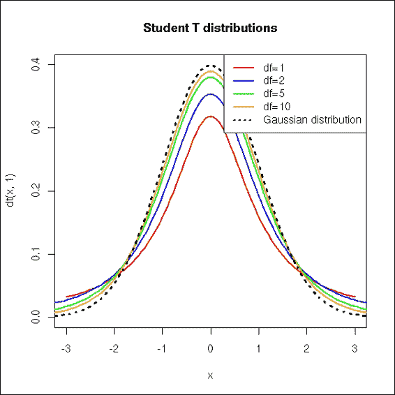

该图像的引用来自： [http://zoonek2.free.fr/UNIX/48_R/g593.png](http://zoonek2.free.fr/UNIX/48_R/g593.png) 。

有关 t 分布，z 分布和自由度之间关系的更详细的技术说明，请参见 [http://en.wikipedia.org/wiki/Student's_t-distribution](http://en.wikipedia.org/wiki/Student's_t-distribution) 。

#### t 检验的类型

有各种类型的 t 检验。 以下是最常见的； 他们通常会制定一个零假设，以对分布的均值提出要求：

*   **One sample independent t-test**: This is used to compare the mean of a sample with that of a known population mean or known value. Let's assume that we're health researchers in Australia who are concerned about the health of the aboriginal population and wish to ascertain whether babies born to low-income aboriginal mothers have lower birth weight than is normal.

    单样本 t 检验的原假设检验的一个例子是：从低收入土著母亲的 150 例足月活产婴儿分娩中，我们样本的平均出生体重与平均出生无异 澳大利亚一般人口的婴儿体重，即 3367 克。

    该信息的参考是： [http://bit.ly/1KY9T7f](http://bit.ly/1KY9T7f) 。

*   **Independent samples t-tests**: This is used to compare means from independent samples with each other. An example of an independent sample t-test would be a comparison of fuel economy of automatic transmission versus manual transmission vehicles. This is what our real-world example will focus on.

    t 检验的原假设是：手动和自动变速箱汽车的平均燃油效率在城市/高速公路平均行驶里程之间没有差异。

*   **Paired samples t-test**: In a paired/dependent samples t-test, we take each data point in one sample and pair it with a data point in the other sample in a meaningful way. One way to do this would be to measure against the same sample at different points in time. An example of this would be to examine the efficacy of a slimming diet by comparing the weight of a sample of participants before and after the diet.

    在这种情况下，原假设是这样的：减肥饮食前后参与者的平均体重之间没有差异，或更简洁地说，配对观察之间的平均差异为零。

    可以在 [http://en.wikiversity.org/wiki/T-test](http://en.wikiversity.org/wiki/T-test) 上找到此信息的参考。

### T 检验示例

简而言之，要进行**空有效假设检验**（ **NHST** ），我们需要执行以下操作：

1.  制定我们的原假设。 零假设是我们的系统模型，假设我们希望验证的效果实际上是偶然的。
2.  计算我们的 p 值。
3.  将计算出的 p 值与我们的 alpha 值或阈值进行比较，并决定是否拒绝或接受原假设。 如果 p 值足够低（低于 alpha），我们将得出结论，即原假设可能是不正确的。

对于我们的实际插图，我们希望调查手动变速箱车辆是否比自动变速箱更省油。 为此，我们将利用美国政府 2014 年在 [http://www.fueleconomy.gov](http://www.fueleconomy.gov) 上发布的燃料经济数据。

```py
In [53]: import pandas as pd
 import numpy as np
 feRawData = pd.read_csv('2014_FEGuide.csv')

In [54]: feRawData.columns[:20]
Out[54]: Index([u'Model Year', u'Mfr Name', u'Division', u'Carline', u'Verify Mfr Cd', u'Index (Model Type Index)', u'Eng Displ', u'# Cyl', u'Trans as listed in FE Guide (derived from col AA thru AF)', u'City FE (Guide) - Conventional Fuel', u'Hwy FE (Guide) - Conventional Fuel', u'Comb FE (Guide) - Conventional Fuel', u'City Unadj FE - Conventional Fuel', u'Hwy Unadj FE - Conventional Fuel', u'Comb Unadj FE - Conventional Fuel', u'City Unrd Adj FE - Conventional Fuel', u'Hwy Unrd Adj FE - Conventional Fuel', u'Comb Unrd Adj FE - Conventional Fuel', u'Guzzler? ', u'Air Aspir Method'], dtype='object')

In [51]: feRawData = feRawData.rename(columns={'Trans as listed in FE Guide (derived from col AA thru AF)' :'TransmissionType',
 'Comb FE (Guide) - Conventional Fuel' : 'CombinedFuelEcon'})

In [57]: transType=feRawData['TransmissionType']
 transType.head()
Out[57]: 0      Auto(AM7)
 1     Manual(M6)
 2      Auto(AM7)
 3     Manual(M6)
 4    Auto(AM-S7)
 Name: TransmissionType, dtype: object

```

现在，我们希望修改前面的系列，以使这些值仅包含`Auto`和`Manual`字符串。 我们可以这样做，如下所示：

```py
In [58]: transTypeSeries = transType.str.split('(').str.get(0)
 transTypeSeries.head()
Out[58]: 0      Auto
 1    Manual
 2      Auto
 3    Manual
 4      Auto
 Name: TransmissionType, dtype: object

```

现在，我们从系列中创建一个最终的修改后的 DataFrame，该数据帧由变速箱类型和组合的燃油经济性数字组成：

```py
In [61]: feData=pd.DataFrame([transTypeSeries,feRawData['CombinedFuelEcon']]).T
 feData.head()
Out[61]:    TransmissionType    CombinedFuelEcon
 0  Auto                16
 1  Manual              15
 2  Auto                16
 3  Manual              15
 4  Auto                17
 5 rows × 2 columns

```

现在，我们可以将自动变速箱的数据与手动变速箱的数据分开，如下所示：

```py
In [62]: feData_auto=feData[feData['TransmissionType']=='Auto']
 feData_manual=feData[feData['TransmissionType']=='Manual']
In [63]: feData_auto.head()
Out[63]:   TransmissionType     CombinedFuelEcon
 0  Auto                 16
 2  Auto                 16
 4  Auto                 17
 6  Auto                 16
 8  Auto                 17
 5 rows × 2 columns

```

这表明有 987 辆具有自动变速箱的车辆，而有 211 辆具有手动变速箱的车辆：

```py
In [64]: len(feData_auto)
Out[64]: 987

In [65]: len(feData_manual)
Out[65]: 211

In [87]: np.mean(feData_auto['CombinedFuelEcon'])
Out[87]: 22.173252279635257

In [88]: np.mean(feData_manual['CombinedFuelEcon'])
Out[88]: 25.061611374407583

In [84]: import scipy.stats as stats
 stats.ttest_ind(feData_auto['CombinedFuelEcon'].tolist(), 
 feData_manual['CombinedFuelEcon'].tolist())
Out[84]: (array(-6.5520663209014325), 8.4124843426100211e-11)

In [86]: stats.ttest_ind(feData_auto['CombinedFuelEcon'].tolist(), 
 feData_manual['CombinedFuelEcon'].tolist(), 
 equal_var=False)
Out[86]: (array(-6.949372262516113), 1.9954143680382091e-11)

```

## 置信区间

在本节中，我们将讨论置信区间的问题。 置信区间使我们能够对总体给定样本数据的平均值进行概率估计。

此估计称为间隔估计，由一系列值（间隔）组成，这些值充当未知总体参数的良好估计。

置信区间受置信限度限制。 95％置信区间定义为一个区间，其中该区间包含概率为 95％的总体平均值。 那么，我们如何构建置信区间？

假设我们有一个 2 尾 t 检验，我们希望构建一个 95％的置信区间。 在这种情况下，我们希望与平均值对应的样本 t 值满足以下不等式：

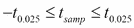

给定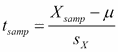，我们可以用前面的不等式关系来代替它：

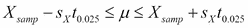

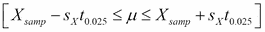区间是我们的 95％置信区间。

概括而言，任何百分比 y 的任何置信区间都可以表示为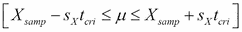，其中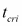是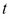的 t 尾值，即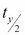对应于 y 的期望置信区间。

现在，我们将借此机会说明如何使用流行的统计环境 R 中的数据集来计算置信区间。`stats`模型的模块提供了对 R 核心数据包中可通过[ `get_rdataset`功能。

### 一个说明性的例子

我们将考虑称为`faithful`的数据集，该数据集包含通过观察美国黄石国家公园的老忠实间歇泉的爆发而获得的数据。数据集中的两个变量是爆发，即间歇泉爆发的时间长度 然后等待直到下一次爆发的时间间隔。 有 272 个观察结果。

```py
In [46]: import statsmodels.api as sma
 faithful=sma.datasets.get_rdataset("faithful")
 faithful
Out[46]: <class 'statsmodels.datasets.utils.Dataset'>

In [48]: faithfulDf=faithful.data
 faithfulDf.head()
Out[48]:    eruptions   waiting
 0   3.600       79
 1   1.800       54
 2   3.333       74
 3   2.283       62
 4  4.533        85
5 rows × 2 columns

In [50]: len(faithfulDf)
Out[50]: 272

```

让我们计算间歇喷泉平均等待时间的 95％置信区间。 为此，我们首先获取数据的样本均值和标准差：

```py
In [80]: mean,std=(np.mean(faithfulDf['waiting']),
 np.std(faithfulDf['waiting']))

```

现在，我们使用`scipy.stats`包来计算置信区间：

```py
In [81]: from scipy import statsN=len(faithfulDf['waiting'])
 ci=stats.norm.interval(0.95,loc=mean,scale=std/np.sqrt(N))
In [82]: ci
Out[82]: (69.28440107709261, 72.509716569966201)

```

因此，我们可以说[69.28，72.51]区间包含了间歇泉的实际平均等待时间，具有 95％的置信度。

此信息的参考： [http://statsmodels.sourceforge.net/devel/datasets/index.html](http://statsmodels.sourceforge.net/devel/datasets/index.html) 和 [http://docs.scipy.org/doc/scipy-0.14.0/ reference / Generated / scipy.stats.norm.html](http://docs.scipy.org/doc/scipy-0.14.0/reference/generated/scipy.stats.norm.html) 。

## 相关和线性回归

确定两个变量之间关系的统计中最常见的任务之一是它们之间是否存在依赖关系。 相关性是我们在统计数据中用于表示相互依赖的变量的总称。

然后，我们可以使用这种关系来尝试从另一组变量预测一组变量的值； 这称为回归。

### 相关性

用相关关系表示的统计依存关系并不意味着两个变量之间存在因果关系。 与此相关的著名观点是“相关并不意味着因果关系”。 因此，两个变量或数据集之间的相关性仅表示是偶然的，而不是因果关系或依赖性。 例如，在特定日期购买的冰淇淋数量与天气之间存在相关性。

有关相关性和依赖性的更多信息，请参见 [http://en.wikipedia.org/wiki/Correlation_and_dependence](http://en.wikipedia.org/wiki/Correlation_and_dependence) 。

相关度量（称为相关系数）是一个数字，用于捕获两个变量之间关系的大小和方向。 方向的范围从-1 到+1，幅度的范围从 0 到 1。 关系的方向通过符号表示，其中 *+* 符号表示正相关，而*-*符号表示负相关。 幅度越高，与被称为完美相关的相关性就越大。

最受欢迎和使用最广泛的相关系数是皮尔逊积矩相关系数，称为 *r* 。 它测量两个 x 和 y 变量之间的线性相关性或依赖性，并获取 *-1* 和 *+1* 之间的值。

样本相关系数 *r* 定义如下：

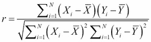

也可以这样写：

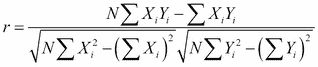

在此，我们省略了求和限制。

### 线性回归

如前所述，回归集中在使用两个变量之间的关系进行预测。 为了使用线性回归进行预测，必须计算最适合的直线。

如果所有点（变量的值）都位于一条直线上，则该关系被认为是完美的。 在实践中，这种情况很少发生，并且点并非都整齐地排列在一条直线上。 那么这种关系是不完美的。 在某些情况下，线性关系仅在对数转换的变量之间发生。 这是一个日志日志模型。 这种关系的一个例子是物理学中的幂定律分布，其中一个变量随另一变量的幂而变化。

因此，诸如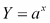的表达式导致线性关系。

有关更多信息，请参见： [http://en.wikipedia.org/wiki/Power_law](http://en.wikipedia.org/wiki/Power_law)

为了构建最适合*的*线，使用最小二乘法。 在这种方法中，最佳拟合线是在各点之间构造的最佳线，对于这些点，从每个点到该线的平方距离的总和最小。 这被认为是我们尝试使用线性回归建模的变量之间关系的最佳线性近似。 在这种情况下，最佳拟合线称为最小二乘回归线。

更正式地说，最小二乘回归线是对于从数据点到该线的垂直距离的平方和具有最小可能值的线。 这些垂直距离也称为残差。

因此，通过构造最小二乘回归线，我们试图最小化以下表达式：


### An illustrative example

现在，我们将通过一个示例来说明所有上述要点。 假设我们正在进行一项研究，其中我们想说明温度对发声频率的影响。 该示例的数据从 1948 年的*《昆虫之歌》* ， *George W Pierce* 中获得。乔治·皮尔斯（George Pierce）测量了在各种温度下 a 发出的 chi 的频率。

我们希望调查的频率和温度，因为我们怀疑这是有关系的。 数据由 16 个数据点组成，我们将其读入数据帧：

```py
In [38]: import pandas as pd
 import numpy as np
 chirpDf= pd.read_csv('cricket_chirp_temperature.csv')
In [39]: chirpDf
Out[39]:chirpFrequency  temperature
0       20.000000       88.599998
1       16.000000       71.599998
2       19.799999       93.300003
3       18.400000       84.300003
4       17.100000       80.599998
5       15.500000       75.199997
6       14.700000       69.699997
7       17.100000       82.000000
8       15.400000       69.400002
9       16.200001       83.300003
10      15.000000       79.599998
11      17.200001       82.599998
12      16.000000       80.599998
13      17.000000       83.500000
14      14.400000       76.300003
15 rows × 2 columns

```

首先，让我们绘制数据散点图以及回归线或最佳拟合线：

```py
In [29]: plt.scatter(chirpDf.temperature,chirpDf.chirpFrequency,
 marker='o',edgecolor='b',facecolor='none',alpha=0.5)
 plt.xlabel('Temperature')
 plt.ylabel('Chirp Frequency')
 slope, intercept = np.polyfit(chirpDf.temperature,chirpDf.chirpFrequency,1)
 plt.plot(chirpDf.temperature,chirpDf.temperature*slope + intercept,'r')
 plt.show()

```


从图中可以看出，温度和线性调频频率之间似乎存在线性关系。 现在，我们可以使用`statsmodels.ols`（普通最小二乘法）方法进一步进行调查：

```py
[37]: chirpDf= pd.read_csv('cricket_chirp_temperature.csv')
 chirpDf=np.round(chirpDf,2)
 result=sm.ols('temperature ~ chirpFrequency',chirpDf).fit()
 result.summary()

Out[37]: OLS Regression Results
 Dep. Variable: temperature     R-squared:      0.697
 Model: OLS     Adj. R-squared: 0.674
 Method:        Least Squares   F-statistic:    29.97
 Date:  Wed, 27 Aug 2014     Prob (F-statistic):     0.000107
 Time:  23:28:14        Log-Likelihood: -40.348
 No. Observations:      15      AIC:    84.70
 Df Residuals:  13      BIC:    86.11
 Df Model:      1 
 coef     std err t     P>|t| [95.0% Conf. Int.]
 Intercept     25.2323 10.060  2.508 0.026 3.499 46.966
 chirpFrequency 3.2911  0.601  5.475 0.000 1.992 4.590

 Omnibus:        1.003   Durbin-Watson:  1.818
 Prob(Omnibus):  0.606   Jarque-Bera (JB):       0.874
 Skew:   -0.391  Prob(JB):       0.646
 Kurtosis:       2.114   Cond. No.       171.

```

除了`R-squared`，`Intercept`和`chirpFrequency`值外，我们将忽略大多数上述结果。

从前面的结果可以得出，回归线的斜率为 3.29，温度轴上的截距为 25.23。 因此，回归线方程如下所示：*温度= 25.23 + 3.29 * chirpFrequency* 。

这意味着，随着线性调频频率增加一，温度会升高约 3.29 华氏度。 但是，请注意，截距值实际上并不有意义，因为它超出了数据的范围。 我们也只能预测数据范围内的值。 例如，我们无法预测 32 华氏度下的 chirpFrequency 是什么，因为它超出了数据的范围； 而且，在华氏 32 度时，the 会冻死。 相关系数 *R* 的值如下所示：

```py
In [38]: R=np.sqrt(result.rsquared)
 R
Out[38]: 0.83514378678237422

```

因此，我们的相关系数为 *R = 0.835* 。 这表明温度的变化可以解释 about 频率的约 84％。

该信息的参考：*昆虫之歌* [http://www.hup.harvard.edu/catalog.php?isbn=9780674420663](http://www.hup.harvard.edu/catalog.php?isbn=9780674420663)

数据来自 [http://bit.ly/1MrlJqR](http://bit.ly/1MrlJqR) 。

有关单变量和多变量回归的更深入的处理，请访问以下网站：

*   回归（第一部分）： [http://bit.ly/1Eq5kSx](http://bit.ly/1Eq5kSx)
*   回归（第二部分）： [http://bit.ly/1OmuFTV](http://bit.ly/1OmuFTV)

# 摘要

在本章中，我们简要介绍了统计的经典方法或常客方法，并向您展示了如何将大熊猫与`stats`和`scipy.stats`和`statsmodels`软件包结合在一起，以计算，解释和推断统计信息 数据。

在下一章中，我们将研究另一种统计方法，即贝叶斯方法。 要更深入地了解我们涉及的统计信息主题，请查看*了解行为科学中的统计信息*，该信息可以在[中找到，网址为 http://www.amazon.com/Understanding- 统计-行为科学-Robert / dp / 0495596523](http://www.amazon.com/Understanding-Statistics-Behavioral-Sciences-Robert/dp/0495596523) 。