# 第 8 章贝叶斯统计简介

在本章中，我们将简要介绍称为**贝叶斯统计**的另一种统计推断方法。 它不打算作为完整的入门手册，而只是对贝叶斯方法的介绍。 我们还将探讨相关的 Python 相关库，如何使用 Pandas 以及`matplotlib`来帮助进行数据分析。 将讨论的各种主题如下：

*   贝叶斯统计概论
*   贝叶斯统计的数学框架
*   概率分布
*   贝叶斯统计与频率统计
*   PyMC 和蒙特卡洛仿真简介
*   贝叶斯推理的插图–切换点检测

# 贝叶斯统计概论

贝叶斯统计领域建立在 18 世纪统计学家，哲学家和长老会牧师托马斯·贝叶斯牧师的工作基础上。 他著名的贝叶斯定理（构成贝叶斯统计的理论基础）于 1763 年死后出版，以解决*逆概率*问题。 有关此主题的更多详细信息，请参考[这里](http://en.wikipedia.org/wiki/Thomas_Bayes)。

逆概率问题在 18 世纪初期风行一时，通常表述如下：

假设您和朋友一起玩游戏。 袋子 1 中有 10 个绿色球和 7 个红色球，袋子 2 中有 4 个绿色和 7 个红色球。您的朋友背离您的视线，扔硬币并从其中一个袋子中随机捡起一个球，并显示给您。 球是红色的。 球从袋子 1 中抽出的概率是多少？

这些问题被称为逆概率问题，因为我们试图根据随后的事件（球是红色）来估计已经发生的事件（球从哪个袋子抽出）的概率。

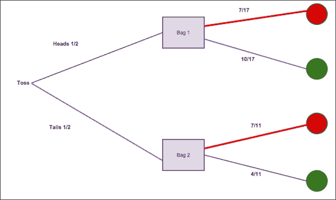

贝叶斯球图

让我们快速说明一下如何解决前面说明的逆概率问题。 考虑到球是红色的，我们希望计算从袋子 1 中抽出球的概率。 这可以表示为 。

让我们从计算选择红球的概率开始。 如上图所示，可以通过遵循红色的两条路径来计算。 因此，我们有 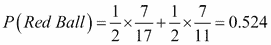。

现在，从袋子 1 中选择红色球的概率仅是通过上方路径，并给出如下：

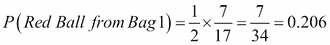

并且，从袋 2 中选择红色球的概率如下所示：

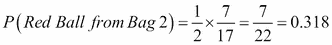

注意，该概率可以写成如下形式：

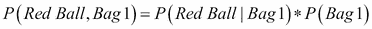

通过检查我们可以看到 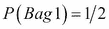 和树的最后一个分支只有在球首先位于袋 1 中并且是红色球时才被遍历。 因此，从直观上讲，我们将得到以下结果：

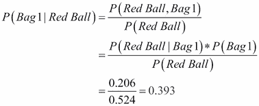

# 贝叶斯统计的数学框架

利用贝叶斯方法，我们提出了进行统计推断的另一种方法。 我们首先介绍贝叶斯定理，这是从其得出所有贝叶斯推断的基本方程式。

关于概率的几个定义是有序的：

*   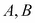：这些事件可能以一定概率发生。
*   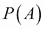 和 ：这是发生特定事件的概率。
*   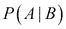：鉴于 B 发生，这是 A 发生的概率。 这称为条件概率。
*   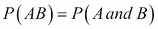：这是 A 和 B 一起出现的概率。

我们从基本假设开始，如下所示：

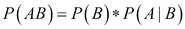

前面的方程将联合概率 P（AB）与条件概率 P（A | B）和边际概率 P（B）关联起来。 如果重写方程式，则条件概率表达式如下：

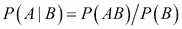

这在某种程度上很直观-给定 B 的概率是通过将 A 和 B 都出现的概率除以 B 发生的概率而获得的。 这个想法是给定的，所以我们除以它的概率。 可以在[这个链接](http://bit.ly/1bCYXRd)中找到对此方程式的更严格的处理，标题为*概率：联合概率，边际概率和条件概率*。

类似地，通过对称我们有 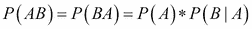。 因此，我们有 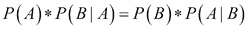。 通过在两侧将表达式除以 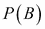 并假设 P（B）！= 0，我们得到：

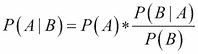

前面的等式称为贝叶斯定理，这是所有贝叶斯统计推断的基础。 为了将贝叶斯定理与推论统计联系起来，我们将等式重铸为所谓的*历时解释*，如下所示：

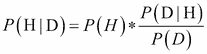

其中，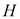 代表一个假设。

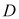 代表已经发生的事件，我们将其用于统计研究中，也称为*数据*。

然后， 是我们的假设*在观察数据之前的概率*。 这称为先验概率。 贝叶斯统计学家经常认为使用先验概率是一种优势，因为先验知识或先前的结果可以用作当前模型的输入，从而提高了准确性。 有关此的更多信息，请参考[这里](http://www.bayesian-inference.com/advantagesbayesian)。

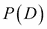 是获得与假设无关的观测数据的概率。 这称为归一化常数。 并非总是需要计算归一化常数，尤其是在许多流行的算法（例如 MCMC）中，我们将在本章后面进行讨论。

给定我们观察到的数据，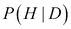 是假设成立的概率。 这称为后验。

考虑到我们的假设，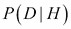 是获得数据的概率。 这称为可能性。

因此，贝叶斯统计等于应用贝叶斯规则来解决推论统计中的问题，其中 H 代表我们的假设，D 代表数据。

贝叶斯统计模型是根据参数进行转换的，这些参数的不确定性由概率分布表示。 这与将值视为确定性的频率论方法不同。 替代表示如下：


其中  是我们的未知数据，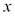 是我们的观测数据

在贝叶斯统计中，我们对先验数据进行假设，并使用贝叶斯规则使用可能性来更新后验概率。 作为说明，让我们考虑以下问题。 这是通常称为*问题*的经典案例：

*   两个包含彩球
*   一个包含 50 个红色和 50 个蓝色球
*   n 包含 30 个红色和 70 个蓝色球
*   随机选择两个中的一个（概率为 50% ），然后从两个 one 中的一个随机抽出一个球

如果画了一个红色的球，那么它来自的概率是多少？ 我们想要  即 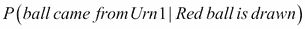。

在这里， 表示从 Ur 中抽出球， 表示被抽出的球是红色：

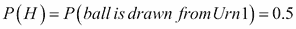

我们知道 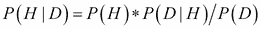，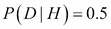，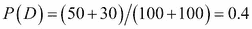 或 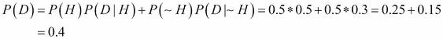。

因此，我们得出结论 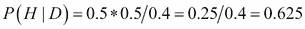。

## 贝叶斯理论与赔率

贝叶斯定理有时可以通过使用称为*赔率*的概率的替代表示形式，以更自然，更方便的形式表示。 赔率通常用比率表示，并且经常使用。 一匹马在比赛中获胜的赔率为 3 比 1（通常为 3：1），这表示该马有望以 75% 的概率获胜。

给定概率 p，可以将几率计算为几率= 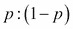，在 p = 0.75 的情况下，该几率变为 0.75：0.25，即 3：1。

我们可以通过使用赔率来重写贝叶斯定理的形式：

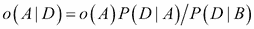

## 贝叶斯统计的应用

贝叶斯统计可以应用于经典统计中遇到的许多问题，例如：

*   参数估计
*   预测
*   假设检验
*   线性回归

研究贝叶斯统计数据有许多令人信服的理由。 其中一些是利用先验信息更好地告知当前模型。 贝叶斯方法适用于概率分布而不是点估计，因此产生了更现实的预测。 贝叶斯推断是基于可用数据的假设 -- `P(假设|数据)`。 惯常方法试图根据假设拟合数据。 可以说，贝叶斯方法是更逻辑和经验的方法，因为它试图将信念建立在事实之上，而不是反过来。 有关此的更多信息，请参考[这里](http://www.bayesian-inference.com/advantagesbayesian)。

# 概率分布

在本节中，我们将简要检查各种概率分布的属性。 这些分布中有许多用于贝叶斯分析。 因此，需要简要的提要。 我们还将说明如何使用`matplotlib`生成和显示这些分布。 为了避免在每个部分的每个代码段重复导入语句，我将介绍以下标准的 Python 代码导入集，这些代码需要在以下命令中提到的任何代码段之前运行。 您只需在每个会话中运行一次这些导入。 导入如下：

```py
In [1]: import pandas as pd
 import numpy as np
 from matplotlib import pyplot as plt
 from matplotlib import colors
 import matplotlib.pyplot as plt
 import matplotlib
 %matplotlib inline

```

## 拟合分布

贝叶斯分析中必须采取的步骤之一是使我们的数据适合概率分布。 选择正确的分发可能有点技巧，并且通常需要统计知识和经验，但是我们可以遵循一些准则来帮助我们。 这些如下：

*   确定数据是离散数据还是连续数据
*   检查数据的偏斜度/对称性，如果偏斜，请确定方向
*   确定下限和上限（如果有）
*   确定观察分布中极值的可能性

统计试验是具有一组明确定义的结果（称为样本空间）的可重复实验。 伯努利试验是“是/否”实验，如果是，则将随机 X 变量的值分配为 1，如果否，则将其分配为 0。抛硬币并查看其是否朝正面方向的事件是伯努利审判的例子。

有两类概率分布：离散分布和连续分布。 在以下各节中，我们将讨论这两类分布之间的差异，并浏览主要分布。

### 离散概率分布

在这种情况下，变量只能采用某些不同的值，例如整数。 离散随机变量的一个例子是当我们掷硬币 5 次时获得的正面数。 可能的值为`{0,1,2,3,4,5}`。 例如，我们无法获得 3.82 个云台。 随机变量可以采用的值的范围由**概率质量函数**（**pmf**）指定。

### 离散均匀分布

离散均匀分布是一种对事件进行建模的分布，该事件具有一组有限的可能结果，其中每个结果均可能被观察到。 对于  结果，每个结果都有  发生的可能性。

这方面的一个例子就是投掷公平的死刑。 六个结果中任何一个的概率为 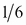。 PMF 由  给出，期望值和方差分别由 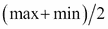 和 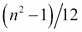 给出。

```py
In [13]: from matplotlib import pyplot as plt
 import matplotlib.pyplot as plt
 X=range(0,11)
 Y=[1/6.0 if x in range(1,7) else 0.0 for x in X]
 plt.plot(X,Y,'go-', linewidth=0, drawstyle='steps-pre', 
 label="p(x)=1/6")
 plt.legend(loc="upper left")
 plt.vlines(range(1,7),0,max(Y), linestyle='-')
 plt.xlabel('x')
 plt.ylabel('p(x)')
 plt.ylim(0,0.5)
 plt.xlim(0,10)
 plt.title('Discrete uniform probability distribution with 
 p=1/6')
 plt.show()

```

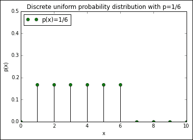

离散均匀分布

#### 伯努利分布

伯努利分布用于衡量试验成功的可能性； 例如，硬币抛起头或尾的概率。 这可以用一个随机的 X 变量来表示，如果硬币正面朝上，则取值为 1，反之则为 0。 出现头部或尾部的概率分别由`p`和`q = 1-p`表示。

可以通过以下 pmf 表示：

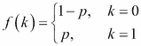

期望值和方差由以下公式给出：

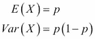

此信息的参考位于[这里](http://en.wikipedia.org/wiki/Bernoulli_distribution)。

现在，我们使用`matplotlib`和`scipy.stats`绘制伯努利分布，如下所示：

```py
In [20]:import matplotlib
 from scipy.stats import bernoulli
 a = np.arange(2)

 colors = matplotlib.rcParams['axes.color_cycle']
 plt.figure(figsize=(12,8))
 for i, p in enumerate([0.0, 0.2, 0.5, 0.75, 1.0]):
 ax = plt.subplot(1, 5, i+1)
 plt.bar(a, bernoulli.pmf(a, p), label=p, color=colors[i], alpha=0.5)
 ax.xaxis.set_ticks(a)

 plt.legend(loc=0)
 if i == 0:
 plt.ylabel("PDF at $k$")

 plt.suptitle("Bernoulli probability for various values of $p$")
Out[20]:

```

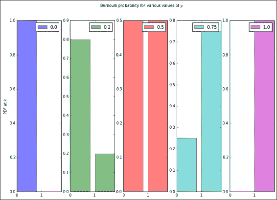

#### 二项式分布

二项式分布用于表示 *n* 个独立伯努利试验即 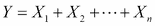 中的成功次数。

以掷硬币为例，此分布模拟了  试验获得 X 正面攻击的机会。 对于 100 次抛掷，二项分布模拟了 0 头（极不可能）至 50 头（最高可能性）至 100 头（也极不可能）的可能性。 当赔率完全均匀时，这最终使二项式分布对称，而当赔率远不那么均匀时，则使二项分布偏斜。 pmf 由以下表达式给出：

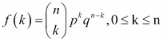

期望和方差分别由以下表达式给出：

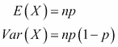

```py
In [5]: from scipy.stats import binom
 clrs = ['blue','green','red','cyan','magenta']     plt.figure(figsize=(12,6))
 k = np.arange(0, 22)
 for p, color in zip([0.001, 0.1, 0.3, 0.6, 0.999], clrs):
 rv = binom(20, p)
 plt.plot(k, rv.pmf(k), lw=2, color=color, label="$p$=" + str(round(p,1)))

 plt.legend()
 plt.title("Binomial distribution PMF")
 plt.tight_layout()
 plt.ylabel("PDF at $k$")
 plt.xlabel("$k$")
Out[5]:

```

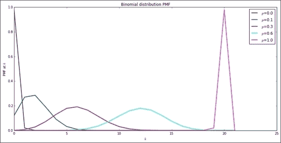

二项分布

#### 泊松分布

泊松分布对给定时间间隔内多个事件的概率进行建模，假设这些事件以已知的平均速率发生，并且连续事件的发生与自上一个事件以来的时间无关。

可以由泊松分布模型化的过程的一个具体示例是，如果一个人平均每天收到 23 封电子邮件。 如果我们假设电子邮件的到达时间是相互独立的，则个人每天收到的电子邮件总数可以通过泊松分布来建模。

另一个示例可能是每小时在特定车站停靠的火车数量。 泊松分布的 pmf 由以下表达式给出：

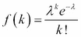

其中 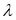 是速率参数，代表每单位时间发生的预期事件/到达次数，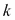 是随机变量，代表事件/到达次数。

期望值和方差分别由以下公式给出：

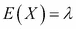

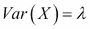

有关更多信息，请参考[这里](http://en.wikipedia.org/wiki/Poisson_process)。

使用`matplotlib`将 pmf 绘制为各种值，如下所示：

```py
In [11]: %matplotlib inline
 import numpy as np
 import matplotlib
 import matplotlib.pyplot as plt
 from scipy.stats import poisson
 colors = matplotlib.rcParams['axes.color_cycle']
 k=np.arange(15)
 plt.figure(figsize=(12,8))
 for i, lambda_ in enumerate([1,2,4,6]):
 plt.plot(k, poisson.pmf(k, lambda_), '-o', 
 label="$\lambda$=" + str(lambda_), color=colors[i])
 plt.legend()
 plt.title("Possion distribution PMF for various $\lambda$")
 plt.ylabel("PMF at $k$")
 plt.xlabel("$k$")
 plt.show()
Out[11]:

```

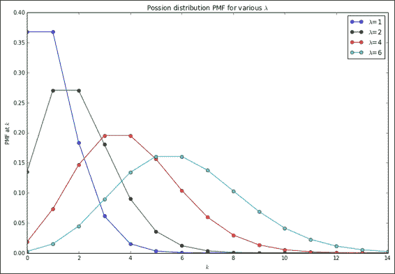

鱼类分布

#### 几何分布

对于独立的伯努利试验，几何分布测量获得成功所需的试验次数 X。 它还可以表示首次成功之前的失败次数 。

pmf 由以下表达式给出：


自  以来，上述表达式是有意义的，并且如果需要 k 次尝试才能获得一个成功（p），则意味着我们必须有等于  的  失败。

期望值和方差如下：


以下命令清楚地解释了前面的公式：

```py
In [12]: from scipy.stats import geom
 p_vals=[0.01,0.2,0.5,0.8,0.9]
 x = np.arange(geom.ppf(0.01,p),geom.ppf(0.99,p))
 colors = matplotlib.rcParams['axes.color_cycle']
 for p,color in zip(p_vals,colors):
 x = np.arange(geom.ppf(0.01,p),geom.ppf(0.99,p))
 plt.plot(x,geom.pmf(x,p),'-o',ms=8,label='$p$=' + str(p))
 plt.legend(loc='best')
 plt.ylim(-0.5,1.5)
 plt.xlim(0,7.5)
 plt.ylabel("Pmf at $k$")
 plt.xlabel("$k$")
 plt.title("Geometric distribution PMF")
Out[12]:

```


几何分布

#### 负二项分布

同样对于独立的伯努利试验，负二项式分布测量在指定的成功次数 r 发生之前的尝试次数 。 一个例子是要获得 5 个硬币的掷硬币次数。 pmf 给出如下：


期望和方差分别由以下表达式给出：


我们可以看到负二项式是几何分布的概括，几何分布是负二项式的特殊情况，其中 。

代码和图解如下所示：

```py
In [189]: from scipy.stats import nbinom
 from matplotlib import colors
 clrs = matplotlib.rcParams['axes.color_cycle']
 x = np.arange(0,11)
 n_vals = [0.1,1,3,6]
 p=0.5
 for n, clr in zip(n_vals, clrs):
 rv = nbinom(n,p)
 plt.plot(x,rv.pmf(x), label="$n$=" + str(n), color=clr)
 plt.legend()
 plt.title("Negative Binomial Distribution PMF")
 plt.ylabel("PMF at $x$")
 plt.xlabel("$x$")

```


### 连续概率分布

在连续概率分布中，变量可以采用任何实数。 与离散概率分布一样，它不限于一组有限的值。 例如，一个健康的新生婴儿的平均体重大约在 6-9 磅之间。 例如，其重量可以是 7.3 磅。 连续概率分布的特征在于**概率密度函数**（**PDF**）。

随机变量可以假定的所有概率之和为 1。因此，概率密度函数图的面积为 1。

#### 连续均匀分布

均匀分布对随机变量 X 建模，该随机变量 X 可以以相等的概率采用  范围内的任何值。

PDF 由  给出，否则由  和  给出。

期望和方差由以下表达式给出：


在下面的代码和图中，生成了连续均匀的概率分布，并针对各种样本大小绘制了该图：

```py
In [11]: np.random.seed(100)  # seed the random number generator
 # so plots are reproducible
 subplots = [111,211,311]
 ctr = 0 
 fig, ax = plt.subplots(len(subplots), figsize=(10,12))
 nsteps=10
 for i in range(0,3):
 cud = np.random.uniform(0,1,nsteps) # generate distrib
 count, bins, ignored = ax[ctr].hist(cud,15,normed=True)
 ax[ctr].plot(bins,np.ones_like(bins),linewidth=2, color='r')
 ax[ctr].set_title('sample size=%s' % nsteps)
 ctr += 1
 nsteps *= 100
 fig.subplots_adjust(hspace=0.4)
 plt.suptitle("Continuous Uniform probability distributions for various sample sizes" , fontsize=14)

```


#### 指数分布

指数分布模拟了泊松过程中两个事件之间的等待时间。 泊松过程是遵循泊松分布的过程，在该过程中，事件以已知的平均速率不可预测地发生。 指数分布可以描述为几何分布的*连续极限*，并且也是 Markovian（无内存）。

无记忆的随机变量表现出这样的特性，即其未来状态仅取决于有关当前时间的相关信息，而不取决于过去的信息。 建模 Markovian /无内存随机变量的示例是对短期股票价格行为及其遵循随机游走的思想进行建模。 这导致了所谓的金融有效市场假说。 有关更多信息，请参见[这里](http://en.wikipedia.org/wiki/Random_walk_hypothesis)。

指数分布的 PDF 由  =  给出。 期望和方差由以下表达式给出：


有关参考，请参考[这个链接](http://en.wikipedia.org/wiki/Exponential_distribution)。

分布图和代码如下：

```py
In [15]: import scipy.stats
 clrs = colors.cnames
 x = np.linspace(0,4, 100)
 expo = scipy.stats.expon
 lambda_ = [0.5, 1, 2, 5]
 plt.figure(figsize=(12,4))
 for l,c in zip(lambda_,clrs):
 plt.plot(x, expo.pdf(x, scale=1./l), lw=2,
 color=c, label = "$\lambda = %.1f$"%l)
 plt.legend()
 plt.ylabel("PDF at $x$")
 plt.xlabel("$x$")
 plt.title("Pdf of an Exponential random variable for various $\lambda$");

```


#### 正态分布

统计中最重要的分布可以说是正态/高斯分布。 它对中心值周围的概率分布进行建模，而没有左右偏倚。 遵循正态分布的现象有很多示例，例如：

*   婴儿的出生体重
*   测量误差
*   血压
*   考试分数

正态分布的重要性由中心极限定理强调，该极限定理指出，独立于同一分布而绘制的许多随机变量的均值近似正态，而与原始分布的形式无关。 其期望值和方差如下：


正态分布的 PDF 由以下表达式给出：


以下代码和图解说明了公式：

```py
In [54]: import matplotlib
 from scipy.stats import norm
 X = 2.5
 dx = 0.1
 R = np.arange(-X,X+dx,dx)

 L = list()
 sdL = (0.5,1,2,3)
 for sd in sdL:
 f = norm.pdf
 L.append([f(x,loc=0,scale=sd) for x in R])

 colors = matplotlib.rcParams['axes.color_cycle']
 for sd,c,P in zip(sdL,colors,L):
 plt.plot(R,P,zorder=1,lw=1.5,color=c,
 label="$\sigma$=" + str(sd))
 plt.legend()
 ax = plt.axes()
 ax.set_xlim(-2.1,2.1)
 ax.set_ylim(0,1.0)
 plt.title("Normal distribution Pdf")
 plt.ylabel("PDF at $\mu$=0, $\sigma$")

```


可以在[这个位置](http://bit.ly/1E17nYx)找到有关绘制分布图的 Python 代码的参考。

正态分布也可以视为二项式分布的连续极限，而其他分布则可以视为 。 我们可以在命令中看到二项分布，并绘制如下：

```py
In [18]:from scipy.stats import binom
 from matplotlib import colors
 cols = colors.cnames
 n_values = [1, 5,10, 30, 100]

 subplots = [111+100*x for x in range(0,len(n_values))]
 ctr = 0 
 fig, ax = plt.subplots(len(subplots), figsize=(6,12))
 k = np.arange(0, 200)
 p=0.5

 for n, color in zip(n_values, cols):
 k=np.arange(0,n+1)
 rv = binom(n, p)
 ax[ctr].plot(k, rv.pmf(k), lw=2, color=color)
 ax[ctr].set_title("$n$=" + str(n))
 ctr += 1

 fig.subplots_adjust(hspace=0.5)
 plt.suptitle("Binomial distribution PMF (p=0.5) for various values of n", fontsize=14)

```


随着 n 的增加，二项式分布接近正态分布。 实际上，对于`n >= 30`，可以在前面的图中清楚地看到。

# 贝叶斯统计与频率统计

在当今的统计中，关于如何解释数据和进行统计推断有两种思路。 迄今为止，经典且占主导地位的方法是所谓的“惯常方法”（请参阅​​第 7 章，“统计学之旅 -– 经典方法”），本章中的贝叶斯方法。

## 概率是多少？

贝叶斯和频繁主义世界观之间的辩论的核心是问题—我们如何定义概率？

在频率论世界观中，概率是从重复事件的发生频率得出的概念。 例如，当我们定义抛掷公平硬币时获胜的概率等于一半。 这是因为当我们反复抛掷一个公平的硬币时，当抛硬币的数量足够大时，正面数除以抛硬币的总数将接近 0.5。

贝叶斯世界观是不同的，概率的概念是它与一个人对事件发生的信念程度有关。 因此，对于贝叶斯统计学家而言，认为公平死亡概率为 5 的可能性为 ，这与我们对该事件发生的可能性的信念有关。

## 如何定义模型

从模型定义的角度来看，常客通过使用重复的实验来分析数据和计算的度量标准如何变化，同时保持模型参数不变。 另一方面，贝叶斯算法利用固定的实验数据，但是改变了他们对模型参数的置信度，其解释如下：

*   **频率论**：如果模型固定，则数据会有所不同
*   **贝叶斯**：如果数据固定，则模型会有所不同

惯常方法使用所谓的最大似然方法来估计模型参数。 它涉及从一组独立且分布均匀的观测值生成数据，并将观测到的数据拟合到模型中。 最适合该数据的模型参数的值是**最大似然估计器**（**MLE**），有时可能是所观察数据的函数。

贝叶斯主义对这个问题的看法不同于概率框架。 概率分布用于描述值的不确定性。 贝叶斯实践者使用观察到的数据估计概率。 为了计算这些概率，它们使用单​​个估计量，即贝叶斯公式。 与“惯常”方法一样，这产生的是分布而不是点估计。

## 置信度（频率）与可信度（贝叶斯）间隔

让我们比较一下 95% 的置信区间的含义，贝叶斯（Bayesian）练习者使用了 95% 可信区间的常用术语，可信区间为 95% 。

在 Frequentist 框架中，置信区间为 95% 意味着如果您无限次重复实验，并在过程中生成间隔，则其中 95% 的间隔将包含我们尝试估算的参数，通常称为 θ。 在这种情况下，时间间隔是随机变量，而不是参数估计值θ，该值在 Frequentist 世界观中是固定的。

在贝叶斯可信区间的情况下，我们的解释与归因于频繁置信区间的常规解释更加一致。 因此，我们有 。 在这种情况下，我们可以正确地得出结论：θ在此区间内的可能性为 95% 。

有关更多信息，请参阅[*频率论和贝叶斯主义：有什么大不了的？| SciPy 2014，Jake VanderPlas*](https://www.youtube.com/watch?v=KhAUfqhLakw)。

# 进行贝叶斯统计分析

进行贝叶斯统计分析涉及以下步骤：

1.  **指定概率模型**：在这一步中，我们使用概率分布充分描述模型。 根据我们采集的样本的分布，我们尝试为其拟合模型，并尝试将概率分配给未知参数。
2.  **计算后验分布**：后验分布是我们根据观察到的数据计算出的分布。 在这种情况下，我们将直接应用贝叶斯公式。 将根据上一步中指定的概率模型来指定它。
3.  **检查我们的模型**：这是我们进行推断之前检查模型及其输出的必要步骤。 贝叶斯推断方法使用概率分布将概率分配给可能的结果。

# 似然函数和 PyMC 的蒙特卡洛估计

贝叶斯统计不仅是另一种方法。 它是实践统计的完全替代范例。 给定我们收集的数据，它使用概率模型进行推断。 这可以用基本表达式表示为 P（H | D）。

在这里，H 是我们的假设，即我们要证明的事物，D 是我们的数据或观察值。

在前面的讨论中提醒我们，贝叶斯定理的历时形式如下：


在这里，P（H）是无条件的先验概率，表示我们进行试验之前所知道的。 假设我们的假设是正确的，P（D | H）是我们的似然函数或获得我们观察到的数据的概率。

P（D）是数据的概率，也称为归一化常数。 这可以通过对 H 上的分子进行积分来获得。

似然函数是贝叶斯计算中最重要的部分，它封装了有关数据中未知数的所有信息。 它与逆概率质量函数有些相似。

反对采用贝叶斯方法的一个论点是，先验的计算可能是主观的。 有很多观点支持这种方法。 其中之一是，如先前所述，可以包括外部先验信息。

似然值表示未知积分，在简单情况下可以通过解析积分获得。

对于涉及高维积分的更复杂的用例，需要**蒙特卡洛**（**MC**）积分，并且可以用于计算似然函数。

MC 集成可以通过多种采样方法来计算，例如统一采样，分层采样和重要性采样。 在蒙特卡洛积分中，我们可以将积分近似如下：


我们可以通过以下有限和来近似积分：


其中，x 是来自 g 的样本向量。 可以根据大量定律并通过确保模拟误差较小来获得这一估计的好证据。

在 Python 中进行贝叶斯分析时，我们需要一个模块，该模块使我们能够使用前面所述的蒙特卡洛方法来计算似然函数。 `PyMC`库满足了这一需求。 它提供了通常称为**马尔可夫链蒙特卡洛**（**MCMC**）的蒙特卡洛方法。 我不会进一步研究 MCMC 的技术细节，但是有兴趣的读者可以在以下参考文献的`PyMC`中找到有关 MCMC 实现的更多信息：

*   [*贝叶斯估计中的蒙特卡洛积分*](http://bit.ly/1bMALeu)
*   [*马尔科夫链蒙特卡洛最大似然*](http://bit.ly/1KBP8hH)
*   [*使用 Python 进行贝叶斯统计分析 -- 第 1 部分 | SciPy 2014，Chris Fonnesbeck*](http://www.youtube.com/watch?v=vOBB_ycQ0RA)

MCMC 不是通用的灵丹妙药； 该方法存在一些缺点，其中之一是算法收敛缓慢。

## 贝叶斯分析示例–切换点检测

在这里，我们将尝试使用贝叶斯推理并为一个有趣的数据集建模。 所涉及的数据集包含作者的 **Facebook**（**FB**）过去的历史记录。 我们已经清理了 FB 历史数据并将日期保存在`fb_post_dates.txt`文件中。 文件中的数据如下所示：

```py
head -2 ../fb_post_dates.txt 
Tuesday, September 30, 2014 | 2:43am EDT
Tuesday, September 30, 2014 | 2:22am EDT

```

因此，我们看到一个 datetime 系列，代表作者在 FB 上发布的日期和时间。 首先，我们将文件读入数据帧，将时间戳分为“日期”和“时间”列：

```py
In [91]: filePath="./data/fb_post_dates.txt"
 fbdata_df=pd.read_csv(filePath,  sep='|', parse_dates=[0], header=None,names=['Date','Time'])

```

接下来，我们检查数据如下：

```py
In [92]: fbdata_df.head()  #inspect the data
Out[92]:   Date       Time
0  2014-09-30   2:43am EDT
1  2014-09-30   2:22am EDT
2  2014-09-30   2:06am EDT
3  2014-09-30   1:07am EDT
4  2014-09-28   9:16pm EDT

```

现在，我们按日期对数据编制索引，创建一个`DatetimeIndex`，以便可以对其进行重采样以按月进行计数，如下所示：

```py
In [115]: fbdata_df_ind=fbdata_df.set_index('Date')
 fbdata_df_ind.head(5)
Out[115]:                      Time
 Date
 2014-09-30  2:43am EDT
 2014-09-30  2:22am EDT
 2014-09-30  2:06am EDT
 2014-09-30  1:07am EDT
 2014-09-28  9:16pm EDT

```

我们显示有关索引的信息，如下所示：

```py
In [116]: fbdata_df_ind.index
Out[116]: <class 'pandas.tseries.index.DatetimeIndex'>
 [2014-09-30, ..., 2007-04-16]
 Length: 7713, Freq: None, Timezone: None

```

现在，我们使用重新采样按月获取帖子数：

```py
In [99]: fb_mth_count_=fbdata_df_ind.resample('M', how='count')
 fb_mth_count_.rename(columns={'Time':'Count'},
 inplace=True)   # Rename 
 fb_mth_count_.head()
Out[99]:            Count
 Date
 2007-04-30  1
 2007-05-31  0
 2007-06-30  5
 2007-07-31  50
 2007-08-31  24 

```

日期格式显示为每月的最后一天。 现在，我们创建一个 2007-2015 年 FB 帖子计数的散点图，并使点的大小与`matplotlib`中的值成比例：

```py
In [108]: %matplotlib inline
 import datetime as dt
#Obtain the count data from the DataFrame as a dictionary
 year_month_count=fb_bymth_count.to_dict()['Count'] 
 size=len(year_month_count.keys())
#get dates as list of strings
 xdates=[dt.datetime.strptime(str(yyyymm),'%Y%m') 
 for yyyymm in year_month_count.keys()] 
 counts=year_month_count.values()
 plt.scatter(xdates,counts,s=counts)
 plt.xlabel('Year')
 plt.ylabel('Number of Facebook posts')
 plt.show() 

```


我们要调查的问题是，在一段时间内，行为是否有所改变。 具体来说，我们希望确定是否在特定时期内更改了 FB 职位的平均人数。 在时间序列中，这通常称为切换点或更改点。

我们可以利用泊松分布对此建模。 您可能还记得，泊松分布可用于对时间序列计数数据进行建模。 （有关更多信息，请参考[这里](http://bit.ly/1JniIqy)。）

如果我们用  表示我们每月的 FB 职位数，则可以如下表示我们的模型：


 参数是泊松分布的 rate 参数，但我们不知道它的值是多少。 如果我们查看 FB 时间序列计数数据的散点图，我们可以看到在 2010 年中后期左右某个时候的帖子数量有所增加，这可能与 2010 年南非世界杯的开始恰好相吻合。 作者参加了。

 参数是切换点，即速率参数更改时的时间，而  和  分别是切换点之前和之后的  参数的值。 可以表示如下：


注意，上面  中指定的变量都是贝叶斯随机变量。 对于代表人们对其价值信念的贝叶斯随机变量，我们需要使用概率分布对它们进行建模。 我们想推断  和  的值，这些值是未知的。 在`PyMC`中，我们可以使用随机和确定性类表示随机变量。 我们注意到，指数分布是泊松事件之间的时间量。 因此，在  和  的情况下，我们选择指数分布来对其建模，因为它们可以是任何正数：


在  的情况下，我们将选择使用均匀分布对其进行建模，这反映了我们的信念，即切换点很有可能在整个时间段的任何一天发生。 因此，我们有：


在此，， 对应于年份  的上下边界。 现在让我们使用`PyMC`表示我们先前开发的模型。 现在，我们将使用`PyMC`来查看是否可以在 FB 发布数据中检测到切换点。 除了散点图，我们还可以在条形图中显示数据。 为了做到这一点，首先，我们需要获取列表中按月排序的 FB 帖子数：

```py
In [69]: fb_activity_data = [year_month_count[k] for k in 
 sorted(year_month_count.keys())]
 fb_activity_data[:5]

Out[70]: [1, 0, 5, 50, 24]

In [71]: fb_post_count=len(fb_activity_data)

```

我们使用`matplotlib`渲染条形图：

```py
In [72]: from IPython.core.pylabtools import figsize
 import matplotlib.pyplot as plt
 figsize(8, 5)
 plt.bar(np.arange(fb_post_count),
 fb_activity_data, color="#49a178")
 plt.xlabel("Time (months)")
 plt.ylabel("Number of FB posts")
 plt.title("Monthly Facebook posts over time")
 plt.xlim(0,fb_post_count);

```


查看前面的条形图，可以得出结论，FB 频率发布行为是否随时间变化？ 我们可以在开发的模型上使用`PyMC`来帮助我们找出更改，如下所示：

```py
In [88]: # Define data and stochastics
 import pymc as pm
 switchpoint = pm.DiscreteUniform('switchpoint',
 lower=0,
 upper=len(fb_activity_data)-1,
 doc='Switchpoint[month]')
 avg = np.mean(fb_activity_data)
 early_mean = pm.Exponential('early_mean', beta=1./avg)
 late_mean = pm.Exponential('late_mean', beta=1./avg)
 late_mean
Out[88]:<pymc.distributions.Exponential 'late_mean' at 0x10ee56d50>

```

在这里，我们为速率参数 r 定义了一种方法，并使用泊松分布对计数数据进行建模，如前所述：

```py
In [89]: @pm.deterministic(plot=False)
 def rate(s=switchpoint, e=early_mean, l=late_mean):
 ''' Concatenate Poisson means '''
 out = np.zeros(len(fb_activity_data))
 out[:s] = e
 out[s:] = l
 return out

 fb_activity = pm.Poisson('fb_activity', mu=rate, 
 value=fb_activity_data, observed=True)
 fb_activity
Out[89]: <pymc.distributions.Poisson 'fb_activity' at 0x10ed1ee50>

```

在前面的代码片段中，`@pm.deterministic`是一个修饰符，它表示速率函数是确定性的，这意味着其值完全由其他变量（在这种情况下为 e，s 和 l）确定。 为了告诉`PyMC`将比率函数转换为确定性对象，装饰器是必需的。 如果不指定装饰器，则会发生错误。 （有关更多信息，请参阅[这里](http://bit.ly/1zj8U0o)，以获取有关 Python 装饰器的信息。）

有关更多信息，请参阅以下网页：

*   <http://en.wikipedia.org/wiki/Poisson_process>
*   <http://pymc-devs.github.io/pymc/tutorial.html>
*   <https://github.com/CamDavidsonPilon/Probabilistic-Programming-and-Bayesian-Methods-for-Hackers>

现在，我们使用 FB Count 数据（`fb_activity`）和 （分别为`early_mean`，`late_mean`和`rate`）参数创建一个模型。

接下来，使用`Pymc`创建一个 MCMC 对象，该对象使我们能够使用 Markov Chain Monte Carlo 方法拟合数据。 然后，我们在所得的 MCMC 对象上调用样本以进行拟合：

```py
In [94]: fb_activity_model=pm.Model([fb_activity,early_mean,
 late_mean,rate])
In [95]: from pymc import MCMC
 fbM=MCMC(fb_activity_model)
In [96]: fbM.sample(iter=40000,burn=1000, thin=20)
 [-----------------100%-----------------] 40000 of 40000 
 complete in 11.0 sec

```

使用 MCMC 拟合模型涉及使用 Markov-Chain 蒙特卡洛方法生成后验`P(s, e, l | D)`的概率分布。 它使用蒙特卡洛过程反复模拟数据采样，并执行此操作，直到基于多个条件该算法似乎收敛到稳态为止。 这是一个马尔可夫过程，因为连续的样本仅取决于先前的样本。 （有关马尔可夫链收敛的更多参考，请参考[这里](http://bit.ly/1IETkhC)。）

生成的样本称为迹线。 我们可以通过查看*迹线*的直方图来查看参数的边缘后验分布：

```py
In [97]: from pylab import hist,show
 %matplotlib inline
 hist(fbM.trace('late_mean')[:])
Out[97]: (array([  15.,   61.,  214.,  421.,  517.,  426.,  202.,
 70.,   21.,    3.]),
 array([ 102.29451192,  103.25158404,  104.20865616,
 105.16572829,  106.12280041,  107.07987253,
 108.03694465,  108.99401677,  109.95108889,
 110.90816101,  111.86523313]),
 <a list of 10 Patch objects>)

```


```py
In [98]:plt.hist(fbM.trace('early_mean')[:])
Out[98]: (array([  20.,  105.,  330.,  489.,  470.,  314.,  147.,
 60.,    3.,   12.]),
 array([ 49.19781192,  50.07760882,  50.95740571,
 51.83720261,  52.71699951,  53.59679641,
 54.47659331,  55.35639021,  56.2361871 ,
 57.115984  ,  57.9957809 ]),
 <a list of 10 Patch objects>)

```


在这里，我们可以看到 Switchpoint 的月数形式：

```py
In [99]: fbM.trace('switchpoint')[:]
Out[99]: array([38, 38, 38, ..., 35, 35, 35])

In [150]: plt.hist(fbM.trace('switchpoint')[:])
Out[150]: (array([ 1899.,     0.,     0.,     0.,     0.,     0.,
 0., 0., 0.,    51.]),
 array([ 35\. ,  35.3,  35.6,  35.9,  36.2,  36.5,  36.8,
 37.1,  37.4, 37.7,  38\. ]),
 <a list of 10 Patch objects>)

```


历史切换点

我们可以看到 Switchpoint 在第 35-38 个月左右。 在这里，我们使用`matplotlib`在单个图中显示 e，s 和 l 的边际后验分布：

```py
In [141]: early_mean_samples=fbM.trace('early_mean')[:]
 late_mean_samples=fbM.trace('late_mean')[:]
 switchpoint_samples=fbM.trace('switchpoint')[:]
In [142]: from IPython.core.pylabtools import figsize
 figsize(12.5, 10)
 # histogram of the samples:
 fig = plt.figure()
 fig.subplots_adjust(bottom=-0.05)

 n_mths=len(fb_activity_data)
 ax = plt.subplot(311)
 ax.set_autoscaley_on(False)

 plt.hist(early_mean_samples, histtype='stepfilled',
 bins=30, alpha=0.85, label="posterior of $e$",
 color="turquoise", normed=True)
 plt.legend(loc="upper left")
 plt.title(r"""Posterior distributions of the variables
 $e, l, s$""",fontsize=16)
 plt.xlim([40, 120])
 plt.ylim([0, 0.6])
 plt.xlabel("$e$ value",fontsize=14)

 ax = plt.subplot(312)
 ax.set_autoscaley_on(False)
 plt.hist(late_mean_samples, histtype='stepfilled',
 bins=30, alpha=0.85, label="posterior of $l$",
 color="purple", normed=True)
 plt.legend(loc="upper left")
 plt.xlim([40, 120])
 plt.ylim([0, 0.6])
 plt.xlabel("$l$ value",fontsize=14)
 plt.subplot(313)
 w = 1.0 / switchpoint_samples.shape[0] *
 np.ones_like(switchpoint_samples)
 plt.hist(switchpoint_samples, bins=range(0,n_mths), alpha=1,
 label=r"posterior of $s$", color="green",
 weights=w, rwidth=2.)
 plt.xlim([20, n_mths - 20])
 plt.xlabel(r"$s$ (in days)",fontsize=14)
 plt.ylabel("probability")
 plt.legend(loc="upper left")

 plt.show()

```


边缘后验分布

PyMC 还具有绘图功能。 （它使用`matplotlib`。）在下面的图中，我们显示了时间序列图，自相关图（acorr）以及为早期均值，晚期均值和切换点绘制的样本的直方图。 直方图可用于可视化后验分布。 自相关图显示上一期间的值是否与当前期间的值密切相关。

```py
In [100]: from pymc.Matplot import plot
 plot(fbM)
 Plotting late_mean
 Plotting switchpoint
 Plotting early_mean

```

以下是最新的均值图：


pymc_comprehensive_late_mean

在这里，我们显示切换点图：


Pymc 综合切换点

在这里，我们显示早期均值图：


pymc 综合早期均值

从 PyMC 的输出中，我们可以得出结论，转换点距离时间序列开始大约 35-38 个月。 这对应于 2010 年 3 月至 7 月左右的某个时间。作者可以证明这是他使用 FB 的标志性一年，因为那是在南非举行的足球（足球）世界杯决赛的年份， 他参加了。

# 参考资料

要更深入地了解我们涉及的贝叶斯统计主题，请查看以下参考资料：

*   [《黑客的概率编程和贝叶斯方法》](https://github.com/CamDavidsonPilon/Probabilistic-Programming-and-Bayesian-Methods-for-Hackers)
*   [《贝叶斯数据分析，第三版》，*Andrew Gelman*](http://www.amazon.com/Bayesian-Analysis-Chapman-Statistical-Science/dp/1439840954)
*   [《贝叶斯选择》（理论比较多）， *Christian P Robert*](http://www.springer.com/us/book/9780387952314)
*   [*PyMC 文档*](http://pymc-devs.github.io/pymc/index.html)

# 摘要

在本章中，我们对过去几年中统计和数据分析中最热门的趋势之一-贝叶斯统计推断方法进行了一次旋风式浏览。 我们在这里覆盖了很多领域。

我们研究了贝叶斯统计方法所需要的内容，并讨论了为什么贝叶斯观点是一种引人注目的观点的各种因素-事实胜于信念。 我们解释了关键的统计分布，并展示了如何使用各种统计软件包在`matplotlib`中生成和绘制它们。

我们解决了一个相当困难的话题，但又没有过多简化，并演示了如何使用 PyMC 软件包和蒙特卡洛模拟方法来展示贝叶斯统计数据的能力，以建立模型，进行趋势分析以及对真实数据集进行推断（Facebook 用户帖子）。 在下一章中，我们将讨论 Pandas 库的体系结构。