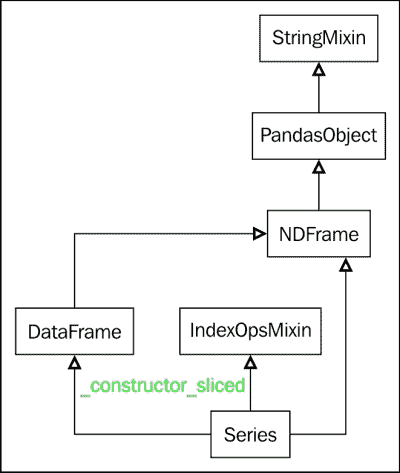

# 九、Pandas 库体系结构

在本章中，我们研究了可供 Pandas 用户使用的各种库。 本章旨在作为简短指南，帮助用户围绕 Pandas 提供的各种模块和库进行导航和查找。 它提供了有关库代码组织方式的分解，还提供了有关各个模块的简要说明。 对于感兴趣的用户来说，这对他们下面的 Pandas 的内部工作以及希望为代码库做出贡献的用户来说，将是最有价值的。 我们还将简要演示如何使用 Python 扩展来提高性能。 将讨论的各种主题如下：

*   Pandas 库层次结构简介
*   Pandas 模块和文件的描述
*   使用 Python 扩展来提高性能

# Pandas 文件层次结构简介

通常，在安装时，会将 Pandas 作为 Python 模块安装在第三方 Python 模块的标准位置：

| 平台 | 标准安装位置 | 示例 |
| --- | --- | --- |
| Unix/MacOS | `prefix/lib/pythonX.Y/site-packages` | `/usr/local/lib/Python 2.7/site-packages` |
| Windows | `prefix\Lib\site-packages` | `C:\Python27\Lib\site-packages` |

安装的文件遵循特定的层次结构：

*   `pandas/core`：此文件包含用于基本数据结构的文件，例如序列/数据帧和相关功能。
*   `pandas/src`：包含用于实现基本算法的 Cython 和 C 代码。
*   `pandas/io`：它包含输入/输出工具（例如平面文件，Excel，HDF5，SQL 等）。
*   `pandas/tools`：它包含辅助数据算法合并和连接例程，连接，数据透视表等。
*   `pandas/sparse`：它包含序列，数据帧，面板等的稀疏版本。
*   `pandas/stats`：包含线性回归和面板回归，以及移动窗口回归。 这应该由 statsmodels 中的功能代替。
*   `pandas/util`：包含实用程序，开发和测试工具。
*   `pandas/rpy`：包含用于连接到 R 的 RPy2 接口。

### 注意

作为参考，请参见[这里](http://pandas.pydata.org/developers.html)。

# Pandas 模块和文件的描述

在本节中，我们将简要介绍组成 Pandas 库的各个子模块和文件。

## Pandas `/core`

该模块包含 Pandas 的核心子模块。 讨论如下：

*   `api.py`：这将导入一些关键模块供以后使用。
*   `array.py`：这可以隔离 Pandas 对 numPy 的暴露，即所有直接的 numPy 使用。
*   `base.py`：这定义了基本类别，例如`StringMixin`，`PandasObject`，它们是各种 Pandas 对象（例如`Period`，`PandasSQLTable`，`sparse.array.SparseArray/SparseList`，`internals.Block`，`internals.BlockManager`，`generic.NDFrame`，`groupby.GroupBy`，`base.FrozenList`，`base.FrozenNDArray`，`io.sql.PandasSQL`，`io.sql.PandasSQLTable`，`tseries.period.Period`，`FrozenList`，`FrozenNDArray`：`IndexOpsMixin`和`DatetimeIndexOpsMixin`。
*   `common.py`：这定义了用于处理数据结构的通用实用程序方法。 例如，`isnull`对象检测到缺少的值。
*   `config.py`：这是用于处理程序包范围内的可配置对象的模块。 它定义了以下类别：`OptionError`，`DictWrapper`，`CallableDynamicDoc`，`option_context`和`config_init`。
*   `datetools.py`：这是处理 Python 中日期的函数的集合。
*   `frame.py`：这定义了 Pandas 的数据帧类及其各种方法。数据帧继承自`NDFrame`。 （见下文）。
*   `generic.py`：这定义了通用`NDFrame`基类，它是 Pandas 的数据帧，序列和面板类的基类。 `NDFrame`源自`base.py`中定义的 Pandas 对象。 `NDFrame`可以看作是 Pandas 数据帧的 N 维版本。 有关此的更多信息，请访问[这里](http://nullege.com/codes/search/pandas.core.generic.NDFrame)。
*   `categorical.py`：这定义了分类，这是一个从 Pandas 对象派生的类，它表示分类变量 la R/S-plus。 （我们稍后会扩展您的知识）。
*   `format.py`：这定义了整个格式化程序类，例如`CategoricalFormatter`，`SeriesFormatter`，`TableFormatter`，`DataFrameFormatter`，`HTMLFormatter`，`CSVFormatter`，`ExcelCell`，`ExcelFormatter`，`GenericArrayFormatter`， `FloatArrayFormatter`，`IntArrayFormatter`，`Datetime64Formatter`，`Timedelta64Formatter`和`EngFormatter`。
*   `groupby.py`：这定义了启用`groupby`函数的各种类。 讨论如下：
    *   `Splitter classes`：这包括`DataSplitter`，`ArraySplitter`，`SeriesSplitter`，`FrameSplitter`和`NDFrameSplitter`
    *   `Grouper/Grouping classes`：这包括`Grouper`，`GroupBy`，`BaseGrouper`，`BinGrouper`，`Grouping`，`SeriesGroupBy`，`NDFrameGroupBy`
*   `ops.py`: 这定义了一个内部 API，用于对 Pandas 对象进行算术运算。 它定义了向对象添加算术方法的函数。 它定义了一个`_create_methods`元方法，该方法用于使用算术，比较和布尔方法构造函数创建其他方法。 `add_methods`方法采用一些新方法，将它们添加到现有方法列表中，并将其绑定到其相应的类。 `add_special_arithmetic_methods`和`add_flex_arithmetic_methods`方法调用`_create_methods`和`add_methods`将算术方法添加到类中。

    它还定义了`_TimeOp`类，该类是与日期时间相关的算术运算的包装。 它包含`Wrapper`函数，用于对序列，数据帧和面板函数进行算术，比较和布尔运算-`_arith_method_SERIES(..)`，`_comp_method_SERIES(..)`，`_bool_method_SERIES(..)`，`_flex_method_SERIES(..)`，`_arith_method_FRAME(..)`，`_comp_method_FRAME(..)`，`_flex_comp_method_FRAME(..)`） `_arith_method_PANEL(..)`，`_comp_method_PANEL(..)`。

*   `index.py`：这定义了`Index`类及其相关功能。 所有 Pandas 的对象（序列，数据帧和面板）都使用索引来存储轴标签。 它的下面是一个不可变的数组，提供了可以切片的有序集合。
*   `internals.py`：这定义了多个对象类。 这些列出如下：
    *   `Block`：这是具有 Pandas 其他功能的同质 N 维`numpy.ndarray`对象。 例如，它使用`__slots__`将对象的属性限制为`ndim`，`values`和`_mgr_locs`。 它充当其他`Block`子类的基类。
    *   `NumericBlock`：这是数字类型的`Blocks`的基类。
    *   `FloatOrComplexBlock`：这是从`NumericBlock`继承的`FloatBlock`和`ComplexBlock`的基类
    *   `ComplexBlock`：这是处理具有复杂类型的`Block`对象的类。
    *   `FloatBlock`：这是处理浮点型`Block`对象的类。
    *   `IntBlock`：这是处理具有整数类型的`Block`对象的类。
    *   `TimeDeltaBlock`，`BoolBlock`和`DatetimeBlock`：这些是`timedelta`，`Boolean`和`datetime`的`Block`类。
    *   `ObjectBlock`：这是为用户定义的对象处理`Block`对象的类。
    *   `SparseBlock`：这是处理相同类型的稀疏数组的类。
    *   `BlockManager`：这是管理一组`Block`对象的类。 它不是公共 API 类。
    *   `SingleBlockManager`：这是管理一个`Block`的类。
    *   `JoinUnit`：这是`Block`对象的实用程序类。
*   `matrix.py`：这将数据帧导入为`DataMatrix`。
*   `nanops.py`：这些是用于处理 NaN 值的类和功能。
*   `ops.py`：这定义了 Pandas 对象的算术运算。 它不是公共 API。
*   `panel.py`，`panel4d.py`和`panelnd.py`：这些提供了 Pandas 的面板对象的功能。
*   `series.py`：它定义序列从`NDFrame`和`IndexOpsMixin`继承的 pandas `Series`类及其各种方法。
*   `sparse.py`：这定义用于处理稀疏数据结构的导入。 稀疏数据结构被*压缩*，从而省略了与 NaN 匹配或缺少值的数据点。 有关此的更多信息，请访问[这里](http://pandas.pydata.org/pandas-docs/stable/sparse.html)。
*   `strings.py`: 它们具有处理字符串的各种功能。

    

## Pandas `/io`

该模块包含用于数据 I/O 的各种模块。 讨论如下：

*   `api.py`：这定义了数据 I/O API 的各种导入。
*   `auth.py`：这定义了处理身份验证的各种方法。
*   `common.py`：这定义了 I/O API 的通用功能。
*   `data.py`：这定义用于处理数据的类和方法。 `DataReader`方法从各种在线来源（例如 Yahoo 和 Google）读取数据。
*   `date_converters.py`：定义日期转换功能。
*   `excel.py`：此模块解析和转换 Excel 数据。 这定义了`ExcelFile`和`ExcelWriter`类。
*   `ga.py`：这是 Google Analytics（分析）功能的模块。
*   `gbq.py`：这是 Google BigQuery 的模块。
*   `html.py`：这是用于处理 HTML I/O 的模块。
*   `json.py`：这是用于处理 Pandas 中 json I/O 的模块。 这定义了`Writer`，`SeriesWriter`，`FrameWriter`，`Parser`，`SeriesParser`和`FrameParser`类。
*   `packer.py`：这是 msgpack 序列化程序支持，用于将 Pandas 数据结构读取和写入磁盘。
*   `parsers.py`：此模块定义了各种功能和类，这些功能和类用于解析和处理文件以创建 Pandas 的数据帧。 下文讨论的所有三个`read_*`函数都具有多个可配置的读取选项。 有关更多详细信息，[请参见此参考](http://bit.ly/1e4Xqo1)。
    *   `read_csv(..)`：这定义了`pandas.read_csv()`函数，可用于将 CSV 文件的内容读取到数据帧中。
    *   `read_table(..)`：这会将制表符分隔的表文件读取到数据帧中。
    *   `read_fwf(..)`：这会将固定宽度格式的文件读取到数据帧中。
    *   `TextFileReader`：这是用于读取文本文件的类。
    *   `ParserBase`：这是解析器对象的基类。
    *   `CParserWrapper`和`PythonParser`：这些分别是 C 和 Python 的解析器。 它们都继承自`ParserBase`。
    *   `FixedWidthReader`：这是读取固定宽度数据的类。 定宽数据文件包含文件中特定位置的字段。
    *   `FixedWithFieldParser`：这是用于解析从`PythonParser`继承的固定宽度字段的类。
*   `pickle.py`：这提供了腌制（序列化）Pandas 对象的方法。 讨论如下：
    *   `to_pickle(..)`：这会将对象序列化为文件。
    *   `read_pickle(..)`：这将从文件中读取序列化的对象到 pandas 对象。 仅应与受信任的来源一起使用。
*   `pytables.py`：这是`PyTables`模块的接口，用于将 Pandas 数据结构读取和写入磁盘上的文件。
*   `sql.py`：它是类和功能的集合，用于使能够从试图与数据库无关的关系数据库中检索数据。 讨论如下：
    *   `PandasSQL`：这是将 Pandas 与 SQL 连接的基类。 它提供了必须由子类实现的伪`read_sql`和`to_sql`方法。
    *   `PandasSQLAlchemy`：这是`PandasSQL`的子类，它可以使用`SQLAlchemy`在数据帧和 SQL 数据库之间进行转换。
    *   `PandasSQLTable`类：它将 Pandas 表（数据帧）映射到 SQL 表。
    *   `pandasSQL_builder(..)`：这将根据提供的参数返回正确的`PandasSQL`子类。
    *   `PandasSQLTableLegacy`类：这是`PandasSQLTable`的旧支持版本。
    *   `PandasSQLLegacy`类：这是`PandasSQLTable`的旧支持版本。
    *   `get_schema(..)`：这将获取给定框架的 SQL 数据库表架构。
    *   `read_sql_table(..)`：这将 SQL DB 表读入数据帧。
    *   `read_sql_query(..)`：这会将 SQL 查询读取到数据帧中。
    *   `read_sql(..)`：这将 SQL 查询/表读入数据帧。
    *   `to_sql(..)`：此操作将数据帧中存储的记录写入 SQL 数据库。
*   `stata.py`：此工具包含用于将`Stata`文件处理为 Pandas 数据帧的工具。
*   `wb.py`：这是用于从世界银行网站下载数据的模块。

## Pandas `tools`

*   `util.py`：具有定义的其他`util`函数，例如`match(..)`，`cartesian_product(..)`和`compose(..)`。
*   `tile.py`：具有一组功能，这些功能可以量化输入数据，从而实现`tile`函数。 除了`cut(..)`和`qcut(..)`之外，大多数功能都是内部功能。
*   `rplot.py`：这是一个模块，提供在 Pandas 中生成网格图的功能。
*   `plotting.py`: 这提供了一组以序列或数据帧为参数的绘图函数。
    *   `scatter_matrix(..)`：这将绘制散点图矩阵
    *   `andrews_curves(..)`：此图将多元数据绘制为曲线，这些曲线是使用样本作为傅立叶级数的系数创建的
    *   `parallel_coordinates(..)`：这是一种绘图技术，可让您查看数据中的聚类并直观地估计统计信息
    *   `lag_plot(..)`：用于检查数据集或时间序列是否随机
    *   `autocorrelation_plot(..)`：用于检查时间序列中的随机性
    *   `bootstrap_plot(..)`：此图用于以视觉方式确定统计量度的不确定性，例如平均值或中位数
    *   `radviz(..)`: 该图用于可视化多元数据

        ### 提示

        以上信息的参考来自[这里](http://pandas.pydata.org/pandas-docs/stable/visualization.html)

*   `pivot.py`: 此功能用于处理 Pandas 中的数据透视表。 它是主要函数`pandas.tools.pivot_table(..)`，它创建类似于电子表格的数据透视表作为数据帧

    ### 提示

    以上信息的参考来自[这里](http://pandas.pydata.org/pandas-docs/stable/reshaping.html)

*   `merge.py`：提供合并序列，数据帧和面板对象（例如`merge(..)`和`concat(..)`）的功能
*   `describe.py`：这提供了一个`value_range(..)`函数，该函数以序列的形式返回数据帧的最大值和最小值。

## Pandas `/sparse`

这是提供序列，数据帧和面板的*稀疏*实现的模块。 所谓稀疏，是指省略或丢失诸如 *0* 之类的值的数组。

有关此的更多信息，请访问[这里](http://pandas.pydata.org/pandas-docs/version/stable/sparse.html) 。

*   `api.py`：这是一组便利导入
*   `array.py`：它是`SparseArray`数据结构的实现
*   `frame.py`：它是`SparseDataFrame`数据结构的实现
*   `list.py`：它是`SparseList`数据结构的实现
*   `panel.py`：它是`SparsePanel`数据结构的实现
*   `series.py`：它是`SparseSeries`数据结构的实现

## Pandas `stats`

*   `api.py`：这是一组便捷导入。
*   `common.py`：定义模块中其他功能调用的内部功能。
*   `fama_macbeth.py`：包含 Fama-Macbeth 回归的类定义和函数。 有关 FM 回归的更多信息，请访问[这里](http://en.wikipedia.org/wiki/Fama-MacBeth_regression)。
*   `interface.py`：它定义`ols(..)`，它返回**普通最小二乘**（**OLS**）回归对象。 它从`pandas.stats.ols`模块导入。
*   `math.py`：具有有用的功能，定义如下：
    *   `rank(..)`，`solve(..)`和`inv(..)`：它们分别用于矩阵秩，解和逆
    *   `is_psd(..)`：这检查矩阵的正定性
    *   `newey_west(..)`：用于协方差矩阵计算
    *   `calc_F(..)`：这将计算 F 统计信息
*   `misc.py`：用于其他功能。
*   `moments.py`：这提供了滚动和扩展的统计量度，包括在 Cython 中实现的时刻。 这些方法包括：`rolling_count(..)`，`rolling_cov(..)`，`rolling_corr(..)`，`rolling_corr_pairwise(..)`，`rolling_quantile(..)`，`rolling_apply(..)`，`rolling_window(..)`，`expanding_count(..)`，`expanding_quantile(..)`，`expanding_cov(..)`，`expanding_corr(..)`，`expanding_corr_pairwise(..)`，`expanding_apply(..)`，`ewma(..)`，`ewmvar(..)`，`ewmstd(..)`，`ewmcov(..)`和`ewmcorr(..)`。
*   `ols.py`：这实现 OLS 并提供 OLS 和`MovingOLS`类。 OLS 运行完整的样本最小二乘回归，而`MovingOLS`生成滚动或扩展的简单 OLS。
*   `plm.py`：这为面板数据提供了线性回归对象。 这些类的讨论如下：
    *   `PanelOLS`：这是面板对象的 OLS
    *   `MovingPanelOLS`：这是面板对象的滚动/扩展 OLS
    *   `NonPooledPanelOLS`：-这是面板对象的非池化 OLS
*   `var.py`: 这提供了向量自回归类，讨论如下：
    *   `VAR`：这是对序列和数据帧中的多元数据的向量自动回归
    *   `PanelVAR`: 这是面板对象中多元数据的向量自动回归

        ### 提示

        有关向量自回归的更多信息，请访问[这里](http://en.wikipedia.org/wiki/Vector_autoregression)

## Pandas `/util`

*   `testing.py`：这提供了断言，调试，单元测试以及其他用于测试的类/函数。 它包含许多特殊的断言函数，这些函数使检查序列，数据帧或面板对象是否等效的操作更加容易。 其中一些功能包括`assert_equal(..)`，`assert_series_equal(..)`，`assert_frame_equal(..)`和`assert_panelnd_equal(..)`。 `pandas.util.testing`模块对 Pandas 代码库的贡献者特别有用。 它定义了一个`util.TestCase`类。 它还提供了用于处理语言环境，控制台调试，文件清除，比较器等的实用程序，以供潜在的代码库贡献者进行测试。
*   `terminal.py`：此功能主要是内部功能，与获取有关终端的某些特定详细信息有关。 单暴露功能是`get_terminal_size()`。
*   `print_versions.py`：它定义了`get_sys_info()`函数，该函数返回系统信息的字典，以及`show_versions(..)`函数，显示可用的 Python 库的版本。
*   `misc.py`：这定义了几个其他实用程序。
*   `decorators.py`: 这定义了一些装饰器函数和类。

    ### 提示

    `Substitution`和`Appender`类是装饰器，它们在函数`docstrings`上执行替换和附加操作，有关 Python 装饰器的更多信息，请访问[这里](http://bit.ly/1zj8U0o)。

*   `clipboard.py`：这包含跨平台剪贴板方法，可通过键盘启用复制和粘贴功能。 Pandas I/O API 包括`pandas.read_clipboard()`和`pandas.to_clipboard(..)`之类的功能。

## Pandas `/rpy`

如果模块已安装在计算机中，则该模块将尝试提供 R 统计软件包的接口。 在版本 0.16.0 和更高版本中不推荐使用。 可以使用[`rpy2`模块](http://rpy.sourceforge.net)代替它的功能。

*   `base.py`：这为 R 中著名的`lm`函数定义了一个类
*   `common.py`：这提供了许多功能，可以将 Pandas 对象转换为等效的 R 版本
*   `mass.py`：这是`rlm` -- R 的`lm`函数的未实现版本
*   `var.py`：其中包含未实现的类`VAR`

## Pandas `/test`

这个模块为 Pandas 中的各种物体提供了许多测试。 特定库文件的名称是不言自明的，除了邀请读者进行探索之外，在这里我将不进一步详细介绍。

## Pandas `/compat`

与兼容性相关的功能解释如下：

*   `chainmap.py`和`chainmap_impl.py`：这提供了一个`ChainMap`类，可以将多个`dicts`或映射分组，以便生成可以更新的单个视图
*   `pickle_compat.py`：此功能提供了在 0.12 之前的版本中腌制 Pandas 对象的功能。
*   `openpyxl_compat.py`：这检查`openpyxl`的兼容性

## Pandas `/calc`

这是提供计算功能的模块，讨论如下：

*   `api.py`：这包含`eval`和`expr`的导入。
*   `align.py`：这实现了数据对齐的功能。
*   `common.py`：它包含几个内部功能。
*   `engines.py`：这定义了抽象引擎`NumExprEngine`和`PythonEngine`。 `PythonEngine`评估表达式，主要用于测试目的。
*   `eval.py`：这定义了最重要的`eval(..)`函数以及其他一些重要功能。
*   `expressions.py`：通过`numexpr`提供快速的表达评估。 `numexpr`函数用于加速某些数值运算。 它使用多个内核以及智能分块和缓存加速。 它定义了`evaluate(..)`和`where(..)`方法。
*   `ops.py`：这定义了`eval`使用的运算符类。 它们是`Term`，`Constant`，`Op`，`BinOp`，`Div`和`UnaryOp`。
*   `pytables.py`：这为`PyTables`查询提供了查询界面。
*   `scope.py`：这是示波器操作的模块。 它定义了一个`Scope`类，它是一个保存范围的对象。

### 提示

有关`numexpr`的更多信息，请访问[这里](https://code.google.com/p/numexpr/)。 有关此模块用法的信息，请访问[这里](http://pandas.pydata.org/pandas-docs/stable/computation.html) 。

## Pandas `/series`

*   `api.py`：这是一组便捷导入
*   `converter.py`: 这定义了一组用于格式化和转换与日期时间相关的对象的类。 导入后，pandas 向`matplotlib`注册了一组单位转换器。
    *   这通过`register()`函数完成，说明如下：

        ```py
        In [1]: import matplotlib.units as munits
        In [2]: munits.registry
        Out[2]: {}

        In [3]: import pandas
        In [4]: munits.registry
        Out[4]: 
        {pandas.tslib.Timestamp: <pandas.tseries.converter.DatetimeConverter instance at 0x7fbbc4db17e8>,
         pandas.tseries.period.Period: <pandas.tseries.converter.PeriodConverter instance at 0x7fbbc4dc25f0>,
         datetime.date: <pandas.tseries.converter.DatetimeConverter instance at 0x7fbbc4dc2fc8>,
         datetime.datetime: <pandas.tseries.converter.DatetimeConverter instance at 0x7fbbc4dc2a70>,
         datetime.time: <pandas.tseries.converter.TimeConverter instance at 0x7fbbc4d61e18>}

        ```

    *   `Converter`：此类包括`TimeConverter`，`PeriodConverter`和`DateTimeConverter`
    *   `Formatters`：此类包括`TimeFormatter`，`PandasAutoDateFormatter`和`TimeSeries_DateFormatter`
    *   `Locators`：此类包括`PandasAutoDateLocator`，`MilliSecondLocator`和`TimeSeries_DateLocator`

    ### 注

    `Formatter`和`Locator`类用于处理 matplotlib 绘图中的刻度。

*   `frequencies.py`：它定义用于指定时间序列对象的频率（每天，每周，每季度，每月，每年等）的代码。
*   `holiday.py`：这定义了用于处理假期的函数和类-`Holiday`，`AbstractHolidayCalendar`和`USFederalHolidayCalendar`在定义的类中。
*   `index.py`：这定义了`DateTimeIndex`类。
*   `interval.py`：这定义了`Interval`，`PeriodInterval`和`IntervalIndex`类。
*   `offsets.py`：这定义了各种类别，包括处理与时间有关的时间段的偏移量。 这些解释如下：
    *   `DateOffset`：这是提供时间段功能的类的接口，例如`Week`，`WeekOfMonth`，`LastWeekOfMonth`，`QuarterOffset`，`YearOffset`，`Easter`，`FY5253`和`FY5253Quarter` 。
    *   `BusinessMixin`：这是业务对象的`mixin`类，用于提供与时间相关的类的功能。 这将由`BusinessDay`类继承。 `BusinessDay`子类派生自`BusinessMixin`和`SingleConstructorOffset`，并提供了营业日的补偿。
    *   `MonthOffset`：这是提供诸如月时间段的功能的类的接口，例如`MonthEnd`，`MonthBegin`，`BusinessMonthEnd`和`BusinessMonthBegin`。
    *   `MonthEnd`和`MonthBegin`：这是一个月底或一个月初的日期偏移量。
    *   `BusinessMonthEnd`和`BusinessMonthBegin`：这是一个工作日日历的结尾或开始一个月的日期偏移。
    *   `YearOffset`：此偏移量由提供年份功能的类别细分为`YearEnd`，`YearBegin`，`BYearEnd`，`BYearBegin`
    *   `YearEnd`和`YearBegin`：这是一年末或年初的日期偏移量。
    *   `BYearEnd`和`BYearBegin`：这是工作日日历结束或开始时一年的日期偏移。
    *   `Week`：提供 1 周的补偿。
    *   `WeekDay`：这提供了从工作日（`Tue`）到星期几（`= 2`）的映射。
    *   `WeekOfMonth`和`LastWeekOfMonth`：描述一个月中的一周中的日期
    *   `QuarterOffset`：这是按季度提供功能的类的子类-`QuarterEnd`，`QuarterrBegin`，`BQuarterEnd`和`BQuarterBegin`。
    *   `QuarterEnd`，`QuarterrBegin`，`BQuarterEnd`和`BQuarterBegin`：与`Year*`类相同，除了时间段是季度而不是年份。
    *   `FY5253`和`FY5253Quarter`：这些类别描述了 52-53 周的会计年度。 这也称为 4-4-5 日历。 您可以在[这个链接](http://en.wikipedia.org/wiki/4%E2%80%934%E2%80%935_calendar)中获得更多信息。
    *   `Easter`：这是复活节假期的`DateOffset`。
    *   `Tick`：这是时间单位类的基本类，例如`Day`，`Hour`，`Minute`，`Second`，`Milli`，`Micro`和`Nano`。
*   `period.py`：这为 Pandas`TimeSeries`定义了`Period`和`PeriodIndex`类。
*   `plotting.py`：这定义了各种绘图功能，例如`tsplot(..)`，它绘制了一个序列。
*   `resample.py`：这定义了`TimeGrouper`，这是用于时间间隔分组的自定义`groupby`类。
*   `timedeltas.py`：这定义了`to_timedelta(..)`方法，该方法将其参数转换为`timedelta`对象。
*   `tools.py`：这定义了实用程序功能，例如`to_datetime(..)`，`parse_time_string(..)`，`dateutil_parse(..)`和`format(..)`。
*   `util.py`：这定义了更多实用程序功能，如下所示：
    *   `isleapyear(..)`：检查年份是否为闰年
    *   `pivot_annual(..)`：这按年份分组，表示闰年

## Pandas `/sandbox`

该模块处理将 Pandas 数据帧集成到 PyQt 框架中。 有关 PyQt 的更多信息，请访问

# 使用 Python 扩展来提高性能

Python 和 pandas 用户的困扰之一是，语言和模块的易用性和表达性带来显着的缺点-性能-尤其是在数字计算方面。

根据编程基准站点，Python 通常比编译后的语言（例如，用于许多算法或数据结构操作的 C/C++）慢。 例如二进制树操作。 [在以下参考中](http://bit.ly/1dm4JqW)，Python3 的运行速度比 n 体仿真计算的最快 C++ 实现慢 104 倍。

那么，我们如何解决这个合法而令人烦恼的问题呢？ 通过编写代码中对性能敏感的部分，我们可以减轻 Python 的这种速度，同时保持我们喜欢的性能（清晰度和生产率）。 例如数字处理，C/C++ 中的算法，[并通过编写 Python 扩展模块由我们的 Python 代码调用它们](http://docs.python.org/2/extending/extending.html)。

Python 扩展模块使我们能够从 Python 调用用户定义的 C/C++ 代码或库函数，从而使我们能够提高代码性能，但仍然受益于 Python 的易用性。

为了帮助我们了解什么是 Python 扩展模块，请考虑导入模块时 Python 中发生的情况。 导入语句*导入*一个模块，但这实际上是什么意思？ 共有三种可能性，如下所示：

*   某些 Python 扩展模块在构建时会链接到解释器。
*   导入会导致 Python 将`.pyc`文件加载到内存中。 `.pyc`文件包含 Python 字节码。例如以下命令：

    ```py
    In [3]: import pandas
     pandas.__file__
    Out[3]: '/usr/lib/Python 2.7/site-packages/pandas/__init__.pyc'

    ```

*   `import`语句导致将 Python 扩展模块加载到内存中。 `.so`（共享库）文件由机器代码组成。 例如，请参考以下命令：

    ```py
    In [4]: import math
     math.__file__
    Out[4]: '/usr/lib/Python 2.7/lib-dynload/math.so'

    ```

我们将集中讨论第三种可能性。 即使我们正在处理从 C 编译的二进制共享对象，我们也可以将其作为 Python 模块导入，这显示了 Python 扩展的强大功能-应用程序可以从 Python 机器代码或机器代码导入模块，并且接口相同 。 Cython 和 SWIG 是使用 C 和 C++ 编写扩展的两种最受欢迎​​的方法。 在编写扩展时，我们包装了 C/C++ 机器代码，并将其转换为行为像纯 Python 代码的 Python 扩展模块。 在这个简短的讨论中，我们将仅专注于 Cython，因为它是专门为 Python 设计的。

Cython 是 Python 的超集，旨在允许我们在 C/C++ 中调用外部编译的代码以及在变量上声明类型，从而显着提高 Python 的性能。

Cython 命令从 Cython 源文件生成优化的 C/C++ 源文件，并将此优化的 C/C++ 源编译为 Python 扩展模块。 它提供了对 NumPy 的内置支持，并将 C 的性能与 Python 的可用性结合在一起。

我们将快速演示如何使用 Cython 大大加快代码速度。 让我们定义一个简单的斐波那契函数：

```py
In [17]: def fibonacci(n):
 a,b=1,1
 for i in range(n):
 a,b=a+b,a
 return a
In [18]: fibonacci(100)
Out[18]: 927372692193078999176L
In [19]: %timeit fibonacci(100)
 100000 loops, best of 3: 18.2 µs per loop

```

使用`timeit`模块，我们看到每个循环花费 18.2 µs。

现在让我们在 Cython 中重写函数，通过使用以下步骤为变量指定类型：

1.  首先，我们将 Cython 魔术函数导入 IPython，如下所示：

    ```py
    In [22]: %load_ext cythonmagic

    ```

2.  接下来，我们在 Cython 中重写函数，为变量指定类型：

    ```py
    In [24]: %%cython
     def cfibonacci(int n):
     cdef int i, a,b
     for i in range(n):
     a,b=a+b,a
     return a

    ```

3.  让我们来计时一下新的 Cython 函数：

    ```py
    In [25]: %timeit cfibonacci(100)
     1000000 loops, best of 3: 321 ns per loop

    In [26]: 18.2/0.321
    Out[26]: 56.69781931464174

    ```

4.  因此，我们可以看到 Cython 版本比纯 Python 版本快 57 倍！

有关使用 Cython/SWIG 或其他选项编写 Python 扩展的更多参考，请参考以下参考：

*   [标题为*提高性能*的 Pandas 文档](http://pandas.pydata.org/pandas-docs/stable/enhancingperf.html)
*   [Scipy 讲义，标题为*与 C 的接口*](https://scipy-lectures.github.io/advanced/interfacing_with_c/interfacing_with_c.html)
*   [Cython 文档](http://docs.cython.org/index.html)
*   [SWIG 文档](http://www.swig.org/Doc2.0/SWIGDocumentation.html)

# 总结

总结本章，我们浏览了 Pandas 的库层次结构，试图说明库的内部运作方式。 我们还谈到了使用 Python 扩展模块来提高代码性能的好处。