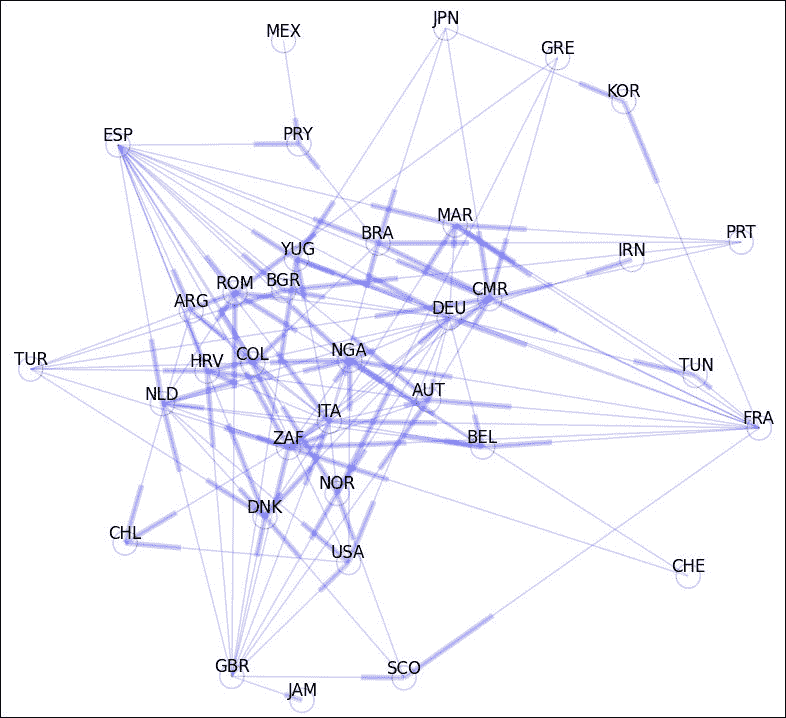

# 一、数值线性代数

术语“数值线性代数”是指使用矩阵来解决计算科学问题。 在本章中，我们首先学习如何在 Python 中有效地构造这些对象。 我们强调从在线存储库中导入大型稀疏矩阵。 然后，我们继续审查它们的基本操作和操作。 下一步是研究 SciPy 中实现的不同矩阵函数。 我们将继续探索矩阵方程解，特征值及其相应特征向量的计算的不同因式分解。

# 动机

下图显示了代表一系列网页（从 1 到 8）的图形：


从一个节点到另一个节点的箭头表示存在从发送节点代表的网页到接收节点代表页面的链接。 例如，从节点 **2** 到节点 **1** 的箭头表示网页 **2** 中有指向网页 **1** 的链接。请注意，网页 **4** 如何具有两个外部链接（至页面 **2** 和 **8**），并且有三个页面链接至网页 **4**（第 **2**，**6** 和 **7** 页）。 由节点 **2**，**4** 和 **8** 表示的页面乍一看似乎最受欢迎。

有没有一种数学方法可以真正表达网络在网络中的受欢迎程度？ Google 的研究人员提出了`PageRank`的想法，可以通过计算页面链接的数量和质量来大致估计该概念。 它是这样的：

*   我们以以下方式构造此图的过渡矩阵`T={a[i,j]}`：如果存在从网页`i`到网页`j`的链接，则条目`a[i,j]`为`1/k`，并且总数目为 网页`i`中的外部链接等于`k`。 否则，该条目仅为零。 `N`个网页的转换矩阵的大小始终为`N × N`。 在我们的例子中，矩阵的大小为`8×8`：

    ```py
     0  1/2  0   0    0   0   0   0
     1   0  1/2 1/2   0   0   0   0
     0   0   0   0    0   0  1/3  0
     0  1/2  0   0    0   1  1/3  0
     0   0  1/2  0    0   0   0   0
     0   0   0   0    0   0   0  1/2
     0   0   0   0   1/2  0   0  1/2
     0   0   0  1/2  1/2  0  1/3  0

    ```

让我们打开一个 iPython 会话并将此特定矩阵加载到内存中。

### 注意

请记住，在 Python 中，索引从零开始，而不是一个。

```py
In [1]: import numpy as np, matplotlib.pyplot as plt, \
 ...: scipy.linalg as spla, scipy.sparse as spsp, \
 ...: scipy.sparse.linalg as spspla
In [2]: np.set_printoptions(suppress=True, precision=3)
In [3]: cols = np.array([0,1,1,2,2,3,3,4,4,5,6,6,6,7,7]); \
 ...: rows = np.array([1,0,3,1,4,1,7,6,7,3,2,3,7,5,6]); \
 ...: data = np.array([1., 0.5, 0.5, 0.5, 0.5, \
 ...:                  0.5, 0.5, 0.5, 0.5, 1., \
 ...:                  1./3, 1./3, 1./3, 0.5, 0.5])
In [4]: T = np.zeros((8,8)); \
 ...: T[rows,cols] = data

```

从过渡矩阵，我们通过在 0 和 1 之间固定一个正常数`p`并按照公式来创建`PageRank`矩阵`G = (1-p) * T + p * B`以获得合适的阻尼系数`p`。 在此，`B`是具有与`T`相同大小的矩阵，其所有条目均等于`1/N`。 例如，如果我们选择`p = 0.15`，我们将获得以下`PageRank`矩阵：

```py
In [5]: G = (1-0.15) * T + 0.15/8; \
 ...: print G
[[ 0.019  0.444  0.019  0.019  0.019  0.019  0.019  0.019]
 [ 0.869  0.019  0.444  0.444  0.019  0.019  0.019  0.019]
 [ 0.019  0.019  0.019  0.019  0.019  0.019  0.302  0.019]
 [ 0.019  0.444  0.019  0.019  0.019  0.869  0.302  0.019]
 [ 0.019  0.019  0.444  0.019  0.019  0.019  0.019  0.019]
 [ 0.019  0.019  0.019  0.019  0.019  0.019  0.019  0.444]
 [ 0.019  0.019  0.019  0.019  0.444  0.019  0.019  0.444]
 [ 0.019  0.019  0.019  0.444  0.444  0.019  0.302  0.019]]

```

`PageRank`矩阵具有一些有趣的属性：

*   1 是复数一的特征值。
*   1 实际上是最大的特征值； 所有其他特征值的模量均小于 1。
*   对应于特征值 1 的特征向量具有所有正项。 特别地，对于特征值 1，存在一个唯一的特征向量，其项的总和等于 1。这就是我们所说的`PageRank`向量。

`scipy.linalg.eig`的快速计算为我们找到了特征向量：

```py
In [6]: eigenvalues, eigenvectors = spla.eig(G); \
 ...: print eigenvalues
[ 1.000+0.j    -0.655+0.j    -0.333+0.313j -0.333-0.313j –0.171+0.372j -0.171-0.372j  0.544+0.j     0.268+0.j   ]
In [7]: PageRank = eigenvectors[:,0]; \
 ...: PageRank /= sum(PageRank); \
 ...: print PageRank.real
[ 0.117  0.232  0.048  0.219  0.039  0.086  0.102  0.157]

```

这些值对应于图表上描述的八个网页中每个网页的`PageRank`。 如预期的那样，这些值的最大值与第二个网页（`0.232`）相关联，紧随其后的是第四个网页（`0.219`），然后是第八个网页（`0.157`）。 这些值向我们提供了我们正在寻找的信息：第二个网页最受欢迎，其次是第四个，然后是八个。

### 注意

请注意，此网页网络问题已被转换为数学对象，成为涉及矩阵，特征值和特征向量的等效问题，并已通过线性代数技术得以解决。

转换矩阵稀疏：其大多数条目为零。 在数值线性代数中，具有极大尺寸的稀疏矩阵特别重要，这不仅是因为它们编码具有挑战性的科学问题，而且还因为很难用基本算法来操纵它们。

与其将矩阵中的所有值存储到内存中，不如仅收集非零值，并使用利用这些智能存储方案的算法，这才有意义。 内存管理的好处是显而易见的。 这些方法通常对于此类矩阵更快，并且舍入误差较小，因为通常所涉及的运算要少得多。 这是 SciPy 的另一个优点，因为它包含许多程序来解决以这种方式存储数据的不同问题。 让我们通过另一个示例观察其力量：

佛罗里达大学稀疏矩阵集合是可在线访问的最大矩阵数据库。 截至 2014 年 1 月，它包含 157 组来自各种科学学科的矩阵。 矩阵的大小从非常小的（1×2）到非常大的（2800 万×2800 万）不等。 由于它们出现在不同的工程问题中，因此预计将不断添加更多的矩阵。

### 提示

有关此数据库的更多信息，请参见数学软件，第 1 卷，*。 T.A.，38，Issue 1，2011，pp 1：1-1：25 戴维斯（Davis）和 Y.Hu，或在[上在线访问 http://www.cise.ufl.edu/research/sparse/matrices/](http://www.cise.ufl.edu/research/sparse/matrices/) 。*

例如，数据库中矩阵最多的组是原始的 Harwell-Boeing Collection，具有 292 种不同的稀疏矩阵。 该组也可以在 Matrix Market 上在线访问： [http://math.nist.gov/MatrixMarket/](http://math.nist.gov/MatrixMarket/) 。

数据库中的每个矩阵都有三种格式：

*   **Matrix Market Exchange** 格式【Boisvert 等 1997】
*   **Rutherford-Boeing Exchange** 格式【Duff 等 1997】
*   **专有 Matlab** 格式`.mat`。

让我们从集合中以矩阵市场交易格式将两个矩阵导入到我们的 iPython 会话中，这两个矩阵打算用于最小二乘问题的解决方案。 这些矩阵位于 [www.cise.ufl.edu/research/sparse/matrices/Bydder/mri2.html](http://www.cise.ufl.edu/research/sparse/matrices/Bydder/mri2.html) 。这些数值对应于在 Sonata 1.5-T 扫描仪（Siemens，Erlangen）上获得的幻像数据。 ，德国）使用**磁共振图像处理**（ **MRI** ）设备。 被测物体是用几种金属物体制成的人体头部的模拟。 我们下载相应的 tar 捆绑包并将其解压缩以获取两个 ASCII 文件：

*   `mri2.mtx`（最小二乘问题中的主矩阵）
*   `mri2_b.mtx`（方程式的右侧）

文件`mri2.mtx`的前 20 行内容如下：


前十六行是注释，为我们提供了有关矩阵生成的一些信息。

*   出现的计算机视觉问题：MRI 重建
*   作者信息：UCSD 的 Mark Bydder
*   应用于数据的过程：解决最小二乘问题`Ax - b`，并对结果进行后可视化

第十七行指示矩阵的大小`63240`行×`147456`列，以及数据中的非零条目数`569160`。

文件的其余部分恰好包括 569160 行，每行包含两个整数和一个浮点数：这些是矩阵中非零元素的位置以及相应的值。

### 提示

我们需要考虑到这些文件使用 FORTRAN 约定，从 1 开始而不是从 0 开始数组。

将文件读入`ndarray`的一个好方法是通过 NumPy 中的函数`loadtxt`。 然后，我们可以使用`scipy`在模块`scipy.sparse`中使用函数`coo_matrix`将数组转换为稀疏矩阵（coo 代表坐标内部格式）。

```py
In [8]: rows, cols, data = np.loadtxt("mri2.mtx", skiprows=17, \
 ...:                               unpack=True)
In [9]: rows -= 1; cols -= 1;
In [10]: MRI2 = spsp.coo_matrix((data, (rows, cols)), \
 ....:                        shape=(63240,147456))

```

可视化此矩阵稀疏性的最佳方法是借助模块`matplotlib.pyplot`中的例程`spy`。

```py
In [11]: plt.spy(MRI2); \
 ....: plt.show()

```

我们获得以下图像。 每个像素对应于矩阵中的一个条目； 白色表示零值，非零值根据其大小（越大，越深）用不同的蓝色阴影表示：


这是第二个文件`mri2_b.mtx`的前十行，它不代表稀疏矩阵，而是列向量：

```py
%% MatrixMarket matrix array complex general
%-------------------------------------------------------------
% UF Sparse Matrix Collection, Tim Davis
% http://www.cise.ufl.edu/research/sparse/matrices/Bydder/mri2
% name: Bydder/mri2 : b matrix
%-------------------------------------------------------------
63240 1
-.07214859127998352 .037707749754190445
-.0729086771607399  .03763720765709877
-.07373382151126862 .03766685724258423

```

这是六条带信息的带注释的行，另外一行表示向量的形状（`63240`行和`1`列），其余各行包含两列浮点值，即浮点值的实部和虚部 相应的数据。 我们继续将这个向量读取到内存中，解决了建议的最小二乘问题，并获得了以下表示模拟人类头部切片的重构：

```py
In [12]: r_vals, i_vals = np.loadtxt("mri2_b.mtx", skiprows=7,
 ....:                             unpack=True)
In [13]: %time solution = spspla.lsqr(MRI2, r_vals + 1j*i_vals)
CPU times: user 4min 42s, sys: 1min 48s, total: 6min 30s
Wall time: 6min 30s
In [14]: from scipy.fftpack import fft2, fftshift
In [15]: img = solution[0].reshape(384,384); \
 ....: img = np.abs(fftshift(fft2(img)))
In [16]: plt.imshow(img); \
 ....: plt.show()

```


### 提示

如果对创建此矩阵背后的理论以及该问题的详细信息感兴趣，请阅读 H.Sedarat 和 D.G.Nishimura 撰写的文章*关于网格重构算法的最优性*，该文章发表于 IEEE Trans。 医学图像处理，第​​一卷。 19 号 4，第 306-317 页，2000 年。

对于结构良好的矩阵，这些矩阵将专门涉及矩阵乘法，通常可以用智能方式存储对象。 让我们考虑一个例子。

水平地震振荡会影响高层建筑的各个楼层，具体取决于楼层振荡的固有频率。 如果我们做出某些假设，可以通过竞争获得作为 *N* 微分方程的二阶系统的模型，该模型可以量化具有 *N* 层的建筑物的振动：牛顿第二力定律 设定为等于胡克力定律和地震波产生的外力之和。

这些是我们将需要的假设：

*   每个楼层都被视为位于其质量中心的质量点。 楼层有质量`m[1], m[2], ..., m[N]`。
*   每个楼层都通过线性恢复力（胡克`-k * elongation`）恢复到其平衡位置。 楼层的胡克常数为`k[1], k[2], ..., k[N]`。
*   表示楼层振动的质量的位置是`x[1], x[2], ..., x[N]`。 我们假设它们都是时间函数，并且在平衡时，它们都等于零。
*   为了简化说明，我们将假设没有摩擦：楼层上的所有阻尼效果都将被忽略。
*   楼层的方程式仅取决于相邻楼层。

将质量矩阵`M`设置为对角矩阵，在其对角线上包含地板质量。 将`K`（胡克矩阵）设置为具有以下结构的三对角矩阵，对于`j`每行，除以下各项外，所有条目均为零：

*   `j-1`列（我们将其设置为`k[j+1]`）
*   `j`列（我们设置为`-k[j+1]-k[j+1]`），以及
*   列`j+1`，我们将其设置为`k[j+2]`。

将`H`设置为包含地震引起的各层外力的列向量，将`X`设置为包含函数`x[j]`的列向量。

然后我们有了系统：`M * X''= K * X + H`。 该系统的齐次部分是`M`与`K`的倒数的乘积，我们将其表示为`A`。

为了解决齐次线性二阶系统`X''= A * X`，我们定义变量`Y`包含`2 * N`项：所有`N`函数`x[j]`，然后是它们的派生词`x'[j]`。 该二阶线性系统的任何解都具有一阶线性系统的相应解`Y'= C * Y`，其中`C`是大小为`2 * N×2 * N`的块矩阵 。 此矩阵`C`由大小为`N × N`的仅包含零的块组成，其后为单位（大小为`N × N`），并且在这两个下方，矩阵`A`在水平方向后跟另一个`N×N`零块。

不必将此矩阵`C`存储到内存或其任何因素或块中。 相反，我们将利用其结构，并使用线性运算符来表示它。 然后需要最少的数据来生成该运算符（仅质量值和胡克系数），远小于其任何矩阵表示形式。

让我们展示一个六层楼的具体例子。 我们首先指出它们的质量和胡克常数，然后继续构建`A`的表示形式为线性算子：

```py
In [17]: m = np.array([56., 56., 56., 54., 54., 53.]); \
 ....: k = np.array([561., 562., 560., 541., 542., 530.])
In [18]: def Axv(v):
 ....:     global k, m
 ....:     w = v.copy()
 ....:     w[0] = (k[1]*v[1] - (k[0]+k[1])*v[0])/m[0]
 ....:     for j in range(1, len(v)-1):
 ....:         w[j] = k[j]*v[j-1] + k[j+1]*v[j+1] - \
 ....:                (k[j]+k[j+1])*v[j]
 ....:         w[j] /= m[j]
 ....:     w[-1] = k[-1]*(v[-2]-v[-1])/m[-1]
 ....:     return w
 ....:
In [19]: A = spspla.LinearOperator((6,6), matvec=Axv, matmat=Axv,
 ....:                           dtype=np.float64)

```

现在`C`的结构非常简单（比其矩阵要简单得多！）：

```py
In [20]: def Cxv(v):
 ....:     n = len(v)/2
 ....:     w = v.copy()
 ....:     w[:n] = v[n:]
 ....:     w[n:] = A * v[:n]
 ....:     return w
 ....:
In [21]: C = spspla.LinearOperator((12,12), matvec=Cxv, matmat=Cxv,
 ....:                           dtype=np.float64)

```

这个齐次系统的解以`C`的指数作用形式出现：`Y(t) = expm(C * t) * Y(0)`，其中`expm()`表示矩阵指数函数。 在 SciPy 中，使用模块`scipy.sparse.linalg`中的例程`expm_multiply`执行此操作。

例如，在我们的情况下，给定包含值`x[1](0)=0, ..., x[N](0)=0, x'[1](0)=1, ..., x'[N](0)=1`的初始值，如果我们需要以大小`0.1`为步长在 0 和 1 之间的`t`值求解`Y(t)`，则可以发出以下命令：

### 提示

据报道，在某些安装中，在下一步中，必须给出 C 的矩阵，而不是实际的线性算子（因此与手册相矛盾）。 如果在您的系统中是这种情况，只需将下一行中的 C 更改为其矩阵表示即可。

```py
In [22]: initial_condition = np.zeros(12); \
 ....: initial_condition[6:] = 1
In [23]: Y = spspla.exp_multiply(C, np.zeros(12), start=0,
 ....:                         stop=1, num=10)

```

然后可以计算出第一层中六层的振动，并绘制出曲线图。 例如，要查看一楼的振荡情况，我们可以发出以下命令：

```py
In [24]: plt.plot(np.linspace(0,1,10), Y[:,0]); \
 ....: plt.xlabel('time (in seconds)'); \
 ....: plt.ylabel('oscillation')

```

我们获得以下图。 请注意，第一层如何在第一十分之一秒内上升，但从原来的高度从 0.1 秒下降到 0.9 秒，几乎下降到一米以下，然后开始缓慢上升：


### 提示

有关微分方程系统以及如何使用指数函数求解它们的更多详细信息，请阅读例如《 HTHT0]基本微分方程》第 10 版。 ，由 William E. Boyce 和 Richard C. DiPrima 撰写。 威利（Wiley），2012 年。

这三个示例说明了第一章“数值线性代数”的目标。 在 Python 中，这首先要通过以下任何类将数据存储为矩阵形式或作为相关的线性运算符来实现：

*   `numpy.ndarray`（确保它们是二维的）
*   `numpy.matrix`
*   `scipy.sparse.bsr_matrix`（块稀疏行矩阵）
*   `scipy.sparse.coo_matrix`（坐标格式的稀疏矩阵）
*   `scipy.sparse.csc_matrix`（压缩的稀疏列矩阵）
*   `scipy.sparse.csr_matrix`（压缩的稀疏行矩阵）
*   `scipy.sparse.dia_matrix`（带有对角存储的稀疏矩阵）
*   `scipy.sparse.dok_matrix`（基于字典的稀疏矩阵）
*   `scipy.sparse.lil_matrix`（基于链表的稀疏矩阵）
*   `scipy.sparse.linalg.LinearOperator`

正如我们在示例中所看到的，不同类的选择主要遵循数据的稀疏性以及我们将应用于它们的算法。

### 提示

在以下各节中，我们将学习何时应用这些选择。

然后，该选择决定了我们用于不同算法的模块：`scipy.linalg`用于通用矩阵，而`scipy.sparse`和`scipy.sparse.linalg`都用于稀疏矩阵或线性运算符。 这三个 SciPy 模块是在高度优化的计算机库 BLAS（用 Fortran77 编写），LAPACK（在 Fortran90 中编写），ARPACK（在 Fortran77 中）和 SuperLU（在 C 中）的基础上编译的。

### 注意

为了更好地理解这些基础软件包，请阅读其创建者的描述和文档：

*   **BLAS**： [netlib.org/blas/faq.html](http://netlib.org/blas/faq.html)
*   **LAPACK**： [netlib.org/lapack/lapack-3.2.html](http://netlib.org/lapack/lapack-3.2.html)
*   **ARPACK**： [www.caam.rice.edu/software/ARPACK/](http://www.caam.rice.edu/software/ARPACK/)
*   **SuperLU**： [crd-legacy.lbl.gov/~xiaoye/SuperLU/](http://crd-legacy.lbl.gov/~xiaoye/SuperLU/)

这三个 SciPy 模块中的大多数例程都是上述库中函数的包装。 如果我们愿意，我们还可以直接调用基础函数。 在`scipy.linalg`模块中，我们具有以下内容：

*   `scipy.linalg.get_blas_funcs`从 BLAS 调用例程
*   `scipy.linalg.get_lapack_funcs`从 LAPACK 调用例程

例如，如果我们要使用`BLAS`函数`NRM2`计算 Frobenius 范数：

```py
In [25]: blas_norm = spla.get_blas_func('nrm2')
In [26]: blas_norm(np.float32([1e20]))
Out[26]: 1.0000000200408773e+20

```

# 创建矩阵和线性算子

在本章的第一部分中，我们将专注于有效创建矩阵。 我们首先回顾一些不同的方法来构造基本矩阵作为`ndarray`实例类，包括对 NumPy 和 SciPy 中已经包含的所有特殊矩阵的枚举。 我们继续研究从基本矩阵构造复杂矩阵的可能性。 我们在`matrix`实例类中回顾了相同的概念。 接下来，我们详细探讨输入稀疏矩阵的不同方法。 我们以线性算子的构造结束本节。

### 注意

我们假定您熟悉 NumPy 中的`ndarray`创建以及数据类型（dtype），索引，两个或多个数组组合的例程，数组操作或从这些对象中提取信息。 在本章中，我们将重点介绍仅对矩阵有意义的函数，方法和例程。 如果它们的输出没有转换为线性代数等价物，我们将不考虑其运算。 有关`ndarray`的入门知识，建议您浏览《数值科学计算学习》第二版的第二章。 为了快速回顾线性代数，我们推荐 Hoffman 和 Kunze，《线性代数第二版》，*Pearson*，1971 年。

## 在 ndarray 类中构造矩阵

我们可以通过三种不同的方式从作为`ndarray`实例的数据创建矩阵：从标准输入手动创建，通过为每个条目分配函数值或通过从外部文件检索数据来创建矩阵。

<colgroup><col> <col></colgroup> 
| 

建设者

 | 

描述

 |
| --- | --- |
| `numpy.array(object)` | 从`object`创建矩阵 |
| `numpy.diag(arr, k)` | 在对角线`k`上创建数组`arr`的条目的对角矩阵 |
| `numpy.fromfunction(function, shape)` | 通过在每个坐标上执行函数来创建矩阵 |
| `numpy.fromfile(fname)` | 从文本或二进制文件创建矩阵（基本） |
| `numpy.loadtxt(fname)` | 从文本文件创建矩阵（高级） |

让我们创建一些示例矩阵来说明上表中定义的一些函数。 和以前一样，我们开始一个 iPython 会话：

```py
In [1]: import numpy as np, matplotlib.pyplot as plt, \
 ...: scipy.linalg as spla, scipy.sparse as spsp, \
 ...: scipy.sparse.linalg as spspla
In [2]: A = np.array([[1,2],[4,16]]); \...: A
Out[2]:
array([[ 1,  2],
 [ 4, 16]])
In [3]: B = np.fromfunction(lambda i,j: (i-1)*(j+1),
 ...:                     (3,2), dtype=int); \
 ...: print B
 ...:
 [[-1 -2]
 [ 0  0]
 [ 1  2]]
In [4]: np.diag((1j,4))
Out[4]:
array([[ 0.+1.j,  0.+0.j],
 [ 0.+0.j,  4.+0.j]])

```

具有预定零和一的特殊矩阵可以使用以下函数构造：

<colgroup><col> <col></colgroup> 
| 

建设者

 | 

描述

 |
| --- | --- |
| `numpy.empty(shape)` | 给定形状的数组，条目未初始化 |
| `numpy.eye(N, M, k)` | 二维数组，对角线为`k - 1`，其他位置为零 |
| `numpy.identity(n)` | 身份阵列 |
| `numpy.ones(shape)` | 所有条目等于 1 的数组 |
| `numpy.zeros(shape)` | 所有条目等于零的数组 |
| `numpy.tri(N, M, k)` | 在给定对角线处及以下的数组，否则为零 |

### 提示

除了`numpy.tri`以外，所有这些构造都具有一个伴随函数`xxx_like`，该函数创建具有所请求特征且具有与另一个源`ndarray`类相同的形状和数据类型的`ndarray`：

```py
In [5]: np.empty_like(A)
Out[5]:
array([[140567774850560, 140567774850560],
 [     4411734640, 562954363882576]])

```

值得注意的是构造为数值范围的数组。

<colgroup><col> <col></colgroup> 
| 

建设者

 | 

描述

 |
| --- | --- |
| `numpy.arange(stop)` | 间隔内的均等值 |
| `numpy.linspace(start, stop)` | 在一定间隔内均匀间隔的数字 |
| `numpy.logspace(start, stop)` | 对数刻度上等距的数字 |
| `numpy.meshgrid` | 来自两个或多个坐标向量的坐标矩阵 |
| `numpy.mgrid` | `nd_grid`实例返回密集多维`meshgrid` |
| `numpy.ogrid` | `nd_grid`实例返回开放的多维`meshgrid` |

可以在 NumPy 和模块`scipy.linalg`中轻松调用在线性代数中具有众多应用的特殊矩阵。

<colgroup><col> <col></colgroup> 
| 

建设者

 | 

描述

 |
| --- | --- |
| `scipy.linalg.circulant(arr)` | 一维数组`arr`生成的循环矩阵 |
| `scipy.linalg.companion(arr)` | `arr`编码的多项式的伴随矩阵 |
| `scipy.linalg.hadamard(n)` | Sylvester 构造大小为`n × n`的 Hadamard 矩阵。`n`必须为 2 的幂 |
| `scipy.linalg.hankel(arr1, arr2)` | 第一列为`arr1`，最后一列为`arr2`的汉克矩阵 |
| `scipy.linalg.hilbert(n)` | 大小为`n × n`的希尔伯特矩阵 |
| `scipy.linalg.invhilbert(n)` | `n × n`大小的希尔伯特矩阵的逆 |
| `scipy.linalg.leslie(arr1, arr2)` | 具有繁殖力数组`arr1`和生存系数`arr2`的莱斯利矩阵 |
| `scipy.linalg.pascal(n)` | `n × n`截断了二项式系数的 Pascal 矩阵 |
| `scipy.linalg.toeplitz(arr1, arr2)` | 第一列`arr1`和第一行`arr2`的 Toeplitz 数组 |
| `numpy.vander(arr)` | 数组`arr`的范德蒙德矩阵 |

例如，一种获得所有数量级的最大二项式系数（对应的帕斯卡三角形）的快速方法是借助精确的帕斯卡矩阵。 下面的示例显示如何计算这些系数，直到`13`为止：

```py
In [6]: print spla.pascal(13, kind='lower')

```


除了这些基本的构造函数之外，我们始终可以以不同的方式堆叠数组：

<colgroup><col> <col></colgroup> 
| 

建设者

 | 

描述

 |
| --- | --- |
| `numpy.concatenate((A1, A2, ...))` | 结合矩阵 |
| `numpy.hstack((A1, A2, ...))` | 水平堆叠矩阵 |
| `numpy.vstack((A1, A2, ...))` | 垂直堆叠矩阵 |
| `numpy.tile(A, reps)` | 重复矩阵一定次数（由`reps`决定） |
| `scipy.linalg.block_diag(A1,A2, ...)` | 创建块对角线数组 |

让我们观察一下其中的一些构造函数：

```py
In [7]: np.tile(A, (2,3))   # 2 rows, 3 columns
Out[7]:
array([[ 1,  2,  1,  2,  1,  2],
 [ 4, 16,  4, 16,  4, 16],
 [ 1,  2,  1,  2,  1,  2],
 [ 4, 16,  4, 16,  4, 16]])
In [8]: spla.block_diag(A,B)
Out[8]:
array([[ 1,  2,  0,  0],
 [ 4, 16,  0,  0],
 [ 0,  0, -1, -2],
 [ 0,  0,  0,  0],
 [ 0,  0,  1,  2]])

```

## 在矩阵类中构造矩阵

对于`matrix`类，直接创建矩阵的通常方法是调用`numpy.mat`或`numpy.matrix`。 在创建类似于`A`的矩阵时，请观察`numpy.matrix`的语法比`numpy.array`的语法舒适得多。 使用此语法，用逗号分隔的不同值属于矩阵的同一行。 分号表示行的更改。 还要注意强制转换为`matrix`类！

```py
In [9]: C = np.matrix('1,2;4,16'); \
 ...: C
Out[9]:
matrix([[ 1,  2],
 [ 4, 16]])

```

这两个功能还将任何`ndarray`转换为`matrix`。 第三个功能可以完成此任务：`numpy.asmatrix`：

```py
In [10]: np.asmatrix(A)
Out[10]:
matrix([[ 1,  2],
 [ 4, 16]])

```

对于由块组成的矩阵的排列，除了前面描述的`ndarray`的常见堆栈操作外，我们还具有非常方便的功能`numpy.bmat`。 请注意与`numpy.matrix`的语法相似，尤其是使用逗号表示水平串联，使用分号表示垂直串联：

```py
In [11]: np.bmat('A;B')        In [12]: np.bmat('A,C;C,A')
Out[11]:                       Out[12]:
matrix([[ 1,  2],              matrix([[ 1,  2,  1,  2],
 [ 4, 16],                      [ 4, 16,  4, 16],
 [-1, -2],                      [ 1,  2,  1,  2],
 [ 0,  0],                      [ 4, 16,  4, 16]])
 [ 1,  2]])

```

## 构造稀疏矩阵

有七种输入稀疏矩阵的方法。 每种格式旨在使特定问题或操作更有效。 让我们详细了解一下它们：

<colgroup><col> <col> <col></colgroup> 
| 

方法

 | 

Name

 | 

最佳使用

 |
| --- | --- | --- |
| `BSR` | 块稀疏行 | 如果矩阵包含块，则为高效算术。 |
| `COO` | 坐标 | 快速高效的施工格式。 转换为 CSC 和 CSR 格式的有效方法。 |
| `CSC` | 压缩稀疏柱 | 高效的矩阵算法和列切片。 矩阵向量乘积相对快。 |
| `CSR` | 压缩稀疏行 | 高效的矩阵算法和行切片。 执行矩阵向量乘积最快。 |
| `DIA` | 对角线存储 | 如果矩阵包含非零项的长对角线，则对于构造和存储有效。 |
| `DOK` | 钥匙字典 | 高效的增量构造和单个矩阵条目的访问。 |
| `LIL` | 基于行的链接列表 | 切片灵活。 有效更改矩阵稀疏度。 |

最多可以用五种方式填充它们，每种稀疏矩阵格式中共有三种：

*   它们可以强制转换为稀疏任何通用矩阵。 `lil`格式是使用此方法最有效的方法：

    ```py
    In [13]: A_coo = spsp.coo_matrix(A); \
     ....: A_lil = spsp.lil_matrix(A)

    ```

*   它们可以将另一种稀疏格式的另一种稀疏矩阵转换为特定的稀疏格式：

    ```py
    In [14]: A_csr = spsp.csr_matrix(A_coo)

    ```

*   可以通过指示形状和`dtype`来构造任意形状的空稀疏矩阵：

    ```py
    In [15]: M_bsr = spsp.bsr_matrix((100,100), dtype=int)

    ```

它们都有几种不同的额外输入法，每种输入法都特定于其存储格式。

*   **花式索引**：就像处理任何通用矩阵一样。 这仅适用于 LIL 或 DOK 格式：

    ```py
    In [16]: M_lil = spsp.lil_matrix((100,100), dtype=int)
    In [17]: M_lil[25:75, 25:75] = 1
    In [18]: M_bsr[25:75, 25:75] = 1
    NotImplementedError    Traceback (most recent call last)
    <ipython-input-18-d9fa1001cab8> in <module>()
    ----> 1 M_bsr[25:75, 25:75] = 1
    [...]/scipy/sparse/bsr.pyc in __setitem__(self, key, val)
     297
     298     def __setitem__(self,key,val):
    --> 299         raise NotImplementedError
     300
     301     ######################
    NotImplementedError:

    ```

*   **键字典**：当我们一次创建，更新或搜索每个元素时，此输入系统最有效。 它仅对 LIL 和 DOK 格式有效：

    ```py
    In [19]: M_dok = spsp.dok_matrix((100,100), dtype=int)
    In [20]: position = lambda i, j: ((i<j) & ((i+j)%10==0))
    In [21]: for i in range(100):
     ....:     for j in range(100):
     ....:         M_dok[i,j] = position(i,j)
     ....:

    ```

*   **Data, rows, and columns**: This is common to four formats: BSR, COO, CSC, and CSR. This is the method of choice to import sparse matrices from the **Matrix Market Exchange** format, as illustrated at the beginning of the chapter.

    ### 提示

    使用数据，行和列输入法时，最好在构造中始终包含选项`shape`。 如果未提供此值，将从行和列的最大坐标中推断出矩阵的大小，从而可能导致矩阵的大小小于所需的大小。

*   **Data, indices, and pointers**: This is common to three formats: BSR, CSC, and CSR. It is the method of choice to import sparse matrices from the Rutherford-Boeing Exchange format.

    ### 注意

    Rutherford-Boeing Exchange 格式是 Harwell-Boeing 格式的更新版本。 它将矩阵存储为三个向量：`pointers_v`，`indices_v`和`data`。 `j`列的条目的行索引位于向量`indices_v`的位置`pointers_v(j)`至`pointers_v(j+1)-1`中。 矩阵的相应值在矢量数据中位于相同位置。

让我们以示例方式展示如何读取卢瑟福-波音矩阵交换格式`Pajek/football`中的有趣矩阵。 可以在 [www.cise.ufl.edu/research/sparse/matrices/Pajek/football.html](http://www.cise.ufl.edu/research/sparse/matrices/Pajek/football.html) 的集合中找到具有 118 个非零条目的 35×35 矩阵。

它是参加 1998 年法国举办的 FIFA 世界杯的所有国家橄榄球队的网络的邻接矩阵。网络中的每个节点代表一个国家（或国家橄榄球队），并且链接显示哪个国家向另一个国家输出了球员 国家。

这是`football.rb`文件的打印输出：


文件的头（前四行）包含重要信息：

*   第一行为我们提供了矩阵标题`Pajek/football; 1998; L. Krempel; ed: V. Batagelj`和用于识别目的的数字键`MTRXID=1474`。
*   第二行包含四个整数值：`TOTCRD=12`（在标头之后包含有效数据的行；请参见[24]），`PTRCRD=2`（包含指针数据的行数），`INDCRD=5`（包含索引数据的行数） 和`VALCRD=2`（包含矩阵非零值的行数）。 请注意，它必须为`TOTCRD = PTRCRD + INDCRD + VALCRD`。
*   第三行表示矩阵类型`MXTYPE=(iua)`，在这种情况下，它代表整数矩阵，不对称的压缩列形式。 它还指示行数和列数（`NROW=35`，`NCOL=35`），以及非零条目的数量（`NNZERO=118`）。 对于压缩列格式，不使用最后一个条目，通常将其设置为零。
*   第四列包含以下各列中数据的 Fortran 格式。 指针为`PTRFMT=(20I4)`，索引为`INDFMT=(26I3)`，非零值为`VALFMT=(26I3)`。

我们继续打开文件进行读取，将头文件后的每一行存储在 Python 列表中，并从文件的相关行中提取填充矢量`indptr`，`indices`和`data`所需的数据 。 我们首先使用`data`，`indices`和`pointers`方法创建对应的 CSR 格式的稀疏矩阵`football`：

```py
In [22]: f = open("football.rb", 'r'); \
 ....: football_list = list(f); \
 ....: f.close()
In [23]: football_data = np.array([])
In [24]: for line in range(4, 4+12):
 ....:     newdata = np.fromstring(football_list[line], sep=" ")
 ....:     football_data = np.append(football_data, newdata)
 ....:
In [25]: indptr = football_data[:35+1] - 1; \
 ....: indices = football_data[35+1:35+1+118] - 1; \
 ....: data = football_data[35+1+118:]
In [26]: football = spsp.csr_matrix((data, indices, indptr),
 ....:                            shape=(35,35))

```

此时，可以借助名为`networkx`的 Python 模块将网络及其关联的图形可视化。 我们获得下图，描绘了不同国家的节点。 节点之间的每个箭头表示原始国家/地区已将玩家出口到接收国：

### 注意

`networkx`是用于处理复杂网络的 Python 模块。 有关更多信息，请访问其在 [networkx.github.io](http://networkx.github.io) 上的 Github 项目页面。

一种完成此任务的方法如下：

```py
In [27]: import networkx
In [28]: G = networkx.DiGraph(football)
In [29]: f = open("football_nodename.txt"); \
 ....: m = list(f); \
 ....: f.close()
In [30]: def rename(x): return m[x]
In [31]: G = networkx.relabel_nodes(G, rename)
In [32]: pos = networkx.spring_layout(G) 
In [33]: networkx.draw_networkx(G, pos, alpha=0.2, node_color='w',
 ....:                        edge_color='b')

```



模块`scipy.sparse`从 NumPy 借鉴了一些有趣的概念来创建构造函数和特殊矩阵：

<colgroup><col> <col></colgroup> 
| 

建设者

 | 

描述

 |
| --- | --- |
| `scipy.sparse.diags(diagonals, offsets)` | 对角线的稀疏矩阵 |
| `scipy.sparse.rand(m, n, density)` | 指定密度的随机稀疏矩阵 |
| `scipy.sparse.eye(m)` | 主对角线中带有 1 的稀疏矩阵 |
| `scipy.sparse.identity(n)` | `n × n`大小的身份稀疏矩阵 |

函数`diags`和`rand`都应通过示例说明其语法。 我们将从具有两个对角线的大小为 14×14 的稀疏矩阵开始：主对角线包含 1s，下面的对角线包含 2s。 我们还创建了一个具有函数`scipy.sparse.rand`的随机矩阵。 此矩阵的大小为 5×5，具有 25％的非零元素（`density=0.25`），并且采用 LIL 格式制作：

```py
In [34]: diagonals = [[1]*14, [2]*13]
In [35]: print spsp.diags(diagonals, [0,-1]).todense()
[[ 1\.  0\.  0\.  0\.  0\.  0\.  0\.  0\.  0\.  0\.  0\.  0\.  0\.  0.]
 [ 2\.  1\.  0\.  0\.  0\.  0\.  0\.  0\.  0\.  0\.  0\.  0\.  0\.  0.]
 [ 0\.  2\.  1\.  0\.  0\.  0\.  0\.  0\.  0\.  0\.  0\.  0\.  0\.  0.]
 [ 0\.  0\.  2\.  1\.  0\.  0\.  0\.  0\.  0\.  0\.  0\.  0\.  0\.  0.]
 [ 0\.  0\.  0\.  2\.  1\.  0\.  0\.  0\.  0\.  0\.  0\.  0\.  0\.  0.]
 [ 0\.  0\.  0\.  0\.  2\.  1\.  0\.  0\.  0\.  0\.  0\.  0\.  0\.  0.]
 [ 0\.  0\.  0\.  0\.  0\.  2\.  1\.  0\.  0\.  0\.  0\.  0\.  0\.  0.]
 [ 0\.  0\.  0\.  0\.  0\.  0\.  2\.  1\.  0\.  0\.  0\.  0\.  0\.  0.]
 [ 0\.  0\.  0\.  0\.  0\.  0\.  0\.  2\.  1\.  0\.  0\.  0\.  0\.  0.]
 [ 0\.  0\.  0\.  0\.  0\.  0\.  0\.  0\.  2\.  1\.  0\.  0\.  0\.  0.]
 [ 0\.  0\.  0\.  0\.  0\.  0\.  0\.  0\.  0\.  2\.  1\.  0\.  0\.  0.]
 [ 0\.  0\.  0\.  0\.  0\.  0\.  0\.  0\.  0\.  0\.  2\.  1\.  0\.  0.]
 [ 0\.  0\.  0\.  0\.  0\.  0\.  0\.  0\.  0\.  0\.  0\.  2\.  1\.  0.]
 [ 0\.  0\.  0\.  0\.  0\.  0\.  0\.  0\.  0\.  0\.  0\.  0\.  2\.  1.]]
In [36]: S_25_lil = spsp.rand(5, 5, density=0.25, format='lil')
In [37]: S_25_lil
Out[37]:
<5x5 sparse matrix of type '<type 'numpy.float64'>'
 with 6 stored elements in LInked List format>
In [38]: print S_25_lil
 (0, 0)    0.186663044982
 (1, 0)    0.127636181284
 (1, 4)    0.918284870518
 (3, 2)    0.458768884701
 (3, 3)    0.533573291684
 (4, 3)    0.908751420065
In [39]: print S_25_lil.todense()
[[ 0.18666304  0\.          0\.          0\.          0\.        ]
 [ 0.12763618  0\.          0\.          0\.          0.91828487]
 [ 0\.          0\.          0\.          0\.          0\.        ]
 [ 0\.          0\.          0.45876888  0.53357329  0\.        ]
 [ 0\.          0\.          0\.          0.90875142  0\.        ]]

```

与我们组合`ndarray`实例的方式类似，我们有一些巧妙的方式来组合稀疏矩阵以构造更复杂的对象：

<colgroup><col> <col></colgroup> 
| 

建设者

 | 

描述

 |
| --- | --- |
| `scipy.sparse.bmat(blocks)` | 稀疏子块的稀疏矩阵 |
| `scipy.sparse.hstack(blocks)` | 水平堆叠稀疏矩阵 |
| `scipy.sparse.vstack(blocks)` | 垂直堆叠稀疏矩阵 |

## 线性算子

线性运算符基本上是一个函数，该函数通过将输入与矩阵进行左乘法运算，将一列向量作为输入并输出另一个列向量。 尽管从技术上讲，我们可以仅通过处理相应的矩阵来表示这些对象，但还有更好的方法可以做到这一点。

<colgroup><col> <col></colgroup> 
| 

建设者

 | 

描述

 |
| --- | --- |
| `scipy.sparse.linalg.LinearOperator(shape, matvec)` | 执行矩阵向量乘积的通用接口 |
| `scipy.sparse.linalg.aslinearoperator(A)` | 将`A`返回为`LinearOperator` |

在`scipy.sparse.linalg`模块中，我们有一个处理这些对象的公共接口：`LinearOperator`类。 此类仅具有以下两个属性和三个方法：

*   `shape`：表示矩阵的形状
*   `dtype`：矩阵的数据类型
*   `matvec`：执行矩阵与向量的乘法
*   `rmatvec`：通过矩阵与向量的共轭转置来进行乘法
*   `matmat`：执行一个矩阵与另一个矩阵的乘法

通过示例可以最好地说明其用法。 考虑两个函数，它们分别使用大小为 3 的向量和大小为 4 的输出向量，并分别与两个各自大小为 4×3 的矩阵相乘。我们可以很好地用 lambda 谓词定义这些函数：

```py
In [40]: H1 = np.matrix("1,3,5; 2,4,6; 6,4,2; 5,3,1"); \
 ....: H2 = np.matrix("1,2,3; 1,3,2; 2,1,3; 2,3,1")
In [41]: L1 = lambda x: H1.dot(x); \
 ....: L2 = lambda x: H2.dot(x)
In [42]: print L1(np.ones(3))
[[  9\.  12\.  12\.   9.]]
In [43]: print L2(np.tri(3,3))
 [[ 6\.  5\.  3.]
 [ 6\.  5\.  2.]
 [ 6\.  4\.  3.]
 [ 6\.  4\.  1.]]

```

现在，当我们尝试对这两个函数进行加/减或将它们中的任何一个乘以标量时，就会出现一个问题。 从技术上讲，它应该像加/减相应的矩阵，或将它们乘以任意数字，然后再次执行所需的左乘法一样简单。 但事实并非如此。

例如，我们想写`(L1+L2)(v)`而不是`L1(v) + L2(v)`。 不幸的是，这样做会引发错误：

```py
TypeError: unsupported operand type(s) for +: 'function' and 
'function'

```

相反，我们可以实例化相应的线性运算符并按如下方式随意对其进行操作：

```py
In [44]: Lo1 = spspla.aslinearoperator(H1); \
 ....: Lo2 = spspla.aslinearoperator(H2)
In [45]: Lo1 - 6 * Lo2
Out[45]: <4x3 _SumLinearOperator with dtype=float64>
In [46]: print Lo1 * np.ones(3)
[  9\.  12\.  12\.  9.]
In [47]: print (Lo1-6*Lo2) * np.tri(3,3)
[[-27\. -22\. -13.]
 [-24\. -20\.  -6.]
 [-24\. -18\. -16.]
 [-27\. -20\.  -5.]]

```

当描述具有相关矩阵的产品所需的信息量少于存储矩阵的非零元素所需的内存量时，线性运算符是一个很大的优势。

例如，置换矩阵是平方二进制矩阵（一和零），在每一行和每一列中只有一个条目。 考虑一个由大小为 512×512 的四个块组成的大排列矩阵，例如 1024×1024：一个零块，水平跟随一个标识块，在一个标识块的顶部，水平跟随一个另一个零块。 我们可以通过三种不同的方式存储此矩阵：

```py
In [47]: P_sparse = spsp.diags([[1]*512, [1]*512], [512,-512], \
 ....:                       dtype=int)
In [48]: P_dense = P_sparse.todense()
In [49]: mv = lambda v: np.roll(v, len(v)/2)
In [50]: P_lo = spspla.LinearOperator((1024,1024), matvec=mv, \
 ....:                              matmat=mv, dtype=int)

```

在稀疏情况下`P_sparse`，我们可以将其视为仅存储 1024 个整数。 在密集情况下`P_dense`，我们在技术上存储 1048576 整数值。 对于线性算子，实际上看起来我们没有存储任何东西！ 指示如何执行乘法的函数`mv`的占用空间比任何相关矩阵小得多。 这也反映在执行与这些对象的乘法的时间上：

```py
In [51]: %timeit P_sparse * np.ones(1024)
10000 loops, best of 3: 29.7 µs per loop
In [52]: %timeit P_dense.dot(np.ones(1024))
100 loops, best of 3: 6.07 ms per loop
In [53]: %timeit P_lo * np.ones(1024)
10000 loops, best of 3: 25.4 µs per loop

```

# 基本矩阵处理

本章第二部分的重点是掌握以下操作：

*   标量乘法，矩阵加法和矩阵乘法
*   痕迹和决定因素
*   转置和反转
*   规范和条件编号

## 标量乘法，矩阵加法和矩阵乘法

让我们从`ndarray`类存储的矩阵开始。 我们使用`*`运算符完成标量乘法，并使用`+`运算符完成矩阵加法。 但是对于矩阵乘法，我们将需要实例方法`dot()`或`numpy.dot`函数，因为运算符`*`保留用于逐元素乘法：

```py
In [54]: 2*A
Out[54]:
array([[ 2,  4],
 [ 8, 32]])
In [55]: A + 2*A
Out[55]:
array([[ 3,  6],
 [12, 48]])
In [56]: A.dot(2*A)       In [56]: np.dot(A, 2*A)
Out[56]:                  Out[56]:
array([[ 18,  68],        array([[ 18,  68],
 [136, 528]])              [136, 528]])
In [57]: A.dot(B)
ValueError: objects are not aligned
In [58]: B.dot(A)         In [58]: np.dot(B, A)
Out[58]:                  Out[58]:
array([[ -9, -34],        array([[ -9, -34],
 [  0,   0],               [  0,   0],
 [  9,  34]])              [  9,  34]])

```

矩阵类使矩阵乘法更加直观：可以使用运算符`*`代替`dot()`方法。 还要注意不同实例类`ndarray`与矩阵之间的矩阵乘法如何始终强制转换为`matrix`实例类：

```py
In [59]: C * B
ValueError: shapes (2,2) and (3,2) not aligned: 2 (dim 1) != 3 (dim 0)
In [60]: B * C
Out[60]: 
matrix([[ -9, -34],
 [  0,   0],
 [  9,  34]])

```

对于稀疏矩阵，即使两个稀疏类都不相同，标量乘法和加法也可以与明显的运算符一起很好地工作。 注意每个操作后的结果类转换：

```py
In [61]: S_10_coo = spsp.rand(5, 5, density=0.1, format='coo')
In [62]: S_25_lil + S_10_coo
Out[62]: <5x5 sparse matrix of type '<type 'numpy.float64'>'
 with 8 stored elements in Compressed Sparse Row format>
In [63]: S_25_lil * S_10_coo
Out[63]: <5x5 sparse matrix of type '<type 'numpy.float64'>'
 with 4 stored elements in Compressed Sparse Row format>

```

### 提示

`numpy.dot`不适用于稀疏矩阵与泛型的矩阵乘法。 我们必须改用运算符`*`。

```py
In [64]: S_100_coo = spsp.rand(2, 2, density=1, format='coo')
In [65]: np.dot(A, S_100_coo)
Out[66]:
array([[ <2x2 sparse matrix of type '<type 'numpy.float64'>'
 with 4 stored elements in COOrdinate format>,
 <2x2 sparse matrix of type '<type 'numpy.float64'>'
 with 4 stored elements in COOrdinate format>],
 [ <2x2 sparse matrix of type '<type 'numpy.float64'>'
 with 4 stored elements in COOrdinate format>,
 <2x2 sparse matrix of type '<type 'numpy.float64'>'
 with 4 stored elements in COOrdinate format>]], dtype=object)
In [67]: A * S_100_coo
Out[68]:
array([[  1.81 ,   1.555],
 [ 11.438,  11.105]])

```

## 痕迹和决定因素

矩阵的迹线是对角线上元素的总和（假设两个维度上的索引总是增加）。 对于通用矩阵，我们使用实例方法`trace()`或函数`numpy.trace`进行计算：

```py
In [69]: A.trace()        In [71]: C.trace()
Out[69]: 17               Out[71]: matrix([[17]])
In [70]: B.trace()        In [72]: np.trace(B, offset=-1)
Out[70]: -1               Out[72]: 2

```

为了计算通用平方矩阵的行列式，我们需要在模块`scipy.linalg`中使用函数`det`：

```py
In [73]: spla.det(C)
Out[73]: 8.0

```

## 转置和反转

可以使用两种实例方法`transpose()`或`T`中的任何一种来计算转置，这是两类通用矩阵中的任何一种：

```py
In [74]: B.transpose()        In [75]: C.T
Out[74]:                      Out[75]: 
array([[-1,  0,  1],          matrix([[ 1,  4],
 [-2,  0,  2]])                 [ 2, 16]])

```

可以使用实例方法`H`为`matrix`类计算厄米转置：

```py
In [76]: D = C * np.diag((1j,4)); print D     In [77]: print D.H
[[  0.+1.j   8.+0.j]                          [[  0.-1.j   0.-4.j]
 [  0.+4.j  64.+0.j]]                          [  8.-0.j  64.-0.j]]

```

使用模块`scipy.linalg`中的函数`inv`为`ndarray`类计算非奇异平方矩阵的逆。 对于`matrix`类，我们也可以使用实例方法`I`。 对于非奇异方形稀疏矩阵，我们可以在模块`scipy.sparse.linalg`中使用函数`inv`。

### 提示

稀疏矩阵的逆很少是稀疏的。 因此，不建议通过`scipy.sparse.inv`功能执行此操作。 解决此问题的一种可能方法是使用`todense()`实例方法将矩阵转换为通用矩阵，而改用`scipy.linear.inv`。

但是，由于难以对大矩阵求逆，因此通常最好对逆矩阵进行近似计算。 模块`scipy.sparse.linalg`中的函数`spilu`为我们提供了一种非常快速的算法，以`CSC`格式对平方稀疏矩阵执行此计算。 该算法基于 *LU 分解*，并在内部进行编码，作为库`SuperLU`中函数的包装。 它的使用相当复杂，我们将推迟其研究，直到我们探讨`matrix`分解。

```py
In [78]: E = spsp.rand(512, 512, density=1).todense()
In [79]: S_100_csc = spsp.rand(512, 512, density=1, format='csc')
In [80]: %timeit E.I
10 loops, best of 3: 28.7 ms per loop
In [81]: %timeit spspla.inv(S_100_csc)
1 loops, best of 3: 1.99 s per loop

```

### 注意

在执行稀疏逆时，如果输入矩阵不是 CSC 或 CSR 格式，则会收到警告：

```py
/scipy/sparse/linalg/dsolve/linsolve.py:88: SparseEfficiencyWarning: spsolve requires A be CSC or CSR matrix format
 warn('spsolve requires A be CSC or CSR matrix format', SparseEfficiencyWarning)
/scipy/sparse/linalg/dsolve/linsolve.py:103: SparseEfficiencyWarning: solve requires b be CSC or CSR matrix format

```

可以使用模块`scipy.linalg`中的`pinv`或`pinv2`例程，为任何类型的矩阵（不一定为正方形）计算 Moore-Penrose 伪逆。 第一种方法`pinv`求助于解决最小二乘问题以计算伪逆。 函数`pinv2`通过基于奇异值分解的方法来计算伪逆。 对于 Hermitian 矩阵或没有复数系数对称的矩阵，我们还有一个名为`pinvh`的第三函数，它基于特征值分解。

已知在正方形非奇异矩阵的情况下，逆和伪逆是相同的。 这个简单的例子显示了使用以下五种方法计算大型通用对称矩阵的逆的时间：

```py
In [82]: F = E + E.T     # F is symmetric
In [83]: %timeit F.I
1 loops, best of 3: 24 ms per loop
In [84]: %timeit spla.inv(F)
10 loops, best of 3: 28 ms per loop
In [85]: %timeit spla.pinvh(E)
1 loops, best of 3: 120 ms per loop
In [86]: %timeit spla.pinv2(E)
1 loops, best of 3: 252 ms per loop
In [87]: %timeit spla.pinv(F)
1 loops, best of 3: 2.21 s per loop

```

## 规范和条件编号

对于通用矩阵，我们在`scipy.linalg`中有七个不同的标准规范。 我们可以在下表中总结它们：

<colgroup><col> <col></colgroup> 
| 

建设者

 | 

描述

 |
| --- | --- |
| `norm(A,numpy.inf)` | 每行中条目绝对值的总和。 选择最大的价值。 |
| `norm(A,-numpy.inf)` | 每行中条目绝对值的总和。 选择最小值。 |
| `norm(A,1)` | 每列中条目的绝对值总和。 选择最大的价值。 |
| `norm(A,-1)` | 每列中条目的绝对值总和。 选择最小值。 |
| `norm(A,2)` | 矩阵的最大特征值。 |
| `norm(A,-2)` | 矩阵的最小特征值。 |
| `norm(A,'fro')`或`norm(A,'f')` | Frobenius 范数：乘积`A.H * A`的迹线的平方根。 |

```py
In [88]: [spla.norm(A,s) for s in (np.inf,-np.inf,-1,1,-2,2,'fro')]
Out[88]: [20, 3, 5, 18, 0.48087417361008861, 16.636368595013604, 16.643316977093239]

```

### 提示

对于稀疏矩阵，我们始终可以通过在计算之前应用`todense()`实例方法来计算范数。 但是，当矩阵的大小太大时，这是不切实际的。 在这些情况下，由于模块`scipy.sparse.linalg`中的函数`onenormest`，我们对于 1-范数可以获得的最佳下界是：

```py
In [89]: spla.norm(S_100_csc.todense(), 1) - \
 ....: spspla.onenormest(S_100_csc)
Out[89]: 0.0

```

对于 2 范数，我们可能会找到最小和最大特征值的值，但仅适用于平方矩阵。 我们在模块`scipy.sparse.linalg`中有两种算法可以执行此任务：eigs（用于通用平方矩阵）和 eigsh（用于实对称矩阵）。 在下一节中讨论矩阵分解和因式分解时，我们将详细探讨它们。

注意 SciPy 和 NumPy 的范数计算之间的细微差异。 例如，在 Frobenius 范数的情况下，`scipy.linalg.norm`直接基于称为 NRM2 的 BLAS 函数，而`numpy.linalg.norm`等效于形式为`sqrt(add.reduce((x.conj() * x).real))`的纯粹直接的计算。 当单精度算术中某些数据太大或太小时，基于 BLAS 的代码的优点是速度更快，而且很明显。 在下面的示例中显示：

```py
In [89]: a = np.float64([1e20]); \
 ....: b = np.float32([1e20])
In [90]: [np.linalg.norm(a), spla.norm(a)]
Out[90]: [1e+20, 1e+20]
In [91]: np.linalg.norm(b)
[...]/numpy/linalg/linalg.py:2056: RuntimeWarning: overflow encountered in multiply
 return sqrt(add.reduce((x.conj() * x).real, axis=None))
Out[91]: inf
In [92]: spla.norm(b)
Out[92]: 1.0000000200408773e+20

```

这不可避免地使我们对非奇异方阵`A`的条件数的计算进行了讨论。 当我们对输入自变量`b`进行较小的更改时，此值测量线性方程`A * x = b`的解的输出将更改多少。 如果该值接近于 1，我们可以放心，解决方案的变化将很小（我们说系统状况良好）。 如果条件数很大，我们就知道系统的计算解可能有问题（然后我们说它是病态的）。

通过将`A`的范数与其反范数相乘来执行此条件数的计算。 请注意，有不同的条件编号，具体取决于我们为计算选择的标准。 尽管我们需要意识到其明显的局限性，但也可以使用函数`numpy.linalg.cond`为每个预定义的规范计算这些值。

```py
In [93]: np.linalg.cond(C, -np.inf)
Out[93]: 1.875

```

# 矩阵函数

矩阵函数是通过幂级数将平方矩阵映射到另一个平方矩阵的函数。 这些不应与向量化混淆：将一个变量的任何给定函数应用于矩阵的每个元素。 例如，计算方阵`A.dot(A)`（例如`In [8]`）的平方与将`A`的所有元素都平方的矩阵不同（示例`In [5]`至`In []` ）。

### 注意

为了在符号上进行适当的区分，我们将写`A^2`表示方阵的实际平方，写`A^n`表示随后的幂（对于所有正整数`n`）。

<colgroup><col> <col></colgroup> 
| 

建设者

 | 

描述

 |
| --- | --- |
| `scipy.linalg.funm(A, func, disp)` | 将名为`func`的标量值函数扩展到矩阵 |
| `scipy.linalg.fractional_matrix_power(A, t)` | 小数矩阵幂 |
| `scipy.linalg.expm(A) or scipy.sparse.linalg.expm(A)` | 矩阵指数 |
| `scipy.sparse.linalg.expm_multiply(A,B)` | `A`的矩阵指数对`B`的作用 |
| `scipy.linalg.expm_frechet(A, E)` | `E`方向上矩阵指数的 Frechet 导数 |
| `scipy.linalg.cosm(A)` | 矩阵余弦 |
| `scipy.linalg.sinm(A)` | 矩阵 |
| `scipy.linalg.tanm(A)` | 矩阵切线 |
| `scipy.linalg.coshm(A)` | 双曲矩阵余弦 |
| `scipy.linalg.sinhm(A)` | 双曲矩阵正弦 |
| `scipy.linalg.tanhm(A)` | 双曲矩阵切线 |
| `scipy.linalg.signm(A)` | 矩阵符号功能 |
| `scipy.linalg.sqrtm(A, disp, blocksize)` | 矩阵平方根 |
| `scipy.linalg.logm(A, disp)` | 矩阵对数 |

```py
In [1]: import numpy as np, scipy as sp; \
 ...: import scipy.linalg as spla
In [2]: np.set_printoptions(suppress=True, precision=3)
In [3]: def square(x): return x**2
In [4]: A = spla.hilbert(4); print A
[[ 1\.     0.5    0.333  0.25 ]
 [ 0.5    0.333  0.25   0.2  ]
 [ 0.333  0.25   0.2    0.167]
 [ 0.25   0.2    0.167  0.143]]
In [5]: print square(A)
[[ 1\.     0.25   0.111  0.062]
 [ 0.5    0.333  0.25   0.2  ]
 [ 0.333  0.25   0.2    0.167]
 [ 0.25   0.2    0.167  0.143]]
In [6]: print A*A
[[ 1\.     0.25   0.111  0.062]
 [ 0.25   0.111  0.062  0.04 ]
 [ 0.111  0.062  0.04   0.028]
 [ 0.062  0.04   0.028  0.02 ]]
In [7]: print A**2
[[ 1\.     0.25   0.111  0.062]
 [ 0.25   0.111  0.062  0.04 ]
 [ 0.111  0.062  0.04   0.028]
 [ 0.062  0.04   0.028  0.02 ]]
In [8]: print A.dot(A)
[[ 1.424  0.8    0.567  0.441]
 [ 0.8    0.464  0.333  0.262]
 [ 0.567  0.333  0.241  0.19 ]
 [ 0.441  0.262  0.19   0.151]]

```

矩阵的实际功率`A^n`是定义任何矩阵函数的起点。 在模块`numpy.linalg`中，我们具有例程`matrix_power`来执行此操作。 我们还可以使用通用功能`funm`或功能`fractional_matrix_power`来实现此结果，它们都在模块`scipy.linalg`中。

```py
In [9]: print np.linalg.matrix_power(A, 2)
[[ 1.424  0.8    0.567  0.441]
 [ 0.8    0.464  0.333  0.262]
 [ 0.567  0.333  0.241  0.19 ]
 [ 0.441  0.262  0.19   0.151]]
In [10]: print spla.fractional_matrix_power(A, 2)
[[ 1.424  0.8    0.567  0.441]
 [ 0.8    0.464  0.333  0.262]
 [ 0.567  0.333  0.241  0.19 ]
 [ 0.441  0.262  0.19   0.151]]
In [11]: print spla.funm(A, square)
[[ 1.424  0.8    0.567  0.441]
 [ 0.8    0.464  0.333  0.262]
 [ 0.567  0.333  0.241  0.19 ]
 [ 0.441  0.262  0.19   0.151]]

```

为了计算任何矩阵函数，理论上，我们首先通过泰勒展开将函数表示为幂级数。 然后，我们将输入矩阵应用于该扩展的近似值（因为不可能无限地添加矩阵）。 因此，大多数矩阵函数必然会带来计算错误。 在`scipy.linalg`模块中，矩阵功能按照该原理编码。

*   注意，三个函数带有可选的布尔参数`disp`。 要了解此参数的用法，我们必须记住，大多数矩阵函数都计算近似值，但存在计算误差。 默认情况下，参数`disp`设置为`True`，如果近似误差较大，则会发出警告。 如果将`disp`设置为`False`，而不是警告，我们将获得估计误差的 1-范数。
*   函数`expm`，矩阵上的指数作用`expm_multiply`和指数`expm_frechet`的 Frechet 导数背后的算法使用 Pade 近似代替泰勒展开。 这允许更健壮和准确的计算。 所有三角函数和双曲线三角函数均基于涉及`expm`的简单计算建立其算法。
*   称为`funm`的通用矩阵函数和称为`sqrtm`的平方根函数应用了巧妙的算法，可与输入矩阵的 *Schur 分解*配合使用，并具有相应的特征值进行适当的代数运算。 它们仍然容易出现舍入错误，但是比任何基于泰勒展开的算法都更快，更准确。
*   称为`signm`的矩阵符号函数最初是具有适当功能的`funm`的应用程序，但是如果该方法失败，则该算法将基于收敛到该解的近似值的迭代采用另一种方法。
*   函数`logm`和`fractional_matrix_power`（将后者应用于非整数幂时）使用 Pade 近似和 Schur 分解的非常复杂的组合（并且进行了改进！）。

### 提示

当我们处理与特征值有关的矩阵分解时，我们将探讨 Schur 分解。 同时，如果您有兴趣学习这些聪明算法的细节，请阅读 Golub 和 Van Loan 的描述，《矩阵计算 4 版》，约翰霍普金斯大学数学科学学院，第一卷。 3。

有关 Schur-Pade 算法以及指数的 Frechet 导数背后的算法的改进的详细信息，请参阅：

*   Nicholas J. Higham 和 Lijing Lin 的一种改进的 Schur-Pade 算法，用于求解矩阵及其分数函数的分数幂
*   Awad H. Al-Mohy 和 Nicholas J. Higham 用于矩阵对数的改进的逆缩放和平方算法，《SIAM 科学计算杂志》，34（4）

# 与求解矩阵方程有关的矩阵分解

矩阵分解的概念使数值线性代数成为科学计算中的有效工具。 如果表示问题的矩阵足够简单，则任何基本的通用算法都可以最佳地找到解决方案（即，快速，最少的数据存储并且没有明显的舍入误差）。 但是，在现实生活中，这种情况很少发生。 在一般情况下，我们要做的是找到合适的矩阵分解并定制在每个因子上均最佳的算法，从而在每个步骤上都获得明显的优势。 在本节中，我们将探讨模块`scipy.linalg`和`scipy.sparse.linalg`中包含的不同分解因子，这些因子有助于我们实现矩阵方程的稳健解。

## 相关因式分解

在此类别中，我们具有以下分解式：

### 透视 LU 分解

始终可以对平方矩阵`A`进行乘积分解`A = P ● L ● U`作为置换矩阵`P` （执行`A`行的置换），下三角矩阵`L`和上三角矩阵`U`：

<colgroup><col> <col></colgroup> 
| 

建设者

 | 

描述

 |
| --- | --- |
| `scipy.linalg.lu(A)` | 透视 LU 分解 |
| `scipy.linalg.lu_factor(A)` | 透视 LU 分解 |
| `scipy.sparse.linalg.splu(A)` | 透视 LU 分解 |
| `scipy.sparse.linalg.spilu(A)` | 枢轴 LU 分解不完全 |

### 胆固醇分解

对于正方形，对称和正定矩阵`A`，我们可以将矩阵实现为上三角三角形的乘积`A = U^T ● U`矩阵`U`与其转置的矩阵，或者作为下三角矩阵`L`与其转置的乘积`A = L^T ● L`。 `U`或`L`的所有对角线条目均严格为正数：

<colgroup><col> <col></colgroup> 
| 

建设者

 | 

描述

 |
| --- | --- |
| `scipy.linalg.cholesky(A)` | 胆固醇分解 |
| `scipy.linalg.cholesky_banded(AB)` | Hermitian 正定带状矩阵的 Cholesky 分解 |

### QR 分解

我们可以将大小为 m×n 的任何矩阵实现为大小为 m×m 的平方正交矩阵`Q`的乘积`A = Q ● R`与上三角矩阵[ 与`A`大小相同的`R`。

<colgroup><col> <col></colgroup> 
| 

建设者

 | 

描述

 |
| --- | --- |
| `scipy.linalg.qr(A)` | 矩阵的 QR 分解 |

### 奇异值分解

我们可以实现任何矩阵`A`作为乘积`A = U ● D ● V^H`带有对角矩阵`D`的 unit 矩阵`U`（对角线中的所有条目均为正数），以及另一个 unit 矩阵`V`的 Hermitian 转置。 `D`的对角线上的值称为`A`的奇异值。

<colgroup><col> <col></colgroup> 
| 

建设者

 | 

描述

 |
| --- | --- |
| `scipy.linalg.svd(A)` | 奇异值分解 |
| `scipy.linalg.svdvals(A)` | 奇异值 |
| `scipy.linalg.diagsvd(s, m, n)` | SVD 的对角矩阵，由奇异值 s 和指定大小 |
| `scipy.sparse.linalg.svds(A)` | 稀疏矩阵的最大`k`奇异值/向量 |

## 矩阵方程

在 SciPy 中，我们具有基于以下情况的强大算法来求解任何矩阵方程：

*   给定一个正方形矩阵`A`和一个右侧`b`（它可以是一维矢量或与`A`相同行数的另一个矩阵），基本系统如下：
    *   `A ● x = b`
    *   `A^T ● x = b`
    *   `A^H ● x = b`
*   给定任何矩阵`A`（不一定是正方形）和适当大小的右侧矢量/矩阵`b`，方程`A ● x = b`的最小二乘解。 也就是说，找到了使表达`A ● x - b`的 Frobenius 范数最小的向量`x`。
*   对于与之前相同的情况，以及一个额外的阻尼系数`d`，方程`A ● x = b`的正则化最小二乘解使函数`norm(A * x - b, 'f')**2 + d**2 * norm(x, 'f')**2`最小。
*   给定方阵`A`和`B`，以及具有适当大小的右侧矩阵`Q`，Sylvester 系统为`A ● X + X ● B = Q`。
*   对于适当大小的方阵`A`和矩阵`Q`，连续的 Lyapunov 方程为`A ● X + X ● A^H = Q`。
*   对于矩阵`A`和`Q`，与之前的情况一样，离散 Lyapunov 方程为`X - A ● X ● A^H = Q`。
*   给定平方矩阵`A`，`Q`和`R`，以及具有适当大小的另一个矩阵`B`，连续代数 Riccati 方程为`A^T ● X + X ● A - X ● B ● R^(-1) ● B^T ● X + Q = 0`。
*   对于与前述情况相同的矩阵，离散代数 Riccati 方程为`X = A^T ● X ● A - (A^T ● X ● B) ● (R + B^T ● X ● B)^(-1) ● (B^T ● X ● A) + Q`。

无论如何，用 SciPy 掌握矩阵方程式基本上意味着确定所涉及的矩阵并在库中选择最合适的算法来执行所请求的运算。 除了能够以最小的舍入误差量来计算解决方案外，我们还需要以尽可能最快的方式并使用尽可能少的内存资源来进行计算。

### 向前和向后替代

让我们从最简单的情况开始：线性方程组的基本系统`A ● x = b`（或其他两个变体），其中`A`是通用的下限或上限 三角方阵。 从理论上讲，这些系统可以通过正向替换（对于较低的三角矩阵）或向后替换（对于较高的三角矩阵）轻松解决。 在 SciPy 中，我们使用模块`scipy.linalg`中的功能`solve_triangular`完成此任务。

在此初始示例中，我们将`A`构造为大小为 1024×1024 的下三角 Pascal 矩阵，其中已过滤了非零值：奇数变为 1，而偶数变为 0。 右侧`b`是带有`1024`的矢量。

```py
In [1]: import numpy as np, \
 ...: scipy.linalg as spla, scipy.sparse as spsp, \
 ...: scipy.sparse.linalg as spspla
In [2]: A = (spla.pascal(1024, kind='lower')%2 != 0)
In [3]: %timeit spla.solve_triangular(A, np.ones(1024))
10 loops, best of 3: 6.64 ms per loop

```

为了解决涉及矩阵`A`的其他相关系统，我们采用了可选参数`trans`（默认设置为`0`或`N`，为基本系统`A ● x = b`）。 如果将`trans`设置为`T`或`1`，我们将求解系统`A^T ● x = b`。 如果将`trans`设置为`C`或`2`，则我们求解`A^H ● x = b`。

### 注意

函数`solve_triangular`是`LAPACK`函数`trtrs`的包装器。

### 基本系统：带状矩阵

就算法简单性而言，接下来的情况是基本系统`A ● x = b`，其中`A`是方带矩阵。 我们使用例程`solve_banded`（用于通用带状矩阵）或`solveh_banded`（用于复杂的 Hermitian 带状矩阵的通用实对称）。 它们都属于模块`scipy.linalg`。

### 注意

函数`solve_banded`和`solveh_banded`分别是`LAPACK`函数`GBSV`和`PBSV`的包装。

这两个函数都不接受通常格式的矩阵。 例如，由于`solveh_banded`需要一个对称的带状矩阵，因此该函数仅需要输入从上到下依次存储的主对角线上，下和上的对角线元素。

通过一个具体的例子可以最好地解释这种输入方法。 取以下对称带状矩阵：

```py
 2 -1  0  0  0  0
-1  2 -1  0  0  0
 0 -1  2 -1  0  0
 0  0 -1  2 -1  0
 0  0  0 -1  2 -1
 0  0  0  0 -1  2 

```

矩阵的大小为 6×6，只有三个非零对角线，由于对称性，其中两个是相同的。 我们通过以下两种方式之一收集大小为 2×6 的`ndarray`中两个相关的非零对角线：

*   如果我们决定从上三角矩阵输入条目，则首先收集从上到下的对角线（在主对角线结束），右对齐：

    ```py
    * -1 -1 -1 -1 -1
    2  2  2  2  2  2

    ```

*   如果我们决定从较低的三角矩阵输入条目，则从顶部到底部（从主对角线开始）收集对角线，左对齐：

    ```py
     2  2  2  2  2  2
     -1 -1 -1 -1 -1  *
    In [4]: B_banded = np.zeros((2,6)); \
     ...: B_banded[0,1:] = -1; \
     ...: B_banded[1,:] = 2
    In [5]: spla.solveh_banded(B_banded, np.ones(6))
    Out[5]: array([ 3.,  5.,  6.,  6.,  5.,  3.])

    ```

对于非对称带状方矩阵，我们改用`solve_banded`，并且输入矩阵也需要以这种特殊方式存储：

*   计算主对角线下的非零对角线数（将其设置为`l`）。 计算主对角线上非零对角线的数量（将其设置为`u`）。 设置`r = l + u + 1`。
*   如果矩阵的大小为`n × n`，则用`n`列和`r`行创建`ndarray`。 我们简称为`AB`形式的矩阵或`AB`矩阵。
*   从上到下，仅按顺序将相关的非零对角线存储在 AB 矩阵中。 主对角线上的对角线是右对齐的； 主对角线下方的对角线保持左对齐。

让我们用另一个例子来说明这个过程。 我们输入以下矩阵：

```py
 2 -1  0  0  0  0
-1  2 -1  0  0  0
 3 -1  2 -1  0  0
 0  3 -1  2 -1  0
 0  0  3 -1  2 -1
 0  0  0  3 -1  2
In [6]: C_banded = np.zeros((4,6)); \
 ...: C_banded[0,1:] = -1; \
 ...: C_banded[1,:] = 2; \
 ...: C_banded[2,:-1] = -1; \
 ...: C_banded[3,:-2] = 3; \
 ...: print C_banded
[[ 0\. -1\. -1\. -1\. -1\. -1.]
 [ 2\.  2\.  2\.  2\.  2\.  2.]
 [-1\. -1\. -1\. -1\. -1\.  0.]
 [ 3\.  3\.  3\.  3\.  0\.  0.]]

```

要调用求解器，我们需要手动输入对角线上方和下方的对角线数量，以及`AB`矩阵和系统的右侧：

```py
In [7]: spla.solve_banded((2,1), C_banded, np.ones(6))
Out[7]:
array([ 0.86842105,  0.73684211, -0.39473684,  0.07894737, 
 1.76315789,  1.26315789])

```

让我们检查一下可以包含在这两个函数的调用中的可选参数：

<colgroup><col> <col> <col></colgroup> 
| 

参数

 | 

默认值

 | 

描述

 |
| --- | --- | --- |
| `l_and_u` | `(int, int)` | 非零上下对角线数 |
| `ab` | `AB`格式的矩阵 | 带状方矩阵 |
| `b` | `ndarray` | 右侧 |
| `overwrite_ab` | 布尔型 | 舍弃`ab`中的数据 |
| `overwrite_b` | 布尔型 | 舍弃`b`中的数据 |
| `check_finite` | 布尔型 | 是否检查输入矩阵是否包含有限数 |

### 提示

`scipy.linalg`模块中需要矩阵作为输入和输出的所有函数，或者方程组的解或因式分解的函数，都有两个我们需要熟悉的可选参数：`overwrite_x`（对于矩阵中的每个矩阵/矢量 输入）和`check_finite`。 它们都是布尔值。

默认情况下，`overwrite`选项设置为`False`。 如果我们不关心保留输入矩阵的值，则可以使用内存中的同一对象执行操作，而不是在内存中创建另一个具有相同大小的对象。 在这种情况下，我们可以提高速度并减少资源消耗。

默认情况下，`check_finite`选项设置为`True`。 在存在数据的算法中，存在可选的数据完整性检查。 如果在任何给定时刻，任何值为`(+/-)numpy.inf`或`NaN`，则过程将暂停，并引发异常。 我们可能会关闭此选项，从而导致更快的解决方案，但是如果数据在计算中的任何时候被破坏，代码可能会崩溃。

函数`solveh_banded`具有一个额外的可选布尔参数`lower`，该参数最初设置为`False`。 如果设置为`True`，则必须输入目标 AB 矩阵的下三角矩阵，而不是上三角矩阵（输入约定与以前相同）。

### 基本系统：通用平方矩阵

对于`A`是通用方矩阵的基本系统的解决方案，将`A`分解为一个好主意，以使某些（或全部）因子为三角形，然后在适当时应用来回替换。 这是枢轴`LU`和 Cholesky 分解背后的想法。

如果矩阵`A`是实对称（或复 Hermitian）并且是正定的，则​​最佳策略是通过应用两个可能的 Cholesky 分解中的任何一个`A = U^H ● U`或`A = L ● L^H`，带有`U`和`L`上/下三角矩阵。

例如，如果我们使用带有上三角矩阵的形式，则基本方程组`A ● x = b`的解变成 *U* *<sup>H</sup> ●U* *●x = b* 。 设置 *y = U* *●x* 并求解系统 *U* *<sup>H</sup> ●y = b* 对于`y` 通过正向替换。 现在我们有了一个新的三角系统 *U* *●x = y* ，我们可以通过逆向替换来求解`x`。

为了用这种技术执行这样的系统的解决方案，我们首先通过使用函数`cholesky`，`cho_factor`或`cholesky_banded`来计算因式分解。 然后将输出用于求解器`cho_solve`。

对于 Cholesky 分解，称为`cholesky`，`cho_factor`和`cholesky_banded`的三个相关函数具有与`solveh_banded`相似的一组选项。 他们接受一个较低的附加布尔选项（默认设置为`False`），该选项决定是输出较低的三角形分解还是较高的三角形分解。 函数`cholesky_banded`需要`AB`格式的矩阵作为输入。

现在让我们使用所有三种方法测试矩阵`B`的 Cholesky 分解：

```py
In [8]: B = spsp.diags([[-1]*5, [2]*6, [-1]*5], [-1,0,1]).todense()
 ...: print B
[[ 2\. -1\.  0\.  0\.  0\.  0.]
 [-1\.  2\. -1\.  0\.  0\.  0.]
 [ 0\. -1\.  2\. -1\.  0\.  0.]
 [ 0\.  0\. -1\.  2\. -1\.  0.]
 [ 0\.  0\.  0\. -1\.  2\. -1.]
 [ 0\.  0\.  0\.  0\. -1\.  2.]]
In [9]: np.set_printoptions(suppress=True, precision=3)
In [10]: print spla.cholesky(B)
[[ 1.414 -0.707  0\.     0\.     0\.     0\.   ]
 [ 0\.     1.225 -0.816  0\.     0\.     0\.   ]
 [ 0\.     0\.     1.155 -0.866  0\.     0\.   ]
 [ 0\.     0\.     0\.     1.118 -0.894  0\.   ]
 [ 0\.     0\.     0\.     0\.     1.095 -0.913]
 [ 0\.     0\.     0\.     0\.     0\.     1.08 ]]
In [11]: print spla.cho_factor(B)[0]
[[ 1.414 -0.707  0\.     0\.     0\.     0\.   ]
 [-1\.     1.225 -0.816  0\.     0\.     0\.   ]
 [ 0\.    -1\.     1.155 -0.866  0\.     0\.   ]
 [ 0\.     0\.    -1\.     1.118 -0.894  0\.   ]
 [ 0\.     0\.     0\.    -1\.     1.095 -0.913]
 [ 0\.     0\.     0\.     0\.    -1\.     1.08 ]]
In [12]: print spla.cholesky_banded(B_banded)
[[ 0\.    -0.707 -0.816 -0.866 -0.894 -0.913]
 [ 1.414  1.225  1.155  1.118  1.095  1.08 ]]

```

`cho_factor`的输出是一个元组：第二个元素是布尔低位。 第一个元素是`ndarray`，代表方矩阵。 如果将`lower`设置为`True`，则在`A`的 Cholesky 分解中，此`ndarray`的下三角子矩阵为`L`。 如果将`lower`设置为`False`，则在`A`的因式分解中，上三角子矩阵为`U`。 矩阵中的其余元素是随机的，而不是零，因为`cho_solve`不使用它们。 以类似的方式，我们可以通过`cho_banded`的输出调用`cho_solve_banded`来解决适当的系统。

### 注意

`cholesky`和`cho_factor`都是同一个名为`potrf`的 LAPACK 函数的包装，具有不同的输出选项。 `cholesky_banded`调用`pbtrf`。 `cho_solve`函数是`potrs`的包装器，`cho_solve_banded`调用`pbtrs`。

然后，我们准备使用两个选项之一来解决系统问题：

```py
In [13]: spla.cho_solve((spla.cholesky(B), False), np.ones(6))
Out[13]: array([ 3.,  5.,  6.,  6.,  5.,  3.])
In [13]: spla.cho_solve(spla.cho_factor(B), np.ones(6))
Out[13]: array([ 3.,  5.,  6.,  6.,  5.,  3.])

```

对于任何其他种类的通用方阵`A`，求解基本系统*的下一个最佳方法 A* *●x = b* 被枢轴化`LU`分解。 这等效于找到置换矩阵`P`以及三角矩阵`U`（上部）和`L`（下部），以便 *P* *●A = L* *●U* 。 在这种情况下，根据`P`对系统中的行进行置换可以得到等式（ *P* *●A）* *●x = P* *●b* 。 设置`c = P ● b`和`y = U ● x`，并使用正向替换在系统 *L* *中求解`y`。 然后，在系统 *U* *●x = y* 中用逆向替换求解`x`。*

执行此操作的相关功能是模块`scipy.linalg`中的`lu`，`lu_factor`（用于分解）和`lu_solve`（用于解决方案）。 对于稀疏矩阵，在模块`scipy.sparse.linalg`中具有`splu`和`spilu`。

让我们首先开始进行因式分解实验。 在此示例中，我们使用大循环矩阵（非对称）：

```py
In [14]: D = spla.circulant(np.arange(4096))
In [15]: %timeit spla.lu(D)
1 loops, best of 3: 7.04 s per loop
In [16]: %timeit spla.lu_factor(D)
1 loops, best of 3: 5.48 s per loop

```

### 注意

`lu_factor`函数是 LAPACK 中所有`*getrf`例程的包装。 `lu_solve`函数是`getrs`的包装器。

函数`lu`具有一个额外的布尔选项：`permute_l`（默认设置为`False`）。 如果设置为`True`，则该功能仅输出两个矩阵 *PL = P* *●L* （正确排列的下三角矩阵）和`U`。 否则，输出是该顺序的三元组`P`，`L`和`U`。

```py
In [17]: P, L, U = spla.lu(D)
In [17]: PL, U = spla.lu(D, permute_l=True)

```

函数`lu_factor`的输出节省资源。 我们获得矩阵`LU`，其中上三角`U`和下三角`L`。 我们还获得了整数`dtype`，`piv`的一维`ndarray`类，表示表示置换矩阵`P`的枢轴索引。

```py
In [18]: LU, piv = spla.lu_factor(D)

```

求解器`lu_solve`将`lu_factor`的两个输出，一个右侧矩阵`b`和可选指示器`trans`带到要解决的基本系统类型：

```py
In [19]: spla.lu_solve(spla.lu_factor(D), np.ones(4096))
Out[19]: array([ 0.,  0.,  0., ...,  0.,  0.,  0.])

```

### 提示

此时，我们必须对模块`scipy.linalg`中的通用功能`solve`进行注释。 它是`LAPACK`功能`POSV`和`GESV`的包装。 它允许我们输入矩阵`A`和右侧矩阵`b`，并指示`A`是否对称且为正定。 无论如何，例程都会在内部决定要使用的两个分解因子（Cholesky 或透视 LU）中的哪一个，并据此计算解决方案。

对于大的稀疏矩阵，如果它们以 CSC 格式存储，则可以使用模块`scipy.sparse.linalg`中的函数`splu`或`spilu`更有效地执行枢轴`LU`分解。 这两个函数直接使用`SuperLU`库。 它们的输出不是一组矩阵，而是一个名为`scipy.sparse.linalg.dsolve._superlu.SciPyLUType`的 Python 对象。 该对象具有四个属性和一个实例方法：

*   `shape`：包含矩阵`A`形状的 2 元组
*   `nnz`：矩阵`A`中非零条目的数量
*   `perm_c, perm_r`：分别应用于矩阵`A`的列和行的置换，以获得计算出的`LU`分解
*   `solve`：将对象转换为接受`ndarray b`的函数`object.solve(b,trans)`和可选描述字符串`trans`的实例方法。

一个大想法是，处理大量数据时，`LU`分解中的实际矩阵不像分解背后的主要应用（系统的解决方案）那么重要。 所有执行此操作的相关信息都以最佳方式存储在对象的方法`solve`中。

`splu`和`spilu`之间的主要区别在于，后者计算不完全分解。 有了它，我们可以获得矩阵`A`的逆的非常好的近似值，并使用矩阵乘法来计算大型系统的解，而这只花费了计算实际解的时间的一小部分。

### 注意

这两个功能的用法相当复杂。 目的是使用对角矩阵`Dr`和`Dc`以及置换矩阵`Pr`和`Pc`来计算形式为 *Pr * Dr * A * Dc * Pc = L * U 的因式分解。 想法是手动平衡基质`A`，以便使乘积 *B = Dr * A * Dc* 比`A`更好。 如果有可能在并行体系结构中解决此问题，我们可以通过最佳地重新排列行和列来提供帮助。 然后，手动输入置换矩阵`Pr`和`Pc`以对`B`的行和列进行预排序。 所有这些选项都可以提供给`splu`或`spilu`。*

该算法利用放宽超级节点的想法来减少无效的间接寻址和符号时间（允许使用更高级别的 BLAS 操作）。 我们可以选择确定这些对象的程度，以使算法适合手头的矩阵。

有关算法和所有不同选项的完整说明，最好的参考是《 SuperLU 用户指南》，可在 [crd-legacy.lbl.gov/~xiaoye/SuperLU/superlu_ug.pdf](http://crd-legacy.lbl.gov/~xiaoye/SuperLU/superlu_ug.pdf) 在线找到。

让我们用一个简单的示例来说明这一点，其中不需要对行或列进行置换。 在一个较大的下三角 Pascal 矩阵中，所有偶值条目都变为零，所有奇值条目都变为 1。 将此用作矩阵`A`。 对于右侧，使用一个 1 的向量：

```py
In [20]: A_csc = spsp.csc_matrix(A, dtype=np.float64)
In [21]: invA = spspla.splu(A_csc)
In [22]: %time invA.solve(np.ones(1024))
CPU times: user: 4.32 ms, sys: 105 µs, total: 4.42 ms
Wall time: 4.44 ms
Out[22]: array([ 1., -0.,  0., ..., -0.,  0.,  0.])
In [23]: invA = spspla.spilu(A_csc)
In [24]: %time invA.solve(np.ones(1024))
CPU times: user 656 µs, sys: 22 µs, total: 678 µs
Wall time: 678 µs
Out[24]: array([ 1.,  0.,  0., ...,  0.,  0.,  0.]) 

```

### 注意

将在稀疏矩阵上执行过程的时间与本节开始处在相应矩阵`A`上的初始`solve_triangular`过程进行比较。 哪个过程更快？

但是，通常，如果必须解决一个基本系统并且矩阵`A`很大且稀疏，我们更喜欢使用迭代方法快速收敛到实际解。 当它们收敛时，它们对舍入误差始终不那么敏感，因此在计算量非常大时更适合。

在`scipy.sparse.linalg`模块中，我们有八种不同的迭代方法，所有这些方法都接受以下参数：

*   任意格式的矩阵`A`（矩阵，ndarray，稀疏矩阵，甚至线性运算符！），右侧矢量/矩阵`b`为`ndarray`。
*   初步猜测为`x0`，为`ndarray`。
*   公差`l`，一个浮点数。 如果连续迭代的差小于此值，则代码停止，最后计算出的值作为解决方案输出。
*   允许的最大迭代次数，maxiter，一个整数。
*   预调节器稀疏矩阵`M`应当近似`A`的逆。
*   每次迭代后调用的当前解矢量`xk`的`callback`函数。

<colgroup><col> <col></colgroup> 
| 

建设者

 | 

描述

 |
| --- | --- |
| `bicg` | 双共轭梯度迭代 |
| `bicgstab` | 双共轭梯度稳定迭代 |
| `cg` | 共轭梯度迭代 |
| `cgs` | 共轭梯度平方迭代 |
| `gmres` | 广义最小残差迭代 |
| `lgmres` | LGMRES 迭代 |
| `minres` | 最小残差迭代 |
| `qmr` | 拟最小残差迭代 |

选择正确的迭代方法，良好的初步猜测，尤其是成功的 Preconditioner，本身就是一门艺术。 它涉及学习诸如泛函分析中的运算符或 Krylov 子空间方法之类的主题，这些内容远远超出了本书的范围。 在这一点上，为了满足比较，我们满意地展示了一些简单的示例：

```py
In [25]: spspla.cg(A_csc, np.ones(1024), x0=np.zeros(1024))
Out[25]: (array([ nan,  nan,  nan, ...,  nan,  nan,  nan]), 1)
In [26]: %time spspla.gmres(A_csc, np.ones(1024), x0=np.zeros(1024))
CPU times: user 4.26 ms, sys: 712 µs, total: 4.97 ms
Wall time: 4.45 ms
Out[26]: (array([ 1.,  0.,  0., ..., -0., -0.,  0.]), 0)
In [27]: Nsteps = 1
 ....: def callbackF(xk):
 ....:     global Nsteps
 ....:     print'{0:4d}  {1:3.6f}  {2:3.6f}'.format(Nsteps, \
 ....:     xk[0],xk[1])
 ....:     Nsteps += 1
 ....:
In [28]: print '{0:4s}  {1:9s}  {1:9s}'.format('Iter', \
 ....: 'X[0]','X[1]'); \
 ....: spspla.bicg(A_csc, np.ones(1024), x0=np.zeros(1024),
 ....:             callback=callbackF)
 ....:
Iter  X[0]       X[1]
 1  0.017342  0.017342
 2  0.094680  0.090065
 3  0.258063  0.217858
 4  0.482973  0.328061
 5  0.705223  0.337023
 6  0.867614  0.242590
 7  0.955244  0.121250
 8  0.989338  0.040278
 9  0.998409  0.008022
 10  0.999888  0.000727
 11  1.000000  -0.000000
 12  1.000000  -0.000000
 13  1.000000  -0.000000
 14  1.000000  -0.000000
 15  1.000000  -0.000000
 16  1.000000  0.000000
 17  1.000000  0.000000
Out[28]: (array([ 1.,  0.,  0., ...,  0.,  0., -0.]), 0)

```

### 最小二乘

给定通用矩阵`A`（不一定是正方形）和右侧矢量/矩阵`b`，我们寻找矢量/矩阵`x`，使得表达式 *A* 的 Frobenius 范数 *●x-b* 被最小化。

在`scipy`中考虑了用数字方式解决此问题的三种主要方法：

*   正态方程
*   QR 分解
*   奇异值分解

#### 正态方程

正规方程将最小二乘问题简化为使用对称（不一定是正定）矩阵求解线性方程组的基本系统。 它的速度非常快，但是由于存在舍入错误，因此可能不准确。 基本上，它等于求解系统*（A* *<sup>H</sup> ●A）* *●x = A* *<sup>H</sup> ●b* 。 这等效于求解 *x =（A* *<sup>H</sup> ●A）* *<sup>-1</sup> ●A* *<sup>H</sup> ●b = pinv（A）* *●b* 。

让我们以示例显示：

```py
In [29]: E = D[:512,:256]; b = np.ones(512)
In [30]: sol1 = np.dot(spla.pinv2(E), b)
In [31]: sol2 = spla.solve(np.dot(F.T, F), np.dot(F.T, b))

```

#### QR 分解

QR 分解将任何矩阵转换为正交/ unit 矩阵`Q`与正方形上三角矩阵`R`的乘积 *A = Q* *●R* 。 这使我们无需对任何矩阵求逆即可求解系统（因为 *Q* *<sup>H</sup>* *= Q* *<sup>-1</sup>* ），因此 *A* *●x = b* 变成 *R* *●x = Q* *<sup>H</sup> ●b* ，可通过反取代轻松解决。 请注意，以下两种方法是等效的，因为模式`economic`报告了最大秩的子矩阵：

```py
In [32]: Q, R = spla.qr(E); \
 ....: RR = R[:256, :256]; BB = np.dot(Q.T, b)[:256]; \
 ....: sol3 = spla.solve_triangular(RR, BB)
In [32]: Q, R = spla.qr(E, mode='economic'); \
 ....: sol3 = spla.solve_triangular(R, np.dot(Q.T, b))

```

#### 奇异值分解

正规方程和 QR 因式分解这两种方法都可以快速工作，并且只有在`A`的等级满时才可靠。 如果不是这种情况，则必须使用奇异值分解 *A = U* *●D* *●V* *<sup>H</sup>* 以及单一矩阵`U`和`V`和对角矩阵`D`，其中对角线上的所有条目均为正值。 这允许快速解决方案 *x = V* *●D* *<sup>-1</sup> ●U* *<sup>H</sup> ● b* 。

请注意，下面讨论的两种方法是等效的，因为设置为`False`的选项`full_matrices`报告了可能的最小大小的子矩阵：

```py
In [33]: U, s, Vh = spla.svd(E); \
 ....: Uh = U.T; \
 ....: Si = spla.diagsvd(1./s, 256, 256); \
 ....: V = Vh.T; \
 ....: sol4 = np.dot(V, Si).dot(np.dot(Uh, b)[:256]) 
In [33]: U, s, Vh = spla.svd(E, full_matrices=False); \
 ....: Uh = U.T; \
 ....: Si = spla.diagsvd(1./s, 256, 256); \
 ....: V = Vh.T; \
 ....: sol4 = np.dot(V, Si).dot(np.dot(Uh, b))

```

模块`scipy.linalg`具有一个实际上使用 SVD 方法执行最小二乘的功能：`lstsq`。 无需手动转置，求逆和乘法所有需要的矩阵。 它是`LAPACK`函数`GELSS`的包装。 它输出所需的解以及计算的残差，有效秩和输入矩阵`A`的奇异值。

```py
In [34]: sol5, residue, rank, s = spla.lstsq(E, b)

```

请注意，我们执行的所有计算如何提供彼此非常接近的解决方案（如果不相等！）：

```py
In [35]: map(lambda x: np.allclose(sol5,x), [sol1, sol2, sol3, sol4])
Out[35]: [True, True, True, True]

```

### 正则化最小二乘

在大稀疏矩阵的情况下，模块`scipy.sparse.linalg`具有两种用于最小二乘的迭代方法，即`lsqr`和`lsmr`，这允许使用更通用的阻尼因子`d`进行迭代。 我们试图使功能`norm(A * x - b, 'f')**2 + d**2 * norm(x, 'f')**2`最小化。 用法和参数与我们之前研究的迭代函数非常相似。

### 其他矩阵方程求解器

下表总结了其余的矩阵方程求解器。 这些例程都没有任何参数可用于性能或内存管理或检查数据的完整性：

<colgroup><col> <col></colgroup> 
| 

建设者

 | 

描述

 |
| --- | --- |
| `solve_sylvester(A, B, Q)` | 西尔维斯特方程 |
| `solve_continuous_are(A, B, Q, R)` | 连续代数 Riccati 方程 |
| `solve_discrete_are(A, B, Q, R)` | 离散代数 Riccati 方程 |
| `solve_lyapunov(A, Q)` | 连续李雅普诺夫方程 |
| `solve_discrete_lyapunov(A, Q)` | 离散 Lyapunov 方程 |

# 基于特征值的矩阵分解

在此类中，我们对平方矩阵有两种因式分解：频谱分解和 Schur 分解（尽管从技术上讲，频谱分解是 Schur 分解的一种特殊情况）。 两者的目的最初是同时显示一个或几个矩阵的特征值，尽管它们的应用程序有很大不同。

## 光谱分解

我们考虑以下四种情况：

*   给定一个平方矩阵`A`，我们求出某些实数或复数值`m`（相应的特征值）满足 *A●v = m●v* 的所有向量`v`（右特征向量）。 如果所有特征向量都不相同，我们将它们收集为矩阵`V`的列（恰好是可逆的）。 它们对应的特征值以与对角矩阵`D`的对角条目相同的顺序存储。 然后我们可以将`A`理解为乘积 *A = V●D●V* *<sup>-1</sup>* 。 我们将此分解称为普通特征值问题。
*   给定一个平方矩阵`A`，我们寻找特征值`m`满足 *v●A = m●v* 的所有向量`v`（左特征向量）。 如前所述，如果所有特征向量都不同，则将它们收集在矩阵`V`中。 它们的对应特征值收集在对角矩阵`D`中。 然后可以将矩阵`A`分解为乘积 *A = V●D●V* *<sup>-1</sup>* 。 我们也将此分解称为普通特征值问题。 特征值与前面的情况相同。
*   在给定具有相同大小的平方矩阵`A`和`B`的情况下，我们寻求满足 *m●A●v = n●B●v* 的所有向量`v`（广义右特征向量） 复数值`m`和`n`。 当比率 *r = n / m* 是可计算的时，称为广义特征值。 特征向量被收集为矩阵`V`的列，其对应的广义特征值`r`被收集在对角矩阵`D`中。 然后我们可以通过标识 *A = B●V●D●V* *<sup>-1</sup>* 来实现`A`和`B`之间的关系。 我们将此身份称为广义特征值问题。
*   对于与之前相同的情况，如果我们求向量`v`（广义左特征向量）以及满足 *m●v●A = n●v●B* 的值`m`和`n` 另一个类似的分解。 我们再次将这种分解称为广义特征值问题。

模块`scipy.linalg`和`scipy.sparse.linalg`中的以下功能可帮助我们计算特征值和特征向量：

<colgroup><col> <col></colgroup> 
| 

建设者

 | 

描述

 |
| --- | --- |
| `scipy.linear.eig(A[, B])` | 普通/广义特征值问题 |
| `scipy.linalg.eigvals(A[, B])` | 普通/广义特征值问题的特征值 |
| `scipy.linalg.eigh(A[, B])` | 普通/广义特征值问题。 厄米/对称矩阵 |
| `scipy.linalg.eigvalsh(A[, B])` | 普通/广义特征值问题的特征值； 厄米/对称矩阵 |
| `scipy.linalg.eig_banded(AB)` | 普通特征值问题； 厄米/对称带矩阵 |
| `scipy.linalg.eigvals_banded(AB)` | 普通特征值问题的特征值； 厄米/对称带矩阵 |
| `scipy.sparse.linalg.eigs(A, k)` | 查找 k 个特征值和特征向量 |
| `scipy.sparse.linalg.eigsh(A, k)` | 查找`k`特征值和特征向量； 实对称矩阵 |
| `scipy.sparse.linalg.lobpcg(A, X)` | 具有可选预处理`A`对称的普通/广义特征值问题 |

对于矩阵不对称或不带状的任何一种特征值问题，我们使用函数`eig`，该函数是`LAPACK`例程`GEEV`和`GGEV`（后者用于广义特征值问题）的包装器。 对于仅输出特征值而不输出特征向量的情况，函数`eigvals`是语法糖。 为了报告我们是否需要左右特征向量，我们使用可选的布尔参数`left`和`right`。 默认情况下，`left`设置为`False`，`right`设置为`True`，因此提供了正确的特征向量。

对于具有非带实对称或 Hermitian 矩阵的特征值问题，我们使用函数`eigh`，该函数是形式为`*EVR`，`*GVD`和`*GV`的 LAPACK 例程的包装。 我们可以选择使用可选参数`eigvals`输出任意数量的特征值。 这是一个整数元组，指示所需的最低和最高特征值的索引。 如果省略，则返回所有特征值。 在这种情况下，可以使用基于分而治之技术的更快算法进行计算。 我们可以使用可选的布尔参数`turbo`（默认设置为`False`）来指示此选择。

如果仅希望报告特征值，则可以将可选参数`eigvals_only`设置为`True`，或使用相应的语法糖`eighvals`。

我们在`scipy.linalg`模块中考虑的最后一种情况是带状实对称或 Hermitian 矩阵的特征值问题。 我们使用函数`eig_banded`，确保输入矩阵为 AB 格式。 该函数是`LAPACK`例程`*EVX`的包装。

对于非常大的矩阵，特征值的计算通常在计算上是不可能的。 如果这些大型矩阵稀疏，则可以使用两种迭代算法来计算一些特征值，即**隐式重启 Arnoldi** 和**隐式重启 Lanczos** 方法（后者用于对称或 Hermitian 方法） 矩阵）。 模块`scipy.sparse.linalg`具有两个功能`eigs`和`eigsh`，它们是执行它们的`ARPACK`例程`*EUPD`的包装。 我们还具有执行另一种迭代算法的函数`lobpcg`，即**局部最优块预处理共轭梯度**方法。 该函数接受预处理器，因此有可能更快地收敛到所需的特征值。

我们将通过一个有趣的矩阵`Andrews`来说明所有这些函数的用法。 它创建于 2003 年，旨在对本征值问题的内存高效算法进行基准测试。 它是大小为 60,000×60,000 和 760,154 个非零条目的实对称稀疏矩阵。 可以从[的稀疏矩阵集合中下载 www.cise.ufl.edu/research/sparse/matrices/Andrews/Andrews.html](http://www.cise.ufl.edu/research/sparse/matrices/Andrews/Andrews.html) 。

对于此示例，我们以 Matrix Market 格式`Andrews.mtx`下载了该矩阵。 请注意，矩阵是对称的，并且文件仅提供主对角线上或下方的数据。 收集所有这些信息之后，我们确保也填充上三角形：

```py
In [1]: import numpy as np, scipy.sparse as spsp, \
 ...: scipy.sparse.linalg as spspla
In [2]: np.set_printoptions(suppress=True, precision=6)
In [3]: rows, cols, data = np.loadtxt("Andrews.mtx", skiprows=14,
 ...:                                unpack=True); \
 ...: rows-=1; \
 ...: cols-=1
In [4]: A = spsp.csc_matrix((data, (rows, cols)), \
 ...:                     shape=(60000,60000)); \
 ...: A = A + spsp.tril(A, k=1).transpose()

```

我们首先计算绝对值中最大的前五个特征值。 我们使用选项`which='LM'`调用函数`eigsh`。

```py
In [5]: %time eigvals, v = spspla.eigsh(A, 5, which='LM')
CPU times: user 3.59 s, sys: 104 ms, total: 3.69 s
Wall time: 3.13 s
In [6]: print eigvals
[ 69.202683  69.645958  70.801108  70.815224  70.830983]

```

通过切换到选项`which='SM'`，我们也可以根据绝对值来计算最小的特征值：

```py
In [7]: %time eigvals, v = spspla.eigsh(A, 5, which='SM')
CPU times: user 19.3 s, sys: 532 ms, total: 19.8 s
Wall time: 16.7 s
In [8]: print eigvals
[ 10.565523  10.663114  10.725135  10.752737  10.774503]

```

### 提示

`ARPACK`中的例程在查找较小特征值时效率不高。 在这种情况下，通常最好采用移位反转模式以获得更好的性能。 有关此过程的信息，请阅读 [www.caam.rice.edu/software/ARPACK/UG/node33.html](http://www.caam.rice.edu/software/ARPACK/UG/node33.html) 中的描述，或 RB Lehoucq，DC Sorensen 和 C.Yang，ARPACK 的文章。 用户指南：*通过隐式重新启动的 Arnoldi 方法*解决大规模特征值问题。 SIAM，宾夕法尼亚州费城，1998 年。

### 注意

函数`eigsh`允许我们通过指示接近所需特征值的值来执行移位反转模式。 如果我们有很好的猜测（如上一步所述），则可以将此过程与选项`sigma`结合使用，并将策略与选项模式结合使用。 在这种情况下，我们还需要提供线性运算符而不是矩阵。 执行时间要慢得多，但结果通常要精确得多（尽管给出的示例并不建议这样做！）。

```py
In [9]: A = spspla.aslinearoperator(A)
In [10]: %time spspla.eigsh(A, 5, sigma=10.0, mode='cayley')
CPU times: user 2min 5s, sys: 916 ms, total: 2min 6s
Wall time: 2min 6s
In [11]: print eigvals
[ 10.565523  10.663114  10.725135  10.752737  10.774503]

```

## 舒尔分解

有四种情况：

*   **具有复系数的方阵`A`的复数 Schur 分解**。 我们可以将`A`理解为 the 矩阵`U`与上三角矩阵`T`的乘积 *A = U●T●U* *<sup>H</sup>* 和`U`的 Hermitian 转置。 我们称`T`为`A`的复杂 Schur 形式。 `T`的对角线中的条目是`A`的特征值。
*   **具有实系数的方阵`A`的实数舒尔分解**。 如果矩阵的所有特征值均为实值，则可以将矩阵实现为正交矩阵的乘积 *A = V●S●V* *<sup>T</sup>* `V`和一个上三角矩阵`S`以及`V`的转置。 `S`中的块的大小为 1×1 或 2×2。如果块为 1×1，则该值是`A`的实际特征值之一。 任何 2×2 块代表`A`的一对复共轭特征值。 我们称`S`为`A`的真正 Schur 形式。
*   **两个平方矩阵`A`和`B`的复数广义 Schur 分解**。 我们可以同时将它们分解为以下形式： *A = Q●S●Z* *<sup>H</sup>* 和 *B = Q●T●Z* *<sup>H</sup>* 具有相同的单一矩阵`Q`和`Z`。 矩阵`S`和`T`均为上三角，它们对角线元素的比率恰好是`A`和`B`的广义特征值。
*   **两个实值平方矩阵`A`和`B`的实数广义 Schur 分解**。 两者的同时分解可以以 *A = Q●S●Z* *<sup>T</sup>* 和 *B = Q●T●Z* 的形式实现 *<sup>T</sup>* 用于相同的正交矩阵`Q`和`Z`。 矩阵`S`和`T`是块上三角的，块的大小分别为 1×1 和 2×2。借助这些块，我们可以找到`A`和`B`的广义特征值。

模块`scipy.linalg` 中有四个功能，可为我们提供用于计算以下任何分解的工具：

<colgroup><col> <col></colgroup> 
| 

建设者

 | 

描述

 |
| --- | --- |
| `scipy.linalg.schur(A)` | 矩阵的舒尔分解 |
| `scipy.linalg.rsf2csf(T, Z)` | 从真实的 Schur 形式转换为复杂的 Schur 形式 |
| `scipy.linalg.qz(A, B)` | 两个矩阵的广义 Schur 分解 |
| `scipy.linalg.hessenberg(A)` | 矩阵的 Hessenberg 形式 |

函数`hessenberg` 为我们提供了任何 Schur 分解的第一步。 这是形式为 *A = Q●U●Q* *<sup>H</sup>* 的任何方阵`A`的因式分解，其中`Q`是一元的，`U`是上 Hessenberg 矩阵（所有条目在对角线以下均为零）。 该算法基于`LAPACK`例程`GEHRD`和`GEBAL`（用于计算`U`）和`BLAS`例程`GER`和`GEMM`（用于计算`Q`）的组合。

函数`schur`和`qz`是`LAPACK`例程`GEES`和`GGES`的包装器，用于分别计算平方矩阵的标准和广义 Schur 分解。 我们根据可选参数输出（我们将其设置为`'real'`或`'complex'`）选择报告复杂分解还是实分解。 我们还可以对矩阵表示中的特征值进行排序。 我们使用可选参数`sort`进行操作，并具有以下可能性：

*   `None`：如果我们不需要任何排序。 这是默认值。
*   `'lhp'`：在左侧平面中。
*   `'rhp'`：在右侧平面
*   `'iuc'`：单位圆内
*   `'ouc'`：单位圆以外
*   `func`：任何称为`func`的可调用函数均可用于为用户提供自己的排序

# 摘要

在本章中，我们探讨了数值线性代数的基本原理，这是科学计算中所有过程的核心。 首先将重点放在矩阵和线性运算符的存储以及基本操作上。 我们详细探讨了所有不同的因式分解，重点放在它们的用法上，以找到矩阵方程或特征值问题的解决方案。 在本章中，我们着重将模块`scipy.linalg`和`scipy.sparse`的功能链接到库`BLAS`，`LAPACK`，`ARPACK`和`SuperLU`中的相应例程。 对于我们的实验，我们从现实问题中选择了有趣的矩阵，这些问题是从佛罗里达大学主办的广泛的稀疏矩阵集合中收集的。

在下一章中，我们将解决插值和最小二乘近似的问题。