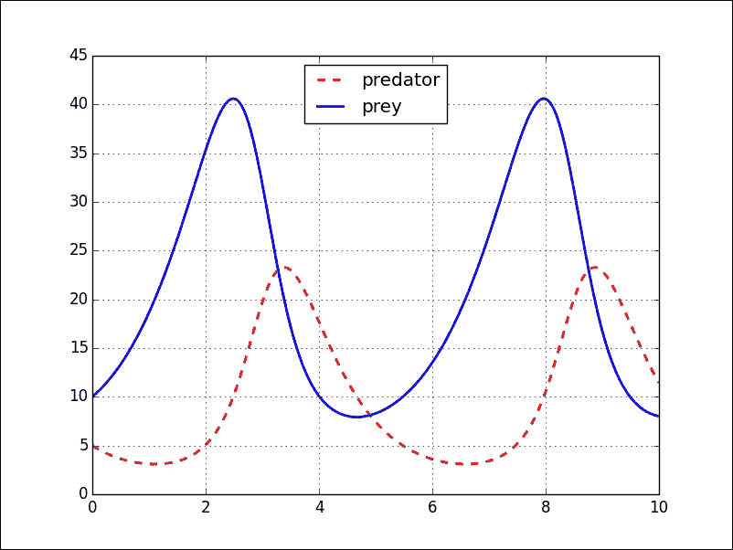

# 五、常微分方程的初值问题

常微分方程（或系统）的初值问题几乎不需要任何动力。 它们几乎在所有科学中自然产生。 在本章中，我们将专注于掌握数值方法来求解这些方程式。

在本章中，我们将通过三个常见示例探索 SciPy 堆栈中实现的所有技术：

*   一阶微分方程 *y'（t）= y（t）*，初始条件为 *y（0）= 1* 。 实际解为 *y（t）= e* *<sup>t</sup>* 。
*   一阶更复杂的微分方程：伯努利方程 *ty'（t）+ 6y（t）= 3ty（t）* *<sup>3/4</sup>* ， 初始条件 *y（1）= 1* 。 实际解是 *y（t）=（3t* *<sup>5/2</sup>* *+ 7）* *<sup>4</sup>* */（10000t* *<sup>6</sup>* *）。*
*   To illustrate the behavior with autonomous systems (where the derivatives do not depend on the time variable), we use a Lotka-Volterra model for one predator and one prey, *y**<sub>0</sub>**'(t) = y**<sub>0</sub>**(t) – 0.1 y**<sub>0</sub>**(t) y**<sub>1</sub>**(t)* and *y**<sub>1</sub>**'(t) = –1.5 y**<sub>1</sub>**(t) + 0.075 y**<sub>0</sub>**(t) y**<sub>1</sub>**(t)* with the initial condition *y**<sub>0</sub>**(0) = 10* and *y**<sub>1</sub>**(0) = 5* (representing *10* prey and *5* predators at the initial time).

    ### 注意

    高阶微分方程始终可以转换为（非必要自治的）微分方程系统。 反过来，微分方程的非自治系统总是可以通过以智能方式包含新变量而变成自治的。 完成这些转换的技术非常简单，并且在任何有关微分方程的教科书中都有介绍。

我们有可能通过 SymPy 解析地求解一些微分方程。 尽管这并不是解决计算初始值问题的最佳方法（即使有解析解可用），但我们将举例说明一些完成的示例。 可靠的求解器本质上是数值求解器，在这种情况下，主要有两种方法可以解决此问题-通过解析近似方法或离散变量方法。

# 微分方程的符号解

通过模块`sympy.solvers.ode`在 SciPy 堆栈中编码几种类型的微分方程的符号处理。 此时，使用此方法只能访问以下方程式：

*   一阶可分离
*   一阶齐次
*   一阶精确
*   一阶线性
*   一阶伯努利
*   二阶 Liouville
*   具有常数系数的任何阶数线性方程

除这些以外，其他方程式可以通过以下技术解决：

*   一阶或二阶方程的幂级数解（后者仅在普通和规则奇异点处）
*   一阶方程的李群方法

让我们结合我们的一维示例 *y'= y* 和伯努利方程，来实践这些技术。 注意输入微分方程的方法。 我们将其以 *F（t，y，y'）= 0* 的形式编写，并将表达式 *F（t，y，y'）*馈送到求解器（请参见第 4 行）。 3）。 另外，请注意我们如何使用 SymPy 编写函数的派生代码。 表达式`f(t).diff(t)`表示 *f（t）*的一阶导数，例如：

```py
In [1]: from sympy.solvers import ode
In [2]: t = symbols('t'); \
 ...: f = Function('f')
In [3]: equation1 = f(t).diff(t) - f(t)
In [4]: ode.classify_ode(equation1)
Out[4]:
('separable',
 '1st_exact',
 '1st_linear',
 'almost_linear',
 '1st_power_series',
 'lie_group',
 'nth_linear_constant_coeff_homogeneous',
 'separable_Integral',
 '1st_exact_Integral',
 '1st_linear_Integral',
 'almost_linear_Integral')

```

### 注意

请注意，某些方法有一个带有后缀`_Integral`的变体。 这是一个聪明的机制，可让我们无需实际计算所需的积分即可完成解决方案。 当面对昂贵或不可能的积分时，这很有用。

该方程已被分类为几种类型的成员。 我们现在可以根据相应类型的适当技术来解决它。 例如，我们选择首先假设方程是可分离的，然后通过计算幂级数解的四阶近似*（* `n=4` *）*来求解该方程。 `x0=0`周围的表示形式*（* `hint='1st_power_series'` *）*：

```py
In [5]: ode.dsolve(equation1, hint='separable')
Out[5]: f(t) == C1*exp(t)
In [6]: ode.dsolve(equation1, hint='1st_power_series', n=4, x0=0.0)
Out[6]: f(t) == C0 + C0*t + C0*t**2/2 + C0*t**3/6 + O(t**4)

```

解决初始值问题也是可能的，但仅适用于以一阶微分方程的幂级数计算的解：

```py
In [7]: ode.dsolve(equation1, hint='1st_power_series', n=3, x0=0,
 ...:            ics={f(0.0): 1.0})
Out[7]: f(t) == 1.0 + 1.0*t + 0.5*t**2 + O(t**3)

```

让我们用这些技术探索第二个例子：

```py
In [8]: equation2 = t*f(t).diff(t) + 6*f(t) - 3*t*f(t)**(0.75)
In [9]: ode.classify_ode(equation2)
Out[9]: ('Bernoulli', 'lie_group', 'Bernoulli_Integral')
In [10]: dsolve(equation2, hint='Bernoulli')
Out[10]: f(t) == (t**(-1.5)*(C1 + 0.3*t**2.5))**4.0
In [11]: dsolve(equation2, hint=lie_group')
Out[11]: f(t) == -5/(3*t*(C1*t**5 - 1))
[f(t) == 6.25e-6*(t**6*(625.0*C1**4 + 5400.0*C1*t**5 + 1296.0*t**10)
 - 120.0*sqrt(C1*t**17*(25.0*C1 + 36.0*t**5)**2))/t**12,
 f(t) == 6.25e-6*(t**6*(625.0*C1**4 + 5400.0*C1*t**5 + 1296.0*t**10)
 + 120.0*sqrt(C1*t**17*(25.0*C1 + 36.0*t**5)**2))/t**12]

```

当然，尽管第 10 行和第 11 行中两个解决方案的功能表达式不同，但是它们表示的功能相同。

### 注意

有关如何使用这些技术以及编写自己的符号求解器的更多信息，请参考官方 SymPy 页面上的出色文档，网址为[，网址为 http://docs.sympy.org/dev/modules/solvers/ode.html [](http://docs.sympy.org/dev/modules/solvers/ode.html) 。

# 解析近似法

解析近似方法尝试以基函数系统上的截断级数展开的形式来计算适用域上精确解的近似值。 在 SciPy 堆栈中，我们通过模块`sympy.mpmath`中的例程`odefun`实现了基于泰勒级数的实现。

### 注意

`mpmath`是一个用于任意精度浮点算术的 Python 库，位于`sympy`模块内部。 尽管它独立于`numpy`机制，但它们两者都能很好地协同工作。

有关此库的更多信息，请阅读位于 [http://mpmath.org/doc/current/](http://mpmath.org/doc/current/) 的官方文档。

让我们来看一下它的作用，首先举一个简单的例子 *y'（t）= y（t）*， *y（0）= 1* 。 此处的关键是与区间 *[0，1]* 中的实际解相比，评估近似的速度和准确性。 它的语法非常简单，我们假定方程始终为 *y'= F* 的形式，并向例程`odefun`提供此函数 *F* 和初始条件（ 在这种情况下，t 值 *0* ，y 值 *1* ：

```py
In [1]: import numpy as np, matplotlib.pyplot as plt; \
 ...: from sympy import mpmath
In [2]: def F(t, y): return y
In [3]: f = odefun(F, 0, 1)

```

我们将比较求解器`f`的结果和实际的解析解决方案`np.exp`：

```py
In [4]: t = np.linspace(0, 1, 1024); \
 ...: Y1 = np.vectorize(f)(t); \
 ...: Y2 = np.exp(t)
In [5]: (np.abs(Y1-Y2)).max()
Out[5]: mpf('2.2204460492503131e-16')

```

让我们来看第二个例子。 我们与 *[1，2]* 区间中的实际解决方案相比，评估了执行时间和近似精度：

```py
In [6]: def F(t, y): return 3.0*y**0.75 - 6.0*y/t
In [7]: def g(t): return (3.0*t**2.5 + 7)**4.0/(10000.0*t**6.)
In [8]: f = mpmath.odefun(F, 1.0, 1.0)
In [9]: t = np.linspace(1, 2, 1024); \
 ...: Y1 = np.vectorize(f)(t); \
 ...: Y2 = np.vectorize(g)(t)
In [9]: (np.abs(Y1-Y2)).max()
Out[9]: mpf('5.5511151231257827e-16')

```

现在，让我们用 Latko-Volterra 系统解决该示例。 我们计算解决方案并将其绘制在 0 到 10 个时间单位的时间范围内：

```py
In [10]: def F(t, y): return [y[0]  - 0.1*y[0]*y[1],
 ....:                      0.075*y[0]*y[1] - 1.5*y[1]]
In [11]: f = mpmath.odefun(F, 0.0, [10.0, 5.0])
In [12]: T = [10.0*x/1023\. for x in range(1024)]
 ....: X = [f(10.0*x/1023.)[0] for x in range(1024)]; \
 ....: Y = [f(10.0*x/1023.)[1] for x in range(1024)]
In [13]: plt.plot(T, X, 'r--', linewidth=2.0, label='predator'); \
 ....: plt.plot(T, Y, 'b-',  linewidth=2.0, label='prey'); \
 ....: plt.legend(loc=9); \
 ....: plt.grid(); \
 ....: plt.show()

```

最后一条命令为我们提供了下图。 虚线表示捕食者相对于时间的数量，实线表示猎物。 首先请注意解决方案的周期性。 另外，请注意两个函数的行为-当捕食者的数量很多时，猎物的数量就会减少。 在那时，捕食者很难找到食物，捕食者的数量开始减少，而猎物的数量却开始上升：



# 离散变量方法

在离散变量方法中，我们关注的是找到解的近似值，但仅在域中的离散点集处。 这些点可以在求解之前预先确定，也可以作为集成的一部分动态生成，以更好地适应所涉及功能的特性。 当解决方案具有奇异性时，例如，一旦生成离散点集，我们可以通过简单的插值过程为解决方案计算出一个很好的解析近似值，这将特别有用。

对于离散变量方法，我们有两种模式：

*   **一步法**：仅根据前一点的信息来计算一个点的解的值。 该方案的经典指数是，例如，欧拉方法，改进的欧拉方法，任何二阶两阶段方法或任何 Runge-Kutta 方法。
*   **多步方法**：某一点的求解值取决于先前几个要点的知识。 此类中最著名的算法是 Adams-Bashford 方法，Adams-Moulton 方法，任何后向差分方法或任何预测校正方法。

在模块`scipy.integrate`中，我们有公共接口类`ode`，它将使用所选的数值方法对方程/系统的解进行近似计算。 与我们以前使用的类相比，使用此类的方法大不相同，并且应该仔细解释一下：

1.  一旦产生了微分方程/系统的右手边，例如说 *y'= f（t，y）*，则该过程从创建求解器实例开始。 我们通过发出`ode(f)`来实现。 如果我们对 *y* 变量描述了右侧的雅可比行列式，则可以将其包含在求解器`ode(f, jac)`的创建中。
2.  如果需要向函数`f`或它的 Jacobian 馈送额外的参数，则分别使用`.set_f_params(*args)`或`.set_jac_params(*args)`。
3.  问题的初始值由属性`.set_initial_value(y[, t])`指示。
4.  现在是时候选择一种数值方案了。 我们通过设置`.set_integrator(name, **params)`属性来实现。 如有必要，我们可以使用可选参数为所选方法提供更多信息。
5.  最后，我们计算初始值问题的实际解决方案。 我们通常通过在循环中使用几个属性来完成此操作：
    *   `.integrate(t[, step, relax])`将在提供的时间`t`上计算解`y(t)`的值。
    *   始终可以使用`attributes.t`（用于时间变量）和`.y`（用于解决方案）来获取计算中的最后一步
    *   为了检查计算是否成功，我们具有属性`.successful()`。
    *   一些集成方法接受一个标志函数`solout_func(t, y)`，该函数在每个成功步骤之后都会被调用。 这是通过`.set_solout(solout_func)`完成的。

## 一站式方法

SciPy 堆栈中编码的唯一一步方法是 Runge-Kutta 的两种实现，这是由 Dormand 和 Prince 设计的，由 Hairer 和 Wanner 为模块`scipy.integrate`编写的：

*   阶（4）的显式 Runge-Kutta 方法 5。 我们使用`method='dopri5'`访问它。
*   阶 8（5,3）的显式 Runge-Kutta 方法。 我们称它为`method='dop853'`。

让我们来看一下示例。 对于第一个，我们将通过在间隔 *[0，* *1]* 中由 Chebyshev 多项式的零给出的 10 个节点上发出`dopri5`来求解微分方程。 ：

```py
In [1]: import numpy as np,import matplotlib.pyplot as plt; \
 ...: from scipy.integrate import ode; \
 ...: from scipy.special import t_roots
In [2]: def F(t, y): return y
In [3]: solver = ode(F)        # solver created
In [4]: solver.set_initial_value(1.0, 0.0)  # y(0) = 1
Out[4]: <scipy.integrate._ode.ode at 0x1038d3a50>
In [5]: solver.set_integrator('dopri5')
Out[5]: <scipy.integrate._ode.ode at 0x1038d3a50>
In [6]: solver.t, solver.y
Out[6]: (0.0, array([ 1.]))
In [7]: nodes = t_roots(10)[0]; \
 ...: nodes = (nodes + 1.0) * 0.5
In [8]: for k in range(10):
 ...:     if solver.successful():
 ...:         t = nodes[k]
 ...:         solver.integrate(t)
 ...:         print "{0},{1},{2}".format(t, solver.y[0], np.exp(t))
 ...: 
0.00615582970243, 1.00617481576, 1.00617481576
0.0544967379058, 1.05600903161, 1.05600903161
0.146446609407, 1.15771311835, 1.15771311818
0.27300475013, 1.31390648743, 1.31390648604
0.42178276748, 1.52467728436, 1.52467727922
0.57821723252, 1.78285718759, 1.78285717608
0.72699524987, 2.06885488518, 2.06885486703
0.853553390593, 2.34797534217, 2.34797531943
0.945503262094, 2.57410852921, 2.5741085039
0.993844170298, 2.7015999731, 2.70159994653

```

### 注意

通过提供不同的容差，步数限制和其他稳定常数，可以对算法进行微调。 有关不同参数的详细说明，请参考[上的官方文档，网址为 http://docs.scipy.org/doc/scipy/reference/generated/scipy.integrate.ode.html](http://docs.scipy.org/doc/scipy/reference/generated/scipy.integrate.ode.html) ，或仅要求 使用以下代码从 Python 会话中获取手册页：

```py
>>> help(ode)

```

在伯努利方程的示例中，我们将再次收集 Chebyshev 多项式的根作为节点，但是这次我们将收集解并构造分段多项式插值，以将结果与真实解进行直观比较。 在这种情况下，我们采用 8（5,3）阶的 Runge-Kutta：

```py
In [9]: def bernoulli(t, y): return 3*y**(0.75) - 6.0*y/t
In [10]: def G(t):
 ....:     return (3.0*t**(2.5) + 7.0)**4.0 / (10000.0*t**6.0)
In [11]: solver = ode(bernoulli); \
 ....: solver.set_initial_value(1.0, 1.0); \
 ....: solver.set_integrator('dop853')
Out[11]: <scipy.integrate._ode.ode at 0x104667f50>
In [12]: T = np.linspace(1, 2, 1024); \
 ....: nodes = t_roots(10)[0]; \
 ....: nodes = 1.5 + 0.5 * nodes; \
 ....: solution = []
In [13]: for k in range(10):
 ....:     if solver.successful():
 ....:         solver.integrate(nodes[k])
 ....:         solution += [solver.y[0]]
 ....:
In [14]: from scipy.interpolate import PchipInterpolator
In [15]: interpolant = PchipInterpolator(nodes, solution)
In [16]: plt.plot(T, interpolant(T), 'r--',
 ....:          linewidth=2.0, label='approx.'); \
 ....: plt.plot(T, G(T), 'b-', label='true soln.'); \
 ....: plt.grid(); \
 ....: plt.legend(); \
 ....: plt.show()

```

这提供了以下启发图。 计算出的解（虚线）非常类似于时间`t=1`和`t=2`之间的真实解（实线）：


Lotka-Volterra 系统以相同的方式求解。 在下面的示例中，我们将在一个周期中选择一组等距节点-从 *0* 到*2π/√1.5*的间隔（大约 5.13）：

```py
In [16]: def volterra(t, y):
 ....:     return [y[0]  - 0.1*y[0]*y[1],
 ....:             0.075*y[0]*y[1] - 1.5*y[1]]
In [17]: solver = ode(volterra); \
 ....: solver.set_initial_value([10.0, 5.0], 0.0); \
 ....: solver.set_integrator('dop853')
Out[17]: <scipy.integrate._ode.ode at 0x10461e390>
In [18]: prey = []; \
 ....: predator = []
In [19]: while (solver.t < 5.13 and solver.successful()):
 ....:     solver.integrate(solver.t + 0.01)
 ....:     prey += [solver.y[0]]
 ....:     predator += [solver.y[1]]
 ....:
In [20]: plt.plot(prey, predator); \
 ....: plt.grid(); \
 ....: plt.xlabel('number of prey'); \
 ....: plt.ylabel('number of predators'); \
 ....: plt.show()

```

这为我们提供了系统的相图。 该图表示一条曲线，其中，对于每个时间单位， *x* 坐标表示猎物的数量，而相应的 *y* 坐标表示捕食者的数量。 由于解的周期性，相像是闭合曲线。 就像两种解决方案的简单图解一样，相像也说明了例如当捕食者的数量增加超过 20 个单位时，捕食者的数量通常很少（少于 20 个单位）。 当捕食者的数量降至 20 以下时，猎物的数量缓慢增加至 40 多个单位：


## 两步法

在这里，我们有两个不同的选择：一个 Adams-Moulton 方法（适用于非刚度方程）和一个后向差分方法（为刚度方程设计）。 对于这两种数值方法中的每一种，我们都有两种不同的实现方式，具体取决于用于计算解的背景 Fortran 例程。 选项如下：

*   `*VODE`：在 Fortran 库 ODE 中，我们有例程`VODE`和`ZVODE`（分别用于初值问题的实值和复值解）。 例如，对于实值问题，要访问 Adams-Moulton 的数值方法，我们发布属性`.set_integrator('vode', method='adams')`。 为了访问后向差异，我们发出`.set_integrator('vode', method='BDF')`。
*   `LSODA`: This other implementation wraps different routines from the Fortran library `ODEPACK`. The calls are exactly as in the previous case, substituting `'vode'` or `'zvode'` with `'lsoda'` instead.

    ### 注意

    有关 netlib 库`ODE`和`ODEPACK`的更多信息，请参考 [http://www.netlib.org/ode/](http://www.netlib.org/ode/) 和 [http://www.netlib.org/odepack /](http://www.netlib.org/odepack/) 。

这些数值方法是为大问题设计的。 对于较小的任务（具有少量节点的非刚性一维方程式），应改用 Runge-Kutta。 第二个示例说明了这一点：我们应用`VODE`中的`BDF`，并将之前从两个 Runge-Kutta 获得的解与实际解进行比较。 请注意，在这种简单情况下，`dop853`如何胜过`BDF`：

```py
In [21]: solver = ode(bernoulli); \
 ....: solver.set_initial_value(1.0, 1.0); \
 ....: solver.set_integrator('vode', method='BDF')
Out[21]: <scipy.integrate._ode.ode at 0x1038d2990>
In [22]: nodes = t_roots(10)[0]; \
 ....: nodes = 1.5 + 0.5 * nodes; \
 ....: solution2 = []
In [23]: for k in range(10):
 ....:     if solver.successful():
 ....:         solver.integrate(nodes[k])
 ....:         solution2 += [solver.y[0]]
 ....:
In [24]: for k in range(10):
 ....:     true = G(nodes[k])
 ....:     dop853 = solution[k]
 ....:     vode = solution2[k]
 ....:     print "{0},{1},{2}".format(true, dop853, vode)
 ....:
0.981854827818, 0.981854827818, 0.981855789349
0.859270248468, 0.859270248468, 0.859270080689
0.698456572663, 0.698456572663, 0.698458875953
0.570963875566, 0.570963875559, 0.57096210196
0.49654019444, 0.496540194433, 0.496537599383
0.466684337536, 0.466684337531, 0.466681706374
0.466700776675, 0.46670077667, 0.466699552511
0.482536531899, 0.482536531895, 0.482537207918
0.501698475572, 0.501698475568, 0.501699366611
0.514159743133, 0.514159743128, 0.514160809167

```

为了完成本章，我们在 Lotka-Volterra 系统上使用`LSODA`，包括 Jacobian 信息：

```py
In [25]: def jacF(t, y):
 ....:     output = np.zeros((2,2))
 ....:     output[0,0] = 1.0 - 0.1*y[1]
 ....:     output[0,1] = -0.1*y[0]
 ....:     output[1,0] = 0.075*y[1]
 ....:     output[1,1] = 0.075*y[0] - 1.5
 ....:     return output
In [26]: solver = ode(volterra, jacF); \
 ....: solver.set_initial_value([10.0, 5.0], 0.0); \
 ....: solver.set_integrator('lsoda', method='adams',
 ....:                       with_jacobian=True)
In [27]: prey2 = []; \
 ....: predator2  = []
In [28]: while (solver.t < 5.13 and solver.successful()):
 ....:     solver.integrate(solver.t + 0.01)
 ....:     prey2 += [solver.y[0]]
 ....:     predator2 += [solver.y[1]]

```

我们将其作为练习，以比较使用此方法解决此最后一个系统的结果与先前的 Runge-Kutta 过程。

# 摘要

在这一简短的章节中，我们已经掌握了所有符号和数值技术，可以解决微分方程/系统和相关的初值问题。

在下一章中，我们将探索 SciPy 堆栈中拥有哪些资源，以解决计算几何中的问题。