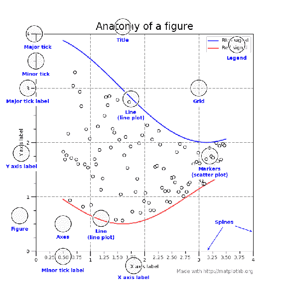
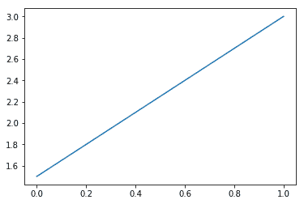
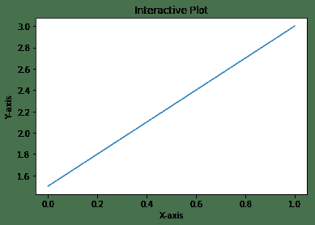
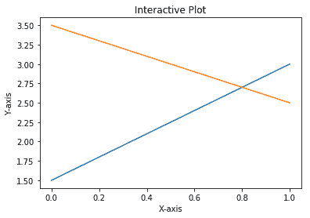
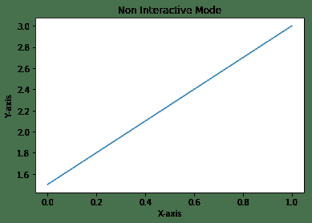
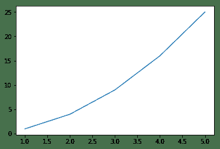
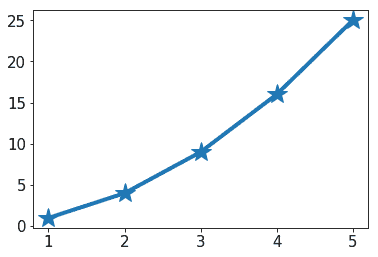
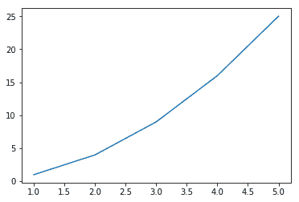

# 一、Matplotlib 的剖析

本章从 Matplotlib 的介绍开始，包括 Matplotlib 的架构和图形元素，然后是秘籍。 以下是本章将介绍的秘籍：

*   在交互模式下工作
*   在非交互模式下工作
*   从外部文件读取并绘图
*   如何更改和重置默认环境变量

## 介绍

Matplotlib 是一个跨平台的 Python 库，用于绘制二维图形（也称为**图**）。 它可以在各种用户界面中使用，例如 Python 脚本，IPython Shell，Jupyter 笔记本，Web 应用和 GUI 工具包。 它可以用于开发专业的报表应用，交互式分析应用，复杂的仪表板应用或嵌入到 Web/GUI 应用中。 它还支持将图形保存为各种硬拷贝格式。 它还对三维图形的支持有限。 它还支持许多第三方工具包以扩展其功能。

请注意，本书中的所有示例均已通过 Matplotlib 3.0 和 Jupyter Notebook 5.1.0 进行了测试。

## Matplotlib 的架构

Matplotlib 具有三层架构：**后端**，**艺术家**和**脚本**，它们在逻辑上组织为栈。 脚本是开发人员用来创建图形的 API。 美工完成了内部创建图形的实际工作。 后端是显示图形的位置。

## 后端层

这是图形显示在输出设备上的最底层。 这可以是 Matplotlib 支持的任何用户界面。 后端有两种类型：**用户界面后端**（用于`pygtk`，`wxpython`，`tkinter`，`qt4`或`macosx`等，也称为**交互式后端**）和**硬拷贝**后端，以制作图像文件（`.png`，`.svg`，`.pdf`和`.ps`，也称为**非交互式后端**）。 我们将在稍后的第 9 章，“开发交互式绘图”和第 10 章，“将图形嵌入图形用户界面”中学习如何配置这些后端。

## 艺术家层

这是栈的中间层。 Matplotlib 使用`artist`对象绘制图形的各种元素。 因此，我们在图形中看到的每个元素（请参见图中的元素）都是一个艺术家。 该层提供了**面向对象的 API** ，以最大的灵活性来绘制图形。 该接口适用于经验丰富的 Python 程序员，他们可以创建复杂的仪表板应用。

## 脚本层

这是栈的最顶层。 该层提供了用于创建图形的简单接口。 这供没有太多编程专业知识的最终用户使用。 这称为`pyplot` API。

## 图元素

包含输出图的所有元素的高级 Matplotlib 对象称为`figure`。 可以以不同方式排列多个图形以形成图形。 图的每个元素都是可自定义的。

## 图形

下图是`figure`的剖析图，其中包含其所有元素：

Anatomy of a figure (Source : http://diagramss.us/plotting-a-graph-in-matlab.html)

## 轴域

`axes`是该图的子部分，其中绘制了图形。`axes`具有**标题**，**x 标签**和 **y 标签**。`figure`可以具有许多这样的`axes`，每个`figure`代表一个或多个图形。 在上图中，只有一个`axes`，两个是蓝色和红色的折线图。

## 轴

这些是数字线，代表要绘制的图形的比例。 二维图具有 *x* 轴和 *y* 轴，而三维图具有 *x* 轴， *y* 轴 ，以及 *z* 轴。

Don't get confused between axes and axis. Axis is an element of axes. Grammatically, axes is also the plural for axis, so interpret the meaning of axes depending on the context, whether multiple axis elements are being referred to or an axes object is being referred to.

## 标签

这是图中各个元素的名称，例如 *x* 轴标签， *y* 轴标签，图形标签（上图中的蓝色信号/红色信号*图形剖析*等等。

## 图例

当`axes`中有多个图形时（如上图，*图形剖析图*），每个图形都有其自己的标签，所有这些标签均表示为图例。 在上图中，图例位于图的右上角。

## 标题

它是每个`axes`的名称。 当图形具有多个带有各自标题的轴域时，`figure`也可以具有自己的标题。 上图只有一个轴域，因此轴域和该图都只有一个标题。

## 刻度标签

每个轴（*x*，*y* 或 *z*）都有一个范围的值，该值分为许多相等的桶。 桶分为两个级别。 在上一个图（剖析图）， *x* 轴刻度范围从 0 到 4，分为四个主要区域（0-1、1-2、2-3 和 3-4），每个主要桶又分为四个次要桶（0-0.25、0.25-0.5 和 0.5-0.75）。 主桶两侧的刻度称为**主刻度**，次桶称为**次刻度**，它们的名称为**主刻度标签**和**次刻度标签**。

## 轴线

该图的边界称为**轴线**。 每个轴域有四个轴线（上，下，左和右）。

## 网格

为了更容易读取图形上各个点的坐标，将图形区域划分为网格。 通常，此网格沿着 *x* 和 *y* 轴的主要刻度线绘制。 在上图中，以虚线显示了网格。

## 在交互模式下工作

Matplotlib 可以在**交互式**或**非交互式**模式下使用。 在交互模式下，每条语句后图形显示都会更新。 在非交互模式下，只有明确要求这样做，图形才会显示。

## 准备

您需要 Python，NumPy 和 Matplotlib 包的有效安装。

使用以下命令，可以打开或关闭交互模式，还可以在任何时间点检查当前模式：

*   `matplotlib.pyplot.ion()`设置交互模式`ON`
*   `matplotlib.pyplot.ioff()`切换`OFF`交互模式
*   `matplotlib.is_interactive()`检查交互模式是`ON`（`True`）还是`OFF`（`False`）

## 操作步骤

让我们看看在交互模式下工作有多么简单：

1.  将屏幕输出设置为后端：

```py
%matplotlib inline
```

2.  导入`matplotlib`和`pyplot`库。 在 Python 中，通常的做法是导入带有清晰同义词的库。 注意`plt`是`matplotlib.pyplot`包的同义词：

```py
import matplotlib as mpl import matplotlib.pyplot as plt
```

3.  将交互模式设置为开：

```py
plt.ion()
```

4.  检查交互模式的状态：

```py
mpl.is_interactive()
```

5.  您应该得到的输出为`True`。
6.  绘制折线图：

```py
plt.plot([1.5, 3.0])
```

您应该看到以下图形作为输出：



7.  现在，借助以下代码，将轴标签和标题添加到图形中：

```py
## Add labels and title
plt.title("Interactive Plot") #Prints the title on top of graph
plt.xlabel("X-axis")         # Prints X axis label as "X-axis"
plt.ylabel("Y-axis")         # Prints Y axis label as "Y-axis"
```

执行上述三个语句后，图形应如下所示：



## 工作原理

因此，这就是解释的方式：

*   `plt.plot([1.5, 3.0])`绘制连接两个点`(0, 1.5)`和`(1.0, 3.0)`的折线图。
*   `plot`命令需要两个参数（分别为`x`和`y`轴，使用 Python 列表，NumPy 数组或 pandas 数据帧）。 。
*   如果仅传递一个参数，则将其作为 *y* 轴坐标，而对于 *x* 轴坐标，它将采用所提供参数的长度。
*   在此示例中，我们仅传递两个点的一个列表，这些列表将作为 *y* 轴坐标。
*   对于 *x* 轴，由于列表`[1.5, 3.0]`的长度为 2，因此它采用的默认值为 0 到 1。
*   如果我们在 *y* 的列表中有三个坐标，那么对于 *x*，它将取 0 到 2 的范围。
*   您应该看到类似于*步骤 6* 中显示的图形。
*   `plt.title("Interactive Plot")`，将标题作为`"Interactive Plot"`打印在图形顶部**。
*   `plt.xlabel("X-axis")`，将 *x* 轴标签打印为`"X-axis"`。
*   `plt.ylabel("Y-axis")`，将 *y* 轴标签打印为`"Y-axis"`。
*   执行完前面的三个语句后，您应该看到如图*步骤 7* 中所示的图形。

如果您使用的是 Python Shell，则在执行每个代码语句后，您应该首先看到图形标题已更新，然后是 *x* 轴标签，最后是 *y* 轴标签 。

如果您使用的是 Jupyter 笔记本，则只有在执行给定单元格中的所有语句后才能看到输出，因此您必须将这三个语句中的每一个放在单独的单元格中，然后一个接一个地执行，以查看绘图在每个代码语句之后被更新。

In older versions of Matplotlib or certain backends (such as `macosx`), the graph may not be updated immediately. In such cases, you need to call `plt.draw()` explicitly at the end, so that the graph gets displayed.

## 更多

您可以在同一图上再添加一个折线图，然后继续进行直到完成交互式会话：

1.  绘制折线图：

```py
plt.plot([1.5, 3.0])
```

2.  添加标签和标题：

```py
plt.title("Interactive Plot")
plt.xlabel("X-axis")
plt.ylabel("Y-axis")
```

3.  再添加一个折线图：

```py
plt.plot([3.5, 2.5])
```

下图是执行代码后获得的输出：



因此，我们现在在交互模式下工作。

## 在非交互模式下工作

在交互模式下，我们看到了随着每条指令逐步构建的图形。 在非交互模式下，您将提供所有说明来构建图形，然后使用命令显式显示图形。

## 操作步骤

在非交互模式下工作也不困难：

1.  重新启动内核，并导入`matplotlib`和`pyplot`库：

```py
import matplotlib
import matplotlib.pyplot as plt
```

2.  将交互模式设置为关闭：

```py
plt.ioff()
```

3.  检查交互模式的状态：

```py
matplotlib.is_interactive()
```

4.  您应该获得输出`False`。
5.  执行以下代码； 您不会在屏幕上看到该图：

```py
## Plot a line graph
plt.plot([1.5, 3.0])

## Plot the title, X and Y axis labels
plt.title("Non Interactive Mode")
plt.xlabel("X-axis")
plt.ylabel("Y-axis")
```

6.  执行以下语句，然后您将在屏幕上看到该图：

```py
## Display the graph on the screen 
plt.show()
```

## 工作原理

前面的每个代码语句都是不言自明的。 要注意的重要事项是在非交互模式下，为要显示的图形编写完整的代码，然后显式调用`plt.show()`以在屏幕上显示图形。

以下是获得的输出：

 The latest versions of Jupyter Notebook seem to display the figure without calling `plt.show()` command explicitly. However, in Python shell or embedded applications, `plt.show()` or `plt.draw()` is required to display the figure on the screen.

## 从外部文件读取并绘图

默认情况下，Matplotlib 接受输入数据作为 Python 列表，NumPy 数组或 pandas 数据帧。 因此，需要先读取所有外部数据并将其转换为这些格式之一，然后再将其提供给 Matplotlib 进行图形绘制。 从性能的角度来看，NumPy 格式更有效，但对于默认标签，pandas 格式比较方便。

如果数据是`.txt`文件，则可以使用 NumPy 函数读取数据并将其放入 NumPy 数组中。 如果数据为`.csv`或`.xlsx`格式，则可以使用 Pandas 读取数据。 在这里，我们将演示如何读取`.txt`，`.csv`和`.xlsx`格式，然后绘制图表。

## 准备

导入读取输入文件所需的`matplotlib.pyplot`，`numpy`和`pandas`包：

1.  导入具有`plt`同义词的`pyplot`库：

```py
import matplotlib.pyplot as plt
```

2.  导入具有`np`同义词的`numpy`库。`numpy`库可以管理 n 维数组，支持这些数组上的所有数学运算：

```py
import numpy as np
```

3.  以`pd`作为同义词导入`pandas`包：

```py
import pandas as pd
```

## 操作步骤

我们将在三个单独的部分中遵循`.txt`，`.csv`和`.xlsx`文件的顺序。

## 从`.txt`文件读取

以下是一些步骤：

1.  将文本文件读入`txt`变量：

```py
txt = np.loadtxt('test.txt', delimiter = ',')
txt
```

这是前面代码块的说明：

*   `test.txt`文本文件有 10 个数字，用逗号隔开，代表二​​维空间中的 *x* 和 *y* 五个点的坐标`(1， 1)`，`(2, 4)`，`(3, 9)`，`(4, 16)`和`(5, 25)`。
*   函数`loadtxt()`和将文本数据加载到 NumPy 数组中。

您应该获得以下输出：

```py
array([ 1., 1., 2., 4., 3., 9., 4., 16., 5., 25.])
```

2.  将平面数组转换为 2D 空间中的五个点：

```py
txt = txt.reshape(5,2)
txt
```

执行前面的代码后，您应该看到以下输出：

```py
array([[ 1., 1.], [ 2., 4.], [ 3., 9.], [ 4., 16.], [ 5., 25.]])
```

3.  将`.txt`变量拆分为`x`和`y`轴坐标：

```py
x = txt[:,0]
y = txt[:,1]
print(x, y)
```

这是前面代码块的解释：

*   将`x`和`y`轴点与`txt`变量分开。
*   `x`是`txt`中的第一列，`y`是第二列。
*   Python 索引从 0 开始。

执行上述代码后，您应该看到以下输出：

```py
[ 1\. 2\. 3\. 4\. 5.] [ 1\. 4\. 9\. 16\. 25.]
```

## 从`.csv`文件读取

`.csv`文件具有行和列的关系数据库结构，`test.csv`文件在 2D 空间中具有五个点的 *x*，*y* 坐标。 每个点是文件中的一行，分为两列：`x`和`y`。 相同的 NumPy `loadtxt()`函数用于加载数据：

```py
x, y = np.loadtxt ('test.csv', unpack = True, usecols = (0,1), delimiter = ',')
print(x)
print(y)
```

执行上述代码后，应该看到以下输出：

```py
[ 1\. 2\. 3\. 4\. 5.] [ 1\. 4\. 9\. 16\. 25.]
```

## 从`.xlsx`文件读取

现在，让我们从`.xlsx`文件中读取相同的数据，并创建`x`和`y` NumPy 数组。 NumPy `loadtxt()`函数不支持`.xlsx`文件格式。 可以使用 Python 数据处理包`pandas`：

1.  将`.xlsx`文件读入 pandas 数据帧中。 该文件在 2D 空间中具有相同的五个点，每个点在具有`x`和`y`列的单独行中：

```py
df = pd.read_excel('test.xlsx', 'sheet', header=None)
```

2.  将 pandas 数据帧转换为 NumPy 数组：

```py
data_array = np.array(df)
print(data_array)
```

您应该看到以下输出：

```py
[[ 1 1] [ 2 4] [ 3 9] [ 4 16] [ 5 25]]
```

3.  现在从 NumPy 数组中提取`x`和`y`坐标：

```py
x , y = data_array[:,0], data_array[:,1]
print(x,y)
```

您应该看到以下输出：

```py
[1 2 3 4 5] [ 1 4 9 16 25]
```

## 绘制图形

从三种格式（`.txt`，`.csv`和`.xlsx`）中的任何一种读取数据并将其格式化为`x`和`y`变量后，我们使用以下变量绘制图形：

```py
plt.plot(x, y)
```

在屏幕上显示图形：

```py
plt.show()
```

以下是获得的输出：



## 工作原理

根据数据的格式和结构，我们将不得不使用 Python，NumPy 或 pandas 函数来读取数据并将其重新格式化为可以馈入`matplotlib.pyplot`函数的适当结构。 之后，按照通常的绘制说明绘制所需的图形。

## 更改和重置默认环境变量

Matplotlib 使用`matplotlibrc`文件存储跨 matplotlib 功能使用的各种环境和图形参数的默认值。 注意，该文件很长。 这些默认值可自定义以应用于会话中的所有绘图。

可以使用`print(matplotlib.rcParams)`命令从该文件获取所有默认参数设置。

`matplotlib.rcParams`命令用于将这些默认值更改为任何其他支持的值，一次更改一个参数。`matplotlib.rc`命令用于为特定组中的多个参数设置默认值，例如，行，字体，文本等。 最后，`matplotlib.rcdefaults()`命令用于恢复默认参数。

Matplotlib 在内部使用`matplotlib.rcsetup()`命令来验证所更改的参数是可接受的值。

## 准备

以下代码块提供了包含所有配置参数的文件路径：

```py
## Get the location of matplotlibrc file
import matplotlib
matplotlib.matplotlib_fname()
```

您应该看到类似下面的目录路径。 确切的目录路径取决于您的安装：

```py
'C:\\Anaconda3\\envs\\keras35\\lib\\site-packages\\matplotlib\\mpl-
    data\\matplotlibrc'
```

## 操作步骤

以下代码块以及注释可帮助您了解更改和重置默认环境变量的过程：

1.  导入具有`plt`同义词：的`matplotlib.pyplot`包

```py
import matplotlib.pyplot as plt
```

2.  从我们在前面的秘籍中使用的同一`test.csv`文件中加载`x`和`y`变量：

```py
x, y = np.loadtxt ('test.csv', unpack = True, usecols = (0,1), 
                    delimiter = ',')
```

3.  更改组`'lines'`中多个参数的默认值：

```py
matplotlib.rc('lines', linewidth=4, linestyle='-', marker='*')
```

4.  分别更改参数的默认值：

```py
matplotlib.rcParams['lines.markersize'] = 20
matplotlib.rcParams['font.size'] = '15.0'
```

5.  绘制图形：

```py
plt.plot(x,y)
```

6.  显示图形：

```py
plt.show()
```

以下是将获得的输出：



## 工作原理

`matplotlib.rc`和`matplotlib.rcParams`命令覆盖指定参数的默认值作为这些命令中的参数。 在绘制图形时，`pyplot`工具将使用这些新值。

It should be noted that these values will be active for all plots in the session. If you want different settings for each plot in the same session, then you should use the attributes available with the `plot` command.

## 更多

您可以使用`rsdefaults()`命令将所有参数重置为其默认值，如下框所示：

```py
## To restore all default parameters
matplotlib.rcdefaults() 
plt.plot(x,y)
plt.show()
```

该图如下所示：



.