# 十、使用`mplot3d`工具包绘制 3D 图形

在本章中，我们将介绍绘制以下图形的方法：

*   线形图
*   散点图
*   条形图
*   多边形图
*   等高线图
*   曲面图
*   线框图
*   三角曲面图
*   在 3D 模式下绘制 2D 数据
*   在 3D 中可视化 2D 中的线性不可分离数据
*   绘制单词嵌入

## 介绍

Matplotlib 的早期版本仅限于 2D 绘图，后来又将 3D 功能添加为附加工具箱：`mplot3d`。 尽管它具有有限的 3D 功能，但它涵盖了 3D 绘图的大多数常见业务需求。

绘图命令与 2D 命令相似。 只是我们向 Matplotlib 注册，我们将通过从工具包中导入`Axes3D`来使用 3D 图，并在轴域定义中指定`projection='3d'`。

如果您正在使用任何交互式后端，还可以通过将图形拖向所需的任何方向来旋转 3D 图片以获取不同的视图。 您还可以通过在帧之间稍稍停顿的情况下旋转图形来创建动画。 我们将学习如何在某些图中使用这些功能，尽管它们可以应用于所有图中。

## 线形图

在本秘籍中，我们将学习如何创建 3D 线形图。 它类似于 2D 等效折线图，并且 2D 折线图的和属性中的许多属性都将结转到 3D。

我们将在相同的轴域上绘制凹凸曲线，并从不同角度查看它们，例如平行视图，俯视图以及绕， *z* 轴旋转。

## 准备

导入所需的库：

```py
import numpy as np
import matplotlib.pyplot as plt
from mpl_toolkits.mplot3d import Axes3D
```

## 操作步骤

以下是绘制 3D 折线图的步骤：

1.  准备 *x*，*y* 和 *z* 轴坐标的数据：

```py
x = np.linspace(-5, 5, 25)
y = np.linspace(-5, 5, 25)
z = x**2 + y**2
z1 = 1 - (x**2 + y**2)
```

2.  定义一个函数来绘制图形并设置其属性：

```py
def plot_graph(axes, xlabel, ylabel, zlabel, title, elevation, rotation):
    axes.plot3D(x, y, z, label='concave')
    axes.plot(x, y, z1, label='convex')
    axes.view_init(elev=elevation, azim=rotation)
    axes.set_xlabel(xlabel)
    axes.set_ylabel(ylabel)
    axes.set_zlabel(zlabel)
    axes.set_title(title)
    axes.legend(loc='best')
```

3.  定义用于 3D 绘图的图形和轴域`ax1`：

```py
fig = plt.figure(figsize=(15,9))
ax1 = fig.add_subplot(231, projection='3d')
```

4.  用默认高度和旋转度在`ax1`上绘制曲线：

```py
plot_graph(ax1, 'X', 'Y', 'Z', 'default view', None, None)
```

5.  定义第二个轴域`ax2`并以 0 度的仰角绘制它，并以默认的`azimuth`角进行绘制：

```py
ax2 = fig.add_subplot(232, projection='3d')
plot_graph(ax2, 'X', 'Y', 'Z', 'elevation angle = 0,\n azimuth angle=None', 0, None)
```

6.  定义第三个轴域`ax3`并以 90 度仰角绘制它，并以默认`azimuth`缺省角度进行绘制：

```py
ax3 = fig.add_subplot(233, projection='3d')
plot_graph(ax3, 'X', 'Y', ' ', 'elevation angle = 90,\n azimuth angle=None', 90, None)
ax3.set_zticks([])
```

7.  定义第四个轴域`ax4`，并使用默认仰角和`-30`度的方位角进行绘制：

```py
ax4 = fig.add_subplot(234, projection='3d')
plot_graph(ax4, 'X', 'Y', 'Z', 'elevation angle = None,\n azimuth angle=-30', None, -30)
```

8.  定义第五个轴域`ax5`，并使用默认仰角和`30`度的方位角进行绘制：

```py
ax5 = fig.add_subplot(235, projection='3d')
plot_graph(ax5, 'X', 'Y', 'Z', 'elevation angle = None,\n azimuth 
           angle=30', None, 30)
```

9.  调整绘图之间的空间，并将其显示在屏幕上：

```py
plt.tight_layout(w_pad=5)
plt.show()
```

## 工作原理

这是前面的代码块的说明：

*   `x = np.linspace(−5, 5, 25)`创建一个数组，该数组的 25 个点在 -5 和 +5 之间等距分布，并且`z`和`z1`被定义为`x`和`y`
*   `def plot_graph(axes, xlabel, ylabel, zlabel, title, elevation, rotation):`是用于绘制具有给定属性的图形的函数：
    *   `axes`指定要在其上绘制图形的轴域。
    *   `xlabel`，`ylabel`和`zlabel`分别为 *x*，*y* 和 *z* 轴指定标签。
    *   `title`指定图的标题。
    *   `elevation`指定相对于 *xy* 平面的视角：0 表示平行于 *xy* 平面的视角，90 表示俯视图。
    *   `rotation`指定在 *z* 轴上旋转的绘图的视图。
    *   `elevation`和`rotation`均以度为单位。
    *   `axes.plot3D(x, y, z, label='concave')`与 2D 线形图语法相似，不同之处在于，我们还包括 *z* 轴。 您也可以使用`axes.plot()`代替`axes.plot3D()`，就像我们对*凸*曲线所做的那样。 大多数其他绘图也是如此，但并非所有情况都如此。
    *   `axes.view_init(elev=elevation, azim=rotation)`指定绘图出现时的视图。
    *   函数中的其余语句已经为我们所熟悉。
*   `ax1 = fig.add_subplot(231, projection='3d')`在图形上添加了一个轴域，其布局指定为`2 x 3`网格：
    *   `projection='3d'`指定它为 3D 轴域，并在其上绘制三维图。 这是 2D 和 3D 绘图语法之间的主要区别。
*   在`ax1`上，我们使用默认仰角和旋转角度绘制图表
*   在`ax2`至`ax4`上，我们绘制了具有不同仰角和旋转角度的相同图形，以查看其视图的差异。

在执行前面的代码时，您应该在屏幕上看到以下图形和绘图：

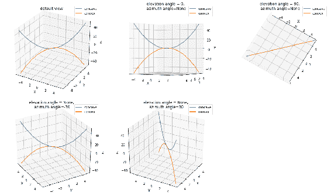

## 散点图

在本秘籍中，我们将学习如何在 3D 中绘制散点图。 在此示例中，我们将使用`Iris`数据集，该数据集具有三个不同的群集。 在前面的章节中，我们已经多次在 2D 中看到它，所以让我们看看它在 3D 中的外观。

我们还将学习如何使用在前面的秘籍中学习的`init_view`方法创建动画 3D 绘图。 为此，我们需要使用任何后端，因为动画无法与嵌入式显示器`%matplotlib inline`一起使用。

## 准备

设置所需的后端：

```py
import matplotlib
matplotlib.use('tkAgg')
```

导入所需的库：

```py
import pandas as pd
import numpy as np
import matplotlib.pyplot as plt
from mpl_toolkits.mplot3d import Axes3D
```

## 操作步骤

以下是实现逻辑的步骤：

1.  加载并准备 3D 图的数据：

```py
iris = pd.read_csv('iris_dataset.csv', delimiter=',')
iris['species'] = iris['species'].map({"setosa" : 0, "versicolor" : 1, "virginica" : 2})
x, y, z = iris['petal_length'], iris['petal_width'], iris['species']
```

2.  定义并实例化图形和轴域以进行 3D 绘图：

```py
fig = plt.figure(figsize=(8,6))
ax = fig.add_subplot(111, projection='3d')
```

3.  使用`for`循环绘制散点图，以绘制具有不同颜色和标记的每个聚类：

```py
for name, c, marker in zip((0, 1, 2), ('r', 'b', 'g'), ('o', '^', '*')):
    index = iris['species'] == name
    ax.scatter(x[index], y[index], z[index], s=25*x[index]*y[index], 
               c=c, marker=marker)
```

4.  设置图形的标签：

```py
ax.set_xlabel('petal length')
ax.set_ylabel('petal width')
ax.set_zlabel('species')
ax.set_zticks([0, 1, 2])
```

5.  定义一个循环以创建 3D 图动画：

```py
for angle in range(0, 360):
    ax.view_init(30, angle)
    plt.pause(.001)
```

6.  在 **Tkinter** 后端上显示动画图形：

```py
plt.show();
```

## 工作原理

这是前面代码的解释：

*   `matplotlib.use('tkAgg')`将后端设置为 Tkinter。
*   `x, y, z = iris['petal_length'], iris['petal_width'], iris['species']`为  *x*，*y* 和 *z* 坐标准备数据。 我们在 *x* 和 *y* 轴域上绘制`*petal_length*`和`petal_width`，然后在 *z* 轴域上绘制`species`（簇号）。
*   `ax.scatter(x[index], y[index], z[index], s=25*x[index]*y[index], c=c, marker=marker)`与 2D 散点图语法相似，不同之处在于，我们还包括 *z* 轴。
*   要创建动画，我们使用`for`循环，并将视图旋转角度从 0 更改为 360 度：
    *   `ax.view_init(30, angle)`使仰角固定为 30 度，并在每次迭代中将旋转角改变 1 度
    *   `plt.pause(.001)`在两次迭代之间暂停 0.001 秒

执行上述代码后，您应该会在一个新窗口中看到一个动画图，该窗口以 Tkinter 后端打开。 该图的静态版本应类似于此处所示：

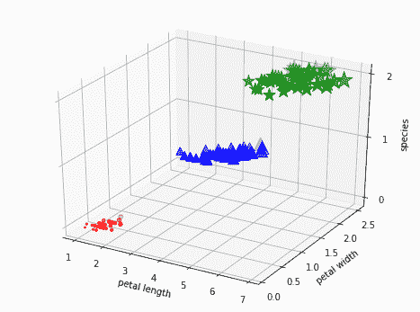

## 条形图

在本秘籍中，我们将学习如何在 3D 模式下绘制条形图。 我们将使用电池销售数据，该数据已在第 2 章和“基本绘图”入门中用于表格绘制。 在这里，我们只会在条形图下方绘制条形图，而不是表格图。

## 准备

导入所需的库：

```py
import numpy as np
import matplotlib.pyplot as plt
from mpl_toolkits.mplot3d import Axes3D
```

## 操作步骤

以下是实现逻辑的步骤：

1.  定义用于 3D 绘图的图形和轴域：

```py
fig = plt.figure(figsize=(10,6))
ax = fig.add_subplot(111, projection='3d')
```

2.  准备 *x*，*y* 和 *z* 轴的数据：

```py
## Years for which we have battery sales data
x = [2011, 2012, 2013, 2014, 2015]

## Repeat X, 5 times to represent each of the 5 battery ratings
X = x * 5

## List of Battery ratings
battery_ratings = ['7Ah', '35Ah', '40Ah', '135Ah', '150Ah']

## Number of units sold each year, each rating. e.g. 75 units of 7Ah(0) batteries, 144 units of 35Ah(1) #batteries sold in 2011
Y = np.array([[75, 144, 114, 102, 108],
              [90, 126, 102, 84, 126],
              [96, 114, 75, 105, 135],
              [105, 90, 175, 90, 75],
              [90, 75, 135, 75, 90]])

## Represent battery rating in numeric codes
yticks = [0, 1, 2, 3, 4] 

## Use different color for each of the battery ratings
colors = ['r', 'g', 'b', 'y', 'm']
```

3.  绘制条形图：

```py
i=0
for c, k in zip(colors, yticks):
    cs = [c] * len(X)
    ax.bar(X[i:i+5], Y[:,int(i/5)], zs=k, zdir='y', color=cs, 
           alpha=0.8)
    i += 5
```

4.  设置图表的标签：

```py
ax.set_yticks(yticks)
ax.set_yticklabels(battery_ratings)
ax.set_xlabel('Year')
ax.set_ylabel('Battery Type')
ax.set_zlabel('Units Sold')
```

5.  在屏幕上显示该图：

```py
plt.show()
```

## 工作原理

这是前面代码的解释：

*   *x* 和 *y* 是长度为 25 的列表，分别代表年份和所售单位的数量。
*   `yticks`以数字格式表示电池额定值，将在 *y* 轴上标出。
*   `colors`是连续用于和电池额定值中每种颜色的五种颜色的列表。
*   `for`循环在每次迭代中连续绘制一项电池额定数据。
*   `cs = [c] * len(X)`创建一个长度为`X`的相同颜色`c`的列表。
*   `ax.bar(X[i:i+5], Y[:,int(i/5)], zs=k, zdir='y', color=cs, alpha=0.8)`绘制，条形图：

    *   从`X`和`Y`数组中提取每种电池类型的五个元素（代表五年），以绘制一行横条。
    *   `zs=k`指定将数字电池额定值映射到 *z* 轴。
    *   `zdir='y'`指定交换 *z* 和 *y* 轴，以便在 *y* 轴绘制`Z`数据。 在 *z* 轴域上绘制`y`数据。
    *   `alpha=0.8`指定图形所需的透明度级别
*   *步骤 4* 和*步骤 5* 对您来说非常熟悉。

执行代码后，您应该看到此处显示的图形：

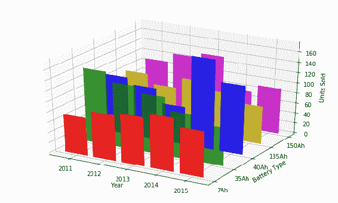

## 多边形图

在本秘籍中，我们将学习如何绘制多边形图。 它类似于折线图，但在折线下填充。 在此示例中，我们还将使用相同的电池销售数据。

## 准备

导入所需的库：

```py
import numpy as np
import matplotlib.pyplot as plt
from mpl_toolkits.mplot3d import Axes3D
from matplotlib.collections import PolyCollection
from matplotlib.ticker import MultipleLocator
```

## 操作步骤

以下是编码逻辑的步骤：

1.  定义用于 3D 绘图的图形和轴域：

```py
fig = plt.figure(figsize=(10,6))
ax = fig.add_subplot(111, projection='3d')
```

2.  准备 *x*，*y* 和 *z* 轴的数据：

```py
## Years for which we have battery sales data
x = [2011, 2012, 2013, 2014, 2015]

## Repeat X, 5 times to represent each of the 5 battery ratings
X = x * 5

## List of Battery ratings
battery_ratings = ['7Ah', '35Ah', '40Ah', '135Ah', '150Ah']

## Number of units sold each year, each rating. e.g. 75 units of 7Ah(0) batteries, 
## 144 units of 35Ah(1) batteries sold in 2011
Y = np.array([[75, 144, 114, 102, 108],
              [90, 126, 102, 84, 126],
              [96, 114, 75, 105, 135],
              [105, 90, 175, 90, 75],
              [90, 75, 135, 75, 90]])

## Represent battery rating in numeric codes
yticks = [0, 1, 2, 3, 4] 

## Use different color for each of the battery ratings
colors = ['r', 'g', 'b', 'y', 'm']
```

3.  准备要绘制的多边形的顶点：

```py
vertices = []
for i in np.arange(0, 25, 5):
    vertices.append([(xs[i], 0.)] + list(zip(xs[i:i+5], Y[:,int(i/5)])) + [(xs[i+4], 0.)])
```

4.  绘制条形图：

```py
poly = PolyCollection(vertices, facecolors=['r', 'g', 'b', 'y', 'm'], alpha=0.6)
ax.add_collection3d(poly, zs=yticks, zdir='y')
```

5.  将 *x* 轴的主要刻度设置为`1`的增量：

```py
majorLocator = MultipleLocator(1)
ax.xaxis.set_major_locator(majorLocator)
```

6.  设置 *x*，*y* 和 *z* 轴的限制：

```py
ax.set_xlim(2011, 2015)
ax.set_ylim(-1,4)
ax.set_zlim(0,175)
```

7.  设置 *y* 轴的刻度，并为 *x*，*y* 和 *z* 轴设置标签：

```py
ax.set_yticks(yticks)
ax.set_yticklabels(battery_ratings)
ax.set_xlabel('Year')
ax.set_ylabel('Battery Type')
ax.set_zlabel('Units Sold')
```

8.  在屏幕上显示该图：

```py
plt.show()
```

## 工作原理

这是代码的说明：

*   前两个步骤与前面的秘籍完全相同
*   `vertices.append([(xs[i], 0.)] + list(zip(xs[i:i+5], Y[:,int(i/5)])) + [(xs[i+4], 0.)])`创建给定电池额定值的顶点。 `for`循环会为所有电池额定值创建此类顶点。`(xs[i], 0)`和`(xs[i+4],0.)`是在 *x* 轴上终止的端点，其中 *y* 坐标为零， *x* 坐标是序列中的第一个和最后一个点。 将这两个点相加即可完成围绕 *x* 轴的循环，以便可以绘制出填充的多边形。
*   `poly = PolyCollection(vertices, facecolors=['r', 'g', 'b', 'y', 'm'], alpha=0.6)`定义了一个多边形的集合，它等于给定的顶点：
    *   `facecolors=['r', 'g', 'b', 'y', 'm']`定义用于填充每个电池额定值的多边形的颜色。
    *   `alpha=0.6`定义每个填充多边形的透明度级别。
*   `ax.add_collection3d(poly, zs=yticks, zdir='y')`将集合添加到轴域，这实际上是绘制集合图的图：
    *   `zs=yticks`将`yticks`设置为 *z* 轴
    *   `zdir='y'`交换 *z* 和 *y* 轴数据，以便`y`数据用于 *z* 轴，而`Z`数据用于 *y* 轴，就像我们在前面的秘籍中所做的一样。
*   `majorLocator = MultipleLocator(1)`以 1 为步长定义`majorLocator`，`ax.xaxis.set_major_locator(majorLocator)`将其应用于 *x* 轴，以便不绘制和浮点数的年份。
*   `ax.set_xlim(2011, 2015)`，`ax.set_ylim(-1,4)`和`ax.set_zlim(0,175)`应用 *x*，*y* 和 *z* 轴的上限和下限。 这里需要这些来显示图形，因为此处的多边形和补丁是浮动对象，`pyplot`不知道使用的默认限制，这与所有其他情况不同，其中它会根据源数据中的数据点来确定限制。
*   您已经熟悉了最后两个步骤。

在运行前面的代码时，您应该在屏幕上看到以下图形：

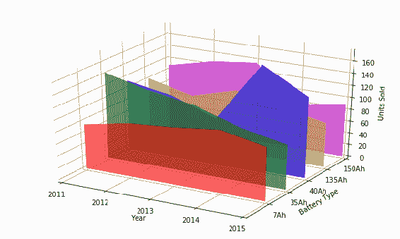

## 更多

对于前面的示例，我们使用了`PolyCollection`。 Matplotlib 中还有两个其他选项，`LineCollection`和`PatchCollection`。

## 等高线图

我们在第 2 章和“基本绘图入门”中学习了如何绘制 2D 等高线图。 在这里，我们将学习如何在 3D 模式下绘制它。 我们将使用与之前相同的数据，以便我们可以看到 2D 和 3D 可视化之间的差异。

## 准备

导入所需的库：

```py
from mpl_toolkits.mplot3d import axes3d
import matplotlib.pyplot as plt
import pandas as pd
from matplotlib import cm
```

## 操作步骤

以下是创建所需图的步骤：

1.  定义用于 3D 绘图的图形和轴域：

```py
fig = plt.figure(figsize=(10,8))
ax = fig.gca(projection='3d')
```

2.  加载`Loss`，`theta1`和`theta2`变量的数据：

```py
## Read Loss, theta0 and theta1 values
Loss = pd.read_excel('Loss.xlsx')
theta0_vals = pd.read_excel('theta0.xlsx')
theta1_vals = pd.read_excel('theta1.xlsx')
```

3.  使用`np.meshgrid`准备`X`和`Y`坐标：

```py
X, Y = np.meshgrid(theta0_vals, theta1_vals)
```

4.  绘制`contour`图：

```py
## Plot contour curves
cset = ax.contour(X, Y, Loss, np.logspace(-2,3,100), cmap=cm.coolwarm)
```

5.  绘制颜色条：

```py
fig.colorbar(cset, shrink=0.5, aspect=5)
```

6.  设置标签：

```py
ax.set_xlabel('theta0')
ax.set_ylabel('theta1')
ax.set_zlabel('Loss')
```

7.  在屏幕上显示该图：

```py
plt.show()
```

## 工作原理

这是前面代码的解释：

*   前两个步骤是不言自明的。
*   `X, Y = np.meshgrid(theta0_vals, theta1_vals)`为` theta0`和`theta1`变量创建 *x* 和 *y* 坐标。 请参见第 2 章，“基本绘图入门”，以获得有关`meshgrid`的详细说明。
*   `cset = ax.contour(X, Y, Loss, np.logspace(-2,3,100), cmap=cm.coolwarm)`绘制等高线图。 它为`X`和`Y`的各种值绘制，`Loss`变量的轮廓。 每个轮廓具有`Loss`（*z* 轴）的固定值，因此轮廓沿 *z* 轴垂直放置，而值最低的轮廓位于底部：
    *   `np.logspace(-2,3,100)`指定要绘制轮廓的损耗值范围。 它们的对数空间范围为 -2（线性范围为 0.01）至 +3（线性范围为 1000），并在此范围内均等间隔地采集 100 个样本。
    *   `cmap=cm.coolwarm`指定将`coolwarm`颜色表用于轮廓的可视化。
*   我们还绘制了 2D 中每个轮廓的损耗实际值，但 3D 并没有实现。
*   `fig.colorbar(cset, shrink=0.5, aspect=5)`设置颜色条，以显示与 ， 指定的颜色表不同的颜色的轮廓：
    *   `shrink=0.5`指定颜色条大小从默认大小开始的缩小量。
    *   `aspect=5`在颜色条上指定数据的较大大小与较小大小的比率。
*   最后两个步骤是不言自明的。

运行前面的代码后，您应该在屏幕上看到下图：

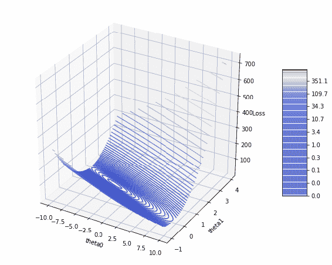

## 更多

填充轮廓图还有另一种选择，其中整个轮廓填充有和指定的颜色。 您只需要在`plot`语句中用`contourf`替换轮廓。

## 曲面图

在本秘籍中，我们将学习如何绘制曲面图。 通常用于在机器学习问题中可视化损失（误差）表面。 当误差面具有**多个最小值**时，有助于查看算法是否卡在任何**局部最小值**中。 我们将使用与，之前的轮廓图相同的数据。

## 准备

导入所需的库：

```py
from mpl_toolkits.mplot3d import axes3d
import matplotlib.pyplot as plt
import pandas as pd
import numpy as np
```

## 操作步骤

以下是绘制曲面图的步骤：

1.  定义图形和 3D 绘图轴域：

```py
fig = plt.figure(figsize=(10,8))
ax = fig.gca(projection='3d')
```

2.  读取曲面图的数据：

```py
## Read Loss, theta0 and theta1 values
Loss = pd.read_excel('Loss.xlsx')
theta0_vals = pd.read_excel('theta0.xlsx')
theta1_vals = pd.read_excel('theta1.xlsx')
```

3.  为`X`和`Y`坐标使用`theta0`和`theta1`的值范围创建`meshgrid`：

```py
X, Y = np.meshgrid(theta0_vals, theta1_vals)
```

4.  绘制曲面图：

```py
## Plot surface graph
surf = ax.plot_surface(X, Y, Loss, cmap='plasma')
```

5.  在图中添加颜色条：

```py
fig.colorbar(surf, shrink=0.5, aspect=5)
```

6.  为图形设置标签：

```py
ax.set_xlabel('theta0')
ax.set_ylabel('theta1')
ax.set_zlabel('Loss')
```

7.  在屏幕上显示该图：

```py
plt.show()
```

## 工作原理

除了*步骤 4*，其中所有步骤均与之前的轮廓图完全相同，在该步骤中，我们将`ax.contour()`替换为`ax.plot_surface()`。 我们还用`plasma`颜色表替换了`coolwarm`颜色表。 其他所有内容都与等高线图相同。

执行代码后，您应该在屏幕上看到下图：

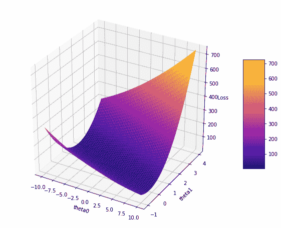

## 线框图

在本秘籍中，我们将学习如何绘制线框图。 它类似于曲面图，其中和选项在每个方向上采样多个点以连接到曲面。 在这里，我们将实现一个动画的线框图。

## 准备

将交互式输出的设置为所需的后端：

```py
import matplotlib
matplotlib.use('Qt5Agg')
```

导入所需的库：

```py
import numpy as np
import matplotlib.pyplot as plt
from mpl_toolkits.mplot3d import Axes3D
```

## 操作步骤

以下是绘制线框图所涉及的步骤：

1.  定义用于 3D 绘图的图形和轴域：

```py
fig = plt.figure(figsize=(8,6))
ax = fig.add_subplot(111, projection='3d')
```

2.  准备 *x* 和 *y* 坐标的数据：

```py
x = np.linspace(-2, 2, 25)
y = np.linspace(-5, 5, 25)
X, Y = np.meshgrid(x, y)
```

3.  设置， *x*，*y* 和 *z* 轴的标签：

```py
ax.set_xlabel('X')
ax.set_ylabel('Y')
ax.set_zlabel('Z')
```

4.  为 *z* 轴设置限制，以使动画激活时，轴刻度不会保持变化：

```py
ax.set_zlim(-4, 4)
```

5.  通过将 *z* 轴数据设为`X`，`Y`的函数，并使用变量`phi`从`0`至`90`度来绘制动画线框图：

```py
wframe = None
for phi in np.linspace(0, 90, 100):
    if wframe:
       ax.collections.remove(wframe)
    Z = np.cos(2 * np.pi * X + phi) * (1 - np.sqrt(X**2 + Y**2))
    wframe = ax.plot_wireframe(X, Y, Z, rstride=2, cstride=2)
    plt.pause(0.1)
```

6.  在 **Qt5** 后端上显示图形：

```py
plt.show()
```

## 工作原理

这是代码的说明：

*   *x* 是从 -2 到 +2 的 25 个数字的列表，它们之间的间距相等； 同样，*y* 是从 -5 到 +5 的 25 个数字的列表， *x* 和 *y* 是 *x* 和 *y* 之间的网格。 
*   `ax.set_zlim(-4, 4)`将的 *z* 轴限制设置为 -4 至 +4。 由于 *z* 是变量`phi`的函数，因此这些数据限制在  *z* 轴上保持变化。 为避免更改图上的限制，请将限制的最大边界设置为 -4 到 +4。
*   `wframe = None`初始化`wframe`变量。
*   `for phi in np.linspace(0, 90, 100):`是`for`循环，从 0 开始，然后以 100 个相等的步长一直到 90 度。
*   `if wframe:`检查线框是否已经存在。 第一次不会出现 。 不会出现，因为我们没有初始化它。 随后，它将始终为真，因此在绘制新的线框之前，将使用`ax.collections.remove(wframe)`将其删除。
*   `Z = np.cos(2 * np.pi * X + phi) * (1 - np.sqrt(X**2 + Y**2))`根据 *x*，*y* 和`phi`的函数计算`Z`值。
*   `wframe = ax.plot_wireframe(X, Y, Z, rstride=2, cstride=2)`绘制线框图：
    *   `rstride`是连接点之前沿行跳过的点数。
    *   `cstride`是连接这些点之前沿列跳过的点数。
*   `plt.pause(0.1)`暂停 0.1 秒，然后绘制下一个线框。 这就是创建动画效果的原因。
*   在这里，我们不需要使用`plt.draw()`或任何其他等效函数来刷新图形。`plot_wireframe`会照顾好它。

运行代码后，在动画完成后，您应该看到下图：

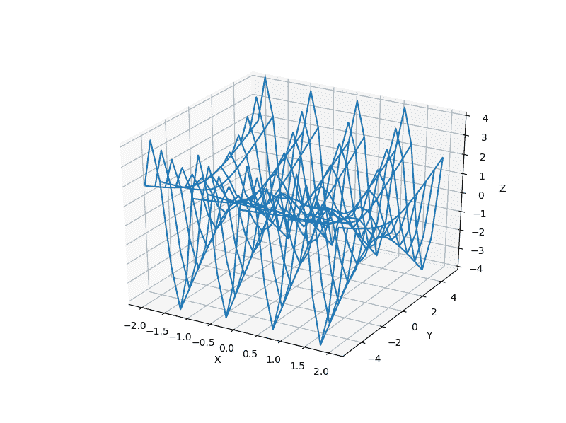

## 三角曲面图

在本秘籍中，我们将学习如何绘制三角形曲面图。 它类似于曲面图，但是曲面将具有三角形连接。 我们将使用不同的数据绘制三个这样的图，并显示轴和不显示轴。

## 准备

导入所需的库：

```py
from mpl_toolkits.mplot3d import Axes3D
import matplotlib.pyplot as plt
import numpy as np
```

## 操作步骤

以下是绘制三角形曲面图的步骤：

1.  准备三个不同图的数据：

```py
## Make radii and angles arrays.
radii = np.linspace(0., 1.0, 16)
angles = np.linspace(0, 2*np.pi, 32)

## Repeat all angles for each radius.
angles = np.repeat(angles[..., np.newaxis], n_radii, axis=1)

## Convert polar (radii, angles) coords to cartesian (x, y) coords.
x = (radii*np.cos(angles)).flatten()
y = (radii*np.sin(angles)).flatten()

## Compute z to make the triangle surface.
z = np.tan(x**2 + y**2)
z1 = np.cos(x**2 + y**2)
z2 = np.cos(x**3 + y**3)
```

2.  定义图：

```py
fig = plt.figure(figsize=(12,6))
```

3.  绘制第一个三角形曲面图：

```py
ax1 = fig.add_subplot(131, projection='3d')
ax1.plot_trisurf(x, y, z, linewidth=0.5, cmap='viridis')
```

4.  绘制第二个三角形曲面图：

```py
ax2 = fig.add_subplot(132, projection='3d')
ax2.plot_trisurf(x, y, z1, linewidth=0.5, cmap='cool')
plt.axis('off')
```

5.  绘制第三个三角形曲面图：

```py
ax3 = fig.add_subplot(133, projection='3d')
ax3.plot_trisurf(x, y, z2, linewidth=0.5, color='c')
plt.axis('off')
```

6.  在屏幕上显示该图：

```py
plt.show()
```

## 工作原理

这是代码的说明：

*   `np.linspace(0., 1.0, 16)`将的 0 到 1 范围划分为 16 个相等的部分，因为半径定义了在 0 和 1 之间平均分布的半径数，类似地，角度定义了在 0 和`2 * pi`之间平均分布的角度数（360 度）。
*   `np.repeat(angles[..., np.newaxis], n_radii, axis=1)`，为每个半径重复角度数组，创建一个`32 x 16`的矩阵：
    *   `np.newaxis`为每个半径创建一个附加大小。
    *   `axis=1`指定应将每个新维度添加为一列。
*   `x = (radii*np.cos(angles)).flatten()`使用极坐标在笛卡尔坐标系中创建 *x* 坐标。
*   `y = (radii*np.sin(angles)).flatten()`使用极坐标在笛卡尔坐标系中创建 *x* 坐标。
*   `z = np.tan(x**2 + y**2)`计算`plot1`的 *z* 坐标。
*   `z1 = np.cos(x**2 + y**2)`计算`plot2`的 *z* 坐标。
*   `z2 = np.cos(x**3 + y**3)`计算`plot3`的 *z* 坐标。
*   `fig = plt.figure(figsize=(12,6))`定义并实例化该图形。
*   `ax1 = fig.add_subplot(131, projection='3d')`定义了第一个轴域，`ax1.plot_trisurf(x, y, z, linewidth=0.5, cmap='viridis')`绘制了第一张图。 指定的色表是`'viridis'`。
*   `ax2 = fig.add_subplot(132, projection='3d')`定义第二个轴域，`ax2.plot_trisurf(x, y, z1, linewidth=0.5, cmap='cool')`绘制第二个图。 指定的色表是`cool`。
*   `plt.axis('off')`指定不显示绘图上的轴。
*   `ax3 = fig.add_subplot(133, projection='3d')`定义了第三个轴域。`ax3.plot_trisurf(x, y, z2, linewidth=0.5, color='c')`绘制了第三个图。 我们使用单色代替该颜色表，并再次关闭轴。

执行代码后，您应该在屏幕上看到三个图形的图形：

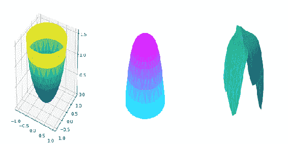

## 在 3D 模式下绘制 2D 数据

在本秘籍中，我们将学习如何在 3D 模式下绘制 2D 数据。 我们将根据原因码将产品缺陷绘制为条形图，将累积缺陷绘制为线形图。 我们将在 *x* 轴，*z* 轴和 *y* 轴上的累积缺陷百分比。 在 2D 空间中，有两个 *y* 轴，其中一个具有条形图的比例，另一个具有折线图的比例。

## 准备

导入所需的库：

```py
import matplotlib.pyplot as plt
from mpl_toolkits.mplot3d import Axes3D
```

## 操作步骤

以下是绘制和所需 3D 图的步骤：

1.  定义用于 3D 绘图的图形和轴域：

```py
fig = plt.figure(figsize=(10,6))
ax = fig.add_subplot(111, projection='3d')
```

2.  定义条形图的数据并绘制：

```py
x = [0, 1, 2, 3, 4, 5]
y = [19, 12, 6, 4, 3, 2]
ax.bar(x, y, zs=0, zdir='y', label='Number of Defects in (X,Z)')
```

3.  为累积缺陷图定义的数据并绘制：

```py
x = [0, 1, 2, 3, 4, 5]
y = [41, 67, 80, 89, 96, 100]
ax.plot(x, y, zs=0, zdir='z', color='g', lw=5, label='Cumulative Defects in (X,Y)')
```

4.  设置 *y* 和 *z* 轴的限制：

```py
ax.set_ylim(0,100)
ax.set_zlim(0,20)
```

5.  为 *x*，y 和 *z* 轴设置标签，并设置图例：

```py
ax.set_xlabel('Defect Reason Code')
ax.set_ylabel('Cumulative %of defects')
ax.set_zlabel('Number of Defects')
ax.legend(loc='best')
```

6.  在屏幕上显示图：

```py
plt.show()
```

## 工作原理

这是代码的说明：

*   `x = [0, 1, 2, 3, 4, 5]`是产品缺陷原因代码的列表。
*   `y = [19, 12, 6, 4, 3, 2]`是按原因代码列出的缺陷计数。
*   `ax.bar(x, y, zs=0, zdir='y', label='Number of Defects in (X,Z)')`绘制条形图：
    *   缺陷原因代码在 *x* 轴上，缺陷数量在 *z* 轴上。
    *   `zdir='y'`交换 *y* 和 *z* 轴，以便在 *z* 轴域上绘制`y`数据。 在 *y* 轴域上绘制`z`数据，在这种情况下为零。
    *   指定的标签将显示在图例中。
*   `y = [41, 67, 80, 89, 96, 100]`是累积缺陷占总数百分比的列表。
*   `ax.plot(x, y, zs=0, zdir='z', color='g', lw=5, label='Cumulative Defects in (X,Y)')`绘制线形图：
    *   缺陷原因代码在 *x* 轴上，累积缺陷在 *y* 轴上。
    *   `zdir='z'`指定在上将`z`数据绘制在 z 轴上，在此情况下，轴由`zs=0`指定为零。
    *   `color='g'`指定和线形图应为绿色。
    *   `lw=5`指定图的线宽应为五个单位。
    *   标签将显示在图例上。
*   `ax.set_ylim(0,100)`设置 *y* 轴的上限和下限，`ax.set_zlim(0,20)`设置 *z* 轴的下限和上限。
*   `ax.set_xlabel('Defect Reason Code')`设置 *x* 轴的标签。
*   `ax.set_ylabel('Cumulative %of defects')`设置 *y* 轴的标签。
*   `ax.set_zlabel('Number of Defects')`设置 *z* 轴的标签。
*   `ax.legend(loc='best')`指定自动为图例选择最佳位置。

运行代码后，您应该在屏幕上看到下图：

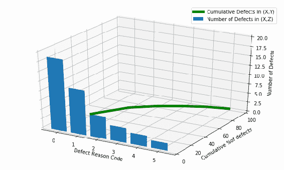

## 在 3D 中可视化 2D 中的线性不可分离数据

在本秘籍中，我们将学习如何可视化在 3D 中线性不可分离的 2D 数据。 这通常用于解释支持向量机算法的内部工作原理，该算法将较低维的数据带到较高维的空间，以便可以找到一个平面。将数据整齐地分离为各种群集。

我们将使用相同的数据绘制 2D 和 3D 图，以使其可视化效果更好。

## 准备

导入所需的库：

```py
import pandas as pd
import numpy as np
import matplotlib.pyplot as plt
from mpl_toolkits.mplot3d import Axes3D
```

## 操作步骤

这是绘制和所需图形的步骤：

1.  将数据从 Excel 文件读取到列表中：

```py
## Read the Data, two product test scores, and result 1 means accepted and 0 means rejected
scores_data = pd.read_csv('test_scores_results.txt',header=None)
```

2.  创建一个 Pandas 数据帧可以轻松地将数据分为不同的类别：

```py
## Add columns labels to the data
columns = ['Test1_Score', 'Test2_Score', 'Accepted']
scores_data = np.array(scores_data)
df = pd.DataFrame(data=scores_data, columns=columns)
```

3.  将数据分为`accepted`和`rejected`类别：

```py
df_accepted = df[(df['Accepted'] == 1.0)]
df_rejected = df[(df['Accepted'] == 0.0)]
```

4.  将数据分为`accepted`和`rejected`类别的 *x* 和 *y* 坐标：

```py
accepted_score1 = np.array(df_accepted)[:,0]
accepted_score2 = np.array(df_accepted)[:,1]

rejected_score1 = np.array(df_rejected)[:,0]
rejected_score2 = np.array(df_rejected)[:,1]
```

5.  定义并实例化图形：

```py
fig = plt.figure(figsize=(12,8))
```

6.  定义 2D 绘图的轴域并绘制`accepted`和`rejected`数据点：

```py
ax = fig.add_subplot(121)
ax.plot(accepted_score1, accepted_score2, 'gD', label='Accepted')
ax.plot(rejected_score1, rejected_score2, 'ro', label='rejected')
```

7.  绘制 2D 图的标签和图例：

```py
plt.xlabel('Test1 Score')
plt.ylabel('Test2 Score')
plt.legend(loc='best')
```

8.  定义 3D 绘图的轴域：

```py
ax = fig.add_subplot(122, projection='3d')
```

9.  将接受和拒绝的数据点绘制为散点图：

```py
ax.scatter(accepted_score1, accepted_score2, zs=-0.75, zdir='z', s=50, color='g', 
           marker='D',   label='Accepted')
ax.scatter(rejected_score1, rejected_score2, zs=0.75, zdir='y', s=50, color='r', 
           marker='o', label='rejected')
```

10.  为 3D 图设置标签，限制和图例：

```py
ax.set_xlabel('Test1 Score')
ax.set_ylabel('Test2 Score')
ax.set_zlabel('Test2 Score')
ax.set_zlim(-1, 1)
ax.legend(loc='best')
```

11.  在屏幕上显示该图：

```py
plt.show()
```

## 工作原理

这是前面代码的解释：

*   `scores_data = pd.read_csv('test_scores_results.txt',header=None)`从 Excel 文件的中读取数据，该文件没有标题。 它具有*测试 1* 和*测试 2* 得分，`rejected`状态为`0`，`accepted`状态为`1`。
*   `scores_data = np.array(scores_data)`将`scores_data`转换为 NumPy 数组。
*   `df = pd.DataFrame(data=scores_data, columns=columns)`使用`scores_data`数组和列名列表创建`pandas`数据帧`df`。
*   `df_accepted = df[(df['Accepted'] == 1.0)]`使用`test1`和`test2`得分为`accepted`数据创建`df_accepted`数据帧。
*   `df_rejected = df[(df['Accepted'] == 0.0)]`使用`test1`和`test2`得分为`rejected`数据创建`df_rejected`数据帧。
*   `accepted_score1 = np.array(df_accepted)[:,0]`和`accepted_score2 = np.array(df_accepted)[:,1]`是`accepted`类别的 *x* 和 *y* 坐标。
*   `rejected_score1 = np.array(df_rejected)[:,0]`和`rejected_score2 = np.array(df_rejected)[:,1]`是`rejected`类别的 *x* 和 *y* 坐标。
*   `ax.plot(accepted_score1, accepted_score2, 'gD', label='Accepted')`绘制二维图，其中`accepted`类别点为绿色散点图，并带有菱形标记。 由于未提供线型参数，因此将其视为散点图。
*   `ax.plot(rejected_score1, rejected_score2, 'ro', label='rejected')`将，`rejected`类别点绘制为红色的散点图，并带有一个圆形标记。 由于未提供线型参数，因此将其视为散点图。
*   `ax.scatter(accepted_score1, accepted_score2, zs=-0.75, zdir='z', s=50, color='g', marker='D', label='Accepted')`在 *xy* 平面上绘制 3D 散点图，其中`accepted`类的`z = -0.75`。
*   `ax.scatter(rejected_score1, rejected_score2, zs=0.75, zdir='y', s=50, color='r', marker='o', label='rejected')`在 *xy* 平面上绘制 3D 散点图，其中`rejected`类别的`z = 0.75`。
*   其余的语句是不言自明的。

运行代码后，您应该在屏幕上看到下图：

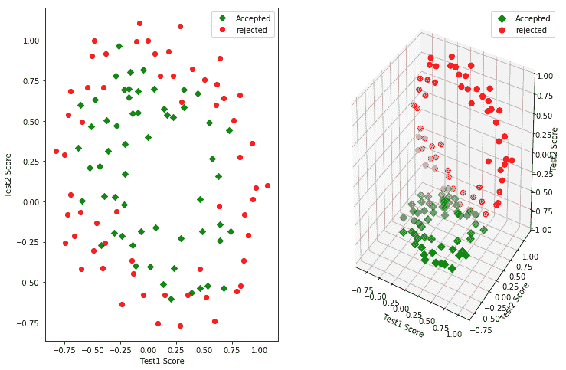

## 词嵌入

在第 7 章，“嵌入文本和表达式”中，我们学习了如何在 2D 空间中绘制单词嵌入。 在这里，我们将学习如何在 3D 空间中绘制相同的单词嵌入。 要创建所需数据，我们将必须运行具有三个分量的`t-SNE`算法以生成 x，y 和 z 坐标。 我们将使用此输出来绘制图形。

## 准备

导入所需的库：

```py
from mpl_toolkits.mplot3d import Axes3D
import matplotlib.pyplot as plt
import pickle
```

## 操作步骤

以下是绘制单词嵌入图所涉及的步骤：

1.  使用`pickle`加载所需的数据：

```py
threed_embeddings = pickle.load(open('threed_embeddings','rb'))
reverse_dictionary = pickle.load(open('word_reverse_dictionary', 
                                      'rb'))
```

2.  创建用于 3D 绘图的图形和轴域：

```py
fig = plt.figure(figsize=(20,20))
ax = fig.gca(projection='3d')
```

3.  为每个`400`最高字词绘制带有文本标注的散点图：

```py
num_points = 400
words = [reverse_dictionary[i] for i in range(1, num_points+1)]
for i, label in enumerate(words):
    x, y, z = threed_embeddings[i,:]
    ax.scatter(x, y, z)
    ax.text(x, y, z, label, ha='right', va='bottom')
```

4.  设置 *x*，*y* 和 *z* 轴的限制和标签：

```py
ax.set_xlim(-800,400)
ax.set_ylim(-200,800)
ax.set_zlim(-800,400)
ax.set_xlabel('x')
ax.set_ylabel('y')
ax.set_zlabel('z')
```

5.  在屏幕上显示该图：

```py
plt.show()
```

## 工作原理

它的工作原理与第 7 章“嵌入文本和表达式”中解释的 2D 等价物类似，不同之处在于输入文件具有三个组成部分，它们映射到三个维度 *x*，*y* 和 *z*。

运行代码后，您应该在屏幕上看到下图：

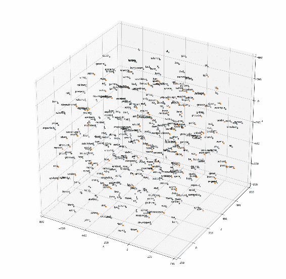

在这里，与 2D 等价物相比，相似的词看起来很少。 例如，数字 1、2、3、4、5 等看起来更远，而在 2D 中它们看起来像是一个不错的簇。 但是，它们仍然相对在一起。