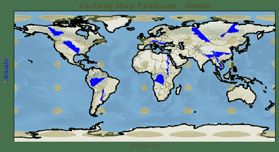
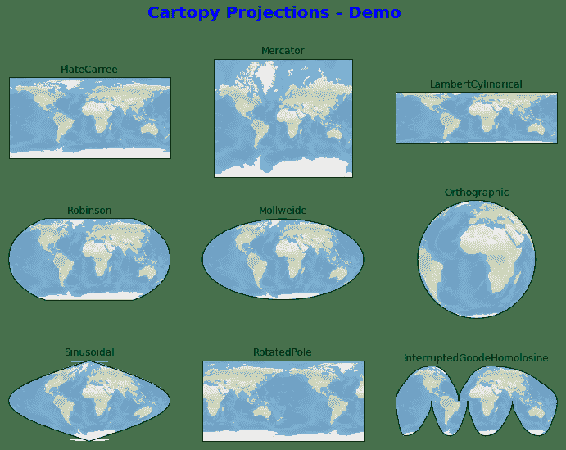
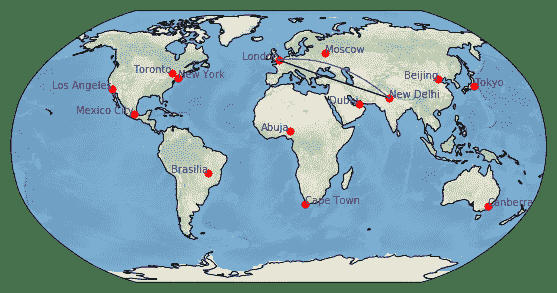
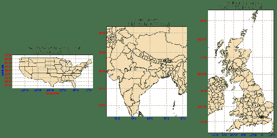
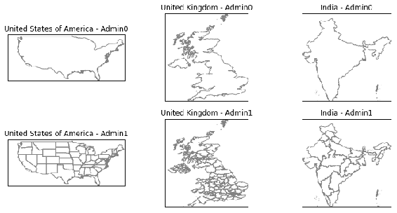
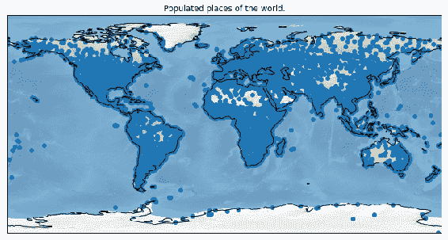
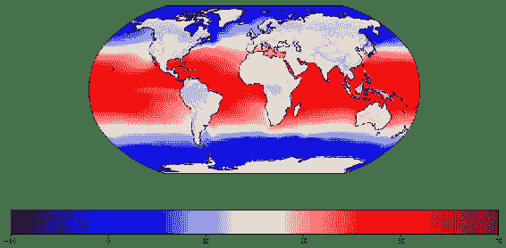
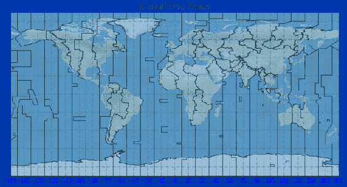

# 十三、使用 Cartopy 工具包绘制地理地图

在本章中，我们将介绍以下秘籍：

*   绘制基本地图特征
*   绘制投影
*   使用网格线和标签
*   在地图上绘制位置
*   绘制具有政治边界的国家地图
*   使用 GeoPandas 和 Cartopy 绘制国家地图
*   绘制世界人口稠密的地方
*   绘制人口前五名和后五名的国家
*   绘制全球温度
*   绘制时区
*   绘制动画地图

## 介绍

Cartopy 是用于在 Matplotlib 上绘制地理地图的第三方工具包。 预计到 2020 年，Cartopy 将取代 Basemap。Cartopy 具有多种功能，可满足许多不同的用户群体。 在这里，我们将尝试介绍企业中通常使用的大多数功能。

地理地图以经度和纬度绘制，均以度为单位。 经度绘制在 *x* 轴上，并且从西到 180 度（-180）到东到 180 度（180）变化。 纬度绘制在 *y* 轴上，并且从向南 90 度（-90）到向北 90 度（90）变化。 地图上的位置以其经度和纬度值标识。

## 绘制基本地图特征

在本秘籍中，我们将学习 Cartopy 提供的用于绘制地图的基本功能。 该秘籍将涵盖国家边界，沿海地区与陆地，陆地区域，海洋，河流和湖泊的边界等特征。 它还将介绍如何提供背景图像以实现更好的可视化效果。

## 准备

您需要使用以下命令导入所需的库：

```py
import matplotlib.pyplot as plt
import cartopy.crs as ccrs
import cartopy.feature as cfeature
```

## 操作步骤

以下是绘制基本地图所涉及的步骤：

1.  如下定义图形和轴域：

```py
fig = plt.figure(figsize=(12,8))
ax = fig.add_subplot(1, 1, 1, projection=ccrs.PlateCarree())
```

2.  使用以下命令设置范围和背景图像：

```py
ax.set_global()
ax.stock_img()
```

3.  添加如下所需的特征以在地图中绘制：

```py
ax.add_feature(cfeature.LAND, color='wheat')
ax.add_feature(cfeature.OCEAN, color='skyblue')
ax.add_feature(cfeature.COASTLINE, linestyle='-',lw=3)
ax.add_feature(cfeature.BORDERS, linestyle=':')
ax.add_feature(cfeature.LAKES, alpha=0.5, color='y')
ax.add_feature(cfeature.RIVERS, color='blue')
ax.tissot(facecolor='orange', alpha=0.4) # Tissot's indicatrix in cartography
```

4.  设置标题和标签，如下所示：

```py
ax.set_title('Cartopy Map Features - Demo', size=20, weight='bold', color='g')

ax.text(0.5, -0.06, 'Longitude', va='bottom', ha='center', size=15, color='r',
       rotation='horizontal', rotation_mode='anchor', transform=ax.transAxes)
ax.text(-0.02, 0.55, 'Latitude', va='bottom', ha='center', size=15, color='b',
        rotation='vertical', rotation_mode='anchor', transform=ax.transAxes)
```

5.  最后，使用以下命令在屏幕上显示地图：

```py
plt.show()
```

## 工作原理

这是前面代码的解释：

*   `import cartopy.crs as ccrs`导入负责设置参考坐标系的包。
*   `import cartopy.feature as cfeature`导入用于绘制各种特征（如陆地，海洋，河流和湖泊）的包装。
*   `ax = fig.add_subplot(1, 1, 1, projection=ccrs.PlateCarree())`定义要在其上绘制地图的轴域，如下所示：
    *   `(1,1,1)`指定它是`1 x 1`网格中的第一个轴域，这实际上意味着它是整个图形中的唯一图。
    *   `projection=ccrs.PlateCarree()`指定用于绘制地图的坐标参考系统。 Cartopy 提供了许多这样的投影（参考坐标系）。 在下一秘籍中，我们将看到很多。
    *   投影仅提供地图的轮廓，因此根据我们要绘制的内容，我们可以添加各种预定义的特征，然后绘制我们感兴趣的数据。

*   `ax.set_global()`指定坐标系的限制由整个地球形成，这恰好是默认设置。 通过覆盖此全局设置，我们可以设置较小的限制来绘制特定的关注区域。 我们将在后续秘籍中学习如何执行此操作。
*   `ax.stock_img()`在背景上绘制默认图像，以提供更好的可视化效果。 也可以用我们自己的图像覆盖它。
*   `ax.add_feature(cfeature.LAND, color='wheat')`绘制使用`wheat`颜色设置标记为陆地的区域。
*   `ax.add_feature(cfeature.OCEAN, color='skyblue')`使用`skyblue`颜色设置绘制海洋。
*   `ax.add_feature(cfeature.COASTLINE, linestyle='-',lw=3)`绘制了沿沿海地区将土地和水分离的线，线宽为`3`点，虚线样式。
*   `ax.add_feature(cfeature.BORDERS, linestyle=':')`使用冒号线型绘制国家边界。
*   `ax.add_feature(cfeature.LAKES, alpha=0.5, color='y')`使用`yellow`颜色设置绘制湖泊。
*   `ax.add_feature(cfeature.RIVERS, color='blue')`使用颜色`blue`绘制河流。
*   `ax.tissot(facecolor='orange', alpha=0.4)`绘制天梭的底线。
*   `ax.set_title('Cartopy Map Features - Demo', size=20, weight='bold', color='g')`打印带有各种文本相关属性的标题。
*   `ax.text()`用于打印 *x* 和 *y* 标签。 常规的`ax.set_xlabel`和`ax.set_ylabel`命令在这里不起作用，因为`ax.gridlines()`函数具有轴域控件，该函数也没有用于绘制 *x* 和 *y* 轴标签的预定义方法。

运行上述代码后，您应该在屏幕上看到以下地图：



## 绘制投影

如先前的秘籍中所述，投影是在其中绘制地图的坐标参考系统。 Cartopy 提供了许多不同的投影，在本秘籍中，我们将绘制九个带有默认参数的投影，以演示它们的外观。 可用投影的完整列表可以在[这个页面](https://scitools.org.uk/cartopy/docs/latest/crs/projections.html)中找到。

## 准备

您需要使用以下命令导入所需的库：

```py
import cartopy.crs as ccrs
import matplotlib.pyplot as plt
```

## 操作步骤

以下是绘制九种不同投影所涉及的步骤：

1.  定义图：

```py
fig = plt.figure(figsize=(12,9))
```

2.  将`3 x 3`网格中的轴域一一定义为子图，并为每个图使用不同的投影，如下所示：

```py
ax1 = fig.add_subplot(331, projection=ccrs.PlateCarree())
```

3.  为每个图设置默认的背景图像：

```py
ax1.stock_img()
```

4.  打印图的标题，如下所示：

```py
ax1.set_title('PlateCarree', color='green')
```

5.  然后，对我们的九种不同投影重复*步骤 1* 至*步骤 4*。 请参阅此处的示例：

```py
ax2 = fig.add_subplot(332, projection=ccrs.Mercator())
ax2.stock_img()
ax2.set_title('Mercator', color='green')

ax3 = fig.add_subplot(333, projection=ccrs.LambertCylindrical())
ax3.stock_img()
ax3.set_title('LambertCylindrical', color='green')

ax4 = fig.add_subplot(334, projection=ccrs.Robinson())
ax4.stock_img()
ax4.set_title('Robinson', color='green')

ax5 = fig.add_subplot(335, projection=ccrs.Mollweide())
ax5.stock_img()
ax5.set_title('Mollweide', color='green')

ax6 = fig.add_subplot(336, projection=ccrs.Orthographic())
ax6.stock_img()
ax6.set_title('Orthographic', color='green')

ax7 = fig.add_subplot(337, projection=ccrs.Sinusoidal())
ax7.stock_img()
ax7.set_title('Sinusoidal', color='green')

ax8 = fig.add_subplot(338, projection=ccrs.RotatedPole())
ax8.stock_img()
ax8.set_title('RotatedPole', color='green')

ax9 = fig.add_subplot(339, projection=ccrs.InterruptedGoodeHomolosine())
ax9.stock_img()
ax9.set_title('InterruptedGoodeHomolosine', color='green')
```

6.  为整个图形打印一个超级标题：

```py
fig.suptitle("Cartopy Projections - Demo", size=20, weight='bold', color='blue')
```

7.  最后，使用以下命令在屏幕上显示整个图形：

```py
plt.show()
```

## 工作原理

这是前面代码的解释：

*   `ax1 = fig.add_subplot(331, projection=ccrs.PlateCarree())`在`9`个轴域（曲线）的`3 x 3`网格上定义了第一个轴域，并对轴域使用`PlateCarree`投影，如以下屏幕截图所示
*   `ax1.stock_img()`将默认图像绘制为地图的背景。
*   对所有九个预测重复前两个步骤
*   由于这是可用的示例投影的演示，因此我们不会添加任何预定义功能或任何其他用户定义的地图

执行上述代码后，您应该在屏幕上看到以下图表：



## 使用网格线和标签

在本秘籍中，我们将学习如何绘制网格线以及如何管理刻度线和刻度线标签。 Cartopy 具有预定义的`gridlines()`函数来管理这些功能，该功能具有许多助手函数，可根据需要格式化标签。

我们将绘制四个图表来演示默认选项，以及当我们要以特定的自定义方式绘制标签时可能的自定义程度。

## 准备

您需要使用以下命令导入所需的库：

```py
import matplotlib.pyplot as plt
import matplotlib.ticker as mticker
from cartopy.mpl.ticker import LongitudeFormatter, LatitudeFormatter
import cartopy.crs as ccrs
from cartopy.mpl.gridliner import LONGITUDE_FORMATTER, LATITUDE_FORMATTER
```

## 操作步骤

以下是使用各种选项设置刻度和标签格式来绘制四个图表的步骤：

1.  在第一个图上用`PlateCarree`投影定义图形和轴域，如下所示：

```py
fig = plt.figure(figsize=(12,8))
ax1 = fig.add_subplot(221, projection=ccrs.PlateCarree())
```

2.  应用默认图像作为背景，并将海岸线特征添加到绘图中：

```py
ax1.stock_img()
ax1.coastlines()
```

3.  定义`gridlines()`函数，如下所示：

```py
gl1 = ax1.gridlines(crs=ccrs.PlateCarree(), draw_labels=True,
                    linewidth=2, color='gray', alpha=0.5, 
                    linestyle='--')
```

4.  关闭上轴和右轴标签：

```py
gl1.xlabels_top = False
gl1.ylabels_right = False
```

5.  定义 *x* 和 *y* 轴标签样式，如下所示：

```py
gl1.xlabel_style = {'size': 10, 'color': 'indigo', 'weight': 'bold'}
gl1.ylabel_style = {'size': 10, 'color':'darkblue','weight': 'bold'}
```

6.  打印标题和 *x* 和 *y* 标签，并为第一张图使用默认的刻度和刻度标签，如下所示：

```py
ax1.set_title('PlateCarree - Default Ticks', color='green', size=15)
ax1.text(0.5, -0.15, 'Longitude', va='bottom', ha='center', 
         size=10, color='r', rotation='horizontal', 
         rotation_mode='anchor', transform=ax1.transAxes)
ax1.text(-0.08, 0.55, 'Latitude', va='bottom', ha='center', 
          size=10, color='b', rotation='vertical', 
          rotation_mode='anchor', transform=ax1.transAxes)
```

7.  使用`Mercator`投影定义第二个绘图的轴域。 应用背景图像，并像以前一样添加海岸线特征：

```py
ax2 = fig.add_subplot(222, projection=ccrs.Mercator())
ax2.stock_img()
ax2.coastlines()
```

8.  定义`gridlines()`函数，如下所示：

```py
gl2 = ax2.gridlines(crs=ccrs.PlateCarree(), draw_labels=True,
                    linewidth=2, color='gray', alpha=0.5, 
                    linestyle='--')
```

9.  关闭下轴和左轴标签：

```py
gl2.xlabels_bottom = False
gl2.ylabels_left = False
```

10.  定义 *x* 和 *y* 轴标签的格式化器：

```py
gl2.xformatter = LONGITUDE_FORMATTER
gl2.yformatter = LATITUDE_FORMATTER
```

11.  定义标签样式，然后为第二个图表打印标题和标签：

```py
gl2.xlabel_style = {'size': 10, 'color': 'indigo', 'weight': 'bold'}
gl2.ylabel_style = {'size': 10, 'color': 'darkblue', 'weight': 
                    'bold'}
ax2.set_title('Mercator - Formatted Ticks', color='green', size=15, 
               pad=30)
ax2.text(0.5, -0.1, 'Longitude', va='bottom', ha='center', 
         size=10, color='r', rotation='horizontal', 
         rotation_mode='anchor', transform=ax2.transAxes)
ax2.text(-0.05, 0.55, 'Latitude', va='bottom', ha='center', 
          size=10, color='b', rotation='vertical', 
          rotation_mode='anchor', transform=ax2.transAxes)
```

12.  对于第三幅图，我们将执行以下操作：
    *   对 *x* 轴使用固定的刻度位置
    *   关闭 *x* 轴的网格线
    *   关闭上轴和左轴的标签

其余功能与前两个图中的相同。 有关示例，请参见以下代码块：

```py
ax3 = fig.add_subplot(223, projection=ccrs.Mercator())
ax3.stock_img()
ax3.coastlines()

gl3 = ax3.gridlines(crs=ccrs.PlateCarree(), draw_labels=True,
                    linewidth=2, color='gray', alpha=0.5, linestyle='--')
gl3.xlabels_top = False
gl3.ylabels_left = False
gl3.xlines = False
gl3.xlocator = mticker.FixedLocator([-180, -45, 0, 45, 180])
gl3.xformatter = LONGITUDE_FORMATTER
gl3.yformatter = LATITUDE_FORMATTER
gl3.xlabel_style = {'size': 10, 'color': 'indigo', 'weight': 'bold'}
gl3.ylabel_style = {'size': 10, 'color': 'darkblue', 'weight': 'bold'}
ax3.set_title('Mercator - Xticks at fixed locations', color='green', size=15)
```

13.  在第四幅图中，我们将完全使用完全自定义的标签和格式选项，而根本不使用`gridlines()`函数，如下所示：

```py
ax4 = fig.add_subplot(2, 2, 4, projection=ccrs.PlateCarree(central_longitude=180))
ax4.set_global()
ax4.stock_img()
ax4.coastlines()

ax4.set_xticks([0, 60, 120, 180, 240, 300, 360], crs=ccrs.PlateCarree())
ax4.set_yticks([-90, -60, -30, 0, 30, 60, 90], crs=ccrs.PlateCarree())
lon_formatter = LongitudeFormatter(zero_direction_label=True, 
                                   number_format='.1f', degree_symbol='')
lat_formatter = LatitudeFormatter(number_format='.1f')
ax4.xaxis.set_major_formatter(lon_formatter)
ax4.yaxis.set_major_formatter(lat_formatter)

[i.set_color("indigo") for i in ax4.get_xticklabels()]
[i.set_weight("bold") for i in ax4.get_xticklabels()]
[i.set_color("darkblue") for i in ax4.get_yticklabels()]
[i.set_weight("bold") for i in ax4.get_yticklabels()]

ax4.set_title('PlateCarree - Xticks & Yticks at fixed locations', 
               color='green', size=15)
```

14.  最后，使用以下命令在屏幕上显示该图：

```py
plt.show()
```

## 工作原理

这是前面代码的解释：

*   `gl1 = ax1.gridlines(crs=ccrs.PlateCarree(), draw_labels=True, linewidth=2, color='gray', alpha=0.5, linestyle='--')`定义要绘制的网格线的格式：
    *   `ccrs.PlateCarree()`指定要使用的参考坐标系（即投影）。 在这种情况下，我们将使用`PlateCarree`投影。
    *   `draw_labels=True`指定要绘制与网格线对齐的刻度和刻度标签。 通过将此参数设置为`False`，可以将其关闭。
    *   `linewidth=2`指定网格线的宽度。
    *   `color='gray'`指定网格线的颜色。
    *   `alpha=0.5`指定网格线的透明度。
    *   `linestyle='--'`指定网格线的样式。
*   `gl1.xlabels_top = False`关闭上轴标签。 默认情况下，`gridlines()`函数为所有四个轴（左，下，上和右）绘制标签。 您可以通过更改此命令来打开或关闭其中的任何一个。
*   `gl1.ylabels_right = False`关闭右轴标签。
*   `gl1.xlabel_style = {'size': 10, 'color': 'indigo', 'weight': 'bold'}`定义要用于 *x* 轴标签的各种属性的字典。
*   `gl1.ylabel_style = {'size': 10, 'color': 'darkblue', 'weight': 'bold'}`定义要用于 *y* 轴标签的各种属性的字典。
*   `ax1.set_title('PlateCarree - Default Ticks', color='green', size=15)`打印具有各种属性的图表标题。
*   `ax1.text(0.5, -0.15, 'Longitude', va='bottom', ha='center', size=10, color='r', rotation='horizontal', rotation_mode='anchor', transform=ax1.transAxes)`绘制 *x* 轴标签：
    *   `(0.5, -0.15)`是在坐标轴中从左至下的坐标，将在其中打印 *x* 轴标签。
    *   `'Longitude'`是要打印的 *x* 轴标签。
    *   `va='bottom'`指定标签应在底部垂直对齐。
    *   `ha='center'`指定标签应在中心水平对齐。
    *   `size=10`指定字体大小。
    *   `color='r'`指定字体颜色。
    *   `rotation='horizontal'`指定标签相对于轴的打印角度。 在这种情况下，角度设置为`horizontal`。
    *   `rotation_mode='anchor'`指定标签为锚对象。
    *   `transform=ax1.transAxes`指定给定的坐标在轴域坐标系中。
*   `ax2 = fig.add_subplot(222, projection=ccrs.Mercator())`定义第二张图表的轴域，该图表使用`Mercator`投影。
*   `gl2.xformatter = LONGITUDE_FORMATTER`指定 x 刻度标签的格式选项。
*   `gl2.yformatter = LATITUDE_FORMATTER`指定 y 刻度标签的格式选项。
*   `LONGITUDE_FORMATTER`和`LATITUDE_FORMATTER`是`gridliner`函数内的预定义辅助函数。 它们都有自己的格式设置选项，但是在第二张图表中，我们都使用了所有默认参数。 他们基本上将东/西的方向设置为经度，将北/南的方向设置为纬度，并显示度数符号。 比较前两个图表的刻度标签以查看差异。
*   `gl3.xlines = False`关闭第三张图表在 *x* 轴上着陆的网格线。 您也可以使用`gl.ylines`关闭 *y* 轴网格线。
*   `gl3.xlocator = mticker.FixedLocator([-180, -45, 0, 45, 180])`定义 *x* 轴的刻度位置。 我们没有在`gridliner`的刻度位置中选择，而是在此处手动定义它们。
*   `ax4 = fig.add_subplot(2, 2, 4, projection=ccrs.PlateCarree(central_longitude=180))`定义第四个图表的轴域，如下所示：
    *   `(2, 2, 4)`与`(224)`相同，并指定这是`2 x 2`图表网格中的第四张图表
    *   `PlateCarree()`是要使用的投影
    *   `central_longitude=180`指定纵轴的中心应为 180 度，而不是默认值 0
*   `ax4.set_xticks([0, 60, 120, 180, 240, 300, 360], crs=ccrs.PlateCarree())`定义 *x* 轴的刻度位置和标签。 在第四张图表中，我们没有使用`gridlines()`函数； 因此，我们必须手动设置刻度位置：
    *   `crs=ccrs.PlateCarree()`指定给定的刻度位置在`PlateCarree`坐标系中。 这与投影不同，投影指定了在绘制地图时要使用的坐标系。
    *   如果投影使用一个参考坐标系，并且刻度标签由另一坐标系提供，则通过指定提供数据的坐标系，它将在绘制地图之前将数据转换为投影坐标系。
*   `ax4.set_yticks([-90, -60, -30, 0, 30, 60, 90], crs=ccrs.PlateCarree())`定义 *y* 轴的刻度位置和标签。
*   `lon_formatter = LongitudeFormatter(zero_direction_label=True, number_format='.1f', degree_symbol='')`定义纵轴的格式化器：
    *   `zero_direction_label=True`指定是否应使用`E`符号（向东）打印 0 度
    *   `number_format='.1f'`指定用于数字标签的小数点位数
    *   `degree_symbol=''`指定将不打印度数符号-默认选项是将其打印
*   `[i.set_color("indigo") for i in ax4.get_xticklabels()]`将`'indigo'`颜色应用于 *x* 轴上的刻度标签，`[i.set_weight("bold") for i in ax4.get_xticklabels()]`在其中打印刻度标签粗体：
    *   `get_xticklabels()`获取当前的刻度标签
    *   `set_color()`和`set_weight()`语句将指定的颜色和粗体字体应用于每个刻度标签
    *   接下来的两个语句对 *y* 轴刻度标签执行相同的操作，但是使用`darkblue`颜色

执行上述代码后，您应该在屏幕上看到以下图：


应该注意的是，刻度标签和相关格式仅针对`PlateCarree`和`Mercator`投影定义。 对于其他投影，`gridlines()`会在没有刻度标签的情况下进行绘图，因此我们无法在`gridlines()`上使用`draw_labels=True`参数进行投影。

## 在地图上绘制位置

在本秘籍中，我们将学习如何在地图上绘制具有给定经度和纬度参数的位置。 这样就可以根据位置之间的相对位置直观地表示位置。 我们还将学习如何在地球上沿直线和球形方向连接两个位置。

## 准备

您需要使用以下命令导入所需的库：

```py
import matplotlib.pyplot as plt
import cartopy.crs as ccrs
```

## 操作步骤

这是绘制地图和全球各地的必要步骤。 您可以获取互联网上各个位置的经度和纬度信息。 在这里，我们将绘制主要城市，主要是国家的首都：

1.  定义要在其上绘制地图的图形和轴域：

```py
fig = plt.figure(figsize=(10, 5))
ax = fig.add_subplot(1, 1, 1, projection=ccrs.Robinson())
```

2.  设置背景图像并添加海岸线特征：

```py
ax.set_global()
ax.stock_img()
ax.coastlines()
```

3.  使用给定的经度和纬度坐标绘制位置，如下所示：

```py
ax.plot(-0.08, 51.53, 'o', transform=ccrs.PlateCarree(), markersize=7, color='r')
```

4.  使用文本函数标记位置：

```py
plt.text(-0.08, 51.53, 'London', size=10, color='indigo', 
          horizontalalignment='right', transform=ccrs.Geodetic())
```

5.  现在，对于我们要绘制的所有城市，重复执行*步骤 1* 至*步骤 4* ，如以下代码块所示：

```py
ax.plot(37.6173, 55.7558, 'o', transform=ccrs.PlateCarree(), markersize=7, color='r')
plt.text(37.6173, 55.7558, 'Moscow', size=10, color='indigo', 
         horizontalalignment='left', transform=ccrs.Geodetic())

ax.plot(77.1, 28.7, 'o', transform=ccrs.PlateCarree(), markersize=7, color='r')
plt.text(77.1, 28.7, 'New Delhi', size=10, color='indigo', 
         horizontalalignment='left', transform=ccrs.Geodetic())

ax.plot(-118.2437, 34.0522, 'o', transform=ccrs.PlateCarree(), markersize=7, color='r')
plt.text(-118.2437, 34.0522, 'Los Angeles', size=10, color='indigo', 
          horizontalalignment='right', transform=ccrs.Geodetic())

ax.plot(-74, 40.7128, 'o', transform=ccrs.PlateCarree(), markersize=7, color='r')
plt.text(-74, 40.7128, 'New York', size=10, color='indigo', 
          horizontalalignment='left', transform=ccrs.Geodetic())

ax.plot(149.13, -35.2809, 'o', transform=ccrs.PlateCarree(), markersize=7, color='r')
plt.text(149.13, -35.2809, 'Canberra', size=10, color='indigo', 
         horizontalalignment='left', transform=ccrs.Geodetic())

ax.plot(116.4074, 39.9042, 'o', transform=ccrs.PlateCarree(), markersize=7, color='r')
plt.text(116.4074, 39.9042, 'Beijing', size=10, color='indigo', 
         horizontalalignment='right', transform=ccrs.Geodetic())

ax.plot(18.4241, -33.9249, 'o', transform=ccrs.PlateCarree(), markersize=7, color='r')
plt.text(18.4241, -33.9249, 'Cape Town', size=10, color='indigo', 
         horizontalalignment='left', transform=ccrs.Geodetic())

ax.plot(55.2708, 25.2048, 'o', transform=ccrs.PlateCarree(), markersize=7, color='r')
plt.text(55.2708, 25.2048, 'Dubai', size=10, color='indigo', 
         horizontalalignment='right', transform=ccrs.Geodetic())

ax.plot(139.6917, 35.6895, 'o', transform=ccrs.PlateCarree(), markersize=7, color='r')
plt.text(139.6917, 35.6895, 'Tokyo', size=10, color='indigo', 
         horizontalalignment='left', transform=ccrs.Geodetic())

ax.plot(-79.3832, 43.6532, 'o', transform=ccrs.PlateCarree(), markersize=7, color='r')
plt.text(-79.3832, 43.6532, 'Toronto', size=10, color='indigo', 
         horizontalalignment='right', transform=ccrs.Geodetic())

ax.plot(7.3986, 9.0765, 'o', transform=ccrs.PlateCarree(), markersize=7, color='r')
plt.text(7.3986, 9.0765, 'Abuja', size=10, color='indigo', # Capital of Nigeria
         horizontalalignment='right', transform=ccrs.Geodetic())

ax.plot(-47.9218, -15.8267, 'o', transform=ccrs.PlateCarree(), markersize=7, color='r')
plt.text(-47.9218, -15.8267, 'Brasilia', size=10, color='indigo', # Capital of Brazil
         horizontalalignment='right', transform=ccrs.Geodetic())

ax.plot(-99.1332, 19.4326, 'o', transform=ccrs.PlateCarree(), 
         markersize=7, color='r')
plt.text(-99.1332, 19.4326, 'Mexico City', size=10, color='indigo', # Capital of Brazil
         horizontalalignment='right', transform=ccrs.Geodetic())
```

6.  现在，绘制伦敦和新德里之间的直线和球面线，如下所示：

```py
ax.plot([-0.08, 77.1], [51.53, 28.7], color='g', transform=ccrs.PlateCarree()) 
ax.plot([-0.08, 77.1], [51.53, 28.7], color='m', transform=ccrs.Geodetic())
```

7.  最后，使用以下命令在屏幕上显示该图：

```py
plt.show()
```

## 工作原理

这是前面代码的解释：

*   `ax = fig.add_subplot(1, 1, 1, projection=ccrs.Robinson())`定义带有`Robinson`投影的轴域。
*   `ax.plot(-0.08, 51.53, 'o', transform=ccrs.PlateCarree(), markersize=7, color='r')`将位置绘制为伦敦，如下所示：
    *   `(-0.08, 51.53)`是伦敦的经度和纬度坐标。
    *   `'o'`是要在地图上绘制位置的标记。
    *   `transform=ccrs.PlateCarree()`指定提供经度和纬度参数的坐标系。 这些坐标将在内部转换为`Robinson`坐标，因为我们正在绘制带有`Robinson`投影的地图。
    *   `markersize=7`指定要在地图上绘制的点的大小，即 7 个点（一个点是 1/72 英寸）。
    *   `color='r'`将定位点被涂成红色。
*   `plt.text(-0.08, 51.53, 'London', size=10, color='indigo', horizontalalignment='right', transform=ccrs.Geodetic())`打印该位置的标签，其中包含名称：
    *   `(-0.08, 51.53)`代表打印标签的经度和纬度坐标。
    *   `'London'`表示要在标签上打印的文本。
    *   `size=10`是要打印的标签的大小。
    *   `color='indigo'`是标签的颜色。
    *   `horizontalalignment='right'`指定位置点应与标签的右侧对齐。
    *   `transform=ccrs.Geodetic()`指定坐标为经度和纬度，以度为单位。 还有一个笛卡尔等效项，即`ccrs.Geocentric`，其中坐标为常规 *x*，*y* 和 *z* 轴格式，以常规方式测量距离指标。
*   `ax.plot([-0.08, 77.1], [51.53, 28.7], color='g', transform=ccrs.PlateCarree())`绘制了一条连接伦敦和新德里的折线图，并指定了它们各自的经度和纬度坐标：
    *   `[-0.08, 77.1]`是伦敦和新德里的经度坐标
    *   `[51.53, 28.7]`是伦敦和新德里的纬度坐标
    *   `color='g'`表示两个城市之间绘制的线条的颜色将变为绿色
    *   `transform=ccrs.PlateCarree()`指定要使用的坐标系，在这种情况下为笛卡尔坐标系，因此将绘制一条直线
*   由于我们正在使用`transform=ccrs.Geodetic()`，因此`ax.plot([-0.08, 77.1], [51.53, 28.7], color='m', transform=ccrs.Geodetic())`沿实际地球仪以球形格式绘制了相同的折线图。 由于颜色参数的`'m'`值，线条的颜色为洋红色。

执行代码后，您应该在屏幕上看到以下图：



## 绘制具有政治边界的国家地图

到目前为止，我们已经制作了覆盖全球的地图，这在您绘制例如全球公司办公室，跨大洲受到流行病影响的地区或跨许多国家的地震的地图时非常有用。

但是，如果要查看特定于某个地区的现象，该现象可能是一个国家，州，省甚至一个国家内的城市，则需要为地图设置较小的范围。 在本秘籍中，我们将学习如何做。

## 准备

通常，地图数据以形状文件的形式组织和分布。 为了能够读取这些文件并在地图上绘制数据，我们需要`ShapeReader`包，通常由用于绘制地图的软件提供`ShapeReader`包，在这种情况下，该程序为 cartopy。 源映射数据是由商业和开放源代码的几个不同实体准备，组织和分发的。 Cartopy 主要支持两种此类来源：一种可从[这个页面](https://www.naturalearthdata.com/downloads/)获得。 另一个可以在[这个页面](http://www.soest.hawaii.edu/wessel/gshhg/)中找到。 您可以参考这些站点，以获取有关每个包的更多信息。

在本章中，我们仅专注于*自然地球*数据提供的数据。

为了演示，我们将绘制三个国家/地区的地图：美国，英国和印度。 您只需更改经度和纬度范围内的范围，即可绘制任何其他国家，省或城市的地图。

您需要使用以下命令导入所需的库：

```py
import matplotlib.pyplot as plt
import cartopy.crs as ccrs
import cartopy.feature as cfeature
from cartopy.mpl.gridliner import LONGITUDE_FORMATTER, LATITUDE_FORMATTER
import cartopy.io.shapereader as shpreader
```

## 操作步骤

这是绘制地图所需的步骤  ：

1.  定义图：

```py
fig = plt.figure(figsize=(16,8))
```

2.  用`PlateCarree`投影定义轴域：

```py
ax1 = fig.add_subplot(131, projection=ccrs.PlateCarree())
```

3.  如下定义美国的经度和纬度范围：

```py
ax1.set_extent([-130, -66.5, 25, 47], ccrs.Geodetic())
```

4.  使用`add_feature()`函数绘制美国地图。 为了方便起见，Cartopy 为美国提供了此功能，因此我们不必读取外部形状文件：

```py
ax1.add_feature(cfeature.STATES, facecolor='wheat')
```

5.  定义`gridlines()`函数如下：

```py
gl1 = ax1.gridlines(crs=ccrs.PlateCarree(), draw_labels=True,
                    linewidth=2, color='gray', alpha=0.5, 
                    linestyle='--')
```

6.  关闭上轴和右轴的标签，如下所示：

```py
gl1.xlabels_top = False
gl1.ylabels_right = False
```

7.  应用经度和纬度格式化程序以按适当的方向以度显示标签，如下所示：

```py
gl1.xformatter = LONGITUDE_FORMATTER
gl1.yformatter = LATITUDE_FORMATTER
```

8.  定义要在 *x* 和 *y* 标签上应用的属性的字典：

```py
gl1.xlabel_style = {'size': 10, 'color': 'b'}
gl1.ylabel_style = {'size': 10, 'color': 'r', 'weight': 'bold'}
```

9.  如下打印标题和 *x* 和 *y* 标签：

```py
ax1.set_title('United States of America(lon/lat)\n[-130, -66.5, 25, 
               47]', color='g', size=15)
ax1.text(0.5, -0.2, 'Longitude', va='bottom', ha='center', size=10, 
         color='r', rotation='horizontal', rotation_mode='anchor', 
         weight='bold', transform=ax1.transAxes)
ax1.text(-0.1, 0.55, 'Latitude', va='bottom', ha='center', size=10, 
         color='b', rotation='vertical', rotation_mode='anchor', 
         weight='bold', transform=ax1.transAxes)
```

10.  使用墨卡托投影定义轴域，以绘制印度地图：

```py
ax2 = fig.add_subplot(132, projection=ccrs.Mercator())
```

11.  设置印度的经度和纬度范围如下：

```py
ax2.set_extent([68.12, 97.42, 8.07, 37.1], ccrs.Geodetic())
```

12.  从*自然地球*数据中读取包含国家/地区特定数据的形状文件：

```py
shapename = 'admin_1_states_provinces_lakes_shp'
states_shp = shpreader.natural_earth(resolution='10m', 
                               category='cultural', name=shapename)
```

13.  在地图上绘制国家的不同部分，如下所示：

```py
for state in shpreader.Reader(states_shp).geometries():
    ax2.add_geometries([state], ccrs.PlateCarree(), 
    facecolor='wheat', edgecolor='black')
```

14.  定义网格线和轴标签，并以适当的格式将它们与标题一起打印，如在美国所做的那样，并在此处显示：

```py
gl2 = ax2.gridlines(crs=ccrs.PlateCarree(), draw_labels=True, 
                    linewidth=2, color='gray', alpha=0.5, 
                    linestyle='--')

gl2.xlabels_top = False
gl2.ylabels_right = False

gl2.xformatter = LONGITUDE_FORMATTER
gl2.yformatter = LATITUDE_FORMATTER

gl2.xlabel_style = {'size': 10, 'color': 'blue'}
gl2.ylabel_style = {'size': 10, 'color': 'red', 'weight': 'bold'}
ax2.set_title('India(lon/lat)\n[68.12, 97.42, 8.07, 37.1]', 
               color='g', size=15)
```

15.  现在，对英国重复上述步骤：

```py
ax3 = fig.add_subplot(133, projection=ccrs.Mercator())
ax3.set_extent([-8.62, 1.77, 49.9, 60.84], ccrs.Geodetic())

for state in shpreader.Reader(states_shp).geometries():
    ax3.add_geometries([state], ccrs.PlateCarree(), 
    facecolor='wheat', edgecolor='black')

gl3 = ax3.gridlines(crs=ccrs.PlateCarree(), draw_labels=True, 
                    linewidth=2, 
                    color='gray', alpha=0.5, linestyle='--')

gl3.xlabels_top = False
gl3.ylabels_right = False

gl3.xformatter = LONGITUDE_FORMATTER
gl3.yformatter = LATITUDE_FORMATTER

gl3.xlabel_style = {'size': 10, 'color': 'blue'}
gl3.ylabel_style = {'size': 10, 'color': 'red', 'weight': 'bold'}

ax3.set_title('United Kingdom(lon/lat)\n[-8.62, 1.77, 49.9, 60.84]', 
               color='g', size=15)
```

16.最后，使用以下命令在屏幕上显示该图：

```py
plt.tight_layout(w_pad=5)
plt.show()
```

## 工作原理

这是代码的说明：

*   `ax1.set_extent([-130, -66.5, 25, 47], ccrs.Geodetic())`指定要绘制的区域范围，如下所示：
    *   `(-130, -66.5)`是美国的最小和最大经度坐标
    *   `(25, 47)`是美国的最小和最大纬度坐标
    *   `ccrs.Geodetic()`指定所使用的数据坐标格式为经度和纬度，以度为单位
*   `ax1.add_feature(cfeature.STATES, facecolor='wheat')`绘制了美国各州的内部边界。 Cartopy 将此作为一种特征，类似于我们先前了解的其他物理特征，例如陆地，海洋，河流和湖泊。 对于其他国家/地区，我们将不得不从形状文件中获取数据并将其单独绘制。
*   `gridlines()`及其相关的标签格式与前面的秘籍相同。
*   `ax1.set_title('United States of America(lon/lat)\n[-130, -66.5, 25, 47]', color='g', size=15)`打印图表的标题，包括第一行的名称，以及下一行的经度和纬度坐标（`\n`，换行符，将文本分为两行）。
*   `ax2.set_extent([68.12, 97.42, 8.07, 37.1], ccrs.Geodetic())`指定要在第二个轴域上绘制的区域的范围，如下所示：
    *   `(68.12, 97.42)`是印度的最小和最大经度坐标。
    *   `(8.07, 37.1)`是印度的最小和最大纬度坐标。
    *   `crs.Geodetic()`指定数据坐标为经度和纬度，以度为单位。
*   `shapename = 'admin_1_states_provinces_lakes_shp'`指定要从*自然地球*数据站点下载以绘制地图的形状文件的名称。 它不是确切的文件名，而是可用的各种类型中的文件类型。 类型很多，例如`admin 0`，`admin 1`，`populated places`，`railroads`，`roads`，`airports`和`ports`。 有关详细信息，请参考*自然地球*数据站点，该站点可在[这个页面](https://www.naturalearthdata.com/downloads/10m-cultural-vectors/)上找到。
*   `states_shp = shpreader.natural_earth(resolution='10m', category='cultural', name=shapename)`从*自然地球*下载数据，解压缩和读取形状文件：
    *   `resolution='10m'`指定数据中的详细程度。 一共有三个级别，`10m`，`50m`和`110m`，其中`10m`最详细，`110m`提供了更汇总的数据级别。
    *   `category='cultural'`指定数据的类别。 同样，存在三类，`cultural`，`physical`和`raster`。`Cultural`涉及政治和行政边界，`physical`涉及陆地，海洋，河流和湖泊，`raster`涉及环境和气候相关条件的数据。
    *   `name=shapename`指定要以形状文件格式下载的数据类型。

*   `for state in shpreader.Reader(states_shp).geometries():`启动`for`循环以读取在上一步中下载的形状文件的内容：
    *   `shapereader`访问文件，解压缩并下载形状文件的内容
    *   `Reader`访问形状文件的内容
    *   `Reader`下有两种方法，即`records`和`geometries`：
        *   `geometries`访问要绘制的形状，并且在我们知道形状文件的元数据时很有用。 在这种情况下，我们知道我们正在绘制国家内部的州边界，因此我们直接使用`geometries`。
        *   当我们需要有关形状文件内容的元数据的其他信息时，将使用`records`方法。 一旦有了元数据，就可以使用`records.geometries`访问要绘制的形状。
*   在`for`循环的每次迭代中，给定`state`边界的`ax2.add_geometries([state], ccrs.PlateCarree(), facecolor='wheat', edgecolor='black')`图。 它使用`black`颜色作为边界边缘，使用`wheat`颜色作为状态区域。
*   正如我们在前面的秘籍中所了解的，其余的代码处理网格线和相关的格式。
*   我们重复绘制英国的完全相同的过程。 我们只需要设置要绘制的区域的适当范围，如下所示：
    *   `ax3.set_extent([-8.62, 1.77, 49.9, 60.84], ccrs.Geodetic())`设置英国的范围
    *   `(-8.62, 1.77)`是英国的最小和最大经度坐标
    *   `(49.9, 60.84)`是英国的最小和最大纬度坐标

执行上述代码后，您应该在屏幕上看到以下地图：



## 使用 GeoPandas 和 Cartopy 绘制国家地图

在前面的秘籍中，我们使用`shapereader`下载文件，并使用`Reader`读取形状文件的内容并绘制它们。`shapereader`和`Reader`都是由 Cartopy 提供的。 在本秘籍中，我们将继续使用`shapereader`下载所需的形状文件，但使用 GeoPandas 读取并绘制形状文件的内容。 我们在第 6 章和“带有高级功能的绘图”中更早地使用了 GeoPandas 来绘制本书那部分中的地图。

我们将绘制与前面秘籍相同的三个国家地图。 但是，我们将使用两种不同类型的文件，`admin 0`和`admin 1`，并为每种类型绘制三个国家/地区，总共有六个图表。

## 准备

您需要使用以下命令导入所需的库：

```py
import matplotlib.pyplot as plt
import numpy as np
import geopandas
from cartopy.io import shapereader
import cartopy.crs as ccrs
```

## 操作步骤

以下是绘制国家地图的步骤：

1.  如下定义图：

```py
fig = plt.figure(figsize=(12, 6))
```

2.  定义六个轴域以绘制六个不同的图形，所有图形均带有`PlateCarree`投影。 这次，我们不绘制背景图像，并且也没有添加`coastlines()`：

```py
ax1 = fig.add_subplot(231, projection=ccrs.PlateCarree())
ax2 = fig.add_subplot(232, projection=ccrs.PlateCarree())
ax3 = fig.add_subplot(233, projection=ccrs.PlateCarree())
ax4 = fig.add_subplot(234, projection=ccrs.PlateCarree())
ax5 = fig.add_subplot(235, projection=ccrs.PlateCarree())
ax6 = fig.add_subplot(236, projection=ccrs.PlateCarree())
```

3.  使用`shapereader`下载`admin_0`形状文件：

```py
shpfilename = shapereader.natural_earth(resolution='10m', 
                 category='cultural', name='admin_0_countries')
```

4.  将形状文件的内容读取到 Pandas 数据帧中：

```py
df0 = geopandas.read_file(shpfilename)
```

5.  在地图投影上设置美国的范围：

```py
ax1.set_extent([-130, -66.5, 25, 50], crs=ccrs.PlateCarree())
```

6.  提取与美国有关的多边形（即构成国家的块）：

```py
poly = df0.loc[df0['ADMIN'] == 'United States of America']['geometry']
```

7.  使用`geometries`方法在地图上绘制多边形，如下所示：

```py
ax1.add_geometries(poly, crs=ccrs.PlateCarree(), facecolor='none', edgecolor='0.5')
```

8.  打印图的标题：

```py
ax1.set_title('United States of America - Admin0')
```

9.  对印度，然后对英国重复*步骤 4* 至*步骤 8* 。 请参见以下示例：

```py
ax2.set_extent([-8.62, 1.77, 49.9, 60.84], crs=ccrs.PlateCarree()) # United Kingdom
poly = df0.loc[df0['ADMIN'] == 'United Kingdom']['geometry']
ax2.add_geometries(poly, crs=ccrs.PlateCarree(), facecolor='none', 
                   edgecolor='0.5')
ax2.set_title('United Kingdom - Admin0')

ax3.set_extent([68.12, 97.42, 8.07, 37.1], crs=ccrs.PlateCarree()) # India
poly = df0.loc[df0['ADMIN'] == 'India']['geometry']
ax3.add_geometries(poly, crs=ccrs.PlateCarree(), facecolor='none', edgecolor='0.5')
ax3.set_title('India - Admin0')
```

10.  使用`shapereader`下载`admin_1`形状文件：

```py
shpfilename = shapereader.natural_earth(resolution='10m', 
                          category='cultural', 
                          name='admin_1_states_provinces_lakes_shp')
df1 = geopandas.read_file(shpfilename)
```

11.  对每个国家/地区重复*步骤 4* 至*步骤 8* ，如下所示：

```py
ax4.set_extent([-130, -66.5, 25, 50], crs=ccrs.PlateCarree()) # United States of America
poly = df1.loc[df1['admin'] == 'United States of America']
                               ['geometry']
ax4.add_geometries(poly, crs=ccrs.PlateCarree(), facecolor='none', 
                   edgecolor='0.5')
ax4.set_title('United States of America - Admin1')

ax5.set_extent([-8.62, 1.77, 49.9, 60.84], crs=ccrs.PlateCarree()) # United Kingdom
poly = df1.loc[df1['admin'] == 'United Kingdom']['geometry']
ax5.add_geometries(poly, crs=ccrs.PlateCarree(), facecolor='none', 
                   edgecolor='0.5')
ax5.set_title('United Kingdom - Admin1')

ax6.set_extent([68.12, 97.42, 8.07, 37.1], crs=ccrs.PlateCarree()) # India
poly = df1.loc[df1['admin'] == 'India']['geometry']
ax6.add_geometries(poly, crs=ccrs.PlateCarree(), facecolor='none', 
                   edgecolor='0.5')
ax6.set_title('India - Admin1')
```

12.  最后，在屏幕上显示图，如下所示：

```py
plt.show()
```

## 工作原理

这是前面代码的解释：

*   `shpfilename = shapereader.natural_earth(resolution='10m', category='cultural', name='admin_0_countries')`从*自然地球*数据网站下载所需的形状文件。
*   `df0 = geopandas.read_file(shpfilename)`将形状文件的内容读取到`df0`， Pandas 数据帧对象中。
*   `ax1.set_extent([-130, -66.5, 25, 50], crs=ccrs.PlateCarree())`设置美国范围。
*   `poly = df0.loc[df0['ADMIN'] == 'United States of America']['geometry']`从 Pandas 数据帧读取要绘制为多边形的特定块：
    *   `df0`数据帧有一个`'ADMIN'`列，用于存储国家名称，用于提取与美国有关的特定内容。
    *   `geometry`是`df0`中的另一列，用于存储形成特定国家/地区的区块的信息。
    *   此形状文件中每个国家/地区只有一个对象。 因此，它仅将国家的轮廓绘制为一个多边形，而没有州或省的内部块。
*   `ax1.add_geometries(poly, crs=ccrs.PlateCarree(), facecolor='none', edgecolor='0.5')`使用`geometries`方法在地图上绘制多边形：
    *   `facecolor='none'`指定不使用任何颜色填充块。
    *   `edgecolor = '0.5'`指定使用灰色绘制边缘。
*   `ax1.set_title('United States of America - Admin0')`打印图的标题。
*   `shpfilename = shapereader.natural_earth(resolution='10m', category='cultural', name='admin_1_states_provinces_lakes_shp')`读取我们在先前秘籍中使用的`admin_1`形状文件。 这不仅将具有`admin0`中的国家边界，而且还将具有内部州和省边界。
*   `df1 = geopandas.read_file(shpfilename)`将形状文件内容读取到 Pandas 数据帧中。
*   `poly = df1.loc[df1['admin'] == 'United States of America']['geometry']`过滤形成美国的多边形。 在这种情况下，`geometry`列将为每个国家/地区提供多个对象，并指定该国家/地区内的州和省。
*   其余步骤与`admin 0`文件的步骤完全相同。

执行上述代码后，您应该在屏幕上看到以下地图。 应当注意，我们没有使用默认图像作为背景，因此，我们在这里看不到彩色图像。 第一行只是国家/地区的轮廓，而第二行中的图则描绘了每个国家/地区内的州和省，如`Admin 0`和`Admin 1`文件中所示：



## 绘制世界人口稠密的地方

在此秘籍中，我们将绘制全球人类居住的位置。 我们将使用*自然地球*数据网站上的相应形状文件。

## 准备

您需要使用以下命令导入所需的库：

```py
import matplotlib.pyplot as plt
import cartopy.crs as ccrs
import cartopy.io.shapereader as shpreader
```

## 操作步骤

以下是绘制地图所涉及的步骤：

1.  使用`PlateCarree`投影定义图形和轴域：

```py
plt.figure(figsize=(12, 6))
ax = plt.axes(projection=ccrs.PlateCarree())
```

2.  如下设置背景图像和海岸线：

```py
ax.stock_img()
ax.coastlines()
```

3.  从*自然地球*数据网站下载所需的形状文件：

```py
shp_fn = shpreader.natural_earth(resolution='10m', 
                       category='cultural', name='populated_places')
```

4.  获取每个位置的特定坐标，如下所示：

```py
xy = [pt.coords[0] for pt in shpreader.Reader(shp_fn).geometries()]
```

5.  使用以下命令解压缩坐标：

```py
x, y = zip(*xy)
```

6.  使用散点图绘制这些点：

```py
ax.scatter(x,y, transform=ccrs.Geodetic())
```

7.  绘制图的标题，如下所示：

```py
ax.set_title('Populated places of the world.')
```

8.  最后，使用以下命令在屏幕上显示地图：

```py
plt.show()
```

## 工作原理

这是前面代码的解释：

*   `shp_fl = shpreader.natural_earth(resolution='10m', category='cultural', name='populated_places')`下载形状文件，其中包含人类填充的位置信息
*   `xy = [pt.coords[0] for pt in shpreader.Reader(shp_fl).geometries()]`将位置的坐标提取到`xy`变量中
*   `x, y = zip(*xy)`将坐标解压缩为 *x* 和 *y* 坐标
*   `ax.scatter(x,y, transform=ccrs.Geodetic())`绘制位置的散点图
*   `ax.set_title('Populated places of the world.')`设置绘图的标题

执行上述代码后，您应该在屏幕上看到以下地图。 蓝点代表存在人类的位置：



## 绘制人口前五名和后五名的国家

在本秘籍中，我们将学习如何提取每个国家的人口数据，按人口数量对它们进行排序，并在人口图上绘制按人口计算的前五名和后五名国家。 我们将下载并使用`110m`分辨率的`admin 0`形状文件。

## 准备

您需要使用以下命令导入所需的库：

```py
import matplotlib.pyplot as plt
import cartopy.crs as ccrs
import cartopy.io.shapereader as shpreader
```

## 操作步骤

以下是绘制地图所需的步骤：

1.  使用以下命令下载所需的形状文件：

```py
shpfilename = shpreader.natural_earth(resolution='110m', category='cultural', name='admin_0_countries')
```

2.  提取数据并对其进行排序，以按人口升序获得国家/地区，如下所示：

```py
reader = shpreader.Reader(shpfilename)
countries = reader.records()
country = next(countries)

population = lambda country: country.attributes['POP_EST']
sort_by_pop = sorted(countries, key=population)
```

3.  提取前五个和最后五个条目，分别代表人口不足的前五名和前五名的国家。 从网上离线获取相应的经度和纬度坐标：

```py
## get the first 5 entries that represent lowest population
B5_countries_by_pop = sort_by_pop[:5]
B5_Country_Names = ', '.join([country.attributes['NAME_LONG'] for 
                              country in B5_countries_by_pop])

## get the last 5 entries that represent highest population
T5_countries_by_pop = sort_by_pop[-5:]
T5_Country_Names = ', '.join([country.attributes['NAME_LONG'] for 
                              country in T5_countries_by_pop])

##B5_Country_Names = ['French Southern and Antarctic Lands', 
  'Falkland Islands', 'Antarctica', 'Greenland', #'Northern Cyprus']
B5_lat = [49.28, 51.796, 82.862, 71.71, 35.32]
B5_lon = [69.35, 59.523, 135, 42.60, 33.31]

##T5_Country_Names = ['Brazil', 'Indonesia', 'United States', 
                     'India', 'China']
T5_lat = [-14.2350, -0.7893, 37.0902, 20.5937, 40]
T5_lon = [-51.9253, 113.9213, -95.7129, 78.9629, 116.5]
```

4.  定义图形，轴域并设置默认值：

```py
fig = plt.figure(figsize=(10, 5))
ax = fig.add_subplot(1, 1, 1, projection=ccrs.Robinson())

ax.set_global()
ax.stock_img()
ax.coastlines()
```

5.  将这些点绘制在全球地图上，如下所示：

```py
ax.plot(B5_lon, B5_lat, 'o', transform=ccrs.PlateCarree(), markersize=10, color='r')
ax.plot(T5_lon, T5_lat, 'o', transform=ccrs.PlateCarree(), markersize=10, color='g')
```

6.  使用`text`扩展嵌入函数来绘制与每个点相对应的标签：

```py
plt.text(B5_lon[0], B5_lat[0], 'FSAL', size=12, color='indigo', 
         horizontalalignment='left', transform=ccrs.Geodetic())
plt.text(B5_lon[1], B5_lat[1], 'FI', size=12, color='indigo', 
         horizontalalignment='left', transform=ccrs.Geodetic())
plt.text(B5_lon[2], B5_lat[2], 'Antarctica', size=12, 
         color='indigo', horizontalalignment='left', transform=ccrs.Geodetic())
plt.text(B5_lon[3], B5_lat[3], 'Greenland', size=12, color='indigo', 
         horizontalalignment='right', transform=ccrs.Geodetic())
plt.text(B5_lon[4], B5_lat[4], 'NC', size=12, color='indigo', 
         horizontalalignment='left', transform=ccrs.Geodetic())

plt.text(T5_lon[0], T5_lat[0], 'Brazil', size=12, color='m', 
         horizontalalignment='left', transform=ccrs.Geodetic())
plt.text(T5_lon[1], T5_lat[1], 'Indonesia', size=12, color='m', 
         horizontalalignment='left', transform=ccrs.Geodetic())
plt.text(T5_lon[2], T5_lat[2], 'United States', size=12, color='m', 
         horizontalalignment='left', transform=ccrs.Geodetic())
plt.text(T5_lon[3], T5_lat[3], 'India', size=12, color='m', 
         horizontalalignment='left', transform=ccrs.Geodetic())
plt.text(T5_lon[4], T5_lat[4], 'China', size=12, color='m', 
         horizontalalignment='right', transform=ccrs.Geodetic())
```

7.  使用以下命令在屏幕上显示图：

```py
plt.show()
```

## 工作原理

这是代码的说明：

*   `shpfilename = shpreader.natural_earth(resolution='110m', category='cultural', name='admin_0_countries')`从*自然地球*数据网站下载所需的形状文件。
*   `reader = shpreader.Reader(shpfilename)`设置读取器以从形状文件提取数据。
*   `countries = reader.records()`设置生成器对象以开始读取文件。
*   `country = next(countries)`提取下一个国家/地区记录。
*   `population = lambda country: country.attributes['POP_EST']`定义了一个匿名函数，该函数返回给定国家记录的人口。`'POP_EST'`是导入的国家/地区记录的属性之一。`lambda`是用于定义临时的一次性使用匿名函数的 Python 构造。
*   `sort_by_pop = sorted(countries, key=population)`按填充顺序对导入的形状文件进行排序，映射到`countries`。
*   `B5_countries_by_pop = sort_by_pop[:5]`从排序的文件中提取前五个记录。 这些记录代表了人口规模排名前五的国家。
*   `B5_Country_Names = ', '.join([country.attributes['NAME_LONG'] for country in B5_countries_by_pop])`选取国家/地区的长名称，如这五个国家/地区的`NAME_LONG`属性中所给。
*   `T5_countries_by_pop = sort_by_pop[-5:]`从排序的文件中拾取最后五个条目。 这些条目代表了人口规模排名前五的国家。
*   `T5_Country_Names = ', '.join([country.attributes['NAME_LONG'] for country in T5_countries_by_pop])`为每个国家/地区选择了长名。
*   `B5_lat = [49.28, 51.796, 82.862, 71.71, 35.32]`和`B5_lon = [69.35, 59.523, 135, 42.60, 33.31]`是排名靠后的五个国家/地区的经度和纬度坐标列表。
*   `T5_lat = [-14.2350, -0.7893, 37.0902, 20.5937, 40]`和`T5_lon = [-51.9253, 113.9213, -95.7129, 78.9629, 116.5]`是前五个国家/地区的经度和纬度坐标。
*   `fig = plt.figure(figsize=(10, 5))`定义大小为`(10, 5)`英寸的图形。
*   `ax = fig.add_subplot(1, 1, 1, projection=ccrs.Robinson())`定义使用`Robinson`投影绘制地图的轴域。
*   `ax.plot(B5_lon, B5_lat, 'o', transform=ccrs.PlateCarree(), markersize=10, color='r')`使用`'0'`标记绘制底部的五个国家/地区，标记设置为 10 点，颜色为红色。
*   `ax.plot(T5_lon, T5_lat, 'o', transform=ccrs.PlateCarree(), markersize=10, color='g')`使用`'0'`标记绘制前五个国家/地区的位置，将其设置为大小为 10 点，并用绿色标记。
*   `plt.text()`语句为这 10 个位置中的每个位置打印标签，并带有各自的长名称。 对于某些国家/地区，我们使用了缩写，因为它们的名称对于地图来说太长了。 您可以在本章的代码文件中看到它们的全名。

执行上述代码后，您应该在屏幕上看到以下图：


## 绘制全球温度

在本秘籍中，我们将学习如何绘制全球给定温度的图表，以可视化它们相对彼此的外观。 您需要从[这里](http://data.nodc.noaa.gov/thredds/fileServer/woa/WOA09/NetCDFdata/temperature_annual_1deg.nc)下载用于绘制地图所需的温度文件。

## 准备

您需要使用以下命令导入所需的库：

```py
from netCDF4 import Dataset
import matplotlib.pylab as plt
import numpy as np
from matplotlib import cm
import cartopy.crs as ccrs
from cartopy.util import add_cyclic_point
```

## 操作步骤

以下是绘制地图所需的步骤：

1.  如下加载用于绘制地图的温度文件：

```py
netCDF_temp = Dataset('temperature_annual_1deg.nc')
```

2.  对于要在地图上绘制的所有点，提取经度和纬度坐标以及相应的摄氏温度：

```py
lat = netCDF_temp.variables['lat'][:]
lon = netCDF_temp.variables['lon'][:]

temp = netCDF_temp.variables['t_an'][0,0,:,:]
```

3.  在温度和经度上添加循环点以删除白色垂直线，否则该垂直线将显示在图形上：

```py
temp_cyc, lon_cyc = add_cyclic_point(temp, coord=lon)
```

4.  使用`Robinson`投影定义图形和轴域：

```py
plt.figure(figsize=(12,6))
ax = plt.subplot(111, projection=ccrs.Robinson())
```

5.  使用以下命令将背景图像和海岸线添加到地图中：

```py
ax.stock_img()
ax.coastlines()
```

6.  使用`seismic`颜色表使用`pcolormesh`函数绘制温度：

```py
temp_map = ax.pcolormesh(lon_cyc, lat, temp_cyc, vmin=-10, vmax=40,
                       transform=ccrs.PlateCarree(),cmap=cm.seismic)
```

7.  绘制带有`'horizontal'`方向的颜色条，如下所示：

```py
plt.colorbar(temp_map, orientation='horizontal')
```

8.  使用以下命令在屏幕上显示图：

```py
plt.show()
```

## 工作原理

这是前面代码的解释：

*   `netCDF_temp = Dataset('temperature_annual_1deg.nc')`加载温度数据。 这是一个`netCDF-compliant`文件，因此将需要适当的工具来读取数据，我们已经在此秘籍的“准备”部分中导入了该数据集。
*   `lon = netCDF_temp.variables['lon'][:]`和`lat = netCDF_temp.variables['lat'][:]`提取要绘制温度的位置的经度和纬度坐标。
*   `temp = netCDF_temp.variables['t_an'][0,0,:,:]`提取第一层的温度。
*   `temp_cyc, lon_cyc = add_cyclic_point(temp, coord=lon)`添加循环点以避免经度为零的垂直白线。
*   `temp_map = ax.pcolormesh(lon_cyc, lat, temp_cyc, vmin=-10, vmax=40,   transform=ccrs.PlateCarree(),cmap=cm.seismic)`绘制所需的温度图，如下所示：
    *   `lon_cyc`，`lat`和`temp_cyc`是要绘制的经度，纬度和温度数据
    *   `vmin`和`vmax`指定要在地图上绘制的最低和最高温度
    *   `cmap=cm.seismic`指定将使用`seismic`颜色表
*   `plt.colorbar(temp_map, orientation='horizontal')`以水平方向绘制颜色条。

执行代码后，您应该在屏幕上看到以下地图：



## 绘制时区

在本秘籍中，我们将学习如何在地图上绘制时区。*自然地球*数据网站上提供了时区形状文件，因此我们可以像过去一样使用`shapereader`下载它。 但是，我们已离线下载文件，并在此处使用它来演示 Cartopy 提供的另一个函数：`ShapelyFeature`。

## 准备

您需要使用以下命令导入所需的库：

```py
import matplotlib.pyplot as plt
import numpy as np
import cartopy.crs as ccrs
from cartopy.io.shapereader import Reader
from cartopy.feature import ShapelyFeature
import matplotlib.ticker as mticker
```

## 操作步骤

以下是在地图上绘制时区所需的步骤：

1.  使用`PlateCarree`投影定义图形和轴域：

```py
plt.figure(figsize=(12, 6))
ax = plt.axes(projection=ccrs.PlateCarree())
```

2.  如下将背景图像和海岸线特征应用于地图：

```py
ax.stock_img()
ax.coastlines(zorder=0)
```

3.  使用`ShapelyFeature`函数读取时区形状文件的内容作为特征：

```py
shape_feature = ShapelyFeature(Reader('ne_10m_time_zones.shp').geometries(),
                       ccrs.PlateCarree(), edgecolor='black')
```

4.  在地图上绘制特征，如下所示：

```py
ax.add_feature(shape_feature, alpha=0.4, zorder=5, lw=1)
```

5.  应用`gridlines()`函数，如下所示：

```py
gl = ax.gridlines(crs=ccrs.PlateCarree(), draw_labels=True,
               linewidth=2, color='gray', alpha=0.5, linestyle='--')
```

6.  关闭左，上和右轴标签：

```py
gl.xlabels_top = False
gl.ylabels_left = False
gl.ylabels_right = False
```

7.  为 *x* 轴应用固定的刻度位置，覆盖默认刻度，如下所示：

```py
gl.xlocator = mticker.FixedLocator(np.linspace(-180, 180, 25))
```

8.  将 *x* 轴上的刻度标签的格式设置如下：

```py
gl.xlabel_style = {'size': 10, 'color': 'blue'}
```

9.  绘制地图标题：

```py
ax.set_title('Global Time Zones', size=15, color='g')
```

10.  最后，使用以下命令在屏幕上显示地图：

```py
plt.show()
```

## 工作原理

这是前面代码的解释：

*   `ax.coastlines(zorder=0)`如下在地图上绘制海岸线：
    *   `zorder=0`指定应首先绘制海岸线，以免它们进入前景并遮盖时区线
*   `shape_feature = ShapelyFeature(Reader('ne_10m_time_zones.shp').geometries(),ccrs.PlateCarree(), edgecolor='black')`创建一个可以添加到地图的特征对象：
    *   到目前为止，`Reader`从形状文件中提取内容
    *   `ShapelyFeature`将内容准备为可使用`add_feature`方法添加到地图的特征
*   `ax.add_feature(shape_feature, alpha=0.4, zorder=5, lw=1)`将在上一步中创建的地图项添加到地图中：
    *   `shape_feature`是要绘制的特征
    *   `alpha=0.4`指定透明度级别
    *   `zorder=5`指定时区线的打印时间比海岸线晚，因此它们出现在前景中，海岸线显示在背景中
    *   `lw=1`指定时区线的宽度
*   地图上有 24 条时区线：经度 0 度的左侧 12 条，右侧 12 条。 经度零度本身表示**格林威治标准时间**（**GMT**），因此零度右侧的纵向坐标位于 GMT 之前，零度左侧的经向坐标在格林威治标准时间后面。
*   `gridlines()`和相关的格式与本章到目前为止的操作相似。
*   `gl.xlocator = mticker.FixedLocator(np.linspace(-180, 180, 25))`在 *x* 轴上施加刻度，从 -180 度到 +180 度以 25 个相等的间隔（每 15 个间隔）开始。
*   每 15 度经度代表时区 1 小时的时间。 因此，经度为零度右侧的第一个时区比格林尼治标准时间（经度 7.5 度）早 30 分钟。 同样，零度经度左侧的第一个时区比格林尼治标准时间晚 30 分钟。 印度比格林尼治标准时间早 5.5 小时。 这些时区表示不使用夏令时的标准时间。

执行上述代码后，您应该在屏幕上看到以下图：



## 绘制动画地图

在本秘籍中，我们将学习如何为三维可视化绘制动画地图。

## 准备

您需要使用以下命令导入所需的库：

```py
import cartopy.crs as ccrs
import matplotlib.animation as animation
import matplotlib.pyplot as plt
import numpy as np
```

## 操作步骤

以下是绘制动画地图并将其保存为 MP4 文件的步骤：

1.  设置要在其上制作地图动画的后端，如下所示：

```py
import matplotlib
matplotlib.use('tkagg')
```

2.  定义图：

```py
fig = plt.figure(figsize=(6, 6))
```

3.  定义一个函数，以使用新的帧不断更新地图：

```py
def animate(longitude):
    ax = plt.gca()
    ax.remove()
    ax = plt.axes([0, 0, 1, 1], projection=ccrs.Geostationary(central_longitude=longitude))
    ax.set_global()
    ax.coastlines()
    ax.stock_img()
    ax.gridlines()
```

4.  激活动画，如下所示：

```py
ani = animation.FuncAnimation(fig, animate, frames=np.linspace(0, 360, 10),
                              interval=50, repeat=True, repeat_delay=500)
```

5.  使用以下命令将动画地图另存为 MP4 文件：

```py
ani.save("Geostationary.mp4")
```

6.  使用以下命令在屏幕上显示动画：

```py
plt.show()
```

## 工作原理

这是前面代码的解释：

*   `matplotlib.use('tkagg')`设置 Tkinter 后端以显示动画
*   `fig = plt.figure(figsize=(6, 6))`定义图形
*   `def animate(longitude):`是用于使用新框架更新地图的函数：
    *   `ax = plt.gca()`获取当前活动轴域的引用。
    *   `ax.remove()`删除该轴域上的绘图（如果已经存在）。
    *   `ax = plt.axes([0, 0, 1, 1], projection=ccrs.Geostationary(central_longitude=longitude))`使用`Geostationary`投影刷新此函数接收到的当前经度轴域上的地图。
    *   `ax.coastlines()`将海岸线特征添加到地图。
    *   `ax.stock_img()`将背景图像添加到地图。
    *   `ax.gridlines()`将网格线添加到图像。 我们此处无法使用`draw_labels=True`参数，因为我们正在使用`Geostationary`投影。
*   `ani = animation.FuncAnimation(fig, animate, frames=np.linspace(0, 360, 10), interval=50, repeat=True, repeat_delay=500)`激活动画：
    *   `fig`是要在其上绘制地图的图形对象。
    *   `animate`是先前定义的动画的更新函数。
    *   `frames`是 10 个条目的列表，其中条目平均间隔 36 度。 此数字将自动传递到动画函数，该函数会接收该数字并映射到当前经度。 因此，地球在每次迭代中旋转 36 度。
    *   `interval=50`指定连续帧之间的时间间隔（以毫秒为单位）。
    *   `repeat=True`指定在显示所有帧之后，应重复该循环，以便动画永远持续下去。
    *   `repeat_delay=500`指定开始下一个周期之前的时间延迟（以毫秒为单位）。
*   `ani.save("Geostationary.mp4")`将动画和文件名`Geostationary.mp4`保存到当前工作目录中

运行前面的代码后，您应该在屏幕上看到类似以下的内容（这里是动画图的快照）。 您可以在代码目录中找到 MP4 文件，以查看实际的动画：