# 十四、使用 Seaborn 工具包的探索性数据分析

在本章中，我们将学习如何使用另一种第三方工具箱`seaborn`和绘制以下类型图形的秘籍：

*   关系图（`sns.relplot`）：
    *   线形图（`sns.lineplot`）
    *   散点图（`sns.scatterplot`）
*   类别图（`sns.catplot`）：
    *   条带图和群图（`sns.stripplot`，`sns.swarmplot`）
    *   盒子图和 Boxn 图（`sns.boxplot`，`sns.boxnplot`）
    *   条形图和计数图（`sns.barplot`，`sns.countplot`）
    *   提琴图（`sns.violinplot`）
    *   点图（`sns.pointplot`）
*   分布图：
    *   分布，**核密度估计**（**KDE**）和地毯图（`sns.distplot`，`sns.kdeplot`和`sns.rugplot`）
*   回归图：
    *   回归图和残差图（`sns.regplot`，`sns.residplot`）
    *   LM 图（`sns.lmplot`）
*   多图网格：
    *   联合图和联合网格图（`sns.jointplot`，`sns.JointGrid`）
    *   配对图和配对网格图（`sns.pairplot`，`sns.PairGrid`）
    *   方面网格（`sns.FacetGrid`）

*   矩阵图：
    *   热图（`sns.heatmap`）
    *   群集图（`sns.clustermap`）

## 介绍

Seaborn 是基于 Matplotlib 构建的功能强大的可视化工具。 它使多变量探索性数据分析更加容易和直观，并且增加了一些新类型的图，并且其背景样式和颜色表更加令人愉悦。 它具有许多内置的统计函数，使其成为统计数据分析的首选工具。 它还具有非常详尽的在线文档，您可以在[这个页面](https://seaborn.pydata.org/index.html)中找到它们。

我们将使用两个数据集来演示大多数海洋特征。 您已经熟悉了一个数据集`Wine Quality`，我们将引入一个新数据集，其中包含来自虚拟小吃店的*零食销售*数据。 无需在每个秘籍中多次阅读这些文件，我们将在本节中对它们进行描述，随后我们将仅使用它们来绘制图形。 这与我们到目前为止在本书中采用的方法略有不同。 这两个数据文件都可以在本章的代码库中找到。

## 零食销售数据集

该数据集（在代码库中提供）包含有关给定日期，星期几，是否为周末以及当天是否促销的各种商品的销售信息。 我们拥有三年的数据：2015 年，2016 年和 2017 年。数据集的前五行如下所示：

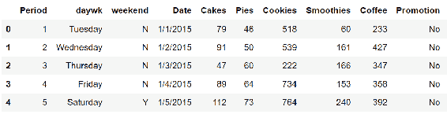

然后，我们将添加两个有助于绘制所需图形的派生变量：`Month`（1 至 12）和`Quarter`（1 至 4）。 添加这些变量后，的前五行如下所示：

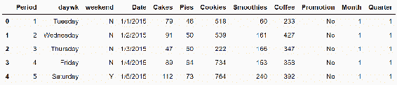

以下代码块读取 Excel 文件并添加其他变量：

```py
import pandas as pd
import numpy as np

snacks_sales = pd.read_csv('Snacks_Data.csv')
snacks_sales['Month'] = pd.DatetimeIndex(snacks_sales['Date']).month
Quarter_Mapping = {1:1, 2:1, 3:1, 4:2, 5:2, 6:2, 7:3, 8:3, 9:3, 10:4, 
                   11:4, 12:4}
snacks_sales['Quarter'] = snacks_sales['Month'].map(Quarter_Mapping)
```

## 葡萄酒品质

该数据集具有 11 个影响葡萄酒质量的属性。`Quality`的等级从 3 到 8，然后我们将 3 和 4 映射到`Low`，将 5 和 6 映射到`Med`，将 7 和 8 映射到`High`以创建一个新变量：`Quality`。

数据集的前五行如下所示：

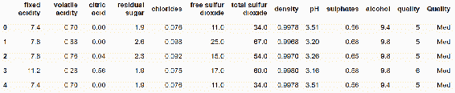

我们还将为`Wine Quality`数据集计算相关矩阵，我们将在一些图中使用它们。

以下是用于读取其他变量并将其添加到`Wine Quality`数据集的代码块：

```py
import pandas as pd

## Read the data from a csv file into pandas data frame
wine_quality = pd.read_csv('winequality.csv', delimiter=';')

## Map numeric Quality codes to "Low", "Med" and "High" qualitative 
  ratings
quality_map = {3:'Low', 4: 'Low', 5:'Med', 6:'Med', 7:'High', 8:'High'}
wine_quality['Quality'] = wine_quality['quality'].map(quality_map)

## compute correlation matrix
corr = wine_quality.corr() 

## Display the first 5 records of wine_quality dataset, and unique 
  values of quality variable
wine_quality.head()
set(wine_quality.quality)
```

## 语义和方面变量

除了在二维图中绘制关系的两个变量之外，seaborn 还可以绘制三个附加变量对两个主要变量之间的关系的影响图。 这三个变量称为**语义**变量。 它们被称为`hue`，`size`和`style`，它们充当给定绘图函数的参数。

对于`hue`的每个唯一值，将有一个关系图； 同样，对于`style`的每个唯一值，将有一个关系图。 如果中有两个唯一值`hue`变量（例如`Yes`和`No`），并且中有两个唯一值，则`style`变量（例如`s`和`D`标记），则将有`2 * 2 = 4`关系图（`Yes & s`，`Yes & D`，`No & s`，`No & D`组合）。 各种`hue`值以不同的颜色绘制，各种`style`值以不同的线或标记样式绘制。

同样，`size`变量会影响为两个主要变量绘制的点的大小。 与， Matplotlib 散点函数不同，此处，`size`变量范围分为多个桶，并将点分配给这些桶。 在  Matplotlib 散点函数中，每个点分别映射到`size`变量中的不同值。

除了这三个语义变量之外，seaborn 还允许在`row`和`col`中添加另外两个变量，其中对于的每个唯一值，行/列变量将有一个图（轴域），它将按行/列排列。 这些`row`和`col`变量称为**方面变量**，因为它们使我们能够了解其他方面对所绘制的两个主要变量的影响。

这些附加变量可以映射到要分析数据的各个维度，或者要分析两个变量之间的关系。 在典型的销售分析方案中，两个主要变量可以是销售额（单位或美元）或时间（天，月或季度），维度可以是业务部门，产品线，地区/ 国家/地区，销售代表，促销活动，货币等。

## 关系图

关系图描述了两个连续变量之间的关系。`seaborn`和`relplot()`中有一个通用的 API，用于两种类型的绘图：**行**和**散点图**绘图。 但是，这两种类型也分别具有单独的函数：`lineplot()`和`scatterplot()`。 我们可以使用带有参数的`relplot()`绘制线形图或散点图，或者直接使用`lineplot()`和`scatterplot()`函数。

## 带有一对一和一对多关系的线形图

在线形图中，观测值连接到可以自定义样式的线。`x`和`y`变量之间的关系可以是一对一的，有时也可以是一对多的。 在我们的`Snack Sales`数据集中，如果将每个项目的销售额与日期或期间作图，则这是一对一的关系，因为每个日期/期间和销售额对都只有一个观察值。 但是，如果我们按月销售，则每个月有 30 个观察值（销售记录），这是一对多的关系。

Seaborn 提供了多种选择来绘制这两种类型的关系。 在主要秘籍中，我们将学习一对一的关系，在“更多”部分，我们将学习一对多的关系。

## 准备

导入所需的包：

```py
import matplotlib.pyplot as plt
import seaborn as sns
```

## 操作步骤

以下是绘制具有各种选项的四个折线图的步骤：

1.  设置背景样式：

```py
sns.set(style='darkgrid')
```

2.  绘制带有标题的`Period`和`Smoothies`销售之间的折线图：

```py
sns.relplot(x='Period', y='Smoothies', 
            data=snacks_sales.query("Period < 300"), kind='line')
plt.title('line plot', size=20, color='g')
```

3.  绘制`Period`和`Smoothies`销售之间的折线图，并以以一周中的天作为色调：

```py
day_order = ['Monday', 'Tuesday', 'Wednesday', 'Thursday', 'Friday', 
             'Saturday', 'Sunday']
sns.relplot(x='Period', y='Smoothies', hue='daywk', 
            hue_order=day_order,
            data=snacks_sales.query("Period < 300"), kind='line')
plt.title('line plot with hue=daywk', size=20, color='g')
```

4.  以`Promotion`作为`hue`在`Period`和`Smoothies`销售之间绘制折线图：

```py
sns.relplot(x='Period', y='Smoothies', hue='Promotion', hue_order=
            ["Yes", "No"],
            data=snacks_sales.query("Period < 300"), kind='line')
plt.title('line plot with hue=Promotion', size=20, color='g')
```

5.  以`Promotion`作为`hue`，`weekend`作为`style`在`Period`和`Smoothies`销售之间绘制折线图：

```py
sns.relplot(x='Period', y='Smoothies', hue='Promotion', hue_order=
            ["Yes", "No"], style='weekend', 
            style_order=["Y", "N"], kind='line', 
            data=snacks_sales.query("Period < 300"))
plt.title('line plot with hue and style', size=20, color='g')
```

## 工作原理

这是代码的说明：

*   `sns.set(style='darkgrid')`设置绘图的背景样式。 Seaborn 提供了五种预定义样式：`dark`，`darkgrid`，`white`，`whitegrid`和`ticks`
*   `sns.relplot(x='Period', y='Smoothies', data=snacks_sales.query("Period < 300"), kind='line')`绘制和两个主要变量之间的关系，它们由`x`和`y`指定：
    *   `Period`和`Smoothies`是`Snacks Sales`数据集中两个变量的名称
    *   `Snacks Sales`是输入数据集，`query("Period < 300")`将过滤器应用于数据集以仅绘制前 300 个观测值（行），因为绘制整个数据集太拥挤
    *   `kind='line'`表示绘制折线图
*   对于第二个图，我们将添加`hue='daywk'`和`hue_order=day_order`
*   `plt.title('line plot', size=20, color='g')`绘制标题，大小为 20 点，*绿色*。
*   `day_order = ['Monday', 'Tuesday', 'Wednesday', 'Thursday', 'Friday', 'Saturday', 'Sunday']`指定在图表上绘制星期几的顺序
*   `hue='daywk'`表示绘制一周中每一天`Period`和`Smoothies`销售之间的关系，`hue_order=day_order`指定一周中的这一天应按[ `day_order`列表
*   对于第三张图，我们将更改`hue="Promotion"`并将`["Yes", "No"]`映射到`hue_order`
*   对于第四个图，我们将添加`style='weekend'`和`style_order=["Y", "N"]`

执行上述代码后，您应该在屏幕上看到以下图表：

线形图：

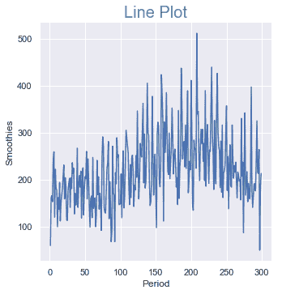

线形图，色相为`daywk`：

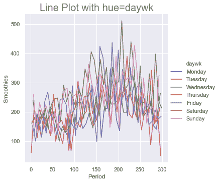

以色相作为促销的线形图：

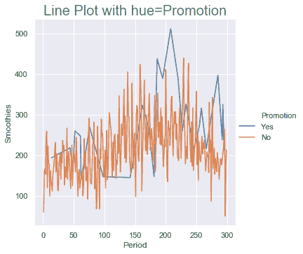

具有色相和样式的线形图：

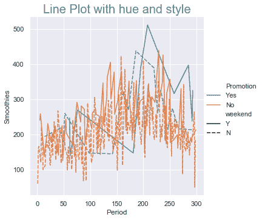

## 更多

在上一节中，`Period`和`Smoothies`销售具有一对一映射。 现在让我们用替换`Period`到`Month`变量中，每个月我们有 30 个观测值（行）。 我们将再次使用`Month`和`Smoothies`销售变量绘制四幅图。 我们将使用`hue`和`style`语义变量，并将`Promotion`和`weekend`映射到它们。

以下是绘制和所需图表的代码块：

```py
sns.relplot(x='Month', y='Smoothies', data=snacks_sales, kind='line')
plt.title('line plot', size=20, color='g')

sns.relplot(x='Month', y='Smoothies', hue='Promotion', 
            data=snacks_sales, kind='line',
            err_style="bars", ci=68) # Standard Errors
plt.title('line plot with Error bar and hue', size=20, color='g')

sns.relplot(x='Month', y='Smoothies', hue='Promotion', style='weekend', 
            kind='line', ci='sd', data=snacks_sales)
plt.title('line plot with hue and style', size=20, color='g')

sns.relplot(x='Month', y='Smoothies', hue='Promotion', style='weekend', 
            dashes=False, markers=True,
            data=snacks_sales, kind='line', ci=None)
plt.title('line plot with hue and custom style', size=20, color='g')

plt.show();
```

这是代码工作方式的说明：

*   在第一个图中，在之前的部分与该部分之间，唯一的区别是变量从`Period`更改为`Month`。 由于它们与`Smoothies`销售的关系不同，因此该图看起来非常不同，并提供了不同的信息。
*   它基本上计算给定月份所有 30 个观测值的平均销售额，并绘制所有此类平均值的折线图。 它使用默认参数`ci=95`，这意味着要计算每个平均点周围的 95% 置信区间，并绘制每个平均点周围的范围，将所有这些平均点连接为线形图，最后对这些平均点之间的范围区域进行着色
*   您还可以通过指定`estimator=None`作为参数来关闭平均值和置信区间。 由于变量具有一对多关系，因此该图采用锯齿形！
*   在第二个图中，通过指定`err_style='bars'`和 68% 的置信区间`ci=68`，我们将默认线形图更改为误差图。 我们还添加`hue = 'Promotion'`。
*   在第三幅图中，我们使用`ci='sd'`将每个月的置信区间从固定值更改为 30 个值的标准差，并添加`style='weekend'`。
*   在第四个图中，通过指定`dashes=False`和'`markers=True`，我们将的默认实线和*虚线*的默认线型替换为默认`markers`。 除了`markers=True`之外，我们还可以指定特定的标记，例如`markers=['D', 's']`，以覆盖默认标记。 我们还指定`ci=None`以避免在平均线形图周围绘制置信区间。

执行前面的代码和之后，您应该在屏幕上看到和以下图形：

线形图：

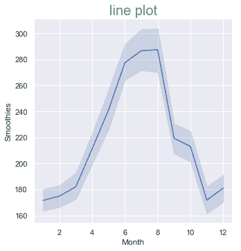

带有误差线和色调的线形图：

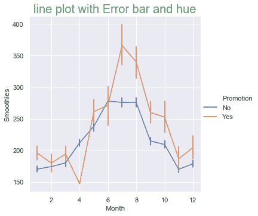

具有色相和样式的线形图：

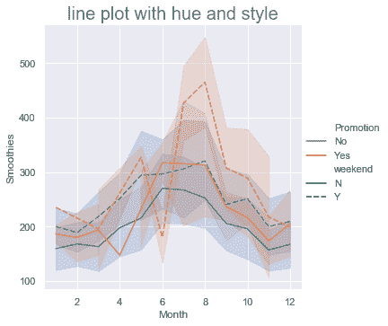

具有色相和自定义样式的线形图：

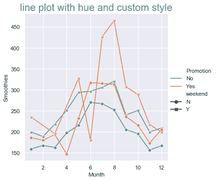

## 带有长格式数据集的折线图

在先前的秘籍中，我们将两个变量之间的关系绘制为单线形图，并使用其他语义变量对其进行了分析。 输入数据集具有各个项目的销售数据，例如`Pies`，`Cakes`，`Cookies`，`Coffee`和`Smoothies`，这些项目中的每一个都是数据集中的一列。 但是，如果要在相同的轴域/图上为这些项目中的每个项目绘制折线图以进行相对销售分析，则需要将输入数据略有不同，然后再将其传递给`relplot()`。

## 准备

当前格式的输入数据称为**宽格式**，因为每一项都以一列表示，从而增加了表的宽度。 我们需要创建另一种长格式的数据集，其中所有项目都合并为一列，从而增加行数或表的深度。

以下是实现此目的的代码：

```py
## Create a long form DataFrame from wide form DF
long_sales = pd.melt(snacks_sales, var_name='Item', value_name='Sales',
                     id_vars=['daywk', 'weekend', 'Date', 'Promotion', 
                     'Period', 'Month', 'Quarter'])

long_sales.shape          # dimensions, number of rows and columns
long_sales.sample(n=5)    # Display random 5 sample rows
```

这是数据集中的五个随机行的外观：

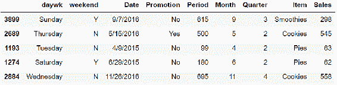

## 操作步骤

我们将在此秘籍中绘制两个数字。 第一个图形有四个图，第二个有一个图：

1.  第一张图使用色相变量描述了每个图中所有五个项目的销售额，但每个图代表`weekend`和`Promotion`变量的组合，它们分别指定为`row`和`col`变量：

```py
g = sns.relplot(x='Period', y='Sales', data=long_sales, kind='line', 
                hue='Item', row='weekend', col='Promotion')
```

2.  第二个图描述了每月所有项目的 30 天每日销售额，但仅包括`weekend`销售，并且`Promotion`为`ON`和`OFF`时：

```py
## one line for each of Items
long_sales['Day'] = pd.DatetimeIndex(long_sales['Date']).day
sns.relplot(x='Day', y='Sales', hue='Promotion', 
            data=long_sales.query("weekend =='Y'"), kind='line',
            units="Item", estimator=None, lw=1, height=6, aspect=2);
```

## 工作原理

这是前面代码的解释：

*   `x`，`y`，`data`，`kind`和`hue`参数与我们在前面的秘籍中看到的参数完全相同
*   `row='weekend'`指定对于`weekend`的每个唯一值，沿图的行绘制单独的轴域
*   `col='Promotion'`指定对于`Promotion`的每个唯一值，沿图的列绘制单独的轴域
*   当同时指定了`row`和`col`变量时，它将使用两者的组合来绘制网格

结果图如下所示：

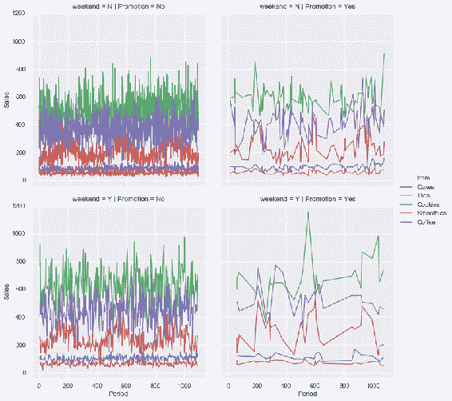

对于第二个图，我们首先定义一个派生变量`Day`，以存储每个观察值/行的当月值并将其添加到输入数据集中。 一年中的每一天都会代表一年中的每个月进行 12 次销售观察。 我们将在此图中绘制按日销售：

*   `data=long_sales.query("weekend =='Y'")`限制仅在周末绘制数据。
*   `units="Item"`指定为`Item`的每个唯一值绘制折线图。
*   `estimator=None`关闭每个折线图的计算和绘图平均值以及置信区间
*   `lw=1`指定要绘制的线的宽度
*   `height=6`和`aspect=2`指定图形的大小，高度为 6 英寸，宽度为 12 英寸（高度的两倍）

结果图如下。 它的一个问题是不清楚哪个线形图属于哪个项目！ 目前，在这种情况下，它不允许我们绘制标签：

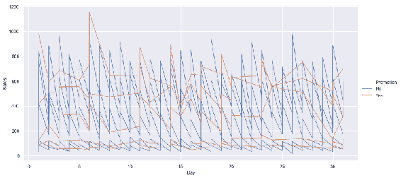

## 散点图

散点图将两个变量之间的关系绘制为单个点，而不相互连接。 它有助于可视化这些点如何在 *x* 和 *y* 轴上分布，以发现数据中是否存在任何模式或簇。 我们将使用与上一节相同的`Snack Sales`数据集，并在主要部分中使用相同的语义变量，并在中使用`row`和`col`变量“更多”部分。

## 准备

导入所需的库并将背景样式设置为`dark`：

```py
import matplotlib.pyplot as plt
import seaborn as sns
```

## 操作步骤

1.  在`Smoothies`销售和`Period`之间绘制散点图：

```py
sns.relplot(x='Period', y='Smoothies', data=snacks_sales, 
            kind='scatter')
plt.title('scatter plot', size=20, color='g')
```

2.  添加`hue = 'Promotion'`：

```py
sns.relplot(x='Period', y='Smoothies', hue='Promotion', 
            data=snacks_sales)
plt.title('scatter plot with hue', size=20, color='g')
```

3.  添加`style = 'weekend'`：

```py
sns.relplot(x='Period', y='Smoothies', hue='Promotion', 
            style='weekend', markers=['^', 'D'],
            data=snacks_sales)
plt.title('scatter plot with hue and style', size=20, color='g')
```

4.  添加`size = 'Cookies'`：

```py
sns.relplot(x='Period', y='Smoothies', hue='Promotion', 
            style='weekend', size='Cookies',
            markers=['^', 'D'],data=snacks_sales)
plt.title('scatter plot with hue, size and style', size=20, 
           color='g');
```

## 工作原理

`lineplot()`和`scatterplot()`之间的唯一区别是将`kind='line'`更改为`kind='scatter'`。 在`relplot()`中，默认为`kind='scatter'`，因此您可以省略此参数，就像我们在此处绘制的一些图所示。

所有，其他参数与前面的秘籍中的，完全相同。

这是绘图的样子：

散点图：

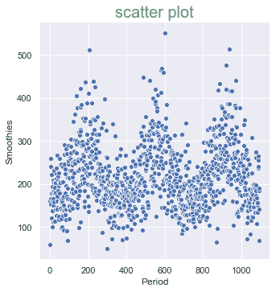

带有色相的散点图：

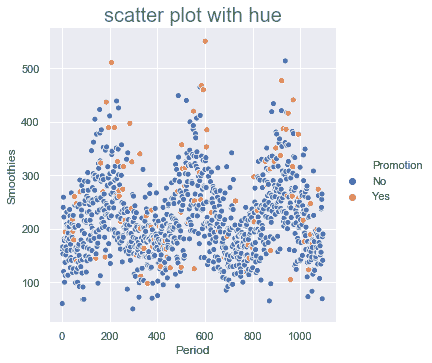

具有色相和样式的散点图：

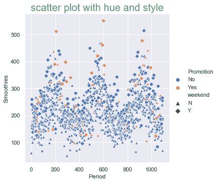

具有色相，大小和样式的散点图：

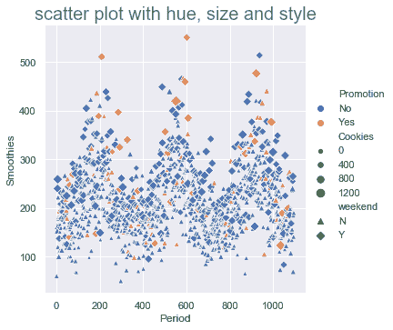

## 更多

在本节中，我们将使用`row`和`col`参数以及`hue`绘制相同的数据。

这是此代码：

```py
day_order = ['Monday', 'Tuesday', 'Wednesday', 'Thursday', 'Friday', 
             'Saturday', 'Sunday']
sns.relplot(x='Period', y='Smoothies', hue='Promotion', col='daywk', 
            col_wrap=3, col_order=day_order, data=snacks_sales, 
            height=3)

sns.relplot(x='Period', y='Smoothies', col='daywk', 
            col_order=day_order, row='Promotion', row_order=['Yes', 
            'No'], data=snacks_sales, height=3)
plt.show();
```

`col_wrap=3`指定仅绘制三列，然后将其包装到下一行。 使用此选项时，不能使用`row`参数。

您应该在屏幕上看到和下图：

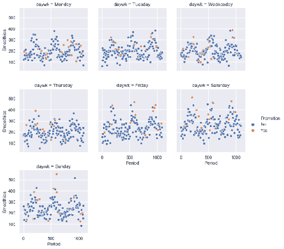

与`hue_order`和`style_order`相似，我们也可以指定`row_order`和`col_order`。

结果图如下：

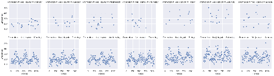

## 类别图

当要绘制的两个变量之一是分类的，而不是连续的时，则使用类别图。 Seaborn 增强了 Matplotlib 提供的和类别图中的一些，并且还添加了一些其他图。 在本节中，我们将介绍五组这样的绘图。

Seaborn 提供了一个通用 API `catplot()`来涵盖所有此类图。 这使您更容易熟悉一组通用参数，可以传递这些参数来绘制所有类型的类别图。 但是，每个不同的函数都可以直接使用，有时其中一些函数可能提供并非所有类型的绘图都通用的独特功能。 请参考[这个页面](https://seaborn.pydata.org/api.html)上每个特定图的文档。

## 条带和群体图

由于其中一个变量是分类变量，因此，给定分类变量值的和其他变量的所有值都落在一条直线上，该直线具有许多重叠点，这使其难以可视化。 条带图和群体图允许将这些点绘制成稍微偏离直线，避免基于给定参数的重叠。

## 准备

导入所需的库，将背景样式设置为`ticks`，并在以 Matplotlib 格式指定时启用`color_codes`映射为`seaborn`颜色：

```py
import matplotlib.pyplot as plt
import seaborn as sns

sns.set(style="ticks", color_codes=True)
```

## 操作步骤

1.  用`jitter=0.05`和`hue='Promotion'`绘制星期几`Cookies`的销售条形图：

```py
day_order = ['Monday', 'Tuesday', 'Wednesday', 'Thursday', 'Friday', 
             'Saturday', 'Sunday']
sns.catplot(x='daywk',y='Cookies', data=snacks_sales, 
            hue='Promotion', order=day_order, jitter=0.05, height=4,      
            aspect=2, kind='strip') 
plt.title('stripplot with jitter=0.05', size=20, color='g')
```

2.  使用，默认`jitter`和指定的调色板，绘制星期四（星期四除外）`Cookies`的销售条形图：

```py
sns.catplot(x='daywk',y='Cookies', data=snacks_sales.query("daywk != 
            'Thursday'"), order=['Monday', 'Tuesday', 'Wednesday', 
            'Friday', 'Saturday', 'Sunday'],palette='Set1', 
            height=4, aspect=2); # jitter=False plots all the points 
                                   on one line similar to plt
plt.title('stripplot with default jitter', size=20, color='g')
```

3.  绘制`Cookies`和一周中`hue = 'Promotion'`的群销售图：

```py
sns.catplot(x='daywk',y='Cookies', data=snacks_sales, 
            order=day_order, hue='Promotion',
            kind='swarm',height=4, aspect=2)
plt.title('swarmplot', size=20, color='g');
```

## 工作原理

这是前面代码的解释：

*   `order=day_order`指定在轴域上绘制，分类变量的唯一值的顺序。
*   `jitter=0.05`指定要应用的抖动量； 的值越大，的值越长直线范围。
*   `kind='strip'`指定图的类型，在这种情况下为`stripplot()`。 但是，这是`catplot()`的默认类型，因此也可以省略。
*   如果要并排绘制`hue`变量值，而不是在同一条带上同时显示两种颜色，则可以传递和`dodge=True`参数。 对于`stripplot()`，默认为`dodge=False`，这是我们在此处使用的内容。
*   `data=snacks_sales.query("daywk != 'Thursday'")`过滤输入数据以排除`Thursday`的所有观测值，因此该图仅包括一周中的剩余天数。
*   `palette='Set1'`指定要应用的调色板。 它类似于 Matplotlib 的`cmap`。 我们也可以在此处使用 Matplotlib 提供的`cmap`选项。
*   我们将默认`jitter`用于第二个绘图。 默认值不是`jitter`的固定值，而是根据输入数据分布而变化。
*   我们还可以通过指定`jitter=False`来关闭抖动，在这种情况下，其输出将类似于 Matplotlib 的输出。
*   第三个图`kind='swarm'`指定要绘制的游泳图。 在这里，它使用不同的算法在线上分布点，以确保根本没有重叠的点：

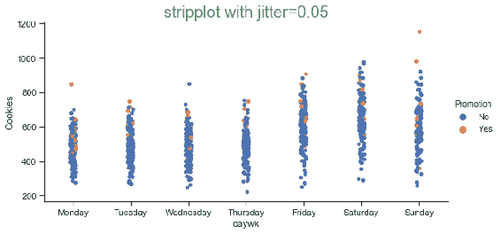

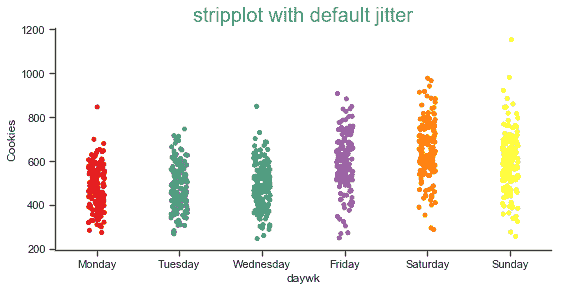

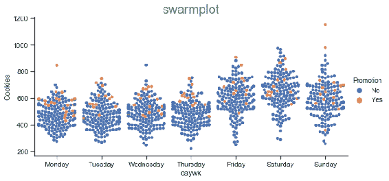

## 箱形图和 Boxn 图

`boxplot()`与我们在 Matplotlib 中看到的类似，`boxnplot()`是 Seaborn 的扩展，旨在提供有关该关系的更多详细信息。

`boxplot()`提供中值（框内的线），第一个（框的底部）和第三个四分位数（框的顶部），顶部和底部的 1.5 IQR（1.5 倍的框的大小（垂直图的高度，水平图的宽度））位置的胡须，以及胡须以外的异常值的详细信息。 几百个观察说，对于大多数情况来说和数据集的大小很小，这已经足够了。

但是，当数据集很大时，则无法对和尾端提供足够的见解。`boxnplot()`通过提供多个四分位数覆盖两端的尾端来解决`boxplot()`的这一局限性。 有关此的更多详细信息，[请参阅此处的论文](https://vita.had.co.nz/papers/letter-value-plot.html)。

## 准备

导入所需的库，将背景样式设置为`ticks`，并在以 Matplotlib 格式指定时，将`color_codes`映射为深浅的颜色：

```py
import matplotlib.pyplot as plt
import seaborn as sns

sns.set(style="ticks", color_codes=True)
```

## 操作步骤

在这里，我们将使用长格式数据集并绘制所有商品的销售情况：

1.  绘制`boxplot()`，其中包含以下各项的销售额：

```py
sns.catplot(x='Item', y='Sales', data=long_sales, kind='box', 
            height=4, aspect=2); 
```

2.  为第二个图添加`hue=Promotion`：

```py
sns.catplot(x='Item', y='Sales', data=long_sales, kind='box', 
            hue='Promotion', height=4, aspect=2);
```

3.  将色调更改为`hue=weekend `：

```py
sns.catplot(x='daywk', y='Sales', data=long_sales, kind='box', 
            hue='weekend', order=day_order, height=4, aspect=2);
```

4.  用`boxnplot()`重复和最后三步：

```py
sns.catplot(x='Item', y='Sales', data=long_sales, kind='boxen', 
            height=4, aspect=2); 
sns.catplot(x='Item', y='Sales', data=long_sales, kind='boxen', 
            hue='Promotion', height=4, aspect=2); 
sns.catplot(x='Sales', y='daywk', data=long_sales, kind='boxen', 
            hue='weekend', 
            order=day_order, height=4, aspect=2);
```

## 工作原理

这是前面代码的解释：

*   `kind='box'`指定它是`boxplot()`。
*   `dodge=True`是`boxplot()`和`boxnplot()`的默认值，因此默认情况下，将为和色调变量的每个唯一值绘制一个单独的图。 如果要在同一个箱图上绘制两个图，则必须传递`dodge=False`参数。
*   `kind='boxen'`指定绘制一个箱形图。

执行上述代码后，您应该在屏幕上看到以下图表：

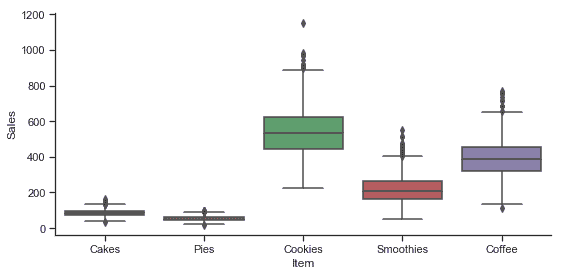

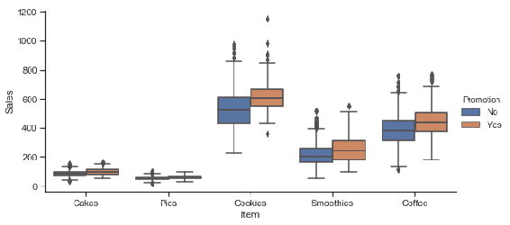

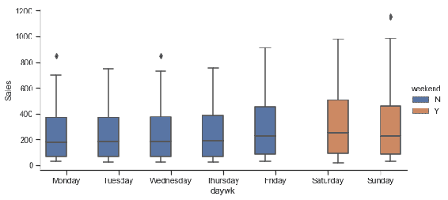

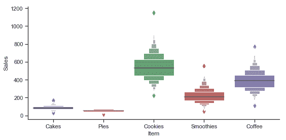

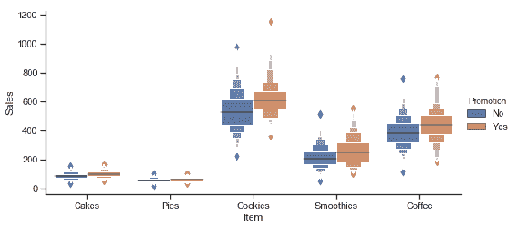

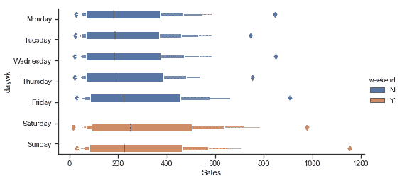

## 条形图和计数图

`barplot()`与我们在 Matplotlib 中看到的类似，但是`countplot()`是 seaborn 的扩展。`barplot()`中条形的高度代表给定类别的所有观测值的平均值，而`countplot()`中，条形高度代表给定类别的观察数。

## 准备

导入所需的库，将背景样式设置为`ticks`，并在以 Matplotlib 格式指定时，将`color_codes`映射为深浅的颜色：

```py
import matplotlib.pyplot as plt
import seaborn as sns
from numpy import median

sns.set(style="ticks", color_codes=True)
```

## 操作步骤

我们将使用各种不同的选项绘制四个条形图和三个计数图：

1.  使用，长数据格式的输入数据绘制`barplot()`，并在顶部用实际值标注条：

```py
plt.figure(figsize=(9,4))
b = sns.barplot(x='Item', y='Sales', data=long_sales, estimator=sum, 
                palette='husl')
b.set(yscale='log', ylim=[50000, 1000000])
sns.despine()
for bar in b.patches:
    b.annotate("{:,}".format(bar.get_height()),
              (bar.get_x()+bar.get_width()/2.,bar.get_height()),
               ha='center',va='center',xytext=
                           (0,10),textcoords='offset points', 
                            color='b', weight='bold')
plt.title('Bar Plot: Long Data Format,value annotation & 
           estimator=sum', size=15, color='g', weight='bold')
```

2.  使用全数据格式的输入数据绘制`barplot()`，以绘制所有数字变量：

```py
sns.catplot(data=snacks_sales, kind='bar', height=4, aspect=2, # 
                                                         wide form
            order=['Cakes', 'Pies', 'Cookies', 'Smoothies', 
                   'Coffee', 'weekday', 'Period'],
                    palette="Set1"); 
plt.title('Bar Plot: Wide Data Format,Plots all numerical 
           variables', size=15, color='g', weight='bold')
```

3.  使用长数据格式，估计量等于中位数和自定义调色板绘制`barplot()`：

```py
sns.catplot(x='Item', y='Sales', data=long_sales, kind='bar', 
            hue='Promotion', hue_order=['Yes','No'], palette={"Yes": 
            "r", "No": "indigo"},
            estimator=median, capsize=0.25, height=4, aspect=2); 
plt.title('Bar Plot: Long Data Format, estimator=median and custom 
           palette', size=15, color='g', weight='bold')
```

4.  用`estimator=len/count`，自定义误差宽度和颜色绘制`barplot()`：

```py
day_order = ['Monday', 'Tuesday', 'Wednesday', 'Thursday', 'Friday', 
             'Saturday', 'Sunday']
sns.catplot(x='daywk', y='Sales', data=long_sales, kind='bar', 
            hue='Promotion', ci='sd',
            estimator=len, capsize=0.25, errcolor='m', errwidth=5,
            hue_order=['Yes','No'], palette="muted", 
            order=day_order, height=4, aspect=2);
plt.title('Bar Plot, estimator=len(count), errwidth=5, errcolor=m', 
           size=15, color='g', weight='bold')
```

5.  绘制一个`countplot()`，其中包含所有项目的销售额：

```py
sns.catplot(x='Item', data=long_sales, kind='count', height=4, 
            aspect=2); # long form data frame
plt.title('Count Plot: Sales by Item', size=15, color='g', 
           weight='bold')
```

6.  使用`hue`和自定义调色板绘制`countplot()`：

```py
sns.catplot(x='Item', data=long_sales, kind='count', 
            hue='Promotion', hue_order=['Yes','No'], palette={"Yes": 
            "r", "No": "indigo"}, height=4, aspect=2); 
plt.title('Count Plot, hue=Promotion, custom palette', size=15, 
           color='g', weight='bold')
```

7.  绘制`countplot()`，按星期几销售：

```py
day_order = ['Monday', 'Tuesday', 'Wednesday', 'Thursday', 'Friday', 
             'Saturday', 'Sunday']
sns.catplot(x='daywk', data=long_sales, kind='count', 
            hue='Promotion', hue_order=['Yes','No'], palette="Set2", 
            order=day_order, height=4, aspect=2);
plt.title('Count Plot: Sales by day of the week', size=15, 
           color='g', weight='bold');
```

## 工作原理

这是前面代码的解释。 这是第一个绘图：

*   `catplot()`和`kind='bar'`不能灵活地捕获单个条形图，因此无法在每个条形图的顶部绘制值。 因此，对于第一个图，我们使用`barplot()`，它类似于的 Matplotlib 条形图
*   `b = sns.barplot(x='Item', y='Sales', data=long_sales, estimator=sum, palette='husl')`绘制条形图：
    *   `estimator=sum`指定指定给定项目的所有观测值之和，而不是默认平均值
    *   `palette='husl'`指定要使用的调色板
*   `b.set(yscale='log', ylim=[50000, 1000000])`在 *y* 轴上设置对数刻度并将限制设置为给定限制。
*   `sns.despine()`使和的上轴线和右轴线不可见。 如果要使左轴和底轴也不可见，则可以传递参数`left=True`和`right=True`。
*   `for bar in b.patches:`是一个`for`循环，可捕获每个条形并在其顶部绘制值。 和与我们在第 2 章和“基本绘图入门”中所做的相同，对于是 Matplotlib 条形图。
*   `plt.title('Bar Plot: Long Data Format,value annotation & estimator=sum', size=15, color='g', weight='bold')`绘制图表标题。

这是第二个绘图：

*   我们直接传递宽格式数据集，而没有像到目前为止一样提供`x`和`y`变量。 在这种情况下，默认情况下会绘制输入数据集中每个数字变量的条形图。
*   但是，我们可以通过不在顺序列表中指定这些变量来防止某些数字列被绘制。
*   `order=['Cakes', 'Pies', 'Cookies', 'Smoothies', 'Coffee', 'Period']`：除实际项目外，我们顺序列表中仅包含`Period`。 因此，即使它们是数字变量，也不会绘制`weekday`，`Month`和`Quarter`变量。
*   `palette="Set1"`设置为预定义的调色板`Set1`。

这是第三个绘图：

*   我们返回长数据格式并指定`x`和`y`数据变量。
*   `hue='Promotion'`指定使用不同的颜色映射为`Promotion`的每个唯一值绘制条形图。
*   `hue_order=['Yes','No']`指定绘制`Promotion`条的顺序。
*   `palette={"Yes": "r", "No": "indigo"}`指定自定义调色板字典。
*   `estimator=median`指定用于汇总给定项目的观察值的统计信息。 默认统计信息是平均值； 在这里，我们用中位数覆盖它。 在此数据集中，所有项目的均值和中位数彼此非常接近，因此我们可能无法观察到条形图中的差异。 某些函数`sum`和`len`在核心 Python 中可用，因此不需要导入它们，而`median`在 Python 中不可用，因此我们需要从 NumPy 导入。
*   `capsize=0.25`在误差栏的顶部和底部指定和误差栏帽的宽度。

这是第四个绘图：

*   `estimator=len`指定将汇总统计信息的长度（观察数）用作。
*   `ci='sd'`指定对置信区间的使用标准差，而不是固定百分比值。
*   `errcolor='m'`将误差栏的颜色指定为*洋红色*。
*   `errwidth=5`指定彩条线的宽度。

这是第五个绘图：

*   `kind='count'`指定应绘制一个计数图。
*   在这里，条形的高度是-每个项目类别中观察值的计数。 在这种情况下，所有项目的计数均相同。

这是第六个图：

*   我们加上`hue="Promotion"`，因此`Promotion`的两个值的计数不同。
*   我们像第三张图一样使用自定义调色板

这是偶数图：

*   将 *x* 轴的`Item`替换为`daywk`。
*   `palette="Set2"`设置另一个预定义的调色板。

执行上述代码后，您应该在屏幕上的以下七个图上看到和：

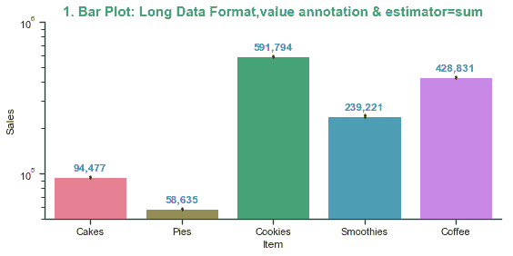

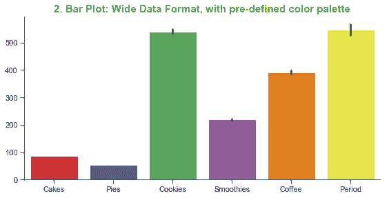

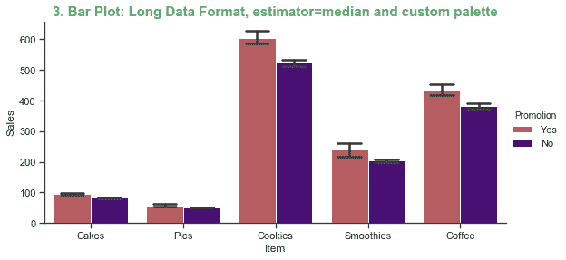

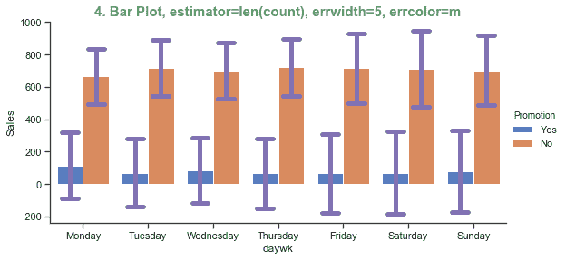

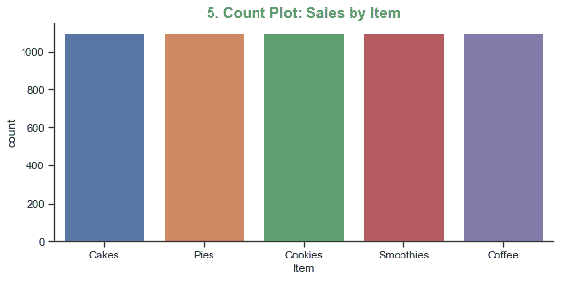

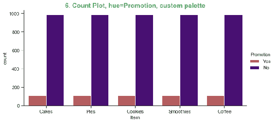

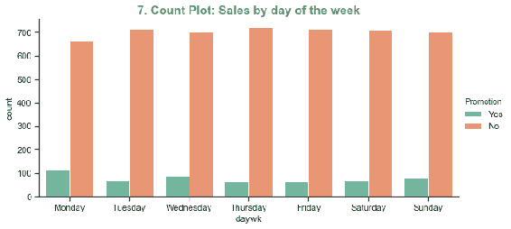

## 提琴图

Seaborn 扩展了 Matplotlib 提供的提琴图功能，以在， 提琴图中包含不同的图。 与仅显示摘要统计信息的`boxplot`不同，提琴图甚至显示数据的分布。

## 准备

导入所需的库，将背景样式设置为`ticks`，并启用`color_codes`，以 Matplotlib 格式指定时将其映射为 Seaborn 颜色：

```py
import matplotlib.pyplot as plt
import seaborn as sns

sns.set(style="ticks", color_codes=True)
```

## 操作步骤

我们将在此处绘制四个带有不同选项的提琴图：

1.  在 *x* 轴域上绘制销量，在 *y* 轴域上绘制物品：

```py
sns.catplot(x='Sales', y='Item', data=long_sales, kind='violin', 
            height=6, aspect=1) 
plt.title('1\. Horizontal Violin Plot', size=15, color='g', 
           weight='bold')
```

2.  在 *x* 轴域上绘制物品并在 *y* 轴域上绘制销量，添加`hue='Promotion'`，然后在提琴图的两侧分别填充不同的颜色：

```py
sns.catplot(x='Item', y='Sales', data=long_sales, kind='violin', 
            hue='Promotion', 
            hue_order=["Yes", "No"], split=True, height=4, aspect=2) 
plt.title('2\. Vertical Violin Plot, hue=Promotion, split=True', 
           size=15, color='g', weight='bold')
```

3.  用`hue='Promotion'`绘制垂直提琴图，并用数据填充提琴的两侧：

```py
day_order = ['Monday', 'Tuesday', 'Wednesday', 'Thursday', 'Friday', 
             'Saturday', 'Sunday']
sns.catplot(x='daywk', y='Sales', data=long_sales, kind='violin', 
            order=day_order, hue='Promotion', 
            hue_order=["Yes", "No"], split=True, inner="stick", 
            palette="pastel",height=4, aspect=2) 
plt.title('3\. Violin Plot, hue=Promotion, split=True, inner=stick', 
           size=15, color='g', weight='bold')
```

4.  用`hue='Promotion'`绘制垂直提琴图，用不同的颜色填充侧面，然后覆盖群图：

```py
g = sns.catplot(x='daywk', y='Sales', data=long_sales, 
                kind='violin', order=day_order, hue='Promotion',
                hue_order=["Yes", "No"], split=True, inner=None, 
                palette="pastel", height=4, aspect=2)
sns.catplot(x='daywk',y='Sales', 
       data=long_sales[long_sales['Period'] < 50], order=day_order, 
       color="k",  size=3, kind='swarm',height=4, aspect=2, ax=g.ax)
g.ax.set_title('4\. Violin Plot with overlay of swarm plot', size=15, 
                color='g', weight='bold');

plt.axis('off');  # remove unwanted empty axes 
```

## 工作原理

这是前面代码的解释。

这是第一个绘图：

*   `x='Sales' and y='Item'`指定类别变量在 *y* 轴上，连续变量在 *x* 轴上，生成水平图
*   `kind='violin'`指定它是提琴图
*   `height=6`将图的高度指定为`6`英寸
*   `aspect=1`表示，图的宽度为，与相同，高度

这是第二个图：

*   `x='Item', y='Sales'`指定规则的垂直图。
*   `hue='Promotion'`将变量指定为`Promotion`。
*   `hue_order=["Yes", "No"]`指定绘制`Promotion`值的顺序。
*   `split=True`仅在`hue`变量为二进制时适用，并指定提琴的每一侧应填充不同的颜色，代表的值`hue`变量。

这是第三个图：

*   将`Item`变量替换为 *x* 轴上的`daywk`变量，并提供绘制日期的顺序。
*   `inner="stick"`指定绘制棒状线，代表和`Promotion`变量的两个不同值，代表提琴每侧的数据分布； 这仅在`split=True`时适用，而在，`hue`变量为二进制时才适用。
*   `palette="pastel"`指定要使用的预定义调色板。

这是我们的绘图：

*   `kind='violin'`指定绘制提琴图。
*   `inner=None`指定除了基于`hue`的颜色映射外，不在提琴的任何一侧绘制任何内容。
*   `data=long_sales[long_sales['Period'] < 50]`将绘图限制为仅 50 个观测值，以避免混乱。
*   `kind='swarm'`指定`violinplot`顶部的覆盖图为`swarmplot`。
*   `ax=g.ax`指定叠加图的轴域，与绘制`violinplot`的轴域相同。

执行上述代码后，您应该在屏幕上看到以下四个图：

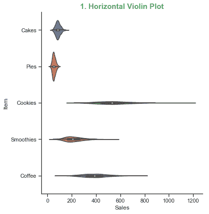

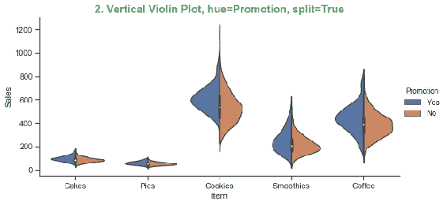


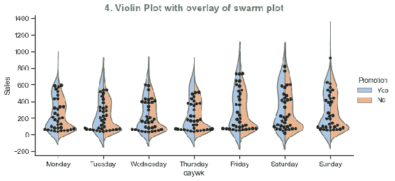

## 点图

条带图和群图以不重叠的方式绘制属于特定类别的所有点。`box`，`boxn`和`violin`图描绘了各种类别的一组点的摘要统计量； 同样，`bar`和`count`使用某些统计指标绘制汇总，并相应绘制条形图。 最后，`point`图将聚合度量描述为图形中的一个点，各个类别的所有此类点均用线连接。

## 准备

导入所需的库，将背景样式设置为`ticks`，并以 Matplotlib 格式指定时，将`color_codes`映射为`seaborn`颜色。 ：

```py
import matplotlib.pyplot as plt
import seaborn as sns

sns.set(style="ticks", color_codes=True)
```

## 操作步骤

我们将用不同的选项绘制四个点图：

1.  绘制一个`pointplot()`和宽表单数据集，以绘制所有在顺序列表中列出的数字变量：

```py
sns.catplot(data=snacks_sales, kind='point', ci=99.99, capsize=0.25, 
            height=4, aspect=2, order=['Cakes', 'Pies', 'Cookies', 
            'Smoothies', 'Coffee', 'weekday', 'Period'])
plt.title('1\. Point Plot with wide form dataset', size=15, 
           color='g', weight='bold');
```

2.  使用长数据集绘制此`pointplot()`，以`s`指定标记并将置信区间为的标准差绘制`i`变量。

```py
sns.catplot(x='Item', y='Sales', data=long_sales, kind='point', 
            markers='D', ci='sd', height=4, aspect=2) # long form 
                                                       data frame
plt.title('2\. Point Plot with diamond marker and std as ci', 
           size=15, color='g', weight='bold');
```

3.  使用其他`hue`和`col`变量以及自定义调色板来绘制此`pointplot()`：

```py
sns.catplot(x='Item', y='Sales', data=long_sales, kind='point', 
            hue='Promotion', hue_order=['Yes','No'], palette={"Yes":   
            "r", "No": "indigo"},
            markers=["^", "o"], linestyles=["-", "--"], ci=None, 
            col='daywk', col_wrap=3,
            height=4, aspect=2, scale=1.5)
plt.suptitle("3\. Point Plot, hue=Promotion, col='daywk'", size=15, 
              color='g', weight='bold')
plt.tight_layout(pad=5,w_pad=0.25, h_pad=0.25);
```

4.  以`pointplot()`和色相来表示每日销售量，并确保和线形图对于两个`Promotion`的不同值不重叠：

```py
sns.catplot(x='daywk', y='Sales', data=long_sales, kind='point', 
            hue='Promotion', dodge=True,
            hue_order=['Yes','No'], palette="Set2", order=day_order, 
            height=4, aspect=2)
plt.title('4\. Point Plot of day wise sales with hue and dodge', 
           size=15, color='g', weight='bold');
```

## 工作原理

这是前面代码的解释。

这是第一个绘图：

*   `kind='point'`指定它是`pointplot()`。
*   `ci=99.99`指定置信区间。
*   `capsize=0.25`指定误差条顶部的盖子宽度。
*   `order=['Cakes', 'Pies', 'Cookies', 'Smoothies', 'Coffee', 'weekday', 'Period'])`指定轴上项目的顺序。

这是第二个图：

*   `markers='D'`指定使用菱形标记代替圆圈。
*   `ci='sd'`指定对使用标准差作为置信区间。

这是第三个图：

*   `hue='Promotion'`使用变量`Promotion`指定色调。
*   `hue_order=['Yes','No']`是绘制色调值的顺序。
*   `palette={"Yes": "r", "No": "indigo"}`是自定义调色板。
*   `markers=["^", "o"]`使用这些标记为的每个唯一值指定`Promotion`变量。
*   `linestyles=["-", "--"]`是每个折线图的线条样式。
*   `ci=None`指定不绘制的置信区间范围。
*   `col='daywk'`使用变量指定`daywk`绘制列。
*   `col_wrap=3`指定每行仅绘制三个图，然后将下一行包装到中。
*   `scale=1.5`在默认大小上指定绘图上对象大小的比例因子。
*   `plt.suptitle()`打印整个图形的标题。
*   `plt.tight_layout(pad=5,w_pad=0.25, h_pad=0.25);`调整绘图之间的空间，并在图形顶部留出足够的空间，以使和标题完全合适。

这是我们的图：

*   它类似于第三图的，但不使用`col`变量并应用`dodge=True`，因此将`Promotion`的两个唯一值的图分开设置，而不是像第三幅图一样。

执行上述代码后，您应该在屏幕上看到以下四个图：

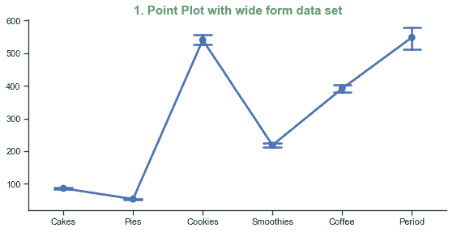

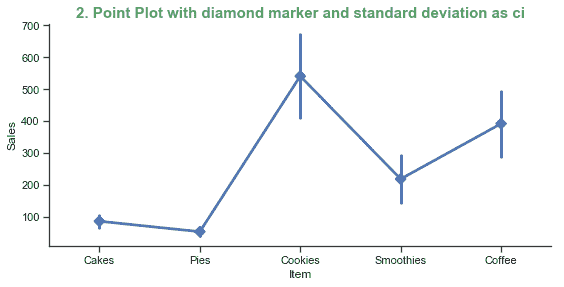

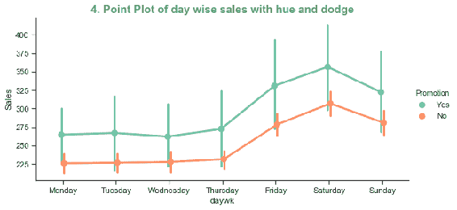

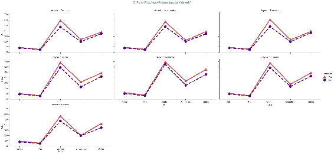

## 分布图

分布图用于可视化数据的概率分布。 Seaborn 提供了三个函数：`distplot()`，`kdeplot()`和`rugplot()`。

通过传递适当的参数，`distplot()`可用于**核密度估计**（**KDE**）和地毯分布。 但是，`distplot()`限于单变量分布，而`kdeplot()`也允许双变量分布。 因此，当需要双变量分布时，可以使用`kdeplot()`，对于单变量分布，可以使用`distplot()`。

## `distplot()`

我们将绘制三个具有不同选项的不同分布图，以展示其大多数功能。

## 准备

导入所需的库，将背景样式设置为`white`，并在以 Matplotlib 格式指定时，将`color_codes`映射为深浅的颜色：

```py
import matplotlib.pyplot as plt
import seaborn as sns
from scipy.stats import norm, pareto, gamma

sns.set(style="whitegrid", color_codes=True)
```

`scipy.stats`是一个包含各种统计函数的科学 Python 库，`norm`，`pareto`和`gamma`是不同类型的概率分布函数。 我们将使用它们来拟合和给定的数据集，以查看哪种分布非常适合该数据。

## 操作步骤

以下是绘制和所需图的步骤：

1.  用直方图，KDE 和`rugplot`绘制销售`Coffee`的分布：

```py
sns.distplot(snacks_sales.Coffee, color='g', rug=True, rug_kws=
              {"color": 'm', "height": 0.1})
plt.title('1\. Distribution Plot of Coffee Sales with rug=True', 
           size=15, color='g', weight='bold')
plt.show();
```

2.  使用步骤类型直方图，带阴影的 KDE 和图例绘制曲奇销售的水平分布：

```py
sns.distplot(snacks_sales.Cookies, vertical=True, 
             hist_kws={"histtype": "step", "linewidth": 3, "alpha": 
             1, "color": "indigo", "label": "Histogram"},
             kde_kws={"shade": True, "color": "orange", "lw": 3, 
                      "label": "KDE"}) 
plt.title('2\. Horizontal Distribution Plot of Cookies Sales', 
           size=15, color='g', weight='bold') 
plt.show();
```

3.  绘制销售的分布，并拟合三种不同的分布，以检查哪种分布最适合此数据：

```py
ax = sns.distplot(snacks_sales.Smoothies, fit=norm, kde=False, 
                  rug=True, color='b', 
                  fit_kws={"color": "b"}, label='normal')
sns.distplot(snacks_sales.Smoothies, hist=False, fit=pareto, 
             kde=False, rug=True, color='g', label='pareto', 
             fit_kws={"color": "g"}, ax=ax)
sns.distplot(snacks_sales.Smoothies, hist=False, fit=gamma, 
             kde=False, color='r', label='gamma', 
             fit_kws={"color": "r"}, ax=ax)
ax.legend()
plt.title('3\. Distribution Plot - 3 different distribution 
           functions', size=15, color='g', weight='bold')
plt.show();
```

## 工作原理

这是前面代码的解释：

这是第一个绘图：

*   `sns.distplot(snacks_sales.Coffee, color='g', rug=True, rug_kws={"color": 'm', "height": 0.1})`图。 这是必需的分布图。
*   `snacks_sales.Coffee`是要绘制其分布的咖啡销售数据。
*   `color='g'`指定默认情况下绘制的直方图和 KDE 图的颜色为绿色。
*   如果要关闭直方图或 KDE 图，请传递参数`hist=False`和`kde=False`。
*   `rug=True`指定是否应在该分布图上绘制地毯图。 默认选项是`False`，因此未绘制。
*   `rug_kws={"color": 'm', "height": 0.1}`是用于格式化地毯图的关键字字典。 在这里，我们使用了洋红色，在地毯图中，木棒的高度为`o.1`。
*   `plt.show()`在屏幕上显示绘图，因此后续绘图不会在第一个绘图的顶部重叠。

这是第二个图：

*   `vertical=True`指定该图应在垂直轴域上绘制，这表示水平直方图。 默认选项为`False`，在这种情况下，它会绘制垂直直方图，如在第一个图中所示。
*   `hist_kws={"histtype": "step", "linewidth": 3, "alpha": 0.7, "color": "indigo", "label": "Histogram"}`是用于绘制直方图的参数的直方图关键字字典：
    *   `"histtype": "step"`指定楼梯直方图，而不是规则的平滑坡道。
    *   `"linewidth": 3`表示直方图的线宽为三点。
    *   `"alpha": 0.7`指定直方图行的透明度级别。
    *   `"color": "indigo"`指定直方图的颜色为靛蓝色。
    *   `"label": "Histogram"`是出现在图例上的标签。
*   `kde_kws={"shade": True, "color": "orange", "lw": 3, "label": "KDE"})`是用于绘制 KDE 绘图的参数的关键字字典：
    *   `"shade": True`指定在 KDE 图下的区域应加阴影。
    *   `"color": "orange"`指定用于 KDE 图的颜色，并在 KDE 曲线下的区域上加阴影。 尽管我们指定了一种颜色，但它的 KDE 曲线和曲线下的阴影区域使用略有不同的阴影来区分这两种颜色。
    *   `"lw": 3`指定要绘制的线的宽度。
    *   `"label": "KDE"`是出现在图例上的标签。

这是第三个图：

*   在该图中，我们为同一数据拟合了三条不同的曲线，以检查哪一条最合适。 实际上，存在许多连续和离散的分布。 根据数据的性质，我们在选择最佳分布之前先尝试这些分布。 在`distplot()`中使用它们之前，我们需要导入适当的包（`scipy.stats`是一个很好的来源）以加载这些分发函数。
*   `fit=norm`指定适合正态分布； 同样，`fit=pareto`和`fit=gamma`指定`pareto`和`gamma`分布函数以适合我们拥有的数据。
*   `kde=False`指定不绘制 KDE 曲线，因为我们正在拟合其他分布。 如果我们想将 KDE 曲线与其他分布进行比较，我们也可以保留它。
*   `rug=True`指定我们也应该为此数据绘制`rugplot()`。
*   `fit_kws={"color": "b"}`是用于拟合给定分布函数的关键字字典。 它仅指定要用于分布曲线的颜色。

执行上述代码后，您应该在以下三个图中看到：

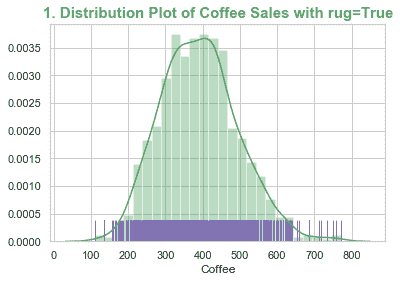

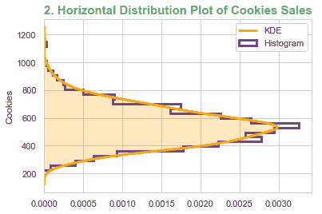

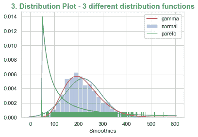

## `kdeplot()`

KDE 是一种将分布函数拟合到给定数据集的非参数方法。 因此，对于给定的单变量（单变量）或双变量（两个变量）数据，`kdeplot()`拟合并绘制 KDE 分布曲线。

## 准备

导入所需的库，将背景样式设置为`white`，并启用`color_codes`，以 Matplotlib 格式指定时将其映射为 Seaborn 颜色：

```py
import matplotlib.pyplot as plt
import seaborn as sns
```

## 操作步骤

我们将绘制两个二元 KDE 图。 在第二个图中，我们将在相同的轴域上绘制两个具有不同变量集的 KDE 图，以进行比较：

1.  用等高线和颜色条绘制双变量 KDE 图：

```py
sns.kdeplot(snacks_sales.Smoothies, snacks_sales.Pies, kernel='epa', 
            n_levels=25, cmap='Reds', cbar=True)
plt.title('1\. Bivariate KDE Plot', size=15, color='g', 
           weight='bold');
plt.show();
```

2.  用阴影区域绘制两组变量的双变量 KDE 图：

```py
Cookies_temp = snacks_sales.Cookies + 500
ax=sns.kdeplot(snacks_sales.Period, snacks_sales.Coffee, 
               kernel='gau',shade=True, shade_lowest=False, 
               cmap='Purples_d')
sns.kdeplot(snacks_sales.Period, Cookies_temp, kernel='cos', 
            shade=True, shade_lowest=False, cmap='Blues')
ax.set_ylabel('Sales')
ax.text(0, 1400, 'Cookies', color='b', weight='bold')
ax.text(0, 650, 'Coffee', color='purple', weight='bold')
plt.title('2\. Bivariate KDE Plot - 2 sets of variables', size=15, 
           color='g', weight='bold')
plt.show();
```

## 工作原理

这是代码的说明。

这是第一个绘图：

*   `snacks_sales.Smoothies`和`snacks_sales.Pies`是要绘制的变量。
*   `kernel='epa'`指定要用于适合 KDE 的内核方法（Epanechnikov）。 其他可用选项包括`gau`（高斯/正态），`cos`（余弦），`biw`（双权），`triw`（三权）和`tri`（三角形）。 有关更多详细信息，请参阅[这里](http://homepages.inf.ed.ac.uk/rbf/CVonline/LOCAL_COPIES/AV0405/MISHRA/kde.html)。
*   `n_levels=25`指定要绘制的轮廓数量。
*   `cmap='Reds'`指定要使用的颜色表。
*   `cbar=True`指定绘制颜色条。

这是第二个图：

*   `Cookies_temp = snacks_sales.Cookies + 500`将所有观测值增加 500，这样这些值就不会与我们将在同一轴域上绘制的其他变量值重叠。
*   `ax=sns.kdeplot(snacks_sales.Period, snacks_sales.Coffee, kernel='gau',shade=True, shade_lowest=False, cmap='Purples_d') `在`ax`轴域上绘制第一个 KDE 图。
*   `kernel='gau'`，使用高斯核方法`shade=True`填充轮廓内的区域。
*   `shade_lowest=False`仅适用于`shade=True`，仅适用于二元 KDE 图。 它迫使它不填充最外轮廓，该轮廓覆盖轮廓外轴域的整个区域。 如果我们不将其设置为`false`，则可能会看到整个轴域的区域都填充了最外面轮廓的颜色。
*   `ax.set_ylabel('Sales')`覆盖从数据变量名称中拾取的默认 *y* 轴标签。
*   `ax.text(0, 1400, 'Cookies', color='b', weight='bold')`和`ax.text(0, 650, 'Coffee', color='purple', weight='bold')`插入 KDE 图的标签：
    *   `kdeplot()`中提供的`'label'`选项仅适用于单变量图。 因此，我们在此处使用了`text`选项。

执行上述代码后，您应该在屏幕上看到以下两个图：

| 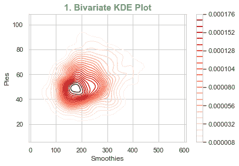 |  |

## 回归图

回归图有助于将二维数据拟合为线性或多项式曲线。 这有助于可视化两个变量之间的关系，以了解它与 *n* 的线性或多项式拟合的紧密程度。 Seaborn 为此提供了三个函数：`regplot()`，`residplot()`和`lmplot()`。`regplot()`和`lmplot()`都具有将二维数据拟合为 *n* 的线性或多项式的相同目的，但是`regplot()`是轴域级函数，而`lmplot()`是图形级函数，使它能够使用`row`和`col`语义变量在单个图形中绘制多个回归图。`residplot()`帮助拟合曲线并绘制残差以了解拟合的质量。

## `regplot()`和`residplot()`

我们将绘制两个回归图和一个残差图以演示这些函数中可用的各种选项。

## 准备

导入所需的库，将背景样式设置为`dark`，并在以 Matplotlib 格式指定时，将`color_codes`映射为深浅的颜色：

```py
import matplotlib.pyplot as plt
import seaborn as sns
from scipy.stats import pearsonr

sns.set(style="dark", color_codes=True)
```

## 操作步骤

以下是绘制和所需图的步骤：

1.  绘制线性回归图，并以 *R 方*和 *p 值*标注：

```py
R, p = pearsonr(wine_quality['fixed acidity'], wine_quality.pH)
g1 = sns.regplot(x='fixed acidity', y='pH', data=wine_quality, 
                 truncate=True, ci=99,
                 marker='D', scatter_kws={'color': 'r'});
textstr = 
 '$\mathrm{pearson}\hspace{0.5}\mathrm{R}^2=%.2f$\n$\mathrm{pval}=%.
    2e$' % (R**2, p)
props = dict(boxstyle='round', facecolor='wheat', alpha=0.5)
g1.text(0.55, 0.95, textstr, transform=ax.transAxes, fontsize=14, 
        va='top', bbox=props)
plt.title('1\. Linear Regression', size=15, color='g', weight='bold')
```

2.  绘制`2`阶多项式回归曲线：

```py
g2 = sns.regplot(x='fixed acidity', y='pH', data=wine_quality, 
                 order=2, ci=None, 
                 marker='s', scatter_kws={'color': 'skyblue'}, 
                 line_kws={'color': 'red'});
plt.title('2\. Non Linear Regression of order 2', size=15, color='g', 
           weight='bold')
```

3.  绘制逻辑回归曲线：

```py
wine_quality['Q'] = wine_quality['Quality'].map({'Low': 0, 'Med': 0, 
                                                 'High':1})
g2 = sns.regplot(x='fixed acidity', y='Q', logistic=True, 
                 n_boot=750, y_jitter=.03, data=wine_quality,
                 line_kws={'color': 'r'})
plt.show();
```

4.  绘制残差图：

```py
g3 = sns.residplot(x='fixed acidity', y='density', order=2, 
                   data=wine_quality, scatter_kws={'color': 'b', 
                   'alpha': 0.5});
plt.show();
```

## 工作原理

这是代码的说明。

这是第一个绘图：

*   `R, p = pearsonr(wine_quality['fixed acidity'], wine_quality.pH)`计算给定数据分布的和的`R`和`p`值。 R 方和 p 值表示数据拟合的质量。
*   `g1=sns.regplot()`绘制了回归曲线以及和原始数据点的散布图：
    *   `truncate=True`指定仅在可用数据点之前拟合曲线。 默认设置是将其扩展到轴域的两端。
    *   `ci=99`指定在线性曲线的周围绘制 99% 的置信区间。
    *   `marker='D'`以菱形绘制点，而不是默认圆。
    *   `scatter_kws={'color': 'r'}`是散点图关键字字典，具有要使用的属性。 用红色绘制点。
    *   富文本格式的`textstr`指定要在曲线上绘制的文本。
    *   `props`指定要在曲线上绘制的文本字符串周围的框的属性。
    *   `g1.text()`在指定位置的打印文本。

这是第二个图：

*   `g2 = sns.regplot()`绘制散点图，具有二阶多项式。
    *   `order=2`指定拟合二阶多项式。
    *   `ci=None`不在绘制拟合曲线周围的置信区间。
    *   `marker='s'`以正方形绘制点，而不是默认圆。
    *   `scatter_kws={'color': 'skyblue'}`为散点指定的颜色。
    *   `line_kws={'color': 'red'}`指定回归线的颜色。

这是第三个图：

*   `wine_quality['Q'] = wine_quality['Quality'].map({'Low': 0, 'Med': 0, 'High':1})`通过将`Low`和`Med`映射到`0`以及将`High`映射到`1`，得出仅具有二进制值'0'或'1'的新质量变量。 这是拟合逻辑回归曲线所必需的。
*   `g3 = sns.regplot()`绘制散点图并拟合逻辑回归曲线：
    *   `logistic=True`指定拟合逻辑回归曲线。
    *   `n_boot=750`指定用于估计和置信区间的重采样次数。
    *   `y_jitter=.03`指定要添加的偏差量，以使点不会重叠太多。 这仅影响可视化，并在拟合曲线之后和绘制之前添加。
    *   `line_kws={'color': 'r'}`，用红色绘制拟合曲线。

这是我们的绘图：

*   `g4 = sns.residplot()`绘制残差的散点图，并在`0`残差周围绘制一条虚线。
*   `scatter_kws={'color': 'b', 'alpha': 0.5}`绘制蓝色的残留点，透明度为`0.5`。

执行和之前的代码后，您应该在屏幕上看到以下四个图：

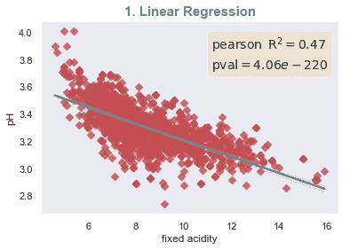

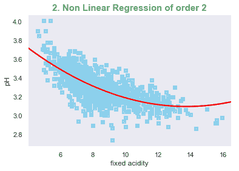

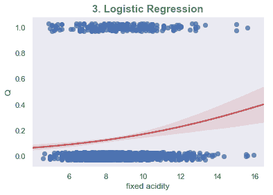


## `lmplot()`

我们将绘制三个具有不同选项的绘图。 对于第一个，我们将使用`hue`变量，对于，将第二个使用`col`变量以及参数回归模型， 对于第三个变量，我们将`col`变量与非参数回归模型一起使用。

## 准备

导入所需的库，将背景样式设置为`dark`，并在以 Matplotlib 格式指定时，将`color_codes`映射为深浅的颜色：

```py
import matplotlib.pyplot as plt
import seaborn as sns

sns.set(style="dark", color_codes=True)
```

## 操作步骤

以下是绘制和所需图的步骤：

1.  使用`Quality`作为变量`hue`绘制线性回归图：

```py
g1 = sns.lmplot(x='fixed acidity', y='pH', hue='Quality', hue_order=
                ['Low', 'Med', 'High'], logx=True,
                data=wine_quality, height=4, aspect=2, ci=None)
```

2.  使用`Quality`作为变量`col`绘制参数回归图，并自定义标签，刻度和轴限制：

```py
g2 = sns.lmplot(x='fixed acidity', y='pH', data=wine_quality, ci=99, 
                col='Quality', col_order=['Low', 'Med', 'High'], 
                height=3, robust=True, scatter_kws={'color': 'g'})
g2 = g2.set_axis_labels("Fixed Acidity", "pH")
g2.set(xlim=(0, 20), ylim=(2.4, 4.0), xticks=[5, 10, 15, 20], 
       yticks=[2.5, 3.0, 3.5, 4.0])
```

3.  使用`Quality`作为变量`col`绘制非参数回归图：

```py
g3 = sns.lmplot(x='fixed acidity', y='density', 
                data=wine_quality,lowess=True, markers='s',  
                col='Quality', col_order=['Low', 'Med', 'High'], 
                height=3, line_kws={'color': 'g'})

plt.show();
```

## 工作原理

这是代码的说明。

这是第一个绘图：

*   `hue='Quality'`将`Quality`指定为，`hue`变量，因此对于的每个唯一值，`Quality`变量将绘制具有不同颜色的回归图。
*   `hue_order=['Low', 'Med', 'High']`是要绘制的色调变量值的顺序。
*   `logx=True`指定拟合形式为`y = log(x)`的曲线。
*   `ci=None`指定不围绕曲线绘制置信区间。

结果图如下所示：


这是第二个图：

*   `ci=99`指定绘制 99% 的置信区间。
*   `col='Quality'`将`Quality`指定为列列变量，以便对于`Quality`的每个唯一值，它沿图的列绘制回归图。
*   `col_order=['Low', 'Med', 'High'`指定图形在图形上的放置顺序。
*   `robust=True`指定要减轻离群值对曲线拟合数据的影响。
*   `scatter_kws={'color': 'g'}`指定以绿色绘制点。
*   `g2 = g2.set_axis_labels("Fixed Acidity", "pH")`用用户定义的标签覆盖的默认轴标签。
*   `g2.set(xlim=(0, 20), ylim=(2.4, 4.0), xticks=[5, 10, 15, 20], yticks=[2.5, 3.0, 3.5, 4.0])`会覆盖的默认轴限制和刻度。

结果图如下所示：


这是第三个绘图：

*   `lowess=True`指定拟合非参数回归模型
*   `markers='s'`使用默认颜色绘制正方形的点
*   `line_kws={'color': 'g'}`将拟合曲线绘制为绿色

生成的图看起来像这里显示的图：


## 多图网格

在本章前面的“具有长格式数据集的线形图和点图”秘籍中，当我们将`row`和`col`变量用于线形图中的各种可视化方面时，我们已经看到了某些类型的多图网格。 但是， seaborn 提供了三组用于不同用途的预定义网格。

`jointplot()`和`JointGrid()`启用，将创建三个轴域/图作为一个图形。 主轴域称为**联合图**，其他两个称为**边缘轴域**。 边缘轴域之一在联合图的顶部，第二边缘轴域在联合图的右侧。 在联合图上绘制了两个变量之间的关系，并且在每个边缘轴域上绘制了这两个变量中的每一个的单变量分布。 这些函数具有各种参数，可以灵活地在这三个轴域的每一个上选择和类型的图形。

`pairplot()`和`PairGrid()`可以成对出现，每个成对包含两个变量。 我们只需传递宽格式数据集，并使用一条语句，就可以得到以行和列的网格形式显示所有数值变量之间成对关系的图形。 同样，这里有许多选择不同类型图形的选项。

`jointplot()`和`JointGrid()`以及`pairplot()`和`PairGrid()`之间的区别在于，可以灵活地选择各种参数和每种参数提供的图形类型。`jointplot()`和`pairplot()`灵活性较差，但易于使用并可以快速绘制。`JointGrid()`和`PairGrid()`提供更多的灵活性，有许多参数可供选择。

`FacetGrid()`是多图网格的第三类。 用于`hue`，`style`，`size`，`row`和`col`变量的组合的多维分析。 我们已经在关系图和类别图的上下文中看到了这些。 他们在内部使用`FacetGrid()`； 在这里，我们将直接访问它。

## `jointplot()`和`JointGrid()`

`jointplot()`使用`kind`参数启用了五种绘图。 我们将为五种图绘制五种具有不同参数的图。

我们将使用`JointGrid()`绘制另一组五个图，并利用其提供的灵活性来控制可在网格的三个轴域上绘制的图的类型和样式。

## 准备

这部分对于`jointplot()`和`JointGrid()`都是通用的，而“操作步骤”和“工作原理”部分将分别对它们分别重复。

导入所需的库：

```py
import matplotlib.pyplot as plt
import numpy as np
import seaborn as sns

from scipy.stats import norm
from itertools import chain # chain enables iteration of multiple lists 
                              in loops such as for loop.

## The following parameters are set in rc configuration file, so they 
  will be applicable for the entire session
## font_scale factor is the multiplier of default font size(instead of 
  absolute size, it is relative size)
sns.set(rc={"axes.linewidth": 1, "xtick.major.width": 1, 
            "ytick.major.width": 1, 
            "xtick.major.size": 5, "ytick.major.size": 5}, 
             style="ticks", context="paper", font_scale=1.25)
```

## `jointplot()`

我们将为`jointplot()`支持的五种不同类型的绘图绘制五幅绘图。

## 操作步骤

以下是绘制和所需图形的步骤：

1.  绘制回归图：

```py
g1 = sns.jointplot(x='Pies', y='Smoothies', data=snacks_sales, 
                   kind='reg', 
                   marginal_kws=dict(bins=15, fit=norm, rug=True, 
                   color='darkblue'), 
                   space=0.1, color='g')
g1.ax_marg_x.set_title('1\. Regression Plot - Histogram, KDE, Normal, 
                        Rug', size=20, color='g')
```

2.  绘制散点图：

```py
g2 = sns.jointplot(x='Cookies', y='Smoothies', data=snacks_sales, 
                   s=100, marginal_kws=dict(kde=True, rug=True, 
                   hist=False, color='orange'), space=0.1, 
                   color='g', edgecolor="blue", alpha=0.6)
g2.ax_marg_x.set_title('2\. Scatter Plot - KDE, Rug', size=20, 
                        color='g')
```

3.  绘制 KDE 图：

```py
g3 = sns.jointplot(x='Period', y='Smoothies', data=snacks_sales, 
                   kind='kde', space=0, color='indigo')
g3.ax_marg_x.set_title('3\. KDE Plots', size=20, color='g');
```

4.  绘制六角箱图：

```py
g4 = sns.jointplot(x='Quarter', y='Pies', data=snacks_sales, 
                   kind='hex', space=0, color='violet');
g4.ax_marg_x.set_title('4\. Hexbin Plot - Histograms', size=20, 
                        color='g');
```

5.  绘制残差图：

```py
g5 = sns.jointplot(x='Cakes', y='Smoothies', data=snacks_sales, 
                   kind='resid', space=0, color='c')
g5.ax_marg_x.set_title('5\. Residual Plot - Histogram, Normal', 
                        size=20, color='g');
```

## 工作原理

这是代码的说明。

这是第一个绘图：

*   `g = sns.jointplot()`绘制了三个图的所需联合图。
*   `kind='reg'`指定绘制回归图。
*   `marginal_kws=dict(bins=15, fit=norm, rug=True, color='darkblue')`是要应用于，边缘轴域图的参数的字典。 它们适用于，上和右边缘轴域，但与联合绘图对象无关：
    *   `bins=15`是要绘制的直方图的仓数； 默认情况下，将绘制直方图。
    *   `fit=norm`指定为给定数据拟合`normal`分布曲线。
    *   `rug=True`绘制给定数据的地毯图。
    *   `color='darkblue'`是用于两个边缘轴域的所有元素的颜色。
    *   `space=0.1`指定，联合图和边缘轴域之间的间距。 `0`表示它们紧密连接，彼此之间没有任何缝隙。
    *   `color='g'`指定联合绘图对象的颜色。
    *   默认情况下，KDE 曲线将适合数据。 如果我们不想绘制它，我们应该将其设置为`false`。 在这种情况下，我们将同时具有  KDE 曲线和`normal`分布曲线。
*   `g1.ax_marg_x.set_title('1\. Regression Plot - Histogram, KDE, Normal, Rug', size=20, color='g')`绘制图的标题：
    *   `ax_marg_x`是顶部的边缘轴域。`jointplot()`内部调用`JointGrid()`，这使我们可以访问，联合图和两个边缘轴域。 我们将在接下来介绍的`JointGrid()`秘籍中详细了解它。
    *   `size=20`是标题的字体大小，`color='g'`将标题的颜色设置为绿色。

这是第二个图：

*   由于`kind='scatter'`是默认设置，因此我们没有提供 kind 参数。 因此，它绘制了一个散点图。
*   `s=100`指定要绘制的每个点的大小。
*   `kde=True`使 KDE 曲线适合给定数据。
*   `rug=True`绘制地毯。
*   `hist=False`不会绘制直方图。
*   `color='orange'`是边缘轴域对象的颜色。
*   `space=0.1`是，联合轴域和边缘轴域之间的间距。
*   `color='g'`将绿色应用于联合绘图对象。
*   `edgecolor="blue"`是，边缘，圆圈的颜色。
*   `alpha=0.6`是和分散点的透明度。

执行后，这两个图应如下所示：


这是第三个图：

*   `kind='kde'`是二元 KDE 图
*   `space=0`指定，联合轴域和边缘轴域之间没有空格
*   `color='indigo'`是所有对象的颜色； 由于我们尚未提供`marginal_kws`，因此它对使用了相同的内容，边沿对象也是如此

这是我们的绘图：

*   `kind='hex'`表示六角箱图
*   `space=0`表示联合轴域和边缘轴域之间没有间隙
*   `color='violet'`是所有对象的颜色

执行代码后，第三和第四图应如下所示：


这是第五个绘图：

*   `kind='resid'`绘制残差绘图
*   `space=0`表示，联合轴域和边缘轴域之间没有空间
*   `color='c'`对所有对象使用青色颜色

执行前面的代码后，您应该看到第五张图，如下所示：


## `JointGrid()`

我们将使用`JointGrid()`和各种参数绘制五幅图，以展示大多数可用功能。

## 操作步骤

以下是绘制和所需图的步骤：

1.  使用默认参数和轴域级自定义创建一个简单的`JointGrid`：

```py
g1 = sns.JointGrid(x='Coffee', y='Cookies', data=snacks_sales, 
                   space=0.1, height=6, ratio=2)
g1 = g1.plot(sns.regplot, sns.kdeplot)
##g = g.plot(plt.scatter, sns.distplot);

g1.ax_joint.set_xlabel('Coffee', color='g', size=20, weight='bold')
g1.ax_joint.set_ylabel('Cookies', color='g', size=20, weight='bold')

plt.setp(g1.ax_marg_x.get_yticklabels(), visible=True)
plt.setp(g1.ax_marg_x.get_xticklabels(), visible=True)
plt.setp(g1.ax_marg_y.get_xticklabels(), visible=True)
plt.setp(g1.ax_marg_y.get_yticklabels(), visible=True)

g1.ax_marg_x.set_facecolor('wheat')
g1.ax_marg_y.set_facecolor('wheat')

for l in chain(g1.ax_marg_x.axes.lines, g1.ax_marg_y.axes.lines):
    l.set_linestyle('--')
    l.set_lw(3)
    l.set_color('red')
g1.ax_marg_x.set_title('1\. Regression Plot - KDE on marginals', 
                        size=20, color='g')
```

2.  用它们各自的参数分开*联合*和*边缘*图：

```py
g2 = sns.JointGrid(x='Pies', y='Smoothies', data=snacks_sales, 
                   space=0, ratio=2)
g2 = g2.plot_joint(sns.regplot, color="g", order=3, ci=68 )
g2 = g2.plot_marginals(sns.distplot, kde=False, rug=True, fit=norm, 
                       color="#1EAFCD23")
g2.ax_marg_x.set_title('2\. Regression Plot - Histogram, Normal, 
                        Rug', size=20, color='g')
```

3.  将联合图，*边缘*`x`和*边缘*`y`图分开，每个图上都有独立的控件：

```py
g3 = sns.JointGrid(x='Pies', y='Smoothies', data=snacks_sales, 
                   space=0, ratio=2)
g3 = g3.plot_joint(sns.regplot, color="g", order=3, ci=68)
g3.ax_marg_x.hist(snacks_sales['Pies'], color="b", alpha=.6, 
                  bins=np.arange(0, 100, 5))
g3.ax_marg_y.boxplot(snacks_sales['Smoothies'], 1, 'gD')
g3.ax_marg_x.set_title('3\. Regression Plot - Histogram, Boxplot', 
                        size=20, color='g');
```

4.  在`JointGrid`上实现`hue`：

```py
g4 = sns.JointGrid("Cookies", "Smoothies", snacks_sales, space=0, 
                    ratio=2)
i=1
for quarter, sales in snacks_sales.groupby('Quarter'):
 sns.kdeplot(sales["Cookies"], ax=g4.ax_marg_x, label='Q'+str(i));
 sns.kdeplot(sales["Smoothies"], ax=g4.ax_marg_y, vertical=True, 
             label='Q'+str(i));
 g4.ax_joint.plot(sales["Cookies"], sales["Smoothies"], "D", ms=5)
 i +=1
g4.ax_marg_x.set_title('4\. Scatter Plot - Histogram with hue, KDE on 
                        marginals', size=20, color='g')
```

5.  使用用户定义的联合和边缘图：

```py
g5 = sns.JointGrid("Cookies", "Coffee", snacks_sales, space=0.5, 
                    ratio=6)

def marginal_boxplot(a, vertical=False, **kws):
    g = sns.boxplot(x="Promotion", y="Coffee", orient="v", **kws) if 
                    vertical \
                 else sns.boxplot(x="Cookies", y="Promotion", 
                                  orient="h", **kws)
    g.set_ylabel("")
    g.set_xlabel("")

g5.plot_marginals(marginal_boxplot, palette={"Yes": "#ff000088", "No": "#00aa007e" }, data=snacks_sales, 
                 linewidth=1, fliersize=10,notch=True)

sns.regplot(x="Cookies", y="Coffee", data=snacks_sales.query("Promotion == 'Yes'"), color="#ff000088", 
            truncate=True, label='Promotion: Yes', marker='D', 
            ax=g5.ax_joint,
            scatter_kws={"s": 100, "edgecolor": "k", "linewidth":  
            .5, "alpha": .8}) 
sns.regplot(x="Cookies", y="Coffee", data=snacks_sales.query("Promotion == 'No'"), 
            color="#00aa007e", marker='^', label='Promotion: No',
            scatter_kws={"s": 50, "edgecolor": "k", "linewidth": .5, 
            "alpha": .4}, 
            line_kws={"linewidth": 2}, ax=g5.ax_joint)

g5.ax_marg_x.set_title('5\. Regression Plot with hue - Boxplots on 
                        marginals', size=20, color='g')
g5.ax_joint.legend(loc=4)

plt.show();
```

## 工作原理

这是代码的说明：

这是第一个图：

*   `g1 = sns.JointGrid()`设置网格：
    *   `space=0.1`是联合图和边缘图之间的差距量。
    *   `height=6`是绘图的高度，以英寸为单位。
    *   `ratio=2`是联合绘图高度与边缘绘图高度的比率。
*   `g1 = g.plot(sns.regplot, sns.kdeplot)`指定联合图的图类型，和边缘图均指定。 也可以使用`plt.scatter`和`sns.distplot`等其他兼容图来代替`sns.regplot`和`sns.kdeplot`。
*   `g.plot()`不能灵活地提供各种参数，它仅使用提供的绘图类型的的所有默认参数。 但是，可以进行轴域级自定义，如下所示：
    *   `g1.ax_joint.set_xlabel('Coffee', color='g', size=20, weight='bold')`会覆盖联合轴域的默认 *x* 轴标签。`"ax_joint"`是联合图的轴域名称。
    *   `g1.ax_joint.set_ylabel('Cookies', color='g', size=20, weight='bold')`或会覆盖联合轴域的默认 *y* 轴标签。
    *   使边缘轴域刻度标签可见：
        *   `plt.setp(g1.ax_marg_x.get_yticklabels(), visible=True)`
        *   `plt.setp(g1.ax_marg_x.get_xticklabels(), visible=True)`
        *   `plt.setp(g1.ax_marg_y.get_xticklabels(), visible=True)`
        *   `plt.setp(g1.ax_marg_y.get_yticklabels(), visible=True)`
        *   `ax_marg_x`和`ax_marg_y`是的名称，上，右边缘轴域
    *   `g1.ax_marg_x.set_facecolor('wheat')`设置，边缘 *x* 轴的面色（上图）。
    *   `g1.ax_marg_y.set_facecolor('wheat')`设置，边缘 *y* 轴的面色（右图）。
    *   `for l in chain(g1.ax_marg_x.axes.lines, g1.ax_marg_y.axes.lines):`是用于自定义两个边缘轴域上的折线图的循环：
        *   `l.set_linestyle('--')`是要使用的线条样式。
        *   `l.set_lw(3) `是线宽。
        *   `l.set_color('red')`是线条的颜色。
    *   `g1.ax_marg_x.set_title('1\. Regression Plot - KDE on marginals', size=20, color='g')`绘制图形标题。`ax_marg_x`是顶部边缘轴域，并且标题被打印在其顶部。 这部分中的所有其他图都相同。

这是第二个图：

*   在这里，我们可以分别绘制，联合图和边缘图，并可以传递适当的属性以自定义它们。
*   如第一张图所示，`g2 = sns.JointGrid(x='Pies', y='Smoothies', data=snacks_sales, space=0, ratio=2)`使用所需的数据设置了网格。
*   `g2 = g2.plot_joint(sns.regplot, color="g", order=3, ci=68 )`在联合轴域上绘制回归图：
    *   我们可以传递适用于`sns.regplot()`的所有参数。
    *   `color="g"`指定使用绿色。
    *   `order=3`，指定为所提供的数据拟合三阶多项式曲线。
    *   `ci=68`指定置信区间，将围绕拟合曲线绘制。

*   `g2 = g2.plot_marginals(sns.distplot, kde=False, rug=True, fit=norm, color="#1EAFCD23")`绘制两个边缘轴域上的分布图，提供的参数适用于以下两个方面：
    *   `kde=False`并未绘制  KDE 曲线。
    *   `rug=True`绘制地毯。
    *   `fit=norm`拟合法线。
    *   `color="#1EAFCD23"`使用十六进制形式指定的颜色。

执行前面的代码后，您应该在屏幕上看到以下两个图：


这是第三张图：

*   在这里，我们可以灵活地在两个边缘轴域上绘制不同类型的图。
*   `g3 = sns.JointGrid()`创建网格，如，的前两个图所示。
*   `g3 = g3.plot_joint(sns.regplot, color="g", order=3, ci=68)`与第二个图中的相同。
*   `g3.ax_marg_x.hist(snacks_sales['Pies'], color="b", alpha=.6, bins=np.arange(0, 100, 5))`在顶部边缘轴域上绘制直方图。
*   从本质上讲，`g3.ax_marg_x`就像标准的 matplotlib 轴域一样，我们可以使用 Matplotlib 图中的任何绘制任何东西。 在这里，我们正在绘制直方图，传递的参数来自 Matplotlib 直方图。
*   `g3.ax_marg_y.boxplot(snacks_sales['Smoothies'], 1, 'gD')`在，右边缘轴域上绘制箱形图。 同样，它是 Matplotlib `boxplot`和，传递的参数来自和 Matplotlib `boxplot`。
*   `1`指定使用该槽口，默认为`0`的默认为没有槽口的矩形框。
*   `'gD'`指定异常值的颜色和标记，在这种情况下为绿色和菱形。

这是第四张图：

*   在该图中，我们在`JointGrid`上实现了`hue`，并且还在边缘轴域上绘制了 Seaborn 图。 在第三张图中，我们使用了 Matplotlib 图。
*   `g4 = sns.JointGrid("Cookies", "Smoothies", snacks_sales, space=0, ratio=2)`与所有`JointGrid`图的通常相同。
*   `i=1`将索引初始化为 1。
*   `for quarter, sales in snacks_sales.groupby('Quarter'):`是用于按季度对销售数据进行分组的`for`循环，因此它们可以在边缘轴域上绘制，而双变量数据可以在联合轴域上绘制：
    *   `sns.kdeplot(sales["Cookies"], ax=g4.ax_marg_x, label='Q'+str(i))`在顶部边缘轴域上使用标签 Q1，Q2，Q3 和 Q4 绘制 KDE 图，在`for`循环的每个迭代中使用一个。
    *   `sns.kdeplot(sales["Smoothies"], ax=g4.ax_marg_y, vertical=True, label='Q'+str(i))`在右边缘轴域上绘制另一个 KDE 图，其标签与顶部轴域相似：
        *   `vertical=True`指定以水平方向进行绘制。
    *   `g4.ax_joint.plot(sales["Cookies"], sales["Smoothies"], "D", ms=5)`在和联合图上绘制散点图：
        *   `"D"`正在使用菱形标记
        *   `ms=5`是标记大小

执行上述代码后，您应该在屏幕上看到以下两个图：


这是第五个图：

*   在此，我们使用用户定义的函数在上绘制联合轴域和两个边缘轴域。 我们将继续产生色调效果。
*   `g5 = sns.JointGrid("Cookies", "Coffee", snacks_sales, space=0.5, ratio=6)`照常创建网格。
*   `def marginal_boxplot(a, vertical=False, **kws):`是在边缘轴域域上绘制箱形图的函数：
    *   `g5 = sns.boxplot(x="Promotion", y="Coffee", orient="v", **kws) if vertical\else sns.boxplot(x="Cookies", y="Promotion", orient="h", **kws)`
    *   我们不是在调用此函数，而是将其传递给`sns.plot_marginals()`函数，该函数会将`vertical`标志设置为`True`或`False`，取决于它要绘制的轴域，上一条语句检查此标志的状态，并适当映射数据和方向参数。
    *   `g5.set_ylabel("") and g5.set_xlabel("")`从轴上删除默认标签。
*   `g5.plot_marginals(marginal_boxplot, palette={"Yes": "#ff000088", "No": "#00aa007e" }, data=snacks_sales,linewidth=1, fliersize=10,notch=True)`在边缘轴域上绘制箱形图：
    *   `marginal_boxplot`是我们定义的用于在边缘轴域上绘制箱形图的函数。
    *   `palette`为变量的不同值指定颜色代码，该变量被用作色相变量。
    *   `linewidth=1`指定在箱形图中绘制的线宽。
    *   `fliersize=10`指定超出胡须的异常值的大小。
    *   `notch=True`指定绘制带有缺口的框，而不是矩形框。
*   `sns.regplot()`对`Promotion=Yes`数据在联合轴域上绘制一次回归图，对`Promotion=No`进行第二次绘制。 所有参数均在回归图（`lmplot()`和`regplot()`）中进行了详细讨论。 因此，我们在这里不再重复。
*   `g5.ax_joint.legend(loc=4)`在联合轴域右下角的上绘制图例。

执行前面的代码块后，您应该在屏幕上看到第五个图，如下所示：


## `pairplot()`和`PairGrid()`

`pairplot()`和`PairGrid()`允许在一个语句中将数据集中的所有数值变量成对绘制为两个。 这是了解整个数据集中变量之间存在的高级关系和联合的快速方法。 这加快了机器学习项目的特征设计过程。`pairplot()`对于双变量绘图只有两个选项：散点图和回归。`PairGrid()`没有任何这样的限制。

## 准备

此部分对于`pairplot()`和`PairGrid()`都是通用的，而“操作步骤”和“工作原理”部分将分别对它们分别重复。

导入所需的库：

```py
import matplotlib.pyplot as plt
import seaborn as sns

## The following parameters are set in rc configuration file, so they 
  will be applicable for the entire session
## font_scale factor is the multiplier of default font size(instead of 
  absolute size, it is relative size)
sns.set(rc={"axes.linewidth": 1, "xtick.major.width": 1, 
            "ytick.major.width": 1, 
            "xtick.major.size": 5, "ytick.major.size": 5}, 
             style="ticks", context="paper", 
             font_scale=1.25)
```

## `pairplot()`

我们将数据集的仅作为数据集的子集，以免因变量太多而无法绘制出混乱的图表。 我们将仅包含五个项目，  促销变量，将用作色相变量。 以下代码提取所需的子集：

```py
snacks_sales_items = snacks_sales.loc[:,['Cakes', 'Cookies', 'Pies', 
                                 'Smoothies','Coffee','Promotion']]
```

## 操作步骤

有三种方法可以指定要使用`pairplot()`绘制的网格类型。 让我们绘制所有三种格式并查看其中的区别：

1.  在提供的数据集中绘制所有数字变量：

```py
sns.pairplot(snacks_sales_items, hue='Promotion', kind='reg')
plt.show();
```

2.  从提供的数据集中绘制所选变量：

```py
sns.pairplot(snacks_sales, vars=['Coffee', 'Pies'], hue='Promotion', 
             kind='reg')
plt.show();
```

3.  在行和列网格中绘制从提供的数据集中选择的变量，类似于我们先前使用的方面变量：

```py
g = sns.pairplot(snacks_sales, x_vars=['Coffee', 'Pies', 'Cakes'], 
                 y_vars=['Cookies', 'Smoothies'],
                 hue='Promotion', kind='scatter')
g.fig.subplots_adjust(wspace=.02, hspace=.02);
plt.show();
```

## 工作原理

这是前面代码的解释。

这是第一个绘图：

*   `sns.pairplot(snacks_sales_items, hue='Promotion', kind='reg')`创建并绘制所需的网格：
    *   `snacks_sales_items`是我们刚刚为此秘籍创建的数据集。
    *   `hue='Promotion'`指定色调变量。
    *   `kind='reg'`指定应为所有双变量图绘制回归图。
    *   在对角线上，默认情况下会绘制单变量`kdeplot()`。

执行后，您应该在屏幕上看到以下图：


这是第二个图：

*   `sns.pairplot(snacks_sales_items, vars=['Coffee', 'Pies'],hue='Promotion', kind='reg')`仅绘制两个变量：`Coffee`和`Pies`。
*   其他参数与第一个图相同。

执行后，您应该在屏幕上看到以下图：


这是第三个图：

*   `g = sns.pairplot(snacks_sales_items, x_vars=['Coffee', 'Pies', 'Cakes'], y_vars=['Cookies', 'Smoothies', hue='Promotion', kind='scatter')`将创建一个`3 x 2`的网格，并在行中绘制`x_vars`，在列中绘制`y_vars`。
*   `kind='scatter'`，绘制双变量散点图。
*   `g.fig.subplots_adjust(wspace=.02, hspace=.02)`，可以水平和垂直调整绘图之间的间隔。 这也可以应用于第一图和第二图。

执行代码后，您应该在屏幕上看到以下图表：


## `PairGrid()`

`PairGrid()`与`pairplot()`的工作原理非常相似，但提供了更大的灵活性，可以将任何类型的图分别用于对角线，非对角线甚至更低和更高的对角线图。 但是，`PairGrid()`不支持`pairplot()`的行和列矩阵网格，因为它沿对角线使用**单变量**图，而行和列网格仅具有**双变量**绘图。

## 操作步骤

除了完整的数据集和选定的变量列表之外，它还有三种方法可以在网格中指定图的特定类型：

1.  对网格中的所有图形单元/轴域使用相同类型的图：

```py
g = sns.PairGrid(snacks_sales_items, hue='Promotion', hue_kws=
                {"marker": ["^", "D"]}, 
                 palette={'Yes': 'blue', 'No': '#00a99f05'})
g.map(plt.scatter, edgecolor='k', s=50)
g.add_legend()
g.fig.subplots_adjust(wspace=.02, hspace=.02);
```

2.  将一种类型的单变量图用于对角线，将另一种双变量类型用于非对角线图：

```py
g = sns.PairGrid(snacks_sales_items, vars=['Coffee', 'Pies', 
                 'Smoothies'], hue='Promotion', palette={'Yes': 
                 'Orange', 'No': 'g'})
g.map_diag(plt.hist, histtype="step", linewidth=2)
g.map_offdiag(sns.kdeplot, n_levels=25, cmap="coolwarm")
g.add_legend()
g.fig.subplots_adjust(wspace=.02, hspace=.02);
```

3.  对于对角线使用一种单变量，对于对角线使用一种双变量类型，对于下部对角线图使用另一种双变量类型：

```py
g = sns.PairGrid(snacks_sales_items, vars=['Cakes', 'Pies', 
                 'Cookies'], hue='Promotion', 
                 palette={'Yes': 'darkblue', 'No': 'r'})
g.map_diag(sns.stripplot, jitter=True)
g.map_upper(sns.regplot, order=2, ci=90)
g.map_lower(sns.residplot, order=2, lowess=True)
g.add_legend();
```

## 工作原理

这是前面代码的解释：

这是第一个绘图：

*   `g = sns.PairGrid(snacks_sales_items, hue='Promotion', hue_kws={"marker": ["^", "D"]},palette={'Yes': 'blue', 'No': '#00a99f05'})`为数据集中的所有变量创建网格：
    *   `hue_kws={"marker": ["^", "D"]}`指定要用于`hue`变量`Promotion`的`Yes`和`No`值的标记
    *   `palette={'Yes': 'blue', 'No': '#00a99f05'}`指定颜色代码，它是用于色调变量的唯一值
*   `g.map(plt.scatter, edgecolor='k', s=50)`在网格上的每个图上绘制散点图：
    *   `edgecolor='k'`将散点图的上的点的边缘指定为黑色。
    *   `s=50`指定散点图上点/标记的大小。
*   `g.add_legend()`将图例添加到图形的中。 由于某些原因，`seaborn`不会像所有其他类型的绘图一样自动添加！
*   `g.fig.subplots_adjust(wspace=.02, hspace=.02)`，可水平和垂直调整绘图之间的间隔。

执行代码后，您应该在屏幕上看到以下图：


这是第二个绘图：

*   `g = sns.PairGrid()`与以前一样创建网格，并使用和标准参数
*   `g.map_diag(plt.hist, histtype="step", linewidth=2)`指定在所有对角线上绘制直方图：
    *   `histtype="step"`是一个楼梯，而不是平滑的曲线。
    *   `linewidth=2`是直方图的线的宽度。

*   `g.map_offdiag(sns.kdeplot, n_levels=25, cmap="coolwarm")`在所有非对角线上绘制 kde 图：
    *   `n_levels=25`指定要绘制的轮廓数量。
    *   `cmap='coolwarm'`是用于绘制轮廓的颜色表。
    *   `g.add_legend()`添加图例。
    *   `g.fig.subplots_adjust(wspace=.02, hspace=.02)`调整绘图之间的间隔。

执行代码后，您应该在屏幕上看到以下图：


这是第三个绘图：

*   `g = sns.PairGrid()`为数据集中的一组选定变量创建网格。
*   `g.map_diag(sns.stripplot, jitter=True)`在对角单元上绘制条形图，并设置了抖动，以使所有点都不落在一条直线上。
*   `g.map_upper(sns.regplot, order=2, ci=90)`回归图绘制在和上对角线单元中：
    *   `order=2`指定将二阶多项式拟合到给定数据。
    *   `ci=90`围绕拟合多项式绘制 90% 的置信区间。

执行代码后，您应该在屏幕上看到以下图：


## `FacetGrid()`

如前所述，`FacetGrid()`用于执行，语义变量`hue`，`style`和`size`以及方面变量`row`和`col`进行多维分析。 当我们了解关系图和类别图时，我们已经间接使用了这些功能。

## 准备

导入所需的库：

```py
import matplotlib.pyplot as plt
import seaborn as sns

## The following parameters are set in rc configuration file, so they 
  will be applicable for the entire session
## font_scale factor is the multiplier of default font size(instead of 
  absolute size, it is relative size)
sns.set(rc={"axes.linewidth": 1, "xtick.major.width": 1, 
            "ytick.major.width": 1, 
            "xtick.major.size": 5, "ytick.major.size": 5}, 
             style="ticks", context="paper", 
             font_scale=1.25)
```

## 操作步骤

以下是绘制各种`FacetGrid()`图以演示其功能的步骤：

1.  绘制单变量直方图：

```py
g = sns.FacetGrid(snacks_sales, col="Promotion", row="weekend", 
                  height=3)
g = g.map(plt.hist, "Cookies", bins=10, color='m')
```

2.  绘制双变量群图：

```py
g = sns.FacetGrid(snacks_sales, col="Promotion", row="weekend", 
                  height=3, margin_titles=True)
g = g.map(sns.swarmplot, "Quarter","Smoothies", order=[1, 2, 3, 4], 
          color='g')
```

3.  绘制一个二元回归图：

```py
g = sns.FacetGrid(snacks_sales, col="Quarter", row="weekend", 
                  hue="Promotion",hue_order=['Yes', 'No'],
                  height=3, margin_titles=True, palette="Set2", 
                  hue_kws=dict(marker=["^", "v"]))
g = g.map(sns.regplot, "Cookies","Coffee")
g.set(xlim=(200, 900), ylim=(100,800))
g.add_legend();
```

4.  绘制双变量点图：

```py
day_order = ['Monday', 'Tuesday', 'Wednesday', 'Thursday', 'Friday', 
             'Saturday', 'Sunday']
item_order = ['Coffee', 'Cakes', 'Pies', 'Cookies', 'Smoothies']
g = sns.FacetGrid(long_sales, col="daywk",col_wrap=3, 
                  col_order=day_order, hue="Promotion", 
                  hue_order=['Yes', 'No'], palette="Set1", height=3, 
                  legend_out=False,
                  aspect=1.5, margin_titles=True)
g = g.map(sns.pointplot, "Item","Sales", 
          order=item_order).set_titles("{col_name}").add_legend()
g = g.fig.subplots_adjust(wspace=.05, hspace=.15);
```

## 工作原理

这是前面代码的解释：

这是第一个绘图：

*   `g = sns.FacetGrid(snacks_sales, col="Promotion", row="weekend", height=3)`创建网格：
    *   `snacks_sales`是输入数据帧。
    *   `col="Promotion"`指定`Promotion`作为列变量。
    *   `row="weekend"`将`weekend`指定为行变量。
    *   `height=3`指定网格中每个图的高度。
    *   默认长宽比为 1，这意味着宽度与高度相同。
*   `g = g.map(plt.hist, "Cookies", bins=10, color='m')`在网格的所有图上绘制直方图：
    *   `bins=10`，指定直方图中桶的个数。
    *   `color='m'`，指定使用洋红色作为颜色。

这是第二个图：

*   `g = sns.FacetGrid(snacks_sales, col="Promotion",  row="weekend", height=3, margin_titles=True)`创建网格：
    *   `margin_titles=True`指定的标题，行变量绘制在最后一列的右侧。
*   `g = g.map(sns.swarmplot, "Quarter","Smoothies", order=[1, 2, 3, 4], color='g')`绘制了`Smoothies`季度销售量的群体图。
*   `order=[1, 2, 3, 4]`指定要在 *x* 轴域上绘制四分之一的顺序； 由于它是一个数字值，因此可以自动采用升序。
*   `color='g'`将绘图上的点涂成绿色。

执行这两个图的代码后，您应该在屏幕上看到以下图：


这是第三个图：

*   `g = sns.FacetGrid()`创建所需的网格：
    *   `col="Quarter"`将`Quarter`映射到列变量。
    *   `row="weekend"`将`weekend`映射到行变量。
    *   `hue="Promotion"`将`Promotion`映射到色调变量。
    *   `hue_order=['Yes', 'No']`是绘制它们的顺序。
    *   `height=3`将每个绘图的高度设置为 3 英寸。
    *   `margin_titles=True`设置行变量的标题，以绘制在最后一列的右侧。
    *   `palette="Set2"`使用预定义的调色板。
    *   `hue_kws=dict(marker=["^", "v"])`指定将这些标记用于`Promotion`变量的的唯一值。

*   `g = g.map(sns.regplot, "Cookies","Coffee")`绘制了`Cookies`和`Coffee`变量的回归图
*   `g.set(xlim=(200, 900), ylim=(100,800))`，设置 *x* 和 *y* 轴限制
*   `g.add_legend()`表示，由于现在添加了和色相变量，因此我们可以绘制图例。

执行上述代码后，您应该在屏幕上看到以下图：


这是我们的绘图：

*   `day_order`是指定工作日绘制顺序的列表
*   `item_order`是指定绘制项目顺序的列表
*   `g = sns.FacetGrid()`使用和以下属性创建网格：
    *   `long_sales`是的长格式数据帧，其中包含要绘制的数据。
    *   `col="daywk"`将变量`daywk`映射到列。
    *   `col_wrap=3`，指定将每三列后的后续图包装成行。
    *   `col_order=day_order`，指定要绘制星期几的顺序。
    *   `hue="Promotion"`是映射到`hue`的`Promotion`变量。
    *   `hue_order=['Yes', 'No'] `是绘制`Promotion`值的顺序。
    *   `palette="Set1"`是要使用的调色板。
    *   `height=3`是每个图的高度。
    *   `aspect=1.5`是网格中每个图的宽度，应为`1.5`乘以高度。
    *   `legend_out=False`指定不将图例推到右侧的图外。 然后，选择作为要打印的绘图中的最佳位置。 默认设置是在中心右侧的绘图区域外进行绘图。
    *   `margin_titles=True`表示行变量的标题绘制在最后一列的右侧。
*   `g = g.map(sns.pointplot, "Item","Sales", order=item_order).set_titles("{col_name}").add_legend()`：
    *   绘制项目和销量的点图。
    *   `order=item_order`按此顺序绘制`item`。
    *   `set_titles("{col_name}")`使用相应绘图的`col_name`设置标题，而不使用默认标题。
    *   `add_legend()`将图例添加到图形中。
*   `g = g.fig.subplots_adjust(wspace=.05, hspace=.15)`，调整绘图之间的间隔。

执行上述代码后，您应该在屏幕上看到以下图：


## 矩阵图

尽管`pairplot()`和`PariGrid()`可以绘制每个变量包含两个变量的网格中的多个变量之间的关系，但矩阵图可以通过使用与变量相关的聚合度量（例如相关性，协方差）以矩阵格式启用此格式，或者可以正常使用两个相关变量的财务，销售或运营等数据。

Seaborn 提供了两个矩阵图，`heatmap()`和`clustermap()`。

`Heatmap()`提供数字的彩色表示，以了解数字的增加，减少，偏离或收敛的趋势，这可能不容易直接用数字捕捉，特别是当数字太小或太大时。

`Clustermap()`使用分层聚类方法，并绘制和生成的树状图。

## 热图

热图通过使用色表表示颜色中的数字，因此我们的眼睛可以捕捉到和数据中各种变量的相对强度。

## 准备

导入和所需的库。 设置背景样式并准备绘制图形所需的数据。

我们将使用和相同的长格式数据帧作为输入，按`Item`和`Quarter`分组以按季度获得各种​​商品的销售额，并根据其中的数据表创建一个数据透视表，仍是数据帧格式，可以将其提供给 Seaborn 绘图：

```py
import matplotlib.pyplot as plt
import seaborn as sns

sns.set(style='white')

## Prepare the data in matrix format with Quartes on rows and Items in 
  columns
sales = pd.DataFrame(long_sales.groupby(["Item", 
                                         "Quarter"]).Sales.mean())
sales = sales.reset_index()
sales = sales.pivot('Quarter','Item', 'Sales')
sales.head()
```

## 操作步骤

这是绘制和所需图形的步骤。 我们将绘制三个数字，一个接一个。 第一个图将具有三个图，第二个图将有一个图，第三个图将有两个图：

1.  定义第一个图形对象并定义轴域对象，我们将在其上绘制 Seaborn 图：

```py
fig, (ax1, ax2, ax3) = plt.subplots(1,3, figsize=(15,5))
```

2.用预定义的颜色表绘制热图：

```py
sns.heatmap(sales, annot=True, fmt='.0f', linewidths=.5, 
            cmap="YlGnBu", ax=ax1)
ax1.set_title('Using pre-defined Colorbar')
```

3.  绘制热图，带有以特定值为中心的色表：

```py
sns.heatmap(sales, annot=True, fmt='.0f',linewidths=.5, robust=True,
            cmap="YlGnBu", center=sales.loc[3, 'Cookies'], 
            yticklabels=False, ax=ax2)
ax2.set_title("Colorbar Centered at [3, 'Cookies']")
```

4.  绘制设置了颜色表显示的热图：

```py
sns.heatmap(sales, annot=True, fmt='.0f',linewidths=.5, robust=True, 
            vmin=200, vmax=600,
            cmap="YlGnBu", yticklabels=False, ax=ax3)
ax3.set(title='Colorbar range(200, 600)', ylabel='')
```

5.  调整绘图之间的间距，并在屏幕上显示图形：

```py
plt.tight_layout()
plt.show();
```

6.  在第二个图形对象上定义，并在单独的轴域上绘制热图和色条，并使用水平色条：

```py
grid_kws = {"height_ratios": (.9, .05), "hspace": .4}
f, (plot_ax, cbar_ax) = plt.subplots(2, gridspec_kw=grid_kws)
ax = sns.heatmap(sales, ax=plot_ax, cmap="Set1", annot=True, 
                 fmt='.0f',linewidths=.5,
                 cbar_ax=cbar_ax, cbar_kws={"orientation": 
                 "horizontal"});
```

7.  定义第三个图，并绘制`wine_quality`相关矩阵的热图：

```py
fig, (ax1, ax2) = plt.subplots(1,2, figsize=(16,6)) 
sns.heatmap(corr, annot=True, fmt='.2f',linewidths=.5, 
            cmap="inferno", ax=ax1)
```

8.  在上一步中定义的第三个图上绘制部分相关矩阵的热图：

```py
mask = np.zeros_like(corr)
mask[np.triu_indices_from(mask)] = True
sns.heatmap(corr, mask=mask, vmax=.3, annot=True, fmt='.2f', 
            cmap="inferno", ax=ax2)
```

9.  在屏幕上显示该图：

```py
plt.show();
```

## 工作原理

这是前面代码的解释。

这是第一个数字：

*   `fig, (ax1, ax2, ax3) = plt.subplots(1,3, figsize=(15,5))`连续定义图形和三个轴域。
*   `sns.heatmap(sales,  annot=True, fmt='.0f',linewidths=.5, cmap="YlGnBu", ax=ax1)`绘制热图：
    *   `sales`是季度和项目销售数据帧。
    *   `annot=True`指定在图上显示实际数字。
    *   `fmt='.0f'`指定和数字应以整数格式显示，没有任何十进制值。
    *   `linewidths=0.5`指定应使用此宽度的线来绘制所有行和列。
    *   `cmap=" YlGnBu"`指定预定义的颜色表。
    *   `ax=ax1`指定要在其上绘制该图的轴域。
*   `ax1.set_title('Using pre-defined Colorbar')`绘制第一个图的标题。
*   `sns.heatmap(sales, annot=True, fmt='.0f',linewidths=.5, robust=True, cmap="YlGnBu", center=sales.loc[3, 'Cookies'], yticklabels=False, ax=ax2)`绘制了和第二个热图，该色表的中心位于和指定值处：
    *   `robust=True`：当未指定`vmin`和`vmax`范围时，色表范围是通过降低异常值的权重得出的。
    *   `center=sales.loc[3, 'Cookies']`将此颜色表的中心颜色设置为该值，并将颜色条调整为要绘制的数据范围。 如果选择的值在数据范围的任意一个极端上，则仅将原始色表的一半用于新色条。
    *   `yticklabels=False`关闭此图的 Y 轴的刻度标签。
    *   `ax=ax2`是绘制此图的轴域。

*   `sns.heatmap(sales, annot=True, fmt='.0f',linewidths=.5, robust=True, vmin=200, vmax=600, cmap="YlGnBu", yticklabels=False, ax=ax3)`绘制了另一个热图，并在色条上设置了限制：
    *   `vmin=200`是的下限，`vmax=600`是上限。 数据中低于下限的所有数字，都以颜色条的下端着色，高于上限的数字都以颜色条的上端着色。
*   `ax3.set(title='Colorbar range(200, 600)', ylabel='')`打印标题并关闭 *y* 轴标签。
*   `plt.tight_layout()`调整绘图之间的间隔，以确保没有重叠。

执行上述代码后，您应该在屏幕上看到以下图：


这是第二个数字：

*   `f, (plot_ax, cbar_ax) = plt.subplots(2, gridspec_kw=grid_kws)`定义图形和一列中的两个轴域。
*   `grid_kws = {"height_ratios": (.9, .05), "hspace": .4}`是网格的参数字典。 和两个轴域的高度之比为`0.9:0.05`，因此和色条轴域的高度与绘图高度相比非常短。 两个轴域之间的水平间距为 0.4。
*   `ax = sns.heatmap(sales, ax=plot_ax, cmap="Set1", annot=True, fmt='.0f',linewidths=.5, cbar_ax=cbar_ax, cbar_kws={"orientation": "horizontal"})`绘制热图：
    *   `sales`是要绘制的数据。
    *   `ax=plot_ax`指定要放置绘图的轴域。
    *   `cmap= "Set1"`是另一个预定义的颜色表。
    *   `annot=True`在绘图上显示数字。
    *   `fmt='.0f'`数字显示时不带十进制值。
    *   `linewidths=0.5`线以 0.5 的宽度绘制在矩阵中。
    *   `cbar_ax=cbar_ax`指定颜色条轴域。
    *   `cbar_kws={"orientation": "horizontal"})`绘制水平颜色条。

执行上述代码后，您应该在屏幕上看到以下图：


这是第三个数字：

*   `fig, (ax1, ax2) = plt.subplots(1,2, figsize=(16,6))`定义第三个图形，带有一行中的两个轴域。
*   `sns.heatmap(corr, annot=True, fmt='.2f',linewidths=.5, cmap="inferno", ax=ax1)`绘制，相关矩阵，和`wine_quality`数据的热图。 最后两个图中已经说明了所有参数。
*   对于第二个绘图，`mask = np.zeros_like(corr)`使用`corr`矩阵的相同大小创建遮罩，并用零填充。
*   `mask[np.triu_indices_from(mask)] = True`将上对角线的所有元素设置为`True`，其他元素（对角线和下对角线单元）将保留为`False(0)`。
*   `sns.heatmap(corr, mask=mask, vmax=.3, annot=True, fmt='.2f', cmap="inferno", ax=ax2)`绘制热图：
    *   `mask=mask`指定要应用于整个矩阵的遮罩。 它仅显示设置为`Zero(False)`的条目，并隐藏设置为`True(1).`的条目。它将`mask`矩阵中的索引与`corr`矩阵匹配。 
    *   `vmax = 0.3`，将颜色条的限制设置为 0.3。 所有高于 0.3 的值将用颜色条顶部的颜色进行着色。
    *   `cmap="inferno"`设置要在此处使用的另一个预定义颜色表。

执行上述代码后，您应该在屏幕上看到以下图：


## 群集图

顾名思义，`clustermap()`使用分层聚类方法对数据集中的各种变量进行聚类，并绘制和生成的树状图。

## 准备

导入所需的库：

```py
import matplotlib.pyplot as plt
import numpy as np
import seaborn as sns

sns.set(style='white')
```

## 操作步骤

以下是绘制两个聚类图的步骤，一个在`Wine Quality`数据集中具有原始数据，另外一个在相关的相关矩阵中：

1.  绘制`Wine Quality`数据集的聚类图：

```py
row_colors = 
 wine_quality["Quality"].map(dict(zip(wine_quality["Quality"].unique
                             (), "rbg")))
g = sns.clustermap(wine_quality.drop('Quality',axis=1),  
                   standard_scale=1, robust=True,
                   row_colors=row_colors, cmap='viridis')
```

2.  绘制`Wine Quality`数据集的相关矩阵的聚类图：

```py
g = sns.clustermap(corr, figsize=(10,8),  z_score=1, cbar_kws={"label": 
                                                        "color bar"})
```

## 工作原理

这是代码的说明：

`Wine Quality`数据集中的`Quality`变量具有`Low`，`Med`和`High`值，分别具有`63`，`1319`和`217`计数。 我们要突出显示群集中的哪些观测值属于哪个质量等级。 因此，我们提取这三个唯一值，并为其分配红色，绿色和蓝色三种颜色，以便和对应的观察结果相应地着色：

*   `row_colors = wine_quality["Quality"].map(dict(zip(wine_quality["Quality"].unique(), "rbg")))`获取所有观测值的索引，并为分配适当的颜色代码，分别对应`Low`（绿色），`Med`（蓝色）和`High`（红色）值。
*   `g = sns.clustermap(wine_quality.drop('Quality',axis=1), standard_scale=1, robust=True, row_colors=row_colors, cmap='viridis')`绘制群集图：
    *   `wine_quality.drop('Quality',axis=1)`从群集映射中删除了`Quality`变量，因为它已用作色调。
    *   `standard_scale=1`，指定标准化数据集中的所有变量。 这可以按行或按列进行。 我们要按列进行操作，因为我们想标准化按列组织的变量。 本质上，它计算变量的最小值和最大值，然后从每个值中减去最小值，然后将结果除以最大值。 这有助于改善模型的表现。
    *   `row_colors=row_colors`指定要在聚类地图上显示的观测值的颜色代码。
    *   `cmap='viridis'`指定要使用的颜色表。
    *   我们可以尝试使用，`method`参数分配链接的不同方法，以及使用`metric`参数分配距离的指标。 有关更多详细信息，请参考[这里](https://docs.scipy.org/doc/scipy/reference/generated/scipy.spatial.distance.pdist.html)。
    *   我们可以分别使用`g.dendrogram_row.reordered_ind`和`g.dendrogram_col.reordered_ind`来获取，行和群集的`col`索引的序列，其中`g`是`clustermap`对象。

执行上述代码后，您应该在屏幕上看到以下图：


进一步的解释如下：

*   `g = sns.clustermap(corr, figsize=(10,8),  z_score=1, cbar_kws={"label": "color bar"})`绘制了`Wine Quality`数据集的相关矩阵的聚类图：
    *   `figsize=(10,8)`指定要在其中绘制群集图的图形的大小。
    *   `z_score=1`是另一种标准化方法，其中为每个变量计算均值和标准差，从每个元素中减去均值，然后将其除以标准差，以便结果变量分布的平均值为零，标准差/方差为 1。

执行上述代码后，您应该在屏幕上看到以下图：

