# 二、基本绘图入门

在本章中，我们将介绍绘制以下图形的方法：

*   线形图
*   条形图
*   散点图
*   气泡图
*   堆叠图
*   饼图
*   表格图
*   极坐标图
*   直方图
*   箱形图
*   提琴图
*   热图
*   Hinton 图
*   图像
*   等高线图
*   三角剖分
*   流图
*   路径

## 介绍

一幅图片价值一千个单词，数据的可视化在寻找数据中的隐藏图案方面起着至关重要的作用。 在一段时间内，已开发出各种图形来表示不同类型变量之间的不同关系。 在本章中，我们将看到如何在不同的上下文中使用这些不同的图以及如何使用 Matplotlib 绘制它们。

## 线形图

线形图用于表示两个连续变量之间的关系。 它通常用于表示随时间变化的趋势，例如季度和年度的 GDP 增长率，通货膨胀，利率和股票价格。 我们在第 1 章“Matplotlib 剖析”中看到的所有图形都是线形图的示例。

## 准备

我们将使用 Google 股票价格数据绘制时间序列线形图。 我们将数据（日期和每日收盘价，用逗号分隔）保存在没有标题的`.csv`文件中，因此我们将使用 Pandas 库进行读取并将其传递给`matplotlib.pyplot`函数以绘制图形。

现在，使用以下代码导入所需的库：

```py
import matplotlib.pyplot as plt
import pandas as pd
```

## 操作步骤

以下代码绘制了 Google 股票价格的时间序列图：

1.  将`Google Stock Price`文件（日期和价格）加载到 *x*，*y* 坐标中：

```py
stock = pd.read_csv('GOOG.csv', header=None, delimiter=',')
```

2.  添加列名：

```py
stock.columns = ['date','price']
```

3.  将 pandas 数据帧转换为时间序列：

```py
stock['date'] = pd.to_datetime(stock['date'], format='%d-%m-%Y') 
```

4.  将日期设置为 Pandas 数据帧的索引：

```py
indexed_stock = stock.set_index('date') 
ts = indexed_stock['price']
```

5.  绘制图形：

```py
plt.plot(ts)
```

6.  在屏幕上显示图形：

```py
plt.show()
```

## 工作原理

以下是代码的说明：

*   `pd.read_csv()`函数指定以下内容：
    *   `header=None`，输入文件没有标题
    *   `delimiter=','`，`date`和`price`用逗号（，）分隔
    *   将数据读入`stock`数据帧
*   `stock.columns`命令为`stock`数据帧中的每个属性`date`和`price`分配名称。
*   `pd.to_datetime()`函数将日期从字符格式转换为日期时间格式。 格式：`%d-%m-%Y`参数指定输入文件中日期的格式。
*   `stock.set_index()`将`date`列设置为索引，以便`price`列可以表示时间序列数据，`plot`命令可以理解。

下图是您应该从前面的代码块获得的输出：

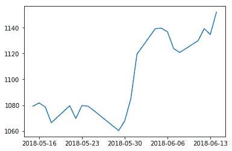

## 更多

除了从`.csv`或`.xlsx`文件中读取 Google 股票价格数据之外，还有一些标准 API，例如`fix_yahoo_finance`和`pandas_datareader`可以直接从打开的数据库中读取数据。

Standard APIs undergo frequent changes and at times the database websites are not responsive. You need to install these APIs on your machine, as they don't come with standard Python distributions.

在这里，我们将展示一个使用`fix_yahoo_finance`的示例：

1.  导入所需的库：

```py
import matplotlib.pyplot as plt
import pandas as pd
import fix_yahoo_finance as yf 
```

2.  下载从 2017 年 10 月 1 日至 2018 年 1 月 1 日的`AAPL`每日收盘价：  

```py
data = yf.download('AAPL','2017-10-01','2018-01-01') 
```

3.  按日期绘制收盘价（`Close`）。 请注意，此处`date`是默认的 *x* 轴，因为`yf.download`创建具有`date`索引的数据。 因此，我们不需要为绘图提供 *x* 轴坐标。 请注意，这里我们使用的是`plot()`Pandas 命令，而不是 Matplotlib：

```py
data.Close.plot()  
```

4.  在屏幕上显示图形：

```py
plt.show()
```

您应该看到一个图形，就像这里描述的那样：

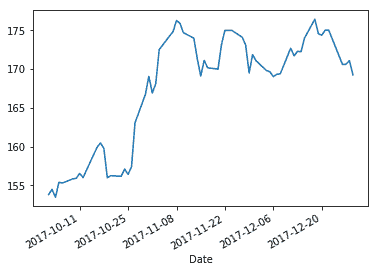

您可以尝试使用`pandas_datareader` API。 有关更多详细信息，请参考[这个页面](http://pandas-datareader.readthedocs.io/en/latest/)上的文档。

## 条形图

条形图是使用条形图比较不同类别数据的图形。 根据分类变量使用哪个轴，可以垂直或水平显示条形图。 假设我们有的数据，即在一年的时间内在冰淇淋店每月售出的冰淇淋数量。 我们可以使用条形图对此进行可视化。

## 准备

我们将使用 Python `calendar`包将数字月份（1 到 12）映射到相应的描述月份（1 月到 12 月）。

在绘制图形之前，我们需要导入必要的包：

```py
import matplotlib.pyplot as plt
import numpy as np
import calendar
```

## 操作步骤

以下代码绘制了条形图：

1.  设置 *x* 和 *y* 轴的数据：

```py
month_num = [1, 2, 3, 4, 5, 6, 7, 8, 9, 10, 11, 12]
units_sold = [500, 600, 750, 900, 1100, 1050, 1000, 950, 800, 700, 
              550, 450]
```

2.  分配空间并指定图形的布局：

```py
fig, ax = plt.subplots()
```

3.  将描述性月份名称设置为 *x* 轴刻度：

```py
plt.xticks(month_num, calendar.month_name[1:13], rotation=20)
```

4.  绘制条形图：

```py
plot = ax.bar(month_num, units_sold)
```

5.  将数据值添加到条形的顶部：

```py
for rect in plot:
    height = rect.get_height()
    ax.text(rect.get_x() + rect.get_width()/2., 1.002*height,'%d' % 
    int(height), ha='center', va='bottom')
```

6.  在屏幕上显示图形：

```py
plt.show()
```

## 工作原理

这是前面的代码块的说明：

*   Matplotlib 的较旧版本仅接受浮点数据类型作为其数据参数。 因此，月份必须以数字格式表示。
*   `month_num`和`units_sold`是 Python 列表，表示一年中每个月的销售数量。
*   `plt.subplots()`允许我们根据图形的数量以及如何在图形中组织图形来定义图形的布局。 我们将在第 3 章“绘制多个图表，子图和图形”和第 6 章“带有高级功能的绘图”中了解更多信息。 在这种情况下，我们使用它来访问要绘制条形图的轴域，以便可以用代表条形图的实际数据对其进行标注。 如果您从第 1 章“Matplotlib 剖析”中回想起，我们已经看到轴域是图形中的单个图。
*   将月份格式从数字格式更改为 *x* 轴上的相应月份名称。`calendar.month_name[1:13]`将返回 1 月至 12 月，而`plt.xticks()`将 *x* 轴代号从数字 1 到 12，更改为 1 月到 12 月，以提高可读性。
*   `for`循环中的`ax.text()`用其相应的数据值标注每个条。 此函数的参数指定必须在条形图上精确放置数据文本的位置：首先，获取当前条形图的 *x* 和 *y* 坐标，然后再添加`bar_width / 2`到 *x* 坐标，以及`1.002`高度到 *y* 纵坐标；然后，使用`va`和`ha`自变量，将文本居中对齐在条形上方：

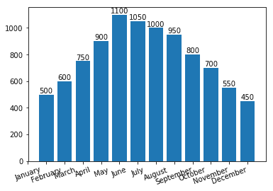

## 更多

前一节的条形图垂直绘制条形图。 我们还可以绘制水平条形图，如下所示。 除了`plt.xticks()`和`plt.bar()`分别被`plt.yticks()`和`plt.barh()`代替外，大多数代码与上一节中使用的代码相同：

```py
## matplotlib accepts only floating point data types as its arguments 
  for data. 

## So months have to be represented in numerical format
month_num = [1, 2, 3, 4, 5, 6, 7, 8, 9, 10, 11, 12]
units_sold = [500, 600, 750, 900, 1100, 1050, 1000, 950, 800, 700, 550, 
              450]

fig, ax = plt.subplots() 

## change the month number to month name on y axis
plt.yticks(month_num, calendar.month_name[1:13], rotation=20)

## plot horizontal bar graph
plot = plt.barh(month_num, units_sold) 

## Display the graph on the screen
plt.show()
```

这是输出图的外观：

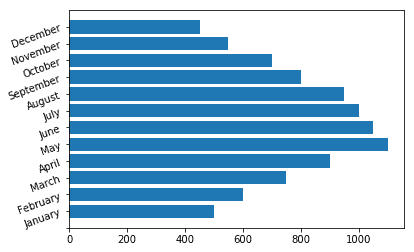

## 散点图

散点图用于比较两个变量的分布，并查看它们之间是否存在任何相关性。 如果数据中有不同的群集/段，则在散点图中将很清楚。

## 准备

导入以下库：

```py
import matplotlib.pyplot as plt
import pandas as pd
```

我们将使用`pandas`读取 Excel 文件。

## 操作步骤

以下代码块绘制了一个散点图，描述了年龄和体重之间的关系：

1.  将图形大小（宽度和高度）设置为（`10, 6`）英寸：

```py
plt.figure(figsize=(10,6))

```

2.  从 Excel 文件中读取年龄和体重数据：

```py
age_weight = pd.read_excel('scatter_ex.xlsx', 'age_weight')
x = age_weight['age']
y = age_weight['weight']
```

3.  绘制散点图：

```py
plt.scatter(x, y)
```

4.  设置 *x* 和 *y* 轴标签：

```py
plt.xlabel('Age')
plt.ylabel('Weight)
```

5.  显示图形：

```py
plt.show()
```

## 工作原理

该代码的说明如下：

*   `plt.figure(figsize=(10,6))`用大小`(10, 6)`覆盖默认图形大小。
*   `pd.read_excel()`读取数据，并将值分配给 *x* 和 *y* 轴坐标。
*   `plt.scatter(x,y)`绘制散点图。
*   `plt.xlabel()`和`plt.ylabel()`设置 *x* 和 *y* 轴标签以提高可读性。

在终端上显示图形。 您应该看到以下图表：

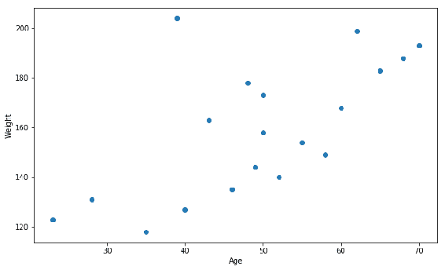

很明显，年龄和体重之间没有关系，因为这些点是分散的。 如果所描绘的两个元素之间存在相关性，我们将观察到直线或曲线的图案。

The previous graphs could have been plotted with the `plt.plot()` method also. The `plt.scatter()` method has a lot more flexibility to customize each of the points with different sizes, colors, and so on, which we will observe in the bubble plot section. However, this flexibility comes at the cost of performance. For larger datasets, the `plt.plot()` method is lot faster than the `plt.scatter()` method.

## 更多

在这里，我们将看到另一个散点图示例，在这里我们可以清楚地看到不同的段。

The `Iris` flower dataset is the oldest dataset, introduced in 1936 by Ronald Fisher. The dataset has 50 examples each of three species of Iris, named Setosa, Virginica, and Versicolor. Each example has four attributes, and the length and width in centimeters of both sepals and petals. This dataset is widely used in **machine learning** (**ML**) for classification and clustering. We will use this dataset to demonstrate how a scatter plot can show different clusters within a dataset.

以下代码块绘制了花瓣的长度和宽度的散点图：

1.  使用 Pandas 从`.csv`文件加载`Iris`数据集：

```py
iris = pd.read_csv('iris_dataset.csv', delimiter=',')
```

2.  在文件中，每类物种都用描述性名称定义，我们将其映射为`0`，`1`或`2`的数字代码：

```py
iris['species'] = iris['species'].map({"setosa" : 0, "versicolor" : 
                        1, "virginica" : 2})
```

3.  以 *x* 轴上的花瓣长度和 *y* 轴上的花瓣宽度绘制散点图：

```py
plt.scatter(iris.petal_length, iris.petal_width, c=iris.species)
```

4.  标记 *x* 和 *y* 轴：

```py
plt.xlabel('petal length')
plt.ylabel('petal width')
```

5.  在屏幕上显示图形：

```py
plt.show()
```

这是代码的说明：

*   `pd.read_csv()`将数据读取到`iris`数据帧中。
*   数据帧中的`species`属性具有描述性的类名`setosa`，`versicolor`和`virginica`。 但是，如果我们想用不同的颜色绘制每个类，则传递的参数应该是数字代码。 因此，我们将它们映射到数字代码。
*   `iris['species'] = iris['species'].map()`将描述性名称替换为`0`，`1`和`2`数字代码。
*   `c=iris.species`指定到不同类别的颜色映射。 这些参数类应该是数字的，这是我们之前所做的。
*   `plt.scatter()`绘制散点图。

您应该在屏幕上看到以下图形：

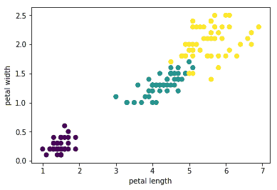

显然，我们可以在此处看到三个不同的群集。 但是，尚不清楚哪种颜色代表山，杂色和弗吉尼亚簇。 在随后的章节中，我们将看到如何使用标签来区分不同的聚类，在此我们将学习如何自定义图。

## 气泡图

使用相同的`plt.scatter()`方法绘制气泡图。 它是散点图的体现，图中的每个点都显示为气泡。 这些气泡中的每一个都可以显示为不同的颜色，大小和外观。

## 准备

导入所需的库。 我们将使用 Pandas 来读取 Excel 文件：

```py
import matplotlib.pyplot as plt
import pandas as pd
```

## 操作步骤

以下代码块绘制了一个气泡图，我们之前已经看到了一个散点图：

1.  加载`Iris`数据集：

```py
iris = pd.read_csv('iris_dataset.csv', delimiter=',')
```

2.  在文件中，每类物种都定义为`0`，`1`和`2`，我们将其映射为它们的描述性名称：

```py
iris['species'] = iris['species'].map({"setosa" : 0, "versicolor" : 
                        1, "virginica" : 2})
```

3.  绘制散点图：

```py
plt.scatter(iris.petal_length, iris.petal_width, 
            s=50*iris.petal_length*iris.petal_width, 
            c=iris.species, 
            alpha=0.3)
```

4.  标记 *x* 和 *y* 轴：

```py
plt.xlabel('petal length')
plt.ylabel('petal width')
```

5.  在屏幕上显示图形：

```py
plt.show()
```

## 工作原理

以下是该代码的说明：

*   `pd.read_csv()`读取数据并用数字代码替换描述性名称，如前所述。
*   `s = 50 * iris.petal_length * iris.petal_width`指定气泡的大小。 它实质上代表了该区域。`s`公式中使用的常数`50`是一个随机数，该常数将每个点的面积乘以该常数。 该常数越小，所有点的相对大小将越小。 尝试将此常数从 25 更改为 50，然后更改为 100，然后查看气泡大小如何变化。 如果没有此乘数，则某些点的大小太小而无法在图中观察到它们。
*   `c = iris.species`在数据中指定不同的类（群集）。`pyplot`方法使用此方法以不同的颜色表示这些类别中的每一个。
*   `alpha=0.3`指定气泡的外观，并确定气泡的透明度。 范围是 0 到 1； 如果值接近零，则气泡高度透明；如果值接近 1，则气泡高度不透明：

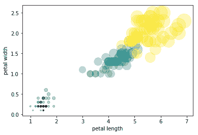

## 堆叠图

堆叠图表示线形图下的区域，多条线形图彼此叠放。 它用于提供的可视化，即 *y* 轴域上绘制的多个变量的累积效果。

我们将通过缺陷原因代码绘制产品缺陷的数量，将三个月堆叠在一起，以给出该季度的累积情况。

## 准备

导入所需的库：

```py
import numpy as np
import matplotlib.pyplot as plt
```

## 操作步骤

以下是绘制堆叠图的步骤：

1.  定义图的数据：

```py
x = np.array([1, 2, 3, 4, 5, 6], dtype=np.int32)
Apr = [5, 7, 6, 8, 7, 9]
May = [0, 4, 3, 7, 8, 9]
June = [6, 7, 4, 5, 6, 8]
```

2.  定义要用于图例的`labels`列表：

```py
labels = ["April ", "May", "June"]
```

3.  定义图形和轴域：

```py
fig, ax = plt.subplots()
```

4.  绘制`stackplot`和`legend`：

```py
ax.stackplot(x, Apr, May, June, labels=labels)
ax.legend(loc=2)
```

5.  设置标签和标题：

```py
plt.xlabel('defect reason code')
plt.ylabel('number of defects')
plt.title('Product Defects - Q1 FY2019')
```

6.  在屏幕上显示该图：

```py
plt.show()
```

## 工作原理

这是代码的说明：

*   `x = np.array([1, 2, 3, 4, 5, 6], dtype=np.int32)`是产品缺陷代码的列表，数据类型为整数。
*   `Apr = [5, 7, 6, 8, 7, 9]`是按缺陷代码分类的 4 月份产品缺陷计数的列表。
*   `May = [0, 4, 3, 7, 8, 9]`是按月份分类的缺陷代码的产品缺陷计数列表。
*   `June = [6, 7, 4, 5, 6, 8]`是按月份分类的缺陷代码的产品缺陷计数列表。
*   `labels = ["April ", "May", "June"]`是用作图例的标签列表。
*   `fig, ax = plt.subplots()`定义图形和要在其上绘制图形的轴域。
*   `ax.stackplot(x, Apr, May, June, labels=labels)`绘制具有给定数据和标签的堆叠图。
*   `ax.legend(loc=2)`指定要在图的左上方绘制的图例； 我们将在第 4 章“开发可视化以提高发布质量”中了解有关图例位置的更多信息。
*   `plt.xlabel('defect reason code')`绘制 *x* 轴的标签。
*   `plt.ylabel('number of defects')`绘制 *y* 轴标签。
*   `plt.title('Product Defects - Q1 FY2019')`绘制图形标题。
*   `plt.show()`在屏幕上显示图形。

在执行前面的代码时，您应该在屏幕上看到下图：

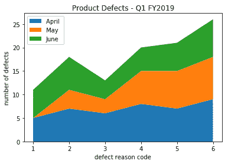

## 饼图

饼图用于表示各种类别/组对总数的贡献。 例如，每个州对国家 GDP 的贡献，一部电影对一年中发行的电影总数的贡献，学生等级（A，B，C，D 和 E）占总班级人数的百分比 ，或每月家庭支出在杂货，蔬菜，公用事业，服装，教育，医疗保健等方面的分配。

## 准备

导入所需的库：

```py
import matplotlib.pyplot as plt
```

## 操作步骤

以下代码块绘制了一年中发行的电影类型的饼图：

1.  设置饼图的数据：

```py
labels = ['SciFi', 'Drama', 'Thriller', 'Comedy', 'Action', 'Romance']
sizes = [5, 15, 10, 20, 40, 10]          # Add upto 100%
```

2.  稍微在圆外显示一个切片：

```py
explode = (0, 0, 0, 0, 0.1, 0) # only "explode" the 5th slice (i.e.'Action')
```

3.  绘制饼图：

```py
plt.pie(sizes, labels=labels, explode=explode, autopct='%1.1f%%', 
        shadow=True, startangle=90)
```

4.  相等的长宽比可确保将饼图绘制为圆形。 默认值为椭圆：

```py
plt.axis('equal') 
```

5.  在屏幕上显示图形：

```py
plt.show()
```

## 工作原理

以下是代码的说明：

*   `labels`和`sizes`是 Python 列表，代表流派和一年中发行的电影总数的百分比。 输入列表中标签的顺序在饼图中按逆时针方向绘制。
*   `explode`参数指定要向外展开图表的哪个部分。
*   `autopct`自变量描述了要在百分比数据点中显示的小数点的数量。 如果省略此参数，则切片将不显示实际百分比（`%`）数据。
*   `shadow`参数指定是否应在每个切片上显示阴影。
*   `startangle`参数指定第一个切片应开始的角度，并且它逆时针旋转以表示饼图中的所有其他切片。
*   `plt.pie()`绘制饼图。
*   `plt.axis(equal)`表示图表应显示为圆形（*x* 和 *y* 轴相等）。 默认形状是椭圆：

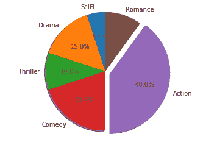

## 表格图

表格图是条形图和表格的组合，表示相同的数据。 因此，它是图形表示与表格中相应数据的组合。

## 准备

我们将以每年销售的电池数量为例，不同的**安时**（**Ah**）额定值。 有两个类别变量：年份和 Ah 等级，一个数字变量：售出的电池数量。

导入所需的库：

```py
import numpy as np
import matplotlib.pyplot as plt
```

## 操作步骤

以下代码块绘制了一张表格，列出了每年出售的电池类型：

1.  准备数据：

```py
rows = ['2011', '2012', '2013', '2014', '2015']
columns = ('7Ah', '35Ah', '40Ah', '135Ah', '150Ah')
data = [[75, 144, 114, 102, 108], [90, 126, 102, 84, 126], 
        [96, 114, 75, 105, 135], [105, 90, 150, 90, 75], 
        [90, 75, 135, 75, 90]]
```

2.  定义 *y* 轴的范围和比例：

```py
values = np.arange(0, 600, 100)
```

3.  指定要使用的色谱。 每年将以不同的颜色表示：

```py
colors = plt.cm.OrRd(np.linspace(0, 0.5, len(rows)))
```

4.  定义要绘制条形的 *x* 轴刻度：

```py
index = np.arange(len(columns)) + 0.3
bar_width = 0.5
```

5.  初始化堆叠条形图的垂直偏移量：

```py
y_offset = np.zeros(len(columns))
```

6.  根据图形和轴域指定绘图区域：

```py
fig, ax = plt.subplots()
```

7.  绘制条并为表格创建文本标签。 初始化用于保存表数据的列表：

```py
cell_text = []
```

8.  `for`循环的每次迭代都以一种颜色绘制所有电池额定值的一年数据：

```py
n_rows = len(data)
for row in range(n_rows):
    plot = plt.bar(index, data[row], bar_width, bottom=y_offset, 
                   color=colors[row])
    y_offset = y_offset + data[row]
    cell_text.append(['%1.1f' % (x) for x in y_offset])
    i=0
## Each iteration of this for loop, labels each bar with   
  corresponding value for the given year
    for rect in plot:
        height = rect.get_height()
        ax.text(rect.get_x() + rect.get_width()/2, y_offset[i],'%d' 
                % int(y_offset[i]), 
                ha='center', va='bottom')
        i = i+1 
```

9.  在轴域的底部添加一个表格：

```py
the_table = plt.table(cellText=cell_text, rowLabels=rows, 
                rowColours=colors, colLabels=columns, loc='bottom')
plt.ylabel("Units Sold")
```

10.  *x* 轴上有 n 个刻度，因为此表覆盖了标签：

```py
plt.xticks([])
plt.title('Number of Batteries Sold/Year')
```

11.  在屏幕上显示图：

```py
plt.show()
```

## 工作原理

以下是代码的说明：

*   `rows`是年份列表，`columns`是电池额定值列表。 它们以图表中表格的行和列的形式绘制。
*   `data`是给定年份中每种额定电池的销售数量，例如，2011 年售出 75 单位 7Ah 电池。
*   `values`是指定 *y* 轴比例的列表，增量为 100，从零开始，最大为 600。 这是一个堆叠的条形图，它应该涵盖所有年份中给定电池额定值的总和（在这种情况下，最大值为 576）。
*   `plt.cm.OrRd()`指定强度变化的颜色范围； Matplotlib 中有预定义的颜色表。 我们将在第 4 章“开发可视化来提高发布质量”中介绍这些内容。 在这里，它用于以不同的颜色显示每年的数据。
*   `index`指定每个条形在 *x* 轴上的位置，`bar_width`指定每个条形的宽度。
*   `y_offset`表示每年的数据应在 *y* 轴上的起始位置，因为每年的数据彼此堆叠。 从底部开始，从零开始，然后每年继续增加。
*   当启动`for`循环时，每次迭代都会绘制给定年份所有电池额定值的条形，然后再进行另一个`for`循环以用相应的数据标签标注每个条形。
*   第二个`for`循环中的参数指定将数据文本放置在小节上方的确切位置。 首先，获取当前条形 *x* 和 *y* 坐标，然后将`bar_width/2`添加到 *x* 坐标，然后`y_offset[i]`给我们 *y* 座标； 然后，使用`va`和`ha`，参数将文本在条上居中对齐。
*   然后添加`Y-label`，标题和掩码`X-ticks`。

这是绘图的样子：

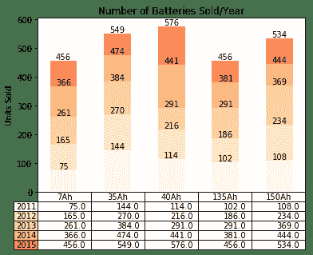

## 极坐标图

极坐标图是在极坐标轴域上绘制的图表，其坐标为角度（以度为单位）和半径，与 *x* 和 *y* 的笛卡尔系统相对。 我们将以组织中各个部门产生的计划支出与实际支出为例。 这也称为**蜘蛛网**图。

## 准备

导入所需的库：

```py
import numpy as np
import matplotlib.pyplot as plt
```

## 操作步骤

Since it is a circular spider web, we need to connect the last point to the first point, so that there is a circular flow of the graph. To achieve this, we need to repeat the first department data point at the end of the list again. Hence, in the following example, 30 and 32 (the first entry in each of the lists) are repeated at the end again.

以下代码块绘制了一个极坐标图并将其显示在屏幕上：

1.  设置极坐标图的数据：

```py
Depts = ["COGS","IT","Payroll","R & D", "Sales & Marketing"]
rp = [30, 15, 25, 10, 20, 30]
ra = [32, 20, 23, 11, 14, 32]
theta = np.linspace(0, 2 * np.pi, len(rp))
```

2.  通过设置图形大小和极坐标投影来初始化蜘蛛图：

```py
plt.figure(figsize=(10,6))
plt.subplot(polar=True)
```

3.  排列网格线以与每个部门名称对齐：

```py
(lines,labels) = plt.thetagrids(range(0,360, int(360/len(Depts))),
                                                (Depts))
```

4.  绘制计划支出图，这是极坐标上的折线图，然后填充其下的区域：

```py
plt.plot(theta, rp)
plt.fill(theta, rp, 'b', alpha=0.1)
```

5.  绘制实际支出图，这是极坐标上的折线图：

```py
plt.plot(theta, ra)
```

6.  为图添加图例和标题：

```py
plt.legend(labels=('Plan','Actual'),loc=1)
plt.title("Plan vs Actual spend by Department")
```

7.  在屏幕上显示图：

```py
plt.show()
```

## 工作原理

以下是代码的说明：

*   `Depts`是组织中部门的列表。`rp`和`ra`是按部门列出的计划支出和实际支出的列表。
*   `plt.figure(figsize=(10,6))`设置图形大小。`plt.subplot(polar=True)`设置极性投影。
*   `pyplot`方法仅接受弧度作为输入，因此我们需要将`2 * np.pi`（相当于 360 度）弧度平均划分为多个部门，以获取每个部门的角度坐标。`np.linspace(0, 2 * np.pi, len(rp))`执行此计算。

While the coordinates need to be given in radians, the degree equivalent is easy for visualization. To convert radians to degrees, you can use `np.degrees` (`theta`). 

*   极角投影上的默认网格线为 45 度（360 度分为八个相等的部分，每个部分 45 度）。 由于我们的部门较少（只有五个），因此需要将网格数限制为部门数。
*   `plt.thetagrids(range(0,360, int(360/len(Depts))), (Depts))`函数创建网格并用部门名称标记它们。 如果需要，此函数还返回可以随后使用的行和标签对象。
*   `plt.plot(theta, rp)`绘制计划费用，并使用`plt.fill(theta, rp, 'b', alpha=0.1)`用蓝色填充区域。
*   `plt.plot(theta, ra)`，绘制实际费用而未填充其下的区域。

最后，在图上添加标题和图例。 您应该看到以下图表：

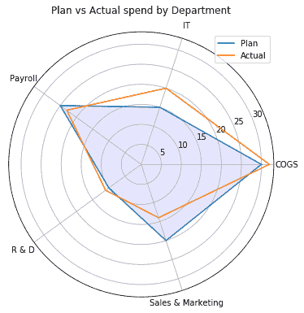

## 更多

在此示例中，我们使用了折线图。 极坐标投影也可以用于散点图，气泡图和条形图。 这只是另一个坐标系，每个点都需要转换为极坐标。

## 直方图

直方图用于绘制连续变量的分布。 连续变量值分为所需的仓数，并绘制在 *x* 轴上，落在每个仓中的值计数绘制在 *y* 轴上。 在 *y* 轴上，我们也可以绘制总数的百分比来代替计数，在这种情况下，它表示概率分布。 该图通常用于统计分析。

## 准备

我们将使用有关横向培训计划参与者先前工作经验的数据示例。 经验以年数衡量。

导入所需的库：

```py
import matplotlib.pyplot as plt
import numpy as np
```

## 操作步骤

以下代码绘制了经验数据的直方图：

1.  创建一个 NumPy 数组，其中包含横向培训班的参与者的工作经验（以年为单位）：

```py
grp_exp = np.array([12, 15, 13, 20, 19, 20, 11, 19, 11, 12, 19, 13, 12, 
                    10, 6, 19, 3, 1, 1, 0, 4, 4, 6, 5, 3, 7, 12, 7, 9, 
                    8, 12, 11, 11, 18, 19, 18, 19, 3, 6, 5, 6, 9, 11, 
                    10, 14, 14, 16, 17, 17, 19, 0, 2, 0, 3, 1, 4, 6, 
                    6, 8, 7, 7, 6, 7, 11, 11, 10, 11, 10, 13, 13, 15, 
                    18, 20, 19, 1, 10, 8, 16, 19, 19, 17, 16, 11, 1, 
                    10, 13, 15, 3, 8, 6, 9, 10, 15, 19, 2, 4, 5, 6, 9, 
                    11, 10, 9, 10, 9, 15, 16, 18, 13])
```

2.  绘制分组经验的分布图：

```py
nbins = 21 
n, bins, patches = plt.hist(grp_exp, bins = nbins)
```

3.  添加图的轴标签和标题：

```py
plt.xlabel("Experience in years")
plt.ylabel("Frequency")
plt.title("Distribution of Experience in a Lateral Training 
           Program")
```

4.  以平均经验在图中绘制红色垂直线：

```py
plt.axvline(x=grp_exp.mean(), linewidth=2, color = 'r') 
```

5.  在屏幕上显示图：

```py
plt.show()
```

## 工作原理

以下是代码的说明：

*   `grp_exp`是一个 NumPy 数组，其中包含多年的经验数据。
*   通过指定`nbins = 21`将此数据分为 21 个大小相等的桶。
*   `plt.hist()`以`grp_exp`和`nbins`作为参数绘制直方图。 它返回三个参数`n`，`bins`和`patches`。`n`是包含的列表，每个箱中有个项目；`bins`是另一个指定箱的起点的列表，`patches`是每个箱中的对象的列表。 这些可以在程序的后面用于任何其他目的。
*   在屏幕上显示直方图之前，添加标题以及 *x* 和 *y* 轴标签。
*   `plt.axvline()`在数据的平均值处绘制一条垂直线，仅表示平均值在两侧的分布方式。 这是输出的样子：

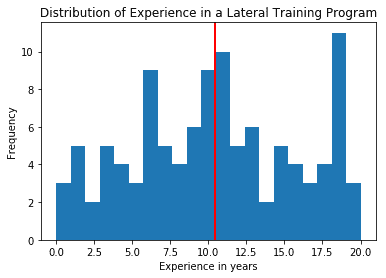

## 更多

在 *y* 轴上，您可以绘制每个仓位中`grp_exp`列表中的所有条目的总和的百分比，而不是绘制频率， 通过在`plt.hist()`中指定`density=1`。 您还可以使用，数据的均值和标准差绘制近似正态分布，以查看此分布遵循正态分布的程度：

1.  创建一个 NumPy 数组，其中包含横向培训班的参与者的工作（年）：

```py
grp_exp = np.array([12, 15, 13, 20, 19, 20, 11, 19, 11, 12, 19, 13,   
                    12, 10, 6, 19, 3, 1, 1, 0, 4, 4, 6, 5, 3, 7, 12, 
                    7, 9, 8, 12, 11, 11, 18, 19, 18, 19, 3, 6, 5, 6, 
                    9, 11, 10, 14, 14, 16, 17, 17, 19, 0, 2, 0, 3, 
                    1, 4, 6, 6, 8, 7, 7, 6, 7, 11, 11, 10, 11, 10, 
                    13, 13, 15, 18, 20, 19, 1, 10, 8, 16, 19, 19, 
                    17, 16, 11, 1, 10, 13, 15, 3, 8, 6, 9, 10, 15, 
                    19, 2, 4, 5, 6, 9, 11, 10, 9, 10, 9, 15, 16, 18, 
                    13])
```

2.  绘制经验分布图：

```py
nbins = 21
n, bins, patches = plt.hist(grp_exp, bins = nbins, density=1)
```

3.  添加轴标签：

```py
plt.xlabel("Experience in years")
plt.ylabel("Percentage")
plt.title("Distribution of Experience in a Lateral Training 
           Program")
```

4.  计算`grp_exp`数据的平均值（`mu`）和标准差（`sigma`）：

```py
mu = grp_exp.mean()
sigma = grp_exp.std()
```

5.  为计算出的`mu`和`sigma`添加一条最适合正态分布的线：

```py
y = ((1 / (np.sqrt(2 * np.pi) * sigma)) * np.exp(-0.5 * (1 / sigma 
                                        * (bins - mu))**2))
plt.plot(bins, y, '--')
```

6.  在屏幕上显示图：

```py
plt.show()
```

输出图如下所示：

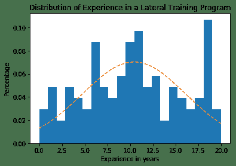

显然，数据没有遵循正态分布，因为在正态曲线的最佳拟合的上方或下方有太多的条带。

## 箱形图

箱形图用于可视化连续变量的描述统计量。 它直观地显示了第一个和第三个四分位数，中值（平均值）和胡须是**四分位数范围**（**IQR**）的 1.5 倍 -- 第三个和第一个四分位数之间的差异是离群值。 第一个四分位数（矩形框的底部）标记了一个点，低于该点的总数下降 25%。 第三四分位数（矩形框的顶部）标记了一个点，低于该点的点数下降 75%。

如果没有异常值，则胡须将显示最小值和最大值。

再次用于统计分析。

## 准备

我们将在此示例中使用葡萄酒质量数据集的示例。 我们将考虑三个属性：`alcohol`，`fixed acidity`和`quality`。 通常，针对不同的维度（例如地理或时间）绘制相同的属性，以比较沿这些维度的数据分布。 在这里，我们绘制了三个不同属性的箱形图：

```py
import matplotlib.pyplot as plt
import pandas as pd
```

## 操作步骤

以下是绘制三个箱形图的代码块，每个属性一个图：

1.  将数据从 CSV 文件读取到 Pandas 数据帧中：

```py
wine_quality = pd.read_csv('winequality.csv', delimiter=';')
```

2.  使用`Wine Quality`数据集创建的三个属性的`data`列表：

```py
data = [wine_quality['alcohol'], wine_quality['fixed acidity'], 
        wine_quality['quality']]
```

3.  绘制箱形图：

```py
plt.boxplot(data)
```

4.  在屏幕上显示图：

```py
plt.show()
```

## 工作原理

*   `plt.boxplot()`是绘制箱形图的方法。`data`参数可以是一个或多个属性的列表。 默认情况下，每个框中的黄线代表属性的中值（也可以更改为平均值）。 底部胡须距离盒子底线 1.5 IQR，顶部胡须顶部盒子上方 1.5 IQR。 框的底行是的第一个四分位数，框的的上一行是数据的第三个四分位数。
*   胡须上方和下方的点是异常值。 在第一箱和第二箱图中，在底部胡须以下没有离群值，而所有三个离群值顶部胡须之上：

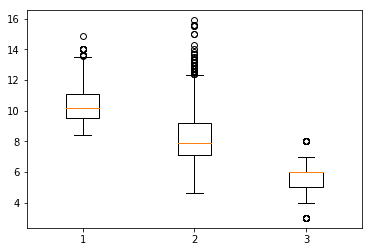

## 更多

在`plt.boxplot()`中，通过指定`showfliers=False`自变量 ，您可以抑制离群值，因此仅在两侧的胡须上绘图。 通过指定`vert=False`自变量 ，您可以水平绘制箱形图，还可以自定义具有不同形状和颜色的离群值：

```py
plt.boxplot(data, vert=False, flierprops=dict(markerfacecolor='r', 
            marker='D'))
plt.show()
```

您应该看到以下输出：

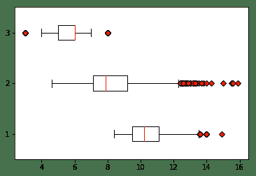

## 提琴图

提琴图是直方图和箱形图的组合。 它提供有关数据完整分布的信息，以及均值/中值，最小值和最大值。

## 准备

在此示例中，我们还将使用与和箱形图相同的数据。

导入所需的库：

```py
import matplotlib.pyplot as plt
import pandas as pd
```

## 操作步骤

以下是绘制提琴图的代码块：

1.  将数据从 CSV 文件读取到 Pandas 数据帧中：

```py
wine_quality = pd.read_csv('winequality.csv', delimiter=';')
```

2.  准备`wine_quality`的三个属性的列表：

```py
data = [wine_quality['alcohol'], wine_quality['fixed acidity'], 
        wine_quality['quality']]
```

3.  绘制提琴图：

```py
plt.violinplot(data, showmeans=True)
```

4.  在屏幕上显示图：

```py
plt.show()
```

## 工作原理

这是代码的说明：

*   `plt.violinplot()`绘制提琴图。 底部胡须是最小值，是顶部胡须是最大值，水平线在是平均值。 在的两侧，垂直线是代表和数据实际分布的数据直方图。 通过将`showmeans=True`替换为`showmedian=True`，我们可以用一条横线代表数据的中位数，而不是表示的意思：

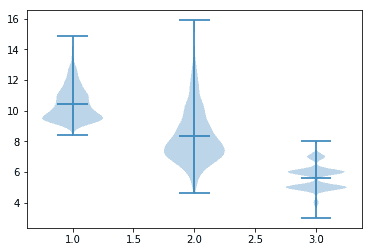

## 读取和显示图像

`Matplotlib.pyplot`具有使我们能够读取`.jpeg`和`.png`图像并将它们转换为像素格式以显示为图像的函数。

## 准备

导入所需的库：

```py
 import matplotlib.pyplot as plt
```

## 操作步骤

这是读取 JPEG 文件作为像素值列表并将其显示为屏幕上的图像的代码块：

1.  将图像`louvre.jpg`读入三维数组（彩色图像具有三个通道，而黑白图像仅具有一个通道）：

```py
image = plt.imread('louvre.jpg')
```

2.  打印图像的大小：

```py
print("Dimensions of the image: ", image.shape)
```

3.  绘制图像：

```py
plt.imshow(image)
```

4.  在屏幕上显示图像：

```py
plt.show()
```

## 工作原理

*   `plt.imread()`方法将图像读取为像素数组。
*   `plt.imshow()`方法在屏幕上显示图像。
*   `image.shape`给出读取图像的列表的大小。
*   `print()`在屏幕上显示图像的大小。

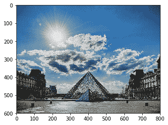

## 热图

热图用于以不同的强度可视化不同颜色的数据范围。 在这里，我们以绘制相关矩阵作为热图为例。 相关矩阵的元素指示两个变量之间的线性关系的强度，并且矩阵包含给定数据中属性的所有组合的此类值。 如果数据具有五个属性，则相关矩阵将是`5 x 5`矩阵。

## 准备

在此示例中，我们还将使用“葡萄酒质量”数据集。 它具有 12 个不同的属性。 我们将首先获得一个相关矩阵，然后将其绘制为热图。 目前尚无热图函数/方法，因此我们将使用和相同的`imshow`方法来读取和显示图像。

导入所需的库：

```py
import matplotlib.pyplot as plt
import pandas as pd
```

## 操作步骤

以下是绘制和相关矩阵的热图的代码块：

1.  将数据从 CSV 文件读取到 Pandas 数据帧中：

```py
wine_quality = pd.read_csv('winequality.csv', delimiter=';')
```

2.  获得`wine_quality`所有属性的相关矩阵：

```py
corr = wine_quality.corr()
```

3.  指定图形大小：

```py
plt.figure(figsize=(12,9))
```

4.  绘制热图：

```py
plt.imshow(corr,cmap='hot')
```

5.  绘制颜色条来映射哪种颜色代表哪些数据值：

```py
plt.colorbar()
```

6.  标签， *x* 和 *y* 轴刻度。 显示旋转度为`20`的 *x* 轴标签：

```py
plt.xticks(range(len(corr)),corr.columns, rotation=20)
plt.yticks(range(len(corr)),corr.columns)
```

7.  在屏幕上显示图：

```py
plt.show()
```

## 工作原理

以下是代码的说明：

*   `wine_quality.corr()`方法返回数据集中所有属性的相关矩阵。
*   相关值的范围从 -1（高度负）到 +1（高度正）。 负值从红色到黑色表示，正值从深黄色到白色表示。 纯白色是+1，这是最高的正相关，而纯黑色是最高的负相关。
*   不出所料，所有对角线框都是白色的，因为它们彼此相关，必须为 +1。 pH 和固定酸度值之间的相关性为黑色，这表示高度负值，接近 -1

我们得到的输出如下：

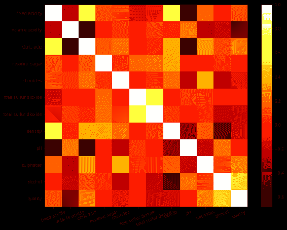

## Hinton 图

Hinton 图是一个二维图，用于可视化深度学习应用中的权重矩阵。 Matplotlib 没有直接的方法来绘制此图。 因此，我们将不得不编写代码来对此进行绘制。 权重矩阵取自和机器学习算法之一，该算法对图像进行分类。

## 准备

导入所需的库：

```py
import numpy as np
import matplotlib.pyplot as plt
import pandas as pd
```

## 操作步骤

以下代码块定义了该函数并调用了该函数以绘制  Hinton 图：

1.  从 Excel 文件中读取重量矩阵数据：

```py
matrix = np.asarray((pd.read_excel('weight_matrix.xlsx')))
```

2.  实例化图形和轴域：

```py
fig, ax = plt.subplots()
```

3.  为轴域设置参数：

```py
ax.patch.set_facecolor('gray')
ax.set_aspect('equal', 'box')
ax.xaxis.set_major_locator(plt.NullLocator())
ax.yaxis.set_major_locator(plt.NullLocator())
```

4.  绘制 Hinton 图：

```py
max_weight = 2 ** np.ceil(np.log(np.abs(matrix).max()) / np.log(2))
for (x, y), w in np.ndenumerate(matrix):
        color = 'white' if w > 0 else 'black'
        size = np.sqrt(np.abs(w) / max_weight)
        rect = plt.Rectangle([x - size / 2, y - size / 2], size, size, facecolor=color, edgecolor=color)
       ax.add_patch(rect)
ax.autoscale_view()
```

5.  在屏幕上显示：

```py
plt.show()
```

## 工作原理

这是代码的说明：

*   `pd.read_excel()`将 Excel 文件读入 Pandas 数据帧。
*   `np.asarray()`根据进一步处理的需要将数据帧转换为 NumPy 数组。 它是`20 x 7`的矩阵。
*   `np.abs()`返回作为输入给出的矩阵的绝对值。
*   `np.abs(matrix).max()`从绝对矩阵返回最大值。
*   `np.log()`返回所传递参数的自然对数值。
*   对于给定的浮点数，`np.ceil()`将参数四舍五入到下一个最大值，例如，`np.ceil(2.2) = 3.0`。
*   `ax.patch.set_facecolor('gray')`将每个方框的颜色设置为灰色。
*   `ax.set_aspect('equal', 'box')`将长宽比（宽高比）和图形上要点的形状指定为方框。
*   `ax.xaxis.set_major_locator(plt.NullLocator())`将 *x* 轴刻度设置为空，这样就不会标记任何刻度，也不会放置任何刻度标签。
*   启动`for`循环以遍历权重矩阵的每个元素，并将颜色设置为白色（正值），黑色（负值）和与`max_weight`成比例的大小。 最后，`ax.autoscale_view()`整齐地排列所有框并绘制 Hinton 图。

您应该获得如下输出：

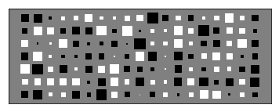

## 等高线图

等高线图通常用于显示误差如何随机器学习算法（例如线性回归）中优化的系数的变化而变化。 如果线性回归系数为`theta0`和`theta1`，并且预测值和实际值之间的误差为`Loss`，则对于给定的`Loss`值，`theta0`和`theta1`的所有值 ]形成轮廓。 对于`Loss`的不同值，通过更改和`theta1`的值形成不同的轮廓。

## 准备

`Loss`，`theta0`，`theta1`和`theta`的数据（`theta0`和`theta1`具有最低误差）来自绘制轮廓图的回归问题之一。 如果`theta0`和`theta1`是大小为`1 x n`的向量，则`Loss`将为`n x n`矩阵形式。

导入所需的库。 我们将从 Matplotlib 引入另一个用于颜色映射的库：

```py
import matplotlib.pyplot as plt
import pandas as pd
import numpy as np
from matplotlib import cm
```

我们还需要了解网格的概念，因为等高线，曲面和流图也使用此概念：

*   网格是在几何空间中从两个向量派生的网格。 向量中的每个数据项均充当坐标，并且来自两个向量的坐标组合形成 2D 几何空间中的点。 这些向量坐标的所有可能组合所散布的区域以网格形式定义，例如：
    *   `x = [-3.0, 0., 3.0]`和`y = [-2.0, 2.0]`。 向量`x`具有三个数据点，向量`y`具有两个数据点。 因此，我们在 2D 几何空间中总共有六个点（`3 * 2`），而这六个点是`(-3.0, -2)`，`(-3.0, 2.0)`，`(0, -2.0)`，`(0, 2.0)`，`(3.0, -2.0)`和`(3.0, 2.0)`。 现在，这六个点和 12 个数据项（`6 * 2`）再次表示为两个矩阵`x`和`y`，其中适用以下条件：
        *   `X = [[-3.0, 0., 3.0], [-3.0, 0., 3.0]]`，一个`2 x 3`矩阵（行数等于`Y`的长度），`Y = [[-2.0, 2.0], [-2.0, 2.0], [-2.0, 2.0]]`，`3 x 2`矩阵（行数等于`X`的长度）。 NumPy 具有函数`np.meshgrid(x, y)`，用于使用`x`和`y`向量创建这些`X`和`Y`矩阵。 这就是我们将用于所有需求的东西。

## 操作步骤

以下是在给定回归问题中绘制损失函数的等高线图的代码：

1.  从保存的文件中读取`Loss`，`theta0`和`theta1`值：

```py
Loss = pd.read_excel('Loss.xlsx')
theta0_vals = pd.read_excel('theta0.xlsx')
theta1_vals = pd.read_excel('theta1.xlsx')
```

2.  指定图形大小：

```py
fig = plt.figure(figsize=(12,8))
```

3.  为`X`和`Y`坐标创建网格：

```py
X, Y = np.meshgrid(theta0_vals, theta1_vals)
```

4.  绘制等高线图，并用相应的损耗值标记等高线：

```py
CS = plt.contour(X, Y, Loss, np.logspace(-2,3,20), cmap=cm.coolwarm)
                 plt.clabel(CS, inline=1, fontsize=10)
```

5.  在屏幕上显示轮廓图：

```py
plt.show()
```

## 工作原理

这是代码的说明：

*   `theta0 = np.linspace(-10, 10, 100)`和`theta1 = np.linspace(-1, 4, 100)`帮助我们计算`Loss`，这是`theta0`和`theta1`值范围的误差。 所有这些数据都以 Excel 文件的形式提供，因此我们使用`pd.read_excel()`读取它们。
*   `np.meshgrid()`在`theta0`和`theta1`之间创建网格，以获得`X`和`Y`，然后传递`X`，`Y`和`Loss`绘制轮廓图。
*   `CS = plt.contour()`绘制轮廓图。
*   `np.logspace(-2,3,20)`为`Loss`属性指定对数刻度的值范围，需要在等高线图中绘制。 在线性范围内，此范围为 0.01（10 的 -2 次方）到 1,000（10 的 3 次方）。`20`是它在此范围内绘制的样本数，使用它们绘制等高线。
*   `plt.clabel()`指定将实际损耗值作为标签绘制在轮廓上。 从图中可以看出，损失（误差）的值从零一直到 545.559！

我们得到的输出如下：

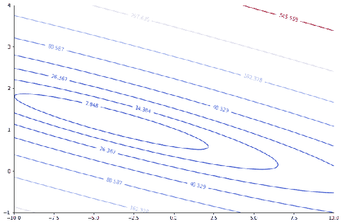

## 更多

先前的屏幕截图仅代表`theta0`和`theta1`给定集合的`Loss`函数的各种轮廓。 我们还可以在同一图上绘制`theta0`和`theta1`的最佳值，以表示最小损失：

```py
## Plot the minimum point(Theta at Minimum cost)
plt.plot(theta[0], theta[1], 'rx', markersize=15, linewidth=2)
plt.show()
```

这是绘图的样子。 红叉位置描绘了最佳`theta`，该最优`theta`为该回归问题提供了最低的误差：

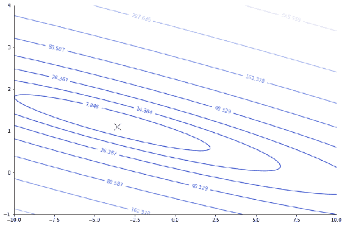

## 三角剖分

三角剖分用于绘制地理地图，这有助于理解各个点之间的相对距离。 经度和纬度值用作 x，y 坐标来绘制点。 要绘制三角形，需要三个点。 用图中点的相应索引指定这些值。 对于给定的一组坐标，Matplotlib 可以自动计算三角形并绘制图形，或者可选地，我们也可以提供三角形作为参数。

## 准备

导入所需的库。 我们将介绍用于三角剖分的`tri`包：

```py
import numpy as np
import matplotlib.pyplot as plt
import matplotlib.tri as tri
```

## 操作步骤

以下代码块生成 50 个随机点，自动创建三角形，然后绘制三角剖视图：

```py
data = np.random.rand(50, 2)
triangles = tri.Triangulation(data[:,0], data[:,1])
plt.triplot(triangles)
plt.show()
```

## 工作原理

我们首先使用`np.random.rand function`生成`50`随机点，它会生成`0`和`1`之间的数字。`tri.Triangulation()`函数自动创建三角形，而`plt.triplot()`绘制三角剖分图。

这是输出图的外观：

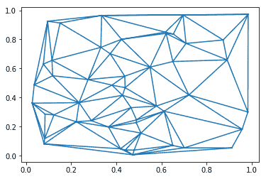

## 更多

在上一个图中，我们自动生成了三角形。 在这里，我们将学习如何手动添加三角形：

1.  以弧度为单位设置经度和纬度数据：

```py
xy = np.array([[-0.101, 0.872], [-0.080, 0.883], [-0.069, 0.888], 
               [-0.054, 0.890], [-0.045, 0.897], [-0.057, 0.895], 
               [-0.073, 0.900], [-0.087, 0.898],
               [-0.090, 0.904], [-0.069, 0.907]])
```

2.  将`xy`从弧度转换为度：

```py
x = np.degrees(xy[:, 0])
y = np.degrees(xy[:, 1])
```

3.  从`xy`坐标中选择要转换为角度的三角形：

```py
triangles = np.array([[1, 2, 3], [3, 4, 5], [4, 5, 6], [2, 5, 6], 
                      [6, 7, 8], [6, 8, 9], [0, 1, 7]])
```

4.  绘制三角剖分图：

```py
plt.triplot(x, y, triangles, 'go-', lw=1.0)
```

5.  绘制标签和标题：

```py
plt.title('triplot of user-specified triangulation')
plt.xlabel('Longitude (degrees)')
plt.ylabel('Latitude (degrees)')
```

6.  在屏幕上显示图：

```py
plt.show()
```

下面是它的工作原理：

*   `xy`是弧度的坐标数组。
*   `np.degrees()`将弧度转换为度；`x`和`y`以弧度表示，然后转换为度，其中`x`和`y`分别代表经度和纬度值。

三角形是要绘制的每个三角形的三点元组的数组。 数字是`x`和`y`中点的索引（0 至 9，共 10 点）。 输出如下：

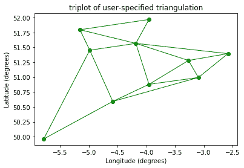

## 流图

流图也称为**流线图**，用于可视化向量场。 它们主要用于工程和科学界。 他们使用向量及其速度作为基础向量的函数来绘制这些图。

## 准备

导入所需的库：

```py
import numpy as np
import matplotlib.pyplot as plt
import matplotlib.gridspec as gridspec
```

## 操作步骤

以下代码块创建一个流图：

1.  准备流图的数据：

```py
x, y = np.linspace(-3,3,100), np.linspace(-2,4,50)
```

2.  创建网格：

```py
X, Y = np.meshgrid(x, y)
```

3.  计算速度`U`和`V`分别是`X`和`Y`的函数：

```py
U = 1 - X**2 
V = 1 + Y**2 
```

4.  绘制流图：

```py
plt.streamplot(X, Y, U, V)
```

5.  设置绘图的标题：

```py
plt.title('Basic Streamplot')
```

6.  在屏幕上显示图形：

```py
plt.show()
```

## 工作原理

*   `np.linspace(-3, 3, 100)`在-3 到 3 的范围内创建 100 个数据点，并且连续点之间的间隔相等。`x`和`y`是长度为`100`和`50`的随机生成的向量，分别为 -3 至 3 和 -2 至 4。
*   `np.meshgrid(x, y)`按照本章前面的说明创建网格。
*   `U`和`V`是作为`x`和`y`的函数的速度向量。 流图是向量`x`，`y`和速度`U`和`V`的组合。`plt.streamplot(X, Y, U, V)`绘制流图，如下所示：

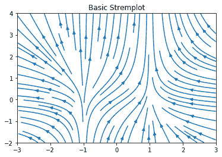

## 更多

在上一节中，我们已经看到了基本的流图。 我们可以根据流线的，速度和颜色来控制密度和厚度。 以下是代码及其输出：

```py
## Define the speed as a function of U and V
speed = np.sqrt (U*U + V*V)

## Varying line width along a streamline
lw = 5 * speed / speed.max()

strm = plt.streamplot(X, Y, U, V, density=[0.5, 1], color=V, 
                      linewidth=lw)
plt.colorbar(strm.lines)

plt.title('Varying Density, Color and Line Width')

plt.show()
```

`np.sqrt(U*U + V*V)`定义速度； 线宽（`lw`）定义为速度的函数。`plt.streamplot()`使用提供的参数绘制流图。`density=[0.5, 1]`指定要使用的密度值，`color=V`指定应基于`V`的值改变流线的颜色，`linewidth`指定应如何改变流线的宽度：


## 路径

`Path`是 Matplotlib 提供的一种用于绘制自定义图表的方法。 它使用 Matplotlib 提供的助手函数补丁。 让我们看看如何将其用于绘制简单图。

## 准备

导入所需的库。 这里将介绍两个新的包`Path`和`patches`：

```py
import matplotlib.pyplot as plt
from matplotlib.path import Path
import matplotlib.patches as patches
```

## 操作步骤

以下代码块定义了点以及相关的直线和曲线，以形成整体图：

1.  定义第一条曲线的点

```py
verts1 = [(-1.5, 0.),             # left, bottom
          (0., 1.),               # left, top
          (1.5, 0.),              # right, top
          (0., -1.0),             # right, bottom
          (-1.5, 0.)]             # ignored
```

2.  绘制连接*步骤 1* 中定义的点的图形：

```py
codes1 = [Path.MOVETO,    # Go to first point specified in vert1
          Path.LINETO,    # Draw a line from first point to second 
                            point
          Path.LINETO,    # Draw another line from current point to 
                            next point
          Path.LINETO,    # Draw another line from current point to 
                            next point
          Path.CLOSEPOLY] # Close the loop
```

3.  使用*步骤 1* 和*步骤 2* 中定义的点和线/曲线创建完整路径：

```py
path1 = Path(verts1, codes1)
```

4.  对第二个曲线重复相同的操作：

```py
verts2 = [(-1.5, 0.),       # left, bottom
          (0., 2.5),        # left, top
          (1.5, 0.),        # right, top
          (0., -2.5),       # right, bottom
          (-1.5, 0.)]       # ignored

codes2 = [Path.MOVETO, # Move to the first point
          Path.CURVE3, # Curve from first point along the control 
                         point and terminate on end point
          Path.CURVE3, # Curve from current point along the control 
                         point and terminate on end point
          Path.CURVE3,
          Path.CURVE3] # close by the curved loop

path2 = Path(verts2, codes2)

```

5.  定义图形和轴域：

```py
fig = plt.figure()
ax = fig.add_subplot(111)
```

6.  创建第一个补丁并将其添加到轴域中：

```py
patch1 = patches.PathPatch(path1, lw=4, zorder=2)
ax.add_patch(patch1)
```

7.  创建第二个补丁并将其添加到轴域：

```py
patch2 = patches.PathPatch(path2, facecolor='orange', lw=2, 
                           zorder=1)
ax.add_patch(patch2)
```

8.  设置`x`和`y`轴的限制：

```py
ax.set_xlim(-2,2)
ax.set_ylim(-2,2)
```

9.  在屏幕上显示图：

```py
plt.show()
```

## 工作原理

*   `verts1`和`verts2`定义了必须沿其绘制曲线的点。`path1`和`path2`定义了要绘制的每条曲线的完整路径。
*   `Path.MOVETO`使曲线的起点到达`verts`中指定的第一点。
*   `Path.LINETO`从当前位置的到指定的下一个点画一条线。
*   `Path.CLOSEPOLY`关闭多项式曲线循环。
*   `Path.CURVE3`沿着控制点从给定点绘制一条曲线，然后在第三点处终止。
*   `Path.CURVE4`（在此示例中未使用）进行相同的操作，但是在两个控制点而不是一个。
*   `patches.PathPatch`是一个辅助函数，可沿给定路径绘制曲线。
*   `zorder`参数会覆盖绘制不同补丁的默认顺序。 在这种情况下，我们希望先绘制第二个补丁，然后再绘制第一个补丁，以便两个都可见。 否则，较小的补丁将隐藏在较大的补丁之后。
*   `lw`指定线宽，`facecolor`指定要填充在色块内部的颜色，覆盖默认颜色。

这是代码的输出：

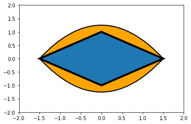