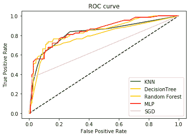
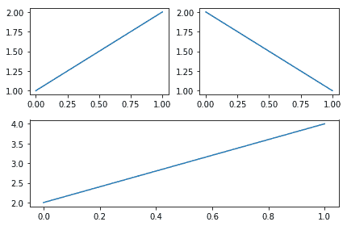
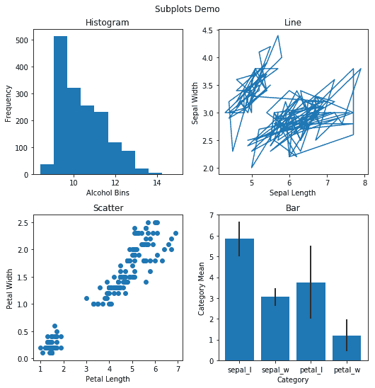
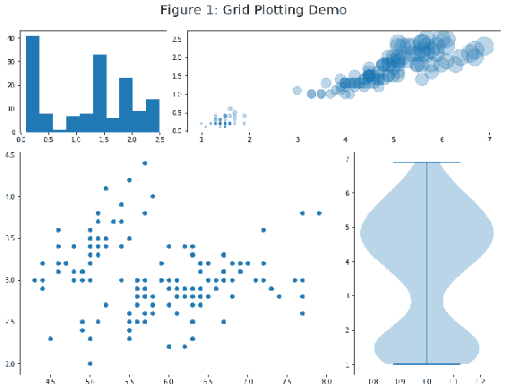
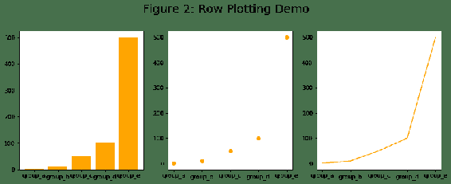
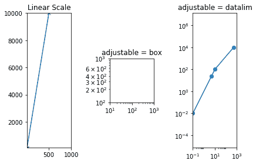
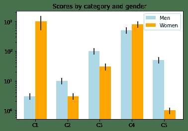
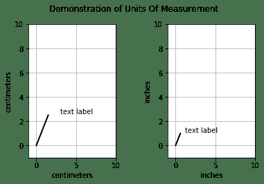
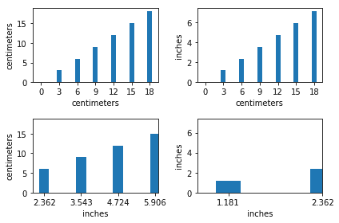

# 三、绘制多个图表和子图

在本章中，我们将介绍以下秘籍：

*   在同一轴域上绘制多个图形
*   在同一图中绘制子图
*   在一个会话中绘制多个图形
*   使用对数刻度
*   使用度量单位

## 介绍

在上一章中，我们了解了如何分别绘制各种图形。 在本章中，我们将学习如何在同一坐标轴域上绘制多个图形，在同一图形中绘制多个坐标轴/曲线以及在一个会话中绘制多个图形。 我们还将学习如何使用对数刻度和度量单位，例如厘米，英寸等。

## 在同一轴域上绘制多个图形

正如我们从第一章中学到的，轴域是绘制图形的空间，通常在图中看到的所有元素都是轴域的一部分。 我们在一幅图中可以有多个轴域。 在本秘籍中，我们将学习如何在同一轴域上绘制多个图表。

## 准备

我们将使用一个**受试者工作特性**（**ROC**）曲线的示例，通过它可以使用多个**机器学习**（**ML**）算法来比较给定的分类问题，并且针对该问题选择了表现最佳的算法。 ROC 曲线用**真阳性率**（**TPR**）以及**假阳性率**（**FPR**）的阈值概率范围绘制。 目的是随着和阈值概率的变化，看到 TPR 和 FPR 的敏感性。覆盖最大 ROC **曲线下面积**（**AUC**）的算法是在分类准确性方面表现最佳的算法。

我们将 TPR 和 FPR 数据用于一组算法， **k 最近邻算法**（**k-NN**），**多层感知器 MLP**），**随机梯度下降**（**SGD**），**随机森林**（**RF**）和**决策树**（**DT**）在分类问题上运行以绘制图形。 该数据集作为本书代码库的一部分提供。

导入所需的库：

```py
import matplotlib.pyplot as plt
import pandas as pd
```

## 操作步骤

这是在同一轴域上绘制多个 ROC 曲线的代码块：

1.  使用`pandas`从各自的 Excel 表中读取各种算法的 FPR 和 TPR 数据：

```py
## K-nearest neighbor (KNN)
fpr_KNN = pd.read_excel('ROC_Curves.xlsx', 'fpr_KNN')
tpr_KNN = pd.read_excel('ROC_Curves.xlsx', 'tpr_KNN')

## Multilayer Perceptron(MLP)
fpr_MLP = pd.read_excel('ROC_Curves.xlsx', 'fpr_MLP')
tpr_MLP = pd.read_excel('ROC_Curves.xlsx', 'tpr_MLP')

## Stochastic Gradient Descent (SGD)
fpr_SGD = pd.read_excel('ROC_Curves.xlsx', 'fpr_SGD')
tpr_SGD = pd.read_excel('ROC_Curves.xlsx', 'tpr_SGD')

## Random Forest (RF)
fpr_RF = pd.read_excel('ROC_Curves.xlsx', 'fpr_RF')
tpr_RF = pd.read_excel('ROC_Curves.xlsx', 'tpr_RF')

## Decision Trees (DT)
fpr_DT = pd.read_excel('ROC_Curves.xlsx', 'fpr_DT')
tpr_DT = pd.read_excel('ROC_Curves.xlsx', 'tpr_DT')
```

2.  绘制线形图，包括黑色阈值线，使用`fpr`和`tpr`数据，在上一步中读取五种算法的每一种：

```py
plt.plot([0, 1], [0, 1], 'k--')
plt.plot(fpr_KNN, tpr_KNN, label='KNN',color='green')
plt.plot(fpr_DT, tpr_DT, label='DecisionTree', color='orange')
plt.plot(fpr_RF, tpr_RF, label='Random Forest',color='purple')
plt.plot(fpr_MLP, tpr_MLP, label='MLP',color='red')
plt.plot(fpr_SGD, tpr_SGD, label='SGD', color='pink')
```

3.  打印标签，标题和图例：

```py
plt.xlabel('False Positive Rate')
plt.ylabel('True Positive Rate')
plt.title('ROC curve')
plt.legend(loc='best')
```

4.  在屏幕上显示图：

```py
plt.show()
```

## 工作原理

这是代码工作方式的说明：

*   `pd.read_excel()`语句读取五种算法（`KNN`，`MLP`，`SGD`，`RF`和`DT`）的 TPR 和 FPR 数据。
*   `plt.plot([0, 1], [0, 1], 'k--')`以 45 度角绘制黑色虚线。 这是基本表现水平（参考线），与所有其他曲线相比，ROC 曲线在此线之上并覆盖其下最大面积的算法是被认为是表现最佳的算法 。
*   随后的`plt.plot()`语句绘制了五个选定算法中每个算法的 ROC 曲线。 每个绘图语句都在相同的轴域上绘制图形。 您可以在`plt.show()`之前绘制所需数量的图形，以在屏幕上显示图形。
*   参数标签和颜色在图形上区分了每种算法。 我们将在随后的章节中了解有关这些参数的更多信息。
*   `plt.xlabel()`，`plt.ylabel()`和`plt.title()`是绘图上的标签，  图例是这些图形标签放在图形上的位置。

您应该看到以下图：



从图中可以清楚地看出，`SGD Classifier`算法与所有其他算法相比效果不佳，因为该图表下的区域最低（或者最接近参考的参考） 虚线）。 对于该特定分类问题，MLP 算法是这五种算法中最好的，因为该曲线下的面积最高（或距参考块虚线最远）。

## 在同一图形上绘制子图

Matplotlib 提供了许多不同的方法和辅助函数，这些函数和辅助函数利用，`axes`方法在同一图形上绘制多个图并将它们布置为各种网格格式。 这使我们能够开发复杂的仪表板应用。

## 准备

对于本章中的示例，我们将使用与第 2 章“基本绘图入门”中介绍的相同的`Wine Quality`和`Iris`数据集。

图中的多个图排列在`m x n`网格中，其中`m`是行数，`n`是列数。 如果图中有六个绘图，我们可以将它们全部排成一排（每个都由 161、162、163、164、165 或 166 标识）或`3 x 2`（321、322，323、324、325 和 326）或`2 x 3`（231、232、233、234、235 和 236）或一列（611、612、613、614、615 和 616）。 前两位数字表示，行和列的数量的最后一位数字表示从 1 到 6 的连续数字（绘图总数），并从左向右，然后从上到下读取。

也可以将图指定为（`3, 2, 1`）而不是（`321`）。 当网格中有九个以上的绘图时，后一种表示法会造成混淆，而 Matplotlib 不接受它。 在这种情况下，如果您有一个（`...`），则必须使用（`3, 4, 10`），（`3, 4, 11`）或（`3, 4, 12`）而不是（`3410`），（`3411`）或（`3412`）。 `3 x 4`网格，共有 12 个绘图。

我们还可以绘制少于网格中允许的最大值的图，例如，在`2 x 2`网格中绘制 3 个图（其中是最大值）。

导入所需的库：

```py
import pandas as pd
import matplotlib.pyplot as plt
```

## 操作步骤

以下代码块在一个图中绘制了三个图：

1.  用三个轴域定义图形及其布局：

```py
fig = plt.figure()
ax1 = plt.subplot(221)
ax2 = plt.subplot(222)
ax3 = plt.subplot(212)
```

2.  在每个轴域上绘制折线图：

```py
ax1.plot([1,2])
ax2.plot([2,1])
ax3.plot([2,4])
```

3.  在屏幕上显示图：

```py
plt.show()
```

## 工作原理

这是代码的说明：

*   `plt.figure()`为图形创建对象并为其分配空间。
*   `plt.subplot(221)`在`2 x 2`网格中为第一个绘图创建轴域。
*   `plt.subplot(222)`在`2 x 2`网格中为第二个图创建另一个轴域，该网格位于同一第一行中。
*   `plt.subplot(212)`为第三个图又创建了一个轴域，但这是另一个`2 x 1`网格（`212`的前两位数字）的一部分，它是此`2 x 1`网格中的第二个图，因此放在第二行。由于第一个`2 x 2`网格未使用第二行，因此该网格将占据整个空间。

我们得到的输出如下：



如果我们为第三个图编码了`plt.subplot(211)`，它将覆盖前两个图，因为 211 表示`2 x 1`网格中的第一个图，它将从第一行开始！ 如果我们要绘制相同的三个图，但在第一列中排列两个，在第二列中排列一个，而不是第一行中当前的前两个图和第二行中的第三个图，那么我们将不得不指定绘图顺序为 221、223 和 122。 试试看作为练习！

## 更多

由于存在许多此类可能的网格，因此我们将再看到一个示例，该示例在`2 x 2`网格中包含四个不同的图，每个图具有不同类型的图形，直方图，折线图，散点图和条形图。 在最后一个示例中，我们一直使用和`plt.subplot()`方法一个接一个地添加轴域。 在此示例中，我们将一次定义网格中的所有轴域，然后使用索引来访问每个轴域并绘制不同的图形：

1.  从`.csv`文件中读取`Wine Quality`和`Iris`数据集，并为计算每个属性的均值和标准差：

```py
wine_quality = pd.read_csv('winequality.csv', delimiter=';')
iris = pd.read_csv('iris_dataset.csv', delimiter=',')
iris_mean = iris.mean()
iris_std = iris.std()
```

2.  这定义了图及其布局：

```py
fig, axs = plt.subplots(2, 2, figsize=(8, 8))
```

3.  在的第一个轴域上，将的直方图绘制为，的`alcohol`属性，`Wine Quality`数据集。

```py
axs[0, 0].hist(wine_quality['alcohol'])
axs[0, 0].set_title('Histogram')
axs[0, 0].set_xlabel('Alcohol Bins')
axs[0, 0].set_ylabel('Frequency')
```

4.  在的第二个轴域上绘制`sepal_length`和`sepal_width`的线形图：

```py
axs[0, 1].plot(iris['sepal_length'], iris['sepal_width'])
axs[0, 1].set(title='Line', xlabel='Sepal Length', ylabel='Sepal 
              Width')
```

5.  使用`petal_length`和`petal_width`属性在第三轴域上绘制散点图：

```py
axs[1, 0].scatter(iris['petal_length'], iris['petal_width'])
axs[1, 0].set(title='Scatter', xlabel='Petal Length', ylabel='Petal 
              Width')
```

6.  在第四轴域上绘制条形图：

```py
axs[1, 1].bar(['sepal_l','sepal_w', 'petal_l', 'petal_w'], 
                iris_mean, yerr=iris_std)
axs[1, 1].set(title='Bar', xlabel='Category', ylabel='Category 
              Mean')
```

7.  设置整个图的标题：

```py
plt.suptitle('Subplots Demo')
```

8.  调整绘图之间的空间：

```py
plt.tight_layout(pad=3, w_pad=1.0, h_pad=1.0)
```

9.  在屏幕上显示图：

```py
plt.show()
```

这是代码工作方式的说明：

*   `iris.mean()`和`iris.std()`计算`Iris`数据集中所有四个属性的均值和标准差。 这些将用于在该图的第四轴域上绘制条形图。
*   `fig, axs = plt.subplots(2, 2, figsize=(8, 8))`定义`2 x 2`网格并将其分配给轴域列表，在每个轴域上绘制图形时，将使用相应的索引进行访问。
*   `axs[0, 0].hist(wine_quality['alcohol'])`绘制和`Wine Quality`数据集中，酒精属性的直方图。`axes[0,0]`代表第一行第一列的第一个图，Python 索引从 0 开始。
*   `axs[0, 0].set_title('Histogram')`设置第一个绘图的标题。
*   `axs[0, 0].set_xlabel('Alcohol Bins')`设置 x 轴的标签，`axs[0, 0].set_ylabel('Alcohol Bins')`设置 *y* 轴的标签。
*   `axs[0, 1]`代表第二个图的，位于第一行的中，第二列的上，在此轴域上绘制一条线形图。`axs[0, 1].set()`使用一个命令而不是三个单独的命令来设置标题，`xlabel`和`ylabel`。
*   `axs[1, 0]`代表第三个图，放置在第二个行中，放置在第一个行中，并在此轴域上绘制了一个散点图。
*   最后，`axs[1, 1]`代表的第四个图，放置在的第二个行，的第二个列，并在此轴域上绘制条形图。`yerr`属性代表条形图代表的组的标准差，并在每个条形图上方显示为黑色垂直线。 线的长度是相对于条上所有其他线的长度； 线越长，该组（或条形图）的标准差越高。
*   `plt.suptitle('Subplots Demo')`设置图形的标题（所有四个图形的组合在一起）。
*   `plt.tight_layout(pad=3, w_pad=1.0, h_pad=1.0)`确保四个图上的标签不相互重叠。`pad`参数控制图顶部的空间; 数字越大，图形标题与的标头和标头之间的空隙就越大，在其下方的两个图上。`w_pad`控制一行中两个图之间的间隔，`h_pad`控制一列中两个图之间的间隔。

您应该看到输出图，如下图所示：



在这种基于索引的轴域方法中，所有图都将具有相同的大小，因此我们无法像在本秘籍开始时在示例中所做的那样来管理不同大小的图。

## 在一个会话中绘制多个图形

到目前为止，我们已经学习了如何在单个轴域和一个图形中的多个轴域上绘制多个图。 在本秘籍中，我们将学习如何在给定的会话中绘制多个图形。

## 准备

在此示例中，我们还将使用相同的`Iris`数据集。 我们将绘制两个图形，并在每个图形中绘制多个图形。 在第一个图中，我们将使用另一种方法来创建具有不同大小图的网格。

导入所需的库：

```py
import matplotlib.pyplot as plt
import pandas as pd
```

## 操作步骤

以下代码块绘制了两个图形，每个图形中都有多个图形：

1.  从 Excel 读取`Iris`数据：

```py
iris = pd.read_csv('iris_dataset.csv', delimiter=',')
```

2.  清除画布以开始一个新图：

```py
plt.close('all')
```

3.  使用相关的布局定义*图 1* 和子图：

```py
fig = plt.figure(1, figsize=(12, 9))
ax1 = plt.subplot2grid((3, 3), (0, 0))
ax2 = plt.subplot2grid((3, 3), (0, 1), colspan=2)
ax3 = plt.subplot2grid((3, 3), (1, 0), colspan=2, rowspan=2)
ax4 = plt.subplot2grid((3, 3), (1, 2), rowspan=2)
```

4.  在*步骤 3* 中定义的四个轴域上的每个轴域上绘制图形：

```py
ax1.hist(iris['petal_width'])
ax2.scatter(iris['petal_length'], iris['petal_width'], s=50*iris['petal_length']*iris['petal_width'], alpha=0.3)
ax3.scatter(iris['sepal_length'], iris['sepal_width'])
ax4.violinplot(iris['petal_length'])
```

5.  设置标题并调整绘图之间的间隔：

```py
plt.suptitle('Figure 1: Grid Plotting Demo', fontsize=20)
plt.tight_layout(pad=5, w_pad=0.5, h_pad=1.0)
```

6.  定义*图 2* 及其大小：

```py
plt.figure(2, figsize=(12, 5))
```

7.  设置条形图的数据：

```py
names = ['group_a', 'group_b', 'group_c', 'group_d', 'group_e']
values = [1, 10, 50, 100, 500]
```

8.  定义第一轴域并绘制条形图：

```py
plt.subplot(131)
plt.bar(names, values, color='orange')
```

9.  定义第二轴域并绘制散点图：

```py
plt.subplot(132)
plt.scatter(names, values, color='orange')
```

10.  定义第三轴域和一个折线图：

```py
plt.subplot(133)
plt.plot(names, values, color='orange')
```

11.  设置整体图形的标题，并调整图形中各图之间的空间：

```py
plt.suptitle('Figure 2: Row Plotting Demo', fontsize=20)
plt.tight_layout(pad=5, w_pad=0.5, h_pad=1.0)
```

12.  在屏幕上显示该图：

```py
plt.show()
```

## 工作原理

这是代码的说明：

*   `plt.close('all')`在开始新图形之前清除空间。
*   `fig = plt.figure(1, figsize=(12, 9))`定义了*图 1* ，其大小等于`(12, 9)`。
*   `ax1 = plt.subplot2grid((3, 3), (0, 0))`创建`ax1`轴域，将在其中绘制第一个图，`ax1`是`9`个轴域的`3 x 3`网格中的第一个轴域。 Python 索引从 0、1 和 2 开始，分别代表第一，第二和第三行或列。
*   `ax2 = plt.subplot2grid((3, 3), (0, 1), colspan=2)`创建`ax2`轴域，该轴域跨越`3 x 3`网格的两列，从第一个行和第二个列开始。
*   `ax3 = plt.subplot2grid((3, 3), (1, 0), colspan=2, rowspan=2)`创建一个`ax3`轴域，该轴域跨越两列和两行，从第二行和第一列开始。
*   `ax4 = plt.subplot2grid((3, 3), (1, 2), rowspan=2)`创建一个`ax4`轴域，该轴域跨越两行一列，从第二行行和第三列开始。
*   与上一个秘籍一样，我们现在分别在四个轴域上分别绘制直方图，气泡图，散点图和提琴图。
*   `plt.suptitle('Figure 1: Grid Plotting Demo', fontsize=20)`设置*图 1* 的标题，字体大小为`20`。
*   `plt.tight_layout(pad=5, w_pad=0.5, h_pad=1.0)`调整图之间的间隔，以使标签不重叠。
*   `plt.figure(2, figsize=(12, 5))`以`(12, 5)`的大小开始第二个图形。
*   名称和值是要绘制在三个图上的， *x* ，和 *y* 轴上要绘制的数据的 Python 列表。
*   与前面的示例一样，我们在`1 x 3`的网格中绘制三个图，并绘制一个条形图，一个散布图和一个线形图。 然后，我们为图形设置标题，并调整图之间的空间，以使其没有重叠，就像其他子图一样。

您应该看到如下所示的输出数字：





## 更多

Matplotlib 还提供了另一个名为`AxesGrid`的工具包，它涵盖了更高级的网格选项，包括网格中的图像。 我们将在第 13 章“使用`axis_grid1`工具包”中进行介绍。

## 对数刻度

当数据的范围从很小的值到很大的值时，按线性比例绘制它可能无法使正确理解和数据点的相对大小。 在这种情况下，将使用对数刻度。

## 准备

对于此示例，我们将使用一些虚拟数据来演示线性刻度和对数刻度之间的差异。

导入所需的库：

```py
import matplotlib.pyplot as plt
```

## 操作步骤

以下代码块绘制了三个图形，一个以线性刻度绘制，和其他两个以对数刻度绘制。 两个对数图还演示了如何调整物理大小和数据规模：

1.  定义图及其布局：

```py
fig, (ax1, ax2, ax3) = plt.subplots(1, 3)
```

2.  在轴域`ax1`上以线性比例绘制折线图：

```py
ax1.plot([0.1, 5, 10, 500], [0.01, 25, 100, 10000], "x-")
ax1.set(title="Linear Scale", xlim=(1e1, 1e3), ylim=(1e2, 1e4))
```

3.  在 *x* 和 *y* 轴域上绘制一个具有对数刻度的空图：

```py
ax2.set(title="adjustable = box", xscale="log", yscale="log", xlim=
       (1e1, 1e3), ylim=(1e2, 1e3), aspect=2)
```

4.  在`ax3`， *x* 和 *y* 轴上以对数刻度在`ax3`上绘制线形图：

```py
ax3.plot([0.1, 5, 10, 500], [0.01, 25, 100, 10000], "o-")
ax3.set(title="adjustable = datalim", xscale="log", yscale="log",    
        adjustable="datalim", xlim=(1e-1, 1e3), 
        ylim=(1e-2, 1e4), aspect=1)
```

5.  调整绘图之间的空间，并在屏幕上显示图形：

```py
plt.tight_layout()
plt.show()
```

## 工作原理

这是代码的说明：

*   `fig`和`(ax1, ax2, ax3) = plt.subplots(1, 3)`定义图形的布局，其中三个坐标轴对象将被绘制成一行。
*   在`ax1`轴域上绘制了一个简单的折线图，其中设置了， *x* 和 *y* 轴限制。 由于数据范围非常大，因此并非所有点都清晰可见，并且之间的相对间隙不容易可视化。
*   在`ax2`上，显示了对数刻度，其中没有任何图表。`ax2.set()`设置绘图的所有参数。`xscale="log"`和`yscale="log"`将 *x* 和 *y* 轴设置为对数刻度。`aspect=2`将 *y* 刻度数据设置为 *x* 刻度数据的大小的两倍。 如您所见， *y* 轴上 10^2 到 10^3 之间的距离是 *x* 轴上距离的两倍。
*   在`ax3`上，此处绘制了对数刻度和在`ax1`上绘制的相同折线图，以显示差异。 在这里，我们可以清楚地看到所有四个点，还可以看到它们之间的相对距离。`adjustable="datalim"`调整/扩展 *x* 或 *y* 限制，以适应指定的长宽比。 的第二个图（`ax2`）中省略了此属性，因此的默认参数`box`会调整物理对象大小（而不是数据规模）来适应宽高比。

您应该看到如下输出图：



## 更多

让我们再举一个关于如何使用对数刻度的示例。 假设在组织中，员工根据其职位分为五类。 这五个类别中的每一个都进一步分为男人和女人。 对于这 10 个类别中的每个类别（5 名男性和 5 名女性），我们都有平均薪水和标准差。 绘制此数据以查看薪水数据如何在男女群体之间分配。

以下是代码及其工作方式：

*   导入所需的库：

```py
import matplotlib.pyplot as plt
import numpy as np
```

*   定义包含男性和女性均值和标准差数据的 Python 列表：

```py
menMeans = [3, 10, 100, 500, 50]
menStd = [0.75, 2.5, 25, 125, 12.5]

womenMeans = [1000, 3, 30, 800, 1]
womenStd = [500, 0.75, 8, 200, 0.25]
```

*   定义图形布局，`ind`列表，其中`menMeans`条将放置在 *x* 轴，每个条形的`width`，然后以红色绘制`men`数据的条形图，并在其顶部显示黑线，指示该组的标准差的大小：

```py
fig, ax = plt.subplots()
ind = np.arange(len(menMeans)) 
width = 0.35 
p1 = ax.bar(ind, menMeans, width, color='lightblue', bottom=0, 
            yerr=menStd)
```

*   同样，以黄色绘制`womenMeans`条形图，与`menMeans`条形相邻，然后设置标题、`xticks`的位置及其 *x* 轴标签：

```py
p2 = ax.bar(ind + width, womenMeans, width, color='orange', 
            bottom=0, yerr=womenStd)
ax.set_title('Scores by category and gender')
ax.set_xticks(ind + width / 2)
ax.set_xticklabels(('C1', 'C2', 'C3', 'C4', 'C5'))
```

*   最后，`ax.set_yscale('log')`将 *y* 轴刻度设置为对数，`ax.legend((p1[0], p2[0]), ('Men', 'Women'))`设置图例。 然后，`plt.show()`在屏幕上显示绘图。

这是输出条形图的外观：

Matplotlib supports four different scales. The default is *linear,* and we have covered *log* in this recipe. You can refer to the Matplotlib documentation for the other two scales: [*symlog* and *logit*](https://matplotlib.org/examples/scales/scales.html).

## 使用度量单位

有时，我们可能具有使用一个度量单位的数据，但是想要使用不同的度量单位来绘制图，或者有时我们可能想要对， *x* 和 *y* 轴使用不同的度量单位，例如 *x* 轴为厘米，*y* 轴为英寸。 当我们绘制角度时，度数和弧度也是如此。 Matplotlib 没有内置这些​​功能，但是 GitHub 上有一个扩展工具`basic_units.py`，可启用这些不同的度量单位。 该 Python 模块当前仅支持厘米/英寸和弧度/度。 对于其他度量单位，例如千克/磅，千米/海里等，我们将必须更新此工具模块。

`basic_units.py` is not a standard package to be installed like all other Python packages. It is a user-defined Python program that needs to be copied into your working directory. Then, in the main program, import the functions from this program similar to the way we import any other package or user-defined programs.

## 准备

将`basic_units.py`复制到工作目录后，即可开始使用那里的所有可用功能。

导入所需的库。 在这里，我们将介绍 Matplotlib 的另外两个函数`lines`，它具有用于绘制线条的对象和`text`，用于在图表上标注对象：

```py
import matplotlib.lines as lines
import matplotlib.text as text
from basic_units import cm, inch
import matplotlib.pyplot as plt
```

## 操作步骤

以下代码块绘制了两个图，一个是厘米，另一个是英寸，以演示两个度量单位之间的差异：

1.  定义一个具有两个连续图的图形：

```py
fig, ax = plt.subplots(1,2)
```

2.  定义`line`和要添加到第一个轴域的`text`艺术家：

```py
line = lines.Line2D([0*cm, 1.5*cm], [0*cm, 2.5*cm], lw=2, 
                     color='black', axes=ax[0])
t = text.Text(3*cm, 2.5*cm, 'text label', ha='left', va='bottom', 
              axes=ax[0])
```

3.  将艺术家添加到轴域`0`，并设置限制，度量单位和网格：

```py
ax[0].add_line(line)
ax[0].add_artist(t)
ax[0].set_xlim(-1*cm, 10*cm)
ax[0].set_ylim(-1*cm, 10*cm)
ax[0].xaxis.set_units(cm)
ax[0].yaxis.set_units(cm)
ax[0].grid(True)
```

4.  定义要添加到第二轴域的`line`和`text`艺术家：

```py
line = lines.Line2D([0*cm, 1.5*cm], [0*cm, 2.5*cm], lw=2, 
                     color='black', axes=ax[1])
t = text.Text(3*cm, 2.5*cm, 'text label', ha='left', va='bottom', 
              axes=ax[1])
```

5.  将艺术家添加到坐标轴`1`并设置限制，度量单位和网格：

```py
ax[1].add_artist(line)
ax[1].add_artist(t)
ax[1].set_xlim(-1*cm, 10*cm)
ax[1].set_ylim(-1*cm, 10*cm)
ax[1].xaxis.set_units(inch)
ax[1].yaxis.set_units(inch)
ax[1].grid(True)
```

6.  设置图的标题并调整图之间的间距：

```py
plt.suptitle("Demonstration of Units Of Measurement")
plt.tight_layout(pad=3)
```

7.  在屏幕上显示该图：

```py
plt.show()
```

## 工作原理

这是代码工作方式的说明：

*   `fig, ax = plt.subplots(1,2)`使用同一行上的两个轴域对象定义图形。 由于只有两行的一行，因此`ax`是一维向量，因此我们将使用`ax[0]`和`ax[1]`进行访问。
*   `line = lines.Line2D([0*cm, 1.5*cm], [0*cm, 2.5*cm], lw=2, color='black', axes=ax[0])`在轴域`ax[0]`上绘制黑线段，并以`lw=2`绘制输入数据，单位为厘米。
*   类似地，`t = text.Text(3*cm, 2.5*cm, 'text label', ha='left', va='bottom', axes=ax[0])`将`ax[0]`的`ax[0]`定义为指定位置`(3, 2.5)`的`ax[0]`对象，以厘米为单位，左侧对齐为水平，底部对齐为垂直。

It should be noted that Matplotlib does not support sharing objects across different axes; we need to explicitly specify for each object in which axes it is to be included. We specified `axes=ax[0]` for the line plot, since the same line is plotted again on `ax[1]`, and we had to tell Matplotlib on which axis it is plotting the line at any given time. This also means that if the same line or text is to be drawn on two different axis, then it will have to be repeated twice.

*   `ax[0].add_line(line)`和`ax[0].add_artist(t)`在`ax[0]`上添加行和文本对象。 记住，艺术家是一个实际在画布/图表上绘制对象的对象。 实际上，`add_line`也可以用`add_artist`代替，就像我们稍后对`ax[1]`所做的那样。
*   `ax[0].xaxis.set_units(cm)`和`ax[0].yaxis.set_units(cm)`设置 x 轴和 *y* 轴的测量单位，以进行实际显示。 对于`ax[0]`，它设置为厘米，对于`ax[1]`，它设置为英寸。 对于两个轴域，输入数据均以厘米为单位。
*   `ax[0].grid(True)`显示网格以及 *x* 和 *y* 轴上的主要刻度。 这有助于可视化图形上任何位置的精确坐标值。
*   `plt.suptitle()`设置图形标题，`plt.tight_layout(pad=3)`调整图形之间的间距，`pad=3`确保图形标题足够在图形之前。
*   对`ax[1]`重复完全相同的步骤，唯一的区别是`ax[1].xaxis.set_units(inch)`和`ax[1].yaxis.set_units(inch)`是用英寸而不是`cm`指定的。

该图的外观如下：



由于在两个图上的比例都是和相同，因此线条的大小以英寸为单位要比以厘米为单位要小。

## 更多

这是在 *x* 和 *y* 轴上使用厘米和英寸的混合的另一个示例。 我们有四个条形图，其中和相同的输入数据绘制在`2 x 2`的网格上。

导入所需的库：

```py
import numpy as np
from basic_units import cm, inch
import matplotlib.pyplot as plt
```

下面的代码在`2 x 2`的网格中用四个条形图绘制图形：

1.  定义数据和度量单位：

```py
cms = cm * np.arange(0, 21, 3)
bottom = 0 * cm
width = 0.8 * cm
```

2.  定义图及其布局：

```py
fig, axs = plt.subplots(2, 2)
```

3.  在第一轴域上绘制条形图，并以厘米为单位设置`xticks`：

```py
axs[0, 0].bar(cms, cms, bottom=bottom)
axs[0, 0].set_xticks(cm * np.arange(0, 21, 3))
```

4.  在第二轴域上绘制条形图，其中， *x* 轴以厘米为单位，  *y* 轴以英寸为单位：

```py
axs[0, 1].bar(cms, cms, bottom=bottom, width=width, xunits=cm, 
              yunits=inch)
axs[0, 1].set_xticks(cm * np.arange(0, 21, 3))
```

5.  在第三轴域上绘制条形图，其中， *x* 轴以英寸为单位，  *y* 轴以厘米为单位：

```py
axs[1, 0].bar(cms, cms, bottom=bottom, width=width, xunits=inch, 
              yunits=cm)
axs[1, 0].set_xticks(cm * np.arange(0, 21, 3))
axs[1, 0].set_xlim(2, 6) 
```

6.  以 *x* 和 *y* 轴为单位在第四轴域上绘制条形图，以英寸为单位：

```py
axs[1, 1].bar(cms, cms, bottom=bottom, width=width, xunits=inch, 
              yunits=inch)
axs[1, 1].set_xticks(cm * np.arange(0, 21, 3))
axs[1, 1].set_xlim(2 * cm, 6 * cm) 
```

7.  调整绘图之间的间距，并在屏幕上显示图形：

```py
fig.tight_layout()
plt.show()
```

以下是其工作原理的说明：

*   准备 *x* 和 *y* 坐标的输入数据，设置条形的底部偏移量和条形的宽度。
*   `fig, axs = plt.subplots(2, 2)`在`2 x 2`网格中定义图形布局。
*   `axs[0, 0].bar(cms, cms, bottom=bottom)`在`axs[0, 0]`和上绘制条形图，输入数据以厘米为单位。`axs[0, 0].set_xticks(cm * np.arange(0, 21, 3))`在 x 轴上设置刻度线，以使其与条形对齐。
*   `axs[0, 1]`上的条形图与`axs[0, 0]`完全相同，除了轴域的单位从厘米变为英寸，这是在绘图上可见的。
*   `axs[1, 0]`上的条形图再次类似于`axs[0, 0]`上的条形图，但 *x* 轴上的单位更改为英寸，而`axs[1, 0].set_xlim(2, 6)`将 *x* 轴限制设置为（`2`，`6`）。 在这里，仅使用标量来设置限制值，没有任何测量单位，这意味着无论 *x* 轴测量单位是什么，限制值都适用，在这种情况下，范围为两到六英寸。
*   `axs[1,1]`上的条形图使用英寸作为， *x* 和 *y* 轴的度量单位，并设置 *x* 轴限制（2 到 6 厘米），将 *x* 轴的度量单位转换为英寸。 因此它将转换为英寸，在这种情况下将转换为 0.79 到 2.362 英寸。

您应该看到如下图：

