# 四、开发可视化来提高发布质量

在本章中，我们将介绍以下秘籍：

*   颜色，线条样式和标记自定义
*   使用标准颜色表
*   用户定义的颜色和颜色表
*   处理图例
*   自定义标签和标题
*   使用自动缩放和轴限制
*   自定义刻度和刻度标签
*   自定义轴线
*   双生轴域
*   使用图案填充
*   使用标注
*   使用样式表

## 介绍

Matplotlib 提供了许多功能来自定义图形的所有属性。 它还提供了许多不同的方法来实现相同的功能，从而提供最大的灵活性和多种选择。 在本章中，我们将介绍每个图形属性可用的标准功能，例如颜色，标签，标题，图例，刻度线，轴线，样式，阴影和标注。 第 6 章和“带有高级功能的绘图”将介绍诸如属性循环，变换，`GridSpec`和路径效果之类的高级主题。

## 颜色，线条样式和标记自定义

Matplotlib 支持许多不同的方式来指定颜色，线条样式和标记。 在本秘籍中，我们将学习如何使用这些功能。

## 准备

导入以下必需的库：

```py
import numpy as np
import matplotlib.pyplot as plt
```

## 操作步骤

下面的代码块绘制了五个不同的图，以演示用于指定颜色，线条样式和标记的大多数可能组合：

1.  定义图形布局，如下所示：

```py
fig = plt.figure(figsize=(12,6))

```

2.  为每个图定义轴域名称：

```py
ax1 = plt.subplot(321)
ax2 = plt.subplot(322)
ax3 = plt.subplot(323)
ax4 = plt.subplot(324)
ax5 = plt.subplot(325)
ax6 = plt.subplot(326)
```

3.  设置`x`坐标的数据：

```py
x = np.linspace(0, 10, 20)
```

4.  以下是许多颜色规格的演示：
    *   `xkcd:sky blue`：`xkcd`颜色调查的名称
    *   `green`：CSS4 颜色名称
    *   `1F1F1F1F`：RGBA 格式的十六进制值； 数字范围为 0-F。
    *   `b`：CSS4 颜色的缩写
    *   `1C0B2D`：RGB 格式的十六进制值
    *   `pink`：色表
    *   `C4`：属性周期中的颜色； 这是区分大小写的，必须将`C`大写

我们用以下代码格式表示它们：

```py
color_list = ['xkcd:sky blue', 'green', '#1F1F1F1F', 'b', '#1C0B2D', 
              'pink', 'C4']
for i, color in enumerate(color_list):
    y = x - (-5*i + 15)
    ax1.plot(x, y, color)
ax1.set_title('colors demo')
```

5.  以下是许多线条样式的演示：

```py
line_style = ['-', '--', '-.', ':', '.']
for i, ls in enumerate(line_style):
    y = x - (-5*i + 15)
    line, = ax2.plot(x, y, ls)
ax2.set_title('line style demo')
plt.setp(line, ls='steps')
```

6.  这是许多标记规格的演示：

```py
marker_list = ['.', ',', 'o', 'v', '^', 's', 'p', '*', 'h', 'H', 
               'D']
for i, marker in enumerate(marker_list):
    y = x - (-5*i + 15)
    ax3.plot(x, y, marker)
ax3.set_title('marker demo')
```

7.  以下是指定颜色，线条样式和标记的组合的演示：

```py
y = x          # reset y to x
ax4.plot(x, y-10, 'k-d')
ax4.plot(x, y-5, 'c--')
ax4.plot(x, y, '|')
ax4.plot(x, y+5, '-.')
ax4.plot(x, y+10, color='purple', ls=':', marker='3')
ax4.plot(x, y+15, color='orange', linestyle=':', marker='1')
ax4.set_title('combination demo')
```

8.  以下是指定线条和标记的颜色和大小的演示：

```py
ax5.plot(x, y-10, 'y-D', linewidth=2, markersize=4, 
         markerfacecolor='red',  
         markeredgecolor='k',markeredgewidth=1)
ax5.plot(x, y-5, 'm-s', lw=4, ms=6, markerfacecolor='red', 
         markeredgecolor='y', markeredgewidth=1)
ax5.set_title('Line and Marker Sizes Demo')
```

9.  以下是虚线端帽样式的演示：

```py
dash_capstyles = ['butt','projecting','round']
for i, cs in enumerate(dash_capstyles):
    y = x - (-5*i + 15)
    ax6.plot(x, y, ls='--', lw=10, dash_capstyle=cs)
ax6.set_title('dash capstyle demo')
```

10.  仅使用绘图之间的空间，然后在屏幕上显示图形：

```py
plt.tight_layout()
plt.show()
```

## 工作原理

以下是代码的输出，后面是其工作原理的解释：

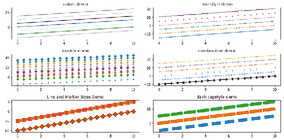

*   `np.linspace(0, 10, 20)`在 0 到 20 的范围内创建 20 个值，它们映射到 *x* 轴。
*   `fig = plt.figure(figsize=(12,6))`定义大小为`(12, 6)`的图形，然后使用`plt.subplot()`定义六个子图。
*   第一个图展示了可以在图中指定颜色的各种方法。`color_list`是绘制线条图的颜色列表。`for`循环遵循列表中每种颜色的绘图线。 `for`循环中的`enumerate`允许两个变量：一个用于从零开始的索引，另一个用于列表中的实际项目：
    *   `xkcd:sky blue`-这是`xkcd`颜色调查中的一种颜色。`xkcd:`必须在实际颜色代码之前。 请在此站点上找到[颜色的完整列表](https://blog.xkcd.com/2010/05/03/color-survey-results/)。
    *   颜色代码（`b`，`g`，`r`，`c`，`m`，`y`，`k`，`w`）及其扩展名（`blue`，`green`，`red`，`cyan`，`magenta`，`yellow`，`black`，`white`）。
    *   （`tab:blue`，`tab:orange`，`tab:green`，`tab:red`，`tab:purple`，`tab:brown`，`tab:pink`，`tab:gray`，`tab:olive`，`tab:cyan`）是来自表格的颜色`T10`分类调色板（这也是默认的颜色周期）。 我们可以在它们之前使用`tab:`来指定这些颜色，也可以不使用`tab`来指定这些颜色。 两者都是可以接受的。
    *   我们也可以指定 RGB 或 RGBA 格式的十六进制值。 任何通道的十六进制值范围从`00`到`FF`。 因此，RBG 的范围从`000000`到`FFFFFF`，而 RGBA 的范围从`00000000`到`FFFFFFFF`。`A`代表 Alpha，代表颜色的透明度； 朝向`00`高度透明，朝向`FF`不透明。
    *   所有这些都不区分大小写，因此我们可以使用大写或小写字母。
    *   另外一个选项是`CN`，其中`C`区分大小写，并且必须是大写字符，后跟数字，这是默认颜色周期中颜色的索引。 如上所述，默认周期中的第一种颜色是蓝色，然后是橙色，绿色，红色，紫色，等等。 因此，`C0`代表蓝色，`C1`代表`orange`，依此类推。
*   第二个图演示了六种可用的线型。 它们是破折号（`-`），实线（`--`），破折号和点（`-.`），冒号（`:`），点（`.`）和实线（`' '`）。 最后一条实线用于演示属性设置函数`plt.setp()`的可用的`steps`样式。 此选项不能像其他线型一样直接使用。
*   第三幅图展示了各种标记。 并非所有可用的标记都在此处绘制。 有关标记的完整列表，请参阅此处的 [Matplotlib 文档](https://matplotlib.org/api/markers_api.html?highlight=list%20markers)。
*   第四幅图演示了如何指定颜色，线条样式和标记及其缩写或全名的组合。 我们可以在字符串中指定所有三个参数，例如`g-^`，也可以只指定其中一个或两个参数，例如`g`或`--`或`D`，在这种情况下，它对此处未指定的属性的其他参数使用默认值。 我们还可以单独指定颜色，例如，颜色为`purple`，线型为`:`，标记为`>`等。
*   图五演示了如何为标记的线宽，标记大小，边缘和面颜色指定大小和颜色参数。
*   最后，图六展示了虚线样式下的端帽样式。

## 使用标准颜色表

在上一秘籍中，我们看到了在绘制图形时如何使用颜色。 如果我们想用视觉感知的颜色可视化数据范围以了解数据中的图案，那么创建与所需范围内的数据变化匹配的颜色组合将很繁琐。 Matplotlib 提供了一系列预定义的颜色表，可以利用这些颜色表满足任何特定要求。 Matplotlib 还启用了用户定义的颜色表，这些颜色表将在下一个秘籍中介绍。

In Python notebooks, you can type `matplotlib.pyplot.cm.` and press *Tab* or type `help (matplotlib.pyplot.cm)` to get a complete list of the available colormaps.

## 准备

在此示例中，我们将使用熟悉的`Iris`数据集。 我们将首先创建一个相关矩阵，并应用标准的颜色表以查看其外观。 在第 2 章和“基本图入门”中，我们看到了相同的相关矩阵作为热图绘制。 在那里，我们使用了`hot`色彩表，但是我们没有涉及色彩表的细节。 我们将在这里解释。

导入以下必需的库：

```py
import matplotlib.pyplot as plt
import pandas as pd
import numpy as np
```

## 操作步骤

以下代码块绘制了具有`Blues`颜色表的相关矩阵：

1.  从 Excel 文件中读取`winequality`数据：

```py
wine_quality = pd.read_csv('winequality.csv', delimiter=';')
corr = wine_quality.corr()
```

2.  定义图及其大小：

```py
plt.figure(figsize=(12,8))
```

3.  绘制相关图，关联的`x`和`y`刻度以及色条：

```py
plt.imshow(corr, cmap='Blues')
plt.colorbar()
plt.xticks(range(len(corr)),corr.columns, rotation=45)
plt.yticks(range(len(corr)),corr.columns)
```

4.  在屏幕上显示该图：

```py
plt.show()
```

## 工作原理

以下是其工作原理的说明：

*   `pd.read_csv()`读取`winequality`数据，`wine_quality.corr()`计算相关矩阵。
*   `plt.imshow(corr, cmap='Blues')`将相关矩阵显示为图像并应用标准色表之一：`Blues`。
*   `plt.colorbar()`显示颜色条，该颜色条指示哪个颜色份额代表哪个数据范围。
*   `plt.xticks()`和`plt.yticks()`绘制代码（数据集中每个属性一个）和 *x* 和 *y* 轴的相应代码标签。`plt.xticks()`中的参数`rotation=45`表示报价标签应与相应轴成 45 度角放置。

您应该看到以下热图。 不出所料，数据范围为 -0.6 到 1.0（相关性只能在 -1.0 和 1.0 之间）。 1.0 一端用`dark blue`颜色表示，另一端用`white`颜色表示 -1，深蓝色和白色之间的深到浅阴影表示 1.0 和 -1.0 之间的数字：

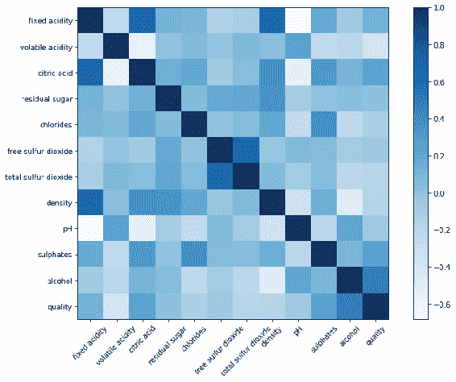

## 更多

在上图中，我们显示了输入数据中可用的完整数据范围。 但是，我们可以使用`plt.clim()`方法限制要进行颜色编码的数据范围。 当存在异常值时（变量的一些条目与其余数据相比太大或太小），这很有用，然后默认情况下，颜色表会扩展整个数据范围的颜色代码。 当存在离群值时，由于范围较大，大多数值会变得模糊，并且离群值会以极端的颜色突出。 如果要抑制离群值的影响，可以限制不包含离群值的数据范围，并在颜色条中使用完整的颜色列表来绘制所需范围。 这给出了数据分布的真实情况。 这是我们可以完成此操作的方法。

首先，我们将噪声添加到已创建图像的图像像素的 10% 中。 我们将不得不做一些数据预处理以添加噪声，从而使数据范围超出 -1 到 1。然后，我们将绘制具有完整数据范围和 -1 到 1 的数据范围的同一图像 ，看看两者之间的区别。 可以看出，在第一张图像中，一些单元格（归因噪声或离群值）以蓝色或白色亮着，而所有其他单元格都模糊了，但是在第二张图像中，所有单元格颜色在 -1 到 1 的范围内均匀地有所不同：

1.  在图像像素的 10% 中产生噪声：

```py
np.random.seed(0) 
mask = (np.random.random(corr.shape) < 0.1)
columns = corr.columns
corr1 = np.array(corr)
corr1[mask] = np.random.normal(0, 5, np.count_nonzero(mask))
corr = pd.DataFrame(corr1, columns=columns)
```

2.  定义图及其大小：

```py
plt.figure(figsize=(12, 5))
```

3.  定义第一个轴域并在上面绘制相关图：

```py
plt.subplot(121)
plt.imshow(corr, cmap='Blues')
plt.colorbar()
plt.xticks(range(len(corr)),corr.columns, rotation=75)
plt.yticks(range(len(corr)),corr.columns)
```

4.  定义第二个轴域并绘制相关图，并限制数据：

```py
plt.subplot(122)
plt.imshow(corr, cmap='Blues')
plt.colorbar(extend='both')
plt.clim(-1, 1)
plt.xticks(range(len(corr)),corr.columns, rotation=75)
plt.yticks(range(len(corr)),corr.columns)
```

5.  调整绘图之间的空间，并在屏幕上显示图形：

```py
plt.tight_layout()
plt.show()
```

这是代码及其工作方式的说明：

*   `np.random.seed(0)`设置种子，以便每次我们运行随机数生成器时，我们都会获得相同的数据。 当我们多次运行相同的代码时，这可以确保结果的可重复性。
*   `mask = (np.random.random(corr.shape) < 0.1)`创建一个大小为`corr`的矩阵，所有小于 0.1 的值都以`True`作为条目； 否则为`False`。
*   `columns = corr.columns`从`corr` Pandas 数据帧中提取列名称，以供以后使用。
*   `corr1 = np.array(corr)`为我们的`corr`数据帧创建了一个 NumPy 数组，因为下一条语句与 NumPy 数组（而不是数据帧）一起很好地工作。
*   `corr1[mask] = np.random.normal(0, 5, np.count_nonzero(mask))`通过为 10% 的条目生成随机正态值来替换`corr1`中与掩码中的`True`条目相对应的条目，并且该分布的平均值为零，标准差为 5。 想法是用代表噪声的较大值替换 10% 的条目。
*   `corr = pd.DataFrame(corr1, columns=columns)`为噪声估算的相关矩阵创建数据帧。
*   `plt.subplot(1, 2, 1)`为第一个绘图创建轴域，我们将在其中显示噪声输入的图像。
*   `plt.imshow(corr, cmap='Blues')`在`plot1`中绘制图像，后跟颜色条，刻度和刻度标签。
*   `plt.subplot(1, 2, 2)`创建第二个绘图的轴域，在其中将数据范围限制在 -1 和 1 之间。
*   `lt.colorbar(extend='both')`绘制带有两端箭头的颜色条，指示范围超出了显示范围。
*   `plt.clim(-1, 1)`将颜色（实际上是数据范围）限制在 -1 和 1 之间。

您应该看到以下图：

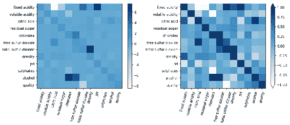

## 用户定义的颜色和颜色表

在上一个秘籍中，我们学习了如何利用预定义的颜色和颜色表以及如何针对特定需求自定义它们。 在本秘籍中，我们将学习如何创建自己的颜色表。 在此示例中，我们将使用`Iris`数据集。

## 准备

我们将首先学习如何创建离散的颜色表，然后是连续的颜色表。

导入以下必需的库：

```py
import matplotlib.pyplot as plt
import pandas as pd
import numpy as np
from matplotlib.colors import LinearSegmentedColormap
```

## 操作步骤

以下代码块显示了三个图表； 第一个使用标准色表`coolwarm`，另外两个使用用户定义的离散色表。 在两个用户定义的颜色中，第一个使用纯红色`(1, 0, 0)`，绿色`(0, 1, 0)`和蓝色`(0, 0, 1)`，而另一个使用 RGB 的混合颜色`(1, 0.5, 0)`，`(0.25, 1, 0)`，`(0, 0.5, 1)`以生成三种离散颜色。 请注意，在第一个颜色表元组`(1, 0, 0)`中，只有红色是 1； 绿色和蓝色为零。 在第二个颜色中，第一个和第二个颜色是`(1, 0.5, 0)`和`(0.25, 1, 0)`表示它们是红色和绿色的组合，而第三个颜色是绿色和蓝色的组合。

我们在这里使用三种离散的颜色，因为我们在输入数据集中有三个聚类。 我们应该具有与簇数一样多的颜色：

1.  从 Excel 读取`Iris`数据并将文本类名称替换为数值：

```py
iris = pd.read_csv('iris_dataset.csv', delimiter=',')
iris['species'] = iris['species'].map({"setosa" : 0, "versicolor" : 
                       1, "virginica" : 2})
```

2.  定义图及其布局：

```py
fig, axs = plt.subplots(1,3, figsize=(9,6))
fig.subplots_adjust(left=0.0, bottom=0.05, right=0.9, top=0.95, 
                    wspace=0.6)
```

3.  定义一个函数来绘制图形：

```py
def plot_graph(axes, cm, cbaxs):
    im = axes.scatter(iris.petal_length, iris.petal_width,  
         s=10*iris.petal_length*iris.petal_width, c=iris.species, 
              cmap = cm)
    caxs = plt.axes(cbaxs) 
    fig.colorbar(im, caxs, ticks=range(3), label='clusetr #')
```

4.  使用从预定义的颜色表`coolwarm`中选择的三种颜色绘制`Iris`数据集簇：

```py
cbaxs = [0.24, 0.05, 0.03, 0.85] # left, bottom, width and height
plot_graph(axs[0], plt.cm.get_cmap('coolwarm', 3), cbaxs)
```

5.  使用纯红色，绿色和蓝色的自定义颜色绘制`Iris`数据群集：

```py
colors = [(1, 0, 0), (0, 1, 0), (0, 0, 1)] # R -> G -> B
cm = LinearSegmentedColormap.from_list('custom_RGB_cmap', colors, 
                                        N=3)
cbaxs = [0.58, 0.05, 0.03, 0.85]
plot_graph(axs[1], cm, cbaxs)
```

6.  使用自定义颜色混合颜色组合来绘制`Iris`数据群集：

```py
colors = [(1, 0.5, 0), (0.25, 0.5, 0.25), (0, 0.5, 1)] # R -> G -> B
cm = LinearSegmentedColormap.from_list('dummy', colors, N=3)
cbaxs = [0.95, 0.05, 0.03, 0.85]
plot_graph(axs[2], cm, cbaxs)
```

7.  在屏幕上显示该图：

```py
plt.show()
```

## 工作原理

以下是代码及其工作方式的说明：

*   `fig, axs = plt.subplots(1,3, figsize=(9,6))`定义具有连续三幅图的图形布局，图形大小为`(9, 6)`。
*   `fig.subplots_adjust(left=0.0, bottom=0.05, right=0.9, top=0.95, wspace=0.6)`定义图形的边界框，在图形的左侧，底部，右侧和顶部定义的所有四个方向上都留有空间。`wspace`定义一行中各图之间要保留的空间量，以使它们的标签或图之间没有重叠。`hspace`是另一个参数，它控制列中各图之间的间隔。 在本示例中，我们没有使用它，因为我们仅将所有图形绘制在一行中。
*   `plot_graph()`是用户定义的函数，用于绘制具有给定参数，轴域，颜色表和颜色条轴域的图形。
*   `axs.scatter()`使用给定的参数绘制散点图。`caxs = plt.axes(cbaxs)`在给定的坐标轴上定义颜色条。`fig.colorbar()`为具有定义颜色的每个群集绘制带有三个刻度的色条，并使用`cluster #`标记色条。
*   我们将第一个图形绘制在`axes[0]`上，预定义的颜色表`coolwarm`的前三个颜色和色条轴域`cbaxs =[0.24, 0.05, 0.03, 0.85]`上。 这些是`left`和`bottom`以及小节的`width`和`height`中图形的分数。 我们将在第 6 章和“带有高级功能的绘图”中了解有关坐标系统的更多信息。
*   我们在`axes[1]`上绘制第二张图，并使用自定义颜色`colors = [(1, 0, 0), (0, 1, 0), (0, 0, 1)]`，它们是纯红色，绿色和蓝色。
*   `cmap_name = 'custom_RGB_cmap'`定义第一个用户定义的颜色表的名称。 如果我们必须注册它以将其包括在标准颜色表库中，这将很有用。
*   `cm = LinearSegmentedColormap.from_list(cmap_name, colors2, N=3)`使用先前定义的三种颜色的列表定义颜色表。
*   对于第二张图，我们将色条放置在以下坐标上：`cbaxs = [0.58, 0.05, 0.03, 0.85]`。
*   同样，我们用`colors = [(1, 0.5, 0), (0.25, 0.5, 0.25), (0.8, 0.8, 0.25)]`绘制第三张图并将它们放置在坐标`cbax = [0.95, 0.05, 0.03, 0.85]`上。 再次将红色，绿色和蓝色通道中的每种颜色与不同值的红色，绿色和蓝色组合在一起，以创建新的自定义颜色。

您应该看到以下图：

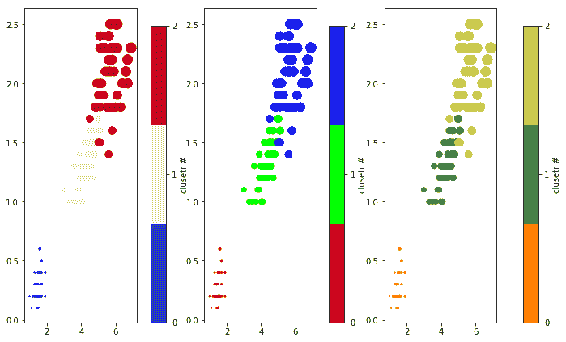

## 更多

以前，我们已经学习了如何创建离散的用户定义的颜色表。 现在让我们看看如何创建用户定义的连续色彩图。 区别在于颜色规格。 在离散的颜色表中，我们的 RGB 元组的数量与数据中簇的数量一样多，因此每种颜色代表一个簇。 但是，在连续的颜色表中，颜色必须沿着整个数据范围从光谱的一端逐渐移到另一端。

我们知道，每种颜色都用三个数字的元组表示：R，G 和 B 通道。 在某些情况下，第四通道`alpha`也用于表示颜色的透明度（或不透明度）。 这是我们需要指定颜色的方式。 让我们举个例子：

```py
cdict1 = {'red':   ((0.0, 0.0, 0.25), (0.5, 0.4, 0.4), (1.0, 0.8,  
                     1.0)),
          'green': ((0.0, 0.0, 0.25), (0.25, 0.5, 0.5), (0.75, 0.75, 
                     0.75), (1.0, 0.9, 1.0)),
          'blue':  ((0.0, 0.0, 0.25), (0.5, 0.5, 0.5), (1.0, 0.75, 
                     1.0))}
```

假设每个元组中的第一项是`x`，第二项是`y0`，第三项是`y1`。 在每种颜色组合中，`x`必须从 0.0 逐渐移至 1.0。 从顶部到底部的行必须从`y1`（顶部行）逐渐过渡到`y0`（下一行），从`y0`到`y1`在同一行中显示，然后在下一行中再次`y1`至`yo`应该是渐进的。 在红色的情况下，`x`从 0.0 移至 0.5，然后移至 1.0。 同样，`y1`从 0.25 移至 0.4、0.4、0.8，这也是渐进的。 我们可以在每种颜色中包含任意数量的元组。 在这种情况下，红色和蓝色分别具有三种，而绿色则具有四种。

同样，我们还定义了三个其他颜色字典，其中一个也带有`alpha`，只是为了演示所有可能的组合：

```py
cdict2 = {'red' : ((0.0, 0.0, 0.0), (0.5, 0.0, 1.0), (1.0, 0.1, 1.0)),
          'green': ((0.0, 0.0, 0.0), (1.0, 0.0, 0.0)), 
          'blue': ((0.0, 0.0, 0.1), (0.5, 0.5, 0.5), (1.0, 0.8, 0.8)) }
cdict3 = {'red': ((0.0, 0.0, 0.0), (0.25, 0.0, 0.0), (0.5, 0.8, 1.0), 
                 (0.75, 1.0, 1.0),(1.0, 0.4, 1.0)),
          'green': ((0.0, 0.0, 0.0), (0.25, 0.0, 0.0), (0.5, 0.9, 0.9),
                   (0.75, 0.0, 0.0), (1.0, 0.0, 0.0)),
          'blue': ((0.0, 0.0, 0.4), (0.25, 1.0, 1.0), (0.5, 1.0, 0.8), 
                  (0.75, 0.0, 0.0), (1.0, 0.0, 0.0))} 
cdict4 = {'red': ((0.0, 0.0, 0.5), (0.5, 0.8, 1.0), (0.75, 1.0, 1.0), 
                 (1.0, 0.9, 1.0)),
          'green': ((0.0, 0.0, 0.5), (0.25, 0.75, 0.0), (0.5, 0.9, 
                     0.9), (1.0, 0.0, 0.0)),
         'blue': ((0.0, 0.0, 0.4), (0.25, 1.0, 1.0), (0.75, 0.0, 0.0), 
                  (1.0, 0.0, 0.0)),
          'alpha': ((0.0, 1.0, 1.0), (0.5, 0.4, 0.4), (1.0, 0.7, 1.0)) }
```

下面的代码块使用前面定义的四个颜色字典来绘制四个颜色表。 这与我们在离散色表的情况下所见相似。

读取`Iris`数据集和数字代码的映射类名称：

```py
iris = pd.read_csv('iris_dataset.csv', delimiter=',')
iris['species'] = iris['species'].map({"setosa" : 0, "versicolor" : 1, 
                                       "virginica" : 2})
```

定义图形，布局，大小，并调整各图之间的空间：

```py
fig, axs = plt.subplots(1,4, figsize=(16,6))
fig.subplots_adjust(left=0.0, bottom=0.0, right=0.95, top=0.94, 
                    wspace=0.4)
```

定义一个函数以绘制图表：

```py
def plot_graph(name, dictionary, axs, cbaxs):
    custom = LinearSegmentedColormap(name, dictionary)
    im = axs.scatter(iris.petal_length, iris.petal_width, s=100*iris.petal_length*iris.petal_width,
                     c=iris.species, cmap=custom)
    caxs = plt.axes(cbaxs) # left, bottom, width and height
    fig.colorbar(im, caxs)
```

绘制每种颜色组合的图形，并将其显示在屏幕上：

```py
plot_graph('custom1', cdict1, axs[0], [0.2, 0.01, 0.01, 0.93])
plot_graph('custom2', cdict2, axs[1], [0.45, 0.01, 0.01, 0.93])
plot_graph('custom3', cdict3, axs[2], [0.7, 0.01, 0.01, 0.93])
plot_graph('custom4', cdict4, axs[3], [0.97, 0.01, 0.01, 0.93])
plt.show()
```

输出图如下所示：

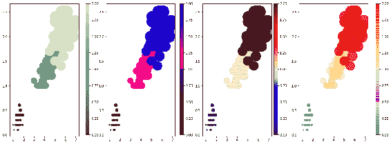

## 处理图例

图例是给定轴域上每个图的描述。 每个轴域都有其自己的图例。 Matplotlib 提供了许多不同的方式来指定图例。 我们将涵盖尽可能多的组合，尽管我们将无法涵盖本书中的一整套可能性。

## 准备

导入以下必需的库：

```py
import matplotlib as plt
import numpy as np
import matplotlib.patches as mpatches
from numpy.random import randn
```

## 操作步骤

以下代码块绘制了 11 种可以指定图例的不同方式：

1.  定义图形的大小：

```py
plt.figure(figsize=(15, 10))
```

2.  使用内联标签绘制第一个图形：

```py
plt.subplot(3,4,1)
line, = plt.plot([1, 2, 3], label='Inline label')
plt.legend()
```

3.  使用`set_label`方法用图例绘制第二张图：

```py
plt.subplot(3,4,2)
line, = plt.plot([1, 2, 3])
line.set_label('Label via method')
plt.legend()
```

4.  用两条线绘制第三个图形，并用标签列表绘制图例：

```py
plt.subplot(3,4,3)
plt.plot([1, 2, 3])
plt.plot([3, 2, 1])
plt.legend(['Positive Slope', 'Negative Slope'])
plt.title('List of Labels')
```

5.  用三条线绘制第四个图形，并用图柄和标签绘制图例：

```py
plt.subplot(3,4,4)
line1, = plt.plot([1, 2, 3])
line2, = plt.plot([3, 2, 1])
line3, = plt.plot([2,2])
plt.legend((line3, line2, line1), ('Zero Slope', 'Negative Slope', 
                                   'Positive Slope'))
plt.title('Handles and Labels')
```

6.  用三条线和图例以及部分手柄列表来绘制第五张图：

```py
plt.subplot(3,4,5)
line_up, = plt.plot([1,2,3], label='Line 2')
line_down, = plt.plot([3,2,1], label='Line 1')
line_3, = plt.plot([2,3,4], label='no label')
plt.legend(handles=[line_up, line_down])
plt.title('Labels for given handles')
```

7.  用三条线以及一部分手柄和标签绘制第六张图：

```py
plt.subplot(3,4,6)
line_up, = plt.plot([1,2,3], label='Line 2')
line_down, = plt.plot([3,2,1], label='Line 1')
line_3, = plt.plot([2,3,4], label='no label')
plt.legend([line_up, line_down], ['Line Up', 'Line Down'])
plt.title('partial handles & labels')
```

8.  用补丁作为标签绘制第七张图：

```py
plt.subplot(3,4,7)
red_patch = mpatches.Patch(color='red', label='The red data')
plt.legend(handles=[red_patch])
plt.title('Patch as a label')
```

9. 绘制第八张图， 在图例中带有类别标签：

```py
plt.subplot(3,4,8)
z = randn(10)
blue_dot, = plt.plot(z, "bo", markersize=15)

## Put a white cross over some of the data.
white_cross, = plt.plot(z[:5], "w+", markeredgewidth=3, 
                        markersize=15)
plt.legend([blue_dot, (blue_dot, white_cross)], ["Attr A", "Attr 
            A+B"])
plt.title('category labels')
```

10.  在两列中将第九个图和图例放在图的顶部：

```py
plt.subplot(3,4,9)
plt.plot([1, 2, 3], label="test1")
plt.plot([3, 2, 1], label="test2")

## Place a legend above this subplot, expanding itself to
## fully use the given bounding box.
plt.legend(bbox_to_anchor=(0, 1.02, 1., .102), #left, bottom, width, 
                                                height
 ncol=2, mode="expand", borderaxespad=0.5)
ax = plt.gca()
ax.set_title('Legend on top', pad=20)
```

11.  绘制第十张图，图例在图的右侧：

```py
plt.subplot(3,4,10)
plt.plot([1, 2, 3], label="test1")
plt.plot([3, 2, 1], label="test2")

## Place a legend to the right of this smaller subplot.
plt.legend(bbox_to_anchor=(1.02, 1.0), borderaxespad=0)
plt.title('Legend on right')
```

12.  绘制第十一张图，将图例分为多个图例：

```py
plt.subplot(3,4,11)
line1, = plt.plot([1, 2, 3], label="Line 1", linestyle='--')
line2, = plt.plot([3, 2, 1], label="Line 2", linewidth=4)

## Create a legend for the first line.
first_legend = plt.legend(handles=[line1], loc=1)

## Add the legend manually to the current Axes. Repeated calls to plt.legend() 
## will overwrite previous calls, so only last one remains
ax = plt.gca().add_artist(first_legend)

## Create another legend for the second line.
plt.legend(handles=[line2], loc=4)
plt.title('Split Legend')
```

13.  清空第十二个绘图空间：

```py
plt.subplot(3,4,12)
plt.axis('off')
```

14.  调整绘图之间的空间，并在屏幕上显示图形：

```py
plt.tight_layout(w_pad=5, h_pad=5)
plt.show()
```

## 工作原理

这是对十一个绘图的解释：

*   **图 1**：标签指定为线形图本身的一部分。
*   **图 2**：创建线对象后，将标签指定为直线轴域上的方法。
*   **图 3**：标签定义为`plt.legend()`命令本身的列表。
*   **图 4**：句柄（轴域对象）和标签作为元组传递到`plt.legend()`函数。
*   **图 5**：三个句柄中只有两个传递给`plt.legend()`，因此图例中未显示`line_3`。
*   **图 6**：类似于图五，但句柄和标签都传递给`plt.legend()`。
*   **图 7**：贴片用作标签。`mpatches.Patch()`创建一个红色补丁。
*   **图 8**：绘制两个不同类别的数据并分别标记它们。
*   **图 9**：在图的顶部绘制图例，标签从左到右分布，并且不与标题重叠。`plt.legend(bbox_to_anchor=(0, 1.02, 1., .102), ncol=2, mode="expand", borderaxespad=0.5)`使用`bbox_to_anchor`将标签放置在图的顶部（与图的大小成比例，从左起 0，从底部起 1.02，宽度为 1.0，高度为 0.102）。`ncol=2`指定标签应放在两列中，而不是两行中，这是默认设置。
*   **图 10**：再次使用`bbox_to_anchor()`坐标，图例位于图的右侧。
*   **图 11**：将标签分为两部分，并将它们放置在不同的位置。 多次调用`plt.legend()`将覆盖以前的图例； 只有最后一个占优势，因此不能用于将标签拆分和放置在其他位置。 其中之一必须通过`ax=plt.gca().add_artist(first_legend)`手动放置。`plt.gca()`获取当前轴域，然后`add_artist()`在该轴域上添加标签。 对于第二个标签，请使用标准`plt.legend()`。
*   **图 12**：由于没有第十二部分，我们必须清理轴线，壁虱和壁虱标签。 否则，它们将无任何显示地出现！ 我们很快将在本章中学习轴线和壁虱。

以下是各图例与相应图例的外观：

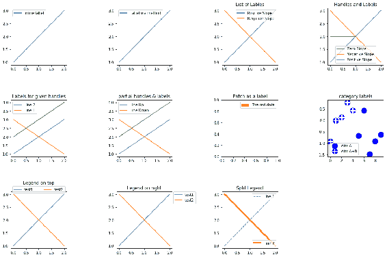

## 更多

使用图例的另一个更常见的选项是`plt.legend()`上的`loc`参数。 该参数可以使用代码 0 到 10 来指定绘图上的不同位置。 它们每个都有一个文本描述，可以在 [Matplotlib 文档](https://matplotlib.org/api/legend_api.html?highlight=legend#module-matplotlib.legend)上找到。

以下是两个可能选项的示例代码：

```py
plt.legend(loc='best') or plt.legend(loc=0)
plt.legend(loc=‘upper right’) or plt.legend(loc=1)
```

## 自定义标签和标题

在本秘籍中，我们将学习如何自定义轴标签，刻度标签，图形和图形标题。 对于其中的一些自定义设置，我们将设置`plt.rcParams`默认参数。 但是，这些设置将处于活动状态，并适用于会话中的所有绘图。

## 准备

让我们导入所需的库并设置`plt.rcParams()`，这对于此秘籍也是必需的。 这些设置将适用于此会话中绘制的所有图：

```py
import matplotlib.pyplot as plt
import numpy as np

plt.rcParams['figure.titlesize'] = 15
plt.rcParams['legend.fontsize'] = 12
plt.rcParams['axes.labelsize'] = 12
plt.rcParams['axes.labelweight'] = 'bold'
plt.rcParams['xtick.labelsize'] = 12
plt.rcParams['ytick.labelsize'] = 12
```

## 操作步骤

以下代码块绘制了三个带有各种标签的图，以演示如何进行自定义：

1.  定义图形，布局和大小，并在图之间留出足够的空间：

```py
fig, ax = plt.subplots(1, 3, figsize=(10,4))
fig.subplots_adjust(wspace=0.7)
```

2.  使用自定义标签和标题在第一个轴域上绘制直方图：

```py
ax[0].hist(np.random.randn(1000))
ax[0].set(xlabel='Bins', ylabel='Frequency')
atitle = ax[0].set_title('Histogram', fontstyle='italic', 
                          fontsize=14)
plt.setp(atitle,color='blue')
```

3.  在第二个轴域上绘制条形图：

```py
## Plot the bars for men's data
menMue = [3, 10, 100, 500, 50]
menSigma = [0.75, 2.5, 25, 125, 12.5]
index = np.arange(len(menMue)) # the x locations for the groups
width = 0.35                   # the width of the bars
p1 = ax[1].bar(index, menMue, width, color='r', bottom=0, 
               yerr=menSigma)

## Plot the bars for women's data
womenMue = [1000, 3, 30, 800, 1]
womenSigma = [500, 0.75, 8, 200, 0.25]
p2 = ax[1].bar(index + width, womenMue, width, color='y', bottom=0, 
               yerr=womenSigma)

## customize title and labels for the figure
atitle = ax[1].set_title('Scores by category and gender', 
                          fontstyle='italic', fontsize=14)
plt.setp(atitle,color='blue')
ax[1].set(xticks=(index + width / 2), xticklabels=('C1', 'C2', 'C3', 
                  'C4', 'C5'), yscale='log')
ax[1].legend((p1[0], p2[0]), ('Men', 'Women'), bbox_to_anchor=
             (1.05,1))
```

4.  在第三轴域上绘制散点图：

```py
ax[2].scatter(np.random.rand(100),np.random.rand(100), 
              s=100*np.random.rand(100)*np.random.rand(100))
atitle = ax[2].set_title('Scatter Plot', fontstyle='italic', 
                          fontsize=14)
plt.setp(atitle,color='blue')
```

5.  设置图的标题：

```py
ftitle= plt.suptitle('Figure Title', fontname='arial', fontsize=20, 
                      fontweight='bold')
plt.setp(ftitle,color='green')
```

6.  调整绘图之间的间距，并在屏幕上显示图形：

```py
plt.tight_layout(pad=3, w_pad=5)
plt.show()
```

## 工作原理

以下是其工作原理的说明：

*   `fig, ax = plt.subplots(1, 3, figsize=(10,4))`定义图形布局。
*   `fig.subplots_adjust(wspace=0.5)`调整子图之间的空间。
*   `ax[0].hist(np.random.randn(1000))`在 0 轴域上绘制直方图，然后是 *X* 和 *Y* 轴的标签，然后是该图的标题。
*   `ax[0].set_title()`除了标题文本外，还包含字体样式和大小参数，但没有`color`参数； 因此，我们使用`plt.setp(atitle,color='blue')`设置标题的颜色。
*   `plt.rcParams['axes.labelsize'] = 10`和`plt.rcParams['axes.labelweight'] = 'bold'`设置所有图的 *x* 和 *y* 轴标签的字体大小和粗细。 在这里，我们仅对第一个图具有标签，因此，它们以`fontsize`或`10`的粗体显示。
*   `p1`和`p2`是男性和女性在第一轴域上的柱状图。`ax[1].set_xticks(ind + width / 2)`设置刻度线，然后设置`ax[1].set_xticklabels(('C1', 'C2', 'C3', 'C4', 'C5'))`，在 *x* 轴上设置`ticklabels`。 对于 *x* 轴，我们使用默认刻度和`ticklabels`作为对数刻度。 通常，我们为类别变量覆盖`ticklables`以给出有意义的名称。
*   最后，`plt.suptitle()`和`plt.setp()`为给定的字体名称，大小和颜色定义整体图形的标题。
*   `plt.tight_layout(pad=3)`调整绘图之间的间隔，`pad=3`调整图形标题与各个绘图标题之间的间隔，以使它们之间没有重叠。

我们得到的输出如下：

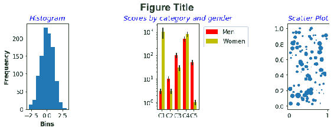

## 更多

字体`fontstyle`，`fontsize`，`fontweight`以及字体颜色应用于轴标签，刻度标签，轴域标题和图形标题的选项组合有多种可能性。 利用所有这些功能，我们可以绘制专业的质量可视化图像。

## 使用自动缩放和轴限制

Matplotlib 自动将 *x* 和 *y* 轴的整个数据范围拟合到输入数据中，将其拆分为桶，并相应地显示刻度和刻度标签。 有时，我们可能希望在任一轴域上更紧密地查看特定范围的数据，而不是完整的数据范围。 在本秘籍中，我们将学习如何做。

## 准备

让我们导入所需的库：

```py
import numpy as np
import matplotlib.pylab as plt
from matplotlib.ticker import FuncFormatter
```

## 操作步骤

以下代码显示了相同输入数据的两个图，但是第一个使用默认设置，因此它在 *x* 和 *y* 轴上都显示了完整范围的数据，而第二个图限制了 *x* 和 *y* 轴范围：

1.  为图表准备数据：

```py
x = np.linspace(-50,50,500)
y = x**2 + np.cos(x)*100
```

2.  定义一个函数以在打印到绘图上之前格式化数字数据：

```py
def Num_Format(x, pos):
    """The two arguments are the number and tick position"""
    if x >= 1e6:
        string = '${:1.1f}M'.format(x*1e-6)
    else:
        string = '${:1.0f}K'.format(x*1e-3)
    return string
```

3.  将先前定义的函数应用于`formatter`，并使用大小和布局定义图形：

```py
formatter = FuncFormatter(Num_Format)
fig, axs = plt.subplots(1,2, figsize=(8,5))
```

4.  使用自动缩放在第一个轴域上绘制折线图：

```py
axs[0].plot(x, y**2) axs[0].yaxis.set_major_formatter(formatter)
axs[0].set_title('Full Data/Autoscale')
```

5.  再次绘制同一图，并在 *x* 和 *y* 轴上都施加限制：

```py
axs[1].plot(x, y**2)
axs[1].set(xlim=(-5,5), ylim=(0,10000), title='X and Y limited')
axs[1].yaxis.set_major_formatter(formatter)
```

6.  在屏幕上显示该图：

```py
plt.show()
```

## 工作原理

*   对于 *x* 轴坐标，`x = np.linspace(-50,50,500)`创建 500 个点，它们之间的等距距离在-50 到+50 之间。
*   `def Num_Format(x, pos)`是根据数字是千位还是数百万位将大数字格式化为`$K`或`$M`的函数。`FuncFormatter(Num_Format)`是一个 matplotlib 函数，它使用用户定义的函数货币作为参数，然后将此`FuncFormatter`应用于 *x* 或 *y* 轴上，在其上使用`axs[0].yaxis.set_major_formatter(formatter)`来格式化数字。
*   `axs[0].plot(x, y**2)`使用 *x* 和 *y* 轴的默认设置在轴域 0 上绘制图形，因此它显示来自输入的全部数据。
*   `axs[1].plot(x, y**2)`在第一个轴域上再次绘制相同的图形。
*   `axs[1].set_xlim(-5,5)`在 *x* 轴上将数据限制从 -5 设置为 +5，`axs[1].set_ylim(0,10000)`在 *y* 轴上将数据限制从 0 设置为 10,000。 这些限制设置为第一轴域上的图。

您应该得到两个图，如下所示：

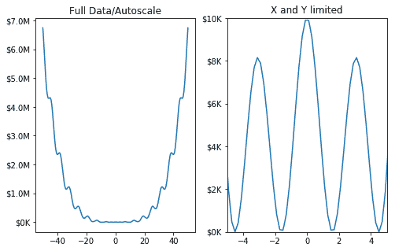

## 自定义刻度和刻度标签

到目前为止，我们已经看到 Matplotlib 根据输入数据自动放置刻度和刻度标签。 在本秘籍中，我们将学习如何在 *x* 和 *y* 轴上自定义这些默认设置，以用于分类变量和数值变量。

## 准备

让我们导入所需的库：

```py
import numpy as np
import matplotlib.pyplot as plt
from matplotlib.ticker import (MultipleLocator, FormatStrFormatter, 
                               AutoMinorLocator)
from matplotlib.ticker import FuncFormatter
```

## 操作步骤

以下代码块绘制了两个男人和女人的条形图。 在 *y* 轴上，绘制了平均工资，在 *x* 轴上，绘制了男女类别中的各个类别。 因此，我们在 *y* 轴上有一个数字变量，在 *x* 轴上有一个分类变量。

以下代码块对 *y* 轴上的刻度和刻度标签使用默认设置，但对 *x* 轴使用自定义设置：

1.  设置数据并绘制男性数据的条形图：

```py
menMue = [3, 10, 100, 500, 50]
menSigma = [0.75, 2.5, 25, 125, 12.5]

fig, ax = plt.subplots()
ind = np.arange(len(menMue)) # the x locations for the groups
width = 0.35                 # the width of the bars
p1 = ax.bar(ind, menMue, width, color='lightblue', bottom=0, 
            yerr=menSigma)
```

2.  设置数据并绘制女性数据的条形图：

```py
womenMue = [1000, 3, 30, 800, 1]
womenSigma = [250, 0.75, 8, 200, 0.25]
p2 = ax.bar(ind + width, womenMue, width, color='orange', bottom=0, 
            yerr=womenSigma)
```

3.  设置图形的标题，标签和图例：

```py
ax.set_title('Scores by group and gender')
ax.set(xticks=(ind + width / 2), xticklabels=('C1', 'C2', 'C3', 
                                   'C4', 'C5'), yscale='log')
ax.legend((p1[1], p2[1]), ('Men', 'Women'), bbox_to_anchor=(1.3,1))
```

4.  在屏幕上显示该图：

```py
plt.show()
```

## 工作原理

这是代码的说明：

*   `ax.set_xticks(ind + width / 2)`设置将每个刻度准确放置在 *x* 轴上的位置。 由于`ind`是根据男性数据定义的，因此会将刻度线放置在男性条的中间（浅蓝色），然后通过向每个索引中添加`width / 2`，将刻度在两个条之间移动。
*   `ax.set_xticklabels(('C1', 'C2', 'C3', 'C4', 'C5'))`在 *x* 轴上设置刻度标签：

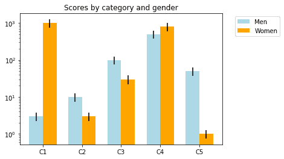

## 更多

让我们再举一个例子，说明如何自定义刻度线的大小，长度和颜色。 以下代码块显示了三个图表； 第一个使用刻度和刻度标签的默认设置，第二个被自定义以显示主要和次要刻度，第三个被自定义以指定主要和次要刻度的长度，厚度和颜色：

1.  定义用于格式化数字数据的函数：

```py
def Num_Format(x, pos):
 """The two arguments are the number and tick position"""
 if x >= 1e6:
     string = '${:1.1f}M'.format(x*1e-6)
 else:
     string = '${:1.0f}K'.format(x*1e-3)
 return string
```

2.  定义一个函数来绘制图形：

```py
def plot_graph(axes, axis, major_step_size, minor_step_size):
    majorLocator = MultipleLocator(major_step_size)
    minorLocator = MultipleLocator(minor_step_size)
    if axis == 'x':
        axes.xaxis.set_major_locator(majorLocator)
        axes.xaxis.set_minor_locator(minorLocator)
    else:
        axes.yaxis.set_major_locator(majorLocator)
        axes.yaxis.set_minor_locator(minorLocator)
    axes.yaxis.set_major_formatter(formatter)
```

3.  设置图的数据：

```py
x = np.linspace(-50,50,500)
y = x**2 + np.cos(x)*100
```

4.  定义图形，布局和大小，并调整各图之间的空间：

```py
fig, axs = plt.subplots(1,3, figsize=(15,5))
fig.subplots_adjust(wspace=0.5)
```

5.  使用 *y* 轴应用`formatter`绘制图形：

```py
formatter = FuncFormatter(Num_Format)
axs[0].plot(x, y**2)
axs[0].set_title('Default Ticks and Ticklabels')
axs[0].yaxis.set_major_formatter(formatter)
```

6.  在第二轴域上用主要和次要刻度画线形图：

```py
axs[1].plot(x, y**2)
plot_graph(axs[1], 'y', 500000, 250000)
plot_graph(axs[1], 'x', 10, 2)
axs[1].set_title('Major and Minor Ticks')
```

7.  使用自定义刻度和刻度标签在第三个轴域上绘制折线图：

```py
axs[2].plot(x, y**2)
plot_graph(axs[2], 'x', 10, 2)
minorLocator = AutoMinorLocator()
axs[2].xaxis.set_minor_locator(minorLocator)
axs[2].tick_params(which='major', length=10, color='g')
axs[2].tick_params(which='minor', length=4, color='r')
axs[2].tick_params(which='both', width=2)
axs[2].set_title('Customised Ticks')
axs[2].grid(True)
```

8.  在屏幕上显示该图：

```py
plt.show()
```

这是代码及其工作方式的说明：

*   零轴域上的第一个绘图使用默认设置，它会自动为 *y* 轴选择一百万个仓位，并为 *x* 轴选择 20 个单位仓位，并相应地放置刻度和刻度标签 。
*   轴域 1 上的第二个图`majorLocator = MultipleLocator(500000)`指定应以`500000`间隔放置主要刻度线，`axs[1].yaxis.set_major_locator(majorLocator)`在 *y* 轴主要刻度上设置此间隔。`majorFormatter = FormatStrFormatter('%d')`指定要显示的刻度标签编号的格式，`axs[1].yaxis.set_major_formatter(majorFormatter)`将格式应用于 *y* 轴的主刻度标签。
*   对于 *x* 轴重复相同的过程，其中`10`单元箱用于主要刻度，而`2`单元用于次刻度。
*   第三幅图与第二幅图相似，只将次要刻度线限制在 *x* 轴上，并为主要和次要刻度线设置了长度，宽度和颜色设置。`tick_params()`设置这些参数，和参数`which=`指定要应用的主要，次要或两个刻度。

这是前面代码的生成的输出：

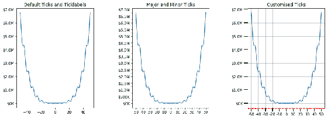

## 自定义轴线

默认情况下，Matplotlib 在图的顶部，底部，左侧和右侧显示所有四个轴线，并在其周围创建一个边界框。 它仅在左侧（*y* 轴）和底部（*x* 轴）上显示刻度和刻度标签。 但是，它允许我们自定义它们的位置，并根据需要省略任何轴线。

## 准备

我们将绘制六个具有相同数据的图，但为轴线设置各种选项。

导入以下必需的库：

```py
import numpy as np
import matplotlib.pyplot as plt
```

## 操作步骤

以下代码块显示六个具有相同数据，但轴线的选项不同的图：

1.  设置图的数据：

```py
theta = np.linspace(0, 2*np.pi, 128)
y = np.sin(theta)
```

2.  定义图形的大小：

```py
fig = plt.figure(figsize=(8,6))
```

3.  定义第一个轴域，并用默认的轴线绘制正弦波：

```py
ax1 = fig.add_subplot(2, 3, 1)
ax1.plot(theta, np.sin(theta), 'b-*')
ax1.set_title('default spines')
```

4.  定义用于绘制图形的函数：

```py
def plot_graph(axs, title, lposition, bposition):
    ax = fig.add_subplot(axs)
    ax.plot(theta, y, 'b-*')
    ax.set_title(title)
    ax.spines['left'].set_position(lposition)
    ax.spines['right'].set_visible(False)
    ax.spines['bottom'].set_position(bposition)
    ax.spines['top'].set_visible(False)
    ax.xaxis.set_ticks_position('bottom')
    ax.yaxis.set_ticks_position('left')
```

5.  绘制五个具有不同轴线位置的图形：

```py
plot_graph(232, 'centered spines', 'center', 'center') 
plot_graph(233, 'zeroed spines', 'zero', 'zero')
plot_graph(234, 'spines at axes [0.25, 0.75]', ('axes', 0.25), 
          ('axes', 0.75))
plot_graph(235, 'spines at data [1.0, -1.0]', ('data', 1.0), 
          ('data', -1.0))
plot_graph(236, 'adjusted spines', ('outward', 10), ('outward', 10))
```

6.  调整绘图之间的空间，并在屏幕上显示图形：

```py
plt.tight_layout()
plt.show()
```

## 工作原理

*   曲线 1 使用默认设置的轴线。 因此，它将显示所有四个轴线，左侧和底部分别代表 *y* 和 *x* 轴，并带有适当的刻度和刻度标签。
*   在曲线 2 中，使用`set_visible(False)`方法使顶部和右侧轴线不可见。`set_position('center')`将 *x* 和 *y* 轴放置在相应数据范围之间。 在这种情况下， *y* 轴上的数据范围是 -1 到 +1，所以中心点是 0，而 *x* 轴上的数据范围是 0 到 6，所以中心点是`3`。 因此，交点为`(3, 0)`。
*   线形图 3 放置左轴线和底轴线，使它们在`(0, 0)`相交。
*   线形图 4 以在 *x* 轴上的 0.25 范围和在 *y* 轴上的 0.75 范围内相交的方式放置左轴线和底轴线。`[0.25, 0.75]`为`0.25 * x 范围 = 0.25 * (0 到 6) = 1.5`，`0.75 * y 范围 = 0.75 * (-1 到 1) = 0.5`。 因此，交点为`(1.5, 0.5)`。`axes`选项基本上将 *x* 轴的底部 25%（第一个四分位数）和 *y* 轴的底部 75%（第三个四分位数）设置为最低。
*   在图 5 中，我们使用`data`选项指定输入数据中的位置。 因此，它将左脊和下脊置于`(1, -1)`交点。
*   在图 6 中，我们使用`outward`参数将轴线放置在远离图形的位置指定数量的单位; 在这里是`10`：

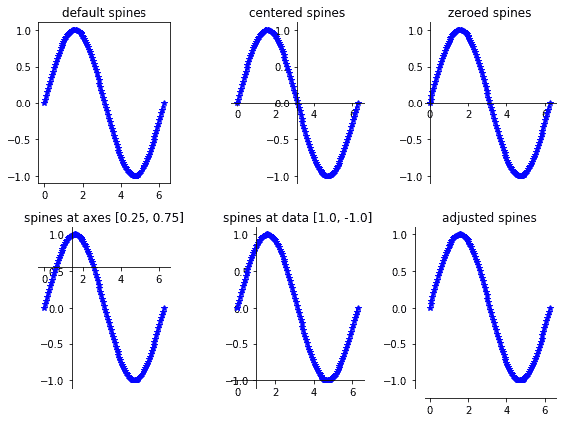

## 双生轴域

有时，我们可能希望在同一轴域上绘制两个图表，但是数据规模不同。 如果我们在左右轴线上使用具有相同比例尺的标准图，则由于数据比例尺的巨大差异，图表可能看起来不正确。 在这种情况下，我们可以使用 Matplotlib 提供的双生轴域功能。 我们将在本秘籍中学习如何使用它。

在此示例中，我们将在制造工厂中使用一个月的产品缺陷数据。 我们将通过原因代码（例如 0 到 5，代表生产缺陷产品的各种原因）和累积百分比折线图（缺陷代码上汇总的缺陷产品总数）绘制条形图。

轴域联动有三种选择：

*   `twinx`：为两个图形共享 *x* 轴，而左轴和右轴表示两个不同的比例
*   `twiny`：为两个图形共享 *y* 轴，而顶部和底部轴表示两个比例
*   `no sharing`：其中一张图使用底部轴和左轴，第二张图使用顶部轴和右轴

我们将学习如何在本秘籍中实现所有三种可能性。

## 准备

我们将使用给定月份的制造工厂中的产品缺陷数据。 它具有缺陷原因代码和许多缺陷。 因此，我们将通过缺陷原因代码绘制条形图以显示缺陷数量，并绘制一条线形图以累积缺陷占总缺陷的百分比。 显然，缺陷数量和累积百分比的数据范围会发生很大变化，因此，通用的 *y* 轴无法提供正确的数据图。 在这种情况下，将轴域缠绕在一起可以进行救援。

我们将绘制两个不同的图； 本节中一个使用`twinx()`，另一个使用`twiny()`。 我们将学习如何在任何轴域上绘制`no sharing`的第三个选项。本秘籍还有更多...* 部分。

导入所需的库：

```py
import matplotlib.pyplot as plt
from matplotlib.ticker import MultipleLocator
```

## 操作步骤

这是绘制所需图形所涉及的步骤：

1.  准备绘图数据：

```py
x = [0, 1, 2, 3, 4, 5]
y = [19, 12, 6, 4, 3, 2]
y1 = [41, 67, 80, 89, 96, 100]
```

2.  定义图形和所需的轴域，包括双生轴域：

```py
fig = plt.figure(figsize=(10,6))

ax1 = plt.subplot(121)       # first plot
ax2 = ax1.twinx()            # share x axis

ax3 = plt.subplot(122)       # second plot
ax4 = ax3.twiny()            # share y axis
```

3.  使用`twinx()`选项绘制条形图和折线图：

```py
b = ax1.bar(x, y, label='Number of Defects')
l, = ax2.plot(x, y1, color='g', lw=5, label='Cumulative Defects as %')
```

4.  设置第一个图的标签和图例：

```py
majorLocator = MultipleLocator(2)
ax1.yaxis.set_major_locator(majorLocator)
ax1.set(xlabel='Defect Reason Codes', ylabel='Number of Defects')
ax2.set(ylabel='Cumulative Defects as %')
ax1.legend([b, l],['Number of Defects','Cumulative Defects as %'], 
            loc=5)
```

5.  使用`twiny()`选项绘制条形图和折线图：

```py
b1 = ax3.barh(x, y, label='Number of Defects')
l1, = ax4.plot(y1, x, color='g', lw=5, label='Cumulative Defects as 
               %')
```

6.  设置第二个绘图的标签和图例：

```py
ax3.xaxis.set_major_locator(majorLocator)
ax3.set(xlabel='Number of Defects', ylabel='Defect Reason Codes')
ax4.set(xlabel='Cumulative Defects as %')
ax3.legend([b1, l1], ['Number of Defects', 'Cumulative Defects as 
                       %'], loc=1)
ax3.set_ylim(-1,6)
```

7.  打印图形的标题，并调整两个图形之间的空间：

```py
plt.suptitle('Product Defects - August 2018', fontname='arial', 
              fontsize=20, 
              fontweight='bold')
plt.tight_layout(w_pad=5, pad=3)
```

8.  在屏幕上显示该图：

```py
plt.show()
```

## 工作原理

这是前面代码的解释：

*   `x = [0, 1, 2, 3, 4, 5]`是产品缺陷代码的列表，`y = [19, 12, 6, 4, 3, 2]`是给定月份中每个缺陷代码的缺陷数量的列表，`y1 = [41, 67, 80, 89, 96, 100]`是累积缺陷占总缺陷百分比的列表。
*   `ax1 = plt.subplot(121)`定义第一个图的主轴域，`121`表示它是`1 x 2`网格中的第一个图。
*   `ax2 = ax1.twinx()`定义第一个绘图的双生轴域。 它不会在物理上创建另一个轴域，而是仅使用主轴域，并将右轴线用作此新逻辑轴域`ax2`的 *y* 轴，并共享底部轴线作为`ax1`和`ax2`的 *x* 轴。
*   `ax3 = plt.subplot(121)`定义第二个绘图的主轴域，`122`表示它是`1 x 2`网格中的第二个绘图。
*   `ax4 = ax3.twinx()`定义第二个绘图的双生轴域。 同样，它不会在物理上创建其他轴域，而仅使用主轴域，并将右脊用作次轴域`ax4`，并为`ax3`和`ax4`共享底部轴线作为 *x* 轴。
*   `b = ax1.bar(x, y, label='Number of Defects')`绘制条形图，缺陷代码与缺陷数量的关系。
*   `l, = ax2.plot(x, y1, color='g', lw=5, label='Cumulative Defects as %')`绘制线形图：缺陷代码与累积缺陷`%`。
*   `majorLocator = MultipleLocator(2)`定义主要刻度线的步长为 2。
*   `ax1.yaxis.set_major_locator(majorLocator)`向第一幅图的主轴域的 *y* 轴应用主定位器。
*   `ax1.set(xlabel='Defect Reason Codes', ylabel='Number of Defects')`为主轴域设置 *x* 和 *y* 轴标签。
*   `ax2.set(ylabel='Cumulative Defects as %')`为双生轴域设置`ylabel`，并且由于共享 *x* 轴； 再次没有标签在这里。
*   `ax1.legend([b, l], ['Number of Defects', 'Cumulative Defects as %'], loc=5)`设置主轴域的图例：
    *   `[b,l]`分别是条形图和折线图的句柄列表。
    *   `['Number of Defects', 'Cumulative Defects as %']`分别是条形图和折线图的标签列表。
    *   `loc=5`指定图例应以右对齐的方式放置在轴域的中心。
*   `b1 = ax3.bar(x, y, label='Number of Defects')`绘制条形图，缺陷代码与缺陷数量的关系。
*   `l1, = ax4.plot(x, y1, color='g', lw=5, label='Cumulative Defects as %')`绘制折线图，​​缺陷代码与累积缺陷`%`。
*   `majorLocator = MultipleLocator(2)`， 定义主要刻度线的步长为 2。
*   `ax3.yaxis.set_major_locator(majorLocator)`将主定位器应用于第一幅图的主轴域的 *y* 轴。
*   `ax3.set(xlabel='Defect Reason Codes', ylabel='Number of Defects')`设置主轴域的 *x* 和 *y* 轴标签。
*   `ax4.set(ylabel='Cumulative Defects as %')`为双生轴域设置`ylabel`，并且由于 *x* 轴已共享，此处不再有标签。
*   `ax3.legend([b1, l1], ['Number of Defects', 'Cumulative Defects as %'], loc=1)`设置第二个绘图主轴域的图例。
*   `ax3.set_ylim(-1,6)`设置第二个图的主轴域的 *y* 轴的上下限。
*   `plt.suptitle('Product Defects - August 2018', fontname='arial', fontsize=20, fontweight='bold')`用各种属性（例如字体名称，大小和粗细）绘制整个图形的标题。
*   `plt.tight_layout(w_pad=5, pad=3)`调整绘图之间的空间，以使它们没有重叠：
    *   `w_pad=5`指定两个图之间的间隙量。
    *   `pad=3`在图的顶部指定为标题腾出空间的数量空间。
*   `plt.show()`在屏幕上显示图形。

运行前面的代码后，您应该在屏幕上看到下图：

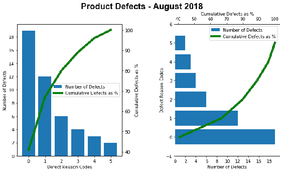

## 更多

我们已经了解了如何使用双生轴域功能分别共享 *x* 和 *y* 轴。 现在，让我们看一下不共享两个轴的选项，而是对一个图形使用左轴线和底轴线，对另一个图形使用上轴线和右轴线。 所有四个轴线使用不同的刻度，因此`ticks`和`ticklabels`不同。

在此示例中，我们将使用熟悉的`Iris`数据集。 众所周知，有四个属性：`petal_width`，`petal_leangth`，`sepal_width`和`sepal_length`。 因此，正如我们在本书中多次看到的那样，当我们使用`petal_width`和`petal_length`绘制散点图时，我们看到了三个不同的簇，但是当我们使用`sepal_length`和`sepal_width`绘制散点图时，我们不会观察到任何此类簇。

这是绘制此代码所需的代码。 由于我们已经看过很多次了，因此这里不再逐行解释。 唯一的区别是`ax1 = ax.twinx().twiny()`。 而不是使用`twinx()`或`twiny()`，我们都使用了两者，以便将上轴域和右轴域用于此新逻辑轴域（`ax1`），而将左轴域和底轴域用于主轴域（`ax`）：

```py
import matplotlib.pyplot as plt
import pandas as pd

iris = pd.read_csv('iris_dataset.csv', delimiter=',')
iris['species'] = iris['species'].map({"setosa" : 0, "versicolor" : 1, 
                                       "virginica" : 2})

plt.figure(figsize=(8,6))
ax = plt.subplot(111)
h1 = ax.scatter(iris.petal_width, iris.petal_length, s=5*iris.petal_width*iris.petal_length, c='b')

ax1 = ax.twinx().twiny()
h2 = ax1.scatter(iris.sepal_width, iris.sepal_length, 
                 s=5*iris.sepal_width*iris.sepal_length, c='g')

ax.legend([h1, h2], ['petals', 'sepals'], loc='best')

plt.show()
```

运行前面的代码后，您应该在屏幕上看到下图：

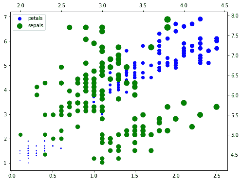

从该图可以看出，使用花瓣的宽度和长度绘制的蓝色点确实形成了三个不同的簇，而以萼片的宽度和长度绘制的绿色点散布在各处，没有任何特定的图案！

Please also note the scale of data on each of the four axes. All of them have a different scale!

## 使用图案填充

图案填充用于填充指定区域中的图案。 我们将在本秘籍中学习如何使用它。

## 准备

导入所需的库：

```py
import matplotlib.pyplot as plt
import numpy as np
```

## 操作步骤

以下代码块创建了五个表示领带的图表，并在上面印刷了不同的颜色和图案：

```py
## Set up the data
x = np.array([0.2, 0.4, 0.6, 0.8, 0.5])
y = [1, 6, 6, 1, 0]

## Plot a tie graph 5 times with different colors and hatches
plt.fill(x+1, y, color='g', hatch='+*')
plt.fill(x+2, y, color='b', hatch='-o')
plt.fill(x+3, y, color='y', hatch='+x')
plt.fill(x+4, y, color='r', hatch='\\')
plt.fill(x+5, y, color='m', hatch='Ox')
plt.title('Hatch Demo')

plt.show()
```

## 工作原理

`x`和`y`是表示二维空间上的五个点的列表。 这五个点所覆盖的区域会形成平局。 使用`plt.fill()`方法中的`hatch`自变量填充颜色和图案：

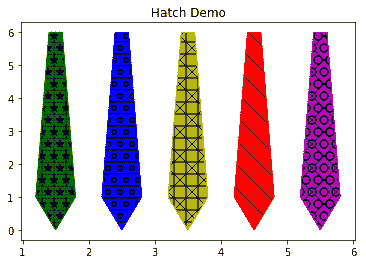

## 使用标注

通过指向文本中描述的区域，标注用于描述绘图上的特定细节。 我们将在秘籍中介绍一个简单的示例。 在后面的章节中将进行更详细的描述。

## 准备

导入所需的库：

```py
import matplotlib.pyplot as plt
import numpy as np
```

## 操作步骤

以下代码块显示了一个绘图，在该绘图上用箭头标注了一个点（`3, 0`）：

```py
plt.plot(theta, np.sin(theta), 'b-*')
a = plt.annotate("(3,0)", xy=(3, 0), xycoords='data', xytext=(4.0, 
                   0.5), textcoords='data',
            arrowprops=dict(arrowstyle="->", color="green", lw=5, 
            connectionstyle=("arc3,rad=0.")))
plt.setp(a, size=25)
plt.show()
```

## 工作原理

这是代码的说明：

*   `plt.annotate()`方法使用指定的详细信息标注图形。
*   `(3, 0)`指定要显示为描述的文本。
*   `xy = (3, 0)`指定图形上要标注的点的坐标。
*   `xycoords='data'`指定所指定的`xy`坐标是相对于数据（输入数据中的点）的。
*   `arrowprops()`指定从文本到要标注的点要使用的箭头的`style`，`linewidth`，`color`，`connectionstyle`。
*   `plt.setp()`将文本`(3, 0)`的字体大小设置为`25`。

通过运行前面的代码，我们得到以下输出：

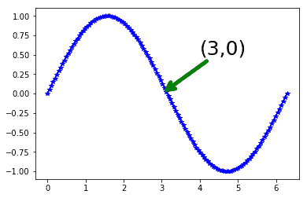

## 使用样式表

我们已经学习了如何使用图形的各种属性来创建专业图形。 但是，找出这么多不同的组合并获得漂亮的图形非常耗时。 Matplotlib 提供了称为**样式表**的现成模板的列表，这些模板使用各种属性的预定义组合。 在本秘籍中，我们将学习如何使用这些预定义的样式表。

You can use `print(plt.style.available)` to get the list of all the available style sheets.

## 准备

导入所需的库：

```py
import matplotlib.pyplot as plt
import numpy as np
```

## 操作步骤

以下代码块绘制了四种不同类型的图，所有图都具有相同的样式表，以演示如何使用样式表：

1.  定义要在此会话中应用于所有图形的样式：

```py
plt.style.use('seaborn-bright')
```

2.  定义图形，大小并调整图之间的空间：

```py
fig, ax = plt.subplots(1, 4, figsize=(10,5))
fig.subplots_adjust(wspace=0.5)
```

3.  在第一个轴域上绘制直方图：

```py
ax[0].hist(np.random.randn(1000))
```

4.  在第二个轴域上绘制三个折线图：

```py
for i in range(3):
    ax[1].plot(np.random.rand(10))
ax[1].legend(['a', 'b', 'c'], loc='lower left')
```

5.  在第三个轴域上绘制散点图：

```py
ax[2].scatter(np.random.rand(100),np.random.rand(100), 
              s=100*np.random.rand(100)*np.random.rand(100))
```

6.  在第四个轴域上绘制饼图：

```py
labels = ['SciFi', 'Drama', 'Thriller', 'Comedy', 'Action', 
          'Romance']
sizes = [5, 15, 10, 20, 40, 10] # Add upto 100%
explode = (0, 0, 0, 0, 0.1, 0) 
ax[3].pie(sizes, explode=explode, labels=labels, autopct='%1.0f%%', 
          pctdistance=0.7,
          shadow=True, startangle=90)
ax[3].axis('equal') # Equal aspect ratio ensures that pie is drawn   
                      as a circle.
```

7.  设置图形的标题并将其显示在屏幕上：

```py
plt.suptitle('seaborn-bright', color='b', weight='bold')
plt.show()
```

## 工作原理

这是刚刚给出的代码的说明：

`plt.style.use('seaborn-bright')`设置要使用的特定样式表。 相同的样式表将应用于此会话中的所有绘图。 在此示例中，我们使用`seaborn-bright`样式表。

剩余的代码绘制了四个图形，正如我们之前所看到的。

如您所见，我们没有为任何图形属性指定任何特定参数。 它们都是从我们一开始提供的样式表中借用的：

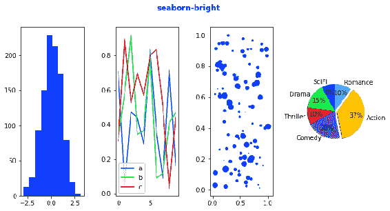

## 更多

为了演示更多样式表，下面的代码块使用与之前相同的四个图，但是应用`style_list`中指定的样式表列表。

由于相同的代码将重复多次，因此我们定义一个函数，并在每次使用不同`style`参数的`for`循环中调用它：

```py
style_list = ['classic', 'dark_background', 'ggplot', 'grayscale', 
              'seaborn']
def plot_the_graph(style):
    np.random.seed(0)
    fig, ax = plt.subplots(1, 4, figsize=(12,5))
    fig.subplots_adjust(wspace=0.5)
    ax[0].hist(np.random.randn(1000))
    for i in range(3):
        ax[1].plot(np.random.rand(10))
    ax[1].legend(['a', 'b', 'c'], loc='lower left')

    ax[2].scatter(np.random.rand(100),np.random.rand(100), 
                  s=100*np.random.rand(100)*np.random.rand(100))

    labels = ['SciFi', 'Drama', 'Thriller', 'Comedy', 'Action', 
              'Romance']
    sizes = [5, 15, 10, 20, 40, 10] # Add upto 100%
    explode = (0, 0, 0, 0, 0.1, 0) # only "explode" the 2nd slice (i.e. 
                                                                'Hogs')
    ax[3].pie(sizes, explode=explode, labels=labels, autopct='%1.0f%%', 
              pctdistance=0.7,
              shadow=True, startangle=90)
    ax[3].axis('equal') # Equal aspect ratio ensures that pie is drawn 
                          as a circle.

    plt.suptitle(style)
    plt.show()

for style in style_list:
    with plt.style.context(style):  
         plot_the_graph(style)
```

执行前面的代码后，您应该在屏幕上看到以下五个单独的图形，每个图形具有`style_list`中指定的不同样式：

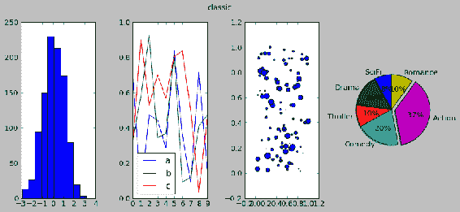

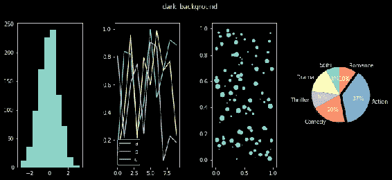

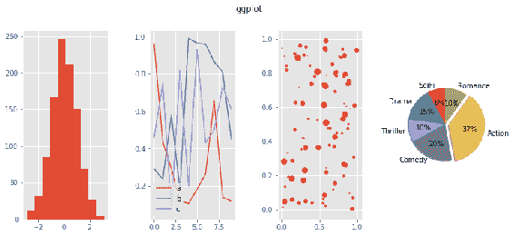

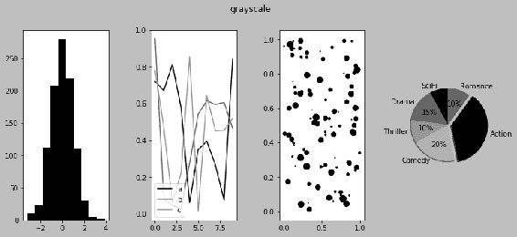

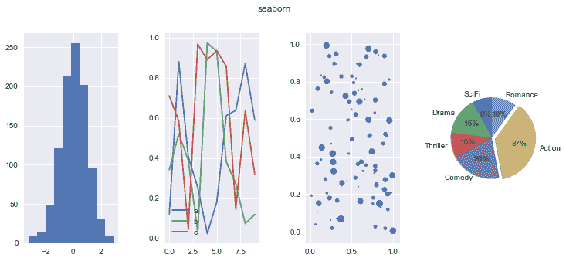

## 使用面向对象的 API 进行绘图

在本章中，我们将使用以下秘籍来学习`pyplot` API 和面向对象的 API 之间的区别：

*   使用`pyplot`和面向对象的 API 绘制相关矩阵
*   使用面向对象的 API 绘制补丁
*   使用面向对象的 API 绘制集合

## 介绍

如第 1 章，“Matplotlib 的剖析”中所述，Matplotlib 具有三层架构。 顶层称为**脚本层**，并通过`pyplot()` API 实现。 该 API 是为没有太多编程经验的用户设计的，因此它使用户免受使用底部两层（艺术家和后端）创建和渲染图的复杂性的困扰。 对于使用高级功能（例如补丁，集合，使用事件，回调，动画和窗口小部件的交互式绘图）的复杂应用，我们将必须使用面向对象的 API。 但是，要利用此 API 的全部潜能，需要大量的 Python 编码经验。 随着新版本 Matplotlib 的发布，越来越多的这些功能正在移入`pyplot` API 中，从而减少了对面向对象 API 的依赖。

面向对象的 API 名称有点让人困惑，因为它可能给人以`pyplot` API 不是面向对象的印象，这是不正确的。 这仅意味着面向对象的 API 会直接使用艺术家和后端层，而绕过脚本层（不使用`pyplot` API）。 这提供了使用 Matplotlib 提供的完整功能的灵活性，而`pyplot` API 提供了它的一个子集。

应该注意的是，对于任何绘图或图形，都不必是`pyplot` API 或面向对象的 API； 它可以是两者的结合。 实际上，到目前为止，我们开发的许多图形都将两者结合使用。 当我们必须使用复杂的网格结构在图形中放置图时，我们使用了面向对象的 API。 当分别绘制每个图形并创建图形对象和基础画布时，我们使用了`pyplot` API。 一旦我们看到了两种 API 之间的差异，您将了解两种 API 的结合使用。

## 使用`pyplot`和面向对象的 API 绘制相关矩阵

在本秘籍中，我们将学习`pyplot`与面向对象的 API 之间的区别。 我们将首先使用`pyplot` API，然后使用面向对象的 API 绘制相同的相关矩阵。 我们将使用相同的`Wine Quality`数据集绘制相关矩阵。

## 准备

为`pyplot` API 导入以下库：

```py
import pandas as pd
import matplotlib.pyplot as plt
```

导入以下库以获取面向对象的 API：

```py
import pandas as pd
from matplotlib.backends.backend_agg import FigureCanvasAgg as FigureCanvas
from matplotlib.figure import Figure
from IPython.core.display import display
```

`matplotlib.backends`具有一组支持的后端。 在这里，我们要导入`FigureCanvasAgg`，它提供了绘制图形的空间并将其映射到定义的后端设备。

`IPython.core.display`可以将绘图显示在输出设备上。

## 操作步骤

以下代码块使用 pandas 读取数据并使用`pyplot` API 绘制相关矩阵。 这与我们在第 2 章“基本绘图入门”中绘制热图的方式相同：

1.  将数据从 CSV 文件读取到 Pandas 数据帧中：

```py
wine_quality = pd.read_csv('winequality.csv', delimiter=';')
```

2.  获取`wine_quality`所有属性的相关矩阵：

```py
corr = wine_quality.corr()
```

3.  定义图形及其大小，并绘制图像和相关的颜色条：

```py
plt.figure(figsize=(12,9))
plt.imshow(corr,cmap='hot')
plt.colorbar()
```

4.  设置图形的标题和刻度，并在屏幕上显示：

```py
plt.title('Correlation Matrix')
plt.xticks(range(len(corr)),corr.columns, fontsize=10, fontweight='bold',rotation=45)
plt.yticks(range(len(corr)),corr.columns)

plt.show()
```

前面的代码块中的所有命令都是我们熟悉的，因为我们已经在第 2 章，“基本绘图”和第 4 章，“为发布质量开发可视化”中学习了它们。

以下代码块使用面向对象的 API（不使用`pyplot` API）绘制相同的相关图：

1.  将数据从 CSV 文件读取到 Pandas 数据帧中：

```py
wine_quality = pd.read_csv('winequality.csv', delimiter=';')
```

2.  获取`wine_quality`所有属性的相关矩阵：

```py
corr = wine_quality.corr()
```

3.  定义图形的大小：

```py
fig = Figure(figsize=(12,9))
```

4.  将图形附加到画布上：

```py
FigureCanvas(fig)
```

5.  定义图中的轴域，我们需要绘制相关图，并绘制相关图和颜色条：

```py
axs = fig.add_subplot(111)
corimage = axs.imshow(corr,cmap='hot')
fig.colorbar(corimage)
```

6.  设置`ticks`和`ticklabels`：

```py
axs.set(xticks=range(len(corr)), yticks=range(len(corr)), 
        title='Correlation Matrix')
fontd = {'fontsize': 10,
         'fontweight': 'bold',
         'rotation': 45}
axs.set_xticklabels(corr.columns, fontdict=fontd)
axs.set_yticklabels(corr.columns)
```

7.  在屏幕上显示该图：

```py
display(fig)
```

## 工作原理

`pyplot` API 代码块是不言自明的。 这是输出图表：

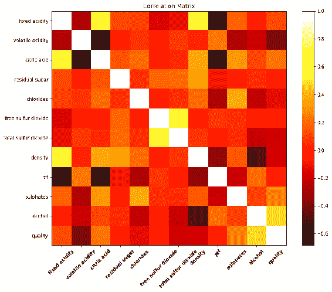

以下是面向对象的 API 代码块的说明：

*   `Figure(figsize=(12,9))`实例化大小为`(12, 9)`的图形对象。
*   `FigureCanvas(fig)`附加画布（需要绘制图形的区域，该区域最终显示在连接的后端设备上）。 对于`pyplot` API，我们无需这样做，因为`pyplot` API 会处理它。
*   `fig.add_subplot(111)`在先前创建的图形对象内创建轴域对象。 请注意，我们可以在一个图形对象内创建多个轴域对象。 在这里，我们只创建一个轴域，因为我们只绘制一个图。
*   `axs.imshow(corr,cmap='hot')`使用标准色表`hot`将相关矩阵创建为图像。
*   `fig.colorbar(corimage)`将颜色条附加到之前创建的图像。
*   要为 *x* 和 *y* 轴创建`ticks`和`ticklabels`，`pyplot` API 具有`plt.xticks`和`plt.yticks`方法，它们同时具有刻度位置和刻度线作为参数，并使用一个命令进行管理。 但是，对于面向对象的 API，我们将不得不单独进行。
*   `axs.set(xticks=range(len(corr)), yticks=range(len(corr)), title='Correlation Matrix')`定义了 *x* 和 *y* 轴刻度和图形标题。 它需要的刻度声与相关矩阵中的属性一样多。
*   `fontd`是具有要应用于`xticklabels`的所有属性的字典。 如果需要，我们也可以对`yticklabels`执行相同的操作。
*   `axs.set_xticklabels(corr.columns, fontdict=fontd)`用定义的属性设置`xticklabels`。
*   `axs.set_yticklabels(corr.columns)`将 *y* 轴设置为`ticklabels`。

执行前面的代码后，您应该看到以下图表：

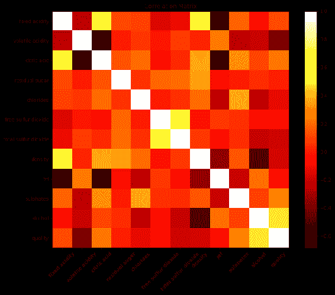

## 使用面向对象的 API 绘制补丁

Matplotlib 使用补丁和集合类提供了一些特殊类型的图。 在本秘籍中，我们将学习如何使用面向对象的 API 使用`patches`。 在下一个秘籍中，我们将学习`collections`。

## 准备

我们将需要为该秘籍导入以下库：

```py
from IPython.core.display import display
from matplotlib.backends import backend_agg
from matplotlib.patches import Ellipse, Polygon
```

## 操作步骤

以下代码块在同一图中将两个补丁绘制为单独的图：

1.  使用`figure_manager`定义图形及其大小，然后将其附加到画布上：

```py
figure_manager = backend_agg.new_figure_manager(1, figsize=(12,6))
fig = figure_manager.canvas.figure
```

2.  定义第一个轴域并在其上绘制一个椭圆形色块：

```py
axs1 = fig.add_subplot(121)
axs1.add_patch(Ellipse((3, 1.0), 4, 1.0, hatch='/', facecolor='g')) 

## centre=(3, 1.0), width=4, height=1.0
axs1.set_xlim((0, 6))
axs1.set_ylim((0, 2.5))
```

3.  定义第二个轴域并在其上绘制一个补丁：

```py
axs2 = fig.add_subplot(122)
axs2.add_patch(Polygon([[0, 0], [4, 1.1], [6, 2.5], [2, 1.4]], 
               color='b', lw=5, fill=False, hatch='+*'))
axs2.set_xlim((0, 6))
axs2.set_ylim((0, 2.5))
```

4.  在屏幕上显示该图：

```py
display(fig)
```

## 工作原理

以下是上述代码及其工作方式的说明：

*   为了定义图形和画布，我们在本秘籍中使用另一种方法`new_figure_manager()`，只是为了演示 Matplotlib 提供的多种选项。 我们也可以使用与先前秘籍相同的方法。 这种方法更适合于循环处理多个图形。 它使用参数作为图形编号和图形大小。
*   `fig.add_subplot(121)`实例化第一个图形的第一个轴域。
*   `axs1.add_patch(Ellipse((3, 1.0), 4, 1.0, hatch='/', facecolor='g'))`在`axs1`上添加了椭圆形补丁。`(3, 1.0)`定义椭圆中心的坐标；`4`是椭圆的宽度，`1.0`是椭圆的高度。`facecolor`指定填充色块的颜色，`hatch`指定椭圆内部的填充图案。
*   `axs1.set_xlim((0, 6))`和`axs1.set_ylim((0, 2.5))`定义 *x* 和 *y* 轴的限制。 如果没有定义这些限制，将不会绘制补丁，因为它不知道确切地将补丁放置在坐标系中的什么位置。
*   `axs2.add_patch(Polygon([[0, 0], [4, 1.1], [6, 2.5], [2, 1.4]], color='b', lw=5, fill=False, hatch='+*'))`在`axs2`上绘制多边形补丁：
    *   由四点的`x, y`坐标指定
    *   `fill=False`指定补丁内的区域不应填充任何颜色
    *   与`lw=5`类似，`color='b'`用于多边形的边缘
    *   在这里，我们为`hatch`使用`+*`字符

这是输出图：

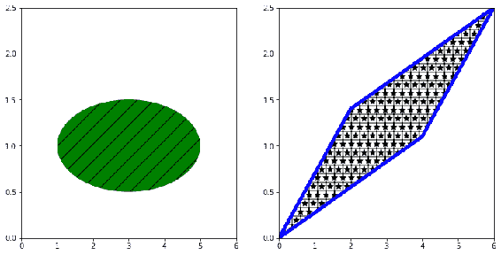

## 使用面向对象的 API 绘制集合

`collections`是包含许多属性的相似对象的容器。

## 准备

导入所需的库：

```py
from matplotlib import collections
from IPython.core.display import display
from matplotlib.backends import backend_agg
import numpy as np
```

## 操作步骤

以下代码块绘制了一组多边形，这些多边形在给定数量的大小和给定的颜色列表之间循环：

1.  定义用于绘制多边形集合的数据：

```py
nsizes = 50  #number of different sizes to be used to plot the items in the collection
npts = 100   # number of items in the collection
r = np.arange(nsizes)
theta = np.linspace(0, 2*np.pi, nsizes)
xx = r * np.sin(theta)
```

2.  绘制集合项的偏移坐标：

```py
rs = np.random.RandomState([125])
xo = rs.randn(npts)
yo = rs.randn(npts)
xyo = list(zip(xo, yo))
```

3.  定义图形大小并将其附加到画布上，并在此图形上定义一个轴域：

```py
figure_manager = backend_agg.new_figure_manager(1, figsize=(8,6))
fig = figure_manager.canvas.figure
axs1 = fig.add_subplot(111)
```

4.  绘制六面正多边形作为集合：

```py
col = collections.RegularPolyCollection(6, sizes=np.fabs(xx) * 20, 
      offsets=xyo, transOffset=axs1.transData)
axs1.add_collection(col, autolim=True)
```

5.  列出要循环的`colors`：

```py
colors = ['b', 'g', 'r', 'c', 'm', 'y', 'k', 'w', 'tab:blue', 
          'tab:orange', 'tab:green', 'tab:red', 
          'tab:purple', 'tab:brown', 'tab:pink', 'tab:gray', 
          'tab:olive', 'tab:cyan']
col.set_color(colors)
```

6.  设置标题和`autoscale_view`以调整两个轴上的比例：

```py
axs1.autoscale_view()
axs1.set_title('RegularPolyCollection')
```

7.  在屏幕上显示该图：

```py
display(fig)
```

## 工作原理

这是代码的说明：

*   `nsizes`和`npts`指定集合中的大小数和项目数。 如果剩余点的`nsizes`小于`npts`，则`nsizes`将从头开始，循环继续进行。 颜色也是如此。
*   `xx = r * np.sin(theta)`计算所有`nsizes`的实际大小。
*   `xyo = list(zip(xo, yo))`为集合中的每个项目计算 *x* 和 *y* 坐标。`zip`是一个 Python 函数，它从两个或多个列表中获取项目，并创建两个或多个元组。
*   `col = collections.RegularPolyCollection()`创建多边形的集合。 数字`6`是多边形的边数，`np.fabs()`将`xx`中的所有数字转换为其绝对值（因为大小不能为负），`offsets=xy0`指定实际坐标，其中多边形将被绘制。`axs1.transData`是坐标系的内部表示，其解释超出了本书的范围。
*   `axs1.add_collection(col, autolim=True)`将集合对象连接到定义的轴域`axs1`，`autolim=True`确保调整轴限制，以使整个集合都在该范围内。
*   `col.set_color(colors)`指定要循环显示的颜色列表，以覆盖集合中的所有项目。

输出图如下所示：

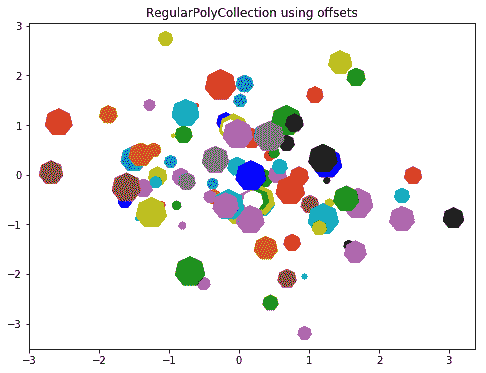