# 七、以不同格式保存图形

在本章中，我们将学习如何使用以下秘籍将图形保存为可以打印或嵌入其他应用的各种格式：

*   以多种格式保存图形
*   保存图形时避免截断
*   保存部分图形
*   管理图像分辨率
*   管理 Web 应用的透明度
*   创建多页 PDF 报告

## 介绍

Matplotlib 创建的报告和仪表板可以以不同的方式使用。 它们可以在上游 Web 应用中使用，它们可以作为 PDF 文件分发，可以嵌入到 GUI 工具箱中，或者可以交互方式在线使用。

在本章中，我们将学习如何以各种格式保存报告，以便可以将它们分发给使用者以直接使用（例如 PDF 格式），也可以嵌入到其他应用（例如 GUI 工具箱）中。

## 以多种格式保存图形

Matplotlib 支持 PNG，SVG，SVGZ，PDF，PS 和 EPS 格式以保存图形。 我们需要在计算机上拥有各自的阅读器，才能查看这些输出格式。 在本秘籍中，我们将学习如何以所有这些格式保存直方图。

## 准备

导入所需的库：

```py
import matplotlib.pyplot as plt
import numpy as np
```

## 操作步骤

以下代码块绘制了一个直方图，并将其保存为 Matplotlib 支持的所有格式：

1.  设置可重复性的种子，并使用大小定义图形：

```py
np.random.seed(19681211)
plt.figure(figsize=(6,4))
```

2.  定义直方图的数据，对其进行绘制，然后将`ylabel`设置为`histogram`：

```py
nd = np.random.normal(25, 5, 10000)
plt.hist(nd)
plt.ylabel('histogram')
```

3.  创建所有受支持的文件扩展名的列表：

```py
file_ext = ['png', 'pdf', 'svg', 'svgz','eps','ps']
```

4.  使用`for`循环将图形保存为以下每种文件格式，然后在屏幕上显示图形：

```py
for extension in file_ext:
    print('saving Histogram.%s ' % (extension))
    plt.savefig('Histogram.%s' % (extension), dpi=300)
plt.show()
```

## 工作原理

这是代码的说明：

*   `plt.hist(nd)`绘制带有随机生成的`nd`数据的直方图。
*   `plt.ylabel('histogram')`将 *y* 轴标记为`histogram`。
*   `file_ext`是所有支持的文件格式的列表。
*   `for`循环显示以所有格式保存的图形。
*   `plt.savefig()`将图形保存为名称`Histogram.file_ext`，例如`Histogram.png`，`Histogram.pdf`等。
*   `plt.savefig()`类似于在屏幕上显示图形的`plt.show()`，而`plt.savefig()`以指定的格式将图形发送到工作目录。

您可以在同一个会话中使用这两种方法，就像我们在此处所做的那样，以便它将指定格式的文件保存到工作目录中，并在屏幕上显示它。

您可以打开保存在工作目录中的文件并查看保存的图形的外观时，我们已裁剪了 PDF，SVG 和 PNG 格式的图像，并在此处显示以供参考。 打开并查看相应的文件时，应该看到以下屏幕截图：

请注意，标题不属于所保存的图像； 它们已添加到图像上，以显示哪个图像属于哪种输出格式。


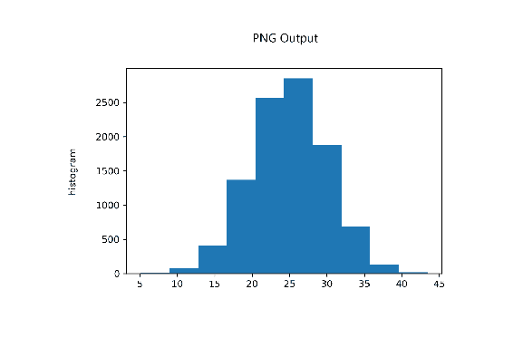

## 更多

在`plt.savefig()`调用中，可以使用`facecolor`和`edgecolor`和许多其他选项来修改图形，然后再将其保存为所选格式。 我们将在以下秘籍中探讨其中一些内容。

默认情况下，Matplotlib 查看文件名中指定的文件扩展名，以决定图形需要保存的格式。 您也可以使用·参数指定输出格式，在这种情况下，它将忽略指定的文件扩展名，并以·参数指定的格式保存图形。 但是，当您尝试打开文件阅读器时，文件阅读器可能会与文件扩展名不匹配以及其实际保存格式混淆。

## 保存图形时避免截断

当您使用所有默认选项保存图形时，有时它可能会被截断。 在本秘籍中，我们将学习如何避免此类问题。

## 准备

导入所需的库：

```py
import matplotlib.pyplot as plt
import numpy as np
```

## 操作步骤

以下代码块绘制了一个直方图，并使用`bbox_inches='tight'`参数将其保存为默认参数，然后添加`pad_inches=1`：

1.  设置可重复性的种子，并用`figsize`定义`figure`：

```py
np.random.seed(19681211)
plt.figure(figsize=(6,4))
```

2.  定义直方图的数据，绘制直方图，然后设置`ylabel`：

```py
nd = np.random.normal(25, 5, 10000)
plt.hist(nd)
plt.ylabel('histogram', labelpad=20)
```

3.  创建所有受支持的文件格式的列表：

```py
file_ext = ['png', 'pdf', 'svg', 'svgz','eps','ps']
```

4.  对于每个文件扩展名，使用`bbox_inches='tight'`参数并添加`pad_inches=1`参数将图形保存为默认模式：

```py
for extension in file_ext:
    print('saving Histogram_truncated.%s ' % (extension))
    plt.savefig('Histogram_truncated.%s' % (extension), dpi=300)

    print('saving Histogram_tight.%s ' % (extension))
    plt.savefig('Histogram_tight.%s' % (extension), dpi=300, 
                 bbox_inches='tight')

    print('saving Histogram_tight_padded.%s ' % (extension))
    plt.savefig('Histogram_tight_padded.%s' % (extension), dpi=300, 
                 bbox_inches='tight', pad_inches=1)

plt.show()
```

## 工作原理

这是代码的解释：

*   `plt.ylabel('histogram', labelpad=20)`将`ylable`绘制为`'histogram'`，并将其从 *y* 轴轴线放置 20 个单位。
*   当`yticklabels`长时需要这样做，以使`ylabel`与`yticklabels`不重叠。
*   但是，保存图形时可能会导致截断，如以下图像所示，再次从此代码生成的各个输出文件中提取了图形。

前面的代码生成以下输出：

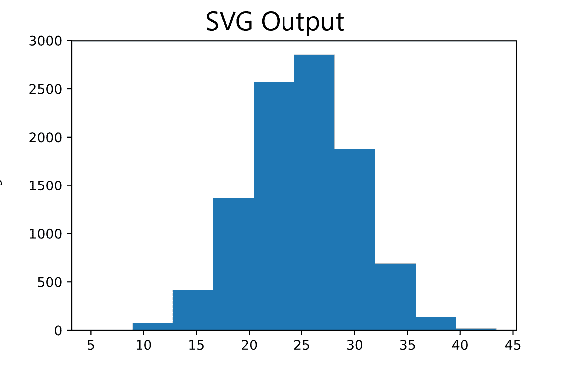

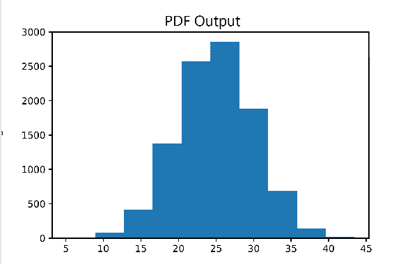


请注意，所有输出格式都缺少`ylabel`！

现在让我们看一下在`plt.savefig()`方法上使用`bbox_inches='tight'`参数时生成的输出。 这实质上是尝试使整个图适合输出中包括标签文本的整个图形。 现在，您可以在 *y* 轴上看到直方图标签：

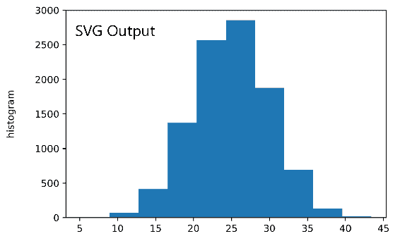

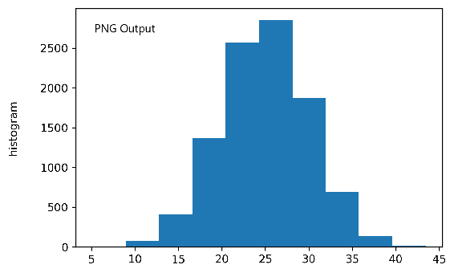

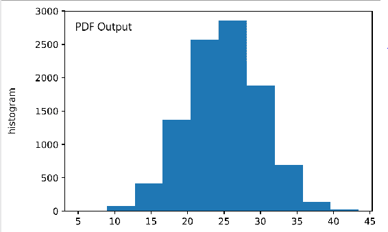

但是，如果`ylabel`与 *y* 轴轴线相距太远，则即使此参数也无法避免截断。 您可以尝试更改`labelpad=30`而不是 20，然后尝试保存该图。

从图中可以看到，上图太紧密地插入到输出中，沿外部边界没有太多空间。 这就是为什么我们必须将标题放在框内； 与之前不同，我们可以将标题放在方框上方！

因此，为了在边界上创建一些额外的空间，我们使用`pad_inches=1`参数。 让我们看一下添加此选项后的输出图形：

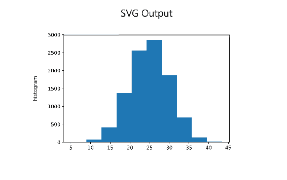

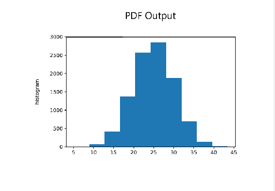


现在，您可以在框的所有侧面看到更多的空间。

## 保存部分图形

有时，我们可能只想保存图形的一部分，尤其是当图形具有多个网格时。 在本秘籍中，我们将学习如何做。

## 准备

导入所需的库：

```py
import numpy as np
import matplotlib.pyplot as plt
from matplotlib.transforms import Bbox
```

## 操作步骤

以下代码块在同一图中的两个轴域上绘制了极坐标图和直方图。 然后，它分别保存每个图，以演示保存图的一部分而不是整个图：

1.  设置可重复性的种子并定义图：

```py
np.random.seed(19681211)
plt.figure(figsize=(8, 6))
```

2.  准备用于绘制极坐标图的数据：

```py
N = 250
r = 10 * np.random.rand(N)
theta = 2 * np.pi * np.random.rand(N)
area = r**2 
colors = theta
```

3.  在第一个轴域上绘制极坐标图：

```py
ax1 = plt.subplot(121, projection='polar')
ax1.scatter(theta, r, c=colors, s=area, cmap='plasma', alpha=0.6)
ax1.set_title('Polar Plot', color='m', size=15, weight='bold')
```

4.  在第二个轴域上绘制直方图：

```py
ax2 = plt.subplot(122)
nd = np.random.normal(25, 5, 10000)
ax2.hist(nd, color='c', alpha=0.6)
ax2.set_title('Histogram', color='b', size=15, weight='bold')
```

5.  调整绘图之间的空间，以确保没有重叠：

```py
plt.tight_layout(pad=5, w_pad=2)
```

6.  标记要保存区域的边界，并以 PNG 和 PDF 格式保存该区域：

```py
bounds = np.array([[0.0,0.0], [4.1, 6.0]])
plt.savefig('polar.png', bbox_inches=Bbox(bounds)) 
plt.savefig('polar.pdf', bbox_inches=Bbox(bounds))
```

7.  标记图的剩余区域的边界以单独保存：

```py
bounds = np.array([[3.9,0.0], [8.0, 6.0]])
plt.savefig('hist.png', bbox_inches=Bbox(bounds)) 
plt.savefig('hist.pdf', bbox_inches=Bbox(bounds))
```

8.  在屏幕上显示该图并清除画布区域：

```py
plt.show()
plt.close()
```

## 工作原理

这是代码的说明：

*   `ax1.scatter()`绘制极坐标图。
*   `ax2.hist()`都在一张图中绘制直方图。

您应该看到如下图：

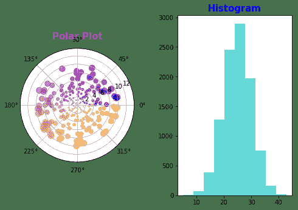

*   `bounds = np.array([[0.0,0.0], [4.1, 6.0]])`指定要保存的图形的边界。 它们代表要保存区域的左下角和右上角，并且它们在图形坐标系中。
*   我们指定了`figsize=(8,6), [[0.0,0.0], [4.1, 6.0]] `，它代表图的左侧，`[3.9,0.0], [8.0, 6.0]]`代表图的右半部分。

首先，让我们看一下极性和直方图输出的 PDF 版本：

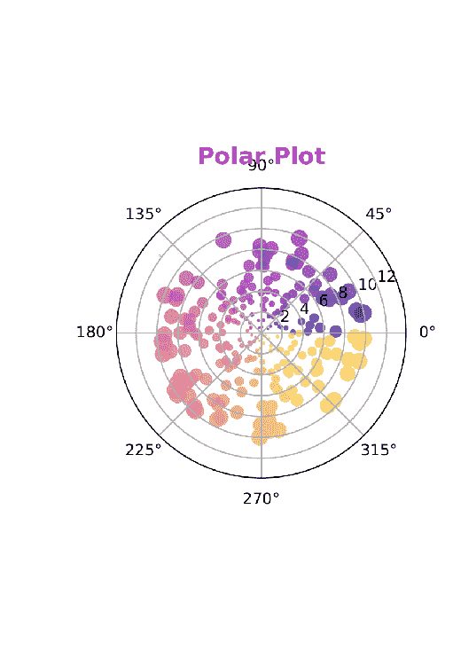

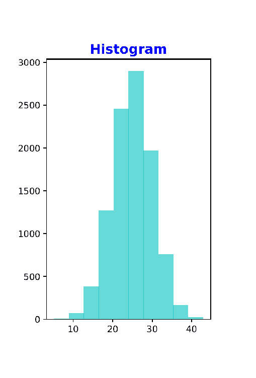

现在，让我们看一下极坐标和直方图的 PNG 版本。 在这里，极坐标图从圆到椭圆有点失真：

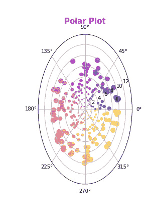


## 管理图像分辨率

当输出文件中的图形需要打印在纸上时，打印输出的质量很重要。 关于照片购物的详细说明超出了本书的范围，但在这里我们将进行足够的介绍，以了解可用的参数，同时保存会影响打印输出质量的图形。

打印输出的质量取决于图像（保存的图像）中的像素数量，要在其上打印纸张的页面大小以及打印机分辨率。

通常，图像中的像素数取决于相机的分辨率，例如 5MP，7MP，10MP 等。 纸张大小由称为**每英寸像素**（**PPI**）的设置控制。 像素是图像的最小可测量元素，并且是微小的小正方形。 如果我们有一个`600 x 400`像素的图像，并使用 100 PPI，则纸张大小将为`6 x 4`英寸。 这就是用给定数量的像素，PPI 和以英寸为单位的大小创建图像的方式。

当要打印图像时，打印机具有另一种影响打印输出质量的分辨率，称为**每英寸点数**（**DPI**）。 它以英寸的长度（宽度相同）指定打印机需要喷射的墨水点数。 DPI 越高，一英寸长度内的墨水量越大，因此打印输出的质量越好。

因此，PPI 是创建图像时使用的分辨率的输入端。 DPI 是打印图像时使用的分辨率的输出端。 对于给定的设备，PPI 和 DPI 由制造商预先确定； 例如，计算机显示器具有固定的 PPI，而打印机具有固定的 DPI。

`plt.savefig()`方法具有`dpi`参数，该参数与图形大小一起以像素数确定图像（图形）的大小。 在这里，DPI 是错误的称呼； 理想情况下，它应该是 PPI。

## 准备

导入所需的库：

```py
import matplotlib.pyplot as plt
import numpy as np
```

## 操作步骤

以下代码块绘制了一个直方图，并保存了两个不同的`dpi`参数以进行比较：

1.  设置种子并准备用于绘制直方图的数据：

```py
np.random.seed(19681211)
nd = np.random.normal(25, 5, 10000)
```

2.  用大小定义图并在其上绘制直方图：

```py
plt.figure(figsize=(6,4))
plt.hist(nd)
```

3.  在图上绘制网格线：

```py
plt.grid()
```

4.  使用`300` DPI 将图形保存为 PNG 格式，并将其显示在屏幕上：

```py
plt.savefig('histogram_300.png', dpi=300)
plt.show()
```

5.  定义另一个更大的图形，绘制直方图，并使用`100` DPI 将其保存为 PNG 格式：

```py
plt.figure(figsize=(18,12))
plt.hist(nd)
plt.grid()
plt.savefig('histogram_100.png', dpi=100)
plt.show()
```

## 工作原理

这是代码的说明：

*   `plt.figure(figsize=(6,4))`将图形大小设置为`6 x 4`。
*   `plt.hist(nd)`绘制直方图。
*   由于我们使用的是`dpi=300`，它将创建具有`1,800 x 1200`像素（`6 * 300 x 4 * 300`）的图形图像。

`histogram_300.png`中保存的图形如下：


如果必须在`100` DPI 打印相同的`1800 x 1200`像素图形，则需要`18 x 12`的图形大小。我们再次使用`18 x 12`的大小和`dpi=100`保存图形。 这是保存的输出的外观：

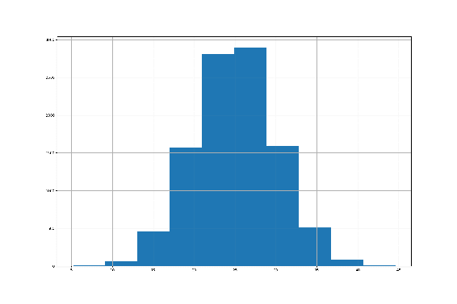

应该注意的是，与我们之前用`dpi=300`和`figsize=(6, 4)`保存的图形相比，刻度标签和网格线已经变得更小。 当您在较小的区域上展开相同数量的像素（宽度和高度）时，像素的密度将很高，质量也将很高。 因此，在创建和保存图形时，请选择图形大小和 DPI 设置以根据所需打印输出的质量为图形的宽度和高度创建尽可能多的像素。 宽度和高度的像素数越高，打印输出的质量越好。

## 管理 Web 应用的透明度

通常，Matplotlib 绘图和图形默认情况下具有白色背景，可以使用`facecolor`参数将其更改为我们想要的任何颜色。 如果我们必须将这些数字嵌入到其他任何应用中，则该背景色将保留下来。 但是，Matplotlib `savefig()`方法提供了一个选项，可以使用透明参数来保存没有此背景色的图形。 在本秘籍中，我们将学习如何使用此选项。

## 准备

我们将绘制四个图，将它们保存为普通模式和透明选项，然后将其嵌入 HTML 页面中以查看它们的外观。

导入所需的库：

```py
import matplotlib.pyplot as plt
import numpy as np
import pandas as pd
```

## 操作步骤

以下代码块绘制了四个图形，并将它们保存为`.png`格式：

1.  设置可重复性的种子：

```py
np.random.seed(19681211)
```

2.  准备极坐标图的数据：

```py
N = 250
r = np.random.rand(N)
theta = 2 * np.pi * np.random.rand(N)
area = 500 * r**2
colors = theta
```

3.  用`size`定义图形并绘制极坐标图：

```py
plt.figure(figsize=(6,4))
ax = plt.subplot(111, projection='polar')
c = ax.scatter(theta, r, c=colors, s=area, cmap='plasma', alpha=0.6)
plt.title('Polar Plot', color='m', size=15, weight='bold')
```

4.  将图形保存为 PNG 格式，并将`transparent`设置为`True`，然后在屏幕上显示该图形：

```py
plt.savefig('polar_transparent.png', dpi=300, transparent=True)
plt.show()
```

5.  使用`size`定义另一个图形，准备直方图的数据，然后绘制它：

```py
plt.figure(figsize=(6,4))
nd = np.random.normal(25, 5, 10000)
plt.hist(nd, color='c', alpha=0.6)
plt.title('Histogram', color='b', size=15, weight='bold')
```

6.  将图形保存为 PNG 格式，并将`transparent`设置为`True`：

```py
plt.savefig('Histogram_Transparent.png', dpi=300, transparent=True)
```

7.  使用`size`定义另一个图，准备饼图数据并绘制：

```py
plt.figure(figsize=(6,4))
labels = ['grocery', 'transportation', 'apparel', 'education', 
          'capital', 'savings', 'others']
percentage = [15, 5, 19, 8, 30, 13, 10]
explode = [0, 0, 0, 0, 0.1, 0, 0]
plt.pie(percentage, labels=labels, explode=explode, 
        autopct='%.1f%%', shadow=True)
plt.title('Pie Chart', color='r', size=15, weight='bold')
plt.axis('equal')
```

8.  以 PNG 格式保存图形并将`transparent`设置为`True`：

```py
plt.savefig('Pie_Transparent.png', dpi=300, transparent=True)
plt.show()
```

9.  使用`size`定义另一个图形，读取`Iris`数据集，并绘制`Iris`簇：

```py
plt.figure(figsize=(6,4))
iris = pd.read_csv('iris_dataset.csv', delimiter=',')
x,y = iris['petal_length'], iris['petal_width']
classes = set(iris['species'])
for name in classes:
    index = iris['species'] == name
    plt.scatter(x[index], y[index], s=20*x[index]*y[index], marker='o', label=name, alpha=0.6)
plt.legend()
plt.title('Iris Classification', color='g', size=15, weight='bold')
```

10.  将图形保存为 PNG 格式，并将`transparent`设置为`True`：

```py
plt.savefig('iris_Transparent.png', dpi=300, transparent=True)
plt.show()
```

## 工作原理

所有这些图对我们来说已经很熟悉了，因此无需解释绘制它们的代码。 但是，以下是保存绘图的代码的说明：

*   `plt.savefig('polar_transparent.png', dpi=300, transparent=True)`保存图形。
*   `transparent=True`使您可以在没有任何背景颜色的情况下打印图表。
*   该参数的默认值为`False`。
*   当您要将这些图形嵌入到具有所需背景的任何应用中时，请使用`transparent=True`选项保存图形。
*   我们还保存了没有`transparent=True`选项的这些数字，并以`_opaque`而不是`_transparent`命名它们。
*   然后，我们将它们嵌入到两个 html 页面中。 我们用作浅蓝色作为 HTML 页面的背景色。

以下是 HTML 页面的图像，其中我们没有使用`transparent=True`选项来保存图形：


以下是 HTML 页面的图像，我们在其中使用了`transparent=True`选项来保存图形：

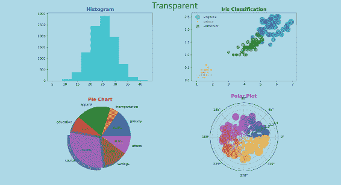

从 HTML 页面可以看出，在第一个 HTML 页面中继承的白色背景和 HTML 背景颜色在图的边界之外，在图的边界内可见。

在第二个 HTML 页面中，绘图没有任何背景色，因此 HTML 背景颜色在每个绘图中均可见。

## 创建多页 PDF 报告

在本秘籍中，我们将学习如何创建包含多张包含多个图形的多页 PDF 文档。 如果您必须为特定用户或部门创建一堆报告并将其作为一个文档发送，这将很方便。

## 准备

我们将创建三个图形，每个图形有两个图，并将每个图形放置在 PDF 文档的一页中。

让我们导入所需的库：

```py
import datetime
import numpy as np
import pandas as pd
from matplotlib.backends.backend_pdf import PdfPages
import matplotlib.pyplot as plt
import calendar
```

## 操作步骤

以下代码块绘制了所需的图表，并将它们作为三个单独的页面保存到 PDF 文档中。 所有这些图都已在较早的章节中使用过，因此绘制每个图的细节已经为您所熟悉。 在这里，重点是如何排列这些图表以将其保存在 PDF 文档的各个页面中：

1.  设置可重复性的种子：

```py
np.random.seed(19681211)
```

2.  定义一个绘制极坐标图的函数：

```py
def Plot_Polar():
    plt.figure(figsize=(6, 4))
    N = 250
    r = 10 * np.random.rand(N)
    theta = 2 * np.pi * np.random.rand(N)
    area = r**2 
    colors = theta
    ax1 = plt.subplot(121, projection='polar')
    ax1.scatter(theta, r, c=colors, s=area, cmap='plasma', 
                alpha=0.6)
    ax1.set_title('Polar Plot', color='m', size=15, weight='bold') 
```

3.  定义一个函数来绘制直方图：

```py
def Plot_Histogram():
    ax2 = plt.subplot(122)
    nd = np.random.normal(25, 5, 10000)
    n, bins, patches = ax2.hist(nd, color='c', alpha=0.6)
    n, bins, patches = ax2.hist(nd, color='c', alpha=0.6, density=1)
    mu, sigma = 25, 5
    y = ((1 / (np.sqrt(2 * np.pi) * sigma)) * np.exp(-0.5 * (1 / 
          sigma * (bins - mu))**2))
    ax2.plot(bins, y, '--')
    ax2.set_title('Histogram', color='b', size=15, weight='bold')
```

4.  定义一个绘制饼图的函数：

```py
def Plot_Pie():
    plt.figure(figsize=(8, 6))
    ax1 = plt.subplot(121)
    labels = ['grocery', 'transportation', 'apparel', 'education', 
              'capital', 'savings', 'others']
    percentage = [15, 5, 19, 8, 30, 13, 10]
    explode = [0, 0, 0, 0, 0.1, 0, 0]
    ax1.pie(percentage, labels=labels, explode=explode, 
            autopct='%.1f%%', shadow=True)
    ax1.set_title('Expenses Pie Chart', color='r', size=15, 
                   weight='bold')
    ax1.axis('equal')
```

5.  定义一个函数以绘制`Iris`群集图：

```py
def Plot_iris():
    ax2 = plt.subplot(122)
    iris = pd.read_csv('iris_dataset.csv', delimiter=',')
    x,y = iris['petal_length'], iris['petal_width']
    classes = set(iris['species'])
    for name in classes:
        index = iris['species'] == name
        ax2.scatter(x[index], y[index], s=20*x[index]*y[index], 
                    marker='o', label=name, alpha=0.6)
    ax2.legend()
    ax2.set_title('Iris Classification', color='g', size=15, 
                   weight='bold')
```

6.  定义一个绘制条形图的函数：

```py
def Plot_Bar():
    fig = plt.figure(figsize=(10, 8))
    ax1 = plt.subplot(121)
    month_num = [1, 2, 3, 4, 5, 6, 7, 8, 9, 10, 11, 12]
    units_sold = [500, 600, 750, 900, 1100, 1050, 1000, 950, 800, 
                  700, 550, 450]
    plot = ax1.bar(month_num, units_sold)
    plt.xticks(np.arange(12)+1, calendar.month_name[1:13], 
               rotation=75)
    for rect in plot:
        height = rect.get_height()
        ax1.text(rect.get_x() + rect.get_width()/2., 
                 1.002*height,'%d' % int(height), 
                 ha='center', va='bottom')
    ax1.set_title('Batteries Sold', color='y', size=15, 
                   weight='bold')
    return fig
```

7.  定义一个绘制流图的函数：

```py
def Plot_Steamplot(fig):
    ax2 = plt.subplot(122)
    x, y = np.linspace(-3,3,100), np.linspace(-2,4,50)
    X, Y = np.meshgrid(x, y)
    U = 1 - X**2 
    V = 1 + Y**2 
    speed = np.sqrt(U*U + V*V)
    # Varying line width along a streamline
    lw = 5*speed / speed.max()
    strm = ax2.streamplot(X, Y, U, V, density=[0.5, 1], color=V, 
                          linewidth=lw)
    fig.colorbar(strm.lines, plt.axes([0.95, 0.125, 0.03, 0.75]))
    ax2.set_title('Varying Density, Color and Line Width')
```

8.  定义一个函数来更新文档属性：

```py
def Set_Doc_Properties():
    doc_prop = pdf.infodict()
    doc_prop['Title'] = 'Multipage PDF Reports'
    doc_prop['Author'] = 'P Srinivasa Rao'
    doc_prop['Subject'] = 'saving matplotlib plots in a pdf 
                           document'
    doc_prop['Keywords'] = 'PdfPages multipage author title subject'
    doc_prop['CreationDate'] = datetime.datetime(2018, 7, 24)
    doc_prop['ModDate'] = datetime.datetime.today()
```

9.  定义用于创建多页 PDF 报告的主程序：

```py
with PdfPages('pdf_reports.pdf') as pdf:
    # Page1
    Plot_Polar()
    Plot_Histogram()
    plt.suptitle('Page One', color='C5', size=20, weight='bold')
    plt.tight_layout(pad=5, w_pad=2)
    pdf.attach_note("polar & histogram")
    pdf.savefig(dpi=300) 
    plt.show()
    plt.close()

    # Page2
    Plot_Pie()
    Plot_iris()
    plt.suptitle('Page Two', color='C8', size=20, weight='bold')
    pdf.attach_note("pie and scatter")
    plt.tight_layout(pad=5, w_pad=10)
    pdf.savefig(dpi=300) 
    plt.show()
    plt.close()

    # Page3
    fig = Plot_Bar()
    Plot_Steamplot(fig)
    plt.suptitle('Page Three', color='C9', size=20, weight='bold')
    pdf.attach_note("bar & stream")
    pdf.savefig(dpi=300) 
    plt.show()
    plt.close()

    # Set document properties
    Set_Doc_Properties()
```

## 工作原理

这是代码的说明：

*   `PdfPages()`是有助于创建 PDF 文档的包。
*   `with PdfPages('pdf_reports.pdf') as pdf`是 Python 上下文，在我们将多个图形保存到此 PDF 文档中时，它负责文件的打开和关闭。`pdf_reports.pdf`文件是保存数字的文件。
*   `plt.figure(figsize=(6, 4))`定义大小为`(6, 4)`的第一个图形：
    *   `ax1.scatter(theta, r, c=colors, s=area, cmap='plasma', alpha=0.6)`在第一个轴域上绘制极坐标图。
    *   `ax2.hist(nd, color='c', alpha=0.6, density=1)`在第二轴域上绘制直方图。
    *   `ax2.plot(bins, y, '--')`在同一轴域上绘制了直方图的最佳拟合概率密度函数。
    *   `plt.suptitle('Page One', color='C5', size=20, weight='bold')`绘制具有已定义属性的图形标题（第一页）。
    *   `pdf.attach_note("polar & histogram")`按照参数中的说明为该页面编写标注，当我们打开 PDF 文档页面作为标注时，该标注将可见。
    *   `pdf.savefig(dpi=300)`将具有`dpi=300`的当前图形保存到上下文中指定的 PDF 文档中。
    *   `plt.show()`在屏幕输出上显示数字。
    *   `plt.close()`关闭图形并清理绘图区域，以便可以开始下一个图形。
*   `plt.figure(figsize=(8, 6))`定义第二个图形，其大小为`(8, 6)`：
    *   `ax1.pie(percentage, labels=labels, explode=explode,  autopct='%.1f%%', shadow=True)`在第一个轴域上绘制了支出饼图。
    *   `ax2.scatter(x[index], y[index], s=20*x[index]*y[index], marker='o', label=name, alpha=0.6)`在第二轴域上绘制了鸢尾花的散布图。
    *   `plt.suptitle('Page Two', color='C8', size=20, weight='bold')`绘制图形的标题（`Page Two`）。
    *   `pdf.savefig(dpi=300)`将图形保存到下一页上的相同 PDF 文档。
    *   `plt.show()`将图形显示在屏幕上。
    *   `plt.close()`关闭图形并清除下一个图形的绘图区域。
*   `fig = plt.figure(figsize=(10, 8))`定义大小为`(10, 8)`的下一个图形：

    *   `plot = ax1.bar(month_num, units_sold)`在一个轴域上绘制条形图。
    *   `ax1.text()`在每个条形上写入单位数。
    *   `ax2.streamplot(X, Y, U, V, density=[0.5, 1], color=V, linewidth=lw)`在两个轴域上绘制流图。
    *   `fig.colorbar(strm.lines, plt.axes([0.95, 0.125, 0.03, 0.75]))`绘制流图的颜色条。
    *   `plt.suptitle('Page Three', color='C9', size=20, weight='bold')`设置图形的标题（`Page Three`）：

*   `doc_prop = pdf.infodict()`实例化包含文档属性的字典，当我们打开 PDF 文档时可以在属性中看到。 我们保存了`Title`，`Author`，`Subject`，`Keywords`，`CreationDate`和`ModifiedDate`进入该字典，该字典将传递给文档属性。
*   运行此代码后，您应该在工作目录中看到一个名为`pdf_reports.pdf`的 PDF 文档。 如果您打开文档，您应该看到以下三个图为三页。 正如我们在代码中定义的那样，它们每个都有不同的大小：

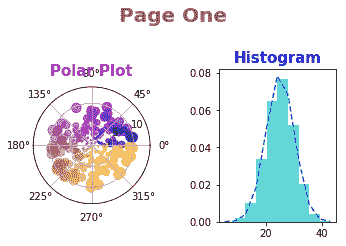

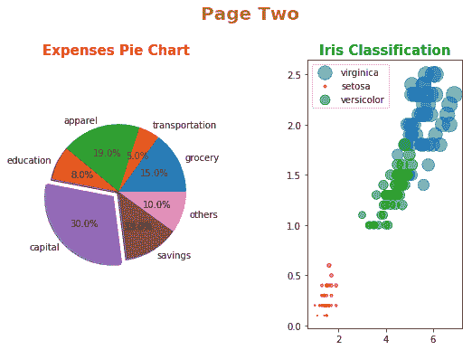

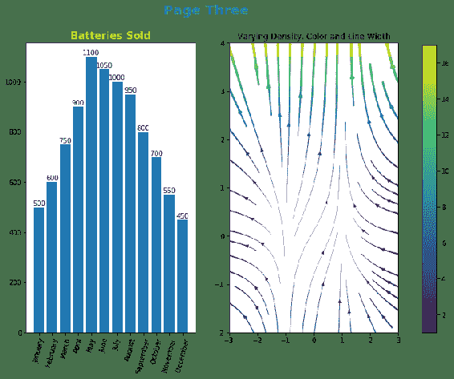