# 八、开发交互式绘图

交互式绘图是一个非常大的主题。 有很多书籍涵盖了它的各个方面。 在本章中，我们将涵盖三个不同的领域，每个领域都有关键秘诀，如下所示：

*   事件和回调：
    *   异常处理
    *   按键和释放事件，用于使图例在保持时间内可见/不可见
    *   按键按下事件，用于进行缩放
    *   运动通知和按键按下事件，用于跟踪坐标
    *   选择活动，用于在选择图例标签后激活艺术家
    *   图形和轴域进入和离开事件，用于更改前景颜色并使艺术家可见/不可见
    *   使用双生轴域绘制四个温度刻度
*   小部件：
    *   光标
    *   按键
    *   复选按键
    *   单选按键
    *   文本框
*   动画：
    *   Sigmoid 动画
    *   将动画保存到 MP4 文件
    *   `tan`函数呈指数衰减
    *   气泡图动画
    *   多个线形图的动画
    *   图像动画

## 介绍

对于交互式绘图，通常的`%matplotlib inline`不起作用，因为它将静态图形输出到屏幕，需要使用 Matplotlib 支持的后端之一。 您可能还记得后端是 Matplotlib 架构的最底层，其中发送了 Matplotlib 创建的输出图进行显示。 后端有两种类型：一种允许用户与输出交互并用于交互式绘图，另一种用于保存图形以供打印或嵌入到其他应用中。

本章中的所有秘籍均通过以下后端进行了测试：

*   `nbAgg`
*   `Qt5Agg`
*   `TkAgg`
*   `WXAgg`

我们已经观察到某些功能不适用于某些后端。

使用以下选项之一激活这些后端中的任何一个：

```py
import matplotlib
matplotlib.use('nbAgg')
```

或使用此：

```py
import matplotlib.pyplot as plt
plt.switch_backend('nbAgg')
```

如果选择第一个选项，则必须在导入`matplotlib.pyplot`模块之前执行此代码，因为`pyplot`模块将加载所选后端所需的所有元素。 默认情况下，`pyplot`会按照和`rcParams`文件的定义加载后端，如果这些语句是在导入`pyplot`之后执行的，则模块可能与此后端冲突。

如果您选择第二个选项，则`pyplot`将通过加载新后端的相关模块将当前后端替换为新后端。 为了使其正常工作，在切换到新后端之前应该已经设置了一些后端。

`nbAgg `是 Jupyter 笔记本使用的标准后端，它显示在笔记本的输出单元中，而其他后端则打开另一个用于输出的弹出窗口。

所有这些交互式后端均提供标准的交互式导航功能，尽管外观略有不同。 Matplotlib 文档位于[这个页面](https://matplotlib.org/users/navigation_toolbar.html)中，提供了各种功能的导航和键盘映射的详细说明。

## 事件和回调

事件是用户与绘图进行交互时所执行的操作，例如鼠标操作，键盘单击或只是在可视化文件上输入和退出图形和轴域。 回调是事件触发时对事件的响应。 程序运行时引发的异常也是事件。 但是，除了`KeyboardInterrupt`以外，大多数都不涉及用户干预。

虽然我们尝试在此处涵盖尽可能多的事件，但要获取受支持事件的完整列表，请参阅 [Matplotlib 文档](https://matplotlib.org/users/event_handling.html)。

## 异常处理

在运行程序的过程中，会引发许多不同的异常。 如果未编写适当的操作，则程序将崩溃，并且需要紧急干预来解决问题并重新启动程序。 在本秘籍中，我们将学习如何处理两个异常`KeyboardInterrupt`和`DivideByZero`及其相应的回调动作。

## 准备

为了模拟异常，我们将开始运行直到异常发生的循环，捕获异常，触发合适的回调响应函数，最后关闭程序。

对于`KeyboardInterrupt`异常，一旦程序启动，您将在笔记本的“输入”单元中看到`*`，单击笔记本顶部的**内核**选项卡，然后按下拉框中的中断选项。

如果 30 秒内没有`KeyboardInterruption`，则它将执行代码，从而导致`DivideByZero`异常。

导入所需的库：

```py
import time
```

## 操作步骤

我们将使用适当的方法编写一个类来模拟循环，并捕获异常和回调函数。 为了便于说明，我们提供了该类中各种方法的逐步说明； 为了执行，您将必须立即采用整个类来运行代码。 请参考本章提供的代码文件：

1.  定义类：

```py
class EventLoop:
```

2.  定义`init`方法以初始化状态变量，并定义`event_handlers`字典，该字典将事件映射到和对应的回调函数：

```py
def __init__(self):
    self.status = None
    self.event_handlers = {"interrupt": self.handle_interrupt,
                           "DivideByZero": self.handle_DivideByZero}
```

3.  定义`start()`方法以运行循环，捕获异常并为每个异常调用对应的回调函数：

```py
def start(self):
    try:
        self.loop()
    except KeyboardInterrupt:
        self.handle_event("interrupt")
    except ZeroDivisionError:
        self.handle_event("DivideByZero")
    finally:
        print('Ending the program')
```

4.  定义创建和运行事件循环的方法：

```py
def loop(self):
    self.status = "loop"
    strt_time = time.time()
    while self.status == "loop":
        elapsed_time = time.time() - strt_time
        if elapsed_time > 30:
            5 / 0
```

5.  定义处理事件/异常的方法：

```py
def handle_event(self, event: str):
    self.event_handlers[event]()
```

6.  为`KeyBoardInterrupt`异常的回调操作定义方法：

```py
def handle_interrupt(self):
    print("Stopping event loop Due to KeyboardInterrupt...")
```

7.  为`DivideByZero`异常的回调操作定义方法：

```py
def handle_DivideByZero(self):
    print("Stopping event loop due to DivideByZero Error...")
```

8.  实例化类对象并调用`start`方法：

```py
el = EventLoop()
el.start()
```

## 工作原理

以下是其工作原理的说明：

*   `class EventLoop:`定义事件循环的类函数。
*   `__init__(self) `是`EventLoop`类对象的初始化函数。 它会初始化`status`变量，并使用两个具有相应回调函数的中断来定义`event_handlers`字典。
*   `start(self)`是启动`EventLoop`，捕获异常并将各自的回调函数路由到的方法：
    *   `try:  self.loop()`运行`loop`方法。
    *   `exceptKeyboardInterrupt: self.handle_event("interrupt") `捕获`KeyBoardInterrupt`，并用`interrupt`参数调用`handle_event`方法。
    *   `exceptZeroDivisionError: self.handle_event("DivideByZero") `捕获`DivideByZero`异常，并使用`DivideByZero`参数调用`handle_event`方法。
    *   `finally: print('Ending the program')`在循环结束时打印`Ending the program`。 即使在发生异常的情况下也会执行此操作，在这种情况下，它将首先执行相应的回调函数，然后执行`finally`子句下的代码。
*   `loop(self)`是运行事件循环直到发生异常之一的方法。 当发生任何指定的异常时，控制就会退出循环，并移至方法中中`except`中指定的异常处理方法：
    *   `self.status`将变量状态设置为等于循环。
    *   `start_time`是循环的开始时间。
    *   `while self.status == "loop":`会启动循环并运行，只要状态保持*循环*或发生异常。
    *   `elapsed_time`是从开始循环开始的时间。
    *   如果没有`KeyboardInterrupt`的时间超过 30 秒，则程序将进入`if loop`的内部，并尝试将五除以零，从而导致`DivideByZero`异常。
*   `def handle_event(self, event: str): self.event_handlers[event]()`是采用异常/事件并在`event_handlers`字典中查找以选择 [ 对应的`callback`方法并对其进行调用。
*   `def handle_interrupt(self): print("Stopping event loop Due to KeyboardInterrupt...")`是`KeyboardInterrupt`异常的`callback`方法。 它仅显示以下消息：由于`KeyboardInterrupt`异常而导致 ， 事件循环停止。
*   `def handle_DivideByZero(self): print("Stopping event loop due to DivideByZero Error...")`是`DivideByZero`异常的`callback`方法。 它仅显示以下消息：由于`DivideByZero`错误， ， 事件循环正在停止。
*   `el = EventLoop()`实例化`EventLoop`对象，`el.start()`调用实例类的`start`方法。

当您运行程序并从内核中断程序时，您应该在输出单元格中看到以下文本：

```py
Stopping event loop Due to KeyboardInterrupt... 
Ending the program
```

当您运行该程序并只是不执行任何操作时，在 30 秒后，您应该在输出单元格中看到以下文本：

```py
Stopping event loop due to DivideByZero Error...
Ending the program
```

## 更多

Python 编程环境中有许多此类异常。 由于它们不涉及任何用户交互，因此它们与交互式绘图无关。 如果您有兴趣，[可以在这里找到关于它们的详尽文献](https://docs.python.org/3/library/exceptions.html#bltin-exceptions)。

## 按下和释放事件

在本秘籍中，我们将学习如何捕获键盘`press`和`release`事件，并使用它们将图例的显示切换为**可见/不可见**并显示按键被按下的时间（按键事件和按键释放事件之间的时间差）。

按下`X`键，保持一段时间，然后松开时，它会将图例的图例状态从可见变为不可见，或相反，并显示时间（单位为秒），在释放之前按住键多长时间。

如果按下，按住和释放任何其他键，则它将不会更改图中的任何内容，但是程序打印按下的键的名称和保持时间到`sysout`。

当使用 Matplotlib 时，我们不需要显式创建事件循环，因为`pyplot`模块会自动处理该功能。 仅当我们使用 Python 代码时才需要它，就像我们在前面的秘籍中所做的那样。

## 准备

导入所需的库并设置后端：

```py
import numpy as np
import matplotlib.pyplot as plt
plt.switch_backend('Qt5Agg')
from time import time
```

## 操作步骤

这是带有图例和标题的`sin`和`cos`函数的绘图，并捕获键盘事件和相关的回调函数以响应键盘事件的代码：

1.  定义一个响应`key_press_event`的回调函数：

```py
def press(event):
    global prst
    prst = time()
    print('press', event.key)
```

2.  定义一个响应`key_release_event`的回调函数：

```py
def release(event):
    relt = time()
    ht = relt - prst
    print('hold time:',round(ht,2))
    if event.key == 'x':
        visible = lg.get_visible()
        lg.set_visible(not visible)
        tm = 'hold time: ' + str(round(ht, 2))
        t = plt.text(np.random.randint(1,4), 
                     np.random.randint(-3,4), tm)
        plt.setp(t, color='r', size=15, weight='bold')
        ax.add_artist(t)
        fig.canvas.draw()
```

3.  准备要绘制的曲线的数据：

```py
x = np.arange(1, 2.6, 0.1) 
y = 3*np.sin(2 * np.pi * x)
y1 = 3*np.cos(2 * np.pi * x) 
```

4.  实例化图形和轴域对象：

```py
fig, ax = plt.subplots()
```

5.  在轴域上绘制曲线：

```py
ax.plot(x ,y, 'go-', label='sin')
ax.plot(x, y1, 'bd-', label='cos')
```

6.  设置图例和标题：

```py
lg = ax.legend(loc='upper center', fontsize=15)
ax.set_title('Press a key', size=25)
```

7.  捕获事件并为每个事件映射回调函数：

```py
fig.canvas.mpl_connect('key_press_event', press)
fig.canvas.mpl_connect('key_release_event', release)
```

8.  在设置的后端上显示该图：

```py
plt.show()
```

## 工作原理

以下是其工作原理的说明：

*   `fig, ax = plt.subplots()`定义并实例化图形对象和轴域对象。
*   `ax.plot(x ,y, 'go-', label='sin')`和`ax.plot(x, y1, 'bd-', label='cos')`绘制正弦和余弦函数。
*   `lg = ax.legend(loc='upper center', fontsize=15)`和`ax.set_title('Press a key', size=25)`设置绘图的图例和标题。 在这里，我们将图例捕获到变量`lg`中，稍后将在回调函数中使用。
*   `fig.canvas.mpl_connect()`是从后端捕获事件并将它们连接到相应的回调函数以响应事件的方法。 这等效于我们在先前秘籍中定义的 ，`handle_event()`函数。
*   `fig.canvas.mpl_connect('key_press_event', press)`会在按下任何键时捕获，并调用`"press"`回调函数。
*   `fig.canvas.mpl_connect('key_release_event', release)`在释放键时捕获，并调用`"release"`回调函数。
*   `press`是`callback`函数，可响应任何按键事件：
    *   回调函数以`event`作为参数，这是 Matplotlib 用来传递可捕获事件特定细节的预定义事件的关键字，在这种情况下，此事件为键的名称。
    *   `global prst`定义一个全局变量`prst`，用于捕获按键按下的时间。 它被定义为全局变量，因为在中需要`release`函数。
    *   `prst = time()`捕获`prst`变量中的当前时间，表示按下该键的时间。
    *   `print('press', event.key)`将被按下的键的名称打印到`sysout`中，您可以在笔记本电脑的输出单元中看到它，它声明为`prst`并具有全局范围，我们不需要将其返回以传递给`release`函数。
*   `release`是另一个响应任何键释放事件的回调函数：
    *   它还将`event`作为第一个参数。
    *   `relt`捕获的当前时间，代表的键释放时间。
    *   `ht`是按键被按下与释放之间经过的保持时间。
    *   `print('hold time:', round(ht,2))`将保持时间打印到`sysout`，将时间四舍五入到小数点后两位。
    *   `if event.key == 'x':`检查所按下的键是否为`x`； 如果是，那么它将执行如下指令集。 否则，它什么都不做：
        *   `lg.get_visible()`获取`lg`图例对象的当前状态`true`或`false`，以指示图例当前可见还是不可见，并将其状态分配给`visible`对象。
        *   `lg.set_visible(not visible)`反转当前状态，这意味着如果可见，则现在不可见，如果不可见，则现在将可见。
        *   `tm = 'hold time: ' + str(round(ht, 2))`准备放置在图形上的保持时间的文本字符串。
        *   `t = plt.text(np.random.randint(1,4), np.random.randint(-3,4), tm)`创建要放置在图形上随机位置的文字艺术家。
        *   `plt.setp(t, color='r', size=15, weight='bold')`将颜色，大小和权重属性设置为先前定义的文本艺术家。
        *   `ax.add_artist(t)`将文本艺术家添加到轴域。
        *   `fig.canvas.draw()`最后在所选后端上显示输出图形。

运行该程序时，您应该在左侧看到该图。 按住`X`键时，应该会显示图例切换，并且保持时间出现在绘图上。 当您按下`G`键时，您应该在绘图上看到网格线。 然后，您应该在此处看到右侧显示的图：

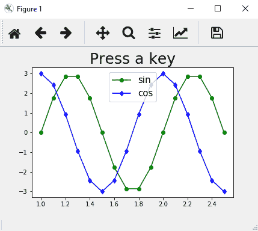

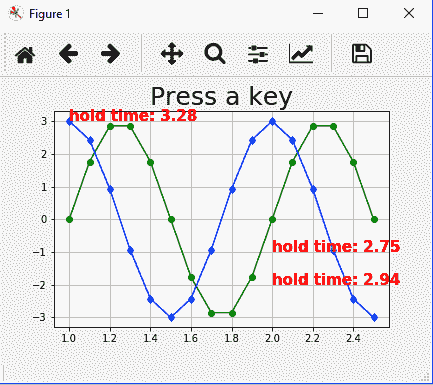

请注意，后端导航具有一些具有特殊功能的键的映射，例如对于主页的`h`，对于主网格的`g`，在 *y* 轴上的对数刻度的`l`，以及用于平移， 缩放，后退，前进，全屏等的一些其他键。 当按下这些键中的任何一个时，您将在绘图上看到其定义的功能，因此请不要与用户定义的功能混淆。 您可能要避免为这些键定义自己的功能，以免发生冲突。

## 鼠标按下事件

在本秘籍中，我们将学习如何捕获鼠标按键按下事件，并使用坐标在主窗口上按下和鼠标按键的点周围缩放绘图，并将其显示在[ 缩放窗口。

## 准备

导入所需的库：

```py
import matplotlib.pyplot as plt
import numpy as np
```

## 操作步骤

以下步骤说明了如何编码和所需逻辑：

1.  在主窗口和缩放窗口中定义图形和轴域：

```py
figmain, axmain = plt.subplots()
figzoom, axzoom = plt.subplots()
```

2.  设置主轴域和缩放轴域的属性：

```py
axmain.set(xlim=(-5, 5), ylim=(-75, 175), autoscale_on=False, title='Click to zoom')
axzoom.set(xlim=(-2, 2), ylim=(-8, 8), autoscale_on=False, title='Zoom window')
```

3.  准备绘图数据：

```py
x = np.arange(-5, 5, 0.1)
y = x ** 3
```

4.  在主轴域和缩放轴域上绘制相同的曲线：

```py
axmain.plot(x, y, 'g-d')
axzoom.plot(x, y, 'b-.o')
```

5.  定义响应鼠标按键按下事件的回调函数：

```py
def onbuttonpress(event):
    if event.button == 1:             # left = 1, scroll=2, right=3
        x, y = event.xdata, event.ydata
        axzoom.set_xlim(x - 1, x + 1)
        axzoom.set_ylim(y - 10, y + 10)
        figzoom.canvas.draw()
```

6.  将按键按下事件连接到回调函数：

```py
figmain.canvas.mpl_connect('button_press_event', onbuttonpress)
```

7.  在指定的后端显示数字：

```py
plt.show()
```

## 工作原理

以下是前面代码的说明：

*   `figmain, axmain = plt.subplots()`定义主窗口的图形和轴域，`figzoom, axzoom = plt.subplots()`定义缩放窗口的图形和轴域。
*   `axmain.set(xlim=(-5, 5), ylim=(-75, 175), autoscale_on=False, title='Click to zoom')`设置属性，例如 *x* 和 *y* 轴限制，自动缩放是打开还是关闭，以及主轴域标题。 `axzoom.set(xlim=(-2, 2), ylim=(-8, 8), autoscale_on=False, title='Zoom window')`为缩放轴域定义了和相同的属性。
*   `x = np.arange(-5, 5, 0.1)`和`y = x ** 3`是用于绘制非线性曲线的数据。
*   `axmain.plot(x, y, 'g-d')`在主轴域上绘制非线性曲线，`axzoom.plot(x, y, 'b-.o')`在变焦轴域上绘制非线性曲线。
*   `onbuttonpress(event)`是响应按键按下事件的回调函数。 通常，`event`是函数接收的参数：
    *   `if event.button == 1:`检查是否按下了左键（滚动按键代码为`2`按键代码为`3`）。 如果是按左键，则执行后续步骤，如下所示。 否则，它将不执行任何操作而完成该函数。
    *   `x, y = event.xdata, event.ydata`捕获绘制点上按下鼠标按键的点的坐标，在数据坐标系中。 应当注意，`event.x`和`event.y`在显示坐标系中具有相同的坐标。
    *   `axzoom.set_xlim(x - 1, x + 1)`将缩放轴域的 *x* 轴限制从按下鼠标键的位置（鼠标单击）设置为`+/-1`。 因此，仅在这些限制内的曲线上的点将出现在缩放窗口中。
    *   `axzoom.set_ylim(y - 10, y + 10)`将缩放轴域的 *y* 轴限制从按下鼠标键的点开始设置为`+/- 10`。 因此，仅在这些限制范围内的曲线上的点将出现在缩放窗口中。
    *   `figzoom.canvas.draw()`用新的限制绘制数字。
*   `figmain.canvas.mpl_connect('button_press_event', onbuttonpress)`捕获按键按下事件，并调用回调函数来响应该事件。
*   `plt.show()`将输出发送到指定的后端。

运行代码时，您应该在单独的窗口中看到两个图，如下所示。 当它们都出现时，它们可能彼此重叠，因此您必须拖动**图 2** 使其从**图 1** 移开：

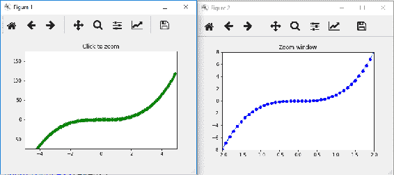

在点`(2, 11.5)`上单击**图 1** 中的图时，则**图 2** 中的图应更改，如下所示。 它是**图 1** 中围绕点`(2, 11.5)`的绘图的缩放版本，因此它包含 *X* 范围为 1 至 3，为。 *Y* 的范围大约为 0 到 20：

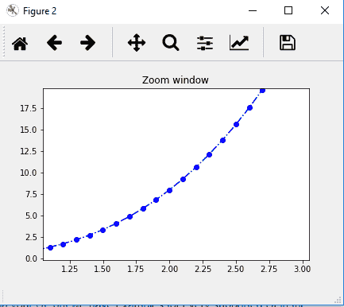

## 运动通知和鼠标按键按下事件

在本秘籍中，我们将学习如何捕获`motion_notify_event`和`button_press_event`并显示发生这些事件的点的坐标。

## 准备

导入所需的库：

```py
import matplotlib.pyplot as plt
import numpy as np
from time import time
```

## 操作步骤

以下步骤说明了如何编码和所需逻辑：

1.  设置要绘制的图的数据：

```py
t = np.arange(0.0, 1.0, 0.01)
s = np.sin(2 * np.pi * t)
```

2.  定义图形和轴域：

```py
fig, ax = plt.subplots()
```

3.  绘制图形：

```py
ax.plot(t, s)
```

4.  在`str_time`变量中捕获开始时间：

```py
str_time = time()
```

5.  定义响应鼠标移动事件的回调函数：

```py
def on_move(event):
    if event.inaxes:
        print('onmove data coords %.2f %.2f' % (event.xdata, 
               event.ydata))
    elapsed_time = time() - str_time
    print('elapsed time', elapsed_time)
    if elapsed_time > 10:
        print('Closing onmove event after 10 sec')
        plt.disconnect(binding_id)
```

6.  定义响应鼠标按键按下事件的回调函数：

```py
def on_click(event):
    if event.inaxes is not None:
        if event.button == 1:
            print('left click data coords %.2f %.2f' % (event.xdata, event.ydata))
            ax.text(event.xdata, event.ydata, 'left click here', 
                    weight='bold', color='m')
        elif event.button == 2:
              print('scroll click data coords %.2f %.2f' % (event.xdata, event.ydata))
              ax.text(event.xdata, event.ydata, 'scroll click here', 
                      weight='bold', color='m')
        elif event.button == 3:
              print('right click data coords %.2f %.2f' % (event.xdata, event.ydata))
              ax.text(event.xdata, event.ydata, 'right click here', weight='bold', color='m')
        fig.canvas.draw()
```

7.  将事件连接到对应的回调函数：

```py
binding_id = plt.connect('motion_notify_event', on_move)
plt.connect('button_press_event', on_click)
```

8.  在指定的后端显示图形：

```py
plt.show()
```

## 工作原理

以下是上述代码的说明：

*   `on_move(event)`是响应鼠标移动事件的回调函数：
    *   `if event.inaxes`检查鼠标移动事件是否在轴域内或轴域外发生。 如果在轴域内，则执行下一组指令 ； 否则，事实并非如此。
    *   `print()`打印数据坐标系中的坐标，在鼠标移至`sysout`的轴域上的点的时候。 您可以在笔记本的输出单元中看到它。
    *   `elapsed_time`是从程序开始到现在的经过时间。 这用于停用`move_event`回调函数，因为鼠标移动事件会产生大量`sysout` ] 通过打印语句。
    *   `if elapsed_time > 10`检查经过时间是否大于 10 秒； 如果是，它将`closing onmove event after 10 sec`打印到`sysout`，并且`plt.disconnect(binding_id)`断开`on_move`事件的连接。`binding_id`是定义事件和回调之间的连接时捕获的标识。
    *   `on_click(event)`是响应鼠标单击（按键按下）事件的回调函数。 鼠标上有三个按键：左侧为 1，滚动为`2`，右侧为`3`。 每次单击按键时，它会在绘图本身上打印相应消息：
        *   `if event.button == 1:`检查按下的按键是否为左键，然后将坐标打印到`sysout`和`ax.text(event.xdata, event.ydata, 'left click here', weight='bold', color='m')`创建要在绘图上显示的文字艺术家，当调用`draw()`函数时，该艺术家将可见。
        *   按键 *2*（滚动）和 *3*（右）重复相同的功能。
*   `binding_id = plt.connect('motion_notify_event', on_move)`将运动通知事件与相应回调函数`on_move()`相连，并且其标识保存在`binding_id`和中，如果以后要断开此事件，则需要使用此标识。
*   `plt.connect('button_press_event', on_click)`将按键按下事件与对应的回调函数`on_click()`连接起来。
*   请注意，在此秘籍中，我们已使用`plt.connect()`方法将该事件与相应的回调函数连接，而之前我们使用`canvas`类的方法`mpl_connect()`。 区别在于`plt.connect()`是`pyplot` API 的一部分，而`mpl_connect()`是面向对象的 API 的一部分，我们在第 5 章“使用面向对象的 API 进行绘图”中了解。

运行该程序时，您应该看到以下图表，并将鼠标悬停在该图表上时，在输出单元格中的 10 秒钟内，您将在`sysout`中看到文本消息`elapsed time 0.6132094860076904,  onmove data coords 0.14 -1.04`。 实际的经过时间和坐标对您而言将有所不同，具体取决于您将鼠标悬停在绘图上的时间和位置：

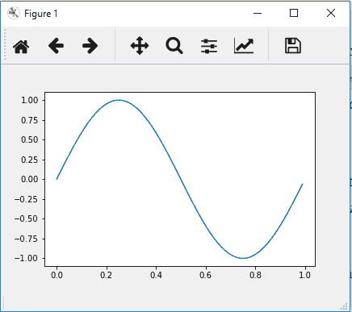

10 秒后，如果按住鼠标左键（1），滚动（2）或鼠标右键（3），您将在图形上以及在输出单元格中看到相应消息。 该图应如下所示：

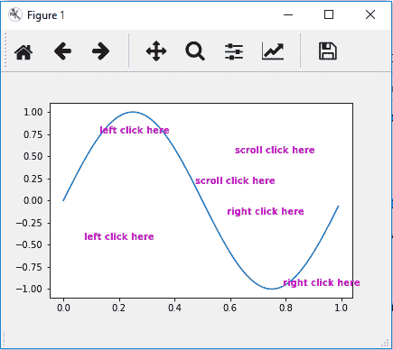

## 拾取事件

在本秘籍中，我们将学习如何捕获一个拾取事件，并使用它来激活/去激活给定轴域上一组线形图中的特定线形图。 我们使用图例来选择特定的线形图。

## 准备

我们将使用 **受试者工作特性**（**ROC**）曲线数据，该数据在第 3 章“绘制多个图表，子图和图”中引入，来绘制各种折线图，与相关的图例。

导入所需的库并设置后端：

```py
import matplotlib.pyplot as plt
plt.switch_backend('nbAgg')
import pandas as pd
```

## 操作步骤

以下步骤对逻辑进行了编码，以演示选择事件的用法：

1.  从 Excel 文件中读取`fpr`和`tpr`数据以获取各种算法：

```py
fpr_logreg = pd.read_excel('ROC_Curves.xlsx', 'fpr_logreg')
tpr_logreg = pd.read_excel('ROC_Curves.xlsx', 'tpr_logreg')
fpr_KNN = pd.read_excel('ROC_Curves.xlsx', 'fpr_KNN')
tpr_KNN = pd.read_excel('ROC_Curves.xlsx', 'tpr_KNN')
fpr_MLP = pd.read_excel('ROC_Curves.xlsx', 'fpr_MLP')
tpr_MLP = pd.read_excel('ROC_Curves.xlsx', 'tpr_MLP')
fpr_SGD = pd.read_excel('ROC_Curves.xlsx', 'fpr_SGD')
tpr_SGD = pd.read_excel('ROC_Curves.xlsx', 'tpr_SGD')
fpr_GNB = pd.read_excel('ROC_Curves.xlsx', 'fpr_GNB')
tpr_GNB = pd.read_excel('ROC_Curves.xlsx', 'tpr_GNB')
fpr_svc = pd.read_excel('ROC_Curves.xlsx', 'fpr_svc')
tpr_svc = pd.read_excel('ROC_Curves.xlsx', 'tpr_svc')
fpr_RF = pd.read_excel('ROC_Curves.xlsx', 'fpr_RF')
tpr_RF = pd.read_excel('ROC_Curves.xlsx', 'tpr_RF')
fpr_DT = pd.read_excel('ROC_Curves.xlsx', 'fpr_DT')
tpr_DT = pd.read_excel('ROC_Curves.xlsx', 'tpr_DT')
```

2.  定义并实例化图形：

```py
fig = plt.figure(figsize=(10,8))
```

3.  绘制所有折线图：

```py
plt.plot([0, 1], [0, 1], 'k--')
l1, = plt.plot(fpr_logreg, tpr_logreg, label='LogReg',color='purple')
l2, = plt.plot(fpr_KNN, tpr_KNN, label='KNN',color='green')
l3, = plt.plot(fpr_DT, tpr_DT, label='DecisionTree', color='orange')
l4, = plt.plot(fpr_RF, tpr_RF, label='Random Forest',color='yellow')
l5, = plt.plot(fpr_MLP, tpr_MLP, label='MLP',color='red')
l6, = plt.plot(fpr_svc, tpr_svc, label='SVC',color='violet')
l7, = plt.plot(fpr_GNB, tpr_GNB, label='GNB',color='grey')
l8, = plt.plot(fpr_SGD, tpr_SGD, label='SGD', color='pink')
```

4.  将 alpha（透明度）设置为`0.4`来设置标签，标题和图例：

```py
plt.xlabel('False Positive Rate')
plt.ylabel('True Positive Rate')
plt.title('ROC curve')
lgd = plt.legend(loc='lower right', fancybox=True, shadow=True)
```

5.  创建一个字典以使用和对应的图例标签映射绘图线：

```py
pltlines = [l1, l2, l3, l4, l5, l6, l7, l8]
leg_ln_map = dict()
for leg_line, plot_line in zip(lgd.get_lines(), pltlines):
    leg_line.set_picker(10) 
    leg_ln_map[leg_line] = plot_line
```

6.  定义响应和`on_pick`事件的回调函数：

```py
def onpick(event):
 # on the pick event, find the plot line corresponding to the legend line, and toggle the visibility
    leg_line = event.artist
    plot_line = leg_ln_map[leg_line]
    vis = not plot_line.get_visible()
    plot_line.set_visible(vis)
 # Change the alpha on the line in the legend so we can see what lines have been toggled
    if vis:
        leg_line.set_alpha(1.0)
    else:
        leg_line.set_alpha(0.2)
    fig.canvas.draw()
```

7.  将事件与对应的回调函数连接：

```py
fig.canvas.mpl_connect('pick_event', onpick)
```

8.  将输出图形发送到选定的后端：

```py
plt.show()
```

## 工作原理

以下是上述代码的说明：

*   读取数据，定义图形以及绘制各种折线图的前三个步骤已经为我们所熟悉。
*   `lgd = plt.legend(loc='lower right', fancybox=True, shadow=True)`设置图例，`fancybox=True`指定在图例项周围绘制边界框，`shadow=True`指定该边界框具有阴影。
*   `pltlines = [l1, l2, l3, l4, l5, l6, l7, l8]`是图中所有绘图线的列表。
*   `leg_ln_map = dict()`是将绘图线映射到相应图例标签的字典。
*   `for`循环为每个图例标签设置选择器，并将它们映射到和对应的线形图。
*   `leg_line.set_picker(5)`设置图例标签行的选择器。 数字 10 表示，即鼠标单击被捕获以触发相应对应选择事件的点数。 1 点是 1/72 英寸。 如果此数字太大，则单击可能会变得足够接近多个图例项目，并且所有这些项目可能会同时被触发！ 因此，请将其设置得足够小以避免给定鼠标单击时图例行之间的重叠。
*   选择器的此参数还有其他选项，`None`表示禁用选择器，布尔值`True`表示在图例行上单击时触发事件； 它也可以是用户定义的函数。
*   `onpick(event)`是`pick_event`的回调函数：
    *   `leg_line = event.artist`捕获发生 ， 鼠标单击的特定图例行。
    *   `plot_line = leg_ln_map[leg_line]`获得与图例线相对应的绘图线。
    *   `vis = not plot_line.get_visible()`获取绘图线的当前可见性状态，并将其设置为与`vis`相反。
    *   `plot_line.set_visible(vis)`设置绘图线的新可见性状态。
    *   `if`和`else`语句使用[alpha]为对应的图例行设置相同的状态。`1`表示完全可见，`0.2`表示部分可见。
    *   `fig.canvas.draw()`在输出设备上绘制图形。
*   `fig.canvas.mpl_connect('pick_event', onpick)`将`pick`事件与对应的回调函数`onpick`连接起来。

运行程序并在图例中单击 LogReg，Random Forest 和 SVC 标签时，应该看到以下图表。 禁用它们，因此您在图中看不到这些曲线：

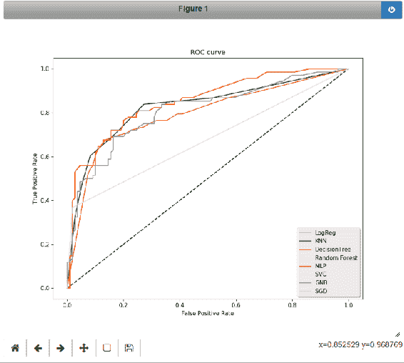

请注意，此图中，标头和导航工具栏与以前秘籍中显示的数字有所不同。 在这种情况下，已使用`nbAgg`后端，而使用了较早的`Qt5Agg`。 虽然外观不同，但所有后端在工具栏中都提供和相同的功能。

## 图和轴域的进入和离开事件

在本秘籍中，我们将学习如何捕获图形输入和离开事件以及轴域进入和离开事件，并使用它们来更改图形和轴域的属性，并使轴域上的线形图可见/不可见。

## 准备

导入所需的库：

```py
import matplotlib.pyplot as plt
import numpy as np
```

## 操作步骤

以下是编码所需逻辑的步骤：

1.  定义图形`ax1`和`ax2`，并设置图形标题：

```py
fig = plt.figure()
fig.suptitle('mouse hover over figure or axes to trigger events')
ax1 = fig.add_subplot(211)
ax2 = fig.add_subplot(212)
```

2.  准备用于绘制正弦和余弦函数的数据：

```py
x = np.arange(1, 2.0, 0.1) 
y = np.sin(2 * np.pi * x)
y1 = np.cos(2 * np.pi * x)
```

3.  在`ax1`上绘制正弦函数，在`ax2`上绘制余弦函数：

```py
ax1.plot(x,y, color='g')
ax2.plot(x, y1, color='b')
```

4.  为`figure_enter_event`定义回调函数：

```py
def figure_enter(event):
    print('figure_enter', event.canvas.figure)
    event.canvas.figure.patch.set_facecolor('grey')
    event.canvas.draw()
```

5.  为`figure_leave_event`定义回调函数：

```py
def figure_exit(event):
    print('figure_exit', event.canvas.figure)
    event.canvas.figure.patch.set_facecolor('red')
    event.canvas.draw()
```

6.  为`axes_enter_event`定义回调函数：

```py
def axes_enter(event):
    print('axes_enter', event.inaxes)
    event.inaxes.patch.set_facecolor('white')
    event.inaxes.get_lines()[0].set_visible(True)
    event.canvas.draw()
```

7.  为`axes_leave_event`定义回调函数：

```py
def axes_exit(event):
    print('axes_exit', event.inaxes)
    event.inaxes.patch.set_facecolor('orange')
    event.inaxes.get_lines()[0].set_visible(False)
    event.canvas.draw()
```

8.  将事件与对应的回调函数连接：

```py
fig.canvas.mpl_connect('figure_enter_event', figure_enter)
fig.canvas.mpl_connect('figure_leave_event', figure_exit)
fig.canvas.mpl_connect('axes_enter_event', axes_enter)
fig.canvas.mpl_connect('axes_leave_event', axes_exit)
```

## 工作原理

以下是上述代码步骤的说明：

*   前三个步骤是定义图形及其布局，准备数据和绘制图表。
*   `figure_enter(event)`是响应`figure_enter_event`的回调函数。
    *   `print('figure_enter', event.canvas.figure)`将文本`figure enter`输出到`sysout`，然后是图形对象。
    *   `event.canvas.figure.patch.set_facecolor('grey')`将图形的前景颜色设置为*灰色*。
    *   `event.canvas.draw()`在输出设备的上绘制更新的图形。
*   `figure_exit(event)`是响应`figure_leave_event`的回调函数。 此函数还将文本打印到`sysout`，将图形的前景颜色设置为*红色*，并绘制更新的图形。
*   `axes_enter(event)`是响应`axes_enter_event`的回调函数。
    *   `print('axes_enter', event.inaxes)`将文本`axes_enter`打印到`sysout`，随后是访问对象。
    *   `event.inaxes.patch.set_facecolor('white')`将轴域的*面色*设置为*白色*。
    *   `event.inaxes.get_lines()[0].set_visible(True)`将轴域上的线形图设置为*可见*状态； 方法`get_lines()`从轴域获取所有线对象，因此它是对象列表，我们需要使用`index [0]`从列表中获取第一个对象。
    *   `event.canvas.draw()`在输出设备上绘制更新的图形
*   `axes_exit(event)`是响应`axes_leave_event`的回调函数。 还将，文本和轴域对象打印到`sysout`，将轴域的面色设置为*橙色*，并将线形图设置为*不可见*状态。
*   `fig.canvas.mpl_connect('figure_enter_event', figure_enter)`将`figure_enter_event`连接到对应的回调函数`figure_enter`。 同样，其他三个事件也分别连接到它们各自的回调函数。

运行该程序时，应该看到如下所示的第一个图； 当鼠标在上方时，您应该看到第二个图； 当鼠标在该图的边界之外时，您应该看到第三个图：

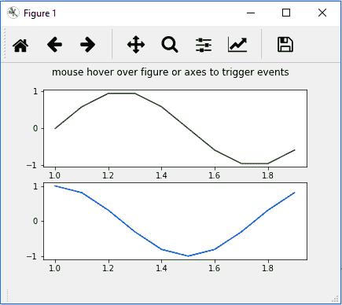

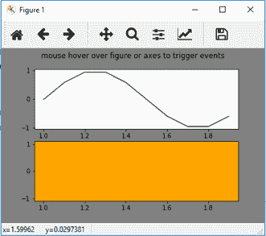

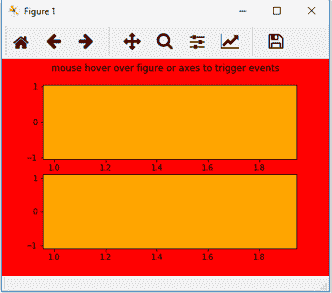

## 使用双生轴域绘制四个温度刻度

在第 4 章，“开发可视化来提高发布质量”的“双生轴域”秘籍中，我们学习了如何在左和右轴域绘制两个不同的比例尺的两个独立变量。 当我们在交互模式下使用此功能时，缩放和平移功能也可以正常工作，因为两个变量是独立的。 但是，当两个变量相互依赖时，例如以弧度和度为度量单位； 公斤和磅； 或华氏温度，摄氏温度，开尔文温度和朗肯温度，那么两个变量必须同步。

在本秘籍中，我们将通过一个温度示例学习如何做到这一点。 我们将在，主轴域上使用摄氏温度单位，并在从属轴域上使用华氏，开尔文和朗肯。

## 准备

设置交互式分析的后端，在导入所需的库，并设置用于生成随机数的种子：

```py
import matplotlib
matplotlib.use('tkagg')

import matplotlib.pyplot as plt
import numpy as np

np.random.seed(19681211)
```

## 操作步骤

以下是绘制和所需图形的步骤：

1.  定义函数，将摄氏温度转换为和其他三个测量单位：

```py
def c2f(temp):
    return (9\. / 5.) * temp + 32
def c2k(temp):
    return temp + 273.15
def c2r(temp):
    return (9\. / 5.) * temp + 427.9
```

2.  根据主轴域上的摄氏刻度的当前限制来定义更新所有刻度的函数：

```py
def refresh_scales(ax_c):
    y1, y2 = ax_c.get_ylim()

    ax_f.set_ylim(c2f(y1), c2f(y2))
    ax_f.figure.canvas.draw()

    ax_k.set_ylim(c2k(y1), c2k(y2))
    ax_k.figure.canvas.draw()

    ax_r.set_ylim(c2r(y1), c2r(y2))
    ax_r.figure.canvas.draw()
```

3.  定义图形，主轴域和三个从属轴域，其他三个测量单位各一个：

```py
fig, ax_c = plt.subplots()
ax_f = ax_c.twinx()
ax_r = ax_c.twinx()
ax_k = ax_c.twinx()
```

4.  在图的右侧定义两个从属轴域，远离图的默认右轴域：

```py
ax_k.spines["right"].set_position(("axes", 1.15))
ax_r.spines["right"].set_position(("axes", 1.30))
```

5.  将`ylim_changed`事件连接到相应的回调函数：

```py
ax_c.callbacks.connect("ylim_changed", refresh_scales)
```

6.  在主轴域上以摄氏度为单位绘制`30`天的随机温度：

```py
ax_c.plot(np.random.uniform(low=-40., high=40., size=(30,)))
ax_c.set_xlim(0, 30)
```

7.  为所有四个比例绘制图形标题和 y 轴标签：

```py
ax_c.set_title('Temperature on Four different Scales')
ax_c.set_ylabel('Celsius', color='g')
ax_f.set_ylabel('Fahrenheit')
ax_k.set_ylabel('Kelvin')
ax_r.set_ylabel('Rankine')
```

8.  为所有轴域设置 *y* 轴标签的颜色：

```py
ax_f.yaxis.label.set_color('b')
ax_k.yaxis.label.set_color('r')
ax_r.yaxis.label.set_color('m')
```

9.  设置的颜色，所有 *y* 轴的刻度和刻度标签：

```py
ax_c.tick_params(axis='y', colors='g')
ax_f.tick_params(axis='y', colors='b')
ax_k.tick_params(axis='y', colors='r')
ax_r.tick_params(axis='y', colors='m')
```

10.  设置所有 *y* 轴轴线的颜色：

```py
ax_c.spines["left"].set_edgecolor('g')
ax_f.spines["right"].set_edgecolor('b')
ax_k.spines["right"].set_edgecolor('r')
ax_r.spines["right"].set_edgecolor('m')
```

11.  在屏幕上显示该图：

```py
plt.show()
```

## 工作原理

这是前面代码的解释：

*   `def c2f(temp):`是将摄氏温度转换为华氏温度的函数。
*   `def c2k(temp):`是将摄氏温度转换为开尔文的函数。
*   `def c2r(temp):`是将摄氏温度转换为朗肯的函数。
*   `def refresh_scales(ax_c):`是根据当前摄氏温度限制刷新和从属轴域上所有刻度的函数：
    *   `y1, y2 = ax_c.get_ylim()`在主轴域上获得当前摄氏刻度的上限和下限。
    *   `ax_f.set_ylim(c2f(y1), c2f(y2))`使用给定的摄氏限制设置了华氏刻度的新限制。
    *   `ax_f.set_ylim(c2k(y1), c2f(y2))`使用给定的摄氏限制设置了开尔文刻度的新限制。
    *   `ax_f.set_ylim(c2r(y1), c2f(y2))`使用给定的摄氏限制设置了朗肯刻度的新限制。
*   `fig, ax_c = plt.subplots()`定义了主轴域和从属轴域上的摄氏刻度。
*   `ax_f = ax_c.twinx()`定义了主轴域和从属轴域上的华氏刻度。
*   `ax_k = ax_c.twinx()`定义了主轴域从属轴域上的开尔文刻度。
*   `ax_r = ax_c.twinx()`定义了主轴域从属轴域上的朗肯刻度。
*   `ax_k.spines["right"].set_position(("axes", 1.15))`将从属轴域向右侧移动主轴域宽度的 15%。
*   `ax_r.spines["right"].set_position(("axes", 1.30))`将从属轴域向右侧移动主轴域宽度的 30% ，以使所有轴刻度线，刻度标签或轴标签都不相互重叠。
*   `ax_c.callbacks.connect("ylim_changed",refresh_scales)`将`"ylim_changed"`事件连接到相应的回调函数`refresh_scales`。
*   `ax_c.plot(np.random.uniform(low=-40., high=40., size=(30,)))`在摄氏刻度上绘制-40 至 40 之间的 30 个随机数。
*   `ax_c.set_xlim(0, 30)`将  *X* 轴的下限和上限分别设置为零和 30 天。
*   `ax_c.set_title('Temparature on Four different Scales')`绘制该图的标题。
*   `ax_c.set_ylabel('Celsius', color='g')`将 *y* 轴标签设置为摄氏度。
*   `ax_f.set_ylabel('Fahrenheit')`将 *y* 轴标签设置为华氏度。
*   `ax_k.set_ylabel('Kelvin')`将 *y* 轴标签设置为开尔文。
*   `ax_r.set_ylabel('Rankine')`将 *y* 轴标签设置为朗肯。
*   `ax_f.yaxis.label.set_color('b')`设置华氏度的 *y* 轴标签的颜色； 通常的`set_ylabel(color='b')`不适用于从属轴域。
*   `ax_k.yaxis.label.set_color('r')`将 *y* 轴标签的颜色设置为开尔文刻度。
*   `ax_r.yaxis.label.set_color('m')`设置朗肯刻度的 *y* 轴标签的颜色。
*   `ax_c.tick_params(axis='y', colors='g')`设置摄氏刻度的刻度和刻度标签的颜色。
*   `ax_f.tick_params(axis='y', colors='b')`设置华氏刻度的刻度和刻度标签的颜色。
*   `ax_k.tick_params(axis='y', colors='r')`设置开尔文刻度的刻度和刻度标签的颜色。
*   `ax_r.tick_params(axis='y', colors='m')`设置朗肯刻度的刻度和刻度标签的颜色。
*   `ax_c.spines["left"].set_edgecolor('g')`设置摄氏刻度轴的颜色。
*   `ax_f.spines["right"].set_edgecolor('b')`设置华氏度刻度轴的颜色。
*   `ax_k.spines["right"].set_edgecolor('r')`设置开尔文刻度轴的颜色。
*   `ax_r.spines["right"].set_edgecolor('m')`设置朗肯刻度轴的颜色。

运行前面的代码后，您应该在屏幕上看到下图：

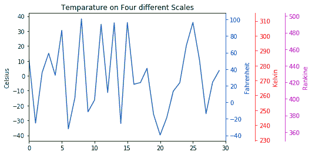

## 小部件

在上一节中，我们学习了如何在粒度级别捕获事件并使用这些事件执行某些基本任务。 可以扩展它来开发丰富的**图形用户界面**（**GUI**）应用，这些应用包括按键，复选框，单选按键，滑块和跨度控制器等功能。 但是，这需要大量的编程工作。 因此，Matplotlib 预定义了许多这些功能，称为**小部件**，我们可以轻松使用这些功能来开发我们需要的 GUI 应用。

在本节中，我们将学习如何使用其中的一些小部件。

## 光标

当您将鼠标悬停在图形/轴域上时，`Cursor`小部件会用十字突出显示图形中的特定点。 这类似于我们在“运动通知和鼠标按下事件”秘籍中所做的操作，但是在这里我们将使用易于使用的小部件。

## 准备

导入所需的库：

```py
import numpy as np
import matplotlib.pyplot as plt
from matplotlib.widgets import Cursor
```

## 操作步骤

以下是实现逻辑的步骤：

1.  准备绘图数据：

```py
x = np.arange(-5, 5, 0.1)
y = x ** 2
```

2.  设置图形，布局和轴域：

```py
fig = plt.figure(figsize=(8, 6))
ax = fig.add_subplot(111, facecolor='skyblue')
```

3.  绘制图形：

```py
ax.plot(x, y, 'o')
```

4.  实例化光标小部件：

```py
cursor = Cursor(ax, color='red', linewidth=5)
```

5.  将输出发送到指定的后端：

```py
plt.show()
```

## 工作原理

以下是上述代码步骤的说明：

*   前三个步骤定义了数据和图形的布局，并绘制了图表。
*   `cursor = Cursor(ax, color='red', linewidth=5)`定义并激活光标小部件。

您应该看到小部件，如此处所示。 请注意，此图已使用`TkAgg`后端：

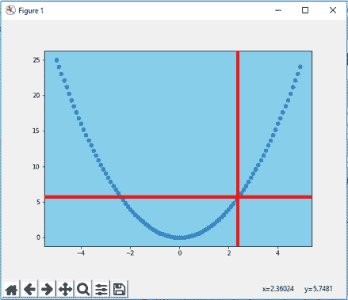

## 按键

单击按键可启用某些功能。 通常，它们用于通过`prev`和`next`按键来回滚动数据。 我们将学习如何使用此功能。

## 准备

我们将使用熟悉的`Iris`数据集，该数据集具有三个不同的数据簇。 我们将实现`prev`和`next`按键来回滚动这些数据簇。

导入所需的库：

```py
import matplotlib.pyplot as plt
import pandas as pd
from matplotlib.widgets import Button
```

## 操作步骤

以下代码步骤实现了我们所需的逻辑：

1.  使用`prev`和`next`方法定义类以表示要显示的群集：

```py
class Cluster(object):
   ind = 0    # index to move back and forth as we click prev and  
                next buttons

## Method for next button click
   def next(self, event):
       self.ind += 1
       i = self.ind % len(species)
       index = iris['species'] == species[i]
       axs.clear()
       axs.scatter(x[index], y[index], s=50, marker='o')
       axs.set_title(species[i], size=25, color='r')
       plt.draw()

## Method for prev button click
   def prev(self, event):
       self.ind -= 1
       i = self.ind % len(species)
       index = iris['species'] == species[i]
       axs.clear()
       axs.scatter(x[index], y[index], s=50, marker='o')
       axs.set_title(species[i], size=25, color='r')
       plt.draw()
```

2.  实例化`cluster`对象：

```py
cluster = Cluster()
```

3.  读取和`Iris`数据，并设置属性，以绘制三个群集：

```py
iris = pd.read_csv('iris_dataset.csv', delimiter=',')
species = ['setosa', 'versicolor', 'virginica']
x,y = iris['petal_length'], iris['petal_width']
index = iris['species'] == species[cluster.ind]
```

4.  定义图形和轴域：

```py
fig, axs = plt.subplots()
```

5.  绘制第一个群集：

```py
axs.scatter(x[index], y[index], s=50, marker='o')
axs.set_title(species[cluster.ind], size=25, color='r')
```

6.  定义上一个和下一个按键的轴域：

```py
axprev = plt.axes([0.7, 0.005, 0.1, 0.05])
axnext = plt.axes([0.81, 0.005, 0.1, 0.05])
```

7.  实例化上一个和下一个按键：

```py
bnext = Button(axnext, 'Next')
bprev = Button(axprev, 'Previous')
```

8.  将的回调函数映射到`prev`和`next`的`on_clicked`事件：

```py
bnext.on_clicked(cluster.next)
bprev.on_clicked(cluster.prev)
```

9.  在指定的后端显示图形：

```py
plt.show()
```

## 工作原理

以下是和先前代码的解释：

*   `class Cluster(object):`定义一个名为`Cluster`的类。
*   `ind = 0`初始化索引，当按下`prev`和`next`按键时，索引将来回移动。
*   `def next(self, event):`将`next`方法定义为`next`按键的`callback`函数：
    *   `self.ind += 1`将索引增加 1。
    *   对于物种中个簇的数量，`i = self.ind % len(species)`将运行索引转换为零，1 或 2。
    *   `index = iris['species'] == species[i]`拾取与`next`群集相对应的数据的索引。
    *   `axs.clear()`清除轴域上的先前数据。 如果我们不这样做，则所有群集都将在轴域上可见，并且只有正在刷新的群集的颜色才会根据属性循环中设置的默认颜色来修改。
    *   `axs.scatter(x[index], y[index], s=50, marker='o')`使用之前计算的索引绘制新的群集数据。
    *   `axs.set_title(species[i], size=25, color='r')`将轴域的标题设置为，即当前群集名称。
    *   `plt.draw()`刷新图形。
*   `def prev(self, event):`将`prev`方法定义为`prev`按键的回调函数：
    *   `self.ind -= 1`将索引减少 1。
    *   `i = self.ind % len(species)`将物种的簇数转换为 0、1 或 2。
    *   `index = iris['species'] == species[i]`拾取与上一个簇相对应的数据索引。
    *   `axs.clear()`清除轴域上的先前数据。 如果不这样做，则所有群集都将在轴域上可见，并且仅刷新的群集的颜色将根据属性周期中设置的默认颜色进行更改。
    *   `axs.scatter(x[index], y[index], s=50, marker='o')`使用计算出的索引绘制新的群集数据。
    *   `axs.set_title(species[i], size=25, color='r')`将轴域的标题设置为当前群集名称。
    *   `plt.draw()`刷新图形。
*   `cluster = Cluster()`实例化`Cluster`对象。
*   `iris = pd.read_csv('iris_dataset.csv', delimiter=',')`读取`iris`数据。
*   `species = ['setosa', 'versicolor', 'virginica']`列出唯一的群集名称。
*   `x,y = iris['petal_length'], iris['petal_width']`从鸢尾数据集的 x 和 *y* 坐标中选取所需属性。
*   `index = iris['species'] == species[cluster.ind]`获得与和第一簇相对应的数据的索引。 请注意，`cluster.ind`已初始化为零。
*   `fig, axs = plt.subplots()`实例化图形和轴域。
*   `axs.scatter(x[index], y[index], s=50, marker='o')`绘制第一个群集的散点图，`axs.set_title(species[cluster.ind], size=25, color='r')`设置当前群集名称作为图形的标题。
*   `axprev = plt.axes([0.7, 0.005, 0.1, 0.05])`定义图中`prev`按键的轴域，`axnext = plt.axes([0.81, 0.005, 0.1, 0.05])`定义图中`next`按键的轴域。 如第 6 章中的解释，“带有高级功能的绘图”，“控制轴域位置”秘籍，轴域的定义是从左，下，宽度和高度， 它们位于轴域坐标系中。
*   `bnext = Button(axnext, 'Next')`使用，`Next`标签和，`bnext`连接 ID 实例化`next`按键，并且`bprev = Button(axprev, 'Previous')`用和实例化上一个按键。 ] `prev`标签和- `bprev`连接 ID。
*   `bnext.on_clicked(cluster.next)`将回调函数映射到`next`按键的事件，`bprev.on_clicked(cluster.prev)`将`callback`函数映射到`prev`按键的事件。
*   `plt.show()`将输出发送到指定的后端。

当您运行程序并单击`Next`时，您将看到以下三个图，代表每个群集，如每个图的标题所示：

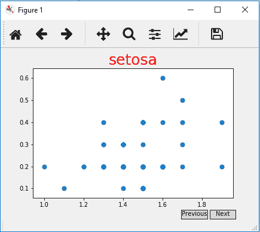

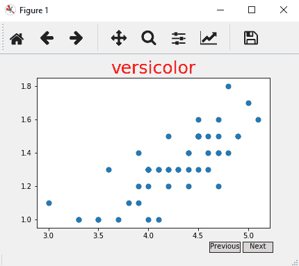

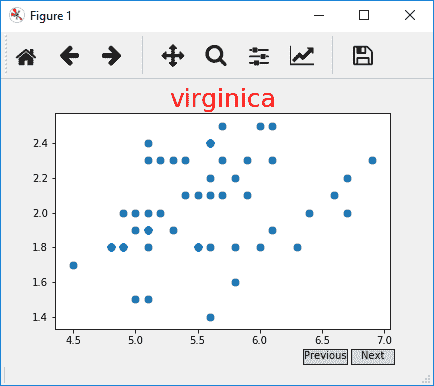

如果注释掉`axs.clear()`语句，则该图将如下所示：

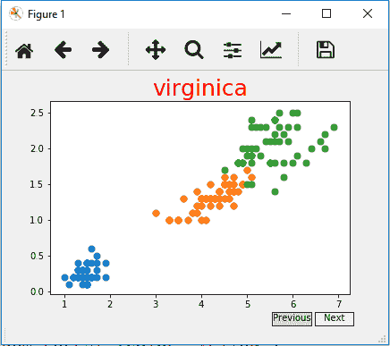

## 复选按键

复选框用于选择或取消选择一组属性以可视化数据。 在本秘籍中，我们将学习如何使用，`CheckButtons`小部件来实现复选框功能。

## 准备

我们将使用 ROC 图来实现`CheckButtons`。

导入所需的库：

```py
import matplotlib.pyplot as plt
import pandas as pd
from matplotlib.widgets import CheckButtons
```

## 操作步骤

以下是实现逻辑的步骤：

1.  从本章前面的“选择事件”秘籍中使用的相同 Excel 文件中读取数据：

```py
fpr_logreg = pd.read_excel('ROC_Curves.xlsx', 'fpr_logreg')
tpr_logreg = pd.read_excel('ROC_Curves.xlsx', 'tpr_logreg')
fpr_KNN = pd.read_excel('ROC_Curves.xlsx', 'fpr_KNN')
tpr_KNN = pd.read_excel('ROC_Curves.xlsx', 'tpr_KNN')
fpr_MLP = pd.read_excel('ROC_Curves.xlsx', 'fpr_MLP')
tpr_MLP = pd.read_excel('ROC_Curves.xlsx', 'tpr_MLP')
fpr_SGD = pd.read_excel('ROC_Curves.xlsx', 'fpr_SGD')
tpr_SGD = pd.read_excel('ROC_Curves.xlsx', 'tpr_SGD')
fpr_GNB = pd.read_excel('ROC_Curves.xlsx', 'fpr_GNB')
tpr_GNB = pd.read_excel('ROC_Curves.xlsx', 'tpr_GNB')
fpr_svc = pd.read_excel('ROC_Curves.xlsx', 'fpr_svc')
tpr_svc = pd.read_excel('ROC_Curves.xlsx', 'tpr_svc')
fpr_RF = pd.read_excel('ROC_Curves.xlsx', 'fpr_RF')
tpr_RF = pd.read_excel('ROC_Curves.xlsx', 'tpr_RF')
fpr_DT = pd.read_excel('ROC_Curves.xlsx', 'fpr_DT')
tpr_DT = pd.read_excel('ROC_Curves.xlsx', 'tpr_DT')
```

2.  定义并实例化图形：

```py
fig = plt.figure(figsize=(10,8))
```

3.  绘制所有 ROC 曲线：

```py
plt.plot([0, 1], [0, 1], 'k--')
l1, = plt.plot(fpr_logreg, tpr_logreg, 
               label='LogReg',color='purple')
l2, = plt.plot(fpr_KNN, tpr_KNN, label='KNN',color='green')
l3, = plt.plot(fpr_DT, tpr_DT, label='DecisionTree', color='orange')
l4, = plt.plot(fpr_RF, tpr_RF, label='Random Forest',color='yellow')
l5, = plt.plot(fpr_MLP, tpr_MLP, label='MLP',color='red')
l6, = plt.plot(fpr_svc, tpr_svc, label='SVC',color='violet')
l7, = plt.plot(fpr_GNB, tpr_GNB, label='GNB',color='grey')
l8, = plt.plot(fpr_SGD, tpr_SGD, label='SGD', color='pink')
```

4.  设置图形的属性，并在和左侧调整空间，以容纳和复选框：

```py
plt.xlabel('False Positive Rate', size=20, color='m')
plt.ylabel('True Positive Rate', size=20, color='m')
plt.title('ROC curve', size=25, color='b')
plt.subplots_adjust(left=0.35)
```

5.  准备`CheckButtons`所需的每条曲线的数据轴域，标签和可见性状态：

```py
lines = [l1, l2, l3, l4, l5, l6, l7, l8]
cax = plt.axes([0.05, 0.27, 0.15, 0.5])
labels = [str(line.get_label()) for line in lines]
visibility = [line.get_visible() for line in lines]
```

6.  使用先前准备的必需属性实例化`CheckButtons`对象。

```py
check = CheckButtons(cax, labels, visibility)
```

7.  定义响应复选框点击的回调函数：

```py
def onclick(label):
    index = labels.index(label)
    lines[index].set_visible(not lines[index].get_visible())
    plt.draw()
```

8.  将事件映射到对象上的回调函数。

## 工作原理

这是前面代码块的说明。

前四个步骤已经很熟悉，因此我们将在步骤 5 中进行说明：

*   `lines = [l1, l2, l3, l4, l5, l6, l7, l8]`是所有 ROC 线形图的列表。
*   `cax = plt.axes([0.05, 0.27, 0.15, 0.5])`定义绘制，`CheckButtons`框的轴域。
*   `labels = [str(line.get_label()) for line in lines]`定义 ROC 图中每个的标签列表。 这是，与绘制这些曲线时所给的标签相同。 在这里，我们不再使用系统函数`line.get_label()`对其进行硬编码。
*   `visibility = [line.get_visible() for line in lines]`是所有 ROC 曲线的可见性状态列表（可见或不可见）。
*   `check = CheckButtons(cax, labels, visibility)`实例化`CheckButtons`对象。
*   `def onclick(label):`是单击复选按键时激活的回调函数。`label`是系统变量，例如`event`，其中包含标签和单击的复选按键的标签：
    *   `index = labels.index(label)`从所有标签列表中获得单击的标签的索引，该索引将用于访问该标签的 ROC 图。
    *   `lines[index].set_visible(not lines[index].get_visible())`切换单击的标签的的可见性状态。
    *   `plt.draw()`刷新图。
*   `check.on_clicked(onclick)`将点击事件与对应的回调函数连接起来。
*   `plt.show()`将输出发送到指定的后端。

运行程序时，您应该获得第一个数字，并且取消选中 **K 最近邻**（**KNN**），**决策树**（**DT**）和**多层感知器**（**MLP**）曲线，那么您应该看到第二个图：

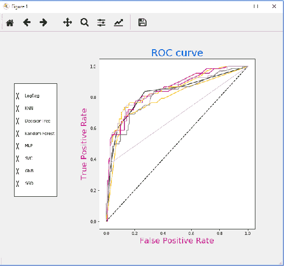

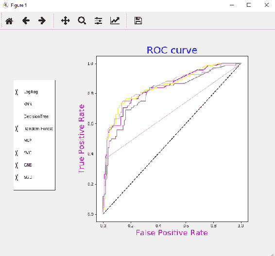

## 单选按键

`RadioButtons`与`CheckButtons`相似，只是在任何时候它的一个属性都将处于活动状态。 在本秘籍中，我们将学习如何使用`RadioButtons`小部件。

## 准备

我们将为该秘籍定义美国，中国的 GDP 数据以及和英国的 Python 列表，并将其用于此秘籍。

导入所需的库：

```py
import numpy as np
import matplotlib.pyplot as plt
from matplotlib.widgets import RadioButtons
```

## 操作步骤

以下是实现`RadioButtons`逻辑的步骤：

1.  定义图形和轴域，然后在左侧的上调整空间以容纳`RadioButtons`：

```py
fig, axs = plt.subplots()
plt.subplots_adjust(left=0.3)
```

2.  准备要在轴域上绘制的数据：

```py
## Data taken from https://data.worldbank.org/country
Year = ['2007', '2008', '2009', '2010', '2011', '2012', '2013', 
        '2014', '2015', '2016']
China_GDP = [3.552, 4.598, 5.11, 6.101, 7.573, 8.561, 9.607, 10.482, 
             11.065, 11.191]
US_GDP = [14.478, 14.719, 14.419, 14.964, 15.518, 16.155, 16.692, 
          17.428, 18.121, 18.624]
UK_GDP = [3.074, 2.891, 2.383, 2.441, 2.62, 2.662, 2.74, 3.023, 
          2.886, 2.651]
```

3.  绘制图形并设置标签，标题和轴限制：

```py
line, = axs.plot(Year, US_GDP, lw=5, color='g', ls='-.')
axs.set_ylim(1,20)
axs.set_title('GDP(in trillion $)')
axs.set_xlabel('Year')
```

4.  定义将绘制单选按键的轴域，并实例化对象：

```py
rax = plt.axes([0.05, 0.5, 0.15, 0.25], facecolor='skyblue')
radio = RadioButtons(rax, ('USA', 'China', 'UK'))
```

5.  定义单击`RadioButtons`之一时执行的回调函数：

```py
countrydict = {'USA': [US_GDP, 'g', '-.'], 'China': [China_GDP, 'b', 
               '--'], 'UK': [UK_GDP, 'm', '-']}
def country(label):
    ydata, color, ls = countrydict[label]
    line.set_ydata(ydata)
    line.set_color(color)
    line.set_linestyle(ls)
    plt.draw()
```

6.  将点击事件连接到先前定义的对应的回调函数：

```py
radio.on_clicked(country)
```

7.  将输出发送到指定的后端：

```py
plt.show()
```

## 工作原理

这是前面代码块的解释：

*   `Year`是要绘制 GDP 数据的年份的列表。
*   `China_GDP`是，年列表中指定的年份的 GDP 清单，以兆美元（`$`）表示，`US_GDP`和`UK_GDP`同样。
*   `rax = plt.axes([0.05, 0.5, 0.15, 0.25], facecolor='skyblue')`定义将绘制`RadioButtons`的轴域，并且将面色设置为`skyblue`。
*   `radio = RadioButtons(rax, ('USA', 'China', 'UK'))`在给定轴域上实例化`RadioButtons`对象，并使用实例化给定标签。
*   `countrydict()`是包含`country`作为`key`以及相关的 *GDP* 和的字典，绘图属性`color`和`linestyle`作为`values`。
*   `def GDP(label):`定义了响应单击`RadioButtons`而被激活的回调函数。`label`是一个系统变量，其中包含单击的`RadioButton`的标签：
    *   `ydata, color, ls = countrydict[label]`从与单击的标签相对应的字典中获取 GDP，颜色和线条样式。
    *   `line.set_ydata(ydata)`设置 *y* 轴的数据。
    *   `line.set_color(color)`设置绘图的颜色。
    *   `line.set_linestyle(ls)`设置线条样式。
    *   `plt.draw()`刷新图。

*   `radio.on_clicked(GDP)`将点击事件与相应的回调函数`country`连接起来。
*   `plt.show()`将输出发送到指定的后端。

当您运行该程序并开始检查其他单选按键时，您应该看到下图：

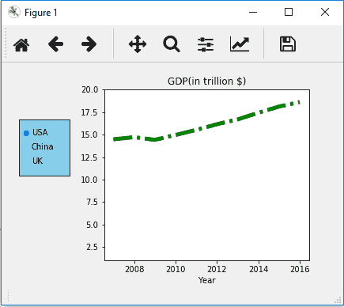


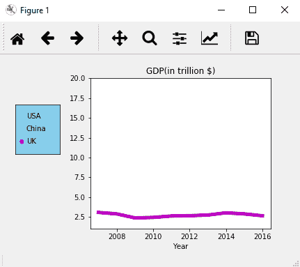

## 文本框

`TextBox`小部件是求值任何表达式的自由格式实现。 如果您想检查各种不同的数学表达式/函数，这将非常方便。

## 准备

导入所需的库：

```py
import numpy as np
import matplotlib.pyplot as plt
from matplotlib.widgets import TextBox
```

## 操作步骤

以下是实现`TextBox`小部件的步骤：

1.  定义图形和轴域，并在底部调整空间以适应`TextBox`：

```py
fig, ax = plt.subplots()
plt.subplots_adjust(bottom=0.2)
```

2.  准备要绘制的初始数据：

```py
x = np.arange(-5.0, 5.0, 0.01)
y = x ** 5
```

3.  绘制数据：

```py
l, = plt.plot(x, y, lw=2)
```

4.  定义提交`TextBox`中的新表达式时要执行的回调函数：

```py
def submit(text):
    ydata = eval(text)
    l.set_ydata(ydata)
    ax.set_ylim(np.min(ydata), np.max(ydata))
    plt.draw()
```

5.  定义`TextBox`实现所需的轴域和`initial_text`：

```py
axbox = plt.axes([0.1, 0.05, 0.8, 0.075])
initial_text = "x ** 5"
```

6.  实例化`TextBox`对象：

```py
text_box = TextBox(axbox, 'Evaluate', initial=initial_text)
```

7.  将提交事件与先前定义的对应的回调函数连接：

```py
text_box.on_submit(submit)
```

8.  将输出发送到指定的后端：

```py
plt.show()
```

## 工作原理

这是前面的代码块的说明：

*   前三步很熟悉，因此我们将从第四步开始。
*   `def submit(text):`定义了提交回调函数。`text`是系统变量，包含提交之前在文本框中输入的表达式：
    *   `eval()`是 Python 函数，用于计算作为参数提供的表达式。
    *   `eval(text)`是执行在`TextBox`中输入并将`ydata`变量分配给的表达式的结果。
    *   `l.set_ydata(ydata)`将和新`ydata`设置为线对象的 *y* 轴。
    *   `ax.set_ylim(np.min(ydata), np.max(ydata))`设置， *x* 和 *y* 轴的限制，并使用和当前数据进行缩放。
    *   `plt.draw()`刷新图。
*   `axbox = plt.axes([0.1, 0.05, 0.8, 0.075])`定义将放置`TextBox`的轴域。
*   `initial_text = "x ** 5"`是在第一次出现时出现的绘图时`TextBox`中出现的表达式。
*   `text_box = TextBox(axbox, 'Evaluate', initial=initial_text)`定义并实例化`TextBox`对象。
*   `text_box.on_submit(submit)`将`submit`事件与对应的回调函数`submit`连接起来。
*   `plt.show()`将输出发送到指定的后端。

运行该程序时，应该看到第一个数字。 当您将文本更改为不同的表达式时，您将看到第二个和第三个数字：

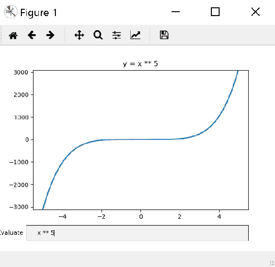


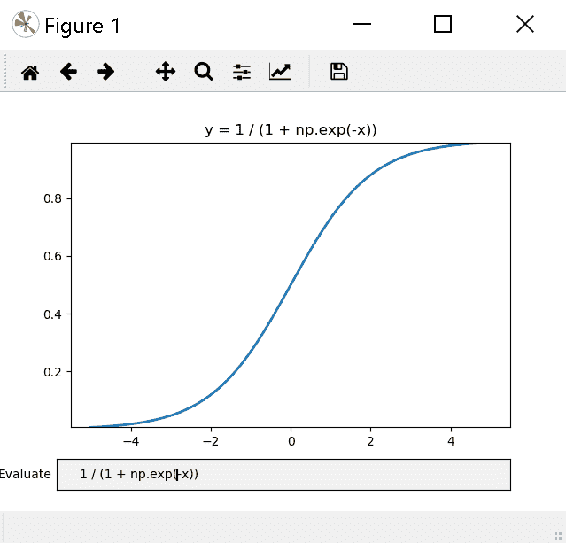

## 动画

在本节中，我们将介绍绘图的动画。 动画是用于根据原始数据创建故事绘图的强大工具。 它是一系列视觉图表框架，这些框架连接在一起以创建视频。 Matplotlib 中的动画图可以另存为`.mp4`文件，可以像其他任何视频一样使用媒体播放器进行播放。

Matplotlib 为和提供了以下两个类来实现动画绘图：

*   `FuncAnimation`
*   `ArtistAnimation`

在本节中，我们将学习如何使用它们。

## Sigmoid 曲线动画 

在本秘籍中，我们将学习如何使用和`FuncAnimation`类为 Sigmoid 曲线制作动画。

## 准备

导入所需的库：

```py
import numpy as np
import matplotlib.pyplot as plt
from matplotlib.animation import FuncAnimation
```

## 操作步骤

以下是实现所需逻辑的步骤：

1.  定义图形和轴域：

```py
fig, ax = plt.subplots()
```

2.  准备要绘制的图形的数据，在这种情况下为 Sigmoid，然后进行绘制：

```py
x = np.arange(-10, 10, 0.01)
y = 1 / (1 + np.exp(-x))
line, = ax.plot(x, y)
```

3.  定义初始化函数`init()`：

```py
def init(): 
    line.set_ydata([np.nan] * len(x))
    return line
```

4.  定义动画函数`animate()`：

```py
def animate(i):
    line.set_ydata(1 / (1 + np.exp(-(x+i/100)))) # keep refreshing frame by frame
    return line,
```

5.  激活动画：

```py
ani = FuncAnimation(fig, animate, 1000, init_func=init, blit=True, 
                    interval=2, save_count=50, 
                    repeat=False, repeat_delay=1000)
```

6.  将输出发送到指定的后端：

```py
plt.show()
```

## 工作原理

这是前面代码块的解释：

*   `ani = FuncAnimation(fig, animate, 1000, init_func=init, blit=True, interval=2, save_count=50,  repeat=False, repeat_delay=1000)`激活动画。 由于我们需要维护对象的状态，因此必须将其分配给变量，如此处所做的：`ani`。 这也有助于将动画保存到`.mp4`文件，我们将在下一个秘籍中学习如何做：
    *   `fig`是正在动画的图形。
    *   `animate`是用于指示将和动画应用于绘图的方式的函数：
        *   `i`是系统变量，包含正在处理的当前帧的帧号。
        *   我们将 *x* 轴数据保持不变，但将 y 轴数据更改为帧号的函数。
    *   `1000`是完成动画的帧数。 该数字可以是任意数字，具体取决于您希望动画运行多长时间。 这也可以是为`animate`函数提供数据的另一个功能。 我们将在后续秘籍中学习。
    *   `init_func=init`一次指定要在开始时应用的初始化函数。 这是一个可选函数，也可以省略。 仅在重新启动`blit=True`时有用。 在这种情况下，我们只是将数据设置为`nan`（不是数字）。
    *   `blit=True`指定仅刷新从前一帧更改为当前帧的图形部分。 这提高了处理速度。
    *   `interval=2`指定连续帧之间的时间延迟为 2 毫秒。
    *   `save_count=50`指定要保存在和高速缓存中的帧数，以提高性能。
    *   `repeat=False`指定在完成所有 1,000 帧后停止动画。 如果我们说`True`，那么它将一次又一次地重复 1,000 帧的循环，直到结束会话为止。
    *   `repeat_delay=1000`指定在完成上一个周期后的 1000 毫秒开始下一个周期。

您应该在动画的末尾看到下图：

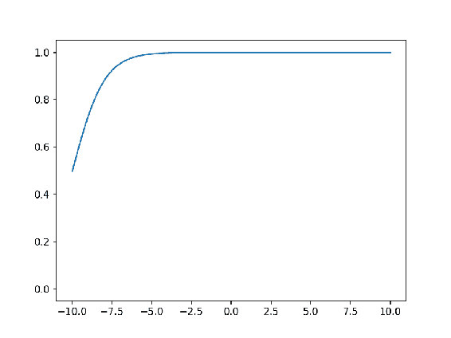

## 将动画保存到 mp4 文件

在本秘籍中，我们将学习如何保存可由媒体播放器播放的动画。 我们将重新创建在上一个秘籍中学习到的动画并将其保存。

您需要在计算机上安装`ffmpeg`包，才能以`.mp4`文件格式保存动画。 对于 Windows 安装，[您可以在此处获取说明](https://www.youtube.com/watch?v=n7-rLDq8uSE)。 有关此包及其应用的更多详细信息，[请参见此处的文档](https://www.ffmpeg.org/documentation.html)。

## 准备

导入所需的库：

```py
import numpy as np
import matplotlib.pyplot as plt
from matplotlib.animation import FuncAnimation
```

## 操作步骤

您可以一次运行先前秘籍的的所有步骤，如下所示，以创建动画：

```py
fig, ax = plt.subplots()

x = np.arange(-10, 10, 0.01)
y = 1 / (1 + np.exp(-x))
line, = ax.plot(x, y)

def init(): # only required for blitting to give a clean slate.
    line.set_ydata([np.nan] * len(x))
    return line

def animate(i):
    line.set_ydata(1 / (1 + np.exp(-(x+i/100)))) # update the data.
    return line

ani = FuncAnimation(fig, animate, 1000, init_func=init, blit=True, 
                    interval=2, save_count=50, repeat=False, repeat_delay=1000)
```

有两种方法可以保存图形：

```py
ani.save("sigmoid.mp4")             
```

您也可以这样保存它：

```py
from matplotlib.animation import FFMpegWriter
writer = FFMpegWriter(fps=25, metadata=dict(title='expdecay',artist='line'), 
                      bitrate=1800)
ani.save("sigmoid.mp4", writer=writer)
```

## 工作原理

`ani.save("sigmoid.mp4")`将`ani`动画保存到工作目录中，名称为`sigmoid.mp4`。

第二个选项也做同样的事情，但是通过传递各种参数，在保存文件的方式上提供了更大的灵活性。 您可以参考文档详细了解这些参数，以及 Matplotlib 支持的其他编写器函数。 有关详细信息，请参见[这里](https://matplotlib.org/api/animation_api.html)。

您可以在代码库中看到`sigmoid.mp4`文件。 您可以运行它并查看动画的工作方式。

## 呈指数衰减的`tan`函数

在本秘籍中，我们将使用指数衰减函数图来查看`FuncAnimation`的另一个示例。

## 准备

导入所需的库：

```py
import numpy as np
import matplotlib.pyplot as plt
from matplotlib.animation import FuncAnimation
```

## 操作步骤

以下是实现和所需逻辑的步骤：

1.  定义图形和轴域：

```py
fig, ax = plt.subplots()
```

2.  绘制空白直线：

```py
xdata, ydata = [], []
line, = ax.plot(xdata, ydata)
```

3.  将限制和网格设置为`True`：

```py
ax.set_xlim(0, 10)
ax.set_ylim(-3.0, 3.0)
ax.grid()
```

4.  定义生成数据的函数，该函数将代替和帧数使用：

```py
def frame_gen(x=0):
    while x < 50:
        x += 0.1
        yield x, np.tan(2*np.pi*x) * np.exp(-x/5.)
```

5.  定义用于引导动画的函数：

```py
def animate(data):
    x, y = data
    xdata.append(x)
    ydata.append(y)
    xmin, xmax = ax.get_xlim()
    if x >= xmax:
         ax.set_xlim(xmin, 2*xmax)
         ax.figure.canvas.draw()
    line.set_data(xdata, ydata)
    return line
```

6.  激活动画：

```py
ani = FuncAnimation(fig, animate, frame_gen, blit=True, interval=2, repeat=False)
```

7.  将输出发送到指定的后端：

```py
plt.show()
```

## 工作原理

这是前面代码块的说明。 它的工作方式类似于之前的 Sigmoid 动画的工作方式。

但是，我们这里不使用`init_func`，而是在`main`函数本身中进行初始化。 代替使用固定数量的帧，我们使用一个函数为每个帧生成数据，直到`x`的值达到`50`为止。 当 x 达到 50 时，一个周期完成，如果设置了`repeat=yes`，则整个周期将继续重复。 否则，它将在一个周期后停止：

*   `ax.set_xlim(0, 10)`将的 *x* 的轴限制设置为从 0 到 10，`ax.set_ylim(-3.0, 3.0)`将的 *y* 的轴限制设置为 -3.0 至 +3.0。
*   `def frame_gen(x=0):`是以`x`的 0.1 增量逐一生成帧的函数。`while`循环在`x`达到值 50 时终止。返回`x`和`y` = `np.tan(2*np.pi*x) * np.exp(-x/5.)`
*   `def animate(data):`是指示动画必须起作用的方法的函数：
    *   它将`frame_gen()`，函数返回的帧接收到，`data`变量中。
    *   `data`变量将其分为 *x* 和 *y* 坐标。
    *   当前帧的 *x* 和 *y* 坐标和当前帧被附加到包含所有先前帧的列表中。
    *   `xmin`，`xmax = ax.get_xlim()`得到 *x* 的当前限制`xmin`和`xmax`变量。
    *   `if x >= xmax:`检查当前帧的 *x* 坐标是否大于`xmax`，如果是，则`ax.set_xlim(xmin, 2*xmax)`为 *x* 轴设置了新的上限，并将上限加倍 。
    *   `ax.figure.canvas.draw()`刷新图形以激活新限制。
    *   `line.set_data(xdata, ydata)`绘制带有 ， 新框架的图形，包括所有 ， 先前的框架。
*   对`frame_gen()`和`animate()`的调用发生在`FuncAnimation`中，因此我们不必担心在函数之间传递数据。

您应该在动画的末尾看到下图。 您还可以在代码库中找到`Exp_decay.mp4`，可以运行它并查看：

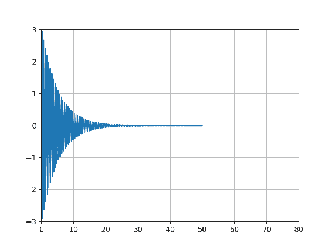

## 气泡图动画

该示例已从 [Matplotlib](https://matplotlib.org/examples/animation/rain.html) 中采用。 原始示例模拟雨滴，但在这里我们添加了不同的颜色组合，使其成为带有动画的气泡图。

## 准备

导入所需的库：

```py
import numpy as np
import matplotlib.pyplot as plt
from matplotlib.animation import FuncAnimation
```

## 操作步骤

以下是实现和所需逻辑的步骤：

1.  定义并实例化图形和轴域：

```py
fig = plt.figure(figsize=(5, 5))
ax = fig.add_axes([0, 0, 1, 1], frameon=False)
```

2.  定义气泡数据结构：

```py
n_bubbles = 50
bubbles = np.zeros(n_bubbles, dtype=[('position', float, 2), ('size', float, 1),
                                     ('growth', float, 1), ('color', float, 4)])
```

3.  随机初始化起始位置：

```py
bubbles['position'] = np.random.uniform(0, 1, (n_bubbles, 2))
```

4.  绘制散点图：

```py
scat = ax.scatter(bubbles['position'][:, 0], bubbles['position'][:, 1], 
                  s=bubbles['size'], lw=0.5, facecolors=bubbles['color'])
```

5.  定义引导动画的动画函数：

```py
def animate(frame_number):
    # Get the index of the bubble to update in this frame, repeat the cycle after all 
    # bubbles are covered
    current_index = frame_number % n_bubbles

    # Make all colors more transparent as time progresses.
    bubbles['color'][:, 3] -= 1.0/len(bubbles)
    bubbles['color'][:, 3] = np.clip(bubbles['color'][:, 3], 0, 1)

    # Increase the bubble size by growth factor
    bubbles['size'] += bubbles['growth']

    # reset position, size, color and growth factor for the current bubble
    bubbles['position'][current_index] = np.random.uniform(0, 1, 2)
    bubbles['size'][current_index] = 5
    bubbles['color'][current_index] = (0.5, 0.2, 0.8, 0.8)
    bubbles['growth'][current_index] = np.random.uniform(50, 250)

    # Update the scatter collection, with the new colors, sizes and positions.
    scat.set_facecolors(bubbles['color'])
    scat.set_sizes(bubbles['size'])
    scat.set_offsets(bubbles['position'])
```

6.  激活动画：

```py
animation = FuncAnimation(fig, animate, interval=20)
```

7.  将输出发送到指定的后端：

```py
plt.show()
```

## 工作原理

以下是和前面的代码块的解释：

*   `ax = fig.add_axes([0, 0, 1, 1], frameon=False)`设置轴域，`frameon=False`指定不绘制轴线。
*   `n_bubbles = 50`将气泡数设置为 50。
*   `bubbles`使用位置，大小，增长因子和颜色为定义数据结构，并使用零初始化所有这些数据结构。 位置是 *x* 和 *y* 坐标，大小和增长分别是一个属性，颜色是 RGBA，因此是四个属性。
*   `bubbles['position'] = np.random.uniform(0, 1, (n_bubbles, 2))`随机设置所有气泡的初始位置，所有坐标都在零和 1 之间。
*   `ax.scatter()`使用位置坐标，大小和颜色参数绘制散点图。
*   `def animate(frame_number):`定义动画函数，该函数指示动画应如何表现：
    *   `frame_number`指定当前正在处理的当前帧，由`FuncAnimation`自动管理。
    *   `current_index = frame_number % n_bubbles`得出在`n_bubbles`范围内的当前气泡的索引。 在每一帧中，都会更新一个气泡。
    *   `bubbles['color'][:, 3] -= 1.0/len(bubbles)`会降低所有气泡的透明度（alpha）属性，以便随着时间的推移它们会变得更加透明。
    *   `bubbles['color'][:, 3] = np.clip(bubbles['color'][:, 3], 0, 1)`如果透明度属性的值小于零，则将其裁剪为零；如果大于 1，则将其为 1。
    *   `bubbles['size'] += bubbles['growth']`以所有气泡的相应增长率增加它们的大小。 由于增长已初始化为零，因此第一次只会为所有气泡添加零。
    *   `bubbles['position'][current_index] = np.random.uniform(0, 1, 2)`重置当前气泡的位置，两个坐标介于零和 1 之间。
    *   `bubbles['size'][current_index] = 5`将当前气泡的大小重置为 5 点。
    *   `bubbles['color'][current_index] = (0.5, 0.2, 0.8, 0.8)`将 RGBA 格式的颜色重置为当前气泡。
    *   `bubbles['growth'][current_index] = np.random.uniform(50, 250)`重置当前气泡的增长因子。
    *   `scat.set_facecolors(bubbles['color'])`重设气泡的脸色，`scat.set_sizes(bubbles['size'])`重设大小，`scat.set_offsets(bubbles['position'])`重设散点图上的位置。
*   `animation = FuncAnimation(fig, animate, interval=20)`激活动画。
*   `plt.show()`将输出发送到指定的后端。

在动画的最后，`figure`应该看起来像这里显示的那样。 您还可以在代码库中看到`bubbles.mp4`：

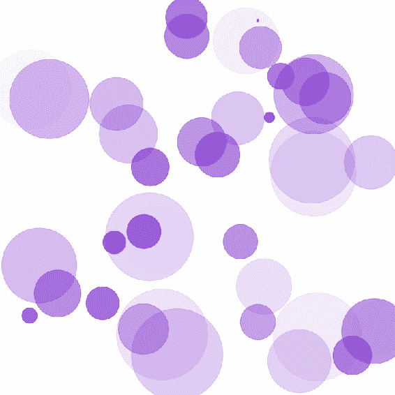

## 多个折线图的动画

在本秘籍中，我们将学习如何使用`ArtistAnimation`为序列中的多个线形图设置动画。 对于本示例，我们将使用本章已经使用过两次的相同 ROC 曲线数据。

## 准备

导入所需的库：

```py
import matplotlib.pyplot as plt
import pandas as pd
from matplotlib.animation import ArtistAnimation
```

## 操作步骤

以下是实现和所需逻辑的步骤：

1.  从和对应的 Excel 文件中读取所有 ROC 图的`tpr`和`fpr`数据：

```py
fpr_logreg = pd.read_excel('ROC_Curves.xlsx', 'fpr_logreg')
tpr_logreg = pd.read_excel('ROC_Curves.xlsx', 'tpr_logreg')
fpr_KNN = pd.read_excel('ROC_Curves.xlsx', 'fpr_KNN')
tpr_KNN = pd.read_excel('ROC_Curves.xlsx', 'tpr_KNN')
fpr_MLP = pd.read_excel('ROC_Curves.xlsx', 'fpr_MLP')
tpr_MLP = pd.read_excel('ROC_Curves.xlsx', 'tpr_MLP')
fpr_SGD = pd.read_excel('ROC_Curves.xlsx', 'fpr_SGD')
tpr_SGD = pd.read_excel('ROC_Curves.xlsx', 'tpr_SGD')
fpr_GNB = pd.read_excel('ROC_Curves.xlsx', 'fpr_GNB')
tpr_GNB = pd.read_excel('ROC_Curves.xlsx', 'tpr_GNB')
fpr_svc = pd.read_excel('ROC_Curves.xlsx', 'fpr_svc')
tpr_svc = pd.read_excel('ROC_Curves.xlsx', 'tpr_svc')
fpr_RF = pd.read_excel('ROC_Curves.xlsx', 'fpr_RF')
tpr_RF = pd.read_excel('ROC_Curves.xlsx', 'tpr_RF')
fpr_DT = pd.read_excel('ROC_Curves.xlsx', 'fpr_DT')
tpr_DT = pd.read_excel('ROC_Curves.xlsx', 'tpr_DT')
```

2.  定义图并绘制所有 ROC 曲线：

```py
fig = plt.figure()
l0 = plt.plot([0, 1], [0, 1], 'k--')
l1 = plt.plot(fpr_logreg, tpr_logreg, label='LogReg', color='purple', animated=True)
l2 = plt.plot(fpr_KNN, tpr_KNN, label='KNN', color='green', animated=True)
l3 = plt.plot(fpr_DT, tpr_DT, label='DecisionTree', color='orange', animated=True)
l4 = plt.plot(fpr_RF, tpr_RF, label='Random Forest', color='yellow', animated=True)
l5 = plt.plot(fpr_MLP, tpr_MLP, label='MLP', color='red', animated=True)
l6 = plt.plot(fpr_svc, tpr_svc, label='SVC', color='violet', animated=True)
l7 = plt.plot(fpr_GNB, tpr_GNB, label='GNB', color='grey', animated=True)
l8 = plt.plot(fpr_SGD, tpr_SGD, label='SGD', color='pink', animated=True)
```

3.  设置图的标签，标题和图例：

```py
plt.xlabel('False Positive Rate', size=15, color='m')
plt.ylabel('True Positive Rate', size=15, color='m')
plt.title('ROC curve', size=25, color='b')
plt.legend(loc='lower right', fancybox=True, shadow=True)
```

4.  为所有 ROC 曲线的线定义一个列表：

```py
lines = [l1, l2, l3, l4, l5, l6, l7, l8]
```

5.  激活动画：

```py
ani = ArtistAnimation(fig, lines, blit=True, interval=1000, repeat=True, repeat_delay=2500)
```

6.  将输出发送到指定的后端：

```py
plt.show()
```

## 工作原理

这是前面代码块的说明。

前三个步骤是您熟悉的，除了在每个 plot 语句中我们添加一个额外的参数`animated=True`来指示艺术家将成为动画的一部分。

`lines = [l1, l2, l3, l4, l5, l6, l7, l8]`是在动画*步骤 2* 中定义的所有艺术家的列表，并将其作为参数传递给`ArtistAnimation`。

`ani = ArtistAnimation(fig, lines, blit=True, interval=1000, repeat=True, repeat_delay=2500)`通过以 1,000 毫秒的时间间隔一次显示一位艺术家来激活动画，并以 2500 毫秒的时间延迟重复循环。

这是输出的外观。 您还可以在代码库中看到`ROC_Curves.mp4`：

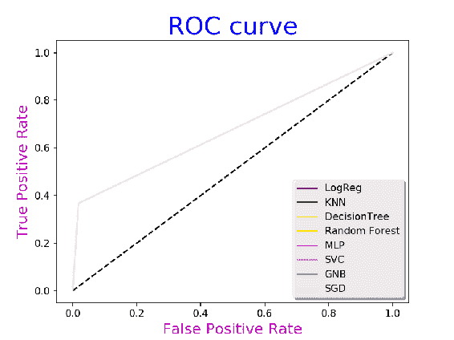

## 图像动画

在本秘籍中，我们将学习如何使用相同的`ArtistAnimation`类对图像进行动画处理。

## 准备

导入所需的库：

```py
import matplotlib.pyplot as plt
from matplotlib.pyplot import imshow, imread
from matplotlib.animation import ArtistAnimation
```

## 操作步骤

以下是实现和所需逻辑的步骤：

1.  定义图形和轴域：

```py
fig = plt.figure(figsize=(5,5), dpi=50)
ax = fig.add_axes([0, 0, 1, 1], frameon=False)
```

2.  阅读和所需的图像，并创建所有这些图像的列表：

```py
images = []
image1 = imshow(imread("monet.png"), animated=True)
images.append([image1])

image2 = imshow(imread("louvre_small.png"), animated=True)
images.append([image2])

image3 = imshow(imread("vangogh.png"), animated=True)
images.append([image3])

image4 = imshow(imread("persepalis.png"), animated=True)
images.append([image4])
```

3.  激活动画：

```py
ani = ArtistAnimation(fig, images, interval=1000, blit=False, 
                      repeat=True, repeat_delay=2500)
```

4.  将输出发送到指定的后端：

```py
plt.show()
```

## 工作原理

读取四个图像并将其保存到一个列表中，该列表将传递到`ArtistAnimation`。 保存图像时，我们使用和`animated=True`参数，这与我们在前面的秘籍中所做的类似。 动画将一次显示一张图像。 因此，这里我们没有显示这四个图像中的任何一个，但是您可以在动画图的代码库中看到`images.mp4`文件 。