# 九、在图形用户界面中嵌入绘图

在本章中，我们将介绍以下秘籍：

*   使用 Matplotlib 的滑块和按钮小部件
*   使用嵌入在 Matplotlib 应用中的 Tkinter GUI 的滑块和按钮小部件
*   将 Matplotlib 嵌入到 Tkinter GUI 应用中
*   使用 Matplotlib 应用中嵌入的 wxPython GUI 的滑块和按钮小部件
*   在 wxPython GUI 应用中嵌入 Matplotlib
*   使用嵌入在 Matplotlib 应用中的 Qt GUI 的滑块和按钮小部件
*   将 Matplotlib 嵌入 Qt GUI 应用中

## 介绍

GUI 本身是一个非常大的主题，每个 GUI 框架/工具包都需要单独的一本书来全面地介绍它。 因此，对每个 GUI 框架功能的详细讨论超出了本书的范围。 此处的目的是演示某些 GUI 框架如何利用 Matplotlib 的可视化功能。

在上一章中，我们学习了如何使用三个**图形用户界面**（**GUI**）框架 Tkinter 使用事件，小部件和动画 ， wxPython 和 Qt 作为后端。 在那里，我们仅将这些后端 GUI 用于显示目的，因此只需切换后端即可在所有 GUI 框架中使用相同的 Matplotlib 代码。

在本章中，我们将学习交互式绘图的另一个功能，即使用相同的三个 GUI 框架将 Matplotlib 嵌入 GUI。 首先，我们将学习如何利用 Matplotlib 图形中的 GUI 工具包的一些功能来代替 Matplotlib 的本机功能。 这意味着我们仍将运行 Matplotlib 应用来控制流程，包括打开和关闭应用。 这实际上是将 GUI 功能嵌入 Matplotlib 的图形中。 由于每个 GUI 框架都有自己的架构和语法，因此和相同的代码不能用于所有 GUI 框架，就像我们在上一章中所做的那样。 这对于三个 GUI 框架中的每一个都必须重复进行。

然后，我们将学习如何使用 GUI 框架运行应用，但如何利用 Matplotlib 的功能进行绘图。 当您的主应用以任何这些 GUI 框架编写时，这将派上用场，但是您想要在这些应用中利用 Matplotlib 丰富的可视化功能。

Matplotlib 支持许多 GUI 框架。 我们基于 Tkinter，wxPython 和 Qt 的流行程度以及它们带有标准发行版（例如 Anaconda）的事实选择了 Tkinter，wxPython 和 Qt，因此与其他 GUI 框架不同，不需要进一步的安装和配置。 但是，Matplotlib 接口类似于所有 GUI 框架，因此从这三个 GUI 框架中学习可以轻松扩展到其他 GUI 框架。

## Matplotlib 和 GUI 应用之间的接口

在继续具体秘籍之前，重要的是了解内部工作原理，了解 Matplotlib 和， 后端 GUI 工具包有效。 这使您更容易理解三种操作模式之间的区别：

1.  使用 GUI 后端的的 Matplotlib 应用，仅用于显示
2.  一个 Matplotlib 应用，它使用一些 GUI 功能/部件（在 Matplotlib 应用的中嵌入了 GUI 功能）
3.  使用 Matplotlib 绘图的 GUI 应用（将 Matplotlib 嵌入 GUI 应用中）

Matplotlib 中的以下三个对象与该接口有关：

*   图形
*   画布
*   管理器

尽管，内部工作原理和这些对象之间的关系有点复杂，但足以理解和图是进入整个绘图的所有艺术家的根艺术家（包括子图，网格等），画布是在其上绘制图形的游乐场，而管理器则是通过控制接口指定的后端。

管理器的工作是处理三个 GUI 元素：窗口，画布和导航工具栏。 窗口是主要的 GUI 应用，导航工具栏特定于和 GUI 应用，可对图形画布进行交互式分析。 每个 GUI 从`FigureCanvasBase`继承其画布。 因此，GUI 和 Matplotlib 之间的接口是画布，GUI 框架和 Matplotlib 对象之间的交互由管理器管理。

在第一种操作模式下，后端仅用于显示，`plt.figure()`调用的`Figure`，`FigureCanvas`和`FigureManager`适用于指定的后端；`FigureManager`依次将创建 GUI 的主窗口和导航工具栏对象，并将`FigureCanvas`和导航工具栏打包到该窗口中。

在第二种操作模式下，在 Matplotlib 应用中使用了某些和 GUI 功能，我们仍将使用`plt.figure()`来执行第一种模式中的功能； 此外，  Matplotlib 应用通过主窗口完成事件循环，将  GUI 小部件和这些小部件上的事件与画布连接起来。

在第三种操作模式中，由于两个原因，我们将完全消除对`pyplot`的使用，从而彻底取消对`FigureManager`的使用。 首先，默认情况下`pyplot`假定打开和关闭应用，而在这种模式下，我们需要 GUI 来控制应用流。 其次，`FigureManager`的所有功能都是现在由 GUI 应用控制。 因此，在这种模式下，GUI 工具包功能控制着应用的打开，关闭以及 GUI 工具包与 Matplotlib 之间的交互。 这些功能因一个 GUI 工具箱的不同而异，因此没有通用的语法或代码。

## 使用 Matplotlib 的滑块和按钮小部件

我们在上一章中学习了 Matplotlib 的`Button`小部件，但是滑块是一个新的小部件，我们将在这里学习。 但是，此秘籍的目的是演示如何仅通过更改后端即可在不进行任何代码更改的情况下跨 GUI 框架使用 Matplotlib 小部件应用。 我们还将在所有 GUI 框架中使用相同的极坐标图，以便我们可以看到它们工作方式上的差异，而不是迷失在图本身的细节中！

我们将使用`Slider`确定极坐标图中要绘制的叶片数。 每次拖动`Slider`时，都会使用`Slider`的值来绘制该图中的许多叶子。

我们将使用`Quit`按钮通过关闭图形对象和窗口对象来退出应用。

## 准备

让我们设置要使用的后端。 这是为不同的 GUI 框架更改的唯一代码，以跨，三个选定的 GUI 框架来运行此绘图：

```py
import matplotlib matplotlib.use('tkagg')
```

让我们导入所需的库：

```py
import numpy as np
import matplotlib.pyplot as plt
from matplotlib.widgets import Button, Slider
```

## 操作步骤

这是编码所需逻辑的所需步骤：

1.  准备极坐标图的数据：

```py
theta = np.arange(0., 2., 1./180.)*np.pi
```

2.  定义并实例化图形：

```py
fig = plt.figure(figsize=(6, 5), dpi=100)
```

3.  定义轴域并在图中实例化它：

```py
ax = fig.add_subplot(111, projection='polar')
```

4.  绘制极坐标图：

```py
initial_n = 4
ax.plot(theta, 5*np.cos(initial_n*theta))
```

5.  定义并实例化`Slider`小部件：

```py
ax_s = plt.axes([0.15, 0.05, 0.25, 0.05])
slider_n = Slider(ax_s, '#of leaves', 3, 10, valinit=initial_n, 
                  valstep=1.0)
```

6.  定义滑块小部件的回调函数：

```py
def onchanged(s_value):
    ax.clear()
    ax.plot(theta, 5*np.cos(int(s_value)*theta)) 
```

7.  将事件与对应的回调函数`onchanged`映射到`Slider`小部件：事件和`Slider`小部件：

```py
slider_n.on_changed(onchanged)
```

8.  定义并实例化`Button`小部件：

```py
ebx = plt.axes([0.5, 0.005, 0.1, 0.05])
exit = Button(ebx, 'Quit')
```

9.  定义按钮的回调函数：

```py
def close(event):
    plt.close('all')
```

10.  将`on_clicked`事件与，对应的回调函数`close`对应起来：

```py
exit.on_clicked(close)
```

11.  在指定的后端上显示图：

```py
plt.show()
```

## 工作原理

这是代码的说明：

*   前四个步骤已经为您所熟悉。
*   `ax_s = plt.axes([0.15, 0.05, 0.25, 0.05])`定义将放置`Slider`小部件的轴域。
*   `slider_n = Slider(ax_s, '#of leaves', 3, 10, valinit=initial_n, valstep=1.0)`定义滑块：
    *   第一个参数是轴域引用，和第二个参数是要在图中的滑块上显示的标签。
    *   滑块的最小值为 3，即起点，最大值为 10。 因此，通过使用鼠标拖动滑块，该值将从 3 更改为 10。
    *   `valinit`指定滑块上的起点，当图形第一次显示时显示。 在这里，我们将其指定为 4。
    *   `valstep`指定当我们将鼠标拖动到滑块上时，值以什么步长增加。 在这里，我们将其指定为 1.0，因为它表示叶子数。
*   `def onchanged(s_value):`是滑块的回调函数。 它接收滑块的当前值，清除先前在轴域上的图，并用新值绘制图形。
*   `slider_n.on_changed(onchanged)`捕获滑块上的`on_changed`事件，然后调用回调函数`onchanged`。
*   `ebx = plt.axes([0.5, 0.005, 0.1, 0.05])`定义要放置按钮的轴域，`exit = Button(ebx, 'Quit')`定义按钮。
*   `ebx`是轴域引用； `'Quit'`是要放置在图中按钮小部件上的标签
*   `def close(event):`是`Button`小部件的回调函数。 它只是关闭所有图形窗口。
*   `exit.on_clicked(close)`捕获按钮上的`on_clicked`事件 ，并调用回调函数`close`
*   `plt.show()`在`tkagg`后端上显示图。

运行前面的代码时，应该获得以下输出图。 第一个图是您第一次获得图时看到的。 当我们使用 4 初始化滑块时，它将具有四片叶子。将滑块拖动到 8.00 时，您将看到第二个图：

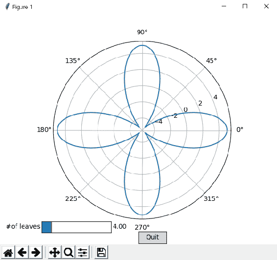

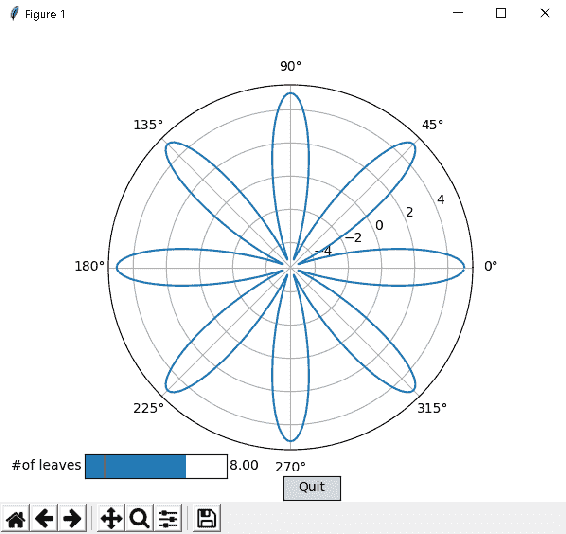

## 使用 Tkinter GUI 的滑块和按钮小部件

在本秘籍中，我们将学习如何使用，Tkinter GUI 的滑块和按钮小部件代替 Matplotlib 小部件。 该绘图的功能与先前秘籍的完全相同。 Matplotlib 仍具有程序控制流程，我们仍将使用`plt.figure()`来调用，后端和关联的小部件。 此外，我们将调用 Tkinter 的`tk.Scale`缩放器和`tk.Button`按钮小部件，带有关联的回调函数，代替了我们在前面的秘籍中使用的 Matplotlib 的滑块和按钮小部件。

## 准备

设置后端：

```py
import matplotlib
matplotlib.use('tkagg')
```

导入所需的库：

```py
import tkinter as tk 
import numpy as np
import matplotlib.pyplot as plt
```

## 操作步骤

以下是实现逻辑所需的步骤：

1.  准备极坐标图的数据：

```py
theta = np.arange(0., 2., 1./180.)*np.pi
```

2.  定义并实例化图形：

```py
fig = plt.figure(figsize=(6, 5), dpi=100)
```

3.  定义并实例化图中的轴域：

```py
ax = fig.add_subplot(111,projection='polar')
```

4.  绘制极坐标图：

```py
ax.plot(theta, 5*np.cos(3*theta))
```

5.  定义将要放置和 Tkinter 小部件的窗口：

```py
window = fig.canvas.manager.window
```

6.  定义滑块小部件的回调函数：

```py
def update():
    n=n_slider.get()
    ax.clear()
    ax.plot(theta, 5*np.cos(n*theta))
    fig.canvas.draw()
```

7.  定义并实例化滑块：

```py
n_slider = tk.Scale(master=window,variable=tk.IntVar(), from_=3, 
                    to=10, label='#of leaves', orient=tk.HORIZONTAL,length=int(fig.bbox.width), 
       width=int(fig.bbox.height * 0.05), command = lambda i : 
             update())
```

8.  将滑块打包到窗口中：

```py
n_slider.set(4)
n_slider.pack(after=fig.canvas.get_tk_widget())
```

9.  定义**退出**按钮的回调函数：

```py
def close():
    plt.close('all') 
    window.quit()
```

10.  定义并实例化`Button`：

```py
button = tk.Button(master=window, text="Quit", command=close)
```

11.  将按钮打包到窗口中：

```py
button.pack(side=tk.BOTTOM)
```

12.  在 Tkinter 后端上显示图：

```py
plt.show()
```

## 工作原理

这是前面代码的解释：

*   前四个步骤已经为您所熟悉。
*   `window = fig.canvas.manager.window`可通过其窗口访问 Tkinter 的应用。
*   `def update():`是`tk.Scale`小部件的回调函数：
    *   `n=n_slider.get()`获取拖动和释放鼠标时滑块的当前值，在这种情况下为 7。
    *   `ax.clear()`删除轴域上的前一个图。
    *   `ax.plot(theta, 5*np.cos(n*theta))`绘制新图，其当前值为`n`。
    *   `fig.canvas.draw()`刷新图形。
*   `n_slider = tk.Scale()`定义带有以下参数的滑块小部件：
    *   `master=window`指定将滑块小部件创建为主窗口的的子级。
    *   `variable=tk.IntVar()`指定滑块变量是整数； 由于它代表绘图上的叶子数，因此将其定义为整数是有意义的。
    *   `from_=3`和`to=10`表示滑块的起始值和结束值，因此用户可以在 3 到 10 之间拖动滑块。
    *   `label='#of leaves'`指定要在滑块左侧显示的滑块标签。
    *   `orient=tk.HORIZONTAL`指定缩放器是水平绘制的，而不是垂直绘制的。
    *   `length=int(fig.bbox.width)`指定窗口小部件的长度（以像素为单位）。`fig.bbox.width`以浮点数返回图形的宽度，`int`将其转换为整数。 因此，缩放器将完整的图形水平分布。
    *   `width=int(fig.bbox.height * 0.05)`指定缩放器的高度（以像素为单位）。 通过乘以 0.05，我们得到的是缩放器总图形高度的 5%。
    *   `command = lambda i : update()`将滑块的回调函数指定为`update()`，因此，当我们在滑块上拖动鼠标并释放时，它将调用更新函数。
*   `n_slider.set(4)`设置滑块的初始值，第一次显示绘图时，将显示 ， 。 因此，当该图第一次显示时，我们应该看到有四个叶子。
*   `n_slider.pack(after=fig.canvas.get_tk_widget())`指定在画布下方（之后）绘制滑块小部件。 Tkinter 没有画布的子类，但是可以通过 ，`get_tk_widget()`方法访问画布。`pack()`是将小部件打包到窗口中的 Tkinter 方法。
*   `def close():`是按钮小部件的回调函数：
    *   `plt.close('all')`关闭所有数字
    *   `window.quit()`退出窗口应用
*   `button = tk.Button()`定义了 Tkinter 的按钮小部件：
    *   `master=window`指定应将按钮小部件创建为主窗口的子级。
    *   `text="Quit"`指定按钮的标签，该标签将显示在按钮上。
    *   `command=close`指定回调函数为`close()`。
*   `button.pack(side=tk.BOTTOM)`指定按钮应包装在底部的窗口中。
*   `plt.show()`在 Tkinter 后端上显示图形。

当您运行前面的代码时，您应该第一次获得第一张图。 将滑块拖动到 7 时，应该会看到第二个图。 您可以通过单击 **退出**按钮退出：

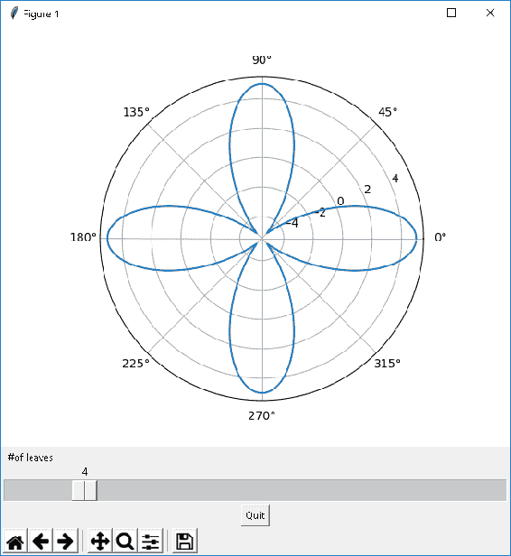

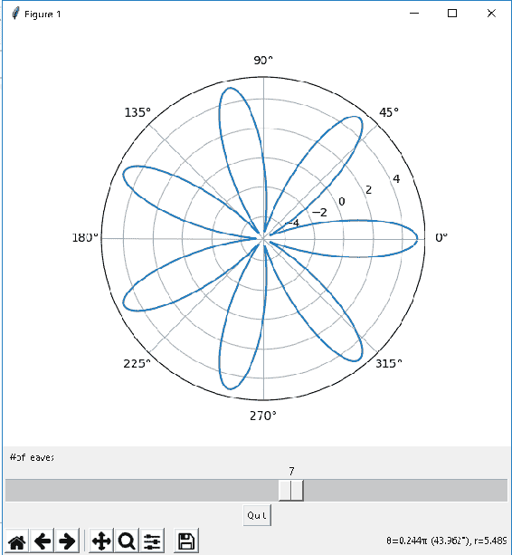

## 将 Matplotlib 嵌入到 Tkinter GUI 应用中

在本秘籍中，我们将学习如何将 Matplotlib 嵌入到 Tkinter GUI 应用中。 在这里，应用流程的控制将通过 Tkinter 进行。 在这里，我们将不使用， `pyplot`模块和相关的`plt.figure()`方法。 相反，我们调用  Tkinter 应用并将 Matplotlib 的画布作为小部件嵌入。

## 准备

在这里，我们将不会设置后端，因为应用本身将从 GUI 的启动。

导入所需的库：

```py
import tkinter as tk 
import numpy as np
from tkinter.font import Font
from matplotlib.figure import Figure
from matplotlib.backends.backend_tkagg import (FigureCanvasTkAgg, NavigationToolbar2Tk)
```

## 操作步骤

以下是实现逻辑要遵循的步骤：

1.  定义并实例化图形：

```py
fig = Figure(figsize=(6, 5), dpi=100)
```

2.  定义 Tkinter 窗口并设置该窗口的标题：

```py
window=tk.Tk()
window.wm_title("Embedding in Tk")
```

3.  定义和画布和导航工具栏，然后将它们打包到 Tkinter 窗口中：

```py
canvas = FigureCanvasTkAgg(fig, master=window) 
toolbar = NavigationToolbar2Tk(canvas, window)
canvas._tkcanvas.pack(side=tk.TOP, fill=tk.BOTH, expand=1)
```

4.  在各种小部件上定义用于文本的字体：

```py
myfont = Font(family='Helvetica', size=12, weight='bold')
```

5.  在图上定义轴域，准备数据，并绘制极坐标图：

```py
ax = fig.add_subplot(111,projection='polar')
theta = np.arange(0., 2., 1./180.)*np.pi
ax.plot(theta, 5*np.cos(3*theta))
```

6.  定义`Slider`小部件的回调函数：

```py
def update():
    n=n_slider.get()
    ax.clear()
    ax.plot(theta, 5*np.cos(n*theta))
    fig.canvas.draw()
```

7.  定义并实例化`Slider`小部件，并将其打包到`window`中：

```py
n_slider = tk.Scale(master=window,variable=tk.IntVar(), from_=3, 
                 to=10, label='#of leaves', 
                 orient=tk.HORIZONTAL,length=int(fig.bbox.width), 
                 width=int(fig.bbox.height * 0.05), command = 
                 lambda i : update(),font=myfont)
n_slider.set(4)
n_slider.pack(after=fig.canvas.get_tk_widget())
```

8.  为**退出**按钮小部件定义`callback`函数：

```py
def exit():
    window.quit() 
    window.destroy()
```

9.  定义并实例化`Quit`按钮并将其打包到`window`中：

```py
button = tk.Button(master=window, text="Quit", command=exit, 
                   font=myfont)
button.pack(side=tk.BOTTOM)
```

10.  启动`mainloop`以捕获用户触发的事件：

```py
tk.mainloop()
```

## 工作原理

这是前面代码的解释：

*   `fig = Figure(figsize=(6, 5), dpi=100)`定义并实例化图形对象。`Figure()`从`matplotlib.figure`类的导入。 在前两个秘籍中，我们为此目的使用了`plt.figure()`！
*   `window=tk.Tk()`通过其主窗口小部件调用 Tkinter GUI 应用。
*   `window.wm_title("Embedding in Tk")`设置窗口的标题，该标题将显示在窗口顶部。
*   `canvas = FigureCanvasTkAgg(fig, master=window)`定义画布（图形的游乐场，例如绘制图形的纸张），并将图形附加到此画布上：
    *   `master=window`指定画布是 Tkinter 窗口对象的子级。
    *   `toolbar = NavigationToolbar2Tk(canvas, window)`再次将导航工具栏指定为 Tkinter 窗口的子级，并将其附加到画布上。
*   `canvas._tkcanvas.pack(side=tk.TOP, fill=tk.BOTH, expand=1)`将画布和导航工具栏打包到 Tkinter 的主窗口中：
    *   `side=tk.TOP`指定要放置在`window`顶部的画布，要位于其下面的工具栏。
    *   `fill=tk.BOTH`指定画布应在 *X*（水平）和 *Y*（垂直）方向上填充`window`
    *   `expand=1`指定在容纳所有小部件之后，将主`window`中的任何附加空间均等地调整为具有`expand=1`的小部件。
    *   `myfont = Font(family='Helvetica', size=12, weight='bold')`定义了用于小部件上的文本的字体字典，以便它们在图中看起来都相似。
*   *步骤 5* 定义极坐标图的轴域，数据，并将其绘制在轴域上。
*   `def update():`是滑块小部件的回调函数，如前面的秘籍中所述。
*   `n_slider = tk.Scale()`定义滑块控件，然后将其初始化为 4，然后将其打包到窗口中，如前面的秘籍中所述。
*   `def exit():`是**退出**按钮的回调函数，用于退出应用。 这与先前秘籍中使用的`close()`函数不同：
    *   `window.quit()`从`mainloop`退出。
    *   `window.destroy()`销毁了该应用，以避免特别是 Windows OS 中的错误。
    *   `button = tk.Button()`和`button.pack(side=tk.BOTTOM)`与前面的秘籍中所述相同。
*   `tk.mainloop()`调用 Tkinter 的主应用循环以捕获事件，调用适当的回调函数。

运行前面的代码时，应该第一次看到第一个图，将滑块拖动到 9 时，应该看到第二个图。 您可以通过单击 **退出**按钮来退出应用：

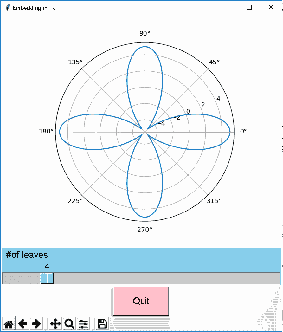

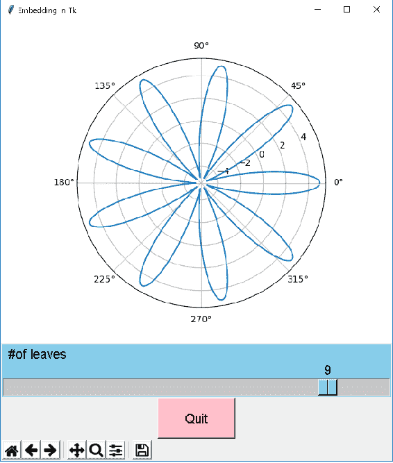

## 使用 WxPython GUI 的滑块和按钮小部件

在本秘籍中，我们将学习如何使用 wxPython 的滑块和按钮小部件代替 Matplotlib 小部件，就像我们使用 Tkinter 小部件一样。

wxPython 是 wxWidgets 模块的包装。 它还与标准 Python 发行版（如 Anaconda）打包在一起。

## 准备

将后端设置为`wxAgg`：

```py
import matplotlib
matplotlib.use('wxagg')
```

导入所需的库：

```py
import wx
import numpy as np
import matplotlib.pyplot as plt
```

## 操作步骤

以下是实现所需逻辑的步骤：

1.  定义并实例化图形：

```py
fig = plt.figure(figsize=(6, 5), dpi=100)
```

2.  定义轴域，定义极坐标图的数据，然后绘制极坐标图：

```py
ax = fig.add_subplot(111,projection='polar')
theta = np.arange(0., 2., 1./180.)*np.pi
ax.plot(theta, 5*np.cos(4*theta))
```

3.  定义我们用来通过 Matplotlib 连接`wx`小部件的窗口：

```py
window = fig.canvas.manager.window
```

4.  为滑块小部件定义回调函数：

```py
def update(event):
    n=n_slider.GetValue()
    ax.clear()
    ax.plot(theta, 5*np.cos(n*theta))
    fig.canvas.draw()
```

5.  定义并实例化`wxPython`的滑块小部件，并将其与回调函数绑定：

```py
n_slider = wx.Slider(window, wx.ID_ANY, 4, 3, 10, size=(250,10),
                     style=(wx.SL_AUTOTICKS | wx.SL_HORIZONTAL | 
                            wx.SL_LABELS))
n_slider.Bind(wx.EVT_SCROLL, update)
```

6.  为**退出**按钮小部件定义回调函数：

```py
def close(event):
    plt.close('all') 
```

7.  定义并实例化`Quit`按钮小部件并将其与回调函数绑定：

```py
button = wx.Button(window, wx.ID_ANY, "Quit")
button.Bind(wx.EVT_BUTTON, close)
```

8.  用定义当前`window`大小的`sizer`：

```py
sizer = window.GetSizer()
```

9.  将按钮小部件插入到`window`中：

```py
sizer.Insert(0, button, 0, wx.ALIGN_CENTER)
```

10.  将滑块小部件插入`window`的中：

```py
sizer.Insert(2, n_slider, 0, wx.ALIGN_RIGHT)
```

11.  在`wxPython`后端上显示图形：

```py
plt.show()
```

## 工作原理

这是前面代码的解释：

*   前两个步骤使用`plt.figure()`，轴域和数据定义图形，并在图形上绘制和极坐标图。
*   `window = fig.canvas.manager.window`可以通过其窗口访问`wxPython`应用。
*   `def update(event):`是`wx.Slider()`小部件的回调函数。 在这里，我们必须将`event`参数传递给函数：
    *   `n=n_slider.GetValue()`获取滑块的当前值。 请注意，语法与 Tkinter 相比有所不同。
    *   此函数的其余三个步骤与 Tkinter 完全相同。
*   `n_slider = wx.Slider(window, wx.ID_ANY, 3, 3, 10, size=(250,10), style=(wx.SL_AUTOTICKS | wx.SL_HORIZONTAL | wx.SL_LABELS))`定义了滑块小部件：
    *   `window`指定滑块是主窗口的子对象。
    *   `wx.ID_ANY`指定为此小部件使用系统生成的标识号。
    *   滑块第一次出现时的初始值为 3。
    *   3 和 10 是滑块的起始值和结束值。
    *   `size=(250,10)`指定滑块控件的长度和高度（以像素为单位）。
    *   `style()`指定滑块的各种参数：
        *   `wx.SL_AUTOTICKS`指定滑块应显示刻度线。
        *   `wx.SL_HORIZONTAL`指定滑块应水平放置。
        *   `wx.SL_LABELS`指定滑块的开始，当前值和结束值的打印标签。
*   `n_slider.Bind(wx.EVT_SCROLL, update)`将滑块的滚动事件与对应的回调函数`update()`连接起来。
*   `def close(event):`是**退出**按钮的回调函数。 它基本上关闭了所有数字。
*   `button = wx.Button(window, wx.ID_ANY, "Quit")`定义 WxPython 的按钮小部件：
    *   `window`指定按钮是主窗口的子对象
    *   `wx.ID_ANY`指定为此小部件使用系统生成的标识号
    *   `"Quit"`是要在按钮小部件上打印的标签
*   `button.Bind(wx.EVT_BUTTON, close)`将按钮的点击事件连接到相应的回调函数`close()`上。
*   `sizer = window.GetSizer()`获取当前窗口大小。`sizer`是 WxPython 创建绘制在图中的各种小部件的布局的方式。
*   `sizer.Insert(0, button, 0, wx.ALIGN_CENTER)`在主窗口中绘制按钮小部件：
    *   `0`指定此窗口小部件在窗口中的放置顺序。 0 表示将其放置在索引 0 处，这意味着该按钮将位于窗口的顶部。
    *   `button`将小部件放置在图形上。
    *   `0`指定不进行窗口小部件的相对大小调整。
    *   `wx.ALIGN_CENTER`指定窗口小部件应在中心对齐。
*   `sizer.Insert(2, n_slider, 0, wx.ALIGN_RIGHT)`将滑块控件绘制在第二个索引处。 画布会自动放置在索引 1，将滑块推到窗口底部：
    *   `wx.ALIGN_RIGHT`指定滑块小部件应在窗口中右对齐
*   `plt.show()`在`wxPython's`后端显示图形。

当您运行上述代码时，将滑块拖动到 10 时，您应该第一次看到的第一个图，第一次，的第二个图出现。您可以通过单击退出应用的 **退出**按钮：

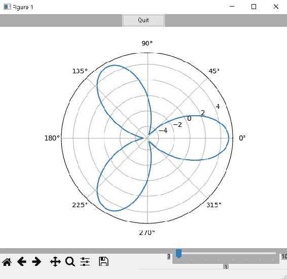

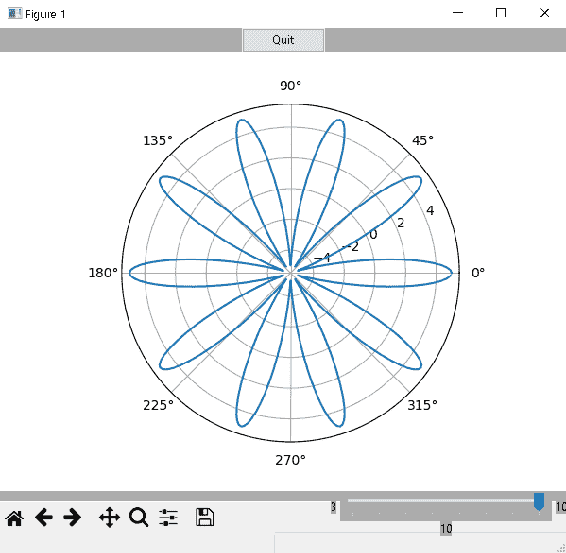

## 将 Matplotlib 嵌入到 wxPython GUI 应用中

在本秘籍中，我们将学习如何在 wxPython GUI 应用中嵌入 Matplotlib 图。 我们将使用与本章相同的数据和绘图。

## 准备

导入所需的库：

```py
import wx
import numpy as np
from matplotlib.figure import Figure
from matplotlib.backends.backend_wxagg import FigureCanvasWxAgg as FigureCanvas
from matplotlib.backends.backend_wxagg import NavigationToolbar2WxAgg 
```

## 操作步骤

以下是实现逻辑所需的步骤：

1.  定义`wxPython`应用：

```py
app = wx.App()
```

2.  定义显示绘图和小部件的窗口：

```py
window = wx.Frame(None, -1, "Embedding with wxPython")
```

3.  定义并实例化`figure`，`canvas`和`toolbar`：

```py
fig = Figure(figsize=(6, 5), dpi=100)
canvas = FigureCanvas(window, -1, fig)
toolbar = NavigationToolbar2WxAgg(canvas)
```

4.  定义极坐标图的轴域和数据，并绘制极坐标图：

```py
ax = fig.add_subplot(111,projection='polar')
theta = np.arange(0., 2., 1./180.)*np.pi
ax.plot(theta, 5*np.cos(3*theta))
```

5.  为`Slider`小部件定义`callback`函数：

```py
def update(event):
    n=n_slider.GetValue()
    ax.clear()
    ax.plot(theta, 5*np.cos(n*theta))
    fig.canvas.draw()
```

6.  定义`Slider`小部件并将其与`callback`函数绑定：

```py
n_slider = wx.Slider(window, wx.ID_ANY, 3, 3, 10, size=(250,20),
                     style=(wx.SL_AUTOTICKS | wx.SL_HORIZONTAL | 
                            wx.SL_LABELS)) 
n_slider.Bind(wx.EVT_SCROLL, update)
```

7.  在小部件上定义要应用于文本的字体：

```py
myfont = wx.Font(12, wx.ROMAN, wx.ITALIC, wx.BOLD)
```

8.  为滑块小部件设置字体：

```py
n_slider.SetFont(myfont)
```

9.  为`Quit`按钮小部件定义`callback`函数：

```py
def close(event):
    window.Close()
```

10.  定义`Quit`按钮小部件并将其与`callback`函数绑定：

```py
button = wx.Button(window, wx.ID_ANY, "Quit", size=
                  (int(fig.bbox.width),int(fig.bbox.height)*0.1))
button.Bind(wx.EVT_BUTTON, close)
```

11.  在`Quit`按钮小部件中设置字体：

```py
button.SetFont(myfont)
```

12.  将`window`的初始大小设置为`figure`的初始大小：

```py
window.SetInitialSize(wx.Size(int(fig.bbox.width), 
                      int(fig.bbox.height)))
```

13.  定义`sizer`并将`canvas`，`toolbar`，`slider`和`button`小部件插入`window`中：

```py
sizer = wx.BoxSizer(wx.VERTICAL)
sizer.Insert(0, canvas, 1, wx.EXPAND | wx.ALL)
sizer.Insert(1, button, 0, wx.EXPAND)
sizer.Insert(2, n_slider, 0, wx.ALIGN_RIGHT)
sizer.Insert(3, toolbar, 0, wx.ALIGN_LEFT)
```

14.  设置`window`以适合所有小部件：

```py
window.SetSizer(sizer)
window.Fit()
window.Show()
```

15.  启动`mainloop`来捕获用户触发的事件：

```py
app.MainLoop()
```

## 工作原理

这是前面代码的解释：

*   `app = wx.App()`启动`wxPython` GUI 应用。
*   `window = wx.Frame(None, -1, "Embedding with wxPython")`定义并实例化`window`对象，在其中显示，`figure`的对象：
    *   `None`指定，`window`是父对象
    *   `-1`指定`window`标识号
    *   `"Embedding with wxPython"`指定将显示在`window`顶部的窗口标签
*   `fig = Figure(figsize=(6, 5), dpi=100)`定义并实例化`figure`
*   `canvas = FigureCanvas(window, -1, fig)`定义了连接图形并将其包装到`window`中的画布
*   `toolbar = NavigationToolbar2WxAgg(canvas)`定义`toolbar`并将其打包到`canvas`中
*   *步骤 4* 定义极坐标图的轴域和数据，并将其绘制在轴域上
*   `def update(event):`与 ， 先前秘籍的`callback`函数相同
*   `n_slider = wx.Slider()`和`n_slider.Bind()`与相同与相同与相同 ]
*   `myfont = wx.Font(12, wx.ROMAN, wx.ITALIC, wx.BOLD)`定义要应用于小部件上文本的字体字典，字体大小为 12，罗马字体，斜体样式和粗体。
*   `n_slider.SetFont(myfont)`将字体字典应用于滑块小部件上的文本
*   `def close(event):`是`Quit`按钮的回调函数：
*   `window.Close()`关闭`window` GUI 应用
*   `button = wx.Button()`和`button.Bind()`分别与前面相同。 我们在此处为按钮小部件指定了特定的宽度和高度，而我们在前面的秘籍中使用了默认大小
*   `button.SetFont(myfont)`将字体字典应用于按钮上的文本。
*   `window.SetInitialSize(wx.Size(int(fig.bbox.width), int(fig.bbox.height)))`设置窗口大小等于图形大小
*   `sizer = wx.BoxSizer(wx.VERTICAL)`为具有垂直布局的图形的布局定义缩放器对象。 这意味着添加到此滑块上的所有小部件将垂直排列，一个在另一个下方：
*   `sizer.Insert(0, canvas, 1, wx.EXPAND | wx.ALL)`将画布添加到索引为 0（顶部）的缩放器中；`wx.EXPAND | wx.ALL`确保图和画布的大小一致
*   `sizer.Insert(1, button, 0, wx.EXPAND)`向大小调整器添加一个按钮；`wx.EXPAND`指定将按钮的全长展开
    *   `sizer.Insert(2, n_slider, 0, wx.ALIGN_RIGHT)`向右对齐将 ，滑块添加到`sizer`
    *   `sizer.Insert(3, toolbar, 0, wx.ALIGN_LEFT)`将工具栏左对齐添加到大小调整器中
*   `window.SetSizer(sizer)`将`sizer`布局添加到主`window`
*   `window.Fit()`调整空间，使所有小部件都正确地适合图形
*   `window.Show()`在`window`中显示`figure`。
*   `app.MainLoop()`启动 GUI 应用循环以捕获事件并触发各自的回调函数。

当您运行上述代码时，您应该第一次看到第一个绘图，它带有三个叶子，在将滑块拖动到滑块的末尾时，第二个绘图带有值 10 。

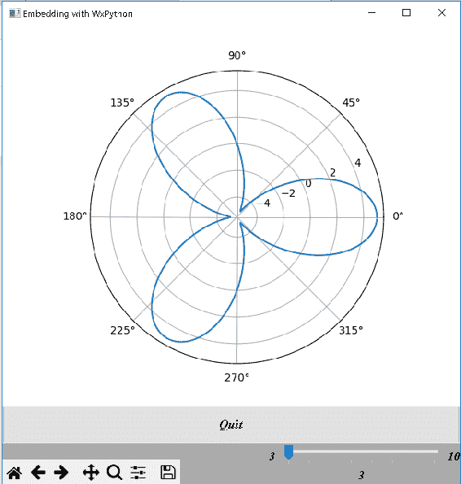

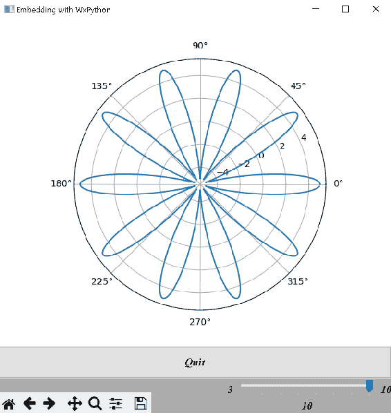

## 使用 Qt GUI 的滑块和按钮小部件

在本秘籍中，我们将学习如何利用， Qt GUI 滑块和按钮小部件代替 Matplotlib 小部件。 此代码以及和下一个秘籍中的代码均适用于， Qt4 和 Qt5 GUI 版本。

Qt GUI 非常类似于，`wxPython` GUI。 我们将使用`QHBoxLayout`和`QVBoxLayout`代替和`sizer`； 代替`fig.canvas.manager.window`，我们将拥有`fig.canvas.setLayout`； 并以`connect`代替`Bind`。

## 准备

1.  将后端设置为`Qt5`：

```py
import matplotlib
matplotlib.use('Qt5Agg')
```

2.  导入所需的库：

```py
import numpy as np
import matplotlib.pyplot as plt
from matplotlib.backends.qt_compat import QtCore, QtWidgets, is_pyqt5, QtGui
if is_pyqt5():
    from matplotlib.backends.backend_qt5agg import FigureCanvas
else:
    from matplotlib.backends.backend_qt4agg import FigureCanvas
```

## 操作步骤

以下是实现逻辑的步骤：

1.  定义并实例化`figure`：

```py
fig = plt.figure(figsize=(8, 6), dpi=100)
```

2.  定义轴域和数据的极坐标图，并绘制极坐标图：

```py
ax = fig.add_subplot(111,projection='polar')
theta = np.arange(0., 2., 1./180.)*np.pi
ax.plot(theta, 5*np.cos(4*theta))
```

3.  定义滑块小部件的回调函数：

```py
def update():
    n=n_slider.value()
    ax.clear()
    ax.plot(theta, 5*np.cos(n*theta))
    fig.canvas.draw()
```

4.  定义滑块小部件：

```py
n_slider = QtWidgets.QSlider(QtCore.Qt.Horizontal)
n_slider.setRange(3, 10)
n_slider.setSingleStep(1)
n_slider.setValue(4)
n_slider.setTickPosition(QtWidgets.QSlider.TicksBelow)
n_slider.setTickInterval(1)
n_slider.setFont(QtGui.QFont("Arial",30))
```

5.  将，滑块小部件与，对应的`callback`函数连接：

```py
n_slider.sliderReleased.connect(update)
```

6.  为的退出按钮定义`callback`函数：

```py
def close():
    plt.close('all') 
```

7.  定义和退出按钮小部件：

```py
button = QtWidgets.QPushButton("Quit")
button.setGeometry(QtCore.QRect(250, 0, 75, 25))
```

8.  将和退出按钮与和对应的`callback`函数连接起来：

```py
button.clicked.connect(close)
```

9.  在垂直框内定义，然后向其添加滑块和按钮小部件：

```py
hbox = QtWidgets.QHBoxLayout()
hbox.addWidget(n_slider)
hbox.addWidget(button)
```

10.  定义垂直框并添加，隔离对象和`hbox`水平布局框：

```py
vbox = QtWidgets.QVBoxLayout()
vspace = QtWidgets.QSpacerItem(0, 0, QtWidgets.QSizePolicy.Expanding, QtWidgets.QSizePolicy.Expanding)
vbox.addItem(vspace)
vbox.addSpacing(20)
vbox.addLayout(hbox)
```

11.  将`vbox`垂直布局框连接到图形的画布：

```py
fig.canvas.setLayout(vbox)
```

12.  在 Qt 后端上显示该图：

```py
plt.show()
```

## 工作原理

这是前面代码的解释：

*   您在前面的秘籍中已经看到了前两个步骤。
*   `def update():`是滑块小部件的回调函数。`n=n_slider.value()`获取滑块的当前值。 请注意和前面部分中其他两个 GUI 的语法差异。 此函数的其余三个语句与前面的秘籍完全相同和
*   `n_slider = QtWidgets.QSlider(QtCore.Qt.Horizontal)`定义`Qt`的滑块控件，并指定应水平绘制：
    *   `n_slider.setRange(3, 10)`指定滑块的最小值和最大值
    *   `n_slider.setSingleStep(1)`指定在滑块上拖动鼠标时每个步骤的大小。 在这里，我们将其指定为 1
    *   `n_slider.setValue(4)`指定滑块首次出现时的初始值
    *   `n_slider.setTickPosition(QtWidgets.QSlider.TicksBelow)`指定 ， 滑块应绘制刻度线，并且应在滑块下方
    *   `n_slider.setTickInterval(1)`指定刻度之间的间隔。 在这里，我们将其指定为 1
    *   `n_slider.setFont(QtGui.QFont("Arial",30))`的字体设置为`Arial`， 设置字体大小为 30。
*   `n_slider.sliderReleased.connect(update)`将滑块事件`"sliderReleased"`与对应的回调函数，`update()`连接起来
*   `def close():`是`Quit`按钮的回调函数，它与先前的 GUI 完全相同
*   `button = QtWidgets.QPushButton("Quit")`指定带有标签`Quit`的按钮小部件
*   `button.setGeometry(QtCore.QRect(250, 0, 75, 25))`定义按钮的放置位置，长度和高度。`(250, 0, 75, 25)`从图的左侧指定 250 像素，从底部指定 0 像素，长度为 75 像素，高度为 25 像素
*   `button.clicked.connect(close)`将按钮事件`clicked`与对应的回调函数`close()`连接， 
*   `hbox = QtWidgets.QHBoxLayout()`定义水平布局框：
    *   `hbox.addWidget(n_slider)`将滑块添加到水平框
    *   `hbox.addWidget(button)`将按钮小部件添加到水平框
    *   滑块和按钮小部件将在一行中水平相邻放置
*   `vbox = QtWidgets.QVBoxLayout()`定义垂直布局框：
    *   `vspace = QtWidgets.QSpacerItem(0, 0, QtWidgets.QSizePolicy.Expanding, QtWidgets.QSizePolicy.Expanding)`创建一个要包含在垂直布局框中的空间对象，以便在图的底部绘制 S 封面和按钮小部件。
    *   `vbox.addItem(vspace)`向垂直布局框添加垂直空间
    *   `vbox.addSpacing(20)`为垂直布局框中的像素增加了额外的空间
    *   `vbox.addLayout(hbox)`将水平布局框添加到垂直布局框中
    *   `fig.canvas.setLayout(vbox)`将垂直布局框连接到图形的画布。
*   `plt.show()`在`Qt5`后端显示图形。

运行前面的代码后，您应该第一次看到第一个图，将滑块拖动到 5 后，您应该看到第二个图：

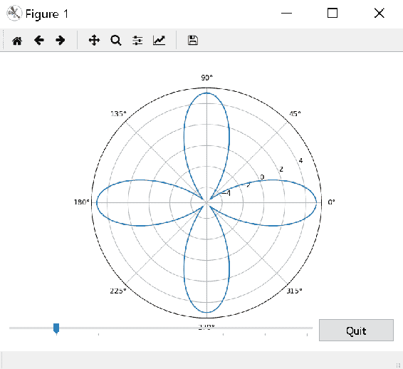

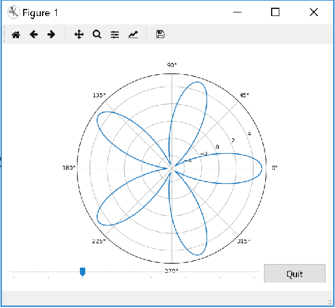

## 将 Matplotlib 嵌入到 Qt GUI 应用中

在本秘籍中，我们将学习如何在`Qt` GUI 应用中嵌入 Matplotlib 画布。

## 准备

导入所需的库：

```py
import sys
import numpy as np
from matplotlib.figure import Figure
from matplotlib.backends.qt_compat import QtCore, QtWidgets, is_pyqt5, 
     QtGui

if is_pyqt5():
    from matplotlib.backends.backend_qt5agg import (
                                    FigureCanvas, NavigationToolbar2QT 
                                    as  NavigationToolbar)
else:
    from matplotlib.backends.backend_qt4agg import (
                                    FigureCanvas, NavigationToolbar2QT 
                                    as NavigationToolbar)
```

## 操作步骤

以下是实现逻辑的步骤：

1.  定义 GUI 应用和窗口来绘制图形：

```py
qApp = QtWidgets.QApplication(sys.argv)
window = QtWidgets.QMainWindow()
```

2.  定义图形，画布和工具栏：

```py
fig = Figure(figsize=(8, 6), dpi=100)
canvas = FigureCanvas(fig)
toolbar = NavigationToolbar(canvas, window)
```

3.  定义轴域和数据，并绘制极坐标图：

```py
ax = fig.add_subplot(111,projection='polar')
theta = np.arange(0., 2., 1./180.)*np.pi
ax.plot(theta, 5*np.cos(4*theta))
```

4.  定义滑块的回调函数：

```py
def update():
    n=n_slider.value()
    ax.clear()
    ax.plot(theta, 5*np.cos(n*theta))
    fig.canvas.draw()
```

5.  定义滑块小部件并将其与对应的回调函数连接：

```py
n_slider = QtWidgets.QSlider(QtCore.Qt.Horizontal)
n_slider.setRange(3, 10)
n_slider.setSingleStep(1)
n_slider.setValue(4)
n_slider.setTickPosition(QtWidgets.QSlider.TicksBelow)
n_slider.setTickInterval(1)
n_slider.setFont(QtGui.QFont("Arial",20)) 
n_slider.sliderReleased.connect(update)
```

6.  为**退出**按钮定义回调函数：

```py
def close():
    window.close()
```

7.  定义**退出**按钮小部件，并将其连接到相应的回调函数：

```py
button = QtWidgets.QPushButton("Quit")
button.setFont(QtGui.QFont("Arial",30))
button.clicked.connect(close)
```

8.  定义水平框，然后将滑块及其标签项放在其中：

```py
hbox = QtWidgets.QHBoxLayout()
minn = QtWidgets.QLabel('3')
minn.setFont(QtGui.QFont("Arial",20))
maxn = QtWidgets.QLabel('10')
maxn.setFont(QtGui.QFont("Arial",20))
hbox.addWidget(minn)
hbox.addWidget(n_slider)
hbox.addWidget(maxn)
```

9.  定义垂直框并在其中放置工具栏，间隔，按钮小部件和水平框的：

```py
vbox = QtWidgets.QVBoxLayout()
vbox.addWidget(toolbar)
vspace = QtWidgets.QSpacerItem(0, 750)
vbox.addItem(vspace)
vbox.addSpacing(20)
vbox.addLayout(hbox)
vbox.addWidget(button)
```

10.  将垂直框连接到图形画布：

```py
fig.canvas.setLayout(vbox)
```

11.  设置窗口标题并显示它：

```py
window.setWindowTitle("Embedding with Qt")
window.setCentralWidget(canvas)
window.show()
```

12.  启动应用循环以捕获用户操作：

```py
qApp.exec_()
```

## 工作原理

这是前面代码的解释：

*   `qApp = QtWidgets.QApplication(sys.argv)`调用`Qt` GUI 应用。 它期望`sys.argv`作为参数，即使它为空
*   `window = QtWidgets.QMainWindow()`定义显示图形的主窗口
*   `fig = Figure(figsize=(8, 6), dpi=100)`定义图形
*   `canvas = FigureCanvas(fig)`定义画布并将图形附加到画布上
*   `toolbar = NavigationToolbar(canvas, window)`定义了 GUI 的工具栏，并将其附加到主`window`和`canvas`
*   步骤 3 定义极坐标图的轴域和数据，并绘制极坐标图
*   `def update():`是滑块的回调函数， 是 ，与前面的秘籍完全相同
*   `n_slider = QtWidgets.QSlider(QtCore.Qt.Horizontal)`定义了滑块，并且所有参数都完全相同 ， 与先前的秘籍
*   `n_slider.sliderReleased.connect(update)`将`"sliderReleased"`事件连接到相应的回调函数，`update()`
*   `def close():`是`Quit`按钮的回调函数，它仅关闭窗口，而不是应用
*   `button = QtWidgets.QPushButton("Quit")`定义`Qt`的按钮小部件。 与 ， 前面的秘籍不同，此处无需设置`button.setGeometry(QtCore.QRect(250, -10, 75, 25))`，因为我们将按钮单独垂直放置在一行中
*   `button.setFont(QtGui.QFont("Arial",30))`设置字体为`Arial`，字体大小为 30
*   `button.clicked.connect(close)`将按钮的`"clicked"`事件连接到相应的回调函数，`close()`
*   `hbox = QtWidgets.QHBoxLayout()`定义水平布局框：
    *   `minn = QtWidgets.QLabel('3')`为要显示的滑块最小值定义标签对象
    *   `minn.setFont(QtGui.QFont("Arial",20))`将字体和字体大小设置为最小值
    *   `maxn = QtWidgets.QLabel('10')`定义要显示的滑块最大值的标签对象
    *   `maxn.setFont(QtGui.QFont("Arial",20))`设置最大值的字体和字体大小
    *   `hbox.addWidget(minn)`将`minn`标签添加到`hbox`
    *   `hbox.addWidget(n_slider)`将滑块添加到`hbox`
    *   `hbox.addWidget(maxn)`将标签`maxn`添加到`hox`
*   `vbox = QtWidgets.QVBoxLayout()`定义垂直布局框
    *   `vbox.addWidget(toolbar)`添加在图顶部的工具栏
    *   `vspace = QtWidgets.QSpacerItem(0, 750)`定义空间对象
    *   `vbox.addItem(vspace)`在画布/图形将出现的位置添加空间对象
    *   `vbox.addSpacing(20)`在画布下添加了 20 个像素的额外空间
    *   `vbox.addLayout(hbox)`添加包含 ， 滑块以及相关的最小和最大标签的`hbox`
    *   `vbox.addWidget(button)`将按钮小部件添加到`vox`
*   `fig.canvas.setLayout(vbox)`向图形画布添加了`vbox`布局。
*   `window.setWindowTitle("Embedding with Qt")`设置主窗口的标题
*   `window.setCentralWidget(canvas)`将画布设置为中央小部件，以便主极图出现在中央
*   `window.show()`显示图形窗口
*   `qApp.exec_()`调用主循环以捕获事件并触发相应的回调函数

当您运行上述代码时，将滑块第一次拖动到 8 时，您应该会第一次看到左侧的图，而右侧则是右侧的图。您可以通过单击退出按钮退出应用：

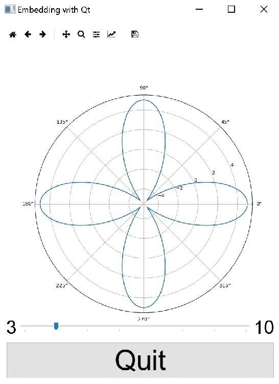

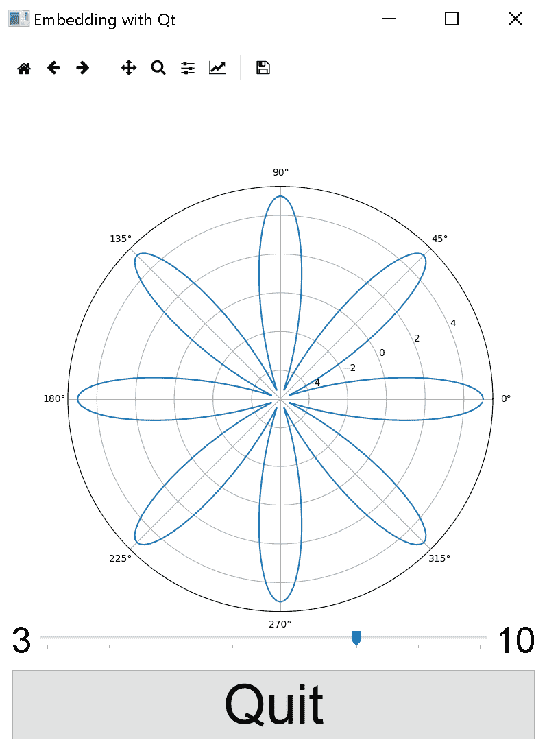