# 一、第一步

在本章中，我们将介绍：

*   安装 matplotlib
*   绘制一条曲线
*   使用 NumPy
*   绘制多条曲线
*   从文件数据绘制曲线
*   绘制点
*   绘制条形图
*   绘制多个条形图
*   绘制堆叠的条形图
*   绘制背对背条形图
*   绘制饼图
*   绘制直方图
*   绘制箱形图
*   绘制三角剖分

## 简介

matplotlib 使科学绘图非常简单。 matplotlib 并不是使图形绘制变得容易的首次尝试。 matplotlib 带来的是一种在易用性和功能之间取得平衡的现代解决方案。 matplotlib 是 Python（一种编程语言）的模块。 在本章中，我们将简要概述使用 matplotlib 的感觉。 简约秘籍用于介绍 matplotlib 建立的原理。

## 安装 matplotlib

在使用 matplotlib 尝试之前，需要先安装它。 在这里，我们介绍了一些技巧，以使 Matplotlib 正常运行并没有太多麻烦。

### 操作步骤

我们有三种可能的场景：您可能正在使用 Linux，OSX 或 Windows。

**Linux**

大多数 Linux 发行版默认都安装了 Python，并在其标准包列表中提供了 matplotlib。 因此，您要做的就是使用发行版的包管理器自动安装 matplotlib。 除了 matplotlib，我们强烈建议您安装 NumPy，SciPy 和 SymPy，因为它们应该可以一起使用。 以下列表包含启用不同 Linux 版本中可用的默认包的命令：

*   **Ubuntu** ：默认的 Python 包是为 python 2.7 编译的。 在命令终端中，输入以下命令：

    ```py
    sudo apt-get install python-matplotlib python-numpy python-scipy python-sympy

    ```

*   **ArchLinux**：默认的 Python 包是针对 Python 3 编译的。 在命令终端中，输入以下命令：

    ```py
    sudo pacman -S python-matplotlib python-numpy python-scipy python-sympy

    ```

    如果您更喜欢使用 Python 2.7，请在包名称中将`python`替换为`python2`

*   **Fedora**：默认的 Python 包是针对 Python 2.7 编译的。 在命令终端中，输入以下命令：

    ```py
    sudo yum install python-matplotlib numpy scipy sympy

    ```

    ### 注意

    还有其他安装这些包的方法。 在本章中，我们提出了最简单，最无缝的方法。

**Windows 和 OSX**

Windows 和 OSX 没有用于软件安装的标准包系统。 我们有两个选择-使用现成的自安装包或从代码源编译 matplotlib。 第二种选择涉及更多工作。 值得努力安装最新的最新版本的 matplotlib。 因此，在大多数情况下，使用现成的包装是更实际的选择。

现成的包装有个选择：Anaconda，Entought Canopy，Algorete Loopy 等！ 所有这些包都一次性提供了 Python，SciPy，NumPy，matplotlib 等（文本编辑器和精美的交互式 shell）。 实际上，所有这些系统都安装了自己的包管理器，从那里可以像在典型的 Linux 发行版上那样安装/卸载其他包。 为了简洁起见，我们将仅提供 Enthought Canopy 的说明。 所有其他系统都在线提供大量文档，因此安装它们应该不会有太大问题。

因此，让我们通过执行以下步骤来安装 Enthought Canopy：

1.  [下载 Enthought Canopy 安装程序](https://www.enthought.com/products/canopy)。 您可以选择免费的 Express 版本。 该网站可以猜测您的操作系统并为您建议合适的安装程序。
2.  运行 Enthought Canopy 安装程序。 如果您不想与其他用户共享已安装的软件，则无需成为管理员即可安装包。
3.  安装时，只需单击**下一步**，即可保留默认设置。 您可以在[这个页面](http://docs.enthought.com/canopy/quick-start.html)中找到有关安装过程的其他信息。

而已！ 您将安装 Python 2.7，NumPy，SciPy 和 matplotlib 并准备运行。

## 绘制一条曲线

HelloWorld 的初始示例！ 绘图软件的通常是要显示一条简单的曲线。 我们将保持这种传统。 它还将使您大致了解 matplotlib 的工作方式。

### 准备

您需要安装 Python（v2.7 或 v3）和 matplotlib。 您还需要一个文本编辑器（任何文本编辑器都可以）和一个命令终端来键入和运行命令。

### 操作步骤

让我们从任何绘图软件提供的最常见和最基本的图形之一，**曲线**开始。 在另存为`plot.py`的文本文件中，我们具有以下代码：

```py
import matplotlib.pyplot as plt

X = range(100)
Y = [value ** 2 for value in X]

plt.plot(X, Y)
plt.show()
```

假设您已经安装了和 Python，并且现在可以使用 Python 解释该脚本。 如果您不熟悉 Python，那么确实是我们那里的 Python 脚本！ 在命令终端中，使用以下命令在保存`plot.py`的目录中运行脚本：

```py
python plot.py
```

这样做将打开一个窗口，如以下屏幕截图所示：

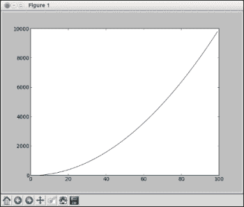

窗口显示曲线`Y = X ** 2`，其中`X`在`[0, 99]`范围内。 您可能已经注意到，该窗口有几个图标，其中一些如下：

*   ：此图标打开一个对话框，可让您将图形另存为图片文件。 您可以将其另存为位图图片或向量图片。
*   ：使用此图标可以翻译和缩放图形。 单击它，然后将鼠标移到图形上。 单击鼠标左键将根据鼠标移动来平移图形。 单击鼠标右键将修改图形的比例。
*   ：此图标会将图形恢复到初始状态，取消您之前可能已应用的任何平移或缩放。

### 工作原理

假设您对 Python 还不是很熟悉，那么让我们分析上一节中演示的脚本。

第一行告诉 Python 我们正在使用`matplotlib.pyplot`模块。 为了节省输入时间，我们将名称`plt`等同于`matplotlib.pyplot`。 这是一种非常常见的做法，您会在 matplotlib 代码中看到。

第二行创建一个名为`X`的列表，所有整数值从 0 到 99。`range`函数用于生成连续数字。 您可以运行交互式 Python 解释器，如果使用 Python 2，则键入命令`range(100)`，如果使用 Python 3，则键入命令`list(range(100))`。这将显示从 0 到 99 的所有整数值的列表。 ，`sum(range(100))`将计算 0 到 99 之间的整数之和。

第三行创建一个名为`Y`的列表，列表`X`中的所有值均平方。 通过将函数应用于另一个列表的每个成员来构建新列表是一个 Python 习惯用法，名为**列表推导式**。 列表`Y`将以相同顺序包含列表`X`的平方值。 因此`Y`将包含 0、1、4、9、16、25，依此类推。

第四条线绘制一条曲线，其中曲线点的 x 坐标在列表`X`中给出，而曲线点的 y 坐标在列表`Y`中给出。 请注意，列表名称可以是您喜欢的任何名称。

最后一行显示结果，您将在运行脚本时在窗口中看到该结果。

### 更多

那么到目前为止我们学到了什么？ 与诸如 gnuplot 之类的绘图包不同，matplotlib 并不是专门用于绘图的命令解释器。 与 Matlab 不同，matplotlib 也不是用于绘图的集成环境。 matplotlib 是用于绘图的 Python 模块。 使用 Python 脚本描述图形，这些脚本依赖于 matplotlib 提供的（相当大）功能集。

因此，matplotlib 背后的理念是利用现有语言 Python。 理由是 Python 是一种完整的，设计良好的通用编程语言。 将 matplotlib 与其他包结合使用不会涉及任何技巧和黑客，而仅涉及 Python 代码。 这是因为有许多用于 Python 的包可以执行几乎所有任务。 例如，要绘制存储在数据库中的数据，您将使用数据库包读取数据并将其提供给 matplotlib。 要生成大量统计图形，您将使用科学计算包，例如 SciPy 和 Python 的 I/O 模块。

因此，与许多绘图包不同，matplotlib 是非常正交的，它仅作图而仅作图。 如果您想从文件中读取输入或进行一些简单的中间计算，则必须使用 Python 模块和一些粘合代码来实现。 幸运的是，Python 是一种非常流行的语言，易于掌握并且拥有庞大的用户群。 我们将一点一点地证明这种方法的强大功能。

## 使用 NumPy

使用 matplotlib 不需要 NumPy 。 但是，许多 matplotlib 技巧，代码示例和示例都使用 NumPy。 简短介绍 NumPy 的用法将向您显示原因。

### 准备

除了安装 Python 和 matplotlib 外，还安装了 NumPy。 您有一个文本编辑器和一个命令终端。

### 操作步骤

让我们绘制另一条曲线`sin(x)`，其中`x`在`[0，2 * pi]`区间内。 与先前脚本的唯一区别是我们生成点坐标的部分。 输入以下脚本并将其保存为`sin-1.py`：

```py
import math
import matplotlib.pyplot as plt

T = range(100)
X = [(2 * math.pi * t) / len(T) for t in T]
Y = [math.sin(value) for value in X]

plt.plot(X, Y)
plt.show()
```

然后，键入以下脚本并将其保存为`sin-2.py`：

```py
import numpy as np
import matplotlib.pyplot as plt
X = np.linspace(0, 2 * np.pi, 100)
Y = np.sin(X)

plt.plot(X, Y)
plt.show()
```

运行`sin-1.py`或`sin-2.py`都会准确显示以下图形：

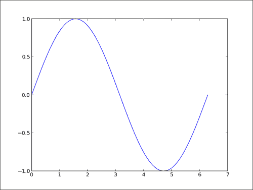

### 工作原理

第一个脚本`sin-1.py`仅使用 Python 的标准库生成正弦曲线的坐标。 以下几点描述了我们在上一节的脚本中执行的步骤：

1.  我们创建了一个列表`T`，其编号为 0 到 99，我们的曲线将绘制 100 个点。
2.  我们通过简单地重新缩放`T`中存储的值来计算 x 坐标，以使 x 从 0 变为`2pi`（`range()`内置函数只能生成整数值）。
3.  与第一个示例一样，我们生成了 y 坐标。

第二个脚本`sin-2.py`与`sin-1.py`完全相同，其结果是相同的。 但是，由于`sin-2.py`使用 NumPy 包，因此它稍短一些并且更易于阅读。

#### 提示

NumPy 是用于科学计算的 Python 包。 matplotlib 可以在没有 NumPy 的情况下工作，但是使用 NumPy 可以节省大量的时间和精力。 NumPy 包提供了一个功能强大的多维数组对象和许多用于操纵它的函数。

**NumPy 包**

在`sin-2.py`中，`X`列表现在是一维 NumPy 数组，在 0 和`2pi`之间具有 100 个均匀间隔的值。 这是函数`numpy.linspace`的目的。 可以说，这比我们在`sin-1.py`中进行的计算更加方便。 `Y`列表也是一维 NumPy 数组，其值是根据`X`的坐标计算的。 NumPy 函数适用于整个数组，就像它们适用于单个值一样。 同样，不需要像在`sin-1.py`中那样一目了然地显式计算这些值。 与纯 Python 版本相比，我们的代码较短但可读性强。

### 更多

NumPy 可以一次对整个数组执行操作，从而在生成曲线坐标时为我们节省了很多工作。 此外，使用 NumPy 最有可能导致代码快于纯 Python 代码。 更容易阅读和更快的代码，不喜欢什么？ 下面是一个示例，其中我们使用`200`点在`[-3, 2]`区间绘制二项式`x^2 - 2x + 1`：

```py
import numpy as np
import matplotlib.pyplot as plt

X = np.linspace(-3, 2, 200)
Y = X ** 2 - 2 * X + 1.

plt.plot(X, Y)
plt.show()
```

运行前面的脚本将为我们提供如下图所示的结果：

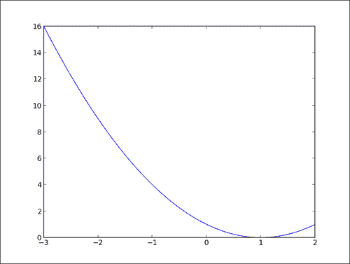

同样，我们可以用纯 Python 进行绘制，但是可以说它不那么容易阅读。 尽管可以在不使用 NumPy 的情况下使用 matplotlib，但这两者构成了强大的组合。

## 绘制多条曲线

我们绘制曲线的原因之一是比较那些曲线。 他们匹配吗？ 它们在哪里匹配？ 他们在哪里不匹配？ 它们相关吗？ 图形可以帮助您快速做出判断，以便进行更彻底的调查。

### 操作步骤

让我们以`[0, 2pi]`间隔显示`sin(x)`和`cos(x)`，如下所示：

```py
import numpy as np
import matplotlib.pyplot as plt

X = np.linspace(0, 2 * np.pi, 100)
Ya = np.sin(X)
Yb = np.cos(X)

plt.plot(X, Ya)
plt.plot(X, Yb)
plt.show()
```

前面的脚本将为我们提供如下图所示的结果：

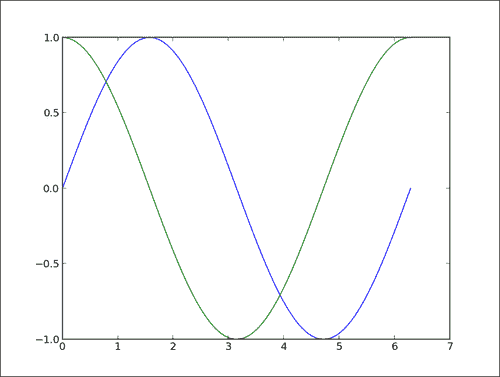

### 工作原理

两条曲线以不同的颜色显示，由 matplotlib 自动拾取。 我们对一条曲线使用一个函数`call plt.plot()`； 因此，我们必须在这里两次调用`plt.plot()`。 但是，我们仍然只需要调用一次`plt.show()`。 函数`calls plt.plot(X, Ya)`和`plt.plot(X, Yb)`可以看作是意图的声明。 我们想将这两套点链接在一起，并为每套点分别绘制一条曲线。

matplotlib 将仅记录此意图，但不会进行任何绘制。 但是，`plt.show()`曲线将发出信号，表明我们要绘制到目前为止已描述的内容。

### 更多

这种**延迟渲染**机制对于 matplotlib 至关重要。 您可以声明渲染的时间以及适合的时间。 仅当您调用 `plt.show()`时，图形才会呈现。 为了说明这一点，让我们看下面的脚本，该脚本呈现一个钟形曲线，以及该曲线在每个点的斜率：

```py
import numpy as np
import matplotlib.pyplot as plt

def plot_slope(X, Y):
  Xs = X[1:] - X[:-1]
  Ys = Y[1:] - Y[:-1]
  plt.plot(X[1:], Ys / Xs)

X = np.linspace(-3, 3, 100)
Y = np.exp(-X ** 2)

plt.plot(X, Y)
plot_slope(X, Y)

plt.show()
```

上面的脚本将产生以下图形：

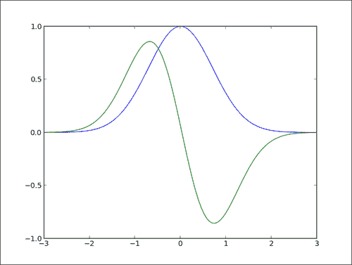

其中一个函数`plt.plot()`是在`plot_slope`函数内部完成的，该函数对图形的呈现没有任何影响，因为`plt.plot()`只是声明了我们要呈现的内容，但尚未执行呈现 。 当编写具有很多曲线的复杂图形的脚本时，这非常有用。 您可以使用适当的编程语言的所有功能（循环，函数调用等）来组成图形。

## 根据文件数据绘制曲线

如前面所述，matplotlib 仅处理绘图。 如果要绘制存储在文件中的数据，则必须使用 Python 代码读取文件并提取所需的数据。

### 操作步骤

假设我们将时间序列存储在名为`my_data.txt`的纯文本文件中，如下所示：

```py
0  0
1  1
2  4
4 16
5 25
6 36
```

一种用于读取和绘制数据的极简纯 Python 方法如下：

```py
import matplotlib.pyplot as plt

X, Y = [], []
for line in open('my_data.txt', 'r'):
  values = [float(s) for s in line.split()]
  X.append(values[0])
  Y.append(values[1])

plt.plot(X, Y)
plt.show()
```

该脚本与`my_data.txt`中存储的数据一起，将产生以下图形：

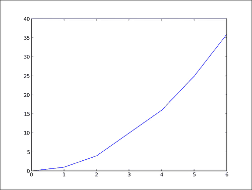

### 工作原理

以下是有关的上述脚本工作原理的一些解释：

*   `X, Y = [], []`行将坐标`X`和`Y`的列表初始化为空列表。
*   `for line in open('my_data.txt', 'r')`行定义了一个循环，该循环将迭代文本文件`my_data.txt`的每一行。 每次迭代时，将从文本文件中提取的当前行作为字符串存储在变量行中。
*   `values = [float(s) for s in line.split()]`行将当前行分隔为空字符以形成令牌字符串。 然后将这些标记解释为浮点值。 这些值存储在列表值中。
*   然后，在接下来的两行`X.append(values[0])`和`Y.append(values[1])`中，`values`中存储的值将添加到列表`X`和`Y`中。

下面的等价于的单行读取文本文件可能会给熟悉 Python 的人带来微笑：

```py
import matplotlib.pyplot as plt

with open('my_data.txt', 'r') as f:
  X, Y = zip(*[[float(s) for s in line.split()] for line in f])

plt.plot(X, Y)
plt.show()
```

### 更多

在我们的数据加载代码中，请注意，没有进行任何认真的检查或错误处理。 无论如何，一个人可能还记得一个好的程序员就是一个懒惰的程序员。 确实，由于 NumPy 经常与 matplotlib 一起使用，为什么不在这里使用它呢？ 运行以下脚本以启用 NumPy：

```py
import numpy as np
import matplotlib.pyplot as plt

data = np.loadtxt('my_data.txt')

plt.plot(data[:,0], data[:,1])
plt.show()
```

这与上一节中所示的单行代码一样短，但更易于阅读，它将处理许多纯 Python 代码无法处理的错误情况。 以下几点描述了前面的脚本：

*   `numpy.loadtxt()`函数读取文本文件并返回 2D 数组。 对于 NumPy，二维数组不是列表列表，它们是真实的，成熟的矩阵。
*   变量`data`是 NumPy 2D 数组，它给我们带来的好处是能够将矩阵的行和列作为 1D 数组进行操作。 实际上，在`plt.plot(data[:,0], data[:,1])`行中，我们将第一列数据作为 x 坐标，将第二列数据作为 y 坐标。 此符号特定于 NumPy。

除了使代码更短，更简单之外，使用 NumPy 还带来了其他优势。 对于大文件，使用 NumPy 会明显更快（NumPy 模块主要用 C 编写），并且将整个数据集存储为 NumPy 数组也可以节省内存。 最后，使用 NumPy 可以轻松支持数字数据的其他常见文件格式（CVS 和 Matlab）。

作为演示到目前为止所看到的所有内容的一种方式，让我们考虑以下任务。 一个文件包含 N 列值，描述 N-1 条曲线。 第一列包含 x 坐标，第二列包含第一条曲线的 y 坐标，第三列包含第二条曲线的 y 坐标，依此类推。 我们要显示这些 N–1 曲线。 我们将使用以下代码来做到这一点：

```py
import numpy as np
import matplotlib.pyplot as plt

data = np.loadtxt('my_data.txt')
for column in data.T:
  plt.plot(data[:,0], column)

plt.show()
```

文件`my_data.txt`应包含以下内容：

```py
0 0 6
1 1 5
2 4 4
4 16 3
5 25 2
6 36 1
```

然后我们得到下图：

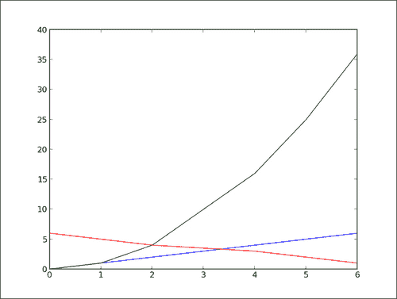

我们通过两个技巧毫不费力地完成了这项工作。 在 NumPy 表示法中，`data.T`是 2D 数组数据的转置视图—行被视为列，列被视为行。 同样，我们可以通过执行`for row in data`遍历多维数组的行。 因此，执行`for column in` `data.T`将遍历数组的列。 用几行代码，我们得到了一个相当通用的绘图通用脚本。

## 绘制点

显示曲线时，我们隐含地假设一个点紧随另一个点-我们的数据是时间序列。 当然，并非总是如此。 数据的一个点可以彼此独立。 表示此类数据的一种简单方法是简单地显示这些点而无需链接它们。

### 操作步骤

以下脚本显示 1024 个点，其坐标是从`[0, 1]`间隔中随机绘制的：

```py
import numpy as np
import matplotlib.pyplot as plt

data = np.random.rand(1024, 2)

plt.scatter(data[:,0], data[:,1])
plt.show()
```

前面的脚本将产生以下图形：

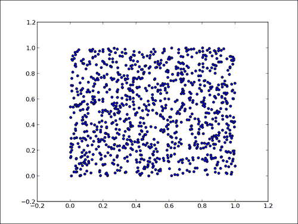

### 工作原理

函数`plt.scatter()`的工作原理与`plt.plot()`完全相同，将点的 x 和 y 坐标作为输入参数。 但是，每个点仅用一个标记显示。 不要被这种简单性所迷惑-`plt.scatter()`是一个丰富的命令。 通过使用其许多可选参数，我们可以实现许多不同的效果。 我们将在第 2 章，“自定义颜色和样式”和第 3 章，“处理标注”中进行介绍。

## 绘制条形图

**条形图**是绘图包的常见主食，甚至 matplotlib 也有。

### 操作步骤

条形图的专用函数是`pyplot.bar()`。 我们将通过执行以下脚本来启用此函数：

```py
import matplotlib.pyplot as plt

data = [5., 25., 50., 20.]

plt.bar(range(len(data)), data)
plt.show()
```

上面的脚本将产生以下图形：

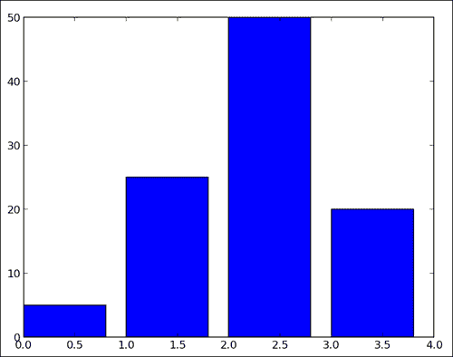

### 工作原理

对于列表数据中的每个值，均显示一个垂直条。 `pyplot.bar()`函数接收两个参数-每个条形的 x 坐标和每个条形的高度。 在这里，我们为每个小节使用坐标 0、1、2 等，这是`range(len(data))`的目的。

### 更多

通过可选参数，`pyplot.bar()`提供了一种控制钢筋厚度的方法。 此外，我们还可以使用`pyplot.bar()`的双胞胎兄弟`pyplot.barh()`获得单杠。

#### 条形的厚度

默认情况下，钢筋的厚度为 0.8 单位。 因为我们在每个单位长度上都放置了一个小节，所以它们之间的距离为 0.2。 当然，您可以摆弄这个厚度参数。 例如，通过将其设置为 1：

```py
import matplotlib.pyplot as plt

data = [5., 25., 50., 20.]

plt.bar(range(len(data)), data, width = 1.)
plt.show()
```

前面的简约脚本将产生以下图形：

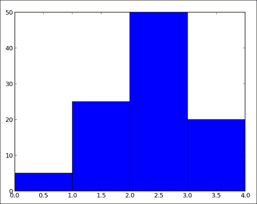

现在，这些条之间没有缝隙。 matplotlib 条形图函数`pyplot.bar()`将无法处理条形的位置和厚度。 程序员负责。 这种灵活性使您可以在条形图上创建许多变体。

#### 单杠

如果您更喜欢水平条，请使用 `barh()`函数，该函数与`bar()`严格等效，除了提供水平条而不是垂直条：

```py
import matplotlib.pyplot as plt

data = [5., 25., 50., 20.]

plt.barh(range(len(data)), data)
plt.show()
```

上面的脚本将产生以下图形：

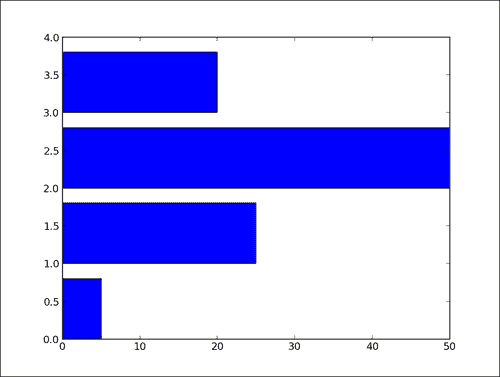

## 绘制多个条形图

比较多个数量和更改一个变量时，我们可能需要一个条形图，其中一个数量值具有一种颜色的条形。

### 操作步骤

我们可以通过玩这些条的粗细和位置来绘制多个条形图：

```py
import numpy as np
import matplotlib.pyplot as plt

data = [[5., 25., 50., 20.],
  [4., 23., 51., 17.],
  [6., 22., 52., 19.]]

X = np.arange(4)
plt.bar(X + 0.00, data[0], color = 'b', width = 0.25)
plt.bar(X + 0.25, data[1], color = 'g', width = 0.25)
plt.bar(X + 0.50, data[2], color = 'r', width = 0.25)

plt.show()
```

上面的脚本将产生以下图形：


### 工作原理

`data`变量包含三个系列的四个值。 上面的脚本将显示四个条形图的三个条形图。 条的厚度为 0.25 个单位。 每个条形图将从上一个移位 0.25 个单位。 为了清楚起见，添加了颜色。 在第 2 章“自定义颜色和样式”中将详细介绍该主题。

### 更多

上一节中显示的代码非常繁琐，因为我们通过手动移动三个条形图来重复自己。 通过使用以下代码，我们可以做得更好：

```py
import numpy as np
import matplotlib.pyplot as plt

data = [[5., 25., 50., 20.],
  [4., 23., 51., 17.],
  [6., 22., 52., 19.]]

color_list = ['b', 'g', 'r']
gap = .8 / len(data)
for i, row in enumerate(data):
  X = np.arange(len(row))
  plt.bar(X + i * gap, row,
    width = gap,
    color = color_list[i % len(color_list)])

plt.show()
```

在这里，我们使用循环`for i, row in enumerate(data)`遍历数据的每一行。 迭代器`enumerate`返回当前行及其索引。 通过列表推导完成为一个条形图生成每个条形图的位置。 该脚本将产生与前一个脚本相同的结果，但是如果我们添加数据的行或列，则不需要任何更改。

## 绘制堆叠的条形图

当然，可以通过使用`pyplot.bar()`函数中的特殊参数来堆叠条形图。

### 操作步骤

以下脚本相互堆叠两个条形图：

```py
import matplotlib.pyplot as plt

A = [5., 30., 45., 22.]
B = [5., 25., 50., 20.]

X = range(4)

plt.bar(X, A, color = 'b')
plt.bar(X, B, color = 'r', bottom = A)
plt.show()
```

上面的脚本将产生以下图形：

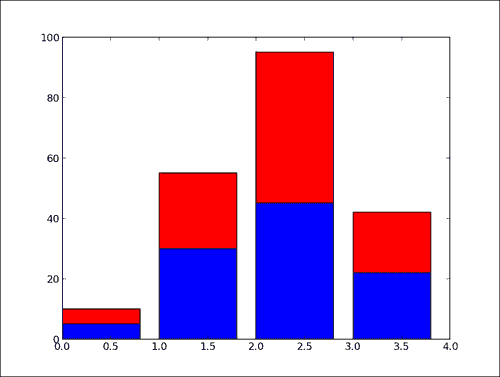

### 工作原理

`pyplot.bar()`函数的可选`bottom` 参数允许您指定钢筋的起始值。 它不是从零到一个值，而是从下到上。 首次调用`pyplot.bar()`会绘制蓝色条形图。 对`pyplot.bar()`的第二次调用绘制了红色条，红色条的底部在蓝色条的顶部。

### 更多

当堆叠两个以上的值集时，代码会变得不那么漂亮，如下所示：

```py
import numpy as np
import matplotlib.pyplot as plt

A = np.array([5., 30., 45., 22.])
B = np.array([5., 25., 50., 20.])
C = np.array([1.,  2.,  1.,  1.])
X = np.arange(4)

plt.bar(X, A, color = 'b')
plt.bar(X, B, color = 'g', bottom = A)
plt.bar(X, C, color = 'r', bottom = A + B)

plt.show()
```

对于第三个条形图，我们必须将底值计算为`A + B`，即`A`和`B`的按系数求和。使用 NumPy 有助于保持代码紧凑但可读。 但是，此代码相当重复，并且仅适用于三个堆叠的条形图。 我们可以使用以下代码做得更好：

```py
import numpy as np
import matplotlib.pyplot as plt

data = np.array([[5., 30., 45., 22.],
  [5., 25., 50., 20.],
  [1.,  2.,  1.,  1.]]

color_list = ['b', 'g', 'r']

X = np.arange(data.shape[1])
for i in range(data.shape[0]):
  plt.bar(X, data[i],
    bottom = np.sum(data[:i], axis = 0),
    color = color_list[i % len(color_list)])

plt.show()
```

在这里，我们将数据存储在 NumPy 数组中，一张条形图一行。 我们遍历每一行数据。 对于第`i`行，`bottom`参数接收第`i`行之前所有行的总和。 通过这种方式编写脚本，可以在更改输入数据时以最小的努力堆叠任意数量的条形图。

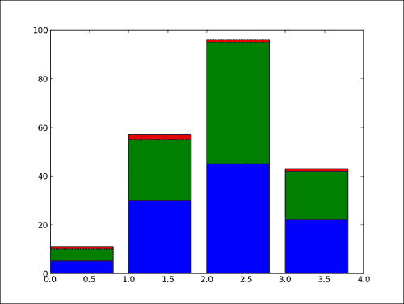

## 绘制背对背条形图

一个简单但有用的技巧是同时背对背显示两个条形图。 想一想人口的年龄金字塔，它显示了不同年龄范围内的人数。 左侧显示男性人口，而右侧显示女性人口。

### 操作步骤

想法是使用一个简单的技巧来制作两个条形图，即一个条的长度/高度可以为负！

```py
import numpy as np
import matplotlib.pyplot as plt

women_pop = np.array([5., 30., 45., 22.])
men_pop     = np.array( [5., 25., 50., 20.])
X = np.arange(4)

plt.barh(X, women_pop, color = 'r')
plt.barh(X, -men_pop, color = 'b')
plt.show()
```

上面的脚本将产生以下图形：

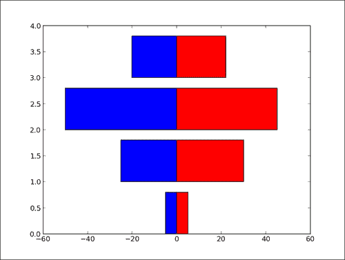

### 工作原理

照常绘制女性人群的条形图（红色）。 但是，男性人口的条形图（蓝色）的条形图向左延伸而不是向右延伸。 实际上，蓝色条形图的条形长度为负值。 而不是编辑输入值，我们使用列表推导来否定男性人口条形图的值。

## 绘制饼图

为了比较数量的相对重要性，没有什么比一个好的旧饼图**饼图**更好了。

### 操作步骤

专用的饼图函数`pyplot.pie()`将完成此工作。 我们将在以下代码中使用此函数：

```py
import matplotlib.pyplot as plt

data = [5, 25, 50, 20]

  plt.pie(data)
plt.show()
```

前面的简单脚本将显示以下饼图：

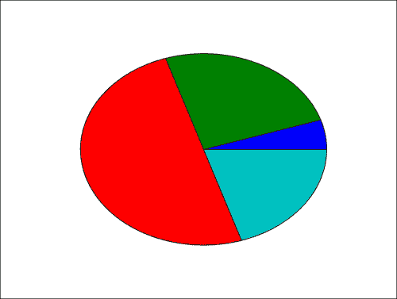

### 工作原理

`pyplot.pie()`函数仅将值列表作为输入。 注意，输入数据是一个列表。 它可能是一个 NumPy 数组。 您不必调整数据，使其总计为 1 或 100。您只需为 matplolib 提供值，它将自动计算饼图的相对面积。

## 绘制直方图

**直方图**是概率分布的图形表示。 实际上，直方图只是条形图的一种。 我们可以轻松使用 matplotlib 的条形图函数并进行一些统计以生成直方图。 但是，直方图非常有用，以至于 matplotlib 为其提供了函数。 在本秘籍中，我们将了解如何使用此直方图函数。

### 操作步骤

以下脚本从正态分布中绘制`1000`值，然后生成具有 20 个桶的直方图：

```py
import numpy as np
import matplotlib.pyplot as plt

X = np.random.randn(1000)

plt.hist(X, bins = 20)
plt.show()
```

每次我们运行脚本时，由于数据集是随机生成的，因此直方图会有所变化。 上面的脚本将显示以下图形：

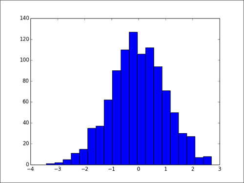

### 工作原理

`pyplot.hist()`函数将值列表作为输入。 值的范围将分为相等大小的桶（默认为 10 个桶）。 `pyplot.hist()`函数将生成一个条形图，一个条带表示一个箱。 一格的高度是相应仓中跟随的值的数量。 箱的数量由可选参数箱确定。 通过将可选参数`normed`设置为`True`，可以对钢筋高度进行标准化，并且所有钢筋高度的总和等于 1。

## 绘制箱形图

**箱形图**允许您方便地显示一组值的中位数，四分位数，最大值和最小值，从而比较值的分布。

### 操作步骤

以下脚本显示了从正态分布中抽取的 100 个随机值的箱形图：

```py
import numpy as np
import matplotlib.pyplot as plt

data = np.random.randn(100)

plt.boxplot(data)
plt.show()
```

将会出现一个箱形图，代表我们从随机分布中提取的样本。 由于代码使用随机生成的数据集，因此每次运行脚本时，生成的图形都会略有变化。

前面的脚本将显示以下图形：

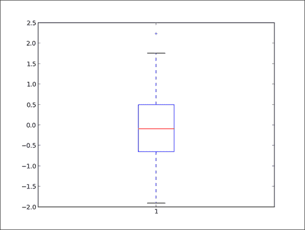

### 工作原理

`data = [random.gauss(0., 1.) for i in range(100)]`变量从正态分布中生成 100 个值。 出于演示目的，通常从文件中读取或从其他数据计算出这些值。 `plot.boxplot()`函数取一组值并自己计算平均值，中位数和其他统计量。 以下几点描述了前面的箱形图：

*   红色条形是分布的中位数。
*   蓝色框包含从下四分位数到上四分位数的 50% 的数据。 因此，该框位于数据中位数的中心。
*   下胡须从下四分位数延伸到 1.5 IQR 内的最小值。
*   上胡须从上四分位开始延伸到 1.5 IQR 以内的最大值。
*   胡须以外的值用十字标记显示。

### 更多

要在单个图形中显示多个箱形图，对每个箱形图调用一次`pyplot.boxplot()`将不起作用。 它将简单地将箱形图相互绘制，从而制作出混乱的，不可读的图形。 但是，我们可以通过一次调用`pyplot.boxplot()`来绘制多个箱形图，如下所示：

```py
import numpy as np
import matplotlib.pyplot as plt

data = np.random.randn(100, 5)

plt.boxplot(data)
plt.show()
```

上面的脚本显示以下图形：

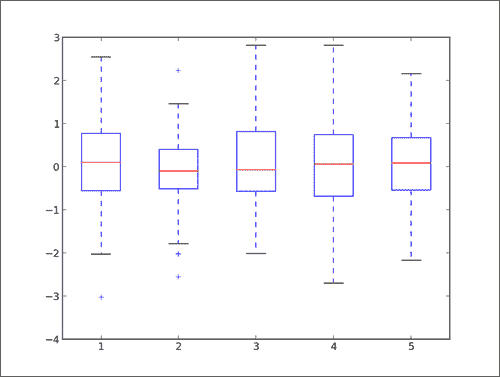

`pyplot.boxplot()`函数接受列表列表作为输入，为每个子列表绘制一个箱形图。

## 绘制三角剖分

**三角剖分**在处理空间位置时出现。 除了显示点与邻域关系之间的距离之外，三角剖分图可以方便地表示地图。 matplotlib 为三角剖分提供了大量支持。

### 操作步骤

与前面的示例一样，以下几行代码就足够了：

```py
import numpy as np
import matplotlib.pyplot as plt
import matplotlib.tri as tri

data = np.random.rand(100, 2)

triangles = tri.Triangulation(data[:,0], data[:,1])

plt.triplot(triangles)
plt.show()
```

每次运行脚本时，您都会看到不同的三角剖分，因为三角剖分的点云是随机生成的。

前面的脚本显示以下图形：

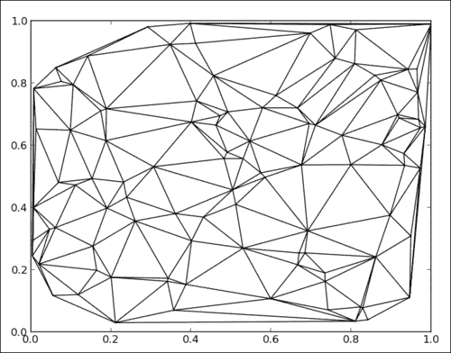

### 工作原理

我们导入`matplotlib.tri`模块，该模块提供了一些辅助函数来计算点的三角剖分。 在此示例中，出于演示目的，我们使用以下代码生成随机的点云：

```py
data = np.random.rand(100, 2)
```

我们使用以下代码来计算三角剖分并将其存储在三角形的变量中：

```py
triangles = tri.Triangulation(data[:,0], data[:,1])
```

`pyplot.triplot()`函数仅将三角形作为输入并显示三角剖分结果。