# 二、自定义颜色和样式

在本章中，我们将介绍：

*   定义自己的颜色
*   对散点图使用自定义颜色
*   对条形图使用自定义颜色
*   对饼图使用自定义颜色
*   对箱形图使用自定义颜色
*   对散点图使用颜色表
*   对条形图使用颜色表用
*   控制线条图案和粗细
*   控制填充图案
*   控制标记的样式
*   控制标记的大小
*   创建自己的标记
*   更好地控制标记
*   创建自己的配色方案

## 简介

matplotlib 可用的所有绘图都带有其默认样式。 虽然这对于原型制作很方便，但我们的最终图形将需要与默认样式有所不同。 您可能只需要使用灰度级，或者遵循现有的配色方案，或更一般地说，遵循现有的可视化图表。 matplotlib 在设计时考虑了灵活性。 正如本章的秘籍将说明的那样，很容易适应 matplotlib 图形的样式。

## 定义自己的颜色

matplotlib 使用的默认颜色相当淡淡。 对于方便的颜色，我们可能会有自己的偏好。 我们可能希望使图形遵循预定义的配色方案，以便它们很好地适合文档或网页。 更加务实的是，我们可能只需要为将要在黑白打印机上打印的文档制作图形。 在本秘籍中，我们将了解如何定义自己的颜色。

### 准备

在 matplotlib 中定义颜色的方法有多种。 其中一些如下：

*   **三元组**：这些颜色可以描述为实值三元组-颜色的红色，蓝色和绿色分量。 分量必须在`[0, 1]`间隔内。 因此，Python 语法`(1.0, 0.0, 0.0)`将编码纯净的鲜红色，而`(1.0, 0.0, 1.0)`则显示为强粉色。
*   **四元组**：这些作为三元组，并且第四部分定义透明度值。 此值也应在`[0, 1]`间隔内。 将图形渲染到图片文件时，使用透明颜色可以使图形与背景融合。 当制作可在网页上滑动或结束的图形时，这特别有用。
*   **预定义名称**：matplotlib 将标准 HTML 颜色名称解释为实际颜色。 例如，字符串`red`将被接受为一种颜色，并将被解释为亮红色。 几种颜色具有一个字母别名，如下表所示：

    | 别名 | 颜色 |
    | --- | --- |
    | `b` | 蓝色 |
    | `g` | 绿色 |
    | `r` | 红色 |
    | `c` | 青色 |
    | `m` | 品红 |
    | `y` | 黄色 |
    | `k` | 黑色 |
    | `w` | 白色 |

*   **HTML 颜色字符串**：matplotlib 可以将 HTML 颜色字符串解释为实际颜色。 这样的字符串定义为`#RRGGBB`，其中`RR`，`GG`和`BB`是十六进制的红色，绿色和蓝色分量的 8 位值。
*   **灰度字符串**：matplotlib 将浮点值的字符串表示形式解释为灰色阴影，例如`0.75`用于中等浅灰色。

### 操作步骤

设置线形图的颜色是通过如下设置`pyplot.plot()`函数的参数颜色（或等效的快捷方式`c`）来完成的：

```py
import numpy as np
import matplotlib.pyplot as plt

def pdf(X, mu, sigma):
  a = 1\. / (sigma * np.sqrt(2\. * np.pi))
  b = -1\. / (2\. * sigma ** 2)
  return a * np.exp(b * (X - mu) ** 2)

X = np.linspace(-6, 6, 1000)

for i in range(5):
  samples = np.random.standard_normal(50)
  mu, sigma = np.mean(samples), np.std(samples)
  plt.plot(X, pdf(X, mu, sigma), color = '.75')

plt.plot(X, pdf(X, 0., 1.), color = 'k')
plt.show()
```

上面的脚本将产生类似于下一个脚本的图形，其中显示五个浅灰色，钟形曲线和一个黑色曲线：

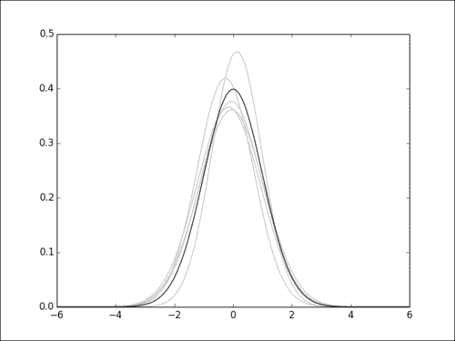

### 工作原理

在此示例中，我们从正态分布生成五组 50 个样本。 对于这五组中的每组，我们以浅灰色绘制估计的概率密度。 正态分布概率密度以黑色显示。 在那里，使用黑色的快捷方式`k`对颜色进行编码。

## 对散点图使用自定义颜色

就像控制线形图一样，我们可以控制用于散点图的颜色。 在本秘籍中，我们将看到如何使用两种方法来控制散点图的颜色。

### 准备

散点图函数`pyplot.scatter()` 提供以下两个选项，可通过其`color`参数或其快捷方式`c`控制点的颜色：

*   **所有点的通用颜色**：如果颜色参数是有效的 matplotlib 颜色定义，则所有点将以该颜色显示。
*   **每个点的单独颜色**：如果颜色参数是有效 matplotlib 颜色定义的序列，则第`i`个点将以第`i`种颜色出现。 当然，我们必须为每个点提供所需的颜色。

### 操作步骤

在以下脚本中，我们显示了从两个双变量高斯分布中得出的两组点`A`和`B`。 每套都有自己的颜色。 我们两次调用`pyplot.scatter()`，每个点集调用一次，如以下脚本所示：

```py
import numpy as np
import matplotlib.pyplot as plt

A = np.random.standard_normal((100, 2))
A += np.array((-1, -1)) # Center the distrib. at <-1, -1>

B = np.random.standard_normal((100, 2))
B += np.array((1, 1)) # Center the distrib. at <1, 1>

plt.scatter(A[:,0], A[:,1], color = '.25')
plt.scatter(B[:,0], B[:,1], color = '.75')
plt.show()
```

上面的脚本将产生以下图形：

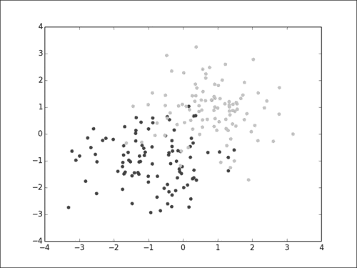

因此，在此示例中，完全像`pyplot.plot()`中那样使用自定义颜色。 在下面的脚本中，情况会有所不同。 我们从文本文件 Fisher 的鸢尾数据集加载数组，该文件可从[这里](http://archive.ics.uci.edu/ml/datasets/Iris)获得。 其内容如下所示：

```py
4.6,3.2,1.4,0.2,Iris-setosa
5.3,3.7,1.5,0.2,Iris-setosa
5.0,3.3,1.4,0.2,Iris-setosa
7.0,3.2,4.7,1.4,Iris-versicolor
6.4,3.2,4.5,1.5,Iris-versicolor
```

数据集的每个点都存储在以逗号分隔的值列表中。 给出每个点标签的最后一列是一个字符串，可以采用三个可能的值-`Iris-virginica`，`Iris-versicolor`和`Iris-Vertosa`。 我们使用 NumPy 的`numpy.loadtxt`函数读取此文件。 点的颜色将取决于它们的标签，我们将仅通过一次调用`pyplot.scatter()`来显示它们，如下所示：

```py
import numpy as np
import matplotlib.pyplot as plt

label_set = (
  b'Iris-setosa',
  b'Iris-versicolor',
  b'Iris-virginica',
)

def read_label(label):
  return label_set.index(label)

data = np.loadtxt('iris.data.txt',
                             delimiter = ',',
                             converters = { 4 : read_label })

color_set = ('.00', '.50', '.75')
color_list = [color_set[int(label)] for label in data[:,4]]

plt.scatter(data[:,0], data[:,1], color = color_list)
plt.show()
```

前面的脚本将产生以下图：

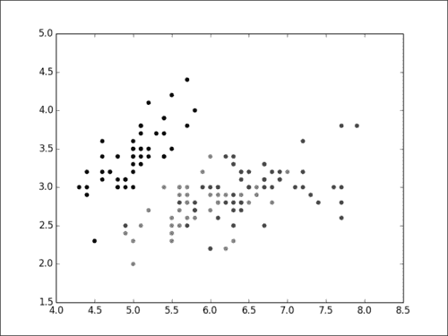

### 工作原理

对于的三个可能的标签，我们分配一种唯一的颜色。 颜色在`color_set`中定义，标签在`label_set`中定义。 `label_set`中的第`i`个标签与`color_set`中的第`i`个颜色相关联。

我们将标签列表`label_list`转换为颜色列表`color_list`，并使用列表推导特性。 然后，我们只需调用一次`pyplot.scatter()`，即可显示所有点及其颜色。 我们可以通过三个单独的调用来完成此操作，但是这将需要更多代码，而没有明显的收益。

两个点可能具有相同的坐标，但具有不同的标签。 在这种情况下，显示的颜色将是绘制的最新点的颜色。 使用透明颜色，重叠点的颜色将融合在一起。

### 更多

就像`color`参数控制点的颜色一样，`edgecolor`参数控制点的边缘的颜色。 它严格适用于`color`参数-您可以为每个点边缘设置相同的颜色，或分别控制边缘颜色，如下所示：

```py
import numpy as np
import matplotlib.pyplot as plt

data = np.random.standard_normal((100, 2))

plt.scatter(data[:,0], data[:,1], color = '1.0', edgecolor='0.0')
plt.show()
```

上面的脚本将产生以下图形：

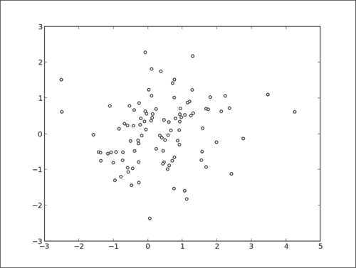

## 对条形图使用自定义颜色

条形图经常在网页和演示文稿中使用，其中人们通常必须遵循既定的配色方案。 因此，必须对它们的颜色进行良好的控制。 在本秘籍中，我们将看到如何用我们自己的颜色为条形图着色。

### 操作步骤

在第 1 章“第一步”中，我们已经了解了如何制作条形图。 控制使用哪种颜色的效果与用于线形图和散点图的方法相同，即通过一个可选参数。 在此示例中，我们从文件中加载国家人口的年龄金字塔，如下所示：

```py
import numpy as np
import matplotlib.pyplot as plt

women_pop = np.array([5., 30., 45., 22.])
men_pop     = np.array([5., 25., 50., 20.])

X = np.arange(4)
plt.barh(X, women_pop, color = '.25')
plt.barh(X, -men_pop, color = '.75')

plt.show()
```

上面的脚本显示了一个条形图，其中有男性年龄划分，另一条形图是妇女。 女士显示为深灰色，而男士显示为浅灰色，如下图所示：

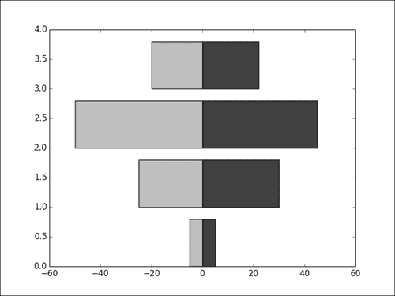

### 工作原理

`pyplot.bar()` 和`pyplot.barh()`函数的工作严格类似于`pyplot.scatter()`。 我们只需要设置可选参数`color`即可。 参数`edgecolor`也可用。

### 更多

在此示例中，我们显示条形图，并根据其表示的值对条形进行着色。 `[0, 24]`，`[25, 49]`，`[50, 74]`，`[75, 100]`范围内的值将以不同的灰色阴影显示。 颜色列表是使用列表理解来构建的，如下所示：

```py
import numpy as np
import matplotlib.pyplot as plt

values = np.random.random_integers(99, size = 50)

color_set = ('.00', '.25', '.50', '.75')
color_list = [color_set[(len(color_set) * val) // 100] for val in values]
plt.bar(np.arange(len(values)), values, color = color_list)
plt.show()
```

条形图图表的条形图根据其高度着色，如下图所示：

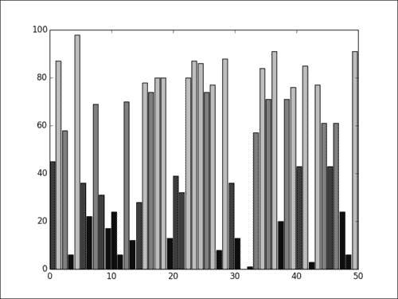

如果我们对值进行排序，则条形图将形成四个不同的带，如下图所示：

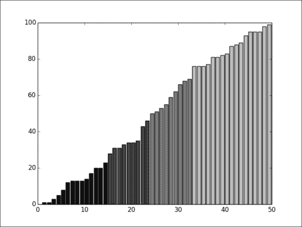

## 对饼图使用自定义颜色

与条形图一样，饼图也用于配色方案可能非常重要的环境中。 饼图着色的工作原理与条形图中的类似。 在本秘籍中，我们将看到如何用我们自己的颜色给饼图上色。

### 操作步骤

函数`pyplot.pie()` 接受颜色列表作为可选参数，如以下脚本中的所示：

```py
import numpy as np
import matplotlib.pyplot as plt

values = np.random.rand(8)
color_set = ('.00', '.25', '.50', '.75')

plt.pie(values, colors = color_set)
plt.show()
```

上面的脚本将产生以下饼图：

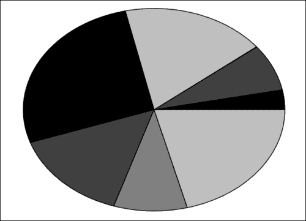

### 工作原理

饼图使用`colors`参数接受颜色列表（请注意，它是`colors`而不是`color`）。 但是，颜色列表没有输入值列表那么多的元素。 如果颜色少于值，则`pyplot.pie()`会简单地在颜色列表中循环显示。 在前面的示例中，我们给出了四种颜色的列表，以对由八个值组成的饼图上色。 因此，每种颜色将使用两次。

## 对箱形图使用自定义颜色

箱形图是科学出版物的常见主要特征。 彩色的箱形图没有问题。 但是，您可能只需要使用黑白。 在本秘籍中，我们将了解如何在箱图中使用自定义颜色。

### 操作步骤

每个创建特定图形的函数都会返回一些值-它们是构成图形的低级图形基元。 大多数时候，我们不会费心去获取那些返回值。 但是，操作这些低级绘图基元可以进行一些微调，例如对箱形图的自定义配色方案。

使箱形图显示为全黑比应该的要复杂一些，如以下脚本所示：

```py
import numpy as np
import matplotlib.pyplot as plt
values = np.random.randn(100)

b = plt.boxplot(values)
for name, line_list in b.iteritems():
  for line in line_list:
    line.set_color('k')

plt.show()
```

上面的脚本生成以下图形：


### 工作原理

绘图函数返回一个字典。 字典的关键字是图形元素的名称。 对于箱形图，此类元素将是中位数，传单，胡须，盒子和盖子。 与这些键中的每个键相关联的值是一系列低级图形图元（线，形状等）。 在脚本中，我们迭代作为箱形图一部分的每个图形基元，并将其颜色设置为黑色。 使用相同的方法，您可以使用自己的配色方案渲染箱形图。

## 对散点图使用颜色表

当使用多种颜色时，一个一个定义一个颜色是很麻烦的。 而且，建立一套好的色彩本身就是一个问题。 在某些情况下，**颜色表** 可以解决这些问题。 颜色表使用一种变量到一个值（对应一种颜色）的连续函数来定义颜色。 matplotlib 提供了几种常见的颜色表； 它们大多数是连续的色带。 在本秘籍中，我们将了解如何使用颜色表对散点图进行颜色着色。

### 操作步骤

颜色表在，，`matplotib.cm`模块中定义。 该模块提供函数来创建和使用颜色表。 它还提供了预定义颜色表的详尽选择。

函数`pyplot.scatter()`接受`color`参数的值列表。 提供颜色表（带有`cmap`参数）时，这些值将被解释为颜色表索引，如下所示：

```py
import numpy as np
import matplotlib.cm as cm
import matplotlib.pyplot as plt

N = 256
angle  = np.linspace(0, 8 * 2 * np.pi, N)
radius = np.linspace(.5, 1., N)

X = radius * np.cos(angle)
Y = radius * np.sin(angle)

plt.scatter(X, Y, c = angle, cmap = cm.hsv)
plt.show()
```

前面的脚本将生成点的彩色螺旋，如下图所示：

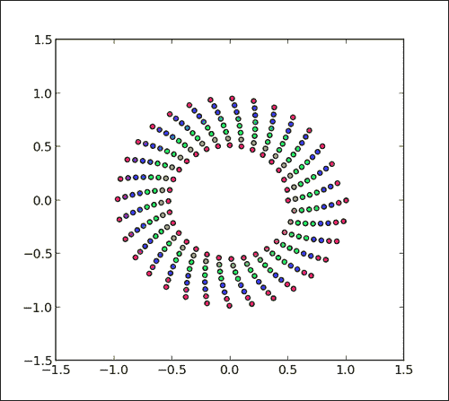

### 工作原理

在此脚本中，我们绘制了点的螺旋线。 点的颜色是角度变量的函数，从颜色表中获取颜色。 `matplotlib.cm`模块中提供了大量颜色表。 `hsv`贴图包含所有光谱，这使得花哨的彩虹主题更加丰富。 对于科学的可视化，考虑到感知到的颜色强度，其他颜色表更合适，例如`PuOr`图。 与`PuOr`映射相同的脚本将为我们提供以下结果：

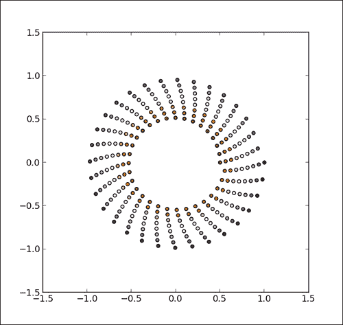

## 对条形图使用颜色表

`pyplot.scatter()`函数具有对颜色表的内置支持。 我们稍后将发现的其他一些绘图函数也具有这种支持。 但是，某些函数（例如 `pyplot.bar()`）不会将颜色表用作绘图条形图的输入。 在本秘籍中，我们将了解如何使用颜色表为条形图着色。

matplotlib 具有辅助函数，可从颜色表显式生成颜色。 例如，我们可以使用条形所代表的值的函数为条形图的条形着色。

### 操作步骤

我们将在本秘籍的中使用`matplotlib.cm`模块，就像在先前的秘籍中一样。 这一次，我们将直接使用颜色表对象，而不是让渲染函数自动使用它。 我们还将需要`matplotlib.colors`模块，其中包含与颜色相关的工具函数，如以下脚本所示：

```py
import numpy as np
import matplotlib.cm as cm
import matplotlib.colors as col
import matplotlib.pyplot as plt

values = np.random.random_integers(99, size = 50)

cmap = cm.ScalarMappable(col.Normalize(0, 99), cm.binary)

plt.bar(np.arange(len(values)), values, color = cmap.to_rgba(values))
plt.show()
```

上面的脚本将生成一个条形图，其中条形的颜色取决于其高度，如下图所示：

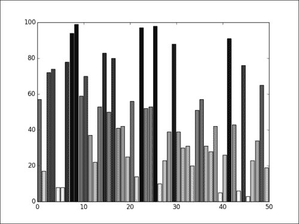

### 工作原理

我们首先创建颜色表`cmap`，以便将`[0, 99]`范围范围内的值映射到`matplotlib.cm.binary`颜色表的颜色。 然后，函数`cmap.to_rgba`将值列表转换为颜色列表。 因此，尽管`pyplot.bar`不支持颜色表，但是使用颜色表不涉及复杂的代码； 有一些功能可以简化这一过程。

请注意，如果对值列表进行了排序，则此处使用的颜色表的连续方面将变得显而易见，如下图所示：

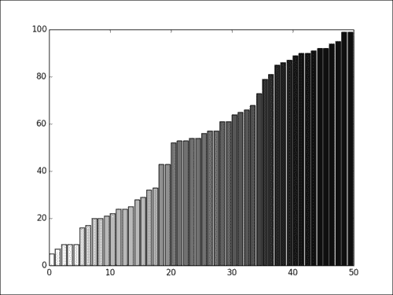

## 控制线条图案和粗细

在为黑白文档创建图形时，我们仅限于灰度级。 在实践中，通常我们可以合理使用最多三个灰度等级。 但是，使用不同的线型可以实现一些多样性。 在本秘籍中，我们将了解如何控制线条图案和粗细。

### 操作步骤

与颜色一样，线条样式由`pyplot.plot()`的可选参数控制，如以下脚本所示：

```py
import numpy as np
import matplotlib.pyplot as plt

def pdf(X, mu, sigma):
  a = 1\. / (sigma * np.sqrt(2\. * np.pi))
  b = -1\. / (2\. * sigma ** 2)
  return a * np.exp(b * (X - mu) ** 2)

X = np.linspace(-6, 6, 1024)

plt.plot(X, pdf(X, 0., 1.),   color = 'k', linestyle = 'solid')
plt.plot(X, pdf(X, 0.,  .5),  color = 'k', linestyle = 'dashed')
plt.plot(X, pdf(X, 0.,  .25), color = 'k', linestyle = 'dashdot')

plt.show()
```

前面的脚本将产生以下图形：

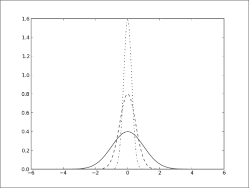

### 工作原理

在此示例中，我们使用`pyplot.plot()`的`linestyle`参数控制三个不同曲线的线型。 可以使用以下线条样式：

*   实线
*   虚线
*   点线
*   点划线

### 更多

线条样式设置不限于限于`pyplot.plot()`； 实际上，任何由线条组成的图形都可以进行此类设置。 此外，您还可以控制线的粗细。

#### 其他图类型的线型

`linestyle`参数可用于所有涉及线渲染的命令。 例如，我们可以修改用于条形图的折线图，如下所示：

```py
import numpy as np
import matplotlib.pyplot as plt

N = 8
A = np.random.random(N)
B = np.random.random(N)
X = np.arange(N)

plt.bar(X, A, color = '.75')
plt.bar(X, A + B, bottom = A, color = 'w', linestyle = 'dashed')

plt.show()
```

上面的脚本将产生以下图形：

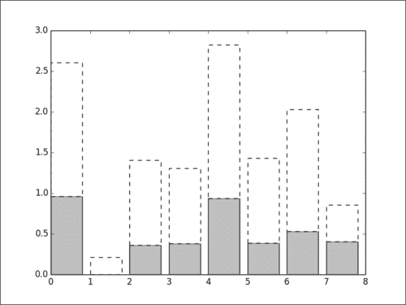

#### 线宽

同样，`linewidth`参数将更改线的粗细。 默认情况下，厚度设置为 1 个单位。 玩弄线条的粗细可以帮助强调一条特定的曲线。 以下是使用`linewidth`参数设置线宽的脚本：

```py
import numpy as np
import matplotlib.pyplot as plt

def pdf(X, mu, sigma):
  a = 1\. / (sigma * np.sqrt(2\. * np.pi))
  b = -1\. / (2\. * sigma ** 2)
  return a * np.exp(b * (X - mu) ** 2)

X = np.linspace(-6, 6, 1024)
for i in range(64):
  samples = np.random.standard_normal(50)
  mu, sigma = np.mean(samples), np.std(samples)
  plt.plot(X, pdf(X, mu, sigma), color = '.75', linewidth = .5)

plt.plot(X, pdf(X, 0., 1.), color = 'y', linewidth = 3.)
plt.show()
```

下图是上述脚本的结果，从 50 个样本中估计出 64 个估计的高斯 **PDF**（**概率密度函数**），并显示为细灰色曲线 。 用于绘制样本的高斯分布显示为粗黑曲线。

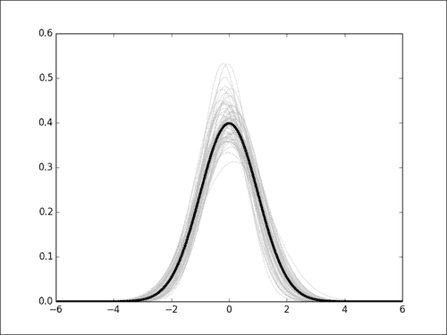

## 控制填充样式

matplotlib 提供相当有限的支持，以用图案填充表面。 对于线条图案，为黑白打印准备图形时可能会有所帮助。 在本秘籍中，我们将研究如何用图案填充表面。

### 操作步骤

让我们用条形图演示填充模式的用法，如下所示：

```py
import numpy as np
import matplotlib.pyplot as plt

N = 8
A = np.random.random(N)
B = np.random.random(N)
X = np.arange(N)

plt.bar(X, A, color = 'w', hatch = 'x')
plt.bar(X, A + B, bottom = A, color = 'w', hatch = '/')

plt.show()
```

上面的脚本生成以下图形：

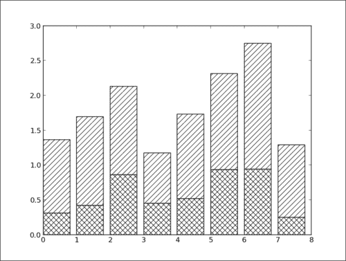

### 工作原理

填充体积的渲染函数（例如`pyplot.bar()`）接受可选参数`hatch`。 此参数可以采用以下值：

*   `/`
*   `\`
*   `|`
*   `-`
*   `+`
*   `x`
*   `o`
*   `O`
*   `.`
*   `*`

每个值对应于不同的阴影图案。 `color`参数将控制图案的背景颜色，而`edgecolor`参数将控制阴影线的颜色。

## 控制标记的样式

在第 1 章“第一步”中，我们看到了如何将曲线的点显示为点。 此外，散点图表示数据集的每个点。 事实证明，matplotlib 提供了多种形状以用其他种类的标记替换点。 在本秘籍中，我们将了解如何设置标记的样式。

### 准备

可以通过以下各种方式将标记指定为：

*   **预定义标记**：它们可以是预定义形状，可以将表示为`[0, 8]`范围内的数字，也可以包含一些字符串
*   **顶点列表**：这是值对的列表，用作形状的路径的坐标
*   **正多边形**：它将正 N 边形表示为带有旋转角度的三元组`(N, 0, 角度)`
*   **正多角星**：它将正 N 角星表示为带有旋转角度的三元组`(N, 1, 角度)`

### 操作步骤

让我们以一个脚本显示两个具有两种不同颜色的点集。 现在，我们将所有点显示为黑色，但标记不同，如下所示：

```py
import numpy as np
import matplotlib.pyplot as plt

A = np.random.standard_normal((100, 2))
A += np.array((-1, -1))
B = np.random.standard_normal((100, 2))
B += np.array((1, 1))

plt.scatter(A[:,0], A[:,1], color = 'k', marker = 'x')
plt.scatter(B[:,0], B[:,1], color = 'k', marker = '^')

plt.show()
```

将会出现两个高斯点云，每个云使用不同的标记，如下图所示：

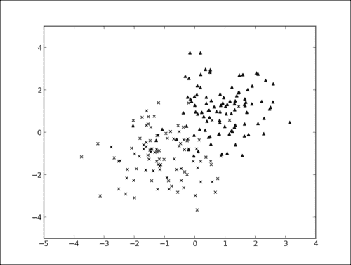

### 工作原理

在此脚本中，我们将的两个散点图的颜色都设置为黑色。 使用`marker`参数，我们为每个集合指定一个不同的标记。

与`color`参数不同，`marker`参数不接受标记规范列表作为输入。 因此，我们不能使用单个调用`pyplot.scatter()`来显示带有不同标记的几组点。 我们需要区分每种标记类型的点，并对每个标记使用单独的`pyplot.scatter()`调用，如下所示：

```py
import numpy as np
import matplotlib.pyplot as plt

label_list = (
  b'Iris-setosa',
  b'Iris-versicolor',
  b'Iris-virginica',
)

def read_label(label):
  return label_list.index(label)

data = np.loadtxt('iris.data.txt',
  delimiter = ',',
  converters = { 4 : read_label })

marker_set = ('^', 'x', '.')
for i, marker in enumerate(marker_set):
  data_subset = numpy.asarray([x for x in data if x[4] == i])
  plt.scatter(data_subset[:,0], data_subset[:,1],
    color = 'k',
    marker = marker)

plt.show()
```

数据集中的每个簇都有其自己的标记，如下图所示：

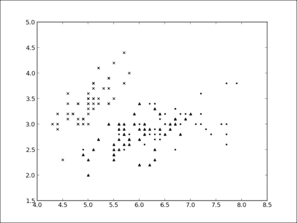

此示例与之前的示例相似，在该示例中，我们加载数据集，然后根据标签显示每个点。 但是，在这里，我们将每个标签的点分开。 然后，我们遍历地图的每个条目，并为每个点子集调用`pyplot.scatter()`。

### 更多

也可以使用相同的`marker`参数为`pyplot.plot()`访问标记样式。 对每个数据点使用一个标记可能是一个问题，因为它将显示比我们想要的更多的点。 `markevery`参数允许您为每个 *N* 点仅显示一个标记，如以下脚本所示：

```py
import numpy as np
import matplotlib.pyplot as plt

X = np.linspace(-6, 6, 1024)
Y1 = np.sinc(X)
Y2 = np.sinc(X) + 1
plt.plot(X, Y1, marker = 'o', color = '.75')
plt.plot(X, Y2, marker = 'o', color = 'k', markevery = 32)

plt.show()
```

上面的脚本生成以下图形：

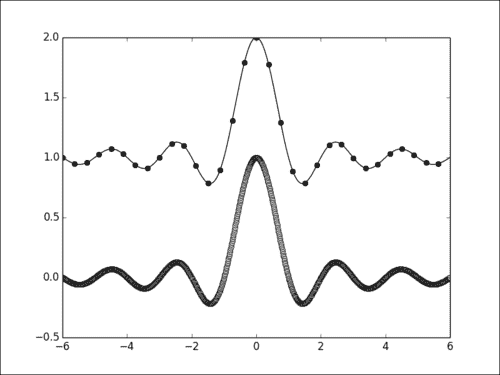

## 控制标记的大小

从先前的秘籍中可以看出，我们可以控制标记的样式； 控制它们的大小也遵循相同的原则。 在本秘籍中，我们将了解如何控制标记大小。

### 操作步骤

标记的大小与其他标记属性的控制方式相同，具有专用的可选参数，如以下脚本所示：

```py
import numpy as np
import matplotlib.pyplot as plt
A = np.random.standard_normal((100, 2))
A += np.array((-1, -1))
B = np.random.standard_normal((100, 2))
B += np.array((1, 1))

plt.scatter(B[:,0], B[:,1], c = 'k', s = 100.)
plt.scatter(A[:,0], A[:,1], c = 'w', s = 25.)

plt.show()
```

前面的脚本产生以下图形：

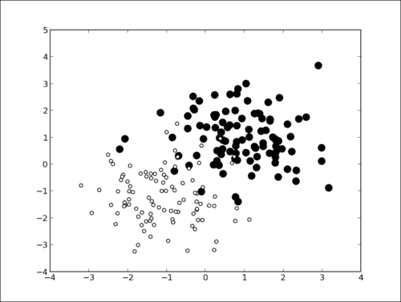

在此示例中，我们显示两组不同大小的点。 标记的大小由`pyplot.scatter()`的参数`s`设置的。 奇怪的是，它设置标记的表面积而不是其半径。

因为大小是实际表面积而不是半径，所以它们遵循二次方的变化-较大四倍的标记将具有两倍大的半径。

### 更多

`pyplot.scatter()`函数还将列表作为`s`参数的输入-每个点的大小，如以下脚本所示：

```py
import numpy as np
import matplotlib.pyplot as plt

M = np.random.standard_normal((1000, 2))
R = np.sum(M ** 2, axis = 1)

plt.scatter(M[:, 0], M[:, 1], c = 'w', marker = 's', s = 32\. * R)
plt.show()
```

上面的脚本生成以下图形：


在此脚本中，我们根据双变量高斯分布绘制了随机点。 点的半径取决于其距原点的距离。

`pyplot.plot()`函数还可以借助`markersize`（或其快捷方式`ms`）参数来更改标记的大小。 此参数不接受值列表作为输入。

## 创建自己的标记

matplotlib 提供了多种标记形状。 但是您可能找不到适合您的特定需求的东西。 例如，您可能希望使用动物剪影，公司徽标等。 在本秘籍中，我们将看到如何定义自己的标记形状。

### 操作步骤

matplotlib 将形状描述为路径-链接在一起的点序列。 因此，要定义我们自己的标记形状，我们必须提供一系列点。 在以下脚本示例中，我们将定义一个十字形形状：

```py
import numpy as np
import matplotlib.path as mpath
from matplotlib import pyplot as plt

shape_description = [
  ( 1.,  2., mpath.Path.MOVETO),
  ( 1.,  1., mpath.Path.LINETO),
  ( 2.,  1., mpath.Path.LINETO),
  ( 2., -1., mpath.Path.LINETO),
  ( 1., -1., mpath.Path.LINETO),
  ( 1., -2., mpath.Path.LINETO),
  (-1., -2., mpath.Path.LINETO),
  (-1., -1., mpath.Path.LINETO),
  (-2., -1., mpath.Path.LINETO),
  (-2.,  1., mpath.Path.LINETO),
  (-1.,  1., mpath.Path.LINETO),
  (-1.,  2., mpath.Path.LINETO),
  ( 0.,  0., mpath.Path.CLOSEPOLY),
]

u, v, codes = zip(*shape_description)
my_marker = mpath.Path(np.asarray((u, v)).T, codes)
data = np.random.rand(8, 8)
plt.scatter(data[:,0], data[:, 1], c = '.75', marker = my_marker, s = 64)
plt.show()
```

上面的脚本生成以下图形：

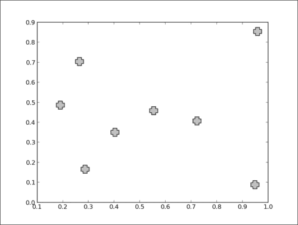

### 工作原理

使用标记渲染图形的所有`pyplot`函数都有一个可选参数，即`marker`。 我们在前面的秘籍中已经看到，参数可以是用于选择预定义的 matplotlib 标记之一的字符串。 但是`marker`参数也可以是`Path`的实例。 `Path`对象在`matplotlib.path`模块中定义。

`Path`对象的构造器将坐标列表和指令列表作为输入； 每个坐标一个指令。 我们没有使用两个单独的坐标和指令列表，而是使用单个列表`shape_description`，将坐标和指令融合在一起。 一点点代码用于操纵`shape_description`并将坐标和指令的单独列表馈送到`Path`构造器，如下所示：

```py
u, v, codes = zip(*shape_description)
my_marker = mpath.Path(np.asarray((u, v)).T, codes)
```

形状由光标的移动来描述。 我们使用以下三种类型的指令：

*   `MOVETO`：该指令将光标移动到指定坐标； 没有画线。
*   `LINETO`：在画一条线的同时将光标移动到指定的坐标。
*   `CLOSEPOLY`：它不会执行任何操作，它将关闭路径。 此指令将结束您的路径。

从理论上讲，任何形状都是可能的，您只需要描述其路径即可。 实际上，如果您希望使用复杂的形状（例如，公司的徽标），则必须进行一些转换工作。 matplotlib 不提供从流行的向量文件格式（例如 SVG）到`Path`对象的转换例程。

## 更好地控制标记

标记上可以进行精细控制，例如边缘颜色，内部颜色等。 例如，可以使用与曲线颜色不同颜色的标记来绘制曲线。 在本秘籍中，我们将研究如何对标记的外观进行精细控制。

### 操作步骤

我们已经了解了有关设置标记的形状，颜色和大小的可选参数。 如以下脚本所示，还有很多其他的玩法：

```py
import numpy as np
import matplotlib.pyplot as plt

X = np.linspace(-6, 6, 1024)
Y = np.sinc(X)

plt.plot(X, Y,
  linewidth = 3.,
  color = 'k',
  markersize = 9,
  markeredgewidth = 1.5,
  markerfacecolor = '.75',
  markeredgecolor = 'k',
  marker = 'o',
  markevery = 32)
plt.show()
```

出于可读性考虑，对`pyplot.plot()`的调用分为几行-每个可选参数一行。 上面的脚本将产生以下图形：

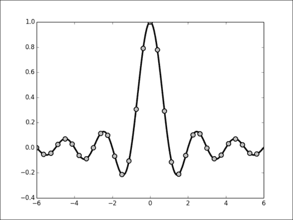

### 工作原理

此示例演示了`markeredgecolor`，`markerfacecolor`和`markeredgewidth`参数的使用，它们分别控制边缘颜色，内部颜色和标记的线宽。 所有可以使用标记的渲染函数（例如`pyplot.plot`）都接受这些可选参数。

## 创建您自己的配色方案

matplotlib 使用的默认颜色是指对于印刷文档而言，它适合合理地发布。 因此，默认情况下背景为白色，而标签，轴和其他标注显示为黑色。 在不同的使用上下文中，您可能希望使用不同的配色方案。 例如，将图形的背景变为黑色，标注为白色。 在本秘籍中，我们将展示如何更改 matplotlib 的默认设置。

### 操作步骤

在 matplotlib 中，可以分别处理各种对象，例如轴域，图形和标签。 一件一件地更改所有这些对象的颜色设置将非常麻烦。 幸运的是，所有 matplotlib 对象都从集中式配置对象中选择其默认颜色。

在以下脚本中，我们使用 matplotlib 的集中式配置来具有黑色背景和白色标注：

```py
import numpy as np
import matplotlib as mpl
from matplotlib import pyplot as plt

mpl.rc('lines', linewidth = 2.)
mpl.rc('axes', facecolor = 'k', edgecolor = 'w')
mpl.rc('xtick', color = 'w')
mpl.rc('ytick', color = 'w')
mpl.rc('text', color = 'w')
mpl.rc('figure', facecolor = 'k', edgecolor ='w')
mpl.rc('axes', color_cycle = ('w', '.5', '.75'))

X = np.linspace(0, 7, 1024)

plt.plot(X, np.sin(X))
plt.plot(X, np.cos(X))
plt.show()
```

上面的脚本生成以下图形：

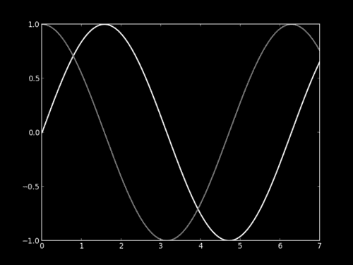

### 工作原理

`matplotlib`模块具有用作集中配置的`rc`对象。 每个 matplotlib 对象都将从该`rc`对象中选择其默认设置。 `rc`对象包含一组属性和关联的值。 例如，`mpl.rc('lines'`，`linewidth = 2.)`会将属性`lines.linewidth`设置为 2； 默认情况下，线条的宽度现在为 2。 在这里，我们将图形的背景设置为黑色（使用`figure.facecolor`和`axes.facecolor`属性），而将所有标注设置为白色（使用`figure.edgecolor`，`axes.edgecolor`，`text.color`和`xtick.color` ，`ytick.color`属性）。 我们还使用`axes.color_cycle`属性重新定义了 matplotlib 自动选择的颜色。 有关 matplotlib 属性的很好参考，请访问[这里](http://matplotlib.org/_static/matplotlibrc)。

### 更多

现在，我们知道如何更改 matplotlib 的默认设置以适合我们的口味。 但是，如果我们希望所有脚本都使用这些设置，则必须复制并粘贴它们。 这很不方便。 幸运的是，默认设置可以保存在`matplotlibrc`文件中。 `maptplotlibrc`文件是纯文本文件，其中包含属性及其相应的值； 每行一个属性。 以下是此秘籍的`matplotlibrc`格式设置：

```py
lines.linewidth : 2
axes.facecolor : black
axes.edgecolor : white
xtick.color : white
ytick.color : white
text.color : white
figure.facecolor : black
figure.edgecolor : white
axes.color_cycle : white, #808080, #b0b0b0
```

如果在当前目录（即从中启动脚本的目录）中找到了`matplotlibrc`文件，它将覆盖 matplotlib 的默认设置。

您也可以将`matplotlibrc`文件保存在特定位置以进行自己的默认设置。 在交互式 Python Shell 中，运行以下命令：

```py
import matplotlib
mpl.get_configdir()
```

此命令将显示可放置`matplotlibrc`文件的位置，以便那些设置将是您自己的默认设置。