# 三、处理标注

在本章中，我们将介绍以下主题：

*   添加标题
*   使用 LaTeX 样式的符号
*   在每个轴上添加标签
*   添加文本
*   添加箭头
*   添加图例
*   添加网格
*   添加线条
*   添加形状
*   控制刻度线间距
*   控制刻度标签

## 简介

使您的图表不言自明是一种很好的做法。 但是，很难在没有任何标注的情况下使一些曲线和点不言自明。 人们应该如何读取垂直和水平轴？ 该框和该曲线代表哪个数量？ matplotlib 提供了很多标注图形的可能性，我们将在本章中进行探讨。

## 添加标题

让我们从简单的事情开始：为图形添加标题。

### 操作步骤

以下代码将添加到图形标题：

```py
import numpy as np
import matplotlib.pyplot as plt

X = np.linspace(-4, 4, 1024)
Y = .25 * (X + 4.) * (X + 1.) * (X - 2.)

plt.title('A polynomial')
plt.plot(X, Y, c = 'k')
plt.show()
```

在这里，我们绘制一条简单的曲线，并在图形的顶部添加一个标题，该标题显示在图形的顶部：

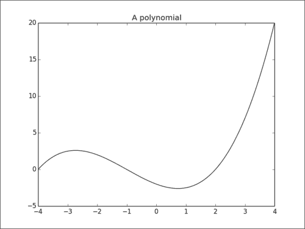

### 工作原理

简单地通过 `pyplot.title()`函数完成，该函数将一个字符串作为参数并设置整个图形的标题。

## 使用 LaTeX 样式的符号

现在我们可以标注数字。 但是，在科学和工程方面，以前演示的解决方案受到一个令人讨厌的限制。 我们不能使用数学符号！ 或者，可以吗？ 在本秘籍中，我们将了解如何使用 LaTeX 在图中显示和数学脚本。

### 准备

您需要在计算机上安装可运行的 LaTeX 设置，以便 matplotlib 可以解释 LaTeX 样式的表示法以呈现数学文本。 否则，您将无法尝试此秘籍。 您可以在 [LaTeX Wikibook](http://en.wikibooks.org/wiki/LaTeX/Installation) 上找到有关安装 LaTeX 的有用说明。

#### 提示

**LaTeX**

LaTeX 是学术界广泛使用的文档准备系统。 与 Microsoft Word 或 LibreOffice Writer 等文档编辑器不同，LaTeX 用户无法看到最终文档在编辑时的外观。 文档被描述为文本和存储在纯文本文件中的命令的混合。 然后，LaTeX 将解释文档描述以呈现文档。 LaTeX 是一个相当大的环境。 LaTeX 具有用于描述数学文本的特定语言。 这种语言非常流行，以至于简单地编写公式而不是呈现它们已成为事实上的标准。 例如，在科学和工程界，LaTeX 的公式语言通常用于在电子邮件和论坛中编写数学文本。

### 操作步骤

使用 LaTeX 渲染一些文本非常简单：

```py
import numpy as np
import matplotlib.pyplot as plt

X = np.linspace(-4, 4, 1024)
Y = .25 * (X + 4.) * (X + 1.) * (X - 2.)

plt.title('$f(x)=\\frac{1}{4}(x+4)(x+1)(x-2)$')
plt.plot(X, Y, c = 'k')
plt.show()
```

该脚本完全按照我们之前的秘籍进行操作：在顶部显示一个带有标题的图形。 但是，正如秘籍的标题可能暗示的那样，该标题使用 LaTeX 渲染，使我们可以使用数学表示法。

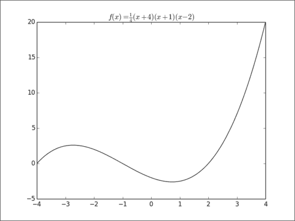

### 工作原理

与通常设置标题的方式的唯一区别是`pyplot.title()`提供的字符串。 字符串以`$`字符开头和结尾； 这是为了通知 matplotlib 将文本解释和呈现为 LaTeX 样式的数学文本。 然后，字符串内容只是数学文本的标准 LaTeX 语言。

LaTeX 语言严重依赖转义字符`\`，该字符也恰好是 Python 的字符串转义字符。 因此，在 LaTeX 文本中使用一个`\`字符的地方，请在 Python 字符串中放入两个。 为避免弄乱转义字符，您可以在字符串前面添加`r`，并且不需要任何转义字符。 因此，`'$f(x)=\\frac{1}{4}(x+4)(x+1)(x-2)$'`和`r'$f(x)=\frac{1}{4}(x+4)(x+1)(x-2)$'`是等效的。

#### 注意

您不懂数学文字的 LaTeX 语言吗？ 不用担心，您可以快速学习！ 在 matplotlib 上下文中，您可以在[这个页面](http://matplotlib.org/users/mathtext.html)中找到权威指南。 可以在[这个页面](http://en.wikibooks.org/wiki/LaTeX/Mathematics)上找到相当完整的教程。

此 LaTeX 标注函数不限于标题。 它可以用于任何标注。 在这里，我们仅在标题文本上进行演示。

## 在每个轴上添加标签

除了标题，图形轴的正确描述有助于用户理解图形。 在本秘籍中，我们将向您展示如何在图形的每个轴旁边获取标签。

### 操作步骤

添加此类标注非常简单，如以下示例所示：

```py
import numpy as np
import matplotlib.pyplot as plt

X = np.linspace(-4, 4, 1024)
Y = .25 * (X + 4.) * (X + 1.) * (X - 2.)

plt.title('Power curve for airfoil KV873')
plt.xlabel('Air speed')
plt.ylabel('Total drag')

plt.plot(X, Y, c = 'k')
plt.show()
```

该图将与本章第一个秘籍中获得的图相同。 但是，两个轴域都具有图例。

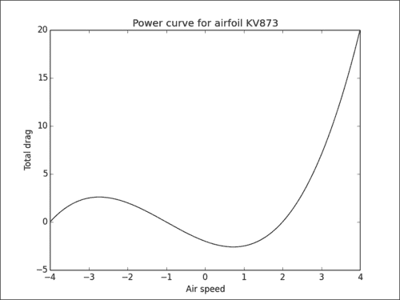

### 工作原理

我们使用 `pyplot.xlabel()`和`pyplot.ylabel()`函数分别为的水平轴和的垂直轴添加描述。 至于`pyplot.title()`函数，该函数接受 LaTeX 表示法。 这些函数可用于任何图形。 您将使用相同的函数来标注散点图，直方图等。

## 添加文本

到目前为止，我们已经了解了如何在预设位置（例如标题和轴）设置文本。 在本秘籍中，我们将了解如何使用文本框在任何位置添加文本。

### 操作步骤

matplotlib 具有灵活的函数，称为 `pyplot.text()`，该函数显示文本：

```py
import numpy as np
import matplotlib.pyplot as plt
X = np.linspace(-4, 4, 1024)
Y = .25 * (X + 4.) * (X + 1.) * (X - 2.)

plt.text(-0.5, -0.25, 'Brackmard minimum')

plt.plot(X, Y, c = 'k')
plt.show()
```

该脚本在曲线旁边显示文本：

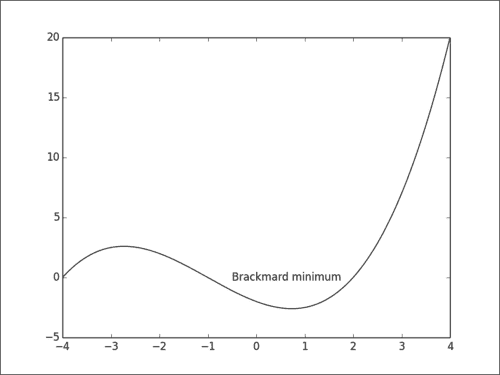

### 工作原理

我们使用`pyplot.text()`函数来获取位置和要显示的文本。 位置在图形坐标中给出，指定文本的左边框和垂直基线的位置。

### 更多

matplotlib 的文本呈现非常灵活。 让我们探索可用的重要选项。

#### 对齐控制

文本由框限制。 此框用于使文本与传递给`pyplot.text()`的坐标相对对齐。 使用`verticalalignment`和`horizontalalignment`参数（相应的快捷方式分别为`va`和`ha`），我们可以控制对齐方式。

垂直对齐选项如下：

*   `'center'`：相对于文本框的中心
*   `'top'`：相对于文本框的上侧
*   `'bottom'`：相对于文本框的下侧
*   `'baseline'`：相对于文本的基线

    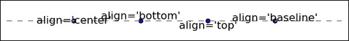

水平对齐选项如下：

*   `'center'`：相对于文本框的中心
*   `'left'`：相对于文本框的左侧
*   `'right'`：相对于文本框的右侧

    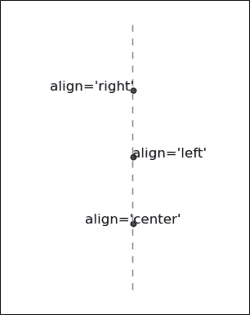

#### 边界框控件

`pyplot.text()`函数支持`bbox`参数，其中将字典作为输入。 该词典定义了文本框的各种设置。 这是一个例子：

```py
import numpy as np
import matplotlib.pyplot as plt

X = np.linspace(-4, 4, 1024)
Y = .25 * (X + 4.) * (X + 1.) * (X - 2.)

box = {
  'facecolor'  : '.75',
  'edgecolor' : 'k',
  'boxstyle'    : 'round'
}

plt.text(-0.5, -0.20, 'Brackmard minimum', bbox = box)

plt.plot(X, Y, c='k')
plt.show()
```

前面的代码将给出以下输出：

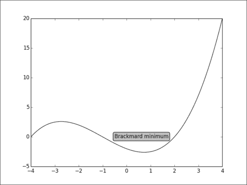

将传递给`bbox`参数的字典定义了以下键值对：

*   `'facecolor'`：这是用于包装盒的颜色。 它将用于设置背景和边缘颜色
*   `'edgecolor'`：这是用于盒子形状边缘的颜色
*   `'alpha'`：用于设置透明度级别，以使框与背景融合
*   `'boxstyle'`：设置框的样式，可以是`'round'`或`'square'`
*   `'pad'`：如果`'boxstyle'`设置为`'square'`，则定义文本和框的两边之间的填充量

## 添加箭头

添加文本框可以帮助您标注图形。 但是，要显示图片的特定部分，使用箭头没有什么可比的。 在本秘籍中，我们将向您展示如何在图形上添加箭头。

### 操作步骤

matplotlib 具有使用`pyplot.annotate()`函数绘制箭头的功能，如以下代码片段所示：

```py
import numpy as np
import matplotlib.pyplot as plt

X = np.linspace(-4, 4, 1024)
Y = .25 * (X + 4.) * (X + 1.) * (X - 2.)

plt.annotate('Brackmard minimum',
ha = 'center', va = 'bottom',
xytext = (-1.5, 3.),
xy = (0.75, -2.7),
arrowprops = { 'facecolor' : 'black', 'shrink' : 0.05 })

plt.plot(X, Y)
plt.show()
```

该脚本用文本和箭头标注一条曲线，如下图所示：

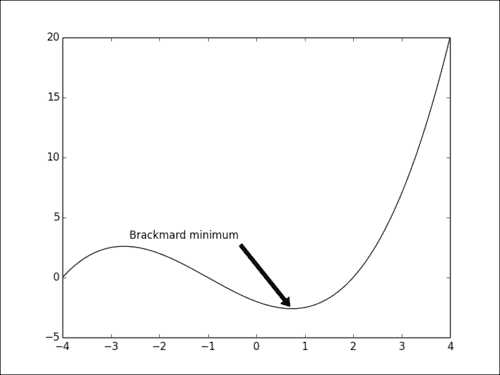

### 工作原理

`pyplot.annotate()`函数显示与`pyplot.text()`相同行的文本。 但是，也会显示一个箭头。 要显示的文本是第一个参数。 `xy`参数指定箭头的目的地。 `xytext`参数指定文本位置。 与`pyplot.text()`相似，可以通过`horizontalalignment`和`verticalalignment`参数进行文本对齐。 `shrink`参数控制箭头的端点和箭头本身之间的间隙。

箭头的方向由传递给 `arrowprops`参数的字典控制：

*   `'arrowstyle'`：参数`''<-''`，`''<''`，`''-''`，`''wedge''`，`''simple''`和`"fancy"`控制箭头的样式
*   `'facecolor'`：这是箭头所使用的颜色。 它将用于设置背景和边缘颜色
*   `'edgecolor'`：这是箭头形状边缘使用的颜色
*   `'alpha'`: 这用于设置透明度，以便箭头与背景融合

    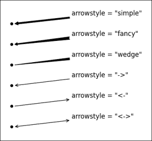

## 添加图例

没有自己的传说，一个合适的图表是不完整的。 matplotlib 提供了一种以最少的精力生成图例的方法。 在本秘籍中，我们将看到如何在图上添加图例。

### 操作步骤

对于此秘籍，我们使用`pyplot.legend()`函数以及`label`可选参数：

```py
import numpy as np
import matplotlib.pyplot as plt

X = np.linspace(0, 6, 1024)
Y1 = np.sin(X)
Y2 = np.cos(X)

plt.xlabel('X')
plt.ylabel('Y')

plt.plot(X, Y1, c = 'k',  lw = 3.,              label = 'sin(X)')
plt.plot(X, Y2, c = '.5', lw = 3., ls = '--', label = 'cos(X)')

plt.legend()
plt.show()
```

上面的代码提供以下输出：

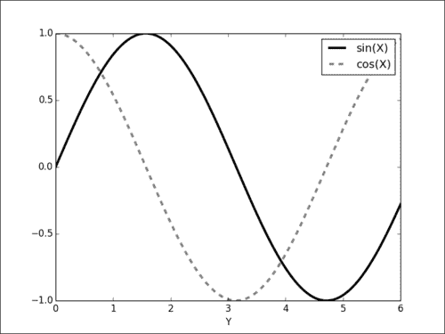

### 工作原理

每个`pyplot`函数都有可选的`label`参数，以命名元素，例如图形的曲线，直方图等。 matplotlib 跟踪这些标签。 `pyplot.legend()`函数将渲染图例。 图例是从标签自动生成的。

### 更多

`pyplot.legend`函数具有几个有趣的参数来控制图例方面：

*   `'loc'`：这是图例的位置。 默认值为`'best'`，它将自动放置它。 其他有效值是`'upper left'`，`'lower left'`，`'lower right'`，`'right'`，`'center left'`，`'center right'`，`'lower center'`，`'upper center'`和`'center'`。
*   `'shadow'`：可以是`True`或`False`，并使用阴影效果渲染图例。
*   `'fancybox'`：可以是`True`或`False`，并用圆角框显示图例。
*   `'title'`：这将通过带有作为参数传递的标题的图例进行渲染。
*   `'ncol'`：强制传递的值是图例的列数。

## 添加网格

在准备图形时，我们可能需要快速猜测图形任何部分的坐标。 在图形上添加网格是提高图形可读性的自然方法。 在本秘籍中，我们将看到如何在图形上添加网格。

### 操作步骤

matplotlib 的网格功能由 `pyplot.grid()`函数控制。

```py
import numpy as np
import matplotlib.pyplot as plt

X = np.linspace(-4, 4, 1024)
Y = .25 * (X + 4.) * (X + 1.) * (X - 2.)

plt.plot(X, Y, c = 'k')
plt.grid(True, lw = 2, ls = '--', c = '.75')
plt.show()
```

该脚本将显示在背景中带有网格的曲线。 网格与坐标轴图例的刻度对齐，如下图所示：

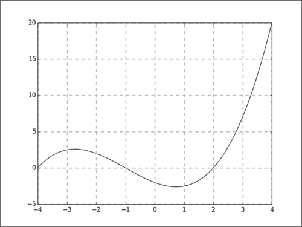

### 工作原理

添加网格就像一样简单，就像用`True`作为参数调用`pyplot.grid()`函数一样。 网格由线条组成，因此`pyplot.grid()`接受线条样式参数，例如`linewidth`，`linestyle`或`color`。 这些参数将应用于绘制网格的线。

## 添加线条

当您有非常具体的需求时，matplotlib 提供的数据可能对您没有太大帮助。 matplotlib 制作的所有图形均由基本图元组成。 在演示如何更改箱形图的颜色时，我们提到大多数 matplotlib 绘图函数都会返回线条和形状的集合。 现在，我们将演示如何直接使用基本图元。

### 操作步骤

以下脚本将显示由独立行构成的简单但美观的模式：

```py
import matplotlib.pyplot as plt

N = 16
for i in range(N):
  plt.gca().add_line(plt.Line2D((0, i), (N - i, 0), color = '.75'))

plt.grid(True)
plt.axis('scaled')
plt.show()
```

上面的代码提供以下输出：

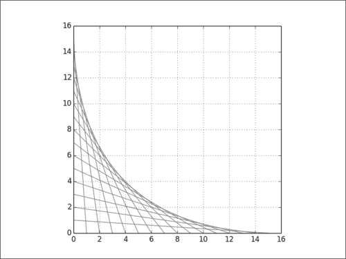

### 工作原理

在此脚本中，我们绘制了 16 条独立的线。 `pyplot.Line2D()`函数创建一个新的`Line2D`对象。 强制性参数是该行的端点。 可选参数是我们之前针对基于线的图形所见的所有参数。 因此，您可以使用`linestyle`，`linewidth`，`marker`，`markersize`，`color`等。

`pyplot.Line2D()`函数创建了该行，但是除非您明确要求，否则不会渲染该行； 这是使用`pyplot.gca().add_line()`完成的。 `pyplot.gca()`函数返回负责跟踪渲染内容的对象。 调用`gca().add_line()`只是表示我们要渲染一条线。

需要使用`pyplot.axis('scaled')`函数以确保图形使用统一的比例尺：与 *x* 和 *y* 轴上使用的比例尺相同。 这与默认行为`'tight'`形成对比，其中默认值 matplotlib 将为 *x* 和 *y* 轴赋予不同的比例，以使图形尽可能紧密地适合显示表面。 此函数将在第 4 章，“处理图形”中介绍。

## 添加形状

要使用基本图元制作自己的图形，线条是很好的起点，但是您很可能需要更多形状。 渲染形状的工作方式与渲染线相同。 在本秘籍中，我们将向您展示如何在图形中添加形状。

### 操作步骤

在以下脚本中，我们创建并渲染几个形状。 标注指示哪个部分呈现哪种形状：

```py
import matplotlib.patches as patches
import matplotlib.pyplot as plt

## Circle
shape = patches.Circle((0, 0), radius = 1., color = '.75')
plt.gca().add_patch(shape)

## Rectangle
shape = patches.Rectangle((2.5, -.5), 2., 1., color = '.75')
plt.gca().add_patch(shape)

## Ellipse
shape = patches.Ellipse((0, -2.), 2., 1., angle = 45., color = '.75')
plt.gca().add_patch(shape)

## Fancy box
shape = patches.FancyBboxPatch((2.5, -2.5), 2., 1., boxstyle = 'sawtooth', color = '.75')
plt.gca().add_patch(shape)

## Display all
plt.grid(True)
plt.axis('scaled')
plt.show()
```

输出中显示了四种不同的形状，如以下屏幕截图所示：

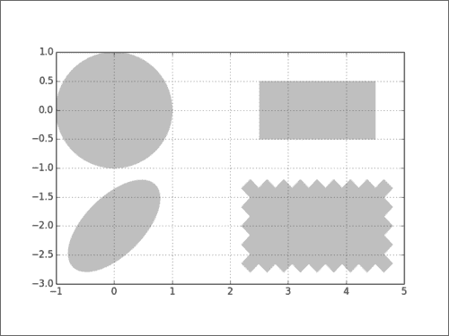

### 工作原理

无论显示哪种形状，原理都相同。 在内部，形状被描述为在 matplotlib API 中称为“补丁”的路径。 `matplotlib.patches`模块中提供了几种形状的路径。 实际上，该模块包含用于所有附图的补丁。 与线条一样，创建路径不足以渲染它。 您将必须表示要渲染它。 这是通过`pyplot.gca().add_patch()`完成的。

许多路径构造器都可用。 让我们回顾一下示例中使用的那些：

*   **`Circle`**：将其中心坐标和半径作为参数
*   **`Ractangle`**：将其左下角的坐标及其大小作为参数
*   **`Ellipse`**：将其中心坐标和两个轴的半长作为参数
*   **`FancyBox`** ：这就像一个矩形，但带有一个附加的`boxstyle`参数（`'larrow'`，`'rarrow'`，`'round'`，`'round4'`，`'roundtooth'`，`'sawtooth'`或`'square'`）

### 更多

除了预定义的形状，我们还可以使用多边形定义任意形状。

#### 使用多边形

多边形仅比路径复杂，并且由点列表定义：

```py
import numpy as np
import matplotlib.patches as patches
import matplotlib.pyplot as plt

theta = np.linspace(0, 2 * np.pi, 8)
points = np.vstack((np.cos(theta), np.sin(theta))).transpose()

plt.gca().add_patch(patches.Polygon(points, color = '.75'))

plt.grid(True)
plt.axis('scaled')
plt.show()
```

前面的代码提供以下多边形作为输出：

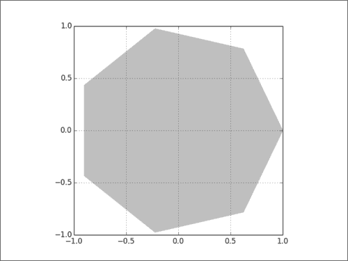

`matplotlib.patches.Polygon()`构造器将坐标列表作为输入，即多边形的顶点。

#### 使用路径属性

所有路径都有我们先前已经探讨过的几个属性：`linewidth`，`linestyle`，`edgecolor`，`facecolor`，`hatch`等，如下所示：

```py
import numpy as np
import matplotlib.patches as patches
import matplotlib.pyplot as plt

theta = np.linspace(0, 2 * np.pi, 6)
points = np.vstack((np.cos(theta), np.sin(theta))).transpose()

plt.gca().add_patch(plt.Circle((0, 0), radius = 1., color = '.75'))
plt.gca().add_patch(plt.Polygon(points, closed=None, fill=None, lw = 3., ls = 'dashed', edgecolor = 'k'))

plt.grid(True)
plt.axis('scaled')
plt.show()
```

下图是上述代码的输出：

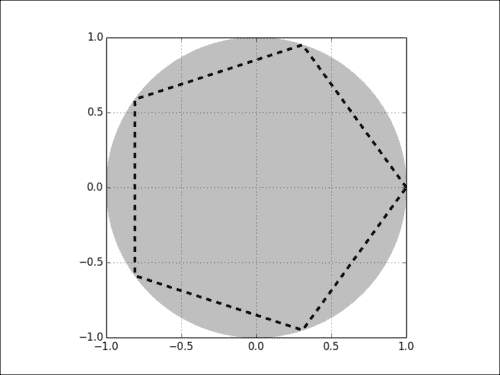

在这里，我们使用具有虚线边缘（`ls = 'dashed'`）的非填充（`fill = None`）多边形绘制多边形轮廓，而不必创建多个线对象。 仅通过使用路径的属性就可以实现许多效果。

## 控制刻度线间距

在 matplotlib 中，刻度在图形的两个轴上都是小标记。 到目前为止，我们让 matplotlib 处理轴域图例上刻度线的位置。 正如我们将在本秘籍中看到的那样，我们可以手动覆盖此机制。

### 操作步骤

在此脚本中，我们将操纵 x 轴上的刻度线之间的间隙：

```py
import numpy as np
import matplotlib.pyplot as plt
import matplotlib.ticker as ticker

X = np.linspace(-15, 15, 1024)
Y = np.sinc(X)

ax = plt.axes()
ax.xaxis.set_major_locator(ticker.MultipleLocator(5))
ax.xaxis.set_minor_locator(ticker.MultipleLocator(1))

plt.plot(X, Y, c = 'k')
plt.show()
```

现在，在通常的刻度之间可以看到较小的刻度：

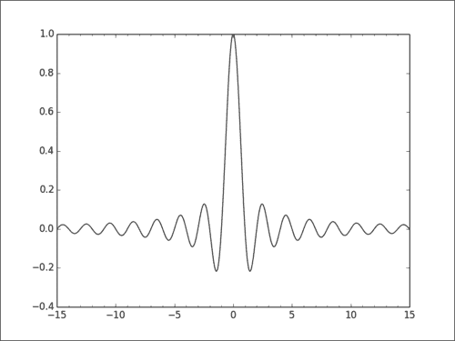

### 工作原理

我们强制水平刻度线以 5 个单位显示。 此外，我们还添加了小刻度，以 1 个单位的步长出现。 为此，我们执行以下步骤：

1.  我们获得了`Axes`对象的实例：管理图形轴域的对象。 这是`ax = plot.axes()`的目的。
2.  对于 *x* 轴（`ax.xaxis`），我们为主要和次要刻度线设置了一个`Locator`实例。

### 更多

如果我们希望添加网格，可以考虑较小的刻度，如下所示：

```py
import numpy as np
import matplotlib.pyplot as plt
import matplotlib.ticker as ticker

X = np.linspace(-15, 15, 1024)
Y = np.sinc(X)
ax = plt.axes()
ax.xaxis.set_major_locator(ticker.MultipleLocator(5))
ax.xaxis.set_minor_locator(ticker.MultipleLocator(1))

plt.grid(True, which='both')
plt.plot(X, Y)
plt.show()
```

前面的代码代码段给出以下输出：

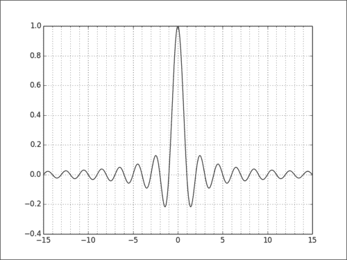

如前所示，我们可以使用`pyplot.grid()`添加一个网格。 此函数采用可选参数`which`。 它可以接受三个值：`'minor'`，`'major'`和`'both'`。 它确定应在哪个刻度上显示网格。

## 控制刻度标签

刻度标签是图形空间中的坐标。 尽管在很多情况下都有意义，但这并不总是足够的。 例如，让我们想象一个条形图，该条形图显示 10 个国家的中位数收入。 我们希望看到每个条形下的国家名称，而不是条形的坐标。 对于时间序列，我们希望看到日期，而不是一些抽象坐标。 matplotlib 为此提供了一个全面的 API。 在本秘籍中，我们将了解如何控制刻度标签。

### 操作步骤

使用标准的 matplotlib 刻度 API，可以如下设置条形图（或任何其他类型的图形）的刻度：

```py
import numpy as np
import matplotlib.ticker as ticker
import matplotlib.pyplot as plt

name_list = ('Omar', 'Serguey', 'Max', 'Zhou', 'Abidin')
value_list = np.random.randint(0, 99, size = len(name_list))
pos_list = np.arange(len(name_list))

ax = plt.axes()
ax.xaxis.set_major_locator(ticker.FixedLocator((pos_list)))
ax.xaxis.set_major_formatter(ticker.FixedFormatter((name_list)))

plt.bar(pos_list, value_list, color = '.75', align = 'center')
plt.show()
```

条形图的每个条形都有自己的刻度和图例：

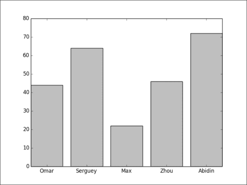

### 工作原理

我们已经看到了`ticker.Locator`来生成刻度线的位置。 `ticker.Formatter`对象实例将为刻度生成标签。 我们在这里使用的`Formatter`实例是`FixedFormatter`，它将从字符串列表中获取标签。 然后，使用`Formatter`实例设置 *x* 轴。 对于此特定示例，我们还使用`FixedLocator`来确保每个小节位于一个刻度的中间。

### 更多

我们几乎没有触及这个话题的表面。 关于刻度的更多信息。

#### 一种创建带有固定标签的条形图的更简单方法

对于条形图固定标签的特殊情况，我们可以利用快捷方式的优势：

```py
import numpy as np
import matplotlib.pyplot as plt

name_list = ('Omar', 'Serguey', 'Max', 'Zhou', 'Abidin')
value_list = np.random.randint(0, 99, size = len(name_list))
pos_list = np.arange(len(name_list))

plt.bar(pos_list, value_list, color = '.75', align = 'center')
plt.xticks(pos_list, name_list)
plt.show()
```

前面的代码代码段给出了以下条形图：

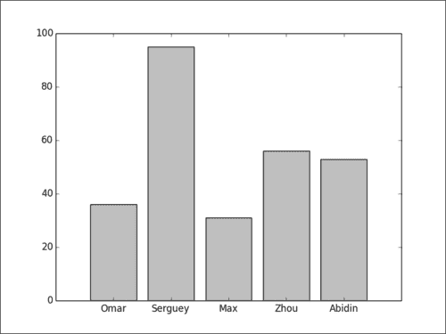

而不是使用股票代号 API，我们使用`pyplot.xticks()`函数为一组固定的代号提供了修复标签。 该函数将位置列表和名称列表作为参数。 结果与前面的示例相同； 它更短，更容易记住。

#### 高级标签生成

如果代码 API 的重点是我们周围有快捷方式怎么办？ 报价器 API 的效果要好于，而不是为每个报价显示固定标签，如下所示：

```py
import numpy as np
import matplotlib.pyplot as plt
import matplotlib.ticker as ticker

def make_label(value, pos):
  return '%0.1f%%' % (100\. * value)

ax = plt.axes()
ax.xaxis.set_major_formatter(ticker.FuncFormatter(make_label))

X = np.linspace(0, 1, 256)
plt.plot(X, np.exp(-10 * X), c ='k')
plt.plot(X, np.exp(-5 * X), c= 'k', ls = '--')

plt.show()
```

上面的代码提供以下输出：

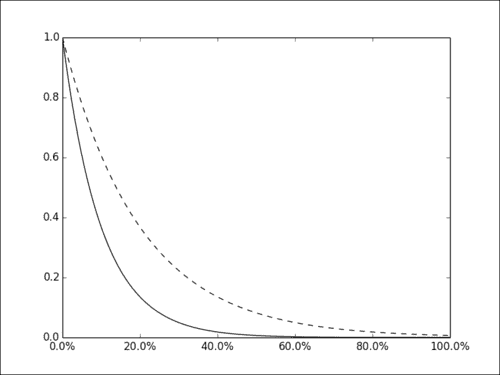

在此示例中，滴答是由自定义函数`make_label`生成的。 此函数将刻度的坐标作为输入并生成字符串。 在这里，一个百分比。 无论 matplotlib 决定显示多少滴答声，我们都可以为其生成正确的标签。 这比给出固定的字符串列表更加灵活。 这里唯一的新东西是`FuncFormatter`，它是将函数作为参数的格式化程序。

将生成标签的实际任务委派给函数的这种方法称为**委托** 。 我们的代表是`make_label`。 这是一种美丽的编程技术。 假设我们要显示每个刻度的日期。 这可以使用标准的 Python 时间和日期函数来完成：

```py
import numpy as np
import datetime
import matplotlib.pyplot as plt
import matplotlib.ticker as ticker
start_date = datetime.datetime(1998, 1, 1)

def make_label(value, pos):
  time = start_date + datetime.timedelta(days = 365 * value)
  return time.strftime('%b %y')

ax = plt.axes()
ax.xaxis.set_major_formatter(ticker.FuncFormatter(make_label))

X = np.linspace(0, 1, 256)
plt.plot(X, np.exp(-10 * X), c = 'k')
plt.plot(X, np.exp(-5 * X), c = 'k', ls = '--')

labels = ax.get_xticklabels()
plt.setp(labels, rotation = 30.)
plt.show()
```

前面的代码提供以下输出：

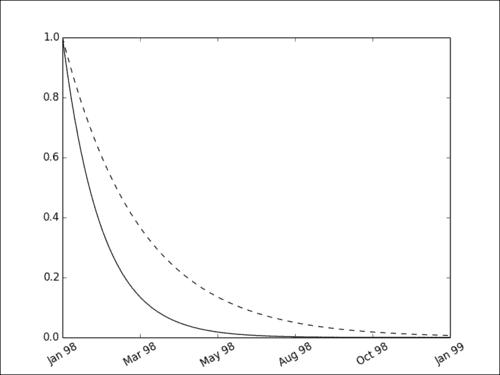

现在，每个刻度显示为以人类可读的格式设置的日期。 该方法与我们之前使用的方法相同：我们使用`FuncFormatter`。 在标签生成函数中，借助`datetime`标准模块，我们将刻度的位置转换为日期。 在这里，我们将`[0, 1]`范围内的值映射到 1998 年。`datetime`模块还提供了强大的格式化函数`strftime`，我们可以使用它来生成标签本身。