# 四、处理图形

在本章中，我们将介绍：

*   合并多个图形
*   均等缩放两个轴
*   设定轴范围
*   设定长宽比
*   插入子图
*   使用对数刻度
*   使用极坐标

## 简介

设计科学的绘图包是一项艰巨的任务-涉及的需求极为多样化。 一方面，理想情况下，只需很少的编码和摆弄就可以创建任何一种图形。 另一方面，我们希望能够自定义图形的任何方面。 这两个目标是截然相反的。 matplotlib 在这两个目标之间提供了罕见的平衡。 在本章中，我们将探讨修改库存数据基本方面的方法，例如更改所使用的坐标系。

## 合并多个图形

在检查某些数据时，我们可能希望同时查看它的多个方面。 例如，利用来自一个国家的人口统计数据，我们希望看到男性/女性年龄金字塔，财富分配和每年的人口规模是三个不同的图形。 matplotlib 提供了将多个图形组合在一起的可能性。 从 1.2 版开始，用于此的 API 确实非常方便。 在本秘籍中，我们将了解如何将多个图形组合在一起。

### 操作步骤

将使用和`pyplot.subplot2grid()`函数，如下所示：

```py
import numpy as np
from matplotlib import pyplot as plt

T = np.linspace(-np.pi, np.pi, 1024)

grid_size = (4, 2)

plt.subplot2grid(grid_size, (0, 0), rowspan = 3, colspan = 1)
plt.plot(np.sin(2 * T), np.cos(0.5 * T), c = 'k')

plt.subplot2grid(grid_size, (0, 1), rowspan = 3, colspan = 1)
plt.plot(np.cos(3 * T), np.sin(T), c = 'k')

plt.subplot2grid(grid_size, (3, 0), rowspan=1, colspan=3)

plt.plot(np.cos(5 * T), np.sin(7 * T), c= 'k')

plt.tight_layout()
plt.show()
```

绘制了三个图形，将图形分为三个区域，如下所示：

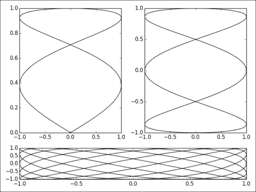

### 工作原理

`pyplot.subplot2grid()`之后的想法是定义 R 行和 C 列的网格。 然后，我们可以将图形渲染到该网格的矩形补丁。

`pyplot.subplot2grid()`函数具有四个参数：

*   第一个参数是作为元组传递的网格的行数和列数。 如果我们想要一个由`R`行和`C`列组成的网格，我们将传递`(R, C)`。
*   第二个参数是网格中的行和列坐标，也作为元组传递。
*   可选参数`rowspan`定义图形将跨越多少行。
*   可选参数`colspan`定义图形将跨越多少列。

一旦调用`pyplot.subplot2grid()`，对`pyplot`的进一步调用将在指定的矩形区域内定义图形。 为了在另一个区域渲染另一个图形，我们再次调用`pyplot.subplot2grid()`。

在示例脚本中，我们定义了`2 x 4`的网格。 前两个数字跨越 1 列和 3 行，因此每个填充几乎一整列。 第三个数字跨越 2 列，但只有 1 行，填充了底行。 描述完所有附图后，我们将其称为`pyplot.tight_layout()`。 此命令要求 matplotlib 打包所有图形，以使它们彼此不重叠。

### 更多

我们已经看到`pyplot.title()`在图形上添加了标题。 在下面的示例中，我们使用`pyplot.title()`为每个子图赋予标题：

```py
import numpy as np
from matplotlib import pyplot as plt

def get_radius(T, params):
  m, n_1, n_2, n_3 = params
  U = (m * T) / 4

  return (np.fabs(np.cos(U)) ** n_2 + np.fabs(np.sin(U)) ** n_3) ** (-1\. / n_1)

grid_size = (3, 4)
T = np.linspace(0, 2 * np.pi, 1024)

for i in range(grid_size[0]):
  for j in range(grid_size[1]):
    params = np.random.random_integers(1, 20, size = 4)
    R = get_radius(T, params)

    axes = plt.subplot2grid(grid_size, (i, j), rowspan=1, colspan=1)
    axes.get_xaxis().set_visible(False)
    axes.get_yaxis().set_visible(False)

    plt.plot(R * np.cos(T), R * np.sin(T), c = 'k')
    plt.title('%d, %d, %d, %d' % tuple(params), fontsize = 'small')

plt.tight_layout()
plt.show()
```

下图包含 12 个图形，每个图形都有自己的标题：

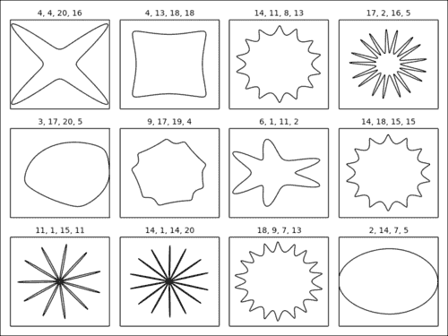

`pyplot.title()`函数为一个子图提供标题。 如果整个图形需要一个标题，则应使用`pyplot.suptitle()`，其中`suptitle`代表超级标题。

#### 合并图形的另一种方法

这里介绍的子图机制相当笼统。 它使我们可以创建复杂的布局。 如果我们只需要在一行或一列中包含几个数字，则可以使用更简单的代码，如下所示：

```py
import numpy as np
from matplotlib import pyplot as plt

T = np.linspace(-np.pi, np.pi, 1024)

fig, (ax0, ax1) = plt.subplots(ncols =2)
ax0.plot(np.sin(2 * T), np.cos(0.5 * T), c = 'k')
ax1.plot(np.cos(3 * T), np.sin(T), c = 'k')

plt.show()
```

只需调用一次`pyplot.subplots()`，我们就创建了两个彼此相邻的子图，如下图所示：

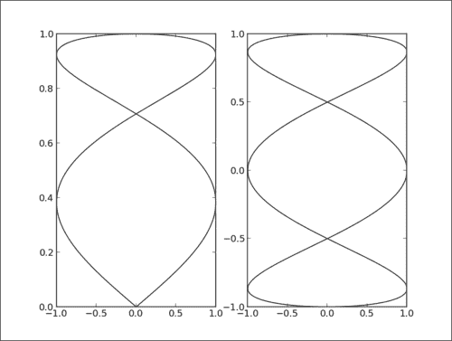

`pyplot.subplot()`函数具有两个可选参数`ncols`和`nrows`，并将返回带有`ncols` * `nrows`实例的`Axes`的`Figure`对象。 `Axes`实例通过`nrows`行布置在`ncols`列的网格中。 这使得网格布局非常容易创建。

## 均等缩放两个轴

默认情况下，matplotlib 将对图形的两个轴使用不同的比例。 在本秘籍中，我们将了解如何对图形的两个轴使用相同的比例。

### 操作步骤

要完成，我们需要使用`pyplot` API 和`Axes`对象，如以下代码所示：

```py
import numpy as np
import matplotlib.pyplot as plt
T = np.linspace(0, 2 * np.pi, 1024)

plt.plot(2\. * np.cos(T), np.sin(T), c = 'k', lw = 3.)
plt.axes().set_aspect('equal')

plt.show()
```

前面的脚本用其实际的长宽比绘制了一个椭圆，如下所示：

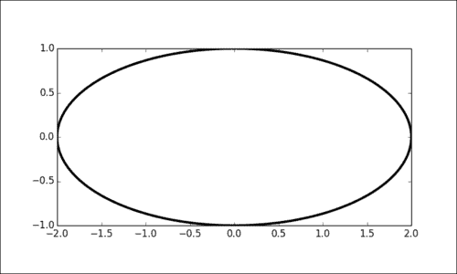

### 工作原理

在此示例中，我们显示一个椭圆，其中长轴是短轴长度的两倍。 实际上，渲染的椭圆遵循这些比例。

`pyplot.axes()`函数返回`Axes`对象的实例，该对象负责轴域。 `Axes`实例具有`set_aspect`方法，我们将其设置为`'equal'`。 现在，两个轴使用相同的比例。 如果我们未设置相同的方面，则该图看起来会有所不同。

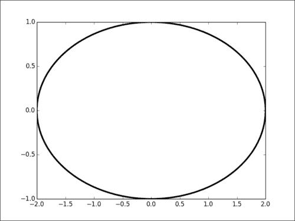

上图仍是椭圆形，但长宽比变形。

## 设置轴范围

默认情况下，matplotlib 将在两个轴上查找数据的最小值和最大值，并将其用作绘制数据的范围。 但是，有时最好手动设置此范围，以更好地了解数据的极值。 在本秘籍中，我们将了解如何设置轴范围。

### 操作步骤

`pyplot` API 提供了直接设置一个轴范围的函数，如下所示：

```py
import numpy as np
import matplotlib.pyplot as plt
X = np.linspace(-6, 6, 1024)

plt.ylim(-.5, 1.5)
plt.plot(X, np.sinc(X), c = 'k')
plt.show()
```

前面的脚本绘制了曲线。 与默认设置相反，该图形不能完美地拟合曲线。 我们在曲线的上部有一些空间，如下图所示：

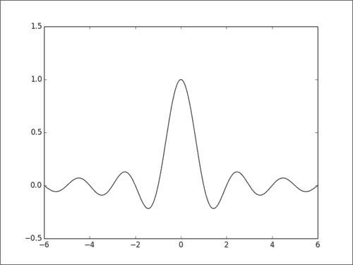

### 工作原理

`pyplot.xlim()`和`pyplot.ylim()`参数允许我们分别控制 *x* 轴和 *y* 轴的范围。 这些参数是最大值和最小值。

## 设置长宽比

在为期刊出版物或网站准备图形时，可能需要一个具有特定长宽比的图形。 在本秘籍中，我们将看到如何控制图形的长宽比。

### 操作步骤

`pyplot` API 提供了一种设置自定义长宽比的简单方法，如下所示：

```py
import numpy as np
import matplotlib.pyplot as plt

X = np.linspace(-6, 6, 1024)
Y1, Y2 = np.sinc(X), np.cos(X)

plt.figure(figsize=(10.24, 2.56))
plt.plot(X, Y1, c='k', lw = 3.)
plt.plot(X, Y2, c='.75', lw = 3.)

plt.show()
```

下图的长宽比与我们默认情况下的长宽比有很大不同：

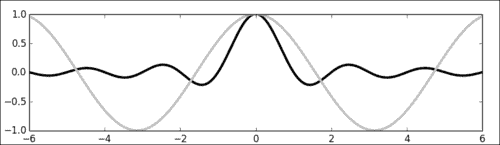

### 工作原理

我们使用`pyplot.figure()`函数，该函数创建一个新的`Figure`实例。 `Figure`对象整体上代表图形。 通常，该对象是在幕后隐式创建的。 但是，通过显式创建对象，我们可以控制图形的各个方面，包括其长宽比。 `figsize`参数允许我们指定其大小。 在此示例中，我们将水平尺寸设置为垂直尺寸的四倍，使其长宽比为 4:1。

## 插入子图

插入一个小的嵌入式图形可以帮助显示图形的细节，或更一般而言，可以强调图形的特定部分。 在本秘籍中，我们将看到如何在图形中插入子图形。

### 操作步骤

matplotlib 允许我们在图形的任何部分中创建子区域，并将图形分配给该子区域。 在以下示例中，创建了一个子区域以显示曲线的详细信息：

```py
import numpy as np
from matplotlib import pyplot as plt

X = np.linspace(-6, 6, 1024)
Y = np.sinc(X)

X_detail = np.linspace(-3, 3, 1024)
Y_detail = np.sinc(X_detail)

plt.plot(X, Y, c = 'k')

sub_axes = plt.axes([.6, .6, .25, .25])
sub_axes.plot(X_detail, Y_detail, c = 'k')
plt.setp(sub_axes)

plt.show()
```

该子区域显示在该图的右上方。

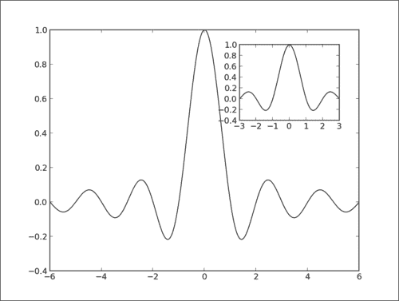

### 工作原理

我们首先从在图上创建一个子区域，如下所示：

```py
sub_axes = plt.axes([.6, .6, .25, .25])
```

该区域以图形坐标表示； 也就是说，`(0, 0)`是整个图形的左下角，`(1, 1)`是整个图形的右上角。 该子区域由四个值定义：区域左下角的坐标及其尺寸。

定义子区域后，我们将在其中创建图形的`Axes`实例。 然后，我们需要在上调用实例上的`pyplot.setp()`，如下所示：

```py
plt.setp(sub_axes)
```

请注意，可以创建多少个子区域没有限制。

## 使用对数刻度

当可视化很大范围内变化的数据时，对数刻度使我们能够可视化否则很难看到的变化。 在本秘籍中，我们将向您展示如何操纵图形的缩放系统。

### 操作步骤

有几种方法可以将设置为对数刻度。 此处完成的方式适用于任何类型的图形，而不仅适用于线形图。 在下面的示例中，我们设置了对数刻度，该刻度将应用于所有绘图元素：

```py
import numpy as np
import matplotlib.pyplot as plt

X = np.linspace(1, 10, 1024)

plt.yscale('log')
plt.plot(X, X, c = 'k', lw = 2., label = r'$f(x)=x$')
plt.plot(X, 10 ** X, c = '.75', ls = '--', lw = 2., label = r'$f(x)=e^x$')
plt.plot(X, np.log(X), c = '.75', lw = 2., label = r'$f(x)=\log(x)$')

plt.legend()
plt.show()
```

下图显示了几条曲线，垂直轴使用对数刻度：

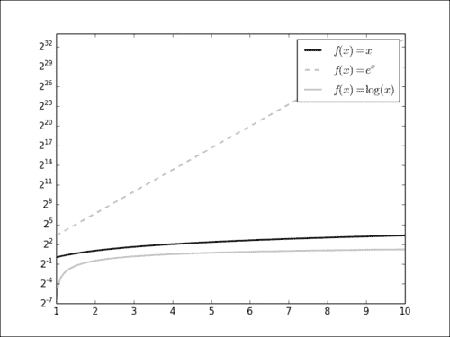

### 工作原理

在此示例中，显示三个函数， *y* 轴遵循对数刻度。 所有工作都由`pyplot.yscale()`完成，我们在其中传递`'log'`来指定我们想要的比例尺类型。 同样，我们将使用`plot.xscale()`至在 *x* 轴上获得相同的结果。 可以很简单地创建对数-对数图，如下所示：

```py
plt.xscale('log')
plt.yscale('log')
```

对数底数默认为 10，但可以使用可选参数`basex`和`basey`进行更改。

### 更多

使用对数刻度在放大很大范围数据上的一个小范围上也很有用，如以下示例所示：

```py
import numpy as np
import matplotlib.pyplot as plt

X = np.linspace(-100, 100, 4096)

plt.xscale('symlog', linthreshx=6.)
plt.plot(X, np.sinc(X), c = 'k')

plt.show()
```

曲线的中心部分（`[-6, 6]`范围）以线性标尺显示，而其他部分以对数标尺显示在下图中：

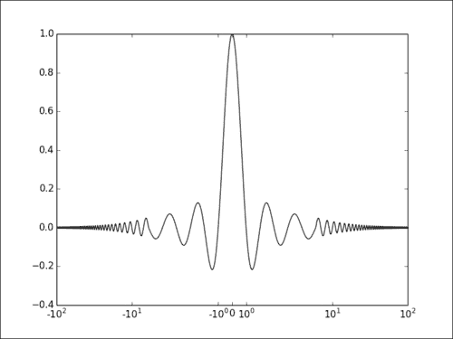

在这里，我们将`'symlog'`作为参数`pyplot.xscale()`的参数，该参数是以 0 为中心的对称对数刻度。通过设置`'linthreshx=6.'`，我们指定在`[-6, 6]`范围内，我们希望线性和对数刻度在这个范围。 这样，我们就可以在一个范围内获得详细的视图，同时仍然可以查看很大范围的剩余数据。

## 使用极坐标

一些现象具有角性质。 一个例子就是扬声器的功率，具体取决于我们从中测量扬声器的角度。 极坐标是表示此类数据的自然选择。 此外，可以方便地在极坐标中绘制诸如年度或每日统计数据之类的循环数据。 在本秘籍中，我们将了解如何使用极坐标。

### 操作步骤

让我们绘制一个简单的极坐标曲线，如下所示：

```py
import numpy as np
import matplotlib.pyplot as plt

T = np.linspace(0 , 2 * np.pi, 1024)
plt.axes(polar = True)
plt.plot(T, 1\. + .25 * np.sin(16 * T), c= 'k')

plt.show()
```

下图显示了极坐标图的特殊布局：

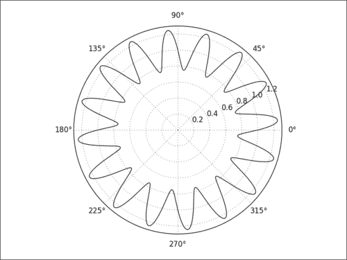

### 工作原理

正如我们之前看到的，`pyplot.axes()` 显式创建一个`Axes`实例，该实例允许进行一些自定义设置。 只需使用可选的`polar`参数即可设置极坐标投影。 请注意图例如何适应投影。

### 更多

绘制曲线可能是极投影的最常见用法。 但是，我们可以使用其他任何类型的图，例如条形图和显示形状。 例如，使用极坐标投影和多边形，您可以绘制雷达图。 使用以下代码执行此操作：

```py
import numpy as np
import matplotlib.patches as patches
import matplotlib.pyplot as plt
ax = plt.axes(polar = True)

theta = np.linspace(0, 2 * np.pi, 8, endpoint = False)
radius = .25 + .75 * np.random.random(size = len(theta))
points = np.vstack((theta, radius)).transpose()

plt.gca().add_patch(patches.Polygon(points, color = '.75'))
plt.show()
```

下图显示了我们用极坐标定义的多边形：

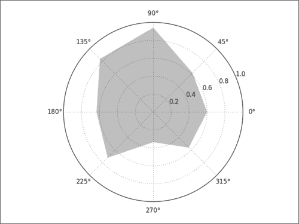

注意，多边形的坐标是到原点的角度和距离。 我们不需要执行从极坐标到直角坐标的显式转换。